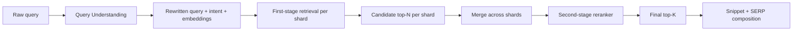

# Google Search Deep Dive — Ranking Signals (PageRank, BM25, Query Understanding)

**Date:** 2026-04-30 | **Updated:** 2026-04-30
**Tags:** `system-design` `case-study` `google-search` `deep-dive` `ranking` `pagerank`

## Table of Contents

- [Summary](#summary)
- [Overview — The Two-Stage Ranking Pipeline](#overview--the-two-stage-ranking-pipeline)
- [PageRank — Random Surfer on the Link Graph](#pagerank--random-surfer-on-the-link-graph)
  - [The Original Formula (Page & Brin 1998)](#the-original-formula-page--brin-1998)
  - [Random Surfer Intuition](#random-surfer-intuition)
  - [Power Iteration and Convergence](#power-iteration-and-convergence)
  - [Damping Factor `d ≈ 0.85`](#damping-factor-d--085)
  - [Dangling Nodes and Personalised PageRank](#dangling-nodes-and-personalised-pagerank)
  - [Why PageRank Alone Is Not Enough](#why-pagerank-alone-is-not-enough)
- [BM25 and TF-IDF — Term-Document Match](#bm25-and-tf-idf--term-document-match)
  - [TF-IDF — The Predecessor](#tf-idf--the-predecessor)
  - [BM25 — Robertson & Walker 1994](#bm25--robertson--walker-1994)
  - [Why `k1` and `b` Matter](#why-k1-and-b-matter)
  - [BM25F — Per-Field Variants](#bm25f--per-field-variants)
- [Query Understanding — Spell, Stem, Synonyms, Intent](#query-understanding--spell-stem-synonyms-intent)
- [BERT and MUM — Semantic Matching at Web Scale](#bert-and-mum--semantic-matching-at-web-scale)
- [RankBrain — Learning the Tail (2015)](#rankbrain--learning-the-tail-2015)
- [Learning to Rank — LambdaMART and Neural Rerankers](#learning-to-rank--lambdamart-and-neural-rerankers)
- [Spam Signals and Helpful Content](#spam-signals-and-helpful-content)
- [Freshness Boosts — Query Deserves Freshness](#freshness-boosts--query-deserves-freshness)
- [Personalization — Region, Language, Logged-In Signals](#personalization--region-language-logged-in-signals)
- [Anti-Patterns](#anti-patterns)
- [Related](#related)
- [References](#references)

## Summary

Google's ranking layer is a two-stage funnel: a cheap **first-stage retrieval** scores tens of thousands of candidate documents per shard with closed-form formulas (BM25 over the query terms, plus a small linear combination of static priors like PageRank, anchor-text match, freshness, and spam penalties), then a **second-stage reranker** — historically gradient-boosted trees (LambdaMART), today transformer-based neural rerankers — scores the merged top-N candidates with hundreds of features. The first stage exists because BM25 is essentially free per posting and bounds the candidate set; the second stage exists because no closed form captures what users actually click on.

The signals fall into three categories. **Query-independent priors** (PageRank, site authority, spam scores, freshness for recently-modified docs) are computed in batch and stored on the doc record. **Query-document match signals** (BM25, BM25F per field, anchor-text BM25, semantic embedding similarity) are computed at query time from postings. **Query-understanding outputs** (spell-corrected query, expanded synonyms, intent class, BERT/MUM embeddings) are computed once per query before retrieval and shape both the retrieval set and the reranker's feature vector.

The famous primitives are **PageRank** (Page & Brin 1998 — eigenvector centrality on the link graph, biased random surfer with damping `d ≈ 0.85`) and **BM25** (Robertson & Walker 1994 — TF-IDF with a saturating term-frequency curve and length normalisation). The modern primitives are **BERT** (announced for ranking in October 2019; transformer-based bidirectional language model used to encode queries and passages), **MUM** (announced May 2021; multitask multimodal multilingual successor), and **RankBrain** (2015; the first ML system Google publicly admitted was in the ranking core, designed to handle the long tail of queries never seen before). The unifying principle: ranking is the linear-algebra problem of scoring `(query, document)` pairs, and Google's twenty-five-year history is a story of progressively richer feature vectors and progressively smarter models for combining them.

## Overview — The Two-Stage Ranking Pipeline

Web ranking is a Cascade. Each stage trades cost for accuracy:



| Stage | Input | Output | Cost per query | Examples of signals |
|-------|-------|--------|----------------|---------------------|
| Query understanding | Raw query string | Rewritten query, intent, embeddings | < 5 ms | Spell, synonyms, BERT/MUM encoding |
| First-stage retrieval | Postings on each leaf shard | Top-N candidates per shard | ~50 ms per shard | BM25, PageRank, anchor BM25, spam, freshness |
| Second-stage reranker | Merged candidate set | Re-ordered top-K | ~30 ms | LambdaMART, neural reranker, click priors |
| SERP composition | Top-K + verticals | Final layout | ~20 ms | Snippet, ads, knowledge panel |

The first-stage formula in compact form (matching the parent doc):

```text
score_first(d, q) = sum over q-terms t of BM25(d, t)
                  + w_pr      * log(1 + pagerank(d))
                  + w_quality * quality_score(d)
                  - w_spam    * spam_score(d)
                  + w_fresh   * freshness_boost(d, intent)
                  + w_anchor  * anchor_text_match(d, q)
```

Each leaf shard executes this in `O(|q| × postings_per_term)` with skip-pointer-accelerated intersection. The output is a per-shard top-N (typically a few hundred to a thousand) that is then merged by score and handed to the reranker. The architectural reason for two stages — rather than running the reranker over the full corpus — is **cost**: the reranker is two-to-four orders of magnitude more expensive per document than BM25, so it must be confined to a candidate set that's already pre-filtered to the most likely matches.

## PageRank — Random Surfer on the Link Graph

PageRank was the original differentiator of Google over the 1996-era keyword-only search engines (AltaVista, Lycos, Excite, Infoseek). The insight was that the web's link structure encodes a collective judgment about which pages are important: **a page is important if important pages link to it**, recursively. This is eigenvector centrality on the directed graph of hyperlinks.

### The Original Formula (Page & Brin 1998)

From Page, Brin, Motwani, and Winograd's 1998 Stanford paper *"The PageRank Citation Ranking: Bringing Order to the Web"*:

```text
PR(A) = (1 − d) / N  +  d * Σ ( PR(T_i) / C(T_i) )
```

Where:
- `PR(A)` is the PageRank of page A.
- `T_1, T_2, …, T_n` are the pages linking to A (in-neighbours).
- `C(T_i)` is the number of out-links from page `T_i`.
- `d` is the damping factor, conventionally `0.85`.
- `N` is the total number of pages in the graph.

The formula says: A's importance is a constant baseline `(1 − d) / N` (the "teleport" probability, so every page has at least some mass), plus a discounted sum of importance flowing in from pages that link to it, where each linking page divides its importance equally among its out-links.

The `(1 − d) / N` baseline is the version used in the **original 1998 paper**. Some later expositions write it as `(1 − d)` without the `/N` normalisation; both are valid PageRank definitions but produce vectors that differ by a constant factor. The `/N` form keeps the resulting vector summing to 1 (a probability distribution), which is the modern convention.

### Random Surfer Intuition

Page and Brin gave the formula a generative interpretation. Imagine a web surfer who, at every step:

1. With probability `d` (≈ 85%), clicks a uniformly random out-link from the current page.
2. With probability `1 − d` (≈ 15%), gets bored and teleports to a uniformly random page.

`PR(A)` is the long-run probability that the surfer is currently looking at page A. The teleport probability is what guarantees the chain is **ergodic** — without it, the surfer can get trapped in cycles or sinks (pages with no out-links) and the stationary distribution doesn't exist.

This interpretation makes PageRank intuitively a **stationary distribution** of a Markov chain whose transition matrix is the link matrix mixed with the uniform teleport matrix:

```text
M = d · A + (1 − d) · (1/N) · 1·1ᵀ
```

Where `A` is the column-stochastic link matrix (column `j` is the distribution of outgoing links from page `j`). PageRank is the principal left eigenvector of `M` — the eigenvector with eigenvalue 1, which exists and is unique because `M` is a positive stochastic matrix (Perron-Frobenius theorem).

### Power Iteration and Convergence

You don't compute the eigenvector by inverting a matrix — that's `O(N³)` and the web has tens of trillions of nodes. You use **power iteration**:

```python
def pagerank(adjacency, num_pages, d=0.85, tol=1e-8, max_iter=100):
    """
    adjacency: dict[node -> list of out-neighbours]
    Returns dict[node -> PageRank].
    """
    pr = {node: 1.0 / num_pages for node in adjacency}
    out_count = {node: len(neighbours) for node, neighbours in adjacency.items()}

    for iteration in range(max_iter):
        new_pr = {node: (1 - d) / num_pages for node in adjacency}
        for node, neighbours in adjacency.items():
            if out_count[node] == 0:
                # Dangling — distribute mass uniformly (teleport-only)
                share = pr[node] / num_pages
                for target in adjacency:
                    new_pr[target] += d * share
            else:
                share = pr[node] / out_count[node]
                for target in neighbours:
                    new_pr[target] += d * share

        delta = sum(abs(new_pr[n] - pr[n]) for n in adjacency)
        pr = new_pr
        if delta < tol:
            break

    return pr
```

Power iteration converges geometrically — the error after `k` iterations falls as `d^k`. With `d = 0.85`, you reach 1e-8 in roughly `log(1e-8) / log(0.85) ≈ 110` iterations. In production, Google parallelises this over thousands of machines using MapReduce-style batch jobs (the original 2003 MapReduce paper used PageRank as one of its motivating examples).

The full web graph today has on the order of `10¹³` documents and `10¹⁴`–`10¹⁵` edges. A single iteration is one pass over the edge list — embarrassingly parallel by source node. The total compute is `iterations × edges`, which at web scale is petabytes of I/O per refresh. PageRank is recomputed on a cadence measured in days (rolling), with affected subgraphs refreshed incrementally as the crawler discovers new links.

### Damping Factor `d ≈ 0.85`

The choice of `d = 0.85` is from the original paper and has held up empirically:

- **Smaller `d`** (e.g., 0.5) — the surfer teleports often; PageRank flattens toward uniform; the link signal is weak. Convergence is fast (`log(tol)/log(d)` iterations).
- **Larger `d`** (e.g., 0.95) — the surfer rarely teleports; PageRank concentrates heavily on hubs; the link signal is strong but spider traps and rank sinks dominate. Convergence is slow.
- **`d = 0.85`** — a workable compromise. Empirically corresponds to a surfer who clicks ~6 links before teleporting (`E[clicks] = d / (1−d) = 5.67`).

The constant `0.85` has no theoretical derivation — it's an engineering choice that produces a stationary distribution that matches human intuition about which pages are important.

### Dangling Nodes and Personalised PageRank

**Dangling nodes** are pages with no out-links — PDFs, image pages, terminal pages. In the strict formulation, mass flowing into a dangling node has nowhere to go and the iteration loses probability mass. The fix is to treat dangling nodes as if they teleport uniformly: their PageRank is distributed across all pages with weight `1/N` rather than across out-links.

**Personalised PageRank** replaces the uniform teleport vector `(1/N)·1` with a non-uniform vector `v`. If `v` puts all its mass on a single seed page `s`, the result is "PageRank as seen from `s`" — a measure of how reachable each page is from `s` via random walks. Topic-Sensitive PageRank (Haveliwala 2002) precomputes one PageRank vector per topic (sports, news, technology, …) and combines them at query time based on the query's topical classification. Modern Google does not publicly disclose whether it uses topic-sensitive PageRank, but the technique is in the academic toolbox.

### Why PageRank Alone Is Not Enough

PageRank ranks pages purely by link-graph centrality, with no awareness of what the user searched for. A SERP for "horse riding equipment" ranked purely by PageRank would surface `cnn.com`, `nytimes.com`, and `wikipedia.org` — high-PageRank pages with nothing to do with horse riding. PageRank is a **prior** over document quality; the **likelihood** of a query-document match comes from BM25 (or its learned successors). The first-stage formula combines both:

```text
score_first(d, q) ∝ BM25(d, q) + w_pr * log(1 + pagerank(d)) + …
```

The `log(1 + pagerank)` transformation compresses the dynamic range — PageRank values span many orders of magnitude (Wikipedia's homepage vs an obscure blog post), and using raw PageRank would let high-PR sites dominate regardless of query match. Logarithmic compression is the standard fix.

PageRank was the **first** signal that made Google measurably better than competitors. By 2010, link analysis had grown into a family of signals (TrustRank for spam, HITS for hubs/authorities, topic-sensitive PageRank, anchor text incorporation, link velocity for freshness). Modern Google has explicitly stated that hundreds of signals are in the ranking mix, and PageRank is one of them — important historically, still useful, but not dominant.

## BM25 and TF-IDF — Term-Document Match

PageRank tells you which pages are important. BM25 tells you which pages **match the query**. The two combine to answer "what's the best page about X?": BM25 finds pages about X, PageRank ranks them by importance.

### TF-IDF — The Predecessor

Before BM25, the standard term-document scoring was **TF-IDF** (term frequency × inverse document frequency):

```text
tfidf(t, d) = tf(t, d) × idf(t)
            = count(t in d) × log(N / df(t))
```

Where `df(t)` is the number of documents containing term `t`, and `N` is the total document count. The intuition:

- **TF** — a term appearing more often in a document is more relevant to that document.
- **IDF** — a term appearing in fewer documents is more discriminative; "the" is in every document and has near-zero IDF, while "ornithopter" is in few documents and has high IDF.

TF-IDF is fast, intuitive, and was the workhorse of pre-2000 IR. Its weaknesses:

1. **Linear TF growth.** A document mentioning "horse" 100 times scores 100× higher than one mentioning it once — but in practice the 100th mention adds vanishing relevance compared to the 1st.
2. **No length normalisation.** Long documents accidentally have higher TF for every term simply by being longer.
3. **No tunable saturation.** You can't dial how aggressively to dampen high-TF documents.

BM25 fixes all three.

### BM25 — Robertson & Walker 1994

BM25 was developed by Stephen Robertson, Steve Walker, and colleagues at City University London for the TREC-3 conference (Robertson, Walker, Jones, Hancock-Beaulieu, Gatford 1994). It is the de facto first-stage retrieval function for nearly every modern search engine — Lucene/Elasticsearch use it by default, web search engines use it as a starting point, and academic IR research uses it as the standard baseline.

The formula:

```text
                    f(t, d) · (k1 + 1)
BM25(t, d) = IDF(t) · ─────────────────────────────────────
                    f(t, d) + k1 · (1 − b + b · |d| / avgdl)
```

Where:
- `f(t, d)` is the term frequency of `t` in document `d`.
- `|d|` is the length of document `d` (in tokens).
- `avgdl` is the average document length across the corpus.
- `k1` controls term-frequency saturation (typical `1.2–2.0`; Lucene default `1.2`).
- `b` controls length normalisation (typical `0.75`; Lucene default `0.75`).

The IDF used in BM25 is the **probabilistic** IDF:

```text
IDF(t) = log( (N − df(t) + 0.5) / (df(t) + 0.5) + 1 )
```

The `+ 1` inside the log is Lucene's smoothing convention; the original formulation used `log( (N − df(t) + 0.5) / (df(t) + 0.5) )` and could go negative for very common terms. Lucene's `+ 1` keeps IDF non-negative for every term.

The full per-query score sums over query terms:

```text
score(d, q) = Σ over t in q  BM25(t, d)
```

Multiple occurrences of the same term in the query are typically scored once — query-side TF is rarely meaningful at the lengths real search queries occur at.

### Why `k1` and `b` Matter

The **`k1` saturation knob** is the conceptual breakthrough. Look at how the term-frequency factor behaves:

```text
tf_factor(f) = f · (k1 + 1) / (f + k1 · L_norm)
```

Where `L_norm = (1 − b + b · |d| / avgdl)`. As `f → ∞`, `tf_factor → k1 + 1`. So no matter how often a term appears, the contribution is bounded by `k1 + 1`. With `k1 = 1.2`, the bound is `2.2`. This **saturating curve** matches the empirical observation: the first occurrence of "horse" tells you a lot about the document, the 100th tells you almost nothing new.

With `k1 = 0`, BM25 collapses to a binary "term is/isn't present" score — no TF information at all. With `k1 → ∞`, BM25 becomes nearly linear in TF (TF-IDF-like). The `1.2` middle ground captures most of the TF signal while saturating cleanly.

The **`b` length-normalisation knob** controls how aggressively long documents are penalised:

- `b = 0` — no length normalisation at all. Long documents dominate because they accidentally contain more of every term.
- `b = 1` — full length normalisation. A document of length `2 × avgdl` is penalised exactly as if every term occurred half as often.
- `b = 0.75` — the standard middle ground; empirically performs well across many corpora.

Why penalise length at all? Because document length correlates with topic breadth, not topic depth. A 10,000-word essay on a hundred topics is not 100× better at being "about" any one topic than a 100-word focused page. Length normalisation evens the playing field.

A worked example. Two documents, both contain "horse" once:

| Doc | length | (1 − b + b · |d|/avgdl) | tf_factor | BM25 (assuming IDF=1) |
|-----|--------|--------------------------|-----------|------------------------|
| A   | 100    | 0.25 + 0.75 · 0.1 = 0.325 | 1·2.2 / (1 + 1.2·0.325) = 1.586 | 1.586 |
| B   | 1000   | 0.25 + 0.75 · 1.0 = 1.0   | 1·2.2 / (1 + 1.2·1.0) = 1.0     | 1.0   |
| C   | 5000   | 0.25 + 0.75 · 5.0 = 4.0   | 1·2.2 / (1 + 1.2·4.0) = 0.379   | 0.379 |

Assume `avgdl = 1000`. Document A (100 tokens) is heavily preferred for the same single occurrence of "horse" because it's a focused short page, while C (5000 tokens) is penalised — its single mention of "horse" is buried in a long irrelevant document.

### BM25F — Per-Field Variants

A document is not a flat bag of terms. It has **fields**: title, body, URL, anchor text, headings. A query term matching the title is a much stronger signal than the same term matching the body. **BM25F** (Robertson, Zaragoza, Taylor 2004) extends BM25 to weight fields differently:

```text
                    Σ over fields f  w_f · f(t, d_f) / L_norm(d_f)
weighted_tf(t, d) = ─────────────────────────────────────────────
                            (the per-document weighted TF)

BM25F(t, d) = IDF(t) · weighted_tf(t, d) · (k1 + 1) / (weighted_tf(t, d) + k1)
```

In effect, you compute a per-field length-normalised TF, weight each field (title much higher than body), sum into a single virtual TF, then run the BM25 saturation curve on the combined value. Field weights are tuned empirically — Lucene/Solr use parameters like `title^4 body^1 url^2` to express that title matches are worth 4× body matches.

Modern web search uses BM25F (or close variants) for the first stage, with separate per-field IDFs and field weights baked into the query rewriter. **Anchor text** — the text other pages use to link to a document — is treated as its own field with high weight, because it captures how the rest of the web describes the page in their own words. Anchor text is one of the strongest off-page signals; it's why pages with rich, descriptive inbound links rank well even if their own text is sparse.

## Query Understanding — Spell, Stem, Synonyms, Intent

Query understanding is the pre-processor that runs before retrieval. The output is a **rewritten query** (and structured metadata: intent class, entities, embeddings) that's what actually hits the index. Five sub-tasks:

**1. Spell correction.** "horse riding equiptment" → "horse riding equipment". Trained on query logs: pairs of (typo, correction) where the correction is what users actually re-typed after seeing zero or low-quality results from the typo. The corrector is a noisy-channel model — `P(correction | typo) ∝ P(typo | correction) · P(correction)` — where the language model `P(correction)` is the unigram or bigram distribution over query terms and `P(typo | correction)` is an edit-distance model with weights from observed typo statistics. Confident corrections are silently applied; less confident ones trigger the "Showing results for X — search instead for original" UX.

**2. Stemming and lemmatisation.** "running shoes" should match "runner shoe" and "ran". Stemming applies suffix-stripping rules (Porter, Snowball) — "running" → "run", "shoes" → "shoe". Lemmatisation is dictionary-based and more accurate but slower. Web search engines historically used aggressive stemming on the index side (the index stores stemmed terms) and matching stems on the query side.

**3. Synonym expansion.** "automobile" should also retrieve "car". Synonyms come from manually curated lists, embedding-derived nearest-neighbour clusters, and click-graph co-clicks (queries that lead to clicks on the same set of docs are likely synonymous). Expansion can be applied at query time (rewriting "automobile" → "automobile OR car") or at index time (storing both forms in the postings).

**4. Entity recognition.** "barack obama president" → entity = `Q76` (Wikidata ID for Barack Obama) + role intent "president". Entity-linked queries trigger knowledge-graph panels and, in the ranker, allow features like "doc mentions entity Q76" to fire even when the surface-form text doesn't match exactly.

**5. Intent classification.** Three coarse classes (Broder 2002):
- **Navigational** — "facebook login", "youtube" — user wants a specific known site. The ranker should heavily favour the canonical destination.
- **Informational** — "how do inverted indexes work" — user wants to learn. Favour authoritative content (Wikipedia, well-cited sources) and rich snippets.
- **Transactional** — "buy iphone 15" — user wants to do something. Favour product/shopping pages and surface a shopping carousel.

Modern intent classifiers use BERT-class encoders trained on click logs labelled with the post-click action (navigated to a single dominant URL → navigational; spent time on Wikipedia-class doc → informational; clicked through to a transactional page → transactional). Intent shapes both retrieval (which corpus to favour) and SERP composition (which verticals to surface).

The output of query understanding is a structured object:

```json
{
  "raw_query": "horse riding equiptment",
  "rewritten_query": "horse riding equipment",
  "spelling_correction": {"applied": true, "confidence": 0.97},
  "stems": ["hors", "ride", "equip"],
  "expansions": ["tack", "saddle", "bridle"],
  "entities": [{"surface": "horse riding", "id": "Q47269"}],
  "intent": {"class": "transactional", "confidence": 0.71},
  "embedding": [0.123, -0.456, ...]
}
```

This object travels with the query through retrieval and reranking, providing features at each stage.

## BERT and MUM — Semantic Matching at Web Scale

BM25 is a bag-of-words model. It can't tell that "young person looking for first job" and "junior position seeking entry-level role" mean nearly the same thing — they share zero terms. For long, natural-language queries, this is the failure mode that bag-of-words approaches cannot fix without semantic understanding.

**BERT** (Bidirectional Encoder Representations from Transformers; Devlin et al. 2018) was a transformer-based language model that learned context-aware embeddings for words and sentences. Pandu Nayak, Google's VP of Search, announced in October 2019 that BERT was being used in ranking — Google's first public acknowledgement of a transformer in the ranking core. The framing was that BERT helps with "1 in 10 searches" — specifically, longer conversational queries where word-order and prepositions carry meaning that bag-of-words approaches lose.

BERT's role in ranking is twofold:

1. **Query understanding.** BERT encodes the query into a fixed-length vector (typically 768-dim from BERT-base; smaller distilled models for production latency). This vector becomes a feature for the reranker — the dual-encoder similarity `<q_vec, d_vec>` is one of the most predictive features in modern rankers.
2. **Passage scoring.** For top candidates, BERT can score the `(query, passage)` pair directly via a cross-encoder — concatenating query and passage into a single input and outputting a relevance score. Cross-encoders are more accurate than dual-encoders but two-to-three orders of magnitude more expensive, so they're confined to the very top of the candidate set.

The dual-encoder vs cross-encoder trade-off is fundamental:

| Approach | Cost per (query, doc) | Accuracy | Where used |
|----------|------------------------|----------|------------|
| Dual-encoder | 0 at retrieval (precomputed doc vectors) + 1 query encode | Lower | First-stage retrieval, many candidates |
| Cross-encoder | 1 forward pass per pair | Higher | Reranking, top few hundred candidates |

**MUM** (Multitask Unified Model; announced May 2021) is BERT's successor. The headline differences:

- **Multimodal** — handles text and images jointly; "what plant is this?" with an attached image works in a single query.
- **Multilingual** — trained on 75 languages simultaneously, so a query in one language can retrieve content in another and the user gets it back in their own language.
- **Multitask** — a single model handles ranking, summarisation, translation, and other tasks, sharing parameters.
- **1000× more powerful than BERT** (Google's marketing claim, referring to compute and parameter count).

MUM's deployment in ranking has been less precisely disclosed than BERT's. Google has confirmed MUM is used for specific applications (vaccine information lookup; complex multi-hop questions) and for understanding context across language barriers. The exact contribution to mainline web ranking is not public.

The pattern is consistent: each new transformer generation pushes deeper into the ranking pipeline. BERT started as a query-understanding feature; over time it's expanded into passage scoring and reranking. MUM and successors continue that trajectory.

## RankBrain — Learning the Tail (2015)

In October 2015, Google publicly disclosed **RankBrain**, the first machine-learning system known to be in the ranking core. The motivation: 15% of Google's daily queries are queries that have never been seen before. For those tail queries, there's no click history, no query-specific tuning, no pre-computed features. RankBrain's job was to interpret these queries by mapping them to vectors and finding similar past queries whose ranking signals could be transferred.

The publicly disclosed mechanics:

1. RankBrain takes the raw query and produces a vector representation (initially via word2vec-style embeddings, later upgraded).
2. For unfamiliar queries, RankBrain finds similar known queries by vector similarity.
3. The signals learned for those similar queries are applied to the new query.

The framing in 2015 was that RankBrain was the **third most important** ranking signal, behind links (PageRank-class) and content (BM25-class). That ordering hasn't been re-confirmed since, and the public discourse has moved on to BERT and beyond, but RankBrain is widely understood to still be in the stack.

RankBrain's deeper significance is what it represented: **a learned function in the ranking core**, not just as a reranker over BM25 candidates. Pre-RankBrain, Google's ranking was a hand-tuned linear combination of signals with weights that engineers occasionally adjusted. Post-RankBrain, ML-derived features are first-class participants in the ranking calculation.

## Learning to Rank — LambdaMART and Neural Rerankers

The reranker — the second stage of the pipeline — has been a learned model since the mid-2000s. The dominant family until ~2018 was **LambdaMART** (Burges 2010), a gradient-boosted decision tree (GBDT) ranker that combines:

- **MART** — Multiple Additive Regression Trees (Friedman 2001), the GBDT framework.
- **Lambda** — the Lambda gradient (Burges 2007), a pairwise loss function defined directly on the gradient. Lambda gradients optimise ranking metrics (NDCG, MAP) that are not differentiable as written, by computing the gradient of the model's score with respect to a pairwise swap cost weighted by the change in NDCG.

Why LambdaMART won this era:

1. **Heterogeneous features.** A reranker has hundreds of features of wildly different types — boolean, integer counts, log-scale floats, embeddings. GBDTs handle all of them without preprocessing.
2. **Interpretable.** Each tree split is a human-readable feature threshold. Engineers can audit which features the model uses and how.
3. **Fast inference.** A trained ensemble of a few thousand shallow trees is microseconds to evaluate per `(query, doc)` pair.
4. **Well-tuned for ranking metrics.** The Lambda gradient explicitly optimises NDCG, the standard ranking quality metric.

Microsoft Bing's Yahoo Learning to Rank Challenge winner in 2010 was LambdaMART. Web ranking literature through the mid-2010s is dominated by LambdaMART variants.

Post-2018, **neural rerankers** have progressively replaced or augmented GBDTs. The pattern is:

1. **Dual-encoders** produce query and document embeddings; the reranker uses `<q, d>` similarity as a feature.
2. **Cross-encoders** (BERT/MUM-class) score the top candidates with full attention over `(query || doc_passage)`.
3. **Hybrid stacks** combine GBDT-over-many-features with neural dual/cross-encoder scores for the deeply-learned semantic signal.

The features that flow into the reranker are the union of:

- All first-stage signals (BM25, BM25F, PageRank, anchor BM25, freshness, spam).
- Per-field BM25 (title, body, URL, headings, anchor).
- Embedding similarities (query × doc, query × title, query × snippet).
- Click-through priors — for the (query, doc) pair, has it been clicked before? At what rate? With what dwell time?
- Site-level signals — domain authority, deduplication penalties, site quality (E-E-A-T-style aggregates: Experience, Expertise, Authoritativeness, Trustworthiness).
- Snippet-level signals — does the candidate snippet actually answer the query?
- Personalisation signals — region, language, logged-in user history (if available and consented).

The reranker output is a single calibrated score per `(query, doc)`, and the top-K by score becomes the SERP.

## Spam Signals and Helpful Content

Spam ranking is a permanent adversarial game. The spam team's signals include:

**On-page signals.**
- Keyword stuffing detection (TF distributions that look unnaturally peaked).
- Hidden text (text styled to be invisible, off-screen, or zero-font).
- Cloaking (serving different content to Googlebot than to users).
- Doorway pages (pages whose only purpose is to redirect or funnel to another).
- Auto-generated content with no human value.

**Link signals.**
- Link velocity anomalies (a sudden surge of inbound links from low-quality sources).
- Link neighbourhoods (pages in tight clusters of mutual linking, the classic link farm pattern).
- Anchor text uniformity (a thousand inbound links all using the exact same money-keyword anchor — natural links would have varied anchor distributions).
- TrustRank (Gyongyi, Garcia-Molina, Pedersen 2004) — a personalised PageRank seeded from manually-vetted trustworthy domains; pages reachable from trusted seeds are themselves trusted.

**Behavioural signals.**
- Pogo-sticking — users land on the page, immediately bounce back, and click the next result. A high pogo rate is a strong negative signal.
- Dwell time — how long users stay on the page before returning to the SERP.
- SERP click distributions — pages that get clicks but never satisfy users (high impression, low engagement) get demoted.

**Helpful Content updates.** Starting in August 2022, Google rolled out a series of "Helpful Content" updates targeting content written primarily for search engines rather than people — thin AI-generated content, content that doesn't demonstrate first-hand experience, content that fails to satisfy user intent. The classifier produces a site-wide score; sites flagged as predominantly unhelpful are demoted across all their pages, not just the offending ones. This is a step-change from per-page penalties because it treats site-level quality as a first-class signal.

The spam side of the system has its own classifiers (gradient-boosted, increasingly neural), its own training data (manual rater labels, user behavioural signals), and its own update cadence (typically a few major updates per year, plus continuous tuning). Spam scores enter the first-stage formula as a subtractive term — `−w_spam * spam_score(d)` — that pushes flagged docs down the candidate list.

## Freshness Boosts — Query Deserves Freshness

Some queries are evergreen ("how do inverted indexes work"). Some queries demand fresh content ("breaking news today"). The ranker must distinguish.

**Query Deserves Freshness (QDF)** is the model that identifies freshness-sensitive queries. Signals include:

- **Trending in real-time query streams.** A sudden spike in a query's volume relative to its baseline indicates a current event.
- **Trending entity in the query.** "ukraine" right now is a freshness query because the entity has high recent news velocity.
- **Time-tagged terms.** "today", "latest", "now", "2026", "april" — explicit freshness intent.
- **Historical click patterns for the query.** Past clicks heavily on news-tier results suggest a recurring freshness query (e.g., "champions league" — always wants the latest match).

For QDF queries, the freshness boost in the first-stage formula activates:

```text
freshness_boost(d, query_intent) = 0           # not a freshness query
                                  | f(age(d))   # is a freshness query
```

Where `f(age)` is a decay function that gives high boost to docs published in the last hour, lower boost in the last day, and zero beyond a few days. The decay shape varies by query type — breaking news has a sharp 1-hour curve, whereas product launches have a multi-day curve.

This pairs with the **two-tier index architecture** described in the parent doc: the fresh index (real-time, small) is searched in parallel with the base index (full corpus, settled signals), and the merger weighs freshness against depth based on the QDF signal. For non-QDF queries, the fresh index contributes little; for breaking-news queries, the fresh index dominates the SERP top.

The Caffeine indexing infrastructure (announced 2010) was the architectural enabler — pre-Caffeine, the freshness lag was days; post-Caffeine, recently-changed pages can appear in results within minutes.

## Personalization — Region, Language, Logged-In Signals

Personalization is more limited than the early-2010s expectations suggested. Google's public stance, repeatedly stated, is that personalization is a small effect on most queries — region and language matter, but per-user history rarely changes the top-10 dramatically.

**Always-on personalisation.**
- **Region.** "football" in the US returns NFL/college; in the UK returns Premier League. Region is determined from IP, browser locale, and explicit user setting.
- **Language.** Query language is detected; results are biased toward documents in that language.
- **Device class.** Mobile-first index; mobile-friendliness is a signal. Mobile vs desktop SERPs differ in layout and sometimes ranking.

**Conditional personalisation (logged-in, opt-in).**
- **Recent search history.** A repeat query may surface previously-clicked results higher.
- **Location.** Fine-grained location for "restaurants near me" — uses GPS or IP-derived location.
- **Topic affinity.** Long-term interests inferred from search history may bias ranking on ambiguous queries (e.g., "python" → snake or programming language depending on prior clicks).

The architectural cost of personalisation is **cache locality**. A SERP cached for `(query, region, language)` serves millions of users; a SERP cached per-user shatters that. The standard compromise is to cache the **post-retrieval candidate set** (a few hundred docs) rather than the final SERP, and apply personalisation in the reranker. This way the expensive retrieval happens once and the cheaper rerank happens per request — see the deeper treatment in [`query-serving-latency.md`](query-serving-latency.md).

The other architectural concern is **filter bubbles** — over-personalisation can isolate users from views they'd benefit from seeing. Google has publicly stated they design against this; the mainline ranking is mostly query-driven, with personalisation as a small modulating factor rather than a dominant signal.

## Anti-Patterns

Things that look reasonable in textbook IR and break at web scale.

**Ranking purely by PageRank.** PageRank is query-independent — it's a prior. Ranking purely by PageRank produces a SERP that ignores what the user actually asked. BM25 (or a learned retrieval score) is the query-document match; PageRank is one signal among hundreds.

**Ranking purely by BM25.** BM25 has no signal on document quality, authority, freshness, or spam. A keyword-stuffed page can dominate BM25 against a high-quality but less keyword-dense source. Without the prior signals (PageRank, quality, spam penalties), BM25 is gameable in minutes.

**Using TF-IDF with linear TF.** A document mentioning "horse" 100 times scores 100× higher than one mentioning it once. BM25's saturating curve (`k1` parameter) is the fix; ignoring saturation makes ranking trivially exploitable by repetition.

**Skipping length normalisation.** Long documents accidentally win every term match by being longer. BM25's `b` parameter (typically `0.75`) penalises documents longer than `avgdl`. Setting `b = 0` reproduces the bug.

**Recomputing PageRank on every link change.** PageRank converges over the full graph; the iteration is petabytes of I/O. You batch-recompute on a cadence of days, with incremental updates for newly-discovered subgraphs. Synchronous per-edge recomputation is impossible at web scale.

**Treating spam scores as soft features.** A spam page that just barely fails to clear the spam threshold can still rank if it has strong BM25 and PageRank. Production spam handling combines a hard-cutoff classifier (sites/pages below threshold are dropped from retrieval) with a soft penalty (suspected-but-unconfirmed spam is demoted but not removed).

**One global ranking model.** The web's query distribution is heterogeneous — news queries, transactional queries, navigational queries, long-tail informational queries all have different relevance signals. A single one-size-fits-all reranker leaves accuracy on the table. Modern stacks have multiple specialised rerankers selected by intent class.

**Caching the SERP for personalised queries.** Per-user SERP caching shatters cache locality and costs orders of magnitude more storage. Cache the candidate set instead and apply personalisation in the reranker.

**Using cross-encoders at retrieval time.** Cross-encoder cost is a forward pass per `(query, doc)` pair. Across a 10-billion-doc corpus, that's `10¹⁰` forward passes per query — totally infeasible. Cross-encoders are confined to the top few hundred reranker candidates. Retrieval uses dual-encoders or BM25.

**Computing freshness boost on every query.** Most queries are not freshness-sensitive. Running `freshness_boost(d, intent)` for non-QDF queries wastes cycles. Gate the boost on the QDF classifier output; for non-QDF queries the term is zero and can be skipped.

**Aggressive synonym expansion without confidence.** "Apple" can mean the company or the fruit. Expanding "apple" → "fruit OR computer OR iphone OR pie OR …" without intent-aware confidence floods the candidate set with irrelevant results. Gate expansions on intent and entity-resolution confidence.

**Trusting any single signal absolutely.** Spam adapts. PageRank was gamed (link farms, paid links) within years of Google's founding. BM25 is gamed by keyword stuffing. Click-through priors are gamed by click farms. The defence is **ensemble** — many partially-redundant signals, each gameable in isolation but not all gameable in combination.

**Ignoring the long tail.** Tail queries (15% of daily volume) have no historical click data. RankBrain-class systems exist precisely because head-only optimisation leaves the tail unranked. Generalising via embeddings — mapping unseen queries to similar seen queries — is what makes the tail tractable.

**Skipping query understanding latency budgets.** Spell correction, BERT encoding, intent classification each take milliseconds — but the budget is 200 ms total. Naive sequential query understanding can eat 50+ ms before retrieval even starts. Production systems run query-understanding stages in parallel where possible and use distilled small models on the hot path.

## Related

- [Design Google Search — main case study](../design-google-search.md) — the parent HLD this companion expands; covers crawling, indexing, retrieval, ranking, and SERP composition.
- [Query Serving Latency Deep Dive](query-serving-latency.md) — sibling deep dive on the latency budget, hedging, fan-out, and cache architecture that makes ranking-time signal computation feasible at p99 ≤ 200 ms.
- [Reddit Ranking Algorithms Deep Dive](../../social-media/reddit/ranking-algorithms.md) — comparison point for closed-form scoring at consumer scale; Reddit's Hot/Best/Controversial are simpler-but-related closed-form alternatives to web search's learned reranker.

## References

- Larry Page, Sergey Brin, Rajeev Motwani, Terry Winograd, ["The PageRank Citation Ranking: Bringing Order to the Web" (1998), Stanford InfoLab Technical Report](http://ilpubs.stanford.edu:8090/422/) — the original PageRank paper. The canonical formulation, random-surfer interpretation, and damping-factor argument all originate here.
- Sergey Brin, Larry Page, ["The Anatomy of a Large-Scale Hypertextual Web Search Engine" (1998), WWW7 Conference](http://infolab.stanford.edu/~backrub/google.html) — the Google paper. Describes the early Google architecture including PageRank's role in ranking and the system's overall design.
- Stephen E. Robertson, Steve Walker, Susan Jones, Micheline M. Hancock-Beaulieu, Mike Gatford, ["Okapi at TREC-3" (1994), Proceedings of the Third Text REtrieval Conference](https://trec.nist.gov/pubs/trec3/papers/city.ps.gz) — the BM25 paper. Defines the `k1` and `b` parameters and the saturating term-frequency curve.
- Stephen Robertson, Hugo Zaragoza, ["The Probabilistic Relevance Framework: BM25 and Beyond" (2009), Foundations and Trends in IR](https://www.staff.city.ac.uk/~sb317/papers/foundations_bm25_review.pdf) — the modern reference treatment of BM25, including BM25F and probabilistic IR theory.
- Stephen Robertson, Hugo Zaragoza, Michael Taylor, ["Simple BM25 extension to multiple weighted fields" (2004), CIKM](https://www.microsoft.com/en-us/research/publication/simple-bm25-extension-to-multiple-weighted-fields/) — the BM25F paper that defines per-field weighting.
- Google Search Central, ["How Search Works"](https://www.google.com/search/howsearchworks/) — Google's official public-facing description of crawling, indexing, ranking, and serving. The non-technical summary of the production stack.
- Pandu Nayak, ["Understanding searches better than ever before" (October 25, 2019), Google Blog](https://blog.google/products/search/search-language-understanding-bert/) — the BERT-in-ranking announcement. States that BERT affects roughly 1 in 10 searches and is used for both query understanding and snippet ranking.
- Pandu Nayak, ["MUM: A new AI milestone for understanding information" (May 18, 2021), Google Blog](https://blog.google/products/search/introducing-mum/) — the MUM announcement. Multimodal, multilingual, multitask successor to BERT.
- Jacob Devlin, Ming-Wei Chang, Kenton Lee, Kristina Toutanova, ["BERT: Pre-training of Deep Bidirectional Transformers for Language Understanding" (2018), NAACL](https://arxiv.org/abs/1810.04805) — the original BERT paper.
- Jack Clark / Greg Corrado / John Giannandrea, ["Google Turning Its Lucrative Web Search Over to AI Machines" (October 26, 2015), Bloomberg](https://www.bloomberg.com/news/articles/2015-10-26/google-turning-its-lucrative-web-search-over-to-ai-machines) — the RankBrain disclosure interview. Confirms RankBrain was the third most important ranking signal at the time.
- Christopher J. C. Burges, ["From RankNet to LambdaRank to LambdaMART: An Overview" (2010), Microsoft Research Technical Report MSR-TR-2010-82](https://www.microsoft.com/en-us/research/publication/from-ranknet-to-lambdarank-to-lambdamart-an-overview/) — the LambdaMART overview. Explains the lambda-gradient pairwise-loss derivation and the GBDT realisation.
- Andrei Broder, ["A taxonomy of web search" (2002), SIGIR Forum](https://dl.acm.org/doi/10.1145/792550.792552) — the canonical paper introducing the navigational/informational/transactional intent taxonomy.
- Zoltan Gyongyi, Hector Garcia-Molina, Jan Pedersen, ["Combating Web Spam with TrustRank" (2004), VLDB](https://www.vldb.org/conf/2004/RS15P3.PDF) — the TrustRank paper; personalised PageRank seeded from trusted manually-vetted domains.
- Taher Haveliwala, ["Topic-Sensitive PageRank" (2002), WWW](https://www.cs.cornell.edu/courses/cs685/2002fa/papers/haveliwala-pagerank.pdf) — extends PageRank with topic-specific teleport vectors.
- Google Search Central Blog, ["More content by people, for people in Search" (August 18, 2022)](https://developers.google.com/search/blog/2022/08/helpful-content-update) — the Helpful Content update announcement. Site-level demotion for content written primarily for search engines.
- Google, ["Our latest quality improvements for Search" (June 2010), Caffeine announcement](https://googleblog.blogspot.com/2010/06/our-new-search-index-caffeine.html) — the Caffeine indexing infrastructure announcement. Continuous incremental indexing replacing batch reindexing; foundational to modern freshness handling.
- Sergey Brin, Larry Page, ["The Anatomy of a Large-Scale Hypertextual Web Search Engine" — Section 4.5.1: Ranking System](http://infolab.stanford.edu/~backrub/google.html) — original description of how PageRank combined with text matching to rank.
- Edwin B. Wilson, ["Probable Inference, the Law of Succession, and Statistical Inference" (1927)](https://www.jstor.org/stable/2276774) — referenced as a comparison point in the related Reddit deep dive; relevant background for confidence-interval-based scoring.
