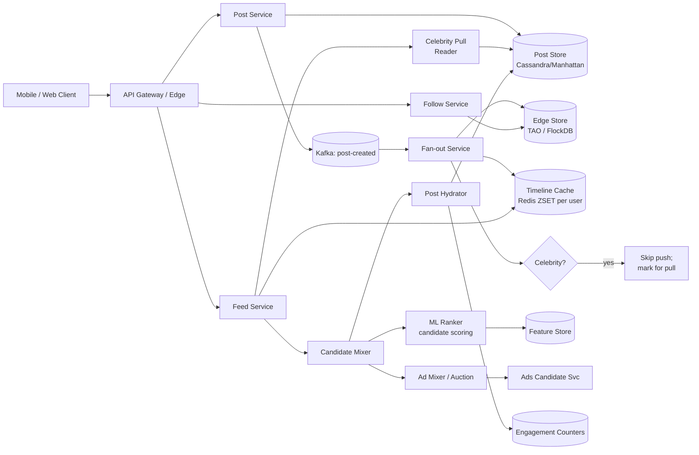
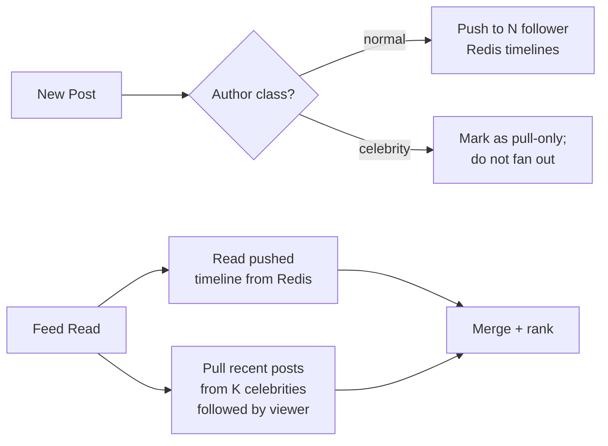
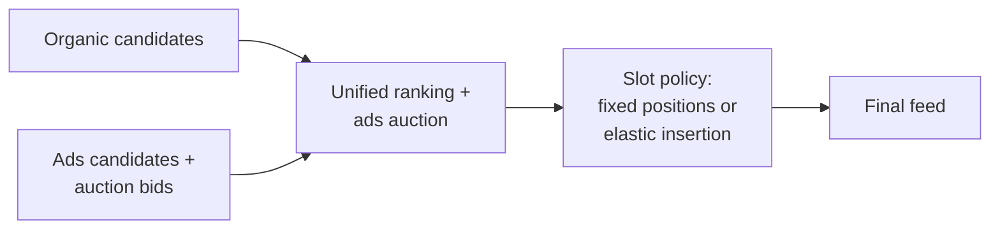

# Design Facebook News Feed (Twitter-Style Timeline) — HLD Case Study

**Date:** 2026-04-25 | **Updated:** 2026-04-25
**Tags:** `system-design` `case-study` `news-feed` `fan-out` `timeline`

## Table of Contents

- [Summary](#summary)
- [Functional Requirements](#functional-requirements)
- [Non-Functional Requirements](#non-functional-requirements)
- [Capacity Estimation](#capacity-estimation)
- [API Design](#api-design)
- [Data Model](#data-model)
- [High-Level Architecture](#high-level-architecture)
- [Deep Dives](#deep-dives)
  - [Fan-out on Write (Push)](#fan-out-on-write-push)
  - [Fan-out on Read (Pull)](#fan-out-on-read-pull)
  - [Hybrid Fan-out](#hybrid-fan-out)
  - [The Celebrity Problem](#the-celebrity-problem)
  - [Timeline Storage](#timeline-storage)
  - [Ranking Layer](#ranking-layer)
  - [Ad Insertion](#ad-insertion)
  - [Edge Cache and Cold-Start Users](#edge-cache-and-cold-start-users)
  - [Refresh Strategy](#refresh-strategy)
- [Bottlenecks and Trade-offs](#bottlenecks-and-trade-offs)
- [Anti-Patterns](#anti-patterns)
- [Related](#related)
- [References](#references)

## Summary

A news feed system delivers a personalized, ordered list of posts produced by accounts a user follows. The hard part is not displaying a list — it is the asymmetry between the read and write paths at scale. A celebrity post may need to be visible to 100M followers within seconds, while a typical user posts to a few hundred followers but reads the feed dozens of times per day. The two dominant strategies — **fan-out on write** (push) and **fan-out on read** (pull) — each fail at the extremes, so production systems (Twitter, Facebook, Instagram) converge on a **hybrid** model: push for normal users, pull for celebrities, merged at read time, then re-ranked by an ML model and mixed with ads.

This doc walks the standard senior-level interview decomposition: requirements, capacity, API, data model, the hybrid fan-out architecture, and the trade-offs that make each lever load-bearing.

## Functional Requirements

In scope:

- **Post creation** — text, image, video, link, reshare. Posts are immutable once created (edits create a new version).
- **Follow/unfollow** edges — directed graph, asymmetric (Twitter-style follow), or symmetric (friend-style).
- **Feed fetch** — `GET /feed` returns a paginated, ranked list of posts from followed accounts.
- **Two ordering modes** — **chronological** (strict reverse-time) and **ranked** (ML-scored, default).
- **Engagement signals** — like, comment, reshare, click, dwell time. These feed back into the ranker.
- **Negative feedback** — "see less of this", hide post, snooze user, unfollow. Must influence the ranker within minutes.
- **Ad insertion** — ads injected at deterministic slots (e.g. positions 4, 12, 20) and ranked alongside organic posts in a unified auction-aware mixer.
- **Refresh** — pull-to-refresh fetches the delta since last seen; app focus triggers an incremental refresh.
- **Cursor-based pagination** — infinite scroll without missing or duplicating posts, even as new posts arrive.

Out of scope for this design (separate services):

- Post composer / media upload pipeline
- Comment threading
- Notification fan-out
- Search / discovery feed (Reels, Explore)
- Messaging / DMs

## Non-Functional Requirements

| NFR | Target | Notes |
|---|---|---|
| Feed fetch p99 latency | < 500 ms | Cold cache up to 800 ms acceptable |
| Feed fetch p50 latency | < 150 ms | Hot timeline cache hit |
| Post visibility (push path) | < 5 s for 99% of followers | Celebrity push capped, see deep dive |
| Read availability | 99.99% | Stale feed > error |
| Write availability | 99.9% | Post creation may queue |
| Scale | 2B+ MAU, 500M+ DAU | Twitter ~500M MAU, Facebook ~3B MAU |
| Freshness vs ranking quality | Tunable per surface | Chrono = fresh; ranked = quality, accept ~minutes-old candidates |
| Consistency model | Read-your-writes for own posts; eventual elsewhere | A user must see their own post immediately |
| Durability | No post loss after ack | Replicated WAL before 200 OK |

The hardest tension is **freshness vs ranking quality**. A perfectly ranked feed needs every signal up to the moment of fetch, but waiting on signals adds tail latency. Production systems pre-compute a candidate set and let the ranker run on a slightly stale snapshot.

## Capacity Estimation

Assume a Twitter-scale system for clean numbers:

- 500M DAU, average 2 sessions/day, 5 feed fetches/session = **5B feed fetches/day** ≈ **58k QPS** average, peak ~3x ≈ **175k QPS**.
- Average user follows **400 accounts**. Power users follow 5,000+.
- Posts per active user per day ≈ 0.5 → **250M posts/day** ≈ **3k writes/sec** average, peak ~10k/sec.
- Average post payload: 300 bytes text + metadata + (optional) media reference. Ignore media bytes (separate CDN).
- Follower distribution is heavily skewed:
  - p50: ~200 followers
  - p99: ~10k followers
  - Top 1000 accounts: 10M–500M followers each (Cristiano Ronaldo, Elon Musk, MrBeast tier)

### Fan-out amplification (push model)

Average post → 400 timeline writes. So write amplification ≈ **400x**.

- 3k posts/sec × 400 = **1.2M timeline writes/sec** average.
- Peak: 10k posts/sec × 400 = **4M timeline writes/sec**.
- A celebrity with 100M followers posting once = **100M writes** in a few seconds. Without backpressure or special handling, this saturates the cluster.

### Storage

- Posts: 250M/day × 300 B = **75 GB/day** of post metadata (~27 TB/year). Cheap.
- Timeline cache: per user, last 800 post IDs + score. ~16 KB/user. 500M users × 16 KB = **8 TB**. Fits in a Redis fleet (sharded).
- Edges: 500M users × 400 follows avg = 200B edges. At 16 B/edge = **3 TB**. Stored in a graph store (Facebook TAO, Twitter FlockDB historically).
- Ranking signals (engagement counters, affinity scores): ~100 KB/user × 500M = **50 TB**.

These numbers tell you immediately that:

1. Posts themselves are not the bottleneck — it is the **fan-out amplification**.
2. Timelines fit in RAM, not disk. Treat Redis as the primary read store and Cassandra/HBase as the durable backing.

## API Design

Public, cursor-paginated, idempotent reads:

```http
GET /v1/feed?cursor=<opaque>&limit=20&mode=ranked
Authorization: Bearer <token>
```

Response:

```json
{
  "items": [
    {
      "id": "post_9f2a",
      "author": { "id": "u_123", "name": "...", "avatar": "..." },
      "type": "text|image|video|reshare",
      "text": "...",
      "media": [{ "url": "cdn.example/...", "w": 1080, "h": 1920 }],
      "created_at": "2026-04-25T10:14:22Z",
      "engagement": { "likes": 42, "comments": 7, "shares": 1 },
      "viewer_state": { "liked": false, "saved": false },
      "ranking_score": 0.873,
      "slot_kind": "organic|ad|recommendation"
    }
  ],
  "next_cursor": "eyJ0IjoxNzE0MDAwMDAwLCJpZCI6InBvc3RfOWYyYSJ9",
  "fetched_at": "2026-04-25T10:14:25Z"
}
```

Other endpoints:

- `POST /v1/posts` — create a post.
- `POST /v1/feed/refresh` — pull delta since `last_seen_post_id`.
- `POST /v1/feed/feedback` — `{ post_id, action: "see_less" | "hide" | "snooze_author" }`.
- `POST /v1/follows` / `DELETE /v1/follows/:user_id`.

### Cursor design

The cursor is **opaque** to the client and encodes:

```text
{ ranker_session_id, last_score, last_post_id, anchor_ts, mode }
```

This lets the server resume ranking deterministically across pages, avoid duplicates when new posts arrive, and detect stale cursors after a feature flag flip.

## Data Model

```text
User(user_id PK, handle, name, follower_count, following_count, created_at, ...)
Post(post_id PK, author_id, type, text, media_ref[], created_at, visibility, lang)
Follow(follower_id, followee_id, created_at, PK(follower_id, followee_id))
                                                 secondary index on (followee_id)
TimelineCache(user_id PK, [ (post_id, score, inserted_at) ... up to 800 ])  # Redis ZSET
RankingSignals(user_id, author_id, affinity_score, last_interaction_at)
EngagementCounter(post_id, likes, comments, shares, impressions)  # write-heavy, eventually consistent
NegativeFeedback(user_id, target_id, kind, expires_at)
```

Key choices:

- **Posts** in a wide-column store (Cassandra/HBase/Manhattan) keyed by `post_id`, replicated across regions.
- **Follow edges** in a graph store optimized for the inverse query "who follows X?" (this is what fan-out reads). Facebook uses **TAO** on top of MySQL + memcached; Twitter used **FlockDB**.
- **Timeline cache** in Redis sorted sets per user, capped at ~800 entries, evicted LRU.
- **Ranking signals** in a low-latency feature store (Facebook **F3**/**LASER**, Twitter **Strato**).

## High-Level Architecture



### Write path (post creation)

1. Client `POST /v1/posts` → API gateway → Post Service.
2. Post Service writes to `PostDB` (sync, quorum) and emits `post-created` to Kafka.
3. Fan-out Service consumes the event:
   - Looks up the author's follower list (from the edge store).
   - Classifies the author as **normal** or **celebrity** (threshold: ~10k–100k followers, configurable).
   - **Normal**: pushes `(post_id, score)` to each follower's Redis timeline ZSET in parallel batches.
   - **Celebrity**: skips push entirely. Marks the author so readers know to pull at read time.

### Read path (feed fetch)

1. `GET /v1/feed` → API gateway → Feed Service.
2. Feed Service:
   - Reads pre-computed timeline from Redis (push results).
   - In parallel, **pulls** recent posts from celebrity authors the user follows (from `PostDB`, scoped by `created_at > last_seen`).
   - **Merges** both candidate streams.
3. **Ranker** scores each candidate using the feature store (affinity, recency, predicted engagement).
4. **Ad Mixer** runs in parallel; eligible ads are scored on the same scale and inserted at slot policies.
5. **Hydrator** fills in post bodies, author metadata, viewer state, engagement counters.
6. Response returned with cursor.

## Deep Dives

### Fan-out on Write (Push)

**Idea**: when a user posts, eagerly write the post ID into every follower's pre-computed timeline.

```text
for follower in followers(author):
    redis.zadd(f"timeline:{follower}", score=ts, member=post_id)
    redis.zremrangebyrank(f"timeline:{follower}", 0, -801)  # cap at 800
```

**Pros**

- Reads are O(1) — just `ZREVRANGE timeline:user 0 19`.
- Read latency is dominated by Redis (~1 ms p50) plus hydration.
- Trivially scales to billions of reads/day.

**Cons**

- Write amplification = follower count. A 1M-follower account costs 1M timeline writes per post.
- Wasted writes for inactive followers (most never read it).
- Hot Redis shards when a popular author has clustered followers.
- Edits/deletes have to fan out again — expensive.

**Where it fits**: the long tail of normal users, where average followers ≈ 200–1000. The cost is bounded and predictable.

### Fan-out on Read (Pull)

**Idea**: store posts only in the author's outbox. At read time, gather posts from all followed authors and merge.

```text
followed = follows(viewer)        # 400 user IDs
posts = []
for author in followed:
    posts += postdb.get_recent_posts(author, since=last_seen, limit=50)
return merge_sorted(posts).top(20)
```

**Pros**

- O(1) writes (just one row in the post store).
- No wasted work for inactive followers.
- Edits and deletes are trivially consistent (one source of truth).

**Cons**

- Read amplification = follow count. 400 fan-out reads per feed fetch.
- Latency dominated by the slowest of N parallel reads (tail latency).
- Hot read on celebrity authors anyway, just shifted to a different layer.
- Cache miss storms on cold authors.

**Where it fits**: the head of the distribution — celebrities, where push would explode. Read cost is bounded because **few users follow many celebrities**, so the pull set per viewer stays small.

### Hybrid Fan-out

This is what Twitter and Instagram converged on (called **"fan-out architecture"** in Twitter's "Timelines at Scale" talk). The system uses a **threshold** to decide:

```text
fanout_strategy(author):
    if follower_count(author) > CELEBRITY_THRESHOLD:
        return PULL          # don't push; readers pull at fetch time
    else:
        return PUSH          # eagerly write to follower timelines
```

At read time, the Feed Service:

1. Reads the user's pushed timeline from Redis.
2. Looks up which celebrities the user follows.
3. Pulls their recent posts directly from the post store.
4. Merges the two streams, then ranks.

This makes the system **work-optimal in both directions**: writes are cheap for celebrities (pull), reads are cheap for normal authors (push). The pull set per user stays small because the average user only follows a handful of celebrities.



### The Celebrity Problem

A "celebrity" here is any account whose follower count breaks the linear cost model. Specific failure modes if you push for them anyway:

- **Thundering herd** at fan-out time: a single post creates millions of Redis writes in seconds, saturating cluster I/O and degrading every other tenant.
- **Hot shards**: if followers are randomly distributed, every shard gets a slice — but this still saturates the slowest one (tail amplification).
- **Wasted work**: most of those followers will not open the app in the next hour. The push paid for impressions that never happen.

Mitigations layered together:

- **Pull for celebrities** (the primary fix).
- **Bucketed push for mid-tier accounts** (10k–100k followers): push only to a hot subset (recent active followers), pull for the rest.
- **Rate limiting per author** at the fan-out worker — cap fan-out throughput so a viral storm cannot starve other tenants.
- **Author classification is dynamic** — recompute based on rolling 30-day follower count and post engagement.

### Timeline Storage

Per-user timelines live in Redis sorted sets (ZSET):

- Key: `timeline:{user_id}`
- Member: `post_id`
- Score: insertion timestamp (chronological) or pre-computed rank (ranked)
- Capped at the last **~800 posts** via `ZREMRANGEBYRANK`.

Why 800 and not "forever"?

- 99% of feed reads only look at the top ~50.
- 800 covers a few days of activity for typical follow counts, which is the realistic refresh window.
- Older posts are paginated from the **post store** directly when the user scrolls past the cap.

Sharding:

- Shard by `user_id` (consistent hashing).
- Replicate each shard 2–3x for read scaling and failover.
- Treat Redis as a **cache that can be rebuilt**, not the source of truth. The fan-out log in Kafka + the post store let us replay a user's timeline if a shard is lost. Twitter's Manhattan blog calls out this property explicitly: "timelines are derivable, posts are not."

### Ranking Layer

The feed pipeline is two-stage:

1. **Candidate generation** — produce a few hundred candidate posts per fetch from:
   - Pushed timeline (Redis)
   - Celebrity pull
   - Recommendations (out-of-network suggestions)
   - Reshares from friends-of-friends
2. **Ranking / scoring** — an ML model (gradient-boosted trees, a deep ranker, or a tower model) scores each candidate on **predicted engagement** (P(click) × value, P(like), P(comment), P(skip), etc.) combined into a value function.

Signals fed to the ranker:

- **Recency** — a decay function on `now - created_at`.
- **Affinity** — viewer ↔ author interaction history (likes, comments, profile visits, DMs).
- **Engagement** — global signal: how the post is performing for similar users.
- **Content type preferences** — does this viewer prefer videos, photos, text?
- **Negative feedback** — recent "see less", hides, mutes.
- **Diversity / freshness penalties** — avoid 5 posts from the same author in a row.

Critically, ranking runs on a **slightly stale snapshot** of features (seconds to minutes old) so the ranker is not blocked on synchronous feature lookups. This is the freshness/quality knob: too fresh and you spend latency budget; too stale and you misrank.

### Ad Insertion

Ads are a parallel candidate stream, not an afterthought:



Two patterns in the wild:

- **Fixed-slot insertion**: ads land at predictable positions (e.g. positions 4, 12, 20). Simple, predictable monetization, but can feel mechanical.
- **Elastic insertion**: a unified scoring function compares ad utility (eCPM × predicted engagement) against the next organic candidate; ads insert when they win. This is closer to what Facebook does internally.

Either way, the ad mixer must:

- Respect frequency caps per viewer.
- Honor brand-safety filters against the next organic post.
- Run the auction on a fresh feature snapshot of the viewer.
- Deduplicate against ads already shown in this session.

### Edge Cache and Cold-Start Users

For users who:

- Just signed up and follow few accounts, or
- Open the app after weeks away,

the pushed timeline is empty or stale. Strategies:

- **Edge cache** at the CDN/POP for popular global content (trending posts, recommended creators) that can populate a viable feed in < 100 ms.
- **Recommended creators / "For You" candidates** — out-of-network candidates ranked by a discovery model (this is how TikTok shapes its entire feed; Facebook and Instagram now blend it heavily).
- **Backfill on session start** — kick off an async pull of the last 24h of posts from followed authors and warm the timeline cache.

### Refresh Strategy

Three refresh entry points:

1. **App focus / cold start** — fetch the first page of feed (`GET /v1/feed`).
2. **Pull-to-refresh** — `POST /v1/feed/refresh` with `last_seen_cursor`. Returns the delta as a separate ranked list.
3. **Background prefetch** — when the user is N posts from the bottom of the current page, prefetch the next page.

The delta path is **pull-heavy** — it always reads the most recent state, ignoring any pre-computed pushed timeline that may have arrived in the meantime. This is intentional: refresh is the moment the user expects freshness, so the system pays the latency for accuracy.

To avoid duplicates and gaps in infinite scroll, the cursor encodes the ranker session ID — if the user paginates after a refresh, the server uses the same session's candidate set rather than re-ranking from scratch.

## Bottlenecks and Trade-offs

| Bottleneck | Symptom | Mitigation |
|---|---|---|
| Celebrity fan-out write storm | Redis cluster CPU saturates after viral post | Hybrid model: pull for celebrities |
| Hot Redis shard | Tail latency p99 spikes | Per-user shard key + replica reads + adaptive timeouts |
| Tail latency on celebrity pull | Slow read from one author blocks merge | Per-author timeout, partial result with degraded badge |
| Feature store lookup latency | Ranker stalls | Pre-warm features into ranker memory; accept slightly stale features |
| Cold-start users | Empty feed | Out-of-network candidates + edge-cached trending content |
| Read-your-own-writes | User posts but doesn't see it | Inject author's own post into the candidate set unconditionally |
| Cross-region replication lag | User in EU sees post 30s after follower in US | Region-pinned reads + async cross-region replication of timelines |
| Ranking model staleness | Engagement drops after model freeze | Online retraining + bandit exploration slots |
| Negative feedback latency | "See less" doesn't take effect immediately | Synchronously inject negative feedback into the next-fetch ranker context |

### Key trade-offs

- **Push vs pull** is a write-amplification vs read-amplification trade. The hybrid pays a small read overhead (merge step + per-celebrity pull) to avoid the unbounded write cost.
- **Freshness vs ranking quality** is mediated by the ranker's feature snapshot age. The system is tunable per surface (chronological mode skips ranking entirely).
- **Ranking quality vs latency** — every additional candidate costs scoring CPU. The candidate set is capped (~500) before ranking.
- **Ads revenue vs UX** — ad density and elastic insertion are governed by long-term retention models, not raw eCPM, otherwise the feed degrades.

## Anti-Patterns

- **Pure fan-out on write at any scale.** Works for prototypes, dies the moment a celebrity joins.
- **Pure fan-out on read at any scale.** Read latency explodes once average follow count exceeds ~100.
- **Sorting "by created_at DESC" in MySQL on the read path.** The whole point of the timeline cache is to avoid this.
- **Caching the fully-rendered feed HTML/JSON.** Personalization, viewer state, and ad insertion change per request — cache **post IDs** and hydrate on read.
- **Putting ads through a second pipeline that runs after ranking.** Slot decisions need the same feature snapshot as organic ranking, otherwise ads get inserted into stale contexts.
- **Strong consistency for engagement counters.** Likes/comments are inherently eventually consistent at scale — pretending otherwise costs you 10× the infra.
- **Treating the timeline cache as durable.** It is derived state. Always have a replay path from Kafka + the post store.
- **Synchronous fan-out from the post-create critical path.** The user's `POST /posts` call must return after a durable write — fan-out runs async, off the request path.
- **A single global "celebrity threshold".** Make it dynamic, per-region, and tied to engagement, not just follower count.
- **Skipping read-your-writes for the author.** A user who can't see their own post within 100 ms thinks the app is broken.

## Related

- [Design Instagram](./design-instagram.md) — same shape, but media-first storage and Stories complicate the timeline.
- [Design TikTok](./design-tiktok.md) — pull-only "For You" feed with no follow-graph dependency; ranker is the entire product.
- [Push vs Pull Architecture](../../communication/push-vs-pull-architecture.md) — the general communication-pattern lens behind fan-out decisions.

## References

1. **Twitter Engineering — "Timelines at Scale"** (Raffi Krikorian, QCon talk + blog series). The canonical description of the fan-out hybrid model and the celebrity problem. <https://www.infoq.com/presentations/Twitter-Timeline-Scalability/>
2. **Twitter Engineering — Manhattan: Real-time, multi-tenant distributed database**. Backing store for tweets and many timeline-adjacent datasets. <https://blog.x.com/engineering/en_us/a/2014/manhattan-our-real-time-multi-tenant-distributed-database-for-twitter-scale>
3. **Facebook — TAO: The Power of the Graph** (Bronson et al., USENIX ATC 2013). The graph store behind the social graph and edge lookups for fan-out. <https://www.usenix.org/conference/atc13/technical-sessions/presentation/bronson>
4. **Facebook Engineering — "Building Timeline: Scaling up to hold your life story"**. Early Timeline storage architecture, including denormalization and aggregation patterns. <https://engineering.fb.com/2012/01/24/web/building-timeline-scaling-up-to-hold-your-life-story/>
5. **Meta Engineering — "How machine learning powers Facebook's News Feed ranking algorithm"**. The ranker layer, signals, and online learning loop. <https://engineering.fb.com/2021/01/26/ml-applications/news-feed-ranking/>
6. **LinkedIn Engineering — "Personalized Feed at LinkedIn: A Look Behind the Scenes"**. Candidate generation + multi-objective ranker; another large-scale feed worth studying alongside Facebook/Twitter. <https://engineering.linkedin.com/blog/2017/03/strategies-to-personalize-the-linkedin-feed>
7. **Yao et al., "Beyond Globally Optimal: Focused Learning for Improved Recommendations"** (LinkedIn, WWW 2017) — feed ranking objectives in production. <https://dl.acm.org/doi/10.1145/3038912.3052713>
