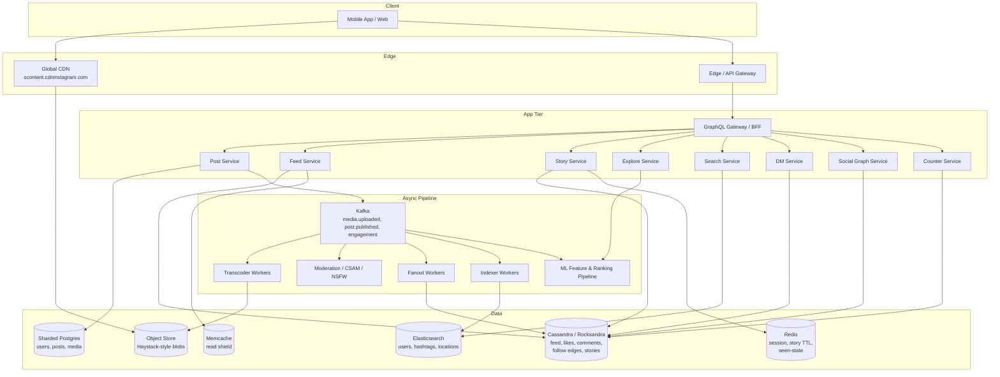
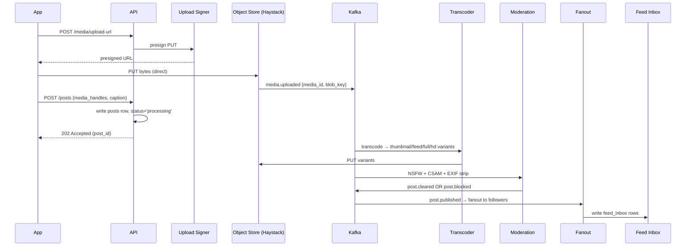
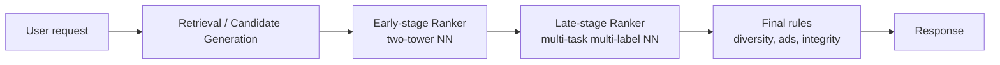

# Design Instagram — Photo Sharing, Feed, Stories, and Explore at Two-Billion-User Scale

**Date:** 2026-04-25 | **Updated:** 2026-04-25
**Tags:** `system-design` `case-study` `instagram` `social-media` `photo-sharing`

## Table of Contents

- [Summary](#summary)
- [Functional Requirements](#functional-requirements)
- [Non-Functional Requirements](#non-functional-requirements)
- [Capacity Estimation](#capacity-estimation)
- [API Design](#api-design)
- [Data Model](#data-model)
- [HLD Diagram](#hld-diagram)
- [Deep Dives](#deep-dives)
  - [1. Photo Upload Pipeline](#1-photo-upload-pipeline)
  - [2. Feed Generation — Pull, Push, Hybrid](#2-feed-generation--pull-push-hybrid)
  - [3. Stories — 24-Hour TTL and Ephemeral Reads](#3-stories--24-hour-ttl-and-ephemeral-reads)
  - [4. Hashtag and Location Search](#4-hashtag-and-location-search)
  - [5. Explore — Ranked Recommendations](#5-explore--ranked-recommendations)
  - [6. Like and Comment Counters](#6-like-and-comment-counters)
  - [7. Direct Messages](#7-direct-messages)
  - [8. CDN Strategy for Photos](#8-cdn-strategy-for-photos)
  - [9. Anti-Spam and Content Moderation](#9-anti-spam-and-content-moderation)
- [Bottlenecks and Trade-offs](#bottlenecks-and-trade-offs)
- [Anti-Patterns](#anti-patterns)
- [Related](#related)
- [References](#references)

## Summary

Instagram is a read-heavy, media-centric social network: roughly 100 reads per write, dominated by feed scrolls, story views, and Explore browsing. The hard problems are not "store a photo" — they are **fanout at celebrity scale**, **global low-latency media delivery**, **ranked recommendations at billions of QPS**, and **a 24-hour ephemeral surface (Stories) that behaves nothing like the permanent feed**. Instagram's real architecture is a hybrid: sharded Postgres for the relational core, Cassandra (with a RocksDB storage engine called Rocksandra) for high-volume key-value workloads like the feed and DMs, Memcache as a heavy read shield, Haystack-style blob storage behind a global CDN for media, and a multi-stage ML pipeline driving Explore and Reels. This document walks through the HLD a senior backend engineer would draw on a whiteboard, then drills into the parts that actually break at scale.

## Functional Requirements

**Core posting and graph**

- Post a photo or video (single, carousel, or Reel) with caption, hashtags, location tag, alt text.
- Follow and unfollow other users; public vs private accounts; follow requests for private accounts.
- Like, save, share, and comment on posts; nested replies on comments.

**Feed and discovery**

- Home feed: ranked posts and Reels from accounts the user follows, plus injected suggestions and ads.
- Explore: ranked recommendations of posts/Reels the user does not follow.
- Hashtag pages and location pages (top + recent).
- Search by username, hashtag, location, audio (Reels).

**Stories**

- 24-hour ephemeral posts (photo or short video) with stickers, polls, mentions.
- Viewer list visible to the author; per-viewer seen/unseen state.
- Story highlights (manually pinned beyond 24 h).

**Reels**

- Short-form vertical video with audio attribution and remix.
- Reels-only ranked feed and Reels surfaced in Explore.

**Messaging**

- 1:1 and group DMs; photo, video, and voice messages; reactions; vanish mode.
- (Treated as a separate service — see the WhatsApp/messaging case study.)

**Out of scope for this HLD**

- Shopping/checkout, ads bidding pipeline, creator monetization payouts, Live, AR effects authoring. These each warrant their own design.

## Non-Functional Requirements

| NFR | Target | Why |
|-----|--------|-----|
| Read:write ratio | ~100:1 | Users scroll vastly more than they post. Optimize the read path. |
| Feed P50 / P99 latency | < 200 ms / < 600 ms | Scroll feels janky beyond ~600 ms; this dominates perceived quality. |
| Photo first-byte (CDN hit) | < 100 ms globally | Edge POPs must terminate the request. |
| Upload acknowledgement | < 2 s | Even before transcoding completes; user expects an immediate "Posted". |
| Durability of media | 11 nines (object store) | Lost photos are unrecoverable customer trust damage. |
| Availability | 99.95% (≈ 4.4 h/yr) | Reads should degrade to stale rather than fail. |
| Geographic reach | Global; multi-region active-active for reads, primary-region for some writes | Latency and regulatory residency. |
| Eventual consistency budget | Seconds for likes, counts, follows | Acceptable; users tolerate slight staleness on counters. |
| Strong consistency surfaces | DMs, follow requests, blocks, payments | Cannot show a stale "blocked user can DM" state. |

## Capacity Estimation

These are order-of-magnitude figures for sizing, not Meta's actual numbers.

**Users and traffic**

- 2 B registered users, ~500 M daily active.
- ~100 M posts/day → ~1,150 posts/sec average, ~5–10 K posts/sec peak.
- Photos average 2 MB after compression; videos average 15 MB; story media average 3 MB.
- Daily media ingest ≈ 100 M × 2 MB = 200 TB/day for photos alone, plus video and stories. Multi-petabyte/year scale.

**Reads**

- 500 M DAU × 50 feed impressions/day ≈ 25 B feed item reads/day ≈ 290 K/sec average, peaks > 1 M/sec.
- Each impression triggers thumbnail fetches; CDN traffic is dominated by image bytes, not API calls.

**Storage**

- Posts (metadata only): 100 M/day × 1 KB ≈ 100 GB/day → ~36 TB/year of structured post rows.
- Media (raw + variants): ~5× raw size after generating thumbnail/feed/full/HD variants → on the order of 1 PB/day at maturity.
- Likes and follow edges: hundreds of billions of rows; sharded Cassandra-style.

**ID generation**

- A 64-bit ID per post is plenty: with Instagram's published scheme (41 bits ms timestamp + 13 bits shard ID + 10 bits sequence), each shard supports 1024 IDs/ms and the timestamp range covers ~41 years.

## API Design

REST for transactional operations; GraphQL (or a similar field-selective API) for the feed and profile pages because the client wants a tree of mixed object types in one round-trip; presigned URLs for media upload so bytes never traverse the application tier.

**Posting**

```http
POST /v1/media/upload-url
{ "content_type": "image/jpeg", "size_bytes": 2_087_412 }
→ 200 { "upload_url": "https://up.cdninstagram.com/...?sig=...",
        "media_handle": "media_01HX...K9" }

PUT  <upload_url>            # client uploads bytes directly to object store

POST /v1/posts
{ "media_handles": ["media_01HX...K9"],
  "caption": "Sunset over Hanoi #vietnam",
  "location_id": "loc_42",
  "hashtags": ["vietnam"],
  "alt_text": "..." }
→ 202 { "post_id": "171420632...", "status": "processing" }
```

`202 Accepted` is the right answer: thumbnailing, CSAM/NSFW scan, and indexing are async. The post is not visible to followers until the pipeline emits a `post.published` event.

**Feed (GraphQL)**

```graphql
query Feed($cursor: String) {
  feed(cursor: $cursor, limit: 20) {
    edges {
      node {
        id
        author { id username avatarUrl }
        media { thumbnailUrl(width: 480) fullUrl(width: 1080) }
        caption
        likeCount
        commentPreview(limit: 2) { author { username } body }
        viewerHasLiked
      }
      cursor
    }
    pageInfo { hasNextPage endCursor }
  }
}
```

Cursor-based pagination only — never offset. The cursor encodes `(rank_score, post_id)` so insertions don't shift the page.

**Engagement**

```http
POST   /v1/posts/{id}/like                    → 200
DELETE /v1/posts/{id}/like                    → 200
POST   /v1/posts/{id}/comments                → 201 (returns comment_id)
GET    /v1/posts/{id}/comments?cursor=...     → 200 (paginated)
```

**Follow graph**

```http
POST   /v1/users/{id}/follow      → 200 (or 202 if private and pending)
DELETE /v1/users/{id}/follow
GET    /v1/users/{id}/followers?cursor=...
GET    /v1/users/{id}/following?cursor=...
```

**Stories**

```http
POST  /v1/stories                 → 201 { story_id, expires_at }
GET   /v1/stories/tray            → 200 (ordered ring of authors with unseen stories)
GET   /v1/stories/{author_id}     → 200 (their active stories)
POST  /v1/stories/{id}/seen       → 204
GET   /v1/stories/{id}/viewers    → 200 (author only)
```

**Search and Explore**

```http
GET /v1/search?q=hanoi&type=hashtag|location|user
GET /v1/explore?cursor=...
GET /v1/hashtags/{tag}/posts?sort=top|recent
```

## Data Model

The relational core lives in sharded Postgres; high-volume, append-only or wide-row workloads live in Cassandra; ephemeral data lives in Redis.

```text
-- Sharded Postgres (logical shards mapped to physical clusters)

users (
  user_id        BIGINT PRIMARY KEY,    -- snowflake-style
  username       TEXT UNIQUE,
  email          TEXT,
  is_private     BOOLEAN,
  created_at     TIMESTAMPTZ,
  ...
)

posts (
  post_id        BIGINT PRIMARY KEY,    -- shard ID embedded in the bits
  author_id      BIGINT,                -- co-located by author shard
  caption        TEXT,
  media_ids      BIGINT[],
  location_id    BIGINT NULL,
  created_at     TIMESTAMPTZ,
  like_count     BIGINT,                -- denormalized; reconciled from sharded counter
  comment_count  BIGINT,
  status         TEXT                   -- 'processing' | 'published' | 'removed'
)

media (
  media_id       BIGINT PRIMARY KEY,
  owner_id       BIGINT,
  type           TEXT,                  -- 'image' | 'video'
  blob_key       TEXT,                  -- object-store key
  variants       JSONB,                 -- { thumbnail, feed, full, hd }
  width, height  INT,
  duration_ms    INT NULL,
  uploaded_at    TIMESTAMPTZ
)

-- Cassandra (or Rocksandra) — wide rows keyed for fast partition reads

follow_edge      PARTITION KEY (follower_id) CLUSTERING (followee_id)
                 -- inverse table: followers_of PARTITION KEY (followee_id)

likes            PARTITION KEY (post_id)    CLUSTERING (user_id, ts)
user_likes       PARTITION KEY (user_id)    CLUSTERING (ts DESC, post_id)

comments         PARTITION KEY (post_id)    CLUSTERING (created_at, comment_id)

feed_inbox       PARTITION KEY (user_id)    CLUSTERING (rank_score DESC, post_id)
                 -- materialized fanout; only for users below the celebrity threshold

stories          PARTITION KEY (author_id)  CLUSTERING (created_at DESC)
                 -- TTL = 86_400 seconds, set per-row
story_views      PARTITION KEY (story_id)   CLUSTERING (viewer_id)

hashtag_posts    PARTITION KEY (hashtag)    CLUSTERING (rank_score DESC, post_id)
location_posts   PARTITION KEY (location_id) CLUSTERING (rank_score DESC, post_id)

-- Search index
elasticsearch    indices: users, hashtags, locations, audio
```

### ID Generation — Instagram's Snowflake-Style Scheme

Instagram evaluated Twitter Snowflake but ran the generator inside Postgres via PL/pgSQL to avoid running a separate ID service. The 64-bit layout:

```text
| 41 bits: ms since custom epoch | 13 bits: logical shard ID | 10 bits: per-ms sequence |
```

- 41 bits of ms covers ~69 years.
- 13 bits → 8192 logical shards (mapped to far fewer physical Postgres clusters; logical shards move between physical clusters without re-bucketing data).
- 10 bits → 1024 IDs per ms per shard.

Embedding the shard ID in the post ID means **any service holding a post ID can route to the right shard with no lookup**. This is the single best trick in the design.

## HLD Diagram



## Deep Dives

### 1. Photo Upload Pipeline

The hard requirement: the user taps "Share" and sees a confirmation in well under 2 seconds, even though the post is not yet safe to publish (NSFW/CSAM scan pending) and has no thumbnails. The standard pattern: **decouple ingest from publish**.



**Why presigned uploads.** Bytes go straight from the device to the object store; the application tier never buffers gigabytes. This caps app-tier memory and lets you scale upload throughput by scaling the object store, not your app pods.

**Why the post row exists before the publish event.** The author needs to see their own post immediately ("View on profile" works the moment the API returns). A `status='processing'` flag is checked on read.

**EXIF and CSAM.** EXIF GPS is stripped server-side before publishing variants — leaking home GPS coordinates is a P0 incident. CSAM scan must run before any public read path can see the image; failure to clear blocks publish.

**Variants.** Generate at least four sizes per image: feed thumbnail (~150 px), feed (480 px), full (1080 px), HD (1440 px or original). WebP/AVIF first with JPEG fallback. Store under content-addressed keys so the CDN can cache for years.

### 2. Feed Generation — Pull, Push, Hybrid

This is the canonical interview question and Instagram's real production answer is "all three, depending on the author."

| Strategy | Write cost | Read cost | Best for |
|----------|-----------|-----------|----------|
| **Pull** (fan-out on read) | Cheap (one row) | Expensive (read posts from each followed author, merge, rank) | Celebrities (millions of followers) |
| **Push** (fan-out on write) | Expensive (one row per follower) | Cheap (one read of the user's inbox) | Normal users (< ~100 K followers) |
| **Hybrid** | Mixed | Mixed | Production reality |

**The celebrity problem.** A push-only design means a single post by a 200-million-follower account writes 200 M feed rows. That spike alone can saturate write capacity, and most of those rows will never be read because most followers are inactive in the next hour.

**Hybrid algorithm on read:**

1. Read the user's `feed_inbox` partition in Cassandra (push-delivered posts from non-celebrity authors).
2. Read recent posts from the user's celebrity followees (a small set, ~tens of users) on demand.
3. Merge, rank, dedupe, inject ads/Reels, return a page.

The read does ~2 partition reads, not N. The push half is bounded by the threshold.

**Tuning the threshold.** Instagram-style systems use ~100 K followers as the cutoff, often with an additional check for "active followers in the last 7 days" to skip dead accounts. Some implementations push to active followers only and pull for the long tail.

For deeper coverage of the fanout state machine, ranking signals, and feed cache TTLs, see [`design-facebook-news-feed.md`](./design-facebook-news-feed.md).

### 3. Stories — 24-Hour TTL and Ephemeral Reads

Stories are not "posts that disappear." They are a separate write path, separate read path, separate ranking model, and separate storage policy.

**Storage.** Each story row carries a TTL of 86,400 s. Cassandra's per-row TTL handles the deletion automatically — no scheduled cleanup job needed. Object-store media is given a lifecycle policy to move to cold storage at 24 h and delete at 30 days (kept briefly for abuse investigation).

**Read path — the tray.** The most-requested call is the story tray: a list of authors the user follows who have an unseen active story, ordered by a freshness/affinity signal.

```text
GET /v1/stories/tray:
  followees = graph_service.followees(user_id)
  active = []
  for each followee:
      stories = redis.zrangebyscore("stories:" + followee, now - 86400, now)
      seen    = redis.smembers("seen:" + user_id + ":" + followee)
      if any(s not in seen): active.append((followee, stories))
  rank(active) by affinity, recency, story_count
```

Redis sorted sets give O(log N) range reads per author; the tray is built in tens of milliseconds.

**Per-viewer seen state.** A `story_views` Cassandra table keyed by `story_id` records each viewer + ts. Two consumers:

- The author's "viewer list" UI (read by `story_id`).
- The viewer's "what's unseen" UI (read by `(viewer_id, author_id)`); usually backed by Redis with a TTL matching the story.

**Why not just reuse the post pipeline?** Read patterns differ: Stories are watched in linear sequence with very high tap-through rates and a tray that updates every few minutes; posts are scrolled non-linearly with engagement clustered hours after publish. Different cache shapes, different ranking, different durability needs.

### 4. Hashtag and Location Search

Two distinct surfaces, both backed by Elasticsearch plus per-tag inverted post lists.

**Autocomplete and entity search** (typing `#han...`) hits Elasticsearch with prefix queries on the `hashtags`, `users`, and `locations` indices. Query latency target < 100 ms; the hot path is heavily cached.

**Hashtag and location pages** show "Top" and "Recent" feeds for a tag. Recent is straightforward: a Cassandra wide row `hashtag_posts` partitioned by tag, clustered by `(created_at DESC)`, written by the indexer worker on `post.published`. Top is a ranked subset, scored offline by a "post quality" model (engagement velocity, author authority, image quality signals) and refreshed every few minutes.

**Hot tag protection.** A trending hashtag (#worldcupfinal) can attract millions of writes per minute. Mitigations:

- Sample writes to the Top index — not every post needs to be considered.
- Cap the wide row's size and rotate (tag → tag/yyyy-mm-dd partitions) to avoid Cassandra wide-partition pathologies.
- Rate-limit per-author writes per tag to suppress spam.

For broader patterns on inverted indices, ranking, and freshness tradeoffs, see [`../../building-blocks/search-systems.md`](../../building-blocks/search-systems.md).

### 5. Explore — Ranked Recommendations

Explore is the highest-value ML surface in the product. Meta has published its multi-stage architecture; the structure that matters for an HLD is:



**Retrieval / candidate generation.** Pull ~hundreds of thousands of candidate items down to ~1,500 using cheap signals: collaborative-filtering item neighbors, personalized PageRank on the engagement graph, and a two-tower neural net producing user and item embeddings looked up via approximate nearest neighbor (ANN). User and item towers are independent at training time, so the item tower is precomputed and the user tower runs at request time on fresh features.

**Early-stage ranker.** A smaller neural net narrows 1,500 candidates → ~100, scoring (user, item) pairs.

**Late-stage ranker.** A heavier multi-task model predicts probabilities of each engagement (like, save, share, comment, time spent, skip) and combines them with a value model to produce the final ordering. Top-N goes to the user.

**Diversity and integrity rules.** Final pass enforces no two posts from the same author, content-policy filters, ad slot insertion, and Reels-vs-photo balance.

**Why multi-stage.** Running the heavy ranker on millions of candidates per request would be hopelessly expensive; cheap retrieval + progressively heavier rankers gives latency under 200 ms at billions of requests/day.

### 6. Like and Comment Counters

Naive design: `UPDATE posts SET like_count = like_count + 1 WHERE id = ?`. This dies the first time a celebrity post hits 100 K likes/sec — every write contends on the same row.

**Sharded counters.** Split the counter into N sub-counters keyed by `(post_id, shard_index)` where shard_index is `user_id % N`. Increments hit different physical rows and aggregate is `SUM(*)`.

```text
likes_counter (
  post_id      BIGINT,
  shard        SMALLINT,    -- 0..N-1, often 256
  count        BIGINT,
  PRIMARY KEY (post_id, shard)
)
```

**Denormalized count on the post.** Reads of a single post should not scan 256 rows. A periodic reconciler reads the shard sum and writes it to `posts.like_count`. The post row is therefore eventually consistent — UI displays "127k likes" with seconds of staleness, which is fine.

**Consistency for the actor.** When *I* like a post, the UI optimistically shows the new state and then confirms. The `viewerHasLiked` field is read from a per-user `user_likes` table (strongly consistent for me) — not derived from the aggregate.

**Comment counts** follow the same pattern. Comment *content* is a Cassandra wide row partitioned by `post_id`, paginated by cursor; pinned/featured comments are a separate small set surfaced first.

### 7. Direct Messages

DMs need different guarantees from posts: strict ordering within a conversation, end-to-end encryption for vanish mode, presence/typing indicators, push notifications, and offline message delivery. These properties demand a chat-shaped service — separate storage (per-conversation log), separate transport (long-lived WebSocket / MQTT), separate ranking (none).

For the full design — Cassandra-style message log per conversation, fanout to recipient devices, presence service, push notification pipeline — see the WhatsApp / chat case study (`design-whatsapp.md`). For Instagram, the only architectural integration points worth calling out:

- Username and avatar lookups against the user service.
- Sharing a post into a DM creates a lightweight reference (post_id) rather than copying media.
- Story replies hit the DM service, not the comment service.

### 8. CDN Strategy for Photos

Instagram serves media from `scontent.cdninstagram.com`, which is Meta-operated infrastructure (not a commercial CDN like Cloudflare or Akamai). At their scale, owning the edge is cheaper than renting it; smaller designs should absolutely lean on a commercial CDN.

**Key properties of the CDN layer:**

- **Geo-replicated.** A POP in every major metro; the user's request terminates at the nearest edge.
- **Signed URLs.** Each variant URL embeds a short-lived signature — prevents hot-linking, throttles scrapers, allows revocation. URLs are not durable; clients must re-fetch from the API to get a fresh signed URL.
- **Per-device variants.** The API returns the variant URL appropriate for the device's screen density and network class. A 5.5" phone on 3G gets a 480-wide WebP; a desktop browser gets a 1080-wide AVIF.
- **Long cache TTLs on content-addressed keys.** Variant keys include a content hash, so they are immutable; cache for years.
- **Cache hierarchy.** Edge → regional shield → origin (Haystack-style blob store). Most reads die at the edge; the regional shield exists to absorb traffic for newly-uploaded posts that haven't propagated everywhere yet.

For a deeper dive into blob storage internals (Haystack, needle layout, write-ahead log, GC) see [`../../building-blocks/object-and-blob-storage.md`](../../building-blocks/object-and-blob-storage.md).

### 9. Anti-Spam and Content Moderation

Instagram has multiple layers, each with different latency budgets:

| Layer | Latency budget | What it catches |
|-------|---------------|-----------------|
| Synchronous CSAM hash match (PhotoDNA-style) | ms | Known bad media |
| Synchronous NSFW classifier | hundreds of ms | Adult content; trips `status='nsfw_review'` |
| Asynchronous policy classifiers | seconds–minutes | Hate speech, harassment, self-harm |
| Behavioral anti-spam | minutes | Rapid follow/unfollow, bot DM blasts, like rings |
| Human review queue | hours | Borderline cases, appeals |
| Retroactive sweeps | days | New classifier deployment back-applied to recent content |

**Synchronous block on publish.** CSAM and NSFW must clear before `post.published` is emitted; the post is invisible to followers until both pass. The author *can* see their own post — this is intentional so the author has zero idea their content was held for review (preventing iteration around the classifier).

**Behavioral signals.** A separate service consumes the engagement Kafka stream and scores accounts on bot-like patterns. A bot account's posts can be silently de-amplified (shown to the bot, not the bot's followers) — "shadowban" is a real architectural pattern, not a myth.

**Coordinated inauthentic behavior.** Graph-level detection: clusters of accounts following each other in tight rings, posting near-identical content, are flagged at the graph service.

## Bottlenecks and Trade-offs

**Hot post hot row.** A viral post receives writes (likes, comments) at rates that exceed any single shard. Mitigations: sharded counters, write batching at the app tier, queue-and-coalesce at the counter service, last-resort rate limiting.

**Hot follower hot author.** A celebrity's `posts` row and `followers_of` partition both go hot when they post. Mitigations: read-through cache (Memcache) in front of Postgres for celebrity profiles; the hybrid feed strategy avoids fanning their posts out at all.

**Cross-shard joins.** "Show me my friends who liked this post" is a join across the like table and the follow table sitting in different partition keys. Solved by maintaining a denormalized "friends_who_liked" derivation per post for high-reach posts, computed asynchronously.

**Multi-region writes.** Strong consistency for follows, blocks, and DMs is hard across regions. Common pattern: each user has a "home region" where their writes are authoritative; cross-region replication is async; reads in other regions are bounded-stale.

**Story TTL skew.** A story posted at 23:59:59 expires the next night at 23:59:59 — but if the user's tray was rendered at 23:59:50, it might display a story that no longer exists by the time they tap. Solved by including `expires_at` in the tray response and having the client filter; server returns 404 on the actual fetch.

**Cassandra wide partitions.** Tags like `#love` accumulate billions of post references. Wide partitions kill Cassandra performance. Mitigation: time-partition the wide row (`hashtag_posts:#love:2026-04`) and merge at read time.

**Backpressure on the fanout pipeline.** When a popular non-celebrity user (just under the threshold) posts, fanout writes a few hundred thousand rows. Bursts of these can starve other consumers on the Kafka topic. Mitigation: tier topics by author follower count so celebrity-adjacent fanout cannot starve normal fanout.

**Cache invalidation on profile changes.** Username changes invalidate every cached post snippet that embedded the old username. Solution: cache by `user_id` and resolve username at render time, not at cache time.

## Anti-Patterns

- **Storing media bytes in Postgres.** Bloats backups, kills replication, makes shard moves prohibitive. Always use object storage with metadata in the relational tier.
- **Push fanout for everyone.** Falls over the first time a celebrity joins. Always design hybrid from day one.
- **A single global counter.** Even Redis chokes on a hot post; shard counters from the start.
- **Strong consistency for the home feed.** Wasted budget. Eventually-consistent feeds with seconds of staleness are indistinguishable from "real-time" to users and 100× cheaper.
- **Offset pagination on infinite scroll.** New posts shift the page; users see duplicates. Always cursor-based.
- **Rendering UI from raw counters.** Display formatted, rounded numbers ("1.2M") computed once and cached, not raw counts re-formatted per render.
- **Treating Stories as posts with a flag.** Different read pattern, different TTL semantics, different ranker — a `is_story` boolean on the posts table is technical debt waiting to happen.
- **Synchronous moderation on the upload critical path.** Adds seconds of latency to every post and ties post latency to the slowest classifier. Async with a quarantine state is correct.
- **Cross-region synchronous writes for likes.** A like crossing oceans for consensus is a 200 ms+ tax on the most common write in the system. Region-local writes with async replication; conflicts on likes are trivially resolvable (set union).
- **Letting clients pick variant URLs.** Clients ask for a logical "thumbnail" / "feed" / "full" tier; the server picks the codec and pixel size based on device hints. Client-driven URLs lock you out of future variants.

## Related

- [`design-facebook-news-feed.md`](./design-facebook-news-feed.md) — deeper treatment of fanout, ranking, and feed cache strategies that Instagram's home feed inherits.
- [`design-tiktok.md`](./design-tiktok.md) — ranked-recommendation-first architecture; contrasts with Instagram's graph-first model.
- [`../../building-blocks/object-and-blob-storage.md`](../../building-blocks/object-and-blob-storage.md) — Haystack-style blob store, content-addressed keys, GC.
- [`../../building-blocks/search-systems.md`](../../building-blocks/search-systems.md) — Elasticsearch indexing patterns, top-vs-recent ranking, hot-tag handling.

## References

- [Sharding & IDs at Instagram](https://instagram-engineering.com/sharding-ids-at-instagram-1cf5a71e5a5c) — Instagram Engineering blog on the 64-bit ID scheme and logical-shard mapping in Postgres.
- [Instagram Architecture Update — High Scalability](http://highscalability.com/blog/2012/4/16/instagram-architecture-update-whats-new-with-instagram.html) — historical snapshot of the Postgres + Cassandra + Memcache + Haystack stack.
- [Instagration Pt. 2 — Scaling to multiple data centers](https://instagram-engineering.com/instagration-pt-2-scaling-our-infrastructure-to-multiple-data-centers-5745cbad7834) — multi-region architecture and replication strategy.
- [Instagram Supercharges Cassandra with a Pluggable RocksDB Storage Engine](https://thenewstack.io/instagram-supercharges-cassandra-pluggable-rocksdb-storage-engine/) — Rocksandra and the P99 latency improvements.
- [Scaling the Instagram Explore recommendations system](https://engineering.fb.com/2023/08/09/ml-applications/scaling-instagram-explore-recommendations-system/) — Meta Engineering on multi-stage ranking, two-tower retrieval, and ANN-based candidate generation.
- [Powered by AI: Instagram's Explore recommender system](https://ai.meta.com/blog/powered-by-ai-instagrams-explore-recommender-system/) — Word2Vec-style account/media embeddings and personalized PageRank.
- [How Instagram Scaled Its Infrastructure To Support a Billion Users — ByteByteGo](https://blog.bytebytego.com/p/how-instagram-scaled-its-infrastructure) — synthesis of the public Instagram engineering record.
- [Designing Instagram — High Scalability](https://highscalability.com/designing-instagram/) — interview-oriented walkthrough of the same problem.
