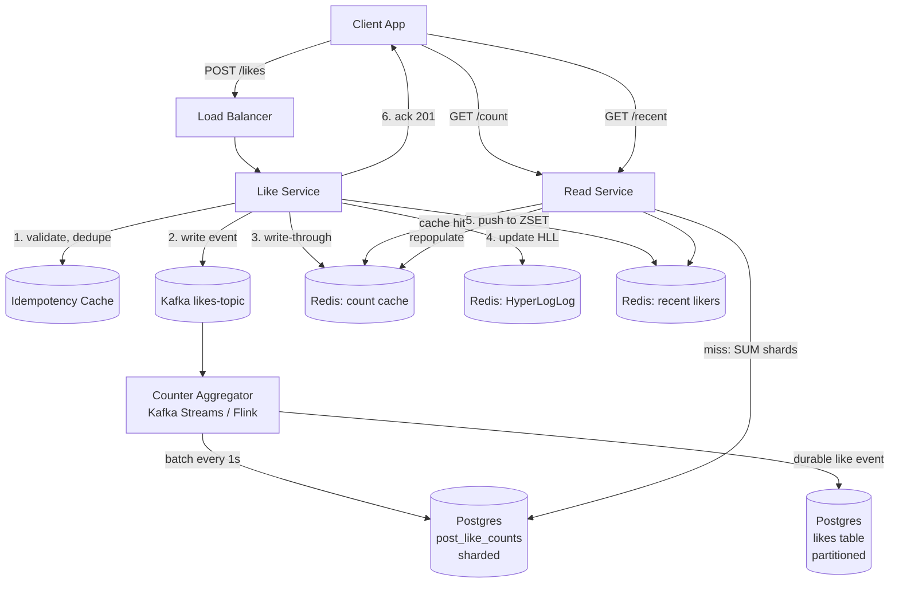

# Design a Likes Counting System — Sharded Counters, Write Buffers, and Approximate Aggregation

**Date:** 2026-04-25 | **Updated:** 2026-04-25
**Tags:** `system-design` `case-study` `likes-counter` `sharded-counters` `aggregation`

## Table of Contents

- [Summary](#summary)
- [Functional Requirements](#functional-requirements)
- [Non-Functional Requirements](#non-functional-requirements)
- [Capacity Estimation](#capacity-estimation)
- [API Design](#api-design)
- [Data Model](#data-model)
- [High-Level Design](#high-level-design)
- [Deep Dives](#deep-dives)
  - [1. Sharded Counters — Splitting the Hot Row](#1-sharded-counters--splitting-the-hot-row)
  - [2. Write-Buffer Pipeline — Kafka to Aggregator to DB](#2-write-buffer-pipeline--kafka-to-aggregator-to-db)
  - [3. Real-Time Approximate Count — Redis INCR vs Durable Postgres](#3-real-time-approximate-count--redis-incr-vs-durable-postgres)
  - [4. Idempotency — One Like Per User Per Post](#4-idempotency--one-like-per-user-per-post)
  - [5. Caching Strategy for Hot Counts](#5-caching-strategy-for-hot-counts)
  - [6. HyperLogLog for Unique-Liker Estimation](#6-hyperloglog-for-unique-liker-estimation)
  - [7. Recent Likers List — Bounded LRU per Post](#7-recent-likers-list--bounded-lru-per-post)
  - [8. Display Strategy — "1.2M" During Virality](#8-display-strategy--12m-during-virality)
  - [9. Anti-Pattern: Single-Row UPDATE on a Hot Post](#9-anti-pattern-single-row-update-on-a-hot-post)
- [Bottlenecks & Trade-offs](#bottlenecks--trade-offs)
- [Anti-Patterns](#anti-patterns)
- [Related](#related)
- [References](#references)

## Summary

A likes counter looks like the simplest feature in social media — `count++`. At scale, it is one of the hardest. A single viral post can attract **10,000+ likes per second**, every one of them is a write, every read is fanned out across the home feed, search results, push notifications, and the post detail page. A naïve `UPDATE posts SET likes = likes + 1 WHERE id = ?` collapses under hot-row contention within minutes.

The realistic design accepts three trade-offs:

1. **Likes are eventually consistent.** A few seconds of staleness is acceptable.
2. **Exact precision is not required at large counts.** "1.2M" vs "1.2M+5" is indistinguishable to a human.
3. **Writes are absorbed before they touch durable storage.** Kafka or an in-memory counter cluster sits in front of the database.

Once you accept those, the design is a layered pipeline: idempotent write API → Kafka event log → sharded counter aggregator → batch flush to Postgres → Redis cache for reads → HyperLogLog for unique-liker counts → bounded list for "recent likers."

## Functional Requirements

| Requirement | Notes |
|---|---|
| **Like a post** | `POST /posts/{id}/likes` — idempotent per user (a second click toggles to unlike) |
| **Unlike a post** | `DELETE /posts/{id}/likes` |
| **Total like count** | `GET /posts/{id}/likes/count` — must work at every surface where the post appears (feed, profile, search, notifications) |
| **Recent likers list** | `GET /posts/{id}/likes/recent` — last N (~100) likers, ordered by recency |
| **"Did I like this?"** | Each viewer must know whether *they* liked it, even if total count is approximate |
| **Count consistency across surfaces** | Same number on feed, post page, profile — within a small time window |

Out of scope for this design:
- Like notifications (push fan-out is a separate system)
- Anti-fraud / bot detection (separate signal pipeline)
- Per-region compliance (e.g., hiding counts in some markets)

## Non-Functional Requirements

| NFR | Target |
|---|---|
| **Write throughput per viral post** | 10,000 likes/sec sustained, 50,000 likes/sec burst |
| **Aggregate platform write rate** | 500K–1M likes/sec at peak across all posts |
| **Read throughput** | 10M–50M count reads/sec (every feed render is a read) |
| **Read latency p99** | < 20 ms for cached count |
| **Write latency p99** | < 100 ms perceived (count update can lag by seconds) |
| **Eventual consistency window** | < 5 seconds for hot posts, < 30 seconds for cold posts |
| **Precision** | Exact for counts < 1000; ±0.1% acceptable for counts > 100K |
| **Durability** | A like must never be silently lost; idempotent retries OK |
| **Availability** | 99.99% — likes degrade to "stale count" before they degrade to "down" |

The phrase to internalize: **count accuracy is negotiable; durability of the like event is not**. Lose precision under load; never lose the user's action.

## Capacity Estimation

### Baseline

- **Posts per day:** 500M
- **Likes per post (avg):** 20
- **Likes per day:** 10B → **~115K likes/sec average, ~1M/sec peak**

### Viral post scenario

- **Top-10 posts per day** can each hit 1M+ likes
- **Peak engagement window:** first 30 minutes after a celebrity post
- **Peak rate per post:** 10K likes/sec sustained, 50K spike

### Storage

| Item | Size | 1-year volume |
|---|---|---|
| Like event (post_id, user_id, ts) | ~40 B | 10B/day × 365 × 40 B ≈ **150 TB/year** |
| Aggregate count row (post_id, count) | ~24 B | 500M × 365 × 24 B ≈ 4.4 TB |
| Recent likers (cap 100) | ~4 KB/post | 100M hot posts × 4 KB ≈ 400 GB cache |

### Reads vs writes

- **Read:write ratio: ~50:1.** Every feed scroll renders 20 posts; each render reads 20 like counts. One like generates ~50 reads in subsequent feed renders.
- This ratio is the single most important number — it tells you to **optimize aggressively for read** (precomputed, cached, denormalized) and **buffer writes** (async aggregation).

## API Design

```http
POST /v1/posts/{post_id}/likes
Authorization: Bearer <token>
Idempotency-Key: <uuid>

201 Created
{
  "post_id": "p_abc",
  "liked": true,
  "approximate_count": 12453
}
```

```http
DELETE /v1/posts/{post_id}/likes
Authorization: Bearer <token>

204 No Content
```

```http
GET /v1/posts/{post_id}/likes/count
GET /v1/posts/{post_id}/likes/count?precise=true   # forces shard fan-in (slower)

200 OK
{
  "post_id": "p_abc",
  "count": 12453,
  "display": "12.5K",
  "precision": "approximate",
  "as_of": "2026-04-25T10:31:02Z"
}
```

```http
GET /v1/posts/{post_id}/likes/recent?limit=100

200 OK
{
  "post_id": "p_abc",
  "recent_likers": [
    {"user_id": "u_1", "username": "alice", "liked_at": "..."},
    ...
  ],
  "truncated": true
}
```

Two design points worth calling out:

- **`Idempotency-Key`** lets the client safely retry a flaky network without double-counting. The like service stores the key for 24h.
- **`approximate_count` field name is deliberate.** The contract says "this is not exact," so clients cannot build features that rely on exactness.

## Data Model

### Source-of-truth event log (durable)

```sql
CREATE TABLE likes (
  post_id     BIGINT NOT NULL,
  user_id     BIGINT NOT NULL,
  liked_at    TIMESTAMPTZ NOT NULL DEFAULT NOW(),
  PRIMARY KEY (post_id, user_id)              -- idempotency built in
) PARTITION BY HASH (post_id);
-- 64 partitions, each on its own tablespace
```

Partitioning by `post_id` localizes writes for a single post to one partition (better cache behavior) and lets us scale by adding partitions, not rewriting tables. The composite primary key `(post_id, user_id)` enforces "one like per user per post" at the storage layer — no race condition can produce a duplicate.

### Aggregated count table (read-optimized)

```sql
CREATE TABLE post_like_counts (
  post_id     BIGINT NOT NULL,
  shard_id    SMALLINT NOT NULL,        -- 0..N-1, N depends on post heat
  count       BIGINT NOT NULL DEFAULT 0,
  updated_at  TIMESTAMPTZ NOT NULL DEFAULT NOW(),
  PRIMARY KEY (post_id, shard_id)
);
```

To get the total: `SELECT SUM(count) FROM post_like_counts WHERE post_id = ?`. This is the **sharded counter** trick — covered in deep dive #1.

### Recent likers (Redis sorted set)

```
ZADD post:p_abc:recent_likers <unix_ts> u_42
ZREMRANGEBYRANK post:p_abc:recent_likers 0 -101    # cap at 100
```

### Hot count cache (Redis string)

```
SET post:p_abc:like_count 12453 EX 60   # 60s TTL with jitter
INCR post:p_abc:like_count              # write-through during like
```

### Unique likers HyperLogLog

```
PFADD post:p_abc:unique_likers u_42
PFCOUNT post:p_abc:unique_likers
```

## High-Level Design



The flow on a like:

1. Client POSTs with an `Idempotency-Key`.
2. Like service checks the idempotency cache; if seen, return cached response.
3. Like service writes the like event to Kafka **synchronously** (this is the durability guarantee).
4. Like service updates Redis: `INCR` the count, `PFADD` the user to the HLL, `ZADD` to the recent-likers ZSET.
5. Like service returns 201 with the *current cached count*.
6. **Asynchronously**, the aggregator consumes from Kafka, batches per-second updates, and flushes to Postgres (both `likes` and `post_like_counts`).

The flow on a read:

1. Read service hits Redis. ~99% of hot reads stop here.
2. On cache miss, fall back to `SELECT SUM(count) FROM post_like_counts WHERE post_id = ?`.
3. Repopulate Redis with TTL+jitter.

## Deep Dives

### 1. Sharded Counters — Splitting the Hot Row

The naïve schema is one row per post:

```sql
UPDATE posts SET like_count = like_count + 1 WHERE id = ?;
```

Under 10K writes/sec to the same row, every transaction acquires a row lock, serializes through the WAL, and competes for the same buffer page. Postgres tops out around 1K–2K writes/sec on a single hot row. You will see lock waits dominate; throughput collapses.

**The fix: split the counter into N shards.**

```
Post p_abc has 100 shards.
Write: pick shard = random(0..99); UPDATE post_like_counts SET count = count + 1 WHERE post_id = 'p_abc' AND shard_id = shard;
Read:  SELECT SUM(count) FROM post_like_counts WHERE post_id = 'p_abc';
```

Each write hits a different physical row, so contention is divided by N. The cost is the read: instead of one row fetch, you do an aggregate over N rows. With N = 100, a 10K writes/sec hot post becomes 100 writes/sec per shard — easily handled.

**Choosing N:**

| Post heat | Shards |
|---|---|
| Cold post (< 10 likes/min) | 1 shard (no overhead) |
| Warm (~100/min) | 10 shards |
| Hot (~1K/sec) | 50 shards |
| Viral (~10K/sec) | 200 shards |

The shard count is **dynamic per post**. A post starts with 1 shard. When the aggregator detects sustained write rate above a threshold (say, 100/sec), it provisions more shards by `INSERT`-ing zero-count rows for the new shard IDs. Shrinking is harder — typically posts cool off, but the shards stay; storage cost is negligible.

This pattern matches what Netflix described in their distributed counter abstraction and what Cosmos DB documents as the distributed counter pattern. The trade-off is explicit: **trade write contention for read fan-in**, and you get to tune the trade per post.

### 2. Write-Buffer Pipeline — Kafka to Aggregator to DB

Even with sharded counters, hammering Postgres with 1M individual writes/sec is wasteful. Each transaction has commit overhead; the WAL becomes the bottleneck.

**Solution: buffer writes in Kafka and aggregate per second.**

```
Client → Like Service → Kafka topic "likes-events" (partitioned by post_id)
                                    ↓
                          Kafka Streams aggregator
                          (windowed: 1-second tumbling)
                                    ↓
                          Per (post_id, shard_id): emit total delta
                                    ↓
                          Batch UPDATE post_like_counts
                          SET count = count + delta
```

Concretely, in 1 second the aggregator might see:

```
post=p_abc shard=42  +127 likes
post=p_abc shard=17  +98 likes
post=p_xyz shard=3   +5 likes
```

That becomes 3 batched UPDATE statements instead of 230. **Throughput improves by 30–100×**, latency stays under a second, and the durable like event is in Kafka the entire time (replayable on aggregator failure).

Kafka partitioning by `post_id` keeps all events for a single post on the same partition, so a single aggregator instance owns the windowed state for that post — no cross-instance coordination needed. This is the same Kafka Streams stateful aggregation pattern Confluent documents for event aggregators.

The `likes` table (the durable per-user record) is written by a separate consumer in batches of ~1000 rows per `INSERT ... ON CONFLICT DO NOTHING`. The `ON CONFLICT` makes the consumer naturally idempotent against Kafka redelivery.

### 3. Real-Time Approximate Count — Redis INCR vs Durable Postgres

The aggregator pipeline has a 1-second floor. Users expect the count to bump *immediately* when they tap like. So we run two systems in parallel:

| Layer | Latency | Durability | Accuracy |
|---|---|---|---|
| **Redis `INCR post:like_count`** | sub-millisecond | lossy on Redis crash | drifts ±0.5% |
| **Postgres aggregated table** | 1–5 sec lag | durable | exact (after settle) |

The like service does **both**: write to Kafka (durable path), and `INCR` Redis (immediate UI feedback). The user sees the bump instantly. The aggregator settles the exact number into Postgres asynchronously.

**What if Redis crashes?** The cached count is gone. On the next read, fall back to `SELECT SUM(count) FROM post_like_counts` — accurate up to the last aggregator flush. Repopulate Redis from Postgres. The drift since the last flush (a few seconds of likes) is recovered when the aggregator catches up. **No lost likes** because the durable record is in Kafka, not Redis.

Redis `INCR` is atomic and O(1), so there is no race between the like service incrementing and the read service reading. Documented behavior — see Redis INCR docs in references.

### 4. Idempotency — One Like Per User Per Post

The `Idempotency-Key` header guards against client retries within a request boundary. The PRIMARY KEY `(post_id, user_id)` on the `likes` table guards against everything else.

```sql
INSERT INTO likes (post_id, user_id, liked_at)
VALUES (?, ?, NOW())
ON CONFLICT (post_id, user_id) DO NOTHING
RETURNING xmax = 0 AS was_inserted;
```

`was_inserted = true` → it's a new like → emit Kafka event → bump counter.
`was_inserted = false` → user already liked it → no-op, return existing state.

This puts the dedup contract in the database, not in application code. **No race condition can produce two like records.** Application bugs that double-fire `INCR` on Redis will drift the cached count, but the durable record is correct, so the next aggregator flush re-syncs.

Unliking is a `DELETE FROM likes WHERE post_id = ? AND user_id = ?` plus a Kafka tombstone event that the aggregator translates to `count = count - 1`.

### 5. Caching Strategy for Hot Counts

Reads dominate at 50:1. The cache must absorb essentially all traffic for hot posts.

**Three-tier cache strategy:**

1. **Pinned hot set.** The top-10K trending posts get permanent Redis entries, refreshed every 5 seconds by a background job that runs `SELECT SUM(count)`. No TTL — these never expire.
2. **TTL with jitter for warm posts.** Posts in the warm tier (top-1M) get `SET ... EX 60` with ±10s jitter so cache stampedes don't synchronize.
3. **Cold posts.** No caching; read straight from Postgres, which is fast enough at low QPS.

The jitter is critical. If 100K cache entries all expire at exactly `t = 12:00:00`, the next read on each triggers a Postgres query — a thundering herd of 100K queries hits the DB simultaneously. Jitter spreads them across 20 seconds.

For **truly hot** entries (Beyoncé just posted), use **single-flight locking** via `SET NX`:

```
SETNX post:p_abc:lock 1 EX 5
  → if I got the lock: refresh from DB, write back to cache, release lock
  → if I didn't: return stale value, retry in 50ms
```

This is the Memcache lease mechanism Instagram engineering describes — only one request per server fetches from the DB during a cache miss; everyone else waits or serves stale.

### 6. HyperLogLog for Unique-Liker Estimation

For a feature like "1.2M people liked this, including 47 of your friends," we need set membership and cardinality, not just a counter.

Storing the full set of likers per post takes too much memory: a viral post with 10M likers stores ~80 MB just for user IDs. **Redis HyperLogLog** estimates the cardinality with ~0.8% standard error using only 12 KB.

```
PFADD post:p_abc:unique_likers u_42 u_43 u_44
PFCOUNT post:p_abc:unique_likers     → 12451 (estimate, ±0.8%)
PFMERGE friends_who_liked post:p_abc:unique_likers user:me:friends_hll
PFCOUNT friends_who_liked            → 47 (estimate)
```

The trade-off is acknowledged: HLL cannot tell you *whether a specific user* is in the set (no membership test). For "did I like this?" we still consult the `likes` table or a per-user Redis set. HLL is only for "how many distinct."

YouTube uses the same approach for unique viewer counts. The 0.8% error is invisible to humans at the scales (millions+) where you'd reach for HLL.

### 7. Recent Likers List — Bounded LRU per Post

"Liked by alice, bob, and 1.2M others" requires the most recent ~100 likers, not all of them.

**Redis sorted set, capped:**

```redis
MULTI
  ZADD post:p_abc:recent_likers <unix_ts_ms> u_42
  ZREMRANGEBYRANK post:p_abc:recent_likers 0 -101
EXEC
```

`ZADD` inserts ranked by timestamp; `ZREMRANGEBYRANK` keeps the highest 100. Constant memory per post regardless of viral volume. Reads:

```redis
ZREVRANGE post:p_abc:recent_likers 0 99 WITHSCORES
```

For a viral post receiving 10K likes/sec, this means 10K ZADDs/sec to a single ZSET — Redis handles this comfortably (single-threaded, in-memory). The ZSET also doubles as a recency feed for "your friend X just liked Y."

If the Redis instance for a post fails over, the ZSET is reconstructable from the durable `likes` table by `ORDER BY liked_at DESC LIMIT 100`. Slow path; acceptable during failure recovery.

### 8. Display Strategy — "1.2M" During Virality

Once a count crosses thresholds, **stop showing exact numbers**. The display layer rounds:

| Range | Display |
|---|---|
| < 1,000 | exact: `847` |
| 1K–999K | `12.5K` |
| 1M–999M | `1.2M` |
| ≥ 1B | `1.2B` |

This is not just a UX choice — it's a **system design lever**. When a post is viral and the display is "1.2M," the count cache can be stale by 10K likes and *no user notices*. We can extend cache TTL during virality, reducing DB pressure exactly when DB pressure peaks.

The `precise=true` query parameter exists for internal tools (analytics, creator dashboards) that need the exact number. That path forces a `SUM` over all shards and is rate-limited.

### 9. Anti-Pattern: Single-Row UPDATE on a Hot Post

This deserves repetition because it's the #1 mistake in interview answers and real implementations:

```sql
-- DO NOT DO THIS at scale.
UPDATE posts SET like_count = like_count + 1 WHERE id = ?;
```

Failure modes you will observe:

1. **Lock contention.** Every transaction acquires a row-level exclusive lock. Throughput on the row plateaus around 1K–2K/sec on Postgres, less on MySQL with row locks.
2. **WAL serialization.** All updates to that row write WAL entries that must be flushed in order. The WAL writer becomes the bottleneck.
3. **Replica lag.** Hot-row updates dominate replication; read replicas fall behind. Reads from replicas show stale counts that appear to *jump* when replication catches up.
4. **Buffer pool churn.** The page holding that row is constantly dirty, constantly being flushed. It evicts pages your other queries need.
5. **Vacuum bloat.** Each UPDATE in Postgres creates a new tuple version; the row's heap grows; HOT updates help only until the page fills. Autovacuum runs constantly on that table.

The full fix is everything in deep dives 1–3 combined: shard the counter, buffer writes through Kafka, batch the aggregator. There is no shortcut.

## Bottlenecks & Trade-offs

| Component | Bottleneck | Mitigation |
|---|---|---|
| Like service | Synchronous Kafka write latency | Local async batching with strict timeout; Kafka producer with `acks=1` not `all` for like events |
| Kafka | Partition count limits parallelism per post | Sub-partition by `(post_id, user_id_hash)` if a single post saturates one partition |
| Aggregator | Stateful window state size for top-N posts | Use RocksDB-backed state stores (Kafka Streams default); checkpoint to changelog topic |
| Postgres | Sharded counter aggregation cost on read | Materialize a `post_total_count` row updated every 30s by a background job; serve `precise=false` from there |
| Redis | Single-shard hot key (one post = one Redis key) | Hash-tag the key onto a specific cluster slot; for absolute mega-keys, mirror across multiple Redis instances and read random one |
| HLL accuracy | 0.8% error invisible at 1M+ but visible at 1K | Don't use HLL below 10K likes; use the exact `likes` table |
| Recent-likers ZSET | Single ZSET per post becomes hot under virality | Split into N rotating ZSETs, merge on read |

The headline trade-off is **consistency vs throughput**. We pick eventual consistency at every layer that can tolerate it (count display, recent-likers, HLL) and exact consistency only where the user notices (idempotency, did-I-like-this). This single decision is what makes the system feasible.

## Anti-Patterns

1. **Single-row UPDATE counter on the post row.** Covered in deep dive #9. Do not do this.
2. **`SELECT COUNT(*) FROM likes WHERE post_id = ?` on every read.** A full count over a viral post's likes is a 10M-row scan. The denormalized counter row exists for this exact reason.
3. **No idempotency on the API.** Mobile clients retry constantly on flaky networks. Without `Idempotency-Key` plus the unique constraint, you'll see double-counts in the cache and chaos in your tests.
4. **Reading from Redis without a fallback path.** When Redis fails, the read service must transparently fall back to Postgres `SUM`. Treating Redis as the source of truth means a Redis crash takes likes down.
5. **Storing per-like rows in Redis as the primary store.** Memory cost explodes; durability is wrong; this is what Postgres + partitioning is for.
6. **Synchronous fan-out to push notifications inside the like request.** That coupling makes the like API as slow as the notification system. Fan-out belongs on a separate Kafka consumer.
7. **Uniform shard count for every post.** Cold posts don't need 100 shards (it makes reads 100× slower for no benefit). Hot posts need 100+ shards. Shard count must be adaptive.
8. **Cache TTL without jitter.** Synchronized expirations cause thundering herds. Always add ±10–20% random jitter.
9. **Trying to make HyperLogLog "exact" by also storing the full set.** Defeats the purpose. If you need exact unique counts, use the `likes` table. If you can tolerate 0.8% error, use HLL alone.
10. **Counting likes in the same database transaction as the post creation.** The post insert and the like counter belong in different consistency domains. Keep them decoupled.

## Related

- [Designing a Real-Time Leaderboard](../counting-ranking/design-realtime-leaderboard.md) — the same sharded-counter and Redis ZSET techniques applied to top-N ranking.
- [Sharding Strategies](../../scalability/sharding-strategies.md) — generalized partitioning patterns; the shard-per-post-heat approach here is one instance.
- [Caching Layers](../../building-blocks/caching-layers.md) — TTL with jitter, write-through, single-flight, and cache-aside patterns used throughout this design.

## References

- [Redis INCR command — official docs](https://redis.io/docs/latest/commands/incr/) — atomic counter semantics, O(1), 64-bit signed integer.
- [Redis HyperLogLog — official docs](https://redis.io/docs/latest/develop/data-types/probabilistic/hyperloglogs/) — 12 KB cardinality estimation with ~0.8% standard error.
- [Redis PFCOUNT command](https://redis.io/docs/latest/commands/pfcount/) — read-side cardinality of one or merged HLLs.
- [Netflix's Distributed Counter Abstraction — Netflix Tech Blog](https://netflixtechblog.com/netflixs-distributed-counter-abstraction-8d0c45eb66b2) — production sharded counter design and shard-count tuning.
- [Azure Cosmos DB Distributed Counter pattern](https://devblogs.microsoft.com/cosmosdb/azure-cosmos-db-design-patterns-part-3-distributed-counter/) — alternate documentation of the same sharded-counter trade-offs.
- [Instagration Pt. 2 — Instagram Engineering](https://instagram-engineering.com/instagration-pt-2-scaling-our-infrastructure-to-multiple-data-centers-5745cbad7834) — memcache counter denormalization and lease mechanism for thundering herds.
- [How Twitter does event processing — 400 billion daily events](https://engineeringatscale.substack.com/p/twitter-event-processing-kappa-lambda) — Kafka + Heron + Manhattan + Nighthawk pipeline that includes engagement counters.
- [Designing a Video View Count System Like YouTube](https://medium.com/@ankitviddya/designing-a-video-view-count-system-like-youtube-29bbc01e6e71) — Lambda architecture, HyperLogLog usage, fast-vs-accurate trade-off.
- [Kafka Streams stateful aggregation patterns — Confluent](https://developer.confluent.io/patterns/stream-processing/event-aggregator/) — windowed aggregation pattern used in the write-buffer pipeline.
- [Sharded Counters System Design — Stackademic](https://blog.stackademic.com/sharded-counters-system-design-likes-views-trending-counts-52747eeb11dd) — worked example of likes/views/trending counters with shard math.
