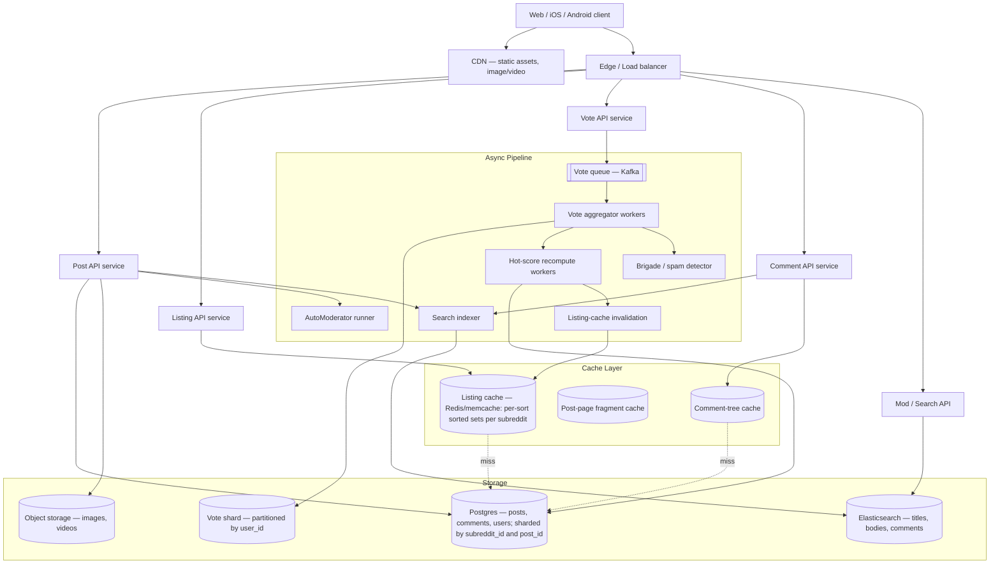

# Design Reddit — Subreddits, Threaded Comments, Voting, and the Hot/Best Ranking Math

**Date:** 2026-04-25 | **Updated:** 2026-04-25
**Tags:** `system-design` `case-study` `reddit` `forum` `ranking`

## Table of Contents

- [Summary](#summary)
- [Functional Requirements](#functional-requirements)
- [Non-Functional Requirements](#non-functional-requirements)
- [Capacity Estimation](#capacity-estimation)
- [API Design](#api-design)
- [Data Model](#data-model)
- [High-Level Architecture](#high-level-architecture)
- [Deep Dives](#deep-dives)
  - [Ranking Algorithms — Hot, New, Top, Controversial](#ranking-algorithms--hot-new-top-controversial)
  - [Hot Re-computation Pipeline](#hot-re-computation-pipeline)
  - [Comment Trees and Best Sort (Wilson)](#comment-trees-and-best-sort-wilson)
  - [Voting at Scale](#voting-at-scale)
  - [Cache Strategy](#cache-strategy)
  - [Mod Tools and AutoModerator](#mod-tools-and-automoderator)
  - [Search](#search)
  - [Anti-Spam and Vote Brigading](#anti-spam-and-vote-brigading)
- [Bottlenecks and Trade-offs](#bottlenecks-and-trade-offs)
- [Anti-Patterns](#anti-patterns)
- [Related](#related)
- [References](#references)

## Summary

Reddit is a federation of communities ("subreddits") where users submit posts, vote on them, and reply with **threaded comments** that themselves get voted on. The hard system-design problems are not creating posts — those are cheap writes — but **ranking** (Hot, Best, Top, Controversial), **comment-tree storage and sort**, and **read amplification**: every post page is denormalized into many cached fragments because read-to-write ratio is roughly 100:1. The classic Reddit Hot formula `sign(score) * log10(|score|) + age/45000` is deceptively simple but encodes the entire dynamic of the front page: votes have **logarithmic** value and time is linear, so a fresh post needs exponentially more upvotes to overtake an older one as time passes.

This case study walks through the request path, the ranking math, comment-tree storage trade-offs (closure table vs path enumeration vs adjacency list), the vote pipeline (sharded counters, vote fuzzing, brigade detection), and the moderator stack (AutoModerator, report queue, shadow bans).

## Functional Requirements

**Core:**

1. **Subreddits** — users create and join communities; each has its own moderators, rules, and feed.
2. **Posts** — text, link, image, or video. Belong to exactly one subreddit. Have a title, body, author, timestamp, and vote tally.
3. **Threaded comments** — every post has a comment tree of arbitrary depth. Each comment has a `parent_id` (a comment or the post itself).
4. **Voting** — each user casts at most one vote (`+1`, `-1`, or none) per post and per comment. Changeable.
5. **Ranking modes per listing:**
   - **Hot** — the default; popularity decayed by age.
   - **New** — strict reverse chronological.
   - **Top** — highest score within a time window (hour, day, week, month, year, all).
   - **Controversial** — high vote volume with near-50/50 up/down split.
   - **Rising** — gaining velocity faster than the cohort.
6. **Comment sorts** — Best (Wilson lower bound), Top, New, Controversial, Old, Q&A.
7. **Search** — full-text over titles, bodies, and comments; subreddit-scoped or global.
8. **Mod tools** — AutoModerator rules, report queue, ban/mute, post/comment removal, shadow ban, sticky/distinguish.

**Out of scope for this HLD:** chat/DMs, awards/coins, video transcoding, ads, recommendations beyond the basic ranking feed.

## Non-Functional Requirements

| Property | Target |
|---------|--------|
| Read availability | 99.95% (front page must always render, even if degraded) |
| Write availability | 99.9% (post/comment/vote) |
| Read latency p99 | < 200 ms for a cached listing; < 500 ms for a hot post page |
| Write latency p99 | < 300 ms for a vote |
| Read:write ratio | ~100:1 — listings, post pages, and comment trees are read constantly |
| Burst tolerance | A hot AMA or breaking-news thread can pull tens of thousands of comments in minutes; the comment tree must remain navigable |
| Ranking freshness | Hot listings recomputed within seconds-to-minutes of vote arrival |
| Durability | Posts and comments are durable (treat as system-of-record); votes can be eventually consistent |

## Capacity Estimation

Use round numbers; the goal is to size the right components, not to be exact.

| Quantity | Rough scale |
|----------|------------|
| Registered users | ~1 B (active monthly: ~100 M) |
| Subreddits | ~3 M (long tail; top 1k drive most traffic) |
| Posts | ~100 M / month → ~1 B / year |
| Comments | ~500 M / month → comment:post ratio ~5:1 |
| Votes | Comments and posts together: ~10 B / month → ~4 k votes/sec average, 10–50× burst |
| Page views | Tens of billions / month → ~50–100 k req/sec average, ~500 k peak |
| Search QPS | ~10 k req/sec |

Storage back-of-envelope:

- Average post row ≈ 1 KB metadata + a few KB body. 1 B posts × ~5 KB ≈ **5 TB** of post body, plus indexes.
- Comments are smaller — 1 B comments × 500 B ≈ **500 GB** core, but indexes and tree-structure tables roughly double that.
- Votes are the volume problem — 100 B lifetime votes × 24 B per row ≈ **2.4 TB**, before partitioning.
- Hot post page cache (top ~100 k posts × ~50 KB rendered fragments) ≈ **5 GB** — easily fits in memcache.

This is a read-heavy, cache-heavy system where the working set fits in RAM across the fleet.

## API Design

REST, JSON, cursor-paginated. Cursors are opaque (encoded `(rank_score, post_id)` tuples) — never offset-based, because offsets break under concurrent inserts.

### Listings

```http
GET /r/{subreddit}/hot?limit=25&after={cursor}
GET /r/{subreddit}/new?limit=25&after={cursor}
GET /r/{subreddit}/top?t=day&limit=25&after={cursor}
GET /r/{subreddit}/controversial?t=week
GET /r/all/hot          # union of subscribed subreddits or globally curated
GET /r/popular/hot      # excludes NSFW and private
```

Response envelope:

```json
{
  "data": {
    "after": "t3_abc123",
    "before": null,
    "children": [
      {
        "kind": "t3",
        "data": {
          "id": "abc123",
          "title": "...",
          "score": 4821,
          "ups": 5102,
          "downs": 281,
          "num_comments": 412,
          "created_utc": 1714000000,
          "subreddit": "programming",
          "permalink": "/r/programming/comments/abc123/...",
          "author": "u/jane"
        }
      }
    ]
  }
}
```

### Posts and comments

```http
POST   /r/{subreddit}/submit
GET    /comments/{post_id}?sort=best&limit=200&depth=10
POST   /comments/{post_id}/reply        # body: {parent_id, text}
GET    /comments/{post_id}/more?children=cid1,cid2,...   # "load more comments"
```

The comment tree is delivered with a **bounded depth and breadth** per request — Reddit's API never returns the full tree. Hidden subtrees become "load more" stubs the client expands on demand.

### Votes

```http
POST /api/vote
Body: {"id": "t3_abc123", "dir": 1}     # 1 = up, -1 = down, 0 = clear
```

Vote is fire-and-forget from the client's perspective — it returns 200 fast, the actual aggregate update is asynchronous. This is critical for latency at scale.

### Mod actions

```http
POST /r/{subreddit}/api/remove           {id, mod_note}
POST /r/{subreddit}/api/ban              {user, duration, reason}
POST /r/{subreddit}/api/sticky           {id}
GET  /r/{subreddit}/about/reports
GET  /r/{subreddit}/about/modqueue
```

## Data Model

Logical schema. Sharding strategy in the deep dives.

```text
user
  user_id PK
  username UNIQUE
  email
  password_hash
  created_utc
  karma_post (denormalized)
  karma_comment (denormalized)
  is_shadow_banned

subreddit
  subreddit_id PK
  name UNIQUE
  description
  type (public/private/restricted)
  created_utc
  subscriber_count (denormalized)

subreddit_member
  (subreddit_id, user_id) PK
  role (member/mod/admin)
  joined_utc

post
  post_id PK             -- monotonic, used for partitioning
  subreddit_id FK
  author_id FK
  title
  body / url
  kind (text/link/image/video)
  created_utc
  ups, downs (denormalized counters)
  hot_score      -- precomputed
  best_score
  controversy
  is_removed
  is_locked
  flair_id

comment
  comment_id PK          -- monotonic
  post_id FK
  parent_id FK NULL      -- NULL means top-level reply to the post
  author_id FK
  body
  created_utc
  ups, downs
  best_score             -- Wilson lower bound, see deep dive
  is_removed

comment_path                  -- closure table; see deep dive
  ancestor_id, descendant_id, depth

vote
  user_id, target_id PK   -- target is post_id or comment_id (typed prefix)
  direction (-1, 0, +1)
  created_utc

mod_action
  action_id PK
  subreddit_id, mod_id, target_id
  type (remove/approve/ban/sticky)
  created_utc, reason

automod_rule
  subreddit_id, rule_yaml, enabled, version
```

A few choices worth flagging up front:

- **Vote denormalization** — `post.ups` and `post.downs` are eventually consistent, updated by an asynchronous aggregator. The authoritative tally lives in the partitioned `vote` table.
- **Closure table** for comments — see the comment-tree deep dive for why this beats adjacency-list-only and recursive CTEs at scale.
- **Hot score on the row** — `post.hot_score` is denormalized so listings are pure index range scans, not per-row computations.

## High-Level Architecture



Request flow at a glance:

1. **Listing read** (`GET /r/X/hot`) — service hits the listing cache (a sorted set per `(subreddit, sort_mode)`). Cache miss falls back to a Postgres query on `(subreddit_id, hot_score DESC)` and rewarms.
2. **Post page read** (`GET /comments/{id}`) — fragment cache for the post body + a separate cache for the rendered comment tree. Cache miss reconstructs the tree from the closure table.
3. **Vote write** — service writes to Kafka and returns immediately. The aggregator updates the `vote` row, increments counters, marks the post as "needs hot recompute", and enqueues spam checks.
4. **Hot recompute** — periodic workers scan posts within a 24-hour window where the dirty bit is set, recompute `hot_score`, and write back. The listing cache invalidation/refresh follows.

Reddit historically ran on **Postgres + memcache + Cassandra**, and more recently consolidated some metadata onto Aurora Postgres for ad-hoc queryability. The storage choices in this HLD reflect the same pattern: Postgres for the relational core, an aggressive cache layer for read amplification, and a queue for vote write smoothing.

## Deep Dives

### Ranking Algorithms — Hot, New, Top, Controversial

These are the classic Reddit formulas, popularised by Amir Salihefendic's analysis of the open-source Reddit code. They are simple — that is the point — but they shape the entire user experience.

#### Hot (story ranking)

```python
import math
from datetime import datetime

EPOCH = datetime(2005, 12, 8, 7, 46, 43)  # Reddit's birthday

def epoch_seconds(dt):
    td = dt - EPOCH
    return td.days * 86400 + td.seconds + td.microseconds / 1e6

def hot(ups, downs, created_utc):
    s = ups - downs
    order = math.log10(max(abs(s), 1))
    sign = 1 if s > 0 else (-1 if s < 0 else 0)
    seconds = epoch_seconds(created_utc) - 1134028003
    return round(sign * order + seconds / 45000, 7)
```

Three things are happening at once:

- `log10(|score|)` — votes have **diminishing returns**. The first 10 upvotes are worth as much as the next 100, which are worth as much as the next 1,000. This is what stops a single mega-thread from sitting on the front page forever.
- `sign(score) * order` — a heavily downvoted post sinks proportionally to a heavily upvoted post rising.
- `seconds / 45000` — time is **linear and forward-only**. Every 45,000 seconds (≈12.5 hours) of newer submission age is worth one full order of magnitude in votes. This is why Hot has a natural ~24-hour half-life: a 24-hour-old post needs ~100× the votes of a 12-hour-old one to appear at the same position.

The score grows monotonically with time, so older posts are eventually buried no matter how popular — exactly what you want for a front page.

#### New

```sql
ORDER BY created_utc DESC
```

Trivially indexed. The cache key is `(subreddit_id, "new")` and is invalidated on every post insert.

#### Top

```sql
WHERE created_utc >= now() - interval '1 day'
ORDER BY (ups - downs) DESC
```

Indexed on `(subreddit_id, created_utc, score)`. The trick is that `t=hour`, `t=day`, `t=week`, etc. are all distinct cache entries — a post can be "Top of the hour" without being "Top of the day".

#### Controversial

```python
def controversy(ups, downs):
    if downs <= 0 or ups <= 0:
        return 0
    magnitude = ups + downs
    balance = downs / ups if ups > downs else ups / downs
    return magnitude ** balance
```

High `magnitude` (lots of votes) plus `balance` close to 1 (near 50/50) wins. A post with 5,000 up and 4,800 down beats one with 100,000 up and 100 down — that's the explicit goal.

#### Rising

Heuristic: posts whose vote velocity (votes per minute) is in the top N within their cohort age. Computed by the same workers that maintain Hot.

### Hot Re-computation Pipeline

`hot_score` is denormalized onto the post row so listings are pure index scans. But every vote in principle changes the score. Naively recomputing on every vote would create a write storm during a viral thread.

The compromise:

1. **Vote arrives** → queue, idempotent vote row written, counters bumped, post marked dirty in a `posts_dirty` set (Redis).
2. **Recompute worker** runs every few seconds:
   - Scans `posts_dirty` for posts created in the last 24 hours (older posts will be buried by time anyway — recompute is wasted work).
   - Recomputes `hot_score`, `best_score`, `controversy` in one pass.
   - Writes back via a single batched UPDATE.
   - Pushes affected posts onto the per-subreddit listing's sorted-set in Redis (`ZADD r:{subreddit}:hot {hot_score} {post_id}`).
3. **Listing read** → `ZREVRANGEBYSCORE` on the sorted set, with the post-row fragments hydrated from cache.

Because the score is monotonic in age, posts older than 24 hours fall off the recompute set automatically — Reddit's actual implementation does the same thing, only ranking the ~1,000 most recent posts per subreddit for Hot.

### Comment Trees and Best Sort (Wilson)

#### Storing the tree

A post's comments form a tree of arbitrary depth. The classic options:

| Approach | Read tree | Insert | Delete subtree | Move subtree |
|---------|----------|--------|---------------|--------------|
| **Adjacency list** (`parent_id` only) | recursive CTE — slow at depth | O(1) | recursive | O(1) |
| **Path enumeration** (`/abc/def/ghi`) | LIKE prefix scan | O(1) — append | prefix scan | rewrite paths |
| **Closure table** | one indexed join | one row per ancestor (O(depth) writes) | bulk delete by descendant | rewrite descendant rows |
| **Nested sets** (left/right) | range scan | renumber many rows | renumber | renumber |

For a Reddit-shaped workload — append-heavy, almost no moves, occasional subtree removal by mods — **closure table** wins on read performance with acceptable write cost (depth is bounded in practice; even the deepest threads rarely exceed 30 levels). The closure table looks like:

```text
comment_path(ancestor_id, descendant_id, depth)
  -- one row per (ancestor, descendant) pair, including (X, X, 0)
```

To fetch a subtree:

```sql
SELECT c.*
FROM comment_path p
JOIN comment c ON c.comment_id = p.descendant_id
WHERE p.ancestor_id = :root_comment_id
  AND p.depth <= :max_depth
ORDER BY c.best_score DESC;
```

Some implementations encode the path directly in the `comment_id` (a base-36 string where each character represents a child position) — reads become a prefix scan and inserts skip the closure table entirely, at the cost of a fixed maximum branching factor per level.

#### Best sort — Wilson score lower bound

Comments use **Best** by default, not Hot. Comments don't have the front-page time-decay problem (a comment is only visible inside one post page), so the goal shifts to: "given the votes seen so far, what's a statistically conservative estimate of how good this comment really is?"

The answer is the **Wilson score interval lower bound** at 80% confidence:

```python
import math

def wilson_lower(ups, downs, confidence=0.8):
    n = ups + downs
    if n == 0:
        return 0
    # 80% confidence => z ≈ 1.281552
    z = 1.281551565544600
    p_hat = ups / n
    denom = 1 + z*z / n
    centre = p_hat + z*z / (2*n)
    margin = z * math.sqrt((p_hat*(1-p_hat) + z*z/(4*n)) / n)
    return (centre - margin) / denom
```

The intuition: a comment with 10 up / 1 down gets a higher Best score than one with 40 up / 20 down, because the algorithm is more confident about the true approval rate of the smaller, more lopsided sample. A brand-new comment with 1 upvote does **not** rocket to the top (small `n` → wide interval → low lower bound), which is exactly the goal.

Other comment sorts:

- **Top** — `ORDER BY (ups - downs) DESC`. Vulnerable to early-vote inflation.
- **New** — `ORDER BY created_utc DESC`. The "didn't get seen" rescue sort.
- **Controversial** — same controversy formula as posts.
- **Q&A** — root comments by Wilson, replies grouped by author intent (used in AMAs).

### Voting at Scale

Naive vote handling is `UPDATE post SET ups = ups + 1 WHERE id = ?`. That row becomes a contention hotspot the moment a post hits the front page — every replica blocks on the same row.

The Reddit-style solution has three layers:

1. **Asynchronous write path.** The API endpoint writes the vote intent to Kafka and returns 200 in single-digit milliseconds. The user sees their vote applied client-side immediately (optimistic UI).
2. **Sharded counters.** The aggregator partitions vote work by `post_id mod N`. Within each shard, it batches updates (every ~1 second) and applies them in one UPDATE per post per batch. Counter contention drops by N×.
3. **Idempotency.** The `vote` row is keyed on `(user_id, target_id)`; toggling a vote is an UPSERT that diffs the old direction against the new one and emits the delta to the counter. Replays are safe.

#### Vote fuzzing

The visible `ups` and `downs` numbers on Reddit are **not** the true tallies. Reddit deliberately injects noise into the displayed counts as an anti-spam measure — it makes it harder for vote-manipulation services to confirm whether their bots' votes "took". The internal score used for ranking and the user's own karma calculation use the real numbers; only the public display is fuzzed.

A simple model:

```python
def fuzz(ups, downs):
    if ups + downs < 10:
        return ups, downs            # too small to fuzz meaningfully
    delta = random.randint(0, ups + downs // 5)
    return ups + delta, downs + delta  # net score preserved
```

Net score (`ups - downs`) is preserved so ranking is unaffected.

### Cache Strategy

Read amplification is the dominant cost. The cache hierarchy:

| Layer | What it holds | TTL | Invalidation |
|------|--------------|-----|--------------|
| **CDN** | Static assets, anonymized HTML for top posts | seconds–minutes | Stale-while-revalidate |
| **Listing cache** (Redis sorted sets) | `(subreddit, sort)` → ranked post IDs | rebuilt by recompute worker | Push-based on rank change |
| **Post fragment cache** (memcache) | Rendered post body + metadata | minutes | On edit / removal |
| **Comment tree cache** (memcache) | Top N comments per post under each sort | seconds–minutes | On reply / vote-driven re-rank |
| **Per-user overlays** | "Did I vote on this? Did I subscribe?" | request-scoped | Per-user fetch |

Two important details:

- **Anonymous and logged-in views are separated.** The expensive part — rendering the post body and the top comments — is identical for everyone. Per-user state (vote arrows, hide button state) is layered on top via a thin per-user fetch. This is what lets a single cached fragment serve millions of requests.
- **Hot post pages are pre-warmed.** When a post crosses a popularity threshold, a background job pushes its fragments into all cache regions before traffic spikes. Without this, the first request after a big external link drives a herd of database queries.

### Mod Tools and AutoModerator

Mods own their subreddit. The mod stack:

- **AutoModerator** — a YAML-rules engine running on every new submission and comment. Rules can match on keywords/regex, user karma, account age, domain, flair, or external API checks, and can remove, filter, report, lock, or comment-reply automatically. AutoMod runs synchronously on submit (so removed content never appears) and asynchronously on edits.
- **Report queue** — users hit "report" with a reason; reports land in a per-subreddit queue with the reason, reporter (anonymized to the mod), and target. Mods triage the queue.
- **Mod queue** — items AutoMod filtered (instead of removed outright) plus reported items. Mods approve or remove.
- **Ban / mute** — bans block submission and commenting in that subreddit; mutes block modmail. Both are soft-logged for transparency to the user.
- **Sticky / distinguish / lock** — surface mod posts and freeze threads.
- **Shadow ban** (admin-only) — the user can post but no one else sees their content. Used against spammers; effective because the spammer doesn't know they've been banned and stops trying to evade.

A sample AutoMod rule:

```yaml
type: submission
title (regex): "(?i)\\b(buy|cheap|discount)\\b"
author:
  account_age: "< 7 days"
  comment_karma: "< 10"
action: filter
action_reason: "Possible spam — new account using promo keywords"
```

### Search

Reddit's search has historically been notoriously weak; a serviceable design uses Elasticsearch:

- **Indices**: `posts`, `comments`, separate per shard for write throughput. Index on `title^3, body, subreddit, author, flair, created_utc, score`.
- **Indexer**: a Kafka consumer that watches the post/comment write streams and fans out to ES via the bulk API. Eventually consistent — a few seconds of lag is acceptable.
- **Query path**: the search API hits ES, then hydrates results from the post/comment caches.
- **Subreddit-scoped search** uses a `term` filter on `subreddit_id`, which is highly selective.
- **Result ranking** combines Lucene's BM25 with a function score that boosts on `score` and recency.

ES is best-effort. If it's down or stale, post pages and listings still work — search just degrades to "results may be incomplete".

### Anti-Spam and Vote Brigading

Reddit's threat model is unusual: it's mostly individuals organizing manipulation campaigns through other communities, not classic bot farms.

Defenses, roughly in order of cheapness:

1. **Rate limiting.** Per-user, per-IP, per-subreddit on submissions, comments, and votes. New accounts have aggressive caps.
2. **Account-age and karma gates.** AutoMod rules and site-wide policies require minimum age/karma to post in many subreddits. Filters out throwaway-account spam at zero ML cost.
3. **Vote fuzzing.** Already covered — defeats vote-manipulation services' feedback loop.
4. **Brigade detection.** A worker correlates vote spikes with referrer patterns. If a sudden cluster of votes on a post all originate from users who arrived from a single external link (or from another subreddit's discussion), the votes get scaled down or dropped from ranking. The vote rows are kept for forensics; only the ranking effect is suppressed.
5. **Shadow bans and admin actions.** Detected manipulators get shadow-banned site-wide. Their content stops contributing to rankings but they don't know to switch tactics.
6. **CAPTCHA on suspicious flows.** Login from a new IP, posting in a high-spam subreddit, or repeated near-duplicate submissions trigger a challenge.

Reddit publicly overhauled its scoring system in 2016 to be more resilient to vote-manipulation services; the public score now better reflects "real" engagement after fuzzing and brigade scaling.

## Bottlenecks and Trade-offs

| Bottleneck | Trade-off chosen | Cost |
|-----------|------------------|------|
| Vote write contention on hot posts | Async queue + sharded counters + denormalized totals | Counter is eventually consistent; brief disagreement between user's vote and visible count |
| Hot-score staleness | Periodic batch recompute over a 24h window | Vote → ranking lag of seconds-to-minutes; older posts never recomputed |
| Comment-tree depth in SQL | Closure table | O(depth) write amplification per comment, ~2× storage on the path table |
| Listing cache fan-out on every vote | Push the affected posts to per-subreddit sorted sets only | Cold subreddits served from DB; first vote after long quiet period is slow |
| Search consistency | Elasticsearch as a separate eventually-consistent index | Search lags writes by seconds; ES outage degrades but doesn't break the site |
| Vote authenticity | Fuzz public counts, scale brigades down in ranking only | Public vote counts are a lie; legitimate users sometimes feel "cheated" |
| Postgres scaling | Shard by `subreddit_id` for posts/comments, by `user_id` for votes | Cross-shard queries (e.g. "all posts by user X across subreddits") need a scatter-gather or a separate user-feed index |

The deepest tension is the one between **ranking freshness** and **write contention**. Pure real-time ranking would mean recomputing scores on every vote — fine on a small forum, fatal at Reddit scale. Pure batch ranking would mean Hot lags by minutes — visible to users and gamed by spammers. The compromise (per-second batched recompute over a bounded recent window) keeps the feel of real time while bounding the work.

## Anti-Patterns

Things that look reasonable in a small system and break at scale:

- **`UPDATE post SET ups = ups + 1` on the hot path.** Single-row hotspot during viral threads. Use an async aggregator.
- **Recursive CTE for every comment-tree fetch.** Fine at depth 5, dies at depth 30 with thousands of nodes per subtree. Materialize the tree (closure table or path encoding).
- **Recompute Hot for every post in the database every minute.** O(N) where N is billions. Bound the working set to the last 24 hours of dirty posts.
- **One global sorted set keyed by `hot_score`.** Cross-subreddit ranking is a different problem than per-subreddit ranking; mixing them creates a single-key bottleneck.
- **Expose true vote counts directly.** Hands a free oracle to vote-manipulation services. Fuzz the display.
- **Synchronous AutoMod via HTTP to a separate service on every comment.** Embed the rule engine in-process; YAML rules are cheap, network round-trips are not.
- **Index every comment edit immediately into Elasticsearch.** Bulk-index on a few-second cadence; users won't notice the lag and ES write load drops by an order of magnitude.
- **Store votes in a single `votes` table without partitioning.** At billions of rows, even a B-tree index becomes painful. Partition by `user_id` (typical access pattern is "did user X vote on Y?").
- **Trust subreddit subscribers to be honest signal for `r/all`.** Sub-vote-rings can game it. Use weighted, suspicious-activity-discounted counts.
- **Make every page render require a logged-in fetch.** Defeats the entire CDN/anonymous-cache strategy. Separate per-user overlay from the cacheable content.

## Related

- [Design Stack Overflow](design-stack-overflow.md) — adjacent Q&A case study; same hierarchical-comments and reputation-system shape, different ranking philosophy (one accepted answer vs many sorted comments).
- [Design Search Autocomplete](../search-aggregation/design-search-autocomplete.md) — the indexer/search-suggest path that Reddit's subreddit and post search would lean on.
- [Counting and Ranking Patterns](../counting-ranking/) — sibling case studies on top-K, leaderboards, and ranking pipelines that share Reddit's denormalized-counter and recompute-worker patterns.

## References

- [How Reddit ranking algorithms work — Amir Salihefendic](https://medium.com/hacking-and-gonzo/how-reddit-ranking-algorithms-work-ef111e33d0d9) — the canonical walkthrough of Hot, Best, Top, and Controversial with code from the open-source Reddit codebase.
- [Reddit's comment ranking algorithm — Possibly Wrong](https://possiblywrong.wordpress.com/2011/06/05/reddits-comment-ranking-algorithm/) — derivation of the Wilson score interval and why Reddit uses the lower bound.
- [How Not To Sort By Average Rating — Evan Miller](https://www.evanmiller.org/how-not-to-sort-by-average-rating.html) — the original argument for Wilson lower bound over naive averages.
- [Reddit: Lessons Learned from Scaling to 1 Billion Pageviews a Month — High Scalability](https://highscalability.com/reddit-lessons-learned-from-mistakes-made-scaling-to-1-billi/) — historical write-up on Reddit's web/app/memcache/Cassandra/Postgres stack.
- [Reddit Migrates Media Metadata into AWS Aurora Postgres — InfoQ](https://www.infoq.com/news/2024/03/reddit-metadata-s3-postgres/) — recent engineering write-up on partitioning by post ID and JSONB-as-key-value at 100k+ RPS.
- [Reddit's Architecture: The Evolutionary Journey — ByteByteGo](https://blog.bytebytego.com/p/reddits-architecture-the-evolutionary) — system overview spanning monolith → services → current architecture.
- [Reddit overhauls upvote algorithm to thwart cheaters — TechCrunch](https://techcrunch.com/2016/12/06/reddit-overhauls-upvote-algorithm-to-thwart-cheaters-and-show-the-sites-true-scale/) — public-facing description of the vote-manipulation overhaul and fuzzing.
- [AutoModerator — Reddit Help](https://support.reddithelp.com/hc/en-us/articles/15484574206484-Automoderator) — official documentation of the AutoModerator rule engine.
- [Comment table design: path enumeration, nested sets, closure tables](https://codebase.city/samples/comment-table-design-path-enumeration-nested-sets-closure-tables.html) — comparison of hierarchical-data storage strategies for comment systems.
- [The Mathematics of Reddit Rankings — ScienceBlogs](https://scienceblogs.com/builtonfacts/2013/01/16/the-mathematics-of-reddit-rankings-or-how-upvotes-are-time-travel) — intuition for why "upvotes are time travel" in the Hot formula.
