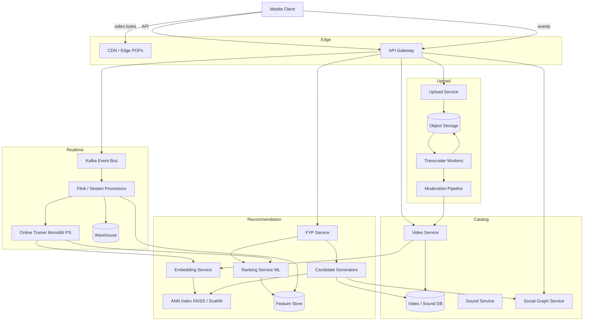
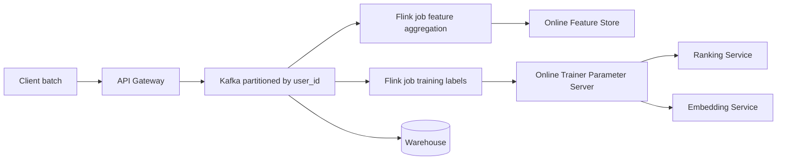
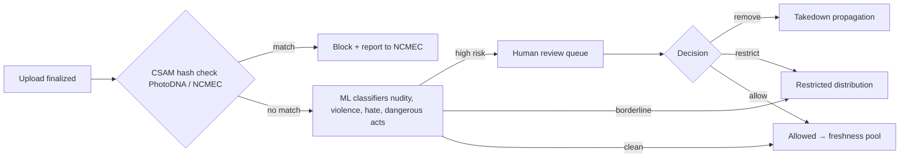

# Design TikTok — The Recommendation Algorithm Is the Product

**Date:** 2026-04-25 | **Updated:** 2026-04-25
**Tags:** `system-design` `case-study` `tiktok` `recommendation` `short-video`

## Table of Contents

- [Summary](#summary)
- [Functional Requirements](#functional-requirements)
- [Non-Functional Requirements](#non-functional-requirements)
- [Capacity Estimation](#capacity-estimation)
- [API Design](#api-design)
- [Data Model](#data-model)
- [High-Level Architecture](#high-level-architecture)
- [Deep Dives](#deep-dives)
  - [The For-You Page (FYP) — Candidate Generation and Ranking](#the-for-you-page-fyp--candidate-generation-and-ranking)
  - [Implicit Feedback Is the Dominant Signal](#implicit-feedback-is-the-dominant-signal)
  - [Cold Start — New Users and New Videos](#cold-start--new-users-and-new-videos)
  - [Recommendation Latency Budget](#recommendation-latency-budget)
  - [Video Pipeline — Transcoding, Previews, Duets/Stitches](#video-pipeline--transcoding-previews-duetsstitches)
  - [CDN Strategy and Video Start Latency](#cdn-strategy-and-video-start-latency)
  - [Real-Time Event Ingestion and Online Learning](#real-time-event-ingestion-and-online-learning)
  - [Content Moderation Pipeline](#content-moderation-pipeline)
  - [Anti-Pattern: Designing Around the Follow Graph](#anti-pattern-designing-around-the-follow-graph)
- [Bottlenecks and Trade-offs](#bottlenecks-and-trade-offs)
- [Anti-Patterns](#anti-patterns)
- [Related](#related)
- [References](#references)

## Summary

TikTok looks like a video-sharing app, but its actual product surface is the **For You Page (FYP)** — an infinite, personalized feed of short videos that learns the viewer's taste in minutes, not days. Unlike Facebook News Feed or Instagram (where the social graph drives most ranking) or YouTube (where intent-based search and subscriptions matter), TikTok's superpower is content-based discovery from a corpus of billions of videos with **no follow signal required**. The recommendation algorithm — candidate generation across multiple sources, multi-task ranking on implicit signals (completion rate, replays, share rate), and real-time online learning — is not a feature on the side of the system. It **is** the system. Every other component (upload, transcode, CDN, moderation, social graph) exists to feed the recommender or honor its output.

This case study designs that system end-to-end with emphasis on the ML retrieval/ranking pipeline, the implicit-feedback loop, cold start, and the latency budget that lets a swipe yield a video in well under a second.

## Functional Requirements

**Must-have (in scope):**
- **For You feed** — personalized infinite scroll of short videos (typically 15s–3min). The defining surface.
- **Following feed** — secondary feed of videos from accounts the user follows.
- **Post short video** — record/upload, trim, add sound from sound library, add text/effects, publish.
- **Engagement** — like, comment, share (in-app and out-of-app), bookmark, follow, "not interested."
- **Sound library** — extract sound from any uploaded video, allow others to use it as a sound track. A "sound" is a first-class object linked to source video and to all derivative videos that use it.
- **Duets / Stitches** — create new videos that reference and reuse a portion of an existing video (linkage preserved in the data model).
- **Search** — by hashtag, sound, user, video text/captions.
- **User profile** — view a user's videos, followers, followed sounds, liked videos.

**Out of scope (this design):**
- Live streaming (separate system; large overlap with [design-youtube.md](../media-streaming/design-youtube.md) live path).
- Direct messaging.
- Ads auction and pacing (touched only as a slot insertion in the FYP ranker).
- Creator monetization, payouts, e-commerce.

## Non-Functional Requirements

- **Massive read fan-out via recommendation, not subscription.** A trending video can reach hundreds of millions of FYP impressions within hours without the creator having any followers. Pure fan-out-on-write is meaningless; the read path is recommendation-driven.
- **Low-latency video start.** p99 video-start under ~500 ms; first-frame render must feel instant on swipe. The next 1–2 videos in the feed are pre-fetched and pre-buffered.
- **Global CDN.** Multi-tier edge caching with regional pop-up caches for trending content. Adaptive bitrate (HLS/DASH) so the player can shift quality on poor networks without rebuffering.
- **Recommendation pipeline SLO.** End-to-end FYP fetch (candidate retrieval + rank + hydrate) should complete in 100–200 ms per page of N videos.
- **Real-time learning.** New interaction events must influence the model within minutes, not hours — short-video trends are measured in hours, not days. This drives the choice of online training (Monolith-style parameter servers) rather than batch-only training.
- **Availability.** FYP must degrade gracefully: if the personalized ranker is unavailable, fall back to a cached trending pool. Better to serve generic-popular than to serve nothing.
- **Consistency.** Eventual consistency is fine for likes/comments/follower counts. Counts are approximate at scale.
- **Durability.** Source videos and engagement events are durable; intermediate features in the online store may be ephemeral.
- **Moderation latency.** New uploads must pass automated moderation (CSAM hash + classifier) before broad distribution. Initial cold-start exposure is to a small audience while signals accumulate.

## Capacity Estimation

Order-of-magnitude numbers, not exact. The point is to size shards, bandwidth, and storage budgets.

**Users**
- Total registered users: ~1.5B
- Daily active users (DAU): ~1B
- Average sessions per DAU: ~8
- Average videos watched per session: ~30
- Total daily video plays: 1B × 8 × 30 ≈ **240B plays/day** ≈ ~2.8M plays/sec average; peak ~5–10× higher.

**Uploads**
- DAU who post per day: ~5% → 50M uploads/day → ~580 uploads/sec average; peak ~5K/sec.
- Average source video size: ~15 MB (raw H.264, ~30s).
- Daily ingest: 50M × 15MB ≈ **750 TB/day** of source video.

**Transcoded ladder**
- Each upload transcoded to ~5 variants (240p, 360p, 480p, 720p, 1080p) plus thumbnails and an HLS manifest.
- Variants together typically ~1.5–2× source size.
- Total stored video footprint (with replication, multi-region): petabyte-class growth per week, exabyte-class long-term.

**CDN bandwidth**
- 240B plays/day × ~3 MB delivered per play (post-ABR average) ≈ **720 PB/day** ≈ ~67 Tbps average egress; peak many multiples higher.
- Hot trending content has cache hit rates >99% at edge; the long tail strains origin and regional caches.

**Engagement events**
- Plays + view-completion + likes + scrolls + share + comment ≈ ~10 events per video viewed.
- 240B × 10 ≈ **2.4 trillion events/day** ≈ ~28M events/sec average. This is the firehose into Kafka and the feature store.

**Recommendation infra**
- Active video corpus eligible for FYP: hundreds of millions to low billions.
- Per-user candidate pool: ~500–2000 items pre-rank, narrowed to ~10–50 per FYP page after ranking.
- ANN index size: billions of item embeddings sharded across many GPU/CPU servers. A two-tower retrieval over a billion items requires aggressive partitioning (IVF/HNSW) and approximate search.

## API Design

Mostly REST/gRPC for control-plane; the FYP read path uses long-poll or HTTP/2 with prefetch. The client plays a heavy role.

```http
# 1. Fetch a page of For You videos (the only API that matters)
GET /v1/fyp?cursor=<opaque>&page_size=10&device_ctx=<...>
Authorization: Bearer <token>

200 OK
{
  "videos": [
    {
      "video_id": "vid_8a...",
      "creator": { "user_id": "...", "username": "...", "follow_state": "not_following" },
      "manifest_url": "https://cdn.../vid_8a/master.m3u8",
      "preview_frames_url": "https://cdn.../vid_8a/preview.webp",
      "duration_ms": 23400,
      "sound": { "sound_id": "...", "title": "..." },
      "duet_source": null,
      "stitch_source": null,
      "stats": { "likes": 13420, "comments": 412, "shares": 88 },
      "ranking_debug": { "candidate_source": "trending+content_emb", "score": 0.81 }
    }
    // ...10 items
  ],
  "next_cursor": "opaque_blob",
  "prefetch_hint": { "preload_next": 2 }
}
```

```http
# 2. Engagement events (batched, fire-and-forget)
POST /v1/events
Content-Type: application/json

{
  "events": [
    { "type": "view_start",   "video_id": "...", "ts": 1714000000000 },
    { "type": "view_progress","video_id": "...", "watched_ms": 12300, "duration_ms": 23400 },
    { "type": "view_complete","video_id": "...", "completion": 1.0, "replays": 1 },
    { "type": "like",         "video_id": "..." },
    { "type": "share",        "video_id": "...", "channel": "external" },
    { "type": "skip",         "video_id": "...", "watched_ms": 800 }
  ]
}
202 Accepted
```

```http
# 3. Upload — multi-step
POST /v1/uploads/init
{ "size_bytes": 15728640, "duration_ms": 23400, "client_hash": "sha256:..." }

200 OK
{
  "upload_id": "...",
  "upload_url": "https://upload.../resumable/...",   # tus/resumable
  "expires_at": "..."
}

# Client uploads source bytes to upload_url (resumable).

POST /v1/uploads/{upload_id}/finalize
{
  "title": "...",
  "caption": "...",
  "hashtags": ["fyp", "cooking"],
  "sound_id": "snd_123 | null",
  "duet_source_video_id": "... | null",
  "stitch_source_video_id": "... | null",
  "audience": "public | followers"
}
202 Accepted
{ "video_id": "vid_...", "status": "processing" }

# Transcoding/moderation completion is observed via webhook
# or by polling GET /v1/videos/{video_id}.
```

```http
# 4. Search
GET /v1/search?q=...&type=video|sound|user|hashtag&cursor=...

# 5. Follow / Like / Comment / Bookmark — standard REST.
POST /v1/users/{user_id}/follow
POST /v1/videos/{video_id}/likes
POST /v1/videos/{video_id}/comments    { "text": "..." }
DELETE /v1/videos/{video_id}/likes
```

**Client-side prefetch.** The FYP response includes a `prefetch_hint`. The client pre-fetches the manifests and the first segment of the next 1–2 videos so the swipe is instant. CDN edge is sized for this prefetch traffic.

## Data Model

Entities are sharded by primary key and stored in a mix of stores tuned to access patterns.

**Video** (sharded by `video_id`, primary store: a wide-column store like Cassandra or HBase; metadata mirrored to OLAP)

```
video {
  video_id: bytes (snowflake)
  creator_id: bigint
  upload_ts: ts
  duration_ms: int
  source_url: url               # cold storage
  manifest_url: url             # CDN
  variants: [{res, bitrate, url, codec}]
  thumbnail_url: url
  preview_frames_url: url        # animated webp shown during scrubbing
  sound_id: bytes (nullable)
  duet_source_video_id: bytes (nullable)
  stitch_source_video_id: bytes (nullable)
  caption: text
  hashtags: [string]
  language: string
  geo_creator: string
  moderation_state: enum(pending|allowed|restricted|removed)
  visibility: enum(public|followers|private)
  features_v: vector<float, 256>  # content embedding (visual+audio+text)
  stats_approx: { likes, comments, shares, plays, completes, mean_completion_rate }
}
```

**User**

```
user {
  user_id: bigint
  handle: string (unique)
  profile: {...}
  signup_ts: ts
  geo: string
  language: string
  device_features: {...}
  user_emb_v: vector<float, 256>   # learned interest embedding (Tower A)
}
```

**Interaction events** — append-only log, written to Kafka, consumed by feature store and warehouse. **This is the firehose.**

```
event {
  event_id: uuid
  user_id
  video_id
  type: enum(view_start, view_progress, view_complete, like, unlike,
             skip, share, comment, follow, not_interested, report)
  watched_ms
  duration_ms
  completion_rate: float        # watched_ms / duration_ms
  replays: int
  share_channel: string
  ts
  device_ctx, network, geo
}
```

Completion rate is computed at view_complete (or session boundary) and is the gold-standard implicit signal.

**Candidate pools per user** (online store: Redis cluster + Aerospike-class for hot data; rebuilt nightly + updated incrementally)

```
user_candidates(user_id) -> {
   trending: [video_id, ...]                 # global / regional trending
   follow_graph: [video_id, ...]             # videos by followed users (recent)
   content_emb_ann: [video_id, ...]          # ANN over content embeddings
   collab_filter: [video_id, ...]            # users who liked X also liked Y
   sound_affinity: [video_id, ...]           # videos using sounds the user likes
   freshness_pool: [video_id, ...]           # newly uploaded, undertested
}
```

**Sound** (first-class entity)

```
sound {
  sound_id
  source_video_id
  title
  duration_ms
  derivative_count
  derivative_video_ids: [video_id]   # all videos using this sound
}
```

Sounds are independently rankable — TikTok recommends sounds, and a viral sound creates its own organic candidate pool.

**Social graph** (sharded by user_id; bidirectional)

```
follow_edge { follower_id, followee_id, ts }
```

The graph exists but is **not** the dominant retrieval source. See the anti-pattern below.

**Feature store** — online (low-latency lookup at ranking time) and offline (training).

```
user_features(user_id):     dense vector + sparse IDs of recent interactions
video_features(video_id):   dense vector + popularity, completion_rate, freshness
cross_features:             user×video computed at request time
```

ByteDance's Monolith uses a parameter-server architecture with collisionless embedding tables to keep these features fresh in real time.

## High-Level Architecture



**Read path (FYP, the hot path):**
1. Client requests `GET /v1/fyp` with cursor and device context.
2. FYP service fetches user features from the online feature store.
3. Candidate generators run in parallel — each pulls a few hundred items from a different source (trending pool, follow graph, ANN over content embedding, collaborative filtering, sound affinity, freshness pool).
4. Candidates are merged and de-duplicated to a pool of ~1–2K items.
5. Ranker scores the pool with a multi-task DNN using user features, video features, and cross-features. Top-K (~10–50) is returned.
6. Video metadata is hydrated; CDN URLs are signed; response goes back to the client. Client immediately pre-fetches the next 1–2 videos.

**Write path (upload):**
1. Resumable upload to object storage.
2. Finalize call enqueues a transcoding job.
3. Workers transcode to a bitrate ladder, generate thumbnails and preview frames, build the HLS manifest.
4. Moderation pipeline runs (CSAM hash → classifier → optional human review).
5. Embedding service computes content embedding from frames + audio + caption.
6. Video is published to the catalog and inserted into the ANN index. Initial distribution is to a small "freshness pool" of users; signal accumulates from there.

**Event path (the recommender's bloodstream):**
1. Client batches events and posts them.
2. Events go to Kafka (partitioned by user_id for ordered consumption per user).
3. Flink jobs aggregate features (sliding windows: last 30s, last hour, last day) and write to the online feature store.
4. The online trainer (Monolith parameter server) consumes the same stream and updates embeddings/model weights in near-real-time.
5. A copy lands in the warehouse for offline training and analytics.

## Deep Dives

### The For-You Page (FYP) — Candidate Generation and Ranking

The FYP follows the now-standard two-stage funnel popularized by Covington et al. (Deep Neural Networks for YouTube Recommendations, 2016): cheap **candidate generation** narrows billions to thousands; expensive **ranking** narrows thousands to tens. TikTok's variant is more aggressive on multi-source candidate generation and on real-time training.

**Stage 1: Candidate Generation (multi-source).** Each source contributes a few hundred items in parallel; latency target ~30–50 ms.

| Source | What it returns | Why it exists |
|--------|-----------------|---------------|
| **Trending pool** | Globally/regionally hottest videos in the last hours | Cold-start safety net; covers everyone |
| **Follow graph** | Recent videos from accounts the user follows | Honors explicit signal; small share of FYP |
| **Content-based (ANN over embeddings)** | Videos whose content embedding is near the user's interest embedding | The TikTok superpower — discovers content with **no graph signal** |
| **Collaborative filtering** | "Users who completed/liked X also completed Y" | Cross-cluster discovery |
| **Sound affinity** | Videos using sounds the user has engaged with | Sounds drive trends; this is a major retrieval source |
| **Freshness pool** | Recently uploaded videos with limited exposure | Exploration; gives new uploads a chance to accumulate signal |

The two-tower model (separate user tower and item tower trained jointly) backs the content-based source: item embeddings are pre-computed and indexed in an ANN structure (FAISS, ScaNN, or HNSW); the user embedding is computed at request time from recent interaction history; retrieval is a dot-product top-K against the index. ANN retrieval over hundreds of millions of items completes in single-digit milliseconds when the index is sharded and IVF/HNSW-tuned.

**Stage 2: Ranking.** A heavier multi-task DNN scores each candidate. Inputs include:
- User features (dense embedding, recent action sequence, geo, device, network).
- Video features (content embedding, creator features, popularity stats, freshness, language).
- Cross features (does the user follow this creator? has the user used this sound? completion-rate distribution among similar users).

Multi-task heads predict probabilities for: `p(complete)`, `p(like)`, `p(share)`, `p(comment)`, `p(follow)`, `p(skip)`, `p(replay)`. The final score is a weighted sum:

```
score(user, video) = w_complete * p(complete)
                   + w_share    * p(share)
                   + w_like     * p(like)
                   + w_comment  * p(comment)
                   + w_replay   * p(replay)
                   + w_follow   * p(follow)
                   - w_skip     * p(skip)
```

Weights are business-tuned and re-tuned via online experiments. Note that **completion** carries the heaviest weight — see next section.

After scoring, a **diversity / business layer** reorders to enforce constraints: don't show the same creator twice in a page, dilute repeated topics, blend in ads slots, demote NSFW or restricted content for the viewer's region.

### Implicit Feedback Is the Dominant Signal

The most common interview mistake on this design is to lean on likes and follows. They are useful but **secondary**. The dominant signals are implicit:

- **Completion rate** (`watched_ms / duration_ms`) — gold. A user who watched 100% of a 30s video told the model far more than a like ever could. Likes are noisy (some users never tap like; some tap reflexively).
- **Replays** — explicit re-engagement; very strong positive signal.
- **Share rate** — strong positive (especially external shares to other apps).
- **Skip latency** — how fast the user swiped away. Sub-second skip is a sharp negative.
- **Time spent on creator profile** after watching.
- **Sound saved / used** — opens the sound funnel.

Why this works: TikTok's UI is built so the implicit signal is unambiguous. Fullscreen vertical video, swipe = end of session for that video. There is no "kept playing in a tiny preview" ambiguity. Every session is a clean labeled example for the ranker.

This also defines the **schema of the event stream**: precise `view_progress` events are not optional — they are the training labels.

### Cold Start — New Users and New Videos

**New user (no history).**
1. Bootstrap with a generic candidate pool: trending in the user's geo + language.
2. Optional onboarding screen to pick interest categories — gives the user embedding a starting bias.
3. Demographic / device priors from the registration context.
4. The first ~10 videos are an exploration phase — diverse categories. Within minutes, completion-rate signal is strong enough to bias retrieval toward content-based sources.

A new TikTok account that watches three cooking videos to completion will see a cooking-heavy FYP within a single session. That speed is the product.

**New video (no engagement history).**
1. Pre-engagement features only: creator history (their average completion rate, follower base), content embedding from frames+audio+caption, language, hashtags, sound.
2. Initial distribution is to a small **freshness pool** — a few thousand users selected via the ANN match plus a randomized seed.
3. If early completion / share rate is above a threshold, distribution expands geometrically (10K → 100K → 1M → globally).
4. If signals are flat or negative, exposure is capped. The video isn't "deleted" — it just doesn't propagate.

This is a multi-armed bandit problem in disguise. The freshness pool is the exploration budget; the ranker exploits.

### Recommendation Latency Budget

End-to-end target: ~150 ms from FYP request to bytes-on-the-wire (excluding video transfer). Decomposition:

| Stage | Budget | Strategy |
|-------|--------|----------|
| Auth + request parse | 5 ms | Edge gateway |
| Online feature lookup | 10–20 ms | Redis/Aerospike-class store |
| Candidate generation (parallel sources) | 30–50 ms | Each source independently bounded; ANN dominates |
| Merge + dedupe | 5 ms | In-memory |
| Ranking (1–2K items) | 30–60 ms | GPU-served DNN, batched |
| Diversity + business rules | 5–10 ms | In-memory |
| Hydration + URL signing | 10–20 ms | Caches; co-located with FYP service |

To make this work, the heavy lifting happens **off the critical path**:

- **Nightly batch.** Item embeddings recomputed for the full corpus. Trending pools recomputed per region/language. ANN index rebuilt and shipped.
- **Streaming.** User embeddings updated continuously from the event stream. Per-user candidate pools (especially follow-graph and collaborative filter) refreshed every few minutes.
- **Real-time.** Only top-K rerank and feature lookup happen synchronously.

If the ranker is slow or unavailable, the FYP service falls back to the merged candidate pool ranked by a static popularity score. Better stale than empty.

### Video Pipeline — Transcoding, Previews, Duets/Stitches

Upload → object storage → transcoder workers → moderation → catalog. Specifics:

- **Transcoding ladder.** ~5 variants (240p, 360p, 480p, 720p, 1080p) plus an audio-only fallback. Encoded as H.264/H.265 in HLS segments (2–4s segments to balance startup latency vs request overhead). DASH is supported alongside HLS on platforms that prefer it.
- **Preview frames.** An animated WebP or motion JPEG sprite is generated for the scroll preview shown during fast scrubbing.
- **Watermarking.** Each variant gets the creator handle watermark embedded so external shares carry attribution. This happens during transcode, not at delivery.
- **Duet / Stitch source linkage.** When a creator publishes a duet or stitch, the new video carries `duet_source_video_id` / `stitch_source_video_id`. The transcoder composes the new video from both sources (side-by-side for duets, prepended clip for stitches). Linkage is stored bidirectionally so the source video page can show all derivatives, and so engagement on derivatives feeds back into the source's signals.
- **Sound extraction.** When a video is uploaded with original audio, a sound entity is created (or linked if the audio matches an existing fingerprint). Sounds are independently discoverable.
- **Idempotency.** Uploads use a client-supplied SHA-256 hash to deduplicate retries on the resumable upload.

Throughput math: ~580 uploads/sec average × ~30s of source video × ~5 variants → tens of thousands of CPU-seconds per second of wall-clock time. This is GPU/ASIC territory (NVENC/QuickSync) and dwarfs the rest of the backend in raw compute.

### CDN Strategy and Video Start Latency

Goal: p99 video-start under 500 ms; perceived first-frame latency near zero on swipe.

- **Tiered CDN.** Edge POPs cache hot segments; regional caches absorb misses; origin is hit only for the long tail.
- **Pre-fetch on the client.** When the FYP response arrives, the client fetches the master manifest and first segment of the next 1–2 videos in parallel with playing the current one. Swipe → bytes are already in memory.
- **Adaptive bitrate.** The HLS player chooses a variant based on measured throughput. On a poor network, it starts at 360p and ramps up; on Wi-Fi, it starts at 720p+. ABR shifts mid-playback never block playback.
- **First-segment optimization.** The first segment is small (often 1s) so the time-to-first-frame is minimized; later segments are larger for efficiency.
- **Trending content pinning.** When a video crosses a popularity threshold, it is proactively warmed to all regional caches. A truly viral video should never miss the edge.
- **Cold creators on warm edges.** The freshness pool exposes new videos to a small audience that is geographically clustered, so even cold-start traffic stays in a few POPs.

The system-design insight: **prefetch is a budget**, not a free lunch. Aggressive prefetch increases CDN egress per session (you fetch videos the user might never watch). The right prefetch depth is tuned per network quality and historical session length.

### Real-Time Event Ingestion and Online Learning

The 28M events/sec firehose is the trickiest infra piece outside the recommender itself.



- **Kafka partitioning by `user_id`** preserves per-user ordering, which matters for sequence features (last-N actions).
- **Flink** computes sliding-window aggregates: completion rate over last 30 actions, share rate over last hour, skip rate over last day. Writes to the online feature store keyed by user.
- **Online trainer** consumes the same stream as labeled examples (the `view_progress` and `view_complete` events are the labels). Updates embedding tables and model weights, syncs to inference servers every few minutes.

ByteDance's open-source Monolith paper (RecSys 2022) describes the design: a parameter server with **collisionless embedding tables** (Cuckoo hashing) so billions of unique IDs (users, videos, hashtags) each get their own embedding without bucket collisions. Training-PS handles updates; inference-PS serves; they sync periodically. Real-time training is the explicit goal — short-video trends decay in hours.

This is the architectural reason TikTok feels "scary smart" within a single session: the model learning from your behavior is the same model serving the next page, with a delay measured in minutes.

### Content Moderation Pipeline

Required before a video gets meaningful distribution.



- **CSAM hashing first**, always. Hash-match against PhotoDNA/NCMEC. Match = immediate block + legal reporting workflow. Non-negotiable.
- **ML classifiers** for nudity, graphic violence, hate, self-harm, weapons, dangerous-acts categories. Multi-label.
- **Human review** for borderline scores or appeals. Reviewers see a region-aware interface.
- **Takedown propagation.** A removed video must be evicted from CDN edges (purge), feature store, candidate pools, and ANN index. This is non-trivial — a viral video may be cached at thousands of edges. The system tracks which caches saw which content for surgical purges.
- **Audio fingerprinting** for music rights — separate from safety moderation but part of the same admission pipeline.
- **Region-specific rules.** The same video may be allowed in one country and restricted in another (geo-fencing at the FYP layer).

Moderation latency matters because the freshness pool exposes new videos to real users. A minute of unrestricted distribution of harmful content is a real harm.

### Anti-Pattern: Designing Around the Follow Graph

The instinct from designing Facebook News Feed or Twitter is to put the social graph at the center: store posts, fan out on write or pull on read along follow edges, rank within that pool. **For TikTok this is wrong.**

- The follow graph contributes a **minority share** of FYP impressions. Most users discover content from creators they don't follow.
- Optimizing the storage model around fan-out-on-write penalizes the actual hot path (content-based retrieval).
- The follow graph is a feature input, not the primary retrieval source. It shows up as cross-features (`is_following`, `recent_actions_with_creator`) and as one of several candidate generators, not as the structural backbone.

The right mental model is the YouTube/Netflix retrieval-and-rank funnel, not the Twitter timeline. The graph exists for the **Following feed** (a separate, less-trafficked surface) and as a feature signal — not as the architecture's spine.

## Bottlenecks and Trade-offs

- **ANN recall vs latency.** Higher `nprobe` / lower quantization gives better recall but more CPU. Operationally, the system runs at a deliberately imperfect recall (~90–95%) — the ranker corrects for retrieval miss.
- **Freshness vs personalization.** A heavily personalized feed will starve new uploads. The freshness pool deliberately injects under-tested content; the size of that pool is a constant lever.
- **Real-time training vs stability.** Online learning catches trends but risks oscillation when feedback loops form (the model recommends X, X gets watched, model recommends more X). Counter-measures: exploration noise, diversity constraints in the post-rank step.
- **Batch vs online feature freshness.** Daily-batch features are cheap and stable; streaming features are expensive but reflect minutes-old behavior. The system uses both, layered.
- **CDN cost vs prefetch depth.** Prefetching N=2 doubles bandwidth per session relative to N=0. Tuned per network/session-length cohort.
- **Moderation precision vs recall.** A stricter classifier reduces harm but suppresses legitimate creators (false positives). Human review is the safety valve, but it doesn't scale linearly with upload volume.
- **Per-user candidate pool size.** Bigger pool → better ranking quality, more expensive lookup. Typically capped at 1–2K items pre-rank.
- **Embedding table memory.** Billions of IDs × 256-dim float32 ≈ TBs. Monolith's collisionless tables with frequency filtering and expirable entries keep this bounded.
- **Sound rights and DMCA.** A viral sound that turns out to be unlicensed forces takedown of every derivative — potentially millions. The sound entity's `derivative_video_ids` set is what makes that propagation tractable.

## Anti-Patterns

- **Designing the FYP around the follow graph.** Discussed above. Misses the entire point of TikTok.
- **Optimizing for likes/follows over completion rate.** Likes are noisy and sparse. Completion rate is the gold standard. Anyone who proposes a ranker driven primarily by likes hasn't worked on a watch-time product.
- **Synchronous moderation in the upload critical path.** Moderation must happen before broad distribution, but blocking the user's "publish" tap on classifier inference is bad UX and bad architecture. Moderation runs after `finalize` and before freshness-pool exposure.
- **One global trending pool for all users.** Trending is regional, language-segmented, and category-aware. A single global pool is a bad fallback.
- **Treating every event as equally important.** The event stream is dominated by `view_progress`. Spend the budget on getting that right; sample less critical events if needed.
- **Caching personalized FYP responses.** The FYP is personalized down to the user-and-session level, so response caching at the edge for the FYP API itself is wrong. Only the underlying assets (manifests, segments) and global-trending fragments should be edge-cached.
- **Pure pull-based loading without prefetch.** A fullscreen swipe-to-next experience needs prefetch; without it, the perceived latency of a swipe is the network round-trip plus first-segment fetch — far above the 500 ms target.
- **Batch-only training.** Trends move in hours; a 24-hour training cadence will always be a step behind. Online training is not optional for this product class.
- **Treating sounds as a property of videos rather than an entity.** Sounds drive trends and are independently rankable. Modeling them as an entity (with their own derivative graph) is what unlocks the sound funnel.

## Related

- [Design Instagram](./design-instagram.md) — graph-driven feed; useful contrast.
- [Design Facebook News Feed](./design-facebook-news-feed.md) — the canonical fan-out-on-write design TikTok deliberately doesn't follow.
- [Design YouTube](../media-streaming/design-youtube.md) — the parent of TikTok's two-stage retrieval-and-rank funnel; intent-based vs. discovery-based contrast.

## References

- Covington, Adams, Sargin. *Deep Neural Networks for YouTube Recommendations.* RecSys 2016. <https://research.google/pubs/pub45530/>
- Liu et al. (ByteDance). *Monolith: Real Time Recommendation System With Collisionless Embedding Table.* RecSys 2022. <https://arxiv.org/abs/2209.07663>
- ByteDance. *Monolith — open-source recommendation framework.* <https://github.com/bytedance/monolith>
- The New Stack. *What Makes TikTok's Algorithms So Effective?* <https://thenewstack.io/what-makes-tiktoks-algorithms-so-effective/>
- Meta Engineering. *Scaling the Instagram Explore recommendations system.* <https://engineering.fb.com/2023/08/09/ml-applications/scaling-instagram-explore-recommendations-system/>
- Meta Engineering. *Journey to 1000 models: Scaling Instagram's recommendation system.* <https://engineering.fb.com/2025/05/21/production-engineering/journey-to-1000-models-scaling-instagrams-recommendation-system/>
- Instagram Engineering. *Powered by AI: Instagram's Explore recommender system.* <https://instagram-engineering.com/powered-by-ai-instagrams-explore-recommender-system-7ca901d2a882>
- Shaped.ai. *The Two-Tower Model for Recommendation Systems: A Deep Dive.* <https://www.shaped.ai/blog/the-two-tower-model-for-recommendation-systems-a-deep-dive>
- Google Cloud Architecture Center. *Implement two-tower retrieval for large-scale candidate generation.* <https://docs.cloud.google.com/architecture/implement-two-tower-retrieval-large-scale-candidate-generation>
- Cloudflare Learning. *What is MPEG-DASH? HLS vs. DASH.* <https://www.cloudflare.com/learning/video/what-is-mpeg-dash/>
- Wikipedia. *HTTP Live Streaming (HLS)* and *Adaptive bitrate streaming.* <https://en.wikipedia.org/wiki/HTTP_Live_Streaming>, <https://en.wikipedia.org/wiki/Adaptive_bitrate_streaming>
- Facebook AI Research. *FAISS — A library for efficient similarity search.* <https://github.com/facebookresearch/faiss>
- Google Research. *ScaNN — Scalable Nearest Neighbors.* <https://github.com/google-research/google-research/tree/master/scann>
