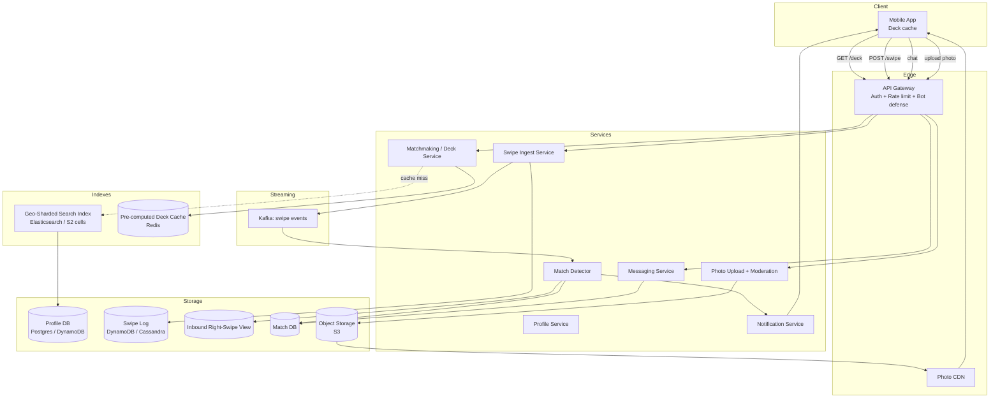

# Design Tinder — Geo-Sharded Matching, Swipe Pipelines, and the Hot-User Problem

**Date:** 2026-04-25 | **Updated:** 2026-04-25
**Tags:** `system-design` `case-study` `tinder` `dating` `geo-matching`

## Table of Contents

- [Summary](#summary)
- [Functional Requirements](#functional-requirements)
- [Non-Functional Requirements](#non-functional-requirements)
- [Capacity Estimation](#capacity-estimation)
- [API Design](#api-design)
- [Data Model](#data-model)
- [High-Level Design](#high-level-design)
- [Deep Dives](#deep-dives)
  - [Geo + Preference Matching](#geo--preference-matching)
  - [Deck Pre-Loading](#deck-pre-loading)
  - [Swipe Storage](#swipe-storage)
  - [Match Detection](#match-detection)
  - [The Hot-User Problem](#the-hot-user-problem)
  - [ELO-like Ranking](#elo-like-ranking)
  - [Anti-Bot and Anti-Fraud](#anti-bot-and-anti-fraud)
  - [Photo Storage and CDN](#photo-storage-and-cdn)
  - [Chat After Match](#chat-after-match)
  - [GDPR and Data Residency](#gdpr-and-data-residency)
- [Bottlenecks and Trade-offs](#bottlenecks-and-trade-offs)
- [Anti-Patterns](#anti-patterns)
- [Related](#related)
- [References](#references)

## Summary

Tinder is a **location-aware swipe-and-match dating app** with hundreds of millions of registered users. The core interaction loop is deceptively simple — a user is shown a deck of candidate profiles, swipes left (pass) or right (like), and on a mutual right-swipe a **match** unlocks a chat thread. Underneath, the system has to answer one hard question every time the deck reloads: *"Of the millions of people in the world, which 30 should this user see right now?"* That question collapses into geo-indexing, preference filtering, ranking, and a swipe pipeline that records billions of binary decisions per day with strong durability and idempotency.

This case study walks through the high-level design at the depth a senior backend engineer would explore in an interview: candidate generation via **geo-sharding** (Tinder publicly uses Google's S2; H3 is a popular alternative), deck pre-computation for sub-100ms reads, an **append-only swipe log** with a materialized inverted view for match detection, and the operational realities of hot users, anti-bot defense, photo CDN, and GDPR deletion.

## Functional Requirements

**In scope:**

1. **Profile management** — create/edit profile (name, age, gender, gender preference, photos, bio, location).
2. **Swipe left / right** — primary action; binary decision recorded against a candidate.
3. **Mutual match detection** — when A swipes right on B and B has already (or later) swiped right on A, both get a match notification.
4. **Chat after match** — only matched users can DM each other; reuses generic messaging infra.
5. **Geo + preference filter** — deck respects max distance, gender, age range, and language/global preferences.
6. **Deck pre-loading** — server returns batches of 30–50 candidates; client caches and never re-shows a profile already swiped.
7. **Super-like** — a "stronger" right-swipe; surfaces user higher in the recipient's deck and signals interest.
8. **Undo** — premium feature: rewind the most recent swipe (must reverse storage and any side effects).

**Explicitly out of scope** for this HLD: video calls, Tinder Gold paywall mechanics, premium boosts, in-app events, profile verification flows beyond a high-level mention.

## Non-Functional Requirements

| NFR | Target |
|-----|--------|
| Deck read latency | p99 < 100 ms (deck served from cache) |
| Swipe write durability | Once acked, never lost. Survive single AZ failure. |
| Match notification latency | p95 < 2 s after the second right-swipe |
| Geo + preference correctness | Stale up to ~15 min on candidate set acceptable; live filter on hard constraints (gender, age, distance) |
| Anti-bot | Block scripted swipe floods at the edge; bot rate < 1% of recorded swipes |
| Availability | 99.95% for read paths (deck, matches), 99.99% for swipe write |
| GDPR | Right-to-delete propagates to swipes, matches, photos, chat within 30 days |

The deck is **read-heavy and tolerates light staleness**; the swipe pipeline is **write-heavy and demands durability**. These two opposite profiles are why the system splits into a candidate-generation pipeline (offline-ish) and a swipe ingestion pipeline (online).

## Capacity Estimation

Public-ish numbers (Tinder has reported ~75M MAU and >2B swipes/day historically):

```text
DAU                ~ 50 M
Swipes / user / day~ 50–100  (use 80)
Total swipes/day   ~ 4 B
Average write QPS  ~ 46 k
Peak QPS (3x)      ~ 140 k

Deck reads/day     ~ 50 M users * 5 deck refreshes ~ 250 M
Deck read QPS avg  ~ 3 k, peak ~ 10 k

Matches/day        ~ 4% of right-swipes are mutual ~ 1.6 B right-swipes * 0.04 ~ 64 M
Messages/day       (out of scope size, but order of 10s of millions)

Storage:
  Profile photos: 6 photos * 500 KB avg per user * 500 M registered ~ 1.5 PB raw
                  + thumbnails, AVIF/WebP variants -> ~3 PB on object storage with CDN
  Swipe log:      4 B/day * ~50 B/event ~ 200 GB/day raw -> compressed ~ 50 GB/day
                  ~18 TB/year raw, retained indefinitely (needed for "don't re-show")
  Match table:    grows much slower; 64 M/day * 100 B ~ 6 GB/day
```

The interesting takeaway: **writes dominate the storage footprint, but only a thin "who-swiped-me-right" inverted slice is hot in cache.**

## API Design

REST shapes; auth is a bearer token tied to a session. Idempotency keys on writes.

```http
# Profile CRUD
POST   /v1/profiles                 # create
GET    /v1/profiles/me
PATCH  /v1/profiles/me              # name, bio, prefs, photos
DELETE /v1/profiles/me              # GDPR delete

# Deck
GET    /v1/deck?cursor=...&limit=30
# -> 200 OK
# {
#   "candidates": [ { "userId": "...", "photos": [...], "distanceKm": 4.2, "age": 28, ... } ],
#   "cursor": "opaque-token",
#   "expiresAt": "2026-04-25T12:30:00Z"
# }

# Swipe
POST   /v1/swipes
# Body: { "targetUserId": "...", "direction": "right|left|super", "deckCursor": "...", "clientTs": ... }
# Headers: Idempotency-Key: <uuid>
# -> 200 OK { "matched": true, "matchId": "...", "matchedUser": {...} }   # if mutual
# -> 200 OK { "matched": false }                                          # otherwise

# Undo last swipe (premium)
POST   /v1/swipes/undo

# Matches
GET    /v1/matches?cursor=...
GET    /v1/matches/{matchId}/messages?cursor=...
POST   /v1/matches/{matchId}/messages
```

Key API decisions:

- The deck endpoint returns an **opaque cursor**, not page numbers — the underlying candidate list is dynamic, not stable.
- `POST /v1/swipes` is idempotent on `(swiperId, targetId)` — the same swipe can be retried safely. Direction may not change once recorded (use undo flow).
- Match detection happens **server-side** as a side-effect of the swipe write; the client never has to ask "did we match?" separately.

## Data Model

```sql
-- Auth/identity (separate service)
user(id PK, email, phone, password_hash, created_at, status)

-- Profile (rich attributes + preferences)
profile(
  user_id PK,
  display_name,
  birth_date,
  gender,
  gender_preference,         -- jsonb / set
  age_range_min,
  age_range_max,
  max_distance_km,
  bio,
  location_lat, location_lng,
  geo_cell_l12,              -- S2/H3 cell at fine resolution
  geo_cell_l8,               -- coarser cell for shard routing
  language,
  last_active_at,
  updated_at
)

-- Photos: metadata only, blobs in object storage
photo(
  id PK,
  user_id FK,
  blob_key,                  -- s3://.../user/abc/photo1.avif
  variant_keys jsonb,        -- thumbnail, medium, full
  ordering int,
  uploaded_at,
  moderation_status          -- pending|approved|rejected
)

-- Swipe: append-only event log, partitioned by swiper_id
swipe(
  swiper_id,
  target_id,
  direction,                 -- LEFT | RIGHT | SUPER
  ts,
  client_ts,
  device_id,
  PRIMARY KEY (swiper_id, target_id)
)
-- Sharded by swiper_id. Hot reads are "all targets I've already swiped"
-- (used to filter the deck) and "all my right-swipes" (match detection).

-- Inverted view: who swiped right on me?
-- Materialized from the swipe stream so we don't scan to find matches.
inbound_right_swipe(
  target_id,                 -- = the person who received the like
  swiper_id,
  ts,
  PRIMARY KEY (target_id, swiper_id)
)
-- Sharded by target_id. Used by match detector.

-- Match: created exactly once per mutual right-swipe pair
match(
  id PK,
  user_a_id,
  user_b_id,                 -- canonicalize so user_a_id < user_b_id
  created_at,
  status                     -- ACTIVE | UNMATCHED | BLOCKED
)
UNIQUE(user_a_id, user_b_id)

-- Message: standard chat; lives in messaging service
message(
  id PK,
  match_id FK,
  sender_id,
  body,
  sent_at,
  delivered_at,
  read_at
)
```

The two-table swipe model (`swipe` + `inbound_right_swipe`) is the central trick. A single right-swipe write triggers an asynchronous fan-out to the inbound view and a match-detection check.

## High-Level Design



The two heavy paths to memorize:

1. **Deck path (read):** App → Gateway → Matchmaking → Deck Cache (hit) → return. On miss, query the geo index, rank, fill cache, return.
2. **Swipe path (write):** App → Gateway → Swipe Ingest → Swipe DB (sync) → Kafka → Match Detector → Inbound View + Match DB → Notification.

Reads and writes share almost no infrastructure. That separation is what lets the deck stay fast even under swipe peaks.

## Deep Dives

### Geo + Preference Matching

The candidate set must satisfy hard filters (gender, age range, max distance, language, blocked users, already-swiped users) and then be ranked.

**Geo indexing.** Each profile is mapped to a hierarchical cell ID:

- **S2** (Google) — square-ish cells on a Hilbert curve; 64-bit cell IDs at 30 levels. Tinder publicly uses S2 for its geo-sharded recommendations.
- **H3** (Uber) — hexagonal cells; nicer for "all cells within radius R" queries because hexagons have uniform neighbor distance.
- **Geohash** — simpler base-32 string prefix; works but has the well-known "edge" problem (two points close in space can be far in the geohash sort order at cell boundaries).

A typical setup: index profiles in **Elasticsearch shards keyed by a coarse cell (S2 level ~8 or H3 res ~5)**, and store the fine-resolution cell on the document for distance refinement. Tinder calls this **geosharding** — the search index is partitioned by cell so each query hits a small subset of shards rather than every shard globally.

**Query flow:**

```text
1. Compute the user's coarse cell + ring of neighboring cells covering max_distance_km.
2. Fan out to the corresponding shards.
3. Apply hard filters (age, gender, language, exclude already-swiped, exclude blocks).
4. Rank by signals (recency, mutual interest predictions, photo quality, etc.).
5. Take top N (~50).
```

Ranking is where ML lives — it's a candidate-rerank problem similar to feed ranking, but on profiles. The HLD doesn't have to specify the model; it does have to specify *where* it runs (offline batch + online rerank) and *what features* feed it (last-active, swipe-back rate, profile completeness, super-like signal, demographic similarity).

See [`../location-based/design-airbnb.md`](../location-based/design-airbnb.md) for a deeper geo-indexing treatment in a different domain (lodging vs. people).

### Deck Pre-Loading

Computing a deck per request would blow the latency budget. Instead, decks are **pre-computed and cached**:

- An offline job (Tinder has reported running this every ~15 minutes) refreshes the candidate list per user based on their current location and preferences, runs ranking, and writes the top ~200 candidates into a Redis-backed deck cache keyed by `userId`.
- The online deck endpoint pops the next page from this cache, applies a **last-mile filter** (exclude anything the user has swiped since the cache was built, exclude new blocks), and returns 30–50 candidates.
- The client caches the page locally and consumes it card-by-card. When ~70% has been consumed, the client prefetches the next page.
- "No double-show" is enforced by the swipe filter: every candidate the user has swiped lives in their swipe log (or a Bloom filter built from it), and gets removed from any deck page before delivery.

This is a classic precomputed-feed pattern. The trade-off: the cache can be **slightly stale** (a user who moved across town 5 min ago might still see candidates from the old neighborhood until the next refresh). For dating discovery, that staleness is acceptable.

### Swipe Storage

Swipes are an **append-only event log**:

- Primary store: a wide-column or NoSQL DB partitioned by `swiper_id` (Tinder uses DynamoDB; Cassandra is the analogous OSS choice). Writes are O(1) and don't block on reads of other partitions.
- Each swipe is also published to **Kafka** with the full event payload. Kafka is the fan-out point for everything downstream: match detection, ML feature pipelines, fraud detection, analytics.
- Idempotency: the table's primary key is `(swiper_id, target_id)`, so a retried POST with the same key is a no-op (or upsert the same value).

Two materialized views on top of the log:

1. **`already_swiped(swiper_id) -> Set<target_id>`** — used to filter the deck. Stored as a Redis Bloom filter or Roaring bitmap; rebuilt from the log on cold start.
2. **`inbound_right_swipe(target_id) -> List<swiper_id, ts>`** — used by match detection. Sharded by `target_id` so reads for "did anyone like me yet?" are local.

The split between the log (source of truth, sharded by swiper) and the inbound view (sharded by target) is what makes match detection fast at billions of swipes per day. It's the same trick as a social graph's `following` vs `followers` indexes.

### Match Detection

Triggered when a right-swipe (or super-like) event lands on Kafka:

```text
on swipe event { swiper, target, direction = RIGHT or SUPER }:
  1. Append to inbound_right_swipe(target_id = target, swiper_id = swiper)
  2. Lookup inbound_right_swipe(target_id = swiper, swiper_id = target)
     i.e., did `target` previously swipe right on `swiper`?
  3. If yes:
       a. Insert into match table with canonical (min(a,b), max(a,b)) pair, IF NOT EXISTS
       b. Emit MatchCreated event
       c. Push notifications to both users
       d. Open chat thread (lazy creation — first message materializes the conversation)
```

The match insert is **idempotent** thanks to the unique constraint on `(user_a_id, user_b_id)`. Even if the event is re-processed (Kafka at-least-once delivery), the match is created exactly once.

Latency budget: the swipe ack to client is fast (just the swipe write). The match notification is asynchronous via push — p95 ~1–2 s is fine. Some apps return `matched: true` synchronously by checking the inbound view inline before responding to the swipe POST; that gives the swiper the feel-good "It's a Match!" screen instantly without waiting for the async pipeline.

### The Hot-User Problem

A small percentage of users — typically very photogenic accounts — receive a vastly disproportionate share of right-swipes. This causes pathological storage and query patterns:

- The inbound right-swipe partition for a hot user can balloon to **millions of rows**, while average users have hundreds.
- Reads of "who liked me" become slow scans.
- Hot partitions create write hotspots in the underlying NoSQL store.

**Mitigations:**

1. **Cap the visible inbound list** — show only the most recent N (e.g., 1000) swipers in the "Likes You" view. Older entries are still in storage but not queried online.
2. **Sub-partition hot users** — append a salt (`target_id + bucket_id`) so writes spread across N logical partitions. Reads scatter-gather.
3. **Compaction / TTL** — old inbound swipes that never resulted in a match and predate the user's last refresh can be aged out (with care for "don't re-show" semantics).
4. **Backpressure on the deck side** — rank-limit how often a hot user is shown, otherwise they'd appear in nearly every deck and exhaust the inbound capacity even faster. This is one of the practical reasons ranking exists at all.

### ELO-like Ranking

Tinder famously used an **Elo-style score** (borrowed from chess) to rank attractiveness based on swipe outcomes: getting right-swiped by a high-Elo user raised your score more than being right-swiped by a low-Elo user. In 2019 Tinder publicly retired the "Elo score" name and described its current model as a **dynamic, engagement-driven ranking** — but the underlying feedback loop (right-swipes from in-demand users count more) is still widely believed to be in play across the industry.

**Why it's controversial:**

- Self-reinforcing — high scorers get shown more, get more likes, climb further. Low scorers spiral.
- Opaque — users can't see, query, or correct their score.
- Reduces a multidimensional human to a scalar based on photo-driven micro-decisions.

**System-design takeaway:** if you build something Elo-shaped, decouple it cleanly from the rest of the system so you can replace it. Treat it as one ranking signal among many, not the spine of the architecture. Hinge took a different public stance, citing the **Gale-Shapley stable-marriage algorithm** as the inspiration for its "Most Compatible" recommendation, which optimizes for stable pairings rather than a single attractiveness scalar.

### Anti-Bot and Anti-Fraud

Bots are an existential threat to a dating product — fake profiles erode trust and skew the ranking signal. Defense layers:

- **Edge rate-limiting** — per-IP and per-account swipe rate caps at the API gateway. Real users swipe ~50–100/day; a bot doing 10,000 is obvious.
- **Behavior heuristics** — swipe inter-arrival times that are too uniform (e.g., exactly every 200 ms) are robotic. Real swipe patterns are bursty.
- **Photo verification** — selfie-with-pose challenge matched against profile photos via face-similarity ML. Tinder calls this "Photo Verified."
- **Device fingerprinting + IP reputation** — known datacenter IPs, emulator fingerprints, residential-proxy patterns get higher scrutiny.
- **Honeypot decoy profiles** — accounts only a bot would mass-like. Right-swipe on the honeypot → instant ban.
- **Phone / email reputation** — disposable email domains and recycled phone numbers get a higher fraud score.

These signals feed a fraud-scoring service whose decisions are surfaced as soft-block (shadowbanned, swipes still recorded but not delivered to inbound view), or hard-ban.

### Photo Storage and CDN

Photos dominate storage and bandwidth. Standard pattern:

- **Object storage** (S3 or equivalent) holds the originals.
- An **image processing pipeline** generates variants on upload: thumbnail (~80px), medium (~400px), full (~1080px), AVIF/WebP for modern clients with JPEG fallback.
- A **CDN** (CloudFront, Cloudflare, Akamai) caches all variants close to users with long TTLs. URLs are signed and time-limited.
- **Moderation** runs before publish: nudity / violence detection ML, plus async human review for edge cases. A photo's moderation status is part of its metadata; only `approved` photos appear in decks.

See [`../../building-blocks/object-and-blob-storage.md`](../../building-blocks/object-and-blob-storage.md) for the generic pattern.

### Chat After Match

The chat surface reuses a generic messaging service — there's nothing dating-specific in the wire protocol. Dating-specific rules live above it:

- Chat is gated by an active `match` record. Any DELETE on the match (unmatch) closes the thread for both sides.
- Some products allow message-before-match (a one-line note attached to a super-like). Implementation: a "pending message" field on the swipe row that materializes into a real `message` only on mutual match.
- Standard messaging concerns (delivery receipts, read receipts, push, presence) are out of scope here — see a sibling design like [`design-instagram.md`](./design-instagram.md) for messaging-adjacent patterns and the messaging-infra building blocks.

### GDPR and Data Residency

A right-to-delete request must propagate to:

- `profile` — soft-delete then hard-delete after grace period.
- `photo` blobs and CDN — purge originals + invalidate CDN paths.
- `swipe` log — both as swiper (the user's own swipes) and as target (anonymize `target_id` references, since the swipe still belongs to the *other* user from a data-ownership perspective; check legal interpretation).
- `inbound_right_swipe` — remove all rows where `swiper_id` or `target_id` matches the deleted user.
- `match` — close all active matches; tombstone for historical integrity.
- `message` — depending on regulation, either delete the user's messages or scrub the sender field. Replied-to messages held by the counterparty are typically retained because they belong to the counterparty.

Data residency adds a wrinkle: EU users' data should live in EU-region storage. Geo-sharding helps here, since profile and swipe shards are already geographically partitioned, but cross-region matches (someone travels) require a cross-region lookup or replication path with explicit user consent.

## Bottlenecks and Trade-offs

| Concern | Trade-off |
|---------|-----------|
| Deck freshness vs. latency | Pre-compute every 15 min → fast reads, slightly stale candidates. Live recompute → fresh but slow. |
| Swipe durability vs. throughput | Sync write to NoSQL is required for "don't re-show" correctness; can't be fire-and-forget to Kafka alone. |
| Match latency | Sync match check on swipe POST gives instant UX but couples the write path to the inbound view. Async via Kafka is cleaner but adds 1–2 s. Most products do both: fast inline check + async fan-out. |
| Hot users | Capping inbound list trades completeness for storage sanity. Users don't notice missing tail; system stays healthy. |
| Geo cell size | Coarse cells = fewer shards, bigger queries. Fine cells = more shards, more fan-out. Picked by ranked density per region (denser cities → finer cells). |
| Rank model centrality | A single Elo-ish scalar is simple but fragile; multi-signal ranking is robust but needs ML infra and continuous calibration. |
| Cross-region travel | Replicating shards globally is expensive; "passport" features that explicitly let a user shop in another region are usually implemented as a query-time region override, not full replication. |

## Anti-Patterns

1. **Computing the deck synchronously per request.** Latency dies. Pre-compute and cache.
2. **Single global swipe table not partitioned by user.** Hotspots and unbounded scans for "did A swipe B?" Always partition by swiper.
3. **Deriving matches by scanning the swipe log.** O(N²) over time. Maintain the inbound inverted view.
4. **Storing photos in a relational DB as BLOBs.** Killed by IO and cost. Object storage + CDN, always.
5. **Treating swipes as best-effort.** Losing swipes breaks "don't re-show" and is the most user-visible bug class. Sync write before ack.
6. **Letting a single ranking scalar (Elo) own the entire match outcome.** Fragile, opaque, and gameable. Treat it as one signal among many, with the option to disable.
7. **Ignoring hot-user partitions until they melt.** Plan for power-law inbound distribution from day one — sub-partition or cap.
8. **Forgetting GDPR cascade.** A delete that misses the inbound view or CDN cache is a compliance bug, not a feature gap.
9. **Reusing geohash where S2/H3 would be safer.** Geohash edge effects bite at exactly the latitudes where most users live.
10. **Leaking the matchmaking algorithm to the client.** Ranking, Elo, super-like weighting all stay server-side. Anything the client knows, fraudsters know.

## Related

- [`../location-based/design-airbnb.md`](../location-based/design-airbnb.md) — geo indexing for lodging search; complementary patterns and trade-offs.
- [`../../building-blocks/object-and-blob-storage.md`](../../building-blocks/object-and-blob-storage.md) — photo storage, variants, CDN.
- [`./design-instagram.md`](./design-instagram.md) — sibling social-media case study; messaging and feed patterns reusable here.
- [`../../building-blocks/message-queues-and-brokers.md`](../../building-blocks/message-queues-and-brokers.md) — Kafka for the swipe pipeline.
- [`../../building-blocks/caching-layers.md`](../../building-blocks/caching-layers.md) — Redis deck cache, Bloom filters for "already swiped".
- [`../../building-blocks/rate-limiters.md`](../../building-blocks/rate-limiters.md) — anti-bot at the edge.

## References

- [Geosharded Recommendations Part 1: Sharding Approach — Tinder Tech Blog](https://tech.gotinder.com/geosharded-recommendations-part-1-sharding-approach-2/)
- [How Tinder Recommends to 75 Million Users with Geosharding — ByteByteGo](https://blog.bytebytego.com/p/how-tinder-recommends-to-75-million)
- [The Architecture of Tinder's API Gateway — Quastor](https://blog.quastor.org/p/architecture-tinders-api-gateway)
- [Designing Tinder — High Scalability](https://highscalability.com/designing-tinder/)
- [Design a Dating App Like Tinder — Hello Interview](https://www.hellointerview.com/learn/system-design/problem-breakdowns/tinder)
- [H3: Uber's Hexagonal Hierarchical Spatial Index — Uber Engineering](https://www.uber.com/us/en/blog/h3/) and [H3 Documentation](https://h3geo.org/docs/)
- [S2 Geometry — Google's spherical spatial index](https://s2geometry.io/) and [`google/s2geometry` on GitHub](https://github.com/google/s2geometry)
- [Hinge and the Gale–Shapley algorithm — Cornell Networks blog](https://blogs.cornell.edu/info2040/2021/09/30/hinge-and-its-implementation-of-the-gale-shapley-algorithm/)
- [Hinge employs new algorithm to find your "most compatible" match — TechCrunch](https://techcrunch.com/2018/07/11/hinge-employs-new-algorithm-to-find-your-most-compatible-match-for-you/)
- [Tinder ditches its hidden desirability scores — Engadget](https://www.engadget.com/2019-03-18-tinder-dumps-desirability-scores.html)
- [Bumble Tech blog](https://medium.com/bumble-tech)
