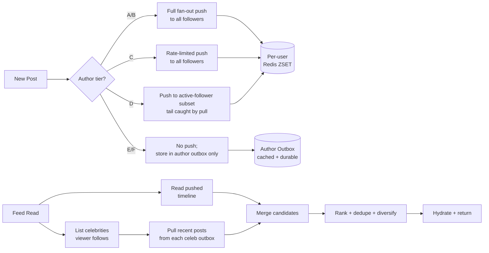
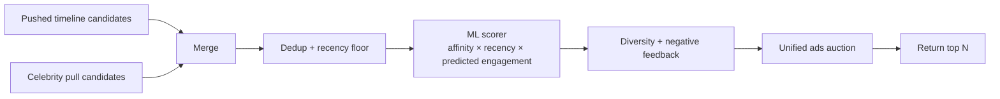

# FB News Feed Deep Dive — The Celebrity Problem

**Date:** 2026-04-29 | **Updated:** 2026-04-29
**Tags:** `system-design` `case-study` `facebook-news-feed` `deep-dive` `celebrity` `fanout`

## Table of Contents

- [Summary](#summary)
- [Overview](#overview)
- [The Math at Celebrity Scale](#the-math-at-celebrity-scale)
- [Sub-Celebrity Tiers](#sub-celebrity-tiers)
- [Pure Pull / Pure Push Limits](#pure-pull--pure-push-limits)
- [Hybrid Strategy](#hybrid-strategy)
- [Read-Time Merge](#read-time-merge)
- [Ranking After Merge](#ranking-after-merge)
- [Delete Propagation and Consistency](#delete-propagation-and-consistency)
- [Industry Examples](#industry-examples)
- [Anti-Patterns](#anti-patterns)
- [Related](#related)
- [References](#references)

## Summary

The "celebrity problem" is the canonical reason a pure fan-out-on-write timeline architecture fails at scale. When a single account has hundreds of millions of followers — Cristiano Ronaldo on Instagram is the textbook example, sitting near 600M — every post that author publishes turns into hundreds of millions of timeline writes. That single event is enough to saturate a fan-out fleet, blow out tail latencies for unrelated tenants, and waste enormous capacity writing impressions that will never be read. The standard production answer, used by Twitter (now X), Instagram, Facebook, and others, is a **hybrid push/pull** model: push for the long tail of normal users, pull for celebrities, and merge both candidate streams at read time before ranking.

This deep dive explores why the math forces that decision, the tier structure most production systems actually use (not just "celebrity vs not"), how the read-time merge works, what ranking has to do after the merge, and the consistency edge cases — particularly delete propagation — that make the hybrid model harder to operate than to design.

It is a companion to [`design-facebook-news-feed.md`](../design-facebook-news-feed.md) "The Celebrity Problem" subsection.

## Overview

Fan-out-on-write (push) is appealing because it makes reads trivial: each user's timeline is pre-materialized as a sorted set, and a feed fetch is a constant-time ZSET range read. The problem is the write side. Push cost scales linearly with follower count:

```text
push_cost(post) = O(followers(author))
```

For an average user with 200–1000 followers, this is fine. For a creator with 10M followers, it is awkward but tractable. For a top creator with 600M followers, it is catastrophic. Worse, the cost is paid synchronously with respect to the post — the system has to durably enqueue and replicate hundreds of millions of timeline updates before the post is "visible" to its audience, even though the vast majority of recipients will never open the app in the next hour.

The hybrid model recognizes that push and pull are not opposites — they are complementary techniques for different parts of the follower-count distribution. Pure systems lose on at least one axis; the hybrid wins on both by routing each author through the correct path:

```text
if follower_count(author) > CELEBRITY_THRESHOLD:
    pull_at_read_time()
else:
    push_at_write_time()
```

The threshold is dynamic, tier-based, and tuned by engagement, not just follower count. The merge happens at read time, after which ranking, ad insertion, and hydration proceed normally. The detail that makes this load-bearing rather than aspirational is **the merge cost stays small per viewer** — even a viewer who follows 50 celebrities only triggers 50 pull queries, not millions.

## The Math at Celebrity Scale

Start from concrete numbers. Cristiano Ronaldo on Instagram has roughly 600M followers as of 2026. If every post triggered a fan-out write to each follower's pre-computed timeline:

- 1 post × 600M followers = **600M timeline writes**
- Average timeline-write payload: ~64 bytes (`post_id` + score + small metadata)
- Total bytes shipped per post: ~38 GB of writes spread across the cluster
- If the fan-out fleet sustains 1M timeline writes/sec at peak, this single post takes **600 seconds (10 minutes)** of cluster-wide write capacity to deliver, assuming nothing else runs.

This is not a worst case. Several creators sit in the 300M–600M range. Multiple A-tier athletes, musicians, and influencers post per day. A single popular hashtag campaign can trigger several large-creator posts in the same minute. The system has to absorb all of it without degrading anyone else's feed-fetch latency.

The asymmetric reality:

- **99% of users** post to fewer than 1000 followers. They fan out fine.
- **The top 0.01% of accounts** generate hundreds of millions of follower-writes per post. They cannot.

The cost is even worse than this naive model suggests because:

1. **Replication multiplies it.** Each timeline ZSET is typically replicated 2–3x for HA, so 600M logical writes is 1.2B–1.8B physical writes.
2. **Hot shards still appear.** Even with ideal random distribution across a 1000-shard Redis fleet, each shard takes 600k writes per post — bursty enough to bloat tail p99.
3. **Wasted impressions dominate.** Active-user opening rate over the next hour is maybe 20–30%. The other 70%+ of writes deliver to inboxes nobody checks before the post falls off the timeline cap.
4. **Bursty arrival.** A celebrity rarely posts in isolation — events like World Cup goals, album drops, election nights produce coordinated bursts. The fan-out queue depth balloons.

The takeaway is not "push is bad" — it is "push has a hard ceiling, and any single account whose follower count crosses that ceiling must move to pull."

### Cost comparison table

| Author followers | Push writes/post | Pull queries / 100 viewers | Dominant cost |
|---|---|---|---|
| 500 (median user) | 500 | ~0.05 | Push trivially |
| 10K | 10K | ~1 | Push still cheap |
| 100K | 100K | ~10 | Push expensive, pull fine |
| 1M | 1M | ~100 | Push painful, pull preferable |
| 10M | 10M | ~1000 | Pull strongly preferred |
| 100M+ | 100M+ | ~10K | Pull is the only option |

The "pull queries / 100 viewers" column assumes follower-active-user ratios scale roughly with the audience size. The crossover happens somewhere between 10K and 100K followers, which is where production tier thresholds tend to land.

### Why the asymmetry compounds

It is tempting to think "the pull cost just shifts the same work to read time." It does not. Three asymmetries make pull strictly cheaper for the celebrity case:

- **Reads happen only for active users.** The push path pays for every follower, including the 70%+ who will not open the app in the relevant window. The pull path pays only for users who actually fetch a feed.
- **Reads are amortized across many candidates.** A single feed fetch already pays for ~400 lookups (the Redis ZSET read plus hydration); adding 5–50 celebrity pulls is a small marginal cost on the same critical path. The push path has no comparable amortization.
- **Reads can be cached aggressively.** A celebrity outbox is a hot read; a per-user timeline is mostly cold. Caching dollars buy more on the read side.

This is why the hybrid is not "trade write cost for read cost" — it is "shift the celebrity slice of the workload to a layer that can absorb it cheaply, leaving the long tail on its naturally efficient path."

## Sub-Celebrity Tiers

The "celebrity vs normal" framing is too coarse for production. Real systems use 3–5 tiers and route differently for each. A common shape:

```text
Tier A — micro accounts          (< 1K followers)        : push, no rate limit
Tier B — typical accounts        (1K – 10K followers)    : push, soft rate limit
Tier C — mid-tier creators       (10K – 100K followers)  : push, hard rate limit, hot-subset push
Tier D — large creators          (100K – 1M followers)   : hot-subset push + pull tail
Tier E — celebrities             (1M – 100M followers)   : pull only
Tier F — mega accounts           (100M+ followers)       : pull only + dedicated pull cache
```

Each tier has different operational characteristics:

- **Tier A/B**: Push is essentially free; the long tail. No special handling.
- **Tier C**: Push still works but starts producing noticeable hot-shard activity at peak. Mitigation: rate-limit fan-out throughput per author so that one mid-tier viral moment cannot starve neighbours; bound queue depth per author.
- **Tier D**: Push is too expensive against the full follower set. Common pattern: **hot-subset push** — push only to the followers active in the last N days (e.g., 14 days of session activity). The rest are caught at read time via a pull. This recovers most of the fast-feed UX while cutting fan-out cost by 5–10x.
- **Tier E**: Pull only. The author never appears in any pre-computed timeline. Their posts live in a per-author "outbox" the readers query directly.
- **Tier F**: Pull only with **dedicated read-side caching**. The outbox of a 600M-follower creator is the most-read few hundred bytes in the entire system — it must sit in a hot in-memory cache with replication factor matching read demand, not just durability needs.

Tier classification is dynamic. Authors do not stay in one tier:

- A creator gains 100K followers in a week from a viral moment and crosses Tier C → Tier D mid-day.
- An athlete posts during a major event and engagement spikes 50x, pushing them temporarily into a higher operational tier even though follower count did not change.
- A dormant celebrity returns and their follower base re-activates.

The classifier therefore runs on a sliding window — typically a 7–30 day rolling follower count plus engagement-weighted activity score — and writes the tier into the author's profile. The fan-out service reads this on every post.

```text
classify_author(author):
    f = rolling_follower_count_30d(author)
    e = engagement_score_7d(author)
    if f > 100_000_000 or e > E_FRESH: return TIER_F
    if f >  10_000_000 or e > E_HIGH:  return TIER_E
    if f >   1_000_000:                return TIER_D
    if f >     100_000:                return TIER_C
    if f >      10_000:                return TIER_B
    return TIER_A
```

The thresholds are not universal constants. They are tuned to the cluster's fan-out budget. A smaller deployment might cap push at 50K followers; a giant Meta-class deployment can push for accounts up to a million if the fleet has the headroom.

### Hot-subset push, in detail

The Tier D pattern deserves more attention because it is the cleverest part of the design and the one least frequently described in public talks.

The author's follower set might be 500K accounts. The "active follower set" — those who opened the app in the last 14 days — might be 75K. The fan-out service pushes only to those 75K. The remaining 425K followers are caught at read time via a pull from the author's outbox, but only if they actually open the app.

The trick is maintaining the active-follower set efficiently. Approaches:

- **Per-author roaring bitmap** of follower IDs intersected with the global active-user set. Updated daily or hourly via a batch job.
- **Per-author HyperLogLog or compact set structure** for cheap membership testing during fan-out, with a periodic rebuild.
- **Reverse approach**: maintain per-user "newly active" markers; when a previously dormant user becomes active, the system runs a one-time backfill from the outboxes of every author the user follows in Tier D+ tiers.

The cost-benefit math: if 15% of followers are active, hot-subset push reduces fan-out cost by ~85% while keeping the user-visible freshness for 100% of active users. The tail that gets caught by pull is exactly the slice of users for whom the latency is invisible because they are not currently looking.

## Pure Pull / Pure Push Limits

It is worth being explicit about why neither extreme works at scale, because every system designer has briefly considered "what if we just pull everything" or "what if we just push harder."

### Pure push limits

- **Catastrophic write amplification on celebrities.** As shown above, 600M writes per post is a non-starter.
- **Deletes and edits multiply the cost.** A celebrity who posts and then deletes 30 seconds later has now paid for 1.2B operations (push + delete-push) for one transient event.
- **Stale follower lists bite.** If the author's follower list is sharded across many shards and the fan-out worker pages through it, new followers added mid-fan-out can be missed; existing followers who unfollow during fan-out get spurious writes.
- **The fan-out backlog is unbounded under bursts.** A celebrity who triple-posts in 60 seconds creates 1.8B queued writes. The queue depth, retry buffers, and replication lag all fight each other.
- **Multi-region replication explodes.** Each timeline write must replicate cross-region for users in other geographies. 600M × number-of-regions is now multi-billion.

### Pure pull limits

- **Read amplification on every fetch.** A user following 400 accounts triggers 400 outbox queries per feed fetch. Even at 1ms per query in parallel, the slowest of 400 dominates p99 — and 1ms is optimistic when the post store is on disk.
- **Cache miss storms on cold authors.** A user who follows niche creators rarely re-reads them; the pull path is constantly missing the cache and hitting the cold path of the post store.
- **The post store becomes a hot-read fleet.** Every feed fetch hits it 400x. Now the post store is sized for read traffic, not write durability, which inverts the engineering cost.
- **Tail latency is brutal.** With 400 parallel reads, the probability that at least one is slow approaches 1. You spend the latency budget waiting for the worst of 400.
- **Cursor pagination is ugly.** Without a pre-computed timeline, "give me the next 20 posts after this cursor" requires re-running the merge across all 400 outboxes.

Neither extreme is operationally workable. Hybrid is not a compromise; it is the only design where both axes stay bounded.

## Hybrid Strategy

The hybrid strategy splits the author population by tier and the reader population by what kinds of authors they follow. Concretely:



### Per-tier strategy in detail

**Tier A/B push**: standard fan-out. The fan-out service reads the follower list from the edge store, batches into chunks (e.g., 500 followers per batch), and writes to per-user Redis ZSETs concurrently. No special handling.

**Tier C rate-limited push**: same as above, but each author has a token-bucket rate limit on fan-out throughput. A viral micro-creator cannot push 100 posts/minute and starve the cluster; their fan-out queues up but does not exceed a per-author rate. The user-visible effect: a flurry of posts from one mid-tier author may take a few seconds longer to land on follower timelines, which is invisible.

**Tier D hot-subset push + tail pull**: the fan-out service intersects the author's followers with the "active-followers-last-14-days" set (maintained out-of-band as a bitmap or HyperLogLog-backed compact set per author). Push is limited to that intersection. The remaining follower tail does not get a push; if any of them open the app, they fetch via the pull path. This is the most engineering-heavy tier: it requires maintaining the active-follower set per author, which is itself non-trivial at 1M-follower scale.

**Tier E/F pull only**: the post is written to the author's outbox (typically a per-author sorted partition in the post store, plus a hot in-memory cache). No fan-out. Readers find the post during the read-time merge.

### Why the read side stays cheap

The pull path does not query 400 outboxes. It only queries the **celebrity** outboxes the viewer follows. Even a power user typically follows fewer than 50 celebrities (most follows are friends, family, peers — Tier A/B authors). So:

- Push side per viewer: 0 cost (Redis read on the pre-computed timeline).
- Pull side per viewer: 5–50 outbox queries.
- Merge step: trivial — merging two sorted streams by recency or score.

This is the key insight that makes hybrid work: **the pull cost per viewer is bounded by how many celebrities they follow, not by how many followers any celebrity has.** The cost is on the right axis.

## Read-Time Merge

The merge happens in the Feed Service after both candidate streams are gathered.

### Inputs to the merge

1. **Pushed timeline** — Redis ZSET read for the viewer, returning up to ~200 candidate post IDs with scores.
2. **Celebrity pull set** — for each celebrity the viewer follows, fetch the most recent N posts from that author's outbox (typically `since=last_seen_post_ts`, `limit=20`).
3. **Optional out-of-network candidates** — recommended posts, trending content, etc. (out of scope for this doc).

### The merge step

The merge is a sorted-stream union:

```text
def merge_candidates(pushed, celeb_pulls, viewer):
    candidates = []
    # de-duplicate: a celebrity author whose post leaked into pushed (e.g., during a
    # recent tier transition) should not appear twice
    seen = set()
    for post in pushed:
        if post.id not in seen:
            candidates.append(post)
            seen.add(post.id)
    for celeb_stream in celeb_pulls:
        for post in celeb_stream:
            if post.id not in seen:
                candidates.append(post)
                seen.add(post.id)
    # candidate cap before ranking
    return candidates[:CANDIDATE_CAP]
```

A real implementation does this concurrently — pulls are fired in parallel with the Redis read, and the merge happens as fast as the slowest pull returns. With per-author timeouts (e.g., 50ms), a slow celebrity outbox is dropped from this fetch and recovered on the next refresh, rather than blocking the whole feed.

### Lazy materialization

The merge is **read-time lazy**. The system does not build a per-viewer materialized timeline that includes celebrity posts. It does not need to: the celebrity outbox is small (recent posts only), the viewer's celebrity follow set is small, and the merge is sub-millisecond compared to the rest of the request.

This is intentional. Pre-materializing the merge would re-introduce the push cost: the system would have to update each viewer's merged timeline whenever any followed celebrity posts, which is exactly the problem we avoided. Lazy merge keeps the cost at read time, where it scales naturally with active users (the people who actually open the app).

### Freshness vs throughput

The pull path is the **freshness path**. A celebrity post is visible to followers as soon as it lands in the outbox — which is sync, immediate after the post-create write. There is no fan-out delay.

The push path is the **throughput path**. For Tier A/B/C authors, the post may take seconds to reach all follower timelines (the fan-out queue drains over time). For typical use, this is fine — followers are not refreshing in real time.

Hybrid balances these: the people most followers want to see new posts from (celebrities) are on the freshness path; the long tail of casual posters is on the throughput path. The user perceives "fresh feed" because the highest-attention authors are immediately visible, and the rest catch up within seconds.

### Per-author timeouts

A pull from one celebrity outbox should not stall the whole feed. The merge runs with:

- A global merge deadline (e.g., 200ms).
- A per-author timeout (e.g., 50ms).
- A graceful degradation: if a celebrity's outbox times out, that author's recent posts are dropped from this fetch. The next refresh recovers them.

This is the same pattern as any scatter-gather system: bound the tail by the number of pulls × per-pull timeout, and accept partial results rather than tail-blocked completeness.

### Outbox query shape

The pull query against the author's outbox is shaped specifically for cache friendliness:

```text
GET outbox:{author_id} WHERE created_at > {viewer_last_seen_for_author}
                       LIMIT 20
```

A few details that matter:

- **The `since` parameter** uses a per-(viewer, author) high-watermark, not a global "since I last opened the app." This avoids re-fetching the same celebrity post on every refresh.
- **The limit is small.** The viewer is unlikely to want more than the last 20 posts from one author in any given fetch.
- **The result is sortable on the client side** as part of the merge, since posts are returned newest-first.
- **The cache key is the author**, not the (viewer, author) pair. This gives the cache massive read amplification — a Tier F outbox cache entry might be hit thousands of times per second from different viewers, all reading the same data.

The watermark is typically stored either in the viewer's user object (for high-affinity authors) or computed lazily from cursor state (for occasional pulls).

## Ranking After Merge

Merging produces a candidate set. The ranker decides what the user actually sees. The ranker does not care about the merge's source; it operates uniformly on the merged candidates.

### Why ranking after merge matters

If you ranked **before** merging, you would rank pushed and pulled candidates separately, then concatenate them — and you would fail to give them comparable ordering. A celebrity pull post is not automatically "better" than a friend's pushed post; affinity, recency, and engagement signals must score them on the same axis.

The merge produces a single candidate list. The ranker then:

1. Scores each candidate using the feature store (affinity, recency, predicted engagement, content-type preferences).
2. Applies diversity penalties (no five posts from the same author in a row).
3. Applies negative feedback (recent "see less", hides, mutes).
4. Applies dedup/freshness constraints (do not show posts already shown this session).
5. Mixes ads using the same scoring axis.
6. Returns the top N.



### A subtle wrinkle: candidate budget

The candidate set has a budget — typically 200–500 candidates before ranking. The pushed timeline alone often saturates this budget for a typical user with hundreds of followed accounts. If we naively merged celebrity pulls in addition, we could exceed the budget.

In practice, the merge applies a recency floor (e.g., "only consider candidates from the last 24h") and uses a budget allocation: e.g., 80% of the candidate slots for pushed, 20% for celebrity pulls, with overflow re-allocated. This prevents the celebrity pulls from being crowded out and prevents the pushed tail from drowning fresh celebrity posts.

### Read-your-writes for the author

The author's own posts must be visible to themselves immediately, regardless of tier. A celebrity who posts and refreshes their own feed should see their post, even though no fan-out push wrote it to the celebrity's own timeline. The standard pattern: the Feed Service unconditionally injects the viewer's own most recent posts (last 24h) as candidates during merge, before ranking.

### Cursor and pagination across the merged stream

Cursor-based pagination over a merged stream is harder than over a single pre-computed timeline, because "the next page" must remain consistent across the push and pull halves even as both evolve.

Standard approach: the cursor encodes a **ranker session ID** plus a per-source watermark:

```text
cursor = {
  session_id,                  # snapshot of the candidate set
  pushed_offset,               # last position in the pushed timeline
  per_celeb_watermarks: {...}, # last fetched post timestamp per celebrity
  ranker_position,             # last position in the ranked output
  mode,                        # ranked vs chronological
}
```

This lets the Feed Service:

- Resume the same ranker session across pages without re-ranking from scratch.
- Avoid re-fetching the same celebrity posts (each celeb has a watermark).
- Detect stale cursors (after a feature flag flip or a major model rev, the session is invalidated and the user gets a fresh first page).

Cursors are opaque to the client and short-lived (typically minutes). After expiry, pagination falls back to a fresh fetch — acceptable because users rarely paginate more than a few pages anyway.

## Delete Propagation and Consistency

Hybrid models have a consistency gotcha that pure-push and pure-pull don't: **deletes and edits must propagate across both paths.** This is the single most operationally annoying part of the hybrid model.

### The problem

A pushed post lives in the author's outbox **and** in every follower's timeline ZSET. A pulled post lives only in the author's outbox. When the author deletes:

- Pulled posts: trivial. Remove from outbox, all readers stop seeing it on next fetch.
- Pushed posts: the author's outbox is updated, but every follower's timeline ZSET still contains the post ID. A delete must fan out a tombstone to undo the push.

If the author was Tier D (hot-subset push + pull tail), the delete must:

1. Remove from outbox.
2. Fan out a tombstone to the active-follower subset that received the push.
3. Do nothing for the pull tail (they read from the outbox, which is already updated).

If the author transitioned tiers mid-life — posted as Tier C then was promoted to Tier E before deleting — the delete must clear the push residue from when they were a smaller account.

### Strategies

**Tombstone fan-out**: emit a `post-deleted` event; the fan-out service consumes it and issues `ZREM timeline:{follower} {post_id}` for each follower who received the push. Same cost as the original push (or worse, because tombstones cannot use the same batch-coalesce optimizations).

**Lazy tombstone via outbox check**: when the Feed Service reads a pushed candidate, it cross-checks the post still exists in the outbox before hydrating. Deleted posts are filtered at hydration time. Cheaper at delete time, more expensive at read time.

**Hybrid**: emit tombstones for high-engagement posts (where freshness of the delete matters), but also rely on hydration-time filtering as a backstop. This is what most production systems actually do: the delete is best-effort fast, and the hydration filter is the correctness guarantee.

```text
hydrate(post_ids):
    posts = postdb.batch_get(post_ids)
    return [p for p in posts if p.exists and not p.deleted and not p.shadowbanned]
```

### Edits

Edits are usually treated as immutable post replacements (a new post ID supersedes the old). The new post takes the old post's slot in the author's outbox; followers see the new post on next fetch via the pull path; pushed timelines either get a tombstone + new push or rely on hydration-time replacement.

### Cross-region propagation

In multi-region systems, both paths must be replicated:

- The author's outbox must replicate cross-region (so EU readers can pull from a US celebrity).
- Push tombstones must propagate cross-region (so an EU follower's timeline does not retain a deleted post pushed from a US fan-out worker).

The replication lag is typically bounded by the outbox replication SLA (~seconds). Tombstones can lag, which is why the hydration filter exists.

### Privacy and visibility changes

Similar to delete: a post whose visibility changes (public → friends-only, or shadow-banned, or geo-restricted) must be filtered at hydration time. The cleanest model treats every visibility check as a hydration-time filter rather than trying to mutate every pushed timeline. This is one of the strongest arguments for the "timeline ZSET stores post IDs only, hydrate at read time" design — you can change visibility once at the source and have it take effect across all derived timelines on next read.

### Tier transitions

When an author's tier changes mid-life — usually upward, because of a viral moment — the system has a mixed history:

- Posts written while the author was Tier B are still pushed in follower timelines.
- New posts after promotion to Tier E are not pushed; they are pulled.

The hybrid does not try to reconcile this retroactively. The pushed residue is allowed to age out naturally as timelines roll over (timeline ZSETs are capped at ~800 entries; old posts evict). The pull path immediately handles all new posts. Followers see a smooth experience because the merge naturally produces a unified timeline view.

Downward transitions (a Tier E account loses followers and drops to Tier D) are even simpler: the system starts pushing again for new posts; old posts that were pull-only stay pull-only and continue to be served from the outbox.

The classifier should hysteresis around the threshold to avoid flapping — for example, require a 7-day sustained breach before tier promotion, and a 30-day sustained drop before demotion. Without hysteresis, an author whose follower count oscillates around the threshold will flip-flop between push and pull paths, multiplying complexity for no benefit.

## Industry Examples

### Twitter / X — Manhattan and the Timeline Service

Twitter's published architecture has been the most thoroughly documented example of hybrid fan-out at scale.

- **Manhattan** is the multi-tenant distributed database backing tweets and many timeline-adjacent datasets. The 2014 engineering post describes its goals — multi-tenant, low-latency, durable — and frames it as the source of truth that timeline caches derive from.
- **Heron** is Twitter's stream-processing system (replacing Storm), used for the real-time fan-out workers that push tweets into follower timelines.
- The "Timelines at Scale" talk by Raffi Krikorian (QCon) is the canonical description of the hybrid model. Twitter pushes for the long tail, pulls for the very-high-follower accounts, and merges at read time.
- The model evolved over time. Earlier versions used a higher push threshold; as the read fleet got faster and the celebrity tail got bigger, the threshold was lowered.

### Instagram — Cassandra outbox + Redis timelines

Instagram's feed architecture similarly leans on a hybrid: Cassandra-backed outboxes for posts, Redis for pre-computed timelines, and read-time merge for high-fanout authors. Instagram's engineering blog describes the migration to Cassandra for the post store and the use of cache layers for hot reads. The Cristiano Ronaldo example is real here — at 600M+ followers, no other approach is viable.

### Facebook — Multifeed and TAO

Facebook's News Feed historically used a system called **Multifeed** for aggregation. The Multifeed paper (less widely shared than Twitter's posts but referenced in academic surveys of feed systems) describes a fanout-on-read architecture for many of Facebook's feed workloads, leaning heavily on **TAO** (the graph store) and aggressive caching to make the pull path fast. Facebook's hybrid is more pull-heavy than Twitter's, in part because the social graph is bidirectional friend-style, which changes the follower-distribution math.

The 2012 "Building Timeline" post and the 2021 News Feed ranking post together give the broader shape: a pull-style aggregator over a sharded graph store, with ranking done at read time on a candidate set.

### LinkedIn — Personalized feed at scale

LinkedIn's feed engineering blog describes a similar shape but with a different content distribution: most LinkedIn users follow a few thousand accounts (companies, peers, influencers) and the celebrity tier is dominated by company pages and thought-leader influencers rather than raw fame. The hybrid model still applies — high-fanout authors are routed to a pull-style read aggregator, while the long tail is fan-out-on-write — and ranking sits on top of the merged candidate set with multi-objective objectives (engagement, professional signal, advertiser quality).

The "Beyond Globally Optimal" paper formalizes the multi-objective ranking step that runs after the merge: rather than maximize a single metric, the ranker balances several objectives (likes, comments, shares, dwell, professional value) using focused learning. This is mentioned here because the merge is necessary input to that ranker — without unifying push and pull candidates first, the multi-objective optimization has no comparable scoring axis.

### Common shape

All four converge on the same essentials:

- An author outbox is the durable source of truth for posts.
- Per-user pre-computed timelines (Redis or equivalent) are derived state for the long tail.
- Celebrity authors skip the pre-computed path.
- Read-time merge unifies the streams.
- Ranking runs over the merged candidates, on a slightly stale feature snapshot.

The differences are in tier thresholds, hot-subset details, and how aggressively the system relies on pull vs push for mid-tier accounts.

## Anti-Patterns

- **Single global push threshold tuned by follower count alone.** Engagement and posting velocity matter as much as follower count; a low-follower account that posts 100x/day with 50% engagement may be more expensive to fan out than a 10x-larger account that posts weekly.
- **Pre-materializing the merged timeline.** This re-introduces the push problem you spent the merge to avoid. Keep the merge lazy.
- **Treating tombstones as best-effort and never having a hydration-time filter.** You will eventually serve a deleted post to a follower whose tombstone failed. The hydration filter is the correctness backstop.
- **Sharing the push fan-out fleet with the tombstone fan-out fleet at equal priority.** Tombstones are correctness-critical but rarely user-visible; pushes are user-visible. Mixing them lets one starve the other under load.
- **Using one celebrity threshold across all regions.** A creator's follower distribution is regional. The threshold should be applied per-region (or at least account for geographic distribution) to avoid pushing globally for what is a regional celebrity.
- **No hot-subset push for Tier D.** Skipping straight from "full push" to "no push" loses freshness for 100K–1M-follower creators, who are the bulk of high-engagement accounts. The active-follower hot subset is the bridge.
- **Forgetting read-your-writes for celebrity authors.** A celebrity who posts and does not see their own post in their feed thinks the app is broken. Inject the author's own posts unconditionally.
- **Per-celebrity outbox without read caching.** A 600M-follower outbox is the most-read object in the system. Treat it accordingly: replicate aggressively for read scale, keep it in memory.
- **No tier transition handling.** When an author moves from Tier C to Tier E, their old pushed posts remain in follower timelines. Either explicitly re-fan-out tombstones or accept that hydration will filter naturally as posts age out.
- **Synchronous pull from cold storage.** If the celebrity outbox query falls through to cold storage on a feed fetch, p99 explodes. The outbox cache miss path needs aggressive prefetching.
- **Treating ranking as separable from merge.** The ranker must score pushed and pulled candidates on the same axis using the same features. Splitting them into two ranking passes loses the head-to-head comparison that makes the feed quality work.
- **Per-tier ranking instead of per-tier candidate generation.** Tiers govern how candidates are produced (push vs pull), not how they are scored. Score everything uniformly.

## Related

- [`../design-facebook-news-feed.md`](../design-facebook-news-feed.md) — parent HLD case study; this doc deep-dives the Celebrity Problem subsection.
- [`../instagram/feed-generation.md`](../instagram/feed-generation.md) — sibling deep dive on Instagram's feed generation (planned/in progress).
- [`../../../communication/push-vs-pull-architecture.md`](../../../communication/push-vs-pull-architecture.md) — the general push vs pull lens that motivates the hybrid choice.
- [`../../../scalability/sharding-strategies.md`](../../../scalability/sharding-strategies.md) — covers hot-shard mitigations, including the "Beyoncé problem" pattern that overlaps with celebrity outbox shards.

## References

1. **Twitter Engineering — "Manhattan, our real-time, multi-tenant distributed database for Twitter scale"** (2014). The canonical post on the durable backing store for tweets and timeline-adjacent data. <https://blog.x.com/engineering/en_us/a/2014/manhattan-our-real-time-multi-tenant-distributed-database-for-twitter-scale>
2. **Twitter Engineering — "Flying faster with Twitter Heron"** (2015). The replacement for Storm; powers the real-time fan-out worker layer. <https://blog.x.com/engineering/en_us/a/2015/flying-faster-with-twitter-heron>
3. **Raffi Krikorian — "Timelines at Scale"** (QCon talk, InfoQ). Definitive description of Twitter's hybrid push/pull model and the celebrity problem. <https://www.infoq.com/presentations/Twitter-Timeline-Scalability/>
4. **Instagram Engineering — "Open-sourcing a 10x reduction in Apache Cassandra tail latency"** and the broader Cassandra series. Background on the post-store layer that backs Instagram's outbox-style feed generation. <https://instagram-engineering.com/open-sourcing-a-10x-reduction-in-apache-cassandra-tail-latency-d64f86b43589>
5. **Facebook Engineering — "Building Timeline: Scaling up to hold your life story"** (2012). Early description of Facebook's timeline storage, denormalization, and aggregation patterns. <https://engineering.fb.com/2012/01/24/web/building-timeline-scaling-up-to-hold-your-life-story/>
6. **Meta Engineering — "How machine learning powers Facebook's News Feed ranking algorithm"** (2021). Ranking layer, signals, and the online learning loop sitting on top of the candidate set. <https://engineering.fb.com/2021/01/26/ml-applications/news-feed-ranking/>
7. **Facebook — "TAO: The Power of the Graph"** (Bronson et al., USENIX ATC 2013). The graph store backing edge lookups for fan-out. <https://www.usenix.org/conference/atc13/technical-sessions/presentation/bronson>
8. **Werner Vogels — "Building the World's Largest Distributed Data Store"** (All Things Distributed). Background on Dynamo-style architectures that influence celebrity outbox caching. <https://www.allthingsdistributed.com/2007/10/amazons_dynamo.html>
9. **Cristiano Ronaldo Instagram follower count** — public profile metric, frequently cited as the highest-follower account on the platform. <https://www.instagram.com/cristiano/>
10. **High Scalability — "The Architecture Twitter Uses to Deal with 150M Active Users, 300K QPS, a 22 MB/S Firehose, and Send Tweets in Under 5 Seconds"**. Useful third-party summary of the timeline architecture and the fan-out-write-vs-read tradeoff. <http://highscalability.com/blog/2013/7/8/the-architecture-twitter-uses-to-deal-with-150m-active-users.html>
