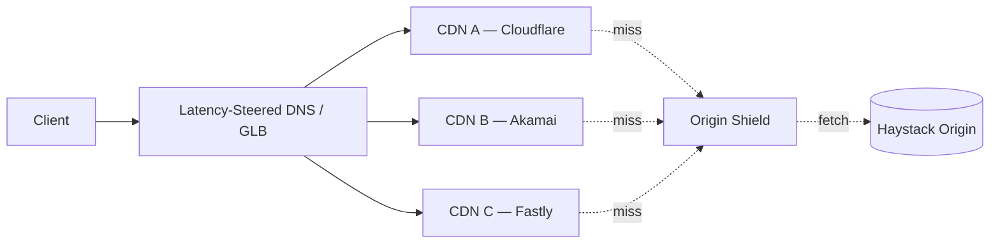
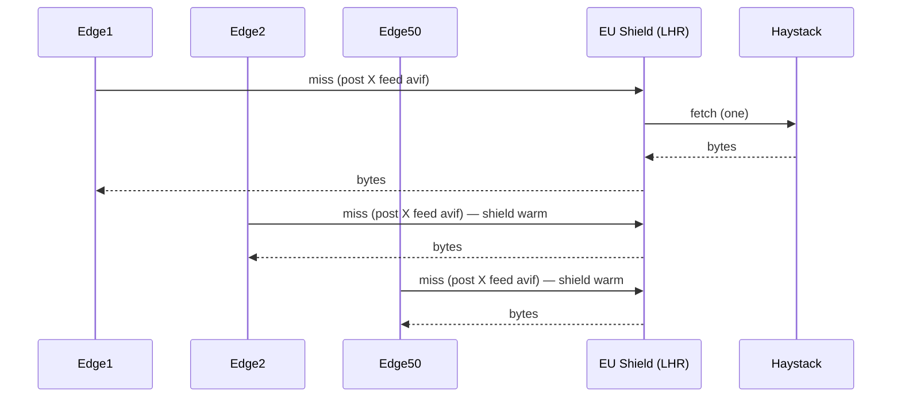
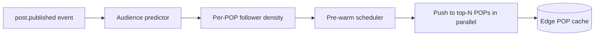

# Instagram Deep Dive — CDN Strategy

**Date:** 2026-04-29 | **Updated:** 2026-04-29
**Tags:** `system-design` `case-study` `instagram` `deep-dive` `cdn` `images`
**Parent:** [`../design-instagram.md`](../design-instagram.md)

## Table of Contents

- [Summary](#summary)
- [Overview — Why a Photo CDN Is Different from a Text CDN](#overview--why-a-photo-cdn-is-different-from-a-text-cdn)
- [Immutable Derivatives — One Source, Many Outputs](#immutable-derivatives--one-source-many-outputs)
- [URL Design — Encoding Size, Format, and Version](#url-design--encoding-size-format-and-version)
- [Content-Addressed URLs — SHA-256 of the Derivative](#content-addressed-urls--sha-256-of-the-derivative)
- [Format Negotiation — AVIF, WebP, JPEG, and the Accept Header](#format-negotiation--avif-webp-jpeg-and-the-accept-header)
- [Multi-CDN Strategy — Resilience, Cost, and Steering](#multi-cdn-strategy--resilience-cost-and-steering)
- [Origin Shield — Collapsing Misses Before They Hit Haystack](#origin-shield--collapsing-misses-before-they-hit-haystack)
- [Cache-Key Design — What Actually Goes Into the Hash](#cache-key-design--what-actually-goes-into-the-hash)
- [Purge on Delete — Closing the Hole the Year-Long TTL Made](#purge-on-delete--closing-the-hole-the-year-long-ttl-made)
- [Edge Placement — Meta's Own POPs vs Commercial CDN](#edge-placement--metas-own-pops-vs-commercial-cdn)
- [Browser Cache Tuning — `immutable` and Long max-age](#browser-cache-tuning--immutable-and-long-max-age)
- [Cost Model — Egress Bandwidth Dominates](#cost-model--egress-bandwidth-dominates)
- [Per-Region Replication of Hot Derivatives](#per-region-replication-of-hot-derivatives)
- [Pre-Warming After a Celebrity Post](#pre-warming-after-a-celebrity-post)
- [Failover When a CDN Region Is Degraded](#failover-when-a-cdn-region-is-degraded)
- [Anti-Patterns](#anti-patterns)
- [Related](#related)
- [References](#references)

## Summary

The parent case study at [`../design-instagram.md`](../design-instagram.md) treats the photo CDN as a single sub-section: "geo-replicated, signed URLs, content-addressed keys." That hides every interesting trade-off Meta has actually had to make. Instagram delivers **on the order of a petabyte of image bytes a day**, fanned out from a relatively small set of source uploads into 4–8 derivatives each, in 2–3 codecs, served from POPs on every populated continent. Every one of those derivatives is **immutable for life** — the cache entry born at upload time is the cache entry served two years later — but the URL that points to it has to encode enough information that the right derivative shows up on the right device, and yet must stay invalidatable when the user deletes the photo.

This document is the Instagram-specific application of [`../../../building-blocks/caching-layers.md`](../../../building-blocks/caching-layers.md). Where the Pastebin sibling at [`../../basic/pastebin/caching-and-cdn.md`](../../basic/pastebin/caching-and-cdn.md) caches **immutable text blobs** (KB-sized, one variant), and the URL Shortener sibling at [`../../basic/url-shortener/cache-strategy.md`](../../basic/url-shortener/cache-strategy.md) caches **tiny mutable redirect rows**, Instagram caches **large multi-derivative binary media** where the egress bill, not the origin CPU, sets the budget. Read those first; this doc focuses on what changes when the cache key explodes from one entry per ID to dozens, and the bytes are large enough that a single cold-region miss visibly costs money.

The single most important insight: **make every derivative URL bit-immutable and content-addressed, then make the *expensive* engineering decisions — codec negotiation, region steering, purge fanout, failover — at the layer above the cache, not inside it**.

## Overview — Why a Photo CDN Is Different from a Text CDN

A Pastebin paste has one body, one MIME type, and one cache entry per ID. An Instagram photo has, at minimum:

- 4 logical sizes: feed thumbnail (~150 px), feed (~480 px), full (~1080 px), HD (~1440 px or original), plus profile-pic and avatar derivatives.
- 3 codecs in flight: AVIF for modern Chromium / Safari, WebP for the rest of the modern web, JPEG for fallbacks.
- 2 pixel densities: 1× and 2× (Retina).
- 1 video poster frame and one or more video transcodes for Reels.

That is on the order of **24–40 distinct cache entries per source photo** before you count regional replicas. At 100 M posts/day this is 2.4–4 B new derivatives/day to populate across the edge. The reads dwarf even that: 500 M DAU × 50 feed impressions × ~5 image fetches per impression ≈ **125 B image fetches/day**.

The consequence: the design's budget is not "how do we keep origin alive" — that's a solved problem with content-addressing and shielding — but **"how do we keep the egress bill survivable, the codec mix optimal, and the purge story honest."** Unlike text, you cannot afford to be sloppy with cardinality (a single misplaced query string fragment that slips into the cache key multiplies storage by orders of magnitude), and you cannot afford to be sloppy with format negotiation (serving a JPEG to a device that supports AVIF wastes 30–50% bandwidth at a cost measured in millions of dollars per year).

```text
Working numbers (order of magnitude, illustrative)
---------------------------------------------------
Posts/day:              100 M
Derivatives/post:       ~30 (sizes × codecs × densities)
New cache entries/day:  ~3 B
Image fetches/day:      ~125 B
Avg derivative size:    ~50 KB feed thumb, ~200 KB full, ~600 KB HD
Total egress/day:       ~5–10 PB photo bytes (plus video)
Edge hit ratio target:  > 98% globally, > 99.5% per-region for hot content
Origin requests/day:    ~1–2 B (post-shield)
```

These numbers vary by year, region mix, and product surface. The structural point — **derivatives × codecs × densities × regions** — is the part that doesn't change.

## Immutable Derivatives — One Source, Many Outputs

Instagram's transcoder pipeline (see Deep Dive #1 in the parent, [`../design-instagram.md#1-photo-upload-pipeline`](../design-instagram.md#1-photo-upload-pipeline)) takes one source upload and emits a fan of derivatives. Each derivative is computed once, stored in Haystack-style blob storage, and assigned a URL that **never changes for the life of the post**.

The derivative matrix:

| Logical name | Width (px) | Use | Typical codec | Typical size |
|---|---:|---|---|---:|
| `t` (thumb) | 150 | Grid, profile thumbnails | AVIF / WebP | 8–15 KB |
| `s` (square) | 320 | Carousels, search results | AVIF / WebP | 25–40 KB |
| `m` (medium) | 480 | Feed on smaller phones | AVIF / WebP | 40–80 KB |
| `l` (large / feed) | 1080 | Feed on modern phones | AVIF / WebP | 100–200 KB |
| `xl` (HD) | 1440 | Tablets, zoom, share | AVIF / WebP | 200–500 KB |
| `orig` | source | Download, archival | JPEG | up to several MB |
| `pp` (profile pic) | 320 / 1080 | Avatar everywhere | AVIF / WebP | square crop |

**Why fixed sizes instead of arbitrary widths.** A "give me 537 px" API generates an unbounded cardinality of cache entries. With a fixed ladder of 5–7 widths, every viewer maps to one of them and the edge sees high hit ratios.

**Why immutable.** Once a derivative is generated, its bytes are functionally pinned: the upload pipeline cannot rewrite a derivative's URL without producing a new ID, because the URL embeds a hash of the bytes (see [Content-Addressed URLs](#content-addressed-urls--sha-256-of-the-derivative)). Re-encoding to a better quality preset means **a new derivative with a new URL**, not an in-place replacement. The old URL keeps serving its old bytes until the post is deleted.

This is the same property that makes Pastebin so cache-friendly, applied at higher cardinality. Where the Pastebin sibling stores one cache entry per paste ID, Instagram stores one per `(post_id, derivative_name, codec, density)` tuple — but each entry remains as immutable as a paste body.

## URL Design — Encoding Size, Format, and Version

Two competing pressures shape the URL:

1. **The CDN cache key is the URL.** Whatever distinguishes one derivative from another must appear in the URL path, not in a query string the cache might ignore.
2. **The client should not have to "compute" URLs.** The API returns the URL the client should fetch — clients never construct media URLs by string-templating.

The Instagram-style URL shape (illustrative, simplified):

```text
https://scontent-{pop}.cdninstagram.com/v/t51.{namespace}-{family}/{hash}_n.{ext}?
    _nc_ht={pop_host}
    & _nc_cat={shard}
    & _nc_ohc={short_hash}
    & ccb={cache_breaker}
    & oh={signature}
    & oe={signature_expiry_unix}
    & _nc_sid={session_id}
```

Decomposed:

| Segment | Role |
|---|---|
| `scontent-{pop}.cdninstagram.com` | DNS-level region steering: client resolves to the nearest POP. |
| `/v/{namespace}-{family}/` | Logical bucket: photos, profile pics, story media, video posters. |
| `{hash}_n.{ext}` | Content-addressed identifier (see next section); `.jpg`/`.heic`/`.webp` informs the origin which codec is canonical. |
| `_nc_cat`, `_nc_ohc` | Shard / origin hints used by the edge to route a miss to the right origin replica. |
| `ccb` | A version/cache-breaker token tied to the *URL generation*, not the bytes — when Meta wants to roll signing or steering changes, this is bumped. |
| `oh`, `oe` | HMAC signature and expiry; URLs are time-limited (hours to days) and must be re-fetched from the API when stale. |

**Why the signature is short-lived even though the bytes are immutable.** Hot-link prevention. If the URL were forever-valid, scrapers could index it and re-serve forever. With short-lived signatures, the client must come back to the API for a fresh URL — which gives Meta a per-request enforcement point for blocks, deletes, and rate limiting.

**Why the cache key strips the signature.** The CDN's cache key is the *content-addressed* portion (`{namespace}-{family}/{hash}`) plus codec and any size hint, **not** the signature. Otherwise every fresh signature would miss cache. The edge's cache configuration explicitly normalizes the URL: drop `oh`, `oe`, `_nc_sid`, validate them at the edge before lookup, then look up by the stable portion.

A simpler path-only design that is easier to reason about for an HLD interview answer:

```text
https://cdn.instagram.example.com/p/{shortcode}/{size}/{codec}/{hash}.{ext}

# Examples
/p/CZ3jK2lP9_x/feed/avif/9df8…b31a.avif
/p/CZ3jK2lP9_x/thumb/webp/2a1c…ee08.webp
/p/CZ3jK2lP9_x/full/jpeg/c2bd…77ff.jpg
```

Path-segmented, no query strings, every distinguishing axis lives in the path, and the trailing hash makes each URL bit-immutable.

The takeaway: **put cache-key axes in the path, put auth/version/steering in query strings, and configure the CDN to cache by path only.**

## Content-Addressed URLs — SHA-256 of the Derivative

Each derivative's URL embeds the **SHA-256 of the derivative's bytes**, not of the source photo. Two consequences:

1. **The URL is bit-immutable.** Two requests for the same URL must return identical bytes; if they don't, the CDN's contract with the browser is broken (the `ETag` no longer matches; browsers will show stale or torn images).
2. **Re-encoding produces a new URL.** If Meta improves the AVIF encoder and re-runs the pipeline, the new derivative has a new hash and a new URL. The old URL keeps serving the old bytes — until the API stops returning it.

This pattern is the same content-addressing used by Git for blobs, by IPFS for files, and by every modern static-asset pipeline (Webpack `[contenthash]`, Vite, Next.js). At Instagram's scale, the leverage is enormous:

- **Conditional GETs become free.** The browser's `If-None-Match` always hits because the `ETag` is the hash; nothing ever changes; revalidation is a 304.
- **Cache poisoning is much harder.** An attacker cannot trick the CDN into associating the wrong bytes with a known URL — the URL itself is derived from the bytes.
- **Cross-CDN consistency works.** Two CDN providers fetching the same `(URL, hash)` from origin will store identical bytes; failover between them is a pure read-replacement.

```text
hash = sha256(derivative_bytes)         -- 32 bytes
url_hash_segment = base64url(hash)[:22] -- 132 bits, plenty unique
```

Truncating to 22 base64url characters gives 132 bits of entropy — a collision space far larger than the total number of derivatives Instagram will ever produce. Some implementations truncate further (96 bits) and accept a one-in-a-trillion collision probability in exchange for shorter URLs.

**An important nuance: the *source* photo also has a perceptual hash for de-dup and abuse, but the *derivative* hash is byte-exact.** They serve different purposes. The perceptual hash (PhotoDNA-style) catches "this is the same photo at a different quality"; the byte hash makes the CDN entry safely cacheable. Don't confuse the two.

## Format Negotiation — AVIF, WebP, JPEG, and the Accept Header

A 1080-wide feed photo encodes to roughly:

| Codec | Size (typical) | Decode CPU | Browser support |
|---|---:|---|---|
| JPEG (q=75) | 180 KB | Cheapest | Universal |
| WebP (q=80) | 110 KB | Low | All modern browsers |
| AVIF (q=63) | 70 KB | Higher | Chrome 85+, Safari 16.4+, Firefox 93+ |

Going from JPEG → AVIF on every feed image cuts photo egress by 50–60%. At Instagram-scale egress, that is **billions of dollars over the life of the product**. The only catch: not every device decodes AVIF, and forcing AVIF on a device that doesn't support it produces a broken image.

There are two ways to negotiate codec:

### Option A — Server-driven via `Accept`

The browser sends:

```http
GET /p/CZ3jK2lP9_x/feed
Accept: image/avif,image/webp,image/apng,image/svg+xml,image/*,*/*;q=0.8
```

The CDN inspects `Accept`, picks the best supported codec, returns it, and adds:

```http
Vary: Accept
```

`Vary: Accept` is a cardinality nightmare. The header is wildly inconsistent across browsers — Chrome adds `image/avif`, Firefox adds it later, Safari changed its order — so the cache fragments into dozens of distinct entries per URL even though there are only three logical codecs.

**Mitigation: normalize `Accept` at the edge.** A worker (Cloudflare Worker, CloudFront Function, Fastly Compute) reads `Accept`, derives a canonical codec token (`avif` | `webp` | `jpeg`), rewrites the request to a path-segmented URL, and caches by path:

```javascript
// Cloudflare Worker — codec negotiation at the edge
export default {
  async fetch(req) {
    const url = new URL(req.url);
    const accept = req.headers.get('accept') || '';
    const supportsAvif = accept.includes('image/avif');
    const supportsWebp = accept.includes('image/webp');

    let codec = 'jpeg';
    if (supportsAvif) codec = 'avif';
    else if (supportsWebp) codec = 'webp';

    // Rewrite /p/{id}/{size} -> /p/{id}/{size}/{codec}
    if (!url.pathname.match(/\/(avif|webp|jpeg)\//)) {
      url.pathname = url.pathname.replace(
        /^\/p\/([^/]+)\/([^/]+)$/,
        `/p/$1/$2/${codec}`,
      );
    }
    return fetch(url.toString(), req);
  },
};
```

Now the cache key is path-only, three logical entries per `(post, size)`, and `Vary: Accept` never enters the picture. Every modern image-CDN provider (Cloudflare Images, Fastly Image Optimizer, AWS CloudFront with Lambda@Edge) supports a variant of this pattern.

### Option B — API-driven

The Instagram client knows what its OS/browser supports. The API returns the URL for the right codec directly:

```json
{
  "media": {
    "feed_url": "https://cdn.instagram.example.com/p/CZ3jK2lP9_x/feed/avif/9df8…b31a.avif",
    "fallback_url": "https://cdn.instagram.example.com/p/CZ3jK2lP9_x/feed/jpeg/c2bd…77ff.jpg"
  }
}
```

Client picks; CDN caches by full path; no `Vary` involved. **This is what Instagram actually does** for its native apps, because the apps have richer device info than `Accept` can convey (codec hardware decoder, screen DPI, current network class).

For web clients, Option A is the pragmatic default. For native apps, Option B is cleaner.

The web's reference for image format support: [MDN — Image file type and format guide](https://developer.mozilla.org/en-US/docs/Web/Media/Formats/Image_types), [MDN — AVIF](https://developer.mozilla.org/en-US/docs/Web/Media/Formats/Image_types#avif_image), [MDN — WebP](https://developer.mozilla.org/en-US/docs/Web/Media/Formats/Image_types#webp_image).

### Brotli / gzip don't apply

Image bytes are already compressed by the codec. `Content-Encoding: br` on a JPEG does nothing useful; CDNs should **not** attempt transparent compression on `image/*` responses. The corresponding `Vary: Accept-Encoding` should be absent for image paths to keep the cache key clean.

## Multi-CDN Strategy — Resilience, Cost, and Steering

Instagram itself runs Meta's own edge network ("scontent.cdninstagram.com"), but anyone else designing this system at a smaller scale faces the multi-CDN question explicitly. Even Meta runs multiple commercial CDNs as overflow / backup in regions where its own POPs are weak.

The reasons to use more than one CDN:

| Reason | What it gives you |
|---|---|
| Resilience | A regional outage at one provider doesn't black out the product. |
| Cost arbitrage | Negotiate against vendors; route Asia-Pacific traffic to whichever is cheapest there. |
| Performance | Some vendors are faster in certain metros than others. |
| Compliance | Some regions require local-vendor delivery (e.g. China). |

The reasons not to:

| Reason | What it costs you |
|---|---|
| Operational complexity | Two purge APIs, two log formats, two failure modes, two teams. |
| Cache fragmentation | Hot content has to warm two caches; first hits double-miss. |
| Consistency hazards | If signing keys differ between vendors, signed-URL bugs multiply. |
| Cost | Volume discounts shrink when split. |

The standard architecture:



**DNS-based steering** (NS1, AWS Route 53, Cloudflare Load Balancer) returns a different CNAME per client based on RUM data — observed RTT to each provider, current health, and weighted cost. The provider returns its own POP IP. On miss, every provider goes through a **single shared origin shield** so origin sees one fetch regardless of which provider missed.

The shared shield is what keeps the design honest: without it, three providers each build their own warm cache, and a re-warm event after a purge triples the origin load.

For deeper coverage of edge networking and POP placement, see [`../../../../networking/infrastructure/cdn-and-edge.md`](../../../../networking/infrastructure/cdn-and-edge.md).

## Origin Shield — Collapsing Misses Before They Hit Haystack

The origin in Instagram's design is a Haystack-style blob store ([`../../../building-blocks/object-and-blob-storage.md`](../../../building-blocks/object-and-blob-storage.md)). Haystack is fast (single seek per blob) but it is not free: a miss that lands on the cold path involves Haystack index lookup, blob fetch, and possibly a cross-region pull if the derivative was generated in a different region.

Without a shield, every POP that doesn't have a derivative cached pays this cost on cold-miss. With ~50 POPs, a freshly-uploaded photo can cost 50 origin fetches in the seconds after publish.

**Shield topology.** A small number (often one per geography: `us-east-1`, `eu-west-1`, `ap-northeast-1`) of *shield POPs* sit between the edge and origin. Edge → shield → origin. A miss at any edge in `eu-*` routes through the EU shield; the shield issues one origin fetch and serves all subsequent EU edges from its own cache.



Origin sees one fetch instead of N. Single-flight inside the shield ensures concurrent edge misses for the same key collapse:

```go
// Shield's request collapser — one origin fetch per (key) at a time
import "golang.org/x/sync/singleflight"

func (s *Shield) Fetch(ctx context.Context, key string) ([]byte, error) {
    v, err, _ := s.sf.Do(key, func() (any, error) {
        return s.origin.Get(ctx, key)
    })
    if err != nil { return nil, err }
    return v.([]byte), nil
}
```

CDN-specific equivalents: Cloudflare's [Tiered Cache](https://developers.cloudflare.com/cache/how-to/tiered-cache/) and [Cache Reserve](https://developers.cloudflare.com/cache/advanced-configuration/cache-reserve/), Fastly's [Origin Shield](https://www.fastly.com/documentation/guides/full-site-delivery/concepts/shielding/), CloudFront's [Origin Shield](https://docs.aws.amazon.com/AmazonCloudFront/latest/DeveloperGuide/origin-shield.html). All do the same thing: a designated POP in front of origin that absorbs first-misses.

The Pastebin sibling at [`../../basic/pastebin/caching-and-cdn.md#multi-region-topology--origin-shield-vs-direct-origin`](../../basic/pastebin/caching-and-cdn.md#multi-region-topology--origin-shield-vs-direct-origin) covers the same pattern at smaller scale; the difference here is that the bytes are *much larger* (200 KB vs 3 KB) so the savings from collapsing 50 fetches into 1 are 50× more meaningful in egress dollars.

## Cache-Key Design — What Actually Goes Into the Hash

The cache key for a derivative is small — but every byte that goes in, by accident or design, multiplies cardinality.

**What must be in the key** (axes that distinguish bytes):

- Path (post shortcode + size + codec).
- Host (so multi-tenant subdomains don't collide).
- Possibly density (`@2x`) if encoded in the path.

**What must NOT be in the key** (axes that don't change the bytes):

- Query strings — `oh`, `oe`, `_nc_sid`, `ccb`, `utm_*`. Strip everything; let the request handler validate auth headers separately.
- Cookies. Photo URLs are public; `Vary: Cookie` would explode the cache.
- `User-Agent`. Resist the urge to vary by browser; keep codec axes in the path.
- `Authorization`. If a URL needs auth, validate it at the edge and bypass cache for the response decision but cache the bytes themselves under the public key.
- `Accept` (after edge normalization). Use a worker to convert `Accept` into a path segment as shown above; never let `Vary: Accept` reach the cache.

**Cache key composition (illustrative):**

```text
key = sha256(host + ":" + path)          # never query strings, headers, cookies
```

CloudFront cache policies make this explicit:

```jsonc
{
  "Name": "InstagramPhotoImmutable",
  "DefaultTTL": 31536000,
  "MaxTTL": 31536000,
  "MinTTL": 0,
  "ParametersInCacheKeyAndForwardedToOrigin": {
    "EnableAcceptEncodingBrotli": false,  // images are not text
    "EnableAcceptEncodingGzip": false,
    "QueryStringsConfig": { "QueryStringBehavior": "none" },
    "HeadersConfig":      { "HeaderBehavior": "none" },
    "CookiesConfig":      { "CookieBehavior": "none" }
  }
}
```

Cloudflare's equivalent uses Cache Rules with `cache_key.custom_key.query_string.include = []` and `cache_key.custom_key.header.include = []`. See the [CloudFront cache key docs](https://docs.aws.amazon.com/AmazonCloudFront/latest/DeveloperGuide/controlling-the-cache-key.html) and [Cloudflare Cache Rules](https://developers.cloudflare.com/cache/how-to/cache-rules/).

The cardinality math is brutal if you get this wrong: one accidental `Vary: User-Agent` on photo paths multiplies edge storage by ~thousands and drops hit ratio from 99% to single digits.

## Purge on Delete — Closing the Hole the Year-Long TTL Made

Year-long TTLs make the CDN extraordinarily efficient. They also create the **delete problem**: a user deletes a photo, the API stops returning the URL, but every edge that cached the bytes will keep serving them for up to a year.

This is not theoretical. Privacy and legal compliance depend on the deletion actually propagating. Three layers of defense:

### Layer 1 — Stop returning the URL

The cheapest layer. Once the post is marked deleted, the API never hands out a signed URL for any of its derivatives. New viewers see "Post unavailable." Old viewers with a cached app state can still hit the bare URL — that's where Layer 2 kicks in.

### Layer 2 — Signed-URL expiry

Signed URLs expire after hours to days. After expiry, any direct hit to the URL fails signature verification at the edge, returns `403`, and the bytes are no longer served regardless of cache state. This is the **first hard wall** between a deleted photo and the public internet.

### Layer 3 — Active CDN purge

For deletes that legally must propagate now (DMCA, GDPR right-to-be-forgotten, CSAM removal), trigger an active purge across every CDN region:

```bash
# Surrogate-key purge (Fastly): one call drops every variant
curl -X POST "https://api.fastly.com/service/$SERVICE/purge/post-CZ3jK2lP9_x" \
  -H "Fastly-Key: $TOKEN"

# Cache-tag purge (Cloudflare Enterprise)
curl -X POST "https://api.cloudflare.com/client/v4/zones/$ZONE/purge_cache" \
  -H "Authorization: Bearer $TOKEN" \
  --data '{"tags":["post-CZ3jK2lP9_x"]}'

# Path invalidation (CloudFront)
aws cloudfront create-invalidation --distribution-id $DIST \
  --paths "/p/CZ3jK2lP9_x/*"
```

Tag- or surrogate-key-based purge is the right primitive: one call invalidates **every derivative** of the deleted post (sizes × codecs × densities) across every POP in seconds. Cloudflare Enterprise calls these [Cache Tags](https://developers.cloudflare.com/cache/how-to/purge-cache/purge-by-tags/), Fastly calls them [Surrogate Keys](https://www.fastly.com/documentation/reference/http/http-headers/Surrogate-Key/).

In a multi-CDN setup, purge is a fanout: a Kafka topic carries `post.deleted` events; each CDN-specific purger consumes and translates to the right API call. This must be **idempotent and observable** — a failed purge is a privacy incident, so the queue retries and pages on persistent failure.

### Layer 4 — Origin tombstone

Defense in depth. Even after purge, edges might re-fetch from origin (a DNS misroute, a worker bug). Origin returns `410 Gone` with a short negative-cache TTL:

```http
HTTP/1.1 410 Gone
Cache-Control: public, max-age=60

This media has been removed.
```

Any edge that re-fetches gets the tombstone, caches it for 60 seconds, serves `410` to subsequent viewers, then re-checks. This is the same pattern used in the Pastebin sibling for soft-deletes; the difference is that Instagram's purge is *first*, not *only*, defense.

## Edge Placement — Meta's Own POPs vs Commercial CDN

At Instagram-scale, owning the edge is cheaper than renting it. Meta operates its own global network (publicly: [Meta's Edge Network](https://engineering.fb.com/2020/06/12/web/express-backbone/), [Express Backbone](https://engineering.fb.com/2017/05/01/data-center-engineering/building-express-backbone-facebook-s-new-long-haul-network/)), placing POPs in major metros and connecting them with a private backbone. Public-DNS lookups for `scontent.cdninstagram.com` resolve to a metro-local POP IP based on the client's resolver.

For a smaller design, the calculus is different:

| Approach | Pros | Cons |
|---|---|---|
| Pure commercial CDN (Cloudflare, Fastly, Akamai, CloudFront) | Zero capex; instant global footprint; managed certs, DDoS, WAF. | Egress is the cost line; pricing varies 10× across vendors. |
| Hybrid — CDN front of own object store | Low ops cost for edge; control over origin. | Cross-vendor purge fanout. |
| Own POPs + CDN overflow | Best $/GB at multi-PB egress. | High capex; meaningful only at scale. |
| Pure own POPs | Lowest marginal cost; full control. | Years of engineering investment; only Meta/Google/Netflix-class. |

The HLD answer for "design Instagram from scratch" is: **start on a commercial CDN with shielding, plan the hybrid path once egress cost dominates engineering payroll**. The actual Meta architecture is the asymptote, not the starting point.

POP-placement principles, regardless of who owns them:

- **One POP per metro of meaningful traffic.** A POP outside the metro means cross-ISP transit for every fetch.
- **Peering with the eyeball ISPs in that metro.** Otherwise the POP is paying transit fees on every byte.
- **Shielding co-located with origin.** A shield in `us-east-1` for an origin in `us-east-1` collapses cross-region fetches into intra-AZ pulls — a 10× cost difference.
- **Submarine-cable proximity.** APAC, EMEA, and LATAM POPs only beat the alternative when they're not the wrong side of an oversubscribed cable.

## Browser Cache Tuning — `immutable` and Long max-age

The CDN serves the bytes to the browser; the browser then has to decide whether to re-ask on the next view. With derivatives that genuinely never change, the right answer is "never re-ask":

```http
HTTP/1.1 200 OK
Content-Type: image/avif
Content-Length: 71283
Cache-Control: public, max-age=31536000, immutable
ETag: "9df8…b31a"
Vary: Accept            # only if not normalized at edge
```

- `public` — opt into shared caches.
- `max-age=31536000` — one year; the de-facto "forever."
- `immutable` — defined by [RFC 8246](https://www.rfc-editor.org/rfc/rfc8246.html). Tells browsers **not** to issue a conditional GET on reload (F5). Without it, Safari and Firefox revalidate on every page reload — a 304 is cheap on the wire but adds a 50–200 ms RTT to every visible image on a celebrity's profile.

The browser's HTTP cache survives across sessions. A user who scrolls to a feed photo at 9am and revisits it at 6pm should hit local disk, not even an edge fetch. With `immutable` + 1-year `max-age`, that works on every modern browser.

**A subtle requirement: pair `immutable` with a hashed URL.** If the URL is *not* content-addressed, `immutable` is unsafe — you cannot bump the bytes without breaking already-cached browser entries. Instagram's `{hash}.{ext}` URL design is exactly the contract that makes `immutable` honest.

The [MDN reference for `Cache-Control: immutable`](https://developer.mozilla.org/en-US/docs/Web/HTTP/Headers/Cache-Control#immutable) lists current browser support; it is universal in evergreen browsers.

## Cost Model — Egress Bandwidth Dominates

Per-GB egress at typical commercial-CDN pricing:

| Provider | First TBs | Volume tier | Notes |
|---|---|---|---|
| Cloudflare | Unmetered (fair use) | Flat tier (Free / Pro / Business / Enterprise) | Egress-friendly; dominant choice for image-heavy workloads at small scale. |
| Fastly | ~$0.12/GB first 10 TB | Volume discounts on contract | Per-request pricing also matters. |
| AWS CloudFront | ~$0.085/GB first 10 TB | Volume tiers down to ~$0.02/GB at hundreds of PB | Egress from S3 to CloudFront is free intra-region. |
| Akamai | Custom contracts | Negotiated | Premium pricing; deep peering. |

Plug in Instagram-illustrative numbers (5 PB photo egress/day = 150 PB/month) at $0.04/GB negotiated:

```text
150 PB/month × 1024 TB/PB × 1024 GB/TB × $0.04/GB
≈ 6.3 × 10^9 bytes-billed × $0.04 ≈ ~$6.3M/month at this rate
```

(Actual at-scale rates are dramatically lower than rate-card; Meta and AWS settle privately. The rough shape — single-digit million dollars per month of egress per derivative-shape — is what matters.) The dominating cost moves are:

| Lever | Savings |
|---|---|
| AVIF over JPEG | ~50% bytes per derivative |
| Tighter quality presets | 5–15% bytes per derivative |
| Drop unused derivatives | Linear in entries removed |
| Origin shielding | Cuts cross-region origin egress, not edge-to-client |
| Region-local origin replicas | Cuts transit egress, not edge-to-client |
| Better hit ratio | Cuts origin egress only; edge-to-client unchanged |

The non-obvious one: **better hit ratio doesn't help the egress bill that matters.** The browser still asks for the bytes; the bytes still leave the CDN. The big lever is *the bytes themselves* — codec, quality, and not generating derivatives no one fetches.

For broader cost trade-offs in caching architectures, see [`../../basic/pastebin/caching-and-cdn.md#cdn-cost-model`](../../basic/pastebin/caching-and-cdn.md#cdn-cost-model).

## Per-Region Replication of Hot Derivatives

Most photos are seen mostly in the author's region. A photo posted from São Paulo is mostly viewed in Brazil; a photo posted from Tokyo is mostly viewed in Japan. The naive design — origin in `us-east-1`, edges everywhere — pays cross-Atlantic and cross-Pacific transit on every cold miss for those photos.

The fix: **regional origin replicas for hot content**. Haystack-style stores replicate within and across regions; the upload pipeline writes to the author's home region first, then asynchronously replicates to other regions where the post has predicted demand.

```text
Upload (Brazil author)
  → write to South America origin (sync)
  → replicate to North America origin (async, ~minutes)
  → replicate to Europe origin (async, ~minutes)
  → replicate to APAC origin (async, ~minutes, lower priority)
```

**Predicted demand** is a feature of the recommendation system: a post by an author with most followers in a given region should pre-warm that region's origin first.

The CDN edge then routes its origin pulls to the nearest origin replica, not the global home. This is the same logic as a multi-region object-store federation: edge → shield in region X → origin replica in region X (if present) → home origin (fallback).

For posts that go viral in a region the home origin didn't replicate to — a Brazilian photo that explodes in Vietnam — the pull from home is a one-time cost; the regional shield then warms and serves all subsequent reads locally.

## Pre-Warming After a Celebrity Post

A celebrity post is the read-amplification stress test of the entire CDN. Within seconds of publish, tens of thousands of edge POPs receive their first request for the new derivatives. Without pre-warming, every POP misses, every miss routes through the shield, the shield misses, and origin sees a thundering herd.

The pre-warm pipeline:



**Audience predictor.** Combines follower geography, time-of-day affinity, and historical engagement velocity for the author. Outputs a ranked list of POPs and an expected request rate.

**Push, not pull.** The pre-warm scheduler issues authenticated `PUT`/`POST` calls into the CDN's cache (where the API supports it) or fires synthetic GETs from inside each region to warm the local POP. Cloudflare exposes this as [Cache Reserve](https://developers.cloudflare.com/cache/advanced-configuration/cache-reserve/) and prefetch APIs; Fastly via VCL `restart` flow.

**Bound the fanout.** Pre-warming all 50 POPs for every post is wasteful. Pre-warm only the top-K POPs that account for ~95% of predicted demand; let cold-region POPs miss naturally — a single shield miss is acceptable when the post will be viewed twice in that region.

**Synchronization with publish.** The post must not become visible before the warm completes for the highest-traffic POPs, or else the publish-to-thunder window leaks origin load. A simple barrier: the publish event waits for an ACK from each priority POP, with a hard timeout (the post publishes anyway after 5 seconds).

This is the photo-CDN analog of the Pastebin "viral burst" pattern at [`../../basic/pastebin/caching-and-cdn.md#stampede-on-viral-pastes`](../../basic/pastebin/caching-and-cdn.md#stampede-on-viral-pastes), with two differences: the bytes are 100× larger (so the saving from avoiding a thundering miss is 100× more valuable), and the prediction signal is much richer (you know the author and their follower geography, where Pastebin only knows that something started getting hits).

## Failover When a CDN Region Is Degraded

Modes of CDN degradation:

| Mode | Symptom | Detection |
|---|---|---|
| Single POP unhealthy | Latency spikes / 5xx in one metro | Synthetic monitoring + RUM (Real-User Monitoring) |
| Regional outage | Whole continent affected | Provider status, RUM sees errors in many POPs |
| Provider-wide outage | Global outage at one CDN | Provider status, multi-CDN RUM |
| Origin shield down | Misses hang | Shield health check |
| Origin store degraded | Both shields miss | Origin health check |

The defense is **layered**, mirroring the layered cache:

### POP-level: latency-steered DNS

The DNS layer ([NS1](https://www.ibm.com/products/ns1-connect), [Route 53 latency](https://docs.aws.amazon.com/Route53/latest/DeveloperGuide/routing-policy-latency.html), [Cloudflare Load Balancer](https://www.cloudflare.com/application-services/products/load-balancing/)) demotes unhealthy POPs from the answer set within a TTL of detection (typically 30–60 seconds). Clients re-resolve, hit a healthy neighbour POP. Cost: a slight latency increase for affected users; product remains up.

### Provider-level: multi-CDN with active health checks

In a multi-CDN setup, an unhealthy provider drops out of the steering pool entirely. RUM data from the client app feeds back per-provider error rates and p99 latency; the steering layer routes new requests away within seconds. The other providers absorb the load — designed-for capacity headroom assumes any single provider can fail.

### Shield-level: bypass to origin

If the shield is degraded but origin is healthy, edges can be configured to bypass the shield (with explicit health-check routing). Cost: origin sees the un-shielded fanout temporarily; backed by the origin's own rate limits.

### Origin-level: serve-stale

If origin itself is down, edges serve stale on miss:

```vcl
# Fastly — serve stale on origin error
sub vcl_fetch {
  if (beresp.status >= 500 && beresp.status < 600) {
    return(deliver_stale);
  }
}
```

For immutable content, "stale" is the same as "fresh" — the bytes don't change. A user fetching a photo cached an hour ago gets the same image they would have gotten from origin. The product survives a several-hour origin outage with degraded capacity (no new uploads visible) but no broken images.

The [Cloudflare reference for Always Online / Serve Stale](https://developers.cloudflare.com/cache/advanced-configuration/serve-stale-content/) and the Fastly [serve-stale](https://www.fastly.com/documentation/guides/full-site-delivery/concepts/stale/) docs cover the operational details.

### Ultimate fallback: degraded UI

Last-resort: the client renders a placeholder (low-resolution preview embedded in the API response, or a blurhash, or the author's avatar) when a media URL fails. Better than a broken image icon. The Instagram client uses [BlurHash](https://blurha.sh/)-style preview strings exactly for this — the API includes a 30-byte hash that decodes to a blurry preview the client can render instantly while the real image is in flight or unavailable.

## Anti-Patterns

- **Generating derivatives at request time.** Worker spins up, downloads source, encodes, returns. Burns CPU per cold edge miss; defeats the whole "immutable URL" idea. Always pre-generate the full ladder at upload time.
- **Arbitrary-width derivatives.** `?w=537` queries the CDN for an unbounded set of widths; edge cardinality blows up; hit ratio collapses. Fixed ladder of widths only.
- **Forever-valid signed URLs.** Hot-link prevention dies; deletes don't propagate via signature expiry; takedown depends entirely on purge, which is fragile. Short-lived signatures.
- **Putting the signature in the cache key.** Every refresh of the signed URL becomes a cache miss; hit ratio approaches zero. Strip auth params from the cache key.
- **`Vary: Accept` on image responses.** Cardinality explodes (Chrome ≠ Firefox ≠ Safari for the same logical AVIF support). Normalize `Accept` at the edge into a path-segmented codec; cache by path.
- **`Vary: User-Agent` on image responses.** Even worse than `Accept`. Thousands of UA strings × every photo. Never.
- **Year-long TTL without `immutable`.** Browsers still revalidate on F5; latency cost adds up. Use both.
- **Ignoring purge in the take-down path.** Relies entirely on signature expiry. Legally insufficient for DMCA / GDPR / CSAM. Must actively purge.
- **Single-CDN with no failover plan.** When the provider has its bad day, the product is dark. At minimum, multi-region within the provider; ideally multi-provider for the read path.
- **Origin in one region, no shield.** Cold derivatives pay full cross-Pacific transit on every POP miss. Always shield, ideally per-region.
- **Server-side image manipulation as a marketing feature.** "Resize/crop/filter via URL params" sounds nice; turns the CDN into a render farm and the cache key explodes. Pre-generate a fixed product ladder.
- **Re-encoding old derivatives in place.** Breaks immutability and any browser/CDN cached entry. Always emit a new URL for new bytes.
- **Cache `private` for "user only" media (DMs).** Private media should bypass the public photo CDN entirely — different host, different signing keys, different cache policy (`private, no-store`). Don't mix the two.
- **Caching error responses without TTL discipline.** A 5xx from origin cached for a year is a permanent outage. Cap negative caching at minutes.
- **Putting tracking parameters in image URLs.** `?utm_source=...` on a photo URL multiplies cardinality. Strip at the edge.
- **Using a CDN's "image optimization" feature without understanding cache key implications.** Cloudflare Images, Fastly Image Optimizer, etc. transform on the fly — confirm they cache the *output* by canonical key, not by every input parameter combination.

## Related

- Parent case study: [`../design-instagram.md`](../design-instagram.md), specifically [§8 CDN Strategy for Photos](../design-instagram.md#8-cdn-strategy-for-photos).
- Sibling deep dive (text blob caching): [`../../basic/pastebin/caching-and-cdn.md`](../../basic/pastebin/caching-and-cdn.md).
- Sibling deep dive (mutable redirects): [`../../basic/url-shortener/cache-strategy.md`](../../basic/url-shortener/cache-strategy.md).
- Building block — caching layers theory: [`../../../building-blocks/caching-layers.md`](../../../building-blocks/caching-layers.md).
- Building block — object and blob storage (Haystack origin): [`../../../building-blocks/object-and-blob-storage.md`](../../../building-blocks/object-and-blob-storage.md).
- CDN and edge networking: [`../../../../networking/infrastructure/cdn-and-edge.md`](../../../../networking/infrastructure/cdn-and-edge.md).
- HTTP evolution and caching headers: [`../../../../networking/application-layer/http-evolution.md`](../../../../networking/application-layer/http-evolution.md).

## References

- [RFC 8246 — HTTP Immutable Responses](https://www.rfc-editor.org/rfc/rfc8246.html) — defines `Cache-Control: immutable`; the directive that lets browsers skip revalidation on reload for content-addressed URLs.
- [RFC 9111 — HTTP Caching](https://www.rfc-editor.org/rfc/rfc9111.html) — current HTTP caching specification (obsoletes RFC 7234); `Cache-Control`, `Vary`, conditional requests, shared-cache semantics.
- [MDN — `Cache-Control`](https://developer.mozilla.org/en-US/docs/Web/HTTP/Headers/Cache-Control) — practical reference with browser support tables; the canonical place to look up directive behaviour.
- [MDN — Image file type and format guide](https://developer.mozilla.org/en-US/docs/Web/Media/Formats/Image_types) — AVIF, WebP, JPEG, and HEIC support matrices and trade-offs.
- [MDN — AVIF image format](https://developer.mozilla.org/en-US/docs/Web/Media/Formats/Image_types#avif_image) — codec details and browser compatibility.
- [MDN — WebP image format](https://developer.mozilla.org/en-US/docs/Web/Media/Formats/Image_types#webp_image) — codec details, browser compatibility, when WebP wins or loses to AVIF.
- [Meta Engineering — Building Express Backbone, Facebook's new long-haul network](https://engineering.fb.com/2017/05/01/data-center-engineering/building-express-backbone-facebook-s-new-long-haul-network/) — the private backbone behind Meta's edge network.
- [Meta Engineering — How Facebook is bringing QUIC to billions](https://engineering.fb.com/2020/10/21/networking-traffic/how-facebook-is-bringing-quic-to-billions/) — operational lessons on edge protocol changes that apply to image delivery too.
- [Cloudflare — Image Optimization](https://developers.cloudflare.com/images/) — overview of resize/format-negotiation features; the closest commercial analogue to a self-built derivative pipeline.
- [Cloudflare — Tiered Cache](https://developers.cloudflare.com/cache/how-to/tiered-cache/) — origin-shielding equivalent for collapsing edge misses.
- [Cloudflare — Cache Reserve](https://developers.cloudflare.com/cache/advanced-configuration/cache-reserve/) — durable, persistent edge cache for long-tail content.
- [Cloudflare — Purge by Cache Tags](https://developers.cloudflare.com/cache/how-to/purge-cache/purge-by-tags/) — Enterprise tag-based purge primitive; the read-mostly counterpart to Fastly Surrogate Keys.
- [Cloudflare — Cache Rules](https://developers.cloudflare.com/cache/how-to/cache-rules/) — rule-based cache key, TTL, and bypass control for image paths.
- [Cloudflare — Serve stale content](https://developers.cloudflare.com/cache/advanced-configuration/serve-stale-content/) — failover behaviour when origin is down.
- [Fastly — Origin shielding](https://www.fastly.com/documentation/guides/full-site-delivery/concepts/shielding/) — single-shield-POP architecture for collapsing origin fetches.
- [Fastly — Surrogate-Key documentation](https://www.fastly.com/documentation/reference/http/http-headers/Surrogate-Key/) — tag-based purge model that makes per-post invalidation atomic.
- [Akamai — Image and Video Manager](https://techdocs.akamai.com/ivm/docs) — Akamai's image-derivative product; a useful reference for how a major CDN models derivatives.
- [AWS CloudFront — Cache key and origin requests](https://docs.aws.amazon.com/AmazonCloudFront/latest/DeveloperGuide/controlling-the-cache-key.html) — cache policies, origin request policies, and how query-string/header behaviour affects key cardinality.
- [AWS CloudFront — Origin Shield](https://docs.aws.amazon.com/AmazonCloudFront/latest/DeveloperGuide/origin-shield.html) — co-locating a shield POP with origin to absorb cross-region misses.
- [BlurHash](https://blurha.sh/) — compact placeholder representation used by Instagram-class clients to render an immediate low-fidelity preview while the real image is in flight or unavailable.
