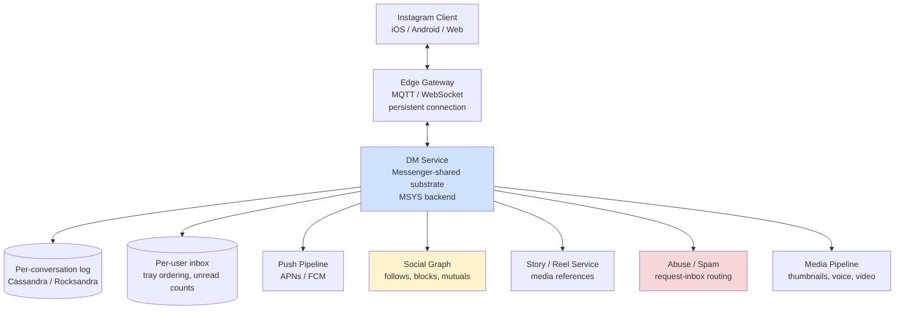
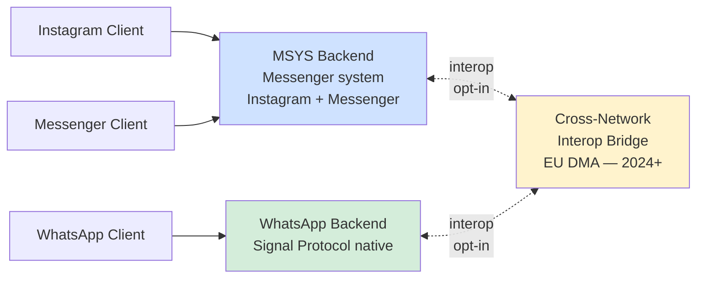
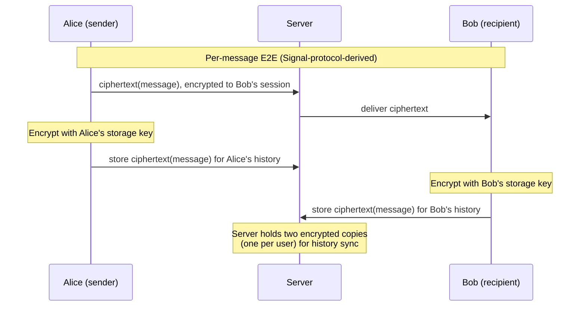
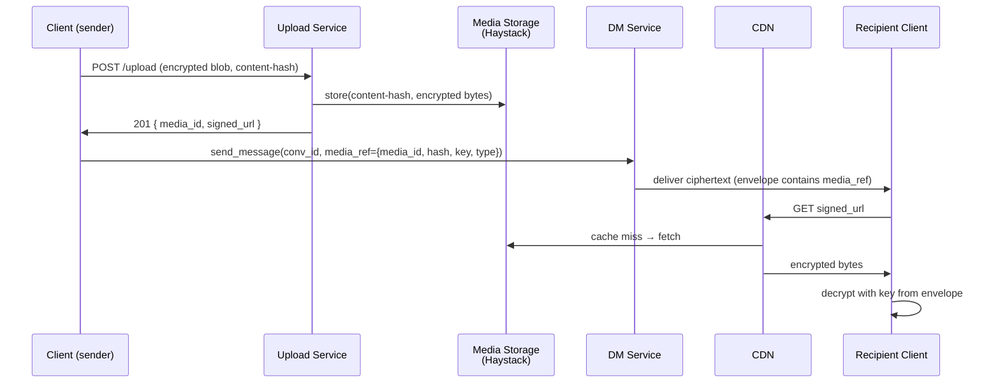
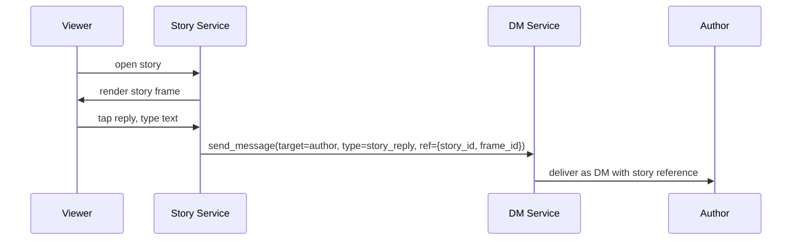
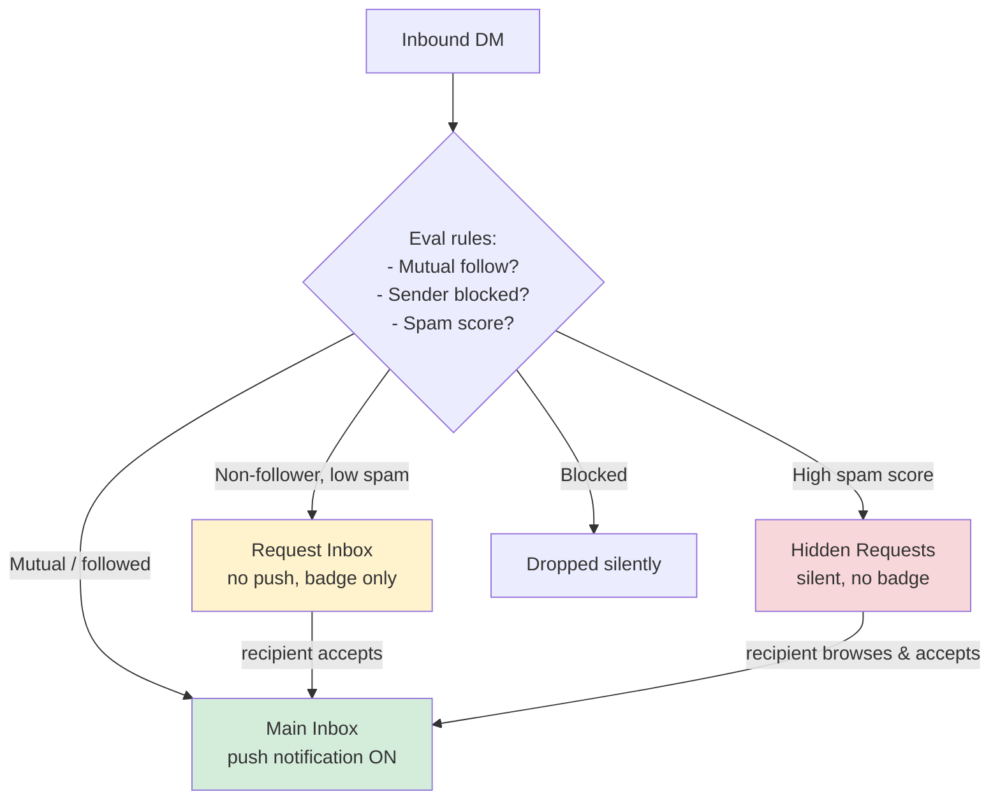
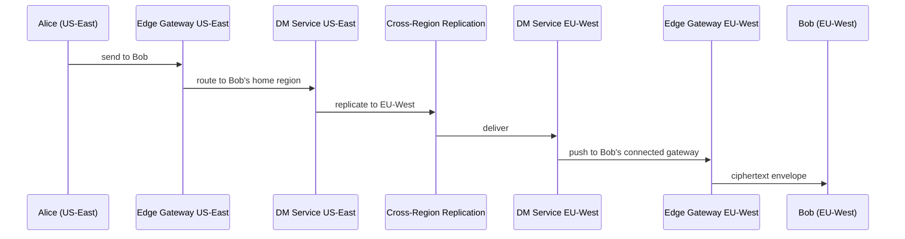

# Instagram Deep Dive — Direct Messages

**Date:** 2026-04-29 | **Updated:** 2026-04-29
**Tags:** `system-design` `case-study` `instagram` `deep-dive` `messaging` `dm`

## Table of Contents

- [Summary](#summary)
- [Overview](#overview)
- [Cross-App Messaging — Instagram + Messenger + WhatsApp](#cross-app-messaging--instagram--messenger--whatsapp)
- [E2E Encryption Rollout](#e2e-encryption-rollout)
- [Media in DM — Photos, Video, Voice Notes](#media-in-dm--photos-video-voice-notes)
- [Group DM — vs WhatsApp Groups](#group-dm--vs-whatsapp-groups)
- [DM Tray Ordering](#dm-tray-ordering)
- [Reactions](#reactions)
- [Vanish Mode](#vanish-mode)
- [Story Replies and Share-to-DM](#story-replies-and-share-to-dm)
- [Privacy and Reply Permissions](#privacy-and-reply-permissions)
- [Abuse Defense — Spam DMs](#abuse-defense--spam-dms)
- [Request Inbox vs Main Inbox](#request-inbox-vs-main-inbox)
- [Multi-Region Routing](#multi-region-routing)
- [Anti-Patterns](#anti-patterns)
- [Related](#related)
- [References](#references)

## Summary

Instagram Direct Messages (DM) is a chat system grafted onto a social-media product. Architecturally it inherits the **WhatsApp/Messenger chat substrate** — a per-conversation message log on Cassandra/Rocksandra, persistent-connection edge gateways speaking MQTT-style framing, push fallback through APNs/FCM — but adds Instagram-specific surfaces: story replies, post/reel shares, reply-permission rules tied to the social graph (mutual follow, follow request), a **request inbox** for messages from non-followers, and **vanish mode** as an ephemeral chat overlay. The 2020 Messenger merger turned DM from a standalone product into a node in **cross-app messaging**, where Instagram and Messenger users can chat with each other against a unified MSYS (Messenger backend) substrate; WhatsApp interop with Instagram and Messenger is being rolled out under EU DMA pressure but is gated by the cross-platform E2E protocol work that started shipping in 2023. End-to-end encryption arrived on Messenger as default in late 2023, and Instagram DM E2E rollout has been progressively expanding through 2024–2025 — a multi-year project because retrofitting E2E onto a server-side-search/ranking-aware chat product is significantly harder than building it native (which is what WhatsApp did from day one). The interesting Instagram-specific design problems are not "how do you order messages" — that's the WhatsApp deep-dive — they are "how do you reuse the WhatsApp/Messenger chat fabric while integrating with Stories, Reels, the social graph, and a request inbox," and "how do you roll out E2E to a chat product whose existing features depend on the server reading content."

## Overview

Instagram DM looks like a chat app inside a photo-sharing app. From a system-design perspective there are three layered problems:

1. **The chat-fabric problem.** Persistent connections, per-conversation ordering, group fanout, presence, typing, read receipts, offline delivery, multi-device. This is the [WhatsApp HLD](../../real-time/design-whatsapp.md) — Instagram does not reinvent it, it consumes it.
2. **The integration problem.** Story replies, share-to-DM, reply privacy, the request inbox, message reactions on a post — these are Instagram-specific surfaces that hand off to the chat fabric but carry Instagram-graph context the chat fabric does not natively understand.
3. **The retrofit problem.** Instagram DM was built without E2E. Now it is being migrated to E2E. Every server-side feature (search, spam detection, content moderation that reads message text, server-driven ranking of the DM tray) has to either move to the client or be replaced by a metadata-only signal.



The control-plane shape is similar to WhatsApp; the differences live in the orange/red boxes — graph-aware reply rules, story reply integration, abuse routing into a separate inbox.

The questions that matter:

- **Is DM a separate service, or part of the post service?** Separate. It has different durability (must not lose a message), different latency budget (interactive, not eventual), different ordering (strict per-conversation), different access pattern (small wide rows by conversation, not large by user).
- **What backend powers DM today?** After the 2020 Messenger merger, Instagram DM and Messenger share infrastructure ("MSYS" — Messenger system), with Instagram-specific clients on top. Story replies and post shares enter via Instagram-specific entry points but land in the same conversation log.
- **What does E2E break?** Server-side text search ("find that recipe my friend sent me"), server-side spam detection on message bodies, server-driven DM tray ranking using message content, server-side translation. Each one is either retired, moved client-side, or replaced with a metadata signal.
- **How is the request inbox different?** It is the same storage substrate but a different inbox bucket — messages from users you don't follow land there, with stricter abuse rules and a "you've never accepted this person" UX.

## Cross-App Messaging — Instagram + Messenger + WhatsApp

In **September 2020** Meta announced cross-app messaging between Instagram and Messenger. Users on one app could chat with users on the other, with reactions, replies, typing indicators, and read receipts working across the boundary. WhatsApp interop was held back; the original 2020 launch did not include WhatsApp because WhatsApp's E2E posture and identifier model (phone numbers) are different from Messenger's (Facebook IDs) and Instagram's (Instagram IDs).



**What "cross-app" actually means architecturally:**

- **Unified identifier space.** Instagram IDs and Messenger IDs are joined in a directory service. A Messenger user can address an Instagram user by Instagram username; the directory resolves to a canonical user ID inside MSYS.
- **Single conversation log.** A cross-app conversation lives in one wide row in MSYS, not in two separate logs per app. The client app rendering the conversation is a presentation choice; the underlying message ID space is unified.
- **Feature parity with caveats.** Some features are Instagram-only (story replies, vanish mode for non-mutuals); some are Messenger-only (chat themes historically, though many merged). Cross-app conversations expose the intersection.
- **Cross-app state.** Read receipts, reactions, and typing indicators propagate across apps through the same per-conversation event stream; the client renders them in app-native UI.

**WhatsApp interop (2024+).** The EU **Digital Markets Act** (DMA, in force March 2024) designates WhatsApp as a "gatekeeper messenger" and obligates Meta to allow third-party messaging interop. Meta published the [WhatsApp interop spec](https://faq.whatsapp.com/833220914796936) describing how third-party providers can register and exchange messages with WhatsApp users, using the Signal Protocol or a comparable E2E construction with key-transparency proofs. Instagram-to-WhatsApp interop falls under the same framework when both apps are involved. The interop bridge is opt-in per user; cross-network conversations are flagged in the UI; the bridge enforces message-format and content-policy translation between the networks.

**The hard part of interop is not transport — it is identity, key distribution, and feature mismatch.** Encrypting a Signal-protocol message between WhatsApp (Signal native) and Messenger/Instagram (E2E rolling out 2023+) requires both sides to publish prekey bundles in compatible formats and to honor key-change semantics across the network boundary. Features that don't exist on the other side (Instagram story replies in a WhatsApp conversation, WhatsApp Communities in an Instagram conversation) either degrade gracefully or are not permitted in cross-network chats.

## E2E Encryption Rollout

Messenger announced **end-to-end encryption by default** for personal one-to-one chats and calls in **December 2023**, with group chats following through 2024. Instagram DM E2E rollout has been progressive — opt-in test, then progressive default, expanding through 2024–2025 — and at time of writing remains in active deployment, with the goal of E2E-by-default parity with Messenger.

The protocol is a [Meta-built variant of the Signal Protocol](https://engineering.fb.com/2024/06/05/security/labyrinth-encrypted-message-storage-end-to-end-encrypted-messenger/) (technical white paper "Labyrinth — encrypted message storage for end-to-end encrypted Messenger"). The cryptographic core is the same primitives as WhatsApp ([X3DH](https://signal.org/docs/specifications/x3dh/), [Double Ratchet](https://signal.org/docs/specifications/doubleratchet/), [Sender Keys](https://signal.org/docs/specifications/sender/) for groups), but the **storage** model differs — see "Labyrinth" below.

### Why retrofitting E2E is hard

WhatsApp had E2E from 2016, designed-in. Instagram DM was built without it, designed for server-side features that read content. Migration breaks:

| Feature | Pre-E2E behavior | Post-E2E rework |
|---------|------------------|-----------------|
| Search inside DMs | Server full-text index | Client-side search; index lives on device |
| Spam classifier | Server reads message body | Move to metadata signals (sender pattern, request-inbox heuristics) + on-device classifier where possible |
| Translation | Server-side machine translation | Client-side or per-message opt-in (decrypted, then translated, then re-encrypted) |
| DM tray ranking | Server scores by content + recency | Recency + interaction graph only; no content signal |
| Backup / multi-device sync | Server-stored plaintext, replayed on new device | Encrypted backups + Sesame-style multi-device session management |
| Content moderation | Server can read flagged messages | User-reported messages decrypted client-side and uploaded with explicit consent |

### Labyrinth — encrypted message storage

WhatsApp's E2E model treats the server as a **transient relay**: the server stores ciphertext only until the recipient retrieves it, then it is gone. Instagram/Messenger had a fundamentally different storage model — chats persist server-side for years, and users expect cross-device history sync without an explicit backup. Labyrinth is Meta's solution: messages are E2E-encrypted to a per-user **storage key** that is itself protected by the user's PIN or device authentication, and the encrypted ciphertext is durably stored server-side. The server cannot read; the user can recover history on a new device by re-deriving the storage key.



This is **not** how WhatsApp works (WhatsApp does not store history server-side; backups are an opt-in encrypted bundle to iCloud/Google Drive). It is a deliberate trade — accepting more server storage and more cryptographic complexity to keep the "I uninstalled and reinstalled, my chats are still there" UX that Messenger and Instagram users expect.

### Group E2E

Group chats use **Sender Keys** (one symmetric chain per sender, distributed pairwise on first send). The first message in a new group has O(N) encryption work; subsequent messages from the same sender are O(1). When a member is added or removed, all senders rotate their sender keys to ensure the new member cannot read history (forward secrecy at the group boundary) and the removed member cannot read future messages (backward secrecy). For a deeper treatment see [WhatsApp Group Chat Fanout](../../real-time/whatsapp/group-chat-fanout.md) and [WhatsApp E2E](../../real-time/whatsapp/end-to-end-encryption.md).

## Media in DM — Photos, Video, Voice Notes

DM media follows the [WhatsApp media handling pattern](../../real-time/whatsapp/media-handling.md): the binary blob lives in object storage (Meta's Haystack-style), the message in the chat log carries a reference (signed URL + content hash + media metadata).



**Key design choices:**

- **Upload before send.** Client uploads the encrypted blob to Haystack first, gets back a media ID, then sends a chat message containing the reference. This decouples send latency from upload size — text-style "instant send" UX even for a 50 MB video.
- **Content-addressed dedupe.** Forward a photo to ten friends — one upload, one blob, ten chat messages each carrying the same reference. The CDN caches the variant on first fetch by any recipient.
- **Per-blob encryption key.** Under E2E, each media blob has its own symmetric key carried in the chat envelope. The server stores ciphertext; the CDN serves ciphertext; only recipients with the chat envelope can decrypt.
- **Voice notes.** Recorded as Opus, 16 kbps mono — a 60-second message is roughly 120 KB. Treated identically to other media: encrypted upload, reference in the chat message, client-side waveform rendering from the sample header.
- **Video.** Transcoded client-side to H.264 + AAC, 720p max for inline DM (as opposed to full Reels resolution). One pre-encrypted variant uploaded per send. Live transcoding on the server is incompatible with E2E — the server cannot read the video to produce alternate resolutions, so the client picks one variant and that's what gets sent.
- **Thumbnails / previews.** A small thumbnail (a few KB) ships in the chat envelope itself for instant preview without a media fetch — it is encrypted to the conversation, decrypted on receipt, displayed before the user taps to load the full media.

**Post and Reel shares** are not media uploads — they are **references to existing posts**. The chat envelope carries `{post_id, caption_snippet, thumbnail_blurhash}`. Tapping the share opens the post in the post viewer, which fetches the full post normally. This makes shares cheap (no media duplication) but ties the share's lifetime to the post — if the author deletes the post, the share renders as "post unavailable" in DM.

## Group DM — vs WhatsApp Groups

Instagram group DMs differ from WhatsApp groups along several axes:

| Dimension | WhatsApp Group | Instagram Group DM |
|-----------|----------------|---------------------|
| Membership cap | ~1024 (raised from 256 in 2022) | 250 (with 32-member video call cap) |
| Admin model | Multiple admins, settings (mute, message permissions) | Lighter — creator + delegated; less granular |
| Discovery | Invite link + community feature | Invite-by-username only; no public group discovery |
| Persistent identity | Phone number | Instagram username (mutable) |
| Cross-app | WhatsApp-only | Instagram + Messenger users mixable in the same group (after merger) |
| Group surface | Pure chat | Chat + group video call (live in DM); Note (text) ephemeral broadcast |
| Member removal | Admin removes | Creator removes; member can leave |

**Architectural implications:**

- **Smaller cap → simpler fanout.** A 250-member group has at most 250 fanout deliveries per message — comfortably handleable with the same Sender Keys + per-recipient envelope approach.
- **Cross-app mixing.** A group can contain Instagram users and Messenger users. The group's wide row sits in MSYS; clients render in their app's native UI; the message envelope is the same.
- **No persistent admin model.** Instagram groups don't expose the "admin can change group description" / "only admins can send" knobs that WhatsApp does. This is a UX choice, not a backend constraint — the substrate could support it.
- **Group video.** Instagram group video calling lives on top of the same MSYS conversation; signaling for the call (offer/answer/ICE candidates) is exchanged through the chat envelope, the actual media plane is WebRTC peer-to-peer or Meta SFU.

For the underlying group fanout mechanics (Sender Keys, key rotation on membership change, fanout topology) see [WhatsApp Group Chat Fanout](../../real-time/whatsapp/group-chat-fanout.md).

## DM Tray Ordering

The DM tray is the user's home view of conversations. Ordering is not strictly chronological — it is **interaction-recency-weighted**, with the most-active conversations bubbling up.

**Signals that go into the order:**

- **Recency of last message in conversation** (primary signal).
- **Interaction strength** — historical frequency of bidirectional messages between user and counterparty. A conversation you reply to often outranks one you mostly ignore even if both have a recent inbound.
- **Unread state** — unread conversations bubble up.
- **Pinned conversations** — user-pinned conversations stick to the top regardless of recency.
- **Activity signals** — typing-now, in-call, just-shared-a-story trigger lightweight visual badges and may temporarily boost order.

**Storage shape.** A per-user `dm_tray` row materializes the ordered list, refreshed on each new message, each read, each pin/unpin. Cassandra wide row keyed by `user_id`, clustering on `(rank_score DESC)`. The score is a write-time computation: when a new message lands, the recipient's tray entry for that conversation is updated with `(rank_score, last_message_ref, unread_count)`.

```sql
-- Conceptual; actual implementation is a Cassandra/Rocksandra wide row
CREATE TABLE dm_tray (
  user_id BIGINT,
  rank_score BIGINT,
  conversation_id UUID,
  last_message_id UUID,
  unread_count INT,
  pinned BOOLEAN,
  PRIMARY KEY (user_id, rank_score, conversation_id)
) WITH CLUSTERING ORDER BY (rank_score DESC);
```

**Why not sort at read time?** A user has dozens to a few thousand conversations. Sorting them at read time means fetching every conversation's metadata and computing a score — fine for small N, fatal for power users at p99. Materializing the sorted tray on write is cheaper for a read-heavy product.

**E2E implications.** Pre-E2E, the tray could surface a snippet of the last message ("Alice: Are you free tomorrow?"). Post-E2E, the server cannot read the snippet — the client decrypts and renders it locally from cached envelopes. The tray row server-side carries only `last_message_id` + timing metadata; the client does the snippet rendering.

## Reactions

Heart, laugh, fire, etc. — applied to a single message in a conversation.

**Wire shape.** A reaction is a chat message of type `reaction` with a reference to the target message ID and a glyph code. It rides the same persistent connection, fans out to the same recipients, shows up in the conversation timeline as a visual annotation rather than a separate message.

```json
{
  "type": "reaction",
  "conversation_id": "conv_abc",
  "target_message_id": "msg_123",
  "actor_id": "user_456",
  "emoji": "❤️",
  "timestamp": 1712345678901
}
```

**Aggregation.** Multiple users react to the same message — the client aggregates per-emoji counts and renders "❤️ 3, 😂 1." The server delivers each reaction event individually; the client accumulates state.

**Idempotency.** A user can change their reaction (heart → laugh) or remove it. The protocol is `set` semantics, keyed by `(actor, target_message_id)` — a new reaction from the same actor on the same target replaces the previous one. The server enforces dedupe; clients re-render on each delivery.

**Under E2E.** Reactions are encrypted to the conversation just like message content. The server sees a ciphertext envelope referencing a target message ID it cannot decrypt the body of. The reaction emoji is in the encrypted payload; the server cannot count "how many ❤️ reactions" globally without breaking E2E.

**Quick reactions in shares.** A reaction can also be applied to a shared post or reel inside DM. The wire shape is the same — a `reaction` envelope with `target_message_id` pointing at the share message. The aggregation is per-conversation; if Alice shares a reel to a 50-person group and 30 members react, the conversation timeline shows "30 reacted" with a per-emoji breakdown, but those reactions do not propagate back to the original post's like count. They are conversation-local.

**Custom emoji.** Some Instagram clients allow custom-emoji reactions beyond the default heart-laugh-fire set. The wire format includes a Unicode emoji string rather than a numeric glyph code, so any emoji renders correctly across clients. Custom skin tones and ZWJ-joined sequences (e.g. couple emoji) ride through unchanged because the protocol is Unicode-string-based.

## Vanish Mode

Ephemeral chat overlay. When vanish mode is active in a conversation, messages disappear from both sides as soon as they have been seen and the user has navigated away.

**Behavior:**

- Triggered by swipe-up gesture in the chat UI; both parties see the chat tint change.
- Messages sent in vanish mode are not stored in the persistent conversation log on the server beyond the delivery + read window.
- Screenshots are detected (best-effort, OS-API-dependent) and surface a notification to the other side.
- Either party can disable vanish mode; messages composed afterward are persistent again.

**Architectural implementation:**

- A vanish-mode session is a **flag on the conversation envelope**, not a separate conversation. The conversation row carries `mode = "vanish"` for the session duration.
- Messages composed during vanish mode are tagged with `ephemeral = true`. Server-side TTL is short (delivery + ack window, then purge). Client-side the messages are rendered in a session-scoped cache and dropped on app background or screen change.
- Vanish mode pre-dates the E2E rollout; its security model has historically relied on "the server promises not to keep these" rather than cryptographic guarantees. Under E2E, the server has no plaintext to keep regardless, and the ephemeral flag becomes a deletion signal for the encrypted ciphertext rather than a content-policy promise.
- Vanish mode is distinct from **disappearing messages** in WhatsApp/Messenger (timed auto-delete after N hours). Vanish is "read once and gone"; disappearing is "delete after timer."

**Threat model.** Vanish mode protects against **casual review** — a phone left on a table, a friend scrolling back through history, a partner glancing at the chat tab. It does *not* protect against:

- A recipient screen-recording instead of screenshotting (some OS APIs miss this).
- A determined recipient using a second device to photograph the screen.
- Cloud-level forensics if the encrypted ciphertext was captured in flight before the ephemeral flag triggered deletion.
- A subpoena that arrives during the brief delivery window before purge.

This is the same threat-model honesty WhatsApp's disappearing messages page surfaces: ephemeral-by-policy is convenience, not adversarial security. Cryptographic ephemerality (Signal's "view once" with key destruction) is the stronger primitive but has its own UX trade-offs (no replay, no error recovery, no scroll-back).

## Story Replies and Share-to-DM

Two of Instagram's signature integration points between the social-media surface and the chat surface.

### Story replies

When a user replies to a story, the reply enters the DM service — not the comment service. The story-reply message carries a reference to the story (`story_id`, `frame_id`, optional thumbnail) so the recipient sees "replied to your story" with context.



**Why DM and not comments?** Stories are 24-hour ephemeral; their comment surface would orphan after the story expires. Routing replies into DM makes them durable, conversational, and discoverable in the recipient's DM tray after the story is gone.

**Privacy.** A user can configure who is allowed to reply to their stories — `everyone`, `followers`, `mutuals`, or `nobody`. The check happens at story-reply send time. If the rule denies reply, the UI hides the reply box.

### Share-to-DM (posts, reels, stories)

Sharing a post or reel into a DM creates a **lightweight reference**, not a media copy. The DM message envelope contains `{post_id, author_id, caption_snippet, thumbnail}`. The recipient's client renders an inline post card; tapping it opens the full post.

**Implications:**

- **Cheap.** No media duplication. A celebrity's reel shared to ten thousand DMs is ten thousand chat-row inserts plus zero new media bytes.
- **Lifecycle coupling.** If the author deletes the post, the share renders as "Post unavailable." This is intentional — the sender did not own the content; the author retains delete authority.
- **Privacy honored.** If the post is from a private account and the recipient does not follow that account, the share renders as a locked card — the post is referenced but not viewable until the recipient gets follow access.

Story shares to DM follow the same pattern but with a 24-hour lifecycle on the underlying story.

## Privacy and Reply Permissions

Instagram's social-graph context drives DM permissions in a way WhatsApp's phone-number-based model does not.

**Default reply rules:**

| Sender → Recipient | Default behavior |
|--------------------|------------------|
| Mutual follow | Lands in main inbox, push notification |
| One-way follow (recipient follows sender) | Lands in main inbox |
| One-way follow (sender follows recipient, not reciprocated) | Lands in **request inbox** |
| Neither follows | Lands in request inbox; subject to spam routing |
| Recipient blocked sender | Drop silently |

These rules are evaluated by the DM service at send time using the social graph as a source of truth. Cached graph fragments (mutual-follow Bloom filters, block lists per shard) keep the check fast.

**User-level overrides:**

- "Only people I follow can message me" — strictest setting; non-followers get an error.
- "Allow message requests from everyone" — loosest; even non-followers land in main inbox.
- Per-conversation mute (no notification, conversation still active).
- Per-user block (drops all messages, hides from search).

**Story reply permissions.** Tied to the story's audience setting. A "Close Friends" story can be replied to only by close friends.

**Read receipts.** Per-conversation toggle. The user can disable read receipts for a specific conversation; the recipient sees "delivered" but not "read." This is a client-rendered policy backed by a server-side flag — when the toggle is off, the client does not emit `read` events for that conversation, so the counterparty never receives a read indication.

## Abuse Defense — Spam DMs

Instagram's DM spam landscape is heavier than WhatsApp's because Instagram-username-based addressing is cheaper to abuse than phone-number-based addressing, and creator/influencer accounts are public attack surfaces.

**Defense layers:**

| Layer | Latency budget | Signal |
|-------|----------------|--------|
| Account-quality block | ms | New account, suspicious registration, bot-network flag → outbound DM rate-limited or blocked |
| Velocity rate limit | ms | Per-sender rate cap; bursts to many recipients trigger throttle |
| Recipient-side request-inbox routing | ms | Message from non-follower → request inbox, no push notification |
| Heuristic content classifier (pre-E2E) | ms | URL, repeated text across recipients, known-scam patterns |
| Behavioral classifier (post-E2E, metadata-only) | ms | Send pattern, recipient-graph shape, reaction/reply rates |
| User report | seconds | Recipient flags conversation; report ships decrypted (with user consent) for review |
| Account action | minutes–hours | Repeated reports → account warned, restricted, suspended |

**Pre-E2E vs post-E2E.** Server-side content classification on message bodies was a major spam tool. E2E moves this off the server; replacements include:

- **On-device classification** for known-bad-link patterns (the client checks against a local model or curated blocklist before send).
- **Metadata-only signals** server-side: account age, follower-graph shape, send velocity, recipient-graph diversity (is this account messaging hundreds of unrelated users?).
- **User reports as the primary content channel.** When a recipient reports a conversation, the client uploads the relevant decrypted messages to abuse review with explicit consent. This is the only path the server has into encrypted DM content.

**Coordinated abuse.** Bot DM blasts (spam follow + spam DM) are detected at the graph layer — clusters of accounts with newly-created profiles, identical bios, identical outbound DM templates, get scored down. This is a separate behavioral pipeline that runs on the engagement Kafka stream, scores accounts on bot-likelihood, and de-amplifies or suspends.

## Request Inbox vs Main Inbox

Two separate inbox views, same underlying storage substrate, different routing rules.



**Request inbox** holds DMs from accounts the recipient does not follow. The recipient sees a numeric badge ("3 message requests") but does not get push notifications. Messages remain unseen by the sender's "is it delivered yet" indicator until the recipient either accepts (moves to main inbox + delivers read state) or deletes the request.

**Hidden requests** is a stricter bucket — high-spam-score messages land here and don't even surface a badge unless the user navigates to the inbox-settings filter. This is a soft block; the user can review if they want.

**Storage.** Same `dm_tray` table, with a `bucket` column (`main`, `request`, `hidden`). The DM service writes to the appropriate bucket based on graph + spam-score evaluation at send time. Acceptance is a metadata flip — same conversation row moves from `request` to `main`, and `accepted_at` triggers backfill of any read-state events the recipient generated while reviewing.

**Why a separate bucket and not a separate service?** The conversation log itself is the same — a conversation in request inbox is just a conversation. The bucket is a routing/UX concept on top of the per-user inbox, not a different storage substrate.

## Multi-Region Routing

Instagram operates a small number of primary regions (US East, US West, EU, APAC). DM users are anchored to a **home region** — typically the region nearest to their account-creation IP, with relocation logic for travelers.

**Cross-region message flow:**



**Routing principles:**

- **Sender-side ingress, recipient-side fanout.** Alice's edge gateway is in her local region for low connect-time RTT. The DM service then routes the write to Bob's home region for durability and fanout.
- **Per-user home region for writes.** Bob's conversation log is authoritative in EU-West. Alice's send is replicated there before fanout to Bob's devices.
- **Read consistency.** Bob's clients read his own conversation log from his home region. Alice reads hers from US-East. Cross-region replication is async; Alice may see "delivered" 100–300 ms after Bob's device has actually received the message (acceptable for a DM; unacceptable for a financial transaction).
- **Failover.** A region outage demotes the home region; users are temporarily routed to a backup region. Replication catch-up on recovery uses the conversation log's clustering key (timestamp + sequence) to reconcile.
- **Connection migration.** A user roaming between regions can have an active connection in the wrong region for hours. The edge gateway and DM service are decoupled, so the gateway can stay where it is while the DM service routes via the user's home region. Long-term roaming triggers a home-region migration (a metadata update; conversation log data is not moved).

**Latency budget.** Same-region p50 < 200 ms, p99 < 500 ms. Cross-region adds ~80–150 ms for transatlantic, ~150–300 ms for Asia-Pacific (one-way replication latency). E2E adds negligible overhead — the cryptographic operations are sub-millisecond on modern devices.

**Region selection signals:**

| Signal | Weight | Notes |
|--------|--------|-------|
| Account creation IP geolocation | High | Sticky default for the account's lifetime unless explicitly migrated. |
| Recent connection IPs (last 30d) | Medium | Travelers register transient gateways but home region does not move. |
| Compliance jurisdiction | High | Data-residency rules (EU users' data must stay in EU regions) override geolocation. |
| Manual override | Medium | Support-team-driven migration for users who relocate permanently. |

**Data residency under E2E.** Once content is encrypted client-to-client, the question of "in which region does the plaintext sit" is moot — there is no plaintext anywhere on Meta's infrastructure. What still has residency requirements is **metadata**: who messaged whom, when, from what IP, with what device. EU GDPR and similar regimes treat that metadata as personal data; Meta keeps EU-user metadata in EU regions even when the content (encrypted) is replicated globally for availability.

## Anti-Patterns

Things that look reasonable on a whiteboard and fall over for an Instagram DM design:

- **Reusing the post storage for DM.** Posts are wide-and-shallow (one row, billions of reads). DMs are deep-and-narrow (per-conversation log, append-heavy, time-clustered). Different access pattern, different storage shape.
- **Routing story replies into the comment service.** Stories expire in 24 hours. Comments orphan. Story replies belong in DM (durable, conversational).
- **Treating DM tray as derived state.** Sorting at read time is fine for ten conversations, fatal for a thousand. Materialize the tray on write; keep read time O(page-size).
- **Server-side spam classification on message bodies under E2E.** Architecturally impossible. If you want server-side body inspection, you cannot have E2E. Pick one.
- **Pre-encrypting media on the client without content-addressed dedupe.** Forward-the-photo-to-ten-friends becomes ten uploads of the same blob. Use the content hash as the storage key; encrypt the symmetric key per recipient, not the bytes.
- **Letting the request inbox count as "unread" in the main inbox UI.** A spam request should not light up the user's chat tab badge. Different bucket, different unread counter, different push semantics.
- **Server-driven DM tray ranking that depends on message text.** Once you go E2E, the server cannot read text. If your ranker depends on it, your ranker breaks. Recency + interaction graph + unread state are the durable signals.
- **Cross-app message format that exposes sender's internal user ID.** Cross-app addressing should use the canonical directory ID, not the originating-app's internal ID. Otherwise an Instagram-only feature leaks Instagram-specific identifiers to Messenger clients that should not see them.
- **Treating vanish mode as a security feature.** Pre-E2E, it was a server-side promise. Post-E2E, it is a deletion signal on encrypted ciphertext. In neither case does it survive a determined adversary with screenshot access. Don't claim it's "secure."
- **Doing E2E retrofit by quietly re-keying without UX surfacing.** Key changes need to be visible to the user — "Bob's safety number changed because Bob added a new device" — otherwise a man-in-the-middle attempt is silent.
- **Synchronous group fanout under E2E.** With Sender Keys you encrypt once and the server fans out — but the per-recipient envelope still has to ship. If you wait for all fanout deliveries to ack before returning to the sender, group sends balloon at the tail. Return on persistence; deliver async.
- **Forgetting that share-to-DM is a reference, not a copy.** If you snapshot the post into the DM, you double storage and break delete propagation. Reference-only is correct; let "post unavailable" render in the chat.
- **Not isolating cross-app conversations from app-specific features.** A vanish-mode message in a cross-app conversation must either work on both sides or be rejected at send time. Silently working on one side and not the other breaks the security model.

## Related

- [Design Instagram (parent)](../design-instagram.md) — back to the full case study, where this section was teased
- [Design WhatsApp / Chat System (HLD)](../../real-time/design-whatsapp.md) — the chat fabric this design reuses
- [WhatsApp Deep Dive — End-to-End Encryption](../../real-time/whatsapp/end-to-end-encryption.md) — Signal Protocol, X3DH, Double Ratchet, Sender Keys; the cryptographic foundation
- [WhatsApp Deep Dive — Group Chat Fanout](../../real-time/whatsapp/group-chat-fanout.md) — Sender Keys, group key rotation, fanout topology
- [WhatsApp Deep Dive — Media Handling](../../real-time/whatsapp/media-handling.md) — the upload-then-reference pattern adopted here
- [WhatsApp Deep Dive — Multi-Device Sync](../../real-time/whatsapp/multi-device-sync.md) — Sesame, device add/remove, history sync
- [WhatsApp Deep Dive — Per-Conversation Ordering](../../real-time/whatsapp/per-conversation-ordering.md) — the ordering guarantees Instagram DM inherits
- [WhatsApp Deep Dive — Connection Scaling](../../real-time/whatsapp/connection-scaling.md) — persistent-connection edge-gateway tier
- [WhatsApp Deep Dive — Offline Delivery and Push](../../real-time/whatsapp/offline-delivery-and-push.md) — APNs/FCM fallback, the same mechanism Instagram DM uses
- [Instagram Deep Dive — Feed Generation](./feed-generation.md) — sibling deep dive
- [Real-Time Channels — Long Polling, WebSockets, SSE, Webhooks, WebRTC](../../../communication/real-time-channels.md) — transport substrate

## References

- [Meta Newsroom — Messenger Updates: Cross-app Messaging Between Instagram and Messenger (Sep 2020)](https://about.fb.com/news/2020/09/messenger-updates/) — the cross-app messaging launch announcement.
- [Meta Engineering — Labyrinth: Encrypted message storage for end-to-end encrypted Messenger (Jun 2024)](https://engineering.fb.com/2024/06/05/security/labyrinth-encrypted-message-storage-end-to-end-encrypted-messenger/) — Meta's design for server-side encrypted history under E2E; the storage model that distinguishes Messenger/Instagram E2E from WhatsApp.
- [Messenger Engineering — Building end-to-end encryption for Messenger (Dec 2023)](https://engineering.fb.com/2023/12/06/security/building-end-to-end-security-for-messengers-billions-of-conversations/) — the December 2023 default-E2E launch on Messenger, the precursor to Instagram DM E2E rollout.
- [Meta — How does end-to-end encryption work on Messenger (Help Center)](https://www.facebook.com/help/messenger-app/786613221989782) — user-facing description of E2E on Messenger including key transparency notes.
- [WhatsApp — Third-party chats interoperability whitepaper / FAQ](https://faq.whatsapp.com/833220914796936) — WhatsApp's spec for EU DMA-driven third-party messaging interop, the framework Instagram-WhatsApp interop falls under.
- [European Commission — Digital Markets Act (DMA)](https://digital-markets-act.ec.europa.eu/index_en) — the EU regulation driving cross-network messaging interop obligations.
- [Signal Protocol Documentation](https://signal.org/docs/) — X3DH, Double Ratchet, Sender Keys, Sesame; the cryptographic foundation Meta's Labyrinth derives from.
- [Signal Protocol — X3DH Specification](https://signal.org/docs/specifications/x3dh/) — initial asynchronous key agreement.
- [Signal Protocol — Double Ratchet Specification](https://signal.org/docs/specifications/doubleratchet/) — per-message key derivation with forward secrecy and post-compromise security.
- [Signal Protocol — Sender Keys Specification](https://signal.org/docs/specifications/sender/) — group chat key distribution.
- [Signal Protocol — Sesame Specification](https://signal.org/docs/specifications/sesame/) — multi-device session management.
- [Instagram Engineering — Engineering Blog Index](https://engineering.fb.com/category/android/) — Meta's engineering blog (Instagram is part of Meta Engineering); periodic deep dives on DM, Stories, and ranking infrastructure.
- [Instagram Help Center — Vanish Mode](https://help.instagram.com/813938898787367) — user-facing description of vanish mode behavior.
- [Instagram Help Center — Message Requests](https://help.instagram.com/697203174481654) — request inbox semantics from the user side.
- [Apache Cassandra — Data Modeling: Wide Rows](https://cassandra.apache.org/doc/latest/cassandra/data_modeling/intro.html) — partition + clustering pattern that backs the per-conversation log and per-user tray.
- [RFC 6455 — The WebSocket Protocol](https://www.rfc-editor.org/rfc/rfc6455) — transport for the persistent connection on web clients.
- [MQTT 5 Specification](https://docs.oasis-open.org/mqtt/mqtt/v5.0/mqtt-v5.0.html) — the MQTT-style framing used on Meta's mobile clients for low-bandwidth persistent messaging.
