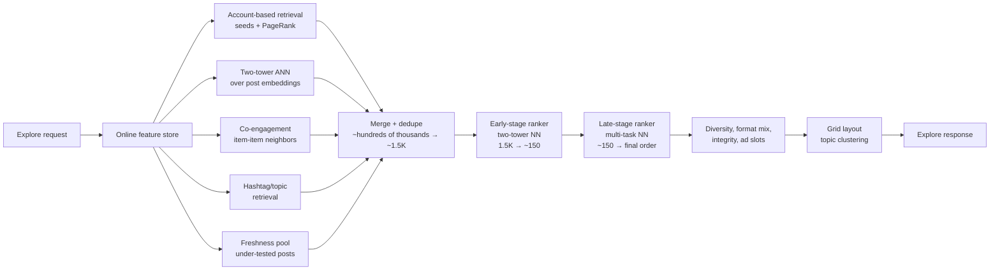

# Instagram Deep Dive — Explore

**Date:** 2026-04-29 | **Updated:** 2026-04-29
**Tags:** `system-design` `case-study` `instagram` `deep-dive` `recommendations` `explore`

## Table of Contents

- [Summary](#summary)
- [Overview — Explore Is a Grid, Not a Stream](#overview--explore-is-a-grid-not-a-stream)
- [The Two-Stage Funnel — Same Shape, Different Constraints](#the-two-stage-funnel--same-shape-different-constraints)
- [Account-Based Recsys — Recommend Accounts, Not Just Posts](#account-based-recsys--recommend-accounts-not-just-posts)
- [Seed Accounts and Personalized PageRank](#seed-accounts-and-personalized-pagerank)
- [Embedding-Based Retrieval — account2vec and post2vec](#embedding-based-retrieval--account2vec-and-post2vec)
- [User × Post Embedding Distance and the Two-Tower Model](#user--post-embedding-distance-and-the-two-tower-model)
- [Freshness Boost](#freshness-boost)
- [The Photos + Videos + Reels Mix](#the-photos--videos--reels-mix)
- [Account Suggestions — The "Suggested for You" Sidebar](#account-suggestions--the-suggested-for-you-sidebar)
- [Topic Clustering for the Grid](#topic-clustering-for-the-grid)
- [Cold Start — Heuristics for First-Time Users](#cold-start--heuristics-for-first-time-users)
- [Safety Filters — Integrity Inside the Funnel](#safety-filters--integrity-inside-the-funnel)
- [Comparison to TikTok FYP](#comparison-to-tiktok-fyp)
- [Anti-Patterns](#anti-patterns)
- [Related](#related)
- [References](#references)

## Summary

Explore is the most visited non-feed surface on Instagram and the highest-leverage ML system in the product. Unlike the home feed, which is ordered by the follow graph and a freshness-tilted ranker, Explore must surface posts and accounts the user has *no graph signal toward* — a discovery problem closer to TikTok's For-You Page than to Facebook's News Feed. But the surface itself is different: a **grid of mixed-format media** (photos, videos, Reels, carousels), with **account-level recommendations** living alongside post-level ones, and a layout that has to keep multiple topic strands legible at the same time.

The architecture is a multi-stage funnel — retrieval, early-stage ranker, late-stage ranker, final rules — driven by **account-based** recommendation foundations. The earliest published Explore design (Meta AI, 2019) hinges on Word2Vec-style embeddings of *accounts* (account2vec / ig2vec), seed-account selection from a user's recent strong-engagement signals, personalized PageRank over an engagement graph, and only then expansion into posts. Newer iterations (Meta Engineering, 2023, 2025) layer two-tower neural retrieval, ANN over post embeddings, and a heavier multi-task ranker on top of that account-centric foundation. The defining product moments — the topical grid, the "Suggested for you" sidebar, the gentle pull toward following someone new — all fall out of that account-first model.

This document walks the funnel from request to grid render, highlights what is Instagram-specific (the grid, the photo + Reels mix, account recommendations as a first-class output), and contrasts the design against TikTok's FYP, which solves a related but distinctly different problem.

This is a companion to the parent case study [`../design-instagram.md`](../design-instagram.md), expanded around the Explore funnel itself.

## Overview — Explore Is a Grid, Not a Stream

Three product properties shape every architectural decision:

1. **Grid layout, not vertical stream.** Explore renders as a 3-column grid of tiles with mixed sizes — single photos, multi-photo carousels, vertical videos, and Reels-shaped tiles. The user scans, not swipes-through. That changes how relevance is judged: a tile must be visually compelling at thumbnail scale before the user taps in. A post with a great cover frame can outperform a post with stronger engagement metrics but a duller thumbnail.
2. **Mixed media types in one surface.** Photos, multi-photo carousels, videos, and Reels coexist. The ranker has to balance them. A user who only ever taps Reels in Explore should still see *some* photo content (drift detection), and a photo-focused user should still see *some* Reels (format introduction). Pure score-maximization collapses one or the other.
3. **Accounts are first-class output, not a side dish.** A non-trivial fraction of Explore real estate goes to account recommendations: the "Suggested for you" sidebar, the discover-people module on the search-feed entry, and the account-cards interleaved into the grid for some treatments. Posts are how users decide *whether to engage*; accounts are how Instagram grows the follow graph.

The product asks the system to do four things at once: surface posts the user will engage with, surface accounts the user will follow, balance media formats, and keep the grid visually coherent. The two-stage funnel solves the engagement prediction problem; account-based retrieval solves the follow-graph growth problem; topic clustering and format quotas solve the layout problem; integrity filters solve the safety problem. They run as overlapping stages on top of the same retrieval substrate.

## The Two-Stage Funnel — Same Shape, Different Constraints



The shape is the same as TikTok's FYP — cheap retrieval, heavier scoring, post-rank constraint layer — but the constraints are tightened in places that matter for a discovery product running over a *graph-rich* substrate:

- **Three rank stages, not two.** Meta has publicly documented a multi-stage architecture: cheap retrieval → early-stage two-tower ranker → late-stage multi-task ranker → final rules. The early-stage ranker is itself a small neural net that narrows ~1.5K candidates to ~150 before the heavy late-stage ranker sees them. This extra stage is an artifact of Instagram's corpus diversity (posts span many media types and many topical clusters) — sub-ranking before the heavy model is cheaper than scaling the heavy model up.
- **Retrieval seeded from the follow-adjacent graph.** Unlike TikTok, Instagram has a strong graph signal — who you follow, who follows them, whose posts you engaged with last week. The retrieval stage uses that graph directly via personalized PageRank from "seed accounts" (next section) before falling back to graph-free embedding retrieval.
- **Latency budget similar but slightly looser.** Explore is browse-mode, not the swipe-through hot path; targets are still tight (low hundreds of milliseconds end-to-end) but the system has more room to run additional ranker stages than the FYP swipe-loop allows.
- **Mixed-format ranking.** A single ranker scores posts of any type; format-mix constraints are enforced post-rank as quotas.

The funnel is also where **operational caching** happens. Each stage has a different temporal profile — item embeddings refresh nightly, the ANN index refreshes every few hours for the freshness pool, ranker weights refresh on a slower cadence than TikTok-class continuous training, and per-user features refresh in near real time. That heterogeneity is hidden behind the feature store at request time.

Stage-by-stage cardinalities — the actual numbers Meta has published in the 2023 scaling post — give a concrete sense of the funnel's geometry:

- Eligible corpus per request: hundreds of millions of posts globally, narrowed to a per-user *eligible* corpus by integrity filters, locale, and freshness windows.
- After retrieval merge: ~1,500 candidates.
- After early-stage two-tower NN: ~150 candidates.
- After late-stage multi-task NN: tens of items in final-rank order, of which ~25 ship to the client per page (the rest preload the next page).

The early-stage ranker exists precisely because the late-stage ranker cannot fit a 1,500-item batch in budget — the late-stage model is heavier and richer-featured, and 150 is roughly the sweet spot where its forward pass per request stays bounded. This three-stage shape (retrieval → early ranker → late ranker → rules) is the architectural artifact of Meta's "thousand models" engineering reality: many small models composed in sequence beat one giant model both on latency and on engineering velocity.

## Account-Based Recsys — Recommend Accounts, Not Just Posts

The defining architectural decision in Instagram's Explore, traceable back to the 2019 Meta AI blog, is that the recommender is **account-first**. The system models *accounts* as the primary entities, embeds them, retrieves them, and only then expands into the posts they have authored.

Why account-first instead of post-first:

- **Posts are ephemeral; accounts persist.** A creator's account is a stable identity over years. A post is one of thousands of artifacts an account produces. Modeling accounts gives the system a long-lived signal that survives any individual post going viral or flopping.
- **The follow graph is the highest-fidelity engagement signal.** A follow is the strongest expressed preference Instagram has — strictly stronger than a like, vastly stronger than a view. Building the recsys around accounts makes the follow signal a first-class input, not a sparse auxiliary label.
- **Account-level features are denser than post-level.** A creator with 1000 posts has thousands of historical engagement events; a brand-new post has zero. Aggregating to the account level makes cold-start for new posts trivial: inherit the account's prior.
- **Cross-format generalization.** A creator who posts photos this week and Reels next week is the same entity. An account-level model carries signal across format boundaries; a post-level model has to relearn it.

The account-based stack has four layers:

1. **Account embeddings (account2vec / ig2vec).** Per-account dense vectors learned from co-engagement sequences (next sections).
2. **Seed account selection.** From a user's recent strong-signal interactions, identify a small set of "trusted" accounts that anchor retrieval.
3. **Personalized PageRank.** Walk the engagement graph from the seeds to discover related accounts.
4. **Post expansion.** From the candidate accounts, pull recent / high-quality posts.

Posts are retrieved second, scored third, and laid out last. The account graph is the substrate.

## Seed Accounts and Personalized PageRank

A seed account is one Instagram trusts as a *strong* signal of the user's intent. Trust is operationalized: which accounts has the user *strongly* engaged with recently?

Strong engagement examples (in roughly increasing weight):

- Long dwell on the account's profile.
- Multiple recent post views from the same account.
- Likes and saves on multiple posts from the account.
- Comments or shares.
- Following the account (binary, but heavily weighted as a prior).

The seed selection step picks the top N accounts by a windowed strong-engagement score — typically a small number, on the order of 50–100. These are *not* the user's whole follow list; they are the subset that has earned recent attention. A long-dormant follow contributes little; a frequent-but-unfollowed creator might contribute a lot.

From those seeds, **personalized PageRank** walks the engagement graph:

```text
Engagement graph G:
  nodes = accounts
  edges = "user engaged with both A and B" (weighted by co-engagement count)

For seeds S:
  PageRank with restart probability alpha to S
  yields a stationary distribution over accounts
  with high mass on S and on accounts heavily linked to S
```

A few details that matter operationally:

- **Restart probability.** A typical alpha around 0.15–0.30. Higher alpha = more bias toward the seeds (less drift); lower alpha = more exploration through the graph (more discovery).
- **Approximate, not exact.** Computing PageRank on a billion-node graph at request time is impossible. In practice, an offline batch precomputes per-account "neighbor profiles" — top accounts most likely to be reached from each seed under a personalized PageRank — and the online system aggregates over the seed set's neighbor profiles. This trades some precision for an O(seeds * neighbors_per_seed) lookup.
- **Pixie-style random walks.** Pinterest engineering popularized a similar pattern (Pixie) — biased random walks from query pins to discover related pins in real time, leaning on weighted edges and per-walk re-randomization. The mathematical core is the same; the engineering trade-offs differ. Pinterest emphasizes online walks with no precomputation; Instagram leans more on precomputed neighbor profiles for predictable latency at large fanout.
- **Bipartite variant.** The engagement graph can be modeled bipartite (users ↔ accounts) and walks alternate sides. This recovers collaborative-filtering signal — "users who follow A also follow B" — without an explicit factorization step.

The output is a ranked list of candidate accounts. Posts are then pulled from those accounts (recent posts, high-engagement posts, or both, depending on retrieval policy) to seed the candidate pool that feeds the rankers.

## Embedding-Based Retrieval — account2vec and post2vec

The graph walk handles accounts with rich engagement history. For broader coverage — including accounts the seed set could never reach — the system layers in **embedding-based retrieval**.

**account2vec / ig2vec** is Instagram's name for Word2Vec-style account embeddings. The training intuition mirrors classic skip-gram:

```text
Treat a user's session sequence of account interactions as a "sentence":
  [ accountA, accountB, accountC, accountD, ... ]

Train embeddings such that accounts appearing in the same session window
have similar vectors (positive pairs); randomly sampled accounts have
dissimilar vectors (negative pairs).
```

The result is a dense vector per account where geometric similarity reflects co-engagement similarity. Accounts that posters of cooking content engage with end up clustered; accounts that streetwear fans engage with end up clustered; an account that bridges both clusters lands in between.

**post2vec / media embeddings** apply the same idea at the post level — sessions of post interactions yield post embeddings — but post-level signal is sparser per item, so the more reliable approach is to derive a post embedding from a combination of:

- The author account's embedding (carries cross-account signal).
- A multimodal content encoder over the image / video / caption (CLIP-style).
- Engagement features (windowed completion rate, like rate, save rate, share rate).

A late fusion concatenates these and projects to the final retrieval dimension. The pure-content branch handles cold-start for brand-new posts; the account branch handles posts whose author already has a strong embedding; the engagement branch sharpens the signal once the post starts collecting interactions.

The embedding index is **ANN-served** (HNSW or FAISS variants — see [`../tiktok/for-you-page.md`](../tiktok/for-you-page.md) for the deeper ANN treatment). Retrieval is a top-K nearest-neighbor query against either the account index, the post index, or both. Different generators within the candidate-generation stage use different indexes; their results are merged.

A subtle but important property: the embedding spaces are deliberately *not unified* across all use cases. The space optimized for "find similar accounts" weighs different signals from the space optimized for "find similar posts," and forcing them into one shared space costs both. Two-tower models with separate towers per task is the typical compromise.

Practical training notes that the public Meta posts hint at:

- **Negative sampling is the hard problem.** Naive uniform negative sampling makes the model learn "rare account" detection rather than "relevant account" detection. Production systems use frequency-corrected sampling (Yi et al., 2019) and mix in *hard negatives* — accounts that are popular and superficially related to the user's interests but are not actually engaged with. Hard negatives are what teach the model fine-grained discrimination.
- **Sequence windows have to be tuned.** Too long a window mixes unrelated session intent (morning recipe browsing with evening fitness browsing); too short a window starves the model of co-occurrence signal. Per-user session segmentation — splitting interaction sequences at session boundaries — is a cheap and consistent improvement.
- **Refresh cadence matters more than model architecture.** A simple skip-gram refreshed daily often beats a sophisticated transformer refreshed weekly. Engagement patterns drift faster than architectural improvements compound; freshness wins.
- **Cold accounts need warm proxies.** A brand-new account has no co-engagement history. The system seeds its embedding from the bio text, profile picture, first few posts, and any imported social graph (e.g. Facebook account link) — treating the account as a cold-start case rather than refusing to embed it.

## User × Post Embedding Distance and the Two-Tower Model

The two-tower retrieval architecture is what binds the user side to the post side at scale.

```text
   User features                Post / account features
 (recent interactions,         (account embedding,
  follows, geo, lang,           content embedding,
  device, session ctx)          author features,
                                hashtags, format)
        │                                │
        ▼                                ▼
   ┌──────────┐                   ┌──────────┐
   │  User    │                   │  Item    │
   │  Tower   │                   │  Tower   │
   │  (DNN)   │                   │  (DNN)   │
   └────┬─────┘                   └────┬─────┘
        │                                │
    u_emb                            i_emb
        │                                │
        └─────────── dot ─────────────────┘
                       │
                     score
```

Training uses implicit-feedback labels — long dwell, like, save, share, follow as positives; sampled non-engagements as negatives — with sampling-bias correction (Yi et al., 2019) to avoid the popularity-driven collapse of naive negative sampling.

At serving time:

- The **item tower runs offline** over the post corpus, producing one embedding per post. The output ships into an ANN index, refreshed on a schedule (typically nightly, with incremental upserts for the freshness pool).
- The **user tower runs online** at request time, conditioned on the user's current features (recent actions, current session context, recent topics). Output is the query vector.
- Retrieval is top-K dot product against the ANN index — no per-post forward pass needed.

This decoupling is the same property that makes TikTok's two-tower work; the Instagram twist is that the *post* side often consumes the *account* embedding as a feature. So account2vec is upstream of the post tower, not a parallel branch.

User × post distance — the dot product score — is what the early-stage ranker effectively computes at scale via ANN. The downstream rankers re-score the retrieved set with richer features (cross-features, sequence features, format-specific signals) that don't fit the dot-product structure.

A crucial implementation detail: the user tower's freshness matters more than the item tower's. If a user just engaged heavily with cooking content, the user embedding should reflect that within the same session, ideally within seconds. The standard pattern is to recompute the user embedding on the request hot path from a recent-action sequence retrieved from a session feature store, while the item embeddings stay precomputed. The wall-clock cost is a small DNN forward pass, well inside the latency budget.

## Freshness Boost

A post that was uploaded an hour ago has fundamentally less engagement signal than a post that was uploaded last week — and yet the recent post is often more interesting to the user, both because of trend-relevance and because Explore has implicit "show me what's happening now" semantics for some user segments.

The freshness boost is a deliberate ranker-level adjustment to lift recent items that would otherwise lose to high-engagement older content:

```python
score_final = ranker_score + freshness_boost(post.age)
```

`freshness_boost` is a monotonically decreasing function of age — typically a step function or a smoothed exponential. Posts under an hour old get a large positive bump; posts under a day get a smaller one; posts over a week old get nothing.

The boost coexists with a **freshness pool** in the retrieval stage — under-tested posts (those with engagement counts below a threshold) get reserved retrieval slots so they reach the ranker at all. Without the pool, the ranker can't lift what retrieval never surfaces.

Why both layers are needed:

- **Retrieval-side freshness pool** ensures the ranker *sees* recent posts. Otherwise embedding-based retrieval would favor posts with mature signal and starve cold posts.
- **Ranker-side freshness boost** ensures the ranker *prefers* recent posts when they're competitive. Otherwise even surfaced cold posts would lose every comparison to mature posts.

The balance between exploration (give cold posts a chance) and exploitation (rank by predicted engagement) is the multi-armed-bandit framing — Instagram's freshness machinery is a structured exploration budget.

A subtle pitfall: too aggressive a freshness boost flips Explore into a recency-sorted feed, killing the discovery property. Too conservative a boost makes the surface feel stale. The boost coefficient is an A/B-tested policy lever, not a fixed constant.

Operationally, the freshness layer also interacts with the ANN index lifecycle. New posts must enter the index within minutes of upload to be eligible for the freshness pool, but a full rebuild takes hours. Standard pattern: the main HNSW or IVF index covers the warm corpus and rebuilds nightly; a *delta index* covers the last few hours of new posts, supports cheap incremental insert, and is queried in parallel with the main index. Results from both are merged. Periodically the delta is folded into the main index and a fresh delta starts. The same pattern handles takedowns — tombstones in the main index plus a "denylist" filter applied at query time.

Two more patterns worth noting:

- **Per-author freshness caps.** Without a cap, a creator who uploads 30 posts in one day floods the freshness pool. A per-author rate limit on freshness-pool eligibility forces the system to spread exposure budget across authors.
- **Adaptive boost strength by topic velocity.** Trending topics decay faster than evergreen topics. The boost coefficient can be tuned per cluster — a viral trend gets a steeper time-decay so its reach is concentrated in the first few hours; an evergreen cooking topic gets a flatter decay so good content stays surfaceable for longer.

## The Photos + Videos + Reels Mix

Explore is a multi-format surface. Photos (single-image and carousel), regular videos, and Reels each have:

- Different engagement distributions (Reels skew toward time-spent and replays; photos skew toward saves and likes).
- Different upload rates (Reels production grew sharply post-launch; photo production is steadier).
- Different latency budgets at the client (videos require player initialization; photos don't).
- Different ad inventory characteristics.

The ranker scores a unified candidate pool, but the post-rank stage enforces a **format mix policy**:

- **Per-grid quotas.** A grid of 18 tiles might have a target like 8–12 photos, 4–6 Reels, 1–3 videos, with bounds tunable by user segment (Reels-heavy users get more Reels; photo-heavy users get fewer).
- **Format introduction.** Users who never tap Reels still see a small fraction (a "format introduction quota") to surface the format to them; symmetric for photo-heavy users.
- **Adjacency rules.** Avoid two consecutive Reels-shaped tiles in the same grid row; vary thumbnail sizes for visual rhythm.
- **Carousel handling.** A multi-image carousel renders as one tile with a stack indicator; only the cover frame matters for grid attention. The ranker treats the carousel as one unit, but later may surface a different cover frame than the post's default if it scores better.

The format mix is also a **business lever**. Reels distribution priorities, ad-format mix, and creator-program targets all flow through this layer. Architecturally, this is the same constrained-optimization stage as TikTok's diversity reranking — different objective, same shape: take a scored list, output a slot-filled grid that satisfies hard constraints and maximizes a soft composite objective.

A technical detail worth flagging: the format mix interacts with the ranker's calibration. Per-format predicted probabilities have to be on a comparable scale — a calibration head per format normalizes them before the slot-filling layer compares scores across format boundaries.

## Account Suggestions — The "Suggested for You" Sidebar

Account recommendations are a parallel output of the recsys, surfaced in three places:

1. **Search / Explore entry feed sidebar.** "Suggested for you" account cards above or alongside the grid.
2. **Profile pages.** When a user views someone's profile, related accounts ("People you might know") appear inline.
3. **Onboarding and post-follow.** After following an account, the system suggests similar accounts immediately.

Each surface uses a slightly different retrieval mix, but the foundational signal is the same:

- **account2vec nearest neighbors.** Given a user's seed accounts, find unfollowed accounts with the highest aggregated similarity to those seeds.
- **Co-follow signal.** "Users who follow account A also follow account B" — classical collaborative filtering at the account level. Cheap, high-precision for warm users, useless for new users.
- **Engagement graph PageRank.** Same machinery as post retrieval, but the output is the account list rather than a post pool.
- **Friend-of-friend signal.** A user followed by people you follow is a strong candidate (uses the existing follow graph rather than a learned embedding).
- **Profile-side features.** Bio, username, profile picture embeddings via CLIP-style encoders surface accounts whose self-presentation matches the user's interests, even when engagement signal is sparse.

The ranker for account suggestions is structurally similar to the post ranker but trained against follow probability as the primary label, with secondary signals like profile dwell, post-tap-from-suggestion, and "tap-not-follow" (a soft positive). A few accounts get heavy weight for what's not in the model: known-bad accounts (bot suspicion, low integrity score) are filtered out *before* the ranker, not after.

The product moment to design for: the user takes a brand-new follow action. Within seconds, the next time Explore loads, that account's neighbors should appear in the candidate pool. This is a near-real-time graph-update propagation requirement — the engagement graph (or at least its hot subset) lives in a low-latency store, and the seed-account computation pulls fresh edges, not nightly snapshots.

## Topic Clustering for the Grid

Explore's grid is not a flat ranked list rendered in score order. The visual experience is **topical strands**:

- A few cooking tiles cluster together visually.
- A streetwear strand runs nearby.
- An animal-content strand sits underneath.
- Reels-shaped tiles break up the rhythm without dominating.

This is a deliberate layout choice, and it is implemented as a **grid clustering layer** on top of the ranked output:

```text
Inputs:
  - Ranked list of candidates with scores.
  - Per-candidate topic embedding (from post / account embedding).
  - Format type per candidate.
  - Grid geometry (rows, columns, tile sizes).

Outputs:
  - 2D grid placement (row, column, tile size) per item.

Objective:
  - Maximize total relevance.
  - Respect format-mix quotas.
  - Cluster topically similar items into local 2x2 / 2x3 strands.
  - Avoid same-author adjacency.
  - Avoid visually monotonous adjacent tiles.
```

The implementation is closer to a beam search or an ILP solver than a sort. At each grid position, candidates are scored against the combined objective — relevance, topic-strand-fit, format-quota-fit, adjacency penalty — and the best-fitting one is placed. Forward-looking heuristics (don't burn the highest-relevance cooking tile in row 1 if a better placement exists in row 2) are common.

Why cluster topically? Two reasons:

- **User cognitive load.** Random topical jumps make a grid feel chaotic. Strands are skimmable; the user can focus on one cluster, scroll, and pick up another.
- **Increased depth of engagement per topic.** A user who lands on a cooking strand is primed to engage with the next cooking item; mixing in a streetwear tile breaks the flow.

The trade-off is **discovery breadth.** Pure clustering can over-narrow Explore into a few strong topics. The clustering layer enforces a minimum number of distinct topics per grid (typically a handful) and reserves slots for "broadening" tiles — items that pull from a different cluster to nudge the user toward new topics.

A practical implementation note: topic labels are *not* a fixed taxonomy. They are derived from clusters in the embedding space, periodically re-clustered as the corpus and engagement patterns evolve. Hard-coded taxonomy labels ("food", "fashion", "sports") freeze the system into a worldview that ages badly; embedding-based clusters drift with the actual content.

Another implementation note that bites teams who haven't lived through it: the grid layout step is **stateful per user across pagination**. Page 1 places certain topics; page 2 should not over-repeat them but must maintain enough continuity that the user feels they're still in the same surface. The standard pattern is a per-session pagination cursor that carries forward the topic distribution served so far; subsequent pages re-balance against that running profile. Without a cursor, page 2 either looks like a different product (full reset) or duplicates page 1's flavor (no diversity across pages). Both feel wrong.

## Cold Start — Heuristics for First-Time Users

Instagram's recsys leans on the follow graph; a first-time user has no follows. This is the cold-start problem, and Instagram has a documented stack of heuristics to bootstrap it:

1. **Phone-book and contact graph (with consent).** If the user grants contacts permission, the system identifies which of the user's contacts are on Instagram and uses those as proto-seed accounts. This is the highest-fidelity cold-start signal available — the user's real-world social graph is a much stronger prior than any content-based starting bias.
2. **Demographic and locale priors.** Geo, language, device class, account creation source bias the initial pool. A new account in São Paulo on a low-end Android sees a different starting Explore than one in Tokyo on iPhone.
3. **Onboarding interest selection.** Optional but powerful — the user picks a few topic categories ("Travel", "Food", "Sports", etc.) and the system seeds an initial interest embedding from those category centroids.
4. **Trending pools.** Region- and language-segmented trending posts and accounts populate the grid before any personalized signal exists. This is the static fallback.
5. **Aggressive exploration in session 1.** The first Explore impressions are deliberately diverse. The system is gathering signal as fast as possible — every dwell, every tap, every save updates the user embedding via the user-tower forward pass on the next request.
6. **Watch-the-tap-pattern fast learning.** Instagram tracks which categories the user taps into and which they skip past, and within minutes the system can lean Explore toward the categories with positive signal. The model that powers this is the same online-feature pipeline that powers warm-user personalization; the only difference is the priors the user starts with.

The defining cold-start property: how fast does the system pivot from generic to personalized? For Instagram, the published target (and the observable behavior) is that within a single onboarding session — a handful of taps and dwells — Explore shifts noticeably. That is fast enough to feel responsive, slow enough that the user isn't whiplashed by the first random tap.

A subtle pitfall to design against: the cold-start system can over-fit to a user's first few taps. A user who happens to land on a single fitness post in their first session can get a fitness-heavy Explore that doesn't reflect their broader interests. Counter-measures include exploration noise (a deliberate fraction of off-topic content), confidence-weighted updates (early signal counts less than later signal), and decay on transient interests.

## Safety Filters — Integrity Inside the Funnel

Explore is the surface where the *recommendation* is the company's affirmative endorsement of the content. Unlike the home feed, where the user explicitly chose to follow the source, Explore content was picked by the algorithm. That makes integrity filtering non-optional and forensically loud when it fails.

The integrity layer runs at multiple points in the funnel:

- **Pre-retrieval filters.** Posts that have failed any of the asynchronous integrity classifiers (CSAM hash, NSFW classifier, hate speech, misinformation, banned hashtag) are removed from the candidate-eligible corpus *before* retrieval. The candidate-gen stage operates on a filtered corpus, so retrieval can't even pick up disallowed posts.
- **Post-retrieval / pre-rank filters.** Some integrity signals are velocity-sensitive — a post might be acceptable in isolation but in a "borderline" state that warrants deferral. These are filtered between retrieval and ranking. This step also handles geo-restrictions: a post allowed in one region may be hidden in another.
- **Per-user filters.** Users have explicit muting (accounts they've muted, hashtags they've hidden) and inferred preferences (a user who repeatedly hits "not interested" on certain content). These are applied per-request, not at the corpus level.
- **"Recommendable" eligibility flag.** Even content that doesn't violate policy may be flagged as not-recommendable — sensitive but not banned topics, low-quality content, suspected coordinated inauthentic behavior. Such content stays visible to the author's followers (home feed eligible) but is excluded from Explore (recommendation eligible).
- **Author-side integrity.** Accounts on probation (recent policy violations, suspicious behavior) have their content downweighted or excluded entirely from Explore even if individual posts pass classifiers.

A few architectural patterns make this work at scale:

- **Eligibility flags as part of the ANN index.** Each indexed post has a small bitmap of eligibility flags; ANN retrieval can filter by flag at search time. This is much cheaper than retrieving and then filtering.
- **Asynchronous reclassification.** When a classifier model updates, the system reruns it over the recent corpus and updates eligibility flags. A post that was eligible yesterday can become ineligible today; the candidate pool sees that change within minutes.
- **Author-tier downweighting.** Multiplicative penalties on author integrity score, not hard cuts, allow gradient policies — borderline accounts get less reach without being silenced outright.
- **Hidden but not deleted.** Filtered content is still searchable on the author's profile and shareable directly; it just doesn't appear in algorithmic recommendations. The user-perceived behavior is "fewer surface area for risky content," not "censorship."

The product principle behind all of this: **recommendation is a privilege, not a right.** Users don't have a guaranteed right to be recommended; they have a right to publish (within policy) and to be visible to people who explicitly follow them. Explore eligibility is a separate, higher bar.

## Comparison to TikTok FYP

The two systems share architecture and diverge sharply in product, signal economy, and cold-start posture.

| Dimension | Instagram Explore | TikTok FYP |
|-----------|-------------------|------------|
| Surface shape | 3-column grid, browse-mode | Vertical full-screen swipe-through |
| Primary engagement signal | Save, like, follow, dwell | Completion rate, replays, skip latency |
| Graph signal strength | Strong (follow graph is dense, engaged) | Weak (follow graph exists, low-fidelity) |
| Content corpus | Photos + carousels + videos + Reels | Almost exclusively short videos |
| Retrieval foundation | Account-based (account2vec, PageRank from seeds) | Post-based (two-tower over post embeddings) |
| Account suggestions | First-class output (sidebar, inline) | Secondary (occasional account interleaves) |
| Cold start lever | Contacts graph + interest taxonomy + region priors | Demographic priors + aggressive exploration in session 1 |
| Ranker stages | Two-tower retrieval → early-stage NN → late-stage multi-task NN → rules | Two-tower retrieval → multi-task DNN → rules |
| Training cadence | Frequent batch + near-real-time features; less continuous than Monolith-class | Continuous online training (Monolith / collisionless embeddings) |
| Grid layout | Topic clustering, format mix quotas | Linear; only diversity reranking matters |
| Latency budget | Low hundreds of ms (browse, not swipe-loop) | ~100 ms (interactive swipe-loop) |
| Format mix concern | Critical (photos vs Reels balance) | Trivial (one format) |
| Defining product moment | Explore grid feels topically curated | First few swipes pivot the FYP toward real interests |

The deeper difference is *what each system is optimizing*:

- TikTok's FYP optimizes for **session length and swipe-loop continuity.** Every decision feeds back into "will this user keep swiping right now." The funnel is tuned for sub-second responsiveness because the user is one bored thumb away from leaving.
- Instagram's Explore optimizes for **discovery + follow-graph growth + engagement diversity.** The user is in browse mode, scanning. The system can take longer to render, can spend cycles on grid layout, and can afford to recommend an account-card that earns no immediate engagement but grows the long-term graph.

A consequence: Instagram can be more conservative in its exploration / feedback amplification than TikTok. The follow graph already provides personalization scaffolding; Explore is the layer on top of that. TikTok has nothing else, so its FYP must do all the personalization itself, with all the feedback-loop intensity that implies.

For the deeper retrieval, ANN, and ranker mechanics that Instagram and TikTok share, see [`../tiktok/for-you-page.md`](../tiktok/for-you-page.md). This document focuses on the Instagram-specific layers — account-based recsys, grid layout, format mix, and account suggestions.

## Anti-Patterns

- **Treating Explore as a sorted-by-score list.** The grid is a spatial layout problem. A flat sort destroys the topical-strand experience and feels chaotic. Always run a clustering / slot-filling layer on top of the ranker output.
- **Rendering all formats interleaved randomly.** Without quotas and adjacency rules, photos and Reels cannibalize each other and the grid becomes visually monotonous or whiplash-inducing.
- **Skipping account-based retrieval and going post-only.** Loses the strongest signal Instagram has (the follow graph) and weakens cold-start (account-level priors are denser than post-level for new posts).
- **Hard-coded topic taxonomy.** Freezes Explore into a fixed worldview. Use embedding-derived clusters that drift with the corpus.
- **One global trending pool with no regional segmentation.** Pushes locale-irrelevant content. Trending must be region- and language-aware as a baseline.
- **Synchronous integrity classification on the request hot path.** Adds tens to hundreds of milliseconds and ties Explore availability to the integrity stack. Run classifiers async on upload and again post-publication; filter the corpus at retrieval based on cached eligibility flags.
- **Same ranker for posts and account suggestions.** They predict different labels (engagement vs follow) over different feature sets. Sharing a model causes both heads to underperform versus dedicated specialist models.
- **Ignoring "tap-not-follow" as a signal.** A user who taps an account suggestion, scrolls the profile, and leaves without following is sending a soft positive (interest) but a soft negative (not enough to follow). Treating this as pure non-engagement loses signal.
- **Caching the personalized Explore grid at the edge.** The grid is per-user, per-session. Cache the underlying assets (thumbnails, manifests) and the per-region trending fragments, never the response.
- **One unified embedding space for accounts, posts, and topics.** Different tasks have different objectives; a forced shared space underperforms task-specific spaces. Use multiple two-tower models with task-specific towers.
- **Overweighting recent strong-signal taps in the user embedding.** Single-action overfitting causes Explore to whiplash on every tap. Use windowed aggregation, decay, and confidence weighting on session-level updates.
- **Treating the freshness boost as a ranker feature instead of a post-rank adjustment.** Mixing exploration into the predicted-engagement signal pollutes the ranker's calibration. Keep exploration as an explicit additive policy.
- **Letting the freshness pool select a noisy audience.** If new-post exposure goes to users who scroll frantically without engaging, early signal is unreliable and the bandit-promotion logic mis-calibrates. Pre-filter the freshness pool to high-signal users (stable engagement patterns) — same lesson as TikTok.
- **No fallback when the ranker is unhealthy.** When the late-stage ranker fails, Explore must degrade gracefully — fall back to retrieval-only ordering with a static popularity sort, not a blank grid.
- **Letting account suggestions bypass integrity filters.** Suggesting a high-risk or recently-flagged account is worse than suggesting a low-relevance one; integrity filters must apply to account-rec output as strictly as to post-rec output.
- **Coupling Explore ranking with home-feed ranking.** They have different objectives, different signal economies, different latency budgets, and different integrity bars. Sharing a single ranker forces compromises that hurt both.

## Related

- [Design Instagram — parent case study](../design-instagram.md) — full HLD with feed, Stories, DMs, and CDN strategy.
- [Instagram Feed Generation](./feed-generation.md) — how the home feed is built and ranked; useful contrast against Explore.
- [TikTok For-You Page deep dive](../tiktok/for-you-page.md) — sibling deep dive on the closest equivalent surface; deeper ANN and continuous-training treatment.
- [HyperLogLog — cardinality at scale](../../../data-structures/hyperloglog.md) — companion sketch for high-cardinality user / account / post counters that feed into engagement features.
- [Design TikTok](../design-tiktok.md) — recommendations-first architecture contrast against Instagram's graph-first model.
- [Design Facebook News Feed](../design-facebook-news-feed.md) — fanout-on-write contrast; Explore is the opposite end of the spectrum.

## References

- Meta AI. *Powered by AI: Instagram's Explore recommender system.* 2019. <https://ai.meta.com/blog/powered-by-ai-instagrams-explore-recommender-system/>
- Meta Engineering. *Scaling the Instagram Explore recommendations system.* 2023. <https://engineering.fb.com/2023/08/09/ml-applications/scaling-instagram-explore-recommendations-system/>
- Meta Engineering. *Journey to 1000 models: Scaling Instagram's recommendation system.* 2025. <https://engineering.fb.com/2025/05/21/production-engineering/journey-to-1000-models-scaling-instagrams-recommendation-system/>
- Covington, P., Adams, J., Sargin, E. *Deep Neural Networks for YouTube Recommendations.* RecSys 2016. <https://research.google/pubs/deep-neural-networks-for-youtube-recommendations/>
- Yi, X. et al. *Sampling-Bias-Corrected Neural Modeling for Large Corpus Item Recommendations.* RecSys 2019. <https://research.google/pubs/sampling-bias-corrected-neural-modeling-for-large-corpus-item-recommendations/>
- Mikolov, T. et al. *Distributed Representations of Words and Phrases and their Compositionality (Word2Vec).* NeurIPS 2013. <https://arxiv.org/abs/1310.4546>
- Pinterest Engineering. *Pixie: A System for Recommending 3+ Billion Items to 200+ Million Users in Real-Time.* 2018. <https://medium.com/pinterest-engineering/an-update-on-pixie-pinterests-recommendation-system-6f273f737e1b>
- Eksombatchai, C. et al. *Pixie: A System for Recommending 3+ Billion Items to 200+ Million Users in Real-Time.* WWW 2018. <https://arxiv.org/abs/1711.07601>
- Liu, Z. et al. (ByteDance). *Monolith: Real Time Recommendation System With Collisionless Embedding Table.* arXiv 2209.07663, 2022. <https://arxiv.org/abs/2209.07663>
- Malkov, Y. A., Yashunin, D. A. *Efficient and robust approximate nearest neighbor search using Hierarchical Navigable Small World graphs.* arXiv 1603.09320, 2016. <https://arxiv.org/abs/1603.09320>
- Facebook AI Research. *FAISS — A library for efficient similarity search.* <https://github.com/facebookresearch/faiss>
- Google Cloud. *Implement two-tower retrieval for large-scale candidate generation.* <https://cloud.google.com/architecture/implement-two-tower-retrieval-large-scale-candidate-generation>
- Page, L. et al. *The PageRank Citation Ranking: Bringing Order to the Web.* Stanford InfoLab, 1999. <http://ilpubs.stanford.edu/422/>
- Haveliwala, T. *Topic-Sensitive PageRank.* WWW 2002. <http://www-cs-students.stanford.edu/~taherh/papers/topic-sensitive-pagerank.pdf>
