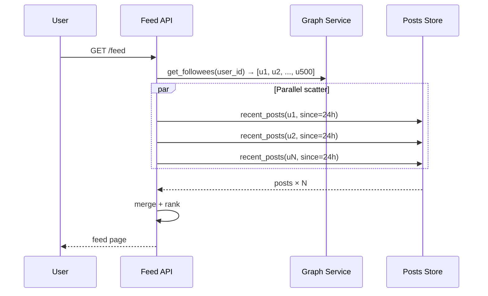
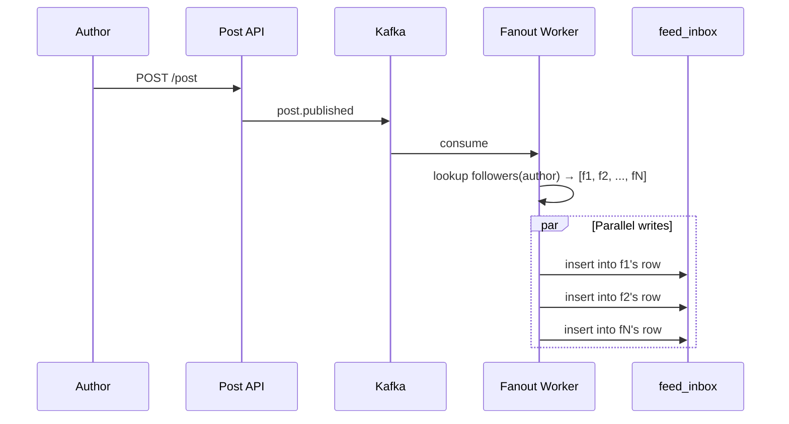
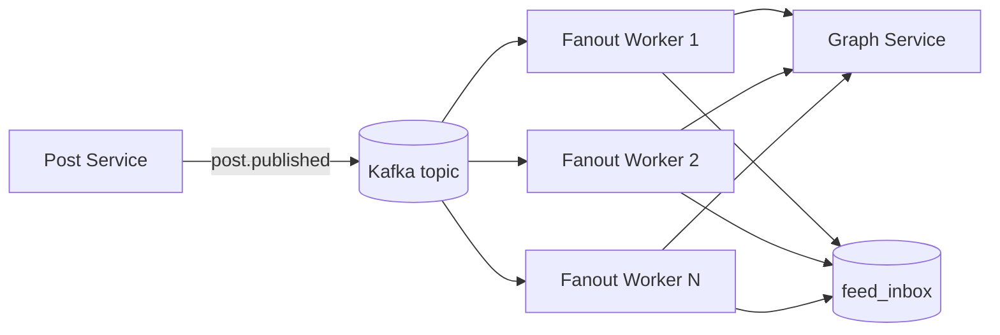
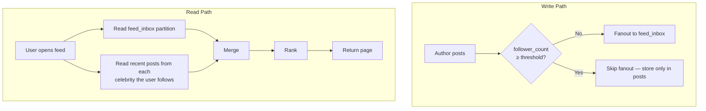
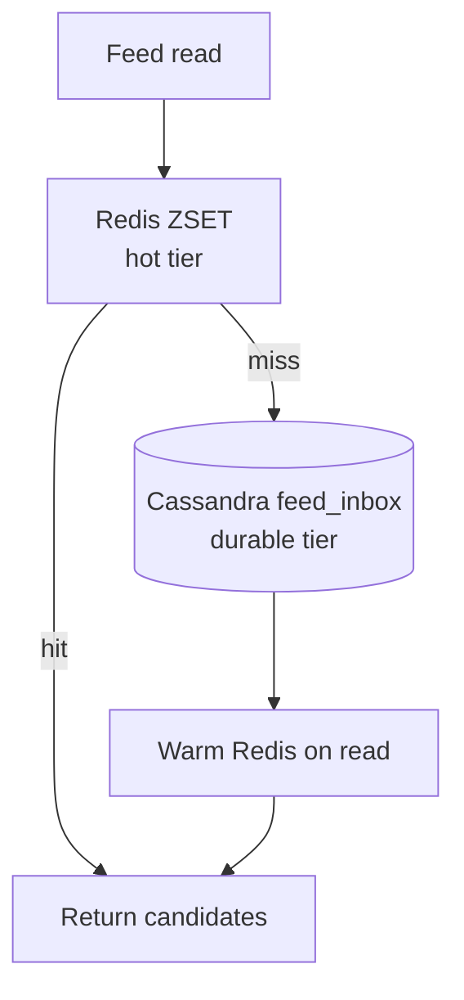
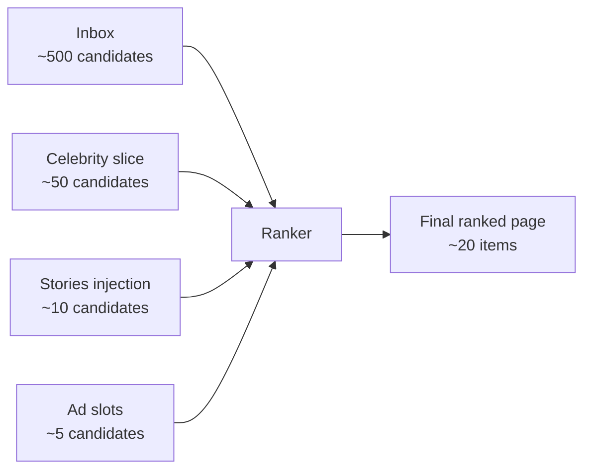
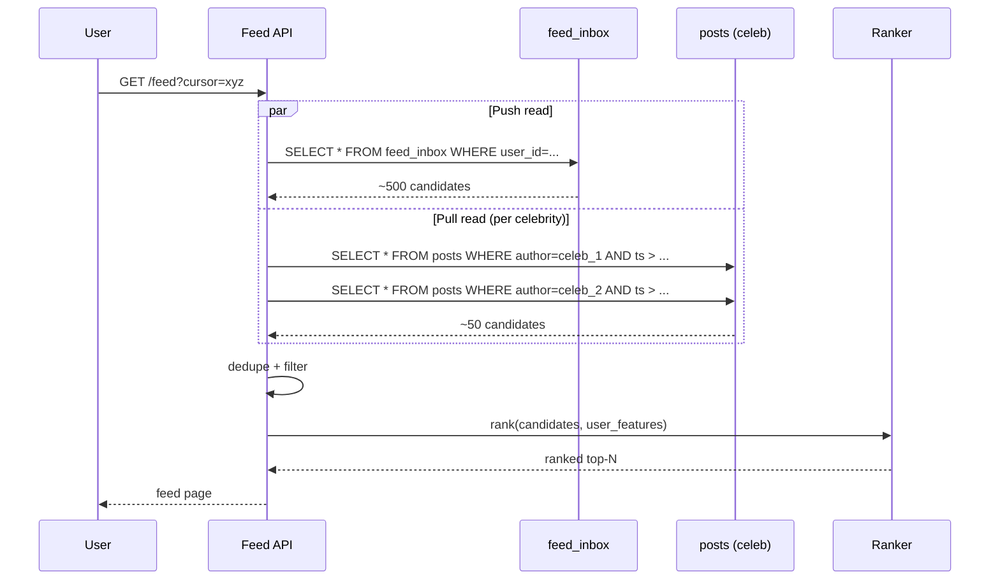

# Instagram Deep Dive — Feed Generation

**Date:** 2026-04-29 | **Updated:** 2026-04-29
**Tags:** `system-design` `case-study` `instagram` `deep-dive` `feed` `fanout`

## Table of Contents

- [Summary](#summary)
- [Overview](#overview)
- [Pull Approach — Fan-out on Read](#pull-approach--fan-out-on-read)
- [Push Approach — Fan-out on Write](#push-approach--fan-out-on-write)
- [Hybrid — The Production Reality](#hybrid--the-production-reality)
- [Celebrity Threshold Heuristic](#celebrity-threshold-heuristic)
- [Timeline Storage](#timeline-storage)
- [Ranking Layer — Generation vs Scoring](#ranking-layer--generation-vs-scoring)
- [Freshness vs Personalization](#freshness-vs-personalization)
- [Read-Time Merging](#read-time-merging)
- [Anti-Patterns](#anti-patterns)
- [Related](#related)
- [References](#references)

## Summary

Instagram's home feed is the canonical "fan-out at scale" problem. With 500 million daily active users each loading roughly 50 feed impressions per session, the system absorbs 25 billion feed reads per day against a write rate that, for most authors, is small — but for the long-tail of celebrity accounts (Cristiano Ronaldo, Selena Gomez, Leo Messi all north of 400 million followers), a single post is a billion-row write event if treated naively. The production answer is **hybrid fan-out**: push pre-materializes a per-follower inbox for normal authors so reads are O(1), pull computes the celebrity slice at read time so writes stay bounded, and a merge step at the API tier stitches the two streams together before ranking. The threshold (Instagram-style systems land around 100K followers, often with an "active in the last 7 days" filter) is not a constant — it is a tunable that trades write amplification for read latency, and gets revisited every time the cluster's write capacity or the ranking model's input shape changes. This document goes deeper than the parent: the storage shape of `feed_inbox`, why Redis sorted sets cap at a few thousand entries per user, why ranking is intentionally a separate stage from generation, and the failure modes of each approach.

## Overview

The home feed is fundamentally a **producer-consumer fan-out problem**. Posts are produced by authors. Feeds are consumed by followers. The hard question is *when* and *where* the work of "match this post to these followers" happens.

```mermaid
graph LR
    A[Author posts] --> B{Fan-out<br/>strategy}
    B -->|Push| C[Pre-write to<br/>each follower's inbox]
    B -->|Pull| D[Compute at<br/>follower's read time]
    B -->|Hybrid| E[Push for normal authors<br/>Pull for celebrities]
    C --> F[Read = O(1)]
    D --> F
    E --> F
```

Three levers determine the right answer:

1. **Read/write ratio.** Instagram is ~100:1 read-heavy. Every byte of write amplification buys you 100× the savings on the read side — *unless* the writes are themselves catastrophic.
2. **Distribution shape.** Follower counts are not normal. They are a long-tailed power-law: the median user has a few hundred followers; the top 0.001% have hundreds of millions. A strategy that works for the median breaks for the tail.
3. **Latency budget.** Feed P50 must stay under 200 ms, P99 under 600 ms. Anything that does N database round-trips at read time fails this budget the moment N grows.

The rest of this document walks through the three strategies, why each fails at scale on its own, and how the hybrid architecture composes them.

**Where the work happens.** The feed lifecycle has four distinct stages, each with its own service and SLA:

| Stage | What it does | Where the cost lives |
|-------|--------------|----------------------|
| Fanout | Materialize post ids into follower inboxes | Async writes to `feed_inbox` |
| Generation | Read inbox + celebrity slice for one user | Synchronous reads at request time |
| Scoring | Rank candidates with personalization signals | ML inference latency |
| Hydration | Join post ids with full payload + counts | Parallel lookups to `posts` and counter store |

Hybrid fanout is one decision inside this larger pipeline. The choice affects where the cost shows up — push moves cost to the fanout (write) stage; pull moves it to the generation (read) stage. Ranking and hydration costs are roughly fixed regardless of fanout strategy.

## Pull Approach — Fan-out on Read

In a pure-pull design, posts are stored once at the author. The follower's feed is computed at request time by fetching recent posts from each followee, merging them, and ranking the result.



**Why pull is appealing.**

- **Cheap writes.** A post is a single row in `posts`, plus a small index update. Cost is independent of follower count.
- **Always fresh.** No stale inbox; the read sees whatever the author wrote up to the moment of the query.
- **Trivial deletes.** Deleting a post removes one row; followers see the absence immediately on next refresh.
- **No materialization storage.** No per-follower inbox to provision, partition, or expire.

**Why pure pull fails at Instagram scale.**

- **Read fan-out explodes.** A user following 500 accounts triggers 500 partition reads per feed load. Multiply by 25 B feed loads/day and the database melts.
- **Tail latency is the read latency.** P99 of `recent_posts(u_i)` across 500 partitions, joined by max, is dominated by the slowest shard. One slow partition delays the whole feed.
- **Ranking starves.** The ranker wants ~1,500 candidate items in tens of milliseconds; pulling them across 500 partition queries takes hundreds of milliseconds before scoring even starts.
- **Cache hit rate collapses.** Each user has a unique followee set; per-user feeds are not deduplicable across users at the post level. You can cache per-author timelines, but you still merge N of them.

Pull works for low-engagement systems, B2B activity feeds, or admin dashboards where read rates are tiny. It does not work as the *only* strategy for a consumer social feed.

**Where pull *does* show up inside Instagram's stack.**

Even though pure pull is wrong for the home feed, fan-out-on-read is the right answer for several adjacent surfaces:

- **Profile pages.** "@user's recent posts" is a pull from a single author partition. There is no inbox to materialize; the read is one partition lookup, naturally cheap.
- **Hashtag and location feeds.** Posts indexed by `#tag` or geohash are pulled from a tag-keyed wide row. Materializing per-follower hashtag inboxes would be insane (every user × every tag they care about); the indexer pushes to the *tag* row instead, and readers pull from the tag.
- **Catch-up feeds for returning users.** A user who has been offline for two weeks may have an inbox that has TTL'd or that contains stale rank scores. The catch-up path is a pull from the followee set (capped) plus a fresh re-rank, then a backfill of the inbox for next time.
- **The celebrity slice itself.** Inside the hybrid, the celebrity component is literally pull. The whole point of the hybrid is "pull is fine when the followee set is small enough."

So pull is not banned — it is constrained to the cases where it is naturally bounded.

## Push Approach — Fan-out on Write

In a pure-push design, the moment an author posts, the system fans the post id into every follower's pre-materialized timeline. Reads then become a single partition lookup.



**Why push is appealing.**

- **Reads are O(1).** One partition read returns the user's already-materialized timeline.
- **Tail latency is bounded.** Read path touches one shard; you can hit it with a Bloom-filtered cache and serve P99 < 30 ms.
- **Ranking has a clean input.** The ranker scores a fixed-size window from one place.

**Why pure push fails for celebrities.**

- **Write amplification is the follower count.** A 200 M-follower account's single post is 200 million inbox writes. Even at 100 K writes/sec sustained, that is half an hour of work. Until it finishes, those followers' feeds lag.
- **Most writes are wasted.** ~70% of Instagram followers of any given celebrity are inactive over a 24-hour window. You wrote 140 M rows that nobody will read before they are evicted.
- **Storage cost is linear in follow edges.** A globally-fanned-out timeline for every user is roughly `users × avg_following × per_post_bytes`. At 2 B users × 200 followees × 100 bytes per inbox entry × 50 retained posts = 2 PB *just for the inbox*, before replication.
- **Hot partition on follower lookup.** Looking up "all followers of @cristiano" is itself a hot partition that has to be paginated and parallelized.
- **Failure recovery is painful.** A fanout job that fails halfway leaves followers inconsistent; replaying it is itself a 200M-write operation.

Push works perfectly for the median user. It is catastrophic for the 0.001% of authors at the tail. So you need a third option.

**The fanout pipeline shape (push side).**

In production, the push fanout is not a synchronous in-process loop — it is an asynchronous pipeline mediated by Kafka:



Workers consume `post.published` events, look up the author's follower set in chunks (paginated to avoid loading 100K+ ids into one worker's memory), and write to `feed_inbox` partitions in batches. Properties:

- **Idempotent writes** — replaying a Kafka event after a worker crash produces the same inbox state because writes are keyed by `(user_id, post_id)`.
- **Topic tiering** — separate topics for tail, mid, and borderline-celebrity authors, so a 90K-follower burst cannot starve normal-author fanout.
- **Backpressure via consumer lag** — observable lag on the topic indicates the inbox cluster is under-provisioned; alerts fire on growing lag, not on individual write failures.
- **Dead-letter queue** — fanout failures (a missing follower row, a transient inbox shard outage) drain to a DLQ for later replay.

This is the canonical [event-driven architecture](../../../communication/event-driven-architecture.md) shape: the Post Service owns the canonical write to `posts` and emits an event; the fanout pipeline is a downstream materialization that the Post Service does not block on.

## Hybrid — The Production Reality

The hybrid model splits authors into two classes by follower count. Below the threshold, push fan-out runs as normal: the post is materialized into each follower's `feed_inbox`. At or above the threshold, the post is *not* fanned out at all; it lives only in the author's own `posts` partition. At read time, the API service does two reads: the user's `feed_inbox` partition (push-delivered, normal authors) plus a small set of celebrity-author partitions (pulled live).



The key insight: **both paths are bounded.**

- The push half is bounded because no author with > threshold followers is ever fanned out.
- The pull half is bounded because the celebrity set a user follows is small (most users follow < 50 celebrities; the system caps the tracked set at, say, 200 to be safe).

So the read does ~1 + K partition reads where K is small and roughly constant per user. That is a latency budget you can hit.

**The cost of hybrid:**

- **More complex write path.** The fanout worker has to consult the author's metadata (follower count, celebrity flag) before deciding what to do.
- **More complex read path.** Two storage classes to query; merge logic at the API tier.
- **Threshold tuning is operational work.** Move it down (more push), and write amplification grows; move it up (more pull), and read latency grows.
- **Demotion / promotion races.** When an author's follower count crosses the threshold, the system must decide whether to backfill the inbox (expensive) or live with a small period where some posts are missing. Most production systems just *don't* backfill and accept the gap.

For the Twitter-side history of this exact pattern, see the [Twitter timeline blog post](https://blog.x.com/engineering/en_us/topics/infrastructure/2017/the-infrastructure-behind-twitter-scale) — the canonical industry write-up on hybrid fanout.

## Celebrity Threshold Heuristic

The threshold is the most important tunable in the system. It is not a constant.

**Naive version:** authors with ≥ 100,000 followers are celebrities.

**Better version:** authors with ≥ 100,000 followers *who are active in the last 7 days* are celebrities.

**Even better:** push to *active* followers only, regardless of author tier; pull for everyone else.

The active-follower filter is a multiplier for write efficiency. If a celebrity has 200 M followers but only 30 M opened the app in the last week, fanning out only to those 30 M cuts the write cost by 85%. The price is a little more inbox staleness for "returning" users — when an inactive follower comes back, the API tier has to detect the gap and backfill.

```text
write_cost(author) = followers_active_recent(author) × inbox_write_cost
                     if followers_total(author) < THRESHOLD or
                        followers_active_recent(author) < ACTIVE_THRESHOLD

celebrity(author)  = followers_total(author)  ≥ CELEBRITY_THRESHOLD or
                     followers_active_recent(author)  ≥ ACTIVE_CELEBRITY_THRESHOLD
```

**How to pick the threshold.**

- **Write-side budget.** What is the sustained writes/sec the inbox cluster can absorb at peak? Divide by an expected concurrent celebrity-post rate, and that is your soft cap on per-post fanout size.
- **Read-side budget.** How many extra partition reads can the read path do before P99 breaches 600 ms? That gives you the maximum number of "celebrities a user follows" the system can tolerate. Divide expected followee count by that to get the implied minimum threshold.
- **Cost of demotion errors.** If you set the threshold too low, more authors get pushed and write traffic grows. Too high, and more authors get pulled and read latency grows. There is no perfect answer; production systems re-tune quarterly.

**Tier-by-tier alternative.** Instead of a binary celebrity/non-celebrity split, some systems use three tiers:

| Tier | Followers | Strategy |
|------|-----------|----------|
| Tail | < 1,000 | Push to all followers |
| Mid | 1,000 – 100,000 | Push to active followers only |
| Celebrity | > 100,000 | Pull at read time |

The middle tier is where the operational sophistication lives. Push-to-active-only requires the system to track follower activity, which is itself a non-trivial signal store.

**Worked example.** Suppose:

- Author A has 50,000 total followers (mid tier).
- 12,000 of them have opened the app in the last 7 days.
- A posts 3 times per day.

| Strategy | Writes per post | Daily writes | Wasted writes |
|----------|-----------------|--------------|---------------|
| Push to all | 50,000 | 150,000 | 38,000 (76%) |
| Push to active | 12,000 | 36,000 | ~0 |
| Pull only | 0 | 0 | N/A |

Push-to-active saves 76% of write traffic for this author. Multiplied across millions of mid-tier authors, this is a budget-defining optimization. The price is one extra read at API tier when an inactive follower returns: the system detects the gap (last-seen post id < current head of author's posts) and either pulls a small backfill or schedules an async fanout for that single user.

**Active-follower tracking.** The signal lives in a dedicated key-value store (Memcache fronting a Cassandra table keyed by `user_id`), updated on every session start. The fanout worker does a bloom-filter membership check rather than a full follower set scan when "active only" mode is on.

## Timeline Storage

The materialized inbox needs to be a fast, capped, time-ordered structure keyed by user.

**Cassandra (or Rocksandra) wide row.**

The dominant production choice. Each user has one partition keyed by `user_id`, with clustering on `(rank_score DESC, post_id)`. New entries are appended; old ones expire via TTL.

```sql
CREATE TABLE feed_inbox (
  user_id       UUID,
  rank_score    DOUBLE,
  post_id       TIMEUUID,
  author_id     UUID,
  created_at    TIMESTAMP,
  PRIMARY KEY ((user_id), rank_score, post_id)
) WITH CLUSTERING ORDER BY (rank_score DESC, post_id DESC)
  AND default_time_to_live = 604800;  -- 7 days
```

Cap the partition at a few hundred to a few thousand entries per user. This bounds both storage and read cost. Older entries fall off via TTL or via an explicit truncation job.

**Redis sorted sets (per-user `ZSET`).**

For the hot, most-recent slice of each user's inbox — typically the last few hundred entries — Redis sorted sets are ideal. Score is the rank score (or a recency timestamp), value is the post id.

```text
ZADD feed:user:42 1714400000.5 post:abcd
ZADD feed:user:42 1714400123.1 post:efgh
ZRANGE feed:user:42 0 49 REV  # top-50 most recently ranked
```

- **Capped via `ZREMRANGEBYRANK`** after each insert: keep only the top N entries.
- **TTL on the key** so dormant users don't consume memory indefinitely.
- **Sharded across cluster** by user id; a user's whole inbox lives on one shard.

The rule of thumb is: Redis holds the *active* user inbox tier (the last ~200–500 entries for ~5–10% of users active in the last few hours), Cassandra holds the durable inbox tier for everyone else.

**Storage cost.** A fully-materialized timeline of 500 entries × 100 bytes per entry × 2 B users = 100 TB before replication. With RF=3 across two regions = 600 TB. That is large but not catastrophic — most of it is in low-cost storage tiers, and dormant users either get TTL'd or shrink to a much smaller per-user footprint.

**Why not just use Postgres?** Inbox writes are append-only, partitioned by user, and benefit from LSM-tree write amplification characteristics. Cassandra/Rocksandra (RocksDB-backed Cassandra storage engine, [Instagram Engineering on Rocksandra](https://engineering.fb.com/2018/03/05/data-infrastructure/open-sourcing-a-10x-reduction-in-apache-cassandra-tail-latency/)) absorbs this kind of workload more cheaply than B-tree storage at this scale.

**Two-tier read path.**



- Active users hit Redis on every refresh; latency is sub-millisecond for the inbox lookup.
- Returning users incur a Cassandra read followed by a Redis warm-up.
- Eviction is governed by Redis memory pressure (LRU on whole-key basis) plus per-key TTL.

**Inbox row shape — what's actually stored.** Each entry is intentionally tiny: post id, author id, rank score, created_at timestamp. The full post payload (caption, media references, engagement counts) lives in the `posts` table and is fetched at hydration time, in parallel with ranking. Keeping the inbox slim means a 500-entry partition is on the order of 50 KB — small enough to read in one round-trip, small enough to cache hot in memory across the cluster.

## Ranking Layer — Generation vs Scoring

A subtle but important architectural rule: **feed generation produces *candidates*, not the final ordered list**. Ranking is a separate stage with its own service, model, and SLA.



**Why decouple.**

- **Models change weekly.** The inbox is stable; the ranker is constantly retrained. Coupling them means every model swap requires a fanout migration.
- **Multiple ranking models per surface.** Home feed, Reels, Explore each have their own ranker. They share the same candidate generation primitives.
- **Online vs offline scoring.** Some signals (recent likes, current trending) are computed in real-time and applied at read time. Others (post-quality score, author authority) are precomputed offline and stored as features. The ranker fuses both.
- **A/B testing.** Different users get different models in flight. The candidate pool is the same; only the scoring differs.

**Ranking pipeline shape.**

1. **Retrieval** — pull ~1,500 candidates from the inbox + celebrity pull + injection sources.
2. **Lightweight filtering** — drop candidates the user has already seen, blocked authors, NSFW signals.
3. **First-pass ranker** — a fast model (often two-tower or gradient-boosted trees) scores all 1,500 in ~10 ms.
4. **Heavy ranker** — a deep neural network re-scores the top ~200 with richer features (per-post engagement velocity, user dwell-time signals) in ~30 ms.
5. **Diversity pass** — penalize repeat authors and topic clusters so the page isn't five posts from the same person.
6. **Slot composition** — inject ads, suggested accounts, and Stories carousels at deterministic slot positions.

The whole pipeline runs in tens to low hundreds of milliseconds. Generation is usually the cheap step; ranking is where the latency budget gets spent.

**Feature stores as the seam.** The ranker depends on three classes of features:

| Class | Latency | Source | Examples |
|-------|---------|--------|----------|
| Static | Updated daily | Offline batch | Author authority, post quality score, content embeddings |
| Near-real-time | Updated minutely | Stream pipeline | Post engagement velocity (last 5 min), trending tags |
| Real-time | Per-request | Online lookup | User's recently-seen post ids, dwell time on last session |

The feed service joins all three feature classes into the candidate set before passing to the ranker. The boundary between "candidate generation" (covered by this document) and "scoring" (a separate ML system) is exactly the join point: generation hands a candidate list with stable identifiers, scoring hydrates features and returns ordered scores.

**Why the seam matters operationally.** When the ranker has an incident (model serving down, feature store latency spike), generation can keep working — the feed degrades to chronological order from the inbox, but it doesn't go blank. This is one of the most important reliability properties of the split: a ranker outage is a degraded feed, not an outage.

## Freshness vs Personalization

There is a real, unavoidable trade-off between **freshness** (how recently the candidates were produced) and **personalization** (how richly they were scored).

- **More aggressive push** → newer posts in the inbox, but the ranker has to re-score them on every read because the per-post features (engagement velocity in the last hour) are not yet stable.
- **More aggressive pull** → posts are scored once per request with the latest signals, but the read path does more partition lookups and burns more latency budget.

**Common compromises:**

- **Inbox holds candidate ids only.** The post's full payload, engagement counts, and ranker features are looked up on read. The inbox row is small and stays cheap to maintain; the heavy work happens in the ranker's feature joins.
- **Tiered freshness in the same feed.** The first 5–10 items are very fresh (last few minutes, scored online); deeper-scrolled items are older (last 24 hours, scored offline). Users notice freshness most at the top of the page.
- **Out-of-band invalidation.** When an author deletes a post or it gets removed by moderation, push an invalidation to the inbox cache. Don't wait for TTL.
- **Eventual consistency by design.** A user posting from one device and refreshing on another might see the post appear with a one-to-two second delay. That is acceptable; chasing strong consistency on the home feed is wasted budget. (See the parent doc's anti-pattern list.)

**The "see your own post" exception.** Users *do* expect to see their own post immediately after publishing. The trick: the client optimistically inserts the post into its local feed view as soon as the upload returns, with a "publishing…" indicator. The server's actual fanout is asynchronous; the client doesn't wait for it. When the user refreshes, the post is either already in their inbox (fanout completed) or the API tier injects the user's own recent posts at the head of the feed regardless of inbox state. Both paths converge on the same answer.

**Re-rank-on-refresh vs cache-the-page.** Two approaches to handling a user who pulls to refresh:

| Approach | Behavior | Cost |
|----------|----------|------|
| Re-rank | Pull fresh inbox + celebrities, score from scratch | Higher CPU per refresh; freshest result |
| Cache the ranked page | Return cached page; only re-rank after N seconds | Cheaper; risks "I refreshed and nothing changed" UX |

Production systems usually pick a hybrid: re-rank if the cache is older than 30 seconds *or* if the user has scrolled past the top of the cached page. This bounds cost while keeping the refresh gesture meaningful.

## Read-Time Merging

The merge step at the API tier is where the hybrid stitches itself back together. The shape:

```text
function buildFeed(userId, cursor):
    push_candidates  = read_inbox(userId, cursor, limit=500)
    celebrity_followees = lookup_celebrities_followed(userId)
    pull_candidates  = parallel_for celeb in celebrity_followees:
                          read_recent_posts(celeb, since=cursor.t - 24h)

    # Drop celebrity posts that already arrived via the push path
    # (e.g., for borderline-tier authors, depending on threshold churn).
    deduped = merge_unique(push_candidates, pull_candidates, key=post_id)

    filtered = drop_seen(userId, deduped) ∪ drop_blocked(userId, deduped)
    ranked   = rank(userId, filtered)
    return paginate(ranked, cursor)
```

**Properties this gives you:**

- **Bounded reads.** O(1) for the push side, O(K) for the celebrity side where K is the user's celebrity-followee count, capped.
- **Parallel scatter.** The celebrity reads happen in parallel; tail latency is the slowest single read, not the sum.
- **Deterministic page boundaries.** Cursor encodes the ranker's scoring window, so paginating doesn't drift as new posts arrive.
- **Graceful degradation.** If the celebrity pull times out, fall back to inbox only — the user gets a slightly thinner feed instead of an error.

**Sequence:**



**Where the merge tier lives.** It is part of the Feed Service (a stateless API tier) — not the storage layer, not the ranker. Stateless means it scales horizontally with QPS and can be regionalized. The storage stays put; the merge logic is cheap to replicate.

## Anti-Patterns

Things that look reasonable on a whiteboard and fall over in production:

- **Pure push fanout for everyone.** First time a celebrity joins, the cluster melts. The hybrid threshold is not optional at consumer scale.
- **Pure pull for the home feed.** Looks elegant in a graduate database course. P99 latency is unbounded with followee count, ranker starves, cluster reads dominate cost. Acceptable only for low-volume admin/B2B feeds.
- **Materialized timeline as the source of truth.** The inbox is a *cache* of post ids. The post itself lives in `posts`. If you treat the inbox as authoritative, deleting a post becomes an O(followers) cleanup operation.
- **Ranking inside the inbox row.** Tempting to write a per-user ranked timeline. But ranker models change; inbox storage lifetimes are weeks. Re-scoring at read time gives you flexibility; pre-scoring locks you in.
- **Strong consistency on the home feed.** The user does not notice if their friend's post appears 800 ms late. They notice if the feed takes 800 ms longer to load because you went to a synchronous quorum write. Accept eventual consistency.
- **Threshold as a hardcoded constant.** It needs to be a runtime config — different per region, tunable on the fly when the cluster's write capacity changes.
- **Letting the celebrity pull run unboundedly.** If a user follows 5,000 celebrities (yes, fans do this), the pull half blows up. Cap the celebrity-followee set at a sensible number (200 is generous) and pick the most-recent or highest-engagement celebrities for the active session.
- **No fallback when the ranker is slow.** If ranking times out, return inbox candidates in chronological order rather than nothing. Users will scroll through a degraded feed; they will not tolerate a blank screen.
- **Forgetting to invalidate the inbox on author deletes / moderation removals.** TTL alone leaves up to 7 days of stale post ids floating in followers' feeds.
- **Push fanout without tiered topic priority.** Celebrity-adjacent fanout (a borderline-tier author with 90K followers) can starve normal-author fanout if they share a Kafka topic. Tier the topics by author class.
- **Re-fanning out when an author crosses the threshold.** Promoting an author from "non-celebrity" to "celebrity" is a metadata change, not a data migration. Existing inbox rows stay; new posts skip fanout. Don't try to backfill — it's a billion-row write event for marginal benefit.

## Related

- [Push vs Pull Architecture — Who Initiates the Conversation?](../../../communication/push-vs-pull-architecture.md) — the foundational decision tree this document specializes
- [Facebook News Feed — Celebrity Problem Deep Dive](../facebook-news-feed/celebrity-problem.md) _(planned)_ — sibling case study on the same hybrid pattern at Facebook scale
- [Design Instagram (parent)](../design-instagram.md) — back to the full case study, where this section was teased
- [Design Facebook News Feed](../design-facebook-news-feed.md) — broader treatment of fanout, ranking, and feed cache strategies
- [Real-Time Channels — Long Polling, WebSockets, SSE, Webhooks, WebRTC](../../../communication/real-time-channels.md) — how feed updates get pushed to active sessions after generation
- [Event-Driven Architecture — Pub/Sub, Choreography vs Orchestration](../../../communication/event-driven-architecture.md) — the Kafka-based fanout pipeline pattern

## References

- [Twitter Engineering — The Infrastructure Behind Twitter: Scale](https://blog.x.com/engineering/en_us/topics/infrastructure/2017/the-infrastructure-behind-twitter-scale) — the canonical industry write-up on hybrid timeline fanout and the celebrity problem.
- [Instagram Engineering — Open-sourcing a 10x reduction in Apache Cassandra tail latency (Rocksandra)](https://engineering.fb.com/2018/03/05/data-infrastructure/open-sourcing-a-10x-reduction-in-apache-cassandra-tail-latency/) — Instagram's Cassandra storage engine swap, the substrate `feed_inbox` runs on.
- [Instagram Engineering — Static Analysis at Scale at Instagram](https://instagram-engineering.com/) — Instagram's engineering blog index; periodic deep dives on feed and ranking infrastructure.
- [Facebook Engineering — Building Timeline: Scaling up to hold your life story](https://www.facebook.com/notes/facebook-engineering/building-timeline-scaling-up-to-hold-your-life-story/10150468255628920/) — the original Facebook timeline architecture write-up, the lineage Instagram's design inherits.
- [Twitter Engineering — Manhattan, our real-time, multi-tenant distributed database](https://blog.x.com/engineering/en_us/a/2014/manhattan-our-real-time-multi-tenant-distributed-database-for-twitter-scale) — Twitter's purpose-built timeline storage, the comparable to Instagram's Cassandra/Rocksandra setup.
- [Apache Cassandra — Data Modeling: Wide Rows](https://cassandra.apache.org/doc/latest/cassandra/data_modeling/intro.html) — official guidance on the partition + clustering pattern that backs `feed_inbox`.
- [Redis — Sorted Sets Documentation](https://redis.io/docs/latest/develop/data-types/sorted-sets/) — `ZADD`, `ZRANGE`, `ZREMRANGEBYRANK` semantics for the hot-tier inbox cache.
- [RFC 6455 — The WebSocket Protocol](https://www.rfc-editor.org/rfc/rfc6455) — the transport for pushing newly-generated feed items to active client sessions.
- [Apache Kafka Documentation — Consumer Pull Model](https://kafka.apache.org/documentation/#design_pull) — the pull-based broker pattern that powers the fanout worker pipeline.
- [Confluent Blog — Turning the Database Inside Out](https://www.confluent.io/blog/turning-the-database-inside-out-with-apache-samza/) — Jay Kreps' foundational essay on log-based stream processing, the conceptual model for fanout pipelines.
