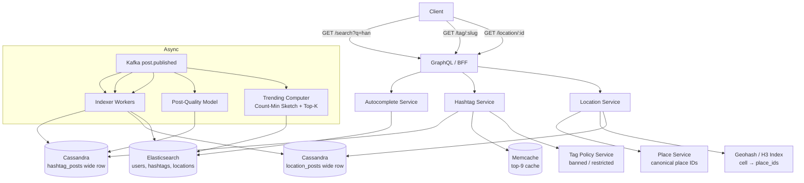
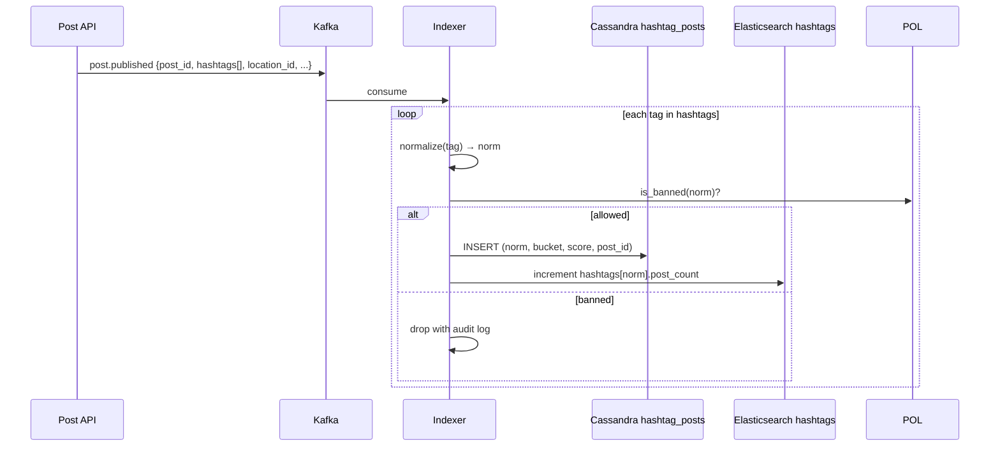
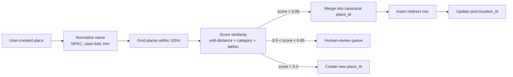

# Instagram Deep Dive — Hashtag and Location Search

**Date:** 2026-04-29 | **Updated:** 2026-04-29
**Tags:** `system-design` `case-study` `instagram` `deep-dive` `search` `hashtags`

## Table of Contents

- [Summary](#summary)
- [Overview](#overview)
- [Hashtag Normalization](#hashtag-normalization)
- [Inverted Index — Hashtag → Posts](#inverted-index--hashtag--posts)
- [Hot Tag Write Amplification](#hot-tag-write-amplification)
- [Posting List Sharding](#posting-list-sharding)
- [In-Tag Ranking](#in-tag-ranking)
- [Top-9 Grid (Popular Section)](#top-9-grid-popular-section)
- [Location Geocoding](#location-geocoding)
- [Geohash and H3 Indexing](#geohash-and-h3-indexing)
- [Place Canonicalization](#place-canonicalization)
- [Banned Hashtags and Shadow Tags](#banned-hashtags-and-shadow-tags)
- [Trending Hashtags Computation](#trending-hashtags-computation)
- [Search Latency Budget](#search-latency-budget)
- [Autocomplete on Hashtags](#autocomplete-on-hashtags)
- [Anti-Patterns](#anti-patterns)
- [Related](#related)
- [References](#references)

## Summary

Hashtag and location search look like one feature on the surface — a discovery surface that takes a token (`#vietnam` or "Hồ Tây, Hà Nội") and returns posts. Underneath, they are two distinct subsystems that share an Elasticsearch frontend but diverge sharply once you cross the entity boundary. **Hashtag pages** are powered by a per-tag inverted posting list keyed by a normalized tag string, written from the publish pipeline, and ranked by an offline post-quality model. **Location pages** are powered by a place-id graph (canonicalized against Foursquare/Facebook places) plus a geohash/H3 spatial index for "near me" queries. Both surfaces have to deal with hot keys (one tag — `#love` — receives millions of writes per minute during peaks), wide-partition pathologies in Cassandra, anti-spam policy (banned tags, shadowban), and trending-now computation that has to operate on a stream of billions of events without holding the whole stream in memory. This deep dive walks each of those concerns end to end.

## Overview



The publish pipeline (`post.published` on Kafka) is the single source of truth that feeds every read surface. Synchronous reads never write back into the index — they only read. This is the same pattern as the Facebook News Feed and Explore deep dives, applied to the search/discovery surface.

## Hashtag Normalization

A hashtag is a user-typed token. Two users typing what they think is the same tag may produce wildly different bytes:

```text
#Café        →  C-a-f-é         (NFC)
#Café  →  C-a-f-e + combining acute  (NFD)
#ＣＡＦＥ       →  fullwidth Latin (CJK input mode)
#café         →  same NFC bytes, different case
#café         →  trailing zero-width space (homograph attack)
```

If the index keys on raw bytes, `#café` and `#Café` produce two disjoint posting lists. The user typing `#café` in their search bar would miss everything tagged `#Café`. Normalization is therefore not optional cosmetics — it is the contract between the writer and the reader.

**The pipeline (writer side, before the index):**

1. **Strip the leading `#`** if present, plus surrounding whitespace and zero-width characters (`U+200B`, `U+200C`, `U+200D`, `U+FEFF`).
2. **Apply Unicode NFKC normalization** (Unicode TR15 — Compatibility Composition). NFKC folds `ＣＡＦＥ` (fullwidth) to `CAFE`, decomposes `é` into base + combining acute and recomposes to a canonical single codepoint, and turns ligatures like `ffi` into `ffi`. NFC alone is not enough because users on CJK keyboards routinely produce fullwidth Latin without realizing.
3. **Case-fold** using Unicode case-folding (not naive `toLowerCase` — Turkish dotless `İ`, German `ß`, and Greek sigma all have locale-sensitive lowercase rules; case-folding is a locale-independent operation defined by the Unicode standard).
4. **Reject or split on disallowed characters.** Per Instagram's documented rules, a hashtag must be a single token of letter, digit, or underscore characters from a Unicode-aware character class. A hashtag containing whitespace, punctuation, or symbols is split or rejected at the first invalid char. Pure-numeric tags (`#2026`) are typically rejected to avoid collisions with year-bucketing.
5. **Length cap.** Truncate to a maximum length (Instagram's published limit is 30 hashtags per post and individual tags up to ~100 codepoints). Beyond the cap, drop the tag with a soft warning.
6. **Slugify.** The canonical form stored in the index is the case-folded NFKC string. The user-visible form preserves the original casing (so `#Vietnam` displays as `#Vietnam` even though it joins the `vietnam` posting list).

**ABNF sketch** (RFC 5234 style) for the post-normalization tag grammar:

```abnf
hashtag        = "#" tag-chars
tag-chars      = 1*100(letter / digit / "_")
letter         = <any Unicode codepoint with property L*>
digit          = <any Unicode codepoint with property Nd>
```

The grammar is deliberately permissive on letter/digit so non-Latin scripts (Cyrillic, Arabic, Hangul, CJK ideographs) work without per-script special cases.

**Bidirectional control characters** (`U+202E` RIGHT-TO-LEFT OVERRIDE and friends) are stripped before the tokenizer sees them — they are a common spoofing vector that makes a tag display reversed in feeds while indexing under a different key.

## Inverted Index — Hashtag → Posts

For each post tagged with one or more hashtags, the indexer writes one row per `(tag, post_id)` pair. The data structure is a classic inverted posting list, identical in shape to what Lucene builds inside Elasticsearch but stored in Cassandra so we can scale partitions horizontally and clamp wide-row size on tags we care about.

```text
hashtag_posts (
  hashtag       TEXT,           -- normalized form
  bucket        TEXT,            -- 'YYYY-MM' for hot tags, '' for cold
  rank_score    DOUBLE,
  post_id       BIGINT,
  author_id     BIGINT,
  created_at    TIMESTAMP,
  PRIMARY KEY ((hashtag, bucket), rank_score, post_id)
) WITH CLUSTERING ORDER BY (rank_score DESC, post_id DESC);
```

- **Partition key** — `(hashtag, bucket)`. Bucket is empty for cold tags (one partition holds the entire posting list). For hot tags, bucket is the year-month string of `created_at` so a single tag's posts are split across many partitions and reads merge across them.
- **Clustering** — `rank_score DESC` so the page-0 read of "Top" is a single seek. Recent feeds use a parallel table keyed by `created_at DESC` because top and recent share writers but diverge on read shape.
- **Counterpart in Elasticsearch** — the `hashtags` index in ES holds entity rows (one row per unique tag) with fields like `name`, `post_count`, `is_banned`, `category`. The actual posting list lives in Cassandra; ES holds metadata for autocomplete and the entity card at the top of the tag page.

The split between Cassandra (heavy posting lists) and Elasticsearch (entity cards plus autocomplete) is the production reality. Trying to put a `#love` posting list inside Elasticsearch as a single index would either OOM the cluster or force you into time-bucketed indices that look exactly like Cassandra wide-row time-bucketing — same problem, worse tooling.

### Write path



The indexer writes are idempotent: re-consuming the same Kafka offset re-writes the same row and the count increments are protected by a per-(tag, post_id) dedup set kept in Redis with a 24-hour TTL.

## Hot Tag Write Amplification

A normal post carries on average 10–11 hashtags (Instagram-published research). At ~1,150 posts/sec average and ~10 K/sec peak, the indexer is doing on the order of 100 K hashtag writes/sec. Most of that is fine — the long tail of tags receives one or two writes/minute. The pathology lives in the head.

**Real distribution.** Instagram's tag distribution follows a Zipfian curve. The top tags (`#love`, `#instagood`, `#photooftheday`, `#fashion`, `#beautiful`, `#happy`) accumulated billions of posts each over the lifetime of the product. During a globally-anchored event (`#worldcupfinal`, `#oscars`, `#superbowl`), a single tag can receive **millions of writes per minute** for 30–60 minutes.

A single Cassandra partition cannot absorb that. Concretely:

- A wide partition past ~100 MB of clustering data starts to degrade Cassandra reads.
- Memtable flushes and compaction on a hot partition stall other partitions on the same node.
- A partition that grows unbounded eventually crosses the per-partition size limit and reads time out entirely.

The fix is not a single technique but a stack of them.

## Posting List Sharding

Two complementary sharding strategies operate in tandem.

### 1. Time-bucketing (vertical partition split)

For known hot tags, the partition key includes a time bucket:

```text
PRIMARY KEY ((hashtag, year_month), rank_score DESC, post_id DESC)
```

A single tag's posts are now spread across (one partition per active month). Reads of the "Recent" feed start from the current bucket and walk backwards. Reads of the "Top" feed query the current bucket and the previous bucket, merge by `rank_score`, and serve the page.

The bucket size is tuned per tag: very hot tags use weekly buckets; medium-hot tags use monthly; cold tags use no bucket. The list of hot tags is maintained by the Trending service (see [Trending Hashtags Computation](#trending-hashtags-computation)) and pushed to indexers as a Bloom filter so the indexer can branch on bucket-or-not in O(1) per write.

### 2. Random sub-sharding (horizontal write spread)

For tags receiving > 10 K writes/sec for sustained periods, time bucketing alone is not enough — even a single hour's bucket overruns. The indexer adds a random sub-shard:

```text
PRIMARY KEY ((hashtag, year_month, sub_shard), rank_score DESC, post_id DESC)
-- sub_shard ∈ [0, N) chosen uniformly at write time, N typically 16 or 64
```

Reads now scatter-gather across `N` partitions per (tag, month) and merge results. This is exactly the technique used for sharded counters elsewhere in the design (see [feed-generation.md](./feed-generation.md) on the `likes_counter` table).

The trade-off: scatter-gather adds latency. A 16-way fan-out is fine; a 256-way fan-out blows the latency budget. Instagram-style systems start unsharded and turn sharding on dynamically when a tag crosses a write-rate threshold. Once on, it stays on for the lifetime of the bucket.

### 3. Sample-on-write for the Top index

For "Top" specifically, the indexer can sample writes — only a fraction of posts on a hot tag need to be considered for the top-9 ranker. Sampling at 10% on a tag receiving 10 K writes/sec drops index pressure to 1 K writes/sec while preserving the input space the ranker needs (it only ever surfaces the very top of the distribution anyway). Sampling is biased toward early-engagement signals so genuinely viral posts are not sampled out.

## In-Tag Ranking

Two surfaces, two ranking models.

### Recent

Pure reverse-chronological. Writer sets `rank_score = created_at_unix` and the clustering order does the work. The only complexity: deduplication when scatter-gather merges results from multiple sub-shards (post_id might appear once per sub-shard if the same post was double-written; the read path uses a hash-set dedup over the merged page).

Recent has policy filters applied at read time: posts from blocked authors, posts the viewer has muted, and posts under the tag if the **tag** is restricted (see [Banned Hashtags and Shadow Tags](#banned-hashtags-and-shadow-tags)).

### Top

Top is a ranked subset scored by an offline post-quality model. Inputs (computed at the engagement service, written back to the post row, propagated to the indexer):

- **Engagement velocity** — likes/sec, comments/sec, saves/sec in the first few hours after publish. The signal that distinguishes "viral" from "popular".
- **Author authority** — follower count, historical engagement rate, age of account, verified status. A 2-day-old account with 10 followers does not surface in Top regardless of post engagement.
- **Image-quality signals** — a CV model emits a blurriness/exposure/composition score. Low-quality photos are deranked.
- **Caption quality** — caption length, language detection, keyword stuffing penalty. Caption containing 30 hashtags is a spam signal.
- **Engagement diversity** — engagement from many distinct authors > engagement from a like ring.
- **Negative signals** — reports, hides, "not interested" feedback.

The model is a gradient-boosted tree (XGBoost/LightGBM-style) producing a single scalar `rank_score`. The ranker runs every few minutes for tags in the hot list and every few hours for cold tags. Output is written back to `hashtag_posts` as an updated `rank_score` (which in Cassandra means a new clustering row at the new score and a tombstone on the old — compaction reclaims the space).

The score is **blended with recency** via time-decay: `final_score = quality_score × decay(now - created_at)` where `decay` is exponential with a half-life of ~6 hours for hot tags and ~24 hours for cold tags. Without decay, the all-time top of `#love` would freeze in 2014 forever.

## Top-9 Grid (Popular Section)

The hashtag page header surfaces a 3×3 grid — the "Popular" section — above the chronological list. This is the most-clicked surface on the entire tag page and gets its own cache.

```text
GET /v1/hashtags/{tag}/top9:
  cache_key = "tag_top9:" + normalize(tag)
  if memcache.has(cache_key):
      return memcache.get(cache_key)
  rows = cassandra.read("hashtag_posts", partition=(tag, current_bucket), limit=200)
  rows = filter(rows, viewer_policy)
  rows = dedupe_by_author(rows, max_per_author=1)
  top9 = rows[:9]
  memcache.set(cache_key, top9, ttl=300)  # 5-minute TTL on cold tags
  return top9
```

Several decisions worth pulling out:

- **Read 200, return 9.** The over-fetch absorbs filtered-out rows (blocked authors, NSFW review, tag-restricted) without a second round-trip.
- **`dedupe_by_author`.** Without this, the top-9 frequently degenerates to nine posts by the same viral author — visually monotonous and a known degraded-quality state. The client-visible rule: at most one post per author in the popular grid.
- **Memcache TTL.** 5 minutes for cold tags is fine. For hot tags, the TTL drops to seconds and the cache is *also* warmed by the offline ranker pushing a new version on each pass — eliminating the cold read for top tags entirely.
- **Per-viewer personalization is minimal.** The popular grid is mostly globally-ranked. Personalization is restricted to policy filters (blocks, mutes), not relevance — globally-popular content is what the surface is for.

## Location Geocoding

Location tagging takes a free-form user input ("Hồ Tây", "Empire State Building", "Mom's house") and resolves it to a canonical place_id. Three input modes:

1. **Pick from a list.** The compose UI shows nearby places resolved by reverse-geocoding the device's lat/lon. The user picks one and the client sends a place_id. Easy case.
2. **Search by name.** The user types a name, the API hits the place search service (Elasticsearch over the places index plus a re-rank by distance from device lat/lon). The user picks one. Result is a place_id.
3. **Custom name.** The user types a string that doesn't match any existing place. The system creates a new place_id with the string as the display name and the device's coarse lat/lon as the centroid. New places are flagged for moderation; spam custom places ("free crypto here") are reaped daily.

**Reverse geocoding** of the device's lat/lon happens server-side. The client sends `(lat, lon)` accurate to ~10 m (one digit past the four decimals); the server quantizes to the H3 cell at resolution 9 (~150 m on a side) and queries the spatial index for places within K nearest cells. Quantizing on the server prevents a hostile client from sending high-precision coordinates and using the server as an oracle to extract precise positions of private places.

EXIF GPS is stripped from media before publish (see [feed-generation.md](./feed-generation.md)) — the location_id on the post is the only remaining GPS-derived signal, and it points to a public place, not the user's home.

## Geohash and H3 Indexing

Two spatial indexing schemes are commonly used; Instagram's documented stack uses S2 cells internally for some surfaces and the broader industry has converged on **H3** (Uber's hexagonal hierarchical spatial index) for "places near me" queries. The deep dive [`../../../data-structures/geohash.md`](../../../data-structures/geohash.md) covers the algorithmic details; here is the integration.

### Why hexagons (H3) over geohash squares

- **Equal neighbor distance.** A hexagon has six neighbors all at the same distance; a square has four close (orthogonal) and four far (diagonal). For "places within radius R", hex cells let you walk the ring with a single distance parameter.
- **No singularities.** Geohash cells distort badly near the poles; H3 distortion is bounded.
- **Hierarchy.** H3 has 16 resolutions (0 = continent, 15 = sub-meter). Coarser cells aggregate nicely into finer ones. A location service can index at resolution 9 (≈150 m edge, ≈100,000 m² area) and query parent cell at resolution 8 for "wider radius" queries.

### Schema

```text
places (
  place_id     BIGINT PK,
  display_name TEXT,
  centroid_lat DOUBLE,
  centroid_lon DOUBLE,
  h3_r9        BIGINT,            -- precomputed at resolution 9
  h3_r6        BIGINT,            -- precomputed at resolution 6 (~3 km)
  category     TEXT,
  source       TEXT,              -- 'foursquare' | 'facebook' | 'user'
  status       TEXT,              -- 'active' | 'merged_into:<id>' | 'banned'
  ...
)

CREATE INDEX places_h3_r9 ON places(h3_r9);
CREATE INDEX places_h3_r6 ON places(h3_r6);
```

The places table lives in sharded Postgres because places are a heavy-read, slow-write entity store (places are added/edited rarely, read on every compose and every location page). The h3 indexes are plain B-tree indexes; the application precomputes the cell at write time.

### Query: "places near me"

```sql
-- pseudocode
let cells := h3.k_ring(h3.from_latlon(lat, lon, 9), k=2)
SELECT place_id, display_name, centroid_lat, centroid_lon
FROM places
WHERE h3_r9 = ANY(cells)
  AND status = 'active'
ORDER BY haversine(centroid_lat, centroid_lon, $lat, $lon)
LIMIT 50;
```

A k=2 ring at resolution 9 covers ~19 cells with a ~600 m radius — enough for "places near you in the compose sheet". The candidate set is small (typically tens to low hundreds of places per cell in dense areas) so the haversine sort is cheap. For wider radius, drop to resolution 6 with k=1.

The same cells are used by `location_posts` for "posts near here" queries when the location surface needs a map view: the index keys posts by the place's `h3_r9` rather than scanning every place's posting list.

## Place Canonicalization

Different sources name the same physical location differently:

- "Empire State Building" (Foursquare ID 1234)
- "Empire State Bldg" (user-entered custom place)
- "350 5th Ave, NYC" (address-derived place)
- "Empire State Bldng" (typo'd custom place)

Without canonicalization, posts about the Empire State Building scatter across dozens of place_ids, each with its own location page, none of which are useful. Canonicalization is the dedup of the place graph.

### Inputs

- **Foursquare Places** — the dominant external source for Instagram historically. Foursquare exposes a venue ID per real-world place plus name, address, category, lat/lon. Instagram licenses or syncs Foursquare's data to seed the canonical places table.
- **Facebook Places** — Meta's internal places graph, with venue IDs that survive across products (Facebook, Instagram, Threads).
- **OpenStreetMap (OSM)** — used for fallback addresses and as a cross-reference.
- **User-created places** — anything the user types that doesn't match.

### Canonicalization pipeline



When two places merge, the loser's `place_id` is not deleted — it gets a `status = 'merged_into:<winner_id>'`. The location service follows redirects on read (one hop, no chains) so old post URLs still resolve. Posts originally tagged with the loser's place_id are migrated lazily on read or in a background sweep.

### Why the redirect, not a delete

A delete would orphan every existing post and DM share that referenced the old place_id. The redirect preserves identity: an old post tagged "Empire State Bldg" still appears on the Empire State Building location page after the merge, automatically. This is the classic "lazy URL canonicalization" pattern — same shape as canonical URLs in the Web after redirects, or username changes (see anti-pattern note in the parent design about caching by user_id, not username).

## Banned Hashtags and Shadow Tags

Some tags are banned outright; others are restricted ("Recent does not refresh", "Top is empty"). The mechanism powers what users perceive as the "shadowban".

### Tag-level policy

A `tag_policy` table:

```text
tag_policy (
  tag             TEXT PK,         -- normalized
  status          TEXT,            -- 'allowed' | 'restricted' | 'banned'
  reason          TEXT,            -- 'csam_adjacent' | 'self_harm' | 'spam' | 'manual'
  applied_at      TIMESTAMPTZ,
  expires_at      TIMESTAMPTZ NULL
)
```

Statuses:

- **`allowed`** — default. Indexer writes normally.
- **`restricted`** — indexer writes to Cassandra but reads return a curated set, not the full posting list. The page shows a top-of-page warning and the "Recent" tab is hidden. Used for tags whose meaning is benign but whose use is heavily abused (e.g., common skincare and fitness tags during periods of pro-ana abuse).
- **`banned`** — indexer drops the write entirely. The tag page returns a "no results" state with policy text. The autocomplete service hides the entry from suggestions.

Policy state is pushed to every indexer node via a Memcache layer with sub-second TTL — a bad tag must take effect across the fleet quickly when ops flips it.

### Shadowban as a per-account state

A separate axis: an account flagged for inauthentic behavior has its posts silently de-amplified. The mechanism:

- Posts publish normally — the author sees their own post on their profile and on hashtag pages they navigate to.
- The indexer writes a per-author `visibility_class` field on each post row (`public` | `restricted` | `shadow`).
- The hashtag page reader filters out `shadow` posts for *other viewers* — the author keeps seeing their own posts, so they have no clear signal that they've been demoted.

This is intentionally opaque to the affected account. The signal is delivered indirectly (engagement drops, follower growth stalls); making it explicit would let the spam ecosystem iterate around the classifier in a tight loop.

For the engineering doc, the architectural point is: **shadowban is a read-time filter, not a write-time block**. The data is there; the read filters it out for everyone except the author. This implies every read path (hashtag, location, Explore, search results) checks the visibility_class. Centralizing that check in a "post visibility resolver" service is the right factoring.

## Trending Hashtags Computation

"Trending now" is a classic Top-K-over-stream problem. You cannot store every tag's instantaneous count in a hash map — the universe of tags is unbounded and the long tail dominates memory. You need a streaming algorithm that gives an approximate Top-K with bounded memory.

### Count-Min Sketch

A Count-Min Sketch (CMS) is a 2D array of counters indexed by `d` independent hash functions. To increment `tag` by 1, hash `tag` with each of the `d` functions to get `d` column indices, increment each. To query, hash `tag` and return the **minimum** of the `d` cells (because hash collisions can only inflate counts, never deflate them).

```text
sketch[d][w] = uint32 array, all zero
INCR(tag):
  for i in 0..d:
    sketch[i][hash_i(tag) % w] += 1
QUERY(tag) = min over i of sketch[i][hash_i(tag) % w]
```

For a sketch sized at `(d, w) = (5, 10000)`, memory is 5 × 10 K × 4 B = 200 KB. Errors: with probability ≥ `1 - e^-d`, the count is over-estimated by at most `(N / w)` where `N` is the total stream length. At `N = 10⁹` events and `w = 10⁴`, error is ≤ 100 K events with high probability — fine for trend detection where we only care about the head of the distribution.

The full algorithmic treatment lives in [`../../../data-structures/count-min-sketch-and-top-k.md`](../../../data-structures/count-min-sketch-and-top-k.md).

### Top-K via heavy-hitters

CMS gives you per-tag count estimates but not the top-K — querying every tag is impossible. The standard pairing: a **min-heap of size K** keyed by estimated count.

```text
on every tag occurrence:
  cms.incr(tag)
  est = cms.query(tag)
  if heap.size < K: heap.push(tag, est)
  else if est > heap.min(): heap.replace_min((tag, est))
```

The heap holds the current top-K. Tags drop out when a fresher tag exceeds them. This is the **Heavy Hitters** algorithm; combined with CMS it is sometimes called CMS-Top-K or the Misra-Gries variant for the deterministic version.

### Time windows

"Trending now" is not all-time top — it is "top in the last hour relative to baseline". The implementation uses **sliding windows**:

- One CMS for the trailing 1-hour window, refreshed every minute (drop the oldest 1-minute slice, add the newest).
- One CMS for the trailing 24-hour baseline.
- A tag is "trending" when `current_rate / baseline_rate > threshold` (e.g., 5×) and its absolute current count is above a floor.

The sliding implementation uses **N parallel CMS instances**, one per time bucket; the active window is the sum across the buckets currently inside the window. Adding a bucket and dropping a bucket are constant-time CMS operations (zero out the dropped instance, start filling the new one).

### Output

Top-K is dumped every minute into Elasticsearch as a small `trending` index:

```text
trending (
  tag         TEXT,
  rank        INT,
  current     BIGINT,
  baseline    BIGINT,
  ratio       DOUBLE,
  since       TIMESTAMPTZ
)
```

The discovery surface reads from this index directly. The Top-K list also feeds the **hot tags Bloom filter** sent to the indexer fleet, which triggers time-bucketing and sub-sharding for those tags going forward.

## Search Latency Budget

Every read on the search surface has a deadline, and the deadline is composed of stacked sub-deadlines.

| Stage | Budget | Notes |
|-------|--------|-------|
| Edge / TLS termination | 10 ms | Mostly fixed-cost network and TLS handshake. |
| Auth + rate-limit check | 5 ms | Memcache hit path. |
| Autocomplete query (Elasticsearch) | 30 ms | Prefix query against the hashtags + users + locations indices. |
| Tag entity card (Elasticsearch) | 20 ms | Single doc lookup + counts. |
| Top-9 grid (Memcache hit) | 5 ms | Cache miss falls back to Cassandra at +50 ms. |
| Recent feed page (Cassandra) | 50 ms | Single partition seek for cold tags; scatter-gather for hot tags. |
| Policy filtering | 10 ms | Per-row visibility_class lookup, batched via Memcache. |
| Render + serialize | 20 ms | GraphQL response assembly. |
| **Total target** | **< 200 ms P50** | **< 500 ms P99** |

Everything past the edge is pipelined and parallelized where possible — the autocomplete query and the entity card load in parallel; the top-9 grid and recent feed load in parallel. The dependencies are linear only on the policy filter (which has to know the row IDs) and the final render.

If any single stage exceeds its budget, the surface degrades rather than fails:

- Top-9 cache miss + Cassandra timeout → return entity card alone, "loading popular posts..." spinner; client retries.
- Recent feed Cassandra timeout → return empty page with "try again" affordance.
- Elasticsearch entity card miss → use the Cassandra-derived count, skip the icon/category metadata.

Soft-degradation matters more than uniform success at this scale. A 500-error on the tag page is much worse than a partially-rendered page with retry hooks.

## Autocomplete on Hashtags

Autocomplete is a separate, very-low-latency path with stricter caching than the page reads.

### Query

```text
GET /v1/search/suggest?q=han
```

Returns a ranked list of (tag, user, location) candidates. The client typically renders the result as the user types each character.

### Implementation

- **Edge n-gram analyzer in Elasticsearch.** The hashtags index is indexed with an edge n-gram filter so that `vietnam` is indexed under `v`, `vi`, `vie`, `viet`, `vietn`, `vietna`, `vietnam`. Prefix queries become exact-term queries against pre-expanded tokens, dropping query latency from "scan all matching prefixes" to "single posting list lookup".
- **Search-time normalization.** The same NFKC + case-fold pipeline runs on the query string before it hits Elasticsearch — otherwise `Han` would not match the tokens indexed under `han`.
- **Re-rank by personalization signal.** Elasticsearch returns the top ~50 candidates by post_count; the application re-ranks using lightweight signals (does the viewer follow accounts that recently used this tag? has the viewer searched for this tag before? distance to candidate location?).
- **Memcache shield.** The top suggestions for common 1- and 2-character prefixes are cached at the edge with sub-minute TTL. A noticeable share of all autocomplete traffic is `q=a` through `q=zz` — pinning these in cache eliminates the bulk of Elasticsearch QPS.
- **Banned-tag suppression.** Tags with `status='banned'` are filtered out of the suggestion stream. Restricted tags appear in suggestions but with a small policy label.
- **Debouncing on the client.** The client waits ~150 ms between keystrokes before issuing a request — typing fast on a long word would otherwise produce a request per character. The server treats this as the client's responsibility, but the rate-limit policy is forgiving (the auth+rate-limit step admits up to ~10 suggest queries/sec/user).

### Failure modes

- **Cold partition for an emerging trend.** A brand-new tag spikes from zero to thousands of posts/minute. The edge cache has no prefix entry for it; Elasticsearch returns the now-relevant tag once the indexer has refreshed (default 1 s refresh interval). The trending pipeline picks it up within a minute and pushes it into the cached prefix entries.
- **Spam tag autocomplete-poisoning.** A bad actor names a custom location or account "Vietnam Travel Tips" hoping to hijack the prefix `viet`. Mitigated by rate-limit on custom name creation, post-creation moderation queue for new names, and a global account-quality signal in the autocomplete re-rank.

## Anti-Patterns

- **Indexing on raw user-typed bytes.** Two posts tagged `#Café` and `#café` end up on different pages. Always normalize at write time using NFKC + case-fold; never trust the user to type canonically.
- **Storing the entire posting list for `#love` in a single Cassandra partition.** Wide-partition pathologies are not theoretical — a single tag can grow to terabytes of clustering data. Time-bucket and sub-shard from the start for tags above a write-rate threshold.
- **Synchronous "is this tag banned?" lookup against the source-of-truth on every write.** Push the policy state to indexer-local Memcache or a Bloom filter. The DB query path on every post is wasted latency.
- **Computing trending by scanning the post log every minute.** Linear in events. Use Count-Min Sketch + heavy hitters; bounded memory, sublinear updates.
- **Treating autocomplete as a search query.** A search query with relevance scoring is too slow for keystroke-rate fan-out. Edge n-grams plus a memcache layer on common prefixes is the production answer.
- **Hard-deleting a place_id when merging duplicates.** Orphans every existing post and DM share. Use a redirect status and follow it on read; sweep posts in a background job.
- **Surfacing "shadowbanned" state explicitly to the affected account.** Lets spam adapt. The signal is delivered indirectly through engagement metrics. (Whether this is an *ethical* anti-pattern is a separate debate; from a counter-spam-mechanism perspective, opacity is load-bearing.)
- **Letting clients send raw lat/lon to the location lookup at full precision.** Quantize on the server (typical: H3 r9 ≈ 150 m). High-precision client coordinates leak through to other surfaces and become a privacy bug waiting to happen.
- **Unioning the Top and Recent indexes.** They have different write schemas (different rank_score semantics). Two tables, two clustering orders, no shared cluster.
- **Caching the tag entity card by tag-as-bytes instead of tag-as-normalized.** Cache misses on every casing variation. Always cache by the normalized form.
- **Running the post-quality model on every post synchronously at ingest.** The model is heavy enough to blow the publish budget. Run async, allow a few minutes of "Top is stale" on freshly-created tags, and let the ranker catch up.
- **Same retention for places and posts.** Places live forever; posts come and go. A merged-place's redirect row is kept indefinitely; the posts under it follow the normal retention policy.

## Related

- [`feed-generation.md`](./feed-generation.md) — feed pipeline, fanout, sharded counters; many of the indexer patterns and the visibility_class field originate there.
- [`../../../data-structures/geohash.md`](../../../data-structures/geohash.md) — geohash and H3 algorithmic details, encoding, neighbors, and cell hierarchy.
- [`../../../data-structures/count-min-sketch-and-top-k.md`](../../../data-structures/count-min-sketch-and-top-k.md) — CMS error bounds, heavy-hitters algorithm, sliding-window variants.
- [`../../../building-blocks/search-systems.md`](../../../building-blocks/search-systems.md) — inverted index, analysis pipelines, edge n-gram autocomplete, BM25 vs custom ranking.
- [`../design-instagram.md`](../design-instagram.md) — parent HLD; the section [Hashtag and Location Search](../design-instagram.md#4-hashtag-and-location-search) is the entry point this deep dive expands.

## References

- [Sharding & IDs at Instagram](https://instagram-engineering.com/sharding-ids-at-instagram-1cf5a71e5a5c) — Instagram Engineering on the 64-bit ID scheme, applicable to post IDs that flow through the indexer.
- [Instagram Architecture Update — High Scalability](http://highscalability.com/blog/2012/4/16/instagram-architecture-update-whats-new-with-instagram.html) — historical snapshot of the Postgres + Cassandra + Memcache stack referenced throughout.
- [Powered by AI: Instagram's Explore recommender system](https://ai.meta.com/blog/powered-by-ai-instagrams-explore-recommender-system/) — Word2Vec-style embeddings and personalized PageRank, neighbouring techniques to the in-tag ranking model.
- [Scaling the Instagram Explore recommendations system](https://engineering.fb.com/2023/08/09/ml-applications/scaling-instagram-explore-recommendations-system/) — multi-stage ranking architecture; the post-quality model used for Top-of-tag is a simplified offline cousin.
- [Elasticsearch Reference — Edge n-gram tokenizer](https://www.elastic.co/guide/en/elasticsearch/reference/current/analysis-edgengram-tokenizer.html) — production pattern for autocomplete on hashtags.
- [Elasticsearch Reference — Analyzers](https://www.elastic.co/guide/en/elasticsearch/reference/current/analysis-analyzers.html) — the analyzer chain referenced for tag and place name indexing.
- [Apache Lucene — Index file formats](https://lucene.apache.org/core/9_10_0/core/org/apache/lucene/codecs/lucene99/package-summary.html) — the underlying inverted index implementation used by Elasticsearch.
- [Unicode Standard Annex #15 — Unicode Normalization Forms](https://unicode.org/reports/tr15/) — NFC, NFD, NFKC, NFKD definitions; NFKC is the canonical form for hashtag normalization.
- [Unicode Case Mappings (TR21) and Case Folding](https://www.unicode.org/Public/UCD/latest/ucd/CaseFolding.txt) — locale-independent case folding required for hashtag matching.
- [RFC 5234 — Augmented BNF for Syntax Specifications](https://datatracker.ietf.org/doc/html/rfc5234) — ABNF grammar notation used for the tag-chars rule.
- [H3 — Uber's Hexagonal Hierarchical Spatial Index](https://h3geo.org/) — primary reference for the cell system used by location indexing.
- [H3 documentation — Resolution table](https://h3geo.org/docs/core-library/restable/) — exact edge lengths and areas per resolution.
- [Geohash algorithm — original spec](https://en.wikipedia.org/wiki/Geohash) — predecessor to H3, included for context on why hexagons displaced the square-grid approach.
- [Cormode & Muthukrishnan — An Improved Data Stream Summary: The Count-Min Sketch and its Applications](https://sites.google.com/site/countminsketch/) — the canonical CMS paper and reference implementations.
- [Misra & Gries — Finding Repeated Elements (1982)](https://www.cs.utexas.edu/~misra/scannedPdf.dir/FindRepeatedElements.pdf) — deterministic heavy-hitters algorithm; the streaming Top-K building block.
- [Foursquare Places API documentation](https://docs.foursquare.com/developer/reference/places-api) — schema and matching semantics for the canonical place graph.
- [PhotoDNA / hash-based CSAM detection](https://www.microsoft.com/en-us/photodna) — the synchronous block referenced by the indexer's policy hook.
- [How Instagram Scaled Its Infrastructure To Support a Billion Users — ByteByteGo](https://blog.bytebytego.com/p/how-instagram-scaled-its-infrastructure) — synthesis of the public Instagram engineering record.
