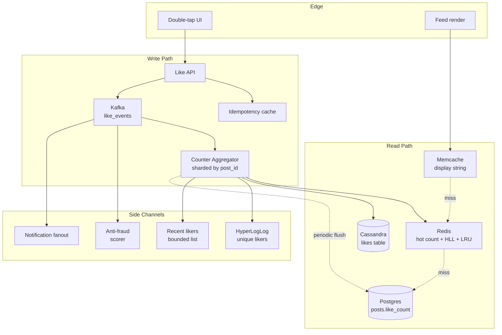
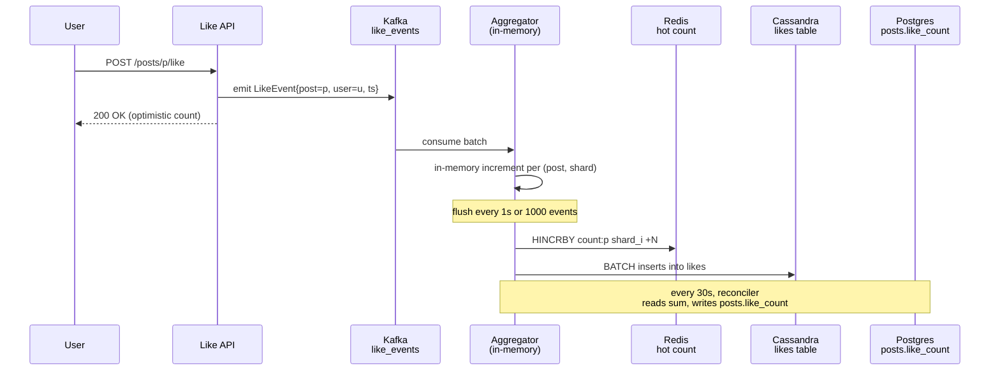

# Instagram Deep Dive — Like and Comment Counters

**Date:** 2026-04-29 | **Updated:** 2026-04-29
**Tags:** `system-design` `case-study` `instagram` `deep-dive` `counters` `hot-keys`

## Table of Contents

- [Summary](#summary)
- [Overview](#overview)
- [The Hot Post Problem](#the-hot-post-problem)
- [Sharded Counter — Splitting the Hot Row](#sharded-counter--splitting-the-hot-row)
- [Write-Buffer Pipeline — Kafka, Aggregator, DB](#write-buffer-pipeline--kafka-aggregator-db)
- [Idempotency — One Like Per User Per Post](#idempotency--one-like-per-user-per-post)
- [HyperLogLog — "M people like this" Approximation](#hyperloglog--m-people-like-this-approximation)
- [Recent Likers — Bounded LRU per Post](#recent-likers--bounded-lru-per-post)
- [Display Strategy — Rounded Numbers and Cached Strings](#display-strategy--rounded-numbers-and-cached-strings)
- [Cross-Post Counters — Account Total Likes](#cross-post-counters--account-total-likes)
- [Anti-Fraud — Botnet Like Detection](#anti-fraud--botnet-like-detection)
- [Multi-Region — Per-Region Convergence](#multi-region--per-region-convergence)
- [Storage Choice — Redis HINCRBY vs Cassandra Counter Columns](#storage-choice--redis-hincrby-vs-cassandra-counter-columns)
- [Failover Consistency — What Happens When a Counter Node Dies](#failover-consistency--what-happens-when-a-counter-node-dies)
- [Anti-Patterns](#anti-patterns)
- [Related](#related)
- [References](#references)

## Summary

A like counter is the single most-called write API on Instagram. Most posts attract a handful of likes per minute; a viral celebrity post attracts **hundreds of thousands per second** in the first minute and **millions in the first hour**. The naive `UPDATE posts SET like_count = like_count + 1 WHERE id = ?` collapses the moment that traffic lands on a single row — every transaction queues behind the row lock, p99 climbs to seconds, and the connection pool saturates.

The production design is a layered pipeline that turns a hot row into a hot *partition*, then turns a hot partition into a hot *stream*, and finally turns the stream into a flat batch flush. The same pipeline serves comments — comment **content** is wide-row Cassandra, but comment **count** rides exactly the same counter rails as likes.

Three trade-offs make the system tractable:

1. **The displayed count is eventually consistent** — seconds of staleness on "127K likes" is invisible to users.
2. **The viewer's own state is strongly consistent** — `viewerHasLiked` reads from a per-user table, never from the aggregate.
3. **Likes are durable; counts are negotiable** — a like event must never be silently lost, but the aggregate can drift by tens of likes during a viral burst and reconcile later.

This deep-dive is the Instagram-specific complement to the platform-agnostic [Likes Counting System case study](../design-likes-counting-system.md). The sibling document treats the problem in the abstract; this one drills into how it lands inside Instagram's actual architecture (Cassandra-Rocksandra, Memcache, regional Postgres, Kafka), the sub-systems that surround it (HyperLogLog for "M people like this," anti-fraud, multi-region convergence), and the failure modes you only hit in production.

## Overview

The counter subsystem touches every other major piece of Instagram:



The key insight: **the request path never touches the durable count.** A like enters Kafka, returns 200 OK to the client with an *optimistic* count, and the durable aggregate is updated by an asynchronous aggregator. Reads come from a multi-tier cache (Memcache → Redis → Postgres), with the database hit only on cold-cache miss for unpopular posts.

## The Hot Post Problem

### What "viral" actually means at Instagram scale

A normal post:

- 100 followers see it in the first hour.
- 10–20 of them like it.
- Write rate: 0.005 likes/sec sustained. Trivial.

A celebrity post (Ronaldo, Messi, Selena Gomez — each 400M+ followers):

- ~50–80 million followers see it in the first hour.
- 5–10% like it: **2.5M–8M likes in 60 minutes.**
- Peak rate in the first minute: **300K–1M likes/sec on a single post.**

The "single post" part is what kills naive designs. You can horizontally scale anything that distributes load across keys — sharded Postgres, partitioned Cassandra, Redis Cluster — but a viral post is *one key*. Every shard layer collapses to one shard. Every load-balanced replica funnels into one row lock. The hot post problem is a **hot key** problem; see [Hot Keys and Sharding in Rate Limiters](../../basic/rate-limiter/hot-keys-and-sharding.md) for the same pathology in a different domain.

### Why a single row dies

Postgres `UPDATE posts SET like_count = like_count + 1 WHERE id = 'p_abc'` under 500K likes/sec:

- **Row lock contention.** Every transaction acquires an exclusive row lock; concurrent transactions queue.
- **WAL amplification.** Each update is a full row image in the write-ahead log.
- **Vacuum pressure.** MVCC means each update is an insert + dead tuple; vacuum can't keep up.
- **Replication lag.** The primary's WAL stream overwhelms replica apply throughput; reads on replicas go stale.

Cassandra counter columns (`UPDATE counter_table SET count = count + 1 WHERE post_id = ?`) face their own version: counter writes in Cassandra are non-idempotent and require a read-before-write at the coordinator, so a hot partition pins one coordinator's CPU at 100%. Native Cassandra counters scale far worse than vanilla writes — see the [Cassandra counter columns notes](#references) below.

### The traffic signature

```text
t=0s     post published
t=3s     1K likes/sec (early followers)
t=20s   50K likes/sec (push notifications fan out)
t=60s  500K likes/sec (peak)
t=5m   200K likes/sec (long tail)
t=1h    20K likes/sec
t=24h    1K likes/sec
```

The system has to absorb a 6-orders-of-magnitude spike against baseline (a normal post at 0.005/sec → a viral post at 1M/sec) within seconds and degrade gracefully back. Static capacity for the peak would be wasteful; the design must *flatten the spike* with a buffer.

## Sharded Counter — Splitting the Hot Row

The first-line defense is splitting the logical counter into N physical sub-counters, each carrying a fraction of the writes.

### Schema (matching the parent design-instagram.md)

```sql
CREATE TABLE likes_counter (
  post_id      UUID,
  shard_index  SMALLINT,            -- 0..N-1, e.g. N=256
  count        BIGINT,
  updated_at   TIMESTAMPTZ,
  PRIMARY KEY (post_id, shard_index)
);
```

A like by user `u` on post `p`:

```text
shard_index = hash(u) % N
UPDATE likes_counter
   SET count = count + 1, updated_at = now()
 WHERE post_id = p AND shard_index = shard_index
```

The aggregate read:

```sql
SELECT SUM(count) FROM likes_counter WHERE post_id = ?
```

### Choosing N

N is a tunable that trades write parallelism for read cost:

| N    | Write parallelism | Read cost (rows scanned) | Notes |
|------|-------------------|---------------------------|-------|
| 16   | Low               | 16                        | Fine for moderately popular posts. |
| 64   | Medium            | 64                        | Common default. |
| 256  | High              | 256                       | What Instagram-style systems use for hot posts. |
| 1024 | Very high         | 1024                      | Read cost starts to dominate for cold posts. |

A static N hurts both ends — too small for viral posts, too expensive for cold posts. The production refinement is **dynamic N**: cold posts use N=1 (a single row), and a posts is *promoted* to higher N when its write rate crosses a threshold. The promotion is done by the aggregator, not the request path.

### Why hash by user, not random

Sharding by `hash(user_id) % N` makes a like *idempotent at the shard level*: if the same user retries, it lands on the same shard, where the dedup check (see [Idempotency](#idempotency--one-like-per-user-per-post)) catches it without cross-shard coordination. Random sharding would scatter retries and force a global dedup.

### The reconciliation step

Reading 256 rows on every feed render is expensive. A periodic reconciler reads `SUM(count)` and writes the result back to `posts.like_count` (the denormalized field on the post row). Display reads then hit one row. The reconciler runs every few seconds for hot posts and every few minutes for cold ones. The post row is therefore *eventually consistent* — by design.

## Write-Buffer Pipeline — Kafka → Aggregator → DB

Sharding solves the hot-row problem at the storage layer but doesn't fix the upstream pressure: 1M writes/sec against any database, sharded or not, is expensive. The next layer absorbs the spike.

### The pipeline



### Why a Kafka log

Kafka does three things that a direct write to the database cannot:

1. **Durability before processing.** A like event is durably persisted in Kafka in microseconds; the API can return 200 OK immediately. If the aggregator crashes, the consumer offset rewinds and the events replay.
2. **Backpressure absorption.** Kafka can ingest 1M+ events/sec per topic without breaking a sweat. The aggregator processes at its own pace; backlog grows, then shrinks. The database never sees the spike directly.
3. **Multi-consumer fan-out.** The same `like_events` topic feeds the counter aggregator, the notification fan-out service, the anti-fraud scorer, the recommendation feature pipeline, and the analytics warehouse. One write, five consumers — cheaper than five writes.

### Aggregator coalescing

The aggregator holds an in-memory map keyed by `(post_id, shard_index)`. Increments accumulate for a flush window (1 second is typical). On flush, it issues *one* write per `(post, shard)` covering N events instead of N individual writes:

```text
Without coalescing:  5000 likes on post p in 1s = 5000 INCRBY operations
With coalescing:      5000 likes on post p in 1s = 1 INCRBY count:p:shard_i +5000
```

This is an order-of-magnitude reduction in write IOPS to Redis and to the durable counter table. The cost is up to 1 second of staleness, which is acceptable for display.

### Why coalescing only works because of sharded counters

If the counter weren't sharded, all coalesced increments would still target one row. Sharding spreads the *coalesced* writes too: the aggregator flushes 256 separate writes per second (one per shard) for a hot post, each landing on a different physical partition.

## Idempotency — One Like Per User Per Post

A like is a toggle, not a counter increment. The user pressed the heart; the system must record "user u likes post p" exactly once, regardless of:

- Network retries from the mobile client.
- Double-taps on the photo (the gesture that toggles the like).
- The aggregator replaying after a crash and re-processing Kafka events.
- A user double-clicking the like button on web.

If idempotency fails, the count drifts up by every duplicate, and "10K likes" can be 12K likes that are really 10K users. Worse: anti-fraud signals based on like counts get poisoned.

### The dedup key

```text
dedup_key = hash(post_id, user_id)
```

Three checks happen in sequence:

1. **Client-side.** The mobile app debounces double-taps locally; the second tap within 300 ms is suppressed.
2. **Idempotency cache.** The API server checks Redis: `SETNX like:p:u "1" EX 60`. If the key already exists within the last minute, the request is a duplicate; return the cached response (200 with prior `liked: true`).
3. **Durable user_likes table.** The aggregator, when it processes the event, performs `INSERT INTO user_likes (user_id, post_id, ts) VALUES (?, ?, ?) ON CONFLICT DO NOTHING`. If the row already exists, the counter is *not* incremented.

### The user_likes table

```sql
-- Cassandra schema; partition by user for "what have I liked" queries
CREATE TABLE user_likes (
  user_id    UUID,
  post_id    UUID,
  ts         TIMESTAMP,
  PRIMARY KEY (user_id, post_id)
);
```

This is the source of truth for *whether a specific user has liked a specific post*. The `viewerHasLiked` field in the GraphQL response is read from here, never from the aggregate counter. This is the strong-consistency anchor of the whole system: when *I* like a post, *I* see the new state immediately, even if the global counter takes seconds to catch up.

### Double-tap idempotency

Double-tap on the photo is a UX-level shortcut for "like." On the client:

```text
gesture: tap-then-tap within 300 ms
action:  send a single like request, suppress the duplicate
visual:  heart animation plays once
```

The server still applies the idempotency check as a defense in depth. Double-taps that race past the client debounce (different processes, replayed offline gestures synced from the queue) are caught at the Redis SETNX or the user_likes ON CONFLICT layer.

### Unlike

Unlike is the inverse: `DELETE FROM user_likes WHERE user_id=u AND post_id=p` and a counter decrement. The idempotency rule still holds: deleting a non-existent row is a no-op, so the counter is *not* decremented twice. Like → Unlike → Like is three events; the final state is "liked" with count +1.

## HyperLogLog — "M people like this" Approximation

For large counts, you don't need exact precision. "1.2M likes" and "1.2M+47 likes" render identically. HyperLogLog (HLL) gives you the count of *unique* likers using ~12 KB of memory at 0.81% standard error — regardless of whether the post has 1K or 1B likes.

### Why unique-liker count is interesting

The raw counter answers "how many likes." HLL answers "how many *distinct users* liked this." For:

- **Engagement metrics** (surfacing in Instagram Insights for creators).
- **Recommendation features** (number of unique likers in the last hour as a virality signal).
- **"M people like this"** — when Instagram says "M and 12 others liked this," the count is the unique-liker count over a friend subset (computed via HLL intersection).

For most posts the raw count and the unique count are identical (one user = one like). They diverge only when the data has been corrupted by re-counted retries — and HLL is naturally tolerant of those because it dedupes by user_id at insert time.

### How HLL works (brief)

Each user_id is hashed into a 64-bit value. The first p bits select one of 2^p buckets (Redis uses p=14, so 16384 buckets). The remaining bits' leading-zero count is recorded in the bucket. The estimate of the cardinality is derived from the harmonic mean of bucket values. The classic result (Flajolet et al., 2007 — see [References](#references)) is that this gives sub-1% error using ~12 KB of state for cardinalities up to 10^9.

### Redis PFADD / PFCOUNT

Redis ships HyperLogLog as first-class commands:

```text
PFADD   hll:likers:p_abc user_123
PFADD   hll:likers:p_abc user_456
PFCOUNT hll:likers:p_abc       → 2
PFMERGE hll:union hll:likers:p_a hll:likers:p_b   → merge two HLLs
```

The aggregator emits a `PFADD` per like event in addition to the counter increment. `PFCOUNT` is what feeds the displayed unique-liker count for posts above a threshold (e.g., 100K likes).

### "M people like this"

For "[mutual_friend] and 12 others liked this," the system computes the intersection of `hll:likers:p_abc` and `hll:friends:viewer_id`. HLL doesn't support exact intersection cheaply, but for small sets (the user has ~150–500 friends), a probabilistic intersection or a direct check on `user_likes` works. In practice, Instagram caches the resolved "friends who liked" list per (post, viewer) at the moment of feed assembly, not on every render — see the parent doc's note on the **friends_who_liked** denormalization.

### Cross-link

For the data structure itself, see [HyperLogLog](../../../data-structures/hyperloglog.md).

## Recent Likers — Bounded LRU per Post

The "Liked by [name] and [count] others" UI surfaces the **most recent** likers, not all of them. Storing 10M likers per viral post and re-sorting on read would melt anything; the design caps the list at a small bound.

### Storage

```text
Key:   recent_likers:p_abc
Type:  Redis sorted set (ZADD with score = timestamp)
Bound: 100 entries
```

On each like:

```text
ZADD  recent_likers:p_abc <ts>  user_id
ZREMRANGEBYRANK recent_likers:p_abc 0 -101   # keep top 100 by score (most recent)
```

The trim is an O(log N) operation; the keep-top-100 logic ensures the set never grows beyond bound. Redis sorted sets at 100 entries with 16-byte member IDs use ~3 KB per post, including overhead. Even if 100M posts have a `recent_likers` set, that's ~300 GB of cache — sized for a Redis Cluster with a few hundred nodes.

### Eviction

Cold posts (no engagement in 7 days) are evicted from the recent_likers cache. If a user later visits an old post, the system rebuilds the recent likers from `likes` (Cassandra) on demand:

```sql
SELECT user_id, ts FROM likes WHERE post_id = ? ORDER BY ts DESC LIMIT 100
```

The Cassandra clustering key is `(user_id, ts)`, so this is a partition scan — efficient for cold reads, expensive if it happens often, which is why we cache.

## Display Strategy — Rounded Numbers and Cached Strings

Rendering "1,247,389 likes" makes no UX sense. Users see "1.2M." The number is rounded once and cached as a string.

### Rounding rules

| Range          | Display    | Reasoning |
|----------------|------------|-----------|
| 0–999          | "127"      | Exact; users care about small counts. |
| 1,000–9,999    | "1.2K"     | One decimal place. |
| 10,000–999,999 | "47K", "847K" | Whole-number K. |
| 1M+            | "1.2M"     | One decimal place M. |
| 1B+            | "1.4B"     | Rare in practice. |

Rounding is a domain decision, not a precision decision. The displayed string changes only when the underlying count crosses a rounding boundary (1.19M → 1.20M). A change every 10K likes on a 1M post is once every few seconds at the peak — much less often than the underlying counter changes.

### Cache the string, not the number

```text
Key:   display_count:p_abc:likes
Value: "1.2M"
TTL:   30 seconds
```

Computing "1.2M" from 1,247,389 is trivial, but doing it on every feed render across 25B reads/day is millions of CPU-hours of pointless `printf`. Cache the formatted string. The TTL bounds staleness; on miss, the renderer recomputes from the cached count.

### Anti-pattern: re-rendering raw counts in the UI

Mobile clients should *never* re-render a count locally. If the client receives "1.2M" and another like comes in via push, the client doesn't try to render "1.200001M" — it leaves the displayed string alone until the next feed refresh. This avoids visual jitter at high write rates and saves the server the cost of streaming millisecond-resolution updates.

## Cross-Post Counters — Account Total Likes

Some surfaces show *aggregate* counts across all of an account's posts: "Lifetime likes earned," "Likes this month," profile-level analytics in Instagram Insights. These are sums-of-sums.

### Naive approach (wrong)

`SELECT SUM(like_count) FROM posts WHERE author_id = ?` on every read. Even with an index on `author_id`, this is O(posts_by_author), which for prolific accounts is tens of thousands of rows.

### Materialized rollup

Maintain an `account_stats` table with denormalized counters:

```sql
CREATE TABLE account_stats (
  account_id      UUID PRIMARY KEY,
  total_posts     BIGINT,
  total_likes     BIGINT,
  total_comments  BIGINT,
  updated_at      TIMESTAMPTZ
);
```

The counter aggregator emits a *second* event for each like: a per-account increment. The same Kafka pipeline, the same coalescing logic, but the key is `account_id` instead of `(post_id, shard_index)`. Account counters are themselves sharded if the account is huge (a celebrity with 100K posts can hit hot-account contention).

### Reconciliation

A nightly job scans `posts` for each account and rewrites `account_stats.total_likes` to the exact sum, repairing any drift from event loss or replay. The reconciliation is invisible to users; it just keeps the counter honest.

## Anti-Fraud — Botnet Like Detection

Likes are a currency. Botnets sell them. A fraudulent like ring can drive a post's count to "1M likes" with a fraction of real engagement, gaming the recommendation system into amplifying a low-quality post.

### Signals

The anti-fraud scorer consumes the `like_events` Kafka stream and looks for:

- **Account age vs activity.** Brand-new accounts liking thousands of posts in their first day.
- **Like velocity.** A single account liking 50+ posts/minute for hours.
- **Network co-occurrence.** Account A always likes the same posts as accounts B, C, D, in lockstep, suggesting they're operated by one actor.
- **Geographic anomaly.** Likes on a single post coming overwhelmingly from one IP block or one ASN.
- **Engagement asymmetry.** Posts that receive likes but no impressions (the user never opened the feed where the post appeared) are mechanical likes.

### Mitigations

When a botnet is detected, the system *de-counts* the fraudulent likes from the displayed count without breaking the user-facing illusion:

- The like event is *recorded* in `user_likes` (we still know the bot account "liked" it).
- The aggregate counter increment is *not applied*, or is applied to a separate "shadow counter" used only for internal metrics.
- The bot account itself may be shadowbanned — its future likes never reach the counter, but the bot sees them in its own UI.

This is intentionally undocumented in user-visible terms; revealing the threshold lets fraudsters game it. See the parent [design-instagram.md anti-spam section](../design-instagram.md) for more.

## Multi-Region — Per-Region Convergence

Instagram serves users from multiple regions (US, EU, APAC). A like in Tokyo cannot wait for a synchronous round-trip to Virginia for consensus — that's a 200 ms tax on the most common write in the system. Likes are written **region-local** and reconciled **asynchronously**.

### Region-local counters

Each region runs its own counter aggregator, its own Redis cluster, its own Cassandra ring. A like in Tokyo:

1. Hits the APAC Like API.
2. Lands in the APAC Kafka cluster.
3. Increments the APAC sharded counter.
4. Returns to the user from APAC region — sub-50ms latency.

Cross-region replication is async: each region's Kafka topic mirrors to the other regions via Kafka MirrorMaker (or equivalent). Each region's aggregator consumes both local *and* mirrored events.

### Per-region convergence

Two regions, each receiving 100K likes/sec on the same viral post:

```text
t=0    APAC has 100K, US has 100K  (each region's local count)
t=1s   APAC has 200K (its own + mirrored US), US has 200K (its own + mirrored APAC)
```

The displayed count converges across regions within a few seconds. It is *not* identical at any single instant — a user in APAC may see "1.20M" while a user in US sees "1.21M" — but the divergence is bounded by replication lag and is invisible in practice.

### Conflict resolution: union, not max

Likes are a **set**: each (user, post) pair is liked or not. Cross-region merge is a set union, which is associative and commutative — no conflicts are possible. This is what makes likes amenable to async multi-region writes; counts that depend on order (e.g., "first 1000 likers") would not be.

### Comments are different

Comments have ordering (parent → reply) and content (text). A reply must come after its parent in the displayed thread. Cross-region comment ordering uses a **hybrid logical clock** (HLC) per comment to provide a partial order that converges across regions. The counter for comment count rides the same rails as likes; the comment *content* uses its own ordered storage.

## Storage Choice — Redis HINCRBY vs Cassandra Counter Columns

Two natural choices for the durable counter:

| Property | Redis `HINCRBY` | Cassandra counter columns |
|----------|------------------|----------------------------|
| Latency  | ~0.5 ms p99 (in-memory) | ~5 ms p99 (network + disk) |
| Durability | RDB+AOF; can lose ~1s on crash | Replicated, durable |
| Throughput per key | 100K+ ops/sec | ~1K ops/sec (counters only) |
| Idempotency | Atomic, but not idempotent across retries | Non-idempotent; counter writes can double-apply on retry |
| Memory cost | High (everything in RAM) | Low (disk-backed) |

### The Redis `HINCRBY` pattern

```text
HINCRBY count:p_abc shard_0  +1
HINCRBY count:p_abc shard_1  +1
...
HGET count:p_abc shard_*
HSUM (computed client-side)
```

Redis is the **hot tier**. Hot posts (writes in the last hour) live in Redis; the cold tier (older posts) lives in Cassandra. A Redis cluster with consistent hashing across hundreds of nodes can absorb the platform's full write rate at sub-millisecond latency.

The trade-off is durability: Redis can lose up to 1 second of writes on a node crash if AOF is `everysec`. The Kafka layer is the durability anchor — a Redis crash loses recent counter increments, but the events are replayable from Kafka.

### Why not pure Cassandra counter columns

Cassandra counter columns work but have surprising failure modes:

- **Read-before-write coordination.** Counter writes require the coordinator to read the existing value, increment, and write — much slower than vanilla writes.
- **Non-idempotent writes.** A timed-out write that was actually applied can be retried by the client, double-counting. Cassandra docs explicitly warn that counters are not safe for retries.
- **Lightweight transactions don't apply.** You can't use `IF NOT EXISTS` on counters.

In practice, Instagram-style architectures use Cassandra for the **like event log** (`likes` table, partitioned by post_id, idempotent inserts via PRIMARY KEY uniqueness) and Redis for the **fast counter aggregate**. The aggregate is reconciled from the event log periodically.

See the [Cassandra counter columns](#references) docs for the full warning list.

## Failover Consistency — What Happens When a Counter Node Dies

Three failure scenarios, each with a different recovery story.

### A Redis hot-counter node fails

The Redis node holding `count:p_abc:shard_*` for the viral post crashes. The replica fails over (Redis Sentinel or Cluster mode). The replica was up to ~1 second behind the primary on AOF replay.

Recovery:

- The replica becomes the new primary. The counter snaps back by up to a second's worth of likes.
- The aggregator detects the shortfall via Kafka offset comparison: it knows what events should have been processed.
- The aggregator **replays** the missing window from Kafka — say, the last 5 seconds — and re-applies the increments.
- Because of idempotency at the user_likes layer, replays don't double-count: each replayed event checks `INSERT ... ON CONFLICT DO NOTHING` and skips already-recorded likes.

The displayed count may dip briefly during failover (a feed render in that window sees the stale primary value), then catches up within seconds.

### The aggregator dies

The aggregator crashes mid-batch. Some events have been counter-incremented in Redis but not yet flushed to the durable like log; some have been logged but not counter-incremented.

Recovery:

- Kafka consumer group re-balances; another aggregator instance picks up the partition.
- The new aggregator rewinds to the last committed offset.
- Reprocessing is idempotent: each event has a unique `(post_id, user_id)`; user_likes inserts dedupe; counter increments coalesce.
- The displayed count may briefly show a value 0–1000 lower than reality during the rewind window, then catches up.

### A whole region goes dark

The APAC region loses connectivity. Likes from APAC users fail (or get cached locally on the device for retry). US/EU traffic is unaffected. Cross-region mirroring stalls.

Recovery:

- When APAC comes back, its Kafka backlog drains into US/EU mirrors.
- Counters in US/EU re-converge as the mirrored events flow through their aggregators.
- Counts diverge during the outage (US sees only US likes; APAC sees nothing); converge within minutes after recovery.

The system explicitly chooses **availability over consistency** in this scenario. CAP triage: the like count is an AP system; the user_likes per-user record is a CP system *within a region*.

## Anti-Patterns

- **Single global counter row.** Even with Redis as the backing store, one row dies under viral load. Always shard from the start; promote N dynamically.
- **Synchronous writes to durable storage from the API.** The API should never wait on Postgres or Cassandra for a like to complete. Kafka acknowledges, the aggregator writes durably later.
- **Rendering UI from raw counters.** Format and round once, cache the string, refresh on a TTL. Don't re-`printf` "1.2M" 25 billion times per day.
- **Cross-region synchronous consensus on likes.** A like crossing oceans for Paxos is a 200 ms tax. Region-local writes, async replication, set-union merge.
- **Ignoring idempotency.** Without dedup at user_likes, every retry double-counts and counts drift up over time. The drift is invisible in normal traffic but explodes on viral posts where retries are common.
- **Using Cassandra counter columns for the hot counter.** They're tempting (built-in!) but the read-before-write coordination kills hot-partition throughput. Use Redis for the hot tier; Cassandra for the like event log only.
- **Storing all likers in a single Redis sorted set.** A viral post would blow up the per-key memory budget. Always cap the recent-likers list (100 entries).
- **Treating "likes" and "unique likers" as the same thing.** They're nearly equal in healthy traffic, but HLL gives you a separate, fraud-resistant signal that's invaluable for ranking and for "M people like this" rendering.
- **Letting display strings update faster than human perception.** Re-rendering "1,247,389 → 1,247,390" on every push is visual jitter and CPU waste. Round, cache, refresh on TTL.
- **Forgetting to reconcile.** Without periodic reconciliation, drift from event loss accumulates. Run a reconciler that rewrites the post's `like_count` from the truth source (event log or HLL) at least daily.

## Related

- Sibling case study (platform-agnostic): [Design a Likes Counting System](../design-likes-counting-system.md) — the same problem treated abstractly, without Instagram's specific architecture.
- Companion deep-dive: [Instagram — Feed Generation](feed-generation.md) — the read side that consumes counter values 25B times per day.
- Parent: [Instagram — High-Level Design](../design-instagram.md) — the full architectural context.
- [HyperLogLog](../../../data-structures/hyperloglog.md) — the cardinality estimator behind unique-liker counts.
- [Hot Keys and Sharding (rate limiter context)](../../basic/rate-limiter/hot-keys-and-sharding.md) — the same hot-key pathology in a different domain.

## References

- Instagram Engineering blog — sharded counters and feed delivery patterns: <https://instagram-engineering.com>
- Redis `HINCRBY` documentation: <https://redis.io/commands/hincrby/>
- Redis HyperLogLog (`PFADD`, `PFCOUNT`, `PFMERGE`): <https://redis.io/docs/latest/develop/data-types/probabilistic/hyperloglogs/>
- Apache Cassandra counter columns documentation: <https://cassandra.apache.org/doc/latest/cassandra/cql/types.html#counters>
- Flajolet, Fusy, Gandouet, Meunier (2007), *HyperLogLog: the analysis of a near-optimal cardinality estimation algorithm*: <https://algo.inria.fr/flajolet/Publications/FlFuGaMe07.pdf>
- Apache Kafka — log-compacted topics and consumer offsets: <https://kafka.apache.org/documentation/>
- Meta Engineering — TAO and the social graph: <https://engineering.fb.com/2013/06/25/core-infra/tao-the-power-of-the-graph/>
- AWS Builders' Library — *Avoiding insurmountable queue backlogs*: <https://aws.amazon.com/builders-library/avoiding-insurmountable-queue-backlogs/>
