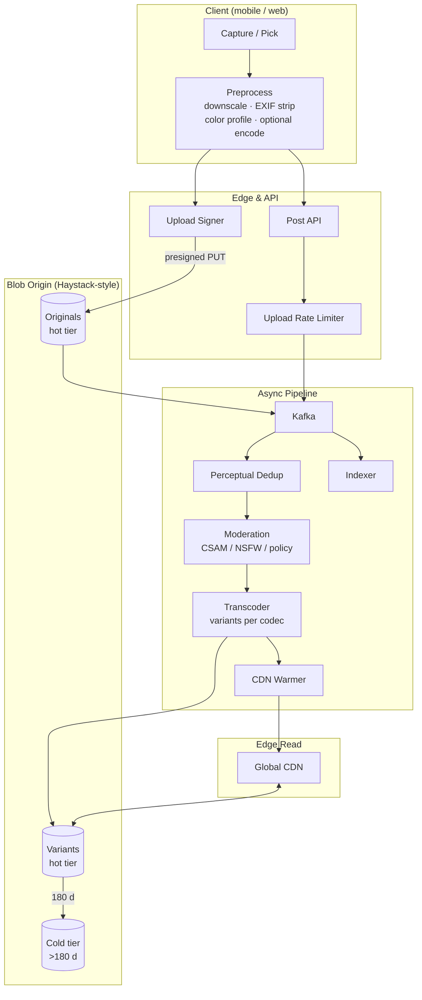
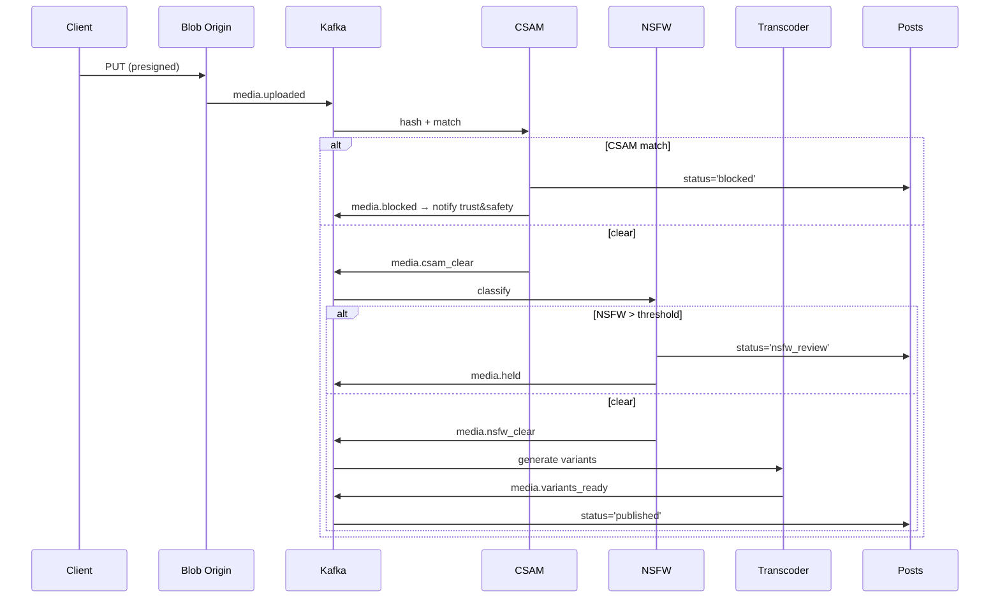
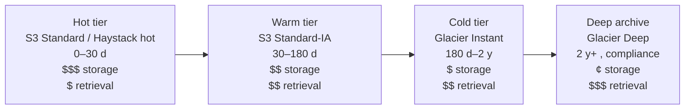

# Instagram Deep Dive — Photo Upload Pipeline

**Date:** 2026-04-29 | **Updated:** 2026-04-29
**Tags:** `system-design` `case-study` `instagram` `deep-dive` `media` `storage`

## Table of Contents

- [Summary](#summary)
- [Overview — From Tap to Published](#overview--from-tap-to-published)
- [Direct Upload via Presigned URLs](#direct-upload-via-presigned-urls)
- [Derivative Generation — Sizes, Codecs, Eager vs Lazy](#derivative-generation--sizes-codecs-eager-vs-lazy)
- [Resumable Uploads — TUS and S3 Multipart](#resumable-uploads--tus-and-s3-multipart)
- [Client-Side Preprocessing](#client-side-preprocessing)
- [Moderation Gate — NSFW, CSAM, Policy Classifiers](#moderation-gate--nsfw-csam-policy-classifiers)
- [Perceptual Deduplication](#perceptual-deduplication)
- [Metadata Handling — EXIF, Color Profiles, Timestamps](#metadata-handling--exif-color-profiles-timestamps)
- [Format Choice — HEIC, JPEG, WebP, AVIF](#format-choice--heic-jpeg-webp-avif)
- [CDN Warming on Publish](#cdn-warming-on-publish)
- [Storage Tiering — Hot, Warm, Cold](#storage-tiering--hot-warm-cold)
- [Anti-Patterns](#anti-patterns)
- [Related](#related)
- [References](#references)

## Summary

Instagram's photo upload looks like one button on the client and is actually a fan-out of seven loosely-coupled subsystems behind it: **direct-to-blob upload**, **derivative generation**, **moderation classifiers**, **deduplication**, **metadata sanitization**, **CDN warming**, and **storage tiering**. The hard requirements are not throughput per se — they are (a) the user sees "Posted" in under two seconds, (b) bytes never traverse the application tier, (c) the image is never publicly readable until CSAM and NSFW classifiers clear, and (d) every variant the client might request later is either pre-built or generatable in tens of milliseconds at the edge. This deep dive expands the pipeline introduced in [`../design-instagram.md`](../design-instagram.md), pulls in the storage primitives from [`../../../building-blocks/object-and-blob-storage.md`](../../../building-blocks/object-and-blob-storage.md), and contrasts photo handling with the chat-shaped media flow in [`../../real-time/whatsapp/media-handling.md`](../../real-time/whatsapp/media-handling.md).

## Overview — From Tap to Published

The single most important architectural decision is to **decouple ingest from publish**. The user-perceived "upload" finishes when bytes land in the blob store and a `posts` row exists with `status='processing'`. Everything else — transcoding, moderation, dedup, fanout — runs asynchronously and produces a state transition to `published` when the post is actually safe and ready.



Step ordering at a glance:

1. **Client preprocesses** — rotate per EXIF, downscale to ~2048 px max, strip GPS, normalize color profile, optionally encode HEIC → JPEG/AVIF.
2. **Client requests an upload URL** — `POST /v1/media/upload-url` returns a short-lived presigned PUT (or a multipart/TUS handle for large uploads).
3. **Client PUTs the bytes** directly to the blob origin. App tier never sees them.
4. **Client posts metadata** — `POST /v1/posts` with `media_handle`, caption, location. API returns `202 Accepted` with `status='processing'`.
5. **Async stages run on Kafka events** — perceptual hash → dedup check → moderation → transcode variants → index → fanout (covered in [`feed-generation.md`](./feed-generation.md)).
6. **Publish event fires** when moderation clears; `status` flips to `published`; CDN warmers prepare the most-requested variants in the user's home region.

The two-second user perception is bought entirely by step 4: the post exists in the database before any heavy work runs.

## Direct Upload via Presigned URLs

Bytes never traverse the application tier. The pattern is generic to S3-class systems and is the foundation of object storage design — see [`../../../building-blocks/object-and-blob-storage.md#presigned-urls--offloading-upload-and-download`](../../../building-blocks/object-and-blob-storage.md#presigned-urls--offloading-upload-and-download) for the underlying mechanics.

### The Upload Signer Service

A stateless service whose only job is to mint signed URLs. It enforces:

- **Scope** — bucket and key prefix. Keys are namespaced: `originals/{user_id}/{yyyy-mm-dd}/{ulid}`.
- **Method** — PUT only. Never `s3:*`.
- **TTL** — 5 minutes. Long enough for a 4G mobile upload of a ~5 MB photo; short enough that a leaked URL is useless within the hour.
- **Content-Type pin** — `image/jpeg`, `image/heic`, `image/heif`, `image/webp` only. A leaked URL cannot upload arbitrary blobs.
- **Content-Length range** — 1 byte to 50 MiB for photos. Stories cap lower. Enforced via signed headers / POST policy `content-length-range`.

```ts
// Upload signer — TypeScript / AWS SDK v3
const ALLOWED_TYPES = new Set(["image/jpeg", "image/heic", "image/heif", "image/webp"]);
const MAX_PHOTO_BYTES = 50 * 1024 * 1024;
const PRESIGN_TTL_S = 300;

export async function presignPhotoUpload(req: {
  userId: string; contentType: string; contentLength: number;
}) {
  if (!ALLOWED_TYPES.has(req.contentType)) throw new Error("unsupported content type");
  if (req.contentLength <= 0 || req.contentLength > MAX_PHOTO_BYTES)
    throw new Error("content length out of range");

  const key = `originals/${req.userId}/${new Date().toISOString().slice(0, 10)}/${ulid()}`;
  const url = await getSignedUrl(s3, new PutObjectCommand({
    Bucket: "ig-media-prod",
    Key: key,
    ContentType: req.contentType,
    ContentLength: req.contentLength,
    ServerSideEncryption: "aws:kms",
    SSEKMSKeyId: process.env.MEDIA_KMS_KEY_ID,
  }), { expiresIn: PRESIGN_TTL_S });

  return { uploadUrl: url, mediaHandle: key, expiresIn: PRESIGN_TTL_S };
}
```

### Replay Protection

A presigned URL is itself a credential. Defense in depth:

- **Short TTL** (5 min). The dominant control.
- **Single-use semantics enforced server-side.** S3 does not enforce this; the API does — once `POST /v1/posts` consumes a `media_id`, mark it `consumed` and reject subsequent references.
- **Key opaqueness.** Keys include a ULID; prefix guesses get nothing actionable.
- **Per-user key prefix.** A leaked URL can only PUT under that user's prefix.
- **Client-bound nonce.** The signed URL embeds a nonce in `x-amz-meta-nonce`; the post API requires the same value.

### Rate Limiting at the Upload Endpoint

Two distinct surfaces, two distinct limits:

| Surface | Limit | Why |
|---------|-------|-----|
| `POST /v1/media/upload-url` | per-user: 30/min, per-IP: 120/min | Cap URL minting; URL minting is cheap but enables abuse if unbounded |
| `PUT <presigned-url>` (S3) | per-prefix: implicit S3 partition budget | Bucket policy + key design spread load; see [object storage hot partitions](../../../building-blocks/object-and-blob-storage.md#throughput-and-hot-partitions) |
| `POST /v1/posts` | per-user: 10/min, with burst | Real publishing rate; bots that get past upload-url die here |

Use a **token bucket** in Redis keyed by `user_id`. On exceed, return `429` with `Retry-After`. Rate-limit error responses must not leak internal state — same body for "you're throttled" and "your account is suspect."

### Origin Bucket Layout

```text
ig-media-prod/
├── originals/{user_id}/{date}/{ulid}              # raw upload
├── variants/{user_id}/{date}/{ulid}/{tier}/{codec}.{ext}
│   ├── tier ∈ { thumb-150, feed-480, full-1080, hd-1440 }
│   └── codec ∈ { jpeg, webp, avif }
└── stories/{user_id}/{date}/{ulid}                # 24h TTL via lifecycle
```

Two reasons to keep originals separate from variants:

1. **Lifecycle policy isolation.** Originals can move to cold storage at 90 days; variants stay hot longer because that is what the CDN re-fetches.
2. **Blast-radius isolation.** A bug in the variant generator that overwrites variants does not touch the original; you can re-derive.

## Derivative Generation — Sizes, Codecs, Eager vs Lazy

Each upload produces a **matrix** of output objects: tiers × codecs.

### The Tier Matrix

| Tier | Long edge (px) | Surface | Notes |
|------|---------------|---------|-------|
| `thumb-150` | 150 | Profile grid, comments avatar of post | Square crop; very high request rate |
| `feed-480` | 480 | Story tray previews, low-DPR phones, slow networks | The default for cellular |
| `full-1080` | 1080 | Feed image on high-DPR phones, single-post view | The "main" variant; ~70% of bytes served |
| `hd-1440` | 1440 | Lightbox / pinch-zoom | Lazily generated for older posts |

### The Codec Matrix

For each tier, generate at minimum:

- **JPEG** — universal fallback, every browser, every device.
- **WebP** — broadly supported (Safari 14+, all evergreen browsers, all in-app webviews on modern Android/iOS). Roughly 25–35% smaller than JPEG at equivalent perceived quality.
- **AVIF** — broadest gains (often 50% smaller than JPEG for photos), supported in Chrome since 85, Firefox since 93, Safari since 16. Generation cost is significantly higher than WebP/JPEG.

Format negotiation is handled at request time via `Accept` headers and the API's variant URL builder, never by the client picking a URL. See [Format Choice](#format-choice--heic-jpeg-webp-avif).

### Eager vs Lazy Generation

Two extremes; production uses a hybrid.

- **Eager (generate everything on publish)** — every tier × codec is built before `post.published` fires. Pros: every read is a cache hit. Cons: ~12 outputs per upload, bursty CPU cost, much of the work is wasted (HD-AVIF for a post that gets 3 views).
- **Lazy (generate on first request)** — the CDN origin runs a small derivative service that reads the original on miss, generates the requested variant, writes it back, and serves it. Pros: pay only for what's viewed. Cons: first-request latency spike on cold variants; trickier ops.

**Hybrid policy used in practice:**

| Variant | Strategy |
|---------|----------|
| `feed-480` JPEG, WebP | Eager — every upload, every codec. Highest cache hit rate. |
| `full-1080` JPEG, WebP | Eager — main consumption tier. |
| `thumb-150` JPEG, WebP | Eager — profile grid is rendered for every visit. |
| `*` AVIF | Lazy — generate on first request from a browser advertising `image/avif`. Cache for 1 year. |
| `hd-1440` (any codec) | Lazy — only generated if the user pinch-zooms the lightbox. |

The lazy generator must be **idempotent** and use **content-addressed output keys** (hash of `original_id + tier + codec + processing-version`) so concurrent requests cannot produce conflicting bytes. Use a singleflight pattern: per-key mutex in Redis with a short TTL deduplicates concurrent generation requests.

### Transcoder Architecture

Transcoders are stateless workers consuming a Kafka topic `media.uploaded`. Each worker:

1. Pulls a job (deduped by `media_id`).
2. Reads the original from blob storage (often via a regional cache to avoid cross-region pulls).
3. Decodes once into a normalized intermediate (linear-light RGB at the source resolution).
4. Generates each tier with a high-quality downscale filter (Lanczos-3 or similar; see FFmpeg `scale` documentation).
5. Encodes per codec; writes to blob storage with the content-addressed key.
6. Publishes `media.variants.ready` with the variant manifest.

Use **libvips** for the JPEG/WebP path (it's much faster than ImageMagick and uses constant memory), and **libavif** or FFmpeg with `libaom` for AVIF.

```bash
# Reference encode — feed-480 WebP from a JPEG original
vips thumbnail original.jpg feed-480.webp[Q=80,strip] 480

# Reference encode — full-1080 AVIF via FFmpeg
ffmpeg -i original.jpg -vf scale=-1:1080:flags=lanczos \
  -c:v libaom-av1 -still-picture 1 -crf 30 -b:v 0 \
  -cpu-used 6 full-1080.avif
```

Throughput tuning:

- **Right-size the worker pool.** AVIF encoding at HD is 10–30× slower than WebP; size the AVIF pool independently or it starves the JPEG/WebP path.
- **Pin codec libraries.** A point-release of `libaom` can change output bytes — your content-addressed keys break and the cache fragments. Pin versions and bake them into the `processing-version` portion of the key.
- **Bound retries.** A poison original (corrupted upload) should be quarantined after 3 failed attempts and the `posts` row marked `failed_processing`.

## Resumable Uploads — TUS and S3 Multipart

For photos (≤50 MiB on a 4G uplink with bursts), a single PUT is fine ~95% of the time. For videos and Reels, **resumable uploads are required** — a 200 MB upload over a flaky cellular link will not survive a single TCP reset.

Two viable protocols.

### S3 Multipart Upload

The native AWS protocol; the canonical reference is in [object storage building block](../../../building-blocks/object-and-blob-storage.md#multipart-upload--chunking-parallelism-resumability). Three phases:

1. `CreateMultipartUpload` → `uploadId`.
2. `UploadPart` × N (in parallel, 5 MiB to 5 GiB per part).
3. `CompleteMultipartUpload` with the part list.

Recovery: `ListParts` returns what's already uploaded; client resumes missing parts. Cleanup: lifecycle rule that aborts incomplete uploads after 7 days.

Pros: native to S3, no proxy needed. Cons: requires the client to speak the S3 protocol exactly, awkward for browsers behind corporate proxies that buffer the whole part.

### TUS (`https://tus.io/`)

A protocol-level standard for resumable HTTP uploads. The client speaks TUS; a TUS server accepts chunks and translates to the native blob protocol (S3 multipart, append, etc.).

```text
POST /uploads                              → 201 Location: /uploads/abc123
  Tus-Resumable: 1.0.0
  Upload-Length: 209715200

PATCH /uploads/abc123                      → 204  Upload-Offset: 5242880
  Upload-Offset: 0
  Content-Type: application/offset+octet-stream
  <bytes>

# Resume after disconnect
HEAD /uploads/abc123                       → 200  Upload-Offset: 5242880
```

Pros: small spec, language-agnostic, browser-friendly. Cons: needs a TUS server; you can't presign a TUS upload directly to S3.

### Picking the Protocol

| Workload | Protocol |
|----------|----------|
| Photos ≤ 25 MiB | Single presigned PUT |
| Photos 25–50 MiB | Single presigned PUT with optional multipart fallback after 1 failure |
| Reels / videos > 100 MiB | TUS (browser web), or app-side S3 multipart with presigned per-part URLs |
| Background batch upload (desktop) | S3 multipart for parallelism |

Instagram-class apps typically use **app-side S3 multipart** (the mobile SDK speaks S3 directly) and **TUS for the web client** to keep the protocol surface small in the browser.

### Per-Part Presigning

If the app speaks multipart but cannot hold AWS credentials, the API mints a presigned URL **per part**:

```text
POST /v1/uploads/start                     → { uploadId, key }
POST /v1/uploads/{uploadId}/parts/{n}/url  → { url, expiresIn: 600 }
PUT  <url>                                 # part bytes go directly to S3
POST /v1/uploads/{uploadId}/complete       # body: [{ partNumber, etag }, ...]
  → { mediaHandle }
```

Per-part TTL can be longer (10 min) since each URL is scoped to one part number on one upload ID.

## Client-Side Preprocessing

The client does work before the upload — for both UX and architectural reasons.

### Resize Down to a Sensible Maximum

Modern phone cameras shoot at 12–48 MP (≈4032×3024 to 8064×6048). The largest variant Instagram serves is `hd-1440` — uploading a 48 MP source is 30× wasted bytes. Standard policy:

- **Photos**: resize to 2048 × 2048 max (so the post can still be re-derived to HD-1440 with detail), JPEG quality 85 or HEIC quality equivalent.
- **Stories**: resize to 1080 × 1920 max — they're never displayed larger.

The downscale uses the OS-native image API (Core Image on iOS, Bitmap on Android, OffscreenCanvas in browsers) — these are GPU-accelerated and sub-100 ms even on mid-range hardware.

### Strip EXIF Before Upload

The client strips:

- **GPS coordinates** — leaking these is a P0 privacy incident (see [Metadata Handling](#metadata-handling--exif-color-profiles-timestamps)).
- **Device model and serial fields** — fingerprinting risk.
- **Original timestamps** — kept on the client only, used for the optional "taken at" overlay.

The server *also* strips on derivative generation; client-side strip is defense in depth. Two layers prevent leaks if either side has a bug.

### Color Profile Normalization

Phone cameras shoot in **Display P3** (iPhone) or **sRGB** (most Android). Pushing a P3 file to a browser that does not honor color profiles will display oversaturated. Two strategies:

- **Convert to sRGB on the client** — simplest, smallest variant pipeline.
- **Preserve the profile and tag every variant** — best fidelity on color-managed surfaces, requires the variant pipeline to embed the ICC profile in every output.

Instagram's photo pipeline preserves Display P3 in originals and emits variants with an embedded ICC profile; non-color-managed clients see slightly desaturated output, color-managed clients see correct color.

### Optional Client-Side Encode

iPhones store photos as **HEIC** by default (HEVC for video, HEIF for stills). HEIC decode is universal on Apple devices but absent in many web browsers. Two options:

1. **Upload HEIC; transcode to JPEG/WebP/AVIF server-side** — keeps the original at maximum fidelity, server pays the decode cost.
2. **Encode HEIC → JPEG on the client** — smaller upload, broader compatibility, but loses the HEIC's 10-bit color depth.

Production pattern: upload HEIC unchanged when possible (AWS S3 and most CDNs handle the bytes fine; only the variant pipeline needs a HEIC-capable decoder), let the server handle the codec dance. The `feed-480` WebP variant is what almost every consumer ends up reading.

## Moderation Gate — NSFW, CSAM, Policy Classifiers

Moderation is the single largest source of upload-pipeline complexity. Instagram cannot let an image be publicly readable until it has cleared at least two synchronous classifiers.

### Why Pre-Upload, Not Pre-Publish

For the **NSFW classifier**, the gate runs on the original blob *after* upload but *before* `post.published`. The post row is created with `status='processing'` and is invisible to followers; the author can see it on their profile (a deliberate UX choice — if the author saw nothing, they would re-upload, doubling load).

For **CSAM**, the gate runs synchronously against PhotoDNA-style hash matches. Hashes are cheap (microseconds) and catch known bad media at the boundary before any other work is wasted.



### Latency Budgets

| Stage | Budget | What slips when it slips |
|-------|--------|--------------------------|
| CSAM hash | < 50 ms | Whole pipeline; this is on the critical path |
| NSFW classifier | < 500 ms p99 | Author waits for "Posted"; budget capped at 2 s overall |
| Async policy classifiers (hate, harassment, self-harm) | seconds–minutes | Post is already published; if classifier flags later, it's removed retroactively |
| Behavioral signals | minutes | De-amplification happens silently; user not blocked |

The **2-second perceived budget** is bought by returning `202 Accepted` immediately; the classifiers run after the response. The author's own profile shows the post optimistically. Followers see nothing until the classifiers clear and fanout writes their inbox rows.

### Quarantine States

The `posts.status` field is a small state machine:

```text
processing → published       (happy path, ~hundreds of ms after upload)
processing → nsfw_review     (held; manual review queue; author sees own post)
processing → blocked         (CSAM hash hit; author notified; account flagged)
processing → failed          (transcode error after retries)
published  → removed         (post-publish retroactive moderation)
```

The state machine is idempotent: every transition is a deterministic function of the prior state and an event, so the consumer of `media.*` topics can replay safely.

### Moderation Cost Discipline

Heavy classifiers are expensive in GPU time. To keep cost bounded:

- **Run the cheap classifier first** (CSAM hash), gate the expensive one (NSFW model) on its result.
- **Batch GPU inference.** Most NSFW models are throughput-bound; serve them through a batching server (Triton, TorchServe, or in-house) that aggregates requests from the Kafka consumer for 5–10 ms.
- **Cache classifier results by perceptual hash.** A duplicate of an already-cleared image gets the prior classifier verdict for free — see [Perceptual Deduplication](#perceptual-deduplication).
- **Sample, don't gate, the long-tail classifiers.** Hate/harassment classifiers run on a sample of new posts plus all reported posts; they are not in the publish gate.

## Perceptual Deduplication

Two distinct dedup goals:

1. **Save storage** — if user A and user B upload the same meme, store one copy.
2. **Save moderation cost** — if the same image was cleared an hour ago, don't re-run the classifier.

Cryptographic hashes (SHA-256) only catch **byte-identical** duplicates, which is rare for photos because every recompression and EXIF strip changes the bytes. Perceptual hashes match on **visual** similarity.

### Perceptual Hash Algorithms

- **dHash (difference hash)** — resize to 9×8 grayscale, compare adjacent pixel intensities, emit 64-bit hash. Cheap, robust to resize.
- **pHash (DCT)** — 2D DCT of an 8×8 grayscale, threshold against the mean, emit 64-bit hash. More robust to color shifts.
- **wHash** — wavelet-based; robust to many edits; slightly more expensive.
- **CNN embeddings** — 256-D float vector from a trained network; ANN-indexed. Used at the high end (catches more sophisticated edits like crops and filters).

Two-tier strategy:

1. **Hot path** — pHash (64-bit) computed on every upload. Lookup against a Redis set keyed by hash with Hamming distance ≤ 6 considered a match.
2. **Cold path** — CNN embedding indexed in a vector store (e.g., FAISS, Milvus). Used by the moderation team to find near-duplicate violations across the platform.

### Storage Dedup vs Reference Counting

If two users upload the same image:

- **The originals are stored twice** — by user — for blast-radius isolation (one user's deletion or moderation event must not affect the other's copy).
- **The variants can be shared** — they are content-addressed by a hash of `(original-content-hash, tier, codec)`. Two visually-identical originals collapse to one variant set after canonical encode.

Reference counting on shared variants is necessary for safe deletion: a `variant_refs` row maps `variant_key → set(post_id)`. A delete decrements the count; only when the count hits zero is the variant scheduled for deletion (and even then, with a delay, in case of restore).

### Avoiding the Dedup Trap

Aggressive dedup fights moderation. Counterexamples to design around:

- **An image cleared for one user is not necessarily cleared for another.** Context matters (caption, audience, account history). Cache the *image-level* moderation verdict, not the *post-level* one.
- **Different filters and crops are intentionally different posts** — pHash with too-tight a threshold collapses legitimate variants. Tune Hamming threshold conservatively (≤6 of 64 bits).
- **Stories are not deduped.** They expire in 24 h; the engineering cost is not worth the savings.

## Metadata Handling — EXIF, Color Profiles, Timestamps

The client uploads with full EXIF; the public-facing variants carry **none**. The server is the trust boundary.

### What Server-Side Strip Removes

- **GPS** — `GPSLatitude`, `GPSLongitude`, `GPSAltitude`, `GPSTimeStamp`. Always.
- **Device fingerprints** — `Make`, `Model`, `SerialNumber`, `LensSerialNumber`. Always.
- **Original timestamps in the EXIF tree** — `DateTimeOriginal`, `CreateDate`. Replaced with the post's `created_at`.
- **Author identifiers** — `Artist`, `Copyright`, `OwnerName`. Replaced with platform-controlled values or removed.
- **Software fingerprints** — `Software`, `HostComputer` — fingerprinting risk.

### What Server-Side Strip Preserves

- **Orientation** — applied to the pixels then stripped; the variant is already-rotated, no reader needs the tag.
- **Color profile (ICC)** — preserved in the variant for color fidelity.
- **Width and height** — informational; not sensitive.

### What Server Stores Internally

The originals bucket retains the unstripped EXIF for a bounded window — typically 30 days — for moderation investigations and retroactive sweeps. After 30 days, originals are rewritten with the stripped EXIF as part of the cold-tier transition. The retention policy is a deliberate balance: short enough to satisfy GDPR data-minimization principles, long enough to investigate reports.

### Location From EXIF — Opt-In Only

If the user explicitly tags a location ("Hanoi, Vietnam" via the location picker), that's a **categorical place**, not a GPS coordinate. The server stores `location_id` (a foreign key into a curated places database), never raw lat/lon from EXIF. The client may *suggest* a location based on EXIF GPS, but the server never receives the raw GPS.

Two architectural reasons this matters:

- **Privacy.** Categorical places are coarse; GPS is precise.
- **Disambiguation.** "Central Park" is one place; ten cameras report ten slightly different GPS coordinates. The categorical model collapses them to one entity that other surfaces (location pages, map view) can index against.

### Color Profiles Across the Pipeline

Pipeline rule: **decode once into a wide-gamut linear-light space, transform on encode, embed the destination profile in every output**.

- Decode HEIC P3 → linear-light P3 → emit variants with embedded P3 profile.
- Decode sRGB JPEG → linear-light sRGB → emit variants with embedded sRGB profile.

Never strip the ICC profile on output; some clients render incorrectly without it. The bytes cost is small (~3 KB per variant for a Display P3 profile).

## Format Choice — HEIC, JPEG, WebP, AVIF

The format matrix is a function of (a) which formats the *origin* accepts as input, and (b) which formats the *variants* are emitted in. They are not the same.

### Input Formats Accepted

| Format | Status | Notes |
|--------|--------|-------|
| JPEG | Universal | All clients can produce |
| HEIC / HEIF | Default on iOS | Smaller than JPEG at equal quality; needs server-side decode (libheif) |
| WebP | Some Android cameras | Server decodes via libvips/libwebp |
| AVIF | Increasingly | Server decodes via libavif/FFmpeg |
| PNG | Accepted | Re-encoded to JPEG/WebP for storage; rare for photos |

### Output Variant Formats

The **negotiation** happens at the variant URL builder, which inspects the request `Accept` header (or, for native apps, the explicit `format` parameter the SDK sets based on device capability):

```text
Accept: image/avif,image/webp,image/*  → emit AVIF if available, else WebP, else JPEG
Accept: image/webp,image/*             → emit WebP if available, else JPEG
Accept: image/*                        → JPEG fallback
```

The CDN handles the negotiation via `Vary: Accept` — but `Vary: Accept` shatters cache hit rate (every distinct `Accept` string is a new cache key). Production pattern: the CDN normalizes `Accept` to one of three buckets — `avif`, `webp`, `jpeg` — and varies on that, not on the raw header. Cloudflare, Fastly, and CloudFront all support this with edge functions.

### Browser / Device Matrix (As of 2026)

| Format | iOS Safari | Android Chrome | Desktop Chrome | Desktop Firefox | Desktop Safari | IE / Old Edge |
|--------|------------|----------------|----------------|-----------------|----------------|----------------|
| JPEG | ✓ | ✓ | ✓ | ✓ | ✓ | ✓ |
| WebP | ✓ (iOS 14+) | ✓ | ✓ | ✓ | ✓ (14+) | ✗ |
| AVIF | ✓ (iOS 16+) | ✓ (Chrome 85+) | ✓ | ✓ (93+) | ✓ (16.4+) | ✗ |
| HEIC/HEIF (display) | ✓ | partial | ✗ | ✗ | ✓ (17+) | ✗ |

HEIC is **not** served as a public variant — too narrow support. It only exists as an upload format.

### Quality Settings

These are reasonable defaults; tune empirically.

| Tier | JPEG | WebP | AVIF |
|------|------|------|------|
| `thumb-150` | q=85 | q=80 | crf=32 |
| `feed-480` | q=82 | q=78 | crf=30 |
| `full-1080` | q=80 | q=75 | crf=28 |
| `hd-1440` | q=80 | q=75 | crf=27 |

AVIF at `crf=28` is roughly perceptually equivalent to JPEG at `q=80` and ~50% smaller. The savings are real but the encode cost is high — AVIF is the strongest argument for **lazy generation** of HD tiers.

## CDN Warming on Publish

A new post is most-read in the first hour after publish. If the first reader misses the CDN cache, that miss propagates to N concurrent reads (cache stampede), each pulling from the regional shield. CDN warming pre-populates the edge before the post goes public.

### Warming Strategy

When `post.published` fires:

1. The publisher emits a `cdn.warm` Kafka event with the variant manifest and the author's geographic locality (derived from the author's home region).
2. CDN warmer workers in the **author's home region** issue HEAD requests against the CDN with the variants the author's followers are most likely to fetch:
   - `feed-480` JPEG and WebP — the dominant feed tier.
   - `full-1080` JPEG and WebP — single-post view.
3. Warmers in **secondary regions** are triggered by the fanout pipeline. When a follower's `feed_inbox` row is written in region `eu-west-1`, a regional warmer ensures the variants are present at that region's edge.

The HEAD request is enough to populate the cache (CDN fetches from origin, stores at edge). The warmer never reads the bytes — just primes the cache.

### Selective Warming

Warming every variant for every post would multiply load and waste cache space. Heuristics for what to warm:

- **Author tier.** Verified or high-follower accounts get all tiers warmed in all regions; low-follower accounts get only the home region warmed.
- **Time of day.** Posts published during a region's peak hours warm more aggressively.
- **Predicted reach.** A small ML model predicts post-1h impressions; high-prediction posts get aggressive warming.

### Why This Matters

Without warming, the first reader's experience is:

```text
Client → CDN edge (miss) → regional shield (miss) → blob origin
        ~150 ms          + 50 ms                 + 100 ms = 300 ms+
```

With warming, both edge and shield are pre-populated:

```text
Client → CDN edge (hit) = 30 ms
```

For a feed scroll of 20 posts, that's 5.4 s of saved time. CDN warming is the cheapest 10× latency improvement in the system.

## Storage Tiering — Hot, Warm, Cold

Photos have a **brutally skewed read distribution**: a post is read most in the first 24 hours, frequently in the first week, occasionally in the first month, almost never after a year. Tiering matches storage cost to access pattern.



### The Tiering Policy

| Object class | Hot | Warm (IA) | Cold (Glacier IR) | Deep |
|--------------|-----|-----------|-------------------|------|
| Originals | 0–30 d | 30–180 d | 180 d – 2 y | 2 y+ |
| Variants | 0–90 d | 90–365 d | 365 d – 2 y | (rebuild) |
| Stories | 24 h | (deleted) | (deleted) | (deleted) |
| Profile photos | indefinite hot | — | — | — |

Two design subtleties:

- **Profile photos never tier.** They're requested constantly (every comment, every story tray). Keeping them hot is cheaper than the retrieval cost of a tier transition.
- **Old variants are deleted, not archived.** A 3-year-old post is rarely viewed; if it *is* viewed, the variant is regenerated lazily from the warm-tier original. Storing 12 codec/tier outputs per post forever is wasteful.

### Retrieval Latency by Tier

The user-facing read path always hits hot tier (via the CDN). Reads that *miss* the hot tier are rare and have a budget:

| Source | First-byte | Notes |
|--------|------------|-------|
| CDN edge (hot) | < 50 ms | 99% of reads |
| Hot origin | < 200 ms | Edge miss; regenerate variant if needed |
| Warm (IA) | < 500 ms | Same latency as hot in S3; cost difference is in storage and retrieval price |
| Cold (Glacier IR) | seconds | Acceptable for "old post lightbox" |
| Deep archive | hours | Only for compliance / legal hold restores |

### Lifecycle Rules

```json
{
  "Rules": [
    { "ID": "originals-tiering", "Status": "Enabled",
      "Filter": { "Prefix": "originals/" },
      "Transitions": [
        { "Days": 30,  "StorageClass": "STANDARD_IA" },
        { "Days": 180, "StorageClass": "GLACIER_IR" },
        { "Days": 730, "StorageClass": "DEEP_ARCHIVE" }
      ]
    },
    { "ID": "variants-tiering", "Status": "Enabled",
      "Filter": { "Prefix": "variants/" },
      "Transitions": [
        { "Days": 90,  "StorageClass": "STANDARD_IA" },
        { "Days": 365, "StorageClass": "GLACIER_IR" }
      ],
      "Expiration": { "Days": 1095 }
    },
    { "ID": "stories-expire", "Status": "Enabled",
      "Filter": { "Prefix": "stories/" }, "Expiration": { "Days": 1 } },
    { "ID": "abort-incomplete-mpu", "Status": "Enabled", "Filter": { "Prefix": "" },
      "AbortIncompleteMultipartUpload": { "DaysAfterInitiation": 7 } }
  ]
}
```

### Tiering Pitfalls

- **Minimum storage durations.** IA bills a minimum of 30 days; Glacier IR a minimum of 90 days. Transitioning data that gets deleted soon costs *more* than leaving it in Standard.
- **Retrieval fees.** Glacier IR charges per-GB retrieved; an old post going viral in a "throwback" thread can produce a surprise bill. Mitigation: when the post's recent-engagement signal climbs, an ML rule promotes it back to hot.
- **Lifecycle latency.** Lifecycle rules are evaluated daily; transitions are not real-time. Don't depend on a same-day promotion.

## Anti-Patterns

| Anti-pattern | Why it hurts | Fix |
|--------------|--------------|-----|
| **Bytes through the API** | Every upload buffers in your app process; throughput = your app's bandwidth | Presigned URLs to direct-to-blob |
| **Synchronous moderation in the publish path** | Author waits for the slowest classifier; pipeline tail latency dominates | Async with `status='processing'`; author sees own post optimistically |
| **No EXIF strip server-side** | One client bug leaks GPS for every user on that release | Strip server-side as the trust boundary, even if client also strips |
| **Eagerly generate every codec × tier on publish** | 10–12 outputs per upload; AVIF dominates CPU; most outputs are never read | Eager for top 3–4 hot variants; lazy for AVIF and HD |
| **Cryptographic-hash dedup for "same photo"** | Misses every recompressed or re-EXIF'd duplicate; defeats the goal | Perceptual hash (pHash/dHash) with conservative Hamming threshold |
| **Sharing moderation verdicts across users** | An image cleared for one context may not be cleared for another | Cache image-level signals; re-evaluate context per post |
| **`Vary: Accept` on every variant** | Cache hit rate collapses; same image cached under N `Accept` strings | Normalize `Accept` to {avif, webp, jpeg} buckets at the edge |
| **Long-TTL presigned URLs** | A leaked URL is valid for hours; replay is trivial | TTL 5 min; consume-once enforcement at the post-creation step |
| **Public-read buckets for media** | Hot-linking, scraping, no revocation, surprise egress bills | Block Public Access on; signed CDN URLs only |
| **Per-tier separate originals** | Wastes blob storage; loses the ability to re-derive | One canonical original per upload; variants are derivative |
| **No abort-incomplete-MPU lifecycle rule** | Failed uploads silently bill forever | 7-day abort rule on every multipart-capable bucket |
| **Hardcoded variant URLs in the API response** | Locks the format matrix; can't add AVIF without a client release | Return logical tiers (`thumb`, `feed`, `full`); CDN picks the codec at the edge |
| **One global rate-limit bucket** | Burst from a single user kills the whole tenant | Per-user + per-IP token buckets; burst allowances |
| **Storing raw GPS in the location_id field** | Privacy disaster waiting to happen | Categorical places only; raw GPS never crosses the upload API |
| **Warming every variant in every region** | Multiplies cache footprint; thrashes regional shields | Warm by author tier, region, predicted reach |
| **Treating the variant cache as the source of truth** | A cache eviction means the post is broken | Originals are the source; variants are regenerable from originals |

## Related

- [`../design-instagram.md`](../design-instagram.md) — the parent case study and the upload pipeline's place in the broader architecture.
- [`./feed-generation.md`](./feed-generation.md) — what happens after `post.published` fires (fanout, ranking, hybrid pull/push).
- [`../../../building-blocks/object-and-blob-storage.md`](../../../building-blocks/object-and-blob-storage.md) — the storage primitive: presigned URLs, multipart, lifecycle, consistency.
- [`../../real-time/whatsapp/media-handling.md`](../../real-time/whatsapp/media-handling.md) — contrast: chat-shaped media (E2E encrypted, ephemeral, peer-pull), not feed-shaped.
- [`../../../building-blocks/cdn-and-edge-caching.md`](../../../building-blocks/cdn-and-edge-caching.md) — the CDN tier in front of the variant blobs (if present in your tree).
- [`../design-tiktok.md`](../design-tiktok.md) — video-first analog with even heavier transcoding demands.

## References

- [Instagram Engineering — Optimizing photo storage at Instagram](https://instagram-engineering.com/optimizing-photo-storage-at-instagram-9f8d9d05bcae) — how Instagram stores and serves photos at scale; deduplication and storage tiering history.
- [Instagram Engineering — Pixel Perfect: Fighting non-retina images](https://instagram-engineering.com/pixel-perfect-fighting-non-retina-on-instagram-cf24c0ab57bc) — origin of the multi-tier variant strategy.
- [Meta Engineering — Powering Instagram's recommendations system](https://engineering.fb.com/2023/08/09/ml-applications/scaling-instagram-explore-recommendations-system/) — the ML pipeline that consumes variant impressions.
- [TUS — Open Protocol for Resumable File Uploads](https://tus.io/) — protocol specification, server implementations, browser SDK.
- [Amazon S3 Multipart Upload Overview](https://docs.aws.amazon.com/AmazonS3/latest/userguide/mpuoverview.html) — part sizes, limits, abort behavior.
- [Amazon S3 Presigned URLs](https://docs.aws.amazon.com/AmazonS3/latest/userguide/using-presigned-url.html) — signing, scope, security considerations.
- [Amazon S3 Lifecycle Configuration](https://docs.aws.amazon.com/AmazonS3/latest/userguide/object-lifecycle-mgmt.html) — transition and expiration rules.
- [MDN — AVIF image format](https://developer.mozilla.org/en-US/docs/Web/Media/Formats/Image_types#avif) — codec status, browser support, encoding parameters.
- [MDN — WebP image format](https://developer.mozilla.org/en-US/docs/Web/Media/Formats/Image_types#webp) — encoding parameters, lossless and animated variants.
- [MDN — HEIC / HEIF on the web](https://developer.mozilla.org/en-US/docs/Web/Media/Formats/Image_types#heif_high_efficiency_image_file_format) — browser support matrix.
- [FFmpeg Documentation](https://ffmpeg.org/documentation.html) — `scale`, `libaom`, `libvpx`, codec parameters.
- [libvips — fast image processing library](https://www.libvips.org/) — pHash, fast thumbnailing, low-memory pipelines.
- [Apple — HEIF and HEVC](https://developer.apple.com/videos/play/wwdc2017/513/) — HEIC encoding and metadata model.
- [Microsoft PhotoDNA](https://www.microsoft.com/en-us/photodna) — perceptual hash for known-bad media; the de facto CSAM detection primitive.
- [W3C — Image Resource Hints (`Accept` and `Vary`)](https://www.w3.org/TR/server-timing/) — content negotiation patterns for image variants.
