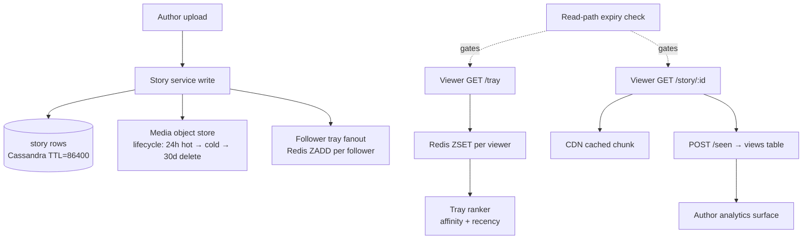
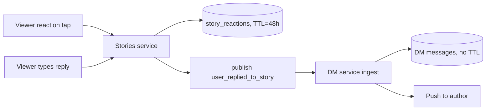
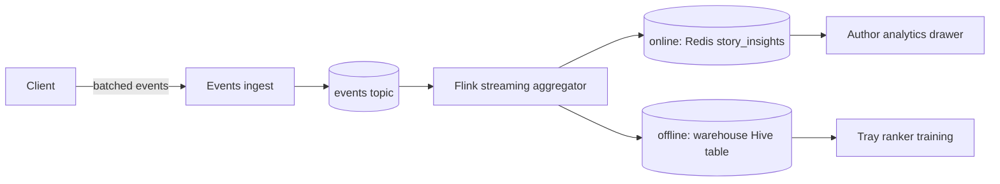
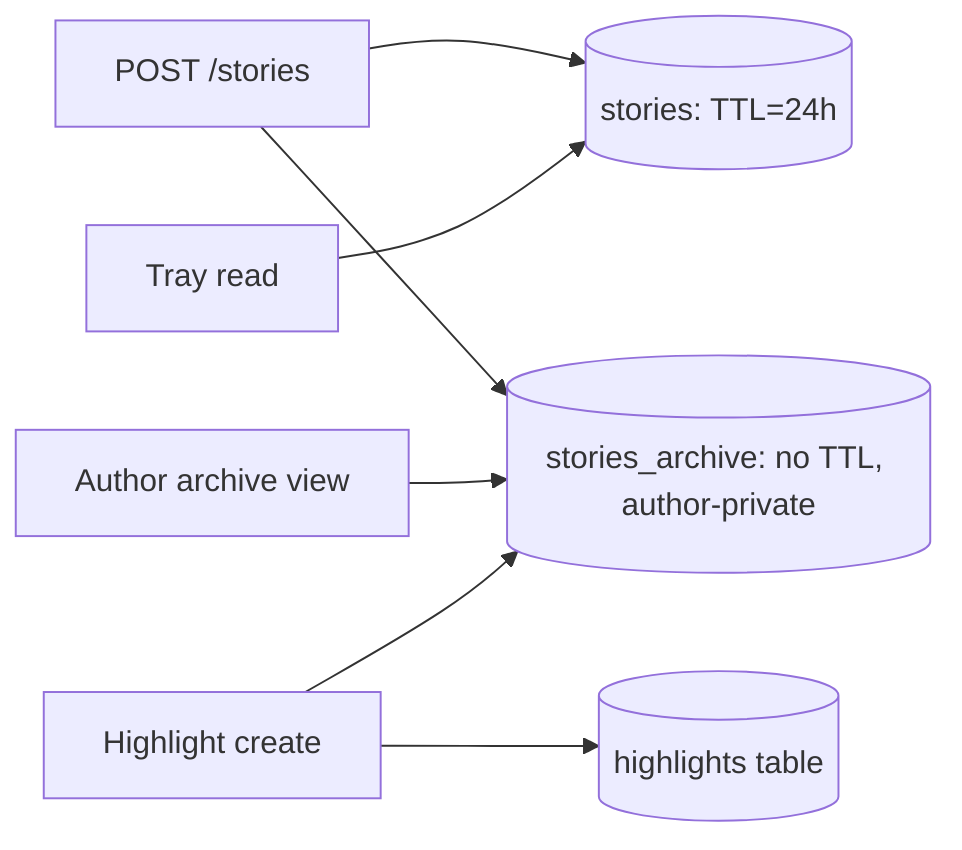

# Instagram Deep Dive — Stories (24-Hour TTL, Ephemeral Reads, and the Tray)

**Date:** 2026-04-29 | **Updated:** 2026-04-29
**Tags:** `system-design` `case-study` `instagram` `deep-dive` `ephemeral` `ttl`

## Table of Contents

- [Summary](#summary)
- [Overview](#overview)
- [24h TTL Semantics](#24h-ttl-semantics)
- [Ephemeral Reads](#ephemeral-reads)
- [Per-Viewer Tracking](#per-viewer-tracking)
- [Story Tray Ordering](#story-tray-ordering)
- [Interactions — Reactions, Replies, Quick DMs](#interactions--reactions-replies-quick-dms)
- [Highlights — Opt-In Archival](#highlights--opt-in-archival)
- [Story Chunks — Multi-Media Sequences](#story-chunks--multi-media-sequences)
- [Live vs Prerecorded Stories](#live-vs-prerecorded-stories)
- [Story Ads Injection](#story-ads-injection)
- [Analytics — story_view, exit_at, swipe_through](#analytics--story_view-exit_at-swipe_through)
- [Privacy — Close Friends List](#privacy--close-friends-list)
- [Archival vs Deletion](#archival-vs-deletion)
- [CDN TTL Alignment](#cdn-ttl-alignment)
- [Viewing-Count Aggregation and "Seen" Badge Consistency](#viewing-count-aggregation-and-seen-badge-consistency)
- [Anti-Patterns](#anti-patterns)
- [Related](#related)
- [References](#references)

## Summary

Stories look, on the surface, like "posts that disappear after a day." That framing is a trap. The parent case study notes it bluntly: Stories have a separate write path, a separate read path, a separate ranking model, and a separate storage policy from the permanent feed. The reason is that almost every interesting axis flips between the two surfaces. A feed post is read non-linearly, days after publish, with engagement clustered around a long tail. A story is watched in linear sequence within minutes of publish, by a tap-through rate close to 1.0, with a 24-hour visibility window enforced by the database itself.

This deep dive expands the parent's [Stories — 24-Hour TTL and Ephemeral Reads section](../design-instagram.md#3-stories--24-hour-ttl-and-ephemeral-reads) into the full design space: TTL semantics, the story tray, per-viewer seen state, Highlights as opt-in archival, ad injection, analytics events, the Close Friends privacy boundary, CDN TTL alignment, and the consistency model behind the "seen" badge. The mental model: **`expires_at = posted_at + 86400s` is a contract enforced on the read path; everything else — Cassandra TTL, S3 lifecycle, CDN cache headers, Redis EXPIRE — is defense-in-depth storage reclamation that must align with that contract**.

Cross-references: see [`feed-generation.md`](./feed-generation.md) for the permanent-post fanout architecture this Stories pipeline diverges from, and [`../../basic/pastebin/expiry-handling.md`](../../basic/pastebin/expiry-handling.md) for the canonical TTL and lifecycle patterns this design specializes for an ephemeral-social workload.

## Overview

A complete Stories pipeline carries five concerns:

1. **Write.** Author uploads media, server creates a story row with `expires_at = now + 86400s`, fans out a "story posted" signal to followers' tray indices, and queues async work (transcode, integrity scan, ad eligibility scoring).
2. **Tray read.** The first call any client makes after the home feed: "which of my followees have an unseen story right now, in what order?"
3. **Story view.** Linear playback of a single author's chunks, with per-chunk view tracking, swipe-through detection, and exit signals.
4. **Author analytics.** "Who has seen each of my stories?" — a real-time per-viewer list scoped to the author only.
5. **Expiry and archival.** At `t = expires_at`, the story disappears from public read paths but is moved to the author's private archive. Highlights pin selected stories beyond the TTL.



The single rule that holds the whole system together: **the read path enforces visibility, the storage layers enforce reclamation, and the two must never drift**. A story that is `expired_at < now()` must not be served, even if Cassandra has not yet TTL'd the row, even if the CDN edge still has a cached chunk, even if Redis still has the tray entry. The application gate runs before any of those layers can answer.

## 24h TTL Semantics

The contract is short: `expires_at = posted_at + 86400 seconds`. Three subtle questions follow.

**1. Where is the clock?** The server's UTC clock at write time. Never the client's local time, never the upload-completion time, never the transcode-completion time. The instant the story service durably persists the row is `posted_at`; everything downstream computes from that anchor.

```sql
-- Cassandra-flavored DDL; per-row TTL is the canonical pattern
CREATE TABLE stories (
  story_id      bigint PRIMARY KEY,
  author_id     bigint,
  media_handle  text,
  posted_at     timestamp,
  expires_at    timestamp,
  visibility    text,         -- 'public' | 'close_friends' | 'private'
  audience_id   bigint NULL,  -- close-friends list ID if applicable
  chunk_index   int,          -- position within an N-chunk story
  chunk_count   int
) WITH default_time_to_live = 86400;
```

Cassandra's per-row `default_time_to_live` is a true ground-truth reclamation: when the TTL elapses, the row's storage is reclaimed during compaction. There is no "scheduled cleanup job" to operate or page on. This is one of the strongest reasons Cassandra (or a similar TTL-native KV store) anchors the storage layer instead of, say, MySQL with a sweeper job.

**2. What does "expired" actually mean to a reader?** Strict instant: at `t = expires_at + 1ms`, the next request returns "not found" (or 410 Gone). This is enforced on the read path:

```sql
-- pseudo-CQL; the application always checks expires_at on read
SELECT story_id, author_id, media_handle, chunk_index, chunk_count
FROM   stories
WHERE  story_id = ?
  AND  expires_at > now();
-- zero rows -> 404; never serve a "just-expired" body
```

Why both the TTL and the explicit predicate? **Because Cassandra TTL is reclamation-only, not visibility.** The row may still be readable for minutes after the logical expiry instant, until the next compaction. The application gate is what makes the surface look ephemeral on the dot.

**3. Is the TTL re-encoded as duration or absolute timestamp?** Always absolute. See [`../../basic/pastebin/expiry-handling.md#ttl-representation`](../../basic/pastebin/expiry-handling.md#ttl-representation) for the full argument: `expires_at TIMESTAMPTZ` is indexable, time-zone safe, and gives every cleanup layer (Redis EXPIRE, S3 lifecycle, CDN max-age) a single source of truth.

**Edge cases worth specifying explicitly:**

- **Late-completed transcodes.** Big videos may take 30s+ to process. The story row is created with `posted_at = now()` only when integrity and transcode are complete; until then the story is in `status = 'processing'` and absent from the tray. Result: the user sees a brief "Posting…" animation; the 24-hour timer starts when the story is genuinely visible to anyone, not when bytes hit the upload bucket.
- **Re-posted stories.** Authors can re-share a Highlight back to live Stories. This creates a *new* story row with a fresh `posted_at`, a fresh `expires_at`, and a back-reference to the source archive item. It is not an extension of the original 24h window.
- **Manual delete.** The author taps "Delete." `expires_at` is rewritten to `now()`. Read-path gate immediately stops serving. Cassandra TTL still cleans up bytes on its own schedule.

## Ephemeral Reads

Two ephemeral-read shapes coexist in Stories, and conflating them is one of the most common bugs in this surface:

| Mode | Behavior on second view | Surface |
|---|---|---|
| **Replay-allowed** | The same viewer can re-watch their followee's story any time before `expires_at` | The default for organic Stories |
| **View-once** | After the viewer's first view, the asset is no longer playable for them | DM-attached "view once" photos and replies |

Standard Stories are **replay-allowed**. The "seen" badge on the tray (the gradient ring becoming gray) is purely a UI hint — it does not gate access. A viewer can re-tap the same author's story bubble and watch the chunks again; the only behavior difference is that the tray ranker deprioritizes already-seen stories.

DM-attached view-once media is genuinely **view-once**. The contract there is closer to a burn-after-read paste:

```text
1. Viewer requests media URL → server checks `view_count = 0`
2. Atomic UPDATE: SET view_count = 1, viewed_at = NOW() WHERE story_id = ? AND view_count = 0
   → if zero rows updated, the asset has already been viewed → 410
3. Server returns a short-lived signed URL (≤ 60s)
4. CDN must NOT cache the response: Cache-Control: no-store, private
5. After viewer playback, client cannot replay; second request to step (1) returns 410
```

The two design failures to avoid: **(a) caching a view-once response at the CDN** — the bytes leak to anyone hitting that edge in the next hour; **(b) using replay-allowed semantics for view-once and relying on the client to "be honest"** — a hostile client just retains the URL.

For the ephemeral semantics taxonomy and the "burn-after-read" pattern in detail, see [`../../basic/pastebin/expiry-handling.md#burn-after-reading`](../../basic/pastebin/expiry-handling.md#burn-after-reading).

## Per-Viewer Tracking

The author wants to see the full viewer list, in reverse-chronological order, possibly with affinity hints ("Close Friends watched first"). Each viewer wants a persistent "have I seen this?" signal that survives app restarts and device switches. Both reads must be near-instant.

```sql
-- per-story view log; partition by story_id so reads are cheap for the author UI
CREATE TABLE story_views (
  story_id     bigint,
  viewer_id    bigint,
  viewed_at    timestamp,
  device_kind  text,
  PRIMARY KEY ((story_id), viewed_at, viewer_id)
) WITH CLUSTERING ORDER BY (viewed_at DESC)
  AND default_time_to_live = 172800; -- 48h: keep ~24h past expiry for analytics
```

Two consumer queries:

- **Author viewer list:** `SELECT viewer_id, viewed_at FROM story_views WHERE story_id = ?` — a single partition read, O(N) on the viewer count.
- **Viewer's "unseen?" check:** answered from a Redis set, not Cassandra. A wide-row read across all of a follower's followees would be too expensive to do on every tray refresh.

```text
SADD   seen:{viewer_id}:{author_id} {story_id}
EXPIRE seen:{viewer_id}:{author_id} 86400
```

Pattern: the **viewer-side seen set** is precomputed by the seen-event consumer and TTL'd to match the story window. The tray builder hits Redis for "any unseen for this author?" — see [Story Tray Ordering](#story-tray-ordering).

**Idempotency.** A "seen" event is sent every time a chunk plays. It must be idempotent: repeated POSTs add to the row's clustering key but do not double-count "unique viewers" — the author UI deduplicates by `viewer_id`. The reason events are sent every time, not just on first view, is for analytics signal: replay rate, pause depth, and exit timestamp are all aggregated downstream.

**Hot author throttling.** A celebrity story can take millions of views per minute. The seen-event endpoint is a classic hot-key target. Mitigations:

- Client-side coalescing: the app batches up to N seen events into one POST per Y seconds, instead of one POST per chunk.
- Per-shard rate limiting on the ingest endpoint with graceful degradation: above the cap, sample 1-in-K events to keep the analytics topology intact while protecting the cluster.
- Cassandra-side: write at consistency `LOCAL_ONE` (low durability requirement for a 48h-lived row), and rely on hinted handoff to backfill replicas.

## Story Tray Ordering

The tray is the most-requested call after the home feed. Latency budget: tens of milliseconds to assemble, served behind aggressive caching.

```text
GET /v1/stories/tray:
  followees ← graph_service.followees(viewer_id)        # cached per session
  candidates ← []
  for each followee in followees:
    active_story_ids ← redis.zrangebyscore(
                         "stories:" + followee, now - 86400, now)
    if active_story_ids is empty: continue
    seen_set ← redis.smembers("seen:" + viewer_id + ":" + followee)
    has_unseen ← any(s ∉ seen_set for s in active_story_ids)
    candidates.append({author: followee,
                       latest_at: max(timestamps),
                       count: len(active_story_ids),
                       has_unseen: has_unseen})
  return rank(candidates)
```

The tray ranker scores by:

1. **Has unseen** (a strong tiebreaker — unseen authors precede fully-seen ones in the ring).
2. **Affinity** (an offline-trained score: DM frequency with this author, story view-rate, like history). Affinity drives the everyday "your closest friends are first" intuition.
3. **Recency** (timestamp of the newest chunk).
4. **Story count** (slight weight; encourages exploration of authors with multi-chunk sequences).

Concretely:

```ts
function trayScore(c: Candidate, now: number): number {
  const recencyWeight  = Math.exp(-(now - c.latest_at) / SIX_HOURS);
  const affinityWeight = c.affinity;        // [0,1], precomputed
  const unseenBoost    = c.has_unseen ? 1.0 : 0.3;
  return unseenBoost * (0.6 * affinityWeight + 0.4 * recencyWeight);
}
```

The ranker is intentionally simple and deterministic per call. A heavy ML model on the tray was tried and reverted: users notice tray order changes on every refresh and find the inconsistency disorienting. The tray is a stability surface; Explore is the discovery surface.

**Tray cache.** The fully-rendered tray for a given user is cached in Redis for 30–60 seconds. On story-post events from authors the user follows, a fanout consumer invalidates affected tray cache keys. This is exactly the [push-based fanout pattern from feed-generation.md](./feed-generation.md), specialized to a 24-hour-TTL surface where the writes and reads are within the same day.

## Interactions — Reactions, Replies, Quick DMs

A viewer can interact with a story in three escalating ways:

| Interaction | Storage | Surfacing |
|---|---|---|
| **Reaction emoji** | Append-only `story_reactions` row, keyed by `story_id` | Author sees aggregated counts in the story analytics drawer |
| **Quick reply (text)** | Becomes a DM thread message | Routed through the DM service, not the Stories service |
| **Sticker poll vote / quiz answer** | Append to the sticker's typed payload row, keyed by `(story_id, sticker_id)` | Real-time results available to author; aggregated final results stored beyond TTL |

The crucial design choice: **replies do not live in the Stories service.** They are produced into the DM pipeline. The Stories service only emits a "user_replied_to_story" event with story metadata; the DM service writes the actual message. This decoupling matters because:

- DM has its own E2EE story to tell (vanish mode, encryption-at-rest); Stories does not need to absorb that complexity.
- Replies must outlive the 24-hour story TTL — a thread started by replying to a story should be readable next week. If the storage were unified, expiring the story would orphan the reply.



Sticker poll/quiz state is the interesting middle case: the in-story tally must be live (every vote updates the bar chart visible to the next viewer), and the *final* tally must persist past the 24-hour expiry so the author can review results in the post-mortem analytics screen. The pattern: real-time tally lives in Redis with a TTL of 48h; on expiry, a finalization job snapshots the result into a long-lived `story_insights` row keyed by `story_id`.

## Highlights — Opt-In Archival

A Highlight is a pinned, opt-in projection of a story past its TTL. The author hand-picks one or more expired stories, gives the bundle a title and a cover, and surfaces it on their profile permanently.

```sql
CREATE TABLE highlights (
  highlight_id  bigint PRIMARY KEY,
  author_id     bigint,
  title         text,
  cover_handle  text,
  created_at    timestamp,
  story_ids     list<bigint>,    -- order matters; this is the playback sequence
  visibility    text             -- 'public' | 'close_friends'
);
-- no TTL: Highlights persist indefinitely
```

**The archival contract:** when the author creates a Highlight, the story media must already exist in the long-lived archive bucket (see [Archival vs Deletion](#archival-vs-deletion)). The Highlight only stores references — pointers — into that archive. Two consequences:

1. The author cannot Highlight a story they previously deleted; deletion removes from archive too. Recovery flow: the app client asks "Save to archive?" on the manual delete dialog if Highlights might want this story.
2. The Highlight's media URLs are different from the live-story URLs. Live stories are served from a hot-edge CDN config with 24h max-age; Highlight media is served with longer cache TTLs (hours or days) since the underlying object is now stable.

**Re-share to live Stories.** "Share to your story" on a Highlight creates a new live story row with `posted_at = now()`, copying the media handle. The Highlight item itself is unchanged. A 24-hour clock starts; the live story expires; the Highlight remains.

## Story Chunks — Multi-Media Sequences

A "story" presented in the tray is often a sequence of 2–10 chunks, each its own media item. The data model represents each chunk as its own row, sharing an `author_id` and a window of `posted_at` values within the same broadcast session:

```sql
-- Each chunk is its own row; chunks share author_id and stagger over a session
INSERT INTO stories (
  story_id, author_id, media_handle, posted_at, expires_at,
  chunk_index, chunk_count, ...
) VALUES (...);
```

Each chunk has its **own** 24-hour expiry. If the author posted chunk 1 at 09:00 and chunk 2 at 14:00, chunk 1 vanishes at 09:00 next day while chunk 2 lingers to 14:00. The tray reflects this: at 09:01 next day, the tray shows "1 unseen chunk remaining" instead of dropping the author entirely.

**Why per-chunk rows instead of a single sequence row?**

- **Per-chunk seen tracking.** Viewers may stop midway. The seen set stores chunk-level granularity so the next visit resumes at the right chunk.
- **Per-chunk integrity.** If chunk 3 fails the integrity scan post-publish, only chunk 3 is removed; the story session stays alive.
- **Independent TTL.** Spreads expiry evenly across the day, preventing a stampede if an author posted 10 chunks in 60 seconds and they all expire together.

**Chunk ordering on read.** The author's manifest is computed at read time:

```text
GET /v1/stories/{author_id}:
  chunks ← SELECT * FROM stories
            WHERE author_id = ?
              AND expires_at > now()
            ORDER BY posted_at ASC
  return chunks
```

Manifest cached per-author for 30s. Invalidated on chunk publish or chunk delete. Crucial: the `expires_at > now()` predicate is the source of truth for "what's currently visible," not the chunk index. A chunk that's expired drops out of the manifest naturally, even if its sibling chunks are still live.

## Live vs Prerecorded Stories

Live Stories (often called "Live" — broadcast video sessions) overlap the Stories surface but use a different data path. The pattern:

| Aspect | Prerecorded Story | Live Story |
|---|---|---|
| Asset lifecycle | Static media in object store | Continuous HLS/DASH segment ingest while live |
| Tray position | Ranked normally | Bumped to front of tray with a "LIVE" badge |
| Expiry | 24h after `posted_at` | Live ends → optionally saved as a 24h replay or discarded |
| Viewer interaction | Reaction taps, replies | Real-time chat, viewer count, hearts streamed |
| Storage | Cassandra row + object store | RTMP/SRT ingest → live-edge CDN; archive only if author opts in |

The Stories tray API treats Live as a separate badge, not a separate endpoint:

```http
GET /v1/stories/tray
{
  "items": [
    { "kind": "live",  "author_id": 123, "started_at": "...", "viewer_count": 12387 },
    { "kind": "story", "author_id": 456, "chunk_count": 3, "has_unseen": true },
    ...
  ]
}
```

Mixing the two in the same response keeps the client UI uniform: the bubble layout, the tap-to-watch gesture, the ring-progress animation are the same; only the badge and underlying media URI differ. This is also why "treat Stories as posts with a flag" is the wrong abstraction (see [Anti-Patterns](#anti-patterns)) — the *correct* shared abstraction is the tray-and-bubble UI, not a database flag.

## Story Ads Injection

Roughly every 3–5 stories during a tray-walk session, the client receives an ad slot interleaved with organic content. The injection model:

1. The client reports a "session start" and "story view N completed" stream to the ranking service.
2. After every K organic story views (K is variable; ML-driven), the next item in the playback sequence is an ad.
3. The ad is a real Story-format creative — same dimensions, same chunk semantics, same swipe-up surface — fetched from the ads creative store.
4. The ad has its own visibility window (campaign start/end, frequency cap), independent of the 24-hour Stories TTL. An ad can be shown for weeks; the storage doesn't TTL.

```ts
// Pseudo client-side playback orchestration
async function nextItem(session) {
  if (session.organicSinceLastAd >= session.adInterval) {
    session.organicSinceLastAd = 0;
    session.adInterval = randomInterval(3, 5);  // re-roll
    return await ads.fetchNext(session.targetingContext);
  }
  session.organicSinceLastAd += 1;
  return organicStories[session.cursor++];
}
```

**Why client-side interleaving?** Two reasons.

- **Frequency-cap freshness.** The ads service must respond with creatives the user has not seen recently. Mixing organic and ad in a server-side manifest forces the manifest to invalidate every time ad inventory or cap state changes — too cache-hostile.
- **Skip-rate measurement.** Ad-skip events must be cleanly attributable. The ad item has its own `ad_view`, `ad_skip`, `ad_dismiss` events that do not pollute the organic story analytics topology.

The **TTL alignment** here is interesting: ads are *not* ephemeral, but they ride the same playback shell as ephemeral stories. The system treats them as a separate object class with its own retention rules; only the player UI is shared.

## Analytics — story_view, exit_at, swipe_through

Every story interaction is an event. Five canonical events, in increasing rarity:

| Event | Trigger | Cardinality (per story view) |
|---|---|---|
| `story_view` | Chunk reaches the playable threshold (typically 0.5s of frames rendered) | 1 |
| `story_completion` | Chunk played to its full duration | ≤ 1 |
| `swipe_through` | Viewer swiped to the next author before chunk N completion | 0 or 1 per author |
| `exit_at` | Viewer closed the Stories surface entirely | 0 or 1 per session |
| `interaction` | Reaction, reply, sticker tap, swipe-up | 0+ |

These flow through a streaming analytics topology — Kafka (or LogDevice) → Flink → online-feature store and offline warehouse. The shape:



**Real-time analytics drawer.** The author-facing "23,491 viewers, 17% replies" panel reads from a Redis hash keyed by `story_id` and updated by Flink with a few-second lag. The values are bounded (a hundred-ish counters per story); the load is read-heavy.

**Swipe-through detection.** A viewer who swipes right within the first second is a strong negative signal — the ranker uses this in the offline tray training pipeline. The event is captured client-side with the precise dwell time (`dwell_ms`), then uploaded as part of the events batch.

**Privacy of analytics.** The author sees aggregate counts plus the per-viewer list, but never the per-viewer dwell time. "User X spent 0.4 seconds before swiping" is not surfaced, even to the author, by policy.

## Privacy — Close Friends List

Stories support an audience scope: an author can post a story to their **Close Friends** list — a hand-picked subset of followers. The audience is a mutable list maintained by the author:

```sql
CREATE TABLE close_friends (
  author_id    bigint,
  friend_id    bigint,
  added_at     timestamp,
  PRIMARY KEY ((author_id), friend_id)
);
```

Three places this changes the read path:

1. **Tray fanout.** When the story is posted with `visibility = 'close_friends'`, the fanout consumer enumerates the author's close-friends list (read from the snapshot at post-time) and writes the story to *only those* viewers' tray indices. Followers outside the list never see the bubble.
2. **Story lookup gate.** A direct fetch (`GET /v1/stories/{story_id}`) checks both the story's `visibility` and, if `close_friends`, the requester's membership at *current* time. A viewer removed from the list mid-story-life loses access on their next request.
3. **Analytics scope.** The author's viewer list shows only close-friends viewers (which is the only audience that could have seen it).

**Snapshot vs current membership.** This is the single most subtle correctness call. The fanout uses the close-friends list **at post time** — it would be infeasible to refanout every time the list changes. But the read-path gate uses the list **at request time** — so a removed friend stops seeing the story immediately after removal, even if they had it in their tray. The flip side: a newly-added friend does not retroactively see a story posted before their addition; the tray fanout never wrote it to their index. Both behaviors match user expectation: removal is immediate, addition is forward-only.

```ts
function canViewStory(story: Story, viewerId: bigint): boolean {
  if (story.visibility === 'public')         return true;
  if (story.visibility === 'private')        return story.author_id === viewerId;
  if (story.visibility === 'close_friends') {
    if (story.author_id === viewerId) return true;
    return closeFriendsService.isMember(story.author_id, viewerId);  // current time
  }
  return false;
}
```

**Block / unfollow interaction.** A blocked user is filtered out at the graph layer before the story ever reaches them — the tray fanout consumer skips writes to blocked-by users. Even on direct URL access, the read path checks the block list and returns 404 (not 403, to avoid disclosing existence).

## Archival vs Deletion

Stories disappear from public read paths at `expires_at`, but the author's archive keeps them indefinitely (unless the author opted out of archive-on-post). Two layers:

| Layer | TTL | Used by |
|---|---|---|
| **Public stories table** | 24h Cassandra TTL | Tray, story-view endpoint |
| **Author's archive** | Indefinite | "Your archive" screen, Highlight creation |

The archive is a separate Cassandra table or partition keyed by `author_id`. On story post, both the public row and the archive row are written. On `expires_at`, only the public row is reclaimed; the archive row persists.



**Object-store lifecycle.** Media handles in the public stories table point at hot-tier objects with a 24h+grace lifecycle rule. After 24h the object transitions to a cooler tier; after 30 days it is deleted unless an archive or Highlight reference exists.

The integrity rule: **a Highlight or archive reference holds the underlying media alive.** This is a reverse-reference-counted cleanup. If the author deletes the archive entry, the media is eligible for cleanup; if they recreate a Highlight pointing at the same handle, it is held. In practice the application enforces this in the metadata layer; the object-store lifecycle merely catches genuinely orphaned objects on a long-tail schedule (e.g., 30+ days post-orphan).

**Manual delete.** Three choices when the author deletes a live story:

- "Delete from Stories" — public row's `expires_at` is rewritten to `now()`. Archive row stays. Default behavior.
- "Delete from Stories and archive" — both rows are removed. Eligible for media cleanup at next lifecycle pass.
- "Delete from Highlights only" — the Highlight reference is removed; archive row stays.

Each choice is reversible up to a grace window for the live-delete cases (a 24-hour soft-delete tombstone allows recovery), aligning with the standard soft/hard delete pattern documented in [`../../basic/pastebin/expiry-handling.md#soft-delete-vs-hard-delete`](../../basic/pastebin/expiry-handling.md#soft-delete-vs-hard-delete).

## CDN TTL Alignment

CDN cache TTLs must align with the story TTL or stories survive their expiry instant on the edge. The rule:

```text
CDN max-age = min(story expires_at - now(), max_edge_cache_ttl)
```

For live Stories media, `max_edge_cache_ttl` is typically 1 hour: short enough that an `expires_at` rewrite (manual delete, integrity removal) propagates within an hour, long enough to absorb the bulk of viewer-bubble re-taps within a session.

Concrete headers on a story media response:

```http
HTTP/2 200
Content-Type: image/webp
Cache-Control: public, max-age=3600, s-maxage=3600
Expires: <story.expires_at>
Surrogate-Key: story:{story_id} author:{author_id}
```

`Surrogate-Key` (or `Cache-Tag`) is the workhorse for fast purge. On manual delete or integrity removal, the application calls the CDN purge API with `story:{story_id}`; all edges drop the cached body. Without a key-based purge, you would either purge by URL (unmaintainable for thousands of edge variants) or wait out `max-age` (unacceptable for safety removal).

**Highlight media uses different headers.** Once a story is in a Highlight, its media is stable — the underlying object is content-addressed and immutable. Highlight responses get a longer max-age (hours to a day) and a content-hash in the URL so cache invalidation is automatic on any swap.

**View-once DM media is `no-store`.** As covered in [Ephemeral Reads](#ephemeral-reads), view-once media must never be edge-cached. The Cache-Control header is `private, no-store, max-age=0` and the URL is signed for ≤60 seconds.

For the cross-tier consistency model — DB row source of truth, CDN cache as eventual reclamation — see [`../../basic/pastebin/expiry-handling.md#redis-ttl-for-hot-cache`](../../basic/pastebin/expiry-handling.md#redis-ttl-for-hot-cache).

## Viewing-Count Aggregation and "Seen" Badge Consistency

Two surfaces depend on view counts:

- The author sees a global count: "23,491 viewers" — eventually consistent, updated every few seconds from the streaming aggregator.
- The viewer sees the gradient ring on the author's bubble. It transitions from gradient (unseen) to gray (all chunks seen) when the viewer has seen all currently-active chunks for that author.

The "seen" badge is **eventually consistent** with a forgiving UX:

```text
Viewer taps story → client sends seen events → server writes to Redis seen set
   ↓
Tray refresh (next session, or polling) → tray builder reads seen set
   ↓
Bubble rendered as gray
```

If the seen-event ingest is delayed (network blip, server backpressure), the viewer briefly sees a gradient ring on stories they just watched. This is a minor irritant, not a correctness bug. The system tolerates ~30s of seen-state staleness and aggressively expedites: the client sends seen events synchronously after each chunk view, with a fallback batched POST on app background.

**Idempotency at the seen-event layer.** Repeated `POST /seen` calls for the same `(viewer, story_id)` are no-ops. Redis `SADD` is naturally idempotent; Cassandra writes use the `(story_id, viewer_id)` clustering key with `IF NOT EXISTS` semantics or simply tolerate the duplicate (the author UI deduplicates by viewer_id on read).

**Author count consistency.** The 23,491 number is updated by Flink with a 2–5 second window. The author refreshing the analytics drawer sees a value that's a few seconds stale. This is acceptable; the author cannot drive any time-critical decision off a viewer count, and the cost of strong consistency on a celebrity-scale story (millions of viewers, sustained for 24 hours) is prohibitive.

**One subtle source of skew.** Counts can briefly drift higher than reality if the ingest sees a duplicate event class (rare client retries that bypass the dedup ID). Periodic batch reconciliation from the warehouse computes the canonical count and overwrites the Redis hash; the drawer "settles" within ~5 minutes. Documented and accepted.

## Anti-Patterns

- **Treating Stories as posts with `is_story = true`.** Different read pattern, different TTL semantics, different ranker, different audience boundaries (Close Friends), different analytics. The shared abstraction is the *playback UI*, not the row. Conflating them turns into perpetual maintenance debt as Stories evolves.
- **Relying on Cassandra TTL alone for visibility.** TTL is reclamation; the read-path `expires_at > now()` predicate is the visibility gate. Skipping the predicate means stories linger past their expiry instant until compaction.
- **Server-side ad interleaving in the manifest.** Forces invalidation on every cap or inventory change. Use client-side interleaving driven by a session token; let the server mint manifests cacheably.
- **Caching view-once DM media at the CDN.** A single `Cache-Control: public` slip leaks one-time content to every viewer hitting the same edge. Always `no-store, private` for view-once.
- **Snapshotting Close Friends list at read time on the fanout side.** Forces every list mutation to refanout — unbounded write amplification on lists with thousands of friends. Snapshot at fanout, gate at read.
- **Strong-consistency view counts.** Quorum reads on a counter spanned across millions of viewers will fold the cluster. Eventual consistency with periodic reconciliation is the correct trade.
- **Per-chunk shared TTL.** All chunks expire together, even if posted hours apart. Stampedes the system at the original session-start time. Per-chunk TTL distributes the load and matches user intent.
- **Indefinite live-story media retention.** A "save broadcast" toggle that secretly stores everything — privacy-disastrous and storage-expensive. Default to discard; require an explicit author opt-in to archive.
- **One Redis key per (viewer, author, story) for seen state.** Multiplied across followees and active stories, the keyspace explodes. Use a per-(viewer, author) set with story IDs as members, not separate keys.
- **Forgetting to purge the CDN on manual delete.** The story disappears from the API but the bytes live at the edge for an hour. Always include a Surrogate-Key purge step in the delete handler.

## Related

- [Instagram design (parent)](../design-instagram.md)
- [Feed Generation deep dive](./feed-generation.md)
- [Pastebin — Expiry Handling](../../basic/pastebin/expiry-handling.md)
- [Database as a component](../../../building-blocks/databases-as-a-component.md)
- [Caching as a component](../../../building-blocks/caches-as-a-component.md)

## References

- Instagram Engineering — [What Powers Instagram: Hundreds of Instances, Dozens of Technologies](https://instagram-engineering.com/what-powers-instagram-hundreds-of-instances-dozens-of-technologies-adf2e22da2ad)
- Instagram Engineering — [Open-sourcing a 10x reduction in Apache Cassandra tail latency (Rocksandra)](https://instagram-engineering.com/open-sourcing-a-10x-reduction-in-apache-cassandra-tail-latency-d64f86b43589)
- Instagram Engineering — [Sharding & IDs at Instagram](https://instagram-engineering.com/sharding-ids-at-instagram-1cf5a71e5a5c)
- Engineering at Meta — [How Instagram scales its infrastructure horizontally](https://engineering.fb.com/2024/04/04/data-infrastructure/how-instagram-scales-its-infrastructure-horizontally-to-meet-the-needs-of-its-2-billion-users/)
- Engineering at Meta — [Scaling memcache at Facebook (NSDI 2013)](https://www.usenix.org/system/files/conference/nsdi13/nsdi13-final170_update.pdf)
- Engineering at Meta — [TAO: Facebook's Distributed Data Store for the Social Graph](https://engineering.fb.com/2013/06/25/core-infra/tao-the-power-of-the-graph/)
- Apache Cassandra — [Time to Live (TTL) on table and column](https://cassandra.apache.org/doc/latest/cassandra/cql/dml.html#expiring-data-with-time-to-live)
- Redis — [`EXPIRE` command](https://redis.io/commands/expire/)
- Redis — [Sorted Sets and `ZRANGEBYSCORE`](https://redis.io/docs/latest/develop/data-types/sorted-sets/)
- AWS — [S3 Object Lifecycle Management](https://docs.aws.amazon.com/AmazonS3/latest/userguide/object-lifecycle-mgmt.html)
- Fastly — [Surrogate-Key purging](https://www.fastly.com/documentation/reference/http/http-headers/Surrogate-Key/)
- IETF — [RFC 9111 — HTTP Caching](https://www.rfc-editor.org/rfc/rfc9111.html)
- IETF — [RFC 9110 §15.5.11 — 410 Gone](https://www.rfc-editor.org/rfc/rfc9110.html#name-410-gone)
- Snap Inc — [Snap Engineering Blog](https://eng.snap.com/) (origin of the Stories format)
