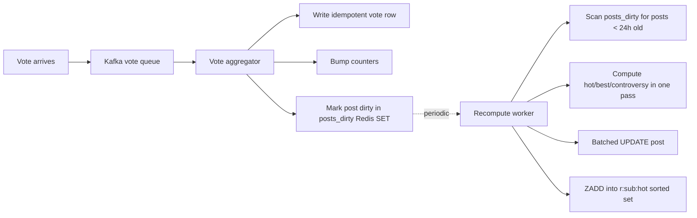

# Reddit Deep Dive — Ranking Algorithms (Hot, New, Top, Controversial, Best)

**Date:** 2026-04-29 | **Updated:** 2026-04-29
**Tags:** `system-design` `case-study` `reddit` `deep-dive` `ranking` `scoring`

## Table of Contents

- [Summary](#summary)
- [Overview — Why Each Sort Exists](#overview--why-each-sort-exists)
- [Hot — `log10(score)` + Linear Age](#hot--log10score--linear-age)
  - [The Formula](#the-formula)
  - [Why `log10` for Votes](#why-log10-for-votes)
  - [Why Linear for Time](#why-linear-for-time)
  - [The 12.5-Hour Half-Life](#the-125-hour-half-life)
  - [Sign Term — Sinking Downvoted Posts](#sign-term--sinking-downvoted-posts)
  - [Worked Numerical Examples](#worked-numerical-examples)
- [New — Pure Chronological](#new--pure-chronological)
- [Top — Score Within a Time Window](#top--score-within-a-time-window)
- [Controversial — Magnitude × Balance](#controversial--magnitude--balance)
- [Best (Wilson) — Statistically Conservative Comment Sort](#best-wilson--statistically-conservative-comment-sort)
  - [The Wilson Lower Bound](#the-wilson-lower-bound)
  - [Why Not Average Rating](#why-not-average-rating)
  - [Why Not Net Votes](#why-not-net-votes)
- [Hot Recomputation — Incremental vs Batch](#hot-recomputation--incremental-vs-batch)
- [Precomputed Sorted Sets per Subreddit per Sort](#precomputed-sorted-sets-per-subreddit-per-sort)
- [Tie-Breaking and Vote Freshness](#tie-breaking-and-vote-freshness)
- [Negative Feedback Handling](#negative-feedback-handling)
- [Code — Reference Implementations](#code--reference-implementations)
- [Anti-Patterns](#anti-patterns)
- [Related](#related)
- [References](#references)

## Summary

Reddit's ranking layer is a small set of deceptively simple closed-form scoring functions, each designed to answer a different question, paired with an aggressive precomputation pipeline. **Hot** ranks the front page using `sign(score) * log10(|score|) + age_seconds / 45000` — votes are logarithmic and time is linear, so a fresh post needs exponentially more votes to overtake an older one as time passes. **New** is `ORDER BY created_utc DESC` and indexes trivially. **Top** filters by a time window (`hour | day | week | month | year | all`) and orders by raw score. **Controversial** rewards posts with **both** lots of upvotes **and** lots of downvotes via `magnitude ** balance`. Comments use **Best**, the Wilson score interval lower bound at 80% confidence, which answers "given the votes seen, what's a statistically conservative estimate of how good this comment really is?" — a comment with 10/1 beats one with 40/20 because the algorithm is more confident about the smaller, more lopsided sample.

The key system property is that **none of these scores are computed at read time**. Every post row carries denormalized `hot_score`, `controversy`, and `best_score` columns, refreshed by an asynchronous recompute worker that scans only the last ~24 hours of dirty posts. Listings are pure index range scans against precomputed Redis sorted sets keyed by `(subreddit_id, sort_mode)`. The scoring math is famous; the recompute pipeline and cache topology are why it scales.

## Overview — Why Each Sort Exists

Each sort answers a distinct user question and reflects a different statistical philosophy:

| Sort | Question | Math philosophy | Where it's used |
|------|----------|----------------|-----------------|
| **Hot** | "What's popular right now?" | Logarithmic votes + linear time decay | Default front page, subreddit listings |
| **New** | "What just happened?" | Strict reverse chronological | Triage by mods, breaking news |
| **Top** | "What was best in the last day/week/year?" | Raw net score within window | Retrospective browsing |
| **Controversial** | "What's dividing the community?" | Magnitude × balance — high volume, near-50/50 | Discovering debate threads |
| **Rising** | "What's catching fire?" | Vote velocity within recent cohort | Finding posts before they peak |
| **Best** (comments) | "Which reply is most likely to be approved?" | Wilson lower bound at 80% confidence | Default comment sort |

Hot is the **operationally critical** one — it's what hits the cache 99% of the time, it's the formula vote-manipulation services try to game, and it's the one whose recompute schedule shapes the entire write pipeline. The other sorts are mostly cheap variations on `ORDER BY` plus a precomputed score column.

## Hot — `log10(score)` + Linear Age

### The Formula

Reddit's Hot formula was reverse-engineered and popularised in a 2010 blog post by Amir Salihefendic ("How Reddit ranking algorithms work") and confirmed against the open-source `r2` codebase that Reddit operated until 2017. The original implementation lives in `r2/r2/lib/db/_sorts.pyx` (Cython) — a small file containing the canonical score functions. The function in Python form:

```python
import math
from datetime import datetime, timezone

REDDIT_EPOCH = datetime(2005, 12, 8, 7, 46, 43, tzinfo=timezone.utc)

def epoch_seconds(dt: datetime) -> float:
    """Seconds since Reddit's birthday (8 Dec 2005, 07:46:43 UTC)."""
    delta = dt - REDDIT_EPOCH
    return delta.total_seconds()

def hot(ups: int, downs: int, created_utc: datetime) -> float:
    s = ups - downs
    order = math.log10(max(abs(s), 1))
    sign = 1 if s > 0 else (-1 if s < 0 else 0)
    seconds = epoch_seconds(created_utc) - 1134028003
    return round(sign * order + seconds / 45000, 7)
```

A few specifics worth pinning down:

- **`1134028003`** is the Unix epoch seconds for Reddit's birthday, baked into the formula so that the time term resets to zero at the platform's start. It is a constant; the formula does not care about absolute time, only time-since-Reddit-was-born.
- **`max(abs(s), 1)`** prevents `log10(0) = -inf`. A post with score 0 contributes `0` from the vote term, so its rank is purely time-based until the first vote arrives.
- **`round(..., 7)`** keeps the score stable across small floating-point perturbations — important when the score becomes a sort key in a `ZADD`.

### Why `log10` for Votes

The choice of `log10` is the most important design decision in the formula. It encodes **diminishing returns on popularity**:

| Going from… | …to… | Adds to score |
|------------|------|---------------|
| 10 votes | 100 votes | +1.0 |
| 100 votes | 1,000 votes | +1.0 |
| 1,000 votes | 10,000 votes | +1.0 |
| 10,000 votes | 100,000 votes | +1.0 |

Each tenfold increase in votes is worth the same `+1.0` of score. The first 10 upvotes matter as much as the next 100, which matter as much as the next 1,000. Without this, a single mega-thread (think a 200,000-upvote AMA) would sit on the front page for days. With `log10`, even a 200,000-vote post can only buy itself ~5.3 of score, which is roughly 5.3 × 45,000 = 238,500 seconds ≈ **2.76 days** of "head start" before a fresher post with the same logarithmic momentum overtakes it.

`log10` is not the only choice — `ln` would shift the time constant, `log2` would compress popularity even more aggressively. The Reddit team picked `log10` because the resulting numbers (1, 2, 3, 4, 5) line up with intuitive decade-shaped popularity tiers.

### Why Linear for Time

Unlike votes, **time is linear in the formula**:

```text
time_term = age_seconds / 45000
```

Every additional second of submission age adds `1/45000 ≈ 2.22e-5` to the score, regardless of when in the post's life it happens. This is unusual — many ranking systems use exponential decay (`e^(-λt)`) or polynomial decay (`1 / (t + 2)^1.5`, the Hacker News style). Reddit chose linear because:

1. **Monotonicity is critical.** With linear time, a newer post always has a strictly higher time term than an older one. Combined with the bounded vote term (`log10` grows slowly), this guarantees that **age eventually wins** — every post gets buried, no matter how popular. Exponential decay makes this less predictable: a high-vote post can ride a slow exponential tail far longer than is desirable for a front page.
2. **Simplicity.** Linear age plus log votes is a closed-form O(1) computation with no transcendentals on the hot path beyond a single `log10`.
3. **Predictable half-life.** The 45,000 constant makes the math human-legible: 12.5 hours of age is worth one decade of votes, period.

### The 12.5-Hour Half-Life

The constant `45000` is roughly half a day in seconds (12.5 hours). It controls how aggressively age decays the score:

```text
time_term_per_decade_of_votes = 1.0
seconds_per_decade_of_votes   = 45000
hours_per_decade_of_votes     = 45000 / 3600 = 12.5
```

Plain English: **every 12.5 hours that pass, a post needs roughly 10× more votes to maintain the same Hot rank against fresh competition**. Twelve and a half hours is the "half-life" of Hot in the sense that if you froze the vote tally and let time march, the post would slide from the top of the front page to roughly position 10-20 in that span. Reddit's actual front page typically shows posts spanning the last 6-24 hours.

You can tune this constant for different products:

- **Smaller** (`/15000`, ~4 hours) — more like Hacker News; the front page churns fast and only red-hot posts stay.
- **Larger** (`/180000`, ~50 hours) — more like a slow-moving subreddit; posts sit longer.

Reddit picked 45,000 to match a daily user rhythm — most posts have one full day-and-night cycle of visibility before time decisively buries them.

### Sign Term — Sinking Downvoted Posts

The `sign` term is what makes Hot symmetric. A heavily downvoted post sinks **proportionally** to a heavily upvoted post rising:

```python
sign = 1 if s > 0 else (-1 if s < 0 else 0)
score = sign * log10(max(|s|, 1)) + age / 45000
```

A post with score `−1000` gets `−3.0` from the vote term, a post with score `+1000` gets `+3.0`. The 6.0-point gap is enormous — equivalent to ~75 hours (`6.0 × 45000 / 3600`) of age difference. Heavily downvoted posts are effectively buried instantly even if they're brand new. This is exactly the design intent: the community can collectively suppress garbage by downvoting it, not just by waiting for time to age it out.

### Worked Numerical Examples

Three posts, all submitted right now, with different vote distributions:

| Post | ups | downs | score | log10 | sign | vote term | time term | total |
|------|-----|-------|-------|-------|------|-----------|-----------|-------|
| A | 100 | 5 | 95 | 1.978 | +1 | +1.978 | 0 | 1.978 |
| B | 1000 | 100 | 900 | 2.954 | +1 | +2.954 | 0 | 2.954 |
| C | 50 | 500 | -450 | 2.653 | -1 | -2.653 | 0 | -2.653 |

Now fast-forward 12.5 hours and submit a brand-new post D with the same +95 net score as post A:

| Post | age | vote term | time term | total |
|------|-----|-----------|-----------|-------|
| A | 45000s | +1.978 | +1.000 | 2.978 |
| D | 0s | +1.978 | 0.000 | 1.978 |

Post A is still ahead despite being 12.5 hours older — because A had time to *also* get its votes, but D arrived with the same score immediately. For D to beat A, it needs to gain enough votes to push its `log10` term above 2.978 — that's `10^2.978 ≈ 950` net upvotes, roughly 10× what A took to reach. **That's the "upvotes are time travel" property** — votes effectively buy you backward movement in time on the score axis.

## New — Pure Chronological

```sql
SELECT * FROM post
WHERE subreddit_id = :sub
  AND is_removed = false
ORDER BY created_utc DESC
LIMIT 25;
```

Indexed on `(subreddit_id, created_utc DESC)`. Cache key is `(subreddit_id, "new")` and is invalidated on every post insert (push-based: the post-create handler does `LPUSH r:{sub}:new {post_id}` and `LTRIM` to a max length).

There is no scoring at all — `created_utc` is the sort key, and ties are broken by `post_id` (which is monotonically increasing, so it serves as a secondary chronological tiebreaker). New is the cheapest sort to maintain and the only one that does not need the recompute pipeline.

## Top — Score Within a Time Window

```sql
SELECT * FROM post
WHERE subreddit_id = :sub
  AND created_utc >= now() - interval :window
  AND is_removed = false
ORDER BY (ups - downs) DESC
LIMIT 25;
```

Window values: `hour`, `day`, `week`, `month`, `year`, `all`. Each is its own cache key — a single post can be "Top of the hour" without being "Top of the day". The `all` window has no `created_utc` filter and is effectively a global high-score table per subreddit.

Indexing is the interesting part. A naive index on `(subreddit_id, created_utc, score)` does not help — Postgres can't use the index to satisfy `ORDER BY score DESC` after filtering on `created_utc`. The fix is a **functional index per window**:

```sql
-- For Top-of-the-day
CREATE INDEX post_top_day_idx
ON post (subreddit_id, score DESC)
WHERE created_utc >= now() - interval '1 day'
  AND is_removed = false;
```

…except partial-index predicates can't reference `now()`. The practical implementations are:

1. **Bucketed daily indexes** — partitioned tables by `created_utc::date` so the planner can prune to recent partitions.
2. **Maintained sorted sets in Redis** — one `ZADD` per vote into `r:{sub}:top:day:{day_bucket}`, with old buckets expiring. The query is a `ZREVRANGEBYSCORE` over the union of buckets covering the window.

Reddit's production approach is closer to the second: per-window precomputed sorted sets, refreshed on the same recompute cadence as Hot.

## Controversial — Magnitude × Balance

```python
def controversy(ups: int, downs: int) -> float:
    if downs <= 0 or ups <= 0:
        return 0.0
    magnitude = ups + downs
    balance = (downs / ups) if ups > downs else (ups / downs)
    return magnitude ** balance
```

Two factors multiplied (in log space, since exponentiation of a magnitude by a balance close to 1 is roughly linear in log-magnitude):

- **`magnitude = ups + downs`** — total engagement. A post with 10 up / 10 down is not interesting; a post with 5,000 up / 4,800 down is.
- **`balance ∈ (0, 1]`** — how close to 50/50 the split is. `balance = 1.0` exactly at `ups == downs`; falls toward 0 as one side dominates.

The exponent is what gives Controversial its character. At `balance = 1.0`, the score equals `magnitude` — pure engagement. As `balance` falls (one side starts winning), the score falls **super-linearly**:

| ups | downs | magnitude | balance | score |
|-----|-------|-----------|---------|-------|
| 5000 | 5000 | 10000 | 1.0 | 10000.0 |
| 5000 | 4800 | 9800 | 0.96 | 7416.7 |
| 5000 | 1000 | 6000 | 0.20 | 5.61 |
| 100000 | 100 | 100100 | 0.001 | 1.013 |
| 5000 | 0 | — | — | 0 (returns 0 by guard) |

Notice that the `5000 / 4800` post (balance 0.96) beats the `100000 / 100` post (balance 0.001) by four orders of magnitude. That's the explicit goal: Controversial surfaces threads where the community is genuinely split, not threads that are merely popular.

The guard `if downs <= 0 or ups <= 0: return 0` is important — without it, a post with all upvotes would have undefined balance, and a post with one downvote and a million upvotes would dominate (which is the opposite of "controversial").

## Best (Wilson) — Statistically Conservative Comment Sort

Comments do not have the front-page time-decay problem — a comment is only visible inside one post page and competes against its peers in the same thread. The relevant question shifts from "is this trending right now?" to:

> Given the votes seen so far, what is a statistically conservative estimate of how good this comment really is?

The answer is the **lower bound of the Wilson score interval** for a binomial proportion at some confidence level. Reddit uses 80% confidence (`z ≈ 1.281552`).

### The Wilson Lower Bound

The Wilson score interval (Wilson 1927) for a binomial proportion `p̂ = ups / (ups + downs)` with `n = ups + downs` trials at confidence level `1 − α` is:

```text
                p̂ + z²/(2n)  ±  z · √( p̂(1−p̂)/n + z²/(4n²) )
ci_lower, ci_upper  =  ─────────────────────────────────────────────
                              1 + z²/n
```

Where `z` is the standard normal quantile for the chosen confidence (`z(0.8) ≈ 1.281552`). Reddit takes the **lower** end of that interval as the comment's `best_score`:

```python
import math

def wilson_lower(ups: int, downs: int, confidence: float = 0.8) -> float:
    n = ups + downs
    if n == 0:
        return 0.0
    z = 1.281551565544600   # 80% confidence
    p_hat = ups / n
    denom = 1 + z * z / n
    centre = p_hat + z * z / (2 * n)
    margin = z * math.sqrt((p_hat * (1 - p_hat) + z * z / (4 * n)) / n)
    return (centre - margin) / denom
```

This is the formula in `_sorts.pyx`. It's small, exact, and deterministic.

### Why Not Average Rating

The temptation is to sort comments by `ups / (ups + downs)` — the raw approval rate. **This is wrong**, and Evan Miller's classic essay "How Not To Sort By Average Rating" is the canonical demolition of it:

| Comment | ups | downs | avg | wilson_lower |
|---------|-----|-------|-----|--------------|
| A | 1 | 0 | 1.000 | 0.205 |
| B | 10 | 1 | 0.909 | 0.704 |
| C | 100 | 10 | 0.909 | 0.860 |
| D | 40 | 20 | 0.667 | 0.565 |

By **average**, comments A and B are nearly tied at the top — but A has only 1 vote, and we have basically no information about whether it's actually good. By **Wilson lower bound**, A is correctly far below B and C, which both have meaningful sample sizes. Comment C, with the same approval rate as B but 10× the sample, sits even higher because we're more confident in that approval rate.

The lower bound is the conservative estimate: "the true approval rate is *at least* this, with 80% confidence". It penalises small samples appropriately. A brand-new comment with one upvote does **not** rocket to the top — its lower bound is dragged down by the wide interval around small `n`.

### Why Not Net Votes

The other temptation is `ups - downs` — the simple net score. This is what Reddit's "Top" comment sort actually uses. The problem is **early-vote inflation**: the first comment in a thread has minutes of head-start visibility, accumulates a hundred upvotes before competing replies even arrive, and dominates the sort by raw score even if its content is mediocre. Wilson Lower Bound mitigates this because the metric is rate, not volume — a hundred upvotes against zero downvotes is a higher rate than a hundred upvotes against thirty downvotes, but only marginally; the early-mover advantage is largely neutralised once the second comment accumulates a comparable sample.

This is also why Best is **the default comment sort** while Hot is the default post sort. The two contexts have different selection problems and different mathematical solutions.

## Hot Recomputation — Incremental vs Batch

`hot_score` is denormalized onto the post row so listings are pure index range scans. But every vote in principle changes the score — naively recomputing on every vote creates a write storm during a viral thread. Reddit's compromise is a hybrid:



### Incremental (per-vote)

Pros: lowest possible staleness — score reflects the latest vote within milliseconds. Cons: every viral post becomes a hot row; the same post is updated thousands of times per second; the listing cache has to be rebuilt in lockstep, multiplying the write amplification.

### Batch (periodic worker)

Pros: bounded work per cycle; vote bursts are absorbed by the queue; the recompute worker can batch many posts into a single transaction. Cons: vote → ranking lag of seconds-to-tens-of-seconds.

### The Hybrid

Reddit chose batch with a **dirty-set short-circuit**:

1. **Vote handler** is hot-path-only: it writes the vote intent to Kafka and adds the post to the `posts_dirty` Redis set. It does not compute anything.
2. **Recompute worker** runs every few seconds. It:
   - `SPOP`s a batch of ~1000 post IDs from `posts_dirty`.
   - Filters out posts older than 24 hours (their score is dominated by the time term and won't change rank meaningfully).
   - Recomputes `hot_score`, `best_score`, `controversy` for each surviving post in one pass.
   - Issues a single batched UPDATE.
   - Pushes affected posts to per-subreddit listing sorted sets (`ZADD`).
3. **Posts older than 24 hours** never enter the recompute set. They retain whatever `hot_score` they had when they fell out of the window. This is acceptable because the time term has already buried them — even a sudden surge of votes can't pull them back up to the front of Hot.

This is exactly the optimisation visible in the open-source `r2` codebase: the recompute path operates on a bounded "recent" window, not the global post table. With ~3M subreddits and ~1B posts, recomputing globally would be O(N) per cycle and impossible. Recomputing the few hundred thousand posts created in the last 24 hours is bounded and parallelisable.

## Precomputed Sorted Sets per Subreddit per Sort

The listing cache is a **Redis sorted set** (`ZSET`) per `(subreddit_id, sort_mode)` pair:

```text
KEY                              MEMBERS (post_id)         SCORE (sort key)
r:{sub}:hot                      post_id_1, post_id_2, ... hot_score
r:{sub}:new                      post_id_1, post_id_2, ... created_utc
r:{sub}:top:day                  post_id_1, post_id_2, ... ups - downs
r:{sub}:top:week                 post_id_1, post_id_2, ... ups - downs
r:{sub}:top:all                  post_id_1, post_id_2, ... ups - downs
r:{sub}:controversial:day        post_id_1, post_id_2, ... controversy
r:{sub}:rising                   post_id_1, post_id_2, ... velocity
```

Listing reads are a single `ZREVRANGEBYSCORE` (or `ZREVRANGE` for sets without time filtering). A page of 25 posts is one network round-trip plus a hydration of the post-row fragments from the post-page cache.

A few practical details:

- **Cap each sorted set at ~1,000 members.** No one paginates past page 40 of a subreddit listing. `ZADD ... GT` plus `ZREMRANGEBYRANK` keeps memory bounded.
- **Eviction by score, not by LRU.** When a post falls below the cutoff, it's evicted regardless of its access frequency. The cap is the working set.
- **Per-window sets for Top.** `r:{sub}:top:day`, `r:{sub}:top:week`, etc. — each maintained on the recompute pipeline. Old posts aging out of the window are evicted by a sweep job.
- **Cold subreddits served from DB.** When a sorted set is missing (subreddit has been quiet), the listing service falls back to a direct Postgres query and rewarms the set. The first request after a long quiet period is slow; subsequent requests are fast.
- **Anti-affinity on hot keys.** A subreddit with viral content (`r/news`, `r/funny`) gets its sorted set replicated to multiple Redis shards, with consistent-hash routing distributing reads. This avoids a single shard hot-spot during major events.

The total memory footprint is bounded: ~3M subreddits × 6 sort modes × 1000 members × ~16 bytes per member ≈ **288 GB** across the Redis fleet, easily distributed across a few dozen instances.

## Tie-Breaking and Vote Freshness

Two posts can have identical `hot_score` to seven decimal places when both have round-number vote tallies and similar submission times. Tie-breaking matters because it determines paging stability — if two scores are equal and the tiebreak is non-deterministic, the same query at two different moments can return different orderings, which manifests as duplicate or missing posts as users paginate.

The standard tiebreak chain for Hot:

1. **Higher `hot_score` wins** (the score itself, to 7 decimals).
2. **Newer `created_utc` wins** (recency among equals).
3. **Higher `post_id` wins** (monotonic ID, equivalent to chronological for a single sub).

For Top: ties on `(ups - downs)` are broken by `created_utc DESC`, then by `post_id DESC`. For Controversial: ties on `magnitude ** balance` are broken by raw `magnitude DESC` (more votes wins), then by `created_utc DESC`.

**Vote freshness** — the time between a vote arriving and the score reflecting it — is a direct trade against write amplification. Reddit's pipeline targets:

| Phase | Latency budget |
|-------|---------------|
| Vote API → Kafka | < 50 ms |
| Kafka → aggregator persistence | < 1 s |
| Aggregator → posts_dirty | < 100 ms |
| Recompute worker cycle | 2–10 s |
| Recompute → ZSET update | < 500 ms |
| **End-to-end vote → ranking** | **~3–12 s** |

This is fast enough that users perceive the site as real-time, but slow enough that vote bursts during AMAs or breaking news don't melt the database.

## Negative Feedback Handling

Downvotes deserve their own mention. The Hot formula treats them as anti-votes via the `sign(score)` term, which means a heavily downvoted post sinks proportionally to a heavily upvoted post rising. But there are two production-level wrinkles:

1. **Downvotes are noisier than upvotes.** Brigading and vote-manipulation services more often *downvote* (suppress competitors' content) than upvote (promote their own), because suppression is harder to detect — there's no positive signal to correlate. Reddit's brigade detector applies asymmetric weighting: a sudden cluster of downvotes from referrers outside the subreddit is more likely to be discounted than the equivalent upvote cluster.
2. **The `controversy` metric depends on accurate downvotes.** If downvote suppression is too aggressive, the Controversial sort breaks — every post starts looking unanimously approved. Reddit balances by *scaling* suspicious downvotes rather than dropping them entirely; the vote rows are kept for forensics, only their ranking contribution is reduced.

Vote fuzzing on the public-facing display (the visible `ups` and `downs` on the post card) means the numbers users see are deliberately noisy — a small randomized delta is added to both `ups` and `downs` while preserving net score. This makes it harder for vote-manipulation services to confirm whether their bots' votes "took" the right direction. The internal numbers used for ranking are the real ones; only the display is fuzzed.

## Code — Reference Implementations

The full set, lifted from the patterns in `r2/r2/lib/db/_sorts.pyx`:

```python
import math
from datetime import datetime, timezone

REDDIT_EPOCH = datetime(2005, 12, 8, 7, 46, 43, tzinfo=timezone.utc)

# --- Hot ----------------------------------------------------------------

def epoch_seconds(dt: datetime) -> float:
    return (dt - REDDIT_EPOCH).total_seconds()

def hot(ups: int, downs: int, created_utc: datetime) -> float:
    s = ups - downs
    order = math.log10(max(abs(s), 1))
    sign = 1 if s > 0 else (-1 if s < 0 else 0)
    seconds = epoch_seconds(created_utc) - 1134028003
    return round(sign * order + seconds / 45000, 7)

# --- Best (Wilson lower bound at 80% confidence) ------------------------

def wilson_lower(ups: int, downs: int) -> float:
    n = ups + downs
    if n == 0:
        return 0.0
    z = 1.281551565544600
    p_hat = ups / n
    denom = 1 + z * z / n
    centre = p_hat + z * z / (2 * n)
    margin = z * math.sqrt((p_hat * (1 - p_hat) + z * z / (4 * n)) / n)
    return (centre - margin) / denom

# --- Controversy --------------------------------------------------------

def controversy(ups: int, downs: int) -> float:
    if downs <= 0 or ups <= 0:
        return 0.0
    magnitude = ups + downs
    balance = (downs / ups) if ups > downs else (ups / downs)
    return magnitude ** balance

# --- Top ----------------------------------------------------------------

def score(ups: int, downs: int) -> int:
    return ups - downs
```

A purist would lift these into a small Cython or Rust extension to remove the Python overhead from the hot path. Reddit's Cython `_sorts.pyx` does exactly that — the file is small (~50 lines) and compiles to native code, so the recompute worker can score thousands of posts per second per worker thread.

For an immutable-friendly implementation, return a new dict rather than mutating the post row:

```python
from dataclasses import replace

def rescored(post: Post) -> Post:
    return replace(
        post,
        hot_score=hot(post.ups, post.downs, post.created_utc),
        best_score=wilson_lower(post.ups, post.downs),
        controversy=controversy(post.ups, post.downs),
    )
```

The recompute worker collects rescored copies in a list and issues one bulk UPDATE.

## Anti-Patterns

Things that look reasonable in a small system and break at Reddit scale:

**Computing `hot_score` at read time on every listing query.** Each request becomes O(N) over the candidate post set, with a `log10` and a datetime subtraction per row. At 100k QPS this is fatal. Denormalize `hot_score` onto the row and refresh asynchronously.

**Recomputing Hot for every post in the database every minute.** The post table is billions of rows; even a streaming scan can't keep up. Bound the recompute set to posts younger than 24 hours, where the score can still meaningfully change rank.

**Using `time.time()` directly in the formula instead of a fixed epoch.** Subtle: if every recompute uses "now" as the time origin, two posts that should have stable relative ordering can swap as the clock moves. Anchor to a fixed epoch (Reddit's birthday) so the relative ordering is determined entirely by `created_utc`.

**Sorting comments by `ups - downs` and calling it Best.** That's Top, not Best. Average rating sorts a 1/0 comment above a 999/1 comment; net votes give early commenters an unbeatable head start. Use the Wilson lower bound for the comment default sort.

**Treating `controversy` as a debugging metric instead of a sort key.** The formula returns 0 for any post without both upvotes and downvotes, which surprises naive filters. Always check the guard before using it.

**Storing the score as a float in a Postgres column without rounding.** Floating-point comparisons across replicas can disagree on the 13th decimal, leading to non-deterministic pagination. Round to 7 decimals (Reddit's choice) before persisting.

**One global sorted set keyed by `hot_score`.** Cross-subreddit ranking is a separate problem; mixing it with per-subreddit listings creates a single-key bottleneck and ruins shard locality. Maintain per-subreddit sorted sets, then **separately** maintain `r:all:hot` and `r:popular:hot` aggregates with their own discount weights.

**Naively trusting subreddit subscribe counts as input to `r/all`.** Sub-vote rings and brigaded subreddits can game it. Apply weighted, suspicious-activity-discounted counts before feeding scores into the global view.

**Skipping vote freshness budgets in capacity planning.** A team that doesn't know the end-to-end vote-to-ranking latency can't tune the recompute cadence — they'll either over-recompute (write storm) or under-recompute (visibly stale Hot). Measure and bound it explicitly.

**Per-vote `ZADD` into the listing sorted set from the vote handler.** Looks tempting because it removes the recompute worker. Fails because Redis becomes the bottleneck on hot posts — every vote on an AMA is one `ZADD` to the same key. Batch via the recompute worker.

**Forgetting to fuzz public vote counts.** Hands a free oracle to vote-manipulation services. They don't even need to be sophisticated — they just A/B test their botnet against the visible counter and learn what works. The internal score uses real numbers; the displayed count is fuzzed by ~20% noise.

## Related

- [Design Reddit — main case study](../design-reddit.md) — full HLD this deep dive elaborates; covers data model, vote pipeline, comment trees, mod tools, and search alongside ranking.
- [Count-Min Sketch & Top-K](../../../data-structures/count-min-sketch-and-top-k.md) — sibling deep dive on the probabilistic top-K patterns that complement Reddit's exact-score sorts; the **Rising** sort can be implemented with a CMS-backed velocity heap rather than a full per-post counter.
- [Hot recomputation pipeline section in design-reddit.md](../design-reddit.md#hot-re-computation-pipeline) — the source overview this companion expands.
- [Comment trees and Best sort section in design-reddit.md](../design-reddit.md#comment-trees-and-best-sort-wilson) — closure-table storage details that interact with Best ranking.

## References

- Amir Salihefendic, ["How Reddit ranking algorithms work" (2010)](https://medium.com/hacking-and-gonzo/how-reddit-ranking-algorithms-work-ef111e33d0d9) — the canonical walkthrough of Hot, Best, Top, and Controversial against the open-source Reddit codebase. The original blog post that surfaced the formula constants.
- [`r2/r2/lib/db/_sorts.pyx` in the open-source Reddit repository](https://github.com/reddit-archive/reddit/blob/master/r2/r2/lib/db/_sorts.pyx) — the Cython source containing `_hot`, `_score`, `_controversy`, and `_confidence` (Wilson) implementations exactly as run in production until 2017.
- Edwin B. Wilson, ["Probable Inference, the Law of Succession, and Statistical Inference" (1927), Journal of the American Statistical Association](https://www.jstor.org/stable/2276774) — the original paper deriving the Wilson score interval for a binomial proportion.
- [Wilson score interval — Wikipedia](https://en.wikipedia.org/wiki/Binomial_proportion_confidence_interval#Wilson_score_interval) — modern reference for the formula and its properties versus other binomial confidence intervals.
- Evan Miller, ["How Not To Sort By Average Rating" (2009)](https://www.evanmiller.org/how-not-to-sort-by-average-rating.html) — the canonical argument for using the Wilson lower bound rather than naive averages or net votes for rating-style sorts.
- Possibly Wrong, ["Reddit's comment ranking algorithm" (2011)](https://possiblywrong.wordpress.com/2011/06/05/reddits-comment-ranking-algorithm/) — derivation of why Reddit chose the Wilson lower bound at 80% confidence and how the math behaves at small `n`.
- [How Hacker News ranking really works — moz.com discussion](https://news.ycombinator.com/item?id=1781013) and ["How Hacker News ranking algorithm works" — Amir Salihefendic](https://medium.com/hacking-and-gonzo/how-hacker-news-ranking-algorithm-works-1d9b0cf2c08d) — comparison point with HN's `(p − 1) / (t + 2)^G` polynomial-decay formula; useful contrast with Reddit's linear-time approach.
- Daniel Lemire, ["The mathematics of voting algorithms"](https://lemire.me/blog/2019/03/30/are-floating-point-numbers-really-broken/) and other blog posts on numerical stability — context for why rounding `hot_score` to 7 decimals matters in distributed systems.
- ScienceBlogs, ["The Mathematics of Reddit Rankings, or How Upvotes Are Time Travel" (2013)](https://scienceblogs.com/builtonfacts/2013/01/16/the-mathematics-of-reddit-rankings-or-how-upvotes-are-time-travel) — intuitive explanation of why each upvote effectively buys backwards motion in time.
- Reddit, ["Reddit overhauls upvote algorithm to thwart cheaters" — TechCrunch (2016)](https://techcrunch.com/2016/12/06/reddit-overhauls-upvote-algorithm-to-thwart-cheaters-and-show-the-sites-true-scale/) — public-facing description of the vote-manipulation overhaul that adjusted how brigaded votes contribute to scoring.
