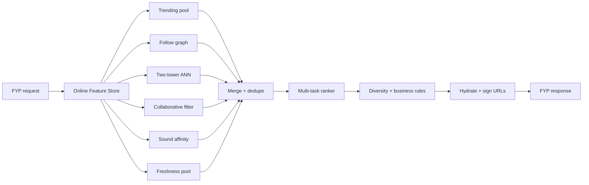
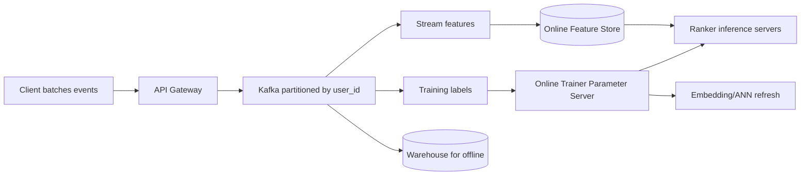

# TikTok Deep Dive — The For-You Page

**Date:** 2026-04-29 | **Updated:** 2026-04-29
**Tags:** `system-design` `case-study` `tiktok` `deep-dive` `recommendations` `fyp`

## Table of Contents

- [Summary](#summary)
- [Overview — Why FYP Is Not a Feed, It Is a Funnel](#overview--why-fyp-is-not-a-feed-it-is-a-funnel)
- [The Two-Stage Architecture](#the-two-stage-architecture)
- [Candidate Generation — Recall Over Precision](#candidate-generation--recall-over-precision)
  - [Collaborative Filtering](#collaborative-filtering)
  - [Content-Based Retrieval](#content-based-retrieval)
  - [Two-Tower Neural Retrieval](#two-tower-neural-retrieval)
  - [ANN Over Embeddings — HNSW and FAISS](#ann-over-embeddings--hnsw-and-faiss)
- [Ranking — Multi-Objective Scoring](#ranking--multi-objective-scoring)
- [Implicit Feedback Dominates Explicit](#implicit-feedback-dominates-explicit)
- [Cold Start — New Users and New Videos](#cold-start--new-users-and-new-videos)
- [Diversity Injection](#diversity-injection)
- [Latency Budget — The 100 ms Game](#latency-budget--the-100-ms-game)
- [Online Learning Loop](#online-learning-loop)
- [Industry Examples — YouTube, Netflix, Instagram, ByteDance](#industry-examples--youtube-netflix-instagram-bytedance)
- [Anti-Patterns](#anti-patterns)
- [Related](#related)
- [References](#references)

## Summary

The For-You Page is the most-studied recommender surface of the past decade because it solves a problem the older social platforms could afford to ignore: **how do you serve a personalized feed when most of the value comes from items the user has no graph signal toward?** Facebook and Twitter could lean on the follow graph; YouTube could lean on subscriptions and queries; TikTok cannot. It must continuously discover content from a corpus of hundreds of millions of items with sub-second latency, learn from a viewer's behavior within a single session, and keep doing this at billions of requests per day.

The architecture is a **two-stage funnel**: a cheap **candidate generation** stage that narrows the corpus from millions to a few thousand by combining collaborative filtering, content-based retrieval, and two-tower neural retrieval over an ANN index; followed by a heavy **ranking** stage that scores those few thousand against a multi-task DNN predicting completion, share, like, comment, replay, follow, and skip. The whole pipeline runs in roughly a hundred milliseconds, learns from implicit signals (completion rate, replays, skip latency) far more than from likes or follows, mitigates cold start with content embeddings and freshness pools, and refreshes its model parameters in near-real time via the online learning loop described in ByteDance's Monolith paper. This deep dive unpacks each piece.

This is a companion to the parent case study [`design-tiktok.md`](../design-tiktok.md), expanded around the FYP funnel itself.

## Overview — Why FYP Is Not a Feed, It Is a Funnel

A feed implies a list someone authored: posts from accounts you follow, ordered by recency or by a timeline ranker that reorders within that pool. The FYP is a different shape. There is no authored list to start from. The candidate set on every request is "any video in the corpus that is allowed to reach this user," which at TikTok scale is hundreds of millions of items.

You cannot rank hundreds of millions of items per request. A modern ranker — a deep neural network with cross-features and many embedding lookups — costs single-digit milliseconds per item on a GPU and would blow a 100 ms budget after roughly a few thousand items. So the system has to **prune first, score second**. That is the funnel:

```text
   ~10^8 candidates (the eligible corpus)
            │
            │  Stage 1: Candidate Generation
            │   - cheap, multi-source, high-recall
            │   - tens of milliseconds
            ▼
   ~10^3 candidates
            │
            │  Stage 2: Ranking
            │   - heavy, multi-task DNN
            │   - tens of milliseconds
            ▼
   ~10^1 items returned to the client
```

The same shape underpins YouTube's recommender (Covington et al., 2016), Netflix Home Page rows, Instagram Explore, Pinterest Home, and most modern large-scale recommenders. TikTok pushes it harder than its predecessors on (a) multi-source candidate generation, (b) implicit-feedback labels, and (c) real-time training.

A useful mental model: **candidate generation optimizes for recall** (don't miss the items the user would love), **ranking optimizes for precision** (within the recalled pool, predict which ones the user will love most). The two stages have different metrics, different failure modes, and different cost curves.

## The Two-Stage Architecture



A few structural properties matter:

- **Parallel candidate sources.** Each generator runs as an independent fan-out to a backend. Their latency is bounded by the slowest source, not the sum, so adding a sixth source costs a few CPU-milliseconds on the merge step but no wall-clock time if it stays under the budget.
- **Fixed pool size out of stage 1.** Each generator returns ~200–500 items; merge dedupes to ~1–2K. The ranker is sized to score that pool in ~30–60 ms.
- **Deterministic budget per stage.** If a generator times out, the system proceeds without it. Better to skip "sound affinity" than to delay the entire response.
- **Caching boundaries.** Trending and freshness pools are precomputed and refreshed by background jobs. The two-tower user embedding is recomputed at request time from recent interaction history; item embeddings are precomputed and live in the ANN index.

The funnel maps cleanly onto two physical service tiers: candidate-gen workers that talk to ANN/Redis/feature-store, and rank workers that hold model weights in GPU memory and serve a forward pass per request.

## Candidate Generation — Recall Over Precision

A candidate generator is judged on **recall@K** — given a held-out positive (a video the user actually completed/liked), did it appear in the top-K returned? Generators are **complementary, not redundant** — each covers a different failure mode of the others.

### Collaborative Filtering

The classical approach: build a sparse user×item interaction matrix, factor it into user and item latent vectors, and score `user_vec · item_vec`. Variants include matrix factorization (Funk, Koren), implicit-feedback ALS, and item-item collaborative filtering ("users who completed X also completed Y").

Strengths:

- Cheap to compute and to serve.
- Robust to cold-warm users (some interaction history is enough).
- Picks up cross-cluster patterns that pure content similarity misses.

Weaknesses:

- **Cold-start fails for both new users and new items** — there are no rows or columns to factor against. This is precisely why TikTok cannot rely on it alone.
- Popularity bias: latent factors gravitate toward globally popular items.
- Static factor models lag behind real-time trends.

In practice TikTok-class systems use collaborative filtering as **one** generator among several, often with frequency-weighted updates and freshness decay, not as the primary retrieval source.

A few production-grade variations matter:

- **Implicit-feedback ALS (Hu, Koren, Volinsky 2008)** treats every observed interaction as a positive with a confidence weight derived from interaction strength (completion rate, replay count) and every unobserved pair as a weak negative. This matches the TikTok signal model better than explicit-rating MF.
- **Item-item co-engagement.** Maintain, per item, the top-K items most frequently co-completed within the same session. Cheap to serve (precomputed table, O(1) lookup) and surprisingly strong for "more like the last thing you finished."
- **Sequence-aware models.** GRU4Rec, SASRec, and Transformer-based session encoders capture order — "watched comedy → watched cooking" is a different signal from "watched cooking → watched comedy." Useful as a generator and as a feature extractor for the user tower.

The unifying property: collaborative filtering thrives where there is interaction history and stalls where there isn't. The system pairs it with content-based retrieval to cover the gap.

### Content-Based Retrieval

For each video, derive a **content embedding** from frames, audio, and text:

- Visual encoder (ViT, CLIP-style image tower) over sampled frames.
- Audio encoder over the soundtrack and speech.
- Text encoder over caption, hashtags, OCR, ASR transcript.
- A fusion head (concatenation + projection, or cross-attention) produces a single dense vector — typically 128–512 dimensions.

For a user, derive an **interest embedding** from the content embeddings of recently completed/liked videos (mean pool, attention pool, or a learned aggregator). Retrieval is approximate nearest neighbor against the item embedding index.

Strengths:

- **Solves cold-start for items**: a brand-new video has a content embedding immediately, no engagement history needed.
- Discovers content with no graph signal — the TikTok superpower.
- Robust to long-tail content as long as the encoder generalizes.

Weaknesses:

- Encoder quality is the ceiling. Bad embeddings → bad retrieval, regardless of how good the ranker is downstream.
- Multimodal training is expensive and slow to refresh.
- Risks topical filter bubbles if used alone (counter with diversity injection).

### Two-Tower Neural Retrieval

The dominant architecture for large-scale retrieval, popularized by Covington et al. (Deep Neural Networks for YouTube Recommendations, 2016) and extended in many follow-ups (sampling-bias-corrected two-tower, mixed negative sampling). The shape:

```text
       User features              Item features
   (ID, recent actions,        (content embedding,
    geo, device, lang, ...)      tags, creator, ...)
            │                            │
            ▼                            ▼
       ┌─────────┐                  ┌─────────┐
       │  User   │                  │  Item   │
       │ Tower   │                  │ Tower   │
       │  (DNN)  │                  │  (DNN)  │
       └────┬────┘                  └────┬────┘
            │                            │
        u_emb (d-dim)                i_emb (d-dim)
            │                            │
            └────────── dot ─────────────┘
                         │
                       score
```

Trained jointly with implicit-feedback labels (a completed view as positive, sampled non-views as negatives, with sampling-bias correction). At serving time:

- The **item tower runs offline** over the entire corpus, producing one embedding per item. The output is shipped into an ANN index.
- The **user tower runs online** at request time, conditioned on the user's current features. Its output is the query vector.
- Retrieval is a top-K dot-product against the ANN index — no per-item neural forward pass needed at request time.

This decoupling is what makes two-tower models scale. Adding a new item costs one item-tower pass + one ANN insert. Updating the user tower retrains only the small online-side network. The dot-product structure is what unlocks ANN, which we look at next.

### ANN Over Embeddings — HNSW and FAISS

Brute-force nearest-neighbor search over a billion 256-dim vectors is gigabytes per query — impossible inside a 100 ms budget. **Approximate nearest neighbor** algorithms trade a small recall loss for orders of magnitude in speedup.

**HNSW (Hierarchical Navigable Small World)** — Malkov & Yashunin, 2016 — is the dominant graph-based ANN method in modern recommenders.

- Build a multi-layer proximity graph where each node is connected to a bounded number of neighbors. Higher layers are sparse (long-range hops); lower layers are dense (local refinement).
- Search: start at an entry point in the top layer, greedily descend to the closest neighbor; drop a layer; repeat. Termination is when no neighbor is closer.
- Recall is tunable via `efSearch` (candidate set size during search). Build cost is amortized across queries.
- Properties: O(log N) average search complexity, strong recall at low latency (single-digit ms for hundreds of millions of vectors with a reasonable shard fanout), high memory cost (graph edges + vectors).

**FAISS** (Facebook AI Similarity Search) is the engineering toolbox most production teams reach for. It implements many ANN variants:

- **IVF (inverted file)** — partition vectors into Voronoi cells via k-means; at query time probe the closest `nprobe` cells. Trade recall vs cost via `nprobe`.
- **IVF + PQ (Product Quantization)** — compress vectors via per-subspace codebooks; massively reduces memory at a recall cost. Necessary when the index doesn't fit in RAM.
- **HNSW** — graph-based, as above.
- **GPU acceleration** — FAISS has GPU implementations of the brute-force and IVF paths for batch retrieval workflows.

Operational reality: a billion-scale index is sharded across many machines, each holding a slice. The query is fanned out to all shards; partial results are merged top-K-merged at the coordinator. Recall is deliberately tuned below 100% — the ranker corrects for retrieval miss, and chasing the last percent of recall costs disproportionate latency.

Index lifecycle considerations:

- **Build cost.** HNSW build is O(N log N) and embarrassingly parallel across shards, but the wall-clock build time on a billion-vector index is hours. Daily rebuilds are typical; trigger reasons include encoder retraining, large content drops, or drift detection.
- **Incremental insert.** Both HNSW and IVF support adding new vectors without a full rebuild — critical for the freshness pool, where new uploads must become retrievable within minutes.
- **Deletes.** Hard deletes (moderation takedowns, creator removals) are tricky in graph indexes; the common pattern is a tombstone bitmap consulted at query time, with a periodic compaction rebuild. Surgical takedown latency is a moderation requirement, not a nice-to-have.
- **Memory vs disk.** In-memory HNSW is fastest but expensive at billion scale. IVF + PQ on memory-mapped files is the common compromise; some teams use SSD-resident DiskANN-style indexes for the long tail.
- **Sharding strategy.** Random sharding maximizes parallelism but pays the full fanout cost; semantic sharding (by content cluster) reduces fanout for many queries but creates hotspot risk.

Cross-reference for the hashing/sketch ideas underneath this kind of high-cardinality work: [`hyperloglog.md`](../../../data-structures/hyperloglog.md).

## Ranking — Multi-Objective Scoring

The ranker is a single deep network that scores each candidate against the requesting user. Inputs are concatenated into a wide feature vector:

- **User features.** Dense embedding from the two-tower's user tower; sparse IDs of recent N actions; geo; language; device class; network class; session-time features.
- **Item features.** Content embedding; creator embedding; popularity stats (windowed completion rate, share rate); freshness; language; sound; hashtags.
- **Cross features.** `is_following(user, creator)`, `recent_actions_with_creator`, `has_used_sound`, `geo_match`, `language_match`, `historical_completion_in_topic`. Cross features are the secret sauce — they let the model learn user-item-specific patterns that neither tower captures alone.

The architecture is typically a **multi-task DNN** with shared lower layers and per-objective heads:

```text
                 wide feature vector
                         │
                         ▼
               shared MLP (e.g. 4 layers)
              /     |     |     |     \
           p_complete p_like p_share p_comment ... p_skip
```

Each head emits a probability for one objective. The final score is a weighted combination:

```python
score = (w_complete * p_complete
       + w_share    * p_share
       + w_like     * p_like
       + w_comment  * p_comment
       + w_replay   * p_replay
       + w_follow   * p_follow
       - w_skip     * p_skip)
```

Why multi-task and not a single regression head?

- **Different objectives have different distributions.** Skips are common; shares are rare. Training a single scalar buries the rare-but-decisive signals.
- **Business knobs.** The weights are policy levers — boost share to lean into virality, boost completion to lean into watch-time, boost follow to grow the graph. They are tuned via online A/B tests.
- **Auxiliary supervision.** Predicting many heads acts as regularization for the shared lower layers.

The ranker also typically emits a **calibration** layer per head so the predicted probabilities are aligned with realized rates — important for downstream uses (ad pacing, exploration budgets) that need calibrated probabilities, not just rankings.

Latency: scoring 1–2K items through a moderately deep DNN with batched GPU inference fits in 30–60 ms when the model is co-located with the candidate-gen output and warm in GPU memory.

Some practical extensions seen in production rankers:

- **DCN / DCN-v2 (Deep & Cross Network).** Explicit cross-feature layers stacked alongside the MLP — gives the model an inductive bias toward learning bounded-degree feature interactions that are otherwise hard for a vanilla DNN to capture in finite training time.
- **DIN / DIEN (Deep Interest Network / Evolution).** Attention over the user's recent interaction history conditioned on the candidate item — "for this candidate, which of your last 50 actions matter?" Native fit for sequence-driven domains like short video.
- **MMoE / PLE (Multi-gate Mixture of Experts / Progressive Layered Extraction).** When multi-task heads conflict (predicting `share` and `complete` may pull the shared layers in different directions), expert routing per task reduces negative transfer.
- **Calibration via isotonic regression.** Per-head calibration on a sliding holdout window; without it, predicted probabilities drift as the data distribution shifts and downstream consumers (ad pacing, exploration budgeting) get confused.

These choices are not all-or-nothing; a real ranker is typically an evolving stack where new components are A/B-tested against the incumbent and adopted incrementally.

## Implicit Feedback Dominates Explicit

The single most important insight for anyone designing this system: **likes and follows are noisy, sparse, and biased; completion rate, replays, and skips are dense, abundant, and clean.**

| Signal | Type | Density | Noise | Used as |
|--------|------|---------|-------|---------|
| Completion rate | Implicit | Every view | Low | Primary positive label |
| Replay | Implicit | Per view | Very low | Strong positive |
| Skip latency | Implicit | Every view | Low | Strong negative |
| Share | Implicit | ~1% of views | Low | Strong positive (esp. external) |
| Like | Explicit | ~5% of views | Medium (reflexive vs intentional) | Auxiliary positive |
| Follow | Explicit | <0.1% of views | High (driven by creator branding) | Auxiliary positive |
| Comment | Explicit | <1% | High (controversy → engagement is not endorsement) | Mixed signal |
| Not interested | Explicit | Rare | Low | Strong negative |

Why implicit dominates:

- **Volume.** Every video produces a completion signal; only a small fraction produces a like. The implicit stream gives the ranker orders of magnitude more training examples.
- **Bias.** Likes are reflexive for some users, intentional for others. Follows are driven as much by creator branding as by content fit. Completion is a closer proxy for "did this user actually want to watch this content."
- **UI alignment.** The fullscreen swipe-to-next interaction makes completion unambiguous. There is no "kept playing in a tiny preview" confound. Every session is a clean labeled example.

Schema implication: the event stream MUST capture precise `view_progress` and `view_complete` events with `watched_ms`/`duration_ms`/`replays`. These are not optional analytics — they are the training labels. Sampling them down to save cost will hurt model quality more than dropping any other event type.

For batch/stream processing of this firehose, see [`modern-streaming-engines.md`](../../../batch-and-stream/modern-streaming-engines.md).

## Cold Start — New Users and New Videos

Two distinct problems share a name.

**New user (no interaction history).**

1. **Demographic priors.** Geo, language, device class, registration source give a starting bias. A new account in São Paulo on a low-end Android during evening hours gets a very different starting pool than one in Tokyo on iPhone at lunch.
2. **Onboarding interest selection.** Optional but powerful — pick a few topics from a grid; the system seeds the user embedding with a weighted average of those topic centroids.
3. **Trending fallback.** Region- and language-segmented trending pools cover the user before any personal signal exists.
4. **Aggressive exploration in session 1.** The first ~10 videos are deliberately diverse; the system is gathering signal as fast as possible. Within minutes, completion-rate signal is strong enough to lean into the content-based source.

That speed — three completed cooking videos turning the FYP into a cooking-heavy feed within a single session — is the defining product moment.

**New video (no engagement history).**

1. **Pre-engagement features.** Content embedding (visual + audio + text), creator features (their average completion rate, follower base, recent video performance), language, hashtags, sound. These are enough to seed retrieval and ranking.
2. **Freshness pool.** A small fraction (low single-digit percent) of every FYP is reserved for under-tested content. The new video is shown to a few thousand users selected via ANN match plus randomization.
3. **Multi-armed bandit promotion.** If early completion/share rates are above a threshold, distribution expands geometrically (10K → 100K → 1M → globally). If signals are flat, exposure is capped and the video sits in the long tail.
4. **No "deletion".** A flop video isn't removed; it just doesn't propagate. This protects creators (every video gets a chance) while bounding the cost of exploration.

This is the bandit / exploration framing of cold start: the freshness pool is the exploration budget, the ranker is the exploitation policy, and the geometric expansion is the upper-confidence-bound mechanism.

A subtle point that catches first-time designers: the cold-start audience matters as much as the size. If the freshness pool selects users who watch in a noisy way (background scrolling, rapid skimming), the early signal is unreliable and the bandit promotion mis-calibrates. Real systems pre-filter the freshness pool to "high-signal users" — accounts whose recent completion-rate distribution is well-separated, who watch for full sessions, who have stable engagement patterns. This is itself a learned policy and is one of the under-appreciated levers in the cold-start story.

Geographic clustering of freshness exposure also matters operationally: keeping new-video impressions inside a few CDN POPs lets the edge cache absorb the burst even when the video has zero global priming, and it produces correlated signal (a video gaining traction in São Paulo can be promoted regionally before going global, matching the way creator-side trends actually propagate).

## Diversity Injection

A purely score-maximizing FYP would fall into traps:

- **Topical monoculture** — five cooking videos in a row.
- **Creator monoculture** — three videos from the same creator.
- **Engagement-bait monoculture** — only highly viral, low-substance content.
- **Filter-bubble drift** — a single session's signal locking the user out of new topics.

Diversity is enforced as a **post-rank reranking layer** rather than baked into the score. Common techniques:

- **Maximal Marginal Relevance (MMR).** Greedily pick the next item to maximize `score - lambda * max_similarity_to_already_picked`. Tunable `lambda` controls the diversity-relevance trade-off.
- **Determinantal Point Processes (DPP).** Sample sets that are both high-quality and high-diversity by leveraging determinants of similarity-quality kernels.
- **Hard constraints.** No same creator within K positions; cap topic frequency per page; cap consecutive ads.
- **Exploration noise.** A small randomized fraction of slots reserved for items below the score threshold but above an exploration threshold.

Diversity also includes **business rules**: ads slot insertion, region-specific restrictions (a video allowed in one country may be blocked in another), creator-tier balancing (don't crowd out smaller creators), and brand-safety filters. These are deterministic overrides applied after the score-driven reranking.

The system designer's lesson: **score-based ranking is necessary but not sufficient.** Diversity, business rules, and exploration are first-class layers, not afterthoughts.

A useful framing: think of the post-rank stage as a **constrained optimization** rather than a sort. The ranker produces scores; the post-rank stage produces an ordered, filtered, slot-aware list that satisfies hard constraints (geo restrictions, ad placements, frequency caps) and soft objectives (topic diversity, creator diversity, exploration). Many teams implement this as an explicit slot-filling loop: at each position, evaluate eligible candidates against the combined objective and pick the best — closer to a beam search than a static sort.

## Latency Budget — The 100 ms Game

End-to-end target for the recommendation step (excluding the video bytes themselves) is roughly 100–150 ms p99. Decomposition:

| Stage | Budget | Notes |
|-------|--------|-------|
| Auth + request parse | 5 ms | Edge gateway |
| Online feature lookup | 10–20 ms | Redis/Aerospike-class store, batched gets |
| Candidate generation (parallel) | 30–50 ms | Bounded by slowest source; ANN dominates |
| Merge + dedupe | <5 ms | In-memory, hash set |
| Ranking 1–2K items | 30–60 ms | Batched GPU inference |
| Diversity + business rules | 5–10 ms | Greedy MMR + rule pass |
| Hydration + URL signing | 10–20 ms | Caches; co-located with FYP service |

Engineering moves that buy latency:

- **Pre-compute everything that is not user-current.** Item embeddings, ANN index, trending pools, item features — all batch-built or stream-built, never recomputed at request time.
- **Co-locate hot paths.** Feature store, ranker GPUs, and FYP service in the same datacenter and ideally same rack family. A cross-AZ hop is 1–2 ms; cross-region is fatal.
- **Batch inside the ranker.** Score 1–2K items in a single GPU forward pass, not 1–2K individual passes. This is where the speedup comes from.
- **Time-bound every fan-out.** Each candidate generator has its own deadline; if it misses, the orchestrator proceeds without it. Tail latencies kill p99.
- **Warm caches and warm models.** Cold-start a new ranker pod and the first hundred requests are slow; route around it via health checks and slow-start ramp.

The latency budget is also an architectural forcing function: anything that can't fit in 100 ms must move off the hot path. That's why the **online learning loop** is asynchronous (next section) — model updates are minutes-fresh, but they happen via parameter-server sync, never inside a serving request.

## Online Learning Loop

Trends in short video decay in hours. A model trained nightly is permanently a step behind. TikTok-class systems train **continuously**:



Key components:

- **Event ingest.** Client batches dozens of events per session and posts them; the API gateway forwards to Kafka. Partitioning by `user_id` preserves per-user ordering, which matters for sequence features.
- **Feature store.** Stream processors (Flink, Spark Streaming) compute sliding-window aggregates — completion rate over last N actions, share rate over last hour, skip rate over last day — and write to an online KV store for low-latency lookup at request time.
- **Online trainer.** Consumes the same event stream as labeled examples (the `view_progress` events are the labels). Updates embedding tables and DNN weights, syncs to inference servers every few minutes.
- **Parameter server.** ByteDance's Monolith (Liu et al., 2022) describes a parameter-server architecture with **collisionless embedding tables** built on Cuckoo hashing. Billions of unique IDs (users, videos, hashtags, sounds) each get their own embedding without bucket collisions. Training-PS handles updates; inference-PS serves; they sync periodically. This is the architectural reason real-time training is feasible at TikTok scale.

Why this matters operationally:

- The same model that learns from your behavior is the model serving your next page, with a delay measured in minutes.
- Online learning amplifies feedback loops — the model recommends X, X gets watched, the model recommends more X. Counter-measures are diversity constraints, exploration budgets, and frequency-decay terms in feature aggregation.
- Catastrophic-update risk is real. A bad mini-batch can pollute hot embeddings. Defenses include gradient clipping, per-feature update rate limits, shadow-model validation against a holdout set, and rapid rollback.

This loop also defines the data-plane SLO: events must reach the trainer in minutes, not hours. The pipeline budget is "how stale can our online features be before product quality degrades visibly." For TikTok-class trends, that budget is single-digit minutes.

Two failure modes to design against:

- **Hot user / hot item skew.** Kafka partitioning by `user_id` is correct for ordering but creates skewed throughput when a few accounts (a popular creator's superfans, a viral video's audience) generate orders of magnitude more events than the median. Consumers must be sized for the hot partitions, not the average; rebalancing strategies (sub-partitioning, key-salting for non-ordered features) are common.
- **Schema evolution.** The event schema changes over time — new event types, new fields, deprecated fields. A breaking schema change can poison the trainer if not handled. Use a schema registry (Confluent Schema Registry, Apicurio) with backwards-compatible evolution rules; never reuse a field name with a new meaning.

The training side has its own discipline. Online learning systems run **shadow training** in parallel with production: a candidate model trains on the same stream, its predictions are scored against held-out positives, and only when its offline metrics dominate the production model does it get promoted. Promotion itself is a gradual traffic ramp, with automatic rollback on any regression in the key product metrics (session length, completion rate, retention).

## Industry Examples — YouTube, Netflix, Instagram, ByteDance

The two-stage funnel is industry consensus, but the surrounding choices differ.

- **YouTube (Covington et al., 2016).** The original public description of the two-stage architecture: a candidate-generation network producing a few hundred items and a ranking network scoring them. Heavy lean on watch-time as the primary objective. Subscriptions and search intent are first-class signals — TikTok's analog (the follow graph) is much weaker as a retrieval source. Reference: <https://research.google/pubs/deep-neural-networks-for-youtube-recommendations/>.
- **Netflix.** Multi-row home page, each row a separately-ranked carousel ("Because you watched", "Trending Now", "Top Picks for You"). The candidate-generation analog is per-row pool construction; the ranking analog is within-row ordering plus row ordering. Strong public engineering writing on contextual bandits, exploration, and the artwork-personalization problem ("what thumbnail do we show?"). Reference: <https://netflixtechblog.com/>.
- **Instagram Explore / Reels.** Meta has published on scaling to 1000+ models in production for Instagram recommendations, with the same two-stage shape and similar implicit-feedback emphasis. Reference: <https://engineering.fb.com/2023/08/09/ml-applications/scaling-instagram-explore-recommendations-system/> and <https://engineering.fb.com/2025/05/21/production-engineering/journey-to-1000-models-scaling-instagrams-recommendation-system/>.
- **ByteDance Monolith.** The closest public description of TikTok's training infrastructure. Key contributions: collisionless embedding tables, online training as the primary mode (not batch), and explicit acknowledgment that the system targets minute-fresh models. Reference: <https://arxiv.org/abs/2209.07663>; open source: <https://github.com/bytedance/monolith>.
- **Pinterest, LinkedIn, Twitter (now X), Spotify.** All converge on the same shape with domain-specific details — graph signals matter more for LinkedIn, query intent matters more for Pinterest, audio embeddings matter more for Spotify.

The pattern that recurs across all of them: **two stages, multi-source candidates, multi-task ranking, implicit feedback, real-time or near-real-time learning, ANN-backed retrieval over learned embeddings**. The TikTok variant pushes hardest on the last three.

Cross-cutting industry observations worth internalizing:

- **The funnel is the architecture.** Every team that has tried to skip the candidate-generation stage and rank the corpus directly has failed at scale. The funnel is not a TikTok-specific trick — it is the only known way to combine large-corpus recall with deep-model precision inside a tight latency budget.
- **The encoder is the bottleneck for cold-start.** Whoever has the best multimodal content encoder has the best cold-start. ByteDance and Meta both invest heavily here; OpenAI's CLIP and follow-ups have changed the public-baseline ceiling for the rest of the industry.
- **Feature engineering still matters.** Despite the deep-learning sheen, cross-features and well-aggregated counters routinely outperform fancier architectures in ablations. The research papers tend to highlight the model; the production wins tend to live in the feature pipeline.
- **Exploration is a budget, not a free lunch.** Every viral video required a freshness-pool slot somewhere; every new user required exploratory impressions. The exploration budget is a real cost line in the recommendation P&L, traded against short-term engagement metrics.

## Anti-Patterns

- **Single-source candidate generation.** Relying on only collaborative filtering (cold-start fails) or only content-based (filter bubbles, popularity blind) is fragile. Multiple complementary sources are mandatory.
- **Treating likes as the primary label.** Likes are sparse, noisy, and biased. Build the ranker around completion rate, with likes as auxiliary.
- **Brute-force nearest neighbor at request time.** Will not fit in a 100 ms budget. ANN is the only viable retrieval engine at corpus sizes above a few million items.
- **Skipping the diversity layer.** A pure score-max FYP collapses into monoculture within minutes of a session. Diversity is not optional.
- **One global trending pool.** Trending must be regional, language-segmented, and ideally category-aware. A single global pool is a bad fallback.
- **Batch-only training.** A 24-hour training cadence cannot keep up with hour-scale trends. Online training is not optional for short-video products.
- **Synchronous moderation in the FYP path.** Moderation belongs in the upload pipeline (before broad distribution), not in the request hot path. Putting a classifier inline blows the latency budget and pins the FYP's availability to the moderation system.
- **Ignoring skip latency.** A sub-second skip is one of the strongest negative signals available. Systems that count "view started" as a positive label dilute their training data.
- **Sharing weights between user and item towers.** The two-tower architecture's whole point is to allow item embeddings to be precomputed and indexed offline. Sharing weights breaks that decoupling.
- **No exploration budget.** Without a freshness pool, new content cannot accumulate signal, creator pipeline collapses, and the corpus stagnates.
- **Caching personalized FYP responses at the edge.** The FYP is per-user, per-session. Cache the underlying assets (video segments, manifests) and global trending fragments — never the response itself.
- **Treating ANN recall as a primary metric.** Operationally, recall is tuned to ~90–95% deliberately. The ranker corrects for retrieval miss; chasing 100% recall is a latency/cost trap.
- **No fallback for ranker outage.** When the ranker is unhealthy, the FYP must degrade gracefully — fall back to merged candidate pools sorted by a static popularity score. Better stale than empty.
- **Coupling moderation, ANN refresh, and serving in one binary.** These three subsystems have very different lifecycles (moderation is event-driven, ANN refresh is periodic batch, serving is always-on). Bundling them invites cross-impact incidents. Keep them as separate services with explicit contracts.
- **Forgetting per-feature update rate limits in the trainer.** A single hot creator or runaway hashtag can dominate the gradient signal and pollute hot embeddings. Per-feature update caps and gradient clipping are mundane but critical.
- **Designing for the median user instead of the long tail.** Most engagement comes from the long tail of users with eclectic, hard-to-predict interests. Optimizing for the median user produces a feed that feels generic to the heaviest engagers, who are the ones the product economics depend on.

## Related

- [Design TikTok — parent case study](../design-tiktok.md)
- [HyperLogLog — cardinality at scale](../../../data-structures/hyperloglog.md) — companion sketch for high-cardinality user/item analytics that feed into recommender features.
- [Modern Streaming Engines](../../../batch-and-stream/modern-streaming-engines.md) — the Flink/Spark/Kafka layer that delivers the event firehose into the feature store and online trainer.
- [Design Instagram](../design-instagram.md) — graph-driven feed contrast.
- [Design Facebook News Feed](../design-facebook-news-feed.md) — fan-out-on-write contrast that TikTok deliberately doesn't follow.

## References

- Covington, P., Adams, J., Sargin, E. *Deep Neural Networks for YouTube Recommendations.* RecSys 2016. <https://research.google/pubs/deep-neural-networks-for-youtube-recommendations/>
- Liu, Z. et al. (ByteDance). *Monolith: Real Time Recommendation System With Collisionless Embedding Table.* arXiv 2209.07663, 2022. <https://arxiv.org/abs/2209.07663>
- ByteDance. *Monolith — open-source recommendation framework.* <https://github.com/bytedance/monolith>
- Malkov, Y. A., Yashunin, D. A. *Efficient and robust approximate nearest neighbor search using Hierarchical Navigable Small World graphs.* arXiv 1603.09320, 2016. <https://arxiv.org/abs/1603.09320>
- Facebook AI Research. *FAISS — A library for efficient similarity search.* <https://github.com/facebookresearch/faiss>
- FAISS documentation and wiki. <https://github.com/facebookresearch/faiss/wiki>
- Netflix Technology Blog. <https://netflixtechblog.com/>
- Meta Engineering. *Scaling the Instagram Explore recommendations system.* <https://engineering.fb.com/2023/08/09/ml-applications/scaling-instagram-explore-recommendations-system/>
- Meta Engineering. *Journey to 1000 models: Scaling Instagram's recommendation system.* <https://engineering.fb.com/2025/05/21/production-engineering/journey-to-1000-models-scaling-instagrams-recommendation-system/>
- Yi, X. et al. *Sampling-Bias-Corrected Neural Modeling for Large Corpus Item Recommendations.* RecSys 2019. <https://research.google/pubs/sampling-bias-corrected-neural-modeling-for-large-corpus-item-recommendations/>
- Google Cloud. *Implement two-tower retrieval for large-scale candidate generation.* <https://cloud.google.com/architecture/implement-two-tower-retrieval-large-scale-candidate-generation>
- The New Stack. *What Makes TikTok's Algorithms So Effective?* <https://thenewstack.io/what-makes-tiktoks-algorithms-so-effective/>
