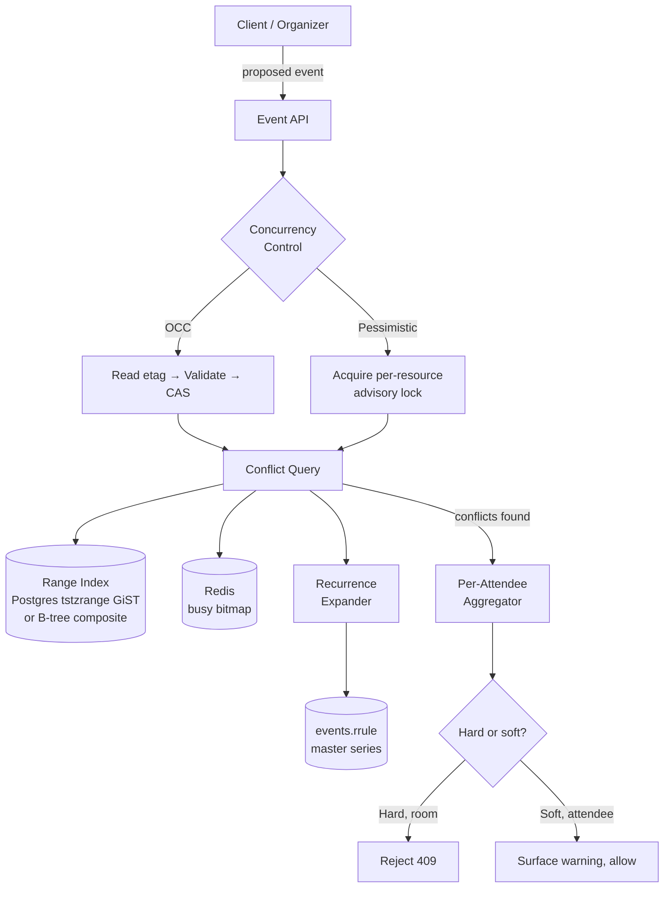

# Conflict Detection — Interval Trees, Range Indexes, and Concurrent-Event Validation

**Date:** 2026-05-01 | **Updated:** 2026-05-01
**Tags:** `system-design` `deep-dive` `calendar` `intervals` `validation`

> **Parent case study:** [Design a Calendar System / Google Calendar](../design-calendar-system.md). This deep-dive expands §5 "Conflict Detection and Overlap Checks".

## Table of Contents

- [Summary](#summary)
- [Overview](#overview)
- [The Overlap Predicate](#the-overlap-predicate)
- [Per-User vs Per-Resource Conflict Semantics](#per-user-vs-per-resource-conflict-semantics)
- [The Read Path — Range Queries on a Time Index](#the-read-path--range-queries-on-a-time-index)
- [Postgres Range Types and the EXCLUDE Constraint](#postgres-range-types-and-the-exclude-constraint)
- [Interval Trees in Memory](#interval-trees-in-memory)
- [The Write Path — OCC vs Pessimistic Lock](#the-write-path--occ-vs-pessimistic-lock)
- [Recurring Events in the Conflict Scope](#recurring-events-in-the-conflict-scope)
- [Tentative, Transparent, and All-Day Edge Cases](#tentative-transparent-and-all-day-edge-cases)
- [Multi-Attendee Conflict Aggregation](#multi-attendee-conflict-aggregation)
- [Soft Conflicts and Back-to-Back Warnings](#soft-conflicts-and-back-to-back-warnings)
- [Race Conditions and Concurrent Mutations](#race-conditions-and-concurrent-mutations)
- [Worked Example: Room Booking with 1000 Events](#worked-example-room-booking-with-1000-events)
- [Anti-Patterns](#anti-patterns)
- [Related](#related)
- [References](#references)

## Summary

Conflict detection is the single most-asked write-path question in a calendar: **does this proposed event overlap anything that already exists for the people and rooms it touches?** The trivial answer — "scan all events for each attendee" — collapses immediately at scale. The production answer is a layered system: a **half-open overlap predicate** (`A.start < B.end AND B.start < A.end`) sitting on top of a **range-aware index** (Postgres `tstzrange` with a GiST index, an interval tree in memory, or a packed busy-bitmap aggregate), wrapped in a **concurrency-control discipline** (optimistic with `etag`/`SEQUENCE` revalidation for the common case, pessimistic per-resource lock for the strict no-overlap rule that rooms demand). Around the core sit four subtleties that produce most real bugs: **recurrence** (the conflict scope spans both materialized occurrences and rule-based future expansion), **time zones** (an "all-day in London" overlapping with "23:00 timed in Tokyo" depends on whose zone you display), **transparency** (`TENTATIVE` and `TRANSP:TRANSPARENT` events must not trigger hard conflicts), and **multi-attendee aggregation** (each attendee owns their own conflict view; the organizer sees the union). This deep-dive covers each layer, the data-structure choices, and the anti-patterns that produce false positives, missed conflicts, or double-bookings under contention.

## Overview

The parent case study (§5) frames conflict detection as a read-path concern surfaced at write time: when the user is about to create or accept an event, the UI shows "you have a conflict at this time," and the organizer sees per-attendee conflict counts when proposing a meeting. Section 5 of the parent doc lists the surface; this document opens the implementation.

The questions answered here:

1. **What is the canonical overlap predicate, and why is it half-open?** Why `A.start < B.end AND B.start < A.end`, and what `<=` would silently break.
2. **How is overlap indexed in storage?** B-tree composite indexes on `(calendar_id, end_time DESC, start_time)` for naive backends; Postgres `tstzrange` with GiST or SP-GiST for native range support; interval trees for in-memory hot paths.
3. **How do you make rooms strictly non-overlapping?** Postgres `EXCLUDE` constraint with `&&` operator, or a per-resource serialization lock.
4. **What does the write path look like under concurrency?** Optimistic with `etag` revalidation, or pessimistic with a `SELECT ... FOR UPDATE` on a per-resource lock row.
5. **How does recurrence enter the conflict scope?** Both the materialized window in `user_calendar_view` and the on-demand expansion of master series whose `RRULE` could produce instances in the requested range.
6. **What about transparent events?** Events marked `TRANSP:TRANSPARENT` or `TENTATIVE` are treated as soft signals or skipped entirely depending on policy.
7. **How is multi-attendee conflict aggregated?** Per-attendee conflict checks fan out independently; the organizer view aggregates with attendee-level granularity ("4 of 12 occurrences conflict for Bob").
8. **What races exist, and how do you serialize them?** Two organizers booking the same room concurrently must not both succeed; the EXCLUDE constraint or a per-resource advisory lock is the standard answer.



## The Overlap Predicate

Two intervals `A = [A.start, A.end)` and `B = [B.start, B.end)` overlap if and only if:

```text
A.start < B.end  AND  B.start < A.end
```

This is the **half-open interval** form. Both inequalities are strict (`<`, not `<=`). The intervals are treated as half-open because that is how clocks and durations actually work: a meeting from 09:00 to 10:00 ends *at* 10:00, and another meeting starting *at* 10:00 does not overlap it. The instant 10:00:00 belongs to the second meeting only.

If you use closed intervals (`<=`), back-to-back meetings produce false-positive conflicts. If you use open-open, zero-length events vanish. Half-open is the only form that round-trips through both addition and subtraction of durations without surprise.

The predicate works for any pair of representations:

```text
# UTC instants
A.dtstart_utc < B.dtend_utc AND B.dtstart_utc < A.dtend_utc

# Postgres tstzrange with overlap operator
A.timerange && B.timerange    -- equivalent to the predicate above

# Local-time + zone (must convert one side to the other zone first)
to_utc(A.dtstart_local, A.zone) < to_utc(B.dtend_local, B.zone) AND ...
```

The third form is where time-zone bugs creep in. **Conflict checks must always run in a single canonical time scale**, almost always UTC. The local times are a display concern; the comparison is in UTC. A naive code path that compares `dtstart_local` directly across two events in different zones produces silent wrong answers.

```text
Event X: 09:00–10:00 America/New_York   = 13:00–14:00 UTC (in EST)
Event Y: 14:00–15:00 Europe/London      = 13:00–14:00 UTC (winter)

Local-string compare: "09:00" < "15:00" AND "14:00" < "10:00"  → false (no overlap)
UTC compare:          13:00:00 < 14:00:00 AND 13:00:00 < 14:00:00 → true  (overlap)
```

The local-string compare misses the conflict entirely. Always normalize.

For all-day events, the canonical representation is a date-only range without a zone, expanded to a UTC instant only when comparing to a timed event. The expansion uses the *attendee's* zone for display, but the underlying overlap test is symmetric: an all-day event in zone Z covers the UTC range `[startOfDay(Z), startOfDay(Z) + 1 day)`. Two attendees in different zones may legitimately disagree about whether a given timed event "overlaps" an all-day event — and the resolution is to compute the overlap in each attendee's home zone, not in some global UTC midnight.

## Per-User vs Per-Resource Conflict Semantics

Calendar conflicts come in two flavors, and the system must handle them differently.

| Conflict type | Subject | Rule | Enforcement |
|---|---|---|---|
| **Per-user (attendee)** | A human user | Many users intentionally double-book; conflicts are **informational warnings**, not blocks | Surface in UI, do not reject the write |
| **Per-resource (room, equipment)** | A bookable resource calendar | Strict non-overlap — a single room cannot host two simultaneous meetings | Reject the write with HTTP 409 if conflict exists |

The data model already separates these: a `calendars.kind` column (`'user'` vs `'resource'`) drives the policy. Resource calendars carry a constraint that user calendars do not.

The same conflict-detection machinery serves both, with a single policy switch:

```text
def check_conflicts(event, attendees):
    conflicts = []
    for attendee in attendees:
        cal = lookup_calendar(attendee)
        overlapping = query_overlapping_events(cal.id, event.start_utc, event.end_utc)
        # Filter out events the attendee has marked transparent
        overlapping = [e for e in overlapping if not is_transparent(e, attendee)]
        if overlapping:
            conflicts.append((attendee, overlapping))
    # Decide: warn or block?
    hard_conflicts = [c for c in conflicts if calendar_kind(c.attendee) == 'resource']
    if hard_conflicts:
        return ConflictResult(action='REJECT', conflicts=hard_conflicts)
    return ConflictResult(action='WARN', conflicts=conflicts)
```

The organizer's UI displays both: "Bob is busy at this time (allow / pick another)" for users, and "Conference Room 3B is already booked" with no allow option for resources.

## The Read Path — Range Queries on a Time Index

The hot read query is "give me all events on calendar `C` whose `[start, end)` overlaps `[Q.start, Q.end)`." There are three storage shapes that answer it efficiently.

### B-tree composite index on (calendar_id, end_time DESC, start_time)

For a sharded relational backend without native range types, the standard composite-index approach exploits the fact that `end_time > Q.start` is a prefix-friendly range scan if `end_time` is the leading-after-equality column.

```sql
CREATE INDEX events_by_cal_endtime
  ON events (calendar_id, dtend_utc DESC, dtstart_utc);

-- Query: overlaps with [q_start, q_end)
SELECT *
FROM events
WHERE calendar_id = $1
  AND dtend_utc   > $q_start    -- excludes events that ended before q_start
  AND dtstart_utc < $q_end      -- excludes events that start after q_end
  AND status = 'confirmed';
```

The index seek narrows to events on `calendar_id` ending after `q_start`; the predicate filter on `dtstart_utc < q_end` is checked per row. For a typical calendar with thousands of events spread over years and a weekly query window, this returns in single-digit milliseconds.

The leading `calendar_id` keeps shards aligned to calendar; the `DESC` on `dtend_utc` lets the planner walk from the most recent event backward, which usually cuts the candidate set early because most queries look at near-future windows.

This index does *not* answer "give me all events that overlap" cheaply when the dataset is sparse and the window is huge — you'd still scan many rows. For those cases, the next two structures win.

### Postgres tstzrange with GiST/SP-GiST

When the storage layer is Postgres (or a system that can store ranges natively), promote the start/end pair to a `tstzrange` column with a GiST index on it. Queries become first-class range predicates with operator support.

```sql
ALTER TABLE events
  ADD COLUMN time_range tstzrange
  GENERATED ALWAYS AS (tstzrange(dtstart_utc, dtend_utc, '[)')) STORED;

CREATE INDEX events_time_range_gist
  ON events USING gist (calendar_id, time_range);

-- Overlap query
SELECT *
FROM events
WHERE calendar_id = $1
  AND time_range && tstzrange($q_start, $q_end, '[)');
```

The `&&` operator is the range-overlap test, native and indexed by GiST. The `[)` bound matches the half-open semantics — start inclusive, end exclusive.

GiST indexes shine for skewed datasets (a few users with thousands of events alongside many users with dozens) because the index structure adapts to data distribution. SP-GiST is an alternative for very tightly clustered data with predictable patterns; benchmark before committing.

### In-memory interval tree

For the hottest path — conflict checks during a slot-finding fan-out across 12 attendees — even single-digit-ms database queries become a tail-latency hazard. The mitigation is to cache a per-user interval representation in memory.

The classic answer is the **augmented interval tree** (Cormen, Leiserson, Rivest, Stein — *Introduction to Algorithms*, Chapter 14). It's a balanced BST keyed on interval start, with each node augmented with the maximum endpoint of any interval in its subtree. The augmentation lets an overlap query prune entire subtrees in O(log n).

We cover the structure in detail under [Interval Trees in Memory](#interval-trees-in-memory).

For systems that already maintain a per-user busy bitmap (parent doc §3 Free-Busy), the bitmap is itself a kind of interval index — overlap reduces to a bitmask AND and is constant-time per slot. Bitmaps are coarser (typically 5-min granularity) but extremely cheap.

## Postgres Range Types and the EXCLUDE Constraint

For resource calendars (rooms, equipment) where overlap is strictly forbidden, Postgres offers a constraint that pushes the rule into the storage layer itself.

```sql
CREATE EXTENSION IF NOT EXISTS btree_gist;  -- needed to combine btree + gist in EXCLUDE

CREATE TABLE room_bookings (
    booking_id   BIGSERIAL PRIMARY KEY,
    room_id      BIGINT NOT NULL,
    event_id     BIGINT NOT NULL REFERENCES events(event_id),
    time_range   tstzrange NOT NULL,
    status       TEXT NOT NULL DEFAULT 'confirmed',

    -- The overlap-prevention constraint:
    EXCLUDE USING gist (
        room_id      WITH =,
        time_range   WITH &&
    ) WHERE (status = 'confirmed')
);
```

Read this constraint as: "no two rows for the same `room_id` may have overlapping `time_range`, when both are confirmed." The `&&` operator is range overlap; `=` is the equality the planner uses to partition rows by room. The `WHERE` clause excludes cancelled or tentative bookings from the constraint scope, so cancelling a booking releases the slot.

When two concurrent transactions try to insert overlapping rows, the second one fails with a `23P01 exclusion_violation` error. The application catches it and translates to a 409 Conflict response. This is the **strongest available guarantee**: the database itself prevents double-booking, no matter how the application races. A bug in application-level conflict checking cannot violate the room invariant; the constraint catches it.

Caveats:

1. **Cost.** EXCLUDE constraints are evaluated on every insert/update with a GiST index probe. For high-write resource calendars, measure; for typical room booking volumes (single-digit writes per second per room), the cost is negligible.
2. **Deferred constraints.** EXCLUDE can be `DEFERRABLE INITIALLY DEFERRED` for transactions that need to do multi-step rearrangements (e.g., move event A to slot X, move event B to slot Y, where X was where B was). The check runs at COMMIT.
3. **Update-with-overlap.** Updating an existing row to a new range is checked the same way; the row's old range is replaced with the new one before re-evaluation, so a no-op update doesn't conflict with itself.
4. **Recurring events.** The constraint checks materialized rows. Recurring series must be expanded into per-instance rows for the resource calendar; a master `rrule` row alone isn't sufficient. Most production systems materialize resource bookings into their own row-per-occurrence table specifically for this reason.

For the parent storage discussion of relational vs key-value choices behind these constraints, see [`../../../building-blocks/databases-as-a-component.md`](../../../building-blocks/databases-as-a-component.md).

## Interval Trees in Memory

When a per-user busy index needs to live in memory — for example, a Redis cache holding a hot user's known busy intervals, or an in-process cache in a slot-finding service — the interval tree is the canonical structure.

### Structure

A balanced binary search tree, keyed on interval start. Each node stores:

- `interval = [low, high)`
- Left and right children
- `max` = the maximum `high` value in the subtree rooted at this node

The augmentation is the entire trick: when querying for overlap with `[q_low, q_high)`, you can prune the entire left subtree if `left.max <= q_low` (all intervals over there end before the query starts).

```text
Query overlap with q = [q_low, q_high):
    node = root
    results = []
    while node is not None:
        if intervals_overlap(node.interval, q):
            results.append(node.interval)
        if node.left is not None and node.left.max > q_low:
            recurse into left
        if node.right is not None and node.interval.low < q_high:
            recurse into right
    return results
```

Insert and delete maintain the BST property and re-augment `max` along the path back to the root. Using a self-balancing variant (red-black or AVL) keeps the height at O(log n).

### Reference Python implementation

```python
"""
Interval tree (Cormen et al., CLRS Ch. 14) — augmented BST with max-endpoint.
This is a teaching implementation, not balanced. For production, use a
red-black or AVL variant such as `intervaltree` on PyPI, or port from
`bx-python`/`banyan` libraries which are battle-tested.
"""

from dataclasses import dataclass
from typing import Optional, List


@dataclass
class Interval:
    low: int   # half-open [low, high)
    high: int
    payload: object = None

    def overlaps(self, other: "Interval") -> bool:
        return self.low < other.high and other.low < self.high


@dataclass
class Node:
    interval: Interval
    max_high: int
    left: Optional["Node"] = None
    right: Optional["Node"] = None


class IntervalTree:
    def __init__(self) -> None:
        self.root: Optional[Node] = None

    def insert(self, iv: Interval) -> None:
        self.root = self._insert(self.root, iv)

    @staticmethod
    def _insert(node: Optional[Node], iv: Interval) -> Node:
        if node is None:
            return Node(interval=iv, max_high=iv.high)
        if iv.low < node.interval.low:
            node.left = IntervalTree._insert(node.left, iv)
        else:
            node.right = IntervalTree._insert(node.right, iv)
        node.max_high = max(
            node.interval.high,
            node.left.max_high if node.left else node.interval.high,
            node.right.max_high if node.right else node.interval.high,
        )
        return node

    def query(self, q: Interval) -> List[Interval]:
        out: List[Interval] = []
        self._query(self.root, q, out)
        return out

    @staticmethod
    def _query(node: Optional[Node], q: Interval, out: List[Interval]) -> None:
        if node is None:
            return
        # Prune: if the entire subtree ends before the query starts, skip.
        if node.max_high <= q.low:
            return
        # Check this node.
        if node.interval.overlaps(q):
            out.append(node.interval)
        # Always check the left subtree (pruned above by max_high).
        IntervalTree._query(node.left, q, out)
        # Check right only if it could contain overlapping starts.
        if node.interval.low < q.high:
            IntervalTree._query(node.right, q, out)


# Usage in a calendar conflict check
def conflict_check(tree: IntervalTree, proposed: Interval) -> bool:
    return len(tree.query(proposed)) > 0
```

### When to use which

| Scope | Pick |
|---|---|
| Persistent, per-calendar, queried via SQL | Postgres `tstzrange` + GiST |
| Persistent, sharded NoSQL, range index unavailable | Composite B-tree on `(calendar_id, end DESC, start)` |
| In-memory, hot user, sub-millisecond required | Interval tree (red-black augmented) |
| Coarse busy-or-free at fixed slot granularity | Busy bitmap (per parent §3) |
| Recurring event scope where instances are computed on the fly | Pre-expand to a temporary interval list, then query |

For probabilistic in-memory ordered structures with strong concurrency properties (an alternative when many threads read the same per-user view), see [`../../../data-structures/skip-lists.md`](../../../data-structures/skip-lists.md). Interval trees and skip lists solve different problems — interval trees specialize in range overlap, skip lists in ordered access — but the implementation discipline (keep the structure resident in cache, avoid pointer chasing) carries across.

## The Write Path — OCC vs Pessimistic Lock

Conflict detection is part of the write path: the moment a user submits "create this event," the server runs the conflict check and decides whether to surface a warning, reject, or accept. Under concurrency, the question becomes: **can two concurrent writes produce a state that violates the rule?**

For user calendars (warning, not blocking), the answer doesn't matter much — both writes succeed, both surface their warnings, and the user sees a double-booked calendar that they intentionally created. For resource calendars (strict no-overlap), the answer matters: two organizers booking the same room at the same time must result in exactly one success and one rejection.

### Optimistic concurrency control (OCC)

The standard OCC pattern reads the current state, computes the new state, and writes only if the read is still valid. For events, the version token is the row's `etag` (a hash of the row's content) or RFC 5545 `SEQUENCE` plus `DTSTAMP`.

```text
1. Read event with id E → get etag E1
2. Compute new state (move the event to a new time)
3. Run conflict check at the new time
4. UPDATE events SET ... , etag = E2 WHERE event_id = E AND etag = E1
5. If 0 rows updated → someone else moved it; retry from step 1
```

OCC works well for human-driven edits because the contention is naturally low (a user typically owns their own calendar, and the chance of a concurrent edit on the same event is small). It does not solve the room-double-booking problem on its own — two organizers can each pass their own conflict check, then race to insert two non-overlapping rows that, taken together, overlap the room's other bookings.

The fix is to combine OCC with a **constraint at the storage layer** (the EXCLUDE constraint above) so that even if both organizers pass their app-level check, exactly one INSERT survives.

### Pessimistic locking per (calendar_id, time_window)

When EXCLUDE isn't available (sharded NoSQL, multi-region), the alternative is to serialize conflict-bearing writes through an explicit lock keyed by the resource and a coarse time bucket.

```sql
-- Acquire an advisory lock for this room and time bucket
SELECT pg_advisory_xact_lock(hashtext($1 || ':' || $2));
-- $1 = room_id, $2 = day-bucket of the proposed event

-- Now safely query for conflicts, decide, insert
INSERT INTO room_bookings (...) VALUES (...);

COMMIT;  -- releases the lock
```

The lock granularity matters. Locking per-room is too coarse (a popular room serializes all bookings, even on different days). Locking per (room, day) is usually fine. Locking per (room, hour) is common for very-high-volume rooms.

The downside is that the lock's lifetime is the transaction's lifetime; long transactions block other writers. Keep the lock acquisition immediately before the conflict query and the insert; do not hold it across network calls, recurrence expansion that hits external services, or user input.

For broader treatment of distributed transactional patterns (sagas, two-phase commit, idempotency keys) when the conflict check spans services, see [`../../../data-consistency/distributed-transactions.md`](../../../data-consistency/distributed-transactions.md).

### Pseudocode: end-to-end write with conflict check

```text
def create_event(req):
    event = parse_and_validate(req)
    # Expand recurring scope into the conflict-check window
    instances = expand_recurrence(event, window=event.scope_window)

    with transaction():
        # For each affected resource calendar (rooms), acquire the lock
        for resource in event.resources:
            advisory_lock(hash(resource.id, event.day_bucket))

        # For each attendee + each resource, run the overlap query
        all_conflicts = []
        for attendee in event.attendees:
            cal_id = attendee.primary_calendar_id
            for inst in instances:
                conflicts = query_overlapping(cal_id, inst.start_utc, inst.end_utc)
                conflicts = filter_transparent(conflicts, attendee)
                if conflicts:
                    all_conflicts.append((attendee, inst, conflicts))

        hard = [c for c in all_conflicts if c.attendee.kind == 'resource']
        if hard:
            raise Conflict409("Resource conflict", details=hard)

        # Insert. If an EXCLUDE constraint is in play and concurrent writers
        # slipped past our lock, the constraint catches it.
        try:
            insert_event(event, instances)
        except ExclusionViolation as e:
            raise Conflict409("Race lost", details=e)

        # Soft conflicts are returned in the success response, not as errors.
        return CreatedResponse(event, soft_conflicts=all_conflicts)
```

## Recurring Events in the Conflict Scope

A naive conflict check misses any conflict that involves a recurring event because the master series row stores only the rule, not the instances.

The conflict scope must be the *materialized* events on the affected calendars over the proposed event's time window. Two ways to materialize:

1. **Read the per-user, per-month materialized view (`user_calendar_view`).** This is the cheap path. The view (parent doc Data Model) holds expanded instances for the rolling ±13 months around now, partitioned by `(user_id, yyyy_mm)`. A conflict query is a simple range scan on this view.

2. **Expand on the fly for cold ranges.** For a query that spans outside the materialized window, the recurrence expander is called: read the master series row for each calendar, generate the instances within the window, then run the overlap test against this in-memory list.

```text
def conflict_check_with_recurrence(calendar_id, q_start, q_end):
    materialized_results = query_user_calendar_view(calendar_id, q_start, q_end)
    if window_within_materialized_horizon(q_start, q_end):
        return materialized_results

    # Cold path: expand master series
    series_rows = read_master_series_for_calendar(calendar_id)
    cold_instances = []
    for s in series_rows:
        cold_instances.extend(expand_rrule(s, q_start, q_end))
    return materialized_results + cold_instances
```

For the canonical RRULE expansion logic, see the sibling deep-dive [`./rrule-expansion.md`](./rrule-expansion.md).

When the *proposed* event is itself recurring, the conflict check must run for each instance of the proposed event against each instance of every existing event in the window — the cross product. Mitigation: typical proposals are bounded recurrences (weekly for a year ≈ 52 instances), and the per-instance check is fast. For unbounded series, cap the conflict check at a horizon (e.g., 13 months) and surface "conflicts within the next year" rather than trying to enumerate forever.

The UI typically summarizes: "This recurring meeting conflicts with existing events on 4 of 12 occurrences" with a drill-down. Per-instance accept/decline (per parent doc) lets the user resolve each conflict independently without rejecting the whole series.

## Tentative, Transparent, and All-Day Edge Cases

Three event flavors require special-casing in the overlap predicate.

### Transparent (RFC 5545 TRANSP:TRANSPARENT)

An event marked `TRANSP:TRANSPARENT` declares "I am on the calendar but I do not consume time" — typical for personal reminders, holidays, or out-of-office indicators that the user wants to see but not have block their availability. These events:

- Do not contribute to busy bitmaps (parent doc §3).
- Are excluded from conflict checks by default.
- Are still rendered in calendar views.

The conflict query must include a filter `WHERE transparency = 'OPAQUE'` (the default) or equivalent. A bug here produces false positives — a user can't book a meeting because a "Bob's birthday" event is in the way.

### Tentative (PARTSTAT:TENTATIVE or STATUS:TENTATIVE)

A tentative RSVP from an attendee or a tentative event status creates a soft conflict. Two policies:

- **Lenient.** Tentative events do not block other invites; they are effectively transparent for conflict purposes.
- **Strict.** Tentative events surface as warnings ("you tentatively accepted X at this time") but do not block.

Most production systems pick strict-warning. Bitmaps with two bits per slot (busy/tentative) handle this naturally; relational queries return both and the application layer decides.

### All-day events

An all-day event has no zone and a date-only range. To compare against a timed event, expand to a UTC range using the *attendee's* zone:

```text
all_day_event(date='2026-05-15', user_zone='America/New_York')
  → utc_range = [2026-05-15T04:00:00Z, 2026-05-16T04:00:00Z)   -- in summer (EDT, UTC-4)
```

A timed event from `2026-05-15T03:00:00Z` to `04:00:00Z` (which is May 14 23:00–24:00 in NY) does *not* overlap the all-day event in the user's view because the all-day event covers May 15 in NY, not the moments before midnight on May 14.

The same all-day event compared in `Asia/Tokyo` covers a different UTC range entirely:

```text
all_day_event(date='2026-05-15', user_zone='Asia/Tokyo')
  → utc_range = [2026-05-14T15:00:00Z, 2026-05-15T15:00:00Z)
```

Two attendees of the same meeting in different zones may legitimately get different conflict answers. The right behavior is to evaluate each attendee's view in their own zone — not to try to find a single global truth.

For deeper tz semantics, parent §2 and the IANA tzdb references.

## Multi-Attendee Conflict Aggregation

When the organizer proposes a meeting with N attendees, the conflict check fans out: N independent conflict queries, one per attendee's primary calendar. The results are aggregated for the organizer's UI:

```text
Organizer proposes: "Project Sync, Mon May 11, 14:00–15:00 UTC, attendees=[A, B, C, D, E]"

Conflict aggregator:
  A → no conflicts
  B → conflicts with "1:1 with manager" 14:30–15:00 (hard)
  C → conflicts with "Lunch (tentative)" 13:00–14:30 (soft)
  D → no conflicts
  E → no conflicts (free-busy unavailable, external attendee)

Aggregated view to organizer:
  - 1 hard conflict (B)
  - 1 soft conflict (C, tentative)
  - 1 attendee unknown (E, external)
  - 2 attendees free
```

The fan-out is often parallelized (N concurrent reads against the per-user busy bitmap or the events table). For a 12-attendee meeting, 12 reads in parallel against an in-memory bitmap return in low milliseconds.

```text
async def per_attendee_conflict_check(event):
    tasks = [
        check_one_attendee(att, event.start_utc, event.end_utc)
        for att in event.attendees
    ]
    results = await asyncio.gather(*tasks)
    return aggregate(results)
```

The aggregation respects per-attendee transparency: an event marked private on attendee A's calendar still counts as "busy" for the organizer's aggregate, but the organizer cannot see the title — only "A is busy at this time." This is a privacy boundary; the conflict-check service must never leak event details across calendars.

For external attendees whose free-busy is not available locally, the system falls back to a federation protocol (iMIP, iSchedule) or shows "free-busy unavailable" for that attendee. The organizer can proceed; the unknown is surfaced honestly.

For the slot-finding side of this aggregation (where the system actively searches for a slot that satisfies all attendees), see [`./scheduling-assistant.md`](./scheduling-assistant.md). For the underlying free-busy data model that powers the aggregation, see [`./free-busy-queries.md`](./free-busy-queries.md).

## Soft Conflicts and Back-to-Back Warnings

Beyond hard overlap, calendars often surface soft signals:

- **Back-to-back.** A new event that ends exactly when another starts is technically not an overlap (half-open interval semantics) but is a UX concern. Surface a "back-to-back" warning: "you have a meeting ending at 14:00 and this new one starts at 14:00 — no buffer."
- **Crowded day.** More than N meetings already on this day may warrant a warning.
- **Outside working hours.** Acceptance outside the attendee's configured working hours surfaces a warning, not a block.
- **Travel-time conflict.** Two events with different physical locations that don't allow time to travel between them (when the calendar has location-aware metadata).
- **Recurring partial conflicts.** "This recurring invite conflicts with your standup on 4 of 12 occurrences" — the user can accept the series and decline the conflicting instances.

These are all *informational*, not blocking. The data path is the same conflict query, with additional filters and post-processing:

```text
def soft_signals(proposed, attendee_results):
    signals = []
    # back-to-back
    adj = query_adjacent_events(proposed.start_utc, proposed.end_utc, threshold=timedelta(0))
    for a in adj:
        signals.append(SoftSignal('back-to-back', adj=a))
    # outside working hours
    if not within_working_hours(proposed, attendee.working_hours, attendee.zone):
        signals.append(SoftSignal('outside-working-hours'))
    # crowded day
    if count_events_on_day(attendee, proposed.day) > 8:
        signals.append(SoftSignal('crowded-day'))
    return signals
```

The UI groups hard conflicts (rejected for resources, warned for users) and soft signals (always informational) into separate sections. The system never auto-resolves soft signals; the human always decides.

## Race Conditions and Concurrent Mutations

The trickiest conflict scenarios involve sequences of mutations rather than single creates.

### Scenario A: Concurrent move and create on the same room

```text
T1: Room R has booking 09:00–10:00.
T2: Org 1 wants to move it to 10:00–11:00.
T3: Org 2 wants to create a new booking 10:30–11:30.

If T2 and T3 are concurrent and neither sees the other:
  - T2 sees the room free 10:00–11:00 (only its own booking exists). Moves. PASS.
  - T3 sees the room free 10:30–11:30 (only the original 09:00–10:00 exists). Inserts. PASS.

End state: room has bookings 10:00–11:00 (moved) and 10:30–11:30 (new) — overlapping.
```

The EXCLUDE constraint catches this at commit time: the second transaction to commit fails. With the constraint, exactly one of T2 or T3 succeeds; the other gets a 409 and retries (and likely rejects).

Without the constraint, the race produces silent double-booking. The pessimistic alternative is to lock the room's row for the duration of any conflict-bearing write — `SELECT ... FROM rooms WHERE id = $1 FOR UPDATE` or `pg_advisory_xact_lock(room_id)`. The lock serializes T2 and T3; the second to acquire sees the first's write and decides correctly.

### Scenario B: RSVP race

Less critical because RSVPs don't block writes, but worth handling: two attendees on the same event RSVP simultaneously, and the organizer's UI shows a slightly stale count. Eventual consistency is fine here; the canonical RSVP state lives in `attendees` rows with sequence numbers, and the count is rebuilt on read or on a delayed worker.

### Scenario C: Cancel-during-conflict-check

A user is checking conflicts for a proposed event while the conflicting event is being cancelled. The conflict check returns a stale conflict that no longer applies. Two mitigations:

- The conflict check reads at the same snapshot as the eventual write (read-write transaction). For OCC, the etag check at write time catches the staleness.
- The application layer revalidates the conflict at commit and surfaces "conflict resolved during your edit — proceeding."

The right discipline: the conflict check is **part of the write transaction**, not a separate read. Anything else admits time-of-check-to-time-of-use bugs.

## Worked Example: Room Booking with 1000 Events

Concrete numbers to illustrate the read path's performance.

### Setup

- Room calendar `R` has 1000 confirmed bookings spanning the past 12 months.
- Each booking is a single-instance event (rooms typically don't recur).
- Schema: `room_bookings(room_id, event_id, time_range tstzrange, status)`.
- Index: `EXCLUDE USING gist (room_id WITH =, time_range WITH &&) WHERE (status = 'confirmed')`.

### Query: "Is room R free 09:00–10:00 on 2026-05-15?"

```sql
SELECT booking_id, event_id, time_range
FROM room_bookings
WHERE room_id = $1
  AND time_range && tstzrange('2026-05-15T09:00:00Z', '2026-05-15T10:00:00Z', '[)')
  AND status = 'confirmed';
```

Execution:

1. **Index probe.** GiST index on `(room_id, time_range)` seeks to the room's subtree. The internal nodes of GiST store bounding intervals; the probe descends to leaves whose bounding interval intersects the query range.
2. **Leaf scan.** Among the ~1000 leaf entries for room R, GiST returns only those whose interval may overlap. For a typical 1-hour query window, this is at most a handful — bounded by the count of bookings whose time range intersects the requested hour.
3. **Predicate filter.** The `status = 'confirmed'` filter is partial-index aware (the EXCLUDE constraint's `WHERE` clause was applied at index build), so non-confirmed rows aren't even considered.
4. **Result.** Empty array → room is free. Non-empty → room is booked, with the conflicting bookings returned for the UI.

Expected latency: sub-millisecond on a warm cache. The 1000-row dataset fits in a single 8 KB page or two; the GiST index is similarly tiny.

### Query plan inspection

```text
EXPLAIN (ANALYZE, BUFFERS)
 SELECT ... ;

 Index Scan using room_bookings_excl on room_bookings
   Index Cond: ((room_id = $1) AND (time_range && '...'))
   Filter: (status = 'confirmed')
   Buffers: shared hit=3
   Execution Time: 0.142 ms
```

3 buffer hits, 0.142 ms — well within budget. For the slot-finder fanning out across 50 attendees + 5 candidate rooms, this multiplies to 275 queries per slot proposal. At 0.15 ms per query, parallelized with 10 connections, the wall-clock time is in single-digit milliseconds — comfortably under the 100 ms budget the parent doc commits to.

### What happens at 1,000,000 events

For a heavily used room with a million historical bookings (a multi-decade horizon — unrealistic but illustrative), the GiST index still provides O(log n) probe time. The leaf scan is still bounded by overlapping rows, not total rows. The bottleneck shifts from the query itself to the cost of writing the index on every insert (O(log n) GiST descent + node split when leaves overflow). For very high-write workloads, partition the table by year and let old partitions become read-mostly; the EXCLUDE constraint must then live on each partition, with a coordinator constraint to prevent cross-partition overlaps if those are possible (rare for room bookings, common for long-running recurring events).

## Anti-Patterns

1. **Linear scan of all events for the calendar.** "For each event in this calendar, check if it overlaps." O(N) per query, where N grows without bound over the calendar's lifetime. At 10,000 events a query takes tens of milliseconds; at 100,000, hundreds. Always have a range-aware index — composite B-tree, GiST tstzrange, or interval tree. The conflict check is a hot read; it must be O(log N) or better.
2. **Closed-interval overlap predicate (`<=`).** Using `A.start <= B.end` produces false positives on back-to-back meetings: a 09:00–10:00 meeting "conflicts" with a 10:00–11:00 meeting. Half-open intervals (`<`) are the only correct semantics. Document this explicitly because every team has someone who reflexively writes `<=`.
3. **Comparing local times across zones.** Running the overlap predicate on `dtstart_local` strings or naive datetimes silently misses conflicts that exist in UTC. Always normalize to UTC for the comparison; preserve the local + zone fields for display only.
4. **Forgetting transparency.** A conflict query that doesn't filter `WHERE transparency = 'OPAQUE'` produces false positives on personal reminders, holidays, OOO indicators. The user can't book any meeting because their birthday is in the way. Always filter; default-OPAQUE should still go through the WHERE clause for clarity.
5. **Ignoring tentative state.** Treating `TENTATIVE` events the same as confirmed produces hard rejections where a warning is appropriate. Pick a policy (warn but allow) and apply consistently.
6. **Missing recurrence in conflict scope.** Querying only the materialized window (`user_calendar_view`) misses any recurring-event instance that the materializer hasn't generated yet — particularly events outside the rolling ±13 months. Either expand the window on-demand for cold ranges or document the horizon limit in the API.
7. **Using floating-point time arithmetic.** Storing event times as floats or doing duration math in seconds-as-doubles introduces rounding bugs. Use proper datetime types and integer-millisecond/microsecond arithmetic.
8. **Conflict-check-then-write without revalidation.** Running the conflict query, then later (in a different transaction or after a network round-trip) inserting the event, admits TOCTOU races. The check and the write must be in the same transaction, or the write must include a constraint (EXCLUDE) that rechecks at commit.
9. **Per-room mutex held across user input.** "Lock the room while the user picks a time slot" — fine in principle, deadly in practice because users are slow and the lock blocks every other booker. Use optimistic concurrency: the user proposes a slot, the server validates and inserts in a single short transaction, and the user retries on 409.
10. **Trusting the client to detect conflicts.** Client-side conflict UI is convenient but cannot be authoritative — clients have stale data and can be tampered with. The server runs conflict detection at write time, always.
11. **Aggregating conflicts at the wrong granularity.** Returning "this event has conflicts" without per-attendee breakdown forces the organizer to dig. Always return per-attendee, per-instance conflict details.
12. **Letting external-attendee unknowns block writes.** "Bob's free-busy is unavailable, so we can't book this" forces the organizer to delete external attendees to proceed. Surface "Bob's availability unknown" and proceed; the organizer decides.
13. **Re-evaluating recurrence rules on every conflict check.** Expanding `RRULE` for every query is expensive at scale. Cache the expansion in `user_calendar_view` and only re-expand for cold ranges or after the master series mutates.
14. **Treating an EXCLUDE-constraint failure as a generic 500.** The `23P01 exclusion_violation` error code means "your write would have caused an overlap." Translate to HTTP 409 with a body that names the conflicting booking, so the client can render a useful "this slot is now taken" message and offer alternatives.
15. **Storing recurrence as expanded rows in the resource table.** While EXCLUDE requires materialized rows, materializing thousands of rows for every recurring resource booking is wasteful and slows mutations. Bound the materialization horizon (e.g., 13 months) and re-materialize ahead lazily; the master series row is the canonical truth.
16. **Forgetting cross-calendar conflicts.** A user with separate work, personal, and on-call calendars expects "busy" to OR across all of them. A conflict check restricted to a single calendar misses conflicts users care about. The aggregation must read from every calendar the user owns or has flagged for conflict purposes.

## Related

- [`./free-busy-queries.md`](./free-busy-queries.md) — sibling deep-dive; the per-user busy bitmap that powers fast conflict checks at slot-finding fan-out scale.
- [`./rrule-expansion.md`](./rrule-expansion.md) — sibling deep-dive; the recurrence engine whose output feeds the conflict scope for recurring events.
- [`./scheduling-assistant.md`](./scheduling-assistant.md) — sibling deep-dive; the slot-finder that aggregates per-attendee conflict checks across a window to propose meeting times.
- [`../design-calendar-system.md`](../design-calendar-system.md) — parent case study; this doc expands the *Conflict Detection and Overlap Checks* deep-dive subsection (§5).
- [`../../../building-blocks/databases-as-a-component.md`](../../../building-blocks/databases-as-a-component.md) — foundation; database choice trade-offs that underlie the range-index decisions (Postgres vs sharded NoSQL vs in-memory).
- [`../../../data-consistency/distributed-transactions.md`](../../../data-consistency/distributed-transactions.md) — foundation; broader transactional patterns (sagas, idempotency, two-phase commit) for conflict checks that span services or shards.
- [`../../../data-structures/skip-lists.md`](../../../data-structures/skip-lists.md) — foundation; an alternative ordered structure to interval trees, useful when many readers concurrently consult the same per-user view.

## References

- PostgreSQL — [Range Types](https://www.postgresql.org/docs/current/rangetypes.html). The canonical documentation for `tstzrange`, range operators (`&&`, `@>`, `<@`), and the bound semantics (`[)`, `[]`, `()`) that determine half-open vs closed comparisons. Read the operator table carefully — `&&` is overlap, distinct from containment.
- PostgreSQL — [`EXCLUDE` constraint syntax (CREATE TABLE)](https://www.postgresql.org/docs/current/sql-createtable.html#SQL-CREATETABLE-EXCLUDE). The constraint that pushes "no two rows overlap on these columns" into the storage layer. Combined with GiST and `tstzrange`, it is the strongest available guarantee against double-booking and the recommended approach for resource calendars in Postgres.
- PostgreSQL — [GiST Indexes](https://www.postgresql.org/docs/current/gist.html). The generalized search tree that supports range-overlap, geometric, and full-text indexing. Used here as the index method for `tstzrange` columns; understanding GiST's bounding-box invariant explains why range overlap queries prune effectively.
- Cormen, Leiserson, Rivest, Stein — *Introduction to Algorithms*, 3rd ed., Chapter 14 (Augmenting Data Structures), Section 14.3 (Interval Trees). The textbook treatment of the augmented red-black tree with max-endpoint, the canonical in-memory structure for range overlap queries. The CLRS pseudocode is the reference implementation most production interval-tree libraries derive from.
- ESRI — [ArcGIS Pro overview](https://www.esri.com/en-us/arcgis/products/arcgis-pro/overview). Spatial indexing for geographic data uses R-trees, which are the 2D analog of interval trees; the pruning and bounding-box techniques generalize directly. Useful for understanding how GiST internally represents range data.
- SQLite — [R*Tree Module](https://www.sqlite.org/rtree.html). SQLite's built-in R-tree implementation supports both 2D spatial and 1D interval queries; for embedded calendar applications without Postgres, this is the native range-index option.
- Apple Developer — [EventKit Framework](https://developer.apple.com/documentation/eventkit/). The macOS/iOS calendar framework; conflict-related APIs (`EKEventStore.events(matching:)` predicates with date ranges) reflect the same half-open overlap semantics this doc describes, applied client-side.
- Google — [Google Calendar API — Events: list](https://developers.google.com/calendar/api/v3/reference/events). Production API reference for `timeMin`/`timeMax` parameters that drive range queries against expanded events; the response shape and pagination model are good reference for designing your own conflict-check endpoint.
