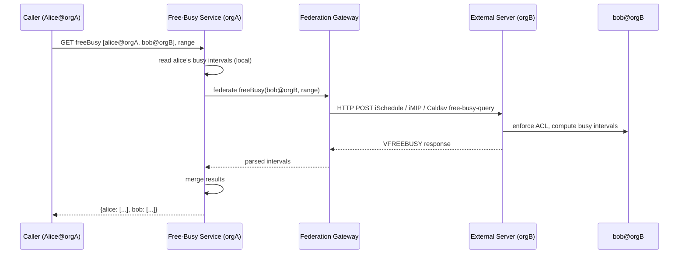

# Free-Busy Queries — Range Aggregation, Privacy, and Cross-Calendar Access

**Date:** 2026-05-01 | **Updated:** 2026-05-01
**Tags:** `system-design` `deep-dive` `calendar` `free-busy` `queries`

> **Companion to:** [`../design-calendar-system.md`](../design-calendar-system.md) — this doc expands the *Free-Busy Queries at Scale* deep-dive (§3) into the storage shapes, query plans, privacy contract, federation paths, and the iCalendar/CalDAV wire formats that make "is X busy at time T?" a tractable read at fleet scale.

## Summary

Free-busy is the most-asked, least-glamorous read in a calendar system. Every render of a scheduling assistant, every "see when your team is free" widget, every Outlook invite drafted against a room — they all hammer this one primitive: **"is user X busy in the interval [t0, t1)?"** The answer must come back fast (sub-100 ms p99 per user), must merge across recurring rules, ad-hoc events, delegated calendars, and resource bookings, and **must not leak event details** — no titles, no descriptions, no attendee lists, just intervals. The hard parts are not the surface API; they are the **range index** that lets you scan a week of intervals without a full table scan, the **privacy contract** that survives every code path including error messages and logs, the **cross-calendar federation** that has to ask "anyone busy?" across a personal calendar plus a delegated executive calendar plus three room calendars, and the **N×M scaling** when a 12-attendee scheduling assistant has to do this for every attendee in parallel. This doc walks the storage layer, the merge algorithm, the cache topology, the cross-org federation handoff, and the wire formats (RFC 5545 `VFREEBUSY`, CalDAV `free-busy-query` REPORT) that pin the contract down.

## Table of Contents

- [Summary](#summary)
- [The Free-Busy Primitive](#the-free-busy-primitive)
- [Privacy Contract](#privacy-contract)
- [Range Aggregation — Merging Intervals](#range-aggregation--merging-intervals)
- [Storage Shape and Indexing](#storage-shape-and-indexing)
- [The Free-Busy Cache Layer](#the-free-busy-cache-layer)
- [Cross-Calendar Lookup and Federation](#cross-calendar-lookup-and-federation)
- [Multi-User Free-Busy — N × M Fan-out](#multi-user-free-busy--n--m-fan-out)
- [Recurring Expansion + Ad-Hoc Merge](#recurring-expansion--ad-hoc-merge)
- [Time-Zone Normalization](#time-zone-normalization)
- [ACL — Free-Busy as a Distinct Permission](#acl--free-busy-as-a-distinct-permission)
- [Tentative vs Busy — Transparency Semantics](#tentative-vs-busy--transparency-semantics)
- [Caching Headers and Versioning](#caching-headers-and-versioning)
- [iCalendar VFREEBUSY](#icalendar-vfreebusy)
- [CalDAV `free-busy-query` REPORT](#caldav-free-busy-query-report)
- [Worked Example — Scheduling Assistant for 5 Attendees Over 1 Week](#worked-example--scheduling-assistant-for-5-attendees-over-1-week)
- [Anti-Patterns](#anti-patterns)
- [Related](#related)
- [References](#references)

## The Free-Busy Primitive

The simplest possible question a calendar can answer:

```text
isBusy(user, [t0, t1)) → boolean
```

Generalized to a range:

```text
busyIntervals(user, [t0, t1)) → list<(start, end, status)>
```

The output is a **set of non-overlapping intervals** within `[t0, t1)` during which the user is busy. The status is one of `BUSY`, `BUSY-TENTATIVE`, `BUSY-UNAVAILABLE` (RFC 5545 `FBTYPE` values). Crucially, the response is *only* intervals — no titles, no event IDs, no attendees, no descriptions, no calendar names. The caller learns "you can't book Alice from 09:00 to 10:00 on Thursday" but does not learn that Alice is in a 1:1 with Bob about layoffs.

This primitive composes upward into every higher-level scheduling operation:

- **Conflict detection** — does my proposed event overlap any of your busy intervals?
- **Scheduling assistant** — find slots where every attendee's busy intervals are empty.
- **Room booking** — same as above but the "attendees" include resources.
- **Free/busy widget** — render a colored timeline of an executive's day for their delegate.
- **Cross-org meeting drafting** — Outlook drafting a meeting with an external Gmail user pulls free-busy via iMIP.

Because every scheduling feature ultimately calls this primitive, its latency is **multiplied** by every fan-out. A 12-attendee assistant with 3 candidate rooms is `(12 + 3) = 15` parallel free-busy reads. A 50-attendee company all-hands invite drafted against rooms is 60+ reads. Per-call p99 of 100 ms × 15 in parallel is ~110 ms for the slot finder. Per-call p99 of 500 ms is ~600 ms — visibly slow.

## Privacy Contract

The privacy contract is **load-bearing** and must be enforced at every layer, not just the API serializer. Treat it the way a banking system treats balance privacy.

**The contract:**

1. A free-busy caller learns only that an interval is busy or free; never *what* makes it busy.
2. The contract holds even on **errors** — a 500 from the events service must not bleed event titles into a stack trace returned to the caller.
3. The contract holds in **logs** — request logs for free-busy queries must not include the joined event details on the server side either, because the developer reading the logs is not necessarily authorized to see those events.
4. The contract holds in **timing** — a side-channel that lets a caller learn "this interval has 50 events" via response time vs "this interval has 1 event" is a partial leak. The implementation should aim for response times that depend on the queried *range size*, not the underlying event count.
5. The contract holds in **error codes** — `404` ("no such user") and `403` ("user exists but you can't see them") must not be distinguishable to a free-busy caller. Both should fold into a single response shape (often: empty busy list with a "result: not_authorized" hint, or a uniform 403).

**Anti-leaks to watch for:**

- A free-busy response that includes the event UID "for caching purposes." That UID is enough to fetch the event through a delegated path on a different endpoint.
- A free-busy response that includes a `count` of events. The count alone tells the caller "Alice had a busy Tuesday" — minor, but not nothing.
- Returning a different busy interval shape for "this is an all-day event" vs "this is a 30-minute event" — leaks event class.
- Including `organizer` in the free-busy response (even though RFC 5545 `VFREEBUSY` allows it) when the caller doesn't have organizer-visible permissions.
- Logging the joined event row at INFO level for "debuggability" — those logs ship to a log aggregator that has a different ACL boundary.

**The serializer is not the boundary.** The boundary is the data layer: the free-busy service should not be allowed to *read* event titles in the first place. If it doesn't have the field, it can't accidentally serialize the field. The merge algorithm consumes a stripped projection of events that contains only `(start_utc, end_utc, transparency, status)`.

## Range Aggregation — Merging Intervals

The core algorithm is **interval merge by sweep line**. Given a list of busy intervals (potentially overlapping, potentially out of order), produce a canonical list of disjoint, sorted intervals.

```text
Input:  [(09:00, 10:00), (09:30, 11:00), (14:00, 15:00), (10:45, 11:15)]
Output: [(09:00, 11:15), (14:00, 15:00)]
```

The sweep-line algorithm:

```python
# interval_merge.py — O(n log n) sort + O(n) sweep

from dataclasses import dataclass
from datetime import datetime
from typing import Literal

Status = Literal["BUSY", "BUSY-TENTATIVE", "BUSY-UNAVAILABLE"]

@dataclass(frozen=True)
class Interval:
    start: datetime  # UTC
    end: datetime    # UTC, exclusive
    status: Status

def merge_intervals(intervals: list[Interval]) -> list[Interval]:
    """
    Merge overlapping intervals into a minimal disjoint set.
    Tentative intervals are kept distinct from confirmed busy.
    """
    if not intervals:
        return []

    # Group by status — never merge a TENTATIVE with a confirmed BUSY,
    # because the caller's UI distinguishes them.
    by_status: dict[Status, list[Interval]] = {}
    for iv in intervals:
        by_status.setdefault(iv.status, []).append(iv)

    merged: list[Interval] = []
    for status, items in by_status.items():
        items.sort(key=lambda x: x.start)
        current = items[0]
        for nxt in items[1:]:
            if nxt.start <= current.end:
                # Overlap or adjacency — extend
                current = Interval(
                    start=current.start,
                    end=max(current.end, nxt.end),
                    status=status,
                )
            else:
                merged.append(current)
                current = nxt
        merged.append(current)

    # Final sort across statuses for stable response ordering
    merged.sort(key=lambda x: (x.start, x.status))
    return merged
```

Properties of the merge:

- **O(n log n)** — dominated by the sort.
- **Stable for identical inputs** — needed for ETag stability (see [Caching Headers](#caching-headers-and-versioning)).
- **Status-preserving** — a `BUSY-TENTATIVE` interval that touches a `BUSY` interval is *not* merged into the confirmed busy interval. The caller's UI shows tentative as a different shade.
- **Closed-open intervals** — `[start, end)` semantics. Two events 09:00–10:00 and 10:00–11:00 are *adjacent* and should merge into `[09:00, 11:00)` if they are the same status. Events that share an exact endpoint are not "double busy."

**Edge cases:**

- Empty interval (start == end) — drop. RFC 5545 calls this a "zero-length period."
- Interval that crosses the query window boundary — clip to the window.
- All-day event in `Europe/London` queried by a UTC range — convert via the event's IANA zone, then clip.

## Storage Shape and Indexing

The naive storage is `(event_id, start_utc, end_utc)` rows in a relational table. To answer "give me Alice's busy intervals between t0 and t1" without a full table scan, you need a **range index**.

**Three viable index strategies:**

| Strategy | Engine | Strength | Weakness |
|---|---|---|---|
| **B-tree on `(owner_id, start_utc)`** | Postgres, MySQL, Spanner | Simple, well-understood, fast for "events starting in range" | Misses events that started before `t0` but end inside the window |
| **B-tree on `(owner_id, start_utc, end_utc)`** | Same | Index-only scan possible | Same range-overlap problem as above |
| **GiST on `tsrange(start_utc, end_utc)`** | Postgres | Native range overlap (`&&`) operator | Larger index, more write cost |
| **Interval tree** | Custom / library | O(log n + k) range query | DIY data structure; rarely needed if the DB has GiST |

The **canonical answer for Postgres** is GiST on a range type:

```sql
-- DDL: store the busy interval as a tstzrange column with a GiST index.

CREATE TABLE busy_intervals (
    owner_user_id   BIGINT      NOT NULL,
    event_id        BIGINT      NOT NULL,
    recurrence_id   TIMESTAMPTZ,                  -- NULL for non-recurring
    busy_period     TSTZRANGE   NOT NULL,
    fbtype          TEXT        NOT NULL          -- 'BUSY' | 'BUSY-TENTATIVE' | 'BUSY-UNAVAILABLE'
        CHECK (fbtype IN ('BUSY','BUSY-TENTATIVE','BUSY-UNAVAILABLE')),
    version         BIGINT      NOT NULL,         -- monotonic per owner; bumped on any write
    PRIMARY KEY (owner_user_id, event_id, recurrence_id)
);

-- GiST index on (owner, range) for overlap queries.
CREATE INDEX busy_intervals_owner_range_gist
    ON busy_intervals USING GIST (owner_user_id, busy_period);

-- Optional: secondary B-tree to support point-in-time "is X busy now"
CREATE INDEX busy_intervals_owner_start
    ON busy_intervals (owner_user_id, lower(busy_period));
```

The query is then a single index scan:

```sql
-- "Give me Alice's busy intervals between t0 and t1"
SELECT lower(busy_period) AS start_utc,
       upper(busy_period) AS end_utc,
       fbtype
FROM   busy_intervals
WHERE  owner_user_id = $1
  AND  busy_period && tstzrange($2, $3, '[)')
ORDER  BY lower(busy_period);
```

The `&&` operator is the GiST-accelerated range-overlap predicate. It correctly returns events that started before `t0` but extend into the window — the case a naive `start >= t0` query misses.

**Why a separate `busy_intervals` table and not query `events` directly?**

- The events table holds the authoritative series row plus overrides; computing busy intervals from it requires expanding RRULE on every read. That's CPU-expensive and inappropriate for a hot path.
- The events table is wide — title, description, attendees, location. Range-querying it pulls a lot of unwanted data into shared buffers.
- The privacy contract is easier to enforce when the busy intervals table is a *projection* with no event-detail columns. The free-busy service has only `SELECT` on `busy_intervals`, not on `events`.
- Recurring expansion is done **once per series mutation** by a materializer, not on every read.

**Schema for resource calendars** is identical — a room's calendar is just a calendar with a synthetic `owner_user_id`. The same index serves room booking conflict checks.

## The Free-Busy Cache Layer

Even with GiST, a hot user (e.g., the CEO whose calendar is queried thousands of times an hour by delegates) benefits from a precomputed cache. The pattern: **precompute the next 30 days of merged busy intervals per user, invalidate on event change**.

**Cache tier:**

```text
freebusy_cache (Redis or per-region wide-column store):
  key:   freebusy:{user_id}
  value: {
    "version": 12,
    "computed_at": "2026-05-01T12:00:00Z",
    "horizon_end": "2026-05-31T23:59:59Z",
    "intervals": [ {"start":"...","end":"...","fbtype":"BUSY"}, ... ]
  }
  ttl:   3600s (backstop; primary invalidation is event-driven)
```

**Build path:**

1. Event service writes/updates/deletes an event → emits `event.changed{owner_user_id, event_id}` to Kafka.
2. `FreeBusyMaterializer` consumes the event:
   - Re-reads the user's events overlapping the rolling 30-day window.
   - Expands recurring series within that window (see [`./rrule-expansion.md`](./rrule-expansion.md)).
   - Merges intervals via the sweep-line algorithm above.
   - Bumps the user's `version` counter (atomic INCR).
   - Writes the new cache entry keyed by `version`.
3. Reads check the cache first; on miss or expired horizon, fall through to GiST query and lazily refill.

**Why 30 days and not "all"?** Recurring events have unbounded futures. Materializing arbitrarily forward is wasteful — a scheduling assistant rarely looks more than 4 weeks out. Reads outside the horizon fall back to live GiST query, which is still fast for ad-hoc queries.

**Why a `version` counter?** It enables ETag-based caching at the HTTP layer. A free-busy response's strong ETag is a hash of `(user_id, version, query_range)`. If the caller passes `If-None-Match`, return `304` cheaply. The version increments only when something on the user's calendar actually changes; idle users serve from cache indefinitely.

**Invalidation correctness:**

- The materializer must be **idempotent** — duplicate events from Kafka must not corrupt the cache. Idempotency key: `(user_id, event_id, version_at_emit)`.
- The materializer must handle **out-of-order events**. If `event.changed v=5` arrives after `event.changed v=7`, drop the older one.
- The cache write is **last-write-wins by version**, with a `WHERE version > current_version` guard at the storage layer (Redis Lua script or wide-column conditional update).

## Cross-Calendar Lookup and Federation

A user's "free-busy" is rarely a single calendar. It is the **union** of:

| Source | Owner relationship | Typical count |
|---|---|---|
| Personal primary calendar | self | 1 |
| Personal secondary calendars (work, side, family) | self | 1–5 |
| Delegated calendars (executive's calendar from EA's perspective) | other user, delegated | 0–5 |
| Group / team calendars | shared | 0–10 |
| Resource calendars (rooms, equipment) when querying as a resource booker | resource | 0–N |
| External (cross-org) calendar via federation | external | 0–5 |

The free-busy service **must** OR across all of these for the asking user's effective busy view.

**Federation paths for cross-org:**



**Federation realities:**

- iSchedule (RFC 6047 / 6638) is the standardized cross-org protocol but adoption is uneven. Google, Microsoft, and Apple each implement subsets and prefer their own APIs (Google `freebusy.query`, Microsoft Graph `getSchedule`, Apple `EventKit availability`).
- The **federation gateway** must apply timeouts aggressively (~2 s) and gracefully degrade. If `bob@orgB` is unreachable, return a partial response with `bob`'s status as `not_available` rather than failing the whole query.
- The federation gateway should **cache** external responses with a short TTL (~5 min) keyed by `(external_email, range)` to absorb assistant fan-out from many askers about the same external attendee.
- ACL: external free-busy servers may return less data than internal — they may report only the union of busy intervals without `BUSY-TENTATIVE` distinction. The merge layer should normalize unknown FBTYPEs to `BUSY` and not expose the lossy mapping to the UI.

**Internal cross-calendar union:**

```python
def effective_busy(asker_user_id, target_user_id, t0, t1) -> list[Interval]:
    """
    Build the effective busy view for `target_user_id` as seen by `asker_user_id`,
    respecting per-calendar ACLs.
    """
    intervals: list[Interval] = []
    calendars = list_calendars_visible_to(asker_user_id, owner_user_id=target_user_id)

    for cal in calendars:
        # ACL gate: must have at least 'freeBusy' role on this calendar.
        if not has_freebusy_access(asker_user_id, cal):
            continue
        intervals.extend(read_busy_intervals(cal.calendar_id, t0, t1))

    return merge_intervals(intervals)
```

A user with `freeBusy` role on the executive's calendar contributes those intervals; a user with `none` does not. The contract: **invisible calendars contribute nothing; visible calendars contribute intervals stripped of detail**.

## Multi-User Free-Busy — N × M Fan-out

The scheduling assistant problem: N users × M time slots. The naive cost is `N × M` lookups; the smart cost collapses to `N` reads of merged interval lists, plus an in-memory intersection.

**Algorithm:**

```python
def find_common_free_slots(
    user_ids: list[int],
    t0: datetime,
    t1: datetime,
    duration: timedelta,
    granularity: timedelta = timedelta(minutes=15),
) -> list[Interval]:
    # 1. Fan out: read each user's busy intervals in parallel.
    busy_per_user = parallel_map(
        user_ids,
        lambda uid: read_busy_intervals(uid, t0, t1),
        max_concurrency=16,
    )

    # 2. Quantize the search window into slots (bitmap representation).
    #    For 1 week at 15-min granularity: 7 * 24 * 4 = 672 bits = 84 bytes per user.
    slot_count = int((t1 - t0) / granularity)
    busy_bitmaps = [
        intervals_to_bitmap(intervals, t0, granularity, slot_count)
        for intervals in busy_per_user
    ]

    # 3. OR all busy bitmaps -> "anyone busy" mask.
    anyone_busy = reduce(operator.or_, busy_bitmaps)

    # 4. Negate to get "everyone free" mask.
    everyone_free = ~anyone_busy

    # 5. Find runs of contiguous free bits >= duration / granularity.
    return scan_runs(everyone_free, t0, granularity, duration)
```

**Why bitmaps?** A week of intervals at 15-min granularity is ~672 bits ≈ 84 bytes per user. Bitwise OR across 12 users is ~1 KB of work and runs in microseconds. Compare to a list-of-intervals merge for 12 users with hundreds of events each — orders of magnitude slower.

**Why fan out reads in parallel?** Tail latency. Reading 12 users sequentially at 50 ms each is 600 ms; reading them in parallel is `max(50ms_each)` ≈ 80 ms. The fan-out must respect a concurrency cap to avoid hammering the cache layer (see [`../../distributed-infra/distributed-cache/topology-awareness.md`](../../distributed-infra/distributed-cache/topology-awareness.md) for the fan-out semantics).

**Tail-attendee degradation:** if one user's read times out, do not block. Return the candidate slots with a flag `partial_attendees: ['c@x.com']` and let the UI render those slots as "tentative — could not check c@x.com." Better than no answer.

For the full slot-ranking and working-hours logic see [`./scheduling-assistant.md`](./scheduling-assistant.md).

## Recurring Expansion + Ad-Hoc Merge

A user has both recurring events (weekly standup, daily lunch block) and ad-hoc events (Tuesday 2pm interview). The free-busy view is the union of both — but only after recurring expansion within the query window.

**Two strategies:**

1. **Expand on read** (cold path): for each recurring series with `RRULE` and `dtstart < t1` and (`UNTIL >= t0` or no `UNTIL`), expand instances within `[t0, t1]`, intersect each instance with the window, and add to the merge buffer.
2. **Materialize to `busy_intervals` table** (hot path): a background `RecurrenceMaterializer` expands each recurring series into individual rows in `busy_intervals` for the rolling 13-month horizon. The free-busy service then reads `busy_intervals` directly with no expansion at read time.

The hot path is the production-correct choice. Read-time expansion of a `RRULE:FREQ=DAILY` over a year is 365 expansions per series per query — fine for one user, devastating for a 50-attendee fan-out where each attendee has 30 recurring series.

**Materialization correctness:**

- On series create/update, delete all rows in `busy_intervals` matching `(owner_user_id, event_id)` and reinsert the expanded set. Wrap in a transaction.
- On override creation (a single moved instance), update the matching `(event_id, recurrence_id)` row to the new times.
- On `EXDATE` addition, delete the matching `(event_id, recurrence_id)` row.
- On series deletion (`status='cancelled'`), delete all rows for `(owner_user_id, event_id)`.
- Past events stay materialized (queries for "what was Alice doing last week" use the same table); a background job prunes rows older than ~1 year.

For RRULE expansion correctness (BYDAY × BYSETPOS, EXDATE, RDATE, modified instances), see [`./rrule-expansion.md`](./rrule-expansion.md).

## Time-Zone Normalization

**Rule: query in UTC; expand in the event's home zone; display per-attendee.**

A user creates a meeting at "9:00 AM `America/New_York` recurring weekly". The materializer:

1. Reads the local time + IANA zone from the canonical event row.
2. For each instance in the rolling window, computes the UTC instant via the current tzdb.
3. Stores the UTC instant in `busy_intervals.busy_period`.

A free-busy query from a UI in `Asia/Tokyo` passes a UTC range, gets UTC intervals back, and converts to Tokyo time at render. The free-busy service does **no zone math** — it speaks UTC throughout.

**DST gotchas in materialization:**

- The "weekly" event might fire on a DST transition day; the wall-clock 9:00 AM could correspond to a different UTC instant on that one day. The expander must apply the IANA zone *per instance*, not once per series.
- A floating event (`zone IS NULL`) has no UTC instant. It should fire at "9:00 AM in whatever zone the user is currently in." Free-busy for floating events is ambiguous and the typical implementation excludes them from cross-zone queries.

For the full DST/tzdb story see [`./time-zone-correctness.md`](./time-zone-correctness.md).

## ACL — Free-Busy as a Distinct Permission

A user's calendar permission model is a ladder:

| Role | Read events | Read free-busy | Write events |
|---|---|---|---|
| `none` | ❌ | ❌ | ❌ |
| `freeBusy` | ❌ | ✅ | ❌ |
| `reader` | ✅ | ✅ | ❌ |
| `writer` | ✅ | ✅ | ✅ |
| `owner` | ✅ | ✅ | ✅ + ACL |

The `freeBusy` role is the **most-granted external permission** in any organization. It is the default for "anyone in your company" sharing. The ACL check in the free-busy service is:

```python
def has_freebusy_access(asker_user_id, calendar) -> bool:
    role = read_acl(calendar.calendar_id, asker_user_id)
    return role in ('freeBusy', 'reader', 'writer', 'owner')
```

**Distinction from event-read:** a delegate (e.g., an EA) needs `reader` or `writer` on the executive's calendar; a peer scheduling a meeting only needs `freeBusy`. The two are different permissions managed independently. The ACL service should not collapse them.

**Public free-busy:** some calendar systems expose a long-token URL (`https://calendar.example.com/freebusy/abc123`) that returns a `VFREEBUSY` for the calendar without authentication. This is `freeBusy` granted to "anyone with the URL." Tokens must be revocable, the URL must not include the calendar ID directly (rotate the token without changing the underlying calendar), and the response should not include any identifying metadata beyond the requested intervals.

**Audit logging:** every free-busy read should log `(asker, target_owner, range, response_hash)` for security review. The logs do not include the actual intervals (PII risk for the target user); the response hash is sufficient for reproducibility.

For the broader ACL/sharing/delegation model see §7 of the parent doc.

## Tentative vs Busy — Transparency Semantics

RFC 5545 defines two orthogonal axes:

1. **`TRANSP`** (transparency) on a `VEVENT`: `OPAQUE` (this event blocks time — counts as busy) vs `TRANSPARENT` (this event does not block time — does NOT count as busy). Default is `OPAQUE`.
2. **`STATUS`** on a `VEVENT`: `TENTATIVE`, `CONFIRMED`, `CANCELLED`. Independent of transparency.

The mapping into free-busy `FBTYPE`:

| Event STATUS | Event TRANSP | FBTYPE in free-busy |
|---|---|---|
| `CONFIRMED` | `OPAQUE` | `BUSY` |
| `TENTATIVE` | `OPAQUE` | `BUSY-TENTATIVE` |
| `CANCELLED` | any | (not included — cancelled events do not contribute) |
| any | `TRANSPARENT` | (not included — transparent events do not block) |

Transparent-opaque distinction is the user's escape hatch: marking a "Lunch reminder" as `TRANSPARENT` lets it appear on their calendar without blocking schedulers. The free-busy materializer must respect this — events with `TRANSP=TRANSPARENT` simply don't enter `busy_intervals`.

**Tentative semantics in the UI:** scheduling assistants typically show `BUSY-TENTATIVE` slots as a soft block (different color) — the slot finder may still propose them as candidates with a warning. A tentative meeting is "I might be busy" and the asker may want to push the holder to confirm.

`BUSY-UNAVAILABLE` (RFC 5545 also defines this) marks "out of office" or "PTO" intervals — the user is not just busy, they are unreachable. UIs render this distinctly.

## Caching Headers and Versioning

The free-busy response is **cacheable HTTP**, and the cache hit ratio is huge — most calendar UIs poll free-busy continuously while the user is composing an event.

**ETag scheme:**

```text
ETag: W/"{user_id}-{version}-{range_hash}"
```

- `version` is the monotonic counter from `freebusy_cache`.
- `range_hash` is a hash of `(t0, t1, granularity, included_calendars)`.
- The ETag is **weak** (`W/`) because the response includes a `computed_at` timestamp that may differ between bytewise-identical interval payloads.

**Conditional GET:**

```http
GET /v1/freeBusy?user=alice&t0=...&t1=... HTTP/1.1
If-None-Match: W/"42-12-9a3f"

→ 304 Not Modified
```

Returning `304` skips the merge/serialize cost entirely; the client reuses its cached response.

**Last-Modified:**

```http
Last-Modified: Thu, 01 May 2026 12:00:00 GMT
Cache-Control: private, max-age=30
```

`max-age=30` is the right order of magnitude — long enough to absorb scheduling-assistant polling, short enough that a meeting acceptance reflects within a minute.

**Cache key for shared resources:** room calendars are queried by every meeting drafter in the org. Cache the merged intervals at a CDN edge keyed by `(room_id, range)` with `s-maxage=30`. Invalidation on event change requires a CDN purge or a short TTL.

## iCalendar VFREEBUSY

RFC 5545 §3.6.4 defines the `VFREEBUSY` calendar component for representing free-busy data in iCalendar format. It is what CalDAV servers return for free-busy reports and what iMIP messages carry for cross-org availability requests.

**Structure:**

```text
BEGIN:VCALENDAR
VERSION:2.0
PRODID:-//Example Corp//Calendar 1.0//EN
METHOD:REPLY
BEGIN:VFREEBUSY
UID:freebusy-request-abc123@example.com
DTSTAMP:20260501T120000Z
ORGANIZER:mailto:scheduler@example.com
ATTENDEE:mailto:alice@example.com
DTSTART:20260504T000000Z
DTEND:20260511T000000Z
FREEBUSY;FBTYPE=BUSY:20260504T130000Z/20260504T140000Z
FREEBUSY;FBTYPE=BUSY:20260504T180000Z/20260504T193000Z
FREEBUSY;FBTYPE=BUSY-TENTATIVE:20260505T140000Z/20260505T150000Z
FREEBUSY;FBTYPE=BUSY:20260506T130000Z/20260506T140000Z,20260507T130000Z/20260507T140000Z
FREEBUSY;FBTYPE=BUSY-UNAVAILABLE:20260508T000000Z/20260509T000000Z
END:VFREEBUSY
END:VCALENDAR
```

Notes on the format:

- **`DTSTART` / `DTEND`** mark the *queried window*, not any specific event.
- **`FREEBUSY`** lines carry one or more **periods** in `start/end` or `start/duration` form. Multiple periods can be comma-separated on one line as a list.
- **`FBTYPE`** values: `FREE`, `BUSY` (default if omitted), `BUSY-UNAVAILABLE`, `BUSY-TENTATIVE`. `FREE` is rare in responses (the absence of `BUSY` already implies free) but valid.
- **All times are UTC** (`Z` suffix). `VFREEBUSY` does not carry time zones — the client converts to local for display.
- **No event-detail fields** — no `SUMMARY`, no `DESCRIPTION`, no `LOCATION`. The component is structurally privacy-respecting.
- **`METHOD:REPLY`** when responding to a `METHOD:REQUEST` from a scheduler; `METHOD:PUBLISH` for a published free-busy URL.

The `ATTENDEE` field on a `VFREEBUSY` reply identifies whose busy this represents; in cross-org federation the server replies once per attendee in a single VCALENDAR.

## CalDAV `free-busy-query` REPORT

CalDAV (RFC 4791 §7.10) defines the `CALDAV:free-busy-query` REPORT for retrieving free-busy data over WebDAV. Desktop clients (Apple Calendar, Thunderbird) issue this when drafting a meeting against an attendee whose calendar lives on a CalDAV server.

**Request:**

```http
REPORT /calendars/users/alice/calendar/ HTTP/1.1
Host: cal.example.com
Depth: 1
Content-Type: application/xml; charset="utf-8"
Authorization: Basic YWxpY2U6cGFzcwo=

<?xml version="1.0" encoding="utf-8"?>
<C:free-busy-query xmlns:C="urn:ietf:params:xml:ns:caldav">
  <C:time-range start="20260504T000000Z" end="20260511T000000Z"/>
</C:free-busy-query>
```

**Response:**

```http
HTTP/1.1 200 OK
Content-Type: text/calendar; charset="utf-8"

BEGIN:VCALENDAR
VERSION:2.0
PRODID:-//Example Corp//Calendar 1.0//EN
BEGIN:VFREEBUSY
DTSTART:20260504T000000Z
DTEND:20260511T000000Z
DTSTAMP:20260501T120000Z
FREEBUSY;FBTYPE=BUSY:20260504T130000Z/20260504T140000Z
FREEBUSY;FBTYPE=BUSY:20260504T180000Z/20260504T193000Z
END:VFREEBUSY
END:VCALENDAR
```

**Server obligations under RFC 4791:**

- Return `403 Forbidden` if the asker lacks `freeBusy` privilege on the queried collection.
- Expand all recurring events within the time range — the response is the merged interval set, not the series rules.
- Include only `BUSY`-flavored intervals; absence of an interval implies free.
- Honor `DAV:owner` semantics — if the queried collection is a delegated calendar, return its free-busy under the actual owner's identity, not the delegator's.

CalDAV scheduling extensions (RFC 6638) layer on top: an organizer's CalDAV `PUT` of an iTIP `REQUEST` triggers server-side scheduling messages to attendees, and clients can use `free-busy-query` against the server's *scheduling outbox* to ask "tell me everyone's free-busy" in a single request.

## Worked Example — Scheduling Assistant for 5 Attendees Over 1 Week

**Scenario.** A user in `America/New_York` opens the scheduling assistant to find a 30-minute slot for 5 attendees + 1 conference room over the next 7 days, working hours only.

**Inputs:**

- Attendees: `alice@nyc`, `bob@sf`, `carol@ldn`, `dave@nyc`, `eve@tok`
- Room: `room_42` (capacity 8, in NYC office)
- Window: `2026-05-04T00:00:00-04:00` to `2026-05-11T00:00:00-04:00` (1 week NYC)
- Duration: `PT30M`
- Working hours: each attendee's home zone, Mon-Fri 09:00-17:00.

**Query plan:**

```text
1. Authenticate caller, resolve attendee user_ids and the room_id.
2. ACL check per attendee:
   - For each, verify caller has at least 'freeBusy' role on at least one of their calendars.
   - If any attendee is fully blocked, return them as `not_authorized`.

3. Fan-out reads (parallel, max_concurrency=8):
   For each user in [alice, bob, carol, dave, eve, room_42]:
     a. Read freebusy_cache:{user_id}.
        - Cache hit, version match → use cached intervals.
        - Cache miss → fall through to GiST query on busy_intervals.
     b. Clip to query window [t0, t1).

4. Working-hours masks (computed in app):
   For each user:
     a. Read working_hours config (zone, weekday ranges).
     b. Project Mon-Fri 09:00-17:00 in user's zone into UTC for each date in window.
        - DST: project per-date because zone offset changes.
     c. Build a per-user "available" bitmap of 15-min slots (672 bits for 1 week).

5. Bitmap intersection:
   - Convert each user's busy intervals to a busy bitmap aligned to the same grid.
   - For each user: available_user = working_hours_mask AND NOT busy_bitmap.
   - everyone_available = AND across all users.

6. Run scan:
   - Walk everyone_available, find runs of >= 2 consecutive free bits (30 min).
   - Each run becomes a candidate slot.

7. Rank candidates:
   - Score by:
     * Mid-day-ness in each attendee's zone (penalty for 06:00 in SF if Bob's there).
     * No edge-of-working-hours.
     * Adjacency to existing meetings (avoid orphan 30-min gaps).
   - Top 10 by score.

8. Return:
   {
     "slots": [
       {"start": "2026-05-05T14:00:00Z", "end": "2026-05-05T14:30:00Z", "score": 0.91},
       {"start": "2026-05-06T15:00:00Z", "end": "2026-05-06T15:30:00Z", "score": 0.87},
       ...
     ],
     "partial_attendees": []   // empty: all 5 attendees + room had data
   }
```

**Latency budget:**

| Step | Budget |
|---|---|
| ACL lookups (cached) | 5 ms |
| 6 parallel free-busy reads (cache hit) | 30 ms (limited by slowest of 6) |
| Working-hours mask + bitmap conversion | 5 ms |
| Bitmap intersection + scan | 2 ms |
| Ranking | 5 ms |
| Serialization | 3 ms |
| **Total p50** | **~50 ms** |
| **Total p99 (one cache miss + GiST query)** | **~150 ms** |

**Privacy review of the response:**

- No event UIDs.
- No event titles.
- No "this slot conflicts with X meeting" hints — only "this slot is unavailable."
- No attendee-internal data leaked across attendees: the response says "everyone is free" or "candidate slot at T," not "Alice is the bottleneck on Friday."

## Anti-Patterns

- **Returning event details via free-busy.** Including `summary`, `uid`, `organizer`, or `attendee_list` in a free-busy response. Even one of these is enough to reconstruct sensitive context. Strip at the storage projection, not at the serializer.
- **No per-attendee privacy ACL.** Using a single global "free-busy is public" policy without per-calendar `freeBusy` role enforcement. A calendar may be shared with the org but not with the public; the ACL check must be per-asker, per-target.
- **Full-table scan per query.** Querying `events WHERE owner_user_id = ? AND dtstart_utc BETWEEN ? AND ?` without a range index. Misses events that started before the window and works only on a B-tree of `start_utc` — events spanning the boundary are missed. Use a GiST range index or an interval tree.
- **No caching layer.** Hitting Postgres for every free-busy read on a hot calendar (CEO, popular conference room). The materialized cache plus version-ETag is the difference between 5 ms reads and 50 ms reads at the 95th percentile.
- **Recompute RRULE on every free-busy.** Expanding a daily-recurring series within the query window on every read. A 12-attendee assistant with 30 recurring series each at daily frequency over a year is millions of expansions per query. Materialize once on series mutation; read at query time.
- **Per-event row in cache, not merged intervals.** Caching the raw event list and merging on read defeats the cache. Cache the *merged* intervals; the merge cost is paid at write time, not per read.
- **Synchronous federation calls in the hot path.** Blocking on a cross-org federation call inside the scheduling assistant fan-out — one slow external server stalls the whole response. Use timeouts and degrade to `partial_attendees`.
- **Sharing free-busy by sharing event-read.** Promoting "freeBusy" callers to "reader" because the implementation can't separate them. They are different roles; the ACL service must distinguish.
- **Serializing free-busy in the event service.** The events service knows event titles. If the free-busy serializer lives there, one mistake in a logging path or error response leaks. Move free-busy to a separate service that can only `SELECT` from `busy_intervals`.
- **Bitmap granularity too coarse.** A 1-hour granularity drops 30-min slots that exist in the gaps between hourly busy intervals. 15-min is the safe default for human meeting slot finding.
- **Bitmap granularity too fine.** A 1-minute granularity over a month is `30 * 24 * 60 = 43200` bits ≈ 5.4 KB per user, with 12-attendee intersection costs scaling proportionally. 5-15 min is the right balance.
- **No `version` counter on cache.** ETag must be derivable from a stable user-level version. Without it, every response is "fresh" and clients re-fetch unnecessarily, defeating HTTP caching.
- **Log line includes joined event details.** A free-busy request log that joins to `events` and prints titles "for debuggability" leaks the entire calendar to anyone with log access. Log only the projection that the service is allowed to read.
- **Tentative collapsed into busy.** Merging `BUSY-TENTATIVE` into `BUSY` at the wire format layer because "the UI doesn't care." It does — schedulers prefer to suggest tentatives over confirmed busy slots. Preserve the FBTYPE distinction.
- **Zone math at read time.** Storing local time in `busy_intervals` and converting to UTC on every read. Materialization should produce UTC; reads should never call `zoneinfo.ZoneInfo`.
- **Clipping at the SQL layer with `>=` vs `>`.** Off-by-one at the query boundary. Use `tstzrange(t0, t1, '[)')` and the `&&` operator; do not hand-roll boundary comparisons.

## Related

- [`./rrule-expansion.md`](./rrule-expansion.md) — recurrence rule materialization that feeds `busy_intervals`.
- [`./time-zone-correctness.md`](./time-zone-correctness.md) — IANA tzdb, DST, and per-instance zone projection.
- [`./scheduling-assistant.md`](./scheduling-assistant.md) — slot ranking, working hours, fairness across zones.
- [`./conflict-detection.md`](./conflict-detection.md) — the read-side counterpart that uses busy intervals to flag overlaps.
- [`../design-calendar-system.md`](../design-calendar-system.md) — parent case study; this doc expands §3.
- [`../../../building-blocks/databases-as-a-component.md`](../../../building-blocks/databases-as-a-component.md) — picking a database with native range types and GiST support.
- [`../../../building-blocks/caching-layers.md`](../../../building-blocks/caching-layers.md) — cache invalidation patterns, version counters, and HTTP cache headers.

## References

- [RFC 5545 §3.6.4 — VFREEBUSY component](https://datatracker.ietf.org/doc/html/rfc5545#section-3.6.4) — canonical wire format for free-busy in iCalendar; `FREEBUSY` property, `FBTYPE` parameter values, period list syntax.
- [RFC 4791 — Calendaring Extensions to WebDAV (CalDAV)](https://datatracker.ietf.org/doc/html/rfc4791) — the CalDAV protocol that exposes calendar collections and reports.
- [RFC 4791 §7.10 — CALDAV:free-busy-query REPORT](https://datatracker.ietf.org/doc/html/rfc4791#section-7.10) — the WebDAV REPORT method for retrieving free-busy data, including XML request shape and authorization rules.
- [Google Calendar API — freebusy.query](https://developers.google.com/calendar/api/v3/reference/freebusy/query) — the production reference for a major calendar's free-busy endpoint shape, including how it handles errors per-attendee without failing the whole query.
- [Microsoft Graph — calendar getSchedule](https://learn.microsoft.com/en-us/graph/api/calendar-getschedule) — Microsoft's equivalent endpoint; returns availability view as both `freeBusyStatus` and `availabilityView` strings.
- [PostgreSQL — Range Types and GiST indexes](https://www.postgresql.org/docs/current/rangetypes.html) — `tsrange`, `tstzrange`, `&&` overlap operator, GiST index support.
- [Apple Developer — EventKit Availability](https://developer.apple.com/documentation/eventkit/) — EventKit's representation of availability and `EKEventAvailability` enum (busy / free / tentative / unavailable).
