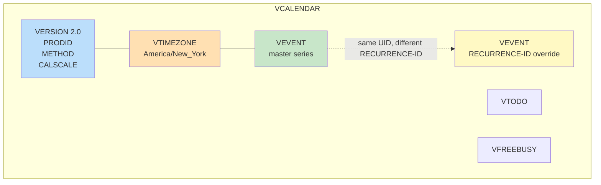

# ICS Import/Export and CalDAV — iCalendar, WebDAV, and Cross-Vendor Interop

**Date:** 2026-05-01 | **Updated:** 2026-05-01
**Tags:** `system-design` `deep-dive` `calendar` `ics` `caldav` `interop`

> **Companion to:** [`../design-calendar-system.md`](../design-calendar-system.md) — this doc expands the *ICS Import/Export and CalDAV Interop* deep-dive subsection (§8) with the wire-format details, parser footguns, sync-protocol mechanics, and cross-vendor compatibility notes that determine whether your calendar plays nicely with Google, Outlook, Apple, and Mozilla in the wild.

## Summary

A calendar system that doesn't speak iCalendar might as well not exist. **iCalendar (RFC 5545)** is the universal wire format for events, to-dos, journal entries, and free-busy data; **CalDAV (RFC 4791)** is the WebDAV-based sync protocol that ships those iCalendar bodies between servers, clients, and other servers; **iTIP (RFC 5546)** and **iMIP (RFC 6047)** are the scheduling protocols that move invitations between organizers and attendees, either inside CalDAV or over plain email. Every calendar product on Earth — Google Calendar, Outlook/Exchange, Apple Calendar, Thunderbird, Fastmail — speaks some dialect of these specs, and every one of them has incompatibilities at the edges. Line folding, CRLF requirements, custom `TZID` strings, missing `VTIMEZONE` blocks, escaping rules, `SEQUENCE` numbering, organizer/attendee delivery semantics — each one of these has been the cause of real production bugs that duplicated thousands of events, dropped RSVPs, or made a meeting silently shift by an hour. This doc walks through the format from bytes up: the iCalendar grammar, the component types, the parser pitfalls, the subscription URL pattern (`webcal://`), the CalDAV verb set (`PROPFIND`, `REPORT`, `MKCALENDAR`), the scheduling extensions, the round-trip fidelity test, and JMAP Calendars (RFC 8984) as the JSON-shaped successor for new-stack deployments. The anti-pattern list at the end is a checklist of every interop bug worth fixing before you ship.

## Table of Contents

- [Summary](#summary)
- [Why iCalendar Won](#why-icalendar-won)
- [The iCalendar Object Model](#the-icalendar-object-model)
- [VEVENT, VTODO, VJOURNAL, VFREEBUSY](#vevent-vtodo-vjournal-vfreebusy)
- [On-the-Wire Format Rules](#on-the-wire-format-rules)
- [Properties, Parameters, and Value Types](#properties-parameters-and-value-types)
- [Time Zones and VTIMEZONE](#time-zones-and-vtimezone)
- [Recurrence Inside ICS](#recurrence-inside-ics)
- [Worked ICS Example](#worked-ics-example)
- [Parser Pitfalls](#parser-pitfalls)
- [ICS Subscription URLs and webcal://](#ics-subscription-urls-and-webcal)
- [Export — Producing Deterministic ICS](#export--producing-deterministic-ics)
- [Import — Idempotency by UID and SEQUENCE](#import--idempotency-by-uid-and-sequence)
- [Python Round-Trip Example](#python-round-trip-example)
- [CalDAV — WebDAV for Calendars](#caldav--webdav-for-calendars)
- [CalDAV PROPFIND Walkthrough](#caldav-propfind-walkthrough)
- [REPORT calendar-query and calendar-multiget](#report-calendar-query-and-calendar-multiget)
- [Sync Tokens and ETag-Driven Incremental Sync](#sync-tokens-and-etag-driven-incremental-sync)
- [iTIP — Scheduling Inside the Protocol](#itip--scheduling-inside-the-protocol)
- [iMIP — iTIP Over Email](#imip--itip-over-email)
- [CalDAV Scheduling Extensions (RFC 6638)](#caldav-scheduling-extensions-rfc-6638)
- [Cross-Vendor Interop Reality](#cross-vendor-interop-reality)
- [JMAP Calendars (RFC 8984)](#jmap-calendars-rfc-8984)
- [Worked Example — Google → ICS → Outlook Round Trip](#worked-example--google--ics--outlook-round-trip)
- [Anti-Patterns](#anti-patterns)
- [Related](#related)
- [References](#references)

## Why iCalendar Won

Before iCalendar (the spec, then RFC 2445, now RFC 5545), every vendor had its own format: vCalendar 1.0, Outlook's MAPI properties, custom XML dialects, proprietary binary blobs. The result was that emailing a meeting invitation between two calendar products often silently dropped attendees, mangled time zones, or simply failed to import. iCalendar succeeded because:

- It is **plain text**, line-oriented, and human-debuggable. You can `cat` an `.ics` file and read it.
- It is **transport-agnostic**: same body inside an email attachment, an HTTP response, a CalDAV `PUT`, a file on disk, or a WebSocket frame.
- It is **extensible** through `X-` properties without breaking older parsers (provided they ignore unknown properties, which the spec mandates).
- It defines a **stable identity** (the `UID`) and a **versioning** convention (the `SEQUENCE` counter plus `DTSTAMP`), so the same event can be re-imported, updated, and round-tripped without creating duplicates.

The format has rough edges — line folding, escaping, time zone embedding, parameter quoting — but those edges are well-documented and have battle-tested libraries (`ical4j` in Java, `icalendar` in Python, `ical-generator`/`node-ical` in Node, `iCalKit` in Swift). Reach for a library; do not write your own parser.

## The iCalendar Object Model

An iCalendar stream is a tree:

```text
VCALENDAR                      ← the outer envelope; exactly one per stream
├── METHOD                     (PUBLISH | REQUEST | REPLY | CANCEL | REFRESH | ...)
├── PRODID                     (the producing software identifier)
├── VERSION:2.0
├── CALSCALE:GREGORIAN         (default; rarely anything else)
├── VTIMEZONE                  ← zero or more zone definitions
│   ├── TZID
│   ├── STANDARD               ← winter time rules
│   └── DAYLIGHT                ← summer time rules
├── VEVENT                     ← zero or more events
├── VTODO                      ← zero or more tasks
├── VJOURNAL                   ← zero or more journal entries
└── VFREEBUSY                  ← zero or more free-busy reports
```

The outer `VCALENDAR` carries metadata (`PRODID`, `VERSION`, optionally `METHOD`). The inner components carry payloads. A single `.ics` file may contain many components — a feed export of an entire calendar is one `VCALENDAR` with N `VEVENT`s.



## VEVENT, VTODO, VJOURNAL, VFREEBUSY

Four payload component types. The vast majority of calendar traffic is `VEVENT`; the others matter for completeness.

| Component | Purpose | Required props | Notable optional props |
|---|---|---|---|
| `VEVENT` | A scheduled event | `UID`, `DTSTAMP` | `DTSTART`, `DTEND`/`DURATION`, `RRULE`, `SUMMARY`, `LOCATION`, `ORGANIZER`, `ATTENDEE`, `STATUS`, `SEQUENCE`, `RECURRENCE-ID`, `EXDATE`, `RDATE`, `VALARM` (nested) |
| `VTODO` | A task / to-do item | `UID`, `DTSTAMP` | `DUE`, `COMPLETED`, `PERCENT-COMPLETE`, `PRIORITY`, `STATUS` |
| `VJOURNAL` | A diary / journal entry | `UID`, `DTSTAMP` | `DTSTART`, `SUMMARY`, `DESCRIPTION` |
| `VFREEBUSY` | A free/busy time response | `UID`, `DTSTAMP`, `DTSTART`, `DTEND` | `FREEBUSY` (one per busy block), `ORGANIZER`, `ATTENDEE` |

**`VEVENT` is the workhorse.** It models everything from a one-off lunch to a weekly all-hands with thousands of attendees and per-instance overrides.

**`VTODO`** is what Apple Reminders and Microsoft To Do speak when they sync via CalDAV. A task differs from an event in that it has a `DUE` (or `DUE` + `DURATION`) instead of `DTEND`, plus completion tracking via `STATUS:COMPLETED` and `COMPLETED:` timestamps.

**`VJOURNAL`** is rarely used in production but appears in some Mozilla and Apple exports. Treat it as opaque; round-trip preserve it; don't try to render it as an event.

**`VFREEBUSY`** is the wire format for the free-busy query response. It contains a list of `FREEBUSY:` lines, each a UTC time range with a type (`BUSY`, `BUSY-UNAVAILABLE`, `BUSY-TENTATIVE`, `FREE`). The scheduling assistant uses this format internally and over the wire when querying external CalDAV servers. See [`./time-zone-correctness.md`](./time-zone-correctness.md) for the canonical-UTC rationale.

## On-the-Wire Format Rules

These are the format rules every parser and emitter MUST get right. Each one is a real source of cross-vendor bugs.

**1. CRLF line endings.** Lines end with `\r\n`, not `\n`. RFC 5545 §3.1 is unambiguous: bare `\n` is a parse error. Outlook in particular rejects bare-LF files; macOS Calendar is more forgiving but will sometimes silently drop properties on bare-LF input. Always emit CRLF. When parsing, accept both for robustness, but if you re-emit, normalize to CRLF.

**2. Line folding.** Lines longer than 75 octets MUST be folded. A folded continuation line begins with a single whitespace character (space or HTAB). The whitespace is part of the fold marker, not part of the value:

```text
DESCRIPTION:This is a very long description that exceeds the 75-octet l
 imit and must be folded. The continuation starts with a single space wh
 ich is consumed during unfolding.
```

When parsing, unfold first (concatenate the continuation removing the leading whitespace) before parsing properties. When emitting, fold at 75 *octets*, not characters — non-ASCII text counts in octets, and folding inside a multi-byte UTF-8 sequence corrupts the value.

**3. Charset.** UTF-8. The 1998 vCalendar 1.0 spec allowed other charsets; iCalendar 2.0 effectively assumes UTF-8 even though the RFC is ambiguous on transport. In practice, every modern producer emits UTF-8. Always declare it in HTTP responses (`Content-Type: text/calendar; charset=utf-8`).

**4. Property syntax.**

```text
NAME[;PARAM1=value1[;PARAM2=value2]...]:VALUE
```

Examples:

```text
SUMMARY:Lunch with Bob
DTSTART;TZID=America/New_York:20260501T120000
ATTENDEE;CN=Bob;ROLE=REQ-PARTICIPANT;PARTSTAT=ACCEPTED:mailto:bob@example.com
```

Parameters are semicolon-separated, value is everything after the first colon. Beware: a colon inside a parameter value (e.g., `mailto:bob@example.com` as a parameter value) must be quoted: `;DELEGATED-FROM="mailto:alice@example.com"`.

**5. Escaping inside text values.** The text value type (`SUMMARY`, `DESCRIPTION`, `LOCATION`, `COMMENT`) escapes four characters:

| Character | Escaped form |
|---|---|
| backslash `\` | `\\` |
| comma `,` | `\,` |
| semicolon `;` | `\;` |
| newline | `\n` (literal lowercase n after backslash) |

If the user's event title is `Lunch, dinner; whatever`, the on-wire form is:

```text
SUMMARY:Lunch\, dinner\; whatever
```

A common bug: emitting unescaped commas in `SUMMARY` causes parsers to interpret them as multi-value separators (commas inside text are *not* multi-value separators per the grammar, but several real parsers — including older versions of Apple Calendar — get confused). Always escape.

**6. Multi-value vs multi-instance.** Some property *values* are comma-separated lists (e.g., `CATEGORIES:work,urgent`). Some properties may appear multiple times in the same component (e.g., `ATTENDEE` once per attendee). Don't conflate: ten attendees means ten `ATTENDEE` lines, not one line with comma-separated emails.

## Properties, Parameters, and Value Types

A short tour of the properties that matter most in production. Full list in RFC 5545 §3.7–§3.8.

| Property | Component | Notes |
|---|---|---|
| `UID` | required everywhere | Globally unique opaque string, stable across exports/imports. The identity. |
| `DTSTAMP` | required | When this version was created. Used as a tiebreaker when `SEQUENCE` is equal. |
| `DTSTART` | events, todos | Start time. With `TZID` parameter, in `VTIMEZONE`-defined zone; with trailing `Z`, UTC; otherwise floating local. |
| `DTEND` | events | End time. Mutually exclusive with `DURATION`. Half-open semantics: `DTEND` is the first instant *not* included. |
| `DURATION` | events, todos | Period (e.g., `PT1H30M`). |
| `SUMMARY` | events | Title. Text type — escape commas, semicolons, backslashes, newlines. |
| `DESCRIPTION` | events | Long text. Same escaping. |
| `LOCATION` | events | Free text or geo URI. |
| `RRULE` | events, todos | Recurrence rule. See [`./rrule-expansion.md`](./rrule-expansion.md). |
| `RDATE` / `EXDATE` | events | Inclusion / exclusion dates. May appear multiple times. |
| `RECURRENCE-ID` | events | Identifies a per-instance override; same `UID` as master. |
| `SEQUENCE` | events | Monotonic version counter; bumped on each user-visible change. |
| `STATUS` | events | `TENTATIVE`, `CONFIRMED`, `CANCELLED`. |
| `ORGANIZER` | events | The meeting organizer. URI value (typically `mailto:...`). |
| `ATTENDEE` | events | One per attendee. Includes `PARTSTAT` (accepted/declined/etc.), `ROLE`, `RSVP`. |
| `TRANSP` | events | `OPAQUE` (blocks free-busy) or `TRANSPARENT` (doesn't). |
| `CLASS` | events | `PUBLIC`, `PRIVATE`, `CONFIDENTIAL`. |
| `CATEGORIES` | events | Comma-separated tags. |
| `URL` | events | Canonical URL for this event. |
| `ATTACH` | events | URL or inline base64 attachment. |

**Value types** (the `VALUE=` parameter selects the type; default depends on the property):

- `DATE-TIME` — most common, the `YYYYMMDDTHHMMSS` with optional `Z`.
- `DATE` — all-day events use `VALUE=DATE` and a bare `YYYYMMDD`.
- `DURATION` — ISO 8601-style duration, `PT1H30M`.
- `PERIOD` — used in `FREEBUSY` lines, e.g., `20260501T130000Z/PT1H`.
- `URI` — `mailto:`, `http://`, `geo:`.
- `TEXT` — escaped per the rules above.
- `BINARY` — base64 inline, used for `ATTACH;ENCODING=BASE64;VALUE=BINARY:...`.

## Time Zones and VTIMEZONE

The single hardest part of iCalendar is time zones. Three representations:

```text
DTSTART;TZID=America/New_York:20260501T090000   ← local time in named zone
DTSTART:20260501T130000Z                        ← UTC (note trailing Z)
DTSTART;VALUE=DATE:20260501                     ← all-day, no time, no zone
DTSTART:20260501T090000                         ← floating: no Z, no TZID — local to wherever it's viewed
```

The `TZID` form references a `VTIMEZONE` block embedded in the same `VCALENDAR`, OR a well-known IANA zone name. RFC 5545 says nothing about IANA — it requires the `TZID` to be defined in a `VTIMEZONE` block. In practice, every modern producer either uses an IANA name (`America/New_York`) and trusts the consumer's tzdb, or embeds a `VTIMEZONE` block as a fallback.

A `VTIMEZONE` block looks like this (Eastern Time, simplified):

```text
BEGIN:VTIMEZONE
TZID:America/New_York
LAST-MODIFIED:20240328T040000Z
BEGIN:STANDARD
DTSTART:19701101T020000
RRULE:FREQ=YEARLY;BYMONTH=11;BYDAY=1SU
TZNAME:EST
TZOFFSETFROM:-0400
TZOFFSETTO:-0500
END:STANDARD
BEGIN:DAYLIGHT
DTSTART:19700308T020000
RRULE:FREQ=YEARLY;BYMONTH=3;BYDAY=2SU
TZNAME:EDT
TZOFFSETFROM:-0500
TZOFFSETTO:-0400
END:DAYLIGHT
END:VTIMEZONE
```

The two sub-components describe the standard and daylight rules. An event at `DTSTART;TZID=America/New_York:20260501T090000` resolves to UTC by:

1. Look up `America/New_York` in the `VTIMEZONE` table.
2. Determine which sub-block applies on 2026-05-01 (the daylight one — DST is in effect).
3. Apply `TZOFFSETTO` to the local time: 09:00 - (-04:00) = 13:00 UTC.

**Custom TZIDs.** Outlook historically emits non-IANA `TZID` strings like `Eastern Standard Time` or `(UTC-05:00) Eastern Time (US & Canada)` and relies on the embedded `VTIMEZONE` for definition. Modern Outlook also emits IANA names alongside or instead, but legacy `.ics` files in the wild still use Microsoft names. Your importer must:

- First, try to resolve the `TZID` to IANA directly.
- If unknown, parse the embedded `VTIMEZONE` and use its rules.
- If both fail, log loudly and surface the event with a "time zone unknown" warning rather than silently snapping to UTC.

For deeper time-zone treatment including DST traps and the IANA tzdb update cycle, see [`./time-zone-correctness.md`](./time-zone-correctness.md).

## Recurrence Inside ICS

`RRULE` carries the recurrence pattern; `EXDATE` carries exclusions; `RDATE` carries explicit additional dates; per-instance overrides use a separate `VEVENT` with the same `UID` and a `RECURRENCE-ID` pointing at the original instance:

```text
BEGIN:VEVENT
UID:project-sync@example.com
DTSTAMP:20260425T120000Z
DTSTART;TZID=America/New_York:20260501T090000
DTEND;TZID=America/New_York:20260501T100000
SUMMARY:Project sync
RRULE:FREQ=WEEKLY;BYDAY=FR;UNTIL=20271231T235959Z
EXDATE;TZID=America/New_York:20260508T090000
SEQUENCE:0
END:VEVENT

BEGIN:VEVENT
UID:project-sync@example.com
RECURRENCE-ID;TZID=America/New_York:20260515T090000
DTSTAMP:20260510T120000Z
DTSTART;TZID=America/New_York:20260515T100000
DTEND;TZID=America/New_York:20260515T110000
SUMMARY:Project sync (moved later)
SEQUENCE:1
END:VEVENT
```

The two `VEVENT`s share `UID`. The first defines the master series. The second overrides the May 15 instance to start an hour later. The `RECURRENCE-ID` value is the *original* start time of the instance being overridden — it is the key into the recurrence set, not the new value. The new value goes in the override's own `DTSTART`.

For the full RRULE expansion algorithm (BYxxx filters, ordering, COUNT/UNTIL semantics, materialization windows), see [`./rrule-expansion.md`](./rrule-expansion.md).

## Worked ICS Example

A complete, realistic `.ics` file with multiple components, time zones, recurrence, attendees, and an alarm:

```text
BEGIN:VCALENDAR
VERSION:2.0
PRODID:-//Example Corp//Calendar 1.0//EN
CALSCALE:GREGORIAN
METHOD:PUBLISH
BEGIN:VTIMEZONE
TZID:America/New_York
BEGIN:STANDARD
DTSTART:19701101T020000
RRULE:FREQ=YEARLY;BYMONTH=11;BYDAY=1SU
TZNAME:EST
TZOFFSETFROM:-0400
TZOFFSETTO:-0500
END:STANDARD
BEGIN:DAYLIGHT
DTSTART:19700308T020000
RRULE:FREQ=YEARLY;BYMONTH=3;BYDAY=2SU
TZNAME:EDT
TZOFFSETFROM:-0500
TZOFFSETTO:-0400
END:DAYLIGHT
END:VTIMEZONE
BEGIN:VEVENT
UID:7c1a0b3e-4d5f-4a8c-9b2e-1f3a4b5c6d7e@example.com
DTSTAMP:20260425T120000Z
DTSTART;TZID=America/New_York:20260501T090000
DTEND;TZID=America/New_York:20260501T100000
SUMMARY:Weekly project sync
DESCRIPTION:Status updates from each team lead.\nAgenda doc: https://docs.
 example.com/agenda
LOCATION:Conference Room 4B\, Building 12
RRULE:FREQ=WEEKLY;BYDAY=FR;UNTIL=20271231T235959Z
EXDATE;TZID=America/New_York:20260508T090000
ORGANIZER;CN=Alice Anderson:mailto:alice@example.com
ATTENDEE;CN=Bob Brown;ROLE=REQ-PARTICIPANT;PARTSTAT=ACCEPTED;RSVP=TRUE:mai
 lto:bob@example.com
ATTENDEE;CN=Carol Cox;ROLE=OPT-PARTICIPANT;PARTSTAT=NEEDS-ACTION;RSVP=TRUE
 :mailto:carol@example.com
STATUS:CONFIRMED
SEQUENCE:0
TRANSP:OPAQUE
CATEGORIES:work,recurring
BEGIN:VALARM
ACTION:DISPLAY
DESCRIPTION:Project sync starts in 10 minutes
TRIGGER:-PT10M
END:VALARM
END:VEVENT
BEGIN:VEVENT
UID:7c1a0b3e-4d5f-4a8c-9b2e-1f3a4b5c6d7e@example.com
RECURRENCE-ID;TZID=America/New_York:20260515T090000
DTSTAMP:20260510T120000Z
DTSTART;TZID=America/New_York:20260515T100000
DTEND;TZID=America/New_York:20260515T110000
SUMMARY:Weekly project sync (moved one hour later)
SEQUENCE:1
END:VEVENT
END:VCALENDAR
```

Things to notice:

- `DESCRIPTION` is folded across two lines after `https://docs.`. The continuation begins with a single space (consumed during unfolding) and the URL re-joins as `https://docs.example.com/agenda`.
- `LOCATION` has an escaped comma: `Conference Room 4B\, Building 12`.
- The `EXDATE` excludes the May 8 instance.
- The override `VEVENT` for May 15 has the same `UID` and a `RECURRENCE-ID` matching the *original* May 15 9 AM start.
- `VALARM` is nested inside `VEVENT` with a relative trigger (`-PT10M` = 10 minutes before start).

## Parser Pitfalls

A non-exhaustive list of bugs that every iCalendar parser eventually hits:

**1. Bare LF line endings.** A file produced on Unix tools without explicit CRLF normalization. Outlook will reject it; some libraries silently truncate after the first malformed line. **Fix:** normalize to CRLF on emit; accept both on parse.

**2. Folding inside multi-byte UTF-8.** Folding at 75 *characters* instead of 75 *octets* can split a multi-byte sequence. The continuation looks valid but the value is corrupted. **Fix:** count octets when folding.

**3. Unescaped commas and semicolons in text values.** A user title like `Lunch, dinner` emitted as `SUMMARY:Lunch, dinner` parses fine in Google Calendar but trips up some older Apple Calendar versions. **Fix:** always escape per the four-character table above.

**4. CR or LF in property values.** A multi-line description must be encoded as `\n` (literal backslash-n), not a real newline. **Fix:** translate real newlines to `\n` on emit; reverse on parse.

**5. Mismatched `BEGIN`/`END` blocks.** Nested components must close in reverse order. A common bug: emitting `END:VEVENT` before `END:VALARM`. **Fix:** use a library that maintains a stack.

**6. Multiple `VCALENDAR` envelopes in one stream.** The spec allows a stream to contain multiple `VCALENDAR` objects (as in CalDAV multi-resource responses). Some parsers stop at the first `END:VCALENDAR`. **Fix:** loop until EOF.

**7. Timezone name collisions.** A custom `TZID` like `Eastern Standard Time` may be defined inline AND also exist as a Microsoft name in your fallback table with slightly different DST rules. Trust the inline definition over the table when both are present and they conflict.

**8. Floating events accidentally pinned.** A `DTSTART:20260501T090000` (no Z, no TZID) is *floating* — it should be displayed as 9 AM in whatever zone the viewer is in. Importers that silently snap this to UTC or to the server's zone introduce subtle bugs.

**9. `DTEND` exclusive vs inclusive.** `DTEND` is exclusive: an event with `DTSTART:T090000` and `DTEND:T100000` ends *at* 10:00, meaning 10:00 is not part of the event. All-day events use `VALUE=DATE` with `DTEND` being the day *after* the last day of the event. A common bug: rendering a one-day event as two days because the importer treated `DTEND` as inclusive.

**10. Missing `DTSTAMP`.** RFC 5545 says it's required; some producers omit it. Treat absent `DTSTAMP` as the server-receive time, but log it.

**11. Embedded zero-width or BOM characters.** A UTF-8 BOM at the start of the file (`\xEF\xBB\xBF`) breaks strict parsers. **Fix:** strip BOM if present; never emit one.

## ICS Subscription URLs and webcal://

A common pattern: publish a calendar as a feed at a stable HTTPS URL. Anyone can subscribe by adding the URL to their calendar app. The server returns one `VCALENDAR` containing all events (or a windowed slice).

**Server-side requirements:**

- Stable URL with a per-user secret token: `https://calendar.example.com/feeds/u/abc123-secret-token.ics`. The secret acts as a bearer credential; treat it as such.
- `Content-Type: text/calendar; charset=utf-8`.
- `ETag` header for client-side cache validation.
- `Cache-Control` reflecting the actual freshness — 5 minutes is typical for "live" feeds, 24 hours for archives.
- HTTPS only. The secret token is in the URL; HTTP would leak it.

**Token rotation.** The user must be able to revoke and rotate the token without changing event identities. Rotation invalidates old subscribers (they 404 until they re-subscribe with the new URL).

**`webcal://` scheme.** Functionally identical content, but the scheme tells the OS "treat this as a calendar subscription, not a one-time download." When a browser sees `webcal://calendar.example.com/feeds/...`, it hands the URL to the OS calendar app, which subscribes and polls. The server should serve the same content over `https://` and `webcal://` — most clients translate `webcal://` to `https://` internally before fetching.

```html
<a href="webcal://calendar.example.com/feeds/u/abc123-secret-token.ics">
  Subscribe in your calendar app
</a>
```

**Polling cadence.** Subscribers poll on their own schedule (typically every 15 minutes to 24 hours, depending on the client). The server has no push back-channel for subscription URLs — for push semantics use CalDAV instead.

For the broader sync-vs-async tradeoff, see [`../../../communication/sync-vs-async-communication.md`](../../../communication/sync-vs-async-communication.md).

## Export — Producing Deterministic ICS

A good ICS exporter produces output that:

1. **Round-trips losslessly.** Re-importing the export reproduces the source state.
2. **Diffs cleanly.** Re-exporting an unchanged event produces byte-identical output (or at least line-identical modulo `DTSTAMP`).
3. **Is idempotent across runs.** Same input → same output every time.

To achieve this, the exporter should emit properties in a **deterministic order**. RFC 5545 doesn't mandate ordering, but consistency makes diffs and tests tractable. A common ordering:

```text
BEGIN:VEVENT
UID
DTSTAMP
DTSTART
DTEND (or DURATION)
SUMMARY
DESCRIPTION
LOCATION
RRULE
RDATE...
EXDATE...
RECURRENCE-ID (only for overrides)
ORGANIZER
ATTENDEE...  (sorted by email)
STATUS
SEQUENCE
TRANSP
CLASS
CATEGORIES
URL
LAST-MODIFIED
CREATED
[VALARM nested]
END:VEVENT
```

Sorting `ATTENDEE` lines by email keeps diffs stable. Sorting `EXDATE` lines chronologically does the same. Choose a canonical line wrap point (75 octets is the spec; some emitters use 73 for safety).

**Don't include `METHOD` for plain feeds.** `METHOD:PUBLISH` on a feed is correct. `METHOD:REQUEST` triggers iTIP scheduling semantics in the receiving client (e.g., it'll show "RSVP" buttons). Use `METHOD` only when emitting an iTIP message.

## Import — Idempotency by UID and SEQUENCE

ICS import must be **idempotent by `UID`**. Re-importing the same file should not duplicate events.

The match-and-merge algorithm:

```python
def import_event(incoming: VEvent, calendar_id: str) -> ImportResult:
    existing = repo.find_by_uid(calendar_id, incoming.uid)
    if existing is None:
        repo.insert(incoming, calendar_id)
        return ImportResult.CREATED

    # UID matches existing event. Decide whether to update.
    if incoming.sequence > existing.sequence:
        repo.update(existing.id, incoming)
        return ImportResult.UPDATED

    if incoming.sequence == existing.sequence:
        # Tiebreaker: newer DTSTAMP wins.
        if incoming.dtstamp > existing.dtstamp:
            repo.update(existing.id, incoming)
            return ImportResult.UPDATED

    # Incoming is older or equal; ignore.
    return ImportResult.SKIPPED
```

This is the same `SEQUENCE` + `DTSTAMP` comparison that iTIP uses (RFC 5546 §2.1.5). It guarantees:

- Re-importing the same file is a no-op (`SKIPPED` on every event after the first time).
- A modified file replaces the prior version when `SEQUENCE` is bumped.
- A stale file (e.g., resurfaced from email after a more recent edit) doesn't overwrite the current state.

**Anti-pattern: matching on title + start time instead of UID.** Some early importers tried to deduplicate by `(SUMMARY, DTSTART)` because not all sources emitted stable `UID`s. This breaks the moment a user edits the title or moves the event — you get duplicates. If a source omits `UID`, generate one deterministically from a hash of `(source_id, original_id)` and persist it; never use a title-based heuristic.

**Per-instance overrides.** When the import contains a master `VEVENT` plus override `VEVENT`s with `RECURRENCE-ID`, treat them as a single logical event with overrides attached, not as separate events. Some buggy importers store the overrides as separate events, which then appear as duplicates.

## Python Round-Trip Example

The `icalendar` Python library handles parsing, emission, line folding, escaping, and `VTIMEZONE` resolution.

```python
# round_trip.py
from icalendar import Calendar, Event

def parse_ics(blob: bytes) -> Calendar:
    return Calendar.from_ical(blob)

def import_to_internal(cal: Calendar) -> list[dict]:
    """Convert VEVENTs to internal event dicts. UID is the identity."""
    events = []
    for component in cal.walk():
        if component.name != "VEVENT":
            continue
        events.append({
            "uid": str(component["UID"]),
            "dtstart": component["DTSTART"].dt,
            "dtend": component["DTEND"].dt if component.get("DTEND") else None,
            "summary": str(component.get("SUMMARY", "")),
            "rrule": str(component["RRULE"].to_ical(), "utf-8") if component.get("RRULE") else None,
            "sequence": int(component.get("SEQUENCE", 0)),
            "dtstamp": component["DTSTAMP"].dt,
            "is_override": "RECURRENCE-ID" in component,
            "recurrence_id": (
                component["RECURRENCE-ID"].dt if "RECURRENCE-ID" in component else None
            ),
        })
    return events

def emit_from_internal(events: list[dict]) -> bytes:
    cal = Calendar()
    cal.add("prodid", "-//Example Corp//Calendar 1.0//EN")
    cal.add("version", "2.0")
    for e in events:
        ev = Event()
        for key in ("uid", "dtstamp", "dtstart", "summary", "sequence"):
            ev.add(key, e[key])
        if e["dtend"]:
            ev.add("dtend", e["dtend"])
        if e["rrule"]:
            ev.add("rrule", e["rrule"])
        if e["is_override"]:
            ev.add("recurrence-id", e["recurrence_id"])
        cal.add_component(ev)
    return cal.to_ical()  # icalendar handles folding and CRLF

# Round trip: parse, normalize, re-emit, re-parse — should be semantically identical.
original = open("/tmp/input.ics", "rb").read()
events = import_to_internal(parse_ics(original))
re_emitted = emit_from_internal(events)
assert import_to_internal(parse_ics(re_emitted)) == events
```

For Java, `ical4j` is the equivalent — parsing, emission, RRULE expansion, and VTIMEZONE resolution. The ical4j `Calendar.merge()` operation implements the SEQUENCE-driven merge for incoming iTIP messages.

## CalDAV — WebDAV for Calendars

CalDAV is the sync protocol. It is WebDAV (RFC 4918) plus calendar-specific extensions defined in RFC 4791. The mental model:

- A **CalDAV server** exposes a tree of WebDAV collections.
- Each user has a **calendar home set** — a parent collection.
- Inside the home set, each **calendar** is a collection.
- Inside a calendar, each **event** is a single resource (a `.ics` file).
- A resource is identified by its URL, and has an `ETag` for optimistic concurrency.

```text
https://caldav.example.com/
└── /dav/users/alice/                      ← user principal
    ├── calendar-home/                     ← home collection
    │   ├── default/                       ← a calendar
    │   │   ├── 7c1a0b3e-...ics           ← one event
    │   │   ├── 8d2b1c4f-...ics
    │   │   └── ...
    │   └── work/                          ← another calendar
    │       └── ...
    └── inbox/                             ← scheduling inbox
```

**Verbs.**

| Verb | Purpose |
|---|---|
| `OPTIONS` | Discover what the server supports (CalDAV requires `DAV: 1, calendar-access` in response) |
| `PROPFIND` | List a collection or fetch properties on a resource |
| `MKCALENDAR` | Create a new calendar collection |
| `PUT` | Create or update an event resource (body is iCalendar) |
| `GET` | Retrieve an event resource (response is iCalendar) |
| `DELETE` | Delete an event |
| `REPORT` | Custom queries: `calendar-query`, `calendar-multiget`, `free-busy-query`, `sync-collection` |

**Discovery.** The client starts with a server URL plus credentials. It walks:

1. `OPTIONS` on the root → checks for `calendar-access` in the `DAV:` response header.
2. `PROPFIND` with `current-user-principal` → discovers the user's principal URL.
3. `PROPFIND` on the principal → discovers `calendar-home-set`.
4. `PROPFIND` on the home set with `Depth: 1` → lists the calendars.
5. For each calendar, `PROPFIND` → fetches calendar metadata (display name, color, supported components).

This is the standard discovery dance. A correctly behaved CalDAV server makes all five steps work without hardcoded paths.

For broader API style context, see [`../../../building-blocks/api-design-styles.md`](../../../building-blocks/api-design-styles.md).

## CalDAV PROPFIND Walkthrough

A typical `PROPFIND` to list events in a calendar:

```http
PROPFIND /dav/users/alice/calendar-home/default/ HTTP/1.1
Host: caldav.example.com
Depth: 1
Content-Type: application/xml; charset=utf-8
Authorization: Basic YWxpY2U6c2VjcmV0

<?xml version="1.0" encoding="utf-8" ?>
<D:propfind xmlns:D="DAV:" xmlns:C="urn:ietf:params:xml:ns:caldav">
  <D:prop>
    <D:getetag/>
    <D:resourcetype/>
    <D:displayname/>
    <C:calendar-data/>
  </D:prop>
</D:propfind>
```

Response:

```http
HTTP/1.1 207 Multi-Status
Content-Type: application/xml; charset=utf-8

<?xml version="1.0" encoding="utf-8" ?>
<D:multistatus xmlns:D="DAV:" xmlns:C="urn:ietf:params:xml:ns:caldav">
  <D:response>
    <D:href>/dav/users/alice/calendar-home/default/</D:href>
    <D:propstat>
      <D:prop>
        <D:resourcetype>
          <D:collection/>
          <C:calendar/>
        </D:resourcetype>
        <D:displayname>Default Calendar</D:displayname>
      </D:prop>
      <D:status>HTTP/1.1 200 OK</D:status>
    </D:propstat>
  </D:response>
  <D:response>
    <D:href>/dav/users/alice/calendar-home/default/7c1a0b3e-...ics</D:href>
    <D:propstat>
      <D:prop>
        <D:getetag>"v3-1714060800"</D:getetag>
        <C:calendar-data><![CDATA[
BEGIN:VCALENDAR
VERSION:2.0
PRODID:-//Example Corp//Calendar 1.0//EN
BEGIN:VEVENT
UID:7c1a0b3e-...
...
END:VEVENT
END:VCALENDAR
        ]]></C:calendar-data>
      </D:prop>
      <D:status>HTTP/1.1 200 OK</D:status>
    </D:propstat>
  </D:response>
  <!-- ... one <D:response> per event ... -->
</D:multistatus>
```

Notes:

- `Depth: 1` returns the collection itself plus immediate children.
- `Depth: 0` returns just the collection.
- `Depth: infinity` is theoretically allowed but rarely used (and many servers refuse it for performance reasons).
- The `<C:calendar-data/>` element in the request asks the server to inline the iCalendar bodies. Without it, the response contains only metadata and the client has to `GET` each resource separately.
- `getetag` is the optimistic-concurrency token. Modifying clients send it back in `If-Match`.

## REPORT calendar-query and calendar-multiget

For time-range filtering, use `REPORT calendar-query`:

```http
REPORT /dav/users/alice/calendar-home/default/ HTTP/1.1
Host: caldav.example.com
Depth: 1
Content-Type: application/xml; charset=utf-8

<?xml version="1.0" encoding="utf-8" ?>
<C:calendar-query xmlns:C="urn:ietf:params:xml:ns:caldav" xmlns:D="DAV:">
  <D:prop>
    <D:getetag/>
    <C:calendar-data>
      <C:expand start="20260501T000000Z" end="20260601T000000Z"/>
    </C:calendar-data>
  </D:prop>
  <C:filter>
    <C:comp-filter name="VCALENDAR">
      <C:comp-filter name="VEVENT">
        <C:time-range start="20260501T000000Z" end="20260601T000000Z"/>
      </C:comp-filter>
    </C:comp-filter>
  </C:filter>
</C:calendar-query>
```

The server filters events to those overlapping the May 2026 window AND expands recurrences within that window. The response shape is the same `multistatus` as `PROPFIND`.

For "fetch a known list of resources by URL," use `REPORT calendar-multiget`:

```http
REPORT /dav/users/alice/calendar-home/default/ HTTP/1.1
Content-Type: application/xml; charset=utf-8

<?xml version="1.0" encoding="utf-8" ?>
<C:calendar-multiget xmlns:C="urn:ietf:params:xml:ns:caldav" xmlns:D="DAV:">
  <D:prop>
    <D:getetag/>
    <C:calendar-data/>
  </D:prop>
  <D:href>/dav/users/alice/calendar-home/default/7c1a0b3e-...ics</D:href>
  <D:href>/dav/users/alice/calendar-home/default/8d2b1c4f-...ics</D:href>
</C:calendar-multiget>
```

This is the bulk-read primitive, useful for refreshing a known set of events whose ETags changed.

## Sync Tokens and ETag-Driven Incremental Sync

Naive sync: every poll, fetch every event. This doesn't scale.

CalDAV defines two incremental sync mechanisms:

**1. ETag-based sync.** The client tracks the `ETag` of each resource. On poll, it does a `PROPFIND` for `getetag` only (no calendar bodies); compares the returned ETags to its local cache; fetches only the resources whose ETag changed.

**2. Sync-token sync (RFC 6578).** The server provides a single opaque `sync-token` per collection. The client sends the last token it has; the server returns only the resources that changed since that token, plus a new token. This is dramatically more efficient than ETag diffing for large calendars.

```http
REPORT /dav/users/alice/calendar-home/default/ HTTP/1.1
Content-Type: application/xml; charset=utf-8

<?xml version="1.0" encoding="utf-8" ?>
<D:sync-collection xmlns:D="DAV:">
  <D:sync-token>http://example.com/sync/2026-04-25T120000Z</D:sync-token>
  <D:sync-level>1</D:sync-level>
  <D:prop>
    <D:getetag/>
  </D:prop>
</D:sync-collection>
```

Response includes only changed (or deleted) resources plus a new `sync-token`. The token is opaque to the client; only the server interprets it.

**Server-side implementation.** The token typically encodes a monotonic version (a per-collection sequence counter, an `updated_at` timestamp, or a Postgres LSN). Each event mutation bumps the counter; the server stores deletion tombstones with the version they were deleted at; the sync-collection report streams the diff.

For broader incremental-sync patterns and the case for keeping deletion tombstones, see the parent [`../design-calendar-system.md`](../design-calendar-system.md) §6 (Reminders) and §7 (Sharing) which both depend on consistent change feeds.

## iTIP — Scheduling Inside the Protocol

iTIP (RFC 5546) defines scheduling messages — invitations, replies, cancellations — encoded as iCalendar with a `METHOD` property. The methods:

| Method | From → To | Meaning |
|---|---|---|
| `REQUEST` | Organizer → Attendee | "Please attend" (also used for updates) |
| `REPLY` | Attendee → Organizer | RSVP: ACCEPTED / DECLINED / TENTATIVE |
| `CANCEL` | Organizer → Attendee | "Meeting is cancelled" |
| `REFRESH` | Attendee → Organizer | "Please re-send me the latest version" |
| `COUNTER` | Attendee → Organizer | "Counter-proposal: try this time instead" |
| `DECLINECOUNTER` | Organizer → Attendee | "Counter-proposal rejected" |
| `ADD` | Organizer → Attendee | "Add this instance to the existing series" |
| `PUBLISH` | Producer → Consumers | Public feed (no scheduling, just publishing) |

A `REQUEST` example:

```text
BEGIN:VCALENDAR
VERSION:2.0
PRODID:-//Example//1.0//EN
METHOD:REQUEST
BEGIN:VEVENT
UID:meeting-2026-05-01@example.com
DTSTAMP:20260425T120000Z
DTSTART:20260501T130000Z
DTEND:20260501T140000Z
SUMMARY:Project sync
ORGANIZER;CN=Alice:mailto:alice@example.com
ATTENDEE;CN=Bob;ROLE=REQ-PARTICIPANT;PARTSTAT=NEEDS-ACTION;RSVP=TRUE:mailto:bob@example.com
SEQUENCE:0
END:VEVENT
END:VCALENDAR
```

Bob's client receives this, shows him an "RSVP" UI, and on accept emits a `REPLY`:

```text
BEGIN:VCALENDAR
VERSION:2.0
PRODID:-//Example//1.0//EN
METHOD:REPLY
BEGIN:VEVENT
UID:meeting-2026-05-01@example.com
DTSTAMP:20260425T130000Z
DTSTART:20260501T130000Z
DTEND:20260501T140000Z
SUMMARY:Project sync
ORGANIZER;CN=Alice:mailto:alice@example.com
ATTENDEE;PARTSTAT=ACCEPTED:mailto:bob@example.com
SEQUENCE:0
END:VEVENT
END:VCALENDAR
```

The `REPLY` includes only the responding attendee's `ATTENDEE` line (not the full attendee list). The `SEQUENCE` matches the request being replied to.

## iMIP — iTIP Over Email

iMIP (RFC 6047) is iTIP delivered over email — an iCalendar body attached to an SMTP message with `Content-Type: text/calendar; method=REQUEST`. This is how meeting invitations work between systems that don't share a CalDAV server.

```text
From: alice@example.com
To: bob@example.com
Subject: Project sync
Content-Type: multipart/alternative; boundary="b"

--b
Content-Type: text/plain; charset=utf-8

You are invited to Project sync on May 1, 2026 at 9:00 AM EDT.

--b
Content-Type: text/calendar; method=REQUEST; charset=utf-8

BEGIN:VCALENDAR
METHOD:REQUEST
...
END:VCALENDAR
--b--
```

The receiving mail client (Outlook, Apple Mail, Thunderbird, Gmail with calendar integration) parses the `text/calendar` part, surfaces the RSVP UI, and on accept either updates a local CalDAV store or emails back a `METHOD:REPLY` body.

**Why iMIP matters even when you have CalDAV:** federation. Alice on Google Calendar invites Bob on Outlook 365. Alice's Google Calendar emits an iMIP `REQUEST` to bob@; Bob's Outlook receives the email, processes it, RSVPs back via iMIP `REPLY`; Alice's Google receives the reply email and updates the meeting. No CalDAV between Google and Outlook; iMIP is the lingua franca.

## CalDAV Scheduling Extensions (RFC 6638)

RFC 6638 extends CalDAV with server-side scheduling. Instead of the client emailing iTIP messages itself, it `PUT`s an event into a special "scheduling outbox" and the server delivers iTIP messages on the client's behalf.

The pieces:

- **Scheduling outbox.** A WebDAV collection where the client posts iTIP `REQUEST` / `CANCEL` / `REPLY` bodies. The server processes and delivers them.
- **Scheduling inbox.** A WebDAV collection where the server deposits incoming iTIP messages for the client to process.
- **Auto-scheduling.** When the client `PUT`s an event with `ATTENDEE` lines into a normal calendar, the server automatically generates iTIP `REQUEST`s for each attendee and routes them — to the local scheduling inbox if the attendee is on the same server, or via iMIP email if not.

This is what makes Apple Calendar, Outlook, and Fastmail's web UIs feel instant when scheduling within the same server: the client doesn't email anything; it just `PUT`s the event, and the server fans out scheduling messages.

## Cross-Vendor Interop Reality

Three big calendar implementations dominate the wire: Google Calendar, Microsoft Exchange/Outlook, Apple iCloud Calendar. Plus Mozilla Thunderbird and Fastmail in the long tail. Each has quirks:

**Google Calendar.**

- Emits IANA `TZID`s consistently. Embeds a `VTIMEZONE` only for legacy compatibility.
- Uses stable `UID`s of the form `<random>@google.com`.
- Does NOT speak CalDAV publicly anymore — Google removed CalDAV public access in 2013, then partially restored read-only access. For sync, third parties use Google Calendar API (REST/JSON) instead.
- iMIP REQUESTs from Google to Outlook/Apple work via email; the inbound side processes them correctly.
- Quirk: Google's `EXDATE` semantics for per-instance overrides historically didn't always match RFC 5545 strictly — exception VEVENTs were sometimes emitted without a corresponding EXDATE on the master, leading to double-rendering in strict importers.

**Microsoft Outlook / Exchange.**

- Historically emits non-IANA `TZID`s like `Eastern Standard Time` (Microsoft zone names) and embeds the corresponding `VTIMEZONE`. Modern Outlook (2019+) emits IANA names alongside.
- Picky about CRLF — bare-LF input is rejected.
- Does NOT speak CalDAV natively. Exchange has its own protocols (EWS, MAPI, ActiveSync). Third-party gateways translate.
- iMIP works robustly inbound and outbound.
- Quirk: Outlook's `SEQUENCE` bumping is aggressive — any change bumps SEQUENCE, even cosmetic ones, which can cause RSVP UIs to surface for trivial edits.

**Apple iCloud Calendar.**

- Speaks CalDAV natively (it's the reference implementation in many ways).
- Uses IANA `TZID`s.
- iCloud's CalDAV is generally the most spec-compliant of the big three.
- Quirk: Apple Calendar UI sometimes silently drops unknown `X-` properties on edit-and-save, breaking round-trip with custom extensions.

**Cross-vendor failure modes:**

- **`TZID` mismatch.** Outlook emits `Pacific Standard Time`; Google's importer doesn't know that name and falls back to the embedded `VTIMEZONE`. If the embedded `VTIMEZONE` is malformed or missing, the event lands at the wrong UTC time.
- **Per-instance override deltas.** Outlook tracks per-instance modifications using its own MAPI properties; the iMIP export translates them to `RECURRENCE-ID` overrides imperfectly. An attendee on Google sees the override correctly; an attendee on Apple sees a duplicate.
- **Attendee email mismatch.** When Bob's email is `bob@example.com` but his iMIP REPLY comes from `bob.brown@example.com` (different alias), the organizer's server can't match the RSVP to the original attendee line. RSVP appears lost.
- **Custom alarm components.** Outlook's `VALARM` with `ACTION:DISPLAY` and Apple's reminders mostly interoperate; emails-as-alarms (`ACTION:EMAIL`) and audio alarms vary in support.

The pragmatic mitigation: maintain a CI test corpus of real-world `.ics` exports from every major vendor and assert that your importer produces the expected internal state. New regressions show up first in the CI corpus, not in user reports.

## JMAP Calendars (RFC 8984)

iCalendar + CalDAV is showing its age: XML-over-HTTP is verbose; the data model is text-encoded; sync tokens are loosely specified. **JMAP Calendars (RFC 8984)** is the modern alternative, evolved from JMAP for Mail.

Key design choices:

- **JSON wire format.** Events are JSON objects with typed fields. No line folding, no escaping, no CRLF rules.
- **Single-endpoint API.** All CRUD, sync, and scheduling happen via POST to one URL with method calls in the body.
- **Push notifications.** First-class push via Server-Sent Events or WebSocket.
- **Built-in batching.** Multiple operations in one request, with reference-by-creation-id.

A JSCalendar `Event` (the data type used by JMAP Calendars):

```json
{
  "@type": "Event",
  "uid": "7c1a0b3e-4d5f-4a8c-9b2e-1f3a4b5c6d7e@example.com",
  "title": "Weekly project sync",
  "start": "2026-05-01T09:00:00",
  "timeZone": "America/New_York",
  "duration": "PT1H",
  "recurrenceRules": [
    {
      "@type": "RecurrenceRule",
      "frequency": "weekly",
      "byDay": [{"day": "fr"}],
      "until": "2027-12-31T23:59:59"
    }
  ],
  "participants": {
    "bob@example.com": {
      "@type": "Participant",
      "email": "bob@example.com",
      "name": "Bob Brown",
      "roles": {"attendee": true},
      "participationStatus": "accepted"
    }
  }
}
```

JSCalendar is defined in **RFC 8984**; the JMAP for Calendars protocol that ships these objects is in **RFC 8984** companion drafts. The format is designed to be **bi-directional with iCalendar** — every JSCalendar concept maps to an iCalendar property, and vice versa, so a server can speak both protocols against the same backing store.

**Should you adopt JMAP for a new calendar?** It's compelling for greenfield internal systems where you control both client and server. For external interop, you still need iCalendar/CalDAV/iMIP — the world doesn't speak JMAP yet outside Fastmail and a handful of others. The pragmatic stance: model your internal data after JSCalendar (it's better-shaped than iCalendar for in-memory work), and keep iCalendar/CalDAV as the export and federation layer.

## Worked Example — Google → ICS → Outlook Round Trip

A concrete scenario: Alice creates an event in Google Calendar, exports it as `.ics`, sends it to Bob, Bob imports it into Outlook. What happens at each step.

```mermaid
sequenceDiagram
    participant A as Alice<br/>(Google Calendar)
    participant ICS as ICS file
    participant B as Bob<br/>(Outlook)

    A->>A: Create "Project sync"<br/>weekly Fri 9am ET<br/>2026-05-01 to 2027-12-31
    A->>ICS: Export .ics<br/>(Google emits)
    Note over ICS: VEVENT with<br/>UID @google.com<br/>TZID America/New_York<br/>RRULE FREQ=WEEKLY;BYDAY=FR
    ICS->>B: Bob imports .ics<br/>(Outlook parses)
    B->>B: Resolve TZID<br/>match to IANA<br/>OK in Outlook 2019+
    B->>B: Insert event<br/>local SEQUENCE=0
    Note over B: Round-trip preserves UID,<br/>RRULE, TZID, SUMMARY,<br/>EXDATE if present.
    B->>B: Bob edits one instance<br/>(May 15, moves to 10am)
    B->>B: Outlook bumps SEQUENCE<br/>creates RECURRENCE-ID override
    B->>ICS: Bob exports updated .ics
    Note over ICS: Master VEVENT SEQUENCE=1<br/>+ override VEVENT with<br/>RECURRENCE-ID
    ICS->>A: Alice re-imports
    A->>A: Match by UID<br/>incoming SEQUENCE > existing<br/>UPDATE
```

What can go wrong:

- **Step 1 → 2.** Google's export omits an `EXDATE` for an instance Alice deleted in the UI, instead emitting a `RECURRENCE-ID` override with `STATUS:CANCELLED`. Outlook's old importers ignored cancelled overrides → ghost instance appears.
- **Step 2 → 3.** Bob's Outlook is on the legacy zone-name path: it sees `TZID=America/New_York`, doesn't recognize the IANA name (older Outlook 2010 behavior), can't find a `VTIMEZONE` block (Google didn't emit one for IANA zones), and falls back to floating local. Event appears at 9 AM Bob's time, regardless of zone.
- **Step 4 → 5.** Outlook's override export emits `SEQUENCE:1` on both the master AND the override `VEVENT`. Alice's Google importer interprets this strictly: the override's SEQUENCE bumps the master's tracking, even though only the May 15 instance changed. Subsequent imports show the master event marked as needing RSVP again.

The general rule: **test the round trip explicitly**, not just import or export in isolation. A CI suite that exports from one system, imports into another, edits, exports again, and re-imports catches these bugs early.

## Anti-Patterns

- **No UID stability across import.** Every import generates a new `UID` rather than preserving the source's. Re-importing creates duplicates of every event. Always preserve `UID`; if the source omits it, hash a stable surrogate from `(source_id, source_event_id)` and persist it.
- **Bare LF line endings.** Emitting with `\n` instead of `\r\n`. Outlook will reject the file. Always emit CRLF; normalize on parse to be lenient.
- **Unescaped commas in text values.** A title `Lunch, dinner` emitted as `SUMMARY:Lunch, dinner`. Some parsers handle it; some treat the comma as a delimiter and mangle the title. Always escape per the four-character table.
- **Folding inside multi-byte UTF-8.** Counting characters instead of octets when folding splits a UTF-8 sequence and corrupts the value. Always count octets.
- **Custom TZID without VTIMEZONE.** Emitting `TZID=Pacific Standard Time` (a Microsoft name) without an embedded `VTIMEZONE` block. Importers that don't have a Microsoft-name table fall back to floating or UTC silently. Either use IANA names or always embed a `VTIMEZONE`.
- **Ignoring SEQUENCE.** Treating every import as a forced overwrite, regardless of `SEQUENCE`. A stale `.ics` from email overwrites a fresh edit. Always compare `SEQUENCE` (and `DTSTAMP` as tiebreaker).
- **Treating DTEND as inclusive.** A one-day event with `DTSTART;VALUE=DATE:20260501` and `DTEND;VALUE=DATE:20260502` is a single day. Rendering it as two days because `DTEND` is "20260502" is a classic off-by-one. `DTEND` is exclusive.
- **Snapping floating events to a server zone.** A `DTSTART:20260501T090000` (no Z, no TZID) is floating: it should display as 9 AM in the viewer's zone. Importers that pin it to UTC or to the server's zone shift it for everyone outside that zone.
- **Storing per-instance overrides as separate events.** A master `VEVENT` plus override `VEVENT` (same UID, different `RECURRENCE-ID`) modeled as two unrelated events. Renders as a duplicate; future edits to the master don't propagate.
- **Title-based deduplication.** Matching events on `(SUMMARY, DTSTART)` because not all sources emit `UID`. Breaks the moment a title is edited. Always require `UID`; synthesize one if absent and persist it.
- **No round-trip CI corpus.** Shipping interop changes without a test suite of real-world `.ics` files from Outlook, Google, Apple, and Mozilla. Regressions reach users first. Maintain a corpus and run import → export → re-import assertions on every PR.
- **CalDAV without sync tokens.** Polling all events on every sync because the implementation doesn't support `REPORT sync-collection`. Bandwidth and latency scale with calendar size, not with change rate. Implement sync tokens for any calendar large enough to matter.
- **CalDAV server returning bare 200 for `PUT` without ETag.** Without an `ETag` response header, clients can't do `If-Match` optimistic concurrency. Concurrent edits silently overwrite. Always return `ETag` on `PUT` / `GET`.
- **Subscription URL without secret token.** A predictable `https://calendar.example.com/feeds/u/alice.ics` lets anyone enumerate. Always include an unguessable secret in the URL and serve over HTTPS only.
- **Subscription URL secret in query string with HTTP redirects.** A `301` from HTTPS to HTTP leaks the URL (including secret) into HTTP referer headers. Never redirect; reject HTTP outright.
- **iMIP REPLY without ORGANIZER preserved.** A reply that drops the `ORGANIZER` line is malformed iTIP. The receiving organizer's server can't route the response. Always preserve `ORGANIZER` in REPLY.
- **iMIP REPLY with full attendee list.** A REPLY should contain only the responding attendee's `ATTENDEE` line. Including the full list leaks attendee identity to the organizer (a privacy issue if the original was BCC) and confuses some receivers.
- **Sequence number going backward.** Bumping `SEQUENCE` in some flows but not others, or resetting it on certain edits, breaks the SEQUENCE comparison logic. Always monotonically increase `SEQUENCE` per `UID`.
- **Aggressive SEQUENCE bumping.** Bumping `SEQUENCE` for cosmetic edits (e.g., color change) re-triggers RSVP UIs in attendees' clients. Bump only for user-visible changes (time, location, attendees, title).
- **Ignoring METHOD on inbound.** A `METHOD:REQUEST` is a scheduling action, not a feed import. Treating it as `METHOD:PUBLISH` skips the RSVP UI. Always inspect `METHOD`.
- **`METHOD:PUBLISH` on outbound iTIP.** Using `PUBLISH` for an organizer-driven invitation. Receiving clients won't show RSVP buttons. Use `REQUEST` for organizer-driven invitations.
- **Stripping unknown X- properties on round-trip.** Apple's `X-APPLE-` properties or Google's `X-GOOGLE-` properties carry vendor-specific data. Stripping them on import and re-export breaks vendor-specific features for users who round-trip through your system. Preserve unknown `X-` properties opaquely.
- **Hardcoded CalDAV paths.** Writing `/dav/users/{user}/calendar/default/` as a constant. Different servers use different layouts. Always discover via `current-user-principal` → `calendar-home-set` → `PROPFIND`.
- **No WebDAV `Depth` header.** A `PROPFIND` without `Depth` defaults vary by server. Always send `Depth: 0` or `Depth: 1` explicitly.
- **Missing `Content-Type: text/calendar; charset=utf-8`.** Browsers and OS calendar handlers dispatch on MIME type. `application/octet-stream` triggers a download instead of a subscribe.
- **No charset in `Content-Type`.** Some downstream parsers fall back to Latin-1, mangling non-ASCII titles. Always include `; charset=utf-8`.
- **`webcal://` link served only over HTTP.** The OS translates `webcal://` to `http://` (not `https://`) on some platforms. Force HTTPS on the server side; redirect `http://` to `https://` if you must, but be aware of the secret-in-URL leak risk.
- **One giant ICS file for an enormous calendar.** A 500 MB `.ics` feed for a multi-decade calendar overwhelms clients. Window the export to a reasonable horizon (e.g., 13 months back, 24 months forward) and document the window.

## Related

- [`../design-calendar-system.md`](../design-calendar-system.md) — parent case study; this doc expands its §8 ICS Import/Export and CalDAV Interop.
- [`./rrule-expansion.md`](./rrule-expansion.md) — RRULE semantics, expansion algorithm, and materialization strategies referenced from the iCalendar recurrence section.
- [`./time-zone-correctness.md`](./time-zone-correctness.md) — IANA tzdb, DST handling, and the canonical-UTC storage strategy used when normalizing iCalendar `DTSTART` values.
- [`./sharing-permissions-delegation.md`](./sharing-permissions-delegation.md) — how access control, delegation, and free-busy visibility map onto CalDAV's WebDAV ACL extensions and JSCalendar's `participants` model.
- [`../../../building-blocks/api-design-styles.md`](../../../building-blocks/api-design-styles.md) — broader REST/RPC/JSON-RPC tradeoff space; CalDAV's WebDAV-XML style sits opposite JMAP's JSON-RPC.
- [`../../../communication/sync-vs-async-communication.md`](../../../communication/sync-vs-async-communication.md) — subscription-feed pull semantics vs CalDAV push-style sync tokens vs JMAP server-sent events.

## References

- IETF — [RFC 5545: iCalendar (Internet Calendaring and Scheduling Core Object Specification)](https://datatracker.ietf.org/doc/html/rfc5545) — the canonical wire format spec; defines components, properties, parameters, value types, line folding, and escaping.
- IETF — [RFC 5546: iTIP (iCalendar Transport-Independent Interoperability Protocol)](https://datatracker.ietf.org/doc/html/rfc5546) — scheduling methods (REQUEST, REPLY, CANCEL, REFRESH, COUNTER) and SEQUENCE/DTSTAMP comparison rules.
- IETF — [RFC 6047: iMIP (iCalendar Message-Based Interoperability Protocol)](https://datatracker.ietf.org/doc/html/rfc6047) — iTIP delivery over SMTP email.
- IETF — [RFC 4791: CalDAV (Calendaring Extensions to WebDAV)](https://datatracker.ietf.org/doc/html/rfc4791) — calendar-collection, calendar-query/multiget REPORT verbs, free-busy-query, MKCALENDAR.
- IETF — [RFC 6638: CalDAV Scheduling Extensions](https://datatracker.ietf.org/doc/html/rfc6638) — server-side scheduling outbox/inbox, auto-routing of iTIP messages.
- IETF — [RFC 6578: Collection Synchronization for WebDAV](https://datatracker.ietf.org/doc/html/rfc6578) — `sync-collection` REPORT and sync tokens for incremental CalDAV sync.
- IETF — [RFC 8984: JSCalendar (A JSON Representation of Calendar Data)](https://datatracker.ietf.org/doc/html/rfc8984) — modern JSON-shaped calendar object model; basis for JMAP for Calendars.
- IETF — [RFC 4918: WebDAV (HTTP Extensions for Web Distributed Authoring and Versioning)](https://datatracker.ietf.org/doc/html/rfc4918) — the underlying WebDAV protocol that CalDAV extends.
- python — [`icalendar` library](https://github.com/collective/icalendar) — production-grade iCalendar parser and emitter for Python; handles folding, escaping, VTIMEZONE.
- Java — [`ical4j`](https://github.com/ical4j/ical4j) — production-grade iCalendar library for Java; includes RRULE expansion, VTIMEZONE resolution, and iTIP merge.
- IANA — [Time Zone Database (`tzdb`)](https://www.iana.org/time-zones) — the canonical zone definitions referenced by `TZID` parameters; updated several times per year.
- CalConnect — [iCalendar test suite and interop reports](https://www.calconnect.org/) — the standards body that publishes interop test corpora and convenes calendar vendors.
