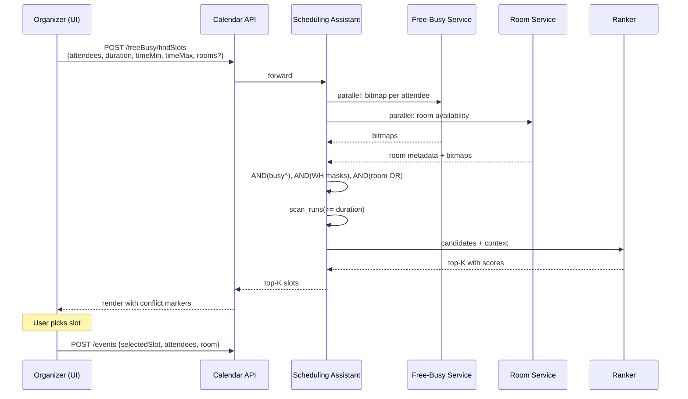

# Scheduling Assistant — Common-Slot Finder, Constraint Solving, and Slot Suggestions

**Date:** 2026-05-01 | **Updated:** 2026-05-01
**Tags:** `system-design` `deep-dive` `calendar` `scheduling` `optimization`

## Table of Contents

- [Summary](#summary)
- [Problem Shape — Why "Find a Time" Is Not a Database Query](#problem-shape--why-find-a-time-is-not-a-database-query)
- [Hard vs Soft Constraints](#hard-vs-soft-constraints)
- [Algorithm — Free-Interval Intersection at Scale](#algorithm--free-interval-intersection-at-scale)
- [Time-Zone Normalization Across Attendees](#time-zone-normalization-across-attendees)
- [Working Hours Per Attendee](#working-hours-per-attendee)
- [Required vs Optional Attendees](#required-vs-optional-attendees)
- [Rooms and Resource Constraints](#rooms-and-resource-constraints)
- [Recurring Meeting Suggestion — Multi-Week Stability](#recurring-meeting-suggestion--multi-week-stability)
- [Time-Quantum and Search-Space Sizing](#time-quantum-and-search-space-sizing)
- [Slot Ranking — From Greedy Earliest to ML Re-rank](#slot-ranking--from-greedy-earliest-to-ml-re-rank)
- ["Find Me a Time" UX Flow](#find-me-a-time-ux-flow)
- [Privacy — What the Assistant Can and Cannot Reveal](#privacy--what-the-assistant-can-and-cannot-reveal)
- [Worked Example — 4 Attendees, 3 Time Zones, 1-Hour Required](#worked-example--4-attendees-3-time-zones-1-hour-required)
- [Anti-Patterns](#anti-patterns)
- [Related](#related)
- [References](#references)

## Summary

The scheduling assistant — Google Calendar's "Find a time", Microsoft Outlook's "Scheduling Assistant" / Graph `findMeetingTimes`, Apple Calendar's "Show available times", Calendly's slot picker — is the surface where every other layer of the calendar system has to perform under a tight latency budget. The free-busy bitmap, the RRULE expander, the time-zone normalization pipeline, the working-hours store, the room booking system, and the per-user privacy filter all converge on a single user-facing question: "Find me a 30-minute slot next week that works for these twelve people, in three time zones, with a video-conference room that has a projector, where two of the attendees are optional."

The naive design treats this as a Cartesian product: enumerate every candidate slot at quantum granularity, ask each attendee/resource "are you free", and return the first hit. The slot enumeration alone is `windowDuration / quantum × N_attendees × M_resources` boolean lookups; for a one-week window at 15-minute quantum that is ~672 slots × 12 attendees × 5 rooms = ~40,000 free-busy probes. This blows the latency budget and ignores the actual structure of the problem.

The production answer is **interval intersection on bitmaps, plus per-attendee working-hours masks, plus a small ranker**. The free-busy subsystem ([`./free-busy-queries.md`](./free-busy-queries.md)) already exposes a precomputed busy bitmap per user at fine quantum (e.g., 5- or 15-minute slots). The scheduling assistant fans out to read each attendee's bitmap, ANDs the negations together (free-for-everyone) with the working-hours mask, scans for runs at least `duration` long, and ranks. The whole pipeline is bitwise operations on small blobs — measured in microseconds for the bitmap math, with the latency budget dominated by the fan-out and ranker.

This document is the companion to [§4 of the parent case study](../design-calendar-system.md#4-scheduling-assistant--finding-common-slots). The parent gives the algorithmic skeleton; this doc covers the constraint surface (hard/soft, time-zone correctness, working hours, optional attendees, room and equipment requirements, recurrence stability, quantum choice), the ranker (deterministic heuristics, ML re-rank, fairness across zones), the UX flow, the privacy boundary, a worked example, and the anti-patterns that recur in real implementations.

## Problem Shape — Why "Find a Time" Is Not a Database Query

A naive design is one SQL query: `SELECT slot FROM calendar_slots WHERE all_attendees_free AND in_working_hours ORDER BY rank`. Three structural reasons it fails:

1. **There is no `calendar_slots` table.** Slots are not stored — they are *intervals between events*. The system stores busy intervals (events) and the free intervals are the complement. Materializing free slots into a queryable table is a write-amplification disaster: every event mutation invalidates a window's worth of slot rows, and the cardinality is `users × quantum_count_per_window`.

2. **The query is multi-attendee, with multi-zone working hours.** A SQL `IN` clause over twelve users, each with their own working-hours table in their own zone, with DST mid-window, is not expressible cleanly. The right primitive is **bitmap intersection**, not relational join.

3. **The result is ranked, not filtered.** Users do not want "all free slots"; they want the *top K*. The ranker is policy: prefer mornings, avoid back-to-back, balance time-zone fairness, minimize displacement of soft conflicts. Policy is not SQL.

The mental model is closer to **constraint satisfaction over interval algebra** than to a database query: each attendee contributes a free-interval set, each working-hours rule contributes a mask, the room contributes another set, and the answer is an intersection ranked by a scoring function. This is the structural shape of [Microsoft Graph `findMeetingTimes`](https://learn.microsoft.com/en-us/graph/api/user-findmeetingtimes), Google Calendar's [Find a Time](https://workspaceupdates.googleblog.com/2018/01/find-a-time-in-Google-Calendar.html), Calendly's slot picker, and Apple [EventKit](https://developer.apple.com/documentation/eventkit/) availability suggestions.

A useful analogy: the matching problem in the [Uber dispatcher](../../location-based/uber/matching-and-dispatch.md) is also "intersection of constraint sets, ranked by a multi-objective cost". The scheduling assistant is the calendaring analog — fewer real-time pressures, but the same shape: gather candidates from many shards, filter by hard constraints, rank by soft constraints, return top K.

## Hard vs Soft Constraints

A clean separation between hard and soft constraints is the single biggest correctness lever in the assistant. Hard constraints prune the candidate set; soft constraints rank what survives.

| Constraint | Class | Where it lives |
|------------|-------|----------------|
| Required attendee is busy | Hard | Free-busy bitmap AND |
| Outside working hours of any required attendee | Hard | Working-hours mask AND |
| No room of required type with capacity ≥ N is free | Hard | Resource intersection |
| Slot is in the past | Hard | Trivial mask |
| Duration < requested | Hard | Run-length scan |
| Optional attendee is busy | Soft | Score penalty |
| Outside preferred working hours | Soft | Score penalty |
| Back-to-back with another meeting | Soft | Adjacency penalty |
| Earlier in the week is preferred | Soft | Day-of-week bonus |
| Closer to organizer's preferred time | Soft | Displacement penalty |
| Fairness across time zones | Soft | Inverse-deviation bonus |
| Avoid lunch hour | Soft | Per-zone window penalty |
| Recurring slot must work for next M weeks | Soft / Hard hybrid | Multi-window AND |

Two design rules fall out of this table:

- **Never put soft constraints inside the bitmap intersection.** Bitmap AND is binary; if you encode a soft penalty as a mask bit, you lose the gradient. Keep masks for hard constraints only; let the scorer see the slot's full feature vector.
- **Hard constraints must be expressible as bitmaps or as cheap predicates per slot.** "Required attendee is free" is a bitmap. "No room available" is a bitmap. "Slot is on a federal holiday" is a per-day flag. Anything that requires reading another user's calendar in detail is the wrong shape — the assistant must not see event titles or attendees of other users' meetings.

This separation also matters for **explainability**: when the assistant says "no slots found", it should be able to say *which hard constraint eliminated the candidate set*. "All slots blocked because attendee X has working hours 09–11 only" is actionable; "no slots" is not. The hard-constraint pruning order is therefore also the explanation order.

## Algorithm — Free-Interval Intersection at Scale

The core algorithm is interval intersection on per-attendee free-busy bitmaps, ANDed with per-attendee working-hours masks. Pseudocode:

```text
findSlots(attendees, optional_attendees, rooms, duration, timeMin, timeMax,
          quantum_min=15, top_k=5):
  # 1. Required attendees: hard constraint
  free_required = ALL_ONES(window_bits)
  for a in attendees:
      busy = free_busy_bitmap(a, timeMin, timeMax, quantum_min)   # bits = 1 if busy
      mask = working_hours_mask(a, timeMin, timeMax, quantum_min) # bits = 1 if in WH
      free_required &= ~busy & mask

  # 2. Rooms: at least one room of required type must be free for each slot
  free_room = ZEROS(window_bits)
  for r in rooms_matching_requirements:
      free_room |= ~room_busy_bitmap(r, timeMin, timeMax, quantum_min)
  free_required &= free_room

  # 3. Optional attendees: soft, used only for scoring
  optional_busy_count = ZEROS_INT_VECTOR(window_bits)
  for a in optional_attendees:
      busy = free_busy_bitmap(a, timeMin, timeMax, quantum_min)
      optional_busy_count += busy   # add 1 to each bit position where they're busy

  # 4. Find runs of contiguous free bits >= duration / quantum
  duration_bits = duration_min // quantum_min
  candidates = scan_runs(free_required, duration_bits)

  # 5. Score and return top K
  scored = [(slot, score(slot, optional_busy_count, attendees)) for slot in candidates]
  scored.sort(key=lambda x: -x[1])
  return scored[:top_k]
```

The bitmap representation is the same one described in the parent doc's [§3 Free-Busy](../design-calendar-system.md#3-free-busy-queries-at-scale): per-user busy bits at quantum granularity, packed as a blob, mergeable across users with bitwise OR (or AND for "all free"). For 15-minute quantum over a 7-day window, that is `7 × 24 × 4 = 672` bits ≈ 84 bytes per user — trivially cacheable, trivially intersectable.

A sketched implementation in TypeScript:

```ts
type Bitmap = Uint8Array;     // packed bits, LSB-first inside each byte
type Slot = { start: Date; end: Date };

function intersectFreeIntervals(
  attendeeBusy: Bitmap[],
  attendeeWorkingHours: Bitmap[],
  rooms: Bitmap[],
  windowBits: number,
): Bitmap {
  const free = filledBitmap(windowBits, /* default = */ 1);
  for (let i = 0; i < attendeeBusy.length; i++) {
    bitwiseAndInPlace(free, bitwiseNot(attendeeBusy[i]));
    bitwiseAndInPlace(free, attendeeWorkingHours[i]);
  }
  if (rooms.length > 0) {
    let anyRoomFree = filledBitmap(windowBits, /* default = */ 0);
    for (const room of rooms) {
      bitwiseOrInPlace(anyRoomFree, bitwiseNot(room));
    }
    bitwiseAndInPlace(free, anyRoomFree);
  }
  return free;
}

function scanRuns(free: Bitmap, durationBits: number): number[] {
  // Returns the start bit-index of every run of >= durationBits set bits.
  const starts: number[] = [];
  let run = 0;
  for (let i = 0; i < free.byteLength * 8; i++) {
    if (getBit(free, i)) {
      run += 1;
      if (run >= durationBits) {
        // overlapping windows: emit on every shift past durationBits
        starts.push(i - durationBits + 1);
      }
    } else {
      run = 0;
    }
  }
  return starts;
}
```

For typical inputs (12 attendees, 7-day window, 15-minute quantum), this is hundreds of bytes of bitwise math and a single linear scan — measured in microseconds. The latency budget is dominated by the fan-out reads to fetch each attendee's bitmap from the free-busy cache, not the math. Parallel reads, short-TTL caching, and short-circuit on the first attendee with no overlap (busy = ALL_ONES → free = 0, we can stop) keep the budget tight.

A subtle correctness rule: **runs must be detected at the slot boundary the user expects**, not at arbitrary bit alignments. If the system uses 5-minute quantum but the UI offers 15-minute slots, the run scanner must emit candidates whose start aligns to 15-minute boundaries, not every 5-minute shift. Otherwise the user sees "9:05, 9:10, 9:15" suggestions that are visually noisy. Snap candidate starts to the user-facing quantum after the bitmap math.

## Time-Zone Normalization Across Attendees

The bitmap representation has one universal time axis: UTC. This is non-negotiable for cross-attendee math — you cannot intersect two bitmaps that represent different reference frames.

The conversion happens at three boundaries:

1. **Window inputs.** The user types "next week, 9–17". The UI resolves "next week" against the *organizer's* zone, then converts the absolute window to UTC for the bitmap reads. If the organizer is in `America/New_York`, "next Monday 9 AM" is `2026-05-04T13:00:00Z` (with DST); if in `Asia/Tokyo`, it is `2026-05-04T00:00:00Z`. The bitmap window is anchored in UTC.

2. **Per-attendee working hours.** Each attendee has working hours stored in *their* home zone, e.g., Alice's `Mon-Fri 09:00-17:00 America/New_York`. Projecting Alice's mask into UTC for the same window is straightforward via the IANA tzdb — but **must be done per date**, because DST transitions inside the window shift the UTC boundary mid-week. A naive one-shot offset projection produces a 1-hour-shifted mask after the DST boundary.

3. **Display.** The candidate slots are returned in UTC and displayed in *each* viewer's zone. Alice sees "Monday 9 AM"; Bob sees "Sunday 10 PM" if he is in Tokyo. The UTC instant is the same.

The rule: **store and compute in UTC; convert only at the I/O boundaries**. The same rule that makes free-busy queries cheap makes the scheduling assistant correct. See [`./time-zone-correctness.md`](./time-zone-correctness.md) for the full discussion of zone handling, DST anomalies, and tzdb rollout.

A concrete projection routine for a working-hours mask:

```ts
function workingHoursMask(
  user: User,
  windowStartUtc: Date,
  windowEndUtc: Date,
  quantumMinutes: number,
): Bitmap {
  // user.workingHours = { mon: [{ start: "09:00", end: "17:00" }], ... }
  // user.zone = "America/New_York"
  const zone = user.zone;
  const totalBits = Math.floor(
    (windowEndUtc.getTime() - windowStartUtc.getTime()) / (quantumMinutes * 60_000),
  );
  const mask = filledBitmap(totalBits, 0);

  for (let bit = 0; bit < totalBits; bit++) {
    const utcInstant = new Date(windowStartUtc.getTime() + bit * quantumMinutes * 60_000);
    const localParts = formatInZone(utcInstant, zone); // { weekday, hour, minute }
    const day = localParts.weekday; // "mon" .. "sun" in user's zone
    const minutesIntoDay = localParts.hour * 60 + localParts.minute;

    for (const range of user.workingHours[day] ?? []) {
      if (minutesIntoDay >= range.startMin && minutesIntoDay < range.endMin) {
        setBit(mask, bit, 1);
        break;
      }
    }
  }
  return mask;
}
```

Critical: `formatInZone` must use the IANA zone definition (e.g., Node `Intl.DateTimeFormat` with `timeZone`, Python `zoneinfo`, Java `java.time.ZoneId`), not a fixed offset. The DST transition inside the window is then handled correctly without special casing.

## Working Hours Per Attendee

Working hours are stored per user, per weekday, in the user's home zone:

```text
working_hours (
  user_id        BIGINT,
  weekday        SMALLINT,        -- 0 = Monday .. 6 = Sunday
  start_minute   SMALLINT,        -- 0..1440 in user's zone
  end_minute     SMALLINT,
  zone           TEXT,             -- IANA zone, denormalized for read efficiency
  PRIMARY KEY (user_id, weekday, start_minute)
)
```

A row per range allows multiple ranges per day (e.g., `09:00-12:00` and `13:00-18:00` for someone who blocks lunch). Most users have a single range per workday and no rows for weekends.

Production realities to handle:

- **Per-zone exceptions.** A user travelling to a different zone for two weeks may set "override zone" for that range. The mask projection consults the override before falling back to the home zone.
- **Per-product working hours.** A doctor may have separate windows for "in-person consultations" and "video calls". Implemented as a tag on the working-hours range; the assistant filters by tag when the meeting type is known.
- **Weekend availability.** Sales / customer-success teams that work weekends configure ranges for Saturday/Sunday. Default mask is empty; explicit rows enable.
- **Out-of-office ranges.** Stored separately as a busy interval, not as a working-hours flip. Reason: OOO should still leak as "busy" to free-busy probes from non-trusted viewers, even though it's not a real meeting. Modeling OOO as a special event with `transparency=opaque` keeps the bitmap unified.
- **Buffer time.** Some users want a 15-minute buffer between meetings. Implemented as a soft constraint (penalty for back-to-back), not a hard mask, because the buffer is the user's preference and other attendees should not see it as unavailable.

The mask is computed per-request and cached per `(user_id, window_anchor_utc)` for ~60 seconds; working hours change rarely, so the cache hit rate is very high during a single user session.

## Required vs Optional Attendees

RFC 5545 distinguishes `REQ-PARTICIPANT`, `OPT-PARTICIPANT`, and `CHAIR` roles. The scheduling assistant treats them as different constraint classes:

- **Required attendees** are hard. Their busy intervals AND their working-hours mask both contribute to the candidate set. A slot where any required attendee is busy or out-of-hours is removed.
- **Optional attendees** are soft. Their busy intervals contribute to the *score*, not the mask. The slot survives if all required are free; the score penalizes the count of optional attendees who are busy.

A practical extension is **K-tolerance**: "find a slot where at least 80% of optional attendees can attend". The score function applies a step penalty when the busy-optional count exceeds the threshold:

```ts
function scoreSlot(
  slot: Slot,
  optionalBusyCount: Uint8Array, // count of busy optional attendees per quantum bit
  config: { totalOptional: number; minOptionalAttendance: number },
): number {
  const startBit = utcToBit(slot.start);
  const endBit = utcToBit(slot.end);

  let maxOptionalBusy = 0;
  for (let b = startBit; b < endBit; b++) {
    maxOptionalBusy = Math.max(maxOptionalBusy, optionalBusyCount[b]);
  }
  const optionalAttending = config.totalOptional - maxOptionalBusy;
  const optionalAttendanceRate = optionalAttending / Math.max(1, config.totalOptional);

  const baseScore = scoreFromHeuristics(slot);
  const optionalPenalty =
    optionalAttendanceRate >= config.minOptionalAttendance
      ? 0
      : (config.minOptionalAttendance - optionalAttendanceRate) * 100;

  return baseScore - optionalPenalty;
}
```

Microsoft Graph [`findMeetingTimes`](https://learn.microsoft.com/en-us/graph/api/user-findmeetingtimes) exposes this directly via `minimumAttendeePercentage` (default 100). Google Calendar's "Find a time" surfaces conflicts visually instead, leaving the choice to the user.

A common UX pattern: when no slot satisfies "all required free + all optional free", surface the *best partial-attendance slot* and label it: "Charlie is busy at this time — propose anyway?" This is much more useful than "no slots found" and respects that the organizer often has more context than the system about who really matters.

## Rooms and Resource Constraints

Rooms (and equipment, vehicles, video-conferencing licenses) are first-class calendars. They have their own free-busy bitmap, their own metadata (capacity, equipment list, building, accessibility), and their own ACL.

The integration is clean: a room is just another bitmap to AND with. The complications are in *room selection*:

- **Capacity.** A meeting for 10 attendees needs a room with capacity ≥ 10. The room search filters by `capacity >= attendees.length` before the bitmap step.
- **Equipment.** Projector, video-conferencing endpoint, whiteboard, accessibility features. Stored as tags; query is `equipment ⊇ requested_equipment`.
- **Building / floor preferences.** When attendees are split across two buildings, prefer rooms in the building closest to the majority. The score function knows about building distances.
- **Multiple eligible rooms.** When ten rooms could host the meeting, the assistant must pick one. Greedy "least-booked overall" prevents popular rooms from dominating; greedy "closest to organizer" is rider-friendly; the production answer mixes both with explicit weights.

The bitmap fan-in for rooms is OR (any room free), then AND with the attendee result:

```text
free_room_set = OR(NOT room_busy_bitmap(r) for r in eligible_rooms)
final = free_attendees AND free_room_set
```

But the *choice* of room is made per-slot during ranking — for each surviving candidate slot, pick the best eligible room and attach it to the slot in the response.

A real production example from Google Calendar: when the user types "Add a room" after choosing a time, the system auto-suggests the top-ranked free room. The ranking respects building, capacity, equipment, and recent usage. This is a separate ranker from slot ranking; both call the same room metadata service.

For shared resources beyond rooms — video-conference license pools, projector carts, company vehicles — the same pattern applies: each is a calendar; bitmap AND for hard constraints; ranker for selection.

## Recurring Meeting Suggestion — Multi-Week Stability

"Schedule a weekly 1:1 for the next 12 weeks" is a different problem from "schedule a one-off". The candidate is a (weekday, hour) pair, not a single slot, and it must work for *every* week in the horizon — or at least for most of them, with a documented "skip these N weeks" exception list.

The algorithm extends naturally:

```text
findRecurringSlot(attendees, duration, weekday, weeksAhead, timeMin):
  # Build a per-week free intersection
  per_week_free = []
  for w in 0..weeksAhead-1:
      week_start = timeMin + w * 7 days
      week_end   = week_start + 1 day  # only the target weekday
      free_w = intersect_for_window(attendees, week_start, week_end)
      per_week_free.append(free_w)

  # The recurring slot must be free in at least K out of weeksAhead weeks
  stable_mask = ALL_ONES
  weeks_free_per_bit = ZEROS_INT_VECTOR
  for free_w in per_week_free:
      weeks_free_per_bit += free_w  # count of weeks each bit is free

  candidates = []
  for bit in range(bits_per_day):
      if weeks_free_per_bit[bit] >= K:
          candidates.append(bit)
  return rank(candidates)
```

The bit-vector accumulation is cheap; the win is that the user gets a *stable* recurring slot, with a clear "exceptions: weeks 4 and 9" notification when full stability is impossible.

A subtle point: **DST transitions inside the horizon shift the wall-clock-to-UTC mapping**. A weekly meeting at "9 AM New York time" sits at different UTC instants before and after a DST transition. The recurrence is anchored in local time + zone, not UTC, exactly as the parent doc's [§2 Time-Zone Correctness](../design-calendar-system.md#2-time-zone-correctness-dst-and-iana-tzdb) prescribes. The candidate evaluation must therefore project working hours and free-busy *for each week* in the horizon, not once.

For long horizons (a year of weekly meetings = 52 evaluations), the cost is still small — bitmap ops are cheap — but the read fan-out grows. Cache attendee free-busy at the day-bucket level and reuse across the horizon.

## Time-Quantum and Search-Space Sizing

The quantum is the granularity of the bitmap. Common choices:

| Quantum | Bits per day | Bits per week | Use case |
|---------|--------------|---------------|----------|
| 1 minute | 1,440 | 10,080 | Very fine-grained; rare in practice |
| 5 minutes | 288 | 2,016 | Calendly precision; aggressive |
| 15 minutes | 96 | 672 | Production default for most systems |
| 30 minutes | 48 | 336 | Older systems, simple UIs |
| 60 minutes | 24 | 168 | Aggregated reporting only |

Trade-offs:

- **Smaller quantum** → bigger bitmap, more bits to scan, but finer alignment to actual meeting boundaries. A 5-minute quantum captures "9:05–9:55" precisely; a 15-minute quantum forces "9:00–10:00" or "9:15–10:15".
- **Larger quantum** → smaller bitmap, faster scan, but loses precision. Edge events (a 50-minute meeting starting at 9:10) become ambiguous.
- **Mixed quantum.** Internal storage at 5-minute, UI surface at 15-minute. The bitmap is the union of any 5-minute event overlapping the slot; candidate emission snaps to 15-minute boundaries. This is the production-correct shape.

Sizing the search space:

- **Window length.** A 7-day search at 15-minute quantum = 672 bits = 84 bytes per attendee. A 30-day search = 2,880 bits = 360 bytes. Both fit easily in cache.
- **Attendee fan-out.** 12 attendees = 12 × 84 bytes = ~1 KB of bitmap math. Trivial.
- **Run scan.** Linear in window bits. ~1 microsecond at modern CPU speeds.

The dominant cost is the *fan-out reads* to fetch each attendee's bitmap. With Redis caching at ~1 ms per read and parallel fan-out, a 12-attendee fetch is ~5 ms p95. This leaves a generous budget for the ranker and the response serialization.

For very long horizons (90 days, 6 months), shard the bitmap into day buckets and parallelize. A 6-month search at 15-minute quantum is ~17,000 bits per attendee — still cacheable, but cross AZ traffic to fetch 12 × 17,000 bits matters. Day-bucket sharding lets the assistant fetch only the buckets that overlap the requested window.

For the broader capacity discussion — bitmap sizes, fan-out budgets, cache hit rates — see [`../../../foundations/back-of-envelope-estimation.md`](../../../foundations/back-of-envelope-estimation.md).

## Slot Ranking — From Greedy Earliest to ML Re-rank

Once the candidate set is filtered, the ranker chooses the order. Three regimes coexist:

**1. Deterministic heuristic ranker.** Cheap, explainable, the default for most systems. A weighted sum:

```ts
function score(slot: Slot, ctx: ScoringContext): number {
  const earlyDayBonus = bonusForEarlierInDay(slot, ctx);
  const earlyWeekBonus = bonusForEarlierInWeek(slot);
  const middayBonus = bonusForCloserToMidday(slot, ctx);
  const adjacencyPenalty = penaltyForBackToBack(slot, ctx);
  const fairnessBonus = bonusForTimeZoneFairness(slot, ctx);
  const optionalAttendingBonus = bonusForOptionalAttendingCount(slot, ctx);
  const lunchPenalty = penaltyForLunchHour(slot, ctx);

  return (
    1.0 * earlyDayBonus +
    0.5 * earlyWeekBonus +
    0.3 * middayBonus -
    0.7 * adjacencyPenalty +
    0.6 * fairnessBonus +
    0.8 * optionalAttendingBonus -
    0.4 * lunchPenalty
  );
}

function topKSlots(candidates: Slot[], ctx: ScoringContext, k: number): Slot[] {
  const scored = candidates.map((s) => ({ slot: s, score: score(s, ctx) }));
  scored.sort((a, b) => b.score - a.score);
  return scored.slice(0, k).map((entry) => entry.slot);
}
```

The weights are tunable and per-tenant; an enterprise can override "prefer mornings" if their culture is afternoon-heavy. Each term should be expressible in the same unit (e.g., "minutes of equivalent ETA-displacement") so the weights are comparable.

**2. Time-zone fairness term.** With multiple zones, the bonus for "closer to each attendee's mid-day" is an inverse sum:

```ts
function bonusForTimeZoneFairness(slot: Slot, ctx: ScoringContext): number {
  let totalDeviation = 0;
  for (const attendee of ctx.attendees) {
    const localHour = hourInZone(slot.start, attendee.zone);
    const deviationFromMidday = Math.abs(localHour - 12);
    totalDeviation += deviationFromMidday;
  }
  return -totalDeviation / ctx.attendees.length;
}
```

A slot that's "9 AM for everyone in their own zone" scores high; a slot that's "9 AM for Alice but 6 AM for Bob" scores low. The fairness term resists the optimizer's tendency to pile the schedule on the largest cohort's preferences.

**3. ML re-rank.** When the deterministic ranker has produced a top-N (e.g., top 20), an ML model re-ranks. Features: organizer's historical acceptance of suggestions, attendee response rate at this hour, prior accepted-meeting clustering, day-of-week patterns, average meeting duration at this slot. The output is a re-ordered top-K. Microsoft Graph and Google Calendar both run a re-ranker of this shape; the open API surface returns the post-rank result without exposing the features.

The re-ranker is gated on data sufficiency: a new user with no history falls back to the deterministic ranker. A team with rich history sees increasing personalization over time. The danger — same as in the [Uber dispatch](../../location-based/uber/matching-and-dispatch.md) acceptance model — is *feedback collapse*: the ranker learns to suggest only what the user has historically accepted, which constrains exploration. Mitigation: epsilon-greedy exploration of slots the ranker is unsure about.

A practical concern: **stable ordering across paginated reads**. If the user clicks "show more slots", the second page must not re-rank the first page's items differently. Either include a deterministic tiebreaker (e.g., earliest start) or pass an explicit pagination token that pins the ranker state.

## "Find Me a Time" UX Flow

The end-to-end interaction has a well-defined shape that the system must support:



Latency budget at each step:

| Stage | Budget | Notes |
|-------|--------|-------|
| Parse and validate | 5–10 ms | Schema check, ACL check on attendees |
| Free-busy fan-out | 20–50 ms | Parallel reads, Redis cache hit ~95% |
| Room availability | 10–20 ms | Smaller fan-out; metadata + bitmap |
| Bitmap math + run scan | 1–5 ms | In-memory bitwise ops |
| Heuristic ranker | 5–10 ms | Per-slot scoring, top-K sort |
| ML re-rank (when on) | 20–50 ms | Model call with batched features |
| Serialization | 5–10 ms | JSON encoding of K slots |
| **Total p99 target** | **< 200 ms** | |

The 200 ms target lets the UI feel instant. Anything over 500 ms shows a "Searching..." spinner; over 2 s feels broken. The budget is achievable because the math is microseconds and only the fan-out reads are real work.

Three UX patterns matter:

- **Conflict markers in the UI.** The result shows top-K slots; each is annotated with which optional attendees are busy. The organizer can override.
- **Suggested vs free.** Don't show all 200 free slots; show the top 5–10. Users overwhelmed by choice take longer to pick.
- **Adjustable constraints.** When no slot is found, the UI surfaces *which constraint eliminated candidates*: "Charlie's working hours (9–11 EST) make this hard — relax this constraint?" This is much more useful than "no slots found".

Calendly's UX is the production reference for one common variant: the organizer publishes their availability rules, the invitee picks from a slot list, the system books on accept. The invitee never sees the organizer's calendar; the slot list is the privacy boundary. See [Calendly's help center](https://help.calendly.com/hc/en-us) for the UX patterns.

## Privacy — What the Assistant Can and Cannot Reveal

The assistant operates across users' calendars but must respect a strict privacy boundary. The rules:

- **Free-busy is the *only* signal** that crosses the user boundary. Event titles, descriptions, attendees, locations are never visible to the assistant on behalf of another user. The free-busy bitmap is naturally privacy-preserving (it has no event metadata).
- **The response contains slot times only**, plus attribution like "Bob is busy" — never "Bob is busy with 'Sales call with Acme'". The assistant says *that* an attendee is busy, never *why*.
- **Working hours are queryable when ACL allows.** Most enterprises let team members see each other's working hours; some lock this down. The ACL is checked per-attendee at query time.
- **Optional attendees still have privacy.** Even though they're soft constraints, the system must not reveal *what* their conflict is — only *that* they have one.
- **Cross-organization queries** require federation (free-busy URL exchange, RFC 5545's iMIP / iSchedule, or Microsoft Graph's tenant-to-tenant). When federation is unavailable, return "free-busy unknown for X" rather than guess.

A common bug: the suggestion ranker that uses ML features can leak through the model. If "Bob is more likely to accept slots adjacent to client meetings" is a feature, an attacker observing the suggested slots could infer Bob's client meeting times. The mitigation is per-user model isolation: features computed about Bob's calendar are visible only when ranking for Bob's organizer; cross-user inference is blocked.

The other common bug: the response leaks slot information for a calendar the requester shouldn't see at all. Always filter the attendee list against the requester's ACL *before* fanning out free-busy. If the requester cannot see Charlie's free-busy (Charlie's ACL doesn't grant `freeBusyOnly` to the requester), the assistant should either fail with a clear error or proceed without Charlie and label Charlie as "free-busy unavailable".

For the legal-and-compliance perspective on calendar privacy — including GDPR / personal data treatment of meeting times — the IETF [JMAP Calendars (RFC 8984)](https://datatracker.ietf.org/doc/html/rfc8984) draft and [RFC 7986](https://datatracker.ietf.org/doc/html/rfc7986) (calendar metadata) define what fields are considered metadata and which are content; the assistant should treat content fields as off-limits.

## Worked Example — 4 Attendees, 3 Time Zones, 1-Hour Required

Concrete scenario:

- **Organizer**: Alice, `America/New_York` (EDT, UTC-4 in May).
- **Required attendees**: Bob, `America/Los_Angeles` (PDT, UTC-7); Carol, `Europe/London` (BST, UTC+1).
- **Optional attendee**: Dan, `America/New_York`.
- **Duration**: 60 minutes.
- **Window**: 2026-05-04 (Monday) through 2026-05-08 (Friday), each attendee's working hours.
- **Goal**: top 5 candidate slots.

**Step 1 — Working-hours masks (in UTC).**

Alice's `Mon-Fri 09:00-17:00 America/New_York` projects to UTC `13:00-21:00` for May 4–8 (no DST transition in window).

Bob's `Mon-Fri 09:00-17:00 America/Los_Angeles` projects to UTC `16:00-00:00` (next day).

Carol's `Mon-Fri 09:00-17:00 Europe/London` projects to UTC `08:00-16:00`.

Intersection of working hours (Alice ∩ Bob ∩ Carol):

```text
UTC overlap = max(13, 16, 08) ... min(21, 24, 16)
            = 16:00 ... 16:00 (London ends at 16:00 UTC; Bob doesn't start until 16:00 UTC)
            = empty intersection!
```

The strict overlap is a single instant — meaningless for a 60-minute meeting. **No slot exists where all three are simultaneously inside their declared working hours.** The assistant must surface this as a constraint conflict and offer one of:

- Relax Carol's end (London 16:00 → 17:00 BST = 16:00 UTC → 17:00 UTC, giving a 1-hour window 16:00–17:00 UTC, which is 09:00–10:00 PDT for Bob, 12:00–13:00 EDT for Alice, 17:00–18:00 BST for Carol).
- Relax Bob's start (Los Angeles 08:00 instead of 09:00 → 15:00 UTC, giving 15:00–16:00 UTC, which is 11:00–12:00 EDT, 16:00–17:00 BST).
- Relax Alice's start similarly.

This is the **explainable constraint conflict** the UX surfaces: "Carol's working hours end before Bob's start in their respective zones. Relax someone's hours to find slots."

**Step 2 — Assume Carol agrees to extend to 18:00 BST (17:00 UTC).** The new working-hours intersection is 16:00–17:00 UTC, Mon–Fri = 5 candidate hours total.

**Step 3 — Apply busy bitmaps.** Suppose:

- Alice is busy Mon 16:00–17:00 UTC (lunch meeting), Wed 16:00–17:00 (1:1 with manager).
- Bob is busy Tue 16:00–16:30 (interview).
- Carol is free entirely in this window.
- Dan (optional) is busy Mon, Tue 16:00–17:00.

Free-for-required after intersection:

| Day | UTC slot | Alice | Bob | Carol | Free-for-required? |
|-----|----------|-------|-----|-------|-------------------|
| Mon | 16–17 | busy | free | free | no |
| Tue | 16–17 | free | busy 16:00–16:30 | free | no (60-min run not free) |
| Wed | 16–17 | busy | free | free | no |
| Thu | 16–17 | free | free | free | yes |
| Fri | 16–17 | free | free | free | yes |

Two candidate slots: Thursday 16:00–17:00 UTC and Friday 16:00–17:00 UTC.

**Step 4 — Score.**

Both slots are at the same UTC hour (16:00). Time-zone fairness term is identical:

- Alice (NY): 12:00 → deviation from midday = 0
- Bob (LA): 09:00 → deviation = 3
- Carol (London): 17:00 → deviation = 5

Fairness penalty same on both slots. Tie-breakers:

- **Earlier-in-week bonus** favors Thursday over Friday.
- **Optional attendance**: Dan is free both days at 16:00–17:00 UTC (Mon and Tue conflicts ended Tue 17:00 UTC, so by Thu he's free). Equal contribution.
- **Friday afternoon penalty** (some cultures): Friday gets a small penalty.

Final ranking:

1. **Thursday 2026-05-07 16:00–17:00 UTC** (Alice 12:00 EDT, Bob 09:00 PDT, Carol 17:00 BST, Dan 12:00 EDT)
2. **Friday 2026-05-08 16:00–17:00 UTC** (same per-zone display, slightly lower score)

**Step 5 — Return top-K.** Only 2 slots survived; return both with scores and per-zone display strings. The UI shows:

```text
1. Thu, May 7  ★★★★☆
   12:00 PM EDT (Alice, Dan)  •  9:00 AM PDT (Bob)  •  5:00 PM BST (Carol)
2. Fri, May 8  ★★★☆☆
   (same per-zone, marked "Friday afternoon")
```

If the user requested 5 slots and only 2 survive, the response also includes a `relaxableConstraints` hint: "Relax Carol's working hours to gain 4 more slots."

## Anti-Patterns

- **Full N×M slot enumeration.** Walking every quantum slot and asking each attendee "are you busy" is `O(slots × attendees)` boolean lookups; bitmap intersection is `O(attendees)` reads + `O(window_bits / 64)` math. Always intersect bitmaps; never enumerate slots first.
- **Ignoring time zones.** Computing the intersection in the organizer's local time without projecting attendee zones produces silently wrong results — users in other zones see suggestions outside their hours. Always project to a common UTC axis.
- **Working hours as a single global rule.** "9–17" assumes uniform days; many users have asymmetric weekdays, lunch blocks, or per-product hours. Store ranges per (user, weekday) and respect them.
- **No privacy filter on returned slots.** Returning slot annotations like "Bob has 'Strategy review with CEO'" leaks event titles. Return only "Bob is busy" or "Bob has a conflict".
- **Hard SAT solver when greedy intersection works.** Casting the problem as boolean-SAT or general constraint programming (Z3, OR-Tools CP-SAT) is overkill for the common case. Greedy intersection + ranker handles 99% of meetings; reserve heavyweight solvers for actual NP-hard variants like multi-room sequencing or interview-loop scheduling.
- **Recurrent slot picked on a single week's data.** A 12-week recurring meeting needs to evaluate stability across all 12 weeks, not just the first. Account for DST mid-horizon explicitly.
- **Returning all free slots, not top K.** Users overwhelmed by 200 slots take longer than users seeing 5. Ranker is not optional; it's part of the contract.
- **Optional attendees treated as required.** A meeting that requires *everyone's* free time across 12 people is very rarely findable. Distinguish hard and soft attendance from the API surface up.
- **Ignoring DST inside the window.** A working-hours mask projected once at the window start drifts after the DST transition mid-week. Project per-day or per-quantum.
- **Caching free-busy without invalidation on event mutation.** A user who declines a meeting and then runs the assistant should see their newly-free slots, not a 60-second-stale bitmap. Invalidate on the event mutation path; short TTLs as a backstop.
- **Rooms as a separate, post-hoc step.** Picking a slot first, then a room, often produces "no room available at chosen slot". Integrate room availability into the bitmap math; only select-among-eligible-rooms happens post-hoc.
- **Single-shot solve under live mutation.** Concurrent acceptances by other organizers can flip a slot from free to busy between the suggestion and the booking. Booking should re-check availability with optimistic concurrency (ETag / sequence number); on conflict, suggest the next-best slot.
- **Same ranker weights everywhere.** A regional sales team and an engineering team have different cultural norms (mornings vs afternoons, lunch sanctity, end-of-day cutoffs). Per-tenant or per-team weight overrides are necessary.
- **Trusting the client's "now".** A device with a stale clock that submits "find slots from now" can return slots in the past or skip slots that are imminently usable. Use server time for relative anchors.
- **No fallback when an attendee's free-busy is unavailable.** Federation failures, deactivated accounts, ACL revocations all produce "free-busy unknown". Don't block the whole search; rank slots by the count of attendees with known availability.
- **Showing identical scores in arbitrary order.** Without a deterministic tiebreaker, paginated reads reorder; users see different slots on refresh. Tiebreak on slot start time always.

## Related

- [`./free-busy-queries.md`](./free-busy-queries.md) — the bitmap-based busy/free representation that the assistant intersects across users; cache invalidation, fan-out budgets, federation.
- [`./rrule-expansion.md`](./rrule-expansion.md) — how recurring events are expanded into instance bitmaps within the rolling window so the assistant sees them.
- [`./time-zone-correctness.md`](./time-zone-correctness.md) — IANA tzdb, DST anomalies, per-zone projection of working-hours masks; the substrate the cross-zone intersection depends on.
- [`./conflict-detection.md`](./conflict-detection.md) — per-attendee bitmap conflict checks at write time; same primitive viewed from the booking side.
- [`../design-calendar-system.md`](../design-calendar-system.md) — parent case study; this doc is the deep dive for §4.
- [`../../location-based/uber/matching-and-dispatch.md`](../../location-based/uber/matching-and-dispatch.md) — structurally analogous: gather candidates from sharded indexes, intersect with constraints, rank by multi-objective cost, return top K under a tight latency budget.
- [`../../../foundations/back-of-envelope-estimation.md`](../../../foundations/back-of-envelope-estimation.md) — sizing for bitmap fan-out, cache hit rates, and per-region capacity.

## References

- [RFC 7953 — Calendar Availability (`VAVAILABILITY`)](https://datatracker.ietf.org/doc/html/rfc7953) — iCalendar component for declaring per-user availability blocks; the structured form of "working hours" usable in CalDAV exchanges.
- [RFC 5545 — Internet Calendaring and Scheduling Core Object Specification](https://datatracker.ietf.org/doc/html/rfc5545) — VEVENT, attendee roles (`REQ-PARTICIPANT`, `OPT-PARTICIPANT`), `RECURRENCE-ID`, `EXDATE`.
- [RFC 7986 — New Properties for iCalendar](https://datatracker.ietf.org/doc/html/rfc7986) — calendar metadata properties (color, image, conference, refresh-interval) the assistant treats as non-content.
- [RFC 8984 — JSCalendar (JMAP Calendars data model)](https://datatracker.ietf.org/doc/html/rfc8984) — modern JSON model for calendars; alternative serialization the assistant can speak.
- [Microsoft Graph — `findMeetingTimes`](https://learn.microsoft.com/en-us/graph/api/user-findmeetingtimes) — production API for the same problem; reference for `attendeeAvailability`, `minimumAttendeePercentage`, `meetingDuration`, `locationConstraint`.
- [Google Workspace Updates — Find a time in Google Calendar](https://workspaceupdates.googleblog.com/2018/01/find-a-time-in-Google-Calendar.html) — UX overview; companion to the [Google Calendar API reference](https://developers.google.com/calendar/api/v3/reference) (`freebusy.query`).
- [Calendly Help Center](https://help.calendly.com/hc/en-us) — the canonical product reference for invitee-driven slot picking, working-hours rules, and buffer time.
- [Apple EventKit](https://developer.apple.com/documentation/eventkit/) — iOS / macOS calendar suggestions API; system-side availability heuristics on Apple platforms.
- [IANA Time Zone Database (tzdb)](https://www.iana.org/time-zones) — authoritative source for zone definitions used in working-hours projection.
