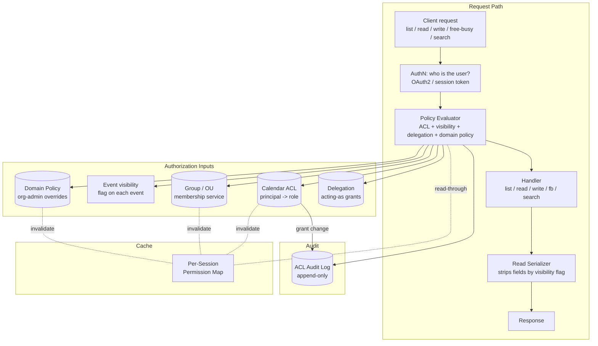

# Calendar Sharing, Permissions, and Delegation — ACLs, Roles, and Read/Write/Free-Busy Tiers

**Date:** 2026-05-01 | **Updated:** 2026-05-01
**Tags:** `system-design` `deep-dive` `calendar` `permissions` `delegation`

## Table of Contents

- [Summary](#summary)
- [Overview](#overview)
- [Permission Tiers — Free-Busy, Read, Write, Owner, Delegate](#permission-tiers--free-busy-read-write-owner-delegate)
- [Per-Calendar ACL Model](#per-calendar-acl-model)
- [Per-Event ACL Overrides and Visibility Flags](#per-event-acl-overrides-and-visibility-flags)
- [Group and Team Principals](#group-and-team-principals)
- [Domain-Wide Policies and External Sharing Controls](#domain-wide-policies-and-external-sharing-controls)
- [Delegation — Acting On Behalf Of](#delegation--acting-on-behalf-of)
- [Permission Checks at Every Layer](#permission-checks-at-every-layer)
- [ACL Caching and Invalidation](#acl-caching-and-invalidation)
- [Permission Inheritance — Subcalendars and Defaults](#permission-inheritance--subcalendars-and-defaults)
- [Public Calendars and Capability URLs](#public-calendars-and-capability-urls)
- [ICS Feed URLs with Secret Tokens](#ics-feed-urls-with-secret-tokens)
- [Audit Logging — Every Permission Change](#audit-logging--every-permission-change)
- [Cross-Domain Sharing — Google ↔ Outlook Interop](#cross-domain-sharing--google--outlook-interop)
- [Permission Revocation Propagation](#permission-revocation-propagation)
- [Worked Example — Exec, Two Assistants, Three Confidential Events](#worked-example--exec-two-assistants-three-confidential-events)
- [Anti-Patterns](#anti-patterns)
- [Related](#related)
- [References](#references)

## Summary

A calendar system is, structurally, a multi-tenant authorization problem dressed up as a time-management product. The matching engine of the calendar is not the storage of events, nor the RRULE expander, nor the free-busy index — it is the **ACL evaluator** that runs on every list, search, free-busy probe, read, and write. Every other property of the system (ICS export fidelity, scheduling assistant, reminders, CalDAV interop) depends on the ACL evaluator returning the same answer everywhere it is consulted, and that answer being computable cheaply enough to fit inside a sub-100ms request budget. This document expands §7 ("Sharing, Permissions, and Delegation") of [`../design-calendar-system.md`](../design-calendar-system.md), focused on three properties the architecture must hold simultaneously: **uniform enforcement** so a permission denied on read is also denied on free-busy and search, **bounded staleness** of the cached permission map so revocation propagates within a known SLA, and **complete auditability** of every grant, change, and access decision that touches a confidential event.

The architectural through-line: **ACLs sit on calendars, not on events; events override only via visibility flags evaluated at the read serializer; principals are resolved at access time, never embedded; every layer (list, search, free-busy, read, write) re-checks permission; revocation invalidates caches across the fleet, not just the issuing node**. Every property the product wants — "my assistant can manage my calendar but not see my therapy sessions", "the org admin can revoke external sharing in one click", "my Slack channel sees my team's free-busy" — falls out of taking that discipline seriously, instrumenting the audit log well enough to keep grant history trustworthy, and refusing to short-cut the check at any layer for performance.

## Overview

The sharing / permissions / delegation subsystem must satisfy a tight set of invariants that look superficially like a typical RBAC problem but become hard once the read paths multiply (free-busy is not the same shape as read-event, and search is not the same shape as either):

| Invariant | Why it matters | Enforcement |
|---|---|---|
| Every read/write path checks ACL before returning data | Without this, a search bypass leaks confidential event titles a direct read would refuse | Centralized policy evaluator called from every handler |
| ACLs live on calendars; per-event overrides are visibility flags only | Embedding ACLs in event payloads creates replication drift across recurring instance overrides | Store ACL once on the calendar; flag `visibility ∈ {default, private, confidential}` on events |
| Group principals resolve at access time, not at grant time | A user added to a Slack channel today gets the access the channel was granted yesterday, without re-grant | Group membership lookup inside the policy evaluator, with bounded cache |
| Delegation preserves actor identity in audit logs | Compliance must show "Alice's assistant Bob created this event" — not "Alice created this event" | Separate `actor_user_id` and `acting_as_user_id` columns; audit logs key on actor |
| Revocation propagates within an SLA | A fired employee must lose calendar access within minutes, not at TTL expiration | Cache invalidation broadcast on grant change + short TTL ceiling |
| Every grant change is audit-logged with before/after | A regulator or incident investigator must be able to answer "who could see X at time T?" months later | Append-only ACL audit table with actor, target, role-before, role-after |
| Public sharing and ICS-feed tokens are revocable and unguessable | A leaked token must be killable; URL enumeration must be infeasible | Long random tokens, revocation table, capability-style auth (token = grant) |



A deliberate consequence of this layout: the policy evaluator is the only component that knows how to translate "user U wants action A on calendar C (or event E)" into yes/no. Every handler — list, search, free-busy, read, write, ICS export, CalDAV REPORT — calls into the same evaluator with the same input shape. The handlers are dumb; the evaluator is the truth.

## Permission Tiers — Free-Busy, Read, Write, Owner, Delegate

The product surface exposes a handful of named roles. The evaluator internally maps each role to a set of allowed actions. Externally adding a new role (e.g., "scheduler" — can write but not see private titles) is a server-side change to the role table, never a schema migration on every event.

| Role | List calendar | Free-busy | Read events | Read private events | Write events | Manage ACL | Act on behalf |
|---|---|---|---|---|---|---|---|
| `none` | ❌ | ❌ | ❌ | ❌ | ❌ | ❌ | ❌ |
| `freeBusyOnly` | ❌ | ✅ (busy/free) | ❌ | ❌ | ❌ | ❌ | ❌ |
| `reader` | ✅ | ✅ | ✅ (full details, public + default) | ❌ | ❌ | ❌ | ❌ |
| `writer` | ✅ | ✅ | ✅ | ✅ (sees private + confidential) | ✅ | ❌ | ❌ |
| `owner` | ✅ | ✅ | ✅ | ✅ | ✅ | ✅ | ❌ |
| `delegate` | ✅ | ✅ | ✅ | ✅ (subject to event-level confidential flag) | ✅ | ❌ | ✅ (RSVP / send on behalf) |

A few subtle distinctions worth nailing:

- **`freeBusyOnly` ≠ `reader` minus details.** A `freeBusyOnly` principal sees only `(start, end, busy|free|tentative|outOfOffice)` tuples — never event IDs, never titles, never attendee lists. The shape of the response is different, not just the field set. This matters for the wire format: the free-busy endpoint emits `VFREEBUSY`-shaped output, while the read endpoint emits `VEVENT`. Trying to filter VEVENT down to free-busy at the serializer layer leaks event count, which is information.
- **`reader` sees private events as "Busy".** If Alice marks an event as `visibility: private`, the reader sees a degraded record (start, end, "Busy") with no title, location, description, or attendees. This is the same shape `freeBusyOnly` sees, but it lives within a `VEVENT` payload — preserving the event's existence (so the reader can see the time slot is taken) without disclosing what it's about.
- **`writer` does not equal `delegate`.** A `writer` can create events on the calendar, but the events they create have *their own* identity as creator. A `delegate` creates events with the *delegator* as the apparent organizer. The distinction matters when invitations go out: a delegate-sent invite from Alice's calendar shows "from: Alice (sent by Bob)" in compliant clients, not "from: Bob".
- **`owner` is also the only role that can manage ACL.** ACL changes are themselves a permission, separately checkable. A common subtle bug: assuming write-permission implies ACL-management permission. They are independent; only `owner` (or a domain admin via domain policy) can grant or revoke roles on the calendar.
- **`delegate` is a role + a side flag, not just a role.** Delegation is `(role: writer-or-owner) + (acting_as: target_user_id)`. The ACL row carries both. The audit log records the acting-as identity for every action — see [Delegation](#delegation--acting-on-behalf-of) below.

The Google Calendar v3 ACL ([Google Calendar ACL](https://developers.google.com/calendar/api/v3/reference/acl)) and Microsoft Graph `calendarPermission` ([Microsoft Graph](https://learn.microsoft.com/en-us/graph/api/resources/calendarpermission)) both encode roughly this tier set, with vendor-specific extensions for "private items" and "delegate access". The CalDAV / WebDAV ACL extension (RFC 3744 — [RFC 3744](https://datatracker.ietf.org/doc/html/rfc3744)) provides the same conceptual primitives at the protocol level: privileges (`read`, `write-content`, `read-free-busy`, `bind`, `unbind`, `read-acl`, `write-acl`) granted to principals, with privilege inheritance and per-resource overrides. A calendar service that exposes both REST and CalDAV is implementing a single internal ACL model with two protocol projections.

## Per-Calendar ACL Model

The data model is simple and the temptation to "optimize" it by embedding access lists in events is the single most common architectural mistake in this space. The right shape:

```sql
-- One row per (calendar, principal, role) grant. The pk is (calendar_id, principal_id).
CREATE TABLE calendar_acl (
    calendar_id      BIGINT      NOT NULL,
    principal_id     TEXT        NOT NULL,        -- user:U123 / group:G456 / domain:example.com / token:T789
    principal_type   TEXT        NOT NULL,        -- 'user' | 'group' | 'domain' | 'public' | 'token'
    role             TEXT        NOT NULL,        -- 'freeBusyOnly' | 'reader' | 'writer' | 'owner' | 'delegate'
    acting_as_user   TEXT        NULL,            -- non-null iff role = 'delegate'
    granted_by       TEXT        NOT NULL,        -- the user who granted this; for the audit chain
    granted_at       TIMESTAMPTZ NOT NULL,
    expires_at       TIMESTAMPTZ NULL,            -- optional expiry; e.g., contractor access through a date
    PRIMARY KEY (calendar_id, principal_id)
);

CREATE INDEX calendar_acl_principal ON calendar_acl(principal_id);
```

Three properties to call out:

- **The primary key is `(calendar_id, principal_id)`.** A principal has at most one role per calendar; granting a "higher" role replaces the prior grant rather than stacking. This makes the evaluator's job a single-row lookup, not a max-aggregate.
- **`principal_id` is opaque and typed.** A user, a group, a whole domain, the synthetic `public` principal, and a capability token are all addressable by the same evaluator. The evaluator dispatches on `principal_type` to expand groups / domains / tokens into the actual user that's asking.
- **No event ID anywhere.** Events do not carry ACLs. They carry a `visibility` flag (see next section), which is consulted *after* the calendar-level ACL has already established the user's baseline access.

The `principal_type = 'public'` row is special: it represents "anyone with the URL". A calendar that has a `public` row with `role = freeBusyOnly` is publicly free-busy queryable; with `role = reader` it is publicly read-only. This is how a public-team calendar or a personal Calendly-style availability page is implemented at the data layer — the same ACL machinery, with a synthetic principal.

The `principal_type = 'token'` row encodes a capability URL: anyone who presents the token gets the role on this row. See [ICS Feed URLs with Secret Tokens](#ics-feed-urls-with-secret-tokens).

## Per-Event ACL Overrides and Visibility Flags

The hard part of calendar permissions is not "who can see this calendar" — it's "Alice's calendar is shared with her assistant as `writer`, but Alice has three therapy appointments on it that the assistant must not see, even by title". The product needs a way to hide individual events from people who otherwise have read access.

The wrong way to model this: per-event ACLs. They look tempting ("just attach a list of allowed user IDs to the event row") and they are a trap. The reasons:

1. **Replication drift across recurring overrides.** A weekly recurring private event with three per-instance overrides (one moved to a different time, one cancelled, one with a different attendee list) is now four event records that all need to carry the same ACL. Update one, and the others diverge silently.
2. **Group resolution at write time.** If the per-event ACL grants access to "members of #execs", the event row stores either the group ID (and re-resolves at every read — same evaluator work as the calendar-level ACL would do, but now duplicated per event) or a snapshot of the membership at write time (which goes stale immediately).
3. **No cross-cutting view.** "Who can see this user's therapy events?" requires scanning every event on every calendar. With calendar-level ACLs, it's a single ACL row per (calendar, principal).
4. **Audit log explosion.** Every event-level permission change is its own audit event; for a recurring series the audit log becomes an unreviewable mess.

The right model: events carry a `visibility` flag, and the read serializer enforces it against the requester's role.

```sql
-- Inside the event table, alongside title/start/end/etc.
visibility TEXT NOT NULL DEFAULT 'default',  -- 'default' | 'public' | 'private' | 'confidential'
```

| Visibility | Reader sees | Writer sees | Owner sees | Delegate sees |
|---|---|---|---|---|
| `default` | full event (governed by calendar-default visibility setting) | full event | full event | full event |
| `public` | full event regardless of calendar default | full event | full event | full event |
| `private` | "Busy" only (start, end, no title/location/description/attendees) | full event | full event | full event |
| `confidential` | "Busy" only | "Busy" only | full event | "Busy" only (delegate is *not* trusted with confidential) |

A few notes:

- **`private` is the assistant-friendly setting.** The exec wants their assistant to see "Therapy" exists at 4pm so the slot isn't overbooked, and the assistant can see the title because they have the `writer`/`delegate` role. `private` is for hiding from less-trusted readers (a colleague who has `reader` access to the team calendar).
- **`confidential` hides from delegates too.** It is the "therapy session, do not show even to my assistant" setting. The exec sees it; the delegate sees a busy block with no detail. This is the row that motivates the entire design: the assistant must be able to schedule around it without ever knowing what it's about.
- **The flag lives on each event instance, including recurring overrides.** A recurring weekly therapy series has `visibility = confidential` on the master, and any per-instance override inherits unless explicitly changed. RRULE expansion preserves the flag onto every materialized instance.

Enforcement is at the **read serializer**, never at the storage layer. The handler fetches the event row in full, then the serializer redacts fields based on (requester role, event visibility). This is non-negotiable: any code path that fetches partial data from storage based on permission risks divergence between code paths. One serializer, every read goes through it.

```pseudocode
def serialize_event(event, requester_role, requester_id):
    # First gate: calendar-level role
    if requester_role == 'none':
        raise Forbidden  # should never reach here, but defense in depth

    # Second gate: event-level visibility
    if event.visibility == 'confidential':
        if requester_role in ('owner',) or requester_id == event.calendar.owner_id:
            return full_event_view(event)
        else:
            return busy_block_view(event)

    if event.visibility == 'private':
        if requester_role in ('writer', 'owner', 'delegate'):
            return full_event_view(event)
        else:
            return busy_block_view(event)

    # default / public
    if requester_role == 'freeBusyOnly':
        return busy_block_view(event)
    return full_event_view(event)


def busy_block_view(event):
    # Strict: no title, no location, no description, no attendees.
    return {
        "id": event.id,                 # opaque ID is OK; reveals nothing semantic
        "start": event.start,
        "end": event.end,
        "status": event.status_or('busy'),
        "transparency": event.transparency,
        # explicitly NOT: title, description, location, attendees, organizer (beyond owner reference)
    }
```

The `busy_block_view` function is the single most security-relevant function in the calendar service. Every field added to it must be reviewed against the question "is this safe to leak to a `freeBusyOnly` reader?". A field like `attendees` on a private event leaks who the exec is meeting with, which is often as sensitive as the title. A field like `location` leaks travel patterns. The default of the `busy_block_view` is "include almost nothing", and additions go through review.

## Group and Team Principals

A calendar grant to a group is functionally "every current member of the group has this role". The temptation is to expand the group at grant time and write one ACL row per member; the right approach is to leave the group unresolved and expand at access time.

Why expand at access time:

- **Membership changes propagate immediately.** Add a user to the `#engineering` channel (or the `Engineering` OU in the directory), and they immediately gain access to whatever the channel was granted. No re-issuance of grants, no batch backfill, no race condition where the user is in the channel but not in the per-user ACL rows yet.
- **Storage scales by grants, not by group size × grants.** A 10,000-person org's all-hands calendar with one `domain:example.com → reader` grant is one ACL row, not 10,000.
- **Revocation propagates immediately.** Remove the user from the group, they lose access at the next access check (subject to cache TTL — see [ACL Caching](#acl-caching-and-invalidation)).

The trade-off is one extra lookup per access check: "is user U in group G?". This is the directory service's bread-and-butter query and is heavily cached; for any IDP that supports SCIM or LDAP it is sub-millisecond.

```pseudocode
def evaluate_principal_match(principal_row, requester_user_id, requester_groups):
    if principal_row.principal_type == 'user':
        return principal_row.principal_id == f"user:{requester_user_id}"

    if principal_row.principal_type == 'group':
        group_id = principal_row.principal_id.removeprefix('group:')
        # Either pass requester_groups in (cached at session start) or call directory now.
        return group_id in requester_groups

    if principal_row.principal_type == 'domain':
        domain = principal_row.principal_id.removeprefix('domain:')
        return requester_user_id.endswith(f"@{domain}")

    if principal_row.principal_type == 'public':
        return True   # anyone

    if principal_row.principal_type == 'token':
        # Token comparison is constant-time; the token itself was already authenticated upstream.
        return False  # only matches if the request carried the token; handled separately

    return False
```

The full evaluator scans the ACL rows for the calendar and returns the *highest* role for which the principal matches. "Highest" is by an internal partial order: `delegate > owner > writer > reader > freeBusyOnly > none` for the action set required (delegate is highest because it strictly contains owner's actions plus acting-as). A user who matches multiple rows (member of two groups that both have access) gets the strongest one.

Group / OU / channel grants are how teams are modeled at scale. A Slack workspace's `#design` channel mapped to a group principal `group:slack:T01:Cdesign` and granted `freeBusyOnly` on the design team's calendars is the canonical pattern for "what is the design team up to this week?" without per-user grant management.

## Domain-Wide Policies and External Sharing Controls

Org admins of an enterprise tenant need controls above and below the per-user ACL: "no calendar in this domain may be shared externally with `reader` access" or "all calendars are at minimum `freeBusyOnly` to the rest of the domain by default." These are not ACL rows on individual calendars — they are tenant-wide policies that the evaluator consults *before* the per-calendar ACL.

```sql
CREATE TABLE domain_policy (
    domain                 TEXT PRIMARY KEY,
    allow_external_sharing BOOLEAN NOT NULL DEFAULT TRUE,
    max_external_role      TEXT    NOT NULL DEFAULT 'reader',  -- ceiling on cross-domain grants
    default_internal_role  TEXT    NOT NULL DEFAULT 'freeBusyOnly',
    require_dlp_scan       BOOLEAN NOT NULL DEFAULT FALSE,
    updated_by             TEXT    NOT NULL,
    updated_at             TIMESTAMPTZ NOT NULL
);
```

The evaluator's order of operations (least-privilege wins on conflict):

1. Resolve the requester's identity and domain.
2. Resolve the calendar's owning domain.
3. If domains differ and `allow_external_sharing` is false on the calendar's domain, the answer is `none` regardless of any per-calendar ACL grant. (The grant may exist; the policy overrides it.)
4. If domains differ and the per-calendar grant is "higher" than `max_external_role`, clamp it down. A grant of `writer` to an external user under a `max_external_role = reader` policy resolves to `reader` at evaluation time, not at grant time.
5. If domains match, apply per-calendar ACL with `default_internal_role` as the floor.
6. If `require_dlp_scan` is true on a write path, route the write through DLP before persistence (a separate concern; the policy hook is here).

A grant clamped by domain policy is *not* mutated in storage. The original grant is preserved (so when the policy is relaxed, it springs back). The evaluator computes the effective role on every check. The user-visible UI shows the *effective* role, with a tooltip indicating "domain policy is restricting this share to `reader`."

The org admin's "revoke all external sharing" button flips `allow_external_sharing` to false, which immediately (subject to cache invalidation) blocks all external readers without touching any individual ACL row. This is a deliberate property — the admin can act decisively without auditing every calendar in the domain, and the action is reversible by flipping the flag back.

## Delegation — Acting On Behalf Of

Delegation is a category of access different from "writer with extra permissions". The semantic is "Bob can perform calendar actions as if he were Alice, with audit logs preserving Bob as the actor". Examples:

- An assistant manages an exec's calendar — schedules, accepts/declines on behalf, replies to invites with a "sent on behalf of Alice" header.
- A team coordinator manages a shared meeting room calendar.
- A bot account manages a department calendar via API.

The data model:

```sql
-- A delegate row in calendar_acl (or a dedicated delegation table; equivalent shape):
INSERT INTO calendar_acl (
    calendar_id, principal_id, principal_type, role, acting_as_user, granted_by, granted_at
) VALUES (
    42, 'user:bob', 'user', 'delegate', 'user:alice', 'user:alice', NOW()
);
```

When Bob accesses Alice's calendar, the request looks like:

```http
POST /v1/calendars/42/events
Authorization: Bearer <bob's OAuth token>
X-Acting-As: user:alice
Content-Type: application/json

{ "title": "Q3 review", "start": "2026-05-15T14:00:00Z", ... }
```

The handler validates:

1. The bearer token authenticates `user:bob`.
2. The `X-Acting-As` header claims `user:alice`.
3. The ACL evaluator confirms `user:bob` has a `delegate` row on calendar 42 with `acting_as_user = user:alice`.
4. The action is permitted (write).
5. The event is created with `organizer = user:alice` and `created_by_actor = user:bob` (separate columns).

Audit logs always record both:

```sql
CREATE TABLE event_audit_log (
    id              BIGSERIAL PRIMARY KEY,
    calendar_id     BIGINT NOT NULL,
    event_id        BIGINT NULL,
    actor_user_id   TEXT NOT NULL,    -- who actually clicked / called the API
    acting_as_user  TEXT NULL,        -- non-null iff this was a delegated action
    action          TEXT NOT NULL,    -- 'create' | 'update' | 'delete' | 'rsvp' | 'view_confidential'
    before_state    JSONB NULL,
    after_state     JSONB NULL,
    at              TIMESTAMPTZ NOT NULL DEFAULT NOW()
);
```

A few delegation-specific concerns:

- **Confidential events.** A `delegate` does *not* see events with `visibility = confidential` — see the matrix in [Per-Event ACL Overrides](#per-event-acl-overrides-and-visibility-flags). This is the central use case: the exec keeps therapy on their own calendar with `confidential`, the assistant manages everything else.
- **Sending on behalf via SMTP / iMIP.** Outbound invitations from a delegated action carry the `Sender:` header set to the delegator and the `From:` header set to the delegator with a "sent on behalf of" annotation. RFC 5322 distinguishes these; CalDAV scheduling (RFC 6638 — [RFC 6638](https://datatracker.ietf.org/doc/html/rfc6638)) extends iCalendar with the appropriate `ATTENDEE;SENT-BY=mailto:bob@example.com` parameter.
- **Token scope.** Bob's OAuth token must have a scope that permits delegated calendar access. A read-only token cannot be elevated to delegated-write by adding the header — the scope is a hard ceiling.
- **Header validation is mandatory and non-trivial.** The `X-Acting-As` header is *requested* delegation; the evaluator confirms it. A handler that trusts the header without re-verifying the delegation grant is the canonical privilege-escalation bug. See the snippet below.

```pseudocode
def validate_acting_as(request, authenticated_user_id, calendar_id):
    acting_as = request.headers.get("X-Acting-As")
    if acting_as is None:
        # Not a delegated request; proceed with authenticated_user_id as actor and target.
        return (authenticated_user_id, authenticated_user_id)

    # Strip prefix, validate format (defense in depth against header injection).
    if not acting_as.startswith("user:"):
        raise BadRequest("X-Acting-As must be of form 'user:<id>'")
    target_user = acting_as

    # Look up the delegation grant.
    grant = acl.find(
        calendar_id=calendar_id,
        principal_id=f"user:{authenticated_user_id}",
        role='delegate',
        acting_as_user=target_user,
    )
    if grant is None:
        # No delegation; reject. Do NOT fall back to actor-as-self silently.
        raise Forbidden(f"user:{authenticated_user_id} is not a delegate of {target_user}")

    # Check OAuth scope explicitly permits delegated calendar actions.
    if 'calendar.delegate' not in request.token.scopes:
        raise Forbidden("token lacks calendar.delegate scope")

    return (authenticated_user_id, target_user)  # (actor, acting_as)
```

The CalDAV equivalent uses the WebDAV `principal-collection-set` and `current-user-principal` mechanism plus the iCalendar `SENT-BY` parameter. The semantic is the same: separate identification of the human/system performing the action from the principal whose calendar is being acted upon.

## Permission Checks at Every Layer

The single most repeated mistake in calendar systems is checking the ACL at the read endpoint and trusting the search index, the free-busy aggregator, and the ICS export to inherit that check. They don't, unless they explicitly call the same evaluator.

The five access paths and what each one must check:

| Path | What's returned | Permission check |
|---|---|---|
| **List calendars** | Set of calendar metadata (name, color, owner, role) | For each candidate calendar, the requester's effective role must be ≥ `reader` (or ≥ `freeBusyOnly` if listing free-busy targets only) |
| **Read event** | Full event payload (after serializer redaction) | Effective role on the calendar; visibility flag governs serializer |
| **Search events** | Set of event IDs + snippets matching query | Filter the search corpus to only events on calendars where requester has ≥ `reader`, and respect visibility flags in snippet generation |
| **Free-busy query** | Time-aggregated busy/free intervals | Effective role ≥ `freeBusyOnly`; output is busy blocks regardless of role (no titles leak) |
| **Write event (create / update / delete)** | Confirmation + new state | Effective role ≥ `writer`; for delete on someone else's event, additional check that the event's organizer is the requester or the requester is `owner` |

Worked-out pseudocode for the search path, which is the most commonly broken:

```pseudocode
def search_events(query, requester_user_id, requester_groups):
    # 1. Find candidate calendars the requester can see.
    visible_calendars = []
    for cal in directory.list_subscribed_calendars(requester_user_id):
        role = policy.evaluate(
            calendar_id=cal.id,
            requester_user_id=requester_user_id,
            requester_groups=requester_groups,
            action='read',
        )
        if role in ('reader', 'writer', 'owner', 'delegate'):
            visible_calendars.append((cal.id, role))

    if not visible_calendars:
        return []  # nothing visible; no point hitting the index

    # 2. Query the index, filtered to visible calendars only. The index MUST support
    #    a calendar_id filter; a post-filter approach leaks total result counts.
    raw_hits = search_index.query(
        text=query,
        calendar_filter=[cid for (cid, _) in visible_calendars],
        limit=1000,
    )

    # 3. For each hit, apply event-level visibility. A reader on a private event
    #    sees a busy-block snippet, which is usually not useful for search results
    #    and so the hit is dropped from search output entirely.
    role_by_cal = dict(visible_calendars)
    results = []
    for hit in raw_hits:
        role = role_by_cal[hit.calendar_id]
        if hit.visibility == 'confidential' and role != 'owner':
            continue   # never even acknowledge in search results
        if hit.visibility == 'private' and role not in ('writer', 'owner'):
            continue   # don't return a useless busy-block as a search result
        results.append(serialize_search_hit(hit, role))
    return results
```

Two subtleties:

- **The index must be filtered server-side, not by post-filter.** A naive implementation queries the index for "all events matching `dentist`", then filters out the ones the user can't see. This leaks information through timing (large filtered-out result counts produce slower responses) and through pagination boundaries. The index must accept a `calendar_filter` and apply it during retrieval.
- **Confidential events must not be acknowledged in search at all.** Returning "1 hidden result" is leakage. The search response says zero results from the user's perspective; the evaluator silently discards confidential hits (and logs the access attempt for the calendar owner's audit trail, optionally).

The free-busy and CalDAV-REPORT paths follow the same pattern: every path consults the evaluator, every path uses the same role table, every path serializes through the same `busy_block_view` for low-role principals.

## ACL Caching and Invalidation

Calling the policy evaluator on every read is correct but expensive. The evaluator does up to four lookups (per-calendar ACL, group memberships, domain policy, delegation), and a calendar-list operation that touches 50 calendars would multiply that. The standard answer is a per-session cached permission map, with two careful invalidation rules.

The cache shape:

```pseudocode
class PermissionMap:
    user_id: str
    groups: set[str]                 # captured at session start
    calendar_roles: dict[int, str]   # calendar_id -> effective role, computed lazily
    expires_at: timestamp            # short ceiling (e.g., 60 seconds)
    version: int                     # bumped on invalidation broadcast
```

Caching policy:

- **Per-session cache, keyed by session ID.** Lives in Redis or an in-memory cache on the API gateway tier; populated on first access and reused for subsequent requests in the same session.
- **Short absolute TTL (30–120 seconds).** This is the upper bound on revocation propagation in the absence of explicit invalidation. A fired employee whose group membership is revoked at second 0 loses calendar access at second TTL at the latest, even if no invalidation broadcast fires.
- **Explicit invalidation on grant change.** Any write to `calendar_acl` or `domain_policy` publishes an invalidation event with the calendar ID (or domain). Cache nodes subscribed to the channel evict matching entries.
- **Group-membership invalidation.** A user added to or removed from a group invalidates that user's cached `groups` set across the fleet, which forces re-evaluation on next access.
- **Invalidation is best-effort + bounded by TTL.** The system does not block on broadcast acknowledgment. The TTL is the safety net for any node that missed the invalidation message.

```pseudocode
def get_or_compute_role(session, calendar_id):
    cache = session.permission_map
    if calendar_id in cache.calendar_roles and not cache.expired():
        return cache.calendar_roles[calendar_id]

    role = policy.evaluate(
        calendar_id=calendar_id,
        requester_user_id=session.user_id,
        requester_groups=cache.groups,
    )
    cache.calendar_roles[calendar_id] = role
    return role


def on_acl_change_event(event):
    # Pub/sub message: a grant changed on calendar event.calendar_id.
    # Evict any per-session entries pointing at this calendar across all gateway nodes.
    invalidate_pattern(f"session:*:permission_map:calendar:{event.calendar_id}")


def on_group_membership_change(event):
    invalidate_pattern(f"session:*:permission_map:user:{event.user_id}")
```

The TTL ceiling is a hard contract: "the maximum time between a revocation and its enforcement, in the absence of broadcast", and is the SLA the org admin is offered. A calendar product targeting compliance-sensitive customers (legal, healthcare, finance) typically advertises a 60-second ceiling; a casual consumer product might run with 5 minutes.

## Permission Inheritance — Subcalendars and Defaults

Some calendar models support subcalendars (a "Work" calendar containing a "Project Apollo" subcalendar containing a "Standups" sub-subcalendar). The standard inheritance rule is straightforward and worth getting right once:

- A subcalendar inherits its parent's ACL entries unless the subcalendar has its own ACL entry for the same principal, which overrides.
- An override on a subcalendar can be more *or less* permissive than the parent's. (Pure CalDAV ACLs technically allow a privilege model with explicit deny — RFC 3744 — which is more expressive but rarely used in product UIs.)
- Inheritance is computed at access time, not denormalized at grant time. The evaluator walks up the parent chain.

A worked example: a team's "Engineering" calendar has `group:engineering → reader`. The subcalendar "Engineering / On-Call" carries no ACL of its own and inherits — every engineer can see the on-call schedule. The subcalendar "Engineering / Performance Reviews" has its own override `group:engineering → none` plus `group:eng-managers → reader`, blocking the broader team and granting only managers.

```pseudocode
def evaluate_with_inheritance(calendar_id, requester):
    cal = calendars.get(calendar_id)
    while cal is not None:
        row = acl.find(calendar_id=cal.id, principal=requester)
        if row is not None:
            return row.role  # explicit grant on this level wins, including 'none'
        cal = cal.parent
    return 'none'  # no grant anywhere on the chain
```

The depth of the parent chain should be bounded (typically 3–5) to keep evaluation cost predictable. Cycle detection (which would indicate a corrupted graph) terminates the walk at a fixed iteration count.

## Public Calendars and Capability URLs

The `principal_type = 'public'` ACL row turns a calendar into a publicly-readable resource. Two flavors are common:

- **Embedded read-only HTML view.** The org's "Holidays" or "Conference Schedule" page; anyone hitting the URL gets a rendered calendar.
- **Free-busy availability page.** A Calendly-style "see when I'm free" page; anyone hitting the URL gets the user's free-busy intervals over the next N days.

Implementation:

```sql
INSERT INTO calendar_acl (calendar_id, principal_id, principal_type, role, granted_by, granted_at)
VALUES (42, 'public', 'public', 'reader', 'user:alice', NOW());
```

The serving endpoint detects unauthenticated requests, looks up the calendar by an opaque ID, and consults the ACL with a synthetic `principal_id = public` requester. If the row exists, serve.

The mandatory anti-enumeration discipline: **the URL must not expose the internal calendar ID**. A URL of the shape `/public/calendars/42` lets an attacker scan the integer space looking for unintentionally-public calendars. The right URL shape:

```
https://cal.example.com/p/g7XZ3PqK9bC8F4hVnL2WR1eMa6oDtSjY
```

The slug `g7XZ3...` is a 128- or 256-bit random token, stored in the calendar record as a public-share slug, validated constant-time on lookup. Discovery is then computationally infeasible.

A separate concern: search engines. A truly public calendar should set `Cache-Control: public, max-age=...` and may want `X-Robots-Tag: noindex` if the intent is "shareable but not indexable". This is a product policy choice; the architecture supports both.

## ICS Feed URLs with Secret Tokens

The CalDAV-less, polling-based interop pattern: the user gets an HTTPS URL that returns an `.ics` file, which they paste into Apple Calendar / Outlook / their native client. The client polls the URL every N minutes and treats it as a one-way subscribe.

```
https://cal.example.com/ics/u/T8vMxR2KZ9pLqB6Yc5dXFgNwHsJtAaQ7
```

The token `T8v...` is the access credential. There is no other authentication. This is **capability-based access**: holding the token == holding the grant.

Implementation:

```sql
-- A 'token' principal in calendar_acl, with the token itself as the principal_id.
INSERT INTO calendar_acl (
    calendar_id, principal_id, principal_type, role,
    granted_by, granted_at, expires_at
) VALUES (
    42, 'token:T8vMxR2KZ9pLqB6Yc5dXFgNwHsJtAaQ7', 'token', 'reader',
    'user:alice', NOW(), NOW() + INTERVAL '1 year'
);
```

Properties to enforce:

- **High-entropy token (≥128 bits).** Generated via `secrets.token_urlsafe(32)` or equivalent. Never derived from user input.
- **Constant-time comparison on lookup.** The token is the entire credential; a timing oracle is a real attack.
- **Per-calendar, per-purpose tokens.** Each subscription gets its own token, so revocation is targeted. Issuing one token per (user, calendar) reuse is fine; reusing the *same* token across multiple calendars is not.
- **Revocable independently of the user's main credentials.** A leaked subscription URL does not require resetting the user's password; the row in `calendar_acl` is deleted, the token is dead.
- **Rate-limited and logged.** ICS feed URLs are scraped by automated clients; a single token making 10,000 requests per minute is either a misconfigured client or hostile and should be rate-limited.
- **No write capability via token URL ever.** Tokens authorize `freeBusyOnly` or `reader`. Writes require the full OAuth flow.

The audit log records token creation and revocation; access via token may be logged at coarser granularity (one access per IP per hour, say) to avoid log spam. Frequent-access spikes from a token are an anomaly worth alerting on — usually indicating either a leaked token making the rounds or a buggy client polling at 1Hz.

## Audit Logging — Every Permission Change

Every grant change, every delegation creation, every domain policy flip, and every confidential-event view is recorded in an append-only audit log. The schema:

```sql
CREATE TABLE acl_audit_log (
    id            BIGSERIAL PRIMARY KEY,
    calendar_id   BIGINT NOT NULL,
    actor_user    TEXT NOT NULL,        -- who performed the change (resolved through delegation)
    target_user   TEXT NULL,            -- the principal whose access changed (NULL for domain-policy changes)
    target_kind   TEXT NOT NULL,        -- 'acl_grant' | 'delegation' | 'domain_policy' | 'visibility' | 'token'
    role_before   TEXT NULL,
    role_after    TEXT NULL,
    metadata      JSONB NULL,           -- e.g., token slug for token revocation; expiry change
    at            TIMESTAMPTZ NOT NULL DEFAULT NOW()
);

-- Query patterns:
-- 1. "Who could see X's calendar at time T?" -> reconstruct ACL state at T
-- 2. "When was external sharing revoked on this calendar?"
-- 3. "Who has accessed Y's confidential events in the last 90 days?"
```

The audit log is the source of truth for compliance and incident response. Properties:

- **Append-only.** No updates. A correction is a *new* row referencing the original. Mutability is a compliance failure (echoing the same discipline as the trading-system audit log in [`../../payment/stock-exchange/audit-replay-regulatory-feeds.md`](../../payment/stock-exchange/audit-replay-regulatory-feeds.md)).
- **Reconstructable state at time T.** Query: "What was the ACL on calendar 42 at 2026-04-15T09:00:00Z?" is answered by replaying every audit event up to that timestamp. This is a regulator-style capability and requires the audit log to be complete (no swallowed events) and fully ordered.
- **Confidential-view logging is a product feature.** When a delegate or owner views a `confidential` event, an audit row is written. The calendar owner can review "who saw my therapy entry, when". This is partly a deterrent and partly a forensic tool.
- **Retention policy aligned with org compliance.** Common retention is 7 years; sectors with healthcare or legal sensitivity push higher. The log itself is immutable through the retention window — typically backed by WORM-style object storage in the same way regulated logs are (see archival pattern in [`../../payment/stock-exchange/audit-replay-regulatory-feeds.md`](../../payment/stock-exchange/audit-replay-regulatory-feeds.md)).

A frequent product mistake: storing only "current ACL" without history. The current ACL is a projection; the audit log is the source. Without history, the "who could see this six months ago" question is unanswerable, and that question is exactly what an HR investigator or legal-discovery process needs.

## Cross-Domain Sharing — Google ↔ Outlook Interop

Cross-domain sharing — Alice at example.com inviting Bob at othercorp.com — is not "the same ACL machinery extended". It is a *federated* operation that punctures the per-tenant model carefully. The standard surfaces:

1. **Direct invite via iMIP.** Alice creates an event with attendee `bob@othercorp.com`. The calendar service emails an iCalendar attachment (RFC 5545) with the event details and an `ATTENDEE;PARTSTAT=NEEDS-ACTION` block. Bob's client (Outlook, Gmail, native macOS Calendar) parses the .ics, prompts Bob to accept, and emits an iMIP `REPLY` updating the PARTSTAT. No cross-domain ACL is ever created — Bob sees only the event he was invited to, on his own calendar, on his own service. See the import/export deep-dive at [`./ics-and-caldav-interop.md`](./ics-and-caldav-interop.md).
2. **Cross-domain free-busy.** Alice wants to schedule with Bob and needs Bob's free-busy. Both vendors support a federated free-busy query: example.com's calendar service issues a free-busy lookup to othercorp.com's well-known endpoint (e.g., `/.well-known/caldav` discovery + a free-busy REPORT to Bob's principal URL). Bob's home server returns his free-busy intervals (subject to its own ACL — Bob's calendar must have `freeBusyOnly` open to the requesting domain or to public). No event details cross.
3. **Domain trust agreements.** Some enterprise scenarios establish a trusted federation: example.com and partner.com mutually grant their domains `freeBusyOnly` access at the domain-policy level. A grant to `domain:partner.com` on Alice's calendar means anyone authenticated at partner.com can query her free-busy.

Three things to enforce on the domain boundary:

- **The receiving service applies its own ACL.** If Alice's calendar has `domain:partner.com → freeBusyOnly`, partner.com's request returns a free-busy view, not a full event view, regardless of what partner.com asks for. The exposing service is the authority on its own data.
- **Sender authentication via DKIM / S/MIME.** An iMIP message is only as trustworthy as the email it arrived in. Spoofed `From:` addresses are a vector for invitation spam; DKIM signing of the bearing email is the industry-standard mitigation. Some enterprises require S/MIME-signed iMIP for compliance.
- **Outbound DLP.** A DLP-scanning policy may block cross-domain event creation if the title or attendees contain sensitive markers. The hook is at the write path, before the event is persisted *and* before the invite is sent.

The hard operational reality: cross-domain interop works only as well as the two services agree. Outlook's notion of "private" maps imperfectly onto Google's notion; some PARTSTAT values round-trip lossily; SENT-BY support is uneven across clients. The product should expect 5–10% of cross-domain interactions to need manual reconciliation and instrument the failure path.

## Permission Revocation Propagation

A grant revocation must take effect everywhere — every API gateway, every search node, every client that's holding a stale view — within a bounded time. The two-layer strategy:

1. **Eager invalidation.** On revocation, the ACL service publishes an invalidation event. Subscribers across the fleet evict the affected cache entries. WebSocket-connected clients receive an out-of-band "your access changed; refresh" signal.
2. **TTL ceiling.** The cached permission map has a hard absolute expiry. Even if the invalidation message is missed (network partition, subscriber crash, broadcast latency), the cache empties at TTL. The TTL is the worst-case revocation latency.

What happens on the client side at the moment of revocation:

- Background polling clients (ICS feeds via token, CalDAV with cached responses) stop receiving updates at the next poll, returning 401/403.
- WebSocket-connected web clients receive a server-pushed "calendar-access-revoked" event and update the UI to remove the calendar from the sidebar.
- In-flight requests that have already passed the policy check complete normally. The next request fails the check.
- Cached event data on the client (offline-mode caches, mobile app caches) is the trickiest. Mobile clients should respect a `Cache-Control: max-age` derived from the same TTL ceiling, or refresh on app foreground. A truly stale offline cache is a vector for "I left the company but my phone still shows last week's meetings"; the answer is short cache TTLs and a server-side "wipe" capability for revoked devices, often via MDM.

For a leaving-the-company scenario the org admin's playbook is:

1. Disable the user's account in the IDP.
2. Revoke all ACL grants where the user is a principal (or that they granted). A scripted batch op against `calendar_acl WHERE principal_id = 'user:bob'`.
3. Revoke all delegations involving the user, in either direction.
4. Revoke any active OAuth tokens issued to clients owned by the user.
5. Trigger MDM device wipe for managed mobile devices, if applicable.

Steps 1 and 4 are the most important; steps 2 and 3 clean up dangling references; step 5 closes the offline-cache gap. The product UI surfaces this as a single "remove user" workflow, but the underlying operations are several distinct API calls against several services.

## Worked Example — Exec, Two Assistants, Three Confidential Events

The canonical exec scenario, walked end-to-end:

**Setup.** Alice is a CFO at example.com. She has a calendar `cal:42`. She has two assistants: Bob (executive assistant, full delegate) and Carol (junior scheduler, writer-without-confidential). She has three sensitive events: a weekly therapy session (`evt:1001`, recurring), a job interview (`evt:1002`, one-off), and a board prep with the CEO (`evt:1003`, also confidential).

**ACL state.**

```sql
-- Alice owns her own calendar (implicit, but written here for clarity).
calendar_acl(calendar_id=42, principal='user:alice', role='owner');

-- Bob is full delegate.
calendar_acl(calendar_id=42, principal='user:bob', role='delegate', acting_as='user:alice');

-- Carol is writer (can schedule but not act-as).
calendar_acl(calendar_id=42, principal='user:carol', role='writer');

-- Domain free-busy default: example.com employees see Alice's free-busy.
calendar_acl(calendar_id=42, principal='domain:example.com', role='freeBusyOnly');
```

**Event visibility.**

| Event | Title | Visibility |
|---|---|---|
| `evt:1001` | Therapy | `confidential` |
| `evt:1002` | Interview - acquirer XYZ | `confidential` |
| `evt:1003` | Board prep | `confidential` |
| (others) | Various | `default` |

**What each principal sees on a given Tuesday:**

| Principal | Therapy (1001) | Interview (1002) | Board prep (1003) | Lunch with VP (default) |
|---|---|---|---|---|
| Alice (`owner`) | full event | full event | full event | full event |
| Bob (`delegate`) | "Busy 4-5pm" | "Busy 11am-12pm" | "Busy 3-4pm" | full event |
| Carol (`writer`) | "Busy 4-5pm" | "Busy 11am-12pm" | "Busy 3-4pm" | full event |
| Random co-worker (`freeBusyOnly` via domain grant) | "Busy 4-5pm" | "Busy 11am-12pm" | "Busy 3-4pm" | "Busy 12:30-1:30pm" |

The key invariant: Alice did not have to mark any of the three confidential events specifically against Bob or Carol. The `confidential` flag uniformly hides full details from everyone except the calendar's owner. Bob and Carol can both see the slots are taken (so they don't double-book), neither sees what the slots are about.

**Walk through Bob taking an action on Alice's behalf:** Bob receives an invite from the CEO at 3pm, addressed to Alice. Bob accepts on Alice's behalf:

```http
POST /v1/calendars/42/events/9999/rsvp
Authorization: Bearer <bob's token, scope: calendar.delegate>
X-Acting-As: user:alice
{ "response": "accepted" }
```

Service behavior:
1. Authenticates Bob.
2. Checks `X-Acting-As: user:alice`. Looks up `(calendar:42, user:bob, role:delegate, acting_as:user:alice)`. Found.
3. Checks scope `calendar.delegate` on Bob's token. Present.
4. Performs the RSVP. The reply email goes out as `From: alice@example.com` with `Sender: bob@example.com` and an `ATTENDEE;SENT-BY=mailto:bob@example.com` parameter on the iMIP REPLY.
5. Audit log: `actor=user:bob, acting_as=user:alice, action=rsvp, event=9999, response=accepted`.

**Walk through Carol attempting to view a confidential event:** Carol opens Alice's calendar, which she has `writer` access to. The list view shows the busy block at 4pm but not the title. Carol clicks on the busy block expecting to see the event details. The read endpoint:

1. Authenticates Carol.
2. Resolves Carol's effective role on calendar 42: `writer`.
3. Fetches `evt:1001`, sees `visibility=confidential`.
4. Serializer applies the rule: confidential + role=writer → `busy_block_view`. Returns `{id, start, end, status: busy}`.
5. Audit log: `actor=user:carol, action=view_confidential_attempt, event=1001, granted=busy_block_only`.

The product UI shows Carol "This event is marked confidential. You can see when it is, but not its details." This is a deliberate product choice — silent redaction without explanation looks like a bug; explicit "you cannot see this" is honest.

**Revocation scenario.** Carol leaves the company. The org admin runs the off-boarding workflow:

1. Disables `user:carol` in the IDP. Her OAuth tokens become invalid on next refresh.
2. Deletes the row `calendar_acl(calendar_id=42, principal='user:carol', role='writer')`.
3. Publishes invalidation event: `acl_change calendar_id=42`. Cache nodes evict any session entries for calendar 42.
4. Carol's open mobile app makes its next API call within 60 seconds, gets 401, and signs out.

Total time from revocation to enforcement: bounded by the 60-second cache TTL ceiling, typically ~5 seconds via the invalidation broadcast.

## Anti-Patterns

**Permission check at one layer only.** The handler checks the ACL on `GET /events/:id` but trusts the search index to inherit it. Search returns confidential event titles in snippets to users who don't have read access. The fix is structural: every access path consults the same evaluator, with the same policy, including paths that "feel like" they shouldn't need the check (free-busy, list-calendars, ICS export, CalDAV REPORT).

**ACL embedded in the event payload.** Storing per-event allowed-user lists in the event row leads to replication drift across recurring overrides, group resolution at write time (going stale immediately), and audit log explosion. Calendars carry ACLs; events carry visibility flags. The two are orthogonal mechanisms with different responsibilities.

**No audit log, or mutable audit log.** "We have a current-state ACL table; that's our audit". It isn't. Reconstructing "who could see X six months ago" is a regulator-style capability, and the only way to provide it is an append-only history of every grant change. Mutating the audit log to "fix" an entry is a compliance failure; corrections are new entries.

**Public calendar URL with sequential ID.** `/public/calendars/42` is enumerable. An attacker scans the integer space and finds calendars accidentally marked public. The fix is a 128+ bit random slug stored on the calendar record; the integer ID never appears in a public URL.

**Missing ACL invalidation cache.** A revocation hits the database; cache nodes keep serving the old role until TTL expires; revocation propagation latency is unpredictable. The fix is a pub/sub invalidation channel with an explicit broadcast on every grant change, plus a TTL ceiling as the safety net.

**ACL grants stored without expiry support.** A contractor needs access for the next three months. Without `expires_at`, the grant lives forever, and the off-boarding script has to remember to revoke it. With `expires_at`, the grant self-destructs on schedule, and the audit log records the auto-revocation cleanly.

**Trusting the `X-Acting-As` header without re-validating.** A handler that reads the header and uses it directly as the actor identity, without confirming the delegation grant exists, is the canonical privilege-escalation bug. The header is a *request* for delegation; the evaluator confirms it.

**Group expansion at grant time instead of access time.** A grant to "all of engineering" that snapshots membership produces a stale ACL the moment someone joins or leaves engineering. Resolve groups at access time; cache the user's groups at session start with a short TTL.

**Per-tenant ACL evaluator with hardcoded role list.** Adding a new role ("scheduler" — write but no private-event view) requires a code change on every tenant. The evaluator should be data-driven: roles and their action sets live in a config or a database table that admins or product can extend. Open Policy Agent (OPA — [https://www.openpolicyagent.org/](https://www.openpolicyagent.org/)) and Cedar ([https://www.cedarpolicy.com/](https://www.cedarpolicy.com/)) are mature externalized-policy engines that handle exactly this shape.

**Confidential events leaked via reminders.** Alice's confidential therapy event at 4pm fires a reminder notification at 3:55pm — and the reminder template includes the event title. Bob's notification panel on Alice's shared device reveals "Therapy at 4pm". Reminders run through the same serializer with the same visibility rules; a reminder for a confidential event that Bob shouldn't see should not be sent to Bob at all.

**Reusing one capability token across multiple calendars.** A single ICS subscription URL granting access to several calendars means revoking access to one requires invalidating the token (and all the others). Per-calendar tokens are cheap; reuse is a footgun.

**Free-busy returning more than busy/free intervals.** A free-busy endpoint that includes event count, attendee count, or "busy with: external" leaks information. The wire format must be strictly intervals + status, nothing else.

**Cross-domain trust without DKIM verification.** Accepting iMIP invitations from `bob@othercorp.com` without verifying that the email was actually sent by othercorp.com is a vector for invitation spam and possibly phishing. Verify DKIM on inbound iMIP; reject or quarantine on failure.

**No rate limiting on capability URLs.** ICS feed URLs are scraped by automated clients and can be DoSed by either a misconfigured client polling at 1Hz or by a hostile actor who learned the URL. Rate-limit per token, with a separate budget from authenticated traffic.

**Allowing search to "leak count" via post-filter.** Filtering search results after retrieval discloses the number of hidden hits via timing and pagination. The index must accept a calendar_filter at query time and apply it during retrieval.

**Skipping audit logging on read of confidential events.** The owner cannot see "who looked at my confidential event last week" if the read path doesn't log it. Every confidential-event view is auditable, and the product surface exposes that history to the owner.

**Silently downgrading external grants without notifying the granter.** A domain policy that clamps cross-domain `writer` grants to `reader` should surface the clamp in the UI, so the granter understands their grant is not behaving as it appears in the raw ACL. Hidden enforcement breeds operator confusion later.

For the cross-cutting view of how authorization, threat modeling, and identity tie back into the product surface, see [`../../../security/authorization.md`](../../../security/authorization.md) and [`../../../security/defense-in-depth-and-threat-modeling.md`](../../../security/defense-in-depth-and-threat-modeling.md).

## Related

- [`./free-busy-queries.md`](./free-busy-queries.md) — the free-busy aggregation path that consults this evaluator on every query, with the additional constraint of returning busy-block-only output.
- [`./rrule-expansion.md`](./rrule-expansion.md) — recurring-event materialization that propagates the `visibility` flag onto every instance, including per-instance overrides.
- [`./ics-and-caldav-interop.md`](./ics-and-caldav-interop.md) — ICS / CalDAV protocol projection of the same ACL model, including iMIP scheduling extensions and SENT-BY headers for delegated invites.
- [`../design-calendar-system.md`](../design-calendar-system.md) — the parent integration HLD; this deep dive expands its "Sharing, Permissions, and Delegation" subsection.
- [`../../../security/authentication.md`](../../../security/authentication.md) — the upstream identity establishment that produces the `requester_user_id` and `requester_groups` the evaluator consumes; OAuth2, session tokens, JWT.
- [`../../../security/authorization.md`](../../../security/authorization.md) — the broader RBAC / ABAC patterns this evaluator is a domain-specific instance of; OPA and Cedar policy languages.
- [`../../../security/defense-in-depth-and-threat-modeling.md`](../../../security/defense-in-depth-and-threat-modeling.md) — STRIDE-style threat enumeration applied to the calendar attack surface (token leakage, header injection, search-side leakage, cross-domain phishing).
- [`../../payment/stock-exchange/audit-replay-regulatory-feeds.md`](../../payment/stock-exchange/audit-replay-regulatory-feeds.md) — the same append-only audit-log discipline applied to a regulated-trading domain; the calendar audit log is a less-strict instance of the same pattern.

## References

- IETF, ["RFC 4791 — Calendaring Extensions to WebDAV (CalDAV)"](https://datatracker.ietf.org/doc/html/rfc4791) — the protocol that exposes calendars as WebDAV collections, including the ACL model that maps onto WebDAV privileges; the bedrock standard for any calendar service that exposes a non-proprietary protocol.
- IETF, ["RFC 6638 — Scheduling Extensions to CalDAV"](https://datatracker.ietf.org/doc/html/rfc6638) — the iTIP/iMIP scheduling extensions, including SENT-BY semantics for delegated invitations and free-busy reporting; the protocol shape that delegated calendar action takes on the wire.
- IETF, ["RFC 3744 — WebDAV Access Control Protocol"](https://datatracker.ietf.org/doc/html/rfc3744) — the WebDAV ACL extension, with privilege-based access control, principal collections, privilege inheritance, and aggregate privileges; the conceptual model behind CalDAV's permission system.
- Google, ["Google Calendar API v3 — ACL Resource"](https://developers.google.com/calendar/api/v3/reference/acl) — the canonical REST-style ACL model exposed by Google Calendar, with role enums and scope types that mirror the on-disk model documented here.
- Microsoft, ["Microsoft Graph — calendarPermission Resource"](https://learn.microsoft.com/en-us/graph/api/resources/calendarpermission) — Microsoft's calendar permission API, including the role-and-allowed-roles fields and the public-vs-shared distinction; the second canonical reference implementation alongside Google's.
- IETF, ["RFC 6749 — The OAuth 2.0 Authorization Framework"](https://datatracker.ietf.org/doc/html/rfc6749) — the upstream authentication and authorization framework that produces the bearer tokens consumed by the calendar service; scope semantics drive what a token can do at the policy evaluator.
- Open Policy Agent, ["OPA Documentation"](https://www.openpolicyagent.org/) — the externalized-policy engine commonly used to implement evaluators of the shape documented here, with a Rego policy language and an integration model that decouples authorization logic from service code.
- Cedar, ["Cedar Policy Language"](https://www.cedarpolicy.com/) — AWS's policy language designed for authorization decisions of exactly this shape; an alternative to OPA with a different syntax and a focus on policy analysis (whether-permits, equivalence) at scale.
- IETF, ["RFC 5545 — iCalendar (iCal)"](https://datatracker.ietf.org/doc/html/rfc5545) — the data format that carries event data across domain boundaries, including the visibility classifications (`PUBLIC`, `PRIVATE`, `CONFIDENTIAL`) that map onto the visibility flags documented in [Per-Event ACL Overrides](#per-event-acl-overrides-and-visibility-flags).
- IETF, ["RFC 6321 — xCal: The XML Format for iCalendar"](https://datatracker.ietf.org/doc/html/rfc6321) and ["RFC 7265 — jCal: The JSON Format for iCalendar"](https://datatracker.ietf.org/doc/html/rfc7265) — alternate wire encodings that the same evaluator's output can be projected into; useful when integrating with non-CalDAV REST clients.
- Kleppmann, *Designing Data-Intensive Applications*, Chapters 4 ("Encoding and Evolution") and 9 ("Consistency and Consensus") — foundational treatment of the cache-invalidation and replication-convergence problems that the ACL invalidation broadcast is a domain-specific instance of.
- OWASP, ["Authorization Cheat Sheet"](https://cheatsheetseries.owasp.org/cheatsheets/Authorization_Cheat_Sheet.html) — practical guidance on the authorization-bug categories (IDOR, missing function-level access control, search-side leakage) that this document's anti-patterns enumerate in the calendar-specific shape.
