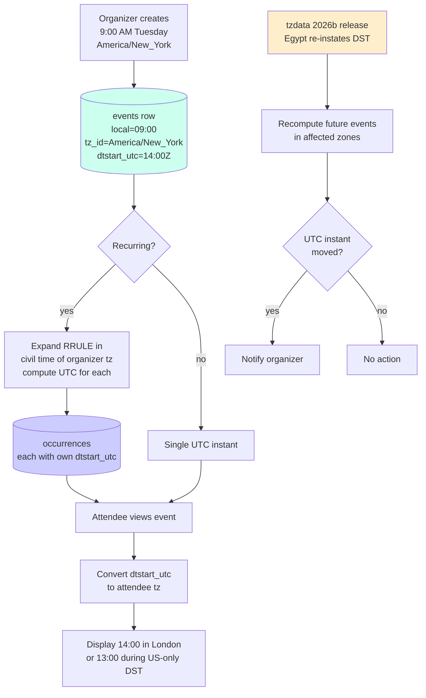

# Calendar Time-Zone Correctness — IANA tzdb, DST, and Per-Attendee Display

**Date:** 2026-05-01 | **Updated:** 2026-05-01
**Tags:** `system-design` `deep-dive` `calendar` `timezone` `dst`

> **Parent case study:** [Design a Calendar System](../design-calendar-system.md). This deep-dive expands §2 "Time-Zone Correctness, DST, and IANA tzdb."

## Table of Contents

- [Summary](#summary)
- [Overview](#overview)
- [Why Calendars Are Uniquely Brutal](#why-calendars-are-uniquely-brutal)
- [The Three Time Models for an Event](#the-three-time-models-for-an-event)
- [Storage Rule — Wall-Clock-Local + IANA TZ + UTC Instant](#storage-rule--wall-clock-local--iana-tz--utc-instant)
- [Floating Events and All-Day Events](#floating-events-and-all-day-events)
- [Spring-Forward — The Time That Doesn't Exist](#spring-forward--the-time-that-doesnt-exist)
- [Fall-Back — The Time That Happens Twice](#fall-back--the-time-that-happens-twice)
- [Cross-DST Recurring Meetings — Wall-Clock Stays, UTC Shifts](#cross-dst-recurring-meetings--wall-clock-stays-utc-shifts)
- [IANA tzdata Updates as Operational State](#iana-tzdata-updates-as-operational-state)
- [Per-Attendee Display — Three Time Zones in Tension](#per-attendee-display--three-time-zones-in-tension)
- [VTIMEZONE — Embedded Definitions in iCalendar](#vtimezone--embedded-definitions-in-icalendar)
- [Leap Seconds — Document the Policy](#leap-seconds--document-the-policy)
- [Worked Example — Weekly 09:00 NYC, London Attendee](#worked-example--weekly-0900-nyc-london-attendee)
- [Anti-Patterns](#anti-patterns)
- [Related](#related)
- [References](#references)

## Summary

Calendars are uniquely brutal among time-aware systems: a single event has one organizer in one time zone, many attendees in many time zones, a recurrence rule whose wall-clock semantics must survive years of DST transitions, and a UTC instant that the IANA tzdata can retroactively change when a country alters its rules. The naive implementations all fail. UTC-only storage loses the organizer's intent the first time DST shifts: a "9:00 AM Tuesday standup" stored as `2026-03-03T14:00:00Z` (UTC) silently becomes 10:00 AM in New York after spring-forward, because the user meant "9 AM local" and the system stored an instant. Per-event UTC offsets (`-05:00`) lose the same intent because offsets are not zones — `-05:00` is correct for New York in winter and wrong in summer. Computing recurrences by adding 86,400 seconds per occurrence drifts an hour twice a year. The fix is a small, disciplined contract: events store **all three** representations — wall-clock-local time, IANA zone name, and the computed UTC instant — and the UTC instant is treated as a derived projection that may be re-computed when tzdata changes. Recurring events expand by *civil-time arithmetic* in the organizer's zone, which means each occurrence's UTC instant is computed independently against the live tzdb. Per-attendee display converts the stored UTC instant to the attendee's zone at view time. Floating events (no zone, "9 AM wherever I am") are rare but valid in iCalendar and need explicit handling. All-day events are dates not instants and never carry a zone. DST gaps either skip or shift forward by explicit policy; DST overlaps default to the first occurrence and never silently double. tzdata is operational state: a tenant in Beirut whose government changes DST at 36 hours' notice depends on you to ingest the release before their meetings start firing at the wrong time. This deep-dive covers the storage shape, the three time models, both DST pathologies, the cross-DST recurring case, the tzdata update workflow, the per-attendee display flow, VTIMEZONE for portability, and an end-to-end worked example of a weekly New York meeting as it appears to a London attendee across the spring DST transition where North America and Europe spend three weeks at a different offset relative to each other.

## Overview

The parent case study (`../design-calendar-system.md`) introduces time-zone correctness in §2 and lists the three event time models, the two DST pathologies, and the operational requirement that every server run the same tzdb version. This document opens the *why* and the *operational consequences*: how recurring events behave across DST, how attendees in foreign zones see organizers' meetings, how iCalendar's VTIMEZONE block makes events portable across systems with different tzdb versions, and how floating and all-day events sit outside the normal model.

The questions answered here:

1. **Why is UTC-only storage wrong for calendars when it's fine for log timestamps?** Because the organizer's intent is a wall-clock time in a zone, not a UTC instant. UTC is the projection, not the source.
2. **Why does the recurring "weekly 9 AM" meeting matter so much?** Because each occurrence's UTC instant moves twice a year as DST kicks in and out. The wall-clock semantics — "9 AM local" — must be preserved, and the UTC instants for each occurrence must be re-computed.
3. **What does an attendee in a foreign zone see?** The stored UTC instant converted to their zone. A 9:00 AM New York meeting is 14:00 in London during US standard time, 13:00 during US daylight time. The mismatch lasts about three weeks each spring and fall when North America and Europe are not synchronized on DST.
4. **What if tzdata changes for a future event?** The UTC instant moves. The organizer may need to be notified. The wall-clock-local representation is the source of truth; the UTC instant is re-derivable.
5. **Why is VTIMEZONE in iCalendar?** Because exporting an event from a system with tzdata `2026b` to a system with tzdata `2025c` would otherwise produce silently different UTC instants. VTIMEZONE embeds the rules for portability.
6. **Floating events?** No zone. "9 AM wherever I am, every Monday." Rare but valid in iCalendar (`DTSTART:20260301T090000` with no `TZID`); the display logic interprets it in the viewing client's local zone.



The general scheduler-side cron treatment lives in `../../async/job-scheduler/time-zone-correctness.md` and the cross-system clock and ordering treatment lives in `../../../data-consistency/time-and-ordering.md`. This doc is calendar-specific: organizers, attendees, recurrence, and per-user display.

## Why Calendars Are Uniquely Brutal

Most time-aware systems have one party. A logging system records "this happened at this UTC instant" and the analyst converts to whatever zone they happen to be reading in. A scheduler fires a cron at a UTC instant and the job runs. A database stores `created_at` and the application converts at render time.

Calendars have *many* parties, all with conflicting time-zone interpretations, all reading the same event:

- **The organizer** lives in one zone and creates the event in that zone's wall-clock terms ("9:00 AM Tuesday").
- **Each attendee** lives in their own zone — possibly the same as the organizer, possibly not. They want to see the event in *their* wall-clock terms.
- **The recurrence rule** must preserve the organizer's wall-clock semantics across DST, which means each occurrence has a different UTC offset and possibly a different UTC delta from the previous occurrence (23, 24, or 25 hours).
- **The tzdata** can retroactively change. If the organizer is in `Africa/Cairo` and Egypt re-instates DST in 2023, every future Cairo event's UTC instant changes. The wall-clock intent is preserved; the projection moves.
- **The export/import** to other calendar systems must transmit *enough information* that the receiving system, possibly running an older tzdb, can reproduce the same UTC instant — hence VTIMEZONE.
- **The reminders and notifications** must fire at the right wall-clock instant for the organizer or attendee depending on the policy. A 30-minute reminder for a 9:00 AM New York meeting must fire at 8:30 AM New York, which is a different UTC instant in summer than in winter.

No other time-aware system juggles all of this. A scheduler has one party (the system) and one interpretation (the cron expression). A calendar has N parties and possibly N different correct interpretations of the same event.

The contract that makes this tractable: **store the organizer's intent (wall-clock + zone) as the source of truth, store the UTC instant as a cached projection, and convert per-attendee at view time**. The next sections walk through each piece of that contract.

## The Three Time Models for an Event

iCalendar (RFC 5545) and every modern calendar API recognize three distinct ways an event can be anchored in time:

**1. Local time + IANA zone (the default for user-created events).** The organizer says "9:00 AM Tuesday in `America/New_York`." The wall-clock is the source of truth; the UTC instant is computed from the live tzdb at write time and re-computed on tzdata updates. This is what 99% of meeting invitations are. iCalendar serializes it as:

```text
DTSTART;TZID=America/New_York:20260303T090000
```

**2. UTC instant (rare, usually system-internal).** "This event happens at exactly `2026-10-30T13:00:00Z` regardless of any zone's politics." Used for system events (database vacuums, automated reports) where the wall-clock display in any zone is acceptable. iCalendar serializes the UTC variant with a `Z` suffix:

```text
DTSTART:20261030T130000Z
```

**3. Floating local time (no zone).** "9:00 AM wherever I am" — interpreted in the viewer's local zone at view time. Rare but valid in iCalendar. Used for personal reminders that should fire at the same wall-clock time regardless of travel:

```text
DTSTART:20260301T090000
```

If the user creates a floating event at 9:00 AM and then flies from New York to Tokyo, the event displays at 9:00 AM Tokyo time on the same calendar date — the *clock-on-the-wall* behavior. Without the zone, there is no UTC instant to compute; the event is fundamentally about a wall-clock pattern, not an instant.

A fourth case (date-only, all-day) sits adjacent to these:

**4. All-day events (date, no time, no zone).** "March 3, 2026" — no time, no zone. iCalendar uses `VALUE=DATE`:

```text
DTSTART;VALUE=DATE:20260303
```

All-day events span the calendar date in the viewer's zone. A New York user sees a New York-aligned all-day; a Tokyo user sees the same calendar date but starting and ending at Tokyo's midnight. There is no "single UTC instant" for all-day; they are intrinsically date objects.

The schema must handle all four:

```sql
CREATE TABLE events (
  id              UUID PRIMARY KEY,
  organizer_id    UUID NOT NULL,

  -- Anchored time (one of three modes)
  time_mode       TEXT NOT NULL CHECK (time_mode IN ('zoned', 'utc', 'floating', 'all_day')),
  dtstart_local   TIMESTAMP,           -- wall-clock; NULL only for 'all_day' (which uses dtstart_date)
  dtstart_date    DATE,                -- only for 'all_day'
  tz_id           TEXT,                -- IANA name; NULL for 'utc' and 'floating' and 'all_day'
  dtstart_utc     TIMESTAMPTZ,         -- computed projection; NULL for 'floating' and 'all_day'

  duration        INTERVAL NOT NULL,
  rrule           TEXT,                -- RFC 5545 RRULE, optional

  -- For 'utc' mode this is the only authoritative time
  -- For 'zoned' mode dtstart_local + tz_id is authoritative; dtstart_utc is a cache

  CONSTRAINT valid_zoned     CHECK (time_mode != 'zoned'    OR (dtstart_local IS NOT NULL AND tz_id IS NOT NULL AND dtstart_utc IS NOT NULL)),
  CONSTRAINT valid_utc       CHECK (time_mode != 'utc'      OR (dtstart_utc IS NOT NULL AND tz_id IS NULL)),
  CONSTRAINT valid_floating  CHECK (time_mode != 'floating' OR (dtstart_local IS NOT NULL AND tz_id IS NULL AND dtstart_utc IS NULL)),
  CONSTRAINT valid_all_day   CHECK (time_mode != 'all_day'  OR (dtstart_date IS NOT NULL AND dtstart_local IS NULL AND tz_id IS NULL))
);
```

The constraint stack rejects mixed-mode rows at insert time; a row that claims `time_mode = 'zoned'` but has no `tz_id` is rejected, preventing a class of bugs where downstream code reads `tz_id` and gets NULL.

## Storage Rule — Wall-Clock-Local + IANA TZ + UTC Instant

The single most-important storage rule for zoned events: **store all three of `dtstart_local`, `tz_id`, and `dtstart_utc`**. Each serves a distinct purpose.

`dtstart_local` (wall-clock, no zone) is the **organizer's intent**. It is what the organizer typed into the form. It survives tzdata updates without modification — "9:00 AM" is "9:00 AM" regardless of how the zone's offset rules change. It is the source of truth. Stored as a `TIMESTAMP WITHOUT TIME ZONE`.

`tz_id` (IANA name) is the **interpretation**. It tells you how to project `dtstart_local` onto the UTC line, given the current tzdb. `America/New_York`, `Europe/London`, `Asia/Tokyo`. Stored as a text column with a CHECK constraint matching the IANA naming pattern.

`dtstart_utc` (UTC instant) is the **derived projection**. It is the cached result of "interpret `dtstart_local` in `tz_id` per the current tzdb, give me the UTC instant." It is what dispatch and free-busy queries index for performance. Stored as `TIMESTAMP WITH TIME ZONE`.

A sample row:

```sql
INSERT INTO events VALUES (
  'evt-001',
  'user-organizer-alice',
  'zoned',
  '2026-03-03 09:00:00',           -- dtstart_local: wall-clock 9 AM
  NULL,                             -- dtstart_date: not all-day
  'America/New_York',               -- tz_id: IANA name
  '2026-03-03 14:00:00+00',         -- dtstart_utc: computed projection (EST = UTC-5 in early March)
  '1 hour',                         -- duration
  'FREQ=WEEKLY;BYDAY=TU'           -- rrule: every Tuesday
);
```

After spring-forward (March 8, 2026), the next occurrence on March 10 has the same `dtstart_local` of 09:00 (the wall-clock intent is preserved) but a different `dtstart_utc`:

```sql
-- March 3 occurrence (EST, UTC-5)
dtstart_local = 2026-03-03 09:00:00
dtstart_utc   = 2026-03-03 14:00:00+00

-- March 10 occurrence (EDT, UTC-4)
dtstart_local = 2026-03-10 09:00:00
dtstart_utc   = 2026-03-10 13:00:00+00   -- one hour earlier in UTC!
```

The wall-clock stayed at 9:00 AM. The UTC instant moved by an hour because DST kicked in. This is correct: the organizer wants 9:00 AM local, every Tuesday, regardless of DST. The system honored that intent.

**Why store both `dtstart_local` and `dtstart_utc` and not just one?**

- *Storing only `dtstart_local` + `tz_id`* would force a tzdb consult on every read. Free-busy queries that scan thousands of events would each parse, compute, and convert. Unworkable at scale. The UTC cache is essential.
- *Storing only `dtstart_utc` + `tz_id`* (the "compute local on the fly from UTC" approach) loses information. The local wall-clock at write time may differ from `dtstart_utc.atZone(tz_id)` after a tzdata update. The user typed "9:00 AM" and the system stored "14:00 UTC"; if Egypt's rules change, "14:00 UTC" projects to 17:00 Cairo instead of 16:00 Cairo, and the user's "9:00 AM" intent becomes "10:00 AM" — wrong.
- *Storing only `dtstart_utc`* (UTC-only) loses the zone entirely. The user's intent "9:00 AM New York" becomes a bare UTC instant; on tzdata updates the meeting moves out from under the user.

The three-column rule is non-negotiable for zoned events. Each column has a purpose. `dtstart_local` is the truth, `tz_id` is the interpretation rule, `dtstart_utc` is the projection cache.

```python
# Sample creation code
from datetime import datetime
from zoneinfo import ZoneInfo

def create_zoned_event(organizer_id: str, local: datetime, tz_id: str, duration_minutes: int, rrule: str | None) -> dict:
    """Build a zoned event row.

    `local` is naive (no tzinfo); the wall-clock the organizer typed.
    `tz_id` is an IANA name; rejected if not in the tzdb.
    """
    if local.tzinfo is not None:
        raise ValueError("dtstart_local must be naive (wall-clock only)")

    zone = ZoneInfo(tz_id)  # raises if tz_id not in tzdb
    aware = local.replace(tzinfo=zone)
    dtstart_utc = aware.astimezone(ZoneInfo("UTC"))

    return {
        "organizer_id": organizer_id,
        "time_mode": "zoned",
        "dtstart_local": local,
        "tz_id": tz_id,
        "dtstart_utc": dtstart_utc,
        "duration": duration_minutes,
        "rrule": rrule,
    }
```

Note that `ZoneInfo(tz_id)` raises `ZoneInfoNotFoundError` if the name isn't valid. Validate at write time; never let an invalid zone name reach the storage layer.

## Floating Events and All-Day Events

Floating and all-day events sidestep the zoned model in opposite directions.

**Floating events** are a wall-clock pattern with no zone. They are interpreted in the viewer's local zone at view time. iCalendar permits this with a bare `DTSTART:20260301T090000` (no `TZID`, no `Z`). The use cases are narrow but real:

- "Take vitamins at 9:00 AM" — should fire at 9:00 AM regardless of what city you're in.
- "Daily journaling, 30 minutes" — same wall-clock, any zone.
- "Birthday at midnight" — every viewer sees their local midnight.

A floating event has no `dtstart_utc`. The dispatch logic for reminders must compute the UTC instant *at fire time* using the user's *current* zone (which the client device knows). If the user is roaming, the reminder fires at the right wall-clock no matter where they are.

Floating events are *not* the same as UTC-fixed events. UTC-fixed has one absolute instant; floating has many possible instants depending on the viewer's zone. Most calendar systems hide floating-event creation behind a "this is a personal habit, not a meeting" UI affordance, because shared-calendar floating events are confusing — a meeting "at 9:00 AM floating" with attendees in different zones means different things to each attendee, which is almost never the desired semantics.

**All-day events** have a date but no time and no zone:

```text
DTSTART;VALUE=DATE:20260303
DTEND;VALUE=DATE:20260304
```

The event spans March 3 in the viewer's local zone. A New York viewer sees it from `2026-03-03T00:00:00-05:00` to `2026-03-04T00:00:00-05:00`. A Tokyo viewer sees the same calendar date but with Tokyo midnight boundaries. There is no global UTC instant for all-day events; each viewer's experience is grounded in their local zone's calendar.

All-day events that span multiple days follow the iCalendar convention that `DTEND` is exclusive — March 3 to March 4 means *only* March 3, not March 3 and 4. This catches every implementer once.

The schema: `time_mode = 'all_day'`, `dtstart_date` is a `DATE`, all other time columns are NULL. Display logic queries by date in the viewer's zone.

## Spring-Forward — The Time That Doesn't Exist

The first DST pathology: the organizer creates an event at 02:30 local on a spring-forward day. That wall-clock time *does not exist in that zone on that day*.

In `America/New_York`, on the second Sunday of March, the wall clock jumps from 01:59:59 EST to 03:00:00 EDT. The window `[02:00, 03:00)` local is a *gap*. There is no 02:00, no 02:30, no 02:59. A user who types "02:30" into the form for that date is asking for an instant that civil time will not produce.

Three reasonable policies, by analogy with the scheduler case:

| Policy | Behavior |
|--------|----------|
| **Reject at creation** | The form returns a validation error: "02:30 on 2026-03-08 does not exist in America/New_York due to DST." User picks a different time. |
| **Snap forward** | The system silently shifts to the first valid local time after the gap (03:30 if the user typed 02:30, or 03:00 if they typed 02:00). |
| **Snap backward** | The system silently shifts to the last valid local time before the gap (01:59:59). Almost never useful. |

RFC 5545 punts on this — the spec says implementations may handle it as they see fit, with the only requirement being internal consistency. Sane implementations either reject (most user-friendly for one-off events) or snap forward (most user-friendly for recurring events where rejection would break the entire series).

Google Calendar snaps forward silently. Outlook rejects with a user-visible error in some clients and snaps in others. Apple Calendar snaps forward. The choice depends on whether you prioritize honoring the user's typed string (reject) or honoring their probable intent (snap).

For *recurring* events, snap-forward is essentially mandatory. A weekly meeting at 02:30 New York that hits the spring-forward day cannot reasonably be "rejected" — the user expects the meeting to happen. The implementation snaps that one occurrence forward, all others stay at 02:30 local.

Implementation in Python with `zoneinfo`:

```python
from datetime import datetime, timedelta
from zoneinfo import ZoneInfo

def resolve_local_to_utc(local: datetime, tz_id: str) -> datetime:
    """Convert a wall-clock to UTC, snapping forward on DST gaps."""
    zone = ZoneInfo(tz_id)
    aware = local.replace(tzinfo=zone)

    # Detect gap by round-trip
    utc = aware.astimezone(ZoneInfo("UTC"))
    round_trip = utc.astimezone(zone).replace(tzinfo=None)
    if round_trip != local:
        # Gap detected; ZoneInfo's astimezone has already snapped forward
        # (the round-trip would have shifted the local time to the post-gap value)
        pass  # `utc` is already correct for snap-forward semantics

    return utc
```

The Python `zoneinfo` library snaps forward by default in `astimezone`. Java's `ZonedDateTime.of(LocalDateTime, ZoneId)` also snaps forward by default. If you want reject semantics, you must explicitly check for the gap and raise.

## Fall-Back — The Time That Happens Twice

The second DST pathology: an event at 01:30 local on a fall-back day. That wall-clock time happens twice.

In `America/New_York`, on the first Sunday of November, the wall clock rolls from 01:59:59 EDT back to 01:00:00 EST. The window `[01:00, 02:00)` local occurs twice: once at offset -04:00 (EDT, the earlier UTC instants) and again 60 minutes later at offset -05:00 (EST, the later UTC instants). 01:30 corresponds to two distinct UTC instants:

- 01:30 EDT = `2026-11-01T05:30:00Z`
- 01:30 EST = `2026-11-01T06:30:00Z`

The system must pick one. The default in Python's `zoneinfo` (PEP 615, via `fold=0`) is the *earlier* UTC instant. Java's `ZonedDateTime` defaults to the same earlier-offset behavior, with `withLaterOffsetAtOverlap()` to opt into the later one. iCalendar disambiguates by including the offset in the timestamp:

```text
DTSTART;TZID=America/New_York:20261101T013000
```

The `TZID` form is ambiguous on overlap days. Some implementations also serialize an offset hint. The safest portable form uses VTIMEZONE (covered below).

For *recurring* events that hit the fall-back day, the typical pattern is the same as overlap policy in the scheduler doc: fire once at the *first* occurrence (the earlier UTC instant), preserving the "daily" or "weekly" semantic. A user who created a "weekly Sunday at 01:30 NY" recurrence does not expect two notifications on fall-back day; they expect one.

The exceptional case is monitoring jobs or system events that explicitly want both legs of fall-back. These set a "RUN_BOTH" override on the event (or, in iCalendar terms, the RRULE-expanded series naturally produces both occurrences if the underlying expansion library is configured to do so). This is rare and should be opt-in.

Storage of an overlap occurrence:

```sql
-- For a 01:30 NY meeting on 2026-11-01 with first-occurrence semantics
dtstart_local = 2026-11-01 01:30:00
tz_id         = 'America/New_York'
dtstart_utc   = 2026-11-01 05:30:00+00   -- the earlier UTC instant (EDT)
```

The `dtstart_utc` cache encodes the disambiguation. Re-derivation on a tzdata update must apply the same first-occurrence rule, or the event silently moves by an hour.

## Cross-DST Recurring Meetings — Wall-Clock Stays, UTC Shifts

The most-impactful case in real calendars: a recurring meeting that crosses one or more DST transitions. The contract is unambiguous: **the wall-clock semantics in the organizer's zone are preserved; the UTC instant moves**.

Concrete example. A weekly Tuesday 09:00 meeting in `America/New_York` starting 2026-02-24:

```text
DTSTART;TZID=America/New_York:20260224T090000
RRULE:FREQ=WEEKLY;BYDAY=TU
```

The RRULE expansion in the organizer's zone produces civil-time occurrences:

| Occurrence | Local (NY) | Offset | UTC |
|------------|-----------|--------|-----|
| 2026-02-24 (Tue) | 09:00 | EST -05:00 | 14:00Z |
| 2026-03-03 (Tue) | 09:00 | EST -05:00 | 14:00Z |
| 2026-03-10 (Tue) | 09:00 | EDT -04:00 | **13:00Z** ← DST in |
| 2026-03-17 (Tue) | 09:00 | EDT -04:00 | 13:00Z |
| ... | ... | ... | ... |
| 2026-10-27 (Tue) | 09:00 | EDT -04:00 | 13:00Z |
| 2026-11-03 (Tue) | 09:00 | EST -05:00 | **14:00Z** ← DST out |

The wall-clock is constant: 09:00 every Tuesday in New York. The UTC instant shifts by one hour at each DST transition. Each occurrence has its own `dtstart_utc` row in the materialized table.

The expansion code (Python, `dateutil.rrule` plus `zoneinfo`):

```python
from datetime import datetime, timedelta
from zoneinfo import ZoneInfo
from dateutil.rrule import rrulestr

def expand_recurrence(dtstart_local: datetime, tz_id: str, rrule_text: str, count: int) -> list[dict]:
    """Expand RRULE in the organizer's civil time, computing UTC for each occurrence."""
    zone = ZoneInfo(tz_id)
    naive_dtstart = dtstart_local  # naive, in zone's wall clock

    # rrulestr expects a naive datetime when expanding in civil time
    rule = rrulestr(rrule_text, dtstart=naive_dtstart)
    occurrences = []
    for local_naive in rule[:count]:
        # local_naive is naive; localize via zoneinfo
        aware = local_naive.replace(tzinfo=zone)
        utc = aware.astimezone(ZoneInfo("UTC"))
        occurrences.append({
            "dtstart_local": local_naive,
            "tz_id": tz_id,
            "dtstart_utc": utc,
        })
    return occurrences
```

The deeper RRULE-expansion concerns — materialize-vs-compute trade-offs, EXDATE handling, infinite recurrences — are covered in [`./rrule-expansion.md`](./rrule-expansion.md). The relevant point here is that *each occurrence's UTC must be computed in the organizer's civil time*, not by adding 86,400 × 7 seconds to the previous UTC.

**The 86,400-seconds bug.** A naive expansion computes:

```text
occurrence[i].dtstart_utc = occurrence[0].dtstart_utc + (i × 7 × 86400) seconds
```

This is wrong. After the spring-forward Tuesday, every subsequent occurrence is one hour late in the local zone (10:00 NY instead of 9:00 NY). After fall-back, one hour early. The bug is silent until the user notices their Tuesday meeting drifted, often weeks later. Always expand in civil time; always re-compute UTC per occurrence.

## IANA tzdata Updates as Operational State

The IANA tzdata is updated 4-10 times per year. Every release adjusts historical or future rules for one or more zones. Recent examples relevant to calendar systems:

- **Lebanon, March 2023.** The government delayed DST with 36 hours' notice. Calendar systems that didn't roll the new tzdata in time fired meetings at the wrong wall-clock for two weeks.
- **Egypt, April 2023.** Re-instated DST after eight years without it. Future events in `Africa/Cairo` shifted by one hour for the DST-on portion of the year.
- **Mexico, October 2022.** Abolished DST in most of the country. Future events in `America/Mexico_City` and several other Mexican zones shifted.
- **Greenland, March 2023.** Permanent DST shift in `America/Nuuk`.
- **Samoa, December 2011.** Crossed the international date line; December 30 simply did not exist that year. Any event scheduled for that date was deleted from the timeline.

When tzdata changes, the *interpretation* of `(dtstart_local, tz_id)` may change for future events. The wall-clock-local stays the same (the organizer's intent is preserved); the `dtstart_utc` projection may move.

The operational workflow:

1. **Pin the tzdata version in production.** Every server (application servers, database, cache, expansion workers) must use the same version. A staggered rollout where one pod has 2025c and another has 2026a will produce different UTC instants for the same logical event, which is a correctness incident.
2. **Subscribe to `tz-announce@iana.org`** for new releases. Releases are labeled `2026a`, `2026b`, etc.
3. **Roll new tzdata atomically.** Treat tzdata the way you treat the application binary: versioned, deployed in lockstep across all services, audited.
4. **Recompute `dtstart_utc` for affected future events.** Scan events whose `tz_id` is in the set of zones touched by the release; recompute the projection; if it changed, write the new value and queue a notification.
5. **Notify the organizer when the UTC instant moves.** A user who scheduled "2:00 PM Beirut" expects 2:00 PM Beirut, not whatever 2:00 PM Beirut used to mean in last month's tzdb. The recompute preserves the wall-clock; the UTC instant is just a cache. But attendees in *other* zones see the meeting shift in their local view, and they should know.

A re-resolution job sketch:

```python
def reresolve_after_tzdata_update(affected_zones: set[str], new_tzdata_version: str) -> None:
    """Recompute dtstart_utc for future events in affected zones; notify organizers on change."""
    cutoff = datetime.now(ZoneInfo("UTC"))

    for event in iter_future_events_in_zones(affected_zones, after=cutoff):
        old_utc = event.dtstart_utc
        zone = ZoneInfo(event.tz_id)  # uses the new tzdata
        aware = event.dtstart_local.replace(tzinfo=zone)
        new_utc = aware.astimezone(ZoneInfo("UTC"))

        if new_utc != old_utc:
            update_event_dtstart_utc(event.id, new_utc, tzdata_version=new_tzdata_version)
            queue_tzdata_change_notification(
                event_id=event.id,
                organizer_id=event.organizer_id,
                old_utc=old_utc,
                new_utc=new_utc,
                reason=f"tzdata update {new_tzdata_version} affected {event.tz_id}",
            )

        # Also re-expand recurrences if the rule's civil-time pattern hits the change date
        if event.rrule is not None:
            reexpand_recurrence_after(event.id, after=cutoff)
```

The recompute is conceptually simple but operationally fraught. Considerations:

- **Idempotency.** The job must be safe to re-run. Each recompute compares old vs new and writes only on change.
- **Recurrence expansion.** If a recurring event materializes its occurrences ahead of time (the materialize approach in `./rrule-expansion.md`), the affected occurrences must be re-expanded. The compute-on-demand approach is simpler here — the next read picks up the new tzdb.
- **Notification batching.** A tzdata release that changes Egypt's rules might affect 50,000 events in your system. Don't email each organizer individually; batch by organizer or by tenant, and rate-limit.
- **Audit trail.** Record `tzdata_version` on each event row (or at least on each recompute). When an auditor asks "why did this event move by an hour on April 15?", the answer is in the audit log.

The runbook entry: subscribe to tz-announce, monitor for releases affecting active customer zones, schedule the rollout within one week of release, recompute futures in the affected zones, notify organizers and tenants.

## Per-Attendee Display — Three Time Zones in Tension

When an attendee opens their calendar, the system must answer: "what time does this event display for *this user*?"

Three time zones are in play:

- **Event's `tz_id`** — the organizer's zone, baked into the event.
- **User's preferred display zone** — set in user profile ("show all times in `Europe/London`").
- **User's device-local zone** — the IANA name the device's OS reports.

Real systems typically prefer the user-profile setting and fall back to device-local. The conversion at view time:

```python
def display_event_for_attendee(event: Event, attendee: User) -> dict:
    """Convert event's stored UTC to attendee's display zone."""
    if event.time_mode == "utc":
        # System event, fixed instant
        utc = event.dtstart_utc
    elif event.time_mode == "zoned":
        # Use the cached UTC projection
        utc = event.dtstart_utc
    elif event.time_mode == "floating":
        # No UTC; interpret in attendee's zone at view time
        attendee_zone = ZoneInfo(attendee.display_tz_id)
        aware = event.dtstart_local.replace(tzinfo=attendee_zone)
        return {
            "display_local": event.dtstart_local,
            "display_tz": attendee.display_tz_id,
            "display_utc": aware.astimezone(ZoneInfo("UTC")),  # only meaningful in this user's view
        }
    elif event.time_mode == "all_day":
        # Date in attendee's zone
        return {
            "display_date": event.dtstart_date,
            "display_tz": attendee.display_tz_id,
        }

    # zoned/utc: convert UTC to attendee's display zone
    attendee_zone = ZoneInfo(attendee.display_tz_id)
    display_aware = utc.astimezone(attendee_zone)
    return {
        "display_local": display_aware.replace(tzinfo=None),
        "display_tz": attendee.display_tz_id,
        "display_offset": display_aware.utcoffset(),
        "event_origin_tz": event.tz_id,  # for the "9:00 AM in New York" tooltip
    }
```

The UI typically shows both: "10:00 AM London (originally 5:00 AM New York)." The "originally" half preserves the organizer's intent for the attendee — useful for cross-region meetings where the inviter's intent matters ("the team in NY wants this at 9 AM their time").

The deeper free-busy and conflict-detection concerns (when *every* attendee's busy time must be queried in their respective zones) are covered in [`./free-busy-queries.md`](./free-busy-queries.md). The display logic here only shows times; the busy-merge logic in that doc is what allows the scheduling assistant to find common slots across zones.

## VTIMEZONE — Embedded Definitions in iCalendar

iCalendar's `VTIMEZONE` block is a compact definition of a zone's DST rules embedded directly in the `.ics` file. Why bother? Because the receiving system might be running an older or different tzdb than the sender, and a bare `TZID=America/New_York` reference would be silently misinterpreted.

A VTIMEZONE block:

```text
BEGIN:VTIMEZONE
TZID:America/New_York
BEGIN:STANDARD
DTSTART:20071104T020000
RRULE:FREQ=YEARLY;BYMONTH=11;BYDAY=1SU
TZNAME:EST
TZOFFSETFROM:-0400
TZOFFSETTO:-0500
END:STANDARD
BEGIN:DAYLIGHT
DTSTART:20070311T020000
RRULE:FREQ=YEARLY;BYMONTH=3;BYDAY=2SU
TZNAME:EDT
TZOFFSETFROM:-0500
TZOFFSETTO:-0400
END:DAYLIGHT
END:VTIMEZONE
```

The block describes the rules: STANDARD time begins on the first Sunday of November at 02:00, with offset -05:00; DAYLIGHT time begins on the second Sunday of March at 02:00, with offset -04:00. A receiving system that doesn't know `America/New_York` (or knows an older variant) can still compute the correct offsets from the embedded rules.

This matters operationally:

- **Cross-system invitations.** A sender on `tzdata 2026b` invites a recipient on `tzdata 2025c`. Without VTIMEZONE, the recipient's tzdb might disagree on a future event's offset. With VTIMEZONE, the recipient uses the embedded rules.
- **Long-lived archives.** An iCalendar export from 2026 imported into a system in 2030 should still display correctly even if the tzdb has evolved since.
- **Custom or local zones.** Some organizations run private zones (`Etc/InternalSomething`) not in the public tzdb. VTIMEZONE is the only way to ship those events between systems.

The trade-off is verbosity. A single event with VTIMEZONE blocks for both organizer and attendee zones balloons from a few hundred bytes to a few kilobytes. Most production systems include VTIMEZONE for events with future occurrences and skip it for already-past single-shot events.

The deeper iCalendar interop concerns — handling different VTIMEZONE conventions across implementations, tolerating malformed ICS, CalDAV REPORT vs PUT — are in [`./ics-and-caldav-interop.md`](./ics-and-caldav-interop.md).

## Leap Seconds — Document the Policy

Leap seconds are inserted (or theoretically removed) into UTC by the IERS to keep UTC aligned with mean solar time. The most-recent insertion was at the end of December 2016. As of 2022, the global community has agreed to abolish leap seconds by 2035, replacing them with a different mechanism.

Calendar systems almost universally **ignore** leap seconds. The reasons:

- **They happen at minute boundaries (23:59:60 UTC).** No user creates an event at "23:59:60 New York time."
- **They affect at most one second per insertion.** The user-visible drift is below the resolution of any meaningful calendar UI.
- **NTP smearing makes them invisible.** Google, AWS, Facebook all run smeared NTP that distributes the leap second over hours; the application clock never sees the 60-second minute.

The policy: **document that leap seconds are not addressed at the calendar layer; rely on the underlying NTP/system clock to smear them**. Auditors who see "leap seconds: smeared at the system clock; no application handling" in a runbook are reassured. Auditors who see no mention are not.

A reminder system that fires "30 minutes before" an event computes the trigger instant by simple subtraction in UTC. A leap second within the 30-minute window introduces at most a 1-second error in the trigger time. The user does not notice.

## Worked Example — Weekly 09:00 NYC, London Attendee

A complete trace of how a weekly New York meeting appears to a London attendee across the spring DST transition.

**Setup.**

- **Organizer:** Alice, in `America/New_York`.
- **Attendee:** Bob, in `Europe/London`.
- **Event:** Weekly product sync, every Tuesday at 09:00 New York time, starting 2026-02-24, lasting 1 hour.
- **iCalendar:**

```text
DTSTART;TZID=America/New_York:20260224T090000
DURATION:PT1H
RRULE:FREQ=WEEKLY;BYDAY=TU
SUMMARY:Product sync
ORGANIZER;CN=Alice:mailto:alice@example.com
ATTENDEE;CN=Bob:mailto:bob@example.com
```

**Stored representation (one row per occurrence in the materialized table):**

```sql
-- Occurrence on Feb 24 (US winter, UK winter)
dtstart_local = 2026-02-24 09:00:00, tz_id = 'America/New_York', dtstart_utc = 2026-02-24 14:00:00+00

-- Occurrence on Mar 3 (US winter, UK winter)
dtstart_local = 2026-03-03 09:00:00, tz_id = 'America/New_York', dtstart_utc = 2026-03-03 14:00:00+00

-- Occurrence on Mar 10 (US summer, UK winter — only US has shifted to DST)
dtstart_local = 2026-03-10 09:00:00, tz_id = 'America/New_York', dtstart_utc = 2026-03-10 13:00:00+00

-- Occurrence on Mar 17 (US summer, UK winter — still mismatched, second of 3 weeks)
dtstart_local = 2026-03-17 09:00:00, tz_id = 'America/New_York', dtstart_utc = 2026-03-17 13:00:00+00

-- Occurrence on Mar 24 (US summer, UK winter — third of 3 weeks)
dtstart_local = 2026-03-24 09:00:00, tz_id = 'America/New_York', dtstart_utc = 2026-03-24 13:00:00+00

-- Occurrence on Mar 31 (US summer, UK summer — UK now also on DST, alignment restored)
dtstart_local = 2026-03-31 09:00:00, tz_id = 'America/New_York', dtstart_utc = 2026-03-31 13:00:00+00
```

**Bob's London display, week by week:**

| Week | NY local (Alice) | UTC (stored) | London local (Bob) | Notes |
|------|-----------------|--------------|--------------------|--------|
| Feb 24 | 09:00 EST | 14:00Z | 14:00 GMT | Both on standard time. |
| Mar 3 | 09:00 EST | 14:00Z | 14:00 GMT | Last week before US DST. |
| **Mar 10** | 09:00 EDT | **13:00Z** | **13:00 GMT** | **US shifted forward; UK still on GMT. Meeting moves an hour earlier in London.** |
| Mar 17 | 09:00 EDT | 13:00Z | 13:00 GMT | Still mismatched. |
| Mar 24 | 09:00 EDT | 13:00Z | 13:00 GMT | Last week of mismatch. |
| Mar 31 | 09:00 EDT | 13:00Z | **14:00 BST** | UK shifted forward; meeting back to 14:00 in London display. |

The "9 AM New York" stays at 9 AM New York throughout. The "2 PM London" wobbles for three weeks because US DST starts the second Sunday of March (March 8 in 2026) while UK DST starts the last Sunday of March (March 29 in 2026). For three weeks (March 10, 17, 24) the meeting is at 13:00 in Bob's London view; it returns to 14:00 on March 31.

This three-week drift is inevitable any year and surprises every user who is new to cross-Atlantic recurring meetings. The system must handle it correctly *and* communicate it: a UI hint like "this meeting is at 1 PM London this week (DST mismatch with New York)" prevents support tickets.

**Bob's reminder fires.** Bob has set "30 minutes before" as his reminder. The reminder fires at:

- Feb 24: `13:30 GMT` (= `13:30Z`)
- Mar 10: `12:30 GMT` (= `12:30Z`) — 30 minutes before the 13:00 GMT event
- Mar 31: `13:30 BST` (= `12:30Z`) — 30 minutes before the 14:00 BST event

Note the UTC instant of the reminder also moves with DST. The reminder system computes "30 minutes before `dtstart_utc`" as a UTC subtraction, which is consistent regardless of zones. The display of the reminder time uses Bob's display zone.

**What happens if Alice's `America/New_York` rules change?**

Suppose IANA releases `tzdata 2026q` retroactively changing the US DST start date to March 15 (a hypothetical). The recompute job:

1. Scans future events in `America/New_York` (Alice's events).
2. For each occurrence, re-projects `dtstart_local` (still 09:00) under the new tzdb.
3. Finds that the March 10 occurrence is now in EST not EDT under the new rules; its `dtstart_utc` shifts from `2026-03-10T13:00:00Z` to `2026-03-10T14:00:00Z`.
4. Updates the row.
5. Notifies Alice: "your March 10 product sync moved to 14:00Z due to a US DST rule change."
6. Bob's display now shows the March 10 event at 14:00 GMT, restoring the alignment for that week.

The wall-clock intent (09:00 New York) is preserved. The UTC projection moved. Bob sees the event at a different London time. The system did the right thing.

## Anti-Patterns

1. **UTC-only storage of zoned events.** "We just store the UTC instant; the user can convert in the UI." This loses the organizer's intent on the first DST transition. A weekly 9:00 AM meeting becomes 8:00 AM on March 10 silently. Always store the wall-clock + tz_id; UTC is a cache.

2. **Per-event UTC offset (`-05:00`) instead of IANA name (`America/New_York`).** The offset is correct for one half of the year and wrong for the other. The schedule slowly drifts in the user's wall-clock perception. Always store the IANA name; let the tz library compute the offset at write time.

3. **Storing deprecated abbreviations (`EST`, `PST`, `CST`, `BST`).** `EST` means US Eastern Standard Time to a US developer and Australian Eastern Standard Time to an Australian developer. `CST` is ambiguous between US Central, China Standard, and Cuba Standard. Abbreviations are display strings, not identifiers.

4. **Computing recurring occurrences by adding 86,400 seconds.** Wall-clock days are 23, 24, or 25 hours during DST transitions. Adding 86,400 produces the wrong UTC for every occurrence after spring-forward (one hour late) and after fall-back (one hour early). Always expand in civil time using a tz-aware library.

5. **Computing recurring occurrences by adding 7 × 86,400 seconds.** Same bug, weekly version. Each Tuesday's UTC must be re-projected from "09:00 in `America/New_York` on this Tuesday" — the offset can change between Tuesdays.

6. **Ignoring tzdata bumps.** "Our tzdata is from 2024; we ship updates with the OS." Customers in zones whose rules changed in 2025 or 2026 see meetings fire at wrong wall-clock times. tzdata is operational state; pin and update on a documented cadence (within one week of any release affecting an active customer zone).

7. **Staggered tzdata rollout.** One service has 2026a, another has 2026b. The same logical event projects to two different UTC instants depending on which service computed it. Free-busy disagrees with reminders. Always roll tzdata atomically across all services.

8. **Mixing wall-clock arithmetic with UTC arithmetic.** "I'll add 1 hour to the local time and convert to UTC." On DST transition days this produces wrong results. Always convert to UTC first, do arithmetic in UTC, convert back to local for display.

9. **Storing `dtstart_local` as `TIMESTAMP WITH TIME ZONE` in Postgres.** This silently re-interprets the wall-clock as a UTC instant on insert based on the session's `timezone` setting. Use `TIMESTAMP WITHOUT TIME ZONE` for wall-clock fields; use `TIMESTAMP WITH TIME ZONE` only for UTC instants.

10. **Rejecting all DST-gap events at creation.** "02:30 doesn't exist on March 8 in New York; please pick another time." For one-off events this is reasonable. For recurring events it breaks the entire series — the user's "every day at 02:30" cannot be created if any future spring-forward day rejects. Accept and snap forward for recurrences.

11. **Defaulting to the *later* offset on fall-back overlap.** Most users intend the "first occurrence" semantic — fire once per nominal occurrence. Defaulting to the later offset means a 01:30 daily reminder fires at the second 01:30 (EST) rather than the first (EDT), which is one hour later than the user expects in their wall-clock perception of "the morning of November 1."

12. **No notification when tzdata moves an event's UTC instant.** The wall-clock is preserved (the user's intent is honored), but attendees in *other* zones see the meeting move. Without a notification, the change is invisible until someone notices the meeting is at a different London time than before.

13. **All-day events stored as `00:00 UTC`.** All-day events have no zone and no time; they are dates. Storing them as 00:00 UTC means a viewer in Tokyo sees the all-day "March 3" event starting at 09:00 March 3 Tokyo (= 00:00Z) and ending at 09:00 March 4 Tokyo (= 00:00Z next day) — a 24-hour event that doesn't align with March 3 in Tokyo. Use a `DATE` column, not a UTC timestamp.

14. **Floating events confused with UTC-fixed events.** A floating event has no zone; a UTC-fixed event has a fixed instant. Both lack a `tz_id`, but they behave oppositely: floating fires at "9 AM wherever I am," UTC-fixed fires at the same instant for everyone. The schema should distinguish them via `time_mode`.

15. **VTIMEZONE omitted from iCalendar exports for future events.** A recipient on older tzdata may compute a different UTC instant for the same `TZID`. Embed VTIMEZONE for events with future occurrences; rely on tzdb-name-only for past events.

16. **Computing per-attendee display by re-running tz arithmetic on `dtstart_local` instead of converting `dtstart_utc`.** This forces a re-resolution of the organizer's zone for every viewer; it also skews if the attendee's tzdb differs from the server's. Always convert from `dtstart_utc` to the attendee's zone; use `dtstart_local` only for the "originally at 9 AM in New York" display hint.

17. **Hand-rolled DST detection logic in application code.** "I'll check if the offset changed by comparing the start and end of the day." Don't. Use the tz library's `getTransition` (Java) or `fold` (Python) APIs. Hand-rolled is wrong on edge cases (Lord Howe Island's 30-minute DST shift, sub-day offset changes in historical data).

## Related

- [`./rrule-expansion.md`](./rrule-expansion.md) — sibling deep-dive on materializing recurring occurrences. Tightly coupled with this doc: each materialized occurrence has its own `dtstart_utc` computed in the organizer's civil time, and tzdata updates may trigger re-expansion of affected windows.
- [`./free-busy-queries.md`](./free-busy-queries.md) — sibling deep-dive on the per-user busy-time merge for scheduling assistants. The per-attendee display logic here feeds into the busy-bitmap construction in that doc; both must use the same zone interpretation to avoid off-by-one-hour conflicts.
- [`./ics-and-caldav-interop.md`](./ics-and-caldav-interop.md) — sibling deep-dive on iCalendar import/export and CalDAV. VTIMEZONE serialization, cross-system tzdb mismatches, and round-trip preservation are all covered there.
- [`../design-calendar-system.md`](../design-calendar-system.md) — parent case study; this doc expands §2.
- [`../../async/job-scheduler/time-zone-correctness.md`](../../async/job-scheduler/time-zone-correctness.md) — companion doc for the scheduler case. Same DST machinery, different problem shape: scheduler has one party (the system), calendar has many (organizer + attendees). Read both for the full picture of civil-time correctness.
- [`../../../data-consistency/time-and-ordering.md`](../../../data-consistency/time-and-ordering.md) — foundation on POSIX time, civil time, ordering, and clocks across distributed systems. Required reading for the distinctions used here.

## References

- IANA — [*Time Zone Database*](https://www.iana.org/time-zones). The authoritative source for tz rules. Subscribe to `tz-announce@iana.org` for release notifications.
- IETF — [*RFC 5545 §3.6.5 — VTIMEZONE Component*](https://datatracker.ietf.org/doc/html/rfc5545#section-3.6.5). The iCalendar specification of embedded time zone definitions; required reading for any system that imports or exports `.ics`.
- Python — [*`zoneinfo` — IANA time zone support*](https://docs.python.org/3/library/zoneinfo.html). The standard library API (Python 3.9+, PEP 615) for tz-aware datetimes. The `fold` attribute is the disambiguation knob for fall-back overlap.
- Oracle — [*`java.time` API*](https://docs.oracle.com/en/java/javase/17/docs/api/java.base/java/time/package-summary.html). The JSR-310 datetime/zone library. `ZonedDateTime`, `ZoneId`, `ZoneOffsetTransition` are the relevant types for calendar implementations; `withEarlierOffsetAtOverlap` and `withLaterOffsetAtOverlap` disambiguate fall-back.
- Google — [*Calendar API: Calendars resource — `timeZone`*](https://developers.google.com/calendar/api/v3/reference/calendars). Reference for how a major production calendar handles the calendar-level default tz, the per-event `start.timeZone`, and the interaction between the two.
- Microsoft — [*Microsoft Graph: dateTimeTimeZone resource type*](https://learn.microsoft.com/en-us/graph/api/resources/datetimetimezone). Microsoft's representation of "wall-clock + IANA zone" in the Graph API; useful as a contrasting reference design.
- Noah Sussman — [*Falsehoods Programmers Believe About Time*](https://infiniteundo.com/post/25326999628/falsehoods-programmers-believe-about-time). Canonical list of subtle time-related assumptions that don't hold.
- Jon Skeet — [*Falsehoods Programmers Believe About Time Zones*](https://www.creativedeletion.com/2015/01/28/falsehoods-programmers-date-time-zones.html). Companion list focused specifically on time-zone misconceptions; required reading before writing any tz-related code.
