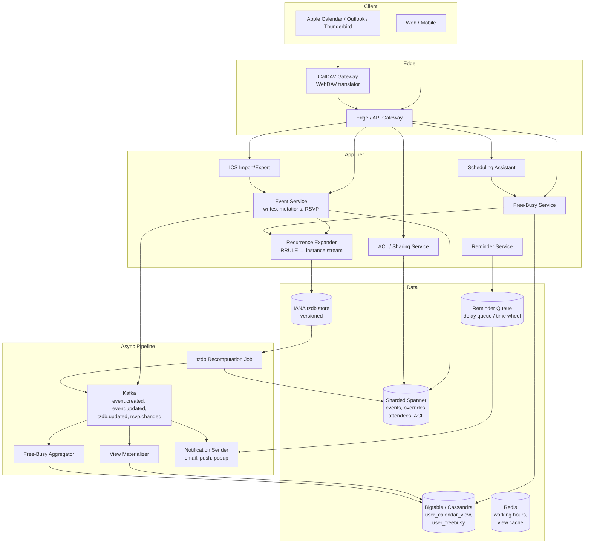
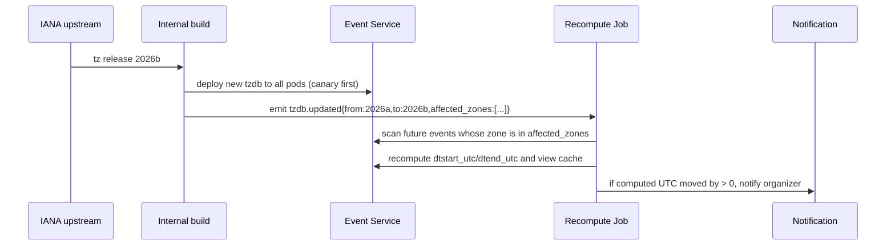
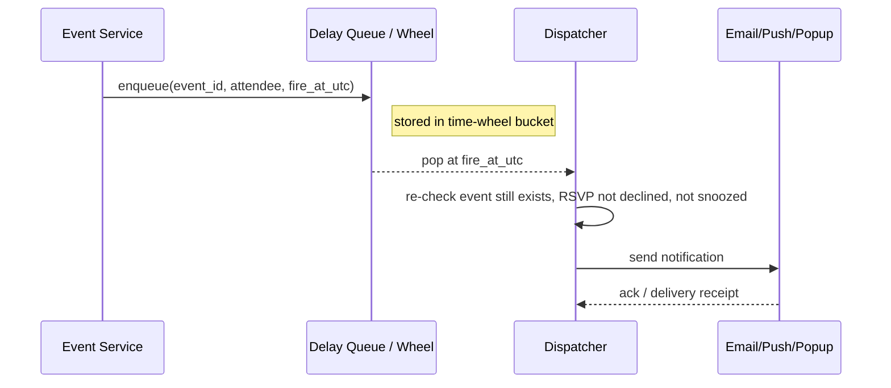

# Design a Calendar System / Google Calendar — Recurrence, Time Zones, Free-Busy, and Scheduling at Scale

**Date:** 2026-04-25 | **Updated:** 2026-04-25
**Tags:** `system-design` `case-study` `specialized` `calendar` `hard`

## Table of Contents

- [Summary](#summary)
- [Functional Requirements](#functional-requirements)
- [Non-Functional Requirements](#non-functional-requirements)
- [Capacity Estimation](#capacity-estimation)
- [API Design](#api-design)
- [Data Model](#data-model)
- [HLD Diagram](#hld-diagram)
- [Deep Dives](#deep-dives)
  - [1. RRULE Expansion — Materialize vs Compute on Demand](#1-rrule-expansion--materialize-vs-compute-on-demand)
  - [2. Time-Zone Correctness, DST, and IANA tzdb](#2-time-zone-correctness-dst-and-iana-tzdb)
  - [3. Free-Busy Queries at Scale](#3-free-busy-queries-at-scale)
  - [4. Scheduling Assistant — Finding Common Slots](#4-scheduling-assistant--finding-common-slots)
  - [5. Conflict Detection and Overlap Checks](#5-conflict-detection-and-overlap-checks)
  - [6. Reminders and Notifications](#6-reminders-and-notifications)
  - [7. Sharing, Permissions, and Delegation](#7-sharing-permissions-and-delegation)
  - [8. ICS Import/Export and CalDAV Interop](#8-ics-importexport-and-caldav-interop)
- [Bottlenecks and Trade-offs](#bottlenecks-and-trade-offs)
- [Anti-Patterns](#anti-patterns)
- [Related](#related)
- [References](#references)

## Summary

A calendar system looks innocent — "events have a start, an end, and a title" — and is in fact one of the most subtly punishing systems to build correctly. The hard problems are not "store an event"; they are: **recurrence rules that yield infinite virtual instances** (RFC 5545 RRULE with `BYDAY`, `BYMONTHDAY`, `COUNT`, `UNTIL`, `EXDATE`, plus per-instance overrides), **time-zone correctness** across IANA tzdb updates and DST transitions where local time is ambiguous or skipped twice a year, **free-busy queries** that have to combine dozens of calendars across recurring rules in tens of milliseconds, **scheduling assistants** that find a 30-minute slot common to twelve attendees in three time zones, and **conflict detection** that must respect each attendee's working hours and booked time. On top of that sit interop concerns — ICS import/export and CalDAV — which force the data model to mirror RFC 5545 closely enough that round-tripping does not lose fidelity. This document walks through the HLD, the storage and indexing decisions, and the deep dives for each of the genuinely hard subsystems.

## Functional Requirements

**Event lifecycle**

- Create, update, delete single events with start, end, title, description, location, attendees.
- All-day events (date-only, no time) and timed events (date-time + zone).
- Update modes for recurring events: `THIS`, `THIS_AND_FOLLOWING`, `ALL`.
- Soft delete with restore window; hard delete after retention.

**Recurrence (RFC 5545)**

- Recurrence rules: `FREQ=DAILY|WEEKLY|MONTHLY|YEARLY` with `INTERVAL`, `BYDAY` (e.g., `MO,WE,FR`, `1MO` = first Monday), `BYMONTHDAY`, `BYMONTH`, `BYSETPOS`, `COUNT`, `UNTIL`.
- `EXDATE` (excluded dates) and `RDATE` (additional dates).
- Per-instance overrides ("modified instance" / `RECURRENCE-ID`): change one occurrence's time or title without forking the series.
- Series cancellation that preserves history of past instances.

**Attendees and RSVP**

- Invite attendees with roles (required, optional, resource).
- Per-attendee RSVP state: `NEEDS-ACTION`, `ACCEPTED`, `DECLINED`, `TENTATIVE`.
- Forwarding/delegation to another attendee.
- Per-instance RSVP for recurring events (decline one, accept rest).

**Free-busy and scheduling**

- Query free-busy for a user or set of users over a range, returning busy intervals only (no event details).
- Scheduling assistant: given attendees, duration, working hours, and a time window, return ranked candidate slots.
- Working hours per user, per weekday, per zone.
- Resource calendars (rooms, equipment) with capacity and booking rules.

**Reminders and notifications**

- Per-event, per-attendee reminders (email, push, popup) at offsets (minutes/hours/days before).
- Default reminders per calendar.
- Snooze and dismiss.

**Sharing and permissions**

- Per-calendar ACLs: `none`, `freeBusyOnly`, `reader`, `writer`, `owner`.
- Public sharing with secret link.
- Delegate access (admin scheduling on someone's behalf).

**Interop**

- ICS (RFC 5545) import and export.
- CalDAV (RFC 4791) read/write for desktop and mobile clients.
- iMIP-style email invites and replies.
- Subscription to read-only external ICS URLs.

**Out of scope for this HLD**

- Video conferencing integration internals (Meet/Zoom join links are just a metadata field), routing/optimization for resource booking heuristics beyond room capacity, cross-organization rich availability negotiation.

## Non-Functional Requirements

| NFR | Target | Why |
|-----|--------|-----|
| Time-zone correctness | 100%, audited continuously | A meeting that fires at the wrong hour is worse than one that fails outright. This is the single most user-visible correctness property. |
| Read:write ratio | ~50:1 | Calendars are rendered constantly; events are written occasionally. |
| Calendar render P50 / P99 | < 200 ms / < 600 ms | Week and month views must feel instant. |
| Free-busy P99 (per user, week range) | < 100 ms | Scheduling assistant fans this out across many users; each call must be cheap. |
| Reminder firing accuracy | within ±10 s of target | Late or duplicate reminders are visible incidents. |
| Durability | 11 nines | Lost meetings cause real-world miscoordination. |
| Availability | 99.95% | Reads should degrade to cached free-busy if event service is degraded. |
| RFC 5545 / 4791 compliance | High enough to round-trip ICS from major clients without data loss | Interop with Outlook, Apple Calendar, Thunderbird, mobile CalDAV clients. |
| tzdb freshness | New IANA release deployed within 7 days of upstream cut | DST law changes (Lebanon 2023, Mexico 2022, etc.) require fast rollout. |
| Eventual consistency budget | Seconds for free-busy aggregation, attendee response counts | Acceptable as long as canonical event state is strongly consistent. |
| Strong consistency surfaces | Owner-of-record event mutation, RSVP state, ACL changes | Cannot lose the last write on a meeting time change. |

## Capacity Estimation

These are illustrative numbers for sizing a Google Calendar–scale system, not Google's actual figures.

**Users and traffic**

- 1 B users, 500 M monthly active, 200 M daily active.
- Average user: ~5 calendars subscribed, ~30 events/month created, ~50 invites received/month.
- ~10 M event mutations/day → ~115 ops/sec average, ~5 K/sec peak (Monday morning meeting churn).
- ~2 B calendar renders/day → ~23 K/sec average, ~150 K/sec peak.
- Free-busy / scheduling assistant: ~500 M/day → ~6 K/sec average, ~50 K/sec peak.

**Storage**

- Master events (one row per series, plus override rows): ~10 KB average × 200 M users × 1 K events/year retained ≈ low petabyte range over years.
- Reminders: pending reminders pruned after fire; small (single TB).
- Free-busy cache: terabytes of materialized intervals.

**Recurrence math**

- A daily standup running 5 years generates 1,300 instances. A weekly all-hands across 10 years generates ~520. The naive "expand all instances upfront" approach costs unbounded storage; we compute on demand within a window.

**ID generation**

- 64-bit IDs, sharded by calendar owner. Series ID + instance start datetime forms a stable identity for a specific occurrence (even if it has no override row).

## API Design

REST for transactional operations on the canonical event tree; a free-busy endpoint optimized for read fanout; a CalDAV WebDAV-based interface for desktop client interop.

**Calendars**

```http
POST   /v1/calendars                     → 201 { calendar_id }
GET    /v1/calendars                     → 200 (list of calendars I own or am subscribed to)
PATCH  /v1/calendars/{id}/acl            → 200 (share with a user/group with role)
```

**Events**

```http
POST   /v1/calendars/{cid}/events        → 201 { event_id, recurrence_id? }
GET    /v1/calendars/{cid}/events?timeMin=2026-04-01T00:00:00Z&timeMax=2026-05-01T00:00:00Z
                                         → 200 (expanded instances within window)
GET    /v1/calendars/{cid}/events/{id}   → 200 (canonical series + overrides)
PATCH  /v1/calendars/{cid}/events/{id}?updateMode=THIS|THIS_AND_FOLLOWING|ALL
                                         → 200
DELETE /v1/calendars/{cid}/events/{id}?updateMode=...&recurrenceId=2026-04-15T09:00:00-04:00
                                         → 204
```

The `timeMin` / `timeMax` window is mandatory on list — without it the recurrence expander has no upper bound.

**RSVP**

```http
POST   /v1/calendars/{cid}/events/{id}/rsvp?recurrenceId=...
       { "response": "accepted" | "declined" | "tentative", "comment": "..." }
                                         → 200
```

**Free-busy**

```http
POST   /v1/freeBusy
       { "timeMin": "...", "timeMax": "...",
         "items": [{ "id": "user@example.com" }, { "id": "room_42" }] }
       → 200
       { "calendars": {
           "user@example.com": { "busy": [{ "start": "...", "end": "..." }, ...] },
           "room_42":          { "busy": [...] }
         } }
```

Returns intervals only — no titles, descriptions, or attendees. Intervals already merged.

**Scheduling assistant**

```http
POST /v1/freeBusy/findSlots
{ "attendees": ["a@x.com","b@x.com","c@x.com"],
  "duration": "PT30M",
  "timeMin": "2026-04-25T00:00:00Z",
  "timeMax": "2026-04-26T00:00:00Z",
  "workingHoursOnly": true,
  "zone": "America/New_York" }
→ 200 { "slots": [
    { "start": "...", "end": "...", "score": 0.92, "conflicts": [] },
    ...
  ] }
```

**CalDAV (RFC 4791)**

CalDAV is WebDAV with calendar extensions. Verbs: `PROPFIND` (discover collections), `REPORT` (`calendar-query`, `calendar-multiget`, `free-busy-query`), `MKCALENDAR`, `PUT` (create/update via raw ICS body), `DELETE`. The CalDAV gateway translates these into the internal REST API.

## Data Model

Storage uses sharded relational (Spanner-style or sharded Postgres) for the canonical event series — strong consistency on owner mutations is required — and a wide-column store (Bigtable / Cassandra) for the rendered, per-user, per-window calendar cache.

```text
calendars (
  calendar_id      BIGINT PRIMARY KEY,
  owner_user_id    BIGINT,
  name             TEXT,
  default_zone     TEXT,        -- IANA zone, e.g., "America/New_York"
  default_reminders JSONB,
  created_at       TIMESTAMPTZ
)

calendar_acl (
  calendar_id      BIGINT,
  grantee_user_id  BIGINT,
  role             TEXT,         -- 'freeBusy' | 'reader' | 'writer' | 'owner'
  PRIMARY KEY (calendar_id, grantee_user_id)
)

-- The canonical event series. One row per series (or one-shot event).
events (
  event_id           BIGINT PRIMARY KEY,
  calendar_id        BIGINT,
  organizer_user_id  BIGINT,
  ical_uid           TEXT,        -- RFC 5545 UID, stable across systems
  sequence           INT,         -- RFC 5545 SEQUENCE for update precedence
  title              TEXT,
  description        TEXT,
  location           TEXT,
  -- Time fields: store BOTH the wall-clock local time AND the UTC instant,
  -- AND the IANA zone. This is intentional redundancy for correctness.
  dtstart_utc        TIMESTAMPTZ,
  dtend_utc          TIMESTAMPTZ,
  dtstart_local      TIMESTAMP,   -- naive local datetime
  dtend_local        TIMESTAMP,
  zone               TEXT,        -- IANA zone (NULL for floating)
  is_all_day         BOOLEAN,
  rrule              TEXT,        -- raw RFC 5545 RRULE string (NULL if non-recurring)
  exdates            TIMESTAMP[], -- excluded recurrence ids (local)
  rdates             TIMESTAMP[], -- additional recurrence ids
  status             TEXT,        -- 'confirmed' | 'tentative' | 'cancelled'
  visibility         TEXT,
  created_at         TIMESTAMPTZ,
  updated_at         TIMESTAMPTZ,
  etag               TEXT
)

-- Per-instance override (RFC 5545 RECURRENCE-ID)
event_overrides (
  event_id           BIGINT,
  recurrence_id      TIMESTAMP,    -- the original local start of the instance being overridden
  -- Any of these can be NULL meaning "inherit from master series"
  dtstart_local      TIMESTAMP,
  dtend_local        TIMESTAMP,
  zone               TEXT,
  title              TEXT,
  status             TEXT,         -- e.g., 'cancelled' to delete just this instance
  PRIMARY KEY (event_id, recurrence_id)
)

attendees (
  event_id           BIGINT,
  attendee_user_id   BIGINT,       -- nullable for external email
  attendee_email     TEXT,
  role               TEXT,         -- 'REQ-PARTICIPANT' | 'OPT-PARTICIPANT' | 'CHAIR' | 'RESOURCE'
  rsvp_status        TEXT,         -- series-level default; per-instance overrides live elsewhere
  PRIMARY KEY (event_id, attendee_email)
)

-- Per-instance RSVP overrides (decline one occurrence)
attendee_instance_rsvp (
  event_id           BIGINT,
  attendee_email     TEXT,
  recurrence_id      TIMESTAMP,
  rsvp_status        TEXT,
  PRIMARY KEY (event_id, attendee_email, recurrence_id)
)

reminders (
  event_id           BIGINT,
  attendee_email     TEXT,
  method             TEXT,         -- 'popup' | 'email' | 'push'
  minutes_before     INT,
  PRIMARY KEY (event_id, attendee_email, method, minutes_before)
)

-- Per-user, per-window expanded calendar cache (Bigtable / Cassandra)
user_calendar_view  PARTITION KEY (user_id, yyyy_mm)
                    CLUSTERING (start_utc, event_id, recurrence_id)
                    -- columns: title_obfuscated, end_utc, calendar_id, role, status

-- Free-busy aggregation cache
user_freebusy       PARTITION KEY (user_id)
                    CLUSTERING (yyyy_mm_dd_bucket, slot_index)
                    -- columns: busy_bitmap (1 bit per N-min slot)
```

### Why store both UTC and local time

A common mistake is to store only UTC. That works until the IANA zone definition for a future event changes — say, a country abolishes DST six months out. The original intent ("9:00 AM local on October 30") is gone if you only kept the UTC instant. Storing local + zone lets the system recompute UTC under the new tzdb. Storing UTC alongside lets you serve free-busy queries without doing zone math on the read path, and you treat it as a derived cache that gets recomputed when tzdb changes. Both fields exist; one is canonical and the other is derived; an audit job verifies they agree under the current tzdb.

## HLD Diagram



## Deep Dives

### 1. RRULE Expansion — Materialize vs Compute on Demand

RRULE is a small DSL inside RFC 5545 that expresses recurrence:

```text
RRULE:FREQ=WEEKLY;BYDAY=MO,WE,FR;UNTIL=20271231T235959Z
RRULE:FREQ=MONTHLY;BYDAY=1MO;COUNT=12             -- first Monday for 12 months
RRULE:FREQ=YEARLY;BYMONTH=11;BYDAY=4TH            -- US Thanksgiving
RRULE:FREQ=DAILY;INTERVAL=2;COUNT=10              -- every other day, 10 times
```

`EXDATE` excludes specific dates from the rule; `RDATE` adds dates that the rule wouldn't have produced; per-instance overrides modify a single occurrence in place via `RECURRENCE-ID`.

There are three approaches to materialize this into actual instances:

| Strategy | Storage | Read latency | Update cost | Notes |
|----------|---------|--------------|-------------|-------|
| **Materialize all upfront** | One row per occurrence | O(1) per read | O(N) on every series edit | Falls over for `UNTIL=99991231` (open-ended series). Only viable with a hard horizon. |
| **Compute on demand** | One row per series + overrides | O(K) where K = instances in window | O(1) on edit | Correct and storage-efficient; expansion is CPU cost. |
| **Hybrid: compute + cache window** | Series rows + Cassandra `user_calendar_view` for the next ~13 months | O(1) read in cache, O(K) cold | O(K_window) on edit | Production-correct answer. |

The standard production choice is the hybrid:

- The canonical store keeps the series row (master) + override rows + EXDATE/RDATE only.
- A materializer expands instances within a rolling window (often the next 13 months and the prior 13 months) into `user_calendar_view`, partitioned by `(user_id, yyyy_mm)`.
- Reads of "show me my April" hit the materialized view directly.
- Reads outside the window fall through to the on-demand expander.
- On write (event create or update), enqueue a recomputation of the affected window. On series-changing operations like `THIS_AND_FOLLOWING`, split the master row into two: terminate the original series with `UNTIL = recurrenceId - 1`, and create a new series starting at `recurrenceId`.

**Update modes for recurring events.** RFC 5545 doesn't directly model "update mode"; it's a UI concept that maps to data operations:

- `THIS` only → write or update an `event_overrides` row keyed by `(event_id, recurrence_id)`.
- `THIS_AND_FOLLOWING` → set `UNTIL` on the original master to just before `recurrence_id`; create a new master starting at `recurrence_id` with the new properties; copy forward overrides whose `recurrence_id >= split_point`.
- `ALL` → mutate the master series. Existing overrides remain unless explicitly cleared (a debate exists on this; Google Calendar preserves overrides, Outlook prompts).

**Library recommendation.** Do not roll your own RRULE expander. Use a vetted library — `rrule.js`, `python-dateutil`, `ical4j`, `libical` — and keep it locked to a known version. Off-by-one bugs in RRULE (especially `BYSETPOS` interaction with `BYDAY`) are extremely common in handwritten implementations.

### 2. Time-Zone Correctness, DST, and IANA tzdb

Time zones are not constants — they are political artifacts that change several times a year. The IANA Time Zone Database (also called tz, zoneinfo, or tzdata) is the authoritative source; it ships ~10 releases per year, each adjusting historical or future rules. Recent examples: Lebanon delayed DST in 2023 with 36 hours' notice; Mexico abolished DST in most of the country in 2022; Greenland changed in 2023.

**The three time models for an event:**

1. **UTC instant.** "This meeting is at the precise moment 2026-10-30T13:00:00Z." Used for past events and for events that should fire at a fixed instant regardless of zone politics (rare; usually only system events).
2. **Local time + IANA zone.** "9:00 AM in `America/New_York` on 2026-10-30." Used for nearly all user-visible events. The UTC instant is computed by the current tzdb. If `America/New_York`'s rules change, the UTC instant changes; the user's intent is preserved.
3. **Floating local time.** "9:00 AM, wherever I am." Used for personal reminders that should fire at the same wall-clock time regardless of travel. Stored without a zone.

**DST transitions create two pathologies:**

- **Skipped time (spring forward).** On the day clocks jump from 02:00 to 03:00, the local time `02:30` does not exist. If a user creates an event at "2:30 AM" on that date, what does the system do? RFC 5545 punts; sane implementations snap forward to 03:30 or reject. Document the choice and apply consistently.
- **Ambiguous time (fall back).** On the day clocks jump from 02:00 back to 01:00, the local time `01:30` happens twice. Storing only "01:30 local" loses information. The IANA zone with a UTC offset disambiguates (`01:30-04:00` is the first occurrence in `America/New_York`, `01:30-05:00` is the second). Best practice: pin the offset at creation time and re-derive on tzdb updates only if the zone definition itself changes for that instant.

**Handling tzdb updates.**



Note the human-in-the-loop step: when a tzdb change moves an event's wall-clock-to-UTC mapping, the organizer should be told. A user who scheduled a meeting at "2:00 PM Beirut time" expects 2:00 PM Beirut, not whatever 2:00 PM Beirut used to mean in last month's tzdb.

**Operational rule.** Every server in the deployment must run the same tzdb version. A staggered rollout where one pod has 2025c and another has 2026b will produce different UTC instants for the same logical event — a correctness incident. The deployment system should treat tzdb the way it treats the application binary: atomic, versioned, audited. JVM/Joda/`java.time`, Python `zoneinfo` (3.9+) backed by the system tzdata, Go `time.LoadLocation`, and PostgreSQL all have their own tzdb caches; harmonize them.

For deeper coverage of clocks, ordering, and timestamp semantics in distributed systems, see [`../../data-consistency/time-and-ordering.md`](../../data-consistency/time-and-ordering.md).

### 3. Free-Busy Queries at Scale

Free-busy is the most-requested read. The scheduling assistant fans out to every attendee and every resource; a 12-attendee meeting is 12 free-busy queries; that quickly becomes 50+ queries when picking among multiple rooms. Per-call P99 must stay under 100 ms even when an attendee has thousands of events in the window.

**Storage shape.** Per user, maintain a precomputed busy bitmap at fine granularity (e.g., 5-minute slots) for the rolling next 90 days. A 5-minute slot bitmap for 90 days is `90 * 24 * 12 = 25,920` bits ≈ 3.2 KB per user — small, cacheable, mergeable across users with bitwise OR.

```text
user_freebusy
  PARTITION KEY (user_id)
  CLUSTERING (yyyy_mm_dd)
  bitmap BLOB   -- 288 bits/day for 5-min granularity
```

**Build path.** A `FreeBusyAggregator` consumes `event.created/updated/cancelled` from Kafka, expands the affected recurrence within the rolling window, and ORs the resulting intervals into the bitmap.

**Read path.**

```text
freeBusy(users, timeMin, timeMax, granularity=5min):
  for each user in users:
      bitmap = read user_freebusy bitmap rows for [timeMin, timeMax]
  merged = bitwise_OR(bitmaps)             -- "anyone busy"
  intervals = bits_to_intervals(merged)
  return intervals
```

For the scheduling assistant, "anyone busy" is the right OR semantics; for "all are free at this slot", invert: AND of negations.

**Privacy.** Free-busy must not leak event titles, attendees, or descriptions. The bitmap representation is naturally privacy-preserving — there is nothing in it but "busy or not."

**Cross-organization.** When attendees span organizations, the local system can return only what it has for its own users. External attendees fall back to a federation protocol (iMIP / iSchedule) or to nothing — the UI shows "free-busy unavailable" for that attendee. Do not block the slot finder; rank slots by how many attendees we have data for.

**Tail-latency mitigations.**

- Cache the bitmap in Redis with a short TTL (~30 s) keyed by `(user_id, day)`; the aggregator invalidates on writes.
- Partition the day into bitmap chunks so a query for a single hour reads a small slice.
- For a fan-out of 50 users, parallelize and short-circuit: as soon as any slot is fully free, the slot finder can return without waiting for slow tail users.

### 4. Scheduling Assistant — Finding Common Slots

The scheduling assistant finds candidate meeting times across attendees, respecting working hours, time zones, and ranking by attendee preferences. The user-visible problem is "find a 30-min slot for these 12 people next week"; the algorithmic problem is interval intersection on a stream of busy intervals.

**Algorithm.**

```text
findSlots(attendees, duration, timeMin, timeMax, workingHours):
  // 1. Working hours mask per attendee, projected into UTC
  for each a in attendees:
      a.mask = workingHoursMask(a, timeMin, timeMax)        // bitmap

  // 2. Free-busy bitmap per attendee
  for each a in attendees:
      a.busy = freeBusyBitmap(a, timeMin, timeMax)

  // 3. Intersection: free for everyone AND within everyone's working hours
  freeForAll = AND(NOT a.busy AND a.mask for each a)

  // 4. Find runs of contiguous free bits >= duration
  candidates = scanRuns(freeForAll, duration)

  // 5. Rank: prefer earlier in day, prefer non-edge times, penalize attendee zone unfairness
  return rank(candidates)
```

**Working hours.** A user's working hours are stored per-weekday in their home zone (e.g., `Mon-Fri 09:00-17:00 America/New_York`). Projecting into UTC is trivial via the IANA zone — but be careful to project for each *date* in the window, not once. DST shifts the UTC mask mid-window.

**Ranking and fairness.** A meeting that's 9 AM for Alice in NYC is 6 AM for Bob in SF. Rank slots by:

- Sum of (deviation from each attendee's preferred mid-day in their zone).
- Penalty for being on the edge of any attendee's working hours.
- Bonus for slots already adjacent to other meetings (no orphan 30-min gaps).
- Penalty for being on a Friday afternoon if cultural calendar opts in.

**Resource allocation.** Rooms are first-class attendees with their own calendars. The algorithm extends to "find a slot where all required humans are free AND at least one suitable room is free." Room suitability is a separate filter (capacity, A/V, building). For a meeting with multiple rooms eligible, the ranker prefers a room that is *least booked overall* to keep popular rooms free.

For a deeper treatment of multi-attendee turn-based scheduling and constraint satisfaction (a related problem domain), see [`./design-online-chess.md`](./design-online-chess.md) — chess matchmaking and tournament pairing share the structural shape of "find a compatible slot for N users with constraints."

### 5. Conflict Detection and Overlap Checks

Conflict detection is a write-path concern: when a user accepts an invitation, the UI should show "you have a conflict at this time." This is per-attendee, not per-organizer.

**Trivial conflict check.** Hit the user's `user_freebusy` bitmap for the event's interval; any overlap is a conflict. Returns in single-digit ms because the bitmap is in cache.

**Subtleties.**

- **Tentative events.** A `TENTATIVE` event should be flagged as a soft conflict, not a hard one. Bitmaps with two bits per slot (busy / tentative) handle this.
- **Working-hours conflicts.** Outside-working-hours acceptance should warn but not block.
- **Day-boundary all-day events.** An all-day event in `Europe/London` overlaps with a 23:00 timed event in `Asia/Tokyo` — depends on whose zone you display. Resolve to the attendee's zone for the conflict check.
- **Cross-calendar conflicts.** A user has multiple calendars (work, personal, on-call). The conflict check ORs across all calendars they own; sharing rules govern which other calendars contribute.
- **Recurring conflicts.** Accepting a weekly invite that conflicts with a weekly standup on every other week is reported per-instance; the UI should summarize ("conflicts with X on 4 of 12 occurrences").

**Pre-write check vs post-write fact.** Conflict detection runs on the read of "show me this proposed event"; it is *not* a database constraint. There is no rule against a user being double-booked — many users intentionally are. The system surfaces conflicts; it does not enforce.

### 6. Reminders and Notifications

Each attendee can configure reminders per event (e.g., "popup 10 min before, email 1 day before"). A 1-billion-user system fires hundreds of thousands of reminders per minute. Two architectural patterns:

**Pattern A: time-bucketed scan (cron-style).**

Every minute, scan the `reminders` table for `(event_start - minutes_before)` falling in the past minute. Simple and bounded per minute, but doesn't scale: the table is too large to scan, and recurrence makes "event_start" unbounded without expansion.

**Pattern B: hierarchical timing wheel + delay queue.**

When an event is created or updated, the next K reminder firings within a rolling window (~7 days) are computed and inserted into a delay queue (Kafka with `delay-ms`, RabbitMQ `x-delayed-message`, or a dedicated time-wheel service). The wheel pops entries when their fire time is reached and forwards to the notification dispatcher. This is the production-correct pattern.



**Idempotency.** A re-enqueue after retry can fire the same reminder twice. Dispatch keeps a recently-fired Bloom filter or Redis set keyed by `(event_id, attendee, recurrence_id, method, minutes_before)` to suppress duplicates.

**Event mutations.** Moving an event invalidates its queued reminders. Patterns: (a) tombstone the old entries and enqueue new ones, (b) re-check at fire time that the event time still matches (cheap if the event is in cache). Most systems do both.

**Cancellation cascade.** Cancelling a series cancels future reminders for all attendees. This is a fan-out write proportional to `attendees × remaining_instances × reminder_rules` — keep it bounded by the rolling window.

For the broader notification fan-out, retries, channel routing, and per-channel delivery semantics, see [`../distributed-infra/design-notification-system.md`](../distributed-infra/design-notification-system.md).

### 7. Sharing, Permissions, and Delegation

ACLs sit on calendars, not on individual events. A user shares their calendar at one of these levels:

| Role | Reads | Writes | Sees details |
|------|-------|--------|--------------|
| `none` | ❌ | ❌ | ❌ |
| `freeBusyOnly` | busy/free intervals | ❌ | ❌ |
| `reader` | full events | ❌ | ✅ |
| `writer` | full events | ✅ | ✅ |
| `owner` | full events | ✅ + ACL changes | ✅ |

**Per-event visibility.** Within a calendar a user can mark an event `private` — readers see "Busy" without title/description, writers see full content. This is enforced at the read serializer, not the storage layer.

**Delegation.** A user (e.g., an executive) can grant another user (assistant) the right to act on their behalf — create/edit events, RSVP. Implemented as a role grant with an explicit `acting_as` field; audit logs always record the actual actor identity, not the delegated identity.

**Group calendars.** Implemented as a calendar with a synthetic owner; ACL grants to group membership. Group resolution is cached; large groups deal with the standard pitfalls of group-fanout (see directory-service patterns).

**Public sharing.** A long random link (`secret_token`) grants `reader` or `freeBusyOnly`. Tokens are revocable. URLs do not include the calendar ID directly to avoid enumeration.

### 8. ICS Import/Export and CalDAV Interop

**ICS (iCalendar, RFC 5545).** A line-oriented text format. A typical event:

```text
BEGIN:VCALENDAR
VERSION:2.0
PRODID:-//Example Corp//Calendar 1.0//EN
BEGIN:VEVENT
UID:abc123@example.com
DTSTAMP:20260425T120000Z
DTSTART;TZID=America/New_York:20260501T090000
DTEND;TZID=America/New_York:20260501T100000
SUMMARY:Project sync
RRULE:FREQ=WEEKLY;BYDAY=FR;UNTIL=20271231T235959Z
EXDATE;TZID=America/New_York:20260508T090000
ORGANIZER;CN=Alice:mailto:alice@example.com
ATTENDEE;PARTSTAT=ACCEPTED:mailto:bob@example.com
END:VEVENT
BEGIN:VEVENT
UID:abc123@example.com
RECURRENCE-ID;TZID=America/New_York:20260515T090000
DTSTART;TZID=America/New_York:20260515T100000
DTEND;TZID=America/New_York:20260515T110000
SUMMARY:Project sync (moved later)
END:VEVENT
END:VCALENDAR
```

The two `VEVENT` blocks share a `UID`: the second is a per-instance override identified by `RECURRENCE-ID`. The data model must round-trip this without loss.

**Import gotchas.**

- `DTSTART;TZID=...:20260501T090000` is local + zone. `DTSTART:20260501T130000Z` is UTC. `DTSTART;VALUE=DATE:20260501` is all-day.
- `UID` collisions with existing events trigger the `SEQUENCE` comparison: higher SEQUENCE wins; equal SEQUENCE plus newer `DTSTAMP` wins.
- `VTIMEZONE` blocks may embed custom zone definitions. Trust the IANA `TZID` if present and matchable; fall back to the embedded `VTIMEZONE` rules only when the zone is unknown to your tzdb (rare but real, e.g., legacy Outlook custom zones).
- Floating events (no `TZID`, no `Z`) must be preserved as floating; do not silently snap them to a server zone.

**CalDAV (RFC 4791).** WebDAV with calendar verbs. The client sees calendars as collections of `.ics` resources; reads via `REPORT calendar-query` (filter by time range) and `REPORT calendar-multiget` (fetch by URL list); writes via `PUT` of an ICS body. The CalDAV gateway must:

- Translate WebDAV ETags to internal version IDs to support `If-Match` optimistic concurrency.
- Implement `calendar-query` filtering server-side, including expanded recurrence within the requested time range.
- Support `free-busy-query` reports.
- Honor scheduling extensions (RFC 6638) for organizer-driven invite delivery, if integrating with iMIP email.

**Round-trip fidelity.** The hardest test: import an ICS exported from Outlook, then re-export. The result should be semantically identical (organizer field preserved, attendee PARTSTATs preserved, RECURRENCE-IDs in the right zone, EXDATEs not collapsed). Run a CI test suite of real-world ICS files (Outlook, iCloud, Mozilla, edge-case generators) on every release.

## Bottlenecks and Trade-offs

**Recurring event hot row.** A widely-attended weekly all-hands has thousands of attendees, each with their own `attendees` row, RSVP per instance, and reminder set. Updating the master series fans out to all attendees. Mitigations: bound the materialized window to ~13 months forward; lazy-recompute attendee instance state on read; rate-limit cascading update fanout.

**tzdb rollout race.** A tzdb release that changes a future zone (e.g., abolish DST) creates a window where some pods see the old definition. During rollout, freeze the recompute job and only advance after 100% of pods have the new tzdb deployed and acknowledged.

**Reminder queue saturation.** A high-traffic minute (e.g., 9 AM Monday in any zone) generates millions of reminder fires. The dispatcher must shard by user_id and parallelize; downstream channels (email, push) impose their own rate limits.

**Scheduling assistant fan-out.** A 12-attendee request reads 12 free-busy bitmaps. Cache aggressively; degrade gracefully (return a "best-effort" answer if a tail attendee's bitmap is unavailable).

**Cross-calendar conflict checks.** Users with 5–10 calendars need OR'd bitmaps. Pre-merge into a single per-user view bitmap that the conflict checker reads in one shot.

**EXDATE blow-up.** A user who has been declining a weekly meeting for years accumulates a long `exdates` array. Migrate to per-instance override rows with `status='cancelled'` once the array crosses a threshold; the master row stays small.

**Attendee-list-as-array.** A 500-person meeting's attendee list pushes Spanner row size. Migrate the attendee list to a separate table partitioned by `event_id` once it crosses a threshold (~100 attendees).

**RRULE evaluation cost.** A user with thousands of recurring series viewing a year-range pays expansion cost per series. The materialized view amortizes this to a single read; only cold reads outside the window pay the CPU cost.

**External calendar subscriptions.** "Subscribe to this URL" pulls ICS at intervals. Cache aggressively, respect HTTP `ETag`/`If-Modified-Since`, jitter polls. A naive 5-minute poll across millions of subscriptions becomes a thundering herd against external servers.

## Anti-Patterns

- **Storing only the local datetime, no zone.** Works until the user lands in another time zone or daylight saving fires. The first DST transition reveals the bug; by then thousands of meetings are wrong.
- **Storing only the UTC instant.** Loses original intent. When tzdb changes, you can no longer recompute the "right" UTC for "9 AM in `America/New_York`."
- **Expanding all recurring instances upfront.** A `RRULE:FREQ=DAILY` with no `UNTIL` is unbounded. Even bounded series of decades' length blow up storage. Always materialize within a rolling window.
- **Single global counter for next event ID.** Hot row contention. Snowflake-style with shard ID embedded in the bits.
- **Letting clients send raw timestamps for "now".** Clock skew on the device can cause an event scheduled "in 5 minutes" to fire immediately or never. Trust server time for relative offsets.
- **Treating `THIS_AND_FOLLOWING` as a series mutation.** It's a *split*. Fail to split correctly and the original series silently overrides the new properties on past instances.
- **Reusing post-style fanout for invites.** Invitee count is bounded and small; per-attendee state matters; this is closer to messaging than to social fanout. Use a per-event attendee table, not a fanout-on-write feed.
- **Synchronous email sending on accept/decline.** Email is slow and externally rate-limited; queue and retry asynchronously.
- **Per-event reminder polling.** A scan of "events with reminders firing in the next minute" doesn't scale. Use a delay queue keyed on the precomputed fire time.
- **Trusting the client's time zone.** A Mac that travelled across a time zone with a stale offset cache will lie about the user's zone. Use the IANA zone declared on the event, not the client's current zone, for display math.
- **Hardcoding zone offsets.** "EST is UTC-5" is *false* during EDT. Always go through tzdb.
- **Letting CalDAV `PUT` overwrite without ETag check.** Clients can collide on the same event; without `If-Match`, last writer wins silently. Reject without an ETag and tell the client to fetch+retry.

## Related

- [`../../data-consistency/time-and-ordering.md`](../../data-consistency/time-and-ordering.md) — clocks, monotonic vs wall time, ordering guarantees that underpin "what time did this happen" semantics.
- [`../distributed-infra/design-notification-system.md`](../distributed-infra/design-notification-system.md) — reminder firing, channel routing, retries, and idempotency at scale.
- [`./design-online-chess.md`](./design-online-chess.md) — turn-based, time-bound coordination across users; matchmaking shares the structural shape of slot-finding.

## References

- [RFC 5545 — Internet Calendaring and Scheduling Core Object Specification (iCalendar)](https://datatracker.ietf.org/doc/html/rfc5545) — the canonical spec for the data model: VCALENDAR, VEVENT, RRULE, EXDATE, RECURRENCE-ID, attendees.
- [RFC 5546 — iCalendar Transport-Independent Interoperability Protocol (iTIP)](https://datatracker.ietf.org/doc/html/rfc5546) — request/reply/cancel semantics for invitations.
- [RFC 6047 — iCalendar Message-Based Interoperability Protocol (iMIP)](https://datatracker.ietf.org/doc/html/rfc6047) — iTIP over email; used for cross-organization invites.
- [RFC 4791 — Calendaring Extensions to WebDAV (CalDAV)](https://datatracker.ietf.org/doc/html/rfc4791) — the desktop-client interop protocol.
- [RFC 6638 — Scheduling Extensions to CalDAV](https://datatracker.ietf.org/doc/html/rfc6638) — server-side scheduling, organizer/attendee message routing.
- [IANA Time Zone Database (tzdb)](https://www.iana.org/time-zones) — the authoritative source for zone definitions; release notes document each rule change.
- [The tz database — theory.html](https://data.iana.org/time-zones/theory.html) — design rationale and edge cases (skipped/ambiguous local times, leap seconds, historical anomalies).
- [Google Calendar API — Events resource and recurrence](https://developers.google.com/calendar/api/v3/reference/events) — production reference for how a major calendar models RRULE, RECURRENCE-ID, time zones, and update modes.
- [Google Calendar API — Free/Busy reference](https://developers.google.com/calendar/api/v3/reference/freebusy) — request/response shape for free-busy queries.
- [Storing UTC is not a silver bullet — Jon Skeet](https://codeblog.jonskeet.uk/2019/03/27/storing-utc-is-not-a-silver-bullet/) — the canonical argument for storing local + zone for future events, not just UTC.
