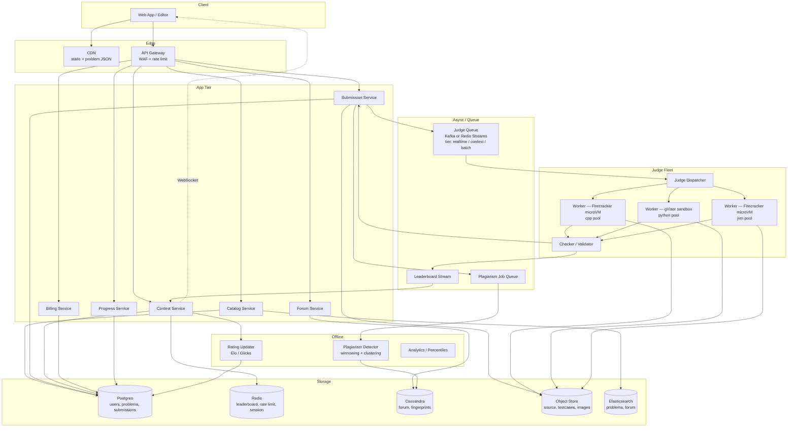
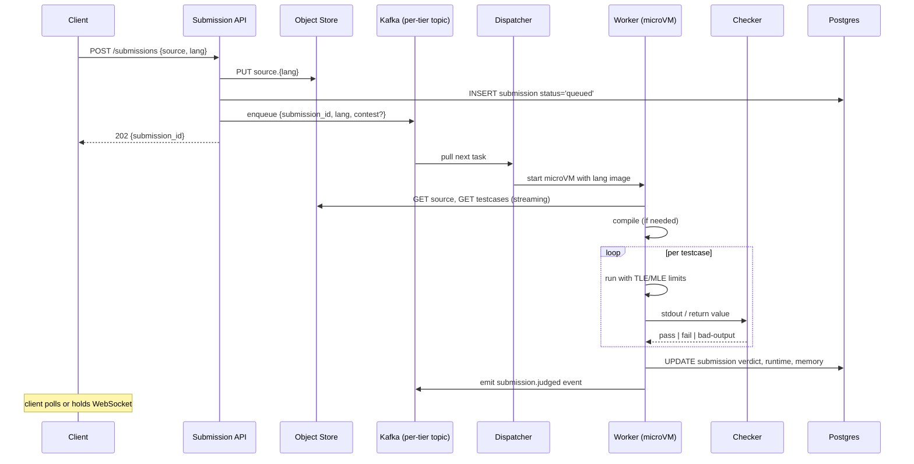

# Design LeetCode — Code Execution Sandbox, Judging Pipeline, Contests, and Plagiarism Detection

**Date:** 2026-04-25 | **Updated:** 2026-04-25
**Tags:** `system-design` `case-study` `specialized` `sandboxing` `medium`

## Table of Contents

- [Summary](#summary)
- [Functional Requirements](#functional-requirements)
- [Non-Functional Requirements](#non-functional-requirements)
- [Capacity Estimation](#capacity-estimation)
- [API Design](#api-design)
- [Data Model](#data-model)
- [HLD Diagram](#hld-diagram)
- [Deep Dives](#deep-dives)
  - [1. Sandbox Isolation — gVisor, Firecracker, Docker](#1-sandbox-isolation--gvisor-firecracker-docker)
  - [2. Judge Queue and Worker Pipeline](#2-judge-queue-and-worker-pipeline)
  - [3. Multi-Language Runtime Images](#3-multi-language-runtime-images)
  - [4. Contest Mode — Synchronized Start and Real-Time Leaderboard](#4-contest-mode--synchronized-start-and-real-time-leaderboard)
  - [5. Plagiarism Detection — Token Shingling and MOSS-Style Fingerprints](#5-plagiarism-detection--token-shingling-and-moss-style-fingerprints)
  - [6. Problem Catalog, Tags, and Problem-of-the-Day](#6-problem-catalog-tags-and-problem-of-the-day)
  - [7. Discussion Forum and Editorial Notes](#7-discussion-forum-and-editorial-notes)
  - [8. Premium Subscriptions and Entitlements](#8-premium-subscriptions-and-entitlements)
  - [9. Submissions History and User Progress](#9-submissions-history-and-user-progress)
- [Bottlenecks and Trade-offs](#bottlenecks-and-trade-offs)
- [Anti-Patterns](#anti-patterns)
- [Related](#related)
- [References](#references)

## Summary

LeetCode is, mechanically, a problem catalog wrapped around a hostile-code execution service. Most of the surface area looks like an ordinary CRUD product — problems, tags, discussion threads, premium subscription gating — but the load-bearing subsystem is the **judge**: a fleet that takes arbitrary user code, compiles it, runs it against hidden test cases inside a hardened sandbox with strict CPU/memory/wall-clock limits, and returns a verdict in seconds. Get the sandbox wrong and you have arbitrary remote code execution as a service. Get the queue wrong and contest submissions stall while ten thousand contestants smash the system at minute zero. This document focuses on those two failure modes and on the supporting plagiarism-detection pipeline, which on contest day is the difference between a credible competitive ranking and a public embarrassment. The rest — catalog, forum, billing — is comparatively boring and reuses standard patterns from other case studies.

## Functional Requirements

**Problem catalog**

- Browse problems by difficulty (Easy / Medium / Hard), topic tags (DP, Graph, Two Pointers...), company tags, acceptance rate.
- Open a problem statement with examples, constraints, and (premium) editorial.
- "Problem of the day" surfaced on the home page.
- Random-pick by tag/difficulty (premium).

**Code editor and submission**

- Monaco-style in-browser editor with language selection (20+ languages: C++, Java, Python, JavaScript, TypeScript, Go, Rust, Kotlin, Swift, C#, ...).
- "Run" against custom or sample input (no scoring).
- "Submit" against the full hidden test suite; receive a verdict (Accepted, Wrong Answer, TLE, MLE, RTE, CE).

**Judging**

- Compile (where applicable) → run against each test case → check stdout / function-return / custom checker → emit verdict with the failing test case (truncated for hidden cases on premium-only problems).
- Per-language CPU and memory limits scaled to language overhead (Python gets 3× the C++ TLE budget).
- Surface runtime, memory, and percentile rank against historical accepted submissions.

**Contests**

- Weekly and biweekly contests with synchronized global start time.
- Real-time leaderboard with rank, score, finish-time tiebreaker, and per-problem completion status.
- Penalty for wrong submissions (ICPC-style time penalty added per failed attempt).
- Post-contest rating update and editorial release.

**Plagiarism detection**

- Run after each contest. Cluster near-identical submissions across distinct accounts; flag for review.

**Discussion forum**

- Threaded discussion per problem; upvotes; "Solution" threads with code embedding.
- Editorial article authored by the team (often gated to premium).

**Premium subscriptions**

- Recurring billing; entitlement gating on premium problems, company tag filters, video editorials, mock interviews.

**Submissions history**

- Per-user, per-problem submission log with code, verdict, runtime, memory, timestamp.
- Re-submit and diff against earlier attempts.

**Out of scope for this HLD**

- Mock interview pairing, video playback infrastructure, AI hints. They each warrant their own design.

## Non-Functional Requirements

| NFR | Target | Why |
|-----|--------|-----|
| Sandbox isolation | Two-layer: VM-level (Firecracker / gVisor) + cgroups | Untrusted code MUST NOT escape into the judge host or read other users' submissions. |
| Judge end-to-end latency | < 5 s P50 for accepted, < 10 s P99 | Slower than this and "Run" feels broken; contests demand fast feedback. |
| Judge fairness | Same code → same verdict on every host | Identical CPU / memory budgets across hosts; pinned cores; deterministic clocks. |
| Contest fairness | All N contestants see the start within a 1-second window | A 5-second clock-skew advantage is enough to win a tied contest. |
| Leaderboard freshness | < 5 s end-to-end during contest | Contestants check rank constantly; a 30-s lag feels broken. |
| Catalog read latency | < 200 ms P99 | Standard product NFR. |
| Availability | 99.9% catalog; 99.95% during contests | Contest outages are reputation events. |
| Submission durability | 11 nines | Code submissions are user IP; never lose a submission. |
| Plagiarism detection turnaround | Hours, not minutes | Run after contest closes; no need for online scoring. |

## Capacity Estimation

These are illustrative figures for sizing the architecture, not LeetCode's published numbers.

**Steady state**

- 5 M registered users, 200 K daily active, 50 K monthly contest participants per weekly event.
- Steady submissions: ~10 / sec average, ~50 / sec peak (lunch + evening).
- Runs (sample input): ~3× submissions ≈ 30 / sec average.

**Contest peak**

- 30,000 simultaneous contestants × 4 problems × 2-3 submissions per problem over 90 minutes.
- Submission rate compresses heavily into the first 20 minutes (everyone attacks Q1 and Q2): peak ~500 submissions/sec.
- Each submission runs ~10–100 test cases; effective sandbox executions can exceed 10,000 / sec at peak.

**Storage**

- Submissions: 10 M/year × ~5 KB compressed code + metadata ≈ 50 GB/year structured + raw code in object storage.
- Test cases: tens of MB per problem at most; total ~few hundred GB across thousands of problems.
- Discussion: ~1 KB/post × 10 M posts ≈ 10 GB.
- Plagiarism fingerprints: ~1 KB per submission × 10 M ≈ 10 GB; cluster output ~10× larger.

**Worker pool sizing**

- Average submission consumes ~2 vCPU-seconds. At 500 sub/s peak with 10 test cases each, the judge fleet needs ~10,000 vCPU-seconds/sec headroom. With 32-vCPU hosts running 4 jobs in parallel each, that is on the order of ~80 hosts dedicated to judging during contests, plus headroom for hot-spare and language-specific pools.

## API Design

REST for control-plane operations; WebSocket for live leaderboard during contests; presigned URLs for code archive download.

**Catalog**

```http
GET /v1/problems?difficulty=medium&tags=dp,graph&cursor=...
GET /v1/problems/{slug}                 → problem statement, signature, examples
GET /v1/problems/{slug}/editorial       → 200 (premium) | 402 (free)
GET /v1/daily                           → today's problem-of-the-day
```

**Submission and run**

```http
POST /v1/problems/{slug}/run
{ "language": "cpp17", "source": "..." , "stdin": "..." }
→ 202 { "run_id": "run_01HX...", "status": "queued" }

GET /v1/runs/{run_id}                   → 200 (status: queued|running|done) + result

POST /v1/problems/{slug}/submissions
{ "language": "python3", "source": "...", "contest_id": "weekly-389" }
→ 202 { "submission_id": "sub_01HX...", "status": "queued" }

GET /v1/submissions/{id}                → result with per-test verdict and counters
GET /v1/users/{id}/submissions?problem_slug=&cursor=
```

`202 Accepted` is mandatory: synchronous judging would tie up an HTTP worker for seconds. Clients poll or open a WebSocket on `/v1/submissions/{id}/stream`.

**Contests**

```http
GET  /v1/contests/upcoming
GET  /v1/contests/{id}                  → metadata, problem set hidden until start
POST /v1/contests/{id}/register
GET  /v1/contests/{id}/problems         → 403 before start_at; 200 after
GET  /v1/contests/{id}/leaderboard?cursor=...
WS   /v1/contests/{id}/stream           → leaderboard deltas
```

**Discussion**

```http
GET  /v1/problems/{slug}/discussion?cursor=
POST /v1/problems/{slug}/discussion     { title, body, code_lang, code }
POST /v1/posts/{id}/upvote
```

**Premium / billing**

```http
POST /v1/billing/checkout-session       → Stripe-style session URL
POST /v1/billing/webhook                ← provider callback (signed)
GET  /v1/me/entitlements                → { premium: true, expires_at }
```

## Data Model

The relational core (problems, users, submissions, billing) lives in Postgres; high-volume submission logs and forum posts are sharded; contest leaderboard state lives in Redis; raw source code lives in object storage.

```text
-- Postgres (sharded by user_id for submission-heavy tables)

users (
  user_id        BIGINT PRIMARY KEY,
  username       TEXT UNIQUE,
  email          TEXT,
  rating         INT,                     -- contest rating
  premium_until  TIMESTAMPTZ NULL,
  created_at     TIMESTAMPTZ
)

problems (
  problem_id     BIGINT PRIMARY KEY,
  slug           TEXT UNIQUE,
  title          TEXT,
  difficulty     TEXT,                    -- 'easy' | 'medium' | 'hard'
  tags           TEXT[],
  is_premium     BOOLEAN,
  signature      JSONB,                   -- per-language function stubs
  checker_kind   TEXT,                    -- 'stdout' | 'function' | 'custom'
  created_at     TIMESTAMPTZ
)

testcases (
  testcase_id    BIGINT PRIMARY KEY,
  problem_id     BIGINT,
  is_sample      BOOLEAN,
  ord            INT,
  input_blob_key TEXT,                    -- object-store key
  output_blob_key TEXT,
  weight         INT
)

submissions (
  submission_id  BIGINT PRIMARY KEY,      -- snowflake-ish
  user_id        BIGINT,
  problem_id     BIGINT,
  contest_id     BIGINT NULL,
  language       TEXT,
  source_blob_key TEXT,                   -- raw code in object store
  verdict        TEXT,                    -- 'AC'|'WA'|'TLE'|'MLE'|'RTE'|'CE'|'PE'
  runtime_ms     INT,
  memory_kb      INT,
  failed_test_id BIGINT NULL,
  judged_at      TIMESTAMPTZ,
  created_at     TIMESTAMPTZ
)

contests (
  contest_id     BIGINT PRIMARY KEY,
  slug           TEXT,                    -- 'weekly-389'
  start_at       TIMESTAMPTZ,
  duration_s     INT,
  problem_ids    BIGINT[]
)

contest_registrations (
  contest_id     BIGINT,
  user_id        BIGINT,
  PRIMARY KEY (contest_id, user_id)
)

-- Redis (contest hot path)

contest:{id}:leaderboard          ZSET   member=user_id score=composite_score
contest:{id}:user:{uid}:state     HASH   per-problem: {first_ac_at, wrong_count}
contest:{id}:problem:{pid}:solved COUNTER

-- Cassandra / DynamoDB (forum, fingerprints)

forum_posts        PARTITION (problem_id) CLUSTERING (created_at DESC, post_id)
forum_replies      PARTITION (post_id)    CLUSTERING (created_at, reply_id)
fingerprints       PARTITION (problem_id) CLUSTERING (submission_id)
                   -- value = sorted set of selected k-gram hashes

-- Object storage

s3://leetcode-submissions/{user_shard}/{submission_id}.src
s3://leetcode-testcases/{problem_id}/{testcase_id}.{in,out}
s3://leetcode-runtime-images/{lang}-{version}.tar    -- pre-built sandbox FS layers
```

### Composite Contest Score

The leaderboard ZSET score must encode "more problems solved beats less, ties broken by earlier finish + fewer wrong attempts." Pack into a single sortable double:

```text
score = -solved_count * 10^12
      + (finish_time_seconds + 5 * wrong_attempts) * 10^3
      + tie_breaker_random
```

Smaller is better → use `ZRANGEBYSCORE` ascending. Negative `solved_count` term ensures more problems sort first; the time term resolves ties; the tiny random term breaks exact ties deterministically (seeded by user_id) to avoid pagination skips.

## HLD Diagram



## Deep Dives

### 1. Sandbox Isolation — gVisor, Firecracker, Docker

Running untrusted user code is the existential risk of the platform. A single escape from a judge worker into a host VM that holds millions of submissions, test cases, and AWS credentials is a company-ending event. The defense is **layered**.

**Why plain Docker is not enough.** A Docker container shares the host kernel. A kernel exploit (Dirty COW historically, plus a steady drumbeat of CVEs) escapes the container. Capabilities, seccomp, AppArmor, and read-only filesystems harden Docker meaningfully but never close the kernel attack surface. Treat Docker alone as inadequate for arbitrary code from anonymous users.

**gVisor — user-space kernel.** Google's gVisor (`runsc`) intercepts syscalls in a user-space process and re-implements a Linux-like kernel surface there. The host kernel sees only the gVisor sentry process making a small, well-audited subset of syscalls. The trade-off: many syscalls are slower (sometimes 2–10×) and a handful are unimplemented or behave differently from Linux. For most algorithmic submissions the overhead is invisible; for I/O-heavy code it shows. gVisor's syscall surface is intentionally small; CVEs in gVisor itself are rare and tracked.

**Firecracker — micro-VM.** AWS's Firecracker spawns lightweight KVM-based VMs in tens of milliseconds, with a stripped-down guest kernel and minimal device model. Each submission runs in a fresh microVM, giving a hardware-virtualization boundary between user code and the host. AWS Lambda and Fargate use Firecracker for exactly this reason. Trade-off: more overhead than gVisor for very short jobs, but stronger isolation.

**Recommended layering.**

| Layer | Mechanism | Catches |
|-------|-----------|---------|
| L1: Hypervisor | Firecracker microVM (or KVM directly) | Kernel exploits |
| L2: User-space kernel | gVisor inside the VM (optional belt-and-braces) | Sentry boundary for risky syscalls |
| L3: Container | OCI runtime with seccomp, no-new-privileges, dropped caps | Defense in depth |
| L4: cgroups | CPU shares, memory.max, pids.max, io.max | Resource exhaustion |
| L5: Network | No network namespace egress at all | Outbound exfiltration |
| L6: Filesystem | Read-only rootfs, tmpfs scratch, no host bind mounts | Persistence between runs |
| L7: Output | Truncate stdout/stderr at 64 KB; strip ANSI escapes | Log-injection / terminal exploits |

Every microVM is **single-use**: spawned for one submission, destroyed afterwards, never reused across users. Snapshot-and-restore brings cold start down to tens of milliseconds, so the throwaway pattern is affordable.

For the broader threat-modeling discipline behind these choices see [`../../security/defense-in-depth-threat-modeling.md`](../../security/defense-in-depth-threat-modeling.md).

### 2. Judge Queue and Worker Pipeline

A submission must travel from the API to a worker to a verdict in seconds, even when 30,000 contestants slam Submit at minute one of a contest. The queue choices matter as much as the workers.



**Queue tiering.** Three logical queues: `realtime` (user runs from the editor), `contest` (active contest submissions), `batch` (rejudges, plagiarism reruns). During a contest, the contest tier gets dedicated worker capacity that is *not* shared with batch — a long-running rejudge cannot starve contestants.

**Backpressure.** The submission API checks current queue depth and rejects with `429 Too Many Submissions, retry in N s` when the contest queue exceeds a threshold (with the per-user rate limiter applied first, so the rejection targets abusers not legitimate contestants). Better to delay submissions than to drop them silently or take 30+ seconds to judge.

**Idempotency.** A worker that crashes after starting but before writing a verdict re-appears on the queue. The DB write uses `INSERT ... ON CONFLICT DO NOTHING` keyed by `(submission_id, attempt_no)`; the dispatcher tracks attempts and gives up after N retries with verdict `IE` (Internal Error).

**Determinism for fairness.** Workers pin to specific physical cores via cpuset, disable Turbo Boost (or set a fixed frequency), and run on identical instance types. A submission that gets `1980 ms` on one machine and `2050 ms` on another (TLE = 2000 ms) is a fairness bug. Run each test case 1–3 times and take the best to absorb noise; report the chosen value.

The full set of patterns for the queue layer (idempotency, dead-letter handling, partitioning) is covered in [`../distributed-infra/design-message-queue.md`](../distributed-infra/design-message-queue.md).

### 3. Multi-Language Runtime Images

Each supported language has a pre-built filesystem image that ships compilers, the standard library, the standard test harness, and (for compiled languages) cached compiler invocations.

**Image structure.**

```text
/usr/local/bin/{compiler,interpreter}
/usr/local/lib/{stdlib, common headers}
/judge/runner.{sh,py}        — language-specific entrypoint
/judge/checker               — output validator
/sandbox/                    — tmpfs at runtime; user code lands here
```

Images are versioned (`cpp-gcc13-v3`, `python-3.12.2-v1`) and pinned per problem so an old submission re-judges with the same compiler version.

**Per-language runtime budget.** Different languages have different intrinsic overhead. A 1× C++ baseline maps to roughly:

| Language | TLE multiplier | MLE multiplier | Notes |
|----------|---------------|----------------|-------|
| C / C++ | 1× | 1× | Baseline |
| Rust | 1× | 1× | Comparable to C++ |
| Go | 2× | 2× | GC and runtime overhead |
| Java | 2× | 2× | JVM startup, GC |
| Kotlin | 2× | 2× | JVM-hosted |
| C# | 2× | 2× | .NET runtime |
| Swift | 2× | 1.5× | Compiled but heavier runtime |
| JavaScript / TypeScript | 3× | 2× | V8 startup + interpreter cost |
| Python | 3–5× | 3× | Per-op overhead |
| Ruby | 5× | 3× | Similar to Python |

Multipliers are applied to the *problem's* base limit, not to a global default — a problem author specifies `time_ms = 2000`, and the judge multiplies by the language factor.

**Compile cache.** A submission's compile step can dominate the wall clock for trivial programs (a 100-ms C++ compile is half the budget on an Easy problem). Cache compiled artifacts keyed by `(language, version, source_hash)` for sample-input runs; submissions get a fresh compile but on a warm host with hot disk caches.

**Forbidden language features.** Some constructs must be blocked at the sandbox layer:

- Subprocess spawning (`fork`, `execve`) — blocked by seccomp.
- Network calls — no network namespace egress.
- Filesystem writes outside `/sandbox` — read-only rootfs.
- Reading other users' code paths — namespaced filesystem.
- Reflection-based attempts to call internal APIs (Java `Unsafe`, .NET `MethodInfo.Invoke` to OS internals) — blocked by SecurityManager-equivalent or, more reliably, by the syscall layer.

### 4. Contest Mode — Synchronized Start and Real-Time Leaderboard

A weekly contest starts at a fixed UTC instant; thirty thousand contestants click Submit at second 30 of the first minute; the leaderboard must update in seconds; rating recalculation runs after the contest closes.

**Synchronized start.**

- Problem statements are encrypted at rest with a key released only at `start_at`. Even an insider with DB access cannot leak problems early; the key is held by a separate KMS and released by a scheduled job at start time.
- The CDN serves a public manifest with the start timestamp; clients use server time (returned in API responses) to display countdown and reject local-clock-skewed early reads.
- The "fetch problem set" endpoint refuses with `403` until `now >= start_at` server-side.
- Connection warming: clients open a WebSocket ~10 seconds before start; the server holds a barrier and releases all sockets simultaneously to avoid a thundering herd at second zero.

**Real-time leaderboard.**

```text
On submission.judged event for a contest submission:
  if verdict == AC and not yet AC for this (user, problem):
      finish_time_s = judged_at - contest.start_at
      score_delta   = compute_score(contest, finish_time_s, prior_wrong_count)
      ZADD contest:{id}:leaderboard score_delta user_id      # XX flag — update if exists
      HSET contest:{id}:user:{uid}:state problem_{pid} {first_ac_at, wrong_count}
      INCR contest:{id}:problem:{pid}:solved
      PUBLISH contest:{id}:stream {user_id, new_rank}
  elif verdict in (WA, TLE, MLE, RTE) and not yet AC:
      HINCRBY contest:{id}:user:{uid}:state wrong_{pid} 1
```

**Top-K leaderboard reads.** `ZRANGE contest:{id}:leaderboard 0 99 WITHSCORES` is O(log N + K) and serves the top-100 view at sub-millisecond cost. For the "find me" view, maintain a reverse map `user_id → rank_estimate` in a separate hash, recomputed periodically; exact rank for a given user is `ZRANK` which is O(log N).

**WebSocket fanout.** The contest service subscribes to the Redis Pub/Sub channel and broadcasts deltas to connected clients. With 30 K concurrent sockets per contest, a single Pub/Sub fan-out from one Redis instance is fine; the bottleneck is the WebSocket gateway tier, which scales horizontally with consistent hashing on `contest_id` so all sockets for one contest land on a small set of gateways.

**Rating update.** Done offline after `start_at + duration` plus a buffer for late-judged submissions. LeetCode uses an Elo-derived system; expected score per pair is `1 / (1 + 10^((R_j - R_i) / 400))`, actual score is rank-based, and the update is `R'_i = R_i + K * (S_i - E_i)`. The job runs in a single transaction over the participant set and writes new ratings to the user table.

For comparable real-time ranking and turn-coordination patterns see [`./design-online-chess.md`](./design-online-chess.md).

### 5. Plagiarism Detection — Token Shingling and MOSS-Style Fingerprints

Naive string comparison is useless: cheaters rename variables, reorder functions, insert dead code. The MOSS algorithm (Schleimer, Wilkerson, Aiken, 2003) — formally **winnowing of k-grams of token streams** — is the industry standard.

**Pipeline.**

```text
1. Tokenize    (language-aware lexer; strip comments and whitespace; canonicalize identifiers to TOK)
2. k-gram      (sliding window of k tokens, e.g. k = 5; produces sequence of k-tuples)
3. Hash        (hash each k-gram to a fixed-width integer)
4. Winnow      (in every window of w consecutive hashes, select the minimum; this guarantees coverage with bounded fingerprint size)
5. Compare     (Jaccard similarity of fingerprint sets between submissions)
6. Cluster     (graph: nodes = submissions, edges = high-similarity pairs; connected components above threshold = candidate cheating groups)
7. Review      (human moderators on flagged clusters before action)
```

**Why winnowing.** Selecting *every* k-gram hash is too expensive; selecting one hash per fixed-size window misses overlap; winnowing (pick the min in each sliding window) gives a provable guarantee that any matching substring of length ≥ `k + w - 1` is detected, with O(n / w) fingerprint size.

**Identifier canonicalization.** Variable renaming defeats raw text comparison. The tokenizer maps every identifier to a single token type (or to its declaration order: `var0`, `var1`...). Whitespace and comments are dropped. Reordering of independent functions is harder; some implementations sort top-level declarations canonically.

**Cross-language plagiarism** is rare and out of scope for the standard pipeline; if needed, an AST-level fingerprint (per-language) plus structural matching catches translated solutions.

**Compute scaling.** The `O(N²)` naive pairwise comparison is unworkable at 30,000 submissions per contest problem. The standard trick: build an **inverted index from fingerprint hash → list of submissions containing it**; only submissions sharing many fingerprint hashes need pairwise Jaccard. This drops the working set per pair to constant time.

**Thresholds and review.**

- Auto-flag: Jaccard > 0.8 over fingerprint sets, both submissions ≥ 30 lines.
- Manual review: Jaccard 0.5–0.8.
- Cluster size matters: a solo pair of similar submissions might be coincidence on a short Easy problem; a 12-account ring on a Hard problem is almost certainly fraudulent.
- Public template code (problem signature, common boilerplate) is excluded by maintaining a global "boilerplate" fingerprint set built from the problem's official starter code.

Action on confirmed plagiarism: invalidate the contest submission, deduct rating, optionally ban repeat offenders. Notification gives the user a chance to appeal; legal exposure is reduced by transparent criteria.

### 6. Problem Catalog, Tags, and Problem-of-the-Day

Comparatively boring relative to the judge, but a few non-obvious points.

**Problem rendering.** Problem statements are authored in a Markdown variant with LaTeX math, code samples, and image attachments. The compiled HTML is cached at the CDN and invalidated on edits; the JSON model behind it (constraints, examples, signature) is fetched separately so language-specific stubs can be rendered client-side.

**Tag search.** Multi-select tag filtering is implemented as a tag → problem inverted index in Elasticsearch (or a denormalized `problem_tags` table with composite indexes in Postgres for smaller scale). `(difficulty, tag)` becomes a partition key; ranking within is by acceptance rate or popularity.

**Problem-of-the-day.** A scheduled job picks one problem per day, biased toward variety (no two days from the same tag back-to-back, difficulty rotation Easy/Medium/Hard). The selection is committed to a `daily_problems` table 30 days in advance and surfaced via a tiny API:

```http
GET /v1/daily?date=2026-04-25 → { problem_id, slug }
```

Clients aggressively cache today's daily; the server response is cacheable for hours.

**Premium gating.** Premium-only problems return `402 Payment Required` for free users on the detail endpoint. The list endpoint still returns the title and difficulty (with a "premium" badge) so users see what they are missing — this drives conversion.

### 7. Discussion Forum and Editorial Notes

Per-problem threaded discussion with code snippets. Storage shape:

- Top-level threads in a wide row partitioned by `problem_id`, clustered by `(created_at DESC, post_id)`; vote counts denormalized with sharded counters (the like-counter pattern from social media).
- Replies in a separate wide row partitioned by `post_id`, clustered by `(created_at, reply_id)`.
- Search via Elasticsearch on title, body, and code fields.

Editorial articles are first-class authored content — versioned, with a draft/preview/publish workflow, premium-gated for many problems, and rendered through the same Markdown pipeline as problem statements. Editorial release for contest problems is scheduled for `start_at + duration + 24 h` so contestants cannot read the editorial mid-contest.

Spam moderation reuses the patterns from larger social products (rate limits per user, NSFW classifiers, behavioral scoring). At LeetCode's scale the cheap mitigations (account age requirements, per-user rate limits, captcha on suspicious behavior) catch nearly everything.

### 8. Premium Subscriptions and Entitlements

Recurring billing via Stripe-style provider, with:

- Checkout session created server-side; client redirected to provider-hosted page.
- Webhook receives `subscription.created`, `invoice.paid`, `subscription.cancelled` events; the handler is idempotent on the event ID.
- `users.premium_until` is the source of truth; entitlement checks are a single column read.
- Grace period: if a renewal fails, premium remains active for ~3 days while the provider retries the card.

**Entitlement check pattern.** Every premium-gated endpoint validates the user has `premium_until > now()`. The decision is cached in the JWT or session for ~5 minutes to avoid DB lookups on every request, with a clear cache-bust on subscription cancellation. Avoid scattering entitlement strings across the codebase — gate via a small set of named entitlements (`premium_problems`, `editorial_access`, `mock_interview`) that map to subscription tiers.

**Refund and dispute handling.** Standard SaaS billing concerns: prorate on plan changes, surface invoices in user settings, never lose a webhook (idempotent retries with exponential backoff and a dead-letter for manual review). The billing service is the most security-sensitive non-judge surface; it deserves its own threat model.

### 9. Submissions History and User Progress

Per-user submissions history is read on the profile page and from the editor ("show my last AC for this problem"). Two access patterns:

- By user (recent submissions across all problems, paginated): partition Cassandra-style by `user_id`, cluster by `(judged_at DESC)`.
- By (user, problem): a secondary table partitioned by `(user_id, problem_id)`, clustered by `judged_at DESC`.

Source code is stored in object storage keyed by `submission_id`; the metadata row carries the blob key. Reading a submission detail returns metadata immediately and a presigned URL for the source so the editor pulls bytes from CDN, not the API.

**Progress aggregates.** "You have solved 412 / 3,200 problems" is a denormalized counter on the user, updated on every first-AC. The "by-difficulty" and "by-tag" breakdowns are recomputed lazily — when the user opens the progress page, a background job is enqueued (or a cached value newer than 1 hour is served).

**Streaks.** A daily-solve streak is computed from a per-user bitmap of days with at least one AC. The bitmap fits in a few KB per user even for years of history; streak computation is a bit-scan from today backwards.

## Bottlenecks and Trade-offs

**Sandbox cold start vs throughput.** Firecracker microVMs cold-start in tens of milliseconds, but at 500 sub/s with 10 testcases each, even 50 ms per cold start is 250 vCPU-seconds/sec spent on VM boot. Mitigation: snapshot pre-warmed microVMs (with the language image already loaded) and resume rather than boot fresh; pool of warm microVMs sized to absorb contest peak.

**Hot worker pool starvation by one slow language.** A Python submission that hits TLE consumes its budget × language multiplier (≈ 6 s for a 2 s C++ TLE). If all workers are busy on slow Python jobs, a quick C++ job queues. Mitigation: dedicated per-language worker pools with weighted capacity (more pods for popular languages, isolated pools so a misbehaving language cannot starve others).

**Leaderboard hot key.** A single contest's ZSET is one Redis key. At 500 writes/sec and continuous reads, a single Redis instance can handle it, but failover during the contest is catastrophic. Mitigation: Redis with synchronous replica + automatic failover, plus periodic snapshot to Postgres so a full Redis loss is recoverable; the leaderboard ZSET is also rebuildable from `submissions` rows in O(N) at any time.

**Test case ingestion bandwidth.** Some problems have multi-megabyte test cases. Workers fetching directly from S3 over public internet will be slow. Mitigation: per-region S3 mirrors (or Cloudflare R2-style), test cases pre-loaded into a regional cache before contest start, workers stream from local NVMe.

**Plagiarism cost on big contests.** A 30-K-submission contest problem produces 30 K × 30 K / 2 ≈ 450 M pairs naively. Inverted-index winnowing brings real cost into the hundreds of millions of cheap intersections. Run it as a batch Spark job over a few hours after the contest, not synchronously.

**Determinism vs noise.** Microsecond-level timing variations on shared hosts can flip TLE verdicts. Mitigation: run each test case 2–3 times and take the median or best; pin CPUs; budget includes a 5–10 % cushion above intended limit; rejudge contested submissions on a quiet host.

**Rejudge cascade.** Discovering a buggy test case after a contest means rejudging thousands of submissions. The batch tier soaks this; the contest tier is untouched. Rejudges write to a new `attempt_no` so the original judging trace is preserved for auditing.

**Cross-region read consistency for premium.** A user who upgrades in region A and immediately tries to access a premium problem from region B may hit a stale `premium_until`. Mitigation: write-through Redis on entitlement updates; read-your-writes via session sticky region for ~10 minutes after a billing event.

**Anti-cheat vs UX.** Stricter anti-cheat (browser fingerprinting, copy-paste detection, eye tracking via webcam) catches more cheaters but harms legitimate users. Choose the level deliberately and document it; LeetCode-style platforms generally rely on post-hoc fingerprinting plus a cultural norm against cheating, not on heavy in-browser surveillance.

## Anti-Patterns

- **Running untrusted code in shared containers without isolation.** A `docker run user-image` on a host shared by other workers is a crash-test for kernel CVEs. Always two-layer (microVM + container + seccomp + cgroups + no-net).
- **Reusing a sandbox between users.** Even if the filesystem is reset, kernel state, page cache, and lingering processes can leak. Single-use microVMs only.
- **Synchronous judging on the request path.** Ties HTTP workers up for seconds and falls over at contest start. Always queue + 202 + poll/WebSocket.
- **One global queue for runs, submissions, contest, batch.** A long batch rejudge starves contestants. Tier the queues.
- **Trusting user-supplied wall-clock times.** Anything from the client about timing is untrustworthy. Server stamps `start_at`, `judged_at`, `submitted_at`.
- **Storing source code in Postgres.** Bloats backups and shard moves. Object storage + metadata row.
- **Hardcoded per-language limits in app code.** When you add Rust, you do not want to grep through three services. Limits live in a config table indexed by language.
- **Plagiarism detection on raw text.** Whitespace + rename defeats it instantly. Token-level winnowing is the floor.
- **A single global counter for "solved" or "submissions".** Hot row at contest start. Sharded counters or Redis HINCR.
- **No idempotency on billing webhooks.** A retried `invoice.paid` doubles entitlement. Always dedupe by event ID.
- **Letting workers reach the public internet.** A clever submission proxies arbitrary HTTP traffic, exfiltrates test cases, or DDoSes a third party from your IP space. No network namespace egress, period.
- **Truncating stdout silently with no signal.** A 64 KB-truncated stdout can be a "Wrong Answer" bug for an hour of debugging. Return a clear flag indicating truncation.
- **Skipping replay protection on signed editor sessions.** A session token meant to authorize a single submission can be replayed for batch abuse. Tie tokens to a one-time nonce.

## Related

- [`../../security/defense-in-depth-threat-modeling.md`](../../security/defense-in-depth-threat-modeling.md) — layered security model behind sandbox isolation choices and the threat tree for code-execution platforms.
- [`../distributed-infra/design-message-queue.md`](../distributed-infra/design-message-queue.md) — judge queue patterns: tiering, idempotency, dead-letter handling, partitioning by tenant.
- [`./design-online-chess.md`](./design-online-chess.md) — synchronized real-time interactions, rating systems (Elo/Glicko), turn-coordination patterns reused for contests.
- [`./design-calendar-system.md`](./design-calendar-system.md) — scheduled events, time-zone handling, and synchronized release of resources at a fixed instant (analogous to contest start and problem-of-the-day publishing).

## References

- [gVisor — Application Kernel for Containers](https://gvisor.dev/docs/) — Google's user-space kernel, syscall interception model, and security boundary documentation.
- [Firecracker — Secure and Fast microVMs for Serverless Computing](https://firecracker-microvm.github.io/) — AWS's minimal-footprint VMM used by Lambda and Fargate; design rationale and threat model.
- [Schleimer, Wilkerson, Aiken — *Winnowing: Local Algorithms for Document Fingerprinting* (SIGMOD 2003)](https://theory.stanford.edu/~aiken/publications/papers/sigmod03.pdf) — the MOSS paper; foundational algorithm for token-shingling plagiarism detection.
- [Stanford MOSS — Measure Of Software Similarity](https://theory.stanford.edu/~aiken/moss/) — the reference implementation and operational details still used by competitive programming and CS courses.
- [Codeforces blog — How does Codeforces work?](https://codeforces.com/blog/entry/4088) — Mike Mirzayanov on the architecture of a real competitive-programming platform: invoker isolation, queueing, judging.
- [Judge0 — Open-source online code execution system](https://github.com/judge0/judge0) — production-grade reference implementation of the judging pipeline; isolate-based sandboxing, language images, API shape.
- [isolate — Sandbox for competitive programming judges](https://github.com/ioi/isolate) — used by IOI and Codeforces; cgroup-based resource limits and namespace isolation primitives.
- [Designing Data-Intensive Applications, Martin Kleppmann](https://dataintensive.net/) — chapters on stream processing, idempotency, and consistency that underpin the queue and rating-update designs.
