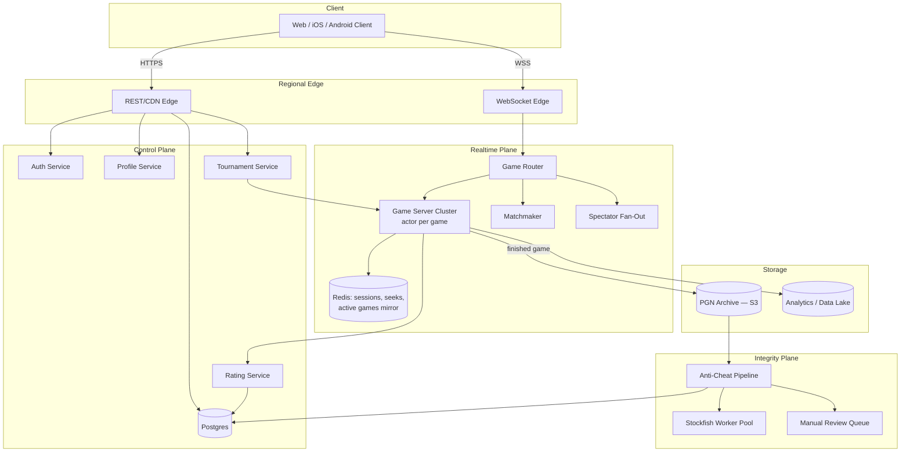

# Design Online Chess — Real-Time Play, Rating, and Anti-Cheat at Lichess/Chess.com Scale

**Date:** 2026-04-25 | **Updated:** 2026-04-25
**Tags:** `system-design` `case-study` `specialized` `real-time` `gaming` `hard`
**LLD Twin:** [Chess (LLD) — Piece Hierarchy, Move Validation, Check/Checkmate](../../../low-level-design/case-studies/games/design-chess.md) — class-level OOD with entities, relationships, and patterns.


## Table of Contents

- [Summary](#summary)
- [Functional Requirements](#functional-requirements)
- [Non-Functional Requirements](#non-functional-requirements)
- [Capacity Estimation](#capacity-estimation)
- [API Design](#api-design)
- [Data Model](#data-model)
- [High-Level Design](#high-level-design)
- [Deep Dives](#deep-dives)
  - [Matchmaking and Glicko-2](#matchmaking-and-glicko-2)
  - [Real-Time Move Sync over WebSocket](#real-time-move-sync-over-websocket)
  - [Time Control State Machine](#time-control-state-machine)
  - [Anti-Cheat Pipeline](#anti-cheat-pipeline)
  - [Spectator Fan-Out](#spectator-fan-out)
  - [Replay and PGN Storage](#replay-and-pgn-storage)
  - [Tournament Mode (Arena and Swiss)](#tournament-mode-arena-and-swiss)
  - [Post-Game Analysis](#post-game-analysis)
- [Bottlenecks and Trade-offs](#bottlenecks-and-trade-offs)
- [Anti-Patterns](#anti-patterns)
- [Related](#related)
- [References](#references)

## Summary

An online chess platform looks deceptively simple — two players, 64 squares, alternating moves — but behind the board sits a real-time, latency-sensitive, fairness-critical distributed system. The hard parts are not move legality (one tiny stateless function) or board rendering. They are: (1) **matchmaking** that pairs strangers fairly within a few hundred milliseconds across millions of concurrent seekers, (2) **time control** with millisecond-accurate clocks that survive network jitter, (3) **anti-cheat** that detects engine assistance without breaking the experience for legitimate strong players, (4) **rating updates** that produce stable, manipulation-resistant numbers under Glicko-2, and (5) **spectator fan-out** that broadcasts the world championship to a million viewers without bottlenecking the players' move loop.

The architectural pattern that emerges in production at Chess.com and Lichess is a **stateful "game server" tier** — one process owns one game's authoritative state, drives both clocks, validates moves, and fans out events — sitting behind a WebSocket edge, with a separate matchmaker, rating engine, anti-cheat pipeline, and PGN/archival store. The control plane (auth, profiles, friends, tournaments) is a conventional REST/Postgres stack. The interesting engineering lives in the realtime and integrity planes.

Lichess publishes its entire stack as open source ([lichess-org/lila](https://github.com/lichess-org/lila), Scala on Akka actors, MongoDB, Redis), and Chess.com periodically publishes engineering and fair-play posts; both are referenced throughout.

## Functional Requirements

The user-facing capabilities a modern chess site must deliver:

- **Play a game** against another human (rated or casual) at a chosen time control (bullet, blitz, rapid, classical, correspondence).
- **Quick pair** — find a stranger of similar strength in a few seconds.
- **Custom challenge** — invite a specific user, set color, time control, rated/casual.
- **Play a bot** at chosen difficulty; bot moves come from a server-side engine.
- **Make moves** with sub-100ms perceived latency, including premove (move played the instant the opponent's clock starts).
- **Clock management** — increment, delay, byo-yomi-style controls, handle network lag fairly.
- **Resign, offer draw, claim draw** (threefold repetition, 50-move, insufficient material), accept/decline draw offer.
- **Spectate any public game**, including correspondence and titled-player streams; world-championship class events scale to >1M concurrent viewers.
- **Tournaments** — Arena (continuous, score by streaks) and Swiss (round-based, paired by score), both with thousands of concurrent participants.
- **Replays and analysis** — every finished game stored as PGN, browsable move-by-move, with engine evaluation graph and "best move" hints.
- **Rating** — Glicko-2 per time-control category, updated after every rated game.
- **Profile, friends, messaging, clubs/teams** — standard social surface.
- **Puzzles, lessons, openings explorer** — adjacent products that share the auth and rating infrastructure but have their own data paths.

## Non-Functional Requirements

| Concern | Target |
|---|---|
| Move RTT (player → server → opponent) | < 100 ms p50, < 250 ms p99 within a region |
| Clock accuracy | ≤ 50 ms drift over a 5-minute game; server is authoritative |
| Matchmaking time | < 5 s for popular pools at popular times; < 30 s tail |
| Pair fairness | ≥ 90% of pairings within ±100 rating points after relaxation |
| Concurrent players | 250k+ at peak (Lichess publishes live counts; Chess.com larger) |
| Concurrent games | 100k+ active games at peak |
| Spectators on a top stream | 1M+ concurrent viewers (championship matches) |
| Game-server availability | 99.95% per region; failover preserves clock state |
| Anti-cheat coverage | Every rated game scored; titled events 100% reviewed |
| Cheat false-positive rate | < 0.1% (closing an honest account is more damaging than missing a cheater) |
| Game persistence | Every move durable before ack; PGN retrievable forever |
| Geographic coverage | <80 ms RTT to nearest WS edge for >95% of users |

The dominant asymmetries:
- **Latency is non-negotiable in bullet and blitz** — a 300 ms hiccup in a 1+0 bullet game can decide the result.
- **Fairness > throughput** — better to refuse a borderline match than to ship one that produces rating manipulation.
- **Anti-cheat tolerates some latency** — it runs asynchronously after the game; it does not gate moves.

## Capacity Estimation

Order-of-magnitude figures for a Chess.com/Lichess-class service. Use as reasoning floors, not gospel.

**Move volume.** A blitz game (5+0) averages ~40 moves total, ~1 move every ~7 s per side. A bullet game (1+0) averages ~50 moves at ~1 move every ~1.5 s per side. Across 100k active games:

- Mixed pool average: ~1 move/sec per game ⇒ **100k moves/sec** at peak.
- Each move is two events (player→server, server→opponent), so ~200k WS sends/sec, plus clock-tick syncs.
- Move payload is small: ~40–100 bytes JSON or compact binary (UCI string, clocks, FEN delta).

**Bandwidth.** 200k events/sec × 100 bytes ≈ 20 MB/s = 160 Mbps for the player plane. Negligible compared to video. The dominant network cost is **spectator fan-out**: 1M viewers on one game × ~100 bytes/move × 1 move/sec = 100 MB/s = 800 Mbps for one streamed game alone, before WS framing.

**Storage.** A finished game's PGN is typically 500 B – 2 KB. At 5M games/day (Lichess publishes ~6M completed games/day; Chess.com is larger), that is ~5 GB/day of raw PGN, ~1.8 TB/year, easily compressed 5–10× in archive. With analysis annotations (per-move engine eval, ~30 bytes × 80 plies ≈ 2.5 KB), call it 5 KB per analyzed game ⇒ ~25 GB/day, ~10 TB/year.

**Anti-cheat.** Engine analysis with a 10-deep search on each ply costs ~10 ms CPU per ply on a single Stockfish instance. 5M games/day × 80 plies = 400M plies/day. At 10 ms each, that is 4M CPU-seconds/day ≈ 46 cores running flat out. Doubling for cross-checks, pruning easy cases, and burst capacity: **~100 dedicated analysis cores per region**, more during titled events.

**Matchmaking pool.** At 250k concurrent players, maybe 30k are seeking a game at any moment. Across 5 time controls × ~10 rating buckets each, that is ~50 active pools averaging ~600 seekers. Pair attempts run every ~1 s per pool ⇒ low CPU but memory-resident on a small cluster.

**Servers.** A single game-server process on a modern box (16-core, 32 GB) holds ~10–20k concurrent games (each game is a small actor with a clock and a few KB of state). 100k peak games ⇒ ~10 game-server boxes per region with headroom. WebSocket edges scale by connection count: a single Linux box handles 100k–1M idle WS with tuning; budget ~10 edge boxes to handle 250k connected players plus spectators.

## API Design

Three protocol surfaces, each chosen for the job.

**Control plane (HTTPS REST):**

```
POST   /v1/auth/login                     # session token
POST   /v1/auth/oauth/{provider}          # OAuth flow
GET    /v1/users/{id}                     # profile, ratings
GET    /v1/users/{id}/games?perf=blitz    # paginated game history (PGN)
POST   /v1/seeks                          # post a seek (open challenge in a pool)
DELETE /v1/seeks/{id}                     # cancel seek
POST   /v1/challenges                     # direct challenge to a user
POST   /v1/challenges/{id}/accept
POST   /v1/games/{id}/draw-offer
POST   /v1/games/{id}/resign
GET    /v1/games/{id}/pgn                 # finished game PGN
GET    /v1/games/{id}/analysis            # engine eval per ply
POST   /v1/tournaments                    # create
GET    /v1/tournaments/{id}/standings
POST   /v1/tournaments/{id}/join
```

REST is the right shape for everything that is not the move loop: profiles, history, tournament metadata, settings.

**Realtime plane (WebSocket, JSON or binary frames):**

Long-lived bidirectional connection from each client to the WS edge. After auth, the client subscribes to *rooms*: a game, a pool, a tournament leaderboard, a global lobby.

Client → server events:

```json
{ "t": "move", "gameId": "abc123", "uci": "e2e4", "clientClock": 297824 }
{ "t": "premove", "gameId": "abc123", "uci": "g1f3" }
{ "t": "draw-offer", "gameId": "abc123" }
{ "t": "draw-decline", "gameId": "abc123" }
{ "t": "resign", "gameId": "abc123" }
{ "t": "claim-draw", "gameId": "abc123", "rule": "threefold" }
{ "t": "ping" }
```

Server → client events:

```json
{ "t": "move", "ply": 14, "uci": "g8f6", "san": "Nf6", "fen": "...", "wclock": 287000, "bclock": 296500 }
{ "t": "clock", "wclock": 286800, "bclock": 296500 }
{ "t": "draw-offered", "by": "white" }
{ "t": "end", "result": "1-0", "reason": "checkmate", "ratingDelta": { "w": +8, "b": -8 } }
{ "t": "spectator-count", "n": 1240 }
{ "t": "matched", "gameId": "abc123", "color": "white", "opponent": { "id": "u42", "rating": 1812 } }
```

The protocol is intentionally small — chess events are tiny — and asymmetric: the client sends *intentions* (a move attempt, a premove, a draw offer), the server sends *truth* (canonical move, authoritative clocks, game end).

**Engine/bot plane (internal):**

A separate gRPC or HTTP service that wraps Stockfish/Leela for bot opponents and analysis. Players never talk to it directly; the game server proxies move requests when the opponent is a bot.

## Data Model

**User (durable, Postgres):**

```
user_id           uuid PK
username          citext unique
email_hash        bytea
created_at        timestamptz
country, bio      text
flags             jsonb       -- bot, titled (GM/IM/...), premium, banned
```

**Rating (durable, one row per user × perf):**

```
user_id           FK
perf              text         -- bullet | blitz | rapid | classical | correspondence | puzzle
rating            int          -- Glicko-2 r, displayed
deviation         float        -- Glicko-2 RD
volatility        float        -- Glicko-2 sigma
games             int
last_played_at    timestamptz
PRIMARY KEY (user_id, perf)
```

**Game (durable, Postgres + PGN archive):**

```
game_id           uuid PK
white_id, black_id        FK (nullable for anonymous)
white_rating, black_rating    int     -- snapshot at start
perf              text
time_control      jsonb       -- { initial: 300, increment: 0 } seconds
rated             bool
status            text        -- created | started | finished | aborted
started_at        timestamptz
ended_at          timestamptz
result            text        -- 1-0 | 0-1 | 1/2-1/2 | *
result_reason     text        -- mate | resign | timeout | draw-agreed | threefold | 50move | abandon
final_fen         text
move_count        int
pgn_blob_ref      text        -- s3://games/yyyy/mm/dd/...
```

**Move (durable, write-once log; either inlined in PGN blob or row-per-move for hot games):**

```
game_id           FK
ply               int          -- 1, 2, 3, ...
uci               text         -- e2e4
san               text         -- e4 (computed; cheap)
clock_after_ms    int          -- the mover's remaining time after the move
move_time_ms      int          -- elapsed on the clock
PRIMARY KEY (game_id, ply)
```

**ActiveGame (ephemeral, in-memory on a game server, mirrored to Redis for failover):**

```
game_id
white_session_id, black_session_id
position_fen
move_history       []Move
white_clock_ms, black_clock_ms
last_move_at_ms    -- monotonic clock anchor
turn               white | black
draw_offer         null | white | black
takeback_pending   bool
spectator_count
```

**Seek / MatchmakingEntry (ephemeral, in Redis sorted sets per pool):**

```
seeker_id
perf
rating, deviation
created_at
color_pref         random | white | black
relax_step         0 → 1 → 2 ...
```

**TournamentEntry (durable):**

```
tournament_id, user_id  PK
score, performance, tiebreak, rank
last_paired_at
flags                  -- withdrew | banned-mid-event
```

**CheatSignal (durable, anti-cheat ledger):**

```
signal_id              uuid PK
user_id                FK
game_id                FK (nullable)
detector               text        -- engine-correlation | move-time | known-engine-fingerprint | report
score                  float       -- 0.0..1.0
features               jsonb
created_at
reviewed_by            text (nullable)
action                 null | flagged | warned | banned | cleared
```

## High-Level Design



Three planes:

1. **Control plane** — REST, Postgres, mostly stateless. Auth, profiles, tournament CRUD, rating reads, history.
2. **Realtime plane** — WebSocket edges, a router that maps connections to game-server actors, a matchmaker, and a spectator fan-out. Authoritative game state lives here, briefly, until the game ends.
3. **Integrity plane** — async anti-cheat pipeline, engine workers, manual review queue. Fed from finished games, never gates live play.

The dominant pattern is **one actor per game**: a single goroutine/Akka actor/Erlang process owns the game, processes events serially, drives both clocks against a monotonic source, and emits canonical events. This is the design Lichess's `lila` codebase uses (Akka actors over MongoDB), and it is what Chess.com's engineering posts describe at higher scale.

## Deep Dives

### Matchmaking and Glicko-2

Pairing two strangers fairly within seconds is the core seek-and-match problem.

**Pools.** Seekers are partitioned by **time-control category** (bullet/blitz/rapid/classical/correspondence) and **rated/casual**. Within a pool, candidates are kept in a sorted set keyed by rating in Redis (Lichess's `lila-ws` and `lila` use Redis pub/sub plus in-memory pools).

**Bucket + relaxation algorithm.**

```
on seek(s):
  pool = pool_for(s.perf, s.rated)
  pool.add(s)

every 1 s for each pool:
  for each seeker s in pool, ordered by wait_time desc:
    if s.matched: skip
    delta = base_delta + relax_step(s.wait_time)        # widens with wait
    candidates = pool.range(s.rating - delta, s.rating + delta)
    candidates = filter(candidates, color_compat(s), not s)
    pick best by min(|rating - s.rating|), tie-break wait_time
    if found:
      create_game(s, candidate)
      remove both from pool
```

Typical relaxation: ±50 RP for 0–3 s, ±100 RP for 3–8 s, ±200 RP for 8–20 s, then unbounded. **Color preference** (white/black/random) and **rated-with-rated only** are hard filters; rating gap is soft. Lichess additionally honours **Glicko deviation (RD)** — a high-RD opponent (provisional) can be paired wider because the rating estimate itself is uncertain.

**Why Glicko-2 instead of Elo?**

Elo, designed for OTB tournaments where players play continuously, has a single number and a fixed K-factor. It does not model uncertainty: a player who returns after 5 years is treated identically to one who plays daily. Glicko-2 (Mark Glickman, 2012) adds two more state variables:

- **r** — the rating itself.
- **RD** (rating deviation) — uncertainty around r. Grows with inactivity, shrinks with games.
- **σ** (volatility) — how erratic the player's results have been.

After each rating period (a single game in fast online play, a batch in OTB), you compute new r, RD, σ from the opponent's r/RD and the result. The mathematical update (Glickman 2012) is:

```
v   = 1 / Σ g(RDj)² · E(s|r,rj,RDj) · (1 − E(...))
Δ   = v · Σ g(RDj) · (sj − E(...))
σ'  = solve_volatility(σ, Δ, v, RD)        # Illinois algorithm
RD* = sqrt(RD² + σ'²)
RD' = 1 / sqrt(1/RD*² + 1/v)
r'  = r + RD'² · Σ g(RDj)·(sj − E(...))
```

Where `g(RD) = 1/√(1 + 3·RD²/π²)` and `E` is the expected score under a logistic model. The practical consequences:

- A new player's RD starts high (~350); rating moves fast and stabilizes after ~30 games.
- Inactive players regain uncertainty: their RD grows over time, and the next game's update is larger.
- Streaks of upsets raise σ, which speeds future updates — capturing "this player's true strength is not what we thought."

Implementation note: Lichess uses Glicko-2 with a per-game rating period (each game updates both players' state). Chess.com publishes that it uses Glicko-style ratings as well, with category-specific tuning.

**Manipulation resistance.** Sandbagging (deliberately losing to lower one's rating) and farming (creating a smurf to feed wins) are the classic attacks. Mitigations:

- **RD floor** — RD cannot drop below ~50, so a manipulated rating still updates fast under attack.
- **Provisional flag** — players with RD > 110 are marked "?" and excluded from leaderboards.
- **Rating-floor for titled players** — GMs cannot drop below a threshold (Chess.com policy).
- **Anti-cheat coupling** — accounts flagged by anti-cheat have rating updates frozen and reverted.

### Real-Time Move Sync over WebSocket

Why WebSocket, not HTTP long-poll, SSE, or WebRTC? See [`../../communication/real-time-channels.md`](../../communication/real-time-channels.md). Chess wants **bidirectional, ordered, low-overhead, sub-100 ms** messaging with **no UDP** (move loss is unacceptable; the application cannot tolerate a missing move). WebSocket over TLS on port 443 is the universal fit: traverses corporate firewalls, persists for the game's life, ~6-byte frame overhead per message.

**Authoritative server.** The server, not the client, is the source of truth. The client sends `move(uci)`. The server:

1. Looks up the game actor by `gameId`.
2. Confirms the sender owns the side to move.
3. Stops the mover's clock, computes elapsed time against `last_move_at` monotonic anchor.
4. Validates legality against current position.
5. Applies the move, updates FEN, increments ply, possibly applies increment to the just-moved clock.
6. Persists to the move log (write-ahead before ack on rated games).
7. Broadcasts canonical event to both players and all spectators in the room.
8. Starts the opponent's clock.

This is sequential per game, parallel across games — the actor model maps cleanly. Per-game throughput is tiny (few moves/sec), so a single goroutine/actor handles thousands of games on shared CPU.

**Latency budget for one move.** Client→edge ~30 ms, edge→game-server ~5 ms, validation+log ~5 ms, game-server→edge ~5 ms, edge→opponent ~30 ms. Total ~75 ms RTT in-region. Cross-region adds ~100 ms — game-server placement near the median of player latency matters in bullet.

**Premove.** A move queued by the player while it is the opponent's turn. As soon as the opponent's move arrives at the client, the client immediately submits the premove. The server validates it against the *new* position; if illegal, drops it silently. Premoves shave ~100 ms from move time and are essential in bullet.

**Lag compensation.** Lichess (and Chess.com) implement *moretime-on-lag*: the server detects abnormal RTT spikes (via WS pings) and credits time back to the affected player. The mechanism is simple — measure the gap between server-broadcast time and client-ack time; if it exceeds a threshold (e.g., 200 ms above session baseline), do not deduct that gap from the next clock period. Without this, a player on bad wifi loses bullet games to network alone.

**Reconnect.** WS connection drops are common. The client reconnects, re-auths, sends `subscribe(gameId, lastSeenPly)`; the server replays missed events from its in-memory log and resumes. The clock keeps ticking on the server during the disconnect, which is correct — abandoning the game costs you on time, not on protocol.

### Time Control State Machine

Clocks are the chess-specific complexity. The server runs *both* clocks against a monotonic source and is solely authoritative.

**State machine per game:**

```
            ┌──────────┐
   create   │  CREATED │
   ────────►│          │
            └────┬─────┘
                 │ both joined
                 ▼
            ┌──────────┐  white moves   ┌─────────────┐
            │  WHITE_  │───────────────►│   BLACK_    │
   first    │   TURN   │                │    TURN     │
   move ───►│          │◄───────────────│             │
            └────┬─────┘  black moves   └──────┬──────┘
                 │                              │
                 │ resign / timeout / mate / draw
                 ▼
            ┌──────────┐
            │ FINISHED │
            └──────────┘
```

**Clock representation.** Per side: `remaining_ms`, `running_since_monotonic_ns` (or `null` if paused). On each `clock_tick` query, compute `remaining_ms - (now_ns - running_since_ns)/1e6`.

**Increment vs delay.**

- **Fischer increment** (e.g., 5+3): the moving side gains 3 s *added to their clock* after each move. Implementation: `clock[mover] += increment` after the move applies.
- **Bronstein delay** (e.g., 5d3): the moving side has up to 3 s that does not count, then their clock starts. Implementation: at start of turn, set a `delay_remaining = 3000 ms`; subtract elapsed from delay first, then from main clock.
- **US delay (simple delay)** is functionally equivalent to Bronstein for online play.
- **Byo-yomi** (Japanese-style, common in some chess variants and Go): main time + N "byo-yomi periods" of fixed length; if you move within a period, it resets. Implementation: a sub-state machine.

**Timeout.** When `remaining_ms ≤ 0` for the side to move, the game ends *unless* the opponent has insufficient material to checkmate (e.g., lone king). The server checks insufficient material on timeout; if true, the game is drawn ("timeout vs insufficient material"). This is a FIDE rule (Article 6.9) — see references.

**Premove and clock.** Premove does *not* run the player's own clock — they have not moved yet, the opponent has. When the opponent's move arrives and the premove auto-fires, the just-moved player's clock starts essentially immediately. Premove is a UX optimization, not a clock cheat.

**Draw and resign.** Both are state transitions handled by the actor:

- **Resign** is unilateral: the actor moves to FINISHED with `result=opponent` immediately.
- **Draw offer** sets `draw_offer = side`. Opponent's next event is either `accept-draw` (FINISHED, ½–½) or any move (which implicitly declines).
- **Threefold/50-move/insufficient-material claims** are validated by the server against the move history. The server can also auto-call dead-position draws (king vs king, etc.).
- **Abort.** If <2 moves have been played and one side disconnects or quits, the game is aborted (no rating change). This stops queue-and-ditch rating manipulation.

### Anti-Cheat Pipeline

The hardest, least bounded subsystem. The honest assumption: any sufficiently determined cheater can run an engine. Detection is statistical; perfect detection is impossible. **The objective is to catch the bulk of cheaters at the cost of negligible false positives,** because banning honest players is far worse than missing some cheaters. Both Lichess and Chess.com publish on this.

**Signal categories.**

1. **Move-quality / engine-correlation.** Run a strong engine (Stockfish at depth ≈ 12–18, sometimes Leela for second opinion) on every position the suspect player faced. For each played move, compute centipawn loss vs engine top choice and engine match rate vs engine top-N. Honest players have a recognizable shape: more loss in tactical positions, more agreement in clear positions, and a strength that is fairly stable. An engine-using player matches the engine's top choice at unusual rates *across the rating distribution* — a 1500 player playing 90% top-1 in complex middlegames is a strong signal.
2. **Move-time signature.** Honest move times correlate with position complexity (longer in critical, quick in forced sequences). An engine user often has flat move times (engine returns in fixed think time) or weird patterns (paste-and-think delays). Move-time entropy is a feature.
3. **Behavioral / session signals.** Fresh account playing 2400-rated chess; long pause between window blur (alt-tab) and difficult moves; moves correlated with timing of an opponent's broadcast (delayed transmission attack on streamer); IP and device fingerprints shared with banned accounts.
4. **Engine fingerprints.** Some engines have characteristic "tells" — Stockfish picks specific moves in known positions where multiple are near-equal; Leela's preferences differ. A player whose move set fingerprints to a specific engine across hundreds of positions is suspect.
5. **User reports.** Crowdsourced; enter the queue but never sole evidence.

**Pipeline.**

```
Finished Game ──► Feature Extraction (per ply, per player)
                       │
                       ▼
               Model Score (0..1)
                       │
       ┌───────────────┼─────────────┐
       ▼               ▼             ▼
   < 0.3           0.3..0.85       > 0.85
  cleared          shadow-          flagged →
                   queue            human review
                                       │
                                       ▼
                               action: ban / freeze /
                               warn / clear
```

**Engine analysis is async.** It runs on a worker pool *after* the game finishes; it never gates moves or affects opponents in real time. Lichess uses **Irwin** (a now-retired ML model) and currently a successor (Kaladin/CrossCheck-style); Chess.com uses an internal Fair Play system with similar shape. Top events get **100% titled-player coverage** with deeper engine settings.

**Feedback loop.** Confirmed bans feed labeled examples back into the model. Confirmed false positives (unbans on appeal) are negative examples. Model is retrained periodically; thresholds tuned per perf (bullet's noisier than classical).

**Public posture.** Both platforms publish that *they will not disclose detection thresholds* — disclosure helps cheaters tune. They publish enforcement statistics (Lichess publishes monthly closure counts; Chess.com publishes Fair Play reports). This is the right call: detection only works if attackers do not know the boundary.

**What anti-cheat does NOT do:**
- Block engine sites at the network layer (impossible).
- Use webcam attestation (privacy disaster, adversarially weak).
- Trust client telemetry (the cheater's client lies).

### Spectator Fan-Out

A regular game has 0–10 spectators; a top streamer's game has 50k; the world championship has >1M. The fan-out shape changes drastically with viewer count.

**Tier 1 (small audiences, ≤ ~1000 viewers).** Spectators subscribe to the game's WS room directly. The game-server actor pushes each move to all subscribers. Cost is O(N) per move; trivial at 1000 × 100 bytes × 1 move/s = 100 KB/s.

**Tier 2 (medium, 1k–100k viewers).** Player-facing actor must not block on spectator I/O. Introduce a **fan-out service**: the game-server emits each move to a pub/sub channel (Redis Streams, NATS, Kafka); a horizontally scaled fan-out tier subscribes and pushes to spectators connected to its WS edges.

```
Game Actor ─► move topic (Redis Stream) ─► [Fan-Out 1] ─► 10k spectators
                                       │── [Fan-Out 2] ─► 10k spectators
                                       └── [Fan-Out N] ─► 10k spectators
```

Each fan-out instance opens a single subscription upstream and writes to many WS clients downstream. The player-facing path stays untouched; spectator backpressure cannot starve the game.

**Tier 3 (massive, >100k viewers).** Pub/sub through CDN. The fan-out service writes a *small append-only log* of moves keyed by gameId; clients poll via long-poll or subscribe via SSE through a CDN. Or use a streaming primitive: Cloudflare Durable Objects, Fastly Compute, AWS IoT, or a custom WS-on-CDN (Lichess streams broadcasts to a distinct LL-HLS-like channel for very large events). The latency cost is a few seconds — acceptable for spectators, who do not care about a 2 s lag.

**Delayed transmission for fairness.** During elite events with prizes, broadcasts are delayed 15 minutes to prevent in-progress "computer help from a friend in the stream" attacks. The DGT-board feed and the spectator stream live on separate paths.

See [`../real-time/design-zoom.md`](../real-time/design-zoom.md) for the analogous SFU-vs-CDN choice for video; chess's fan-out problem is the lighter cousin of webinar fan-out.

### Replay and PGN Storage

Every finished game becomes an immutable record. **PGN (Portable Game Notation)** is the universal text format:

```
[Event "Lichess Rated game"]
[Site "https://lichess.org/abc123"]
[Date "2026.04.25"]
[White "alice"][Black "bob"]
[Result "1-0"]
[WhiteElo "1812"][BlackElo "1798"]
[TimeControl "180+2"]

1. e4 e5 2. Nf3 Nc6 3. Bb5 a6 4. Ba4 Nf6 5. O-O Be7 ... 35. Qxf7# 1-0
```

**Storage layout.** Hot games (last 30 days, frequently fetched for opponents' history) live in Postgres tables. Cold games archive to object storage (S3, GCS) keyed by `s3://games/yyyy/mm/dd/hh/{gameId}.pgn.zst`, sharded by date and game ID prefix. Daily compaction roll-ups bundle thousands of games into one zstd archive for batch analytics.

**Indexes:**
- By `(user_id, perf, ended_at desc)` — drives the user's history page.
- By `(opening_eco)` — the openings explorer.
- By `(rating_bucket, perf)` — leaderboard sampling.

Lichess publicly publishes the entire game database (~6B+ games) as monthly PGN dumps under CC0 — useful precedent for "PGN is the durable, portable format; databases are caches over it."

**Replay UX.** The client fetches PGN, parses it, and lets the user step through moves. Engine analysis runs server-side on demand: a job posts to the analysis worker pool, computes per-ply Stockfish evaluations, and writes the result alongside the PGN as JSON. Cached after the first request.

### Tournament Mode (Arena and Swiss)

Two formats with very different mechanics; both are stateful long-running coordinators atop the same game-server fabric.

**Arena (Lichess style).** Continuous play for a fixed duration (e.g., 60 min). When you finish a game, you immediately seek another opponent in the arena pool. Score is `points + bonus`, where bonuses come from streaks (3 wins in a row enables "berserk" / x2 mode in some variants). Pairings minimize rating gap and recent-opponent collisions. Implementation:

- A `TournamentArena` coordinator process owns the event.
- On player join, create a `TournamentEntry`; mark `looking_for_pair = true`.
- A pairing loop (every ~5 s) pairs all available entries by Glicko proximity, avoiding repeats.
- Game finishes → coordinator updates score → entry returns to pool.

**Swiss.** Round-based; N rounds, all games of round k start together, scores updated, round k+1 paired by score-group with rating tiebreak. Standard Swiss pairing rules (FIDE-style with online adaptations) are implemented in the coordinator. State machine:

```
REGISTRATION → ROUND[1] → ROUND[2] → ... → ROUND[N] → FINISHED
each ROUND[k]: PAIRING → PLAYING → SCORING
```

Swiss is harder: the pairing computation is non-trivial (graph matching with constraints), and a single slow game stalls the whole round. Online tournaments enforce a `round_timeout` to abort hung games.

In both formats, the tournament coordinator is the **stateful boss**, game-server actors are the workers, and ratings update game-by-game just like outside the tournament.

### Post-Game Analysis

After a game ends, the user can request "computer analysis":

1. The client posts `POST /v1/games/{id}/analysis`.
2. The job lands in a queue (Redis, SQS, or Kafka).
3. A Stockfish worker picks up the job, replays the PGN, and at each ply runs the engine to a configured depth (typically d=18, ~100 ms/ply on a recent CPU).
4. For each ply: best move, score (centipawns), classification (book / inaccuracy / mistake / blunder / brilliant).
5. Result is stored as JSON next to the PGN; subsequent reads are cache hits.

The **same engine pool** that runs anti-cheat batch analysis can power on-demand user analysis, with anti-cheat at higher priority and deeper depth on flagged games. A `priority queue` with budget-per-user prevents abuse.

## Bottlenecks and Trade-offs

The recurring real-world bottlenecks, ranked by how often they actually bite production:

- **Single-actor hot game.** A massively spectated game routes all spectator subscribes through one actor's input queue. Solution: move spectator fan-out off the player actor onto a pub/sub fan-out tier the moment a game crosses ~1k viewers.
- **Matchmaker tail latency.** A small pool at an off-peak time gives a long wait. Tradeoff: relax aggressively (worse pairings) vs wait longer (worse UX). Pre-pool warming (notifying recurrent users that "the pool is small now") is one practical tactic.
- **Anti-cheat throughput at peak.** A weekend titled tournament can dump millions of plies into the engine queue. Without per-tournament priority lanes, the rest of the pipeline starves. Solution: separate queues, surge auto-scaling.
- **Postgres write hot spots on Move log.** Append-heavy, sequential, insertion-only — partition by date, vacuum-tune, and offload to PGN archive aggressively.
- **WebSocket edge connection limits.** A Linux box can do ~1M idle WS with tuning (file descriptors, kernel buffers, `epoll`), but per-connection memory still bites at ~50 KB/conn → 50 GB at 1M. Plan for it.
- **Rating volatility on bullet streaks.** A 20-game bullet hot streak can swing rating wildly under tight RD. Glicko-2's σ helps but adversaries exploit it; freeze updates during anti-cheat review.
- **Cross-region game placement.** Putting a game-server on the wrong continent destroys bullet quality. GeoDNS + region pinning + manual overrides for known elite player locations.
- **Reconnect storms.** When a WS edge fails, every client reconnects together. Token-bucket reconnect with jitter on the client; capacity plan the failover edge to absorb 2× steady-state in a 30-second window.
- **PGN archive cold reads.** Loading a 5-year-old game from S3 takes ~200 ms; users expect ~50 ms history page renders. Cache recent N pages of history in Redis; lazy-load older.

## Anti-Patterns

- **Trusting the client's clock.** The client lies. The server runs both clocks against a monotonic source; client clocks are display only. Drift checks are server-side.
- **Validating moves on the client.** Client-side validation is fine for UX hints; the server must re-validate every move. A modified client can attempt illegal moves; rejecting on the server is mandatory.
- **One database row per move on the hot path.** Inserting per move per game into a strongly-consistent SQL row generates massive write amplification. Batch within the actor or write to a sequence log; flush to durable storage at game end (with Redis-mirrored crash recovery for in-flight games).
- **Pooling by Elo, not Glicko-2 RD.** Ignoring RD over-weights one-shot results from new accounts. Use RD-aware bands.
- **"Just block engine websites in the firewall."** Useless. The cheater runs the engine locally. Anti-cheat is an inference problem, not a network problem.
- **Treating spectators as players.** Putting spectators in the same WS room with the same actor input queue couples viewer scale to player latency. Always fan out separately.
- **Skipping abort logic.** Without abort-on-disconnect-before-2-moves, players queue, peek at the opponent, and quit until they get a target. This is a rating-fairness vulnerability.
- **Recomputing ratings synchronously inline with game-end.** Glicko-2 update is cheap, but coupling the rating commit to the game-end response on the WS is fragile. Emit `game-ended` immediately, persist rating async (with retries) and broadcast `rating-delta` when ready.
- **Mixing tournament and casual pools.** A tournament-only player joining open arena pools confuses both pairings and rating. Hard-partition by perf and event.
- **Public anti-cheat thresholds.** Disclosing exactly how engine-correlation scores are computed lets cheaters tune their move selection. Publish *that* you measure, never *how* precisely.
- **"E2E encryption" of moves.** Moves *must* be visible to the server to validate, drive clocks, run anti-cheat, and broadcast. There is no useful E2EE shape for chess gameplay.
- **Forgetting the timeout-vs-insufficient-material rule.** Many home-grown implementations award the win on flag fall against a lone king; FIDE Article 6.9 says draw. Get the rule right.

## Related

- [Real-Time Channels — WebSocket, SSE, Polling](../../communication/real-time-channels.md) — the WS choice that makes the move loop feasible.
- [Design Zoom — Real-Time Video Conferencing at Planet Scale](../real-time/design-zoom.md) — a deeper case study on the fan-out + edge placement family of problems.
- [Design LeetCode](./design-leetcode.md) — adjacent specialized case study with a similar "submit → judge → broadcast result" loop and competitive-event mechanics.
- [Push vs Pull Architecture](../../communication/push-vs-pull-architecture.md) — the spectator fan-out trade-off in general terms.
- [Multi-Region Architectures](../../reliability/multi-region-architectures.md) — game-server regional placement logic.

## References

- [Glickman, M. — *Example of the Glicko-2 system* (2012)](http://www.glicko.net/glicko/glicko2.pdf) — the canonical Glicko-2 paper with the full update equations and a worked example.
- [Glickman, M. — *The Glicko system*](http://www.glicko.net/glicko/glicko.pdf) — original Glicko paper that motivates the rating-deviation extension to Elo.
- [FIDE Laws of Chess (Handbook E.I.01)](https://handbook.fide.com/chapter/E012023) — authoritative source for legal moves, draw conditions (threefold, 50-move, insufficient material on flag fall — Article 6.9), resignation, and abort rules.
- [Lichess source code — `lichess-org/lila`](https://github.com/lichess-org/lila) — full open-source implementation of a production chess platform: matchmaking, game actors, anti-cheat hooks, tournament coordinators. Scala on Akka, MongoDB, Redis.
- [Lichess WebSocket service — `lichess-org/lila-ws`](https://github.com/lichess-org/lila-ws) — separate WS edge process; useful for understanding the realtime tier in isolation.
- [Lichess fair-play and anti-cheat blog](https://lichess.org/page/fair-play) — public posture and high-level mechanics; deliberately omits thresholds.
- [Lichess game database (CC0)](https://database.lichess.org/) — billions of PGNs, monthly, free; the de facto open chess data resource.
- [Chess.com — *Fair Play and Cheat Detection*](https://www.chess.com/article/view/online-chess-cheating) — Chess.com's public statement on its fair-play system.
- [Chess.com Engineering Blog](https://www.chess.com/blog/CHESScom) — periodic posts on architecture; the "Behind the Scenes" series discusses scaling.
- [PGN specification (Steven J. Edwards, 1994)](https://www.chessclub.com/help/PGN-spec) — the file format every chess engine and database speaks.
- [Stockfish](https://stockfishchess.org/) — the open-source chess engine that powers most analysis and anti-cheat correlation.
- [LeelaChessZero](https://lczero.org/) — the neural-network engine often used as a second opinion in cheat detection.
