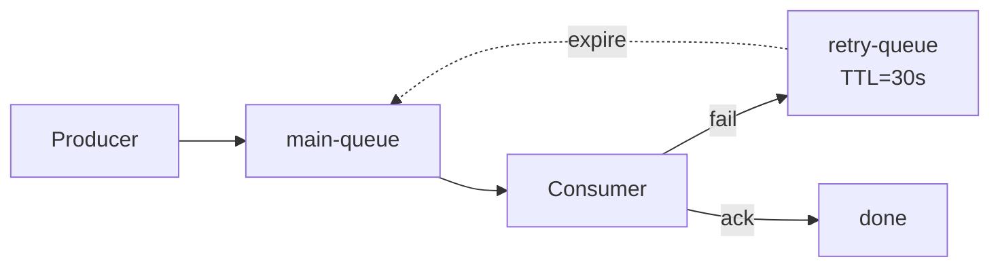
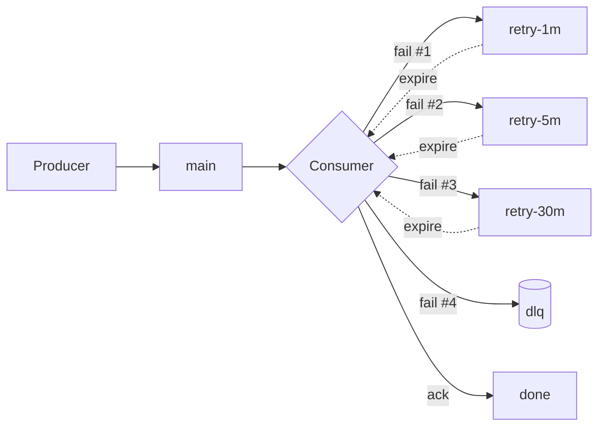

# Dead-Letter Queues, Retries, and Poison Messages — Isolating Failure Without Blocking the Stream

**Date:** 2026-04-25 | **Updated:** 2026-04-25
**Tags:** `system-design` `communication` `dlq` `retries` `poison-messages` `error-handling`

## Table of Contents

- [Summary](#summary)
- [Why DLQs Exist](#why-dlqs-exist)
- [The Poison Message](#the-poison-message)
- [Retry Topologies](#retry-topologies)
  - [In-Process Retry](#in-process-retry)
  - [Retry Queue with Delay](#retry-queue-with-delay)
  - [Multi-Tier Retry](#multi-tier-retry)
  - [DLQ as Terminal](#dlq-as-terminal)
- [Backoff Strategies](#backoff-strategies)
- [Retry Budgets](#retry-budgets)
- [Idempotency Requirement](#idempotency-requirement)
- [DLQ Anatomy](#dlq-anatomy)
- [DLQ Operations](#dlq-operations)
- [Per-Broker Implementation](#per-broker-implementation)
  - [AWS SQS](#aws-sqs)
  - [Apache Kafka](#apache-kafka)
  - [RabbitMQ](#rabbitmq)
  - [Apache Pulsar](#apache-pulsar)
- [Observability for DLQs](#observability-for-dlqs)
- [Replay Patterns](#replay-patterns)
- [Anti-Patterns](#anti-patterns)
- [Related](#related)
- [References](#references)

## Summary

A **Dead-Letter Queue (DLQ)** is a parking lot for messages that cannot be processed successfully. Without one, a single malformed or unprocessable message — a **poison message** — can stall an entire queue while consumers retry it forever. With one, you bound retries, isolate the failure, keep the main stream flowing, and give operators a place to investigate. The interesting design decisions are not "should I have a DLQ" (you should) but rather: how many retries, with what backoff, on what topology, with what metadata, and what the operational discipline around the DLQ looks like once messages start landing there.

## Why DLQs Exist

Imagine a queue that processes order events. A consumer pulls a message, deserializes it, calls a downstream service, and acknowledges. Now suppose one specific message has a corrupted payload — say, a malformed JSON field — and the consumer throws an exception before acking. The broker, not seeing the ack, redelivers the message. The consumer fails again. And again. Forever.

Two bad outcomes follow:

1. **Head-of-line blocking** — if the consumer is single-threaded or the queue enforces ordering, every message behind the poison message is starved.
2. **CPU and downstream churn** — even on parallel consumers, a poison message wastes a worker slot indefinitely, and any side effects (logs, metrics, retried downstream calls) compound.

A DLQ solves this by saying: *after N failed attempts, give up on this message and route it elsewhere*. The main queue keeps flowing. The bad message is preserved with enough metadata for a human (or another system) to investigate. The system degrades gracefully instead of grinding to a halt.

The DLQ is, fundamentally, a **bulkhead** — a way to isolate a class of failures so they cannot consume the entire processing pipeline.

## The Poison Message

A poison message is one that **always fails** to process, regardless of how many times you retry it. The "always" matters: transient errors (a downstream timeout, a brief network blip) are not poison and should be retried. Poison messages have a deterministic failure cause:

- Schema or serialization failures (the consumer cannot parse the payload at all)
- Missing required fields after a producer-side bug
- References to entities that no longer exist (deleted user, archived order)
- Application-level invariant violations (negative quantity on an inventory delta)
- Bugs in consumer code that crash on certain inputs

The trick is that you cannot tell, on the first failure, whether a message is poison or transiently failing. The retry machinery is what disambiguates: if it still fails after N attempts spread across enough time, treat it as poison and DLQ it.

## Retry Topologies

There is no single "right" retry topology. Different systems sit at different points on the spectrum between simplicity and operational sophistication.

### In-Process Retry

The simplest pattern: catch the exception in the consumer and retry inline before acking.

```typescript
async function processWithRetry(msg: Message, maxAttempts = 3): Promise<void> {
  for (let attempt = 1; attempt <= maxAttempts; attempt++) {
    try {
      await handle(msg);
      return;
    } catch (err) {
      if (attempt === maxAttempts) throw err;
      await sleep(backoffMs(attempt));
    }
  }
}
```

Use this **only for transient downstream errors** (timeouts, 503s, connection resets) and only for short windows — say, under a few seconds total. Anything longer ties up a consumer slot, blocks the broker's visibility timeout, and risks the broker redelivering the message anyway because the consumer "looks dead."

### Retry Queue with Delay

For longer retries, push the message to a separate **retry topic/queue** with a TTL. After the TTL expires, the message is routed back to the main queue (or to the next stage). This frees the consumer immediately and uses the broker as the timer.



This is the canonical pattern in RabbitMQ (with Dead Letter Exchange + TTL) and is easy to build in SQS using delay queues.

### Multi-Tier Retry

For systems where downstream incidents can last minutes to hours, use a **tiered retry chain**: `retry-1m`, `retry-5m`, `retry-30m`. Each tier is a separate queue with progressively longer TTL. A message walks down the chain on each failure, giving downstream services time to recover before the message hits the DLQ.



This is essentially exponential backoff implemented at the broker level, and it cleanly separates transient outages (resolved in retry-1m) from longer incidents.

### DLQ as Terminal

After all retries are exhausted, the message lands in the DLQ. From the main pipeline's perspective, the message is **done** — it will never flow through the main consumers again unless an operator explicitly replays it. The DLQ is the terminal state of the failure path.

## Backoff Strategies

Naive linear retries (retry every second forever) cause **retry storms**: when a downstream service has a brief outage, every in-flight message retries simultaneously the moment it recovers, hammering it back into failure. Good backoff prevents this.

| Strategy | Formula | When to use |
|---|---|---|
| **Fixed** | `delay = D` | Almost never; only for cheap, idempotent local operations |
| **Linear** | `delay = D * attempt` | Short retry windows where load is irrelevant |
| **Exponential** | `delay = D * 2^attempt` | Default for distributed systems |
| **Exponential + Full Jitter** | `delay = random(0, D * 2^attempt)` | Recommended; spreads retries across the window |
| **Decorrelated Jitter** | `delay = random(D, prev * 3)`, capped | Best for thundering herds; AWS SDK default |

**Full jitter** is the safest default. The AWS Builders' Library has a clear writeup showing that even modest jitter dramatically reduces the peak load on a recovering service, because retries get spread across the retry window instead of all firing at the same instant.

```typescript
function fullJitterMs(attempt: number, baseMs = 200, capMs = 30_000): number {
  const exp = Math.min(capMs, baseMs * 2 ** attempt);
  return Math.floor(Math.random() * exp);
}
```

## Retry Budgets

Retries multiply load. A 3x retry policy under a sustained outage means downstream sees 3x its normal request rate at the worst possible moment. **Retry budgets** bound this:

- **Global budget** — cap total retries per second across the whole consumer fleet (e.g., "no more than 10% of base traffic can be retries").
- **Per-endpoint budget** — protect individual downstream APIs, especially third parties with strict rate limits.
- **Per-user / per-tenant budget** — prevents one noisy customer from consuming the entire retry budget.

When the budget is exhausted, new failures should fail fast and DLQ immediately rather than queueing for retry. This is essentially a **circuit breaker** applied to the retry path.

This deserves its own treatment — see the planned `retry-strategies.md` (Tier 6) for budget enforcement patterns, hedge requests, and the interaction with circuit breakers.

## Idempotency Requirement

**Retries imply duplicates.** If a consumer fails *after* the side effect (e.g., wrote to the database, called a payment API) but *before* acking, the message will be redelivered and the side effect will run again. Without idempotency, retries cause double charges, duplicate emails, double-counted metrics.

Mitigations:

- **Idempotency keys** in the message; the consumer dedupes via a database constraint or Redis SETNX.
- **Conditional writes** — `INSERT ... ON CONFLICT DO NOTHING`, optimistic locking on a version column.
- **Outbox pattern** on the producer to prevent duplicate publishes.
- **Exactly-once semantics** at the broker level (Kafka transactions, Pulsar transactions) when supported and when the cost is justified.

A consumer that is **not** idempotent has no business retrying. Either make it idempotent or accept that retries will corrupt state. See `idempotency-and-exactly-once.md` for the full pattern catalog.

## DLQ Anatomy

A DLQ message is not just the original payload — it should carry **enrichment metadata** captured at the moment of failure:

| Field | Why it matters |
|---|---|
| `originalPayload` | The raw message body, unchanged |
| `originalTopic` / `sourceQueue` | Where the message came from (for replay routing) |
| `failureReason` | Exception class and message |
| `stackTrace` | First-frame stack for triage |
| `retryCount` | How many attempts before DLQ |
| `firstFailureAt` | Timestamp of first failure |
| `lastFailureAt` | Timestamp of final failure (when it landed in DLQ) |
| `originalEnqueuedAt` | When the message was first produced |
| `consumerVersion` | Build SHA / version of the consumer that failed |
| `correlationId` / `traceId` | For pulling logs and traces |

Enriching at the moment of failure is critical because a DLQ inspected weeks later, with no metadata, is just a graveyard of opaque blobs. The metadata is what makes triage possible.

```typescript
type DlqEnvelope<T> = {
  originalPayload: T;
  metadata: {
    sourceQueue: string;
    failureReason: string;
    stackTrace: string;
    retryCount: number;
    firstFailureAt: string;
    lastFailureAt: string;
    originalEnqueuedAt: string;
    consumerVersion: string;
    correlationId: string;
  };
};
```

## DLQ Operations

A DLQ is a **runway**, not a landfill. The operational discipline matters as much as the topology:

1. **Periodic review** — on-call walks the DLQ at least daily during incidents, weekly otherwise. Stale messages get worse with time (referenced entities may be deleted, schemas may have evolved).
2. **Replay after fix** — once the root cause is identified and patched, replay the DLQ back to the source queue. Replay should be idempotent-safe.
3. **Manual surgery** — for messages that cannot be replayed as-is (schema migration needed, partial state already written), operators edit the payload before replay or apply the fix out of band.
4. **Permanent shelving** — for messages that are genuinely impossible to process (deleted entity, unrecoverable corruption), document the decision and remove them from the DLQ. This must be a deliberate, audited action.

The DLQ should never be a quiet sink that nobody opens.

## Per-Broker Implementation

### AWS SQS

SQS has first-class DLQ support via a **redrive policy** on the source queue. After `maxReceiveCount` failed `ReceiveMessage` calls (without a successful `DeleteMessage`), the message is moved to the configured DLQ.

```json
{
  "QueueName": "orders-main",
  "RedrivePolicy": {
    "deadLetterTargetArn": "arn:aws:sqs:us-east-1:123456789012:orders-dlq",
    "maxReceiveCount": 5
  },
  "VisibilityTimeout": 30
}
```

The DLQ itself is an ordinary SQS queue; you can attach its own redrive policy if you want a "DLQ of last resort." SQS also supports **redrive-to-source** — a console / API action that moves messages from the DLQ back to the original queue without writing custom replay code, which is excellent for routine recovery.

Caveats:

- `maxReceiveCount` counts *receives*, not failures. If a consumer crashes before processing, that still counts.
- The visibility timeout must be longer than your worst-case processing time, or messages will be redelivered prematurely and burn through `maxReceiveCount` for the wrong reason.

### Apache Kafka

Kafka has **no native DLQ concept**. The community pattern is a separate `dlq` topic, populated either:

- **Manually** in the consumer — on terminal failure, produce to `<topic>.dlq` with enriched metadata, then commit the offset on the original topic.
- **Via Kafka Connect** — connectors support `errors.tolerance=all` and `errors.deadletterqueue.topic.name` to route failed records automatically.

```java
// Manual DLQ pattern in a Spring Kafka consumer
@KafkaListener(topics = "orders")
public void onMessage(ConsumerRecord<String, OrderEvent> record, Acknowledgment ack) {
    try {
        handler.process(record.value());
        ack.acknowledge();
    } catch (PoisonException e) {
        dlqProducer.send(buildDlqEnvelope(record, e));
        ack.acknowledge(); // commit offset so we don't redeliver
    } catch (TransientException e) {
        // do not ack; rely on container retry / DefaultErrorHandler
        throw e;
    }
}
```

Spring Kafka ships `DeadLetterPublishingRecoverer` which automates the enrichment and routing — recommended over hand-rolling.

Because Kafka commits offsets per partition, a poison message in one partition only blocks that partition. But within the partition, ordering is preserved, so head-of-line blocking is a real concern until the message is DLQ'd.

### RabbitMQ

RabbitMQ offers **Dead Letter Exchanges (DLX)**: a queue can be configured to route rejected, expired, or overflowed messages to another exchange. This is the most mature DLQ implementation across the major brokers.

```yaml
# RabbitMQ policy applied via rabbitmqctl set_policy
policies:
  - name: orders-dlx-policy
    pattern: "^orders\\.main$"
    apply-to: queues
    definition:
      dead-letter-exchange: "orders.dlx"
      dead-letter-routing-key: "orders.dead"
      message-ttl: 86400000        # 24h hard TTL on main queue
      max-length: 100000           # overflow goes to DLX too

# Queue declarations (Spring AMQP / programmatic equivalent)
queues:
  - name: orders.main
    arguments:
      x-dead-letter-exchange: orders.dlx
      x-dead-letter-routing-key: orders.dead
  - name: orders.retry-30s
    arguments:
      x-message-ttl: 30000
      x-dead-letter-exchange: orders.main.exchange
      x-dead-letter-routing-key: orders.main
  - name: orders.dead
    bindings:
      exchange: orders.dlx
      routing-key: orders.dead
```

The neat trick: by chaining a "retry" queue whose own DLX points back to the main exchange, you build delayed redelivery without any external scheduler. Combine with TTL tiers (`retry-1m`, `retry-5m`, `retry-30m`) to implement multi-tier retry purely in RabbitMQ configuration.

Messages dead-lettered through DLX are automatically annotated with an `x-death` header containing the failure reason (`rejected`, `expired`, `maxlen`) and a count, which gives you basic enrichment for free.

### Apache Pulsar

Pulsar has **built-in DLQ and retry topic support** via the consumer API. You configure `deadLetterPolicy` with `maxRedeliverCount`, an optional `retryLetterTopic`, and a `deadLetterTopic`. The client library handles the routing.

```java
Consumer<OrderEvent> consumer = pulsarClient.newConsumer(Schema.JSON(OrderEvent.class))
    .topic("orders")
    .subscriptionName("orders-sub")
    .subscriptionType(SubscriptionType.Shared)
    .deadLetterPolicy(DeadLetterPolicy.builder()
        .maxRedeliverCount(5)
        .retryLetterTopic("orders-RETRY")
        .deadLetterTopic("orders-DLQ")
        .build())
    .enableRetry(true)
    .subscribe();
```

When the consumer calls `consumer.reconsumeLater(msg, delay)`, Pulsar publishes to the retry topic with a delay; after `maxRedeliverCount` it moves to the DLQ. This is the most batteries-included DLQ story among the major brokers.

## Observability for DLQs

A DLQ is invisible failure if not monitored. Required signals:

- **DLQ depth** — gauge of total messages in the DLQ. Alert on absolute thresholds and on rate of growth.
- **Age of oldest message** — a steady DLQ is one thing; a DLQ where the oldest message is 30 days old means nobody is working it.
- **Surge detection** — sudden spike in DLQ writes indicates a new defect (bad deploy, schema change). Page on rate-of-change, not just absolute depth.
- **DLQ writes by `failureReason`** — bucket by exception class to spot the dominant failure mode quickly.
- **Replay success rate** — when operators replay DLQ messages, track how many succeed vs. fail again.

The dashboard should answer in 10 seconds: *is the DLQ growing, what is the dominant cause, and how old is the backlog?*

## Replay Patterns

Replay is the inverse of dead-lettering: pulling messages out of the DLQ and feeding them back through processing. Patterns:

- **Replay all** — useful right after deploying a fix that addresses every message in the DLQ. Cheapest path; risky if messages are heterogeneous.
- **Replay by filter** — replay only messages matching a predicate (e.g., `failureReason == "TimeoutException"` or `correlationId in (...)`). Safer when the DLQ contains multiple failure classes.
- **Dry-run replay** — replay against a non-production environment first to confirm the fix actually works on real DLQ payloads. Cheap insurance.
- **Partial replay** — replay a small sample (1%, then 10%) before doing the full set. Detects regressions before they multiply.
- **Replay with transformation** — when the schema has evolved, transform the payload during replay rather than DLQ'ing the new failures.

A good replay tool logs every action (which messages, by whom, at what time, with what result) for audit.

## Anti-Patterns

- **The DLQ nobody monitors** — alerts not wired up, no on-call ownership. By the time someone checks, the original entities may be gone and replay is impossible.
- **DLQ messages without metadata** — just the raw payload, no failure reason, no stack trace, no retry count. Triage becomes archaeology.
- **Infinite retries without DLQ** — head-of-line blocking, runaway downstream load, observability blind spot. Always cap retries.
- **Replaying without fixing the root cause** — guaranteed to re-DLQ every message, possibly with side effects. Always confirm the fix in a dry run first.
- **DLQ as a permanent sink for "errors we don't care about"** — if you don't care, log and drop, do not DLQ. DLQ implies *intent to recover*. Mixing real failures with ignored ones poisons the signal.
- **Retrying non-idempotent operations** — duplicate side effects from every retry. Either add idempotency or do not retry.
- **TTL on DLQ that quietly deletes messages** — auto-expiring DLQ entries is silent data loss. If retention is bounded, archive to cold storage first.
- **One DLQ per fleet** — when many services share a single DLQ, ownership is ambiguous and dashboards conflate unrelated failure modes. One DLQ per logical pipeline.

## Related

- [idempotency-and-exactly-once.md](./idempotency-and-exactly-once.md) — duplicate-safe consumers, the prerequisite for any retry strategy.
- [message-queues-and-brokers.md](./message-queues-and-brokers.md) — Tier 2 foundation on broker semantics, delivery guarantees, and ordering.
- [retry-strategies.md](./retry-strategies.md) — Tier 6, planned. Retry budgets, hedged requests, circuit-breaker integration.
- [failure-modes-and-fault-tolerance.md](../resilience/failure-modes-and-fault-tolerance.md) — Tier 6, planned. Bulkheads, timeouts, graceful degradation, and how DLQs fit the broader resilience picture.

## References

- AWS — [Amazon SQS dead-letter queues](https://docs.aws.amazon.com/AWSSimpleQueueService/latest/SQSDeveloperGuide/sqs-dead-letter-queues.html)
- AWS — [SQS dead-letter queue redrive](https://docs.aws.amazon.com/AWSSimpleQueueService/latest/SQSDeveloperGuide/sqs-dead-letter-queues-redrive.html)
- AWS Builders' Library — [Avoiding insurmountable queue backlogs](https://aws.amazon.com/builders-library/avoiding-insurmountable-queue-backlogs/)
- AWS Architecture Blog — [Exponential Backoff And Jitter](https://aws.amazon.com/blogs/architecture/exponential-backoff-and-jitter/)
- RabbitMQ — [Dead Letter Exchanges](https://www.rabbitmq.com/dlx.html)
- RabbitMQ — [Time-To-Live and Expiration](https://www.rabbitmq.com/ttl.html)
- Apache Pulsar — [Dead letter topic and retry topic](https://pulsar.apache.org/docs/concepts-messaging/#dead-letter-topic)
- Confluent — [Kafka Connect Deep Dive: Error Handling and Dead Letter Queues](https://www.confluent.io/blog/kafka-connect-deep-dive-error-handling-dead-letter-queues/)
- Spring for Apache Kafka — [Dead-Letter Topics and `DeadLetterPublishingRecoverer`](https://docs.spring.io/spring-kafka/reference/kafka/annotation-error-handling.html#dead-letters)
