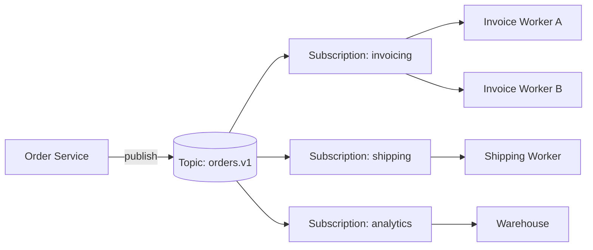
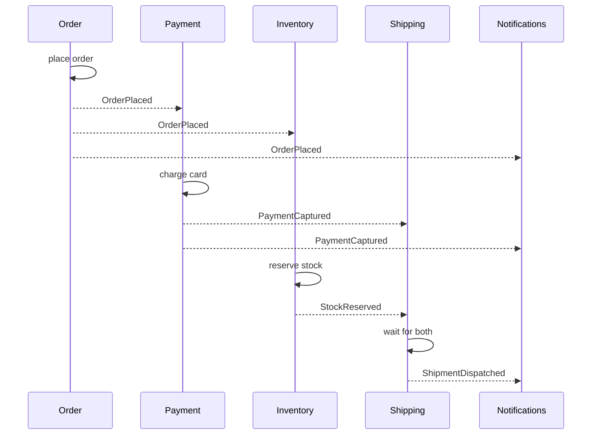
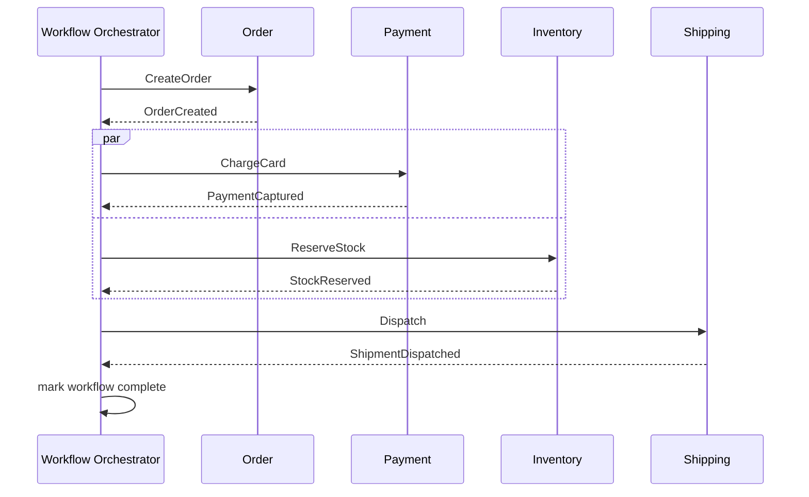
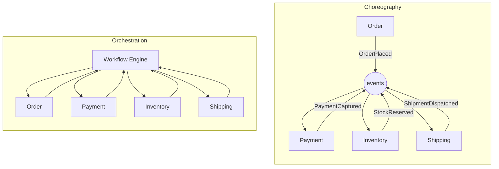

# Event-Driven Architecture — Pub/Sub, Choreography vs Orchestration

**Date:** 2026-04-25 | **Updated:** 2026-04-25
**Tags:** `system-design` `communication` `eda` `pub-sub` `choreography` `orchestration`

## Table of Contents

- [Summary](#summary)
- [What "Event-Driven" Actually Means](#what-event-driven-actually-means)
- [Event vs Command vs Document](#event-vs-command-vs-document)
- [Pub/Sub Mechanics](#pubsub-mechanics)
- [Event Notification](#event-notification)
- [Event-Carried State Transfer](#event-carried-state-transfer)
- [Event Sourcing](#event-sourcing)
- [Choreography](#choreography)
- [Orchestration](#orchestration)
- [Choreography vs Orchestration — A Concrete Order Flow](#choreography-vs-orchestration--a-concrete-order-flow)
- [When Each Wins](#when-each-wins)
- [Workflow Engines](#workflow-engines)
- [Event Schemas](#event-schemas)
- [Event Versioning](#event-versioning)
- [Delivery Semantics](#delivery-semantics)
- [Observability for EDA](#observability-for-eda)
- [Anti-Patterns](#anti-patterns)
- [Related](#related)
- [References](#references)

## Summary

Event-Driven Architecture (EDA) is a communication style where services publish facts about things that have already happened, and other services react to those facts asynchronously. The two big design choices are **what** flows through the system (events vs commands vs documents, notification vs state-carried, sourced vs not) and **how** flows are coordinated across services (choreography vs orchestration). Pick wrongly and you either rebuild the monolith inside a workflow engine, or you ship "spooky action at a distance" that nobody can debug at 3 a.m. This document covers the mechanics; a Tier 9 doc will revisit EDA as a top-level architectural style.

## What "Event-Driven" Actually Means

The phrase is overloaded. Martin Fowler unpacked it into four distinct patterns ([What do you mean by "Event-Driven?"](https://martinfowler.com/articles/201701-event-driven.html)). For this doc, the unifying definition is:

> An **event** is an immutable, named fact about something that already happened in the past, published without knowing who (if anyone) will consume it.

Three properties matter:

1. **Past tense.** `OrderPlaced`, not `PlaceOrder`. The event reports history; it does not request action.
2. **Immutable.** Once published, an event is never edited or retracted. Compensating events ("OrderCancelled") supersede it.
3. **Decoupled at publish time.** The publisher does not name a consumer. Whether 0 or 50 services subscribe is invisible to it.

The shift from request/response to event-driven is a shift from **temporal coupling** (caller waits for callee) to **logical coupling via shared schemas**. The problem moves from "is the downstream service up?" to "do consumers and producers agree on what `OrderPlaced` means in version 3?".

## Event vs Command vs Document

Three things look similar on a wire but mean very different things:

| Type | Tense | Intent | Routing | Coupling |
|------|-------|--------|---------|----------|
| **Event** | Past | "X happened" | Pub/sub fan-out | Loose; publisher does not know subscribers |
| **Command** | Imperative | "Do X" | Point-to-point queue | Tight; sender knows the handler exists and what it does |
| **Document** | None | "Here is data" | Either | Defined by the data contract |

A `PaymentRequested` message that lives on a single queue with one consumer who *must* process it is not really an event — it is a command in disguise. The smoke test: if you delete every consumer, does the publisher break? If yes, it is a command. If no, it is an event.

Why this matters for contracts:

- **Command schemas** can evolve in lockstep with their handler — there is exactly one consumer.
- **Event schemas** must evolve under [Hyrum's Law](https://www.hyrumslaw.com/) — every observable property is depended on by *somebody*. Add fields, never remove or repurpose them, and use a registry (see [Event Schemas](#event-schemas)).
- **Document messages** ride the rails the same way but signal "data interchange" rather than business significance — useful for ETL/CDC.

## Pub/Sub Mechanics

The transport layer for EDA. Concepts are consistent across Kafka, NATS, RabbitMQ (with exchanges), Pulsar, AWS SNS/SQS, GCP Pub/Sub, Azure Service Bus, and EventBridge:

- **Topic** (or stream / exchange / channel) — a named logical destination events are published to.
- **Subscription** — a consumer's binding to a topic. Multiple subscriptions on the same topic each get a copy of every event (fan-out).
- **Consumer group** — within one subscription, multiple worker instances cooperatively split partitions to scale horizontally.
- **Durable vs ephemeral**:
  - *Durable*: events persisted on disk, replayable, survive consumer downtime (Kafka, Pulsar, durable JetStream).
  - *Ephemeral*: events held in memory, dropped if no consumer is connected (classic NATS core, MQTT QoS 0).
- **Retention** — durable systems keep events for a window (hours, days, forever) which sets your replay budget.
- **Ordering** — typically guaranteed within a partition / per key, not across the whole topic.



The producer publishes once. Three subscriptions get an independent copy. Within `invoicing`, two workers split the partitions. This is the canonical fan-out shape.

For broker-level depth (delivery guarantees, partitioning, dead-letter queues, log compaction) see the Tier 2 doc on message queues and brokers.

## Event Notification

The lightest variant. The event carries an identifier and minimal context — "something happened, fetch details if you care."

```json
{
  "eventType": "OrderPlaced",
  "eventId": "01JR8KZ0H9C1QN5W2D7E3F4G5H",
  "occurredAt": "2026-04-25T10:32:14.221Z",
  "orderId": "ord_8af2",
  "links": {
    "self": "https://api.example.com/orders/ord_8af2"
  }
}
```

Pros:

- Tiny payloads; cheap to publish at high volume.
- Source of truth stays in the producer's database — no duplication.

Cons:

- Consumers callback to the producer over HTTP/gRPC to hydrate state. You have just reintroduced sync coupling on the read path.
- A `404` on the callback (because the producer has not committed yet, or the row was archived) becomes a real concurrency hazard.

Use when: events are frequent, payloads would be heavy, and consumers genuinely only need a few of them.

## Event-Carried State Transfer

The event carries enough state for consumers to act without calling back.

```json
{
  "eventType": "OrderPlaced",
  "eventId": "01JR8KZ0H9C1QN5W2D7E3F4G5H",
  "occurredAt": "2026-04-25T10:32:14.221Z",
  "schemaVersion": 3,
  "data": {
    "orderId": "ord_8af2",
    "customerId": "cus_19fe",
    "currency": "USD",
    "totalMinor": 12990,
    "lines": [
      { "sku": "BOOK-NN-01", "qty": 1, "priceMinor": 12990 }
    ],
    "shippingAddress": {
      "country": "US",
      "postalCode": "94110"
    }
  }
}
```

Pros:

- Consumers are autonomous — they can act even if the producer is down.
- Read paths fan out into local read models without distributed joins.

Cons:

- Larger payloads, more bandwidth.
- Schema discipline is non-negotiable; downstream caches now embed your data.
- Privacy: PII rides the bus. GDPR right-to-erasure across an immutable log is hard ([crypto-shredding](https://en.wikipedia.org/wiki/Crypto-shredding) is the usual trick).

Use when: consumers need data to make decisions, latency matters, and you are willing to enforce schema evolution rules.

## Event Sourcing

A specialization where the event log **is** the source of truth, not a derivative of it. Current state is a left-fold of all events; databases are projections you can rebuild from the log.

This is a deeper commitment than event-carried state transfer. It implies append-only storage, snapshotting, idempotent projection rebuilds, and usually [CQRS](#related) on the read side.

This is its own can of worms — see the Tier 3 doc on **CQRS and Event Sourcing**. For most services, plain event-carried state transfer with a regular OLTP database is sufficient and far cheaper.

## Choreography

Each service subscribes to events, decides locally what to do, and emits its own events. There is no central coordinator. The end-to-end flow is **emergent** — it exists only as a property of how all the local rules compose.



Strengths:

- **Loose coupling.** Adding a new consumer (`Loyalty`, `FraudReview`, `Analytics`) does not require touching anyone else.
- **No SPOF coordinator.** Any one service can be down without halting the others' independent reactions.
- **Natural fit for long-lived flows** where events arrive over hours or days.

Weaknesses:

- **Emergent flow is hard to read.** The "process" exists in nobody's code; you have to reconstruct it from logs and traces.
- **Implicit assumptions accumulate.** "Shipping waits for both Payment *and* Inventory" lives in `Shipping`'s code, but the rule that they happen in parallel is invisible.
- **Cross-service transactions and rollbacks are awkward** — every service must implement compensations independently.
- **Cycles are easy to create accidentally** (A reacts to B, which reacts to A's reaction…).

## Orchestration

A central coordinator (a **workflow engine** or **saga orchestrator**) drives the flow. It calls services or sends commands, waits for replies/events, decides the next step, and persists workflow state. Services stay dumb participants.



Strengths:

- **Explicit, traceable flow.** The workflow definition *is* the business process. New engineers read one file.
- **First-class failure handling.** Retries, timeouts, compensations, and human-in-the-loop steps live in the engine, not scattered across consumers.
- **Querying running workflows is trivial** — they are persisted state machines.

Weaknesses:

- **Recentralizes coupling.** The orchestrator must know every participant's contract.
- **The orchestrator becomes critical infrastructure.** It is the new SPOF; you need HA for it.
- **Risk of "workflow as monolith":** if every business rule ends up in the engine, you have rebuilt the monolith with extra latency. Keep services smart enough to own their internal logic.

## Choreography vs Orchestration — A Concrete Order Flow

Side-by-side mental model — same business process, two coordination styles:



In the choreography view, arrows go *through* the bus and the flow is implicit. In orchestration, every arrow has the engine on one end — the flow is the engine's program.

## When Each Wins

A non-exhaustive heuristic:

| Situation | Prefer | Why |
|-----------|--------|-----|
| Long-lived domain events with many independent reactions (notifications, analytics, search indexing) | Choreography | Adding subscribers must be cheap |
| Cross-service transactional flow with compensations (saga pattern) | Orchestration | Centralized failure handling and visibility |
| Payments, KYC, regulated workflows | Orchestration | Auditability and explicit retries |
| ETL / CDC fan-out | Choreography | One producer, many independent sinks |
| Multi-step approvals with humans in the loop | Orchestration | Engines model "wait for signal" cleanly |
| Internal platform events (build finished, deploy succeeded) | Choreography | Many teams subscribe; producer must not know them |
| Order fulfillment with strict SLAs and reversibility | Orchestration | You want one place to look when it stalls |

A common production pattern is **hybrid**: an orchestrator owns the critical-path saga, while peripheral concerns (audit log, analytics, notifications) are choreographed off the same events.

## Workflow Engines

If you go orchestration, do not write the engine yourself. Persistence, retries, timers, idempotency, versioning, and visibility are *exactly* the hard parts.

| Engine | Model | Strengths | Use For |
|--------|-------|-----------|---------|
| [**Temporal**](https://docs.temporal.io/) | Code-first workflows in TS/Java/Go/Python; durable execution | Workflows are normal code; replay-based determinism; rich SDK | Long-running business workflows, microservices sagas |
| [**Camunda 8 / Zeebe**](https://docs.camunda.io/) | BPMN diagrams + a workflow engine | First-class business-process modeling; analyst-friendly | Regulated processes, BPM-heavy domains |
| [**Netflix Conductor**](https://conductor-oss.org/) | JSON workflow definitions; HTTP/gRPC workers | Open-source, language-agnostic workers, battle-tested at Netflix | Heterogeneous polyglot platforms |
| [**AWS Step Functions**](https://docs.aws.amazon.com/step-functions/) | ASL JSON state machines | Deep AWS integrations; serverless; pay-per-transition | AWS-native flows, glue across Lambda/SQS/DynamoDB |
| [**AWS EventBridge** + Pipes](https://docs.aws.amazon.com/eventbridge/) | Event bus with rules and routing | Event routing, schema registry, SaaS partner events | Pub/sub backbone in AWS, less for orchestration itself |
| [**Argo Workflows**](https://argo-workflows.readthedocs.io/) | Kubernetes-native DAGs of containers | Each step is a container; CI/CD and ML-pipeline friendly | Kubernetes batch and pipeline workloads |
| [**Apache Airflow**](https://airflow.apache.org/) | Python DAGs, scheduler-driven | Scheduled batch ETL; large operator catalog | Daily/hourly batch data pipelines, *not* low-latency request flows |

Rough rule: **Temporal/Camunda for online business workflows, Step Functions for AWS-native serverless, Argo for K8s container DAGs, Airflow for scheduled batch ETL.** EventBridge sits at a different layer — it is the *bus*, often feeding one of the others.

## Event Schemas

Treat the event schema as a **public API**. Once an event has shipped to even one consumer, the schema is owned by the system, not the producer.

The standard production stack:

- A serialization format with a schema: **[Apache Avro](https://avro.apache.org/docs/)** or **[Protocol Buffers](https://protobuf.dev/)**.
- A **schema registry** ([Confluent Schema Registry](https://docs.confluent.io/platform/current/schema-registry/index.html), [Apicurio Registry](https://www.apicur.io/registry/docs/), AWS Glue Schema Registry, Azure Schema Registry).
- A **compatibility policy** enforced at publish time.

Example Avro schema for `OrderPlaced` v3:

```text
{
  "type": "record",
  "name": "OrderPlaced",
  "namespace": "com.example.orders.v3",
  "fields": [
    { "name": "orderId",     "type": "string" },
    { "name": "customerId",  "type": "string" },
    { "name": "currency",    "type": "string" },
    { "name": "totalMinor",  "type": "long" },
    { "name": "occurredAt",  "type": { "type": "long", "logicalType": "timestamp-millis" } },
    { "name": "channel",
      "type": ["null", "string"],
      "default": null,
      "doc": "Added in v3. Null for v1/v2 events."
    }
  ]
}
```

Compatibility modes (Confluent terminology, but the concepts are universal):

| Mode | Producer can | Consumer can | Use when |
|------|--------------|--------------|----------|
| **Backward** | Write new schema | Read old + new | Most common; consumers upgrade after producers |
| **Forward** | Write old + new | Read new schema only | Consumers upgrade before producers |
| **Full** | Both | Both | Strictest; pairs of changes only |
| **None** | Anything | Anything | Greenfield, single team — avoid in production |

JSON Schema with a registry is also viable for HTTP-style buses (CloudEvents + JSON Schema is a common combination).

## Event Versioning

Rules that scale to dozens of producers and hundreds of consumers:

1. **Add fields, never remove.** Consumers ignore unknown fields; missing required fields break them.
2. **Never repurpose a field.** Renaming `total` from cents to dollars while keeping the name will silently corrupt every downstream system.
3. **Optional + default.** New fields are optional with a sensible default so old producers still validate.
4. **Major version = new topic.** When a change is genuinely incompatible, publish to `orders.v2` alongside `orders.v1` and dual-write during the migration. Sunset the old topic after consumers cut over.
5. **Event upcasting.** When reading older events from history, run them through an "upcaster" that fills in defaults to bring them up to the current shape before handing to business logic. Especially important in event-sourced systems.

A useful contract for breaking changes: "you may break a schema only by giving it a new name."

## Delivery Semantics

Three possible guarantees, only two of which are achievable on real networks:

| Guarantee | Meaning | Achievability |
|-----------|---------|---------------|
| **At-most-once** | Each event delivered 0 or 1 times | Easy; lose events on crash |
| **At-least-once** | Each event delivered 1+ times | Standard for durable brokers |
| **Exactly-once** | Each event delivered exactly once end-to-end | Impossible in the general distributed case |

What people mean by "exactly-once" in production is **effectively-once**: at-least-once delivery + **idempotent consumers**. The broker may redeliver, but the consumer detects duplicates (via event id, dedup window, or idempotency key) and the side effect happens once.

Patterns that make this real:

- **Outbox pattern** at the producer to atomically write event + DB row.
- **Inbox pattern** at the consumer to dedupe by event id.
- **Idempotency keys** at every external side effect (charging cards, sending email).

This is its own subject. See the planned **Tier 4 idempotency-and-exactly-once** doc.

## Observability for EDA

Synchronous architectures get away with stack traces. EDA does not — the "stack" is distributed in time and across processes.

What you actually need:

- **Event flow visualization.** Render which producers publish which events, which subscribers consume them, and current lag/throughput. Tools: Confluent Control Center, AWS EventBridge Schema Discovery, OpenTelemetry-derived service maps, custom dashboards over registry metadata.
- **End-to-end distributed tracing across async boundaries.** Use [W3C Trace Context](https://www.w3.org/TR/trace-context/) — propagate `traceparent` and `tracestate` headers via event metadata, not body. The consumer extracts them and continues the trace. Without this, you have a forest of disconnected spans.
- **Structured logging with correlation IDs.** At minimum, the event id and a business correlation id (order id, user id) on every log line.
- **Consumer lag metrics.** A choreography that "works" except one consumer is silently 6 hours behind is the worst kind of failure. Alert on lag, not just errors.
- **Dead-letter queues with humans in the loop.** When a consumer cannot make progress, route the poison message somewhere a human (or repair workflow) can act on. Then **measure DLQ growth** like a SLO.

Example metadata block on every event:

```json
{
  "metadata": {
    "eventId": "01JR8KZ0H9C1QN5W2D7E3F4G5H",
    "occurredAt": "2026-04-25T10:32:14.221Z",
    "producer": "order-service@v2.14.1",
    "schemaVersion": 3,
    "trace": {
      "traceparent": "00-4bf92f3577b34da6a3ce929d0e0e4736-00f067aa0ba902b7-01"
    },
    "correlationId": "ord_8af2"
  }
}
```

## Anti-Patterns

A few worth naming so you can spot them in code review:

- **Events as commands in disguise.** Past-tense name, present-tense semantics: `OrderPlaced` that *requires* exactly one consumer to actually create the order is a `CreateOrder` command on a topic. Either rename it or use a queue.
- **No schema registry.** Schemas in tribal knowledge or wiki pages. Producers shipping incompatible changes is then a question of *when*, not *if*.
- **Choreography for transactional flows.** Wiring a payment + inventory + shipping saga as "everyone reacts to everyone" with no orchestrator. Compensations end up half-implemented; partial failures leave the system in shapes nobody planned for.
- **Orchestration for everything (workflow monolith).** Every business rule moved into the workflow engine. The engine becomes a central god-object with extra latency and worse debugging than the original monolith.
- **No replay path on failure.** Broker is durable, but consumers have no documented procedure for "rewind subscription to timestamp T and reprocess." The first time this matters, you will be writing the tooling at 2 a.m.
- **PII in events forever.** Storing personal data in an immutable, infinite-retention log without [crypto-shredding](https://en.wikipedia.org/wiki/Crypto-shredding) or topic-level retention. GDPR/CCPA erasure becomes a research project.
- **Cyclic event flows.** Service A reacts to events from B; B reacts to A's reaction. Sometimes intentional, often accidental. Detect with topology graphs from your registry/tracing.
- **Implicit ordering assumptions.** Code assumes `PaymentCaptured` always arrives before `OrderShipped`, but they ride different topics with different lag. Either model the ordering explicitly (saga, state machine) or make the consumer order-tolerant.

## Related

- [sync-vs-async-communication.md](./sync-vs-async-communication.md) — when async is the right choice in the first place
- *(planned)* `idempotency-and-exactly-once.md` — Tier 4 deep dive on effective-once delivery
- [../data-consistency/distributed-transactions.md](../data-consistency/distributed-transactions.md) — sagas, 2PC, and why orchestration matters for cross-service transactions
- *(planned, Tier 3)* `cqrs-and-event-sourcing.md` — when the event log is the source of truth
- *(planned, Tier 2)* `message-queues-and-brokers.md` — Kafka, RabbitMQ, NATS, Pulsar mechanics underneath all of this

## References

1. Martin Fowler — [What do you mean by "Event-Driven"?](https://martinfowler.com/articles/201701-event-driven.html) — the canonical taxonomy of notification, state transfer, sourcing, and CQRS
2. Confluent — [Event-Driven Microservices](https://www.confluent.io/learn/event-driven-microservices/) and the [Schema Registry docs](https://docs.confluent.io/platform/current/schema-registry/index.html)
3. Sam Newman — [Building Microservices, 2nd ed.](https://www.oreilly.com/library/view/building-microservices-2nd/9781492034018/), chapters on choreography vs orchestration and event-driven communication
4. Temporal — [Workflow concepts](https://docs.temporal.io/workflows) and [orchestration patterns](https://docs.temporal.io/encyclopedia)
5. Netflix Conductor — [official documentation](https://conductor-oss.org/) and the [Netflix Tech Blog post introducing it](https://netflixtechblog.com/netflix-conductor-a-microservices-orchestrator-2e8d4771bf40)
6. AWS — [EventBridge documentation](https://docs.aws.amazon.com/eventbridge/) and [Step Functions developer guide](https://docs.aws.amazon.com/step-functions/latest/dg/welcome.html)
7. Apicurio Registry — [user documentation](https://www.apicur.io/registry/docs/) for schema management with Avro, Protobuf, and JSON Schema
8. W3C — [Trace Context recommendation](https://www.w3.org/TR/trace-context/) for propagating distributed traces across async boundaries
9. Chris Richardson — [Microservices Patterns](https://microservices.io/patterns/data/saga.html), in particular the Saga, Outbox, and Event Sourcing patterns
