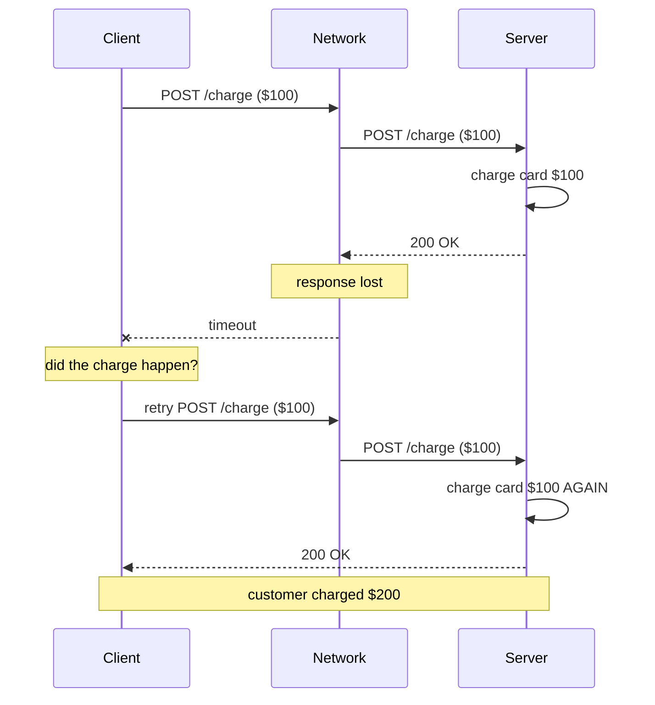
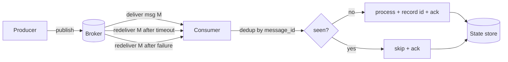
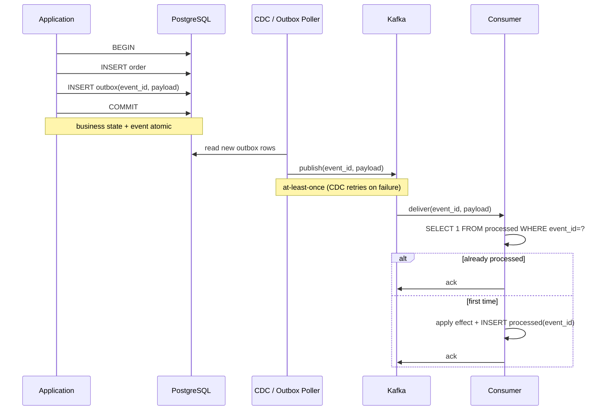

# Idempotency and Exactly-Once Semantics — Why Retries Are Safe Only When You Make Them Safe

**Date:** 2026-04-25 | **Updated:** 2026-04-25
**Tags:** `system-design` `communication` `idempotency` `exactly-once` `retries` `distributed-systems`

## Table of Contents

- [Summary](#summary)
- [Why Idempotency Is the Default Requirement](#why-idempotency-is-the-default-requirement)
- [Idempotency Defined](#idempotency-defined)
- [Naturally Idempotent Operations](#naturally-idempotent-operations)
- [Idempotency Keys](#idempotency-keys)
- [Server-Side Implementation](#server-side-implementation)
  - [The Storage Schema](#the-storage-schema)
  - [The Concurrency Problem](#the-concurrency-problem)
  - [TTL and Retention](#ttl-and-retention)
- [Stripe-Style Idempotency](#stripe-style-idempotency)
- [The Lie of "Exactly-Once" Delivery](#the-lie-of-exactly-once-delivery)
- [Effectively-Once / Once-Delivery](#effectively-once--once-delivery)
- [Kafka EOS (Exactly-Once Semantics)](#kafka-eos-exactly-once-semantics)
- [Outbox Pattern + Idempotent Consumer](#outbox-pattern--idempotent-consumer)
- [Dedup Windows](#dedup-windows)
- [Where to Put the Dedup](#where-to-put-the-dedup)
- [Hashes for Content Idempotency](#hashes-for-content-idempotency)
- [Anti-Patterns](#anti-patterns)
- [Related](#related)
- [References](#references)

## Summary

Networks fail. Clients retry. Brokers redeliver. Without **idempotency**, every retry risks double-charging a card, double-shipping an order, or double-publishing an event. The phrase "exactly-once delivery" is a marketing lie — the [Two Generals' Problem](https://en.wikipedia.org/wiki/Two_Generals%27_Problem) proves you cannot guarantee a message is delivered exactly once over an unreliable channel. What you can build is **exactly-once *effect***: at-least-once delivery combined with idempotent processing. This doc walks through idempotency keys, server-side dedup tables, Kafka's transactional EOS, the outbox pattern, and the anti-patterns that quietly break correctness in production.

## Why Idempotency Is the Default Requirement

Every distributed call has three possible outcomes from the client's perspective:

1. **Success** — request reached the server, server processed it, response reached the client
2. **Failure before processing** — request never reached the server (TCP RST, connection refused, DNS failure)
3. **Ambiguous** — server may or may not have processed the request; the client got a timeout, network partition, or 5xx with no body

Case 3 is the dangerous one. The client *cannot tell* whether the operation happened. Two paths exist:

- **Don't retry** → if the server failed before processing, the operation is lost
- **Retry** → if the server already processed it, the operation runs twice



The only correct answer is: **make the operation idempotent so retry is always safe**. Then the client policy collapses to "retry until success or non-retryable error", and the server guarantees the side effect happens at most once.

## Idempotency Defined

Mathematically: a function `f` is idempotent when `f(f(x)) = f(x)`. Applying it twice produces the same result as applying it once.

For HTTP and RPC, the practical definition is broader:

> An operation is **idempotent** if repeating it any number of times has the same observable effect on the system as performing it once.

Important nuances:

- "Same observable effect" — *not* "the operation runs once and then becomes a no-op". Some implementations re-execute and reach the same state; others short-circuit to a cached response. Both are idempotent.
- Idempotent ≠ same response body. A second `DELETE /users/42` may legitimately return `404 Not Found` instead of `204 No Content`. The *server state* is what must be invariant.
- Idempotent ≠ commutative. `set(x = 5)` is idempotent. `add(x, 5)` is not.

The contrast with safe and idempotent in [RFC 9110 §9.2](https://www.rfc-editor.org/rfc/rfc9110.html#section-9.2):

| Property | Meaning | HTTP methods |
|---------|---------|-------------|
| **Safe** | No state change at all | GET, HEAD, OPTIONS |
| **Idempotent** | Repeated calls have same effect as one | GET, HEAD, OPTIONS, **PUT**, **DELETE** |
| Neither | Each call may change state differently | **POST**, PATCH (in general) |

## Naturally Idempotent Operations

Some operations are idempotent by their semantics:

- **PUT** — "make the resource have this exact representation". Re-sending the same PUT lands in the same final state.
- **DELETE** — "make this resource not exist". After the first call, the resource is gone; subsequent calls have nothing to remove.
- **Upsert** (`INSERT ... ON CONFLICT DO UPDATE`) — converges on the target row regardless of how many times it runs.
- **Setters** (`set_status('paid')`) — assignment, not accumulation.

Operations that are *not* naturally idempotent and need engineering effort:

- **POST /orders** — each call creates a new order
- **POST /charges** — each call moves money
- **INSERT** — each call adds a row
- **Counter increments** — `balance += amount` accumulates per call
- **Email sends, push notifications, webhooks** — each call has external side effects

A "carefully designed POST" can be made idempotent, but it does not happen by accident. You must add an idempotency key, deduplicate on the server, and decide what to return on replay.

## Idempotency Keys

The standard pattern: the **client** generates a unique key per logical operation and sends it as a header. The **server** stores that key alongside the result. On replay (same key), the server returns the cached result without re-executing the side effect.

```http
POST /v1/charges HTTP/1.1
Idempotency-Key: 7c3a91f0-2b4d-4f1c-9e8a-5d2c6b8e1a0f
Content-Type: application/json

{"amount": 1000, "currency": "usd", "source": "tok_visa"}
```

Properties of a good idempotency key:

- **Client-supplied** — only the client knows whether two requests are "the same logical operation". Server-generated request IDs don't help: the server sees two distinct requests after a retry, since the client retries are separate HTTP exchanges.
- **Unique per intent** — a UUIDv4 generated *once* before the first attempt, reused for every retry of the same logical operation.
- **Opaque** — the server treats it as a string, not a structured value.
- **Bounded length** — typically 255 chars; reject longer to prevent abuse.

Critical client-side rule: do **not** generate a fresh UUID per HTTP attempt. The whole point is that retries share the same key.

```ts
// TypeScript — client-side retry with shared idempotency key
import { randomUUID } from "node:crypto";

async function chargeWithRetry(payload: ChargePayload): Promise<Charge> {
  const idempotencyKey = randomUUID(); // generated ONCE per logical charge

  for (let attempt = 0; attempt < 5; attempt++) {
    try {
      const res = await fetch("https://api.example.com/v1/charges", {
        method: "POST",
        headers: {
          "Content-Type": "application/json",
          "Idempotency-Key": idempotencyKey, // reused on every retry
        },
        body: JSON.stringify(payload),
      });
      if (res.ok) return res.json();
      if (res.status >= 400 && res.status < 500) throw new ClientError(res);
      // 5xx: retryable
    } catch (err) {
      if (!isRetryable(err)) throw err;
    }
    await sleep(backoff(attempt)); // exponential backoff with jitter
  }
  throw new Error("max retries exceeded");
}
```

## Server-Side Implementation

### The Storage Schema

A dedup table keyed by the idempotency key, scoped to the resource type and (typically) the API key or tenant.

```sql
CREATE TABLE idempotency_records (
  idempotency_key   TEXT        NOT NULL,
  api_key_id        UUID        NOT NULL,
  request_method    TEXT        NOT NULL,
  request_path      TEXT        NOT NULL,
  request_hash      BYTEA       NOT NULL, -- sha256(canonical body)
  response_status   INT,
  response_body     JSONB,
  status            TEXT        NOT NULL, -- 'in_progress' | 'completed'
  created_at        TIMESTAMPTZ NOT NULL DEFAULT now(),
  completed_at      TIMESTAMPTZ,
  expires_at        TIMESTAMPTZ NOT NULL,
  PRIMARY KEY (api_key_id, idempotency_key)
);

CREATE INDEX idx_idem_expires ON idempotency_records (expires_at);
```

Core flow on every request that carries an `Idempotency-Key`:

1. **Try to insert** a row with `status = 'in_progress'` and a hash of the request body.
2. **If insert succeeds** → this is the first attempt; execute the operation, then update the row with the response and `status = 'completed'`.
3. **If insert fails (unique violation)** → key already exists. Read the row:
   - If `status = 'completed'` and `request_hash` matches → return the stored response.
   - If `request_hash` does *not* match → return `422 Unprocessable Entity` (key reused with different body — a client bug).
   - If `status = 'in_progress'` → another request is processing concurrently; return `409 Conflict` and let the client retry, or block briefly on the lock.

```java
// Java/Spring — outline of an idempotency interceptor
@Transactional
public ResponseEntity<?> handleIdempotent(HttpServletRequest req,
                                          String idemKey,
                                          Supplier<ResponseEntity<?>> handler) {
  byte[] bodyHash = sha256(canonicalize(req.getInputStream()));

  IdempotencyRecord record = new IdempotencyRecord(
      apiKeyId(req), idemKey, req.getMethod(), req.getRequestURI(),
      bodyHash, "in_progress", Instant.now().plus(Duration.ofHours(24))
  );

  try {
    repo.insertNew(record); // throws on PK conflict
  } catch (DuplicateKeyException dup) {
    IdempotencyRecord existing = repo.findFor(apiKeyId(req), idemKey);
    if (!Arrays.equals(existing.requestHash(), bodyHash)) {
      return ResponseEntity.status(422).body(Map.of("error", "idempotency_key_reused"));
    }
    if ("completed".equals(existing.status())) {
      return ResponseEntity
          .status(existing.responseStatus())
          .body(existing.responseBody());
    }
    return ResponseEntity.status(409).body(Map.of("error", "in_progress"));
  }

  ResponseEntity<?> response = handler.get(); // execute the real operation
  repo.markCompleted(apiKeyId(req), idemKey, response);
  return response;
}
```

### The Concurrency Problem

Two simultaneous retries with the same key arrive at distinct workers. Both try to execute the operation. You need exactly one to win.

Options, in increasing strength:

1. **Atomic INSERT as the lock** — the unique-key constraint serializes them. Whichever worker inserts first executes; the other sees the conflict and waits or replays the cached result. This is the simplest and usually sufficient.
2. **Row-level lock with `SELECT ... FOR UPDATE`** — after the insert, lock the row through the operation so a second worker that bypasses the insert cannot proceed.
3. **Distributed lock** (Redis, ZooKeeper) — needed only when the operation crosses transaction boundaries.

Status transitions matter. A worker that crashes mid-operation leaves a row in `in_progress`. Recovery options:

- **Stale lock timeout** — if `created_at + lock_timeout < now()`, treat as abandoned and retry.
- **Wait + return 409** — let the client back off and retry; eventually the original request completes or the timeout claims it.

### TTL and Retention

Idempotency keys must expire. Without TTL the table grows unbounded.

| Window | Trade-off |
|--------|-----------|
| 24 hours (Stripe) | Long enough for client retries through extended outages |
| 7 days | Common for webhook receivers |
| 1 hour | Aggressive; only works when client retry budgets are short |

Store `expires_at` per row; sweep with a background job. Keep the window long enough to outlast any sane client retry policy.

## Stripe-Style Idempotency

Stripe's API is the canonical reference design. Their behavior, from the [Stripe API docs](https://stripe.com/docs/api/idempotent_requests):

- Optional `Idempotency-Key` header; client-generated UUID is recommended.
- Server stores the key for **24 hours**, scoped per API key.
- On replay with **same body** → returns the original response, including the original status code.
- On replay with **different body** → `400 Bad Request` with an idempotency error.
- Keys work for `POST` only — `GET`/`PUT`/`DELETE` are already safe or naturally idempotent.
- Concurrent requests with the same key block until the first one finishes, then return the cached response.

Operationally, this means:

```bash
curl https://api.stripe.com/v1/charges \
  -u "sk_test_xxx:" \
  -H "Idempotency-Key: 7c3a91f0-2b4d-4f1c-9e8a-5d2c6b8e1a0f" \
  -d amount=2000 -d currency=usd -d source=tok_visa
```

Whatever happens after the request leaves the client — TCP reset, gateway timeout, 502, ELB drain — the client can hammer the same key and get the same charge, never a duplicate.

## The Lie of "Exactly-Once" Delivery

Vendors love the phrase "exactly-once delivery". It is, strictly speaking, impossible.

The [Two Generals' Problem](https://en.wikipedia.org/wiki/Two_Generals%27_Problem): two generals on opposite hills must agree on attack time, communicating only by messengers that can be captured. No finite message protocol guarantees both armies attack simultaneously. The proof generalizes: over an unreliable channel, the sender cannot know whether its message arrived without an ack, and the ack is itself a message that may be lost. Any attempt to bound the protocol terminates in uncertainty.

The practical consequence:

- **Sender doesn't know if receiver got it** → sender either retries (risk: duplicate) or doesn't (risk: loss).
- **Receiver doesn't know if its ack arrived** → same dilemma.

So the only honest choices for delivery semantics are:

| Semantic | Behavior | Common in |
|----------|----------|-----------|
| **At-most-once** | Send and forget; possible loss, no duplicates | Fire-and-forget UDP, fire-and-forget logging |
| **At-least-once** | Retry until acked; possible duplicates, no loss | Most message brokers, HTTP retries, RPC frameworks |
| ~~Exactly-once~~ | Impossible at the wire level | Marketing slides |

What is *not* impossible is **exactly-once effect** at the application layer: receive the same message N times, apply its effect once. That is what idempotency provides.

## Effectively-Once / Once-Delivery

The honest framing favored by practitioners:

> **at-least-once delivery + idempotent consumer = effectively-once processing**



The consumer keeps a record of every `message_id` it has processed (or hashes of payloads). When a duplicate arrives, the consumer recognizes it, skips re-processing, and acks. The broker's at-least-once guarantee combined with the consumer's idempotent dedup gives a system in which each effect happens exactly once even though the wire sees redeliveries.

This pattern dominates real-world systems: SQS, RabbitMQ, NATS JetStream at-least-once, Kafka with manual offsets, webhooks. None deliver exactly-once at the wire; all rely on the consumer to dedup.

## Kafka EOS (Exactly-Once Semantics)

Kafka markets "exactly-once semantics" since 0.11. The honest description of what it actually provides:

1. **Idempotent producer** (`enable.idempotence=true`) — the broker assigns each producer a Producer ID and tracks per-partition sequence numbers. If the producer retries a send (network blip, broker leader change), the broker dedups by sequence number. The result: producer retries do not create duplicate messages within a single partition.

2. **Transactional writes** (`transactional.id`) — a producer can atomically write to multiple partitions and (crucially) commit consumer offsets in the same transaction. Either everything in the transaction is visible to read-committed consumers, or nothing is.

3. **`isolation.level=read_committed`** — consumers configured this way skip aborted transactional records.

These together let you build a **read–process–write** pipeline (consume from topic A, transform, produce to topic B, commit A's offsets) that is exactly-once *within Kafka boundaries*. The committed offset and the produced record are atomic; if the worker crashes, on restart it reprocesses from the committed offset and the previously-aborted writes are invisible.

What Kafka EOS does **not** give you:

- **Exactly-once across systems** — the moment your pipeline writes to PostgreSQL, S3, an HTTP API, or anything outside Kafka, EOS no longer covers you. You're back to at-least-once and need an idempotent sink.
- **Exactly-once for non-Kafka producers** — SDK guarantees only apply within the Kafka client.
- **Exactly-once for consumers reading raw bytes** — only consumers using `read_committed` and the consumer-offset-as-part-of-transaction pattern get the property.

```properties
# Kafka producer config for EOS
enable.idempotence=true
acks=all
transactional.id=payments-processor-1
max.in.flight.requests.per.connection=5
```

```java
producer.initTransactions();
try {
  producer.beginTransaction();
  for (ConsumerRecord<String, Order> in : poll()) {
    Charge charge = process(in.value());
    producer.send(new ProducerRecord<>("charges", charge));
  }
  producer.sendOffsetsToTransaction(currentOffsets, consumerGroupMetadata);
  producer.commitTransaction();
} catch (ProducerFencedException e) {
  producer.close(); // another instance with same transactional.id took over
} catch (KafkaException e) {
  producer.abortTransaction();
}
```

See the [Confluent EOS deep-dive](https://www.confluent.io/blog/exactly-once-semantics-are-possible-heres-how-apache-kafka-does-it/) for the protocol details.

## Outbox Pattern + Idempotent Consumer

The canonical recipe for **effectively-once** across a database and a message broker:



The pieces:

- **Atomic write** — the application writes the business row and the outbox row in the same transaction. No event escapes without the state change, and no state change escapes without the event.
- **At-least-once publish** — a CDC tool (Debezium) or polling worker reads the outbox and publishes to Kafka. Crashes cause republishes; that is acceptable.
- **Idempotent consumer** — the consumer dedups by `event_id` against a `processed_events` table, applying the side effect at most once.

Net result: regardless of failures in any stage, the effect downstream happens exactly once. See [change-data-capture.md](change-data-capture.md) for the full pattern.

## Dedup Windows

The dedup table cannot grow forever. You have to bound it.

**Time-bounded keys** — every entry carries `expires_at`. A background job deletes expired rows. The window must exceed the longest plausible retry interval:

| Window | Suitable for |
|--------|--------------|
| Minutes | High-volume streaming; tolerable to miss old duplicates |
| Hours | Typical API idempotency keys (Stripe: 24h) |
| Days–Weeks | Webhook receivers, payment reconciliation |

**Probabilistic dedup at scale** — when keeping every key is infeasible (millions per second), use a Bloom filter or a Cuckoo filter:

- A [Bloom filter](https://en.wikipedia.org/wiki/Bloom_filter) gives `definitely not seen` or `probably seen`. False positives mean rare drops of legitimate first-time messages.
- A Cuckoo filter additionally supports deletion.
- Pair with a small exact LRU cache for recent keys; fall back to the filter for older history.

**Hash-based content dedup** — for content-addressable systems (event sourcing, S3-style stores), the message ID *is* the content hash. Two writes of the same content collide on the same key.

## Where to Put the Dedup

Three legitimate places, with different trade-offs:

| Location | Pros | Cons |
|----------|------|------|
| **API edge** (gateway, ingress) | Simple, language-agnostic, fast rejection of duplicates | Edge needs durable storage; keys not visible to backend; loses request context |
| **At the DB write** (UNIQUE constraint, conditional INSERT) | Strongest guarantee — DB is the source of truth | Database does the work; needs careful schema; conflict response must be readable |
| **At the consumer / worker** | Natural fit for queue-driven workloads; supports per-consumer dedup tables | Must persist `processed_events` separately; complicates exactly-once with external sinks |

A common production layout combines two layers:

1. **API edge** rejects obvious duplicates without touching the database (cheap).
2. **DB write** uses a UNIQUE index on the natural business key (`order_number`, `external_payment_id`) as a final defense.

The DB-level constraint is the **only** guarantee that survives bugs in the application layer. Always have one if the operation has external visibility.

## Hashes for Content Idempotency

When the message has no natural ID — webhooks from a third party, raw event streams — derive one from the content.

```ts
import { createHash } from "node:crypto";

function eventId(event: WebhookPayload): string {
  // Canonicalize: stable key order, no whitespace
  const canonical = JSON.stringify(event, Object.keys(event).sort());
  return createHash("sha256").update(canonical).digest("hex");
}
```

Many providers ship a content hash for you:

- **GitHub webhooks** include `X-GitHub-Delivery` (UUID) and the raw payload signature.
- **Stripe webhooks** include `Stripe-Signature` and the event ID `evt_...`.
- **AWS SNS messages** include `MessageId` and `Timestamp`.

Trust the provider's ID when present; derive a hash only as fallback. Watch out for:

- **Re-encoded payloads** — a proxy that re-serializes JSON changes the byte layout and breaks hashing. Hash the raw body before any deserialization.
- **Whitespace and key order** — JSON canonicalization ([RFC 8785 JCS](https://www.rfc-editor.org/rfc/rfc8785) is the formal answer) prevents two semantically-identical payloads producing different hashes.

## Anti-Patterns

**Assuming retries are safe without idempotency.** A retry library wrapping `POST /charges` with no idempotency key will eventually double-charge a customer. Retry libraries should refuse to retry non-idempotent methods unless the caller explicitly opts in *and* configures a key.

**Idempotency keys without TTL.** The dedup table grows forever, queries get slower, the index bloats. Always set `expires_at` and sweep.

**Forgetting that exactly-once across two systems is impossible without 2PC.** Writing to PostgreSQL and publishing to Kafka in two separate operations cannot be made atomic without a distributed transaction (XA, two-phase commit) — and 2PC has its own coordinator-failure pathologies. The practical answer is the [outbox pattern](#outbox-pattern--idempotent-consumer), not chasing impossible guarantees.

**Idempotent reads but non-idempotent side effects.** A handler that reads cleanly on retry but emits a webhook every time is *not* idempotent. The visible effect (the outbound webhook) is the operation that matters. Audit every external call inside a handler.

**Reusing keys for different operations.** A client that recycles `Idempotency-Key: order-42` across distinct charges will get cached responses for the wrong charge. Keys must be per-intent, not per-resource. Servers should enforce by hashing the request body and rejecting key reuse with mismatched hashes (`422`).

**Trusting "exactly-once" as a wire guarantee.** Documentation that says "exactly-once delivery" almost always means "at-least-once delivery with cooperating producer/consumer dedup". Read the fine print — Kafka EOS is bounded to Kafka, SQS FIFO dedup window is 5 minutes, etc.

**Putting dedup only in the application layer.** The day the application layer has a bug — a missing dedup check on a new endpoint — duplicates leak to the database. A UNIQUE constraint on the natural business key is cheap insurance.

**Generating a new idempotency key per HTTP attempt.** This defeats the entire mechanism. The key must be generated once per logical operation and reused across every retry of *that* operation.

**Storing the response body forever.** Cached responses are large; combined with no TTL this turns the dedup table into a slow, expensive log of every API call ever made. Bound by time, not by row count.

## Related

- [Distributed Transactions and Two-Phase Commit](../data-consistency/distributed-transactions.md) — why exactly-once across systems is so expensive
- [Change Data Capture and the Outbox Pattern](change-data-capture.md) — the canonical effectively-once recipe
- [Dead Letter Queues and Retry Strategies](dead-letter-queues-and-retries.md) — what to do when even idempotent retries keep failing
- [Message Queues and Brokers](message-queues-and-brokers.md) — at-least-once delivery semantics across SQS, RabbitMQ, Kafka, NATS

## References

- [Stripe API — Idempotent Requests](https://stripe.com/docs/api/idempotent_requests) — canonical reference design for HTTP idempotency keys
- [AWS Lambda Powertools — Idempotency](https://docs.powertools.aws.dev/lambda/python/latest/utilities/idempotency/) — production-grade idempotency utility for serverless workloads
- [Confluent — Exactly-Once Semantics Are Possible: Here's How Apache Kafka Does It](https://www.confluent.io/blog/exactly-once-semantics-are-possible-heres-how-apache-kafka-does-it/) — protocol-level deep dive on Kafka EOS
- [Pat Helland — Idempotence Is Not a Medical Condition](https://queue.acm.org/detail.cfm?id=2187821) — ACM Queue article on idempotence as the foundation for reliable distributed systems
- [RFC 9110 §9.2 — HTTP Semantics: Idempotent Methods](https://www.rfc-editor.org/rfc/rfc9110.html#section-9.2) — formal HTTP definition of idempotency
- [Two Generals' Problem (Wikipedia)](https://en.wikipedia.org/wiki/Two_Generals%27_Problem) — proof that exactly-once delivery over an unreliable channel is impossible
- [Apache Kafka Documentation — Transactions](https://kafka.apache.org/documentation/#semantics) — official description of producer idempotence and transactional semantics
- [Microsoft Azure — Idempotency Patterns](https://learn.microsoft.com/en-us/azure/architecture/patterns/idempotent-receiver) — receiver-side idempotency patterns for cloud workloads
