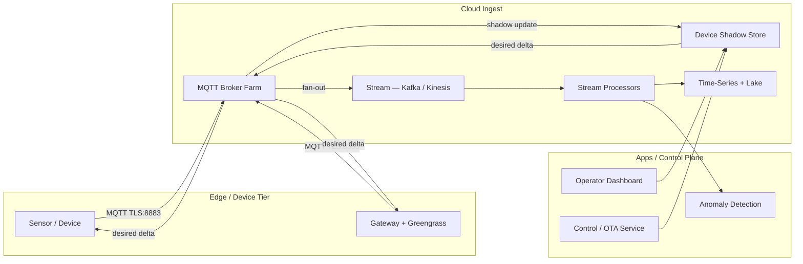
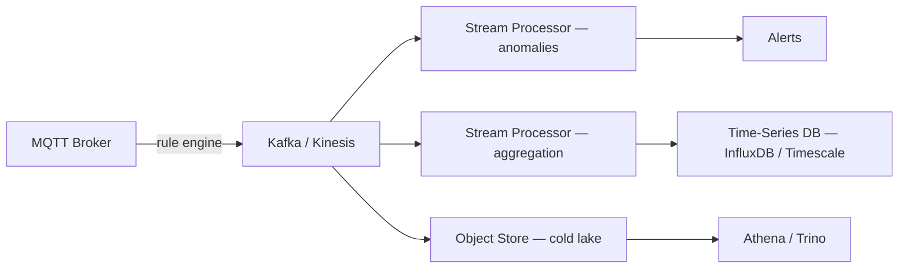

# IoT & Edge Computing Ingest — MQTT, Massive Connection Multiplexing, and Device Shadows

**Date:** 2026-05-02 | **Updated:** 2026-05-02
**Tags:** `system-design` `iot` `edge` `mqtt` `ingest`

## Table of Contents

- [Summary](#summary)
- [Overview — The IoT Ingest Pipeline](#overview--the-iot-ingest-pipeline)
- [IoT Scale and the Connection Problem](#iot-scale-and-the-connection-problem)
- [MQTT 3.1.1 and 5.0 — The Default Protocol](#mqtt-311-and-50--the-default-protocol)
- [MQTT vs HTTP — Why Persistent Connections Win for Devices](#mqtt-vs-http--why-persistent-connections-win-for-devices)
- [Connection Multiplexing on the Broker](#connection-multiplexing-on-the-broker)
- [Managed Brokers and Self-Hosted Options](#managed-brokers-and-self-hosted-options)
- [Device Shadows / Twins — Authoritative Cloud State](#device-shadows--twins--authoritative-cloud-state)
- [Authentication — mTLS, JWT, SigV4](#authentication--mtls-jwt-sigv4)
- [Authorization — Per-Topic ACLs and Policies](#authorization--per-topic-acls-and-policies)
- [Ingestion Fan-Out — Broker → Stream → Storage](#ingestion-fan-out--broker--stream--storage)
- [Edge Processing — Greengrass, IoT Edge, K3s](#edge-processing--greengrass-iot-edge-k3s)
- [Protocol Alternatives — CoAP, AMQP, LwM2M, OPC-UA](#protocol-alternatives--coap-amqp-lwm2m-opc-ua)
- [Backpressure When the Fleet Outpaces the Backend](#backpressure-when-the-fleet-outpaces-the-backend)
- [Firmware OTA Updates](#firmware-ota-updates)
- [Worked Example — 1M Device Fleet at 1 msg/min](#worked-example--1m-device-fleet-at-1-msgmin)
- [Anti-Patterns](#anti-patterns)
- [Related](#related)
- [References](#references)

## Summary

IoT ingest is a different shape of distributed system from typical web backends. Where a web service handles bursty short-lived HTTP requests measured in the thousands per second, an IoT backend holds **hundreds of thousands to tens of millions of long-lived TCP connections**, most of them idle most of the time, with bursty publishes from devices that may have flaky cellular or LPWAN links.

The defining pattern is **MQTT** (OASIS standard), a publish-subscribe protocol designed in 1999 for SCADA over satellite, with persistent connections, ~2-byte headers, three QoS levels, and last-will-and-testament for unclean disconnects. The defining backend abstraction is the **Device Shadow** (AWS) or **Device Twin** (Azure) — a cloud-side JSON document that represents authoritative `desired` and `reported` state, decoupling control-plane writers from devices that may be offline for hours.

This doc walks the full ingest path: how brokers multiplex millions of file descriptors using `epoll` and `kqueue`, why managed services bill per connection-minute, how shadows reconcile drift, and how a typical 1M-device fleet sizes its broker farm and Kafka cluster.

## Overview — The IoT Ingest Pipeline



Two flows matter:

1. **Telemetry up (`reported`):** device → broker → stream → analytics. High volume, fire-and-forget at QoS 0 or QoS 1.
2. **Control down (`desired`):** operator → shadow → broker → device. Low volume, must be durable across device offline windows.

Everything else — auth, ACLs, OTA, edge compute — exists to make those two flows safe at fleet scale.

## IoT Scale and the Connection Problem

The numbers that make IoT different from a web backend:

| Dimension | Typical web service | Typical IoT fleet |
|----------|---------------------|-------------------|
| Concurrent connections | 1k–50k | 100k–10M |
| Connection lifetime | Seconds | Hours–weeks |
| Bytes per message | KB–MB (HTML, JSON) | 50 B–2 KB |
| Idle ratio | Low (request driven) | High (devices mostly silent) |
| Network reliability | Datacenter-grade | Cellular, LPWAN, satellite |
| Reconnect storms | Rare | Common (after outage, the whole fleet reconnects) |

The constraint that flips the architecture is **connection lifetime**. A web load balancer terminating 100k req/sec only ever has a few thousand TCP sessions in flight at once because each one ends in milliseconds. An MQTT broker holding 1M devices keeps 1M sockets open simultaneously, each consuming a file descriptor, ~10 KB of kernel memory, and a slot in whatever I/O multiplexer the broker uses. That is the problem you are paying brokers to solve.

Reconnect storms are the second constraint. If a regional ISP blip drops 200k devices, they will all retry within seconds, and a naive backend will collapse under the simultaneous TLS handshakes. Production deployments use jittered backoff in device firmware **plus** broker-side connection rate limiting.

## MQTT 3.1.1 and 5.0 — The Default Protocol

MQTT (Message Queuing Telemetry Transport) is an OASIS standard. **3.1.1** (2014) is the workhorse; **5.0** (2019) adds modern semantics but is not yet universal.

Core protocol primitives:

- **Topics:** hierarchical, slash-delimited strings (`fleet/region-eu/device-42/temp`). Wildcards are `+` (single level) and `#` (multi-level, must be terminal).
- **Publish/Subscribe:** decoupled. Publishers do not know subscribers. The broker fans out.
- **QoS levels:**
  - **QoS 0 — at most once.** Fire and forget. No ack. Cheapest, used for high-frequency telemetry where loss is acceptable.
  - **QoS 1 — at least once.** Broker acks (`PUBACK`). Subscriber may receive duplicates; handler must be idempotent.
  - **QoS 2 — exactly once.** Four-way handshake (`PUBLISH`, `PUBREC`, `PUBREL`, `PUBCOMP`). Expensive; rarely needed.
- **Retained messages:** the broker keeps the last published message on a topic and delivers it immediately to new subscribers. Used for state ("device is online").
- **Last Will and Testament (LWT):** message the broker publishes on the device's behalf if the connection drops uncleanly. The standard pattern for "device went offline" notifications.
- **Persistent sessions (`Clean Session = false`):** the broker queues messages for an offline subscriber and replays them on reconnect.
- **Keepalive:** client sends `PINGREQ` at an interval (typically 60s); broker considers the session dead after 1.5× keepalive without traffic.

MQTT 5.0 adds: user properties (key-value metadata), reason codes on every ack, message expiry, shared subscriptions (load-balance across subscriber group like Kafka consumer groups), topic aliases (replace long topic strings with short numeric IDs), and flow control. If you can choose, choose 5.0; if you are integrating with constrained devices or older brokers, expect 3.1.1.

A minimal CONNECT/PUBLISH on the wire:

```text
CONNECT  (14 bytes header + payload):
  ProtocolName: "MQTT", Level: 4 (3.1.1)
  ClientId: "device-42"
  KeepAlive: 60 s
  CleanSession: false

PUBLISH  (2-byte fixed header + variable):
  Topic: "fleet/eu/device-42/temp"
  QoS: 1, PacketId: 7
  Payload: {"c":21.4,"t":1714627200}
```

The 2-byte fixed header is what makes MQTT cheap. HTTP/1.1 would spend hundreds of bytes on headers for the same payload.

## MQTT vs HTTP — Why Persistent Connections Win for Devices

You _can_ ship telemetry over HTTP POST. People do. It is almost always wrong at fleet scale.

| Concern | HTTP polling / POST | MQTT persistent |
|---------|---------------------|-----------------|
| Bytes per message | ~500 B headers + payload | 2 B header + payload |
| Round trips for downlink | Device must poll | Server pushes immediately |
| Battery cost | TLS + TCP handshake every send | One handshake, reuse |
| Tail latency for downlink | Bounded by poll interval | < 100 ms |
| Server complexity | Stateless, scales easily | Stateful, harder to scale |
| Connection count | Low (transient) | High (persistent) |

The killer issue is **downlink**. If a control-plane operator wants to send "set thermostat to 22 °C" to a battery-powered device, an HTTP-only protocol forces the device to poll. Polling every 10 seconds drains the battery in days; polling every hour is unusable for control. MQTT solves this by keeping the TCP socket open: the broker pushes the message the instant the operator writes the desired state.

The cost is that the broker is now a **stateful, long-lived service**. You cannot scale it by adding stateless replicas behind a round-robin LB; you have to shard by client ID and route reconnects back to the right node, or use a clustered broker that gossips session state.

## Connection Multiplexing on the Broker

A broker holding 1M concurrent TLS sockets is mostly a kernel I/O problem.

- **Linux: `epoll`.** O(1) readiness notifications. The broker registers all sockets once and the kernel returns only the ones with data ready. Without `epoll` (or the older `select`/`poll`), 1M sockets is impossible — `select` is O(n) per scan.
- **BSD/macOS: `kqueue`.** Equivalent abstraction.
- **File descriptor budget.** Each TCP connection is one file descriptor. Linux per-process default is 1024 (`ulimit -n`); production brokers raise it to several million via `LimitNOFILE` in systemd and `fs.nr_open` in sysctl.
- **Memory per connection.** ~10–40 KB kernel-side (socket buffers, struct sock) plus broker-side state (subscription table, in-flight QoS queue). 1M connections is therefore ~40 GB of RAM at minimum.
- **TLS overhead.** Session caching (RFC 5077) and session tickets are mandatory; otherwise full handshakes during reconnect storms saturate CPU.
- **Keepalive tuning.** Set MQTT keepalive higher (5–15 min) for cellular devices to avoid waking the radio every 60 s. Use TCP `SO_KEEPALIVE` as a backstop, not as the primary heartbeat.

A single well-tuned EMQ X or HiveMQ node can hold 1–2M connections on a 32-core, 128 GB host. AWS IoT Core abstracts this; you pay per connection-minute.

## Managed Brokers and Self-Hosted Options

| Option | Type | Strengths | Notes |
|--------|------|-----------|-------|
| **AWS IoT Core** | Managed | Tight integration with Lambda, Kinesis, Shadows, Jobs, OTA | Per-message and per-connection-minute pricing; rules engine routes inline |
| **Azure IoT Hub** | Managed | Device Twins, Direct Methods, IoT Edge, DPS for provisioning | Strong identity/provisioning story |
| **Google Cloud IoT Core** | **Deprecated 2023** | Was the third major managed offering | Migrate workloads to a partner (ClearBlade, EMQ X) |
| **HiveMQ** | Self-hosted / Cloud | Enterprise MQTT, kernel extensions, MQTT 5 first | Used in connected-car deployments at 10M+ scale |
| **EMQ X** | Self-hosted / Cloud | Erlang/OTP, horizontal scale, MQTT-SN, rule engine | Often chosen for largest self-hosted fleets |
| **Eclipse Mosquitto** | Self-hosted | Lightweight, single-node, C | Good for small fleets, dev, gateways. Not for 1M+ |
| **VerneMQ** | Self-hosted | Erlang, clustered, free | Active community, MQTT 5 support |

If you are building a product, **start with a managed broker** unless you have a specific reason not to (data residency, cost at extreme scale, on-prem deployment). Operating a clustered Erlang or Java broker with millions of stateful connections is an SRE specialty.

## Device Shadows / Twins — Authoritative Cloud State

The hard problem: a device is offline more than it is online. An operator wants to set its configuration _now_, but the device may not check in for hours. You cannot block the operator's API call.

**Device Shadows** (AWS terminology) and **Device Twins** (Azure) solve this by storing the device's state as a JSON document in the cloud:

```json
{
  "state": {
    "desired":  { "tempSetpoint": 22, "fanMode": "auto" },
    "reported": { "tempSetpoint": 20, "fanMode": "auto", "battery": 84 }
  },
  "metadata": { "...": "timestamps per field" },
  "version": 47
}
```

Flow:

1. Operator writes `desired.tempSetpoint = 22` via REST/SDK.
2. Shadow service computes the **delta** between `desired` and `reported` and publishes it on `$aws/things/<id>/shadow/update/delta`.
3. Device, when online, receives the delta, applies it locally, and publishes its new `reported` state.
4. Shadow service reconciles `reported` ← `desired` and resolves the delta.

Properties that matter:

- **Decouples operator from device availability.** The API call is a write to DynamoDB equivalent, not a sync RPC to a sleeping device.
- **Optimistic concurrency via `version`.** Conflicting writes are rejected, not last-write-wins.
- **Shadow is the source of truth.** Operator UIs read the shadow, not the device. The device may be in flight, sleeping, or out of coverage; the shadow is always available.
- **Per-shadow document size limits.** AWS: 8 KB. Use **named shadows** to split state across multiple documents per device (`shadow/name/config`, `shadow/name/diagnostics`).

Azure Device Twins are conceptually identical, with `desired`, `reported`, and `tags` (operator-only metadata not visible to the device).

## Authentication — mTLS, JWT, SigV4

Devices live in the wild — in customer homes, on factory floors, in fields. Assume the firmware can be extracted and the credentials stolen. Defense rests on **per-device identity**, not shared secrets.

- **X.509 mutual TLS** is the default for mid-to-high-end devices. Each device gets a unique client certificate at provisioning. The broker validates the cert chain to a known CA and binds the cert's CN/SAN to the MQTT `ClientId` and policy. Compromise of one device only revokes one cert.
- **JWT** suits constrained devices that cannot afford an X.509 chain in flash. The device signs short-lived JWTs with a private key (often an ECC key in a secure element). Used by Google Cloud IoT (legacy) and many private brokers.
- **AWS SigV4** is used for HTTP-mode IoT data plane and for the AWS IoT control plane. Less common for MQTT.
- **Username/password over TLS** is acceptable only for hobbyist deployments and developer gateways. Do not ship products this way.
- **Certificate revocation.** OCSP and CRLs are operationally painful at fleet scale. Most providers use a **revocation list** they consult on connect; AWS IoT Core lets you deactivate a certificate in milliseconds via the registry.
- **Provisioning.** Bootstrap each device with a short-lived "provisioning claim" cert; on first connect the device exchanges it for its permanent cert. AWS Fleet Provisioning and Azure DPS implement this.

A secure element (TPM, ATECC608, Apple Secure Enclave-equivalent) holding the device private key is the difference between "credentials theft is a per-device problem" and "credentials theft is a fleet-wide problem". Push for hardware where unit economics allow.

## Authorization — Per-Topic ACLs and Policies

Authentication says _who_ the device is. Authorization says _what topics_ it can publish/subscribe to.

The pattern that scales is **template policies parameterized by client ID:**

```json
// AWS IoT policy
{
  "Effect": "Allow",
  "Action": ["iot:Publish"],
  "Resource": [
    "arn:aws:iot:eu-west-1:123:topic/fleet/${iot:Connection.Thing.ThingName}/telemetry"
  ]
}
```

This single policy, attached to every device, allows each device to publish only to its own topic. Without templating you would either (a) issue a per-device policy, or (b) allow `fleet/+/telemetry`, which lets a compromised device impersonate every other device.

ACL anti-patterns to avoid:

- **Wildcard publish at the fleet level.** A single compromised device can poison every shadow.
- **Subscribe to `#` from any device.** Lets a device exfiltrate every neighbor's telemetry.
- **Cross-tenant topic prefixes.** If you are a multi-tenant IoT platform, the tenant ID must be in the topic and pinned by the policy.

Self-hosted brokers (Mosquitto, EMQ X) use ACL files or pluggable backends (Postgres, Redis). Managed brokers wire policies into IAM.

## Ingestion Fan-Out — Broker → Stream → Storage

The broker is not the system of record. It fans out to a streaming backbone:



Why a stream layer:

- **Decouples broker scaling from analytics scaling.** The broker only needs to handle current connections; replay/backfill/analytics happen on Kafka.
- **Buffer for downstream outages.** If the time-series DB is down, Kafka holds the data for days.
- **Fan-out to many consumers.** One firehose, many independent processors with their own offsets.
- **Replay.** A new analytics pipeline can replay last week's data from Kafka without touching the broker.

AWS IoT Core has a built-in **rules engine** that routes MQTT messages to Kinesis, Lambda, DynamoDB, S3, SNS, and more by SQL-like rules. Self-hosted brokers usually publish a Kafka producer plugin (EMQ X, HiveMQ) that does the same.

The size you provision: 1M devices at 1 msg/min = 16.6k msg/sec average, with 3–5× peaks during reconnect storms. That is a small-to-medium Kafka cluster (3 brokers, modest partitions). Bandwidth dominates: at 500 B/msg you get ~8 MB/s ingest, easily handled.

## Edge Processing — Greengrass, IoT Edge, K3s

Not every byte should travel to the cloud. Reasons to compute at the edge:

- **Latency.** Closing a control loop on a CNC machine in 5 ms cannot tolerate a round trip to us-east-1.
- **Bandwidth.** A 4K camera generating 25 Mbps cannot economically stream raw frames; it must run YOLO locally and ship inferences.
- **Offline operation.** A factory must keep producing if the WAN link drops.
- **Privacy / compliance.** GDPR and HIPAA may forbid raw data leaving site.

Edge runtimes:

- **AWS IoT Greengrass.** Runs Lambda functions, Docker containers, ML models, and stream-manager pipelines on edge devices. Syncs shadows even when offline.
- **Azure IoT Edge.** Runs Docker modules, including custom and Microsoft-published modules (Stream Analytics, Custom Vision). Tight integration with Azure IoT Hub.
- **K3s.** Lightweight Kubernetes (~50 MB) for edge fleets that already use Kubernetes operationally. Pair with GitOps (FluxCD, ArgoCD) for fleet-wide deploy.
- **EdgeX Foundry, OpenYurt, KubeEdge.** Other open-source options, varying maturity.

The pattern is the same regardless of runtime: _the device runs a local broker (often Mosquitto or Greengrass core) that aggregates from sensors, runs filters/ML, and only forwards summaries upstream._ The cloud sees one connection per gateway, not one per sensor.

## Protocol Alternatives — CoAP, AMQP, LwM2M, OPC-UA

MQTT is the default but not the only choice.

- **CoAP (RFC 7252).** REST-like over UDP, designed for constrained nodes (8-bit MCUs, sleepy radios). Used heavily in LoRaWAN, Thread, and battery-powered sensor networks. No persistent connection; uses observe (RFC 7641) for server push. Cheaper than MQTT on truly constrained hardware.
- **AMQP 1.0.** Heavier, designed for enterprise messaging. Used in industrial and finance-adjacent IoT (Azure IoT Hub speaks both AMQP and MQTT). Stronger ordering and transaction guarantees than MQTT, larger footprint.
- **LwM2M.** Built on CoAP, adds object/resource model, OTA, and firmware update standards. Common in cellular IoT (LTE-M, NB-IoT) and run by carriers as a managed service.
- **OPC-UA.** Industrial automation standard. Address-space + sub/pub. Speaks to PLCs and SCADA systems on factory floors. OPC-UA-over-MQTT bridges are common.
- **WebSockets.** Browser-friendly tunnel for MQTT (`wss://`). Used when a browser dashboard subscribes to live device data.

Choosing: MQTT for general fleet IoT; CoAP/LwM2M for constrained battery-powered cellular; OPC-UA for industrial; AMQP when you also need enterprise messaging semantics.

## Backpressure When the Fleet Outpaces the Backend

The IoT path has the same backpressure problem as any async pipeline (see [Backpressure](../scalability/backpressure-bulkhead-circuit-breaker.md)) plus two specific gotchas:

1. **Reconnect storms after an outage.** Every device that lost the connection retries simultaneously. Without jittered exponential backoff in firmware, the broker faces a 1M-handshake spike.
2. **Slow consumers downstream.** If Kafka is throttling or the rules engine is rate-limited, the broker has to either (a) drop messages, (b) buffer to disk, or (c) push back on devices via QoS 1 ack delays. None of these are free.

Mitigations that actually work:

- **Firmware-side jittered backoff.** First retry at random(0, 30s), double up to 15 minutes, with full-jitter to spread the herd.
- **Broker-side connection rate limiting.** Cap new connections/sec per source IP and globally.
- **QoS 0 for high-frequency telemetry.** Drop is better than back-pressure when each sample is one of millions.
- **Adaptive sampling on device.** When the device cannot publish, increase sampling interval and aggregate locally.
- **Dead-letter / disk spool.** EMQ X and HiveMQ can spool messages locally if downstream is unavailable.
- **Token-bucket per device.** Cap publish rate per client ID so one chatty device cannot swamp the broker.

## Firmware OTA Updates

Shipping new firmware to a fleet is its own subsystem.

- **A/B partitions.** Device flash is split into two slots. The new image writes to the inactive slot; on boot, the bootloader switches to it. If boot fails, rollback to the other slot. This is the standard pattern (Mender, Rauc, AWS IoT Device Defender, Azure Device Update).
- **Signed images.** Firmware images must be signed by an offline key; the bootloader verifies the signature before flipping the active slot.
- **Staged rollout.** Push to 1% canary → 10% → 100%, with health metrics gating each step. AWS IoT Jobs and Azure Device Update both support staged jobs with abort criteria.
- **Resumable downloads.** Cellular devices may need to download a 50 MB image over a flaky link. Chunked downloads (HTTPS `Range`, MQTT topic-based file streaming) and SHA verification per chunk are non-negotiable.
- **Power-loss resilience.** Flashing must be atomic relative to power-loss; A/B partitions plus a one-write boot pointer are the way.

OTA failures brick devices in the field; a recall is millions of dollars and reputational damage. Test the rollback path in CI on representative hardware before every release.

## Worked Example — 1M Device Fleet at 1 msg/min

Sizing a typical mid-scale IoT backend.

**Inputs:**
- 1,000,000 devices.
- 1 MQTT publish per device per minute.
- Average payload 500 B (JSON).
- 30% reconnect rate per day (firmware reboots, cell handover, power blips).

**Throughput:**
- 1,000,000 / 60 = **16,667 msg/sec** average.
- Peak after a regional outage: 5–10× → **80–160k msg/sec** for a few minutes.
- Bandwidth: 16,667 × 500 B = **8.3 MB/sec** sustained, **80 MB/sec** peak.

**Broker farm (self-hosted EMQ X / HiveMQ):**
- Connection budget: 1M concurrent.
- Per-node capacity: ~1M connections on a c6i.8xlarge (32 vCPU, 64 GB) tuned aggressively, but conservative target is 250–500k per node for headroom.
- Cluster size: **3–4 nodes, plus 1 spare.** Cluster gossip overhead (Erlang) ~5% per node.
- File descriptors: raise `LimitNOFILE` to 2M per node.
- Memory: ~50 GB resident at full load (kernel sockets + Erlang VM + subscription tables).

**Managed (AWS IoT Core):**
- Connection-minutes: 1M × 1440 min/day = 1.44B connect-minutes/day. At ~$0.08 per million → **~$115/day → $3.5k/month** on connections alone.
- Messages: 1M × 1440 = 1.44B msg/day. At ~$1 per million → **~$1.4k/day → $43k/month**. (These numbers move; always re-check current AWS pricing.)
- This is why mid-scale fleets often consider self-hosted EMQ X on EKS — the breakeven is around 500k–1M devices.

**Stream layer (Kafka):**
- 16.6k msg/sec at 500 B = 8.3 MB/s. Tiny by Kafka standards.
- 3-broker cluster (m5.xlarge), 12–24 partitions on the main telemetry topic, 7-day retention = 5 TB.

**Time-series + lake:**
- 1.44B records/day × 500 B = ~720 GB/day raw. Compressed in Timescale or Influx ~150 GB/day. Lake (Parquet on S3) ~50 GB/day after columnar + Snappy.
- 1-year retention raw is impractical; aggregate to 1-min and 1-hour rollups, keep raw 7–30 days.

**Shadow store (DynamoDB or equivalent):**
- 1M items × ~4 KB = 4 GB. Trivial.
- Write rate dominated by control plane (10s of writes/sec, not 16k).

**Network egress:**
- Devices over cellular: ~720 GB/day inbound. Egress to apps depends on dashboard/analytics traffic, typically much smaller.

The takeaways: connection count drives broker sizing, message rate drives Kafka and storage sizing, and managed-vs-self-hosted is a financial decision around the 1M-device mark.

## Anti-Patterns

- **Polling HTTP for downlink commands.** Battery-killing and high-latency. Use MQTT or LwM2M.
- **Allowing devices to subscribe to `#`.** A single compromise exfiltrates the entire fleet's data.
- **Sharing one X.509 cert across all devices.** Compromise of one bricks the whole fleet's security model.
- **Using QoS 2 for high-frequency telemetry.** Four-way handshake at scale wastes broker CPU and bandwidth. Use QoS 1 + idempotent consumers.
- **No jitter in device retry logic.** Reconnect storms become broker outages.
- **Treating the broker as the system of record.** Brokers are not durable archives; fan out to Kafka/Kinesis and a real datastore.
- **Putting megabyte payloads in MQTT messages.** MQTT is not a file-transfer protocol. Use S3-presigned URLs and publish only the URL.
- **Skipping the shadow and writing to the device directly.** Devices go offline. Operators get errors. Always write to the shadow; let the broker reconcile when the device returns.
- **Letting OTA roll out at 100% without canaries.** Bricks fleets. Always stage with abort criteria.
- **Logging device telemetry into a transactional RDBMS as the primary store.** Time-series DBs and columnar lakes exist for a reason.
- **No firmware signing.** A network attacker who breaches the OTA delivery path owns every device.

## Related

- [Sync vs Async Communication](./sync-vs-async-communication.md) — MQTT pub/sub is async at the architecture level
- [Real-Time Channels](./real-time-channels.md) — WebSockets, SSE, and how they compare to MQTT for browser-side push
- [Message Queues and Brokers](../building-blocks/message-queues-and-brokers.md) — broker primitives that show up under MQTT brokers too
- [Backpressure, Bulkhead, Circuit Breaker](../scalability/backpressure-bulkhead-circuit-breaker.md) — taming reconnect storms and slow consumers
- [Authentication](../security/authentication.md) — mTLS, JWT, and the identity primitives this doc relies on

## References

- [MQTT 5.0 OASIS Standard](https://docs.oasis-open.org/mqtt/mqtt/v5.0/mqtt-v5.0.html)
- [MQTT 3.1.1 OASIS Standard](https://docs.oasis-open.org/mqtt/mqtt/v3.1.1/os/mqtt-v3.1.1-os.html)
- [AWS IoT Core Developer Guide](https://docs.aws.amazon.com/iot/latest/developerguide/what-is-aws-iot.html)
- [AWS IoT Device Shadow Service](https://docs.aws.amazon.com/iot/latest/developerguide/iot-device-shadows.html)
- [Azure IoT Hub Concepts](https://learn.microsoft.com/en-us/azure/iot-hub/iot-concepts-and-iot-hub)
- [Eclipse Mosquitto Documentation](https://mosquitto.org/documentation/)
- [EMQ X Documentation](https://www.emqx.io/docs/en/latest/)
- [CoAP — RFC 7252](https://datatracker.ietf.org/doc/html/rfc7252)
