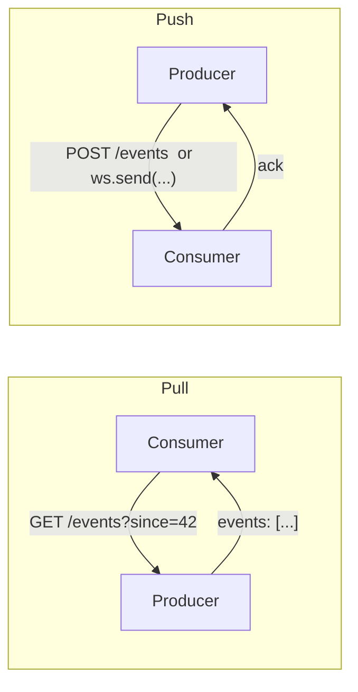
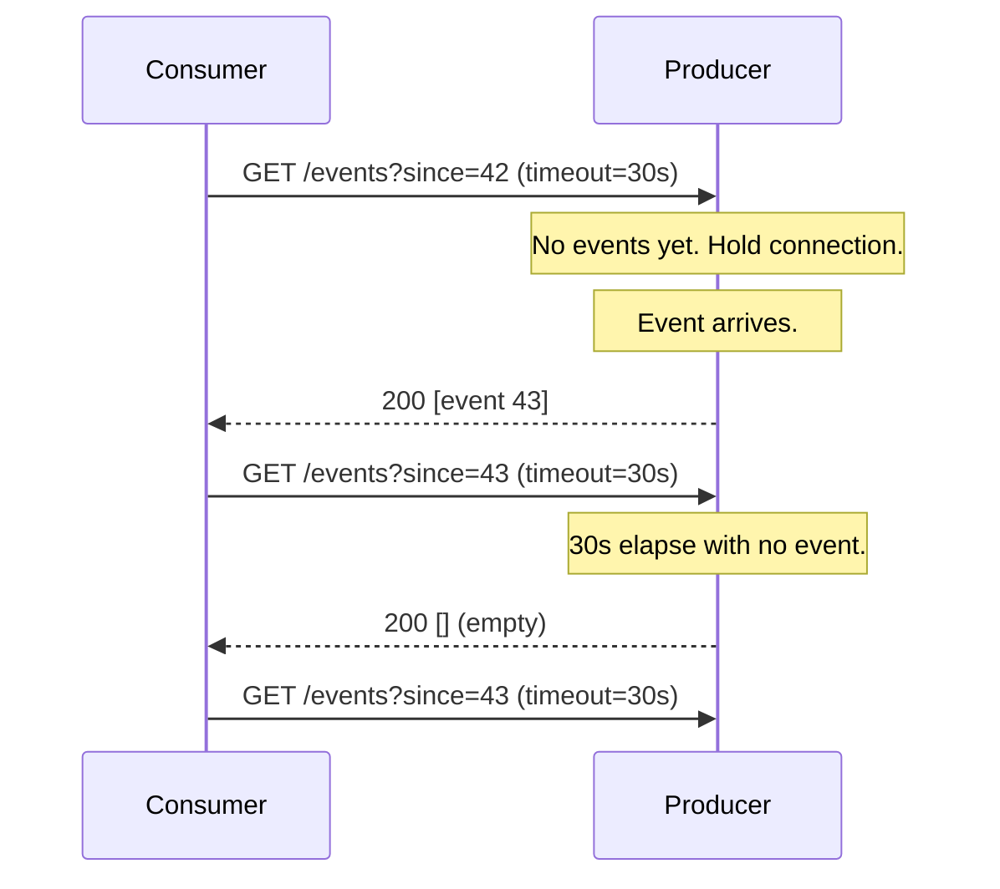
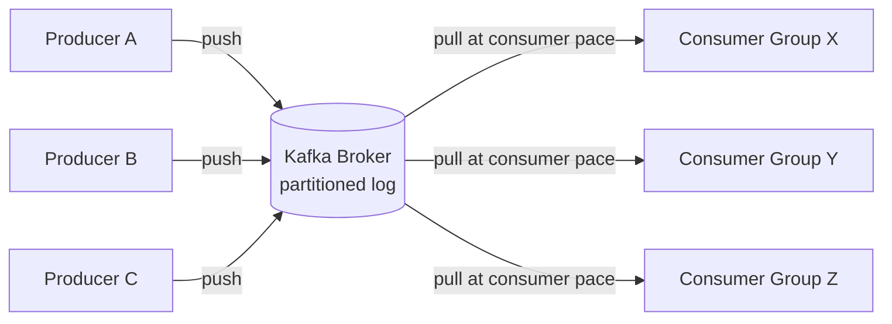

# Push vs Pull Architecture — Who Initiates the Conversation?

**Date:** 2026-04-25 | **Updated:** 2026-04-25
**Tags:** `system-design` `communication` `push` `pull` `fan-out` `feed`

## Table of Contents

- [Summary](#summary)
- [The Fundamental Choice — Who Initiates?](#the-fundamental-choice--who-initiates)
- [Pull (Polling) — Consumer-Driven](#pull-polling--consumer-driven)
- [Push — Producer-Driven](#push--producer-driven)
- [Latency vs Cost Trade-off](#latency-vs-cost-trade-off)
- [Hybrid: Long Polling](#hybrid-long-polling)
- [Hybrid: Pub/Sub with Pull Consumers (Kafka)](#hybrid-pubsub-with-pull-consumers-kafka)
- [The News Feed Problem — Fan-Out on Write vs Read](#the-news-feed-problem--fan-out-on-write-vs-read)
- [Webhook (Push) vs Polling (Pull) for External APIs](#webhook-push-vs-polling-pull-for-external-apis)
- [Backpressure in Push Systems](#backpressure-in-push-systems)
- [Push at Scale](#push-at-scale)
- [Pull at Scale](#pull-at-scale)
- [Failure Modes](#failure-modes)
- [When the Right Answer Is Both](#when-the-right-answer-is-both)
- [Anti-Patterns](#anti-patterns)
- [Related](#related)
- [References](#references)

## Summary

Every distributed communication boils down to one decision: does the **producer push** events to consumers, or do **consumers pull** them from the producer? The choice determines latency, throughput, cost, failure modes, and what kinds of failure you have to engineer around. Pull is simple but introduces a latency floor and amplifies cost with consumer count. Push is low-latency but requires backpressure, retry policies, and connection management. Most production systems end up hybrid: a broker pushes to an in-memory queue, the consumer pulls from the broker; a websocket pushes UI updates, polling kicks in on reconnect; a cache uses TTL plus targeted invalidation. Knowing _why_ each choice is wrong before reaching for the obvious option is what separates "scales" from "looks fine in dev".

## The Fundamental Choice — Who Initiates?

Two endpoints. New data appears at the producer. The consumer needs to learn about it. Someone has to start the conversation.



The shape of the arrow flips. So does almost everything else:

| Dimension | Pull | Push |
|-----------|------|------|
| Initiator | Consumer | Producer |
| Latency floor | Polling interval | Network RTT |
| Wasted work | Empty polls when idle | None when idle |
| Load scales with | Consumer count × poll rate | Event rate × fan-out |
| Connection model | Stateless request/response | Long-lived or callback-based |
| Backpressure | Implicit (consumer paces itself) | Explicit (producer must throttle) |
| Failure mode | Stale data | Lost notifications |
| Discoverability | Consumer needs producer's address | Producer needs consumer's address |

Neither is universally better. The right answer depends on event rate, consumer count, latency budget, and who can afford the cost of "the other case".

## Pull (Polling) — Consumer-Driven

The consumer asks "anything new since X?" on an interval. The producer answers with whatever has arrived since `X`, or nothing.

```ts
// Pseudocode: simple polling loop
let cursor = await readCursor();

setInterval(async () => {
  const res = await fetch(`/events?since=${cursor}`);
  const { events, nextCursor } = await res.json();
  for (const evt of events) {
    await handle(evt);
  }
  cursor = nextCursor;
  await writeCursor(cursor);
}, 5_000);
```

What pull buys you:

- **Simplicity** — plain HTTP request/response, no long-lived connections, no callback URLs to register, no firewall holes
- **Stateless producer** — the producer doesn't track who's listening; it just answers queries
- **Natural backpressure** — a slow consumer simply polls less often; the producer doesn't have to compensate
- **Easy retries** — if a poll fails, just poll again. The cursor advances only on success
- **Crash-safe** — consumer crashes mid-batch? Restart, re-poll from the last persisted cursor

What pull costs you:

- **Latency floor** — if you poll every 5s, the average event waits 2.5s before being seen, worst case ~5s
- **Wasted work** — most polls return empty when events are rare relative to poll rate
- **Load proportional to consumer count, not event rate** — 1000 consumers polling once a second = 1000 RPS regardless of whether anything changed
- **Cursor management** — consumer must persist where it is, handle resume correctly, deal with cursor expiry

Pull wins when events are bursty and unpredictable, latency budgets are loose (seconds, not milliseconds), and you'd rather not run a stateful broker.

## Push — Producer-Driven

The producer notifies the consumer the moment an event happens. The consumer has registered interest somehow — a websocket, an HTTP callback URL, a subscription on a pub/sub bus.

```ts
// Pseudocode: push notification handler (HTTP webhook receiver)
app.post("/webhook/orders", async (req, res) => {
  if (!verifySignature(req.headers["x-signature"], req.rawBody, SECRET)) {
    return res.status(401).end();
  }
  const evt = req.body;
  if (await alreadyProcessed(evt.id)) {
    return res.status(200).end(); // idempotent ack
  }
  await enqueueForProcessing(evt); // hand off fast; do not block the producer
  await markProcessed(evt.id);
  res.status(200).end();
});
```

What push buys you:

- **Low latency** — events arrive within a network RTT
- **No wasted work** — quiet system means quiet network
- **Load proportional to event rate** — idle consumers cost nothing

What push costs you:

- **Connection state** — websockets need keepalives, reconnect logic, sticky routing
- **Backpressure becomes a real problem** — if the consumer can't keep up, the producer must drop, buffer, or block
- **Lost notifications** — a push that fails mid-flight is gone unless you persist + retry; the consumer often has no way to know it missed an event
- **Retry storms** — naive retries against a flapping consumer can amplify a small outage into a self-DDoS
- **Discovery & registration** — producer needs to know where to push; this is a whole subsystem (subscription registry, callback validation)
- **Slow consumers slow the producer** — synchronous push couples the producer's tail latency to the slowest receiver

Push wins when latency matters, events are frequent enough that polling would be wasteful, and you can afford a stateful delivery layer (broker, websocket gateway, webhook relay).

## Latency vs Cost Trade-off

The cost-versus-latency curve is the heart of the decision.

| Event rate vs latency budget | Best fit |
|------------------------------|----------|
| Rare events, loose latency (cron jobs, daily reports) | **Pull** — polling cost is trivial, push infra is overkill |
| Rare events, tight latency (rare alerts, payment confirmations) | **Push** — polling fast enough to catch them is wasteful |
| Frequent events, loose latency (analytics ingest) | **Pull (batched)** — long polls or scheduled pulls amortize fixed costs |
| Frequent events, tight latency (chat, trading, live dashboards) | **Push** — anything else burns CPU on empty polls |

A useful heuristic: if `poll_rate × consumer_count >> event_rate`, you're paying for empty polls and push gets cheaper as scale grows. If `event_rate × fan_out >> poll_rate × consumer_count`, push infrastructure is the budget killer and pull (or batched pull) is the correct answer.

## Hybrid: Long Polling

Long polling is pull semantics with push-like latency. The consumer issues a request; the producer holds the connection open until either (a) an event arrives, or (b) a timeout fires. Either way, the consumer reissues the request.



What it gets you:

- **Stateless-looking from the consumer side** — still HTTP, still request/response, plays nicely with proxies and firewalls
- **Sub-second latency** in the common case
- **Graceful degradation** — under load, the producer can return early with an empty payload and let consumers reconnect

What it costs:

- **Many open connections** on the producer (one per waiting consumer)
- **Complex timeout tuning** — too short and you're back to polling; too long and you tie up sockets

Long polling was the dominant real-time technique before websockets. It's still a sensible fallback when websockets are blocked (corporate proxies, restrictive networks).

## Hybrid: Pub/Sub with Pull Consumers (Kafka)

Apache Kafka is the canonical "the right answer is hybrid" example. The broker is the source of truth; producers push events into the broker; **consumers pull from the broker** at their own pace.



Why this combination is so durable:

- **Producers don't care about consumers** — push to the broker and move on; no fan-out logic in the producer
- **Consumers control their rate** — each consumer pulls when ready; a slow consumer doesn't slow the producer or the broker
- **Backpressure is built in** — slow consumer = lag growing in the broker, observable as a metric, fixable by adding partitions or consumers
- **Replay for free** — the log retains messages; a consumer can reset its offset and re-process
- **Multiple consumer groups, independent positions** — analytics, fraud, search, billing all read the same log at their own pace

The trick is recognising that "push" and "pull" don't have to be the same arrow end-to-end. The broker absorbs the impedance mismatch between the producer's natural cadence and the consumer's processing rate.

[AWS SNS + SQS](https://docs.aws.amazon.com/sns/latest/dg/sns-sqs-as-subscriber.html) does the same thing in a different shape: SNS pushes fan-out, SQS holds the message until the consumer pulls, and a slow consumer just lets the queue grow.

## The News Feed Problem — Fan-Out on Write vs Read

The classic push/pull case study is the social-media timeline. User A posts. User A has N followers. When and where do you do the work of "show this post in each follower's feed"?

```mermaid
graph TB
    subgraph Fan-out on Write (Push)
        W1[Post arrives] --> W2[Look up A's followers]
        W2 --> W3[Insert post id<br/>into N follower inboxes]
        W3 --> W4[Read = O(1) per follower]
    end
    subgraph Fan-out on Read (Pull)
        R1[Follower opens app] --> R2[Look up who they follow]
        R2 --> R3[Query recent posts<br/>from each followee]
        R3 --> R4[Merge & sort in memory]
    end
```

**Fan-out on write (push):**

- Write cost is `O(followers)`
- Read cost is `O(1)` — just read your inbox
- Wins when reads dominate writes, which they do for almost every social feed
- Breaks down for celebrities — a single post fans out to millions of inboxes

**Fan-out on read (pull):**

- Write cost is `O(1)` — just append to your own outbox
- Read cost is `O(followees × posts)` — query every account you follow
- Wins for write-heavy or low-engagement accounts
- Breaks down at scale for active users with many followees

**Hybrid (Twitter's celebrity solution):**

- Default to fan-out on write
- For accounts with very high follower counts (the "celebrity" tier), skip the write fan-out
- At read time, merge the user's inbox _with_ recent posts pulled from celebrities they follow
- Read cost stays bounded because the celebrity set is small

The general lesson: when push fan-out is cheap, push. When push fan-out is catastrophic for a small fraction of producers, fall back to pull for those producers and merge at read time.

> Deep dive: [Design a News Feed / Timeline (Twitter-Style)](../case-studies/design-news-feed.md) — full case study covering ranking, storage, caching, and the celebrity edge case.

## Webhook (Push) vs Polling (Pull) for External APIs

When you're designing an API that customers integrate with, you have to pick one (or both) for "how do customers learn about events in your system":

| Aspect | Webhook (Push) | Polling (Pull) |
|--------|----------------|----------------|
| Customer infra | Public HTTPS endpoint | Cron job, scheduler |
| Latency | Seconds | Polling interval |
| Cost on producer | Outbound HTTP per event × subscribers | Read traffic per poll |
| Failure mode | Customer endpoint down → retry queue | Customer skips a poll → catches up next time |
| Customer complexity | Endpoint hosting, signature verification, idempotency | Cursor management, rate limit handling |
| Security | Producer initiates; signature verification mandatory | Customer initiates; standard API auth |

Pick **webhooks** when latency matters (payment confirmations, build-pipeline events, OAuth completion) and your customers can run a public endpoint. Pick **polling** when customers have spotty infra, latency is loose, or events are infrequent enough that an open webhook listener is overkill.

Many serious APIs offer both — Stripe, GitHub, and Shopify all push webhooks _and_ expose `/events?since=...` endpoints, so customers can recover from missed pushes by polling.

## Backpressure in Push Systems

A producer pushing faster than the consumer can absorb is the canonical distributed-systems failure shape. Without backpressure, the only options are: drop messages, run out of memory, or block upstream.

This is its own deep topic — see [Backpressure, Bulkhead, and Circuit Breakers](../scalability/backpressure-bulkhead-circuit-breaker.md) — but the push-specific shape:

- **Reactive Streams** (Project Reactor, RxJava): consumer signals demand (`request(n)`), producer never sends more than requested
- **Bounded queues with rejection**: producer's send buffer has a hard cap; overflow becomes a fast-fail signal
- **Pull semantics inside push**: like Kafka — push to a broker, consumer pulls; the broker is the elastic layer
- **Load shedding**: when downstream lag crosses a threshold, the producer drops low-priority traffic at the door

Pull systems get backpressure for free — a slow consumer just polls less often. Push systems have to engineer it.

## Push at Scale

At meaningful scale, push isn't "the producer connects to N consumers". That doesn't work past a few thousand subscribers. The patterns that do work:

- **Fan-out trees** — producer pushes to a small number of relays; each relay pushes to more relays. Logarithmic instead of linear.
- **Multicast** — at the network layer, useful for read-heavy LAN-bounded systems (financial market data, internal metrics).
- **Gossip protocols** — eventual fan-out via peer-to-peer dissemination; tolerant of churn (used in Cassandra cluster membership, Hashicorp Serf).
- **Pub/sub buses** — Kafka, NATS, Pulsar, Redpanda, GCP Pub/Sub, AWS EventBridge — abstract the fan-out layer entirely.
- **CDN-fronted SSE** — push static-feeling streams (sports scores, stock tickers) through CDN edge nodes with smart cache-keying.

The [Confluent perspective](https://www.confluent.io/blog/apache-kafka-vs-enterprise-service-bus-esb-friends-enemies-or-frenemies/) is worth internalizing: at scale, **the broker absorbs the cost of decoupling producers from consumer count**, and the consumer-pull model means the broker doesn't have to track per-consumer flow control.

## Pull at Scale

Pull also has to evolve when consumer count or event rate grows:

- **Coalescing requests** — when 1000 consumers want the same data, collapse to one upstream fetch and broadcast the result (request coalescing / single-flight, e.g. [Go's `singleflight` package](https://pkg.go.dev/golang.org/x/sync/singleflight))
- **Batch fetches** — instead of polling for each entity, poll once for "everything that changed since X"
- **Conditional GET / `ETag` / `If-None-Match`** — server returns `304 Not Modified` with no body when nothing changed; pull cost is minimised when idle

```ts
// Pseudocode: poll-with-ETag pattern
let etag: string | null = null;
let cursor = "0";

setInterval(async () => {
  const headers: Record<string, string> = { "If-None-Match": etag ?? "" };
  const res = await fetch(`/events?since=${cursor}`, { headers });

  if (res.status === 304) return;            // nothing changed; cheap empty poll

  etag = res.headers.get("ETag");
  const { events, nextCursor } = await res.json();
  for (const evt of events) await handle(evt);
  cursor = nextCursor;
}, 5_000);
```

- **Change feeds** — a server-side log the consumer pulls from sequentially. [DynamoDB Streams](https://docs.aws.amazon.com/amazondynamodb/latest/developerguide/Streams.html), [MongoDB Change Streams](https://www.mongodb.com/docs/manual/changeStreams/), [PostgreSQL logical replication](https://www.postgresql.org/docs/current/logical-replication.html) — all are "pull from a durable log" disguised as a real-time feed.

A change feed is a particularly elegant compromise: from outside it looks like push (events arrive nearly instantly), but the protocol is pull, so backpressure is automatic.

## Failure Modes

Both styles fail. They fail differently, and confusing the two is how outages get worse than they have to be.

**Push failure modes:**

| Failure | Symptom | Mitigation |
|---------|---------|-----------|
| Lost notification | Consumer never sees event | Persist + retry, dead letter queues, supplement with periodic pull-based reconciliation |
| Slow consumer | Producer queues fill, latency tail grows | Bounded queues, load shedding, switch to pull-from-broker |
| Retry storm | Consumer flaps, producer hammers it harder | Exponential backoff with jitter, circuit breakers |
| Connection thrash | WS reconnect loop on a flaky network | Reconnect backoff, hold-and-resume offsets |
| Slow consumer drags producer | Synchronous push couples tails | Decouple via broker, use async ack |

**Pull failure modes:**

| Failure | Symptom | Mitigation |
|---------|---------|-----------|
| Poll storm | Aligned cron consumers all hit at `:00:00` | Add jitter to poll schedule |
| Stale data | Event waited up to one polling interval | Tighten interval, switch to long polling, add an out-of-band push for urgent cases |
| Cost amplification | Idle pulls dominate traffic | ETag/conditional GET, batch endpoints, longer interval |
| Cursor loss | Consumer forgets where it was | Persist cursor before processing, idempotent handlers |
| Cursor expiry | Server rotated retention; consumer's cursor is invalid | Snapshot+catch-up protocol; skip-to-latest with explicit gap signalling |

The honest answer: **a push system that doesn't fall back to pull eventually drops events, and a pull system that doesn't have a push escape hatch eventually has unacceptable latency.**

## When the Right Answer Is Both

Mature systems blend the two intentionally:

- **UI: WebSocket (push) for active session, polling (pull) on reconnect.** When the WS drops, the client polls `/events?since=lastSeen` to catch up, then re-establishes the WS. Best of both: low latency when connected, durable resync when not.
- **Cache: TTL (pull) plus push invalidation.** Background TTL guarantees no entry stays stale forever; an invalidation event pushed from the source of truth bumps freshness when it matters.
- **Microservice integration: events on a bus (push) plus a `/state` endpoint (pull).** Consumers normally react to events; on cold start or after a gap, they pull current state and reconcile.
- **Mobile push notifications + foreground refresh.** APNs / FCM push wakes the app or shows a banner; opening the app triggers a pull to fetch the full payload.
- **Stripe / GitHub style: webhooks + `/events` polling endpoint.** Push for the happy path, pull as the durable recovery mechanism.

The pattern: **push for latency, pull for durability**. Push is fast but lossy. Pull is slow but exhaustive. Use push when speed matters, fall back to pull when correctness matters more.

## Anti-Patterns

Things that look reasonable in a design doc and fall over in production:

- **Pure push without backpressure.** "We'll just call the consumer when something happens." Works for one consumer in dev. Murders the producer when the consumer slows down.
- **Polling at 1Hz for events that arrive once a day.** 86,399 wasted polls per consumer per day. Multiply by consumer count. Compare to one webhook or one long poll.
- **"Let's just poll faster" as a scaling strategy.** When polling 1000 consumers at 1s isn't fresh enough, the answer is not 100ms — that's 10× the wasted work. The answer is push, long polling, or change feeds.
- **Push to N consumers without fan-out infrastructure.** A producer with a `for (consumer of consumers) consumer.send(event)` loop. When the loop is 200ms long, latency is 200ms; when one consumer is slow, every other consumer is delayed.
- **Webhook delivery without retry, signature verification, or idempotency.** Three independent failure modes, all of which silently drop or duplicate events.
- **Polling without a cursor.** "Just give me the latest." The first slow query loses events that arrived during it.
- **Cron-aligned poll schedules across many consumers.** Everyone hits the producer at `:00`. Add jitter or use a token-bucket rate limiter at ingest.
- **WebSocket as the only delivery path.** When the WS drops (and it will), there's no recovery story. Always have a pull-based catch-up.
- **Treating push and pull as religious choices.** They're tools. Real systems combine them.

## Related

- [Real-Time Channels — Long Polling, WebSockets, SSE, Webhooks, WebRTC](real-time-channels.md) — channel-by-channel decision matrix and fallback ladders
- [Sync vs Async Communication — REST, gRPC, Messaging](sync-vs-async-communication.md) — latency and failure coupling, when async wins, request-response over queues
- [Event-Driven Architecture — Pub/Sub, Choreography vs Orchestration](event-driven-architecture.md) _(planned)_ — event types, brokers, choreography vs orchestration trade-offs
- [Design a News Feed / Timeline (Twitter-Style)](../case-studies/design-news-feed.md) _(planned, Tier 10)_ — full case study on fan-out on write vs read and the celebrity problem
- [Backpressure, Bulkhead, and Circuit Breakers — Failing Loudly Under Load](../scalability/backpressure-bulkhead-circuit-breaker.md) — the push-system failure mode toolkit

## References

- [Twitter Engineering — The Infrastructure Behind Twitter: Scale](https://blog.x.com/engineering/en_us/topics/infrastructure/2017/the-infrastructure-behind-twitter-scale) — Twitter's hybrid timeline architecture and the celebrity fan-out problem
- [Apache Kafka Documentation — Consumer Pull Model](https://kafka.apache.org/documentation/#design_pull) — official rationale for why Kafka chose pull over push semantics for consumers
- [Confluent Blog — Push vs Pull-Based Stream Processing](https://www.confluent.io/blog/turning-the-database-inside-out-with-apache-samza/) — Jay Kreps on log-based pull as the foundation of stream processing (originally "Turning the Database Inside Out")
- [AWS — Fanout to Amazon SQS Queues from SNS](https://docs.aws.amazon.com/sns/latest/dg/sns-sqs-as-subscriber.html) — canonical pub/sub-with-pull pattern on AWS
- [AWS — DynamoDB Streams](https://docs.aws.amazon.com/amazondynamodb/latest/developerguide/Streams.html) — pull-based change feed semantics, ordering, and 24-hour retention model
- [MongoDB — Change Streams](https://www.mongodb.com/docs/manual/changeStreams/) — resumable change feed over replica-set oplog
- [GraphQL — Subscriptions](https://graphql.org/learn/subscriptions/) — push-based GraphQL channel and the operational reasons many teams stay on polling
- [Stripe API — Webhooks](https://docs.stripe.com/webhooks) — production webhook design with signing, retries, idempotency, and pull-based event recovery via the `/events` endpoint
