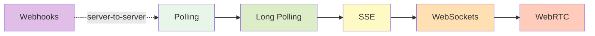
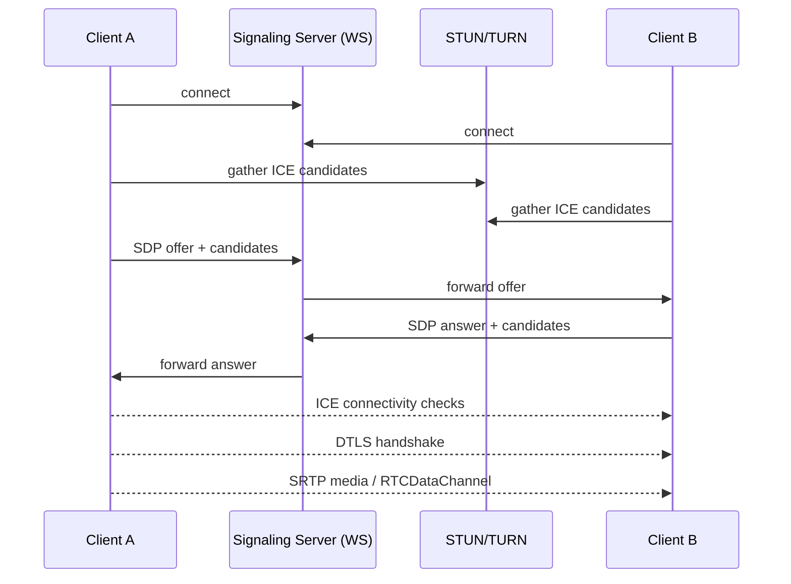
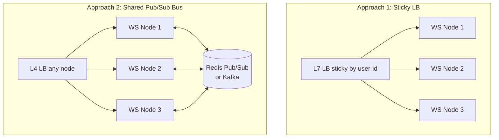
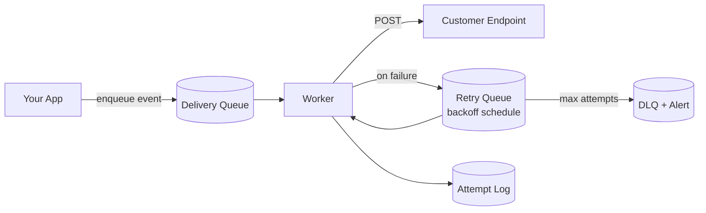
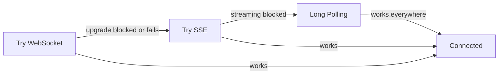

# Real-Time Channels — Long Polling, WebSockets, SSE, Webhooks, WebRTC

**Date:** 2026-04-25 | **Updated:** 2026-04-25
**Tags:** `system-design` `communication` `websockets` `sse` `webhooks` `webrtc` `long-polling`

## Table of Contents

- [Summary](#summary)
- [The Spectrum of Real-Time Channels](#the-spectrum-of-real-time-channels)
- [Polling — The Baseline](#polling--the-baseline)
- [Long Polling](#long-polling)
- [Server-Sent Events (SSE)](#server-sent-events-sse)
- [WebSockets](#websockets)
- [Webhooks](#webhooks)
- [WebRTC](#webrtc)
- [Decision Matrix](#decision-matrix)
- [Scaling Patterns](#scaling-patterns)
  - [WebSocket Horizontal Scale](#websocket-horizontal-scale)
  - [Fan-Out via Edge Tier](#fan-out-via-edge-tier)
  - [Webhook Delivery Service](#webhook-delivery-service)
- [Authentication and Security](#authentication-and-security)
- [Fallback Ladders](#fallback-ladders)
- [Observability](#observability)
- [Anti-Patterns](#anti-patterns)
- [Related](#related)
- [References](#references)

## Summary

"Real-time" is a marketing word. As an engineer you actually pick from five distinct channels, each with a different direction (one-way, two-way, peer-to-peer), failure mode, and operational cost. **Long polling** is HTTP that hangs. **SSE** is a one-way HTTP stream the server writes into. **WebSockets** are a TCP socket dressed up over HTTP — full duplex but stateful, which means scaling becomes a connection-affinity problem. **Webhooks** invert the relationship: someone else's server calls yours, which means you own retries, signatures, and idempotency. **WebRTC** lets clients talk directly to each other for media and data channels, with NAT traversal as the operational tax. The right answer is rarely "WebSockets for everything." This doc is the system-design lens — sibling network-layer mechanics live in [`../../networking/application-layer/websocket-and-sse.md`](../../networking/application-layer/websocket-and-sse.md).

## The Spectrum of Real-Time Channels

Order them by complexity and capability:



| Channel | Direction | Transport | Persistent | Browser | Cost Driver |
|---|---|---|---|---|---|
| Polling | C→S→C (request/response) | HTTP | No | Yes | Request rate × N clients |
| Long Polling | C→S→C (held open) | HTTP | Per-event | Yes | Open requests × duration |
| SSE | S→C (one-way stream) | HTTP/1.1 or HTTP/2 | Yes | Yes (no IE) | Open TCP connections |
| WebSockets | S↔C (full duplex) | TCP via HTTP Upgrade | Yes | Yes | Open sockets + sticky LB |
| Webhooks | S→S | HTTP POST callback | No | N/A | Outbound delivery + retries |
| WebRTC | C↔C (peer mesh) or via SFU | UDP (DTLS/SRTP) | Yes | Yes | TURN bandwidth, signaling |

The trick is to think about who initiates, who terminates, and who pays the connection bill.

## Polling — The Baseline

The client asks "anything new?" on an interval. Stateless, dead-simple, works through every proxy, CDN, firewall, and corporate MITM box on earth. The trade-off is latency vs server cost: a 1-second poll interval means up to 1s of latency and N requests/second per client; a 30-second interval slashes server load but feels broken to humans.

**When polling is still the right answer:**

- Background sync where staleness measured in minutes is fine (mailbox refresh on a status icon, low-priority dashboards).
- Mobile apps where battery and radio wakeup cost dominates — a single batched poll beats holding a socket open.
- Integration tiers behind aggressive proxies that strip Upgrade headers or kill long-running connections.
- When the alternative is operating a stateful WebSocket fleet for a feature that updates every few minutes.

Polling is also the only option when you don't control the producer (e.g., scraping a third-party endpoint with no webhook support).

## Long Polling

The client makes a normal HTTP request; the server **holds the response open** until either an event arrives or a timeout fires (typically 25–55 seconds — under the 60s default for most LBs and corporate proxies). Client receives the payload and immediately reconnects.

**Why it survives:**

- Every HTTP intermediary supports it. No `Upgrade: websocket` to be stripped.
- Auth is just cookies / bearer tokens — no special socket lifecycle.
- Easy to scale horizontally because each "connection" is just a parked request you can pin to any backend with a queue lookup.

**Costs and floors:**

- Each event triggers a TLS-amortized reconnect. Even with HTTP/2 connection reuse you pay one round-trip for the next request setup, putting a latency floor of one RTT on event delivery.
- Open requests consume server resources (file descriptors, request slots, framework state). A Node/Java thread-per-request model collapses; you need an async/reactive server (Netty, Vert.x, fastify, undici streaming).
- Misconfigured load balancers with short idle timeouts (ELB classic at 60s, some CDNs at 30s) silently drop the held request.

Long polling is the "reliable boring" option when WebSockets aren't viable.

## Server-Sent Events (SSE)

A single HTTP/1.1 or HTTP/2 response that **never closes**, with the server writing `text/event-stream` chunks. The browser's `EventSource` API auto-reconnects with a `Last-Event-ID` header, so resume semantics are built in.

```text
HTTP/1.1 200 OK
Content-Type: text/event-stream
Cache-Control: no-cache

event: price-update
id: 42
data: {"symbol":"BTC","price":67000}

event: price-update
id: 43
data: {"symbol":"BTC","price":67012}
```

**Strengths:**

- One-way server→client only. Perfect for live tickers, log tails, notifications, AI token streaming, dashboards.
- Plain HTTP — works with standard auth, CORS, compression, gzip, HTTP/2 multiplexing.
- Auto-reconnect with `Last-Event-ID` gives you resume-from-offset for free.
- Vastly simpler to operate than WebSockets — no `ping`/`pong` frames, no upgrade negotiation, no binary protocol to debug.

**Limits:**

- No client→server channel on the same connection. Clients still POST normally for actions.
- Over HTTP/1.1 each tab consumes one of the 6-per-origin connection budget. HTTP/2 multiplexing fixes this.
- Some legacy proxies buffer responses and break streaming. Set `X-Accel-Buffering: no` for nginx, disable buffering on Cloudflare for the route.
- IE never supported it; modern browsers all do.

**Rule of thumb:** if the data flows server→client and the client only occasionally posts a command, SSE almost always wins. Reach for WebSockets only when you actually need symmetric, low-latency bidirectional traffic.

## WebSockets

A TCP connection upgraded from HTTP via `Upgrade: websocket` (RFC 6455). After upgrade you have a framed, full-duplex byte stream — both sides send whenever they want. Per-message overhead drops to ~2–14 bytes of framing.

```ts
// Node — minimal ws server with heartbeats
import { WebSocketServer } from 'ws';

const wss = new WebSocketServer({ port: 8080 });

function heartbeat(this: any) { this.isAlive = true; }

wss.on('connection', (ws) => {
  ws.isAlive = true;
  ws.on('pong', heartbeat);
  ws.on('message', (raw) => {
    const msg = JSON.parse(raw.toString());
    // route, validate, fan out
    ws.send(JSON.stringify({ ok: true, echo: msg }));
  });
});

// Detect half-open sockets every 30s
setInterval(() => {
  wss.clients.forEach((ws: any) => {
    if (!ws.isAlive) return ws.terminate();
    ws.isAlive = false;
    ws.ping();
  });
}, 30_000);
```

**What you trade for full duplex:**

- **Stateful connections.** Every active user pins one TCP socket to one backend. Restart that backend → all those users reconnect. Capacity planning = max concurrent sockets, not RPS.
- **Sticky load balancing or shared bus.** A pool of WS servers can't fan out a message to a user without knowing which server holds that user's socket. Either you make the LB sticky (by user id, cookie, or IP hash) or every server subscribes to a shared pub/sub bus and filters.
- **Heartbeats are mandatory.** TCP keepalive defaults are minutes-long. Without app-level `ping`/`pong` you get **silent half-open** sockets where one side has died and the other doesn't notice.
- **Backpressure.** WebSocket frames don't have HTTP's response/request boundaries. If a slow consumer falls behind your in-memory send buffer grows unbounded. You must enforce per-connection queue caps and drop or disconnect on overflow.
- **Auth is harder.** No way to add headers from the browser to the upgrade request beyond cookies. Standard pattern: short-lived JWT in the `Sec-WebSocket-Protocol` header, or token in the URL query string sent over TLS.

WebSockets are right for chat, collaborative editing, multiplayer games, trading UIs, real-time RPC — anywhere both sides emit events.

## Webhooks

Server-to-server real-time. The producer makes an HTTP POST to a URL the consumer registered. This is how Stripe, GitHub, Shopify, Twilio, Slack push events.

**The four properties that make a webhook system production-grade:**

1. **Signature verification.** The producer signs the request body with HMAC-SHA256 using a per-tenant secret. Consumer recomputes and constant-time compares. Without this, anyone with the URL can forge events.
2. **Replay protection.** Include a timestamp in the signed payload; reject anything older than ~5 minutes. Otherwise an attacker who captures one valid request can replay it forever.
3. **Idempotency.** Networks fail. Producers retry. Consumers must dedupe by event id and treat duplicate deliveries as no-ops.
4. **Retries with backoff and DLQ.** Producer side: exponential backoff (e.g., 1m, 5m, 30m, 2h, 5h, 10h, 1d) with eventual move to a dead-letter queue and operator alerting. Consumer side: respond 2xx fast (< few seconds), do work async.

```ts
// Stripe-style webhook signature verification
import crypto from 'node:crypto';

const REPLAY_WINDOW_MS = 5 * 60 * 1000;

export function verifyWebhook(
  rawBody: Buffer,
  signatureHeader: string,
  secret: string,
): boolean {
  // Header format: "t=1714000000,v1=hexdigest"
  const parts = Object.fromEntries(
    signatureHeader.split(',').map((p) => p.split('=') as [string, string]),
  );
  const ts = Number(parts.t);
  const provided = parts.v1;
  if (!ts || !provided) return false;

  // Replay protection
  if (Math.abs(Date.now() - ts * 1000) > REPLAY_WINDOW_MS) return false;

  const signedPayload = `${ts}.${rawBody.toString('utf8')}`;
  const expected = crypto
    .createHmac('sha256', secret)
    .update(signedPayload)
    .digest('hex');

  // Constant-time compare to avoid timing leaks
  const a = Buffer.from(expected, 'hex');
  const b = Buffer.from(provided, 'hex');
  return a.length === b.length && crypto.timingSafeEqual(a, b);
}
```

Other production concerns:

- **IP allow-listing** (defense in depth — providers like Stripe and GitHub publish their egress ranges).
- **Endpoint must be HTTPS.** Anything else leaks payload and lets MITM strip signatures.
- **Surface delivery state.** Customers will ask "did event X get delivered?" Build a UI showing per-attempt status, response code, body, latency.
- **Versioning.** Webhook payload schema evolves. Either version the URL (`/v2/webhook`) or include a `version` field and let consumers opt into changes.

## WebRTC

Peer-to-peer media (audio/video) and arbitrary data over UDP, with DTLS for confidentiality and SRTP for media. Three things make it complex:

1. **NAT traversal.** Most clients sit behind NAT. WebRTC uses **ICE** (Interactive Connectivity Establishment) to gather candidate addresses: host (LAN), server-reflexive via **STUN**, and relayed via **TURN**. ICE picks the best path that actually works.
2. **Signaling is BYO.** WebRTC defines no signaling protocol. You build (or rent) a small WebSocket/SSE side-channel for clients to exchange SDP offers/answers and ICE candidates before the peer connection forms.
3. **TURN bandwidth is expensive.** When direct P2P fails (symmetric NAT, strict firewalls), traffic relays through your TURN server. For video calls that's hundreds of kbps × every relayed user.



**When to reach for WebRTC:**

- True peer-to-peer media (1:1 video calls).
- Low-latency data channels where the ~100ms+ floor of WebSocket-via-server is too slow (cloud gaming input, real-time collaboration with presence cursors).
- Browser-native video conferencing without plugins.

For **N-way** calls you typically don't mesh — you route through an **SFU** (Selective Forwarding Unit) like LiveKit, Janus, or mediasoup, which is technically server-mediated but uses WebRTC on each leg.

## Decision Matrix

| Need | Pick |
|---|---|
| Server pushes events to a browser | **SSE** |
| Browser and server both emit, sub-second latency | **WebSockets** |
| Background sync, staleness in minutes is fine | **Polling** |
| Stuck behind enterprise proxy that breaks Upgrade | **Long polling** |
| External system needs to notify your system | **Webhooks** |
| Two browsers exchange media or low-latency data | **WebRTC** |
| N-way live video | **WebRTC + SFU** |

Cross-axis comparison:

| Property | Polling | Long Poll | SSE | WS | Webhooks | WebRTC |
|---|---|---|---|---|---|---|
| Direction | C↔S | C↔S | S→C | C↔S | S→S | C↔C |
| Browser support | Universal | Universal | Modern | Modern | N/A | Modern |
| Fan-out cost | Low | Medium | Low (per-conn) | High (sticky) | Low | High (TURN) |
| Reconnection | Implicit | Implicit | Built-in | Manual | Producer retries | ICE restart |
| Behind proxies | Yes | Yes | Mostly | Sometimes blocked | Yes | TURN/443 fallback |
| Stateful infra | No | Lightly | Yes | Yes | No | Yes (signaling + TURN) |

## Scaling Patterns

### WebSocket Horizontal Scale

A single Node/Java process holds maybe 10k–100k concurrent sockets depending on payload rate and tuning. Beyond that you fan out. Two viable patterns:



- **Sticky** — simpler app code, but a node failure forces all its users to reconnect, and rolling deploys cause connection storms. Fine up to ~mid-six-figures of concurrent users.
- **Shared bus** — every WS node subscribes to a Redis/Kafka channel. Any node receives a publish and forwards to its locally-connected sockets. Decouples scale; you can blue/green deploy WS nodes without losing routing. Cost: bus throughput becomes the cap.
- **Managed services** — Pusher, Ably, PubNub, AWS API Gateway WebSockets, Cloudflare Durable Objects each remove the sticky/bus problem at the cost of vendor lock-in and per-message pricing.

### Fan-Out via Edge Tier

For chat-room or pub-sub fan-out where one publish goes to thousands of subscribers, push the connection state to the edge. Cloudflare **Durable Objects** model each room as a single coordination point with WebSocket connections terminated at the edge. Phoenix **Channels** (Elixir) does similar in-process via the BEAM scheduler — millions of sockets per node because of per-process stack model. The pattern: terminate sockets close to users, keep authoritative state in one place per "topic."

### Webhook Delivery Service

If you're producing webhooks, build (or buy — Svix, Hookdeck) a delivery service:



Required components:

- **Outbound queue** — never POST inline from your transactional code. Enqueue first.
- **Worker pool with rate limiting per customer** — one slow customer should not consume your entire pool.
- **Exponential backoff schedule** — typically 7–10 retries over ~24h.
- **Signed timestamp** in the body, verified by the consumer.
- **DLQ** with operator-visible alerting when a customer's endpoint is persistently failing.
- **Per-attempt audit log** exposed in your dashboard.

## Authentication and Security

| Channel | Auth approach |
|---|---|
| Polling / Long Poll | Cookies, bearer tokens — same as any HTTP request. |
| SSE | Cookies or `Authorization: Bearer` header. CORS applies. |
| WebSockets | Token in the upgrade request (cookie, query param, or `Sec-WebSocket-Protocol`). Re-validate on each frame for sensitive ops. Short-lived tokens with re-auth message recommended. |
| Webhooks | HMAC signature + timestamp (replay window). IP allow-list as defense in depth. mTLS for high-stakes B2B. |
| WebRTC | Signaling auth via your normal session. **TURN credentials must be ephemeral** — issue short-lived (minutes) HMAC-derived TURN credentials per session, never embed long-lived TURN passwords in client code. |

For WebSockets specifically, treat each incoming message as an untrusted boundary. The auth ticket in the upgrade does not authorize every subsequent operation — RBAC must be re-checked on each command frame.

## Fallback Ladders

Libraries like SignalR (.NET), Socket.IO (Node), and SockJS implement a transport ladder:



The library exposes a single API to your code (`socket.send`, `socket.on('message')`) and silently picks the best transport. This was critical in 2012 when corporate proxies routinely stripped `Upgrade` headers; in 2026 it's still useful for kiosks, hotel WiFi, and some mobile carriers. **Don't roll your own** — just adopt one of these libraries when you need fallback.

## Observability

What to instrument for any real-time channel:

| Metric | Why |
|---|---|
| Concurrent connections | Capacity planning, anomaly detection on disconnect storms |
| Connect rate / disconnect rate | Spikes indicate bad deploys or network issues |
| Reconnect rate per client | High value = something is closing connections (LB idle timeout, OOM, crash) |
| Message rate (in/out) | Backpressure indicator |
| End-to-end latency | Producer timestamp → consumer receive timestamp |
| Send queue depth | Per-connection buffer growth = slow consumer detection |
| Heartbeat miss rate | Half-open detection efficacy |
| For webhooks: delivery success %, p50/p99 latency, retry depth, DLQ size | SLA tracking, customer trust |
| For WebRTC: ICE failure %, TURN-relayed % of sessions, jitter, packet loss | Quality of experience |

Drop/reconnect rate is the single most important number — a healthy WS fleet has <1% disconnects per hour. Anything higher and your users feel it as missed messages or stalled UIs.

## Anti-Patterns

- **WebSockets for everything.** If the data is server→client and the user only occasionally posts, SSE costs you 1/10 the operational pain. Don't pay for full-duplex you aren't using.
- **No signature verification on webhooks.** Anyone who learns your endpoint URL can forge events. Always HMAC.
- **No replay protection on webhooks.** A signed-but-undated payload can be replayed forever. Always include a signed timestamp with a reject window.
- **Treating WebSocket like HTTP request/response without flow control.** No backpressure, no per-connection send queue cap → one slow client OOMs the server.
- **Missing heartbeats.** TCP keepalive defaults are minutes long. Half-open sockets accumulate; users see "connected" indicator but no messages flow. Always implement app-level ping/pong with aggressive timeouts (30s).
- **Long-lived TURN credentials in client code.** Anyone can extract them and use your TURN bandwidth as a free relay. Issue ephemeral HMAC-signed TURN creds per session.
- **Synchronous webhook delivery from request path.** Your transactional API now depends on every customer's endpoint being up. Always enqueue.
- **Holding session state in WS process memory with no fallback.** Process restart = data loss. Persist authoritative state externally; treat the WS layer as a transport.
- **Ignoring proxy timeouts.** Many LBs idle-close at 60s. WS connections need application-level pings within that window or a longer LB timeout.

## Related

- [`../../networking/application-layer/websocket-and-sse.md`](../../networking/application-layer/websocket-and-sse.md) — wire-level mechanics of WebSocket framing and SSE chunked encoding.
- `./push-vs-pull-architecture.md` _(planned)_ — when to invert dataflow direction.
- `./event-driven-architecture.md` _(planned)_ — webhooks as one expression of an event-driven system, plus async messaging alternatives (Kafka, NATS, SQS).

## References

- MDN — [Writing WebSocket client applications](https://developer.mozilla.org/en-US/docs/Web/API/WebSockets_API/Writing_WebSocket_client_applications)
- MDN — [Using server-sent events](https://developer.mozilla.org/en-US/docs/Web/API/Server-sent_events/Using_server-sent_events)
- IETF — [RFC 6455: The WebSocket Protocol](https://datatracker.ietf.org/doc/html/rfc6455)
- Stripe — [Webhook signature verification](https://docs.stripe.com/webhooks#verify-official-libraries)
- GitHub — [Securing webhook deliveries](https://docs.github.com/en/webhooks/using-webhooks/validating-webhook-deliveries)
- WebRTC.org — [Getting started primer](https://webrtc.org/getting-started/overview)
- Cloudflare Blog — [WebSockets and Durable Objects](https://blog.cloudflare.com/introducing-websockets-in-workers/)
- Ably Engineering — [The challenge of scaling WebSockets](https://ably.com/topic/the-challenge-of-scaling-websockets)
