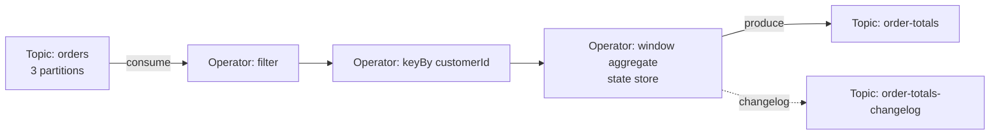
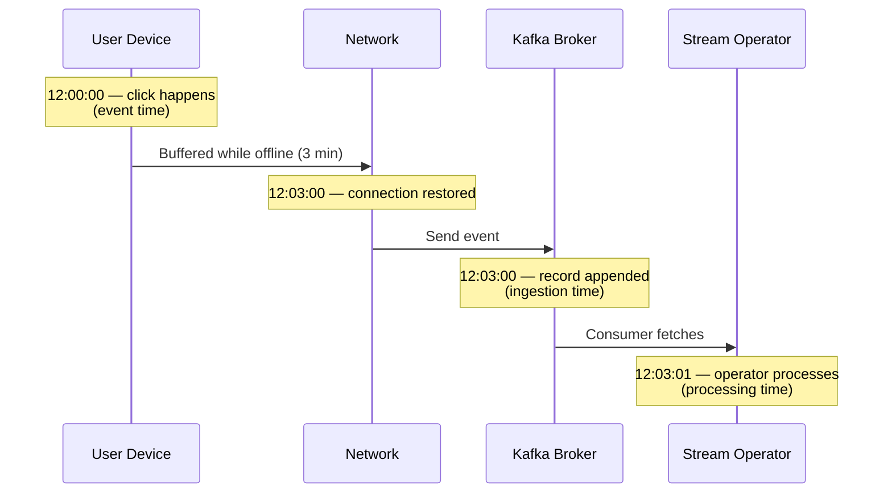
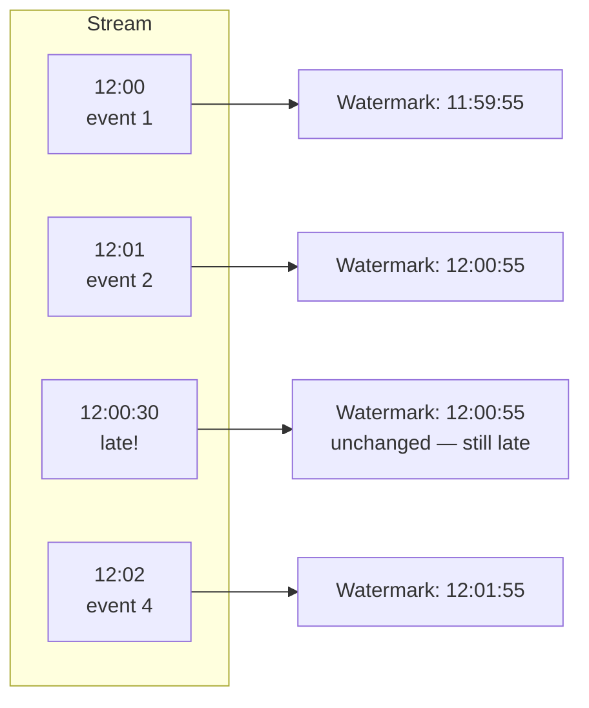

# Stream Processing — Kafka Streams, Flink, and Windowing

**Date:** 2026-04-25 | **Updated:** 2026-04-25
**Tags:** `system-design` `communication` `stream-processing` `kafka-streams` `flink` `windowing`

## Table of Contents

- [Summary](#summary)
- [Stream Processing vs Batch](#stream-processing-vs-batch)
- [Records, Streams, Topics — Vocabulary](#records-streams-topics--vocabulary)
- [Stateless vs Stateful Operations](#stateless-vs-stateful-operations)
- [State Stores](#state-stores)
- [Time Models — Event, Processing, Ingestion](#time-models--event-processing-ingestion)
- [Watermarks and Allowed Lateness](#watermarks-and-allowed-lateness)
- [Windows](#windows)
  - [Tumbling Windows](#tumbling-windows)
  - [Hopping / Sliding Windows](#hopping--sliding-windows)
  - [Session Windows](#session-windows)
  - [Global Windows with Custom Triggers](#global-windows-with-custom-triggers)
- [Joins in Stream Processing](#joins-in-stream-processing)
- [Tables vs Streams Duality](#tables-vs-streams-duality)
- [Exactly-Once in Streams](#exactly-once-in-streams)
- [Backpressure in Streams](#backpressure-in-streams)
- [Failure and Recovery](#failure-and-recovery)
- [Engines at a Glance](#engines-at-a-glance)
- [Use Cases](#use-cases)
- [Anti-Patterns](#anti-patterns)
- [Related](#related)
- [References](#references)

## Summary

Stream processing treats data as a never-ending sequence of timestamped records that flow through stateful operators. Unlike batch jobs that compute over a fixed input and stop, a stream job runs forever, emits results incrementally, and must reason about three different clocks: when an event happened (event time), when the system saw it (processing time), and when it entered the pipeline (ingestion time). Getting this right requires watermarks, windows, and durable state — and is the difference between dashboards that quietly lie and ones that hold up under late-arriving data, partial failures, and backfills. This doc covers the conceptual model and the windowing toolkit; a Tier 13 follow-up compares the engines (Kafka Streams, Flink, Spark Structured Streaming, Beam) head to head.

## Stream Processing vs Batch

Batch and stream processing are points on a spectrum, not opposites.

| Dimension | Batch | Stream |
|-----------|-------|--------|
| Input | Bounded dataset | Unbounded sequence |
| Trigger | Scheduled (cron, DAG) | Continuous |
| Latency | Minutes to hours | Milliseconds to seconds |
| Completeness | Known when job starts | Approximated via watermarks |
| Reprocessing | Re-run on the same input | Replay from an offset/savepoint |
| Failure model | Restart the whole job | Restart from checkpoint |
| Cost shape | Periodic spikes | Steady-state utilization |

The historical evolution went through three architectures:

- **Lambda architecture** — run a batch layer for accuracy and a stream layer for freshness, then merge. Two codebases, two sources of truth, constant drift between them.
- **Kappa architecture** — keep only the streaming layer. Reprocess the past by replaying the log from offset 0. One codebase. Requires the log to be the system of record.
- **Modern unified APIs** — Apache Beam, Flink's unified batch/stream runtime, and Spark Structured Streaming all express batch as "the bounded case" of streaming.

> See the planned Tier 13 doc [batch-vs-stream-processing.md](../../system-design/data-engineering/batch-vs-stream-processing.md) for the full architectural comparison and the planned [modern-streaming-engines.md](../../system-design/data-engineering/modern-streaming-engines.md) for the engine shootout.

## Records, Streams, Topics — Vocabulary

The vocabulary is mostly Kafka-flavored because Kafka Streams baked it into the mainstream, but the concepts apply across engines.

- **Record** — a single timestamped key/value pair. Conceptually `(key, value, timestamp, headers, partition, offset)`.
- **Stream** — an unbounded, append-only sequence of records, partitioned by key.
- **Topic** — the durable, replicated, partitioned log that materializes a stream on disk. In Kafka, topics are the physical substrate; streams are the logical view.
- **Partition** — the unit of parallelism and ordering. Order is guaranteed _within_ a partition, not across.
- **Operator** — a node in the dataflow graph (map, filter, join, window-aggregate). Each operator has parallelism (a number of parallel subtasks).
- **Task / subtask** — a runtime instance of an operator processing a slice of partitions.



## Stateless vs Stateful Operations

Stream operators split cleanly along whether they need memory of past records.

**Stateless operations** look at one record at a time:

- `map` — transform one record into another
- `filter` — drop records that don't match a predicate
- `flatMap` — turn one record into zero or more
- `branch` / `split` — route to multiple downstream streams

These scale trivially. Any subtask can handle any record. No coordination, no recovery state.

**Stateful operations** need to remember things:

- **Aggregations** (`count`, `sum`, `avg`) — accumulate per-key state
- **Windowed aggregations** — accumulate per-key, per-window state
- **Joins** — buffer one or both sides
- **Deduplication** — remember keys you've already seen
- **Pattern matching** (CEP) — track partial matches across events

Stateful operators are the hard part. They need:

1. A **partitioned state store** keyed the same way as the stream (so all records for a given key land on the same subtask)
2. **Durability** — state must survive task crashes and rebalances
3. **Restoration** — on recovery, state must be reconstructed before processing resumes

## State Stores

Different engines manage state differently, with real consequences for latency, throughput, and operational complexity.

### In-process embedded state

Kafka Streams stores per-task state in an embedded **RocksDB** instance on the local disk. Each task owns a slice of partitions and the corresponding state. Reads and writes are local — no network round trip — which is why Kafka Streams can hit single-digit-millisecond per-record latency.

For fault tolerance, every state update is also written to a **changelog topic** in Kafka:

- Topic name: `<application-id>-<store-name>-changelog`
- Configured with `cleanup.policy=compact` so only the latest value per key is retained
- On task failure, a new task instance restores state by replaying the changelog

This is essentially **"write to a log, materialize a view"** — the changelog topic is the system of record for state.

### Externalized state with checkpoints

Flink takes a different approach: state lives in a **state backend** (RocksDB or in-memory hash map), and the runtime periodically takes **distributed snapshots** of all operator state, writing them to durable storage (S3, HDFS, GCS).

- **Checkpoints** are automatic, frequent, used for recovery from failures
- **Savepoints** are manual, durable, used for upgrades, version migrations, and intentional reprocessing
- The Chandy-Lamport algorithm (with barriers injected into the stream) gives a globally consistent snapshot without stopping the world

| Aspect | Kafka Streams | Flink |
|--------|---------------|-------|
| State location | Local RocksDB per task | State backend (local + checkpointed) |
| Durability mechanism | Changelog topics in Kafka | Checkpoints/savepoints to DFS |
| Coordination | Kafka consumer-group rebalance | Flink JobManager |
| Recovery | Replay changelog into new task | Restore from checkpoint |
| Operational surface | Just Kafka | Flink cluster + DFS |

### When state outgrows the box

Both engines can also use **interactive queries** to expose state stores to external readers (e.g., Kafka Streams `KafkaStreams#store()`), turning the streaming app into a queryable cache. For very large state, RocksDB on local SSD with periodic checkpointing remains the default — externalizing state into Redis or DynamoDB is possible but undermines the local-state performance model.

## Time Models — Event, Processing, Ingestion

The single most important concept in streaming. Three clocks, not interchangeable.

| Clock | Definition | Owned by | Reproducible? |
|-------|-----------|----------|---------------|
| **Event time** | When the event actually happened in the real world | The producer (clock on the device, app, sensor) | Yes — embedded in the record |
| **Ingestion time** | When the event entered the streaming system | The broker | Mostly — depends on broker clock |
| **Processing time** | When the operator handled it | The processing node | No — depends on load, skew, restarts |



Why it matters:

- **Processing time** is what you get for free. It's wrong for any analytics that need to reason about "what happened at 9 AM" because of network delays, device buffering, replays, and backfills.
- **Event time** is what users actually mean when they ask "how many sessions yesterday?" but it requires reasoning about late and out-of-order data.
- **Ingestion time** is a compromise — deterministic (the broker assigns it once) but still wrong if devices are offline.

The cost of ignoring this distinction is silent. Dashboards just say slightly wrong numbers and nobody notices until the auditor shows up.

## Watermarks and Allowed Lateness

If event time is what you want, watermarks are how you reason about it.

A **watermark** is an assertion the system makes: _"I believe I have seen all events with timestamp ≤ T."_ It's a moving lower bound on event-time progress. When the watermark advances past the end of a window, the window can be closed and emitted.

Watermarks are heuristics, not facts. They are computed from observed timestamps:

- **Bounded out-of-orderness** — assume events arrive at most _N_ seconds late. Watermark = `max_event_time - N`.
- **Punctuated** — derive from special marker records.
- **Per-partition / per-source** — track each input partition separately, take the minimum across partitions to advance the global watermark.



### Allowed lateness

Even with a watermark you have to decide what to do with events that arrive _after_ the watermark has passed their window:

- **Drop them** — cheapest, but you silently lose data
- **Send to a side output** — a separate stream you can audit or reprocess later
- **Accept them and update the result** — set an `allowedLateness` window, keep the window state alive past the watermark, re-emit the updated aggregate

There is no free lunch. Longer allowed lateness means longer-lived state, higher memory pressure, and downstream consumers that must handle updates (retractions). Zero allowed lateness means dropped data. Pick the trade-off explicitly per use case.

## Windows

A window slices an unbounded stream into bounded chunks so aggregations can emit a result. Windows are always per-key (after a `keyBy` / `groupByKey`).

### Tumbling Windows

Fixed size, non-overlapping, contiguous. Every event lands in exactly one window.

```text
Window:  [0───5)[5───10)[10───15)[15───20)
Events:   ●●●    ●●●●    ●         ●●
Output:   3      4       1         2
```

Use for: hourly counts, daily reports, regular metric emission. The classic "events per minute" dashboard.

### Hopping / Sliding Windows

Fixed size, **overlapping** by a slide interval. An event can belong to multiple windows.

```text
Size: 10s, Slide: 5s
Window 1: [0────────10)
Window 2:      [5────────15)
Window 3:           [10────────20)
```

Use for: rolling averages, "top-K in the last 5 minutes refreshed every 30 seconds." The trade-off: a smaller slide means smoother output but proportionally more windows alive simultaneously and proportionally more state.

> Terminology drift: Flink calls these "sliding windows," Kafka Streams calls fixed-size overlapping windows "hopping," and reserves "sliding window" for a join-window concept. Always check the engine's docs.

### Session Windows

Variable-length windows defined by **gaps of inactivity**. A session ends when no event arrives within the configured `inactivityGap`. Each key has its own session lifecycle.

```text
Gap: 3min
User A:  ●●●─────|gap 5min|─────●●  → 2 sessions
User B:  ●─●─●─●─●                  → 1 session (no gap > 3min)
```

Use for: user behavior analysis, IoT device runs, clickstream sessionization, anything where the unit of analysis is "a burst of activity."

Session windows are the most state-hungry: until you see the gap, you don't know the window is over, so state grows with active session duration.

### Global Windows with Custom Triggers

A single window that contains all events for a key. By itself useless — without a trigger it never fires. Combined with a custom trigger (e.g., "fire every N elements" or "fire when an external signal arrives") it gives you full control.

Use for: complex event processing (CEP), pattern detection, custom batching policies that don't fit tumbling/hopping/session.

## Joins in Stream Processing

Joining two streams is harder than joining two tables because at any moment you've only seen part of each side.

### Stream-Stream Join

Both inputs are unbounded streams. To bound the state, joins are **windowed**:

> "Match a click event with a purchase event for the same user, where the purchase happened within 30 minutes of the click."

Each side is buffered for the window duration. Memory cost ≈ rate × window size × value size.

### Stream-Table Join

The "table" is a materialized changelog — a key-value view of the latest value per key (e.g., a user profile derived from a `user-updates` stream). Each stream record looks up the current table value.

> "Enrich each order event with the user's current loyalty tier."

Cheap and very common. The table side is a state store keyed for fast lookup; in Kafka Streams this is a `KTable`, in Flink a broadcast state or temporal table.

### Table-Table Join

Both sides are changelogs. The result is itself a changelog. Useful for materialized views built from CDC.

> "Maintain a view of `(customer, latest_address, latest_payment_method)` derived from CDC streams of three tables."

### Temporal joins

A specialization where you join a stream against the **version of the table that was current at the event's event time** — critical for correctness when joining against slowly-changing dimensions during reprocessing. If you join an order from 2024 against the user's _current_ address, you get the wrong answer when reprocessing history.

## Tables vs Streams Duality

A central conceptual move that makes everything click:

- **A stream is the changelog of a table.** Every record is an upsert; the table is what you get if you collapse the stream by key.
- **A table is a snapshot of a stream.** At any point in time, the table is the latest value per key.

```text
Stream:   (alice, 1) (bob, 5) (alice, 3) (carol, 2) (bob, 7)
                                              │
                                              ▼
Table:    alice → 3
          bob   → 7
          carol → 2
```

This duality is why Kafka Streams' `KStream` and `KTable` are interchangeable views of the same underlying topic, why CDC into Kafka is the natural integration point between OLTP and analytics, and why the same primitives (windowed aggregation, join) work on both.

It also explains compacted topics: a Kafka topic with `cleanup.policy=compact` retains only the latest value per key, making it the durable storage for a `KTable`.

## Exactly-Once in Streams

"Exactly-once" in streams means: _the externally observable output is as if every input record was processed exactly once_, despite failures and retries. It is achieved by combining:

1. **Idempotent producers** — Kafka assigns a producer ID + sequence number so duplicate sends are dropped at the broker
2. **Transactional writes** — multiple writes (output + state changelog + consumer offset commit) commit atomically
3. **Read-committed consumers** — downstream consumers skip uncommitted (in-flight transaction) messages

### Kafka Streams + Kafka EOS

Kafka Streams enables this with `processing.guarantee=exactly_once_v2`. Each task atomically commits:

- The output records to downstream topics
- The changelog updates to its state store
- The input offsets it has consumed

If anything fails mid-transaction, all three are rolled back. On restart, the task re-reads from the last committed offset and re-runs.

Caveats:

- Only end-to-end exactly-once **within Kafka**. Side effects to external systems (HTTP calls, RDBMS writes) need their own idempotency.
- Slight throughput cost from coordinator round-trips.

### Flink + Two-Phase Commit Sinks

Flink achieves exactly-once via checkpoints + 2PC sinks:

1. The runtime injects a **checkpoint barrier** into the stream
2. Every operator snapshots its state when the barrier passes
3. The sink **pre-commits** (e.g., writes to a staging area, sends a Kafka transaction begin)
4. After all operators ack, the JobManager triggers **commit**
5. On failure before commit, the partial transaction is aborted on recovery

This works as long as the sink supports a 2PC protocol (Kafka, JDBC with XA, file sinks with rename-on-commit, Iceberg tables).

> See [idempotency-and-exactly-once.md](idempotency-and-exactly-once.md) for the broader picture across messaging systems.

## Backpressure in Streams

When a downstream operator can't keep up, the upstream must slow down — otherwise unbounded buffering leads to OOM crashes.

### Flink — Natural Backpressure

Flink's network stack uses **credit-based flow control**. Each downstream task advertises buffer credits to its upstream. When credits run out, the upstream stops sending. The pressure propagates backward all the way to the source connector, which then stops requesting records from Kafka. No data loss; the system slows uniformly.

You can see backpressure in the Flink UI as a "BackPressured" status on operators. The bottleneck is the operator immediately downstream of the highlighted one.

### Kafka Streams — Consumer Pause

Kafka Streams uses the underlying Kafka consumer's `pause()` / `resume()` API. When an internal queue exceeds a threshold, the consumer is paused — it stops fetching from the broker. Because Kafka stores the data durably, "slowing down" just means falling behind on consumption (consumer lag), which is fine until lag exceeds retention and data is deleted.

Backpressure here is implicit and observed externally as **rising consumer lag**. Monitor `kafka_consumer_lag` aggressively.

### Other engines

- **Spark Structured Streaming** — `maxOffsetsPerTrigger` rate limit, plus dynamic allocation
- **Pulsar Functions** — explicit acknowledgment-based flow control
- **Beam runners** — runner-specific (e.g., Dataflow has autoscaling and adaptive shuffle)

## Failure and Recovery

Stream jobs run forever, so they will fail forever. Recovery strategy is part of the design.

| Engine | Mechanism | Restart granularity |
|--------|-----------|---------------------|
| Kafka Streams | Consumer offsets + changelog replay | Per-task |
| Flink | Distributed checkpoints | Per-job (full restart by default; finer with region failover) |
| Spark Structured Streaming | Checkpoint dir + WAL | Per-batch |
| Beam (Dataflow) | Runner-managed | Runner-managed |

### Checkpoints vs savepoints (Flink)

| | Checkpoint | Savepoint |
|--|-----------|-----------|
| Trigger | Automatic, periodic | Manual |
| Format | Internal, possibly incremental | Stable, portable |
| Lifecycle | Auto-deleted on success | User-managed |
| Use case | Crash recovery | Upgrade, code change, A/B test, replay |

Operationally: take a savepoint before any deploy, every time. Without one, the only safe upgrade is "stop fully, lose recent state, replay."

### What survives a restart

- **Input offsets** — the job picks up exactly where it left off (committed offset)
- **Operator state** — restored from changelog (Kafka Streams) or checkpoint (Flink)
- **In-flight tuples in network buffers** — replayed by re-reading from the source

What does _not_ survive:

- Logs, metrics, ad-hoc in-memory caches not registered as state
- External side effects already committed (those need idempotency on the receiver)

## Engines at a Glance

A quick-reference table; the deep comparison is in the planned Tier 13 [modern-streaming-engines.md](../../system-design/data-engineering/modern-streaming-engines.md).

| Engine | Model | Strengths | Watch-outs |
|--------|-------|-----------|------------|
| **Kafka Streams** | Library, embedded in your app | No cluster to operate; tight Kafka integration; great for microservices | Kafka-only; JVM only; state recovery proportional to changelog size |
| **Apache Flink** | Distributed dataflow runtime | Best-in-class event-time semantics; rich windowing/CEP; large-state friendly; unified batch/stream | Cluster to operate; learning curve; checkpoint tuning matters |
| **Spark Structured Streaming** | Micro-batch (and continuous mode) | Great if you already run Spark; SQL-first; ML pipeline integration | Higher latency than true-streaming; continuous mode is limited |
| **Apache Beam** | Unified API; runs on Dataflow / Flink / Spark | Portability across runners; expressive trigger model | Runner support varies; another abstraction layer |
| **ksqlDB** | SQL on top of Kafka Streams | Lowest barrier to entry; SQL is enough for many analytics | Less flexible than DSL; one company driving it |

```java
// Kafka Streams — count clicks per user per 1-minute tumbling window
StreamsBuilder builder = new StreamsBuilder();

builder.stream("clicks", Consumed.with(Serdes.String(), clickSerde))
    .groupByKey()
    .windowedBy(TimeWindows.ofSizeAndGrace(
        Duration.ofMinutes(1),
        Duration.ofMinutes(5))) // allowed lateness
    .count(Materialized.as("clicks-per-user-per-minute"))
    .toStream()
    .map((windowedKey, count) -> KeyValue.pair(
        windowedKey.key(),
        new ClickCount(windowedKey.window().startTime(), count)))
    .to("click-counts", Produced.with(Serdes.String(), clickCountSerde));

KafkaStreams streams = new KafkaStreams(builder.build(), props);
streams.start();
```

```java
// Flink DataStream — same logic, with explicit watermark strategy
StreamExecutionEnvironment env = StreamExecutionEnvironment.getExecutionEnvironment();

DataStream<Click> clicks = env
    .fromSource(
        KafkaSource.<Click>builder()
            .setBootstrapServers("kafka:9092")
            .setTopics("clicks")
            .setValueOnlyDeserializer(new ClickDeserializer())
            .build(),
        WatermarkStrategy.<Click>forBoundedOutOfOrderness(Duration.ofSeconds(30))
            .withTimestampAssigner((event, ts) -> event.eventTimeMillis()),
        "kafka-source");

clicks
    .keyBy(Click::userId)
    .window(TumblingEventTimeWindows.of(Time.minutes(1)))
    .allowedLateness(Time.minutes(5))
    .sideOutputLateData(lateOutputTag)
    .aggregate(new CountAggregator())
    .sinkTo(KafkaSink.<ClickCount>builder()
        .setBootstrapServers("kafka:9092")
        .setRecordSerializer(/* ... */)
        .setDeliveryGuarantee(DeliveryGuarantee.EXACTLY_ONCE)
        .build());

env.execute("clicks-per-user-per-minute");
```

## Use Cases

Pattern recognition for "is this a stream-processing problem?"

- **Real-time analytics** — live dashboards, leaderboards, "events per minute by region"
- **Fraud detection** — score transactions in flight against rolling baselines, flag anomalies before authorization completes
- **ETL pipelines** — continuous transform from raw event topic to enriched, partitioned, schema-validated output topics
- **Alerting** — threshold-based or pattern-based alerts on streams of metrics or logs
- **Materialized views from CDC** — turn Postgres logical replication or MySQL binlog into a denormalized read model in Kafka topics, then expose via interactive queries or push to a search/analytics store
- **Real-time recommendations** — update user feature stores in flight as behavior happens
- **Network / IoT telemetry** — windowed aggregates over sensor or NetFlow data
- **Sessionization** — turn raw clickstream into bounded "user sessions" downstream apps consume

## Anti-Patterns

Hard-won lessons that show up in postmortems.

- **Using processing time when you mean event time.** The first symptom is "the metrics look weird whenever we deploy." Pick event time the moment your data has any chance of being delayed, replayed, or backfilled.
- **No allowed-lateness budget.** Either explicitly drop late events to a side output you audit, or define a finite tolerance. Silent drops are the worst outcome.
- **Unbounded windows.** A global window without a trigger, or session windows with no inactivity gap, accumulate state forever. Eventually the state backend or RocksDB instance OOMs.
- **All state in memory.** "Heap-only state backend" is fine for tiny demos. Anything real needs RocksDB-on-disk + checkpointing or you lose state on every restart.
- **Ignoring backpressure.** Falling consumer lag past retention is a data-loss event. Alert on lag, not just on operator failure.
- **Hot keys.** A single key receiving 80% of the traffic pins one task to a single core regardless of cluster size. Detect with per-key rate metrics; fix with key salting + rollup, or pre-aggregation.
- **Reprocessing without savepoints.** Deploying a code change without a savepoint means restarting from the most recent checkpoint, which the new code may not be able to read. Take savepoints before _every_ deploy.
- **Joins without temporal semantics.** Stream-table joins against a "current value" lookup table give wrong answers when reprocessing historical data. Use temporal/versioned joins.
- **Skipping the changelog.** "We don't need fault tolerance, our state is small" — until the first restart and now the dashboard is wrong for an hour while the changelog rebuilds, except there is no changelog.
- **Treating exactly-once as "set a flag."** EOS is a property of the whole pipeline including sinks. An EOS-configured Kafka Streams app writing to a non-idempotent HTTP endpoint is not exactly-once anywhere it actually matters.

## Related

- [Message Queues & Brokers — Kafka, RabbitMQ, SQS, NATS](../building-blocks/message-queues-and-brokers.md) — the substrate stream processing runs on; partition / consumer-group / log semantics
- [Event-Driven Architecture — Pub/Sub, Choreography vs Orchestration](event-driven-architecture.md) — events as the unit of inter-service communication, of which streams are the durable form
- [Idempotency and Exactly-Once Semantics](idempotency-and-exactly-once.md) — the broader guarantees discussion that EOS in streams is one instance of
- [CQRS and Event Sourcing — Commands, Queries, and the Event Log](../scalability/cqrs-and-event-sourcing.md) — event log as system of record; projections as materialized views (a streaming concept)
- [Modern Streaming Engines — Kafka Streams vs Flink vs Spark vs Beam](../../system-design/data-engineering/modern-streaming-engines.md) _(planned)_ — head-to-head engine comparison for selection
- [Batch vs Stream Processing — Lambda, Kappa, Unified](../../system-design/data-engineering/batch-vs-stream-processing.md) _(planned)_ — architectural patterns for combining or unifying batch and streaming

## References

- [Apache Kafka Streams Documentation](https://kafka.apache.org/documentation/streams/) — the canonical Kafka Streams reference: DSL, state stores, exactly-once
- [Kafka Streams Core Concepts](https://kafka.apache.org/documentation/streams/core-concepts) — stream-table duality, time semantics, processing guarantees
- [Apache Flink — Time and Windows](https://nightlies.apache.org/flink/flink-docs-stable/docs/concepts/time/) — event time, watermarks, lateness, the definitive source
- [Apache Flink — Stateful Stream Processing](https://nightlies.apache.org/flink/flink-docs-stable/docs/concepts/stateful-stream-processing/) — checkpoints, savepoints, state backends
- ["Streaming 101" by Tyler Akidau](https://www.oreilly.com/radar/the-world-beyond-batch-streaming-101/) — the foundational article on the streaming model, time, windowing
- ["Streaming 102" by Tyler Akidau](https://www.oreilly.com/radar/the-world-beyond-batch-streaming-102/) — watermarks, triggers, accumulation modes; required reading
- ["Streaming Systems"](https://www.oreilly.com/library/view/streaming-systems/9781491983867/) by Tyler Akidau, Slava Chernyak, Reuven Lax — the book-length treatment from the Beam/Dataflow team
- [Apache Beam Programming Guide](https://beam.apache.org/documentation/programming-guide/) — the unified batch/stream model expressed in one API
- [Confluent — "Of Streams and Tables in Kafka and Stream Processing"](https://developer.confluent.io/learn-kafka/kafka-streams/streams-and-tables/) — accessible deep dive into the duality
- [Designing Data-Intensive Applications, Chapter 11 — Stream Processing](https://dataintensive.net/) by Martin Kleppmann — the systems-level framing
