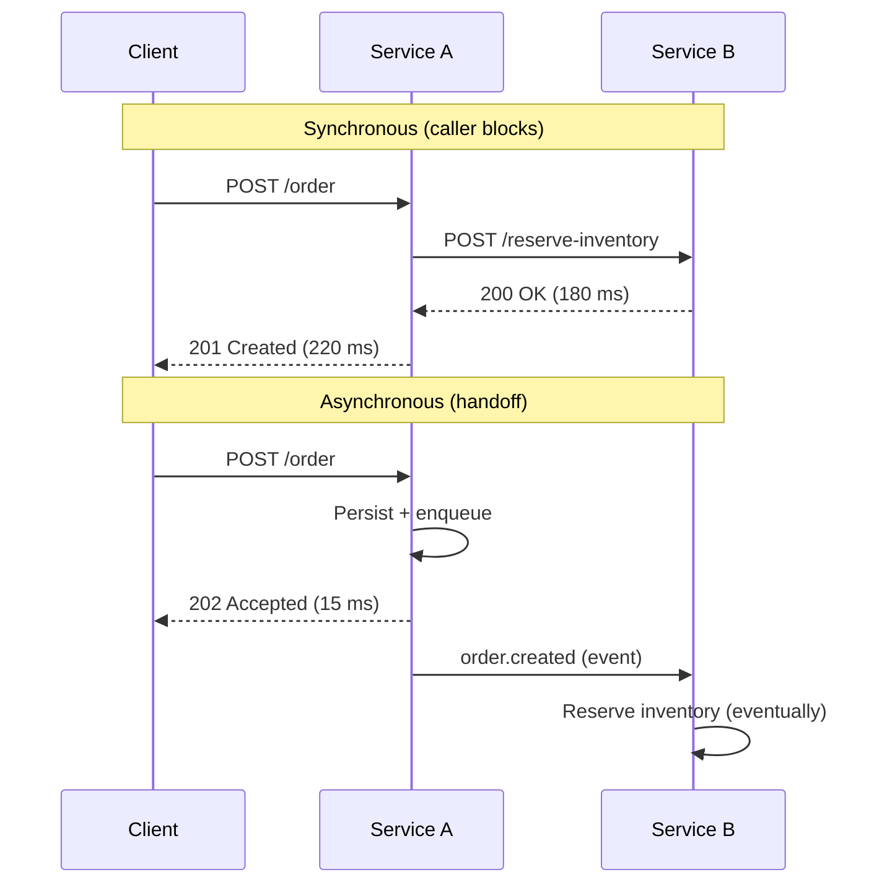
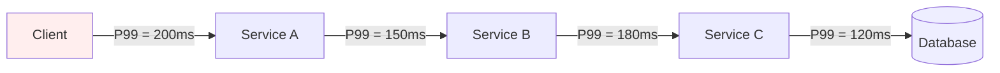
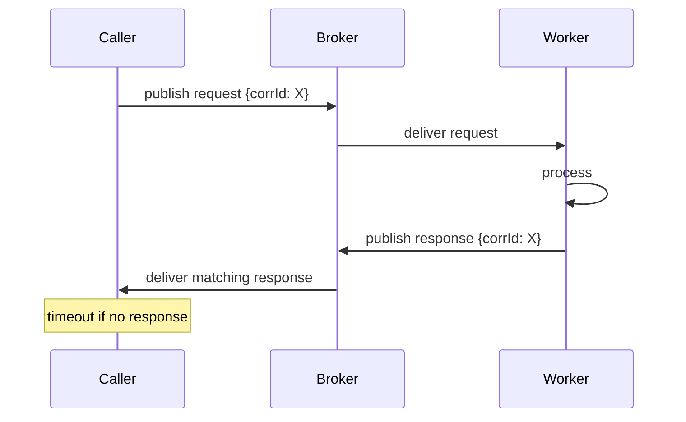

# Sync vs Async Communication — REST, gRPC, Messaging

**Date:** 2026-04-25 | **Updated:** 2026-04-25
**Tags:** `system-design` `communication` `sync` `async` `rest` `grpc` `messaging`

## Table of Contents

- [Summary](#summary)
- [Sync vs Async at the Architecture Level](#sync-vs-async-at-the-architecture-level)
- [Don't Confuse Async Code with Async Architecture](#dont-confuse-async-code-with-async-architecture)
- [Latency Coupling — The Multiplication Trap](#latency-coupling--the-multiplication-trap)
- [Failure Coupling — Their Outage Becomes Yours](#failure-coupling--their-outage-becomes-yours)
- [When Sync Wins](#when-sync-wins)
- [When Async Wins](#when-async-wins)
- [Patterns](#patterns)
  - [Request-Response over a Queue](#request-response-over-a-queue)
  - [Saga Handoff](#saga-handoff)
  - [Webhook Callbacks](#webhook-callbacks)
  - [Polling for Completion](#polling-for-completion)
- [Protocol Picks — REST, gRPC, Messaging, GraphQL](#protocol-picks--rest-grpc-messaging-graphql)
- [The Hidden Synchrony of HTTP/2 Streaming and gRPC Bidi](#the-hidden-synchrony-of-http2-streaming-and-grpc-bidi)
- [Hybrid Patterns — 202 Accepted + Tracking ID](#hybrid-patterns--202-accepted--tracking-id)
- [Migration — Sync to Async Is a Consistency Story Change](#migration--sync-to-async-is-a-consistency-story-change)
- [Anti-Patterns](#anti-patterns)
- [Decision Checklist](#decision-checklist)
- [Related](#related)
- [References](#references)

## Summary

Synchronous and asynchronous communication are not _coding styles_ — they are **architectural choices** about coupling, latency, and consistency. A sync call ties the caller's fate to the callee's availability and tail latency. An async handoff buys decoupling at the cost of complexity: idempotency, ordering, observability, and a different consistency model. The right pick depends on whether a human is waiting, how naturally the contract maps to request-response, and whether you can afford to multiply latency and failure probability across a chain of services.

This document is the boundary doc — it gives you the framework to choose between REST, gRPC, message queues, and hybrid patterns, then points to deeper docs for each one.

## Sync vs Async at the Architecture Level

The defining question is **"does the caller block until the callee produces a result?"**

| Property | Synchronous | Asynchronous |
|----------|-------------|--------------|
| Caller behavior | Waits for response | Hands off, continues |
| Coupling | Temporal (both up at once) | Decoupled in time |
| Failure mode | Cascading | Backpressure / retry |
| Latency | Bounded by slowest hop | Bounded by SLA on the work |
| Consistency | Read-your-writes is easy | Eventual by default |
| Operational complexity | Lower | Higher (broker, DLQ, idempotency) |
| Natural protocols | HTTP/REST, gRPC | Kafka, RabbitMQ, SNS/SQS, NATS |

Sync is the default for a reason: it is conceptually simple, easy to reason about, and easy to test. Async is the right answer when sync stops working — usually because of latency, availability, or coupling between teams.



## Don't Confuse Async Code with Async Architecture

This trips up almost everyone moving from Node or Spring WebFlux into distributed design.

```ts
// This is SYNC architecture, written with async syntax.
const inventory = await inventoryClient.reserve(orderId)
const payment   = await paymentClient.charge(orderId, amount)
const shipment  = await shipmentClient.create(orderId)
return { ok: true }
```

The `await` keyword is just non-blocking I/O at the runtime level. The **architecture** is still synchronous request-response: the caller is blocked (in HTTP-handler terms) until all three services answer. If any of them is down or slow, the user waits or fails.

```ts
// This is ASYNC architecture.
await db.tx(async t => {
  await t.orders.insert({ id: orderId, status: "PENDING" })
  await t.outbox.insert({ topic: "order.created", payload: { orderId } })
})
return { ok: true, orderId } // returns immediately
```

The order is durably persisted, an event is published, and downstream services react on their own schedule. The user got a 200 in milliseconds; inventory and payment happen later.

> **Rule of thumb:** if removing a downstream service breaks the request that just came in, you are doing sync architecture, regardless of how many `await`s or `CompletableFuture`s are in the code.

## Latency Coupling — The Multiplication Trap

In a sync chain, **latency adds and availability multiplies**.

If service A calls B which calls C which calls D, and each has 99.9% availability:

$$P(\text{end-to-end up}) = 0.999^4 = 0.996$$

That is roughly **35 hours of unavailability per year** instead of 8.7. And it gets worse with tail latency: P99 of a chain is _not_ the max of P99s, it is much higher because tail events compound.



If each hop has a P99 of 100 ms, the chain's P99 is dramatically worse than 400 ms because the chance of _at least one_ hop hitting its tail rises with chain length. Empirically, doubling chain length roughly squares the impact of a slow hop on user-visible P99.

Async breaks this. Each service handles its own load on its own schedule. The user response is bounded by whatever the front door does (often a single DB write + enqueue), not by the slowest backend.

## Failure Coupling — Their Outage Becomes Yours

When you call a service synchronously, **its outage is your outage**.

- Their database is overloaded → your requests pile up
- Their deploy is slow → your tail latency spikes
- Their TLS cert expired at 3 a.m. → your pager goes off

Circuit breakers (Hystrix, Resilience4j, Polly) help by failing fast instead of waiting for timeouts. But fail-fast is still a failure: the user either sees an error or you serve degraded data. The breaker prevents _cascading collapse_, not the underlying coupling.

Async messaging changes the conversation:

- Message broker is up → the publisher succeeds
- Consumer is down → messages queue up; backpressure absorbed by the broker
- Consumer recovers → catches up from the lag

The user-facing service does not care whether a downstream consumer is healthy at any given instant. That is the heart of decoupling.

## When Sync Wins

Pick sync when at least two of these are true:

1. **A user is waiting for the result.** Login, search, fetch a profile, render a page.
2. **The contract is naturally request-response.** "Give me X" maps cleanly to a function call; there is no business meaning in "fire-and-forget X."
3. **You need read-your-writes consistency.** The next page load must reflect the change.
4. **You need low operational complexity.** You don't have a broker team, you don't want a DLQ runbook, you don't want to debug ordering bugs.
5. **The chain is short.** Two or three hops, not eight.

REST and gRPC are sync-by-default for good reason. Use them when sync is the right answer; reach for async only when sync stops working.

## When Async Wins

Pick async when at least two of these are true:

1. **The work is long-running.** Image processing, ML inference batches, report generation, video transcoding.
2. **You need fan-out.** One event triggers N independent reactions (notifications, search index, analytics, billing).
3. **Eventual consistency is acceptable.** The downstream effect does not need to be visible on the next request.
4. **You want to decouple teams or deployments.** Producer ships at 9 a.m., consumer ships at 3 p.m., neither blocks the other.
5. **Load is bursty.** The broker absorbs spikes that would otherwise overload synchronous downstreams.

## Patterns

### Request-Response over a Queue

You _can_ do request-response on top of a message broker. Producers publish to a request topic with a correlation ID; the consumer publishes to a response topic; the original caller awaits the matching response (often with a timeout).

This gets used when:

- The caller wants the simplicity of "send a request, get a response"
- But the team wants the operational benefits of async transport (replay, audit trail, backpressure)



Confluent's "request-reply over Kafka" pattern and AMQP's RPC over RabbitMQ both implement this. You get **async transport with sync UX** — but the UX is a lie: the caller is still architecturally synchronous (waiting for a result), and you get the worst of both worlds if the consumer is slow. Use this pattern for specific bridging needs, not as a default.

### Saga Handoff

For multi-step distributed workflows where each step is a service call, sagas use either choreography (events) or orchestration (a coordinator) to advance state. Compensating actions undo earlier steps on failure. See [distributed-transactions.md](../data-consistency/distributed-transactions.md) for the deep dive on sagas, the outbox pattern, and compensation.

### Webhook Callbacks

The caller registers a callback URL. The callee invokes it when the work is done.

```http
POST /jobs HTTP/1.1
Content-Type: application/json

{
  "input": "...",
  "callback_url": "https://api.example.com/jobs/abc123/done"
}

HTTP/1.1 202 Accepted
{ "job_id": "abc123" }
```

Pros: zero polling, near-instant notification. Cons: caller must expose a public HTTPS endpoint, must handle replay attacks (signed callbacks), and must accept delivery failures (retry + DLQ on the callee side). Stripe, GitHub, and Twilio all use this model heavily.

### Polling for Completion

The simplest async API. The caller submits work, gets a job ID, and polls a status endpoint.

```http
POST /reports
→ 202 Accepted, Location: /reports/abc/status

GET /reports/abc/status
→ 200 { "state": "RUNNING", "progress": 0.42 }

GET /reports/abc/status
→ 200 { "state": "DONE", "result_url": "https://cdn..." }
```

Google's [API Improvement Proposal AIP-151](https://google.aip.dev/151) standardizes Long-Running Operations (LROs) around exactly this shape. Polling intervals should use exponential backoff to avoid hammering the status endpoint.

## Protocol Picks — REST, gRPC, Messaging, GraphQL

| Protocol | Default model | Best for | Watch out for |
|----------|---------------|----------|---------------|
| **REST/HTTP** | Sync request-response | Public APIs, browser clients, CRUD over resources | Verbose payloads, no schema enforcement without OpenAPI |
| **gRPC** | Sync RPC (also streaming) | Internal service-to-service, low latency, strict contracts, polyglot | Browser support requires gRPC-Web; harder to debug than JSON |
| **Messaging (Kafka, RabbitMQ, NATS, SNS/SQS)** | Async pub/sub or queue | Fan-out, event-driven, decoupling, bursty load | Idempotency, ordering, broker ops |
| **GraphQL** | Sync request-response with client-defined shape | Frontend BFF, varied client needs, avoiding N round trips | N+1 resolver problem, caching is harder than REST |

A pragmatic split for a typical microservices system:

- **External edge** → REST or GraphQL (browsers and partners)
- **Internal sync** → gRPC (service-to-service when sync is the right answer)
- **Internal async** → Kafka or a queue (events, fan-out, long work)

Do not pick a single protocol religiously; use each where it fits.

## The Hidden Synchrony of HTTP/2 Streaming and gRPC Bidi

A common confusion: "gRPC supports streaming, so it's async, right?"

No. Streaming is about **how data flows during a single call**, not about who waits for whom architecturally. In gRPC server streaming, the client calls a method and receives a stream of responses; the client is still waiting for the call to finish. Bidirectional streaming lets both sides send and receive concurrently, but it's still a long-lived synchronous conversation between two endpoints.

```ts
// gRPC bidirectional stream — still architecturally sync
const call = client.chat()
call.on("data", msg => render(msg))
call.write({ text: "hi" })
// The client and server are temporally coupled for the life of the call.
// If either side disconnects, the conversation ends.
```

True async architecture means the producer doesn't know or care _who_ consumes the message, _when_ they consume it, or _whether_ they're up right now. Streaming RPCs don't give you that. They give you efficient bidirectional sync.

## Hybrid Patterns — 202 Accepted + Tracking ID

The most common production pattern is hybrid: a **synchronous front door** that enqueues async work and returns a tracking handle.

```http
POST /reports HTTP/1.1
{ "kind": "monthly", "month": "2026-04" }

HTTP/1.1 202 Accepted
Location: /reports/r_8f3a/status
{ "id": "r_8f3a", "state": "QUEUED" }
```

The client then either:

- **Polls** `GET /reports/r_8f3a/status` (simple, works through any proxy)
- **Subscribes** via WebSocket / SSE / webhooks (lower latency, more infra)

```ts
// Spring Boot pseudocode — sync front door, async work
@PostMapping("/reports")
public ResponseEntity<ReportStatus> create(@RequestBody ReportSpec spec) {
  String id = idGen.next();
  reportsRepo.insert(new Report(id, "QUEUED", spec));
  outbox.publish("report.requested", new ReportRequested(id, spec));
  return ResponseEntity
    .accepted()
    .header("Location", "/reports/" + id + "/status")
    .body(new ReportStatus(id, "QUEUED"));
}
```

```ts
// TS/Node equivalent
app.post("/reports", async (req, res) => {
  const id = randomId()
  await db.tx(async t => {
    await t.reports.insert({ id, state: "QUEUED", spec: req.body })
    await t.outbox.insert({ topic: "report.requested", payload: { id } })
  })
  res.status(202).location(`/reports/${id}/status`).json({ id, state: "QUEUED" })
})
```

This pattern is the right answer for the vast majority of "sync UX over async work" needs. The caller sees a fast, predictable HTTP response; the heavy work is decoupled, retryable, and observable.

## Migration — Sync to Async Is a Consistency Story Change

Engineers underestimate this constantly. Moving a single endpoint from sync to async is not a refactor — it changes the **consistency contract** that the rest of the system has come to depend on.

What changes:

| Before (sync) | After (async) |
|---------------|----------------|
| 201 Created means the row exists everywhere | 202 Accepted means the row will exist eventually |
| Read-after-write works on the next call | The next read may return stale or "not found" |
| Errors surface immediately | Errors surface in dashboards / DLQs |
| Idempotency was "nice to have" | Idempotency is **mandatory** (retries are guaranteed) |
| Order of side effects was implicit | Order must be designed (or explicitly not required) |

Practical migration playbook:

1. **One boundary at a time.** Don't async-ify three services in one quarter; you'll lose sleep and probably data.
2. **Outbox first.** Write to DB and outbox in the same transaction. Have a relay publish to the broker. This eliminates the dual-write problem.
3. **Idempotent consumers from day one.** Every consumer must tolerate duplicate delivery — see [planned idempotency-and-exactly-once.md](idempotency-and-exactly-once.md).
4. **Update the UX.** "Saved" became "Saving…". The UI must reflect the new consistency story.
5. **Keep a sync read path.** Even if writes are async, reads usually need to stay sync; design what stale-read semantics you accept.
6. **Observability before traffic.** Lag metrics, DLQ alerts, end-to-end tracing across the broker — all must work _before_ you flip the switch.

## Anti-Patterns

### Chaining Eight Sync Services

> "Order calls Inventory calls Pricing calls Tax calls Compliance calls Notification calls…"

Each hop multiplies failure probability and adds tail latency. Either flatten with an orchestrator, parallelize independent calls, or move the long tail to async events.

### Async Without Idempotency

At-least-once delivery is the default for every real-world broker. If your consumer is not idempotent — meaning processing the same message twice changes the outcome — you _will_ have bugs. Charge cards twice, send duplicate emails, double-decrement inventory. Use natural keys, idempotency keys, or dedupe stores. There is no "exactly-once magic" without effort.

### Using Sync HTTP for Fire-and-Forget

> "I'll just `POST` to the metrics service and ignore the response."

This still ties your latency to theirs. If they're slow, you're slow. If they're down and you have a tight timeout, you fail or accumulate sockets. Use a queue, an OpenTelemetry exporter, or a local agent — anything that decouples the producer from the slow downstream.

### Treating Queue Depth as "Free Async Magic"

Queues smooth load, but they don't conjure consumer capacity. If your producer rate exceeds your consumer rate sustainably, the queue grows without bound, lag explodes, and your "real-time" feature becomes "yesterday's data." Capacity-plan the consumer, set queue depth alerts, and have a documented response when lag breaches SLO.

### Reading Stale Data Right After an Async Write

If you publish `order.created` and then immediately query a read model expecting it to be there, you're racing the projection. Either return the write-side data on the response, use a versioned read with wait, or design the UI around eventual consistency.

### One Topic for Everything

A single Kafka topic for "events" makes consumers read everything and discard most. Schema, retention, and access control all break down. Topics are cheap; design them per business event type.

## Decision Checklist

Use this before picking a communication style for a new boundary:

- [ ] Is a human waiting on this? → lean sync
- [ ] Does the contract naturally feel like "request → result"? → lean sync
- [ ] Will more than three sync hops be in the chain? → consider async or flatten
- [ ] Is the work bounded by external latency (ML, report, email send)? → async
- [ ] Will multiple unrelated consumers want to react? → async pub/sub
- [ ] Is read-after-write required by the UX? → sync or design a wait
- [ ] Do you have idempotency keys / natural dedupe? → required for async
- [ ] Do you have observability for broker lag and DLQs? → required for async
- [ ] Is the team able to operate a broker (Kafka, RabbitMQ, etc.)? → required for async

If most async-side boxes are unchecked, default to sync until the pain forces the change.

## Related

- [planned event-driven-architecture.md](event-driven-architecture.md) — choreography vs orchestration, event design, eventual consistency
- [planned idempotency-and-exactly-once.md](idempotency-and-exactly-once.md) — idempotency keys, dedupe, effectively-once delivery
- [planned real-time-channels.md](real-time-channels.md) — WebSockets, SSE, long polling, push patterns for the client edge
- [Message Queues and Brokers](../building-blocks/message-queues-and-brokers.md) — Kafka vs RabbitMQ vs SQS, delivery guarantees, broker fundamentals
- [Distributed Transactions and Sagas](../data-consistency/distributed-transactions.md) — saga handoff, outbox, compensation

## References

- [Sam Newman, _Building Microservices_, 2nd ed. — Ch. 4: Microservice Communication Styles](https://samnewman.io/books/building_microservices_2nd_edition/) — the canonical breakdown of sync vs async communication styles in microservices.
- [Chris Richardson, microservices.io — Communication Patterns](https://microservices.io/patterns/communication-style/messaging.html) — patterns for messaging, RPI (remote procedure invocation), and idempotent consumers.
- [Confluent Blog — Request-Reply Semantics with Apache Kafka](https://www.confluent.io/blog/event-driven-microservices-with-apache-kafka/) — implementing request-reply over an async transport, with correlation IDs and timeouts.
- [Google AIP-151 — Long-Running Operations](https://google.aip.dev/151) — standardized API design for async operations with status polling and cancellation.
- [AWS Architecture Blog — Implementing Microservices on AWS: Synchronous vs Asynchronous](https://docs.aws.amazon.com/whitepapers/latest/microservices-on-aws/microservices.html) — practical AWS guidance on choosing between API Gateway/REST, gRPC, and SNS/SQS/EventBridge.
- [Martin Fowler — What do you mean by "Event-Driven"?](https://martinfowler.com/articles/201701-event-driven.html) — disambiguates event notification, event-carried state transfer, event sourcing, and CQRS.
- [Microsoft Azure Architecture Center — Asynchronous Request-Reply Pattern](https://learn.microsoft.com/en-us/azure/architecture/patterns/async-request-reply) — the 202 + status endpoint pattern in detail, with retry and timeout guidance.
- [gRPC Blog — Performance Best Practices](https://grpc.io/docs/guides/performance/) — gRPC streaming semantics and where it fits versus REST and messaging.
