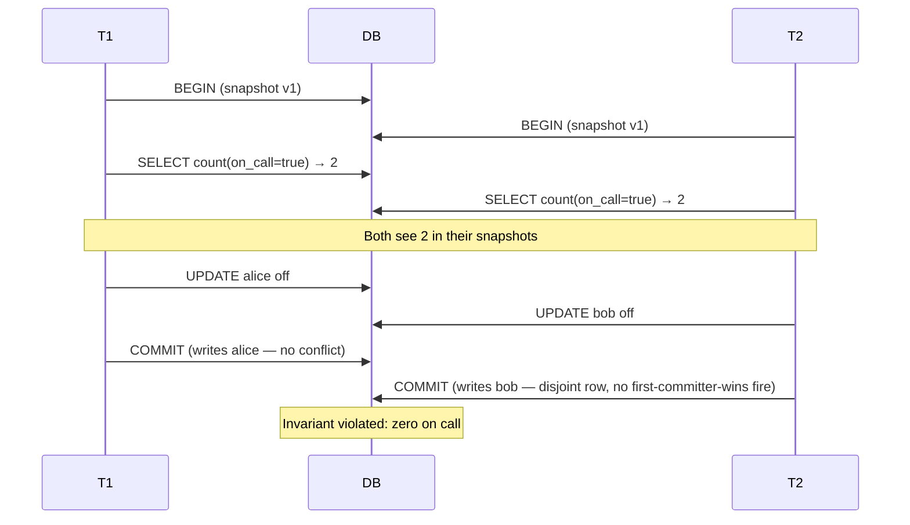
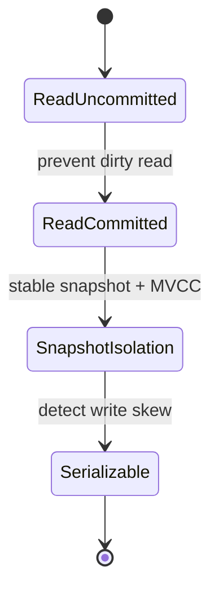

# ACID vs BASE and Isolation Levels in Practice

**Date:** 2026-04-25 | **Updated:** 2026-04-25
**Tags:** `system-design` `data-consistency` `acid` `base` `isolation` `transactions`

## Table of Contents

- [Summary](#summary)
- [ACID vs BASE — What They Actually Mean](#acid-vs-base--what-they-actually-mean)
  - [The False Dichotomy](#the-false-dichotomy)
- [Isolation Anomalies — Worked Examples](#isolation-anomalies--worked-examples)
  - [Dirty Read](#dirty-read)
  - [Non-Repeatable Read](#non-repeatable-read)
  - [Phantom Read](#phantom-read)
  - [Lost Update](#lost-update)
  - [Read Skew](#read-skew)
  - [Write Skew](#write-skew)
- [The Standard ANSI SQL Isolation Levels](#the-standard-ansi-sql-isolation-levels)
- [Snapshot Isolation](#snapshot-isolation)
- [Serializable Snapshot Isolation (SSI)](#serializable-snapshot-isolation-ssi)
- [Real Database Mappings](#real-database-mappings)
- [Picking an Isolation Level](#picking-an-isolation-level)
- [Distributed Twists](#distributed-twists)
  - [Isolation Across Replicas](#isolation-across-replicas)
  - [Isolation Across Shards](#isolation-across-shards)
  - [BASE and Eventual Consistency](#base-and-eventual-consistency)
- [Anti-Patterns](#anti-patterns)
- [Related](#related)
- [References](#references)

## Summary

ACID and BASE are not opposites — most "BASE" systems are still ACID per partition and only relax guarantees across nodes. The standard ANSI SQL isolation levels are a leaky abstraction: each engine maps the level names to subtly different mechanisms, and the default in Postgres, Oracle, MySQL InnoDB, and SQL Server is **not** what the standard describes. Pick a level by the anomalies you must prevent, then verify against the engine's actual behavior.

## ACID vs BASE — What They Actually Mean

**ACID** describes the guarantees a transactional database promises:

- **Atomicity** — all writes in a transaction commit together or none do; failure rolls everything back
- **Consistency** — the transaction moves the database from one valid state to another (constraints, triggers, FK invariants hold). This is the application-defined property; the database enforces only what you declare
- **Isolation** — concurrent transactions cannot observe each other's intermediate state. The strength of this guarantee is the isolation level — and this is where the marketing breaks down
- **Durability** — once committed, the write survives crashes (typically via WAL + fsync)

**BASE** was coined by Eric Brewer's team at eBay (and later popularized in the CAP-theorem era) as a deliberate counter-acronym:

- **B**asically **A**vailable — the system answers requests, possibly with stale or partial data
- **S**oft state — state may change without an input due to background convergence
- **E**ventual consistency — given no new writes, replicas converge to the same value

BASE describes the design **across** a distributed system. It is a statement about availability versus consistency under partition (CAP), not about transactional semantics within a single node.

### The False Dichotomy

The "ACID vs BASE" framing is misleading because most production "BASE" systems are still ACID inside one shard or partition:

| System | Per-shard semantics | Cross-shard / cross-replica semantics |
|--------|---------------------|---------------------------------------|
| DynamoDB | ACID transactions within a partition | Eventual consistency across replicas (configurable) |
| Cassandra | Atomic per-row, per-partition | Tunable consistency (ONE/QUORUM/ALL) |
| MongoDB | Document-level ACID; multi-doc transactions since 4.0 | Replica-set primary is linearizable; secondaries are eventual |
| Postgres + read replicas | Full ACID on the primary | Asynchronous replicas serve stale reads |
| Spanner / CockroachDB | Externally consistent (ACID) globally via TrueTime/HLC | Same — these reject the BASE trade-off |

The real question is rarely "ACID or BASE?" It is "which isolation level, on which data, with which replication mode?"

## Isolation Anomalies — Worked Examples

The ANSI/ISO SQL standard defines isolation levels by which **anomalies** they prevent. Berenson et al. (1995) showed the original list was incomplete and ambiguous; the modern catalog includes the original three plus three more.

Setup table for all examples:

```sql
CREATE TABLE accounts (
  id    INT PRIMARY KEY,
  owner TEXT,
  balance NUMERIC NOT NULL
);
INSERT INTO accounts VALUES (1, 'alice', 100), (2, 'bob', 100);
```

### Dirty Read

A transaction reads data written by another transaction that has not yet committed.

```text
T1: BEGIN;
T1: UPDATE accounts SET balance = 0 WHERE id = 1;
T2: BEGIN;
T2: SELECT balance FROM accounts WHERE id = 1;  -- reads 0 (uncommitted!)
T1: ROLLBACK;
-- T2 acted on data that never existed
```

Prevented by: **Read Committed** and above.

### Non-Repeatable Read

Within one transaction, the same row is read twice and the value changes because another transaction committed in between.

```text
T1: BEGIN;
T1: SELECT balance FROM accounts WHERE id = 1;  -- 100
T2: BEGIN; UPDATE accounts SET balance = 50 WHERE id = 1; COMMIT;
T1: SELECT balance FROM accounts WHERE id = 1;  -- 50  (changed!)
```

Prevented by: **Repeatable Read** and above.

### Phantom Read

A re-executed range query returns a different set of rows because another transaction inserted (or deleted) matching rows.

```text
T1: BEGIN;
T1: SELECT count(*) FROM accounts WHERE balance > 50;  -- 2
T2: BEGIN; INSERT INTO accounts VALUES (3, 'carol', 200); COMMIT;
T1: SELECT count(*) FROM accounts WHERE balance > 50;  -- 3  (phantom!)
```

ANSI defines phantoms as prevented only at **Serializable**. In practice Postgres and MySQL InnoDB prevent phantoms at Repeatable Read via different mechanisms.

### Lost Update

Two transactions read a value, both compute a new value, and both write it back. One write silently overwrites the other.

```text
T1: BEGIN; SELECT balance FROM accounts WHERE id = 1;  -- 100
T2: BEGIN; SELECT balance FROM accounts WHERE id = 1;  -- 100
T1: UPDATE accounts SET balance = 100 + 10 WHERE id = 1; COMMIT;  -- 110
T2: UPDATE accounts SET balance = 100 + 20 WHERE id = 1; COMMIT;  -- 120
-- Expected 130, got 120. T1's deposit is lost.
```

Fixed by: `SELECT ... FOR UPDATE`, atomic `UPDATE ... SET balance = balance + 10`, optimistic `WHERE version = ?`, or Snapshot Isolation's first-committer-wins rule.

### Read Skew

A transaction reads multiple rows and observes an inconsistent snapshot because another transaction committed between the reads.

```text
T1: BEGIN;
T1: SELECT balance FROM accounts WHERE id = 1;  -- 100
T2: BEGIN;
T2: UPDATE accounts SET balance = balance - 30 WHERE id = 1;
T2: UPDATE accounts SET balance = balance + 30 WHERE id = 2;
T2: COMMIT;
T1: SELECT balance FROM accounts WHERE id = 2;  -- 130
-- T1 sees Alice=100, Bob=130. Total 230 — invariant broken (was 200).
```

Prevented by: **Snapshot Isolation** and above.

### Write Skew

Two transactions read overlapping data, each makes a decision based on what they read, then write to disjoint rows. Each write is individually fine, but together they violate an invariant.

The classic example: hospital on-call rota. Invariant: at least one doctor must be on call.

```text
Initial: alice on_call=true, bob on_call=true
T1: BEGIN;
T1: SELECT count(*) FROM doctors WHERE on_call = true;  -- 2 (ok to go off)
T2: BEGIN;
T2: SELECT count(*) FROM doctors WHERE on_call = true;  -- 2 (ok to go off)
T1: UPDATE doctors SET on_call = false WHERE name = 'alice';
T2: UPDATE doctors SET on_call = false WHERE name = 'bob';
T1: COMMIT;
T2: COMMIT;
-- Both committed. Now zero doctors on call. Invariant violated.
```



Prevented by: **Serializable** (true serializability or SSI). **Not** prevented by plain Snapshot Isolation, which is why "Repeatable Read" in Postgres/Oracle is not actually serializable.

## The Standard ANSI SQL Isolation Levels

The original ANSI SQL-92 definitions, ordered weakest to strongest:

| Level | Dirty Read | Non-Repeatable Read | Phantom Read |
|-------|------------|---------------------|--------------|
| Read Uncommitted | Possible | Possible | Possible |
| Read Committed | Prevented | Possible | Possible |
| Repeatable Read | Prevented | Prevented | Possible |
| Serializable | Prevented | Prevented | Prevented |

Berenson et al. (1995) — the **Critique of ANSI SQL Isolation Levels** — showed this taxonomy is incomplete. It omits lost update, read skew, and write skew, and it conflates lock-based and version-based implementations. Modern engines define their levels by mechanism, not by the ANSI table.

## Snapshot Isolation

**Snapshot Isolation (SI)** is what Postgres, Oracle, SQL Server, and MySQL InnoDB (under Repeatable Read) actually implement. The mechanism:

1. On `BEGIN`, the transaction takes a logical snapshot of the database at that moment
2. All reads in the transaction see only that snapshot — never values committed afterward
3. Writes are versioned (MVCC); other transactions see them only after commit
4. **First-committer-wins**: if two transactions write to the same row, the second to commit aborts with a serialization failure

What SI prevents for free:

- Dirty read (snapshots show only committed data)
- Non-repeatable read (the snapshot doesn't move)
- Read skew (atomic snapshot)
- Phantom read (range queries also see the snapshot — unlike pure ANSI Repeatable Read)
- Lost update (first-committer-wins for the same row)

What SI does **not** prevent:

- **Write skew** — disjoint writes never conflict, even if their decisions were based on overlapping reads

This gap is the entire reason "Repeatable Read" in Postgres and Oracle is not actually serializable, despite preventing more anomalies than ANSI Repeatable Read.



## Serializable Snapshot Isolation (SSI)

**Serializable Snapshot Isolation** (Cahill, Röhm, Fekete 2008) is Postgres's `SERIALIZABLE` mode since 9.1. It builds on SI by detecting **dangerous structures** in the dependency graph between concurrent transactions and aborting one if the schedule could not have been produced serially.

The core idea: track read-write dependencies between active transactions. A pattern called a "rw-antidependency" — T1 reads X, T2 writes X, T2 commits before T1 commits — combined with another antidependency between the same transactions in the opposite direction, forms a cycle that proves non-serializability.

Trade-offs:

- **Pure optimistic** — no extra locking on reads; only detection at commit time
- **Higher abort rate** under contention — applications must retry serialization failures (`SQLSTATE 40001`)
- **No phantom-read gaps** — index ranges are tracked via predicate locks (SIREAD locks)
- **Cost scales with read-set size** — long read-heavy transactions can blow up tracking memory

Postgres's `SERIALIZABLE` is the only widely-deployed engine using SSI. Oracle and MySQL `SERIALIZABLE` use stricter mechanisms (Oracle promotes to two-phase locking; MySQL InnoDB takes shared next-key locks on every read).

## Real Database Mappings

The same level name means different things in different engines.

| Engine | Default | What "Repeatable Read" really is | What "Serializable" really is |
|--------|---------|----------------------------------|-------------------------------|
| **Postgres** | Read Committed | Snapshot Isolation (no write-skew protection) | SSI (detects dangerous structures, retries needed) |
| **MySQL InnoDB** | Repeatable Read | Snapshot Isolation + next-key locks (prevents phantoms but allows write skew) | Two-phase locking with shared next-key locks on every read |
| **Oracle** | Read Committed | Not supported as a name; Oracle calls SI "Serializable" | Snapshot Isolation (yes — Oracle's SERIALIZABLE allows write skew) |
| **SQL Server** | Read Committed (lock-based) | Lock-based RR; phantoms still possible | Strict 2PL. Optionally `SNAPSHOT` level (= SI) and `READ_COMMITTED_SNAPSHOT` |
| **MongoDB** | Snapshot (multi-doc tx) | n/a per-name; multi-doc txns are SI on the primary | `linearizable` read concern + `majority` write concern; aborts on conflict |
| **CockroachDB** | Serializable | n/a | True serializable (SSI-like with HLC timestamps) — only level offered |
| **Spanner** | Strong (external consistency) | n/a | Strict serializable globally via TrueTime |

Notes:

- Oracle has no true "Repeatable Read" — its `SERIALIZABLE` is what Postgres calls Snapshot Isolation
- MySQL `REPEATABLE READ` prevents phantoms (unlike ANSI), but allows write skew (like SI)
- SQL Server has two parallel models: lock-based (legacy) and snapshot-based (`READ_COMMITTED_SNAPSHOT = ON`)
- CockroachDB removed weaker levels in 22.x — every transaction is serializable

## Picking an Isolation Level

Default is almost always **Read Committed**. Escalate when an anomaly matters:

| Need | Choose | Why |
|------|--------|-----|
| Throughput-first OLTP, no cross-row invariants | Read Committed | Cheapest; phantoms and read skew rarely matter for single-row CRUD |
| Reports / analytics in the same transaction | Snapshot / Repeatable Read | Stable view across many rows |
| Money movement, balance constraints | Serializable, or RC + `SELECT FOR UPDATE` | Prevent lost updates and read skew on critical paths |
| Multi-row invariants (rota, inventory caps, no-double-booking) | Serializable (Postgres SSI) | Only level that prevents write skew |
| External consistency across regions | Spanner / CockroachDB serializable | Engines that don't even offer weaker levels |

Application-level patterns that often beat raising the isolation level:

- **Atomic UPDATE with arithmetic on the row**: `UPDATE accounts SET balance = balance + 10 WHERE id = 1` is safe at any isolation level above Read Uncommitted
- **`SELECT ... FOR UPDATE`** for read-modify-write loops (explicit pessimistic lock)
- **Optimistic concurrency control**: a `version` column with `WHERE version = ?`, retry on mismatch
- **Unique constraints / exclusion constraints** to enforce invariants the transaction layer can't see

Always wrap serializable transactions in retry logic. Postgres returns `SQLSTATE 40001` (`could not serialize access`) and the application is expected to retry the whole transaction.

```text
PSQLException: ERROR: could not serialize access due to read/write dependencies among transactions
SQLSTATE: 40001
HINT: The transaction might succeed if retried.
```

## Distributed Twists

### Isolation Across Replicas

Single-node ACID stops at the primary. Read replicas serve potentially stale data:

- **Async replication (Postgres streaming, MySQL row-based)** — secondaries lag by milliseconds to seconds
- **Read-your-own-writes** — gone. A user POSTs, the next GET hits a replica that hasn't seen the write yet
- **Monotonic reads** — also fragile across replicas if a session can be load-balanced

Mitigations:

- Route reads-after-writes to the primary for a window
- Use causality tokens (Postgres `pg_current_wal_lsn()` / `pg_wal_replay_wait_for_lsn()` in 17+; MongoDB cluster time)
- Synchronous replication (Postgres `synchronous_commit = on` with named standbys; tradeoff: write latency)

### Isolation Across Shards

A "transaction" that spans two shards is no longer ACID by default — each shard is its own commit domain. Options:

- **Two-phase commit (2PC)** — atomic across shards but blocks under coordinator failure; rare in practice
- **Saga pattern** — application-coordinated compensating transactions (eventual consistency at the business layer)
- **Globally consistent engines** — Spanner, CockroachDB, YugabyteDB use distributed timestamps + Paxos/Raft to offer real serializability across shards

If the data model demands cross-shard invariants, fight the sharding scheme first. Cross-shard transactions are an architectural smell.

### BASE and Eventual Consistency

"Eventually consistent" is a real guarantee but a weak one:

- **No bound** on how long convergence takes (typical implementations bound it in milliseconds, but "eventual" is the contract)
- **No read-your-writes** unless the client sticks to a quorum or a primary
- **Anti-entropy** mechanisms (Merkle trees, hinted handoff, gossip) repair drift in the background
- Applications need **conflict resolution** — last-write-wins (lossy), vector clocks, CRDTs (lattice-based merge)

DynamoDB and Cassandra expose tunable consistency. With `QUORUM` reads and writes (`R + W > N`), you get linearizable single-key operations without giving up multi-region availability — but you still don't have cross-key transactions.

## Anti-Patterns

- **Assuming "Repeatable Read" prevents phantoms uniformly.** ANSI says it doesn't, but Postgres/MySQL do. Code that runs on Postgres staging and Oracle production may see different anomalies on the same level name. Test against the engine you ship on.
- **Counting on Read Uncommitted for "fast reads".** Postgres treats Read Uncommitted as Read Committed (it ignores the request). MySQL honors it but exposes dirty reads that vanish on rollback — application logic acts on data that was never committed.
- **Ignoring write skew because "it never happens".** It happens whenever two users edit related but disjoint rows under an invariant. Doctor rotas, inventory caps, account-with-multiple-cards, double-booking calendars, balance-across-multiple-accounts — all classic write-skew shapes.
- **Using `SERIALIZABLE` without retry logic.** Postgres SSI aborts ~1% of transactions under moderate contention. Without retry, your error rate becomes "real". Wrap in a retry loop with bounded attempts and jittered backoff.
- **`SELECT FOR UPDATE` on read-only paths.** Pessimistic locks serialize throughput. Use them only when the read-modify-write is real.
- **Treating ORM-level transactions as serializable.** JPA/Hibernate, Sequelize, and Prisma all use the database's default level (usually Read Committed) unless you set it. Read the dialect docs before assuming guarantees.
- **Conflating ACID with "the database is consistent".** Application-level constraints (e.g., "users.email matches profiles.email") are not enforced unless you declared them. ACID's "C" is your responsibility.

## Related

- [Database Index — internals, design, polyglot persistence](../../database/INDEX.md)
- [CAP Theorem and Consistency Models](../foundations/cap-and-consistency-models.md) — linearizability, sequential consistency, eventual consistency, and the CAP/PACELC framing
- [Distributed Transactions — 2PC, Sagas, and Outbox](distributed-transactions.md) _(planned)_ — when isolation across shards is unavoidable

## References

- [A Critique of ANSI SQL Isolation Levels (Berenson, Bernstein, Gray, Melton, O'Neil, O'Neil, 1995)](https://www.microsoft.com/en-us/research/wp-content/uploads/2016/02/tr-95-51.pdf) — the canonical paper showing the standard's gaps
- [Serializable Isolation for Snapshot Databases (Cahill, Röhm, Fekete, 2008)](https://courses.cs.washington.edu/courses/cse444/08au/544M/READING-LIST/fekete-sigmod2008.pdf) — the SSI algorithm Postgres uses
- [PostgreSQL Documentation: Transaction Isolation](https://www.postgresql.org/docs/current/transaction-iso.html) — what each level actually does in Postgres
- [MySQL InnoDB Transaction Isolation Levels](https://dev.mysql.com/doc/refman/8.4/en/innodb-transaction-isolation-levels.html) — InnoDB's SI + next-key locking model
- [Oracle Database Concepts: Data Concurrency and Consistency](https://docs.oracle.com/en/database/oracle/oracle-database/19/cncpt/data-concurrency-and-consistency.html) — Oracle's SI-as-Serializable model
- [Designing Data-Intensive Applications, Ch. 7 — Weak Isolation Levels (Martin Kleppmann)](https://www.oreilly.com/library/view/designing-data-intensive-applications/9781491903063/) — the modern reference on isolation anomalies
- [Jepsen: Analyses](https://jepsen.io/analyses) — empirical isolation testing of real databases (Postgres, MongoDB, CockroachDB, YugabyteDB, etc.)
- [Hermitage: testing transaction isolation in different databases](https://github.com/ept/hermitage) — Kleppmann's reproducible test suite mapping anomalies to engines
