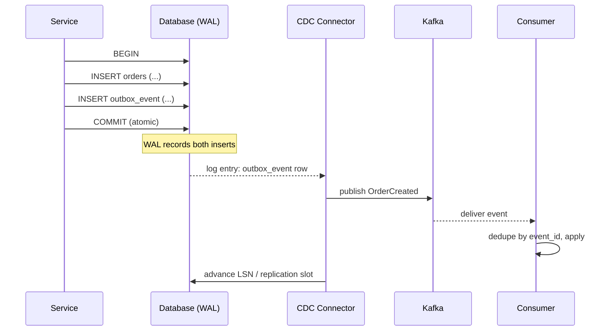
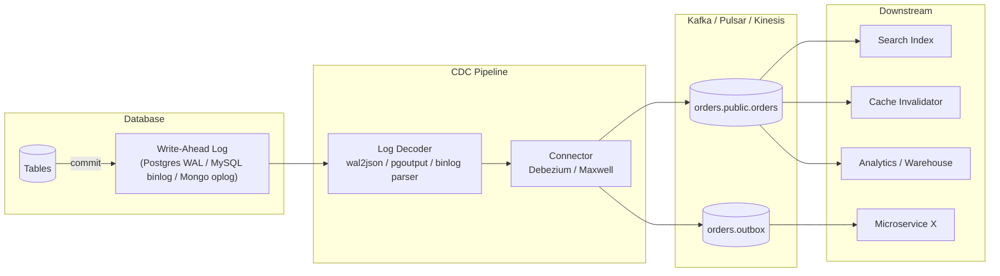
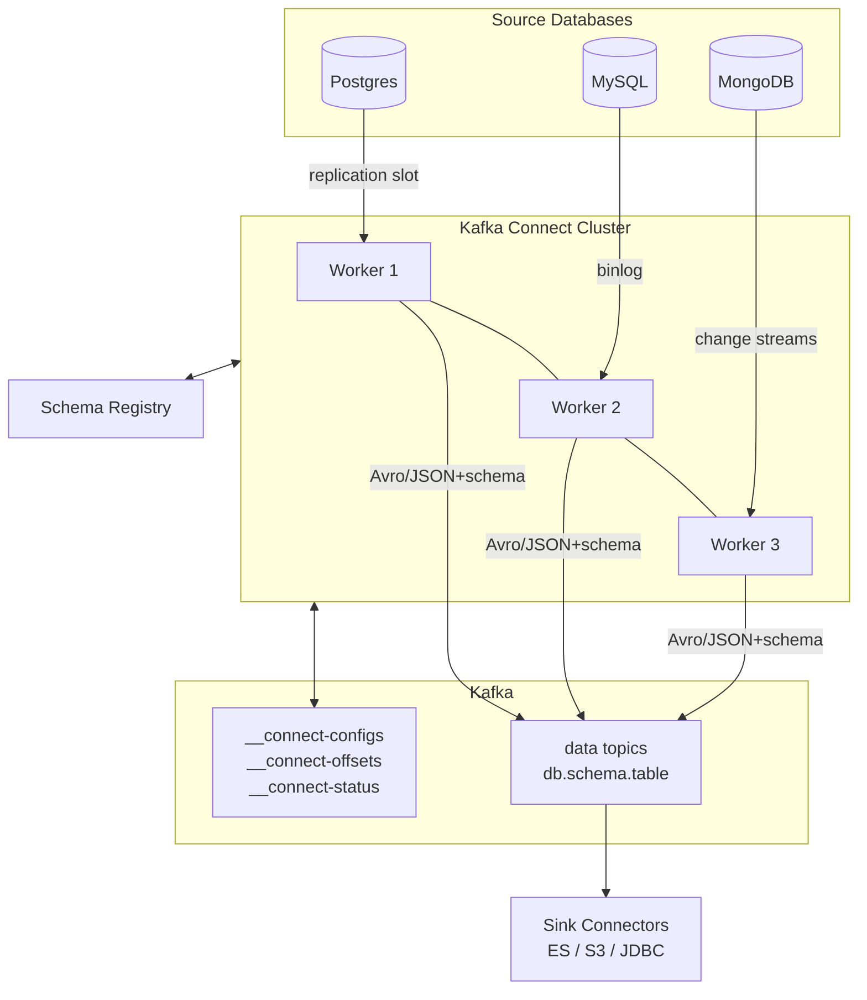

# Change Data Capture (CDC) and Dual Writes — Outbox, Debezium, and the Log as a Source of Truth

**Date:** 2026-04-25 | **Updated:** 2026-04-25
**Tags:** `system-design` `data-consistency` `cdc` `debezium` `kafka` `dual-writes`

## Table of Contents

- [Summary](#summary)
- [The Dual-Write Problem](#the-dual-write-problem)
- [Why Dual Writes Break in Practice](#why-dual-writes-break-in-practice)
- [The Solutions Hierarchy](#the-solutions-hierarchy)
  - [Transactional Outbox + CDC (the canonical fix)](#transactional-outbox--cdc-the-canonical-fix)
  - [Pure CDC from Base Tables](#pure-cdc-from-base-tables)
  - [Two-Phase Commit Across DB and Broker](#two-phase-commit-across-db-and-broker)
- [CDC Mechanics — From Log to Broker](#cdc-mechanics--from-log-to-broker)
- [Debezium Architecture](#debezium-architecture)
- [Logical Replication in Postgres](#logical-replication-in-postgres)
- [MySQL binlog with Maxwell, Canal, and Debezium](#mysql-binlog-with-maxwell-canal-and-debezium)
- [Snapshotting and Streaming](#snapshotting-and-streaming)
- [Schema Evolution and Schema Registry](#schema-evolution-and-schema-registry)
- [Use Cases](#use-cases)
- [Anti-Patterns](#anti-patterns)
- [Operational Checklist](#operational-checklist)
- [Related](#related)
- [References](#references)

## Summary

Anywhere a service has to "write to the database **and** publish an event," there is a hidden distributed-systems problem: those are two separate operations across two systems with no shared transaction. They will eventually drift. **Change Data Capture (CDC)** flips the problem on its head — instead of asking the application to publish events, it tails the database's own write-ahead log and turns committed rows into events. Combined with the **transactional outbox pattern**, CDC gives you reliable, ordered, exactly-effectively-once event delivery without rolling 2PC, while keeping the database as the single source of truth.

This doc walks through why naive dual writes fail, the canonical CDC + outbox fix, how Debezium and Postgres logical replication work under the hood, and the operational gotchas (replication slots, schema evolution, snapshot strategies) that bite teams in production.

## The Dual-Write Problem

The setup looks innocent. A service handles a `POST /orders`, persists an `Order` row, then publishes an `OrderCreated` event so downstream services (search index, inventory, billing, analytics) react.

```ts
// The trap
async function createOrder(input: OrderInput) {
  const order = await db.orders.insert(input);          // ① DB write
  await kafka.publish("orders.created", toEvent(order)); // ② broker publish
  return order;
}
```

Two operations, two systems, **no shared transaction**. There are four outcomes, and only one is "correct":

| ① DB write | ② Publish | Result |
|---|---|---|
| Success | Success | Consistent |
| Fail | (skipped) | Consistent — nothing happened |
| **Success** | **Fail** | **Order exists, no event — downstream never finds out** |
| **Fail** | **Success** | **Event exists, no order — downstream sees a phantom** |

The two failure rows are not theoretical:

- **DB succeeds, publish fails**: broker is down, network blips, the process gets OOM-killed between ① and ②. The order is committed; the event is lost. Search, inventory, and billing never learn about it. Reconciliation tomorrow needs a full diff.
- **DB fails, publish succeeds**: less common but possible if you publish first. Downstreams act on something that does not exist. Worse, the user got a 500 and may retry, producing duplicates if downstream is non-idempotent.

Reordering the operations does not help — it just swaps which side becomes inconsistent. There is no order of two non-transactional writes that is safe.

## Why Dual Writes Break in Practice

Even when both calls usually succeed, the pattern is fragile by construction:

1. **Process crashes mid-flow.** A pod restart, a kernel OOM, an unhandled exception between ① and ② all leave the DB committed and the event un-published. There is no recovery hook because the application no longer exists.
2. **Retries cause duplicates.** Wrap step ② in a retry loop and a transient broker error becomes _two_ deliveries (the first one secretly succeeded, broker just couldn't send the ack). Without idempotent consumers, downstream double-applies.
3. **Eventual divergence compounds.** Each missed event is a permanent gap. Over months you accumulate orphan rows in DB and orphan events in the topic. "Just rebuild the search index from the DB" implies you trust the DB more than the events, which means the events were never the source of truth, which means you wasted them.
4. **Hot-path latency.** Synchronous publish couples user request latency to broker latency. When Kafka has a hiccup, your `POST /orders` p99 spikes. To avoid that, teams often async-fire-and-forget the publish — guaranteeing the lost-event failure mode.
5. **Ordering and causality break.** Two requests for the same customer can interleave: tx A commits before tx B at the DB but B publishes before A at the broker. Downstream sees `B then A` and applies state in the wrong order.

The deeper truth: **the database has already solved durable, ordered, atomic writes**. It has a transaction log that records every committed change, in order, durably. The application does not need to re-implement that on top of two systems. It just needs to **read** what the database already recorded.

## The Solutions Hierarchy

There are three real options when you must turn DB writes into reliable events. They are not equivalent.

### Transactional Outbox + CDC (the canonical fix)

The application writes the business row **and** an `outbox_event` row in the **same DB transaction**. Either both commit or neither does — atomicity is back. A separate process (the CDC pipeline) reads new outbox rows from the DB log and publishes them to the broker. If the publisher crashes, it resumes from its last checkpoint and re-publishes; consumers must be idempotent (use the event ID).



Properties:

- **Atomic with the business state** — outbox row commits with the order, full stop.
- **At-least-once delivery to the broker** — CDC retries on failure, possibly republishing.
- **Effectively-once for consumers** — consumers dedupe by `event_id` (idempotency keys; see [planned doc](../communication/idempotency-and-exactly-once.md)).
- **Ordered per aggregate** — events for the same order arrive in commit order if you partition by aggregate ID.
- **No coupling to broker availability** — the service's hot path only talks to the DB.

This is the pattern Microsoft, Stripe, Shopify, Uber, and most large microservice estates settle on after burning themselves on dual writes.

### Pure CDC from Base Tables

Skip the outbox; let the CDC connector emit events directly from base tables (`orders`, `order_items`, etc.). Each row insert/update/delete becomes a change event.

Pros:

- Zero application changes — the DB is the only thing the service touches.
- Captures every change, including ones made by ad-hoc SQL, jobs, or admin tools.

Cons:

- **Schema becomes the contract.** Renaming a column is a breaking event change; consumers couple to physical tables.
- **Events are row-shaped, not domain-shaped.** A "customer changed plan" domain event might span 3 tables; CDC emits 3 row events that the consumer must reassemble.
- **No control over event semantics.** You cannot easily emit `OrderShipped` only when `status` transitions specific values without consumer-side logic.

Use pure CDC for **derived stores** (search indices, caches, analytics warehouses) where the consumer wants raw row changes. Use outbox + CDC for **domain events** between bounded contexts.

### Two-Phase Commit Across DB and Broker

XA transactions can theoretically span the DB and a broker that supports XA. In practice:

- Most modern brokers (Kafka, NATS) **do not support XA at all**.
- Performance is poor — every transaction blocks on a coordinator.
- The coordinator is itself a SPOF and complicates deployment.
- "In-doubt" transactions during coordinator failure require manual intervention.

2PC is the textbook answer and almost always the wrong operational choice. See [distributed-transactions.md](distributed-transactions.md) for why 2PC is rare in modern microservice architectures.

## CDC Mechanics — From Log to Broker

Every transactional database has an internal append-only log of committed changes. CDC is the act of reading that log and publishing it elsewhere.



Key per-database surfaces:

| Database | Log | Decoder | Tooling |
|---|---|---|---|
| Postgres | WAL | `pgoutput` (built-in), `wal2json`, `decoderbufs` | Debezium PG, AWS DMS |
| MySQL / MariaDB | binlog (row format required) | binlog parser | Debezium MySQL, Maxwell, Canal |
| MongoDB | oplog / change streams | change streams API | Debezium Mongo |
| SQL Server | CDC tables / change tracking | T-SQL functions | Debezium SQL Server |
| Oracle | redo log | LogMiner / XStream | Debezium Oracle, GoldenGate |
| Cassandra | commit log | CDC log directory | Debezium Cassandra |

The connector is responsible for:

- **Subscribing** to the log (replication slot, server ID, oplog cursor).
- **Decoding** binary log records into structured row events with before/after images.
- **Tracking offsets** (LSN, binlog position, oplog timestamp) so it can resume after restart.
- **Publishing** to the broker, often one topic per source table by convention.
- **Sending heartbeats** so the DB knows it is safe to recycle log segments.

The offset tracking is what makes CDC at-least-once: on restart the connector resumes from the last committed offset and re-emits any events that happened after.

## Debezium Architecture

[Debezium](https://debezium.io/) is the de-facto open-source CDC platform. It runs on top of [Kafka Connect](https://kafka.apache.org/documentation/#connect) — a distributed, fault-tolerant runtime for source/sink connectors — and ships source connectors for the major databases.



What each piece does:

- **Kafka Connect workers** form a cluster; tasks are rebalanced across workers automatically. Connector state (configs, offsets, status) lives in internal Kafka topics so workers are stateless.
- **Source connectors** (one per database type) own a **replication slot** or equivalent, decode the log, and produce records.
- **Schema Registry** ([Confluent](https://docs.confluent.io/platform/current/schema-registry/index.html), [Apicurio](https://www.apicur.io/registry/)) stores Avro/Protobuf/JSON schemas referenced by ID in each message — making schema evolution explicit and forwards/backwards compatible.
- **Topics** follow the convention `<server>.<schema>.<table>`. Each event has a `before` and `after` image plus operation (`c` create, `u` update, `d` delete, `r` snapshot read).

Minimal Debezium Postgres connector config:

```json
{
  "name": "orders-postgres-connector",
  "config": {
    "connector.class": "io.debezium.connector.postgresql.PostgresConnector",
    "tasks.max": "1",
    "database.hostname": "postgres.internal",
    "database.port": "5432",
    "database.user": "debezium",
    "database.password": "${file:/secrets/debezium.properties:password}",
    "database.dbname": "orders_db",
    "topic.prefix": "orders",
    "plugin.name": "pgoutput",
    "publication.name": "dbz_publication",
    "slot.name": "dbz_orders_slot",
    "table.include.list": "public.orders,public.outbox_event",
    "snapshot.mode": "initial",
    "heartbeat.interval.ms": "30000",
    "key.converter": "io.confluent.connect.avro.AvroConverter",
    "key.converter.schema.registry.url": "http://schema-registry:8081",
    "value.converter": "io.confluent.connect.avro.AvroConverter",
    "value.converter.schema.registry.url": "http://schema-registry:8081",
    "transforms": "outbox",
    "transforms.outbox.type": "io.debezium.transforms.outbox.EventRouter",
    "transforms.outbox.table.fields.additional.placement": "type:header:eventType"
  }
}
```

The `outbox` SMT (Single Message Transform) is the [Debezium outbox event router](https://debezium.io/documentation/reference/stable/transformations/outbox-event-router.html). It routes outbox rows to per-aggregate topics (`orders`, `payments`, …), promotes `aggregate_id` to the message key (preserving per-aggregate ordering), and unwraps the `payload` JSON column into the message value.

## Logical Replication in Postgres

Postgres CDC rides on top of [logical replication](https://www.postgresql.org/docs/current/logical-replication.html), the same machinery used for cross-version replication and Postgres → Postgres pub/sub. Three concepts:

- **Output plugin** — decodes WAL records into a logical format. `pgoutput` is built-in (since PG 10); `wal2json` emits JSON; `decoderbufs` emits Protobuf. Debezium uses `pgoutput`.
- **Replication slot** — server-side cursor that tracks which WAL position a logical replica has consumed. The slot **prevents WAL files from being recycled** until the consumer has acknowledged them.
- **Publication / Subscription** — declarative selection of which tables emit changes (`CREATE PUBLICATION dbz_publication FOR TABLE orders, outbox_event`). The CDC tool subscribes to the publication.

Postgres setup essentials:

```sql
-- 1. Enable logical replication (postgresql.conf)
-- wal_level = logical
-- max_wal_senders = 10
-- max_replication_slots = 10

-- 2. Create a role for Debezium with REPLICATION + table SELECT
CREATE ROLE debezium WITH LOGIN REPLICATION PASSWORD '...';
GRANT SELECT ON public.orders, public.outbox_event TO debezium;

-- 3. Create the publication
CREATE PUBLICATION dbz_publication FOR TABLE public.orders, public.outbox_event;

-- 4. The connector creates the slot on first start, but you can pre-create:
SELECT pg_create_logical_replication_slot('dbz_orders_slot', 'pgoutput');
```

The outbox table itself:

```sql
CREATE TABLE public.outbox_event (
    id            UUID PRIMARY KEY DEFAULT gen_random_uuid(),
    aggregate_type TEXT NOT NULL,        -- "Order", "Payment"
    aggregate_id   TEXT NOT NULL,        -- routing key
    type           TEXT NOT NULL,        -- "OrderCreated"
    payload        JSONB NOT NULL,       -- the event body
    created_at     TIMESTAMPTZ NOT NULL DEFAULT now()
);

-- Cleanup job (CDC has already published these rows)
CREATE INDEX outbox_event_created_at_idx ON public.outbox_event (created_at);
-- DELETE FROM outbox_event WHERE created_at < now() - INTERVAL '7 days';
```

A service writes both rows in one transaction:

```sql
BEGIN;
INSERT INTO orders (id, customer_id, total) VALUES ('o-123', 'c-9', 4200);
INSERT INTO outbox_event (aggregate_type, aggregate_id, type, payload)
  VALUES ('Order', 'o-123', 'OrderCreated',
          '{"orderId":"o-123","customerId":"c-9","total":4200}');
COMMIT;
```

### Gotchas (Postgres-specific)

These are the ones that page you at 2 AM:

1. **Replication slots retain WAL forever if the consumer dies.** A stopped Debezium connector with an undropped slot will fill the disk. Monitor `pg_replication_slots.confirmed_flush_lsn` and alert on slot lag in bytes.
2. **Slots do not survive failover** unless you use [physical-replication-aware logical decoding](https://www.postgresql.org/docs/current/logicaldecoding.html) (PG 16+) or a tool like `pg_failover_slots`. Plan for re-snapshotting after a primary failover.
3. **Logical replication does not replicate DDL.** Schema changes on the source are invisible to the WAL stream — the connector keeps emitting old schema until it re-reads the catalog. Coordinate DDL with consumer rollouts.
4. **Vacuum cannot reclaim rows still pinned by a replication slot.** Long-stalled slots cause table bloat. Same alert as #1.
5. **`TRUNCATE` is replicated as a separate event** since PG 11; older consumers may not handle it.
6. **TOAST columns** (large values stored out-of-line) are only emitted on `UPDATE` if the column actually changed. Use `REPLICA IDENTITY FULL` on the table to always include them at the cost of WAL volume.

## MySQL binlog with Maxwell, Canal, and Debezium

MySQL CDC rides on the **binary log** (binlog). Requirements:

- `binlog_format = ROW` (statement format does not contain enough information).
- `binlog_row_image = FULL` to get full before/after images.
- A replication user with `REPLICATION SLAVE, REPLICATION CLIENT` privileges.
- A unique `server-id` per consumer.

Tooling landscape:

| Tool | Notes |
|---|---|
| [Debezium MySQL](https://debezium.io/documentation/reference/stable/connectors/mysql.html) | Kafka Connect-based, schema history topic, GTIDs supported |
| [Maxwell's Daemon](https://maxwells-daemon.io/) | Lightweight, JSON-only output, simpler than Debezium for small setups |
| [Alibaba Canal](https://github.com/alibaba/canal) | Heavily used in Chinese internet stack, can emit to Kafka/RocketMQ |
| [AWS DMS](https://aws.amazon.com/dms/) | Managed, multi-source, mostly used for one-shot migrations and ongoing replication into Aurora/Redshift |

Debezium MySQL also stores **schema history** in a dedicated Kafka topic so it can correctly decode old binlog records after a `ALTER TABLE`. Losing that topic without a fresh snapshot is unrecoverable — back it up.

## Snapshotting and Streaming

A connector arriving fresh at a 5-year-old database cannot start by tailing the log — it needs the **current state**. The standard pattern is **snapshot then stream**:

1. **Lock or set a consistent read point** (Postgres uses an exported snapshot from the replication slot creation; MySQL uses `FLUSH TABLES WITH READ LOCK` or GTID-based consistent snapshot).
2. **Read every row** from the included tables and emit synthetic `r` (read) events.
3. **Switch to streaming** from the log position captured at snapshot start. Any change that happened during snapshotting will replay from the log — consumers see it twice and dedupe by primary key.

Modes Debezium supports (`snapshot.mode`):

| Mode | Behavior |
|---|---|
| `initial` | Snapshot on first start, then stream. Default. |
| `never` | Stream only. Use when consumers will be bootstrapped some other way. |
| `when_needed` | Snapshot if no offsets exist or the log position is no longer available. |
| `schema_only` | Capture schema only, stream from current log position. Use to attach to an existing topic without re-emitting history. |
| `incremental` | [Incremental snapshots](https://debezium.io/documentation/reference/stable/connectors/postgresql.html#postgresql-incremental-snapshots) — chunked, resumable, can run alongside streaming. Critical for very large tables. |

Incremental snapshots solve the original Debezium pain point: a 2 TB table snapshot would lock progress for hours. With incremental snapshots, the connector chunks the table and interleaves snapshot reads with normal streaming — no downtime, can be added/resumed at runtime via signal table.

## Schema Evolution and Schema Registry

Events outlive code. A `users` topic written in 2024 will be read by services written in 2027. Without explicit schema management, every column rename is a downstream outage.

**Use a schema registry.** Avro and Protobuf both support compatibility rules:

- **Backward compatible**: new schema can read old data (consumers upgrade first).
- **Forward compatible**: old schema can read new data (producers upgrade first).
- **Full compatible**: both.

Practical rules:

- **Add columns with a default.** New consumers see the value; old consumers ignore the field.
- **Never remove a required field.** Make it optional first, wait until all consumers tolerate its absence, then remove.
- **Never change a field's type.** Add a new field with the new type, dual-write, migrate consumers, deprecate the old field.
- **Never reuse a field name with different semantics.** This is a contract change masquerading as a schema edit.

JSON without a registry is the worst of both worlds — implicit schema, no validation, and every consumer has its own brittle parser. If you must use JSON, use [JSON Schema](https://json-schema.org/) registered in Apicurio or Confluent.

## Use Cases

CDC + outbox is not a single feature — it is a fundamental data-movement primitive. Mature platforms use it for:

- **Search index sync.** DB → Kafka → Elasticsearch sink connector. The search index is a pure read replica of the system of record, rebuildable from the log.
- **Cache invalidation.** Change events drive precise cache busts, replacing TTL-only strategies. See [read-write-splitting-and-cache-strategies.md](../scalability/read-write-splitting-and-cache-strategies.md).
- **Derived stores.** Pre-aggregated views, denormalized projections (e.g., a `customer_360` materialized from 12 source tables) stay current via stream processors consuming CDC.
- **Microservice data fan-out.** A bounded context publishes domain events from its outbox; other contexts consume without sharing the database.
- **ETL / ELT replacement.** Nightly batch dumps replaced with continuous CDC into a warehouse (Snowflake, BigQuery, Redshift) — minutes-fresh analytics without touching the OLTP DB at peak.
- **Analytics CDC pipelines.** Iceberg / Delta / Hudi tables fed by CDC into a lakehouse — see [planned doc](oltp-vs-olap-and-lakehouses.md).
- **Audit logs.** Every committed change is captured immutably with full before/after; turn it into a tamper-evident audit trail.
- **Database migrations.** Live cutover from MySQL to Postgres (or self-hosted to Aurora) with CDC streaming changes in the background while the application is dual-routed.
- **Disaster recovery / cross-region replication.** CDC into a remote region's broker provides an asynchronous, queryable replica that survives primary-region loss.

## Anti-Patterns

Patterns that look like CDC but reproduce the dual-write failure modes or invent new ones:

1. **Application dual writes to DB and Kafka.** This is the problem. No amount of try/catch makes it atomic. If you see this, the answer is outbox + CDC.
2. **CDC without idempotent consumers.** CDC is at-least-once. A connector restart or a Kafka partition rebalance will redeliver events. Consumers must be idempotent on `(aggregate_id, event_id)` or you will double-charge customers.
3. **Polling base tables instead of log-based CDC.** "Find rows where `updated_at > last_seen`" works at 100 rows/sec and falls over at 10k. Polling misses deletes (no row to find), creates lock contention with writers, and never gives you ordering guarantees. Log-based CDC is mandatory at scale.
4. **Ignoring replication slot retention.** A stopped Debezium connector with a live slot will eat your disk in days. Alert on slot lag in bytes and on the connector's "task running" status as one alert pair.
5. **Treating base-table CDC events as domain events across team boundaries.** It couples the consumer team to the producer's physical schema. Use outbox + CDC for inter-service contracts; reserve raw table CDC for internal derived stores under the same team.
6. **No schema registry for cross-team events.** Eventually a producer renames a column and the consumer service crash-loops in production. The registry is non-optional once events leave the team that produced them.
7. **Snapshotting every restart.** Misconfigured `snapshot.mode = always` in test that bleeds into prod. Snapshots take hours on real-sized tables and pin replication slots — do not let them run on every connector bounce.
8. **Outbox table without cleanup.** Outbox grows forever, vacuum stops keeping up, queries get slow. Run a scheduled `DELETE FROM outbox_event WHERE created_at < now() - INTERVAL '7 days'` after CDC has confirmed the LSN past those rows.
9. **Letting consumers fan out from the outbox topic randomly.** Without a key, you lose per-aggregate ordering. Always set the message key to the aggregate ID (the Debezium outbox SMT does this for you).

## Operational Checklist

Before declaring CDC production-ready:

- [ ] Outbox table has a primary key, an aggregate key column, and a created-at index
- [ ] Application writes business row + outbox row in the same transaction (verified by test)
- [ ] Connector is configured with a named, stable replication slot / server ID
- [ ] Replication slot lag (bytes) and connector task status are alerted independently
- [ ] Snapshot strategy is chosen and tested (`initial` vs `incremental` for large tables)
- [ ] Schema registry is in place; compatibility mode is `backward` or `full`
- [ ] Topic naming convention is documented (`<service>.<aggregate>` or per-table)
- [ ] Outbox cleanup job is scheduled and tested against the connector's confirmed LSN
- [ ] Consumers dedupe by event ID and handle redelivery
- [ ] Failover plan: how to recreate slots / reposition the connector after primary loss
- [ ] DR runbook for "what if the schema history topic is lost" (MySQL Debezium)
- [ ] Load test: connector handles 2x peak write rate without falling behind

## Related

- [Distributed Transactions — 2PC, 3PC, Sagas, Outbox](distributed-transactions.md) — why 2PC is rare, sagas as the alternative, outbox as the glue between the saga and the broker
- [Event-Driven Architecture — Pub/Sub, Choreography vs Orchestration](../communication/event-driven-architecture.md) _(planned)_ — what to put on the events that CDC emits and how services consume them
- [Idempotency and Exactly-Once Semantics](../communication/idempotency-and-exactly-once.md) _(planned)_ — the consumer side of the contract that makes CDC's at-least-once acceptable
- [Replication Patterns — Primary-Replica, Multi-Primary, Quorum](../scalability/replication-patterns.md) — physical replication mechanisms; logical replication is the layer above
- [CQRS and Event Sourcing](../scalability/cqrs-and-event-sourcing.md) — adjacent pattern; event sourcing makes events the source of truth, CDC makes the DB the source of truth and derives events from it
- [Message Queues & Brokers](../building-blocks/message-queues-and-brokers.md) — Kafka semantics that CDC depends on (partition ordering, retention, compaction)
- [Read/Write Splitting & Cache Strategies](../scalability/read-write-splitting-and-cache-strategies.md) — CDC-driven cache invalidation as a precise alternative to TTLs

## References

- [Debezium Documentation](https://debezium.io/documentation/) — connector references, transformations, deployment guides for all supported databases
- [Debezium Outbox Event Router (SMT)](https://debezium.io/documentation/reference/stable/transformations/outbox-event-router.html) — the standard implementation of the outbox pattern on top of Debezium
- [Postgres Logical Replication](https://www.postgresql.org/docs/current/logical-replication.html) and [Logical Decoding](https://www.postgresql.org/docs/current/logicaldecoding.html) — the official references for replication slots, publications, and output plugins
- [Confluent: "No More Silos: How to Integrate Your Databases with Apache Kafka and CDC"](https://www.confluent.io/blog/no-more-silos-how-to-integrate-your-databases-with-apache-kafka-and-cdc/) — Robin Moffatt's canonical article on Kafka Connect + CDC patterns
- [Martin Kleppmann — "Turning the Database Inside-Out with Apache Samza"](https://martin.kleppmann.com/2015/03/04/turning-the-database-inside-out.html) — the talk that reframed CDC as the foundation of stream-processing architectures (and the chapter "The Unbundled Database" in _Designing Data-Intensive Applications_)
- [Microsoft — Transactional Outbox Pattern](https://learn.microsoft.com/en-us/azure/architecture/databases/guide/transactional-outbox-cosmos) — Microsoft's reference write-up of the outbox pattern (Cosmos-flavored but generally applicable)
- [microservices.io — Pattern: Transactional Outbox](https://microservices.io/patterns/data/transactional-outbox.html) — Chris Richardson's pattern catalog entry, with worked examples and trade-off discussion
- [Apache Kafka Connect](https://kafka.apache.org/documentation/#connect) — the runtime that hosts Debezium and most sink connectors; required reading for operating CDC in production
