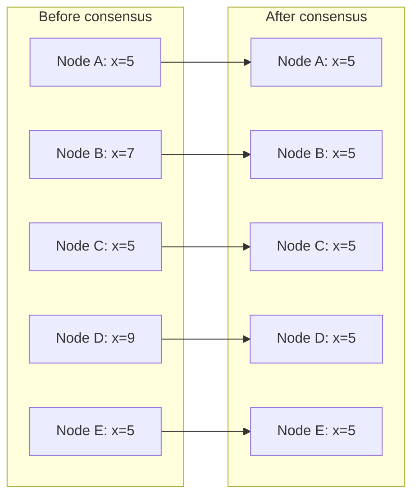
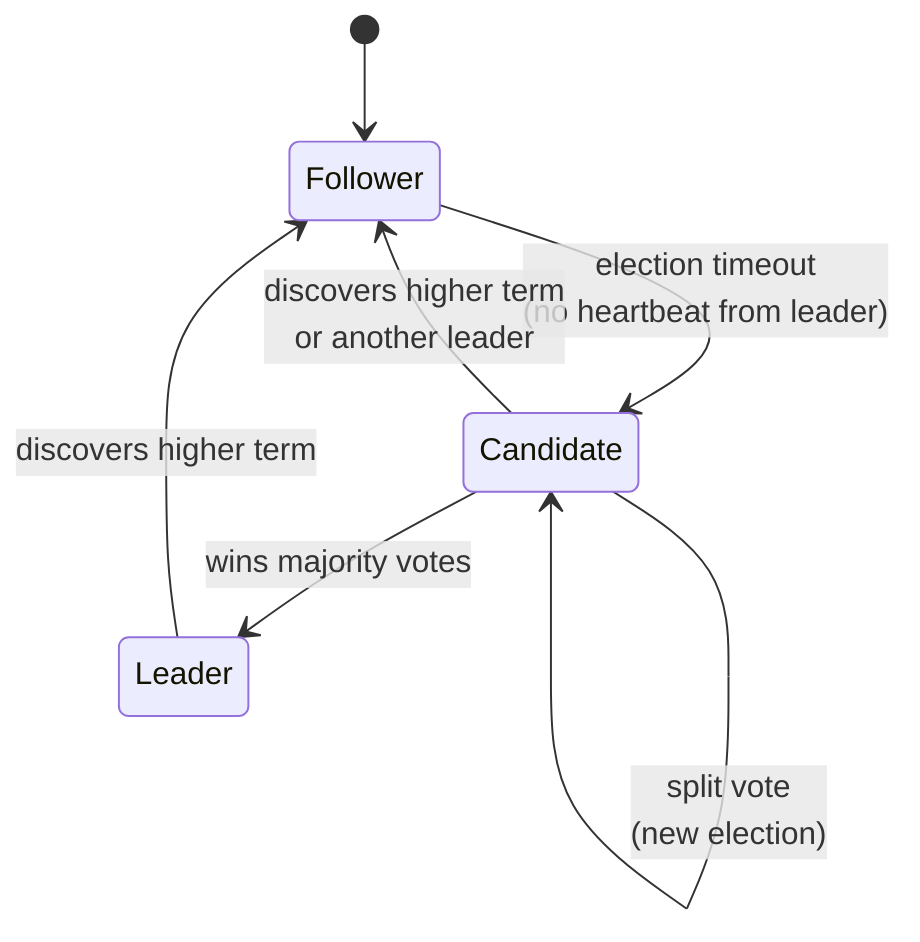
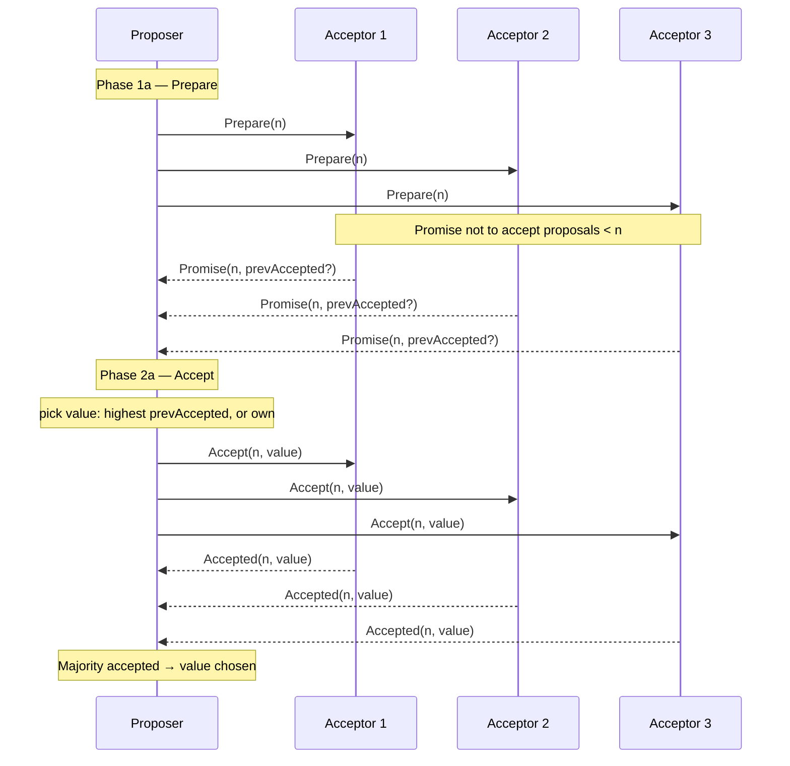

# Consensus — Raft and Paxos at a Conceptual Level

**Date:** 2026-04-25 | **Updated:** 2026-04-25
**Tags:** `system-design` `data-consistency` `consensus` `raft` `paxos` `distributed-systems`

## Table of Contents

- [Summary](#summary)
- [The Consensus Problem](#the-consensus-problem)
- [Replicated State Machines](#replicated-state-machines)
- [FLP Impossibility — Why Consensus Is Hard](#flp-impossibility--why-consensus-is-hard)
- [Raft — Designed to Be Understood](#raft--designed-to-be-understood)
  - [Server States and Transitions](#server-states-and-transitions)
  - [Terms, Elections, and the Election Timeout](#terms-elections-and-the-election-timeout)
  - [Log Replication and the Log Matching Property](#log-replication-and-the-log-matching-property)
  - [Commit Index and Applying Entries](#commit-index-and-applying-entries)
  - [Membership Changes — Joint Consensus](#membership-changes--joint-consensus)
  - [Snapshotting](#snapshotting)
- [Paxos — The Original](#paxos--the-original)
  - [Roles — Proposer, Acceptor, Learner](#roles--proposer-acceptor-learner)
  - [Basic Paxos in One Round](#basic-paxos-in-one-round)
  - [Multi-Paxos](#multi-paxos)
  - [Why Paxos Is Hard to Implement](#why-paxos-is-hard-to-implement)
- [Raft vs Paxos — A Practical Comparison](#raft-vs-paxos--a-practical-comparison)
- [Byzantine Fault Tolerance — A Different Threat Model](#byzantine-fault-tolerance--a-different-threat-model)
- [Real Systems Using Raft](#real-systems-using-raft)
- [Real Systems Using Paxos](#real-systems-using-paxos)
- [When You Reach for Consensus](#when-you-reach-for-consensus)
- [Practical Caveats — Quorum, Latency, and the Five-Node Sweet Spot](#practical-caveats--quorum-latency-and-the-five-node-sweet-spot)
- [Related](#related)
- [References](#references)

## Summary

Consensus is the problem of getting a group of unreliable, potentially partitioned nodes to agree on a single value or sequence of values. It is the foundation for every replicated state machine you depend on — etcd, ZooKeeper, Spanner, Kafka KRaft, CockroachDB. **Raft** and **Paxos** are the two algorithms you need to understand at a conceptual level. They are equivalent in safety guarantees, but Raft is engineered for understandability and matches how almost every modern system is built. Paxos is older, more flexible, and harder to implement correctly. This doc covers what consensus actually solves, the FLP impossibility result, both algorithms at a working depth, what real systems use, and when to (and not to) reach for consensus in your own designs.

## The Consensus Problem

You have **N nodes**. Some can crash. The network can drop, delay, or reorder messages. Yet you need them to **agree on a single value** — or a sequence of values — such that:

1. **Agreement (safety)** — no two non-faulty nodes ever decide on different values.
2. **Validity** — the agreed value was proposed by some node.
3. **Termination (liveness)** — every non-faulty node eventually decides.

This is harder than it looks. A single-leader model collapses when the leader fails. A simple majority vote collapses when votes are lost or duplicated. A timestamp-based scheme collapses because clocks drift. The problem must be solved with explicit message protocols and a tolerance for asynchrony.



Consensus is the foundation for **replicated state machines**, distributed locks, leader election, atomic commits, configuration change, and the entire control plane of distributed databases.

## Replicated State Machines

A **replicated state machine (RSM)** is the canonical use of consensus. The idea:

- Each node holds an identical, deterministic state machine (e.g. a key-value store).
- Clients submit **commands** (e.g. `SET x 5`).
- The cluster agrees on a **total order** of those commands via consensus.
- Each node applies the commands in order to its local state machine.

If consensus produces the same log on every node, and each node applies that log in order to a deterministic state machine, every node converges on the same state. That's how etcd, ZooKeeper, and the Raft layer in CockroachDB give you a strongly consistent, linearizable store on top of unreliable nodes.

```text
                   +-----------+
   client --SET--> | Consensus | --replicates entry to--> [N1] [N2] [N3]
                   +-----------+
                         |
                         v
              +----------+----------+
              |  Total-order log    |
              |  1: SET x=5         |
              |  2: SET y=7         |
              |  3: DEL x           |
              +----------+----------+
                         |
            apply in order to deterministic SM on each replica
```

The leader-election problem (planned: [leader-election-and-coordination.md](leader-election-and-coordination.md)) is itself solved by consensus — you elect a leader by getting a quorum of nodes to agree on who the leader is.

## FLP Impossibility — Why Consensus Is Hard

In 1985, Fischer, Lynch, and Paterson proved that **no deterministic consensus algorithm can guarantee both safety and liveness in a fully asynchronous network if even one node may crash**. (FLP, "Impossibility of Distributed Consensus with One Faulty Process".)

So how do real systems achieve consensus? They **weaken the model**:

- **Partial synchrony** — assume the network *eventually* delivers messages within some bound, even if not always. Real networks behave this way most of the time.
- **Randomization** — Raft uses **randomized election timeouts** to break symmetry; Ben-Or's algorithm uses random bits.
- **Failure detectors** — assume an oracle can eventually distinguish crashed from slow nodes.

Raft and Paxos are correct under partial synchrony: **safety is always guaranteed**, and **liveness is guaranteed when the network and at least a majority of nodes are healthy enough**. During a long partition or asymmetric failure, the algorithm refuses to make progress rather than risk safety.

## Raft — Designed to Be Understood

Raft was introduced by Diego Ongaro and John Ousterhout in 2014 with an explicit goal: **understandability**. Paxos had been the standard for two decades, and almost no one could implement it correctly without re-deriving it from scratch. Raft decomposes the problem into three sub-problems:

1. **Leader election** — pick one node to coordinate.
2. **Log replication** — the leader replicates entries to followers.
3. **Safety** — guarantees that committed entries are never lost or reordered.

Raft uses a **strong leader** model: all client requests go through the leader. Followers are passive — they only respond to leader RPCs. This is simpler than Paxos's symmetric model, at the cost of a brief unavailability window during leader election.

### Server States and Transitions

Every Raft server is in exactly one of three states at any time:



- **Follower** — receives `AppendEntries` (heartbeats + log entries) from a leader. Does nothing on its own.
- **Candidate** — when a follower's election timeout fires without a heartbeat, it becomes a candidate, increments the term, votes for itself, and requests votes from the rest.
- **Leader** — won an election in the current term. Issues `AppendEntries` to all followers, both as heartbeats and to replicate log entries. Handles all client requests.

### Terms, Elections, and the Election Timeout

Raft divides time into **terms** — monotonically increasing logical clock values. Each term starts with an election; if a leader emerges, that term lasts until the next election. A term with no elected leader (e.g. split vote) ends, and the next term starts.

The **election timeout** is randomized per node, typically in the range 150–300 ms. Randomization is crucial — it prevents all followers from becoming candidates at the same instant, which would cause perpetual split votes.

```pseudocode
// Pseudocode — RequestVote RPC (called by candidates)
function RequestVote(args):
  // args = { term, candidateId, lastLogIndex, lastLogTerm }

  if args.term < currentTerm:
    return { term: currentTerm, voteGranted: false }

  if args.term > currentTerm:
    currentTerm = args.term
    votedFor = null
    state = FOLLOWER

  // grant vote only if we haven't voted this term, AND
  // the candidate's log is at least as up-to-date as ours
  upToDate = args.lastLogTerm > log.lastTerm()
          OR (args.lastLogTerm == log.lastTerm() AND args.lastLogIndex >= log.lastIndex())

  if (votedFor == null OR votedFor == args.candidateId) AND upToDate:
    votedFor = args.candidateId
    resetElectionTimeout()
    return { term: currentTerm, voteGranted: true }

  return { term: currentTerm, voteGranted: false }
```

The "log up-to-date" check is the **election restriction** — Raft only allows a candidate to win if its log contains all committed entries. This is what prevents data loss across leader changes.

### Log Replication and the Log Matching Property

Once elected, the leader receives client commands, appends them to its log, and replicates them to followers via `AppendEntries`:

```pseudocode
// Pseudocode — AppendEntries RPC (called by leader)
function AppendEntries(args):
  // args = { term, leaderId, prevLogIndex, prevLogTerm, entries[], leaderCommit }

  if args.term < currentTerm:
    return { term: currentTerm, success: false }

  resetElectionTimeout()

  // consistency check — our log must agree with leader at prevLogIndex
  if log[args.prevLogIndex] does not exist
     OR log[args.prevLogIndex].term != args.prevLogTerm:
    return { term: currentTerm, success: false }   // leader will retry with earlier index

  // delete any conflicting entries, append new ones
  for each entry in args.entries:
    if log[entry.index] exists AND log[entry.index].term != entry.term:
      truncate log from entry.index
    if log[entry.index] does not exist:
      log.append(entry)

  if args.leaderCommit > commitIndex:
    commitIndex = min(args.leaderCommit, log.lastIndex())

  return { term: currentTerm, success: true }
```

The **Log Matching Property** is Raft's core safety invariant:

- If two logs contain an entry with the same index and term, they are identical in all entries up to that index.

The leader enforces this by including `prevLogIndex` and `prevLogTerm` in every `AppendEntries`. If a follower's log doesn't match, it rejects the RPC; the leader decrements its `nextIndex` for that follower and retries until it finds the agreement point, then overwrites everything after. This is how a new leader cleans up conflicting entries from old leaders.

### Commit Index and Applying Entries

An entry is **committed** once the leader has replicated it to a **majority** of nodes (including itself). Once committed:

- The leader advances `commitIndex` and includes it in subsequent `AppendEntries`.
- Each follower applies entries up to `commitIndex` to its state machine in order.
- The leader returns success to the client only after the entry is committed and applied.

A subtle rule from the Raft paper: a leader may only commit entries from its **own term** by counting replicas. Entries from previous terms are committed indirectly, when an entry from the current term that follows them is committed. This rule prevents a corner case where an old entry could be lost after a series of leader changes.

### Membership Changes — Joint Consensus

Adding or removing nodes from a Raft cluster is dangerous: if you flip from configuration `C_old` to `C_new` atomically, you can briefly have two disjoint majorities and elect two leaders. Raft solves this with **joint consensus**:

1. Leader appends a special `C_old,new` entry to the log — the joint configuration.
2. While this entry is in flight, decisions require majorities from **both** `C_old` and `C_new`.
3. Once `C_old,new` is committed, leader appends `C_new` and replicates it.
4. Once `C_new` is committed, the cluster is fully on the new configuration.

A simpler alternative used by most modern Raft implementations is **single-server membership change** — add or remove one node at a time, since any single change cannot create disjoint majorities.

### Snapshotting

A Raft log grows forever if you don't compact it. Periodically, each node takes a **snapshot** of its state machine and discards log entries up to that point. The snapshot must record:

- The last included index and term (so it can be referenced like a log entry).
- The state machine state.
- The current cluster configuration.

If a follower falls so far behind that the leader has already discarded the entries it needs, the leader sends an **InstallSnapshot** RPC instead of `AppendEntries`. The follower replaces its state with the snapshot and resumes from there.

## Paxos — The Original

Paxos was introduced by Leslie Lamport in 1990 ("The Part-Time Parliament", a fictional Greek parliament — Lamport's notorious style). His follow-up "Paxos Made Simple" (2001) is the standard reference, but even "simple" Paxos is genuinely hard.

### Roles — Proposer, Acceptor, Learner

Paxos defines three roles. A single physical node can play any combination:

- **Proposer** — proposes values. Multiple proposers can run concurrently.
- **Acceptor** — votes on proposals. A value is chosen when accepted by a majority.
- **Learner** — learns the chosen value once it is decided.

Unlike Raft, there is no built-in notion of a leader. Multiple proposers can make progress in parallel; the protocol arbitrates between them.

### Basic Paxos in One Round

Basic Paxos decides on a single value with two phases:



```pseudocode
// Pseudocode — Basic Paxos proposer
function propose(value):
  n = next_proposal_number()                   // monotonically increasing, unique per proposer

  // Phase 1: Prepare
  responses = send Prepare(n) to all acceptors
  if not majority of responses are Promise:
    abort and retry with higher n

  // pick the highest-numbered previously-accepted value, or our own
  chosen_value = highest_accepted_value(responses) OR value

  // Phase 2: Accept
  responses = send Accept(n, chosen_value) to all acceptors
  if majority Accepted:
    return chosen_value as decided
  else:
    abort and retry
```

The key safety property: **once a value is chosen by a majority, no different value can ever be chosen later** — because any future proposer in Phase 1 will see it and adopt it.

### Multi-Paxos

Basic Paxos decides one value. To run a state machine you need to decide a sequence of values (one per log slot). Naively running Basic Paxos per slot has two problems:

1. Two phases per decision is slow.
2. Concurrent proposers can fight forever ("dueling proposers" — livelock).

**Multi-Paxos** fixes this by electing a **distinguished proposer** (effectively a leader) that can run Phase 1 once for a range of slots and then send streaming Phase 2 messages. Once stable, each decision costs one round trip.

This is the version Google Spanner, Chubby, and most production "Paxos" systems actually use. From the outside, Multi-Paxos and Raft look very similar — a stable leader committing log entries via majority replication.

### Why Paxos Is Hard to Implement

Paxos as presented in papers is a single-decree protocol. Turning it into a working replicated log requires answering questions the original paper does not address:

- How do you elect a stable leader, and how do leases work?
- How do you handle log holes when a slot has no proposed value?
- How do you do log compaction and snapshotting?
- How do you handle reconfiguration?
- What happens when a new leader takes over with partially accepted entries?

Engineers ended up writing complex, undocumented extensions like "Paxos Made Live" (Google's Chubby paper) describing all the additional machinery. Raft was created precisely because every Paxos implementation diverged from every other one.

## Raft vs Paxos — A Practical Comparison

| Aspect | Raft | Paxos (Multi-Paxos) |
|--------|------|----------------------|
| Year | 2014 | 1990 / 2001 |
| Design goal | Understandability | Generality and correctness |
| Leader model | Strong leader, mandatory | Optional distinguished proposer |
| Log model | Replicated log is core | Originally per-decree; bolted on |
| Log holes | Forbidden by design | Allowed; must be filled in |
| Membership change | Joint consensus / single-server | Ad-hoc; varies per implementation |
| Snapshotting | Specified in paper | Implementation-defined |
| Safety | Equivalent | Equivalent |
| Liveness under partial sync | Equivalent | Equivalent |
| Reference implementations | etcd, Hashicorp, TiKV, many | Spanner, Chubby (proprietary) |
| Easier to teach | Yes | No |
| Easier to extend | Slightly less flexible | More flexible if you can wield it |

Both are equivalent in **safety**: neither will ever produce conflicting committed values. The differences are in pedagogy, structure, and how easy they are to implement and reason about. **For new systems, pick Raft unless you have a specific reason not to.**

## Byzantine Fault Tolerance — A Different Threat Model

Raft and Paxos assume **crash-stop** failures — nodes either work correctly or stop. They cannot tolerate **Byzantine** failures, where nodes lie, send conflicting messages to different peers, or are actively malicious.

For adversarial environments (multiple organizations, blockchains, public networks), you need Byzantine Fault Tolerance:

- **PBFT** (Practical Byzantine Fault Tolerance, Castro and Liskov 1999) — tolerates up to `f` malicious nodes with `3f+1` total nodes, four message phases per decision.
- **Tendermint / CometBFT** — used in Cosmos blockchain ecosystem; classic-BFT-style with rotating proposers.
- **HotStuff** — used in Diem/Aptos; pipelined leader-based BFT.

BFT has higher message complexity (`O(n^2)` per round vs Raft's `O(n)`), needs more nodes for the same tolerance (`3f+1` vs `2f+1`), and is much slower. **Inside a trusted datacenter, you do not need BFT.** Use it only when you genuinely cannot trust other operators.

## Real Systems Using Raft

A non-exhaustive survey:

| System | Raft is used for |
|--------|------------------|
| **etcd** | The entire data store; Kubernetes' source of truth |
| **Consul** | Service registry, KV store, leader election |
| **CockroachDB** | Per-range replication; one Raft group per range |
| **TiKV** / **TiDB** | Per-region replication |
| **MongoDB** (3.2+) | Replica set elections (Raft-flavored, `protocolVersion: 1`) |
| **Kafka KRaft** | Replaced ZooKeeper for metadata/controller election (Kafka 3.3+) |
| **RethinkDB** | Cluster metadata and table replication |
| **Hashicorp Nomad** | Cluster state |
| **YugabyteDB** | Per-tablet replication |
| **InfluxDB Enterprise / IOx** | Cluster coordination |
| **Redis Raft** (module) | Strongly-consistent Redis variant |

Cross-reference: Kubernetes' [cluster architecture](../../kubernetes/core-concepts/cluster-architecture.md) depends entirely on etcd's Raft implementation for control-plane consistency.

## Real Systems Using Paxos

| System | Paxos variant |
|--------|---------------|
| **Google Chubby** | Multi-Paxos for the lock service ("Paxos Made Live") |
| **Google Spanner** | Multi-Paxos per data partition (one Paxos group per "split") |
| **Google Megastore** | Paxos for entity-group replication |
| **Apache Cassandra** | Paxos for Lightweight Transactions (`IF NOT EXISTS`, `IF`-conditioned updates) |
| **Apache ZooKeeper** | **Zab** (ZooKeeper Atomic Broadcast), Paxos-flavored but distinct |
| **Microsoft Azure Storage** | Paxos-based replication for some layers |
| **Heroku Doozer** (legacy) | Paxos lock service |

Zab is interesting: it is *not* Paxos, but it is in the same family — a leader-based total-order broadcast protocol with crash-recovery semantics. Reading the Zab paper alongside Raft makes the design choices very clear.

## When You Reach for Consensus

Consensus is **expensive**. Every committed write requires a majority round-trip — at least two network hops, often more. Use it where you genuinely need agreement:

**Yes, use consensus for:**

- **Leader election** — picking one writer per partition, one scheduler, one coordinator.
- **Distributed locks and leases** — fencing tokens for exclusive access.
- **Configuration and metadata** — cluster topology, schemas, feature flags, secrets — small, infrequently written, must be consistent.
- **Replicated commit logs** — when a small set of writes must be totally ordered and durable (financial ledgers, audit logs, transaction coordinators).
- **Membership management** — who is in the cluster, who is alive.

**No, do not use consensus for:**

- **High-throughput data-plane writes** — user posts, IoT telemetry, click events. Use partitioned stores (Cassandra, DynamoDB) with tunable consistency, or partition the consensus across many groups.
- **Read-heavy data** — caches, search indexes, analytics. Consensus for reads is the wrong axis; use replication and accept eventual consistency.
- **Cross-datacenter writes on the critical path** — paying tens to hundreds of milliseconds per write. Either use a globally-distributed system designed for it (Spanner, CockroachDB) or design around eventual consistency at the WAN boundary.

A useful rule: **consensus belongs in the control plane, partitioned stores belong in the data plane.** Kubernetes is the canonical example — etcd (Raft) for the control plane, applications running on top with their own replication strategies.

## Practical Caveats — Quorum, Latency, and the Five-Node Sweet Spot

A consensus group with `2f+1` nodes tolerates `f` failures, because a majority is `f+1`. Every committed write needs `f+1` acknowledgments.

| Cluster size | Majority | Failures tolerated | Notes |
|--------------|----------|--------------------|-------|
| 1 | 1 | 0 | Not actually replicated |
| 3 | 2 | 1 | Common minimum |
| 5 | 3 | 2 | The sweet spot |
| 7 | 4 | 3 | Diminishing returns |
| 9+ | 5+ | 4+ | Latency and message cost dominate |

**Why 5 nodes is usually optimal:**

- Tolerates **two simultaneous failures** — covers single-node failure during planned maintenance of another node, which is the realistic failure mode in a datacenter.
- Quorum is 3 — small enough for low replication latency.
- Adding more nodes does not improve write throughput (every write still needs a quorum) and slightly worsens latency (more parallel acks to wait on, plus the slowest of the quorum dominates).
- **Reads** can be served by any single node if you accept stale reads, or by the leader if you require linearizability — neither benefits from more replicas beyond five.

**Quorum and partitions:**

- A consensus group split by a network partition only makes progress on the side with the majority. The minority side stops accepting writes — a **deliberate** choice to preserve safety.
- This is the "P" in CAP: you keep **C**onsistency, you lose **A**vailability on the minority side.
- If you need writes on both sides, you do not want consensus — you want a multi-master/CRDT system that accepts conflicts and resolves them later.

**Cross-datacenter consensus:**

- Latency = round-trip time to the slowest member of the quorum.
- A 3-node group with one node in another region pays the WAN RTT on every write — tens of ms inside a continent, 100+ ms across continents.
- Production patterns: keep all consensus members in one region (with multi-region async replication), or use **witness/learner nodes** that don't participate in quorum, or use 5-region designs where any 3 of 5 form a quorum (Spanner-style).

**Read consistency:**

- A naive "read from leader" is fast but races: a leader that doesn't yet know it has been deposed can return stale data.
- **Lease-based reads** (Raft + leader leases) give you linearizable reads without a quorum round-trip if the leader holds a valid lease.
- **Read index** (Raft) confirms leadership via a heartbeat round before serving the read.
- **Follower reads** trade staleness for latency — useful for read-heavy workloads.

## Related

- [Leader Election and Coordination Services — ZooKeeper, etcd](leader-election-and-coordination.md) _(planned)_ — how consensus underpins leader election in practice; ephemeral nodes, watches, leases, fencing tokens
- [Quorum Reads/Writes (NWR) and Tunable Consistency](quorum-and-tunable-consistency.md) _(planned)_ — quorum without consensus; Dynamo-style N/W/R math and where it diverges from Raft/Paxos
- [Replication Patterns — Primary-Replica, Multi-Primary, Quorum](../scalability/replication-patterns.md) — how consensus fits into the replication taxonomy
- [Distributed Transactions — 2PC, 3PC, Sagas, Outbox](distributed-transactions.md) _(planned)_ — atomic commit is a different problem from consensus; how 2PC composes with consensus (Spanner uses Multi-Paxos *and* 2PC)
- [Kubernetes Cluster Architecture](../../kubernetes/core-concepts/cluster-architecture.md) — etcd as the working example of Raft in production

## References

- Diego Ongaro and John Ousterhout, ["In Search of an Understandable Consensus Algorithm" (Raft paper, USENIX ATC 2014)](https://raft.github.io/raft.pdf) — the canonical Raft paper, and genuinely readable
- [The Raft Site — Visualization, Reference, and Implementations](https://raft.github.io/) — interactive Raft animation and a comprehensive list of Raft implementations
- Leslie Lamport, ["Paxos Made Simple" (2001)](https://lamport.azurewebsites.net/pubs/paxos-simple.pdf) — the standard introduction to Paxos
- Tushar D. Chandra, Robert Griesemer, and Joshua Redstone, ["Paxos Made Live — An Engineering Perspective"](https://www.cs.utexas.edu/users/lorenzo/corsi/cs380d/papers/paper2-1.pdf) — Google's paper on what it actually takes to ship Paxos (Chubby)
- James C. Corbett et al., ["Spanner: Google's Globally-Distributed Database" (OSDI 2012)](https://research.google/pubs/spanner-googles-globally-distributed-database-2/) — Multi-Paxos plus TrueTime
- [etcd Raft Documentation](https://etcd.io/docs/latest/learning/) — the production Raft library that powers Kubernetes
- Heidi Howard, ["Paxos vs Raft: Have we reached consensus on distributed consensus?"](https://arxiv.org/abs/2004.05074) — direct technical comparison from a working consensus researcher
- [MIT 6.824 — Distributed Systems Lecture Notes](https://pdos.csail.mit.edu/6.824/) — public lecture notes and labs covering Raft, Paxos, Spanner
- Fischer, Lynch, Paterson, ["Impossibility of Distributed Consensus with One Faulty Process" (1985)](https://groups.csail.mit.edu/tds/papers/Lynch/jacm85.pdf) — the FLP result
- Miguel Castro and Barbara Liskov, ["Practical Byzantine Fault Tolerance" (OSDI 1999)](https://pmg.csail.mit.edu/papers/osdi99.pdf) — for the BFT side
