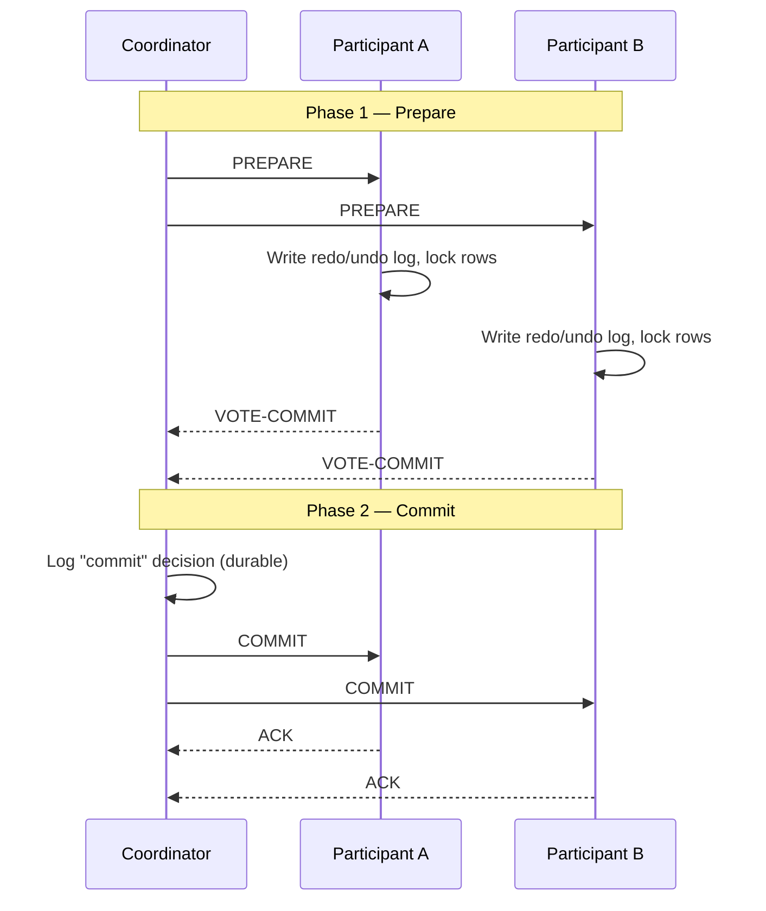
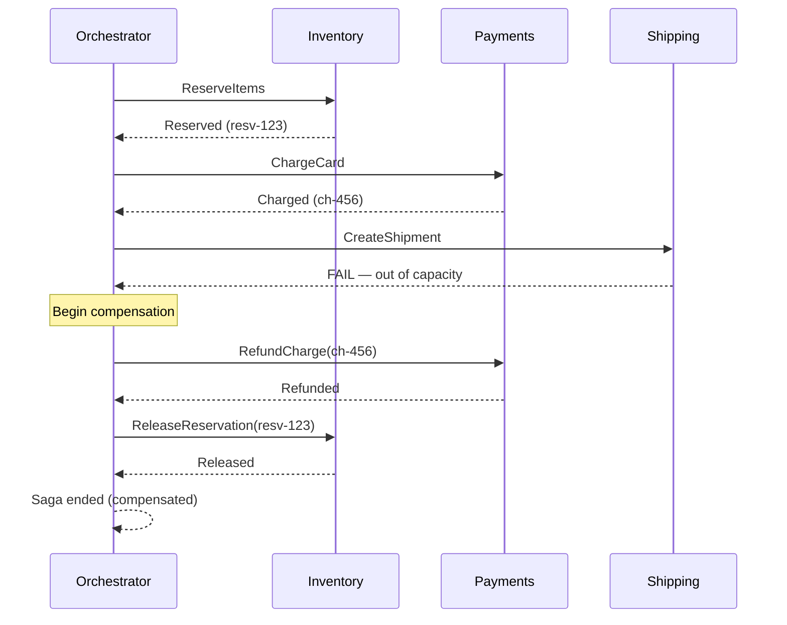
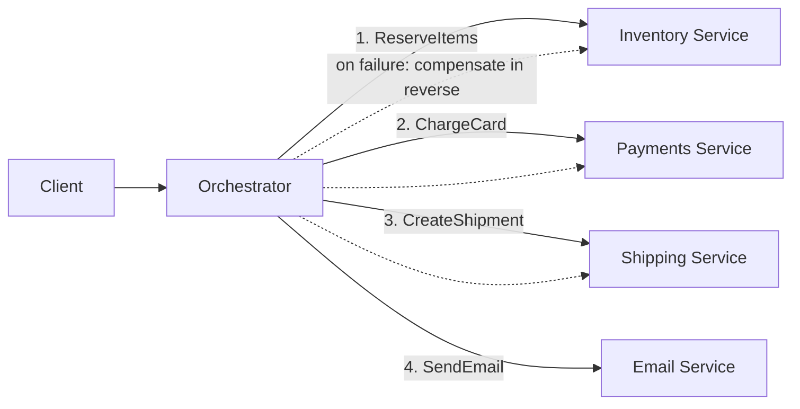
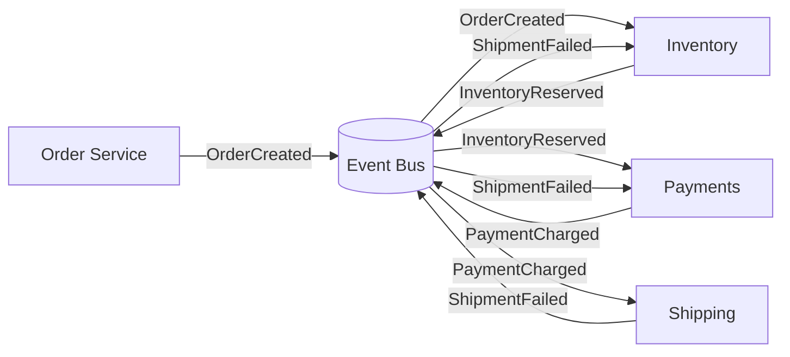
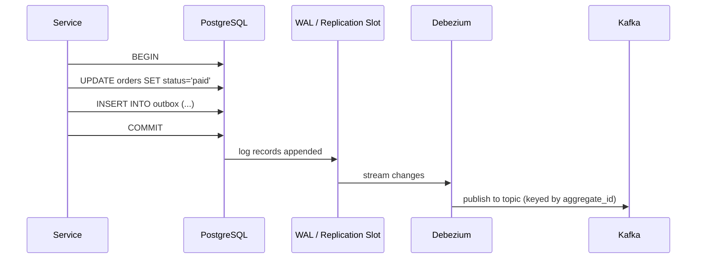

# Distributed Transactions — 2PC, 3PC, Sagas, and the Outbox Pattern

**Date:** 2026-04-25 | **Updated:** 2026-04-25
**Tags:** `system-design` `data-consistency` `distributed-transactions` `saga` `two-phase-commit` `outbox`

## Table of Contents

- [Summary](#summary)
- [The Problem — Atomicity Across Services and Databases](#the-problem--atomicity-across-services-and-databases)
- [Two-Phase Commit (2PC)](#two-phase-commit-2pc)
  - [The Protocol](#the-protocol)
  - [Why 2PC Blocks — The Coordinator Failure Killer](#why-2pc-blocks--the-coordinator-failure-killer)
- [Three-Phase Commit (3PC)](#three-phase-commit-3pc)
- [Sagas — The Modern Alternative](#sagas--the-modern-alternative)
  - [Compensating Transactions](#compensating-transactions)
  - [A Saga Sequence](#a-saga-sequence)
- [Orchestration — A Central Coordinator Owns the Workflow](#orchestration--a-central-coordinator-owns-the-workflow)
- [Choreography — Services React to Events](#choreography--services-react-to-events)
- [The Transactional Outbox Pattern](#the-transactional-outbox-pattern)
  - [The Dual-Write Problem](#the-dual-write-problem)
  - [Outbox + CDC](#outbox--cdc)
- [Idempotency — The Non-Negotiable Foundation](#idempotency--the-non-negotiable-foundation)
- [When 2PC Still Makes Sense](#when-2pc-still-makes-sense)
- [Real-World Patterns](#real-world-patterns)
- [Anti-Patterns](#anti-patterns)
- [Related](#related)
- [References](#references)

## Summary

A distributed transaction is any operation that must update state in two or more independent systems atomically — different databases, different microservices, or both. The classic textbook answer is **two-phase commit (2PC)**, but in modern partition-prone, microservice-heavy architectures it is the wrong default: 2PC blocks indefinitely on coordinator failure and couples services in a way that destroys availability. The modern answer is the **saga pattern** — a sequence of local transactions wired together with compensating actions, run either as an orchestration (central coordinator like Temporal) or a choreography (services reacting to events). Sagas almost always pair with the **transactional outbox pattern** to solve the dual-write problem (write to DB and publish event atomically), and **every step must be idempotent** because retries are guaranteed.

## The Problem — Atomicity Across Services and Databases

A monolith with a single relational database has it easy: wrap the work in `BEGIN; ... COMMIT;` and the database guarantees ACID. The moment you have two systems, that guarantee is gone.

Concrete examples:

- **E-commerce checkout** — reserve inventory in `inventory-svc`, charge the card via Stripe, create an order in `orders-svc`. If the charge succeeds but the order write fails, you took money for nothing.
- **Bank transfer** — debit account A in one shard, credit account B in another. A crash between the two leaves money missing or duplicated.
- **User signup** — write a row to PostgreSQL, then publish a `UserCreated` event to Kafka so downstream services (search, analytics, email) can react. If the Kafka publish fails after the DB commit, downstream is permanently inconsistent.

What you need is **all-or-nothing semantics across systems that can fail independently and that may be on opposite sides of a network partition**. The CAP theorem says you cannot have both consistency and availability in the presence of partitions, so any solution is a deliberate trade-off — and the trade-off you pick depends on whether you care more about correctness or about not blocking on a flaky downstream.

Three broad approaches exist:

1. **Synchronous atomic commit** — 2PC / 3PC, all participants vote, coordinator decides. Strong consistency, terrible availability.
2. **Sagas** — split into local transactions, compensate on failure. Eventual consistency, good availability.
3. **Single shared store** — sidestep the problem by putting all the data in one transactional system. Limits scalability but eliminates the class of bug.

The rest of this doc walks each in turn.

## Two-Phase Commit (2PC)

2PC is the textbook atomic commit protocol, defined by Jim Gray in the late 1970s and standardized as part of the [X/Open XA specification](https://pubs.opengroup.org/onlinepubs/009680699/toc.pdf). It guarantees that all participants either commit or abort — never a mix — assuming no permanent failures.

### The Protocol

There is a designated **coordinator** (the transaction manager) and one or more **participants** (resource managers — typically databases or message brokers).



Key invariants:

- After a participant votes `COMMIT`, it **must** be able to honor that vote forever — even after a crash and restart. It writes its prepare state to durable storage.
- The coordinator's decision (commit or abort) is also durably logged before being communicated.
- If any participant votes `ABORT`, the coordinator broadcasts `ABORT` to all and the transaction rolls back.

### Why 2PC Blocks — The Coordinator Failure Killer

Here is the failure mode that buries 2PC in practice:

A participant has voted `COMMIT` and is now **holding locks** on the rows it touched, waiting for the coordinator's final decision. The coordinator crashes _after_ collecting votes but _before_ broadcasting the decision (or after broadcasting to some but not all participants).

The participant is stuck:

- It cannot unilaterally commit — the coordinator might have decided abort.
- It cannot unilaterally abort — it already voted commit, and the coordinator might have decided commit.
- The locks it holds **cannot be released** until the decision is known.

This is the classic 2PC blocking problem. Until the coordinator recovers (with its log intact) and finishes the protocol, the participant is paralyzed and any other transaction trying to touch those rows is blocked too. In a distributed microservice setting where coordinator failure is normal — VMs reboot, pods get evicted, networks partition — this turns one failure into a cascade.

Other 2PC liabilities worth knowing:

- **Synchronous, blocking, chatty** — every transaction is at least 4 network round-trips and holds locks across all of them.
- **Heterogeneous resource managers are hard** — XA works between databases that all implement XA, but most modern systems (Kafka pre-2.5, DynamoDB, Redis, REST APIs) do not.
- **No partial progress** — the throughput ceiling of the slowest participant becomes the throughput ceiling of every transaction.

## Three-Phase Commit (3PC)

3PC was proposed (by Dale Skeen, 1981) to fix 2PC's blocking problem by inserting a **pre-commit** phase between prepare and commit:

1. **CanCommit?** — coordinator asks, participants vote yes/no
2. **PreCommit** — if all yes, coordinator tells everyone "we're going to commit", participants ack
3. **DoCommit** — coordinator tells everyone "commit now"

The trick: a participant that has received `PreCommit` knows the decision was committed (because the coordinator only sends `PreCommit` after collecting all yes votes). If the coordinator dies after `PreCommit` is sent, surviving participants can elect a new coordinator and complete the commit unilaterally — they know the answer.

In theory this is non-blocking under fail-stop assumptions. In practice, **3PC is essentially never used in production** because:

- It assumes a **synchronous network model** — bounded message delays, accurate failure detection. Real networks are asynchronous; you cannot reliably distinguish "node is slow" from "node is dead" (this is the [FLP impossibility result](https://groups.csail.mit.edu/tds/papers/Lynch/jacm85.pdf)).
- Network partitions can split the participants into groups that each elect their own coordinator and reach contradictory decisions — **split brain**.
- It adds a network round trip vs 2PC, making the latency story even worse.

The honest takeaway: 3PC is a good thing to know exists for an interview, but real systems that need atomic commit either accept 2PC's blocking risk or — far more commonly — abandon atomic commit entirely and use sagas.

## Sagas — The Modern Alternative

The saga pattern was named in a 1987 [Princeton paper by Garcia-Molina and Salem](https://www.cs.cornell.edu/andru/cs711/2002fa/reading/sagas.pdf), originally to describe long-running database transactions. Microservices revived it.

The core idea:

> A saga is a sequence of **local transactions**. Each local transaction commits independently in its own service. If a step fails, the saga executes **compensating transactions** for all previously completed steps to semantically undo them.

The trade you are making explicit:

- You give up **atomicity** in the strict sense — there are intermediate states where some steps have committed and others have not.
- You gain **availability** — every step is a normal local commit, no global locks, no two-phase coordination, no blocking on remote services.
- You accept **eventual consistency** — the system is not consistent at every instant but converges to a consistent state once the saga terminates (commit or compensation).

### Compensating Transactions

A compensating transaction semantically undoes a previously committed step. It is **not** a database rollback — the original transaction has already committed and may have been observed by other actors.

| Forward step | Compensation |
|--------------|--------------|
| Reserve inventory | Release inventory reservation |
| Charge credit card | Refund credit card |
| Allocate hotel room | Cancel hotel allocation |
| Send "your order shipped" email | Send "we cancelled your order" email |
| Award loyalty points | Deduct loyalty points (or mark them void) |

Properties compensations must have:

- **Semantically reversing** — the world after `forward + compensate` should be observably equivalent to the world where neither happened, modulo any side effects you cannot un-send (emails, SMS).
- **Idempotent** — must be safe to apply more than once, because retries happen.
- **Retriable** — failures of the compensation itself must be handled, usually by retrying with backoff. Compensations that cannot succeed are an operational alarm, not a swallow.
- **Cannot themselves fail in a way that leaves the saga stuck** — if you cannot guarantee a compensation will eventually succeed, the saga is broken.

A useful design heuristic: **design the compensations before you write the forward path**. If you cannot describe how to undo step N, you cannot safely commit step N − 1.

### A Saga Sequence

The canonical e-commerce booking saga:



A saga step in pseudocode:

```ts
// Pseudocode for a single saga step in an orchestrator
type StepResult<T> = { ok: true; data: T } | { ok: false; error: Error };

async function executeStep<T>(step: SagaStep<T>, sagaId: string): Promise<StepResult<T>> {
  // Idempotency key derived from saga + step so retries are deduped server-side
  const idempotencyKey = `${sagaId}:${step.name}`;

  for (let attempt = 0; attempt < step.maxAttempts; attempt++) {
    try {
      const data = await step.invoke({ idempotencyKey });
      await persistStepCompleted(sagaId, step.name, data); // durable progress
      return { ok: true, data };
    } catch (err) {
      if (isRetriable(err) && attempt < step.maxAttempts - 1) {
        await sleep(backoff(attempt));
        continue;
      }
      await persistStepFailed(sagaId, step.name, err);
      return { ok: false, error: err };
    }
  }
}
```

## Orchestration — A Central Coordinator Owns the Workflow

In an orchestrated saga, a dedicated component (the orchestrator / workflow engine) drives the sequence: it calls each participant in turn, tracks state, and decides when to compensate.



Common orchestration platforms:

- **[Temporal](https://docs.temporal.io/)** — open source, descended from Uber's Cadence; you write workflows as plain code (Go, Java, TypeScript, Python) and Temporal persists every event so the workflow can be resumed verbatim after any crash. Currently the dominant choice for new builds.
- **[Camunda](https://docs.camunda.io/)** — BPMN-based, popular in regulated enterprises (banking, insurance) where the workflow shape itself needs to be reviewed by non-engineers.
- **[AWS Step Functions](https://docs.aws.amazon.com/step-functions/latest/dg/welcome.html)** — JSON-defined state machines, deeply integrated with the AWS ecosystem.
- **[Netflix Conductor](https://conductor-oss.org/)** — open source, JSON-defined workflows.
- **Spring's `@Saga` / [Axon Framework](https://docs.axoniq.io/reference-guide/axon-framework/sagas)** — Java-specific saga support inside the Axon CQRS framework.

What an orchestrator buys you:

- **Durable state** — the workflow's progress is persisted, so an orchestrator crash does not lose the saga.
- **Centralized visibility** — one place to look to see which sagas are running, stuck, or compensating.
- **Easier reasoning** — the workflow shape is in one file; you can read the steps top-to-bottom.
- **Retries, timeouts, and backoff handled by the engine** — you do not write retry loops everywhere.
- **Versioning** — engines like Temporal support running old saga definitions to completion while new ones use a new shape.

Cost: the orchestrator is a critical dependency. It needs HA, monitoring, and (in Temporal's case) an underlying database that becomes the bottleneck under high saga throughput.

## Choreography — Services React to Events

In a choreographed saga there is no central coordinator. Each service publishes events when it completes its step, and other services subscribe to those events and act.



Pros:

- **No central component** — no orchestrator to operate, no single point of failure.
- **Loose coupling** — services do not need to know about each other directly, only the event contracts.
- **Naturally fits event-driven architectures** built on Kafka, NATS, EventBridge, etc.

Cons (these are the ones that matter):

- **Hard to reason about end-to-end** — the saga's shape is implicit in the wiring of subscriptions, scattered across many service repos. Answering "what happens when an OrderCreated event fires?" requires reading every consumer.
- **Hard to monitor** — there is no single record of "saga 123 is currently between step 2 and step 3". You have to reconstruct progress from logs across services.
- **Cyclic dependency risk** — services consuming each other's events tend to become tangled. Adding a new step often requires changing the subscription graph in several places.
- **Compensation logic is distributed** — every service has to know which other events imply "you should compensate". Orchestration centralizes that knowledge.

A reasonable rule of thumb: **choreography works for short sagas (2–3 steps) where the event flow is obvious. Anything longer or branchier almost always benefits from orchestration.**

## The Transactional Outbox Pattern

Sagas only work if every step can be triggered reliably. In practice, that means whenever a service finishes its local transaction, it must reliably tell the rest of the world — usually by publishing an event. That sounds easy. It is not.

### The Dual-Write Problem

The naive implementation:

```ts
// BROKEN — do not do this
await db.transaction(async (tx) => {
  await tx.update("orders", { id, status: "paid" });
});
await kafka.publish("OrderPaid", { id }); // <-- separate operation
```

Failure modes:

- DB commits, then the process crashes before publishing → event lost forever, downstream never knows.
- DB commits, network blips, Kafka publish times out → ambiguous; do you retry and risk a duplicate, or skip and risk a loss?
- Publish succeeds, then DB commit fails on a deferred constraint → downstream sees an event for a state that was never persisted.

You cannot make these two writes atomic by ordering them or by retry alone — they are independent systems. This is the **dual-write problem**, and it is one of the most common bugs in event-driven microservices.

The transactional outbox pattern fixes it by making the two writes into **one** write, against the same database, in the same local transaction.

```sql
-- The outbox table lives in the SAME database as your business tables
CREATE TABLE outbox (
  id            UUID PRIMARY KEY DEFAULT gen_random_uuid(),
  aggregate_id  TEXT NOT NULL,
  aggregate_type TEXT NOT NULL,        -- e.g. "Order"
  event_type    TEXT NOT NULL,         -- e.g. "OrderPaid"
  payload       JSONB NOT NULL,
  headers       JSONB,
  created_at    TIMESTAMPTZ NOT NULL DEFAULT now(),
  published_at  TIMESTAMPTZ            -- NULL until relayed
);

CREATE INDEX outbox_unpublished_idx ON outbox (created_at) WHERE published_at IS NULL;
```

The handler now does both writes in one transaction:

```ts
await db.transaction(async (tx) => {
  await tx.update("orders", { id, status: "paid" });
  await tx.insert("outbox", {
    aggregate_id: id,
    aggregate_type: "Order",
    event_type: "OrderPaid",
    payload: { id, amount, customerId },
  });
});
// No external publish here — a separate relay handles that.
```

If the transaction commits, both rows are durable. If it rolls back, neither exists. Atomicity is recovered because the two writes are now in the same transactional system.

### Outbox + CDC

The remaining job is to turn outbox rows into Kafka (or whatever bus) messages. Two approaches:

**Polling publisher** — a small service runs a query like `SELECT * FROM outbox WHERE published_at IS NULL ORDER BY created_at LIMIT 100`, publishes each message, then marks it published. Simple, easy to operate, but adds load and latency proportional to the polling interval.

**CDC (Change Data Capture)** — connect [Debezium](https://debezium.io/documentation/reference/stable/connectors/postgresql.html) (or your cloud's equivalent) to the database's replication log ([PostgreSQL logical replication](https://www.postgresql.org/docs/current/logical-replication.html), MySQL binlog, etc.) and stream inserts on the `outbox` table directly to Kafka. Lower latency, no polling, scales much better. Debezium even provides a [dedicated outbox event router](https://debezium.io/documentation/reference/stable/transformations/outbox-event-router.html) that reshapes `outbox` rows into properly-typed Kafka topics with the right keys.



Outbox + CDC has become the default pattern for "I want to publish events reliably from a service that owns a database" in modern microservice architectures.

A complementary pattern, the **inbox**, applies on the consumer side: when a consumer receives a message, it stores the message id in an `inbox` table inside the same transaction as its business write, so re-delivery is naturally deduped.

## Idempotency — The Non-Negotiable Foundation

Every saga step, every compensation, and every event consumer **will** be invoked more than once. Network retries, broker redelivery, orchestrator restarts, manual replays — there is no path that avoids this. So:

> **Every operation that participates in a distributed transaction must be idempotent.**

Failing to design for this turns retries from a recovery mechanism into a corruption mechanism (charge the customer twice, ship the order twice, deduct loyalty points twice).

Standard implementations:

- **Idempotency keys** — the caller generates a unique key per logical operation; the server stores `(key → result)` and returns the stored result on retries. Stripe popularized this for payment APIs.
- **Conditional updates** — `UPDATE orders SET status = 'paid' WHERE id = ? AND status = 'pending'`. The second execution affects 0 rows.
- **Inbox pattern** — record processed message ids and skip duplicates.
- **Natural idempotency** — `PUT`-style operations where the result depends only on the request body, not on prior state.

A deeper treatment lives in the planned [idempotency-and-exactly-once.md](idempotency-and-exactly-once.md) (Tier 5). The point here is to internalize that **a saga without idempotent steps is not actually a saga, it's a corruption generator with extra steps.**

## When 2PC Still Makes Sense

2PC is not dead — it is just narrowly applicable. Where it still makes sense:

- **XA transactions across databases in the same data center** — e.g., a Java app using JTA to commit across two RDBMS instances behind the same network with predictable latency. This is the classical enterprise use case and still appears in banking and ERP.
- **A single distributed database that uses 2PC internally** — Spanner, CockroachDB, FoundationDB, YugabyteDB all use 2PC (with Paxos / Raft replication of the participants and coordinator log) to give you a single ACID-looking interface across many shards. The blocking problem is mitigated because the coordinator log is replicated by consensus, so the coordinator's state survives any single-node failure.
- **Kafka transactions** — Kafka's exactly-once semantics use a 2PC-like protocol internally (transactional producer + transactional consumer with read-committed isolation), but only within Kafka, not across Kafka and your DB.

Where it almost never makes sense:

- **Across microservices owned by different teams.** Here 2PC couples deployment cycles, makes any participant's downtime everybody's downtime, and is rarely worth it.
- **Across heterogeneous systems** (DB + queue + REST API). XA support is patchy at best.

The honest mental model: prefer a saga; reach for 2PC only inside a single trust boundary where all participants speak XA and you control the coordinator's HA story.

## Real-World Patterns

- **Stripe Payment Intents** — Stripe's [Payment Intents API](https://docs.stripe.com/api/payment_intents) is essentially a saga primitive. You create an intent (reserves the operation), confirm it (charges), and can refund or void it later. Stripe persists the intermediate state and exposes idempotency keys on every endpoint, making it safe to retry from your saga without double-charging.
- **Uber and Cadence/Temporal** — Uber built [Cadence](https://cadenceworkflow.io/) to coordinate driver dispatch, surge pricing, and trip lifecycle workflows that span many services and may run for hours. Temporal is the spinout. Almost every production saga at Uber is an orchestrated workflow with explicit compensations.
- **Banking transfers** — modern bank-to-bank transfers within a single core banking system are typically implemented as sagas: reserve funds in the source account (local txn), debit the source (local txn), credit the destination (local txn), with reverse compensations for each. SWIFT messaging across institutions is itself a long-running saga with explicit reversal messages.
- **Travel booking (Expedia, Booking)** — flight + hotel + car bookings each call out to a different upstream provider with different SLAs and failure modes. Cancellation policies are essentially compensations; pricing and inventory are confirmed in stages.
- **Netflix Conductor for content publishing** — the workflow that takes a video from upload through encoding, captioning, regional licensing, and CDN distribution is a long-running saga with dozens of steps and many failure-mode branches.

## Anti-Patterns

- **Using 2PC across microservices.** You will discover the coordinator-failure blocking problem in production at 3 a.m. and decide to migrate to sagas anyway. Skip the detour.
- **Designing the happy path of a saga and adding compensations later.** Compensations are part of the contract. If you cannot describe how to undo step N before you implement step N, you do not yet understand step N. Add the compensation to the design doc and to the test plan together.
- **"We'll just rollback if anything fails."** Rollback is not a free operation across services. It requires explicit compensating transactions, idempotency, and persistent saga state. "We'll just rollback" usually means "we have not thought about failure" and ships as a silent corruption bug.
- **Dual writes without outbox.** Writing to the DB and then publishing to Kafka in two separate operations is the single most common cause of "the database and the search index disagree" / "the order was paid but never shipped" production incidents. Use the outbox.
- **Sagas without idempotency.** Retries will happen. If a step is not idempotent, retries cause double-charges, double-shipments, double-emails. Idempotency is not an optimization, it is part of the contract.
- **Trusting choreography for sagas longer than three steps.** You will not be able to reason about it six months later. Either keep it short, or move to orchestration.
- **Making the orchestrator clever.** The orchestrator should be dumb wiring — it calls services, waits for responses, calls compensations. Business logic belongs in the services. An orchestrator that contains business logic becomes a redistributed monolith.
- **Ignoring partial-failure timeouts.** A step that "hangs forever" because the downstream call has no timeout will hang the saga. Every external call needs a timeout, and every timeout needs a defined behavior (retry, fail, compensate).
- **Not persisting saga state.** An in-memory orchestrator is a single-pod-restart away from losing every in-flight saga. Use Temporal, Camunda, or persist your state machine to a real database.

## Related

- [Consensus, Raft, and Paxos](consensus-raft-and-paxos.md) — the building blocks underneath replicated state machines, including the coordinator-log replication that makes 2PC tolerable inside distributed databases _(planned)_
- [Change Data Capture](change-data-capture.md) — Debezium, logical replication, and CDC pipelines used by the outbox + CDC pattern _(planned)_
- [Idempotency and Exactly-Once Semantics](idempotency-and-exactly-once.md) — Tier 5 deep dive on idempotency keys, deduplication, and the lie that is "exactly-once delivery" _(planned)_
- [CQRS and Event Sourcing](cqrs-and-event-sourcing.md) — the event-log architecture where the outbox stops being a separate table and becomes the system of record _(planned)_

## References

- [Pat Helland — _Life Beyond Distributed Transactions: An Apostate's Opinion_](https://www.ics.uci.edu/~cs223/papers/cidr07p15.pdf) — the foundational "almost-infinite scale" paper that argues distributed transactions are unworkable and offers entity-based, eventually-consistent alternatives
- [Chris Richardson — Saga Pattern (microservices.io)](https://microservices.io/patterns/data/saga.html) — clear presentation of orchestration vs choreography with worked examples
- [Chris Richardson — Transactional Outbox Pattern (microservices.io)](https://microservices.io/patterns/data/transactional-outbox.html) — the canonical writeup of the outbox pattern
- [Temporal — Workflows and Activities documentation](https://docs.temporal.io/workflows) — durable execution semantics and the workflow-as-code model that has come to dominate orchestrated sagas
- [Camunda — Saga pattern with Camunda 8](https://docs.camunda.io/docs/components/concepts/) — BPMN-based saga modeling for enterprise workflows
- [PostgreSQL Logical Replication](https://www.postgresql.org/docs/current/logical-replication.html) — the underlying mechanism that powers CDC tools like Debezium against Postgres
- [Debezium — Outbox Event Router](https://debezium.io/documentation/reference/stable/transformations/outbox-event-router.html) — the de facto reference implementation of outbox + CDC for relational databases
- [Garcia-Molina and Salem — _Sagas_ (1987)](https://www.cs.cornell.edu/andru/cs711/2002fa/reading/sagas.pdf) — the original Princeton paper that named the pattern
- [Martin Kleppmann — _Designing Data-Intensive Applications_, Chapter 9 ("Consistency and Consensus")](https://dataintensive.net/) — the modern textbook treatment of 2PC's failure modes and why sagas became the default
