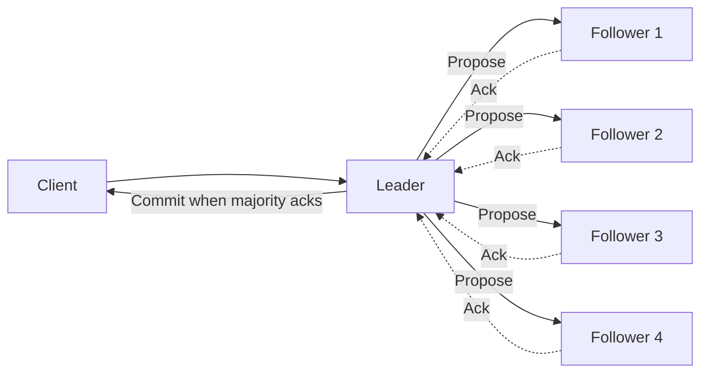
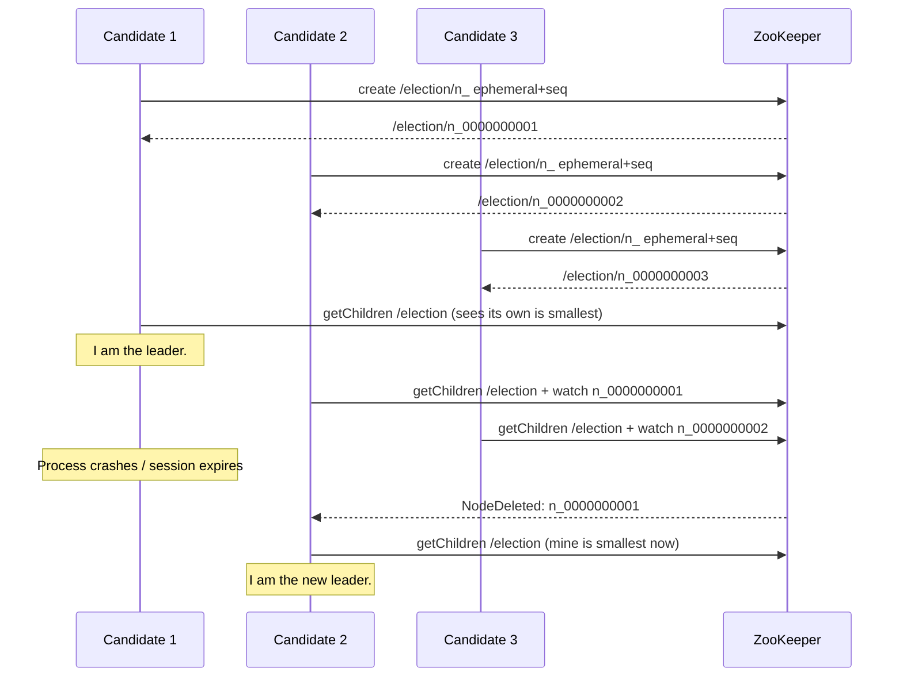

# Leader Election and Coordination Services — ZooKeeper, etcd

**Date:** 2026-04-25 | **Updated:** 2026-04-25
**Tags:** `system-design` `data-consistency` `leader-election` `coordination` `zookeeper` `etcd`

## Table of Contents

- [Summary](#summary)
- [Why Leader Election](#why-leader-election)
- [Naive Election (and Why It Breaks)](#naive-election-and-why-it-breaks)
- [Properties Required](#properties-required)
- [Coordination Service Primitives](#coordination-service-primitives)
- [ZooKeeper](#zookeeper)
  - [Zab Protocol](#zab-protocol)
  - [Znodes and Watches](#znodes-and-watches)
  - [The Leader Election Recipe](#the-leader-election-recipe)
  - [Apache Curator](#apache-curator)
- [etcd](#etcd)
  - [Raft and gRPC](#raft-and-grpc)
  - [Leases, Keys, and Watches](#leases-keys-and-watches)
  - [Why Kubernetes Chose etcd](#why-kubernetes-chose-etcd)
- [Consul](#consul)
- [Fencing Tokens — The Kleppmann vs Redlock Debate](#fencing-tokens--the-kleppmann-vs-redlock-debate)
- [Distributed Locks](#distributed-locks)
- [Leader Election Patterns](#leader-election-patterns)
- [When You DON'T Need a Coordinator](#when-you-dont-need-a-coordinator)
- [Operational Costs](#operational-costs)
- [Anti-Patterns](#anti-patterns)
- [Related](#related)
- [References](#references)

## Summary

Most distributed systems start without a coordinator and run that way until they hit a wall: a job that must run on exactly one node, a partition that must have exactly one writer, a cache invalidation that must happen exactly once. At that point you reach for **leader election** — and unless you want to reinvent consensus, you reach for a **coordination service** (ZooKeeper, etcd, Consul) that has already solved it for you. This doc walks through why naive election breaks, what primitives coordination services provide, how ZooKeeper and etcd implement them, why the Kleppmann/Redlock debate matters (fencing tokens), and the patterns and anti-patterns that separate "we have a leader" from "we have a *correct* leader."

## Why Leader Election

You don't need a leader, until you do. The motivating cases:

- **Single-writer guarantees.** A partition has exactly one node that accepts writes; replicas tail the log. No write conflicts, no split-brain. (Kafka partitions, MySQL primary, MongoDB primary, Redis primary, Spanner Paxos groups.)
- **Exclusive ownership of a resource.** One job runs nightly across the fleet; one process drains a queue; one controller reconciles a cluster. Without a leader you get duplicate work, corrupted output, or worse.
- **Distributed locks.** "Only one of you holds this lock right now." A leader election is essentially a lock with a notification mechanism for transfer.
- **Coordination of side effects.** Sending a payment, calling a third-party API, posting to a channel — anything you'd hate to do twice.
- **Membership and configuration.** Who's in the cluster? What's the current shard map? A leader can write authoritative answers; followers read.

The pattern across all of these: **you want a property that "at most one X happens," and you can't get it from independent nodes that disagree about who's alive.**

## Naive Election (and Why It Breaks)

The naive design: "first writer wins a key in our database; whoever holds it is leader." Or its cousin: "whoever grabs the Redis lock with `SET key value NX EX 30` is leader."

Sequence of failures, in increasing subtlety:

1. **Two clients try to acquire simultaneously.** A single-key compare-and-swap or a `SETNX` actually handles this — only one wins. So far, so good.

2. **The leader's process pauses (GC, kernel scheduling, container throttle) for longer than the lock TTL.** Lock expires. A new node grabs it. The original leader wakes up, *still believes it's the leader*, and writes. **Two leaders, both writing.** Data corruption.

3. **Network partition.** The leader is isolated from the lock service. The service expires the lock. Another node becomes leader. The original leader still has a connection to the database / queue / API and keeps writing. **Dual-leader from the perspective of downstream systems**, even though the lock service believes there's only one.

4. **The lock service itself partitions.** If the "lock" is a single Redis node, both halves of the partition can declare themselves the leader. Redlock (multiple Redis nodes with majority voting) was designed to address this, and is itself controversial — see [the fencing token discussion below](#fencing-tokens--the-kleppmann-vs-redlock-debate).

5. **Time is a lie.** Lock TTLs assume clocks tick at the same rate everywhere. They don't. A VM that pauses, a clock that jumps after NTP correction, a container with a misconfigured time source — all break TTL-based reasoning unless the *downstream resource* also enforces ownership.

The conclusion is sharp: **a lock alone is not enough**. You need either (a) the downstream resource to validate ownership on every write (fencing tokens), or (b) genuine consensus underneath the lock so that "who's leader" is a globally agreed fact, not a local belief.

## Properties Required

Any leader-election scheme should be evaluated against four properties, borrowed from the consensus literature:

| Property | Meaning | What violates it |
|----------|---------|------------------|
| **Safety (agreement)** | At most one leader at any time, from a global perspective | Dual leaders during partition; expired locks held by zombie processes |
| **Liveness (termination)** | Eventually a leader is elected when one is needed | Stuck elections, infinite split votes, no progress under quorum loss |
| **Validity** | Only a legitimate candidate can become leader | Election is decided by an external party; rogue nodes claim leadership |
| **Fault tolerance** | Election survives the failure of some nodes | Single-point lock service; quorum below majority |

In the FLP impossibility result tradition: in an asynchronous system you cannot have all of (safety, liveness, fault tolerance) simultaneously without a failure detector. Coordination services side-step this by relying on **timeouts plus quorum** — they sacrifice strict liveness during partitions to preserve safety.

## Coordination Service Primitives

ZooKeeper, etcd, and Consul are not databases. They are *thin* stores designed around a small set of primitives that compose into locks, leader elections, queues, and configuration distribution:

- **Strongly consistent (linearizable) writes.** Every write is ordered globally; readers see writes in that order. This is what consensus buys you.
- **Compare-and-swap / version-conditional writes.** "Set key K to V only if its current version is N." The atomic primitive for lock acquisition.
- **Ephemeral nodes (ZK) / leases (etcd, Consul).** A piece of state tied to a client session that auto-deletes when the session expires. The basis for liveness detection.
- **Sequential nodes (ZK) / revision numbers (etcd).** A monotonically increasing counter assigned at creation. Used for ordering and as a *fencing token*.
- **Watches / watch streams.** Subscribe to a key or path; get notified on change. Avoids polling and gives you "wake up when the leader dies."

These five primitives, plus reliable session management, are enough to build essentially every coordination pattern. The rest is recipes.

## ZooKeeper

[Apache ZooKeeper](https://zookeeper.apache.org/) is the elder statesman of coordination services — the one that taught the industry what these primitives should look like. It backs Kafka (until KRaft), HBase, Solr, and many other systems.

### Zab Protocol

ZooKeeper's consensus is **Zab (ZooKeeper Atomic Broadcast)**, a Paxos-derived protocol optimized for primary-backup replication of a state machine. Cluster operation:

- Run an odd number of nodes (3, 5, 7). 5 is the typical production choice — survives 2 failures.
- Writes go to the leader; the leader proposes them to followers. A write is committed when a majority (quorum) acknowledges it.
- Reads can be served by any follower (default) or routed through the leader for linearizable semantics (`sync` then `read`).



If the leader fails, the surviving followers run a Zab leader election among themselves before the cluster accepts new writes again. During this window, **the cluster is unavailable for writes** — that's the C in CAP showing through.

### Znodes and Watches

The data model is a hierarchical namespace of **znodes** — like a filesystem. Each znode holds a small payload (typically <1 MB; the design is for metadata, not blobs).

Znode flavors that matter:

| Type | Lifecycle | Use case |
|------|-----------|----------|
| **Persistent** | Lives until explicitly deleted | Configuration, durable state |
| **Ephemeral** | Deleted when the creating session ends | Liveness markers, "I am a member" |
| **Sequential** | Name suffixed with a monotonic counter (`/queue/item-0000000007`) | Ordering, fairness |
| **Ephemeral + Sequential** | Both | The leader-election building block |

A **watch** is a one-shot trigger: "tell me when this znode changes (or its children change)." After firing, you re-register if you still want to be notified. This is intentional — it bounds the server's per-client state.

### The Leader Election Recipe

The canonical [ZooKeeper leader election recipe](https://zookeeper.apache.org/doc/current/recipes.html#sc_leaderElection):

1. Each candidate creates `/election/guid-n_` as **EPHEMERAL_SEQUENTIAL**. ZooKeeper assigns a unique increasing suffix.
2. Each candidate lists `/election/`, finds its own znode, and identifies the znode with the **next-smaller** sequence number.
3. The candidate with the **smallest** sequence is the leader.
4. Every other candidate sets a watch on the znode immediately preceding theirs in sequence.
5. When that predecessor's znode disappears (process died, session expired), the watching candidate re-checks: if it now holds the smallest sequence, it becomes leader.

Watching only the predecessor (not the leader) is critical — it avoids the **herd effect** where every follower wakes up and stampedes the leader's znode every time leadership changes.



Key guarantees this recipe gives you, courtesy of Zab:

- **Safety.** At most one znode has the smallest sequence at any time. Before a new leader takes over, the old session must be confirmed expired by ZooKeeper itself (a cluster-wide consensus event), not by a local timer.
- **Liveness.** As long as a quorum of ZK nodes is alive, an ephemeral session expiry will eventually trigger and a new leader emerges.
- **Fairness.** Sequence numbers are issued in order, so candidates queue rather than fighting.

### Apache Curator

Writing the recipe correctly is annoying — session reconnects, watch re-registration, edge cases when your own znode expires. **[Apache Curator](https://curator.apache.org/)** is the Java client wrapper that everyone uses.

Two relevant recipes:

- **[`LeaderLatch`](https://curator.apache.org/docs/recipes-leader-latch/)** — "tell me when I'm the leader; I'll keep being the leader until I close." Good for "exactly one of these processes runs the cron job."
- **[`LeaderSelector`](https://curator.apache.org/docs/recipes-leader-election/)** — "call my callback when I become leader; the callback returns when I'm done." Good for round-robin or "leadership rotates as work completes."

```java
// Pseudocode — Curator LeaderLatch
CuratorFramework client = CuratorFrameworkFactory.newClient(zkConnString, retryPolicy);
client.start();

LeaderLatch latch = new LeaderLatch(client, "/my-app/leader", myNodeId);
latch.addListener(new LeaderLatchListener() {
    public void isLeader()    { startReconciliationLoop(); }
    public void notLeader()   { stopReconciliationLoop();  }
});
latch.start();

// On shutdown:
latch.close();
client.close();
```

Note `notLeader()` is called when Curator detects the ZK connection has gone SUSPENDED or LOST — the library is conservative, surrendering leadership *before* the session is confirmed dead. This is the correct behavior, but it means your code must be *idempotent on leadership transitions*.

## etcd

[etcd](https://etcd.io/) is the modern entrant: written in Go, gRPC API, [Raft](consensus-raft-and-paxos.md) for consensus, designed from the start as a coordination store rather than as a database with coordination bolted on.

### Raft and gRPC

etcd uses **Raft** (Diego Ongaro's consensus algorithm, designed for understandability), with the same odd-number-quorum properties as ZK. The API is gRPC over HTTP/2. Operations:

- **Put / Get / Delete** with optional revision conditions.
- **Txn** — atomic compare-and-swap with multiple compares and multiple operations: "if revision of K1 == 7 AND value of K2 == 'on', then put K3='ready' else put K3='blocked'."
- **Watch** — a streaming gRPC call that delivers events for a key or range.
- **Lease** — a TTL-bound token; keys can be attached to it; renewing the lease keeps the keys alive.

### Leases, Keys, and Watches

The etcd lock recipe, from the [etcd concurrency package](https://etcd.io/docs/v3.6/dev-guide/api_concurrency_reference_v3/):

1. Client creates a **Lease** with TTL (e.g., 10 s) and starts a **keepalive** goroutine renewing it.
2. Client creates a **Session** bound to the lease.
3. Client calls `Lock(name)` which performs an atomic transaction: create a key under `/<name>/<lease-id>` if no smaller key exists.
4. The created key contains the lease-id; if the client crashes and stops keepalive, the lease expires and the key is deleted, releasing the lock.
5. Other waiters watch the key immediately preceding theirs in revision order — same predecessor-watch trick as ZK.

The crucial detail for fencing: the operation returns a **revision number**. That revision is monotonic across the entire etcd cluster and serves as a fencing token (see below).

```go
// Pseudocode — etcd lock with fencing
session, _ := concurrency.NewSession(client, concurrency.WithTTL(10))
defer session.Close()

mutex := concurrency.NewMutex(session, "/my-app/leader-lock")
ctx, cancel := context.WithTimeout(context.Background(), 5*time.Second)
defer cancel()

if err := mutex.Lock(ctx); err != nil {
    return err
}

// `mutex.Header().Revision` is the global etcd revision at acquisition.
// Use it as a fencing token on every downstream write.
fencingToken := mutex.Header().Revision
doWork(fencingToken)

mutex.Unlock(context.Background())
```

### Why Kubernetes Chose etcd

Kubernetes is the highest-profile etcd consumer; the entire cluster's desired and actual state lives in etcd. Reasons it won over ZooKeeper:

- **gRPC + HTTP/2** is friendlier to a Go ecosystem than ZK's custom protocol.
- **Watch streams** scale better than ZK's one-shot watches for the controller-manager pattern (every controller watches every relevant resource).
- **Lease primitive** is more flexible than ephemeral znodes for reuse across multiple keys.
- **MVCC revisions** give Kubernetes the resource version semantics it exposes via `kubectl`.

Kubernetes' own leader election for `kube-controller-manager` and `kube-scheduler` does *not* use etcd's lock primitive directly. Instead it uses the [`coordination.k8s.io/v1` Lease object](https://kubernetes.io/docs/concepts/architecture/leases/) — a regular Kubernetes object whose updates are mediated by the API server (which itself sits on etcd). Each candidate periodically updates `renewTime` on the Lease; if the holder fails to renew within `leaseDurationSeconds`, another candidate wins via optimistic concurrency on the Lease's resourceVersion. This is leader election by application-level lease, with etcd's linearizability underneath.

## Consul

[HashiCorp Consul](https://developer.hashicorp.com/consul/docs/concept) is the third option, with a different angle: it's primarily a service mesh / service discovery system, with KV and locking as supporting features. Consensus is also Raft. What's distinctive:

- **Sessions** combine TTL + node health + service health checks. A session can be tied to "this node, this service, both healthy."
- **KV `acquire`/`release`** — write a key with a session attached; only one session can hold it at a time.
- **Gossip layer (Serf)** for membership and failure detection across a large fleet, separate from the Raft-replicated KV.

The [Consul application leader election guide](https://developer.hashicorp.com/consul/docs/automate/application-leader-election) walks through the pattern: create session → `acquire` key → renew session → watch the key. Note Consul's own caveat that this is *advisory* locking — clients are not prevented from writing to the underlying resource without the lock. Same fencing-token problem as ever.

## Fencing Tokens — The Kleppmann vs Redlock Debate

In 2016, Salvatore Sanfilippo (Redis author) published Redlock, an algorithm for distributed locks across multiple Redis instances using majority voting. Martin Kleppmann published a [blistering response](https://martin.kleppmann.com/2016/02/08/how-to-do-distributed-locking.html) titled *"How to do distributed locking,"* arguing that **no lock algorithm is safe for correctness without fencing tokens** — and that Redlock as designed doesn't issue them.

The argument applies to *any* lock service, including ZK and etcd. The scenario:

```mermaid
sequenceDiagram
    participant C1 as Client 1
    participant Lock as Lock Service
    participant DB as Storage

    C1->>Lock: acquire(L)
    Lock-->>C1: granted, token=33
    Note over C1: Long GC pause (45s)
    Note over Lock: TTL expires; C1 considered dead
    Lock-->>C1: (lock released, but C1 doesn't know)

    participant C2 as Client 2
    C2->>Lock: acquire(L)
    Lock-->>C2: granted, token=34
    C2->>DB: write(value=A, token=34)
    DB-->>C2: ok

    Note over C1: GC ends. Still believes it holds the lock.
    C1->>DB: write(value=B, token=33)
    DB-->>C1: REJECTED: stale token (33 < 34)
```

The fix is the **fencing token**: a monotonically increasing number issued by the lock service on every grant. The downstream resource (database, file system, API) **records the highest token it has accepted** and rejects any write with a lower token. Without this, the storage layer cannot tell a stale leader from a current one.

Both ZK (znode `czxid` or sequence number) and etcd (revision number returned from the lock txn) provide tokens out of the box. The work the *application* must do is non-trivial: every downstream write must include the token, and the downstream system must be modified to validate it. In practice this means:

- **Use the lock service's revision number / sequence number, not your own counter.** It's already monotonic and globally agreed.
- **Pass it through every API call**, not just the first.
- **Validate at the resource boundary** (the database write, the queue produce, the HTTP call to the third-party). If the resource doesn't support fencing, you cannot make the lock safe — only *probably* safe.

> A lock service tells you who *thinks* they're the leader. A fencing token tells the storage layer who *actually* is.

## Distributed Locks

Given all of the above, when are distributed locks actually appropriate?

**Good uses:**

- **Efficiency, not correctness.** "Don't run this expensive cache rebuild on five nodes simultaneously." If you occasionally run it twice, no harm — just wasted CPU. Locks without fencing are fine.
- **Application-level coordination where the storage layer enforces uniqueness anyway.** Database unique constraint, S3 conditional put, idempotency key on an API. The lock is an optimization to reduce conflicts, not the safety mechanism.

**Bad uses:**

- **Correctness without fencing.** "Only the leader can debit this account." If your DB doesn't validate fencing tokens, no lock will save you.
- **Heartbeat-based leadership without considering pause tolerance.** Garbage collectors, container throttles, and disk fsyncs can pause a process for tens of seconds. Lock TTLs must account for the worst pause your environment permits, *not* the typical one.
- **Coordinated writes to systems that don't support compare-and-swap.** A "lock" in front of an HTTP API that doesn't track tokens is theater.

## Leader Election Patterns

Different shapes of leadership in production systems:

| Pattern | Example | What it gives you |
|---------|---------|-------------------|
| **Cluster-wide single leader** | Old MongoDB primary, classic Kafka controller (pre-KRaft) | Simple mental model; one bottleneck |
| **Per-partition leader** | Kafka per-topic-partition leader, Cassandra (none — hashing instead) | Parallelism; many small elections |
| **Per-shard Paxos group** | Spanner's tablet leaders, CockroachDB ranges | Each range is independently consensus-replicated |
| **Application-level via lease** | Kubernetes controller-manager, schedulers | Reuses an existing coordination layer; cheap to add |
| **External-coordinator-as-a-service** | AWS DynamoDB lock client, GCP cloud locks | Outsource the hard parts |

Two important nuances:

1. **Per-partition leadership scales by sharding the problem.** Kafka has thousands of leaders simultaneously, one per partition. The cluster controller (which itself is elected, now via KRaft = Raft) only manages the assignment, not every write.
2. **Lease-based election trades correctness window for simplicity.** It guarantees safety only in the limit of correctly-tuned timeouts; pathological pauses can violate it. This is why the fencing-token discipline matters more than ever in lease-based designs.

## When You DON'T Need a Coordinator

Coordination is expensive — operationally and architecturally. Common ways to avoid it:

- **Stateless workers behind a load balancer.** No leader needed; any worker handles any request. Most web tier services live here.
- **Partitioned single-writer per shard via consistent hashing.** Each key hashes to a single owner; that owner is the writer for the key. No global leader, just a routing function. Works well when you can tolerate brief unavailability during reshards.
- **Idempotent operations + at-least-once delivery.** If reprocessing the same message produces the same outcome, you don't need to ensure it runs exactly once.
- **Sticky sessions.** Route the same user to the same server consistently; that server "owns" their state without any explicit election.
- **Database-level locks.** `SELECT ... FOR UPDATE` or row-level locks in Postgres/MySQL are real, fenced (by the DB's own MVCC), and operationally simple. Reach for these before reaching for a coordination service.
- **Optimistic concurrency.** "Update row where version = N." If the version changed, retry. No leader needed; the database is the arbiter.

The discipline: **start without coordination. Add it when you have a concrete safety property that can't be expressed as a database constraint or an idempotent operation.**

## Operational Costs

ZK and etcd clusters are *stateful* and that has consequences:

- **They're a hard dependency.** When the coordination service is down or in split-brain, every system that depends on it is degraded. Treat them as critical infrastructure, not as a side service.
- **Quorum loss = downtime.** Lose two nodes from a 3-node cluster, or three from a 5-node cluster, and writes stop. Plan capacity accordingly: 5 nodes is the standard production size for meaningful fault tolerance.
- **Disk I/O matters a lot.** Every commit requires an fsync on the leader and quorum followers. Slow disks = slow cluster. SSDs are not optional.
- **Watch storms.** Tens of thousands of clients watching the same key range can DDOS the cluster on a change. Design for fanout, or insert a tier between your applications and the coordination layer.
- **Backup, restore, version upgrades.** All three are non-trivial and have caused real outages. Practice them.
- **etcd in Kubernetes specifically.** Kubernetes' API server caches aggressively, but every pod create/update/delete is an etcd write. At cluster scale you need careful tuning of watch cache sizes, defragmentation schedules, and resource compaction.

> A coordination cluster you don't actively operate becomes a coordination cluster you don't have. Plan to invest at least one engineer's continuous attention if you self-host.

## Anti-Patterns

Patterns to recognize and refuse:

- **Distributed locks as the primary correctness mechanism, without fencing tokens.** "We have a Redis lock so only one process writes." No, you have a Redis lock so *usually* only one process writes. Add fencing or move the safety property into the storage layer.
- **Naive ephemeral-node election without watching the predecessor.** Every node watches `/election` itself; on any change, every node wakes up and queries. Works for 5 nodes; falls over at 500. Use the predecessor-watch recipe.
- **Treating ZooKeeper as a database.** ZK is for coordination metadata: configuration, membership, leader identity. Putting application data in znodes (especially large blobs, especially write-heavy patterns) overloads the consensus layer and causes outages. Same advice for etcd outside of Kubernetes.
- **Very chatty watch usage.** A watch fires on every change to a path. If you have a key that updates 1000 times per second and 100 watchers, that's 100k notifications per second. Aggregate, batch, or reconsider the design.
- **TTLs shorter than worst-case pause time.** A 5-second TTL with 30-second GC pauses guarantees occasional dual-leadership. Either tune TTLs to be longer than the longest tolerable pause (and accept the failover delay), or fence properly.
- **Election on hot path.** Don't run a leader election as part of a request-response cycle. Elect once at startup, react to changes asynchronously.
- **Single-node "coordination service."** A single ZK or etcd node is a single point of failure with the additional downside that you've taught your team to depend on coordination. Run a real cluster or don't run one at all.
- **Ignoring "I lost leadership" events.** Curator's `notLeader()`, etcd's session expiration, the K8s lease change — when these fire, your code must immediately stop writing as the leader. Many bugs hide behind "I'm sure I'm still the leader."

## Related

- [Consensus — Raft and Paxos at a Conceptual Level](consensus-raft-and-paxos.md) — the algorithms underneath ZK's Zab and etcd's Raft; why majority voting buys you safety
- [Replication Patterns — Primary-Replica, Multi-Primary, Quorum](../scalability/replication-patterns.md) — single-writer per partition is the most common consumer of leader election
- [Failure Detection in Distributed Systems](failure-detection.md) — heartbeats, phi-accrual, and why "is this node alive?" is harder than it looks (planned, Tier 6)
- [Distributed Transactions — 2PC, 3PC, Sagas, Outbox](distributed-transactions.md) — the other side of "coordination": agreement across multiple resources rather than agreement on a single leader
- [Kubernetes Cluster Architecture](../../kubernetes/core-concepts/cluster-architecture.md) — production case study of etcd-backed coordination at scale

## References

- [ZooKeeper Recipes and Solutions](https://zookeeper.apache.org/doc/current/recipes.html) — official Apache ZooKeeper recipes including the canonical leader election with EPHEMERAL_SEQUENTIAL znodes and predecessor watches
- [etcd concurrency API Reference](https://etcd.io/docs/v3.6/dev-guide/api_concurrency_reference_v3/) — official etcd v3 concurrency package documentation covering Lock, Lease, and Election primitives
- [Apache Curator — Leader Election Recipe](https://curator.apache.org/docs/recipes-leader-election/) and [Leader Latch Recipe](https://curator.apache.org/docs/recipes-leader-latch/) — the production-grade Java client wrapping ZK's primitives
- [Martin Kleppmann — *How to do distributed locking*](https://martin.kleppmann.com/2016/02/08/how-to-do-distributed-locking.html) — the foundational critique of Redlock and the canonical explanation of why fencing tokens are required for correctness
- [HashiCorp Consul — Application Leader Election](https://developer.hashicorp.com/consul/docs/automate/application-leader-election) — Consul's session + KV `acquire` pattern, including the explicit "advisory locking only" caveat
- [Kubernetes — Leases](https://kubernetes.io/docs/concepts/architecture/leases/) and [Coordinated Leader Election](https://kubernetes.io/docs/concepts/cluster-administration/coordinated-leader-election/) — the `coordination.k8s.io/v1` Lease object used for kube-controller-manager and kube-scheduler HA
- [etcd API guarantees](https://etcd.io/docs/v3.5/learning/api_guarantees/) — linearizability, watch ordering, and the consistency model that makes etcd's primitives composable
- [Jepsen — etcd 3.4.3](https://jepsen.io/analyses/etcd-3.4.3) — independent verification of etcd's consistency guarantees under partitions and pauses
