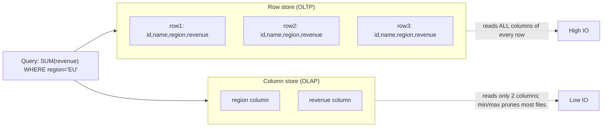
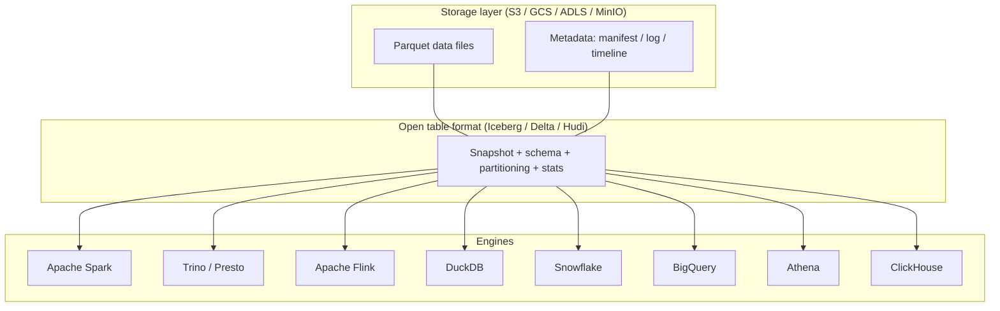
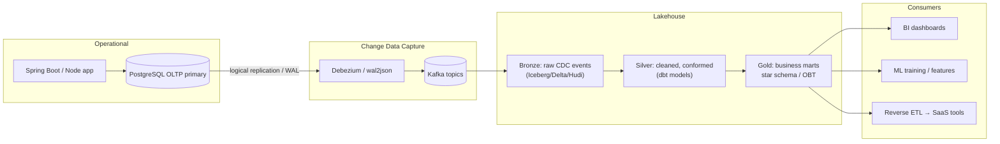

# OLTP vs OLAP, Data Lakes, and Lakehouses — Two Universes Converging

**Date:** 2026-04-25 | **Updated:** 2026-04-25
**Tags:** `system-design` `data-consistency` `oltp` `olap` `data-lake` `lakehouse`

## Table of Contents

- [Summary](#summary)
- [OLTP vs OLAP — The Two Universes](#oltp-vs-olap--the-two-universes)
- [Why You Can't Use Your Postgres OLTP Cluster as a Warehouse](#why-you-cant-use-your-postgres-oltp-cluster-as-a-warehouse)
- [Columnar Storage Basics](#columnar-storage-basics)
- [Data Warehouse — Schema-on-Write](#data-warehouse--schema-on-write)
- [Data Lake — Schema-on-Read](#data-lake--schema-on-read)
- [The Pain of Lakes](#the-pain-of-lakes)
- [Lakehouse — Lakes With ACID](#lakehouse--lakes-with-acid)
  - [Apache Iceberg](#apache-iceberg)
  - [Delta Lake](#delta-lake)
  - [Apache Hudi](#apache-hudi)
- [Engines vs Formats — The Decoupling](#engines-vs-formats--the-decoupling)
- [Modeling — Kimball, Wide Tables, and dbt](#modeling--kimball-wide-tables-and-dbt)
- [Lambda → Kappa → Zero-ETL](#lambda--kappa--zero-etl)
- [Where the System Designer Fits In](#where-the-system-designer-fits-in)
- [Anti-Patterns](#anti-patterns)
- [Related](#related)
- [References](#references)

## Summary

Operational systems (the OLTP database behind your app) and analytical systems (the warehouse or lake behind your dashboards and ML) are **two different universes**, optimized for opposite workloads. Forcing one to do the other's job is a classic system-design failure mode. The historical split was warehouses (structured, expensive, fast) vs lakes (cheap, flexible, swampy). The **lakehouse** — open table formats like Iceberg, Delta Lake, and Hudi sitting on top of object storage — collapses that split by giving lakes the ACID transactions, schema enforcement, and time travel that used to require a warehouse. As a backend designer, your job is to keep OLTP fast and let CDC carry data into the analytical plane, never the reverse.

## OLTP vs OLAP — The Two Universes

The same word — "database" — covers two systems built for opposite physics.

| Dimension | OLTP (Online Transaction Processing) | OLAP (Online Analytical Processing) |
|-----------|--------------------------------------|--------------------------------------|
| Workload | Many tiny transactions | Few enormous scans |
| Query shape | Point reads/writes by primary key | Aggregations across millions of rows |
| Concurrency | Thousands of concurrent users | Tens of analysts/jobs |
| Latency target | < 10 ms per query | Seconds to minutes |
| Storage layout | Row-oriented | Column-oriented |
| Indexing strategy | B-tree on every important column | Zone maps, min/max, bloom filters |
| Updates | Frequent in-place updates | Append-only, rebuilt by ETL |
| Typical size | GBs to low TBs | TBs to PBs |
| Examples | PostgreSQL, MySQL, Oracle, SQL Server, DynamoDB | Snowflake, BigQuery, Redshift, ClickHouse, Druid |

The asymmetry is fundamental. An OLTP query like `SELECT * FROM orders WHERE id = 12345` reads one row and is done. An OLAP query like `SELECT region, SUM(revenue) FROM orders WHERE order_date BETWEEN ...` reads **billions of rows** but only two columns and emits a handful of grouped results. Optimizing for one demolishes performance on the other.

Backend engineers usually live in OLTP land — Spring Boot, Express, NestJS, all talking to a Postgres or MySQL primary. The analytical universe sits behind a CDC pipeline and a warehouse, served by a different set of tools and a different team. The system designer's job is to keep them connected without coupling them.

## Why You Can't Use Your Postgres OLTP Cluster as a Warehouse

Engineers who haven't been burned by this often try it. The reasons it fails:

- **Concurrency limits.** Postgres tops out around a few hundred concurrent connections (without PgBouncer/PgCat) — fine for app traffic, but every analyst, dashboard, and BI tool wants its own connection. A single bad analytical query can starve the entire connection pool.
- **Table-scan cost.** Row storage means a `SUM(revenue)` over a billion rows must read every column of every row off disk. The buffer cache evicts hot OLTP pages to make room. Your `p99` latency on `/api/orders` quietly doubles.
- **Lock contention.** Long-running analytical reads under `READ COMMITTED` are mostly fine on Postgres (MVCC), but a long-running transaction holds back vacuum, bloats tables, and degrades index health. On MySQL/InnoDB it can outright block writers.
- **IOPS pattern mismatch.** OLTP wants random IO with low latency. OLAP wants sequential bandwidth across huge files. EBS/SSD volumes provisioned for OLTP get hammered by OLAP's scan pattern, costing both throughput and IOPS budget.
- **Replica lag amplification.** Routing analytics to a read replica seems clever until a 30-minute aggregation pins WAL apply, and your read-after-write reads on the replica are now 30 minutes stale.
- **Cost.** Postgres on a primary node is sized for transaction throughput. To survive analytics on top, you'd over-provision the primary — paying OLTP infrastructure prices for OLAP scan throughput.

The right pattern is **physical separation**: OLTP for the app, a warehouse or lakehouse for analytics, and CDC as the bridge between them.

## Columnar Storage Basics

The single biggest technical reason OLAP systems are 10–100× faster on analytical queries is **columnar storage**. Both OLTP and OLAP have to read bytes off disk, but they organize those bytes very differently.

```text
Row storage (OLTP, Postgres heap, InnoDB):
[id=1, name="Alice", region="EU", revenue=100]
[id=2, name="Bob",   region="US", revenue=250]
[id=3, name="Carol", region="EU", revenue=180]

  → great for "give me row 2"
  → terrible for "sum revenue across all rows"
    (must read every row's name, region, etc., wasting IO)

Column storage (OLAP, Parquet, ORC, ClickHouse):
ids:      [1, 2, 3, ...]
names:    ["Alice", "Bob", "Carol", ...]
regions:  ["EU", "US", "EU", ...]
revenues: [100, 250, 180, ...]

  → great for "sum revenue": read one tightly-packed column
  → terrible for "give me row 2": must reassemble from 4 files
```

Three properties make column stores so efficient for analytics:

1. **Vectorized execution.** Engines like ClickHouse, DuckDB, and Snowflake process columns in batches of thousands of values inside SIMD-friendly loops. CPU cache and branch predictors love this.
2. **Compression efficiency.** Adjacent values in a column tend to be similar (think: a million `region` values that are all `"EU"` or `"US"`). Compression schemes compound:
   - **Dictionary encoding** — replace `"EU"`, `"US"`, `"APAC"` with `0`, `1`, `2`. Strings shrink to bytes.
   - **Run-length encoding (RLE)** — `[EU, EU, EU, US, US]` → `[(EU, 3), (US, 2)]`.
   - **Bit-packing** — if a column only takes values 0–7, store 3 bits per value instead of 64.
   - **Delta + zigzag** for sorted integers (timestamps, IDs).
   Real-world Parquet files often hit 5–10× compression ratios over raw CSV without any loss.
3. **IO pruning.** Column files store min/max statistics per row group. A query with `WHERE order_date >= '2024-01-01'` skips entire row groups whose `max(order_date) < '2024-01-01'`. This is why a well-laid-out lakehouse can scan terabytes in seconds — most of those terabytes are never read.



## Data Warehouse — Schema-on-Write

A data warehouse is a **structured, governed, query-optimized analytical database**. You define schemas up front, run ETL to transform raw data into modeled tables, and query through SQL.

Properties:

- **Schema-on-write.** You decide the column names, types, and constraints before loading. Bad data is rejected at ingest.
- **Tightly coupled storage and compute** historically — though Snowflake, BigQuery, and Redshift Serverless have decoupled these.
- **Dimensional modeling.** The dominant pattern is the **star schema** (Kimball): one wide *fact* table (e.g. `fact_orders`) surrounded by smaller *dimension* tables (`dim_customer`, `dim_product`, `dim_date`). Snowflake schemas normalize dimensions further.
- **Workload management.** Resource queues, warehouse-sizing controls, automatic suspend/resume to manage cost.
- **Mature ecosystem.** BI tools, governance, RBAC, masking, lineage — all mature.

Examples:

- **Snowflake** — multi-cluster shared-data architecture, micro-partitions, separated storage and compute.
- **Amazon Redshift** — originally Postgres-derived; modern Redshift uses RA3 nodes with managed storage on S3.
- **Google BigQuery** — fully managed, capacitor columnar format, separation of storage and Dremel compute.
- **Azure Synapse** / **Microsoft Fabric** — Microsoft's warehouse-plus-lakehouse story.

```sql
-- Classic Kimball star schema
CREATE TABLE dim_customer (
    customer_key   BIGINT PRIMARY KEY,
    customer_id    VARCHAR(50),
    name           VARCHAR(200),
    region         VARCHAR(50),
    valid_from     DATE,
    valid_to       DATE,
    is_current     BOOLEAN
);

CREATE TABLE dim_product (
    product_key  BIGINT PRIMARY KEY,
    sku          VARCHAR(50),
    name         VARCHAR(200),
    category     VARCHAR(100)
);

CREATE TABLE fact_orders (
    order_id        BIGINT,
    order_date_key  INT       REFERENCES dim_date,
    customer_key    BIGINT    REFERENCES dim_customer,
    product_key     BIGINT    REFERENCES dim_product,
    quantity        INT,
    revenue_cents   BIGINT
)
DISTKEY (customer_key)        -- Redshift-style distribution
SORTKEY (order_date_key);     -- physical clustering for date-range scans
```

Warehouses excel when your data is structured, your schemas are stable, and you need fast, predictable analytics with minimal operational overhead.

## Data Lake — Schema-on-Read

A data lake is **raw files in cheap object storage**, queried by external engines.

Properties:

- **Schema-on-read.** You dump JSON, Parquet, Avro, CSV, images, logs, model checkpoints, anything. Schema is applied when somebody queries it, not when it's written.
- **Storage is dumb and cheap** — S3, GCS, ADLS, MinIO. A petabyte costs hundreds of dollars per month at rest.
- **Compute is bring-your-own.** Spark, Trino/Presto, Athena, Hive, Flink, Dask, your own Python script.
- **No schema, no transactions, no indexes** — at least not in the original Hadoop-era design.
- **Open formats.** Parquet for columnar analytics, Avro for row-oriented streaming, ORC, JSON for semi-structured.

Examples:

- **AWS S3 + Glue Catalog + Athena** — the canonical AWS lake stack.
- **Azure Data Lake Storage (ADLS Gen2)** — hierarchical namespace on top of blob storage.
- **GCS + BigLake** — Google's federated lake/warehouse approach.
- **MinIO + Trino** — fully open-source self-hosted lake.

The promise is enormous: cheap, infinitely scalable, format-agnostic, decoupled storage and compute. The reality, especially before lakehouses, is messier.

## The Pain of Lakes

Lakes without table formats accumulate well-known problems:

- **No transactions.** Two jobs writing to the same partition can race. There is no atomic "swap these files for those files." Readers can see half-written state.
- **Eventual file-listing consistency.** Historically (S3 before December 2020) `LIST` after `PUT` was eventually consistent. A query that listed a partition could miss a freshly written file. Most cloud object stores are now strongly consistent, but lakehouse formats still don't trust naive listings — they keep their own metadata.
- **No schema enforcement.** A producer adds a column, removes a column, changes a type. Downstream consumers blow up at query time. Schema drift is silent until it isn't.
- **Small-file problem.** Streaming ingestion writes tiny files every few seconds. After a year you have 50 million 200KB Parquet files; query planning takes longer than the query.
- **No upserts.** Object stores have no concept of "update row 12345." You either rewrite the whole partition or accept duplicates.
- **No time travel / no audit.** When did this row change? Why did Tuesday's number differ from Thursday's? A bare lake has no idea.
- **Governance vacuum.** Without a catalog, ACLs, and data contracts, the lake becomes a **data swamp** — everyone dumps, nobody knows what's authoritative, half the tables are stale and nobody dares delete them.

These problems killed the original "everything goes in the lake" vision and pushed the industry toward lakehouses.

## Lakehouse — Lakes With ACID

A **lakehouse** is a data lake plus an **open table format** that adds warehouse-grade properties on top of object storage:

- **ACID transactions** — atomic commits, snapshot isolation, optimistic or MVCC concurrency.
- **Schema enforcement and evolution** — adds, drops, renames are tracked; bad writes are rejected.
- **Time travel** — query the table as of a previous snapshot or timestamp; roll back bad writes.
- **Efficient upserts and deletes** — including row-level via copy-on-write or merge-on-read.
- **Partition evolution / hidden partitioning** — change how data is partitioned without rewriting it.
- **Open** — the spec is published, multiple engines implement it, there is no single-vendor lock-in (in theory).

Three formats dominate.

### Apache Iceberg

[Iceberg](https://iceberg.apache.org/) was originally built at Netflix and is now an Apache top-level project. It treats a table as a tree of metadata files pointing at immutable data files. A commit is a single atomic swap of the root pointer.

Key features:

- **Hidden partitioning.** Users query `WHERE event_ts >= '2024-01-01'`; Iceberg figures out which day-partition files to read. No need to add `WHERE day = '2024-01-01'` manually like in Hive.
- **Snapshot isolation.** Every write produces a new snapshot. Readers always see a consistent point in time.
- **Partition evolution.** Switch from daily to hourly partitioning, or from `region` to `(region, country)`, without rewriting old data.
- **Schema evolution by ID, not by name.** Adding, dropping, renaming, or reordering columns is safe.
- **Engine-neutral.** First-class support in Spark, Trino, Flink, Snowflake, Athena, Dremio, DuckDB.

```sql
-- Iceberg DDL on Spark / Trino
CREATE TABLE analytics.fact_orders (
    order_id        BIGINT,
    customer_id     BIGINT,
    product_id      BIGINT,
    region          STRING,
    revenue_cents   BIGINT,
    event_ts        TIMESTAMP
)
USING ICEBERG
PARTITIONED BY (days(event_ts), region)
TBLPROPERTIES (
    'format-version'        = '2',
    'write.target-file-size-bytes' = '134217728',  -- 128 MB target
    'write.delete.mode'     = 'merge-on-read'
);

-- Time travel: query the table as of yesterday
SELECT region, SUM(revenue_cents)
FROM analytics.fact_orders
  FOR TIMESTAMP AS OF TIMESTAMP '2026-04-24 00:00:00'
GROUP BY region;

-- Roll back a bad write
CALL system.rollback_to_snapshot('analytics.fact_orders', 7681234567890);

-- Compact small files
CALL system.rewrite_data_files('analytics.fact_orders');
```

### Delta Lake

[Delta Lake](https://delta.io/) was created at Databricks and open-sourced under the Linux Foundation. It uses a JSON **transaction log** (`_delta_log/`) that records every commit as an append-only series of actions. Readers reconstruct the current table state by replaying the log (with periodic checkpoints).

Key features:

- **Optimistic concurrency control.** Writers attempt to commit; if another writer committed first, they detect the conflict via the log and retry or fail.
- **Time travel** via `VERSION AS OF` or `TIMESTAMP AS OF`.
- **MERGE / UPSERT / DELETE** — first-class row-level operations, including the famous `MERGE INTO ... USING ...` for CDC sinks.
- **Z-ordering** — multidimensional clustering for skipping more data.
- **Deletion vectors (Delta 3.x)** — mark rows as deleted without rewriting whole files (merge-on-read).
- **Tightest integration with Databricks/Spark**, but increasingly portable via the Delta Kernel and `delta-rs` (Rust).

```sql
-- Delta Lake operations
CREATE TABLE analytics.users (
    user_id      BIGINT,
    email        STRING,
    region       STRING,
    updated_at   TIMESTAMP
) USING DELTA
PARTITIONED BY (region);

-- Upsert pattern for CDC: 'updates' is a staging table from Debezium/Kafka
MERGE INTO analytics.users AS target
USING staging.user_changes AS source
  ON target.user_id = source.user_id
WHEN MATCHED AND source._op = 'd' THEN DELETE
WHEN MATCHED AND source._op IN ('u','c') THEN UPDATE SET *
WHEN NOT MATCHED AND source._op IN ('u','c') THEN INSERT *;

-- Time travel
SELECT * FROM analytics.users VERSION AS OF 42;
SELECT * FROM analytics.users TIMESTAMP AS OF '2026-04-20 12:00:00';

-- Optimize file layout for region/updated_at queries
OPTIMIZE analytics.users ZORDER BY (region, updated_at);

-- Vacuum old snapshots beyond retention window (default 7 days)
VACUUM analytics.users RETAIN 168 HOURS;
```

### Apache Hudi

[Hudi](https://hudi.apache.org/) ("Hadoop Upserts Deletes Incrementals") was built at Uber to solve the upsert and incremental-pull problem for streaming ingestion.

Key features:

- **Two table types:**
  - **Copy-on-Write (CoW)** — rewrites Parquet files on update; readers always see clean Parquet, writes are heavier.
  - **Merge-on-Read (MoR)** — appends row-level deltas to log files, merged on read; writes are cheap, reads are slightly heavier until compaction.
- **Record-level indexes** — bloom filters, simple, HBase-backed, or hash indexes for fast upsert lookup.
- **Incremental queries.** `_hoodie_commit_time` lets consumers pull only what changed since their last checkpoint — perfect for downstream pipelines.
- **CDC-friendly.** Hudi was designed around the upsert + incremental pattern, making it a strong fit for direct CDC sinks from Debezium or Kafka Connect.
- **Timeline-based metadata** — every action (commit, compaction, clean) is an entry on a timeline.

The three formats overlap in 80% of features. Pick by:

- **Iceberg** if you want the most engine-neutral, vendor-neutral format with the cleanest spec.
- **Delta Lake** if you live in Databricks/Spark and want the most polished SQL ergonomics for MERGE/UPSERT.
- **Hudi** if your primary use case is streaming upserts with incremental downstream consumption.

## Engines vs Formats — The Decoupling

The lakehouse's real superpower is **decoupling the table format from the query engine**. Historically, your data was locked inside a warehouse — you queried it through that warehouse's engine, and only that engine. With open table formats, the **format is a contract**, and any engine that understands the contract can read or write the same data.



Practically:

- **Trino / Presto** — federated SQL across many sources; great for ad-hoc analytics across your lake plus operational stores.
- **Apache Spark** — heavyweight ETL, machine learning pipelines, complex transformations.
- **Apache Flink** — stream processing with stateful exactly-once into Iceberg/Hudi sinks.
- **DuckDB** — embedded analytical engine; ridiculously fast on a laptop, increasingly used to query Iceberg/Delta directly from Node or Python.
- **Snowflake** — added external Iceberg table support; you can let Snowflake manage Iceberg tables on your S3.
- **ClickHouse** — column-store OLTP-adjacent engine; can read external Parquet/Iceberg.

This is the key shift: data isn't *in Snowflake* anymore — it's *in S3 in Iceberg format*, and Snowflake is one engine that can query it. So can DuckDB on a developer's laptop, and a Spark job tomorrow. The format is the source of truth; the engine is interchangeable.

## Modeling — Kimball, Wide Tables, and dbt

The lakehouse changes storage but not modeling fundamentals.

- **Kimball star schemas are still relevant.** Dimensional modeling is a way of thinking about data, not just a Redshift trick. BI tools, semantic layers, and humans all reason better when you have stable dimensions and additive facts.
- **Wide tables are increasingly common.** Storage is cheap, compute is columnar, joins on petabyte facts are still expensive. The pragmatic move is often a **One Big Table** (OBT) wide denormalized fact, sometimes alongside conformed dimensions.
- **dbt is the modern transformation layer.** [dbt](https://docs.getdbt.com/) ("data build tool") lets analytics engineers express transformations as SQL `SELECT` statements with `Jinja` templating, version-controlled in Git, with tests and lineage. It runs on Snowflake, BigQuery, Redshift, Databricks, Trino, DuckDB, and the various engine-on-lakehouse setups. The pattern is **ELT, not ETL**: load raw into staging, transform in-warehouse with dbt, materialize as views or incremental tables.

```sql
-- A typical dbt incremental model (models/marts/fct_orders.sql)
{{ config(
    materialized='incremental',
    unique_key='order_id',
    incremental_strategy='merge',
    on_schema_change='sync_all_columns'
) }}

WITH src AS (
    SELECT *
    FROM {{ ref('stg_orders') }}
    
    WHERE updated_at > (SELECT MAX(updated_at) FROM {{ this }})
    
)
SELECT
    order_id,
    customer_id,
    product_id,
    revenue_cents,
    event_ts,
    updated_at
FROM src;
```

dbt handles the boilerplate of "first run vs incremental run," and on a lakehouse it compiles down to a `MERGE INTO` against your Delta/Iceberg/Hudi table.

## Lambda → Kappa → Zero-ETL

A short tour of how the architecture for "fresh-enough analytics" has evolved (more depth in Tier 13's batch-vs-stream-processing.md):

- **Lambda architecture.** Two parallel pipelines: a **batch layer** for correctness (re-run nightly, source of truth) and a **speed layer** for low-latency approximations. Results are merged at query time. Operationally painful — you write the same logic twice, in two engines.
- **Kappa architecture.** "Streams are enough." Run a single streaming pipeline (Flink, Kafka Streams) and reprocess by replaying the log when you need to recompute. Simpler, but stateful streaming at scale is hard.
- **Zero-ETL.** The current direction. Vendors plug operational stores directly into analytical stores: Aurora → Redshift Zero-ETL, DynamoDB → OpenSearch, Postgres → Snowpipe, Fivetran/Airbyte for managed CDC, AWS DMS for managed replication. The user-facing promise: just attach the source, queries are fresh.
- **In-database analytics.** Engines like ClickHouse, MotherDuck, and DuckDB-in-Postgres (`pg_duckdb`) collapse the analytical engine into or next to the operational one for small-to-medium scale.
- **Reverse ETL.** Data flowing the other way: warehouse → operational systems (Salesforce, HubSpot, customer-facing personalization). Tools like Hightouch and Census specialize here. The lakehouse becomes an active part of the operational fabric, not just a passive sink.

## Where the System Designer Fits In

You will rarely build a warehouse or a lakehouse from scratch. You *will* design the operational system that feeds it. The pattern is almost always:



Design checklist for backend engineers feeding this pipeline:

- **Logical replication enabled** on the OLTP primary (`wal_level = logical` on Postgres) — see [the database internals docs](../../database/INDEX.md).
- **Stable primary keys.** CDC consumers need them for upserts.
- **Schema changes are coordinated** with the data team — additive changes are usually safe; type changes and renames break consumers.
- **Outbox pattern** when you need a transactional guarantee between a state change and a downstream event (covered in the planned [change-data-capture.md](change-data-capture.md)).
- **Backpressure aware.** A CDC pipeline lagging by hours is normal. A CDC pipeline lagging by days is an outage.
- **Never run analytics on the prod OLTP cluster.** A reporting dashboard hitting production is a P1 waiting to happen.

The medallion structure (Bronze → Silver → Gold) gives the data team a clean place to apply quality, conformance, and modeling without polluting raw history.

## Anti-Patterns

The classic mistakes when teams blur the OLTP/OLAP boundary:

- **Running analytical queries directly on prod OLTP.** Even "just this dashboard" turns into thirty dashboards, and one of them eventually scans `orders` unindexed during peak traffic. Use a replica or, better, the warehouse.
- **Building a lake with no governance and no table format.** Pure raw S3 + a wiki of folder names. Six months later nobody knows which `orders/` directory is current. Use Iceberg/Delta/Hudi from day one, even if the data volume is small.
- **Hand-rolling transactional file writes on S3.** Engineers reinvent partial commits, file renames, and "just-write-a-temp-file-and-move-it." S3 has no atomic move across keys; you will write race conditions. The whole reason lakehouse formats exist is to solve this. Don't reinvent it.
- **Treating warehouse and lake as competing systems.** They were briefly competitors; now they're converging. Snowflake reads Iceberg, Databricks runs warehouse-grade SQL, BigQuery has BigLake. Pick a format strategy first; pick engines and platforms second.
- **Replicating sensitive PII into the lakehouse without controls.** Analysts now have full PII access. GDPR/HIPAA exposure expands silently. Lakehouse formats support column masking and row filters — use them, and add lineage tooling.
- **Optimizing OLTP schemas for analytics.** Adding columns "just for the warehouse" or denormalizing the operational store to make BI easier. Keep OLTP normalized for transactional integrity; let the analytics layer denormalize.
- **Pretending CDC is real-time.** Even with Debezium and Kafka, end-to-end latency is typically 5 seconds to a few minutes. If a feature truly needs sub-second freshness, it shouldn't depend on the analytical pipeline — it should hit the operational store directly or use a streaming materialization (Flink, Materialize, RisingWave).

## Related

- [Change Data Capture (CDC) and Dual Writes](change-data-capture.md) — the bridge between OLTP and the lakehouse: logical replication, Debezium, the outbox pattern, and why dual writes break _(planned)_
- [Stream Processing — Kafka Streams, Flink, Windowing](../communication/stream-processing.md) — the streaming engines that often sit between CDC and the lakehouse _(planned)_
- *Batch vs Stream Processing — Lambda, Kappa, and Modern Hybrids* (Tier 13, planned) — deeper coverage of the batch/stream architectures referenced here
- [Read-Path Optimizations — Denormalization, Materialized Views, Compression](../scalability/read-path-optimizations.md) — row vs column storage and compression trade-offs in more depth _(planned)_
- [Database Learning Path — INDEX](../../database/INDEX.md) — engine internals for both OLTP (Postgres MVCC, WAL, indexes) and OLAP (column stores, vectorization)
- [CQRS and Event Sourcing](../scalability/cqrs-and-event-sourcing.md) — a related shape of read/write separation, applied at the application layer

## References

- [Apache Iceberg Documentation](https://iceberg.apache.org/docs/latest/) — official spec, table layout, and operations reference
- [Delta Lake Documentation](https://docs.delta.io/latest/index.html) — Delta protocol, transaction log internals, and SQL reference
- [Apache Hudi Documentation](https://hudi.apache.org/docs/overview) — table types (CoW vs MoR), indexes, and incremental queries
- ["Lakehouse: A New Generation of Open Platforms that Unify Data Warehousing and Advanced Analytics"](https://www.cidrdb.org/cidr2021/papers/cidr2021_paper17.pdf) — Armbrust, Ghodsi, Xin, Zaharia (Databricks), CIDR 2021 — the lakehouse manifesto paper
- [dbt Documentation](https://docs.getdbt.com/) — incremental models, materializations, tests, and lineage
- [Snowflake Architecture Overview](https://docs.snowflake.com/en/user-guide/intro-key-concepts) — multi-cluster shared-data architecture and micro-partitions
- [Debezium Documentation](https://debezium.io/documentation/reference/stable/) — CDC connectors for Postgres, MySQL, and others; the canonical OLTP→Kafka bridge
- [Fivetran — Change Data Capture explained](https://www.fivetran.com/learn/change-data-capture) — vendor overview of CDC patterns and trade-offs
- [The Kimball Group — Dimensional Modeling Techniques](https://www.kimballgroup.com/data-warehouse-business-intelligence-resources/kimball-techniques/dimensional-modeling-techniques/) — canonical reference on star/snowflake schemas and slowly changing dimensions
- [AWS — What is a data lakehouse?](https://aws.amazon.com/what-is/data-lakehouse/) — vendor-neutral overview with concrete AWS mappings
