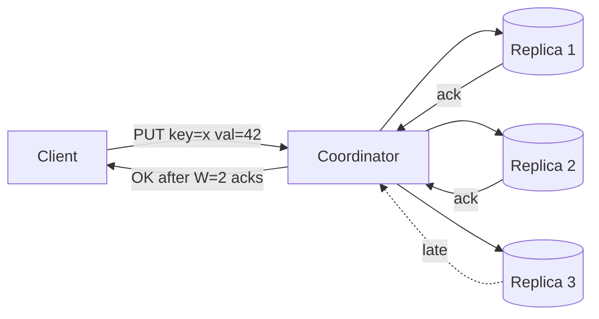
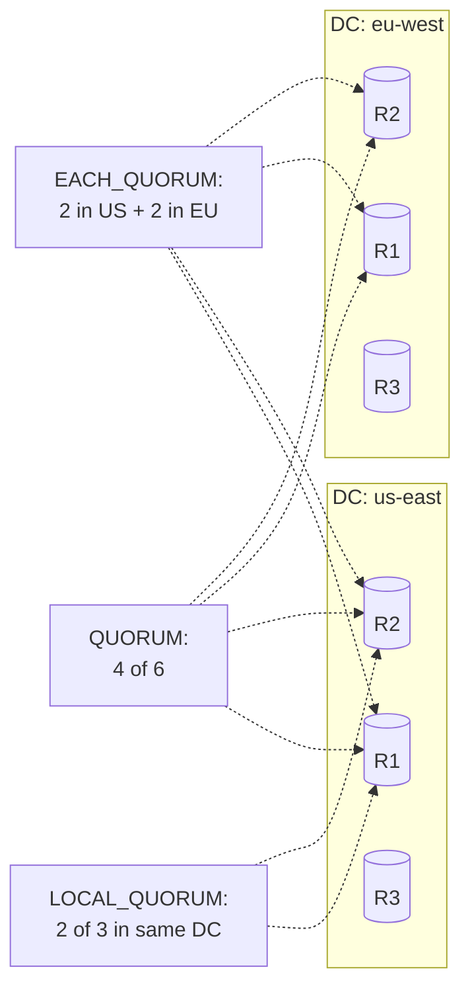

# Quorum Reads/Writes (NWR) and Tunable Consistency — Dynamo, Cassandra, and the W+R>N Inequality

**Date:** 2026-04-25 | **Updated:** 2026-04-25
**Tags:** `system-design` `data-consistency` `quorum` `dynamo` `cassandra` `tunable-consistency`

## Table of Contents

- [Summary](#summary)
- [The NWR Model](#the-nwr-model)
- [The W+R>N Inequality](#the-wrn-inequality)
- [Common NWR Settings](#common-nwr-settings)
- [Read Repair](#read-repair)
- [Hinted Handoff](#hinted-handoff)
- [Anti-Entropy via Merkle Trees](#anti-entropy-via-merkle-trees)
- [Sloppy Quorum vs Strict Quorum](#sloppy-quorum-vs-strict-quorum)
- [Vector Clocks vs LWW for Conflict Detection](#vector-clocks-vs-lww-for-conflict-detection)
- [Cassandra Consistency Levels](#cassandra-consistency-levels)
- [DynamoDB — Strong vs Eventually Consistent Reads](#dynamodb--strong-vs-eventually-consistent-reads)
- [Why It's Called "Tunable"](#why-its-called-tunable)
- [The Hidden Cost — Quorum Latency Math](#the-hidden-cost--quorum-latency-math)
- [Anti-Patterns](#anti-patterns)
- [Related](#related)
- [References](#references)

## Summary

Quorum-based replication (the **NWR model**) is the core mechanism Dynamo-style databases use to give you a knob between latency and consistency on every operation. You replicate each key to **N** nodes, require **W** acknowledgments to consider a write durable, and require **R** responses to consider a read fresh. When **W + R > N**, the read and write quorums must overlap on at least one replica, so every read is guaranteed to observe at least one node that saw the latest acknowledged write. This single inequality is what "tunable consistency" actually means in production systems like Cassandra, Riak, and DynamoDB. The model is powerful but lossy — sloppy quorums, conflict resolution, and clock skew turn the textbook story into operational reality.

## The NWR Model

A Dynamo-style system replicates every key to **N** distinct nodes, chosen by consistent hashing. The replication factor N is fixed per keyspace (Cassandra) or table (DynamoDB-equivalent design). On every read or write, the coordinator contacts all N replicas in parallel and waits for a configurable number of responses:

| Letter | Meaning | Configured Where |
|--------|---------|------------------|
| **N** | Total replicas per key | Keyspace / table replication factor |
| **W** | Replicas that must acknowledge a write | Per-query consistency level |
| **R** | Replicas that must respond to a read | Per-query consistency level |

The asymmetry matters: **W and R are chosen per operation**, not at the database level. The same row can be read with high consistency for a financial check and low consistency for a UI hover preview, in the same application, against the same cluster.



The coordinator is just whichever node received the request — there is no leader, no master, no special role. Any node can coordinate any request. This is what makes Dynamo-style storage **leaderless replication**, and is the structural reason it can keep serving writes during partitions when leader-based systems cannot.

## The W+R>N Inequality

The single most important fact in this entire model:

> If **W + R > N**, every successful read overlaps with every successful write on at least one replica.

The reasoning is pigeonhole: you wrote to W replicas out of N, and you read from R replicas out of N. If the two sets did not intersect, then W + R replicas would all be distinct, which forces W + R ≤ N. Contrapositive: W + R > N forces an intersection.

Worked examples (assuming all replicas reachable, no concurrent writes, no partitions):

| N | W | R | W+R | W+R>N? | Behavior |
|---|---|---|-----|--------|----------|
| 3 | 2 | 2 | 4   | yes    | Read sees latest acknowledged write |
| 3 | 3 | 1 | 4   | yes    | Read-optimized, write-heavy cost |
| 3 | 1 | 3 | 4   | yes    | Write-optimized, read-heavy cost |
| 3 | 1 | 1 | 2   | no     | Eventually consistent, fast both ways |
| 5 | 3 | 3 | 6   | yes    | Higher fault tolerance, all-quorum |

This is sometimes described as "strong consistency" in marketing copy. It is not. It approximates **read-your-writes** and **monotonic reads** under benign conditions, but it does not give linearizability — concurrent writes, sloppy quorums, replica failures during a write, and clock-based conflict resolution can all produce divergent histories that satisfy W+R>N at every step. See [CAP, PACELC, and Consistency Models](../foundations/cap-and-consistency-models.md) for the formal consistency hierarchy.

## Common NWR Settings

Choosing N, W, R is the architectural decision. The defaults that show up in real systems:

### N=3, W=2, R=2 — The Dynamo Default

The reference setting from the [Amazon Dynamo paper (2007)](https://www.allthingsdistributed.com/files/amazon-dynamo-sosp2007.pdf). W=R=2 with N=3 satisfies W+R>N (4>3), tolerates one replica being down for either operation, and balances read and write latency. This is also Cassandra's `QUORUM` consistency level when RF=3, and the most common production setting in the wild.

- **Tolerates**: 1 replica down on read OR write
- **Latency**: median = 2nd-fastest replica response on each side
- **Use when**: you want the standard "good enough" balance

### N=3, W=3, R=1 — Read-Optimized

Every write must reach all three replicas. Reads need only one response. Reads are cheap and fast; writes are expensive and brittle.

- **Tolerates**: 0 failures on write, 2 on read
- **Failure mode**: any replica down means writes fail entirely
- **Use when**: read-mostly workloads where stale reads are unacceptable but write availability is negotiable (catalogs, configuration data with rare updates)

### N=3, W=1, R=3 — Write-Optimized

The mirror image. Writes complete after a single ack, reads must contact all replicas.

- **Tolerates**: 2 failures on write, 0 on read
- **Failure mode**: any replica down means reads fail
- **Use when**: write-heavy logging or telemetry where occasional stale data tolerated by the read pattern, but acks must be fast — rare in practice because read latency is brutal at the tail

### N=5, W=3, R=3 — High-Tolerance

Five replicas, majority quorums on each side. W+R = 6 > 5. Tolerates two simultaneous replica failures with full availability.

- **Tolerates**: 2 replica failures on either side
- **Cost**: 5x storage, more cross-replica chatter, higher tail latency
- **Use when**: cross-region deployments, regulated workloads where survivability across two AZ failures is the SLO

### Asymmetric Examples

You do not have to use a textbook quorum. Setting W=N, R=1 with periodic [read repair](#read-repair) is a common analytics pattern. W=1, R=1 with **W+R = 2 ≤ N=3** is pure eventual consistency — fast, available, no overlap guarantee, and the right answer for many workloads if you accept the semantics.

## Read Repair

Quorum reads return the freshest value among the responding replicas. They also detect divergence: if R replicas respond and they disagree, at least some replicas are stale.

**Read repair** is the mechanism that fixes those stale replicas during normal traffic.

### Synchronous (Foreground) Read Repair

After detecting divergence, the coordinator writes the freshest value back to the stale replicas **before** returning the response to the client.

```pseudocode
def quorum_read(key, R, N):
    responses = parallel_read_from_replicas(key, count=N)
    wait_for_at_least(responses, R)

    fresh = pick_latest(responses)        # by timestamp or vector clock
    stale = [r for r in responses if r.value != fresh.value]

    if stale:
        # foreground repair: blocks the response
        for replica in stale:
            replica.write(key, fresh.value, fresh.version)

    return fresh.value
```

- Pro: client sees a self-healing system; subsequent reads are fast
- Con: read latency spikes when divergence is found

### Asynchronous (Background) Read Repair

The coordinator returns the response immediately and queues the repair to be applied in the background.

- Pro: reads stay fast even when divergence exists
- Con: stale replicas may serve another stale read in the window before repair lands

Cassandra exposes this as `read_repair_chance` and `dclocal_read_repair_chance` (per-table probabilistic). Riak does it on every read.

## Hinted Handoff

When the coordinator tries to write to a replica that is temporarily unavailable, it can store a **hint** — a buffered write — on a sibling node. When the down replica returns, the sibling forwards the hints.

```mermaid
sequenceDiagram
    participant C as Coordinator
    participant R1 as Replica 1
    participant R2 as Replica 2 (DOWN)
    participant R3 as Replica 3
    participant H as Sibling holding hint

    C->>R1: write(k, v) — ok
    C->>R2: write(k, v) — timeout
    C->>H: store hint for R2
    C->>R3: write(k, v) — ok
    Note over C: W=2 satisfied; respond to client
    Note over R2: ...comes back online...
    H->>R2: replay hint(k, v)
```

This means W=2 can be satisfied even when only one of the original three target replicas is up — at the cost of weakening the durability story (the hint sits on a sibling, not on the intended replica). This is the feature that converts a strict quorum into a [sloppy quorum](#sloppy-quorum-vs-strict-quorum).

Cassandra has bounded hint TTLs (default 3 hours) — beyond that, hints are dropped and the divergence is left for [anti-entropy](#anti-entropy-via-merkle-trees) to repair.

## Anti-Entropy via Merkle Trees

Read repair only fixes keys that someone happens to read. Hinted handoff only covers writes that hit a temporary failure. For everything else — silent divergence from disk corruption, dropped hints, network blips that escaped detection — the system needs a periodic background scrub.

Dynamo-style systems use **Merkle trees** to compare large key ranges between replicas efficiently. Each replica builds a tree where leaves hash row data and parents hash their children's hashes. To find disagreements, two replicas exchange roots, then descend only into subtrees whose hashes differ. The bandwidth cost is logarithmic in the divergence, not linear in the key count.

Cassandra runs this as `nodetool repair` (operator-triggered or scheduled). DynamoDB runs continuous internal anti-entropy you never see.

> Deeper coverage in the planned [Merkle Trees and Anti-Entropy](../algorithms/merkle-trees.md) doc (Tier 12).

The combination — read repair (lazy, traffic-driven), hinted handoff (short-term, failure-driven), Merkle anti-entropy (periodic, complete) — is what keeps replicas converging despite no leader and no synchronous coordination.

## Sloppy Quorum vs Strict Quorum

The textbook NWR model assumes a **strict quorum**: writes go to W of the N "preference list" replicas — the replicas the consistent hash ring assigns to the key. The W+R>N math holds only under this strict definition.

Dynamo (and Cassandra, optionally) ships a **sloppy quorum** instead. If W of the N intended replicas are unreachable due to a partition, the coordinator writes to W replicas drawn from the **next** healthy nodes on the ring, then uses hinted handoff to forward those writes back when the partition heals.

| Aspect | Strict Quorum | Sloppy Quorum |
|--------|---------------|---------------|
| Available during partition | No (CP-leaning) | Yes (AP-leaning) |
| W+R>N implies overlap | Yes | **No** — temporary writes live on non-preference nodes |
| Conflict probability | Lower | Higher (concurrent writes on either side of a partition) |
| Failure modes | Write fails fast | Write succeeds, conflicts later |

The trade-off is the entire point. Sloppy quorum buys you availability during partitions in exchange for the formal guarantee. If your application can tolerate eventual convergence and conflict resolution on read, you keep accepting writes when a strict-quorum system would refuse them. If it can't, disable sloppy mode (Cassandra: tune `hinted_handoff_enabled` and use `LOCAL_QUORUM` carefully; Riak: `pr` and `pw` "primary" parameters force strict).

## Vector Clocks vs LWW for Conflict Detection

When sloppy quorum, network partitions, or concurrent writers cause two replicas to hold different values for the same key, the system needs a rule for merging.

### Vector Clocks (Dynamo, Riak)

Each replica maintains a per-actor counter. Every write attaches the writer's view of the vector. On read, the system can detect:

- **Causal**: one version's vector dominates the other — keep the dominator
- **Concurrent**: neither vector dominates — surface both versions to the client (siblings) or apply an application-supplied merge function

This preserves write history and lets the application decide. The cost is API complexity (the client must handle siblings) and metadata overhead (vector grows with the number of actors).

### Last-Write-Wins (Cassandra, DynamoDB)

Each write carries a timestamp. On conflict, the row with the highest timestamp wins. Simple, fast, and the source of an entire genre of production bugs:

- Clock skew across replicas → arbitrary order
- Backdated writes → "win" forever
- Concurrent updates from different clients → silent data loss

Cassandra mitigates this with timestamp-per-cell (so concurrent updates to different columns of the same row don't clobber each other) but the fundamental risk remains. See the planned [Time and Ordering in Distributed Systems](time-and-ordering.md) doc for clock skew, Lamport, vector, and hybrid logical clocks in depth.

> Operational rule: if your application logic depends on the order of two writes that could happen concurrently from different processes, do not rely on LWW to sort them out. Use a single coordinator, conditional updates, or a CRDT.

## Cassandra Consistency Levels

Cassandra exposes the NWR knob as a per-query [Consistency Level (CL)](https://cassandra.apache.org/doc/latest/cassandra/architecture/dynamo.html#tunable-consistency). The level determines W (for writes) or R (for reads) given a configured replication factor (RF=N).

| Level | What it requires | Typical use |
|-------|------------------|-------------|
| `ANY` | Write reaches **any** node, even just as a hint | Fire-and-forget telemetry; almost never reads |
| `ONE` | Exactly 1 replica responds | Low-latency reads where staleness is fine |
| `TWO` / `THREE` | 2 or 3 replicas respond | Rare, mostly historical |
| `QUORUM` | Majority of all replicas across all DCs | Single-DC strong-ish consistency |
| `LOCAL_QUORUM` | Majority within the local DC only | The right answer for most multi-DC reads/writes |
| `EACH_QUORUM` | Majority in **every** DC | Cross-DC consistency for writes (writes only) |
| `ALL` | All replicas respond | Consistency at the cost of any failure → request fails |
| `LOCAL_ONE` | One replica in the local DC | Hot-path reads for non-critical data |
| `SERIAL` / `LOCAL_SERIAL` | Linearizable read paired with [LWT](https://cassandra.apache.org/doc/latest/cassandra/cql/dml.html#insert-statement) | Compare-and-set semantics |



`LOCAL_QUORUM` on both reads and writes within the same DC is the operational default for global Cassandra deployments — it gives W+R>N inside the DC without paying cross-DC latency on every operation, and inter-DC convergence rides on background replication plus repair.

## DynamoDB — Strong vs Eventually Consistent Reads

DynamoDB exposes a much narrower knob. Internally it replicates each item three ways across AZs in a region, but you don't configure N, W, or R directly. Instead, every read takes a `ConsistentRead` parameter:

| Read Mode | Mechanism | Latency | Cost |
|-----------|-----------|---------|------|
| **Eventually consistent** (default) | Read from any replica | ~single-digit ms | 0.5 RCU per 4 KB |
| **Strongly consistent** | Read from the leader of that partition | ~2x latency | 1 RCU per 4 KB (2x) |
| **Transactional** | Wraps reads/writes in a 2PC across items | Highest | 2 RCU/WCU per item |

DynamoDB therefore uses a **per-partition leader** internally rather than a leaderless quorum coordinator — strongly consistent reads are linearizable through the leader, eventually consistent reads can lag by milliseconds. Same conceptual idea as NWR (you trade latency and cost for freshness on each query), different implementation entirely.

[Global Tables](https://docs.aws.amazon.com/amazondynamodb/latest/developerguide/GlobalTables.html) replicate asynchronously across regions with **last-writer-wins on cell timestamps**, identical in semantics (and risk) to Cassandra's LWW. Strongly consistent reads are not available across regions in Global Tables — you get region-local strong reads at best. This is the same constraint Cassandra `LOCAL_QUORUM` puts on you in a multi-DC topology.

## Why It's Called "Tunable"

The whole point of NWR is that **the application chooses the consistency level per query**, not the operator at provisioning time. A single service can issue:

```pseudocode
# Hot path: render a feed item
feed = session.execute(query, consistency_level=ONE)         # fast, possibly stale

# Read-your-write: just-posted comment
comment = session.execute(q, consistency_level=LOCAL_QUORUM) # overlap with the write

# Idempotency check before charging a card
existing = session.execute(q, consistency_level=SERIAL)      # linearizable
if not existing:
    session.execute(write, consistency_level=LOCAL_SERIAL)
```

This is genuinely useful and genuinely dangerous. Useful because most workloads have a long tail of low-stakes reads that don't need strong guarantees, and you can save real latency and load by relaxing them. Dangerous because the consistency contract is now scattered across hundreds of call sites in your codebase — a single junior dev defaulting to `ONE` for a financial check creates a real bug, with no schema-level guard rail.

> **Operational pattern**: define application-level constants for consistency levels and forbid raw `ONE`/`QUORUM` literals at call sites. `READ_FOR_RENDER`, `READ_FOR_AUTH`, `WRITE_FOR_AUDIT` carry intent that survives code review.

## The Hidden Cost — Quorum Latency Math

Quorum operations are bounded below by the **W-th (or R-th) fastest replica**, not the median. As you increase W or R, you sample further into the tail of the response distribution.

A simplified model: if a single replica's response time is exponential with rate λ (so median = ln(2)/λ ≈ 0.69/λ), the expected wait for the k-th response out of N is:

```
E[T_k] = (1/λ) * Σ (1/i) for i in (N-k+1)..N
```

For N=3:
- W=1 (first): E[T] ≈ 0.33/λ
- W=2 (second, "quorum"): E[T] ≈ 0.83/λ
- W=3 (last, "ALL"): E[T] ≈ 1.83/λ

So `QUORUM` is ~2.5x slower than `ONE`, and `ALL` is ~5.5x slower. At the **p99**, the gap widens dramatically — `ALL` is essentially capped by the slowest of three independent tail-prone systems, which compounds tail latencies multiplicatively.

This is why latency-sensitive read paths in the wild use `LOCAL_QUORUM` rather than `QUORUM` (drops cross-DC RTT entirely), and why `EACH_QUORUM` is reserved for writes that genuinely need cross-DC durability.

```pseudocode
# Pseudocode: W=2 quorum write coordinator
def quorum_write(key, value, N=3, W=2, timeout_ms=200):
    replicas = ring.preference_list(key, N)
    versioned = attach_version(value)             # vector clock or timestamp

    # fan out in parallel
    futures = [replica.write_async(key, versioned) for replica in replicas]

    acks = 0
    errors = []
    deadline = now() + timeout_ms

    for f in race(futures, until=deadline):
        if f.ok:
            acks += 1
            if acks >= W:
                # response immediately; remaining futures continue
                schedule_completion_callback(futures, key, versioned)
                return Ok
        else:
            errors.append(f.error)
            if len(errors) > N - W:
                return Err("not enough replicas to satisfy W")

    return Err(f"timeout: only {acks}/{W} acks before deadline")
```

Two production-relevant observations buried in that pseudocode:
1. The remaining futures keep running after the response — this is what feeds hinted handoff and read repair eligibility.
2. The error budget is `N - W`. A strict-quorum write fails fast as soon as more than `N-W` replicas have errored, even if W acks are still theoretically possible — the remaining inflight requests can't satisfy W on their own.

## Anti-Patterns

**Assuming replication = consistency.** "We replicate to three nodes, so reads are consistent." No. Without a quorum overlap (or a leader), replication is a durability mechanism, not a consistency mechanism. W=R=1 with N=3 is **eventually consistent** with three copies of the data — replicating something does not synchronize it.

**Ignoring sloppy quorum's caveats.** Cassandra's `QUORUM` is sloppy by default — writes succeed during partitions by going to fallback nodes. You can read `QUORUM` against the original preference list and miss the data that was sloppy-written elsewhere. Strict-quorum guarantees require both writes and reads use strict-only operations (Riak's `pw`/`pr`, Cassandra `LOCAL_SERIAL` for true linearizability via Paxos).

**Mixing strong and eventual reads in the same flow.** A write at `QUORUM` followed by a read at `ONE` does not give you read-your-writes — the `ONE` read can land on a replica that hadn't received the write yet. Pick a consistency level for a logical operation and stick with it across the read-and-write pair. The Dynamo paper explicitly mentions session guarantees as something the model **does not** provide; you have to layer them yourself.

**Treating LWW as ordering.** Last-write-wins is a deterministic conflict resolution rule, not a happens-before relation. Two clients writing concurrent updates, with skewed clocks, can produce results that look causally impossible. If your application semantics require ordering ("user added item then removed it"), use single-row transactions (`LWT` in Cassandra, conditional `UpdateItem` in DynamoDB) or restructure to a CRDT.

**Tuning N, W, R per environment without measurement.** The latency cost of `QUORUM` vs `ONE` is workload-dependent (tail of replica response distribution, network topology, GC pauses). Always measure p99 and p999, not just averages. The whole "tunable" promise is empty if you don't actually measure the trade.

**Cross-region `QUORUM` reads.** A `QUORUM` against an RF=3-per-DC, 2-DC table touches a replica in the other region in the worst case, paying cross-region RTT on every read. Use `LOCAL_QUORUM`. Almost always.

**Forgetting that hinted handoff has a TTL.** If a node is down longer than the hint TTL, the hints are dropped silently. Anti-entropy repair becomes the only path to convergence — and if you don't run scheduled repairs, the divergence is permanent. Schedule `nodetool repair` (or your equivalent) within the gc_grace_seconds window or you will lose data to tombstone resurrection.

## Related

- [Replication Patterns — Primary-Replica, Multi-Primary, Quorum](../scalability/replication-patterns.md) — the broader replication landscape this NWR model fits inside
- [CAP, PACELC, and Consistency Models](../foundations/cap-and-consistency-models.md) — formal consistency hierarchy that "tunable consistency" sits inside
- [Time and Ordering in Distributed Systems](time-and-ordering.md) _(planned, Tier 4 #29)_ — Lamport, vector, and hybrid logical clocks; why LWW is dangerous
- [Merkle Trees and Anti-Entropy](../algorithms/merkle-trees.md) _(planned, Tier 12)_ — the data structure powering background reconciliation
- [ACID vs BASE and Isolation Levels in Practice](acid-vs-base-and-isolation-levels.md) _(planned)_ — BASE side of the consistency story
- [Consensus — Raft and Paxos at a Conceptual Level](consensus-raft-and-paxos.md) _(planned)_ — what you reach for when quorum NWR isn't enough

## References

- [Dynamo: Amazon's Highly Available Key-value Store (DeCandia et al., SOSP 2007)](https://www.allthingsdistributed.com/files/amazon-dynamo-sosp2007.pdf) — the original paper; Sections 4.5 (sloppy quorum), 4.7 (anti-entropy), 6.3 (vector clocks) are the canonical references for everything in this doc
- [Apache Cassandra: Tunable Consistency](https://cassandra.apache.org/doc/latest/cassandra/architecture/dynamo.html#tunable-consistency) — official documentation on consistency levels, replication, and the dynamo-derived model
- [Apache Cassandra: Read Repair](https://cassandra.apache.org/doc/latest/cassandra/operating/read_repair.html) — synchronous vs asynchronous read repair semantics and configuration
- [Riak KV: Replication and Tunable Availability](https://docs.riak.com/riak/kv/latest/learn/concepts/replication/) — Basho's NWR documentation, including `pr`/`pw` strict-quorum settings
- [Amazon DynamoDB: Read Consistency](https://docs.aws.amazon.com/amazondynamodb/latest/developerguide/HowItWorks.ReadConsistency.html) — strongly vs eventually consistent reads, transactional reads
- [Amazon DynamoDB Global Tables](https://docs.aws.amazon.com/amazondynamodb/latest/developerguide/GlobalTables.html) — multi-region active-active replication and last-writer-wins semantics
- [Aphyr: Jepsen — Cassandra (2013)](https://aphyr.com/posts/294-call-me-maybe-cassandra) — the original Jepsen analysis showing real-world divergence under partitions even at `QUORUM`
- [Aphyr: Jepsen — Riak (2013)](https://aphyr.com/posts/285-call-me-maybe-riak) — Jepsen on Dynamo-style sloppy quorum behavior, strict quorum settings, and CRDTs
- [Designing Data-Intensive Applications, Kleppmann — Chapter 5: Replication](https://dataintensive.net/) — the textbook treatment of leaderless replication, quorums, and conflict resolution
