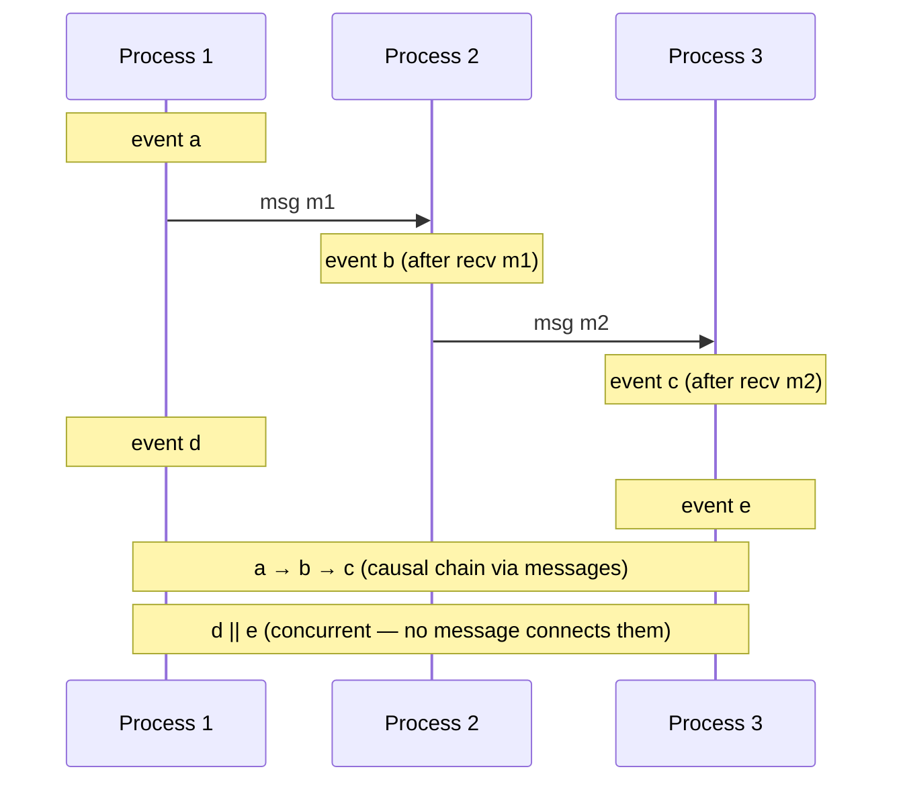
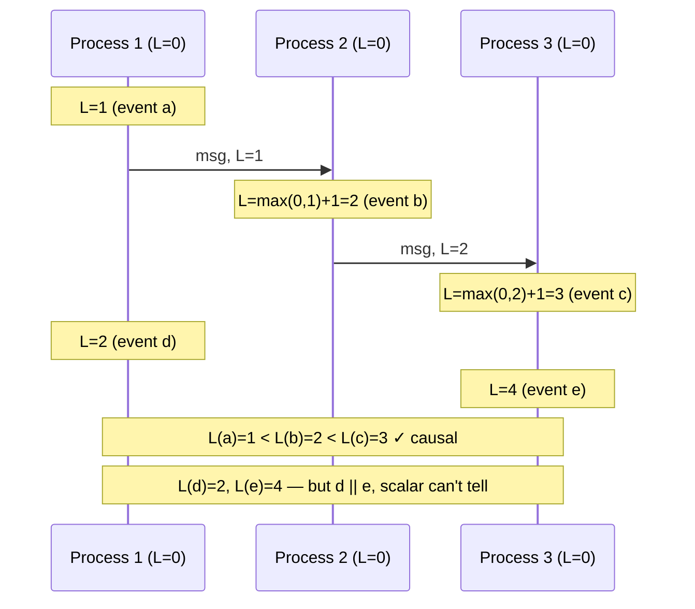
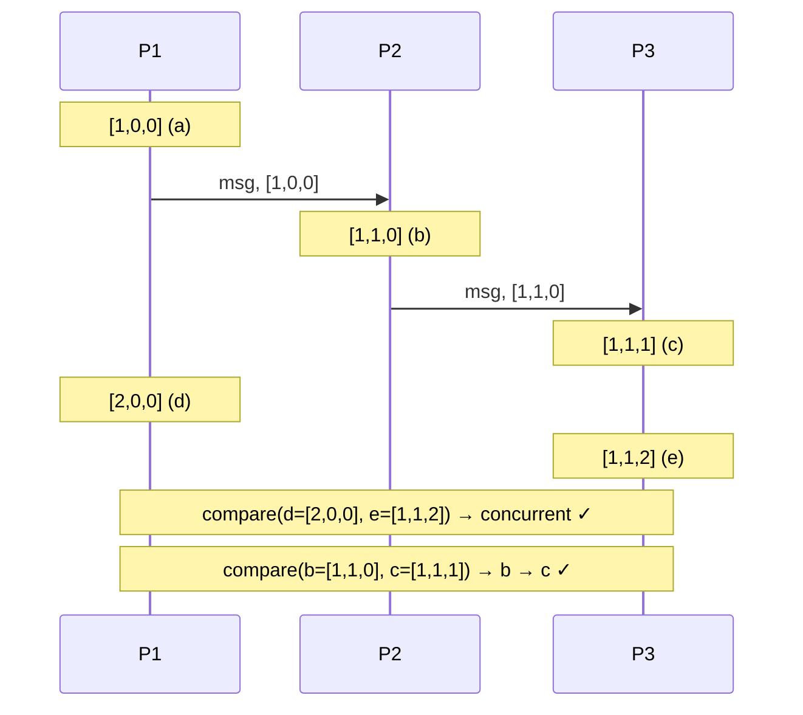

# Time and Ordering in Distributed Systems — Logical Clocks, Lamport, Vector, HLC

**Date:** 2026-04-25 | **Updated:** 2026-04-25
**Tags:** `system-design` `data-consistency` `logical-clocks` `lamport` `vector-clocks` `ordering`

## Table of Contents

- [Summary](#summary)
- [Why Time Is Hard in Distributed Systems](#why-time-is-hard-in-distributed-systems)
- [The Clock Synchronization Problem](#the-clock-synchronization-problem)
- [Causality vs Real Time](#causality-vs-real-time)
- [Lamport Timestamps](#lamport-timestamps)
- [Vector Clocks](#vector-clocks)
- [Version Vectors](#version-vectors)
- [Hybrid Logical Clocks (HLC)](#hybrid-logical-clocks-hlc)
- [TrueTime (Spanner)](#truetime-spanner)
- [Causal Consistency Models](#causal-consistency-models)
- [Real Use Cases](#real-use-cases)
- [Anti-Patterns](#anti-patterns)
- [Related](#related)
- [References](#references)

## Summary

Wall-clock time is unreliable in distributed systems: clocks drift, NTP corrects asymmetrically, leap seconds happen, and "now" doesn't mean the same thing on two machines. Most ordering problems we actually want to solve aren't about real time — they're about **causality**: did event A happen before event B, or are they concurrent? Logical clocks (Lamport, vector clocks, HLC) capture causality without trusting the wall clock. Modern production systems use **Hybrid Logical Clocks** to combine the best of physical timestamps (for human-readable debugging and bounded skew) with logical ordering (for correctness), and outliers like Google Spanner use specialized infrastructure (TrueTime) to bound clock uncertainty and enable externally consistent transactions.

## Why Time Is Hard in Distributed Systems

A senior engineer's mental model of time should start with one rule: **the wall clock is a lie.** Every assumption you've baked in from single-machine programming breaks across a network.

Sources of pain:

- **Clock skew** — two servers, even in the same rack, drift relative to each other. Quartz oscillators have temperature-dependent drift on the order of 10–100 parts per million (ppm). At 50 ppm, that's ~4 seconds of drift per day.
- **NTP imprecision** — NTP corrects clocks but introduces jitter. Over the public internet you typically see ~10–100 ms of error. NTP can also step the clock _backward_, breaking any code that assumes monotonicity.
- **Leap seconds** — UTC adds occasional leap seconds. Different OSes handle them differently: smear, step, freeze, or repeat. Cassandra, MongoDB, and Linux all had famous leap-second outages around 2012–2017.
- **Virtualization** — VMs pause, migrate, or get descheduled. A process that thinks 1 ms has elapsed may have actually slept for 30 seconds.
- **Time zones and DST** — irrelevant to ordering correctness, but a perpetual source of bugs in stored timestamps.

The core lesson: when you write `Date.now()` and use the result to order events that originated on _different machines_, you have built a bug. It may be a small bug, but at scale it manifests as duplicate IDs, lost updates, replay-corrupted projections, and impossible-looking causality violations.

## The Clock Synchronization Problem

The state of the art in clock sync gives you bounds, not certainties.

| Mechanism | Typical Accuracy | Where Used |
|-----------|------------------|------------|
| **NTP over WAN** | ~10–100 ms | Most servers, default in cloud VMs |
| **NTP over LAN (good)** | ~1–10 ms | Tuned datacenter NTP |
| **Chrony / sub-NTP tuning** | ~hundreds of µs | Performance-tuned Linux |
| **PTP (IEEE 1588)** | ~1–10 µs | Datacenter networks with PTP-aware switches |
| **GPS + atomic clocks** | <1 µs | Trading firms, Google's TrueTime |
| **White Rabbit (CERN)** | ~sub-ns | High-precision physics, telecom |

What this means in practice: even on a well-tuned datacenter, you should assume **at least a few milliseconds of uncertainty** between any two clocks. In a multi-region deployment, that uncertainty grows to **tens or hundreds of milliseconds**.

Critically, NTP can move your clock backward. A naive `now1 = Date.now(); ...; now2 = Date.now(); duration = now2 - now1;` can return a negative value. For elapsed-time measurements, you must use a monotonic clock (`process.hrtime.bigint()` in Node, `System.nanoTime()` in Java, `CLOCK_MONOTONIC` in POSIX). For ordering across machines, neither monotonic nor wall-clock time alone is sufficient.

## Causality vs Real Time

Here's the philosophical pivot: in most distributed systems, **what we want is not "what time was it?" but "what caused what?"**

Lamport's 1978 insight was that the relevant relation is **happens-before** (`→`), defined recursively:

1. If `a` and `b` are events in the same process and `a` comes before `b`, then `a → b`.
2. If `a` is the send of a message and `b` is the receive of that message, then `a → b`.
3. Transitivity: if `a → b` and `b → c`, then `a → c`.

Two events are **concurrent** (`a || b`) if neither `a → b` nor `b → a`.

Notice: this definition has no wall clock in it. It is purely about message flow. If you can capture happens-before, you've captured everything an external observer could possibly know about ordering — without ever trusting a clock.



## Lamport Timestamps

Lamport's scalar logical clock is the simplest way to capture happens-before. Each process keeps a single integer counter `L`, with two rules:

```pseudocode
# Local event (or send)
on local_event():
    L = L + 1
    timestamp_event_with(L)

# On receiving a message m with timestamp L_m
on receive(m):
    L = max(L, L_m) + 1
    timestamp_event_with(L)
```

That's the entire algorithm. From it we get a critical property:

> If `a → b`, then `L(a) < L(b)`.

The reverse is **not** true: `L(a) < L(b)` does not imply `a → b`. Two concurrent events can have any relative scalar values. Lamport timestamps give you a **partial order consistent with causality**, but they cannot detect concurrency.

To get a **total order** (e.g. for state-machine replication or assigning unique IDs), break ties with the process ID:

```pseudocode
def total_order(event_a, event_b):
    if a.L != b.L:
        return a.L < b.L
    return a.process_id < b.process_id
```

This total order is _arbitrary but consistent_ — every node agrees on the ordering, even though concurrent events get sorted by an unrelated property.



**What Lamport CAN'T tell you:** "Are events `d` (L=2) and `b` (L=2) concurrent, or did one cause the other?" The scalar collapses too much information. To answer that, you need vector clocks.

## Vector Clocks

A vector clock is a per-process array of counters: `V[i]` is process `i`'s knowledge of process `i`'s logical time on each peer. Rules:

```pseudocode
# Each process i maintains V_i, an array indexed by all process IDs.
# Initially V_i[j] = 0 for all j.

on local_event_at(i):
    V_i[i] = V_i[i] + 1

on send_at(i)(msg):
    V_i[i] = V_i[i] + 1
    attach V_i to msg

on receive_at(i)(msg with vector V_m):
    for each j:
        V_i[j] = max(V_i[j], V_m[j])
    V_i[i] = V_i[i] + 1
```

Comparison:

```pseudocode
def compare(V_a, V_b):
    if all(V_a[i] <= V_b[i]) and any(V_a[i] < V_b[i]):
        return "a → b"      # a happened before b
    if all(V_b[i] <= V_a[i]) and any(V_b[i] < V_a[i]):
        return "b → a"
    return "concurrent"     # neither dominates
```

This is the win: vector clocks can **detect concurrency**. If two events are concurrent, you know it definitively — you didn't lose information by collapsing into a scalar.



**Cost:** each message carries an O(N) vector where N is the number of nodes. For 10 nodes, that's trivial. For 10,000 microservice instances or for a Cassandra cluster with frequent membership changes, it's a real problem. Production systems mitigate this with version vectors (next section), pruning, or hybrid schemes.

A TypeScript-flavored sketch:

```ts
type VectorClock = Record<string, number>;

function tick(vc: VectorClock, nodeId: string): VectorClock {
  return { ...vc, [nodeId]: (vc[nodeId] ?? 0) + 1 };
}

function merge(local: VectorClock, incoming: VectorClock, nodeId: string): VectorClock {
  const allKeys = new Set([...Object.keys(local), ...Object.keys(incoming)]);
  const merged: VectorClock = {};
  for (const k of allKeys) {
    merged[k] = Math.max(local[k] ?? 0, incoming[k] ?? 0);
  }
  merged[nodeId] = (merged[nodeId] ?? 0) + 1;
  return merged;
}

type Order = "before" | "after" | "concurrent" | "equal";

function compare(a: VectorClock, b: VectorClock): Order {
  let aLessOrEq = true;
  let bLessOrEq = true;
  let strictlyLess = false;
  let strictlyGreater = false;
  const keys = new Set([...Object.keys(a), ...Object.keys(b)]);
  for (const k of keys) {
    const av = a[k] ?? 0;
    const bv = b[k] ?? 0;
    if (av < bv) { aLessOrEq = aLessOrEq && true; bLessOrEq = false; strictlyLess = true; }
    else if (av > bv) { bLessOrEq = bLessOrEq && true; aLessOrEq = false; strictlyGreater = true; }
  }
  if (aLessOrEq && bLessOrEq) return "equal";
  if (aLessOrEq && strictlyLess) return "before";
  if (bLessOrEq && strictlyGreater) return "after";
  return "concurrent";
}
```

## Version Vectors

A **version vector** is a vector clock specialized for tracking versions of a replicated object. The key difference: counters are incremented only on _writes_ to that specific object, not on every event.

This is the data structure that powered Amazon's Dynamo paper. When two replicas hold versions with concurrent vectors (neither dominates), Dynamo surfaces the conflict to the application: `getMultiple()` returns _all_ siblings, and the app (or the user) reconciles. Riak made the same choice. Cassandra famously did _not_ — it picked last-write-wins by wall-clock timestamp, which is precisely the anti-pattern this whole document warns about.

```pseudocode
# A simple shopping cart with version vectors
on write(replica_id, key, value):
    version[replica_id] += 1
    store(key, value, vv=copy(version))

on replicate(other_vv, other_value):
    cmp = compare(local_vv, other_vv)
    if cmp == "before":
        accept(other_value, vv=other_vv)        # we were stale
    elif cmp == "after":
        ignore                                   # we're newer
    elif cmp == "concurrent":
        store_sibling(other_value, vv=other_vv) # surface to app
    else:  # equal
        ignore
```

Practical lesson: version vectors give you **lossless conflict detection**. You still need an application-level merge function (CRDTs, business logic, user resolution), but you never silently drop data because of clock skew.

## Hybrid Logical Clocks (HLC)

Logical clocks ignore wall time, which is correct but operationally painful: timestamps don't correspond to anything humans recognize, and you can't say "give me events from the last hour" without an external indexing scheme.

**Hybrid Logical Clocks** (Kulkarni, Demirbas et al., 2014) combine physical and logical components. An HLC timestamp is a tuple `(pt, l)` (or sometimes encoded as a 64-bit integer with high bits for physical, low bits for logical):

- `pt` — physical time (millisecond or microsecond resolution)
- `l` — logical counter to disambiguate within the same `pt`

The update rules look like Lamport's, but reset the logical counter when physical time advances:

```pseudocode
on local_event():
    pt_now = wall_clock()
    if pt_now > hlc.pt:
        hlc = (pt_now, 0)
    else:
        hlc = (hlc.pt, hlc.l + 1)
    return hlc

on receive(msg with hlc_m):
    pt_now = wall_clock()
    new_pt = max(hlc.pt, hlc_m.pt, pt_now)
    if new_pt == hlc.pt and new_pt == hlc_m.pt:
        new_l = max(hlc.l, hlc_m.l) + 1
    elif new_pt == hlc.pt:
        new_l = hlc.l + 1
    elif new_pt == hlc_m.pt:
        new_l = hlc_m.l + 1
    else:
        new_l = 0
    hlc = (new_pt, new_l)
    return hlc
```

Why this matters in production:

- **Bounded skew.** If wall clocks are within `ε` of true time, HLC timestamps stay within `ε` of wall clock too. They never drift arbitrarily, unlike pure Lamport.
- **Causality preserved.** If `a → b`, then `hlc(a) < hlc(b)` lexicographically. Same guarantee Lamport gives.
- **Human-readable.** You can sort, range-query, and visualize HLC timestamps in dashboards without translation.
- **Compact.** Typically encoded in 64 bits, easy to store as a column or message header.

HLC is the workhorse of modern distributed databases:

| System | How HLC is used |
|--------|-----------------|
| **CockroachDB** | Transaction timestamps, MVCC reads, causality propagation between gateways |
| **MongoDB** | Cluster time, causal consistency for client sessions, oplog ordering |
| **YugabyteDB** | Same role as CockroachDB |
| **TiDB** | TSO (timestamp oracle) variant; not pure HLC but related |
| **FoundationDB** | Versionstamps with similar properties |

## TrueTime (Spanner)

Google Spanner takes a different approach: instead of avoiding wall clocks, it _bounds the uncertainty_ of wall clocks using specialized infrastructure.

**TrueTime** exposes an API: `TT.now()` returns an interval `[earliest, latest]` such that the true UTC time is guaranteed to lie within. The "ε" (epsilon) is typically ~7 ms in Google's datacenters, achieved by:

- GPS receivers and atomic clocks in every datacenter
- Time master servers that aggregate readings and detect outliers
- Timeslave daemons on every server polling multiple masters
- Drift estimation between polls (worst-case 200 µs/sec assumed)

Spanner uses this for **commit-wait**: when a transaction commits at timestamp `s`, the coordinator waits until `TT.now().earliest > s` before releasing locks. This guarantees that any later transaction will see a strictly greater timestamp — giving Spanner **external consistency** (linearizability with respect to real time, the strongest possible model).

```pseudocode
def commit(transaction):
    s = TT.now().latest             # pick a timestamp at upper bound
    write_with_timestamp(s)
    # Wait until s is definitely in the past everywhere
    while TT.now().earliest <= s:
        sleep(0.5_ms)
    release_locks()
```

Cost: every commit pays an ε-bounded wait (~7 ms median). Benefit: globally consistent snapshot reads with no coordination, across continents.

This is engineering luxury most companies don't have. CockroachDB, born of "Spanner without the atomic clocks," uses HLC plus an `--max-offset` configuration (default 500 ms) and aborts transactions whose timestamps fall in the uncertainty window — trading throughput for correctness without GPS hardware.

## Causal Consistency Models

**Causal consistency** is the strongest model achievable in an always-available, partition-tolerant system (it's the "C" in COPS, Eiger, Bolt-on causal consistency). It guarantees:

- If `write A` causally precedes `write B`, then any process that sees `B` must also see `A`.
- Concurrent writes can be observed in any order (or as siblings).

To implement it, you must **track dependencies** — for each write, record which prior writes the client had observed. There are several ways:

1. **Explicit dependency lists** — every write carries the set of writes it depends on. Conceptually clean, expensive in metadata.
2. **Vector clocks** — capture all causal predecessors implicitly. Used in COPS and Riak.
3. **HLC + read tracking** — use HLC for ordering and a small per-session "read timestamp" to enforce monotonic reads. Pragmatic; this is roughly MongoDB's causal consistency model.

Why HLC + dependency tracking is the practical sweet spot:

- HLC orders all events with bounded skew and small overhead.
- A per-session "max HLC seen" tag enforces "read your writes" and "monotonic reads" cheaply.
- Avoids vector-clock blowup with thousands of clients.
- Loses some precision compared to true vector clocks (false dependencies are possible), but in production the trade is almost always worth it.

## Real Use Cases

**1. Last-write-wins (LWW) resolution.** Cassandra, DynamoDB, S3 versioning. The simplest and worst conflict resolution: use a timestamp to pick a winner. With wall clocks, you _will_ silently lose writes during clock skew. Always prefer HLC or version-vector-with-app-merge if data loss matters.

**2. Multi-region replication.** Active-active databases need to order writes from multiple regions. Causally inconsistent reads (seeing a reply before its parent comment) are a UX disaster. CockroachDB and MongoDB use HLC + transaction protocols; weaker systems use causal sessions on top of LWW.

**3. Distributed tracing.** OpenTelemetry spans have wall-clock `start_time` / `end_time`, but trace ordering across services depends on parent-child span IDs (a form of causal tracking). Without that, you'd see "child span starts 5 ms before parent" routinely due to clock skew.

**4. Event sourcing and CQRS projections.** When events arrive from multiple producers, ordering them by wall clock breaks projections. Use a Kafka partition key tied to the aggregate (forcing a single producer per aggregate) plus monotonically increasing offsets within the partition. For cross-aggregate ordering, fall back to HLC or accept eventual consistency.

**5. Distributed snapshots and backups.** Spanner's externally consistent snapshots, CockroachDB's `AS OF SYSTEM TIME`, and MongoDB's `$clusterTime` all rely on logical or hybrid clocks to define what "the database at time T" means consistently across shards.

**6. Debugging.** When a customer reports "my action ran in the wrong order," wall-clock log timestamps lie. HLC stamps in your log lines tell you the actual causal ordering. Tools like Honeycomb's BubbleUp and Lightstep are HLC-aware in their backend models.

## Anti-Patterns

A senior engineer's checklist of things to never do:

**1. Using wall clock to order events across machines.**
```ts
// BAD — drift, NTP step, leap seconds will eventually bite you
events.sort((a, b) => a.serverTimestamp - b.serverTimestamp);
```
Use a sequencer (Kafka offsets, Postgres `txid`), HLC, or vector clock instead.

**2. NTP-skew duplicate IDs.**
```ts
// BAD — two machines at the same Date.now() will collide
const id = `${Date.now()}-${random}`;
```
Use ULID/KSUID with sufficient entropy, UUIDv7 with a logical counter, or Snowflake-style IDs with explicit machine-ID bits.

**3. Vector clock blowup in churning fleets.** If your "vector" has one entry per ephemeral container instance, vectors grow unbounded. Mitigations:
- Use stable logical "node" identities (shard ID, partition ID), not pod hostnames.
- Periodically prune entries for nodes that have been gone for longer than message TTL.
- Use HLC if vector size becomes a real problem and approximate causal consistency is acceptable.

**4. Ignoring leap seconds.** If your system uses raw UTC seconds for ordering, a leap second can produce two events with `t1 == t2` or `t1 > t2 < t1`. Use a clock that smears (Google's leap smear, AWS's leap smear) or never trust two close timestamps to be strictly ordered.

**5. Trusting "monotonic time" across processes.** `process.hrtime` and `System.nanoTime()` are monotonic _within a process_, undefined across processes — they don't correspond to wall time and aren't comparable across machines. Use them for elapsed-time measurements only.

**6. LWW with millisecond precision.** When two writes from different clients arrive in the same millisecond, LWW based on `(timestamp, ...)` is non-deterministic. Always include a tiebreaker (node ID, request ID) and use sub-millisecond precision when the throughput justifies it.

**7. Assuming `now()` is monotonic.** Java's `System.currentTimeMillis()` and JavaScript's `Date.now()` can go _backward_ when NTP corrects. Code like:
```java
long start = System.currentTimeMillis();
doWork();
long elapsed = System.currentTimeMillis() - start; // may be negative!
```
must use `System.nanoTime()` or `Instant.now(Clock.systemUTC())` plus careful awareness.

**8. Cross-region transactions without a clock model.** If you find yourself trying to coordinate writes across regions without HLC, TrueTime, or a consensus protocol, you're heading for a silent-data-loss outage. Either adopt a database that handles this (Spanner, CockroachDB, YugabyteDB) or design around eventual consistency with explicit causal sessions.

## Related

- [Consensus, Raft, and Paxos](consensus-raft-and-paxos.md) — how nodes agree on a total order without a global clock
- [Quorum and Tunable Consistency](quorum-and-tunable-consistency.md) — R+W>N reads/writes and where they sit relative to causal models
- [Replication Patterns](replication-patterns.md) — leader-follower, multi-leader, leaderless, and what each implies for ordering
- [Merkle Trees](merkle-trees.md) _(planned)_ — anti-entropy and Merkle-based reconciliation for replicated state

## References

- [Lamport, "Time, Clocks, and the Ordering of Events in a Distributed System" (1978)](https://lamport.azurewebsites.net/pubs/time-clocks.pdf) — the foundational paper; introduces happens-before and Lamport timestamps
- [Mattern, "Virtual Time and Global States of Distributed Systems" (1989)](https://www.vs.inf.ethz.ch/publ/papers/VirtTimeGlobStates.pdf) — formalization of vector clocks
- [Fidge, "Timestamps in Message-Passing Systems That Preserve the Partial Ordering" (1988)](https://fileadmin.cs.lth.se/cs/Personal/Amr_Ergawy/dist-algos-papers/4.pdf) — independent vector clock derivation
- [Kulkarni et al., "Logical Physical Clocks and Consistent Snapshots in Globally Distributed Databases" (2014)](https://cse.buffalo.edu/tech-reports/2014-04.pdf) — the Hybrid Logical Clock paper
- [Corbett et al., "Spanner: Google's Globally-Distributed Database" (OSDI 2012)](https://research.google/pubs/spanner-googles-globally-distributed-database-2/) — TrueTime and external consistency
- [DeCandia et al., "Dynamo: Amazon's Highly Available Key-Value Store" (SOSP 2007)](https://www.allthingsdistributed.com/files/amazon-dynamo-sosp2007.pdf) — version vectors in production
- [CockroachDB blog, "Living Without Atomic Clocks"](https://www.cockroachlabs.com/blog/living-without-atomic-clocks/) — HLC vs TrueTime trade-offs
- [Martin Kleppmann, "Distributed Systems lecture notes — Logical time"](https://www.cl.cam.ac.uk/teaching/2122/ConcDisSys/dist-sys-notes.pdf) — accessible treatment of clocks and ordering
- [Kleppmann, _Designing Data-Intensive Applications_, Ch. 8 "The Trouble with Distributed Systems"](https://dataintensive.net/) — book-length practitioner perspective on clock skew and ordering
