# Bloom Filters & Cuckoo Filters

**Date:** 2026-04-25 | **Updated:** 2026-04-25
**Tags:** `system-design` `data-structures` `probabilistic` `bloom-filter` `cuckoo-filter`

## Table of Contents

- [Summary](#summary)
- [Overview](#overview)
- [Key Concepts](#key-concepts)
  - [Hash Family and Independence](#hash-family-and-independence)
  - [Bloom Filter Mechanics — m Bits, k Hashes](#bloom-filter-mechanics--m-bits-k-hashes)
  - [False-Positive Probability and Optimal k](#false-positive-probability-and-optimal-k)
  - [Counting Bloom Filter — Supporting Deletion](#counting-bloom-filter--supporting-deletion)
  - [Scalable Bloom Filter — Chained Layers](#scalable-bloom-filter--chained-layers)
  - [Cuckoo Filter — Cuckoo Hashing with Fingerprints](#cuckoo-filter--cuckoo-hashing-with-fingerprints)
  - [Why Cuckoo Beats Bloom on High-Accuracy Workloads](#why-cuckoo-beats-bloom-on-high-accuracy-workloads)
- [Trade-offs](#trade-offs)
  - [Bloom vs Hash Set](#bloom-vs-hash-set)
  - [Bloom vs Cuckoo](#bloom-vs-cuckoo)
  - [When to Pick Each](#when-to-pick-each)
- [Code Examples](#code-examples)
  - [Bloom Filter — Insert and Lookup](#bloom-filter--insert-and-lookup)
  - [Counting Bloom — Delete Variant](#counting-bloom--delete-variant)
  - [Cuckoo Filter — Insert, Lookup, Delete](#cuckoo-filter--insert-lookup-delete)
- [Real-World Uses](#real-world-uses)
- [Anti-Patterns](#anti-patterns)
- [Related](#related)
- [References](#references)

## Summary

A **Bloom filter** is a compact bit array plus `k` independent hash functions that answers "is `x` in the set?" with **no false negatives** and a tunable false-positive rate. A **Cuckoo filter** is a newer probabilistic membership structure that stores small fingerprints in a cuckoo hash table — it supports **deletion**, has better space efficiency at low false-positive rates (below roughly 3%), and lookups touch only two buckets. Both are used to **avoid expensive lookups** — disk reads, cache misses, or remote calls — by short-circuiting "definitely not present" cases. This doc covers the math (`(1 - e^(-kn/m))^k`, optimal `k = (m/n) ln 2`), the mechanics of each variant, code, real production uses (Cassandra, RocksDB, HBase, Bitcoin SPV, Chrome Safe Browsing), and when to reach for which.

## Overview

When a system asks "do I have key `x`?", the cost of saying "no" can dwarf the cost of saying "yes":

- An LSM-tree database (Cassandra, RocksDB, HBase) must check on-disk SSTables; every miss is a disk read.
- A CDN edge must check origin cache; every miss is a long-haul HTTP request.
- A browser must check a malicious-URL list of hundreds of thousands of entries.
- A Bitcoin SPV client must check if a transaction concerns its wallet without downloading the full chain.

A probabilistic membership filter sits in front of the expensive layer. It is **small enough to fit in RAM** and answers in microseconds. It permits some **false positives** (says "maybe present" when the key is absent), but never **false negatives** (never claims a present key is absent). False positives cost an unnecessary lookup; false negatives would cost correctness.

```mermaid
graph LR
    Q[Query: contains x?] --> F{Bloom or Cuckoo<br/>filter check}
    F -->|definitely no| R1[Return: not present<br/>O&#40;1&#41; — no I/O]
    F -->|maybe yes| EXP[Expensive lookup<br/>SSTable/disk/remote]
    EXP -->|found| R2[Return: present]
    EXP -->|not found| R3[Return: not present<br/>false positive — cost wasted]
```



The trade-off is dialled by sizing: bigger filter → fewer false positives → less wasted work, more memory. The math below tells you exactly where the knee is.

## Key Concepts

### Hash Family and Independence

Both Bloom and Cuckoo filters need hash functions that distribute inputs uniformly and independently across the address space. They are **not cryptographic** — speed matters far more than collision resistance. Production code uses MurmurHash3, xxHash, FarmHash, or CityHash.

A common trick from Kirsch and Mitzenmacher (2006) is **double hashing** to simulate `k` hashes from two:

```
h_i(x) = (h1(x) + i * h2(x)) mod m,  for i = 0, 1, ..., k-1
```

This gives you `k` near-independent indices for the cost of two real hashes. Cuckoo filters typically split a single 64-bit hash into a fingerprint and an index, then derive the alternate index by XOR.

### Bloom Filter Mechanics — m Bits, k Hashes

A Bloom filter has:

- A bit array `B[0..m-1]`, all zeros initially.
- `k` independent hash functions `h_1 ... h_k`, each mapping a key to `[0, m)`.

**Insert** `x`:

```
for i in 1..k:
    B[h_i(x)] = 1
```

**Lookup** `x`:

```
for i in 1..k:
    if B[h_i(x)] == 0:
        return DEFINITELY_NOT_PRESENT
return PROBABLY_PRESENT
```

If any of the `k` bits is zero, `x` was never inserted (no false negatives). If all `k` are one, `x` may have been inserted, or other insertions may have collectively flipped those `k` bits (false positive).

```text
Empty filter:    [0 0 0 0 0 0 0 0 0 0 0 0 0 0]   m=14, k=3

insert "apple":  hashes -> 1, 5, 9
                 [0 1 0 0 0 1 0 0 0 1 0 0 0 0]

insert "berry":  hashes -> 2, 5, 12
                 [0 1 1 0 0 1 0 0 0 1 0 0 1 0]

lookup "apple":  check 1,5,9 -> all 1 -> probably present
lookup "cherry": hashes -> 1, 9, 12 -> all 1 (collision!) -> false positive
lookup "date":   hashes -> 0, 4, 7 -> 0 at index 0 -> definitely not
```

**No deletion.** Clearing a bit set by `apple` would also delete it for any other key whose hashes touch that bit, breaking the no-false-negatives guarantee.

### False-Positive Probability and Optimal k

After inserting `n` distinct keys with `k` hashes into `m` bits, the probability that a specific bit is **still zero** is:

```
P(bit zero) = (1 - 1/m)^(kn) ≈ e^(-kn/m)
```

A false positive requires all `k` hashes of the queried key to land on bits that are one. Approximating those `k` events as independent:

```
FPR ≈ (1 - e^(-kn/m))^k
```

This is the canonical Bloom-filter formula. It assumes ideal hashes and is a slight underestimate; Bose et al. (2008) showed the true rate is marginally higher, but the formula is accurate enough for engineering decisions.

**Optimal `k` for a fixed `m/n` ratio:**

Differentiating with respect to `k` and setting to zero gives:

```
k_opt = (m / n) * ln(2)  ≈  0.6931 * (m / n)
```

Substituting back, the **minimum achievable FPR** is:

```
FPR_min = (1/2)^k_opt = (0.6185)^(m/n)
```

**Bits per element to hit a target FPR `p`:**

```
m / n  =  -ln(p) / (ln(2))^2  ≈  -1.4427 * log2(p)
```

Useful concrete numbers:

| Target FPR | Bits per element (`m/n`) | Optimal `k` |
|------------|---------------------------|-------------|
| 10%        | 4.79                      | 3           |
| 1%         | 9.59                      | 7           |
| 0.1%       | 14.38                     | 10          |
| 0.01%      | 19.17                     | 13          |
| 0.001%     | 23.96                     | 17          |

For 1% FPR you need about **9.6 bits per element** — roughly 1.2 bytes per key, regardless of key size. That is the property that makes Bloom filters a good fit for billions of items.

### Counting Bloom Filter — Supporting Deletion

A counting Bloom filter (Fan, Cao, Almeida, Broder, 2000) replaces each bit with a small counter (typically 4 bits). Insert increments each of the `k` counters; delete decrements them; lookup checks that all are non-zero. Trade-offs:

- **Cost:** typically 4× the space of a standard Bloom filter (4-bit counters vs single bits).
- **Counter overflow:** with 4-bit counters, the chance of overflow at typical load is low but non-zero. Saturating counters degrade gracefully — they stop decrementing, leading to "phantom" set membership rather than false negatives.
- **Deletion soundness only if `x` was actually inserted.** Decrementing a counter for a key never inserted is a silent corruption — counters drift and you eventually start reporting false negatives. Always pair counting Bloom filters with a system that knows what it inserted.

### Scalable Bloom Filter — Chained Layers

A standard Bloom filter requires you to know `n` upfront. The **Scalable Bloom Filter** (Almeida, Baquero, Preguiça, Hutchison, 2007) adds a new layer when the current one fills:

- Layer `i` is sized `m_i` with target FPR `p_i = p_0 * r^i` for some tightening ratio `r < 1` (commonly `r = 0.5` or `0.9`).
- The total FPR is bounded by a geometric series: `P_total <= p_0 / (1 - r)`.
- Lookup checks every layer; an item is "present" if any layer says so.
- Insertion goes only into the current (last) layer.

This lets you accept an unknown stream of keys while keeping the false-positive rate bounded. The cost is more memory than a precisely-sized one-shot Bloom and slower lookups proportional to the number of layers.

### Cuckoo Filter — Cuckoo Hashing with Fingerprints

Introduced by Fan, Andersen, Kaminsky, Mitzenmacher (2014) — "Cuckoo Filter: Practically Better Than Bloom".

Structure:

- A table of `m` **buckets**, each holding up to `b` fingerprint slots (typically `b = 4`).
- A **fingerprint** is `f` bits derived from the key's hash (typically 8–16 bits).
- Two candidate buckets per key, computed via **partial-key cuckoo hashing**:

```
i1 = hash(x) mod m
i2 = i1 XOR hash(fingerprint(x)) mod m
```

The XOR-with-hashed-fingerprint construction is the trick — it lets you compute `i2` from `i1` *and the fingerprint alone*, without knowing the original key. That's how lookup and eviction work without storing keys.

**Insert:**

1. Compute `f = fingerprint(x)`, `i1`, `i2`.
2. If bucket `i1` or `i2` has a free slot, place `f` there.
3. Otherwise pick one bucket, evict a random fingerprint `f'`, place `f` there, then re-insert `f'` into its alternate bucket (`i' XOR hash(f')`). Repeat.
4. After a maximum number of relocations (typically 500), declare the filter full.

**Lookup `x`:** Compute `f`, `i1`, `i2`. If `f` appears in either bucket, return "probably present"; otherwise "definitely not".

**Delete `x`:** Compute `f`, `i1`, `i2`. If `f` is in either bucket, remove one occurrence. **Only safe if `x` was actually inserted** — deleting a never-inserted key may remove a fingerprint belonging to a different key with the same `f` and same alternate bucket, causing a false negative for that other key.

```text
Cuckoo filter, m=8 buckets, b=4 slots per bucket, f=8-bit fingerprints

bucket  0:  [_,    _,   _,   _]
bucket  1:  [0xA3, _,   _,   _]    <- "apple" landed here (i1=1, fp=0xA3)
bucket  2:  [_,    _,   _,   _]
bucket  3:  [_,    _,   _,   _]
bucket  4:  [0x7F, _,   _,   _]    <- "berry" landed here (i1=4, fp=0x7F)
bucket  5:  [_,    _,   _,   _]
bucket  6:  [_,    _,   _,   _]
bucket  7:  [_,    _,   _,   _]

lookup "apple":  fp=0xA3, candidates {1, 6}; bucket 1 has 0xA3 -> present
lookup "cherry": fp=0xC1, candidates {2, 5}; neither has 0xC1 -> not present
```

### Why Cuckoo Beats Bloom on High-Accuracy Workloads

The Cuckoo filter paper shows that for FPR below roughly **3%**, cuckoo filters use **less space** than the equivalent Bloom filter, while supporting deletion and only touching two cache lines per lookup.

Why this happens:

- A Bloom filter's bits per element grows as `-1.44 log2(p)` — independent of how cleverly you pack things.
- A Cuckoo filter stores fingerprints in a hash table with load factor up to ~95% (with `b=4` slots per bucket). Each fingerprint costs about `log2(1/p) + 3` bits including overhead. Below `p ≈ 3%` this beats Bloom.
- Bloom filters touch `k` cache lines per lookup (one per hash); a 1% FPR Bloom touches 7 cache lines. Cuckoo always touches 2.

For workloads with FPR above ~3% (common when memory is very tight relative to set size), Bloom is still smaller and simpler. So both have a niche.

## Trade-offs

### Bloom vs Hash Set

| Property | Hash set (`HashSet<Key>`) | Bloom filter |
|----------|---------------------------|--------------|
| Membership query | Exact | Probabilistic (FPR > 0) |
| Stores keys themselves | Yes | No |
| Memory per element | ~50–100 bytes (plus key) | ~10 bits at 1% FPR |
| Supports deletion | Yes | No (use counting variant) |
| Supports iteration / enumeration | Yes | No |
| Supports false-negative-free lookup | Yes | Yes |

A hash set is the correct choice when you need exact answers, can afford the memory, and want iteration. A Bloom filter wins when the set is huge, the keys are large, you only need membership, and a small false-positive rate is acceptable.

### Bloom vs Cuckoo

| Property | Bloom | Cuckoo |
|----------|-------|--------|
| Insertion | O(k) bit sets | O(1) amortized, may relocate |
| Lookup | k cache-line touches | 2 cache-line touches |
| Deletion | No (counting Bloom yes, 4× space) | Yes (if item was inserted) |
| Space @ 1% FPR | ~9.6 bits/element | ~12 bits/element |
| Space @ 0.1% FPR | ~14.4 bits/element | ~13 bits/element |
| Space @ 0.01% FPR | ~19.2 bits/element | ~16 bits/element |
| Behaviour at capacity | Degrades gradually | Insertion fails hard |
| Supports dynamic resizing | No (use scalable Bloom) | No (rebuild) |
| Concurrent updates | Easy with atomic OR | Harder — eviction chain |

### When to Pick Each

- **Pick a standard Bloom filter** when the set is built once (or grows in a controlled way), no deletions are needed, and you can pre-size for `n` and target FPR.
- **Pick a counting Bloom filter** when deletions are required and memory is generous (you can afford 4×).
- **Pick a scalable Bloom filter** when the total set size is unknown and you can't afford to over-provision the initial filter.
- **Pick a Cuckoo filter** when you need deletions, want low FPR (below ~3%), or care about lookup latency (cache-friendly two-bucket access).
- **Pick a hash set** when memory allows, the set is small enough to fit, or correctness forbids any false positives.
- **Pick a quotient filter or XOR filter** for read-mostly workloads where compactness matters more than insertion speed (XOR filters are static — built once, then immutable, but ~25% smaller than equivalent Bloom).

## Code Examples

### Bloom Filter — Insert and Lookup

```python
import math
from typing import Iterable
import mmh3   # MurmurHash3 — fast, non-cryptographic

class BloomFilter:
    def __init__(self, capacity: int, fp_rate: float = 0.01):
        # m = -n ln(p) / (ln 2)^2
        self.m = math.ceil(-capacity * math.log(fp_rate) / (math.log(2) ** 2))
        # k = (m/n) ln(2)
        self.k = max(1, round((self.m / capacity) * math.log(2)))
        self.bits = bytearray((self.m + 7) // 8)
        self.n = 0

    def _indices(self, item: bytes) -> Iterable[int]:
        # Kirsch-Mitzenmacher double hashing: derive k indices from 2 hashes.
        h1 = mmh3.hash(item, seed=0, signed=False)
        h2 = mmh3.hash(item, seed=1, signed=False)
        for i in range(self.k):
            yield (h1 + i * h2) % self.m

    def add(self, item: bytes) -> None:
        for idx in self._indices(item):
            self.bits[idx >> 3] |= (1 << (idx & 7))
        self.n += 1

    def __contains__(self, item: bytes) -> bool:
        for idx in self._indices(item):
            if not (self.bits[idx >> 3] & (1 << (idx & 7))):
                return False
        return True

    def estimated_fpr(self) -> float:
        # (1 - e^(-kn/m))^k
        return (1 - math.exp(-self.k * self.n / self.m)) ** self.k
```

### Counting Bloom — Delete Variant

```python
class CountingBloomFilter:
    def __init__(self, capacity: int, fp_rate: float = 0.01, counter_bits: int = 4):
        self.m = math.ceil(-capacity * math.log(fp_rate) / (math.log(2) ** 2))
        self.k = max(1, round((self.m / capacity) * math.log(2)))
        self.max_count = (1 << counter_bits) - 1
        self.counters = [0] * self.m

    def _indices(self, item: bytes):
        h1 = mmh3.hash(item, seed=0, signed=False)
        h2 = mmh3.hash(item, seed=1, signed=False)
        for i in range(self.k):
            yield (h1 + i * h2) % self.m

    def add(self, item: bytes) -> None:
        for idx in self._indices(item):
            if self.counters[idx] < self.max_count:
                self.counters[idx] += 1
            # Saturate at max_count: prefer false positives over corruption.

    def remove(self, item: bytes) -> None:
        # Caller must guarantee item was previously added.
        for idx in self._indices(item):
            if 0 < self.counters[idx] < self.max_count:
                self.counters[idx] -= 1

    def __contains__(self, item: bytes) -> bool:
        return all(self.counters[idx] > 0 for idx in self._indices(item))
```

### Cuckoo Filter — Insert, Lookup, Delete

```python
import random
from typing import List, Optional

class CuckooFilter:
    MAX_KICKS = 500

    def __init__(self, capacity: int, bucket_size: int = 4, fp_bits: int = 8):
        # Round buckets up to a power of two so the i2 = i1 XOR hash(fp) trick
        # stays inside the table.
        n_buckets = 1
        while n_buckets * bucket_size < capacity:
            n_buckets <<= 1
        self.bucket_size = bucket_size
        self.fp_mask = (1 << fp_bits) - 1
        self.buckets: List[List[Optional[int]]] = [
            [None] * bucket_size for _ in range(n_buckets)
        ]
        self.size = 0

    def _fingerprint(self, item: bytes) -> int:
        fp = mmh3.hash(item, seed=42, signed=False) & self.fp_mask
        return fp if fp != 0 else 1   # reserve 0 as "empty slot"

    def _index(self, h: int) -> int:
        return h % len(self.buckets)

    def _alt_index(self, idx: int, fp: int) -> int:
        return (idx ^ mmh3.hash(fp.to_bytes(2, "little"), seed=99, signed=False)) % len(self.buckets)

    def _try_insert(self, idx: int, fp: int) -> bool:
        for slot in range(self.bucket_size):
            if self.buckets[idx][slot] is None:
                self.buckets[idx][slot] = fp
                return True
        return False

    def add(self, item: bytes) -> bool:
        fp = self._fingerprint(item)
        i1 = self._index(mmh3.hash(item, seed=7, signed=False))
        i2 = self._alt_index(i1, fp)

        if self._try_insert(i1, fp) or self._try_insert(i2, fp):
            self.size += 1
            return True

        # Evict and relocate.
        idx = random.choice([i1, i2])
        for _ in range(self.MAX_KICKS):
            slot = random.randrange(self.bucket_size)
            fp, self.buckets[idx][slot] = self.buckets[idx][slot], fp
            idx = self._alt_index(idx, fp)
            if self._try_insert(idx, fp):
                self.size += 1
                return True
        # Filter is effectively full — caller should rebuild larger.
        return False

    def __contains__(self, item: bytes) -> bool:
        fp = self._fingerprint(item)
        i1 = self._index(mmh3.hash(item, seed=7, signed=False))
        i2 = self._alt_index(i1, fp)
        return fp in self.buckets[i1] or fp in self.buckets[i2]

    def remove(self, item: bytes) -> bool:
        # Caller must guarantee item was previously added.
        fp = self._fingerprint(item)
        i1 = self._index(mmh3.hash(item, seed=7, signed=False))
        i2 = self._alt_index(i1, fp)
        for idx in (i1, i2):
            for slot in range(self.bucket_size):
                if self.buckets[idx][slot] == fp:
                    self.buckets[idx][slot] = None
                    self.size -= 1
                    return True
        return False
```

## Real-World Uses

| System | Purpose | Variant |
|--------|---------|---------|
| **Apache Cassandra** | Each SSTable carries a Bloom filter so reads can skip SSTables that definitely lack the key — drastically reduces disk I/O on read-heavy workloads. Tunable per-table via `bloom_filter_fp_chance`. | Standard Bloom |
| **Apache HBase** | Per-StoreFile Bloom filters (row or row+column), same role as Cassandra — short-circuit HFile reads. | Standard Bloom |
| **RocksDB / LevelDB** | Per-SST Bloom filter (default 10 bits/key, ~1% FPR); newer **Ribbon filter** (a kind of XOR/lp-decoded filter) is offered as a more space-efficient alternative for read-mostly workloads. | Standard Bloom + Ribbon |
| **Google Bigtable** | SSTable Bloom filters for row and locality-group lookups — same architecture LSM filters were popularized by. | Standard Bloom |
| **CDN cache lookup (e.g. Akamai, Cloudflare patterns)** | Edge servers test a Bloom filter before a cache-peer or origin fetch to eliminate guaranteed misses. | Standard / Counting Bloom |
| **Bitcoin SPV (BIP 37)** | A light client sends a Bloom filter of its addresses to full nodes; the full node returns only matching transactions — privacy-preserving (mostly) without downloading the full blockchain. BIP 37 has known privacy issues, partially superseded by BIP 157/158 client-side compact filters (Golomb-coded sets). | Standard Bloom (BIP 37); GCS (BIP 158) |
| **Chrome / Firefox Safe Browsing** | A local probabilistic structure of malicious URL prefixes is checked before any network query to Google's Safe Browsing API. Originally a Bloom filter; later moved to a delta-coded prefix list because update efficiency mattered more than constant-factor compactness. | Bloom historically |
| **Squid / web proxies** | Cache-summary Bloom filters exchanged between proxies (Cache Summaries / "Summary Cache" — Fan et al., 1998) so peers can answer "do you have this URL?" without per-query messages. | Counting Bloom |
| **Medium / Quora-style "already seen"** | Recommendation feeds use Bloom filters to skip articles the user has already been shown. | Standard Bloom |
| **Email / abuse systems** | Detect duplicate or already-seen message hashes across a streaming pipeline. | Scalable Bloom |
| **CockroachDB, ScyllaDB, TiKV** | LSM Bloom filters on SSTables, identical pattern to Cassandra/RocksDB. | Standard Bloom |

The single most common production pattern: **LSM-tree read path**. On a read miss, an LSM may need to check every SSTable; a Bloom filter per SSTable cuts that to one or two real reads on average.

## Anti-Patterns

- **Storing in a Bloom filter for later "deletion".** Plain Bloom filters cannot delete. Clearing bits silently corrupts membership for unrelated keys. Use counting Bloom or Cuckoo if deletes are required.
- **Computing FPR after the fact and being surprised.** Always size for the largest expected `n`. As `n` grows past target, FPR climbs sharply.
- **Sharing a single Bloom filter across many writers without atomics.** A bit-OR is naturally idempotent and safe, but counting Bloom filters need atomic increment/decrement; cuckoo eviction chains are not naively concurrent.
- **Using Bloom filter results as the source of truth for billing, rate limiting, or security.** A false positive will eventually let the wrong key through (or block the wrong key). Always couple with the authoritative store.
- **Cryptographic hash for the inner hash.** Fast, well-distributed non-cryptographic hashes (Murmur, xxHash, FarmHash) are the right choice. SHA-256 is wasteful here.
- **Using a Bloom filter where a probabilistic *count* is what's needed.** Bloom answers membership, not cardinality. For "how many distinct?" use [HyperLogLog](./hyperloglog.md).
- **Using a Bloom filter as a substitute for an index.** It can short-circuit *negatives*; it cannot fetch a value or enumerate keys.
- **Calling `delete` on a Cuckoo filter for an item that was never inserted.** This may evict a fingerprint belonging to a different key with the same fingerprint and alternate bucket, producing a real false negative thereafter.

## Related

- [HyperLogLog — Cardinality Estimation](./hyperloglog.md) _(planned)_ — sibling probabilistic structure for "how many distinct?" rather than "is it present?"; same family of trade-offs (compactness vs exactness)
- [Consistent and Rendezvous Hashing](./consistent-and-rendezvous-hashing.md) _(planned)_ — sibling data-structure tier doc; placement of keys in a distributed cluster
- [Caching Layers — Browser, CDN, Application, Database](../building-blocks/caching-layers.md) — Bloom filters live in front of the cache layer to avoid pointless lookups
- [Design a Distributed Key-Value Store](../case-studies/distributed-infra/design-key-value-store.md) — LSM read path with per-SSTable Bloom filters; the canonical Bloom consumer
- [Design a Distributed Cache](../case-studies/distributed-infra/design-distributed-cache.md) — peer cache summaries and origin-miss short-circuiting
- [Design a Web Crawler](../case-studies/search-aggregation/design-web-crawler.md) — Bloom filter on URLs already seen, kept per-shard, often scalable Bloom because the frontier grows unboundedly
- [Design a CDN](../case-studies/distributed-infra/design-cdn.md) _(planned)_ — edge-side filters for negative cache short-circuiting

## References

- Burton H. Bloom, ["Space/Time Trade-offs in Hash Coding with Allowable Errors" (CACM 1970)](https://dl.acm.org/doi/10.1145/362686.362692) — the original paper; still readable and short
- Bin Fan, Dave G. Andersen, Michael Kaminsky, Michael D. Mitzenmacher, ["Cuckoo Filter: Practically Better Than Bloom" (CoNEXT 2014)](https://www.cs.cmu.edu/~dga/papers/cuckoo-conext2014.pdf) — the cuckoo filter paper, with the partial-key cuckoo hashing trick
- Adam Kirsch, Michael Mitzenmacher, ["Less Hashing, Same Performance: Building a Better Bloom Filter" (2006)](https://www.eecs.harvard.edu/~michaelm/postscripts/rsa2008.pdf) — proves the double-hashing trick used in essentially every production Bloom filter
- Li Fan, Pei Cao, Jussara Almeida, Andrei Z. Broder, ["Summary Cache: A Scalable Wide-Area Web Cache Sharing Protocol" (SIGCOMM 1998)](https://pages.cs.wisc.edu/~jussara/papers/00ton.pdf) — counting Bloom filter; web-proxy cache summaries
- Paulo Sérgio Almeida, Carlos Baquero, Nuno Preguiça, David Hutchison, ["Scalable Bloom Filters" (Information Processing Letters 2007)](https://gsd.di.uminho.pt/members/cbm/ps/dbloom.pdf) — chained / scalable Bloom filter construction
- [Apache Cassandra — Bloom Filter Documentation](https://cassandra.apache.org/doc/latest/cassandra/managing/operating/bloom_filters.html) — production tuning of `bloom_filter_fp_chance` per table
- [RocksDB Wiki — Bloom Filter and Ribbon Filter](https://github.com/facebook/rocksdb/wiki/RocksDB-Bloom-Filter) — implementation details, default 10 bits/key, full vs prefix Bloom, Ribbon filter as the modern alternative
- Google Chrome Security Blog, ["Protecting people across the web with Safe Browsing"](https://security.googleblog.com/2012/01/safe-browsing-protecting-web-users-for.html) and the [Safe Browsing v4 update API](https://developers.google.com/safe-browsing/v4/update-api) — describes the local cached threat list (originally Bloom-style, now delta-encoded prefix database)
- Andrei Broder, Michael Mitzenmacher, ["Network Applications of Bloom Filters: A Survey" (2002)](https://www.eecs.harvard.edu/~michaelm/postscripts/im2005b.pdf) — comprehensive survey of Bloom variants and applications
- [Bitcoin BIP 37 — Connection Bloom Filtering](https://github.com/bitcoin/bips/blob/master/bip-0037.mediawiki) and [BIP 157/158 — Compact Block Filters (GCS)](https://github.com/bitcoin/bips/blob/master/bip-0158.mediawiki) — SPV historical and current designs
- Thomas Mueller Graf, Daniel Lemire, ["Xor Filters: Faster and Smaller Than Bloom and Cuckoo Filters" (2019)](https://arxiv.org/abs/1912.08258) — read-mostly static alternative; ~25% smaller than Bloom at the same FPR
