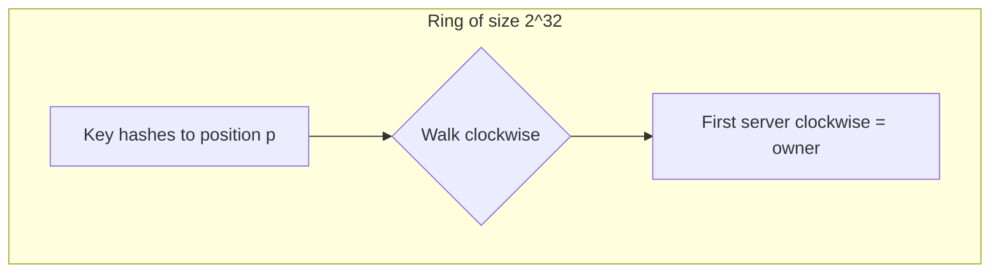

# Consistent & Rendezvous Hashing

**Date:** 2026-04-25 | **Updated:** 2026-04-25
**Tags:** `system-design` `data-structures` `hashing` `sharding`

## Table of Contents

- [Summary](#summary)
- [Why Plain `hash(key) % N` Is Not Enough](#why-plain-hashkey--n-is-not-enough)
- [Classic Consistent Hashing — The Karger Ring](#classic-consistent-hashing--the-karger-ring)
  - [The Ring Construction](#the-ring-construction)
  - [Key Movement on Add/Remove — The K/N Property](#key-movement-on-addremove--the-kn-property)
  - [Virtual Nodes — Why ~100–200 Per Real Node](#virtual-nodes--why-100200-per-real-node)
  - [Lookup Cost and Implementation](#lookup-cost-and-implementation)
- [Jump Consistent Hash — Lamping & Veach 2014](#jump-consistent-hash--lamping--veach-2014)
  - [The Insight](#the-insight)
  - [The Algorithm](#the-algorithm)
  - [Trade-offs and Constraints](#trade-offs-and-constraints)
- [Maglev Hashing — Google 2016](#maglev-hashing--google-2016)
  - [The Lookup Table](#the-lookup-table)
  - [Population Algorithm — Permutations and Preferences](#population-algorithm--permutations-and-preferences)
  - [Why It Works for Load Balancers](#why-it-works-for-load-balancers)
- [Rendezvous Hashing — Highest Random Weight (HRW)](#rendezvous-hashing--highest-random-weight-hrw)
  - [The Algorithm](#the-algorithm-1)
  - [No Virtual Nodes Needed](#no-virtual-nodes-needed)
  - [Weighted Variants](#weighted-variants)
- [Comparison Table](#comparison-table)
- [Trade-offs in Practice](#trade-offs-in-practice)
- [Code Examples](#code-examples)
  - [Python — Classic Ring with Virtual Nodes](#python--classic-ring-with-virtual-nodes)
  - [Python — Jump Consistent Hash](#python--jump-consistent-hash)
  - [Python — Rendezvous Hashing](#python--rendezvous-hashing)
- [Real-World Uses](#real-world-uses)
- [Anti-Patterns](#anti-patterns)
- [Related](#related)
- [References](#references)

## Summary

Consistent hashing is the data-structure that lets a distributed system **add and remove servers without rehashing every key**. Instead of `hash(key) % N`, which moves nearly all keys when `N` changes, consistent hashing moves only `K/N` keys — the fraction that actually belongs on the changed node. Four families of algorithms dominate production today: the **Karger ring** (1997, with virtual nodes), **Jump consistent hash** (2014, no memory overhead but requires sequential bucket IDs), **Maglev hashing** (2016, near-perfect balance via a 65,537-entry lookup table), and **Rendezvous hashing** (1996/1998, no ring at all — pick the node with the highest score for each key). They all solve the same problem (minimal disruption under reconfiguration) with different trade-offs in memory, balance quality, lookup cost, and operational flexibility. This doc covers what each one does, when to pick which, and how to implement them.

## Why Plain `hash(key) % N` Is Not Enough

You have `K` keys and `N` servers. The naive scheme is:

```pseudocode
server_index = hash(key) mod N
```

It is fast, balanced, and stateless. It also breaks the moment you change `N`.

If you grow from 4 servers to 5, the modulus changes for almost every key:

| key hash | `% 4` | `% 5` | moved? |
|----------|-------|-------|--------|
| 100 | 0 | 0 | no |
| 101 | 1 | 1 | no |
| 102 | 2 | 2 | no |
| 103 | 3 | 3 | no |
| 104 | 0 | 4 | **yes** |
| 105 | 1 | 0 | **yes** |
| 106 | 2 | 1 | **yes** |
| 107 | 3 | 2 | **yes** |

For a uniform distribution, roughly `(N-1)/N` of all keys move. Going from 4 to 5 nodes means re-shuffling ~80% of your data — a cache stampede, a re-replication storm, or hours of resharding. That is unacceptable for any system that must scale elastically.

What you actually want: when you add the `(N+1)`th server, it should "steal" only `K/(N+1)` keys from the existing servers, and no other key should move. That is the **minimal disruption** property, and it is the design goal behind every algorithm in this doc.

## Classic Consistent Hashing — The Karger Ring

David Karger and colleagues introduced consistent hashing in **STOC 1997** ("Consistent Hashing and Random Trees"), driven by the early Akamai team's need to map clients to caches in a CDN. The idea is conceptually simple: hash both keys *and* nodes onto a circle.

### The Ring Construction

Imagine a circular hash space of size `2^32` (or `2^64`). Each server is hashed to one or more positions on this ring. Each key is hashed to one position. To find which server owns a key, walk **clockwise** from the key's position until you hit a server.

```text
                    0 / 2^32
                       │
              N3 ●─────┼──────● N1
                /      │       \
              /        │         \
            ●          │          ●  ← key K hashes here
          K2           │           ↓ walk clockwise
            ●          │          ●  ← lands on N2
              \        │         /
                \      │       /
              N4 ●─────┼──────● N2
                       │
                     2^31
```



Lookup is `O(log V)` where `V` is the number of points on the ring (servers × virtual nodes), via a sorted array + binary search or a balanced BST.

### Key Movement on Add/Remove — The K/N Property

Adding server `N5` only takes over the arc between `N5` and the previous server clockwise. Removing `N2` hands its arc to `N3` (the next clockwise server). In expectation, each operation moves `K/N` keys — exactly the minimal disruption the design promised.

| Operation | Keys moved (expected) | Where they go |
|-----------|------------------------|---------------|
| Add 1 node to N existing | `K / (N+1)` | From the *clockwise neighbor* to the new node |
| Remove 1 of N nodes | `K / N` | From the removed node to its *clockwise neighbor* |

Note that without virtual nodes, those keys all move to (or from) **one** neighbor. That asymmetry causes problems we'll fix next.

### Virtual Nodes — Why ~100–200 Per Real Node

A naive ring with one position per server has two failure modes:

1. **Skew.** With only `N` random positions on a ring of `2^32`, some arcs are much larger than others. A few unlucky servers get 5–10× the load of others. Standard deviation of arc length is high.
2. **Hotspot on departure.** When a server fails, its entire arc transfers to its single clockwise neighbor — doubling that node's load instead of spreading the loss across the cluster.

The fix: hash each real server to **V virtual positions** (vnodes). For server `srv`, compute `hash(srv + ":0")`, `hash(srv + ":1")`, ..., `hash(srv + ":V-1")` and place all of those on the ring. Lookups still walk clockwise; the first vnode hit determines the real server.

**Why ~100–200 vnodes per real node?** The standard deviation of load with `V` vnodes per node is roughly:

```text
load_stddev / mean_load  ≈  1 / sqrt(V)
```

| V (vnodes/node) | Approx coefficient of variation |
|-----------------|----------------------------------|
| 1 | 100% (terrible) |
| 10 | ~32% |
| 50 | ~14% |
| 100 | ~10% |
| 200 | ~7% |
| 500 | ~4.5% |
| 1000 | ~3% |

You hit diminishing returns past ~150–200 vnodes per node — beyond that, the memory and binary-search cost grows faster than balance improves. **The widely-cited "sweet spot" is 100–200 vnodes per real node.** Cassandra defaults to 256 (`num_tokens: 256` in older versions; modern guidance is 16 for large clusters because of streaming overhead). DynamoDB internally uses similar magnitudes.

When a real server is removed, its V vnode arcs each go to *different* clockwise neighbors — spreading the load roughly evenly across the surviving cluster. This is the second, equally important reason for vnodes: **graceful degradation under failure.**

### Lookup Cost and Implementation

Two common implementations:

- **Sorted array + binary search.** All vnode positions stored in a sorted array; lookup is `O(log V·N)`. Simple, cache-friendly, the common choice. Memory is proportional to total vnode count.
- **TreeMap / Red-Black Tree.** Same big-O but supports efficient incremental updates. Java's `TreeMap` is a popular pick (`ceilingEntry(hash)`).

For a 100-node cluster with 200 vnodes each, that's 20,000 entries — trivial in memory but worth caching the sorted form.

## Jump Consistent Hash — Lamping & Veach 2014

In 2014 John Lamping and Eric Veach (Google) published [**"A Fast, Minimal Memory, Consistent Hash Algorithm"**](https://arxiv.org/abs/1406.2294). It is one of those rare algorithms that fits in seven lines of C and outperforms the ring on every metric *except* operational flexibility.

### The Insight

Suppose buckets are numbered `0, 1, ..., N-1`. For each key, define `ch(key, n)` as the bucket the key lands on when there are `n` buckets. The key insight: as you grow from `n` buckets to `n+1`, each existing key has probability `1/(n+1)` of moving to the new bucket, and otherwise stays put. So you can simulate this growth process with a series of biased coin flips — and a clever PRNG seeded by the key lets you compute the result in `O(log n)` time.

### The Algorithm

The reference implementation:

```c
// C reference from Lamping & Veach 2014
int32_t JumpConsistentHash(uint64_t key, int32_t num_buckets) {
    int64_t b = -1, j = 0;
    while (j < num_buckets) {
        b = j;
        key = key * 2862933555777941757ULL + 1;
        j = (b + 1) * ((double)(1LL << 31) / (double)((key >> 33) + 1));
    }
    return b;
}
```

It uses the input key as a seed for a deterministic linear-congruential generator and "jumps" through bucket boundaries until it lands. Properties:

- **Zero memory.** No ring, no lookup table, no state of any kind.
- **`O(log n)` per lookup.** ~6 iterations for 100 buckets, ~10 for 1000, ~20 for 1 million.
- **Near-perfect balance.** Every bucket gets `K/n` keys in expectation; standard deviation is `O(sqrt(K/n))` — the theoretical floor.
- **Minimal movement.** Going from `n` to `n+1` buckets moves exactly `K/(n+1)` keys.

### Trade-offs and Constraints

The catch: jump hash gives you a bucket *number* in `[0, n)`, not a bucket *identity*. If your buckets are servers `srv-A`, `srv-B`, `srv-C`, you need to maintain a separate mapping from `[0, n)` → server identity, and that mapping itself has to be stable. Implications:

- **Adding/removing arbitrary servers is awkward.** Jump hash assumes you only ever **append** new buckets at the end (`n → n+1`) or **shrink** by removing the last bucket (`n → n-1`). Removing bucket `2` out of `[0..9]` and keeping the rest at the same indices is not a primitive operation — you'd need a remap layer that re-introduces the K/N problem.
- **No weighting.** All buckets get equal load. If your servers have heterogeneous capacity, you have to fake it (give a "big" server multiple bucket slots) and you lose the elegance.
- **Operational rigidity.** Production deployments often want to drain a specific node, not "the last one". The mismatch between "jump hash bucket" and "physical server" makes this painful.

Jump hash shines for **stateless sharding by partition number** — Vitess, internally-numbered Kafka partitions, sharded counters where the bucket number IS the bucket identity. It is less natural for "I have a set of named servers and they come and go".

## Maglev Hashing — Google 2016

Google's [**Maglev paper (NSDI 2016)**](https://research.google/pubs/maglev-a-fast-and-reliable-software-network-load-balancer/) describes their software load balancer, which fronts essentially all of Google's external services. The authors specifically rejected the ring (uneven balance under realistic vnode counts) and jump hash (poor for adding/removing arbitrary backends) and designed a new scheme.

### The Lookup Table

Maglev pre-computes a fixed-size **lookup table** of length `M` — a prime number, by convention `65537` (`2^16 + 1`). Each slot `i` in the table is filled with the index of one backend. Lookup is then absurdly cheap:

```text
backend = lookup_table[ hash(key) mod M ]
```

A single hash and array lookup. No tree walk, no iteration, no binary search. It is easily 10× faster than the ring at runtime — critical for a load balancer running at line-rate on tens of millions of packets per second.

### Population Algorithm — Permutations and Preferences

The interesting part is how Maglev fills the table to achieve both **near-perfect balance** AND **minimal disruption** when backends change.

For each backend `i`, generate a deterministic permutation of `[0, M)` — its "preference list" — using two hashes:

```pseudocode
offset[i]  = hash1(backend_name[i]) mod M
skip[i]    = (hash2(backend_name[i]) mod (M - 1)) + 1
permutation[i][j] = (offset[i] + j * skip[i]) mod M
```

Then fill the table in rounds. Each round, every backend in turn picks its **next preferred slot** that is still empty:

```pseudocode
for j in 0..M-1: table[j] = -1
next[i] = 0  for each backend i

while any table slot is empty:
    for each backend i in order:
        c = permutation[i][next[i]]
        while table[c] != -1:                # already taken
            next[i] += 1
            c = permutation[i][next[i]]
        table[c] = i
        next[i] += 1
```

Result: each backend gets `M / N` ± 1 slots. Balance is essentially perfect — far better than the ring at 100 vnodes. And when a backend is added or removed, only that backend's preference list changes; the others retain most of their previously-claimed slots. Empirically Maglev moves only slightly more keys than the K/N theoretical minimum — typically ~1–2% of total keys for one backend change.

### Why It Works for Load Balancers

Maglev's design choices (fixed-size lookup table, prime length, deterministic build) are aimed at **stateless, replicated load balancers**. Every Maglev box independently builds the same lookup table from the same backend list. As long as backends are added/removed in the same order, the tables converge — no coordination needed for connection consistency. That property is what makes it possible to scale the load-balancer tier itself horizontally without breaking long-lived TCP connections (combined with connection tracking for in-flight flows).

## Rendezvous Hashing — Highest Random Weight (HRW)

Rendezvous hashing was introduced by **David Thaler and Chinya Ravishankar in 1996/1998** ("A Name-Based Mapping Scheme for Rendezvous"). It predates the Karger ring and offers a strikingly different approach: **no shared data structure at all**.

### The Algorithm

For each key, compute a hash for *every node* combining the key and the node identity. The node with the **highest score** owns the key:

```pseudocode
function owner(key, nodes):
    best_node = None
    best_score = -infinity
    for node in nodes:
        score = hash(key, node)
        if score > best_score:
            best_score = score
            best_node = node
    return best_node
```

That's it. No ring, no table, no virtual nodes, no setup phase. Adding or removing a node never requires rebuilding any index — you just update your set of nodes.

### No Virtual Nodes Needed

Why does HRW give balanced load without vnodes? Because for any given key, all `N` candidate scores are independent uniform samples. The "winning" node is uniformly distributed across the `N` nodes. No clumping, no skew, no need for compensating tricks. Each node owns roughly `K/N` keys with standard deviation `O(sqrt(K/N))` — the theoretical optimum.

When a node is removed:

- Every key that had that node as its top score gets recomputed.
- The new winner is uniformly distributed across the remaining `N-1` nodes.
- Exactly `K/N` keys move (in expectation), spread evenly across all surviving nodes.

This is the **K/N property** without any of the operational complexity of vnodes. The same guarantee holds for adding a node: each key independently has probability `1/(N+1)` of having the new node as its new top score.

### Weighted Variants

HRW naturally supports per-node weights via **WRH (Weighted Rendezvous Hashing)**. The score for node `i` becomes:

```text
score_i = -ln(uniform_hash(key, node_i)) / weight_i
```

A node twice as powerful gets twice the load with one constant change. The Karger ring also supports weights (more vnodes for fatter nodes), but HRW does it more elegantly.

### Cost

The obvious downside: lookup is `O(N)` — you hash against every candidate node. For small clusters (`N < 100`) this is fine. For very large clusters with low-latency lookup requirements, it can dominate. Mitigations:

- **Skeleton-based HRW** (Yang et al. 2014): organize nodes as a tree; pick the winning *subtree* recursively. Reduces lookup to `O(log N)`.
- **Cache the answer** per key — re-evaluating only when the cluster membership changes.
- **HRW often "wins" anyway** in real systems because the constant factors are small and the elimination of the ring data structure simplifies operations.

## Comparison Table

| Property | Ring (Karger) | Jump Hash (Lamping-Veach) | Maglev | Rendezvous (HRW) |
|----------|---------------|----------------------------|--------|-------------------|
| Year | 1997 | 2014 | 2016 | 1996 / 1998 |
| Memory per lookup state | `O(N · V)` (V≈100–200) | `O(1)` | `O(M)` (M=65537) | `O(N)` (just the node list) |
| Lookup time | `O(log(N·V))` | `O(log N)` | `O(1)` | `O(N)` (or `O(log N)` skeleton) |
| Keys moved on add/remove | `~K/N` (with vnodes) | exactly `K/N` (append only) | `~K/N + 1–2%` | exactly `K/N` |
| Load balance quality (CoV) | ~`1/sqrt(V)` ≈ 7–10% | near optimal | near perfect | near optimal |
| Supports arbitrary add/remove | yes | append-only | yes | yes |
| Supports node weights | yes (via vnode count) | awkward | yes (via slot allocation) | yes (WRH, naturally) |
| Needs sequential bucket IDs | no | yes | no | no |
| Implementation complexity | medium | trivial | medium-hard | trivial |
| Production fit | KV stores, caches | partition numbering | load balancers | distributed caches, generic |

A rough heuristic for picking:

- **Bucket numbers stay sequential and you control the count** → Jump hash. Smallest, fastest, cleanest.
- **Stateless load balancer fronting many backends** → Maglev. Sub-microsecond lookup at line-rate.
- **General "place keys on a fluid set of named servers"** → Rendezvous if N is modest (< ~1000); Karger ring with vnodes for larger fleets where lookup latency matters.
- **You need weights per node and arbitrary add/remove** → ring with vnodes (most ecosystem support) or weighted HRW (cleaner code).

## Trade-offs in Practice

**Key movement vs. balance.** All four algorithms hit the K/N theoretical floor for movement, but they reach it with different constant factors. Maglev is the only one that occasionally exceeds K/N (by ~1–2%) — the price for its perfect balance and lookup-table layout.

**Lookup cost vs. memory.** Jump hash sits at one extreme (zero memory, log lookups). Maglev sits at the other (a 64KB+ lookup table, O(1) lookup). The ring and HRW are middle-of-the-road.

**Operational flexibility.** The ring's vnode count is a tuning knob — too low and you get hot spots, too high and you waste memory. HRW has no knobs, which is either a feature or a limitation depending on your team. Jump hash forces append-only growth, which is a powerful constraint for some systems and a deal-breaker for others.

**Replication.** Most real systems need each key to live on `R > 1` nodes. The ring naturally supports this — walk clockwise and pick the first `R` distinct real servers. HRW supports it too — pick the top `R` scores. Jump hash needs a separate "second-replica" function (often a different seed). Maglev typically uses a separate replication strategy on top of the lookup table.

## Code Examples

### Python — Classic Ring with Virtual Nodes

```python
"""Karger ring with vnodes — sorted-array implementation."""
import bisect
import hashlib
from typing import Iterable

class ConsistentHashRing:
    def __init__(self, nodes: Iterable[str] = (), vnodes_per_node: int = 150):
        self.vnodes_per_node = vnodes_per_node
        self._ring: list[tuple[int, str]] = []        # sorted (hash, node)
        self._sorted_keys: list[int] = []              # for bisect
        for node in nodes:
            self.add_node(node)

    @staticmethod
    def _hash(value: str) -> int:
        # 128 bits → take low 64 for the ring position
        return int(hashlib.sha256(value.encode()).hexdigest()[:16], 16)

    def add_node(self, node: str) -> None:
        for i in range(self.vnodes_per_node):
            h = self._hash(f"{node}:{i}")
            bisect.insort(self._ring, (h, node))
        self._sorted_keys = [h for h, _ in self._ring]

    def remove_node(self, node: str) -> None:
        self._ring = [(h, n) for (h, n) in self._ring if n != node]
        self._sorted_keys = [h for h, _ in self._ring]

    def get_node(self, key: str) -> str | None:
        if not self._ring:
            return None
        h = self._hash(key)
        idx = bisect.bisect_right(self._sorted_keys, h) % len(self._ring)
        return self._ring[idx][1]

    def get_nodes(self, key: str, replicas: int) -> list[str]:
        """Return the first `replicas` distinct real nodes clockwise from key."""
        if not self._ring:
            return []
        h = self._hash(key)
        idx = bisect.bisect_right(self._sorted_keys, h) % len(self._ring)
        seen: list[str] = []
        for offset in range(len(self._ring)):
            node = self._ring[(idx + offset) % len(self._ring)][1]
            if node not in seen:
                seen.append(node)
                if len(seen) == replicas:
                    break
        return seen
```

### Python — Jump Consistent Hash

```python
"""Lamping & Veach 2014 — fits the original 7-line spec."""

def jump_consistent_hash(key: int, num_buckets: int) -> int:
    """Return the bucket in [0, num_buckets) for the given key."""
    if num_buckets <= 0:
        raise ValueError("num_buckets must be positive")
    b, j = -1, 0
    # 64-bit unsigned arithmetic, mimicking the C reference
    MASK64 = (1 << 64) - 1
    while j < num_buckets:
        b = j
        key = (key * 2862933555777941757 + 1) & MASK64
        # the ratio (1<<31) / ((key>>33)+1) is the inverse-CDF jump
        j = int((b + 1) * ((1 << 31) / ((key >> 33) + 1)))
    return b


# Usage: hash a string key first, then map to bucket
def shard_for_key(key: str, num_shards: int) -> int:
    import hashlib
    h = int(hashlib.sha256(key.encode()).hexdigest()[:16], 16)
    return jump_consistent_hash(h, num_shards)
```

### Python — Rendezvous Hashing

```python
"""Highest-Random-Weight — both unweighted and weighted forms."""
import hashlib
import math
from typing import Iterable

def _hash_pair(key: str, node: str) -> int:
    h = hashlib.sha256(f"{key}|{node}".encode()).digest()
    return int.from_bytes(h[:8], "big")

def rendezvous_owner(key: str, nodes: Iterable[str]) -> str | None:
    """Return the node with the highest hash score for this key."""
    best_node, best_score = None, -1
    for node in nodes:
        score = _hash_pair(key, node)
        if score > best_score:
            best_node, best_score = node, score
    return best_node

def rendezvous_top_n(key: str, nodes: Iterable[str], n: int) -> list[str]:
    """Return the top-n nodes by score — useful for replicas."""
    scored = [(node, _hash_pair(key, node)) for node in nodes]
    scored.sort(key=lambda x: x[1], reverse=True)
    return [node for node, _ in scored[:n]]


# --- Weighted variant (WRH) ---
# A node with weight 2 should attract twice the keys of a weight-1 node.
def weighted_rendezvous_owner(
    key: str, weighted_nodes: dict[str, float]
) -> str | None:
    best_node, best_score = None, -math.inf
    MAX64 = (1 << 64) - 1
    for node, weight in weighted_nodes.items():
        # uniform in (0, 1]
        u = (_hash_pair(key, node) + 1) / (MAX64 + 1)
        score = -math.log(u) / weight
        if score > best_score:
            best_node, best_score = node, score
    return best_node
```

## Real-World Uses

| System | Algorithm | Notes |
|--------|-----------|-------|
| **Akamai CDN** | Karger ring | The original production deployment — Karger's group commercialized this as Akamai in 1998 |
| **Amazon Dynamo / DynamoDB** | Ring with vnodes | Each "preference list" is the first `R` real nodes clockwise; described in the [Dynamo SOSP 2007 paper](https://www.allthingsdistributed.com/files/amazon-dynamo-sosp2007.pdf) |
| **Apache Cassandra** | Ring with vnodes | `num_tokens` config; classic 256, modern guidance 16 for large clusters to limit streaming |
| **Riak** | Ring with vnodes | Fixed 64 partitions, partitions distribute via consistent hashing |
| **Memcached clients (libketama)** | Karger ring | Twitter, Last.fm and others — client-side consistent hashing across a memcached fleet |
| **Google Maglev** | Maglev hashing | Fronts every external Google service; lookup table size 65537 |
| **Envoy proxy** | Maglev or ring hash | Pluggable; Maglev for stable backend selection |
| **Discord** | Rendezvous (HRW) | Discord's session/voice routing; chosen for its stateless simplicity |
| **Vitess (YouTube/PlanetScale)** | Jump hash internally | For shard mapping where shard IDs are sequential |
| **Apache Ignite** | Rendezvous hashing | Affinity function maps keys to partitions to nodes |
| **HAProxy** | Karger ring (`balance hash`) | Supports consistent hashing for sticky sessions |

## Anti-Patterns

**No virtual nodes on a Karger ring.** A ring with one position per server gives 100% standard deviation of load — some servers will get 5× the load of others. Worse, when a server fails, its entire arc transfers to *one* neighbor, doubling that node's load and likely cascading. Always use vnodes — 100–200 is the standard band; use the lower end if streaming/rebalance cost matters more than balance precision.

**Hash function with poor distribution.** Consistent hashing assumes the hash output is uniformly distributed. Using something like `hash(s) = sum(ord(c) for c in s)` produces clusters of similar inputs at similar ring positions, defeating the design. Use SHA-256, MurmurHash3, or xxHash. Avoid `Object.hashCode()` in Java for cross-platform consistency.

**Hash skew on key prefix.** If your keys are like `tenant42:item:*`, hashing the full key works fine — but if you accidentally bucket by `tenant42` only (e.g., for "all of tenant 42 to one shard" reasons) you'll create giant tenants on single shards. Either hash the full key (and accept that a tenant's data is scattered) or design explicit tenant-affinity placement.

**Mixing jump hash with arbitrary node IDs.** Jump hash returns a *bucket number*, not a node identity. If you maintain a separate `bucket_id → server_id` map and arbitrarily reorder it (e.g., remove server at index 3, shift everyone else down), you've reintroduced the K/N problem inside that map. Treat jump-hash buckets as immutable identities — only ever append, or accept that operationally the buckets are tied to specific physical hosts.

**Vnode count copied from a different system.** Cassandra's "256 vnodes" was tuned for a specific streaming model; copying that into a small in-memory cache is wasteful, and copying it into a system with expensive node joins is painful. Pick `V` based on your balance tolerance, the number of nodes, and how expensive a rebalance is.

**Treating consistent hashing as a substitute for replication.** Consistent hashing tells you where a key's *primary* replica should live. It does not give you durability or availability — that requires actually replicating each key to `R` distinct nodes (the next `R` clockwise on the ring, or the top-`R` HRW scores). Forgetting this is how a "consistent-hashed cache" silently loses a third of its data on a node failure.

**Recomputing the ring on every lookup.** Building the sorted vnode array from scratch on each request is `O(N · V)` and obliterates throughput. Build once, mutate on membership change, hold a sorted snapshot for read-heavy lookups.

## Related

- [Sharding Strategies — Hash, Range, Directory](../scalability/sharding-strategies.md) — where consistent hashing fits among hash sharding, range sharding, and directory-based shard assignment
- [Design a Distributed Load Balancer](../case-studies/distributed-infra/design-load-balancer.md) — Maglev hashing in production; sticky-session strategies
- [Design a Distributed Cache](../case-studies/distributed-infra/design-distributed-cache.md) — client-side consistent hashing across a memcached/Redis fleet
- [Design a Distributed Key-Value Store](../case-studies/distributed-infra/design-key-value-store.md) — Dynamo-style ring placement, replica preference lists, hinted handoff
- [Skip Lists — Probabilistic Sorted Structures](./skip-lists.md) — the other "probabilistic data structure for sharded systems" worth knowing alongside consistent hashing

## References

- David Karger, Eric Lehman, Tom Leighton, Matthew Levine, Daniel Lewin, Rina Panigrahy, ["Consistent Hashing and Random Trees: Distributed Caching Protocols for Relieving Hot Spots on the World Wide Web" (STOC 1997)](https://www.akamai.com/site/en/documents/research-paper/consistent-hashing-and-random-trees-distributed-caching-protocols-for-relieving-hot-spots-on-the-world-wide-web-technical-publication.pdf) — the foundational paper that became Akamai
- John Lamping and Eric Veach, ["A Fast, Minimal Memory, Consistent Hash Algorithm" (Google, 2014)](https://arxiv.org/abs/1406.2294) — jump consistent hash; seven lines of C, two pages of math
- Daniel E. Eisenbud et al., ["Maglev: A Fast and Reliable Software Network Load Balancer" (NSDI 2016)](https://research.google/pubs/maglev-a-fast-and-reliable-software-network-load-balancer/) — Google's production LB, with the lookup-table construction
- David G. Thaler and Chinya V. Ravishankar, ["A Name-Based Mapping Scheme for Rendezvous" (1996 / IEEE TPDS 1998)](https://www.eecs.umich.edu/techreports/cse/96/CSE-TR-316-96.pdf) — the original HRW paper, predating the Karger ring
- Giuseppe DeCandia et al., ["Dynamo: Amazon's Highly Available Key-value Store" (SOSP 2007)](https://www.allthingsdistributed.com/files/amazon-dynamo-sosp2007.pdf) — the canonical "consistent hashing in production" paper; sections 4.2–4.3 on partitioning
- ["Consistent Hashing — Algorithmic Tradeoffs"](https://dgryski.medium.com/consistent-hashing-algorithmic-tradeoffs-ef6b8e2fcae8) by Damian Gryski — engineer-focused comparison of ring, jump, Maglev, rendezvous
- ["Building a Consistent Hashing Ring"](https://docs.openstack.org/swift/latest/ring_background.html) — OpenStack Swift's documentation on its ring implementation; a clear engineering treatment
- ["DynamoDB Internals — Partitioning and Routing"](https://www.allthingsdistributed.com/2022/04/dynamodb-paper.html) — Vogels' 2022 retrospective on Dynamo and how DynamoDB extended the model
- ["Cassandra Virtual Nodes (Vnodes)"](https://cassandra.apache.org/doc/latest/cassandra/managing/operating/topo_changes.html) — the standard guidance on `num_tokens` choice
