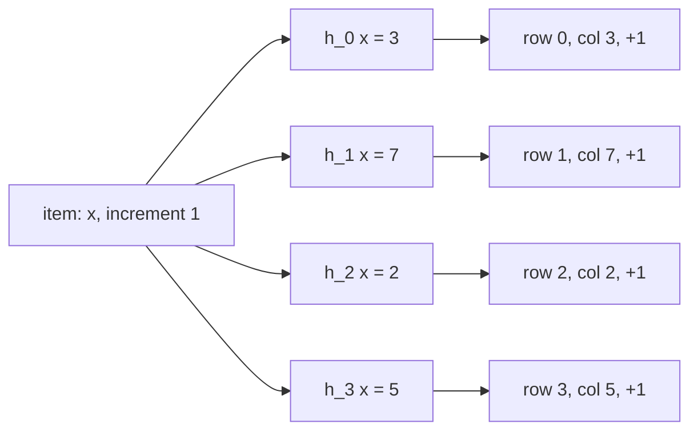
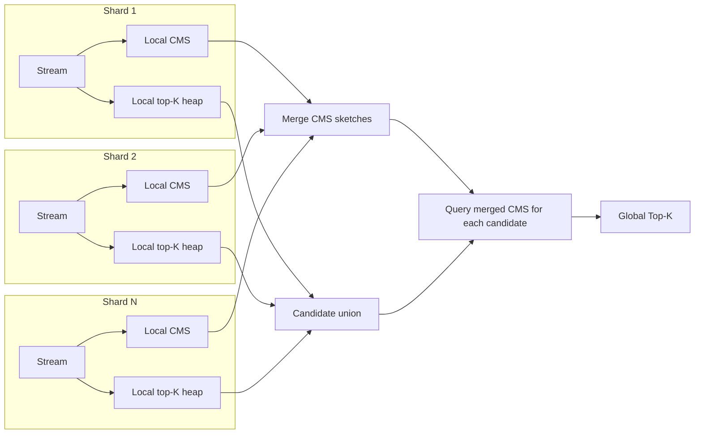

# Count-Min Sketch & Top-K — Frequency Estimation in Sublinear Space

**Date:** 2026-04-25 | **Updated:** 2026-04-25
**Tags:** `system-design` `data-structures` `probabilistic` `sketches` `top-k`

## Table of Contents

- [Summary](#summary)
- [Overview — Why Approximate Frequency Counts](#overview--why-approximate-frequency-counts)
- [Key Concepts](#key-concepts)
  - [The Count-Min Sketch Structure](#the-count-min-sketch-structure)
  - [Update and Point-Query](#update-and-point-query)
  - [Error Bounds — Picking w and d](#error-bounds--picking-w-and-d)
  - [Why CMS Only Over-Estimates](#why-cms-only-over-estimates)
  - [Conservative Update — Tighter in Practice](#conservative-update--tighter-in-practice)
  - [Heavy Hitters and Top-K](#heavy-hitters-and-top-k)
  - [Misra-Gries and Space-Saving](#misra-gries-and-space-saving)
  - [CMS + Min-Heap — The Standard Top-K Pipeline](#cms--min-heap--the-standard-top-k-pipeline)
- [Trade-offs vs Exact Counting and vs HyperLogLog](#trade-offs-vs-exact-counting-and-vs-hyperloglog)
- [Code Examples](#code-examples)
  - [Python — Count-Min Sketch](#python--count-min-sketch)
  - [Python — Heavy Hitters with CMS + Min-Heap](#python--heavy-hitters-with-cms--min-heap)
  - [Python — Conservative Update Variant](#python--conservative-update-variant)
- [Real-World Uses](#real-world-uses)
- [Anti-Patterns](#anti-patterns)
- [Related](#related)
- [References](#references)

## Summary

A **Count-Min Sketch (CMS)** is a probabilistic data structure that estimates the frequency of items in a stream using **sublinear space**. It uses `d` independent hash functions, each mapping into one of `d` arrays of `w` counters. On each update you increment one counter per row; on a point query you return the **minimum** of the `d` counters across rows. CMS guarantees `error ≤ ε · N` with probability `1 − δ` when `w = ⌈e/ε⌉` and `d = ⌈ln(1/δ)⌉` — a few kilobytes can summarize billions of events. CMS only **over-estimates**, never under-counts, which is the property that makes it useful for **heavy-hitter detection**: pair CMS with a min-heap of size K to track approximate top-K elements (a pattern also known as Space-Saving / Misra-Gries when implemented purely with bounded counters). CMS is the right tool for *frequency* questions on streams; **HyperLogLog** is the tool for *cardinality* (distinct count). Production deployments include trending hashtags at Twitter/X, DDoS source-IP detection, ad-fraud counters, and the implementations exposed by Apache DataSketches and Redis-Bloom (`CMS.*`, `TOPK.*`).

## Overview — Why Approximate Frequency Counts

Imagine the data plane of a real system:

- A CDN sees 10M HTTP requests per second across 500 edge nodes. **Which client IPs are sending the most traffic right now?**
- An ad-tech platform ingests 50B click events per day. **Which creative IDs are being clicked fraudulently above their expected rate?**
- A social network ingests 100K posts per second. **Which hashtags are trending in the last 5 minutes?**

The naive answer is a hash map: `{key → count}`. This works at small scale and breaks at large scale for three reasons:

1. **Memory** — a hash map of one billion distinct keys easily costs tens of GB per node, multiplied by every shard.
2. **Distribution** — to merge counts across shards you need to reconcile maps; map-reduce works but is slow and adds operational weight.
3. **Latency** — querying an exact top-K over a billion-key map is not a single cache line; it's a full scan or a maintained heap that has its own cost.

For the *vast majority* of these questions we do not need exact counts. We need to know that `192.0.2.5` sent roughly 4.2M requests, not 4,201,337. We need to know `#worldcup` is in the top 10 trending tags, not its exact rank-by-rank order. **Probabilistic sketches** trade a tunable, bounded error for orders-of-magnitude memory savings and `O(1)` updates and queries.

CMS, introduced by Cormode and Muthukrishnan in 2005, is the canonical sketch for **frequency estimation** on a stream. Its sibling, [HyperLogLog](./hyperloglog.md), answers a different question (how many *distinct* keys?). Its cousins, [Bloom and Cuckoo filters](./bloom-and-cuckoo-filters.md), answer a third (have I seen this key at all?). They are all in the same toolbox; you pick by question.

## Key Concepts

### The Count-Min Sketch Structure

A CMS is a **two-dimensional array of counters** with `d` rows and `w` columns:

```text
              w columns
        +---+---+---+---+---+---+---+---+
row 0   | 0 | 0 | 0 | 0 | 0 | 0 | 0 | 0 |   ← uses h_0(x) mod w
        +---+---+---+---+---+---+---+---+
row 1   | 0 | 0 | 0 | 0 | 0 | 0 | 0 | 0 |   ← uses h_1(x) mod w
        +---+---+---+---+---+---+---+---+
row 2   | 0 | 0 | 0 | 0 | 0 | 0 | 0 | 0 |   ← uses h_2(x) mod w
        +---+---+---+---+---+---+---+---+
row 3   | 0 | 0 | 0 | 0 | 0 | 0 | 0 | 0 |   ← uses h_3(x) mod w
        +---+---+---+---+---+---+---+---+
  d rows
```

Each row is paired with an **independent hash function** `h_i: keyspace → [0, w)`. The hash functions should be drawn from a pairwise-independent family (the original paper uses the standard `(a*x + b) mod p mod w` construction); cryptographic hashes like xxHash, MurmurHash, or different seeds of the same fast hash are common in practice.

The total memory footprint is `d * w` counters. Counters are typically 32-bit or 64-bit unsigned integers — 4 to 8 bytes each. A typical configuration of `d = 5, w = 2048` is `5 * 2048 * 4 = 40 KB` and answers point queries with high confidence on streams of billions of events.

### Update and Point-Query

Two operations, both `O(d)`:

```text
update(x, c):
  for i in 0..d-1:
    counters[i][ h_i(x) mod w ] += c

estimate(x):
  return min over i in 0..d-1 of counters[i][ h_i(x) mod w ]
```

The intuition: for any item `x`, its true count is recorded `d` times — once in each row, but mixed with collisions from other items. **Different items collide with `x` in different rows** because the hash functions are independent. Taking the **minimum** across rows is the row least polluted by collisions, which is the tightest upper bound on the true count.



For a point query, you read four counters, take the minimum, and you have an estimate. There is no scan of the entire structure, no global lock — every operation touches exactly `d` cells.

### Error Bounds — Picking w and d

The CMS error guarantee is the reason the structure is famous. Let `N = sum of all increments` (total stream weight) and `\hat{f}(x)` be the CMS estimate for item `x`. Then:

```text
estimate(x) ≥ true_count(x)             always (deterministic)

Pr[ estimate(x) ≤ true_count(x) + ε * N ] ≥ 1 - δ
```

Where:

- `ε` = relative error tolerance (e.g. 0.001 = 0.1% of total stream weight)
- `δ` = failure probability (e.g. 0.01 = 1% chance the bound is exceeded)

To meet these guarantees, set:

```text
w = ⌈ e / ε ⌉            (e ≈ 2.71828)
d = ⌈ ln(1 / δ) ⌉
```

Worked example. You ingest **N = 1 billion events per hour** and want estimates within **ε = 10⁻⁵** (so `ε · N = 10,000` events of slop) with **δ = 0.001** (one-in-a-thousand chance of exceeding):

- `w = ⌈ e / 10⁻⁵ ⌉ = ⌈ 271,828 ⌉ ≈ 270,000`
- `d = ⌈ ln(1000) ⌉ = ⌈ 6.9 ⌉ = 7`
- Memory: `7 * 270,000 * 4 bytes ≈ 7.5 MB`

**7.5 MB to summarize a billion events per hour with tight bounds.** A regular hash map for the same data would be tens of GB.

The error bound depends on `N`, the *total stream weight*, not the number of distinct keys. This means CMS is most accurate for **heavy hitters** (items whose true count is a noticeable fraction of `N`); rare items get drowned in collisions and their estimate may be dominated by noise. This is exactly the regime where you want frequency estimates anyway.

### Why CMS Only Over-Estimates

The math is simple but worth seeing. For any row `i` and any item `x`:

```text
counters[i][h_i(x)] = true_count(x) + sum of true_count(y) for all y ≠ x with h_i(y) = h_i(x)
```

Every counter touched by `x` is `x`'s true count *plus* extra contributions from items that collided with `x` in that row. There is no way for a counter to be *less* than the true count, because items only ever increment, never decrement (in the standard CMS — the signed-CMS variant handles deletions but loses the one-sided guarantee).

Taking the minimum across `d` rows still yields an over-estimate, just the tightest one we have.

This **one-sided error** is what makes CMS suitable for heavy hitters: if `estimate(x) < threshold`, you *know* `true_count(x) < threshold`. False negatives for heavy items are impossible; false positives (an item that estimates above threshold but actually isn't heavy) are bounded by the `ε, δ` guarantee.

### Conservative Update — Tighter in Practice

A small but powerful refinement: **only update the rows that need updating**.

```text
conservative_update(x, c):
  current_min = min over i of counters[i][h_i(x)]
  new_value = current_min + c
  for i in 0..d-1:
    if counters[i][h_i(x)] < new_value:
      counters[i][h_i(x)] = new_value
```

Standard CMS bumps every row blindly. **Conservative update** observes that if the current minimum across rows is `m`, the true count is at most `m`, so the new estimate after a `+c` increment is at most `m + c`. Counters that are already higher than `m + c` are inflated by collisions and don't need to grow further to maintain the upper-bound property.

Empirical results from the original Estan-Varghese paper and follow-up work show conservative update typically reduces over-estimation by **2x to 10x** on real workloads with heavy-tailed distributions (which is most internet workloads — Zipf-like). Memory and operation costs are the same. **In practice, almost everyone uses conservative update.**

The trade-off: conservative update breaks the simple linearity of merging two sketches by addition. Merging CMS sketches built with conservative update is approximate; merging plain CMS sketches is exact (entry-wise sum). If you need to merge sketches across shards, weigh this carefully.

### Heavy Hitters and Top-K

A **heavy hitter** is an item whose count exceeds some threshold — typically a fraction of total stream weight, e.g. "anything above 1% of all events". The classic problem statements are:

- **φ-heavy hitters** — find every item with `true_count(x) > φ · N`.
- **Top-K** — find the `K` items with the highest counts.

CMS alone does not solve either: it gives you point queries, not the set of heavy items, and you cannot afford to query every key in the universe. You need a second structure that **tracks candidate heavy hitters**.

The combination is straightforward:

1. Maintain a CMS for frequency estimation.
2. Maintain a **min-heap of size K** holding `(estimate, key)` pairs.
3. On every update:
   - Update the CMS.
   - Compute the new estimate for `key`.
   - If the heap has fewer than `K` entries, add `(estimate, key)`.
   - Else if `estimate > heap.min().estimate`, evict the minimum and insert the new pair.
   - To avoid duplicates in the heap, also maintain a small key-to-heap-index map and update in place when a key already in the heap is incremented.

This pipeline runs at O(d + log K) per event and uses memory `O(d · w + K)`. It's the workhorse for trending detection.

### Misra-Gries and Space-Saving

CMS-plus-heap is one approach. The **deterministic counter-based** family is another, and the two compose well.

**Misra-Gries (1982)** maintains exactly `K` counters. For each incoming item:

- If the item is one of the tracked `K` keys, increment its counter.
- Else if there is an empty slot, claim it with count 1.
- Else **decrement every counter by 1**; drop any counter that hits 0.

The intuition is that any item appearing more than `N / (K+1)` times must survive — there aren't enough "decrement" rounds to evict it. Misra-Gries gives a **lower-bound** estimate (the counter is at most the true count, and at most `N / (K+1)` below it).

**Space-Saving (Metwally, Agrawal, Abbadi 2005)** improves on Misra-Gries by tracking which key was *displaced*:

- If the item is tracked, increment.
- Else find the tracked key with the **minimum counter**; replace its key with the new one and increment its counter (instead of resetting to 1).

Space-Saving's key insight: when you boot a key out, the new key inherits the booted key's count. This gives an **upper-bound** estimate with much tighter empirical accuracy. It also yields stronger ranking guarantees — the top items reported by Space-Saving are provably correct under modest skew assumptions.

Both Misra-Gries and Space-Saving use `O(K)` memory and `O(1)` per update (with a clever priority structure). They do not need hash functions and do not introduce probabilistic error in the same way as CMS.

**When to use which:**

| Situation | Pick |
|-----------|------|
| Stream fits one machine, want top-K only | Space-Saving |
| Need both top-K *and* point queries on arbitrary items | CMS + heap |
| Multi-shard, need to merge sketches | CMS (plain, not conservative) |
| Need lower-bound guarantee on heavy items | Misra-Gries |
| Adversarial or noisy stream | CMS with conservative update + Space-Saving heap |

In practice, production top-K systems often **layer them**: CMS gives the per-key estimate, a Space-Saving heap (or plain min-heap) holds the candidate top-K, and a global sketch is merged across shards.

### CMS + Min-Heap — The Standard Top-K Pipeline

Reference picture for a sharded top-K service:



Each shard tracks its local heavy hitters cheaply. To compute global top-K you union the local heap candidates (the global heavy hitter must be heavy *somewhere*) and re-estimate each candidate against the merged CMS. The merged CMS is the **entrywise sum** of the per-shard CMS arrays — `O(d · w)` time, no rehashing, exact merge.

## Trade-offs vs Exact Counting and vs HyperLogLog

| Aspect | Exact hash map | Count-Min Sketch | HyperLogLog |
|--------|----------------|------------------|-------------|
| Question answered | freq(x), distinct() | freq(x) | distinct() |
| Memory (typical) | O(distinct keys) | O(d · w), bounded | ~12 KB for 0.8% error |
| Memory grows with cardinality | yes, linearly | no, fixed | no, fixed |
| Update cost | O(1) amortized | O(d) | O(1) |
| Query cost | O(1) | O(d) | O(register count) |
| Error | none | ε · N additive, one-sided over | ~1.04 / sqrt(m) relative |
| Mergeable across shards | yes | yes (entrywise sum) | yes (max per register) |
| Deletes / decrements | yes | only with signed variant | not naturally |
| Good at heavy items | yes | yes (the design point) | n/a (not freq) |
| Good at rare items | yes | poor (drowned in noise) | n/a |
| Delivers top-K | with sort | with min-heap companion | no |
| Production examples | trivial, expensive | DataSketches, Redis-Bloom | Redis PFCOUNT, BigQuery APPROX_COUNT_DISTINCT |

**Three rules of thumb:**

1. **CMS is for frequency, HLL is for cardinality.** Don't try to make HLL count repeats or CMS count distinct items — they aren't designed for it.
2. **CMS error scales with `N`, not with number of distinct keys.** A CMS that fits `1 billion` total updates with `ε · N = 10⁵` slop performs identically whether those events span 100 keys or 100 million.
3. **Use CMS for heavy hitters; use Bloom filters for membership; use HLL for distinct count.** All three are sublinear-space, O(1)-ish per op, and cover orthogonal questions.

For comparison with the membership-and-cardinality side of the toolbox, see [hyperloglog.md](./hyperloglog.md) and [bloom-and-cuckoo-filters.md](./bloom-and-cuckoo-filters.md).

## Code Examples

### Python — Count-Min Sketch

A minimal but production-shaped implementation. In real code you'd lift `_hash` into a faster Cython/Rust extension or use xxHash; this version is for clarity.

```python
import hashlib
import math
from typing import Hashable

class CountMinSketch:
    """Plain Count-Min Sketch with per-row independent hash families."""

    def __init__(self, epsilon: float = 1e-4, delta: float = 1e-3):
        if not (0 < epsilon < 1) or not (0 < delta < 1):
            raise ValueError("epsilon and delta must be in (0, 1)")
        self._w = max(2, math.ceil(math.e / epsilon))
        self._d = max(1, math.ceil(math.log(1.0 / delta)))
        # Immutable shape, mutable counters. We treat the counter grid as the
        # only mutable state, replacing rows in-place per update.
        self._counters = [[0] * self._w for _ in range(self._d)]
        # Pre-derived 64-bit seeds for d independent hash functions.
        self._seeds = [hashlib.blake2b(str(i).encode(), digest_size=8).digest()
                       for i in range(self._d)]

    @property
    def shape(self) -> tuple[int, int]:
        return (self._d, self._w)

    def _hash(self, item: Hashable, row: int) -> int:
        h = hashlib.blake2b(repr(item).encode(),
                            key=self._seeds[row],
                            digest_size=8)
        return int.from_bytes(h.digest(), "big") % self._w

    def update(self, item: Hashable, count: int = 1) -> None:
        if count <= 0:
            raise ValueError("count must be positive (use signed CMS for decrements)")
        for row in range(self._d):
            col = self._hash(item, row)
            self._counters[row][col] += count

    def estimate(self, item: Hashable) -> int:
        return min(self._counters[row][self._hash(item, row)]
                   for row in range(self._d))

    def merge(self, other: "CountMinSketch") -> "CountMinSketch":
        if self.shape != other.shape:
            raise ValueError("shapes must match")
        merged = CountMinSketch.__new__(CountMinSketch)
        merged._w, merged._d, merged._seeds = self._w, self._d, self._seeds
        merged._counters = [
            [self._counters[r][c] + other._counters[r][c] for c in range(self._w)]
            for r in range(self._d)
        ]
        return merged
```

Notes that match real production code:

- `epsilon` and `delta` map directly to `w` and `d` via the standard formulas.
- Per-row keyed hashing simulates `d` independent hash functions cheaply.
- `merge` is **entrywise sum** — exact for plain CMS.
- We never mutate counters from outside; the only mutating method is `update`, and `merge` creates a new sketch rather than modifying either input. This matches the immutability principle in the broader codebase.

### Python — Heavy Hitters with CMS + Min-Heap

```python
import heapq
from dataclasses import dataclass

@dataclass(frozen=True, order=True)
class HeavyEntry:
    estimate: int
    key: str   # ordered field; ties broken lexicographically

class TopK:
    """Approximate top-K heavy hitters using CMS plus a bounded min-heap."""

    def __init__(self, k: int, epsilon: float = 1e-4, delta: float = 1e-3):
        if k <= 0:
            raise ValueError("k must be positive")
        self._k = k
        self._cms = CountMinSketch(epsilon=epsilon, delta=delta)
        self._heap: list[HeavyEntry] = []           # min-heap of size <= k
        self._tracked: dict[str, int] = {}          # key -> last-seen estimate

    def observe(self, key: str, count: int = 1) -> None:
        self._cms.update(key, count)
        new_estimate = self._cms.estimate(key)

        # Refresh estimate for already-tracked keys; rebuild heap if needed.
        if key in self._tracked:
            self._tracked[key] = new_estimate
            self._heap = [
                HeavyEntry(estimate=self._tracked[k], key=k)
                for k in self._tracked
            ]
            heapq.heapify(self._heap)
            return

        if len(self._heap) < self._k:
            entry = HeavyEntry(estimate=new_estimate, key=key)
            heapq.heappush(self._heap, entry)
            self._tracked[key] = new_estimate
            return

        if new_estimate > self._heap[0].estimate:
            evicted = heapq.heapreplace(
                self._heap, HeavyEntry(estimate=new_estimate, key=key)
            )
            del self._tracked[evicted.key]
            self._tracked[key] = new_estimate

    def top_k(self) -> list[tuple[str, int]]:
        # Return descending by estimate; this is a read-only view, do not mutate the heap.
        sorted_entries = sorted(self._heap, key=lambda e: e.estimate, reverse=True)
        return [(e.key, e.estimate) for e in sorted_entries]
```

A few production refinements you'd add for a real system:

- Replace the rebuild-on-update loop with a position-tracking heap (decrease-key support) when `K` is large.
- Bound the per-key state with a TTL so cold keys age out; the heap should reflect a sliding window, not all-time totals — a **sliding-window CMS** uses one sketch per window and merges/drops by epoch.
- For very high QPS, use a lock-free approximate counter (e.g. RCU snapshots, per-thread sketches merged on read).

### Python — Conservative Update Variant

A drop-in replacement for the `update` method:

```python
class ConservativeCountMinSketch(CountMinSketch):
    """CMS with conservative update — tighter in practice, not mergeable by sum."""

    def update(self, item: Hashable, count: int = 1) -> None:
        if count <= 0:
            raise ValueError("count must be positive")
        cols = [self._hash(item, row) for row in range(self._d)]
        current_min = min(self._counters[row][cols[row]] for row in range(self._d))
        new_value = current_min + count
        for row in range(self._d):
            if self._counters[row][cols[row]] < new_value:
                self._counters[row][cols[row]] = new_value
```

Same memory, same query cost, typically 2–10x smaller over-estimation on Zipfian streams. **Lose the ability to merge sketches by entrywise sum** — if you need cross-shard merges, prefer plain CMS.

## Real-World Uses

**Twitter / X — trending hashtags.** Each timeline shard runs a CMS over hashtag mentions in a rolling window; the union of per-shard top-K candidates is rescored against a merged sketch. The published Heron / Storm-based "Trending Topics" architecture used this exact pattern. Frequency estimation lets a few hundred MB of memory cover hundreds of millions of events per minute. (See [design-top-k-system.md](../case-studies/counting-ranking/design-top-k-system.md).)

**Cloudflare / DDoS source-IP detection.** When 10M packets/second hit an edge, you cannot keep an exact map of source IPs to packet counts. A CMS sized for `ε ~ 10⁻⁶` and a Space-Saving top-K identify the hot sources within milliseconds and feed a rate-limiter or null-route. Cloudflare and Akamai have published variations of this design.

**Ad fraud — click and impression rate caps.** Programmatic ad systems bound clicks per IP, per device, per creative within a time window. Keeping exact counters across hundreds of millions of devices is expensive; a CMS gives a tight upper bound, and `if estimate > cap` reject is one-sided-safe (you might over-reject a legitimate device by ε but you will never under-reject a fraudster). See [design-ad-click-aggregator.md](../case-studies/search-aggregation/design-ad-click-aggregator.md).

**Network telemetry — per-flow byte counters.** Routers can't keep exact per-flow byte counts in DRAM; ASIC-level CMS-like sketches (e.g. UnivMon, ElasticSketch) feed control-plane analytics with bounded error.

**Apache DataSketches.** A library originally built at Yahoo (now an Apache top-level project) shipping production-grade sketches for Java, C++, Python, and Druid/Pinot integration. Includes `cpc` (compressed probabilistic counting), `frequencies` (Misra-Gries-flavored heavy hitters), and CMS variants. Druid uses DataSketches for sub-second aggregations on multi-trillion-row tables.

**Redis-Bloom (`CMS.*`, `TOPK.*`).** The official Redis module exposes:

- `CMS.INITBYDIM w d` / `CMS.INITBYPROB error probability` — initialize a sketch.
- `CMS.INCRBY key item count [item count ...]` — bulk update.
- `CMS.QUERY key item [item ...]` — point query.
- `CMS.MERGE dest n source ... [WEIGHTS ...]` — merge with optional reweighting.
- `TOPK.RESERVE key k width depth decay` — initialize a Top-K (Heavy-Keeper-based, related but distinct from CMS).
- `TOPK.ADD` / `TOPK.QUERY` / `TOPK.LIST` — operate on the top-K.

The `TOPK.*` family uses **Heavy-Keeper**, an algorithm that improves on CMS-plus-heap by attaching a probabilistic "decay" mechanism so light items are evicted exponentially fast. For a single-machine top-K with bounded memory, it is often the best off-the-shelf choice.

**Counters at scale.** Designs like [design-likes-counting-system.md](../case-studies/social-media/design-likes-counting-system.md) often use exact counters in storage but probabilistic sketches in the *hot path* — the trending-now ribbon, the per-user fan-out preview, the rate-limit decisions.

## Anti-Patterns

**Using CMS where exact counts are required.** Billing, audit logs, financial ledgers, tax reporting. The whole point of CMS is "I am willing to be approximately wrong"; if you can't be wrong, you can't use a sketch. **Pair sketches with exact persistent counters** if you need both fast hot-path estimation and an authoritative ledger.

**Forgetting that error scales with N, not distinct keys.** Newcomers sometimes pick `ε` based on the *number of items* and are surprised when a low-frequency item's estimate is dominated by `ε · N` slop. Pick `ε` so that `ε · N` is below the *threshold of items you care about*. If you only care about items above 1% of stream weight, `ε = 0.001` is fine; if you want accurate counts of items that are 10⁻⁹ of the stream, you need a vastly bigger sketch (or a better tool).

**Using plain CMS in adversarial settings without rotating seeds.** A motivated attacker can fingerprint the hash family (it's just `(a, b)` mod p in the simplest construction) and craft inputs that all collide on the same row, blowing up the over-estimate. Use seeded keyed hashes, rotate seeds periodically, or deploy salted constructions (HMAC-style) at trust boundaries.

**Decrementing in plain CMS.** Standard CMS does not support deletes. The `signed` CMS variant supports them but loses the one-sided over-estimate guarantee — estimates can swing both ways. If you need "frequency in last 5 minutes", use a **sliding-window CMS** with discrete buckets (one sketch per minute, dropped on rotation), not negative updates on a single sketch.

**Building top-K with CMS but no eviction policy.** A naive implementation tracks every key it has ever seen, defeating the point. The heap must be bounded; cold keys must age out. **Heavy-Keeper, Space-Saving, and proper sliding windows are not optional at scale.**

**Conservative update + cross-shard merge.** As covered above, conservative update is not closed under entrywise sum. If you merge across shards, use plain CMS or run a slower union-and-rescore pipeline.

**Treating CMS as a Bloom filter.** "Is `x` in the set?" is a different question from "how many times did I see `x`?". A Bloom filter is `O(1)` bits per element, supports a one-sided membership test, and is much cheaper than CMS for the membership question. Don't pay the cost of counters if you only need set membership.

**Treating CMS as a cardinality counter.** "How many distinct items did I see?" is HyperLogLog's job, not CMS's. CMS gives you per-item frequency; summing a CMS does not give you distinct count.

## Related

- [Design a Top-K System (Trending, Heavy Hitters)](../case-studies/counting-ranking/design-top-k-system.md) — system-design walkthrough that wires CMS, Space-Saving, sliding windows, and sharded merges into a real service
- [Design a Likes/Counter System](../case-studies/social-media/design-likes-counting-system.md) — when to mix exact counters and sketches; hot-key fan-out
- [Design an Ad-Click Aggregator](../case-studies/search-aggregation/design-ad-click-aggregator.md) — frequency caps, fraud detection, sketch-based rate limiting
- [HyperLogLog — Cardinality Estimation](./hyperloglog.md) — the sister sketch for distinct-count questions; same toolbox, different problem
- [Bloom & Cuckoo Filters — Probabilistic Membership](./bloom-and-cuckoo-filters.md) — when the question is "have I seen this at all" rather than "how often"

## References

- Graham Cormode and S. Muthukrishnan, ["An Improved Data Stream Summary: The Count-Min Sketch and its Applications" (2005)](http://dimacs.rutgers.edu/~graham/pubs/papers/cm-full.pdf) — the original paper; defines CMS and proves the `ε, δ` bounds
- Cristian Estan and George Varghese, ["New Directions in Traffic Measurement and Accounting" (SIGCOMM 2002)](https://cseweb.ucsd.edu/~varghese/PAPERS/sigcomm2002.pdf) — introduces conservative update for traffic-counting sketches
- Ahmed Metwally, Divyakant Agrawal, Amr El Abbadi, ["Efficient Computation of Frequent and Top-k Elements in Data Streams" (ICDT 2005)](https://www.cse.ust.hk/~raywong/comp5331/References/EfficientComputationOfFrequentAndTop-kElementsInDataStreams.pdf) — the Space-Saving algorithm and analysis
- Jayadev Misra and David Gries, ["Finding Repeated Elements" (1982)](https://www.cs.utexas.edu/users/misra/scannedPdf.dir/FindRepeatedElements.pdf) — the original deterministic counter-based heavy-hitter algorithm
- Junzhi Gong et al., ["HeavyKeeper: An Accurate Algorithm for Finding Top-k Elephant Flows" (USENIX ATC 2018)](https://www.usenix.org/conference/atc18/presentation/gong) — the algorithm behind Redis-Bloom's `TOPK.*` family
- [Apache DataSketches Documentation](https://datasketches.apache.org/) — production-grade sketch library with detailed accuracy and memory tables
- [Redis-Bloom Module — Count-Min Sketch and Top-K commands](https://redis.io/docs/latest/develop/data-types/probabilistic/count-min-sketch/) — the canonical hosted implementation; includes `CMS.*` and `TOPK.*` reference
- Graham Cormode, ["Sketch Techniques for Approximate Query Processing" (Foundations and Trends in Databases, 2011)](http://dimacs.rutgers.edu/~graham/pubs/papers/sk.pdf) — survey covering CMS, AMS, HLL, and Bloom in one place
