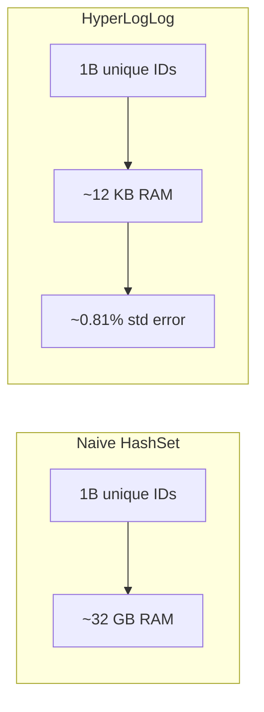
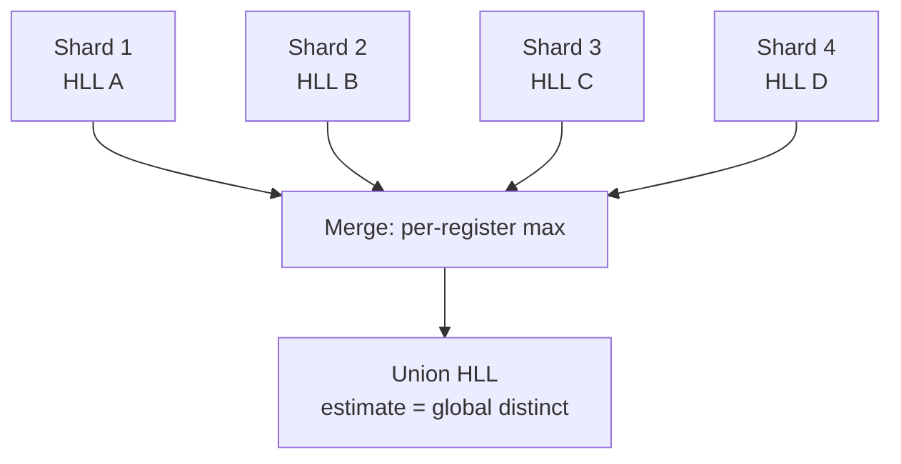

# HyperLogLog — Cardinality Estimation in Constant Memory

**Date:** 2026-04-25 | **Updated:** 2026-04-25
**Tags:** `system-design` `data-structures` `probabilistic` `sketches`

## Table of Contents

- [Summary](#summary)
- [Overview — What Cardinality Estimation Buys You](#overview--what-cardinality-estimation-buys-you)
- [Key Concepts](#key-concepts)
  - [The Intuition — Leading Zeros as a Cardinality Witness](#the-intuition--leading-zeros-as-a-cardinality-witness)
  - [Stochastic Averaging — Why We Use 2^p Registers](#stochastic-averaging--why-we-use-2p-registers)
  - [The Harmonic Mean — Why HyperLogLog and Not LogLog](#the-harmonic-mean--why-hyperloglog-and-not-loglog)
  - [Bias Correction — HLL++ from Heule et al. (2013)](#bias-correction--hll-from-heule-et-al-2013)
  - [Sparse vs Dense Representations](#sparse-vs-dense-representations)
  - [The Mergeable Property](#the-mergeable-property)
- [Trade-offs](#trade-offs)
- [Code Example — A Minimal HLL in Python](#code-example--a-minimal-hll-in-python)
- [Real-World Uses](#real-world-uses)
  - [Redis HLL](#redis-hll)
  - [Google BigQuery — APPROX_COUNT_DISTINCT](#google-bigquery--approx_count_distinct)
  - [Spark, Flink, Druid Sketches](#spark-flink-druid-sketches)
  - [Reddit Unique-Visitor Counts](#reddit-unique-visitor-counts)
- [Anti-Patterns — When NOT to Use HLL](#anti-patterns--when-not-to-use-hll)
- [Related](#related)
- [References](#references)

## Summary

HyperLogLog (HLL) is a probabilistic data structure that estimates the number of distinct elements in a stream — the **cardinality** — using a fixed, tiny amount of memory regardless of how many items you feed it. A standard 12 KB HLL gives roughly 0.81% standard error while estimating cardinalities ranging from zero to many billions. The core trick: hash each item to a uniformly random bit string, count the leading zeros, and use the maximum across many small registers as a witness for cardinality. **Mergeability** (per-register max across shards) makes it ideal for distributed systems — Redis, BigQuery, Spark, Flink, Druid, and most ad-tech and analytics stacks rely on HLL for "approximate count distinct" at scale. This doc covers why HLL works, the bias correction Google added in HLL++, how it composes across shards, and where you should not use it (small cardinalities, billing, exact counts).

## Overview — What Cardinality Estimation Buys You

You operate a service that ingests events. You want answers to questions like:

- How many **distinct users** visited the site today, this week, this month?
- How many **unique IPs** hit this endpoint in the last hour?
- How many **distinct ad-creative × user × hour** triples did we serve?
- How many **distinct search queries** were issued this quarter?

The naive approach — keep every distinct value in a hash set — works for thousands or millions but breaks down at billions. A `HashSet<String>` of one billion 32-byte user IDs is ~32 GB of RAM. Per shard. Per time window. Across hundreds of dashboards. That is not viable.

HyperLogLog flips the trade-off: you accept a small, bounded **relative error** (~1%) in exchange for a fixed, tiny memory footprint (~12 KB) that does not grow with the number of items, plus the ability to merge sketches across shards by element-wise maximum. For analytics, observability, and ad-tech aggregation, this trade is overwhelmingly the right one.



## Key Concepts

### The Intuition — Leading Zeros as a Cardinality Witness

Hash every input to a uniformly random bit string of length `L`. Look at the binary expansion of the hash and count the position of the **first 1 bit** (equivalently, the number of leading zeros plus one). Call this value `rho(x)`.

- Half of all hashes start with `1` → `rho = 1`.
- A quarter start with `01` → `rho = 2`.
- An eighth start with `001` → `rho = 3`.
- More generally, `Pr(rho >= k) = 2^-k`.

**Key insight:** the maximum `rho` you have ever seen across `n` distinct inputs is, in expectation, about `log2(n)`. Equivalently, if you have observed a maximum `rho = R`, then `2^R` is a (very noisy) estimator of `n`.

```text
hash("alice") = 1010 1101 ...     rho = 1
hash("bob")   = 0100 1100 ...     rho = 2
hash("carol") = 0001 0110 ...     rho = 4
hash("dave")  = 0010 1110 ...     rho = 3
                                  max rho = 4 → estimate ≈ 2^4 = 16
```

This is the **Flajolet–Martin** observation (1985), refined into LogLog (2003) and then HyperLogLog (2007). The catch: a single max value is enormously noisy — one rare input with many leading zeros can blow the estimate up. The fix is **stochastic averaging**.

### Stochastic Averaging — Why We Use 2^p Registers

Split the hash into two parts:

- The **first `p` bits** select one of `m = 2^p` registers.
- The **remaining `L - p` bits** contribute the `rho` value for that register.

Each register holds the running maximum `rho` it has seen. With `m` registers averaging independently, you get the variance reduction of running `m` parallel experiments and combining them.

```text
hash(x) = | p bits = register index | L-p bits = used to compute rho |
           ^^^^^^^^^^^^^^^^^^^^^^^^^   ^^^^^^^^^^^^^^^^^^^^^^^^^^^^^^^^
           which bucket?               how many leading zeros?
```

For typical `p = 14`, you have `m = 16384` registers. Each register holds a `rho` value up to ~50 (since `L - p` is small enough that 6 bits per register suffice). Total memory: `16384 × 6 bits ≈ 12 KB`.

The **standard error** of HLL is approximately `1.04 / sqrt(m)`. For `m = 2^14`, that is `1.04 / 128 ≈ 0.81%`. To halve the error, you must quadruple the number of registers (and therefore the memory). This is the core knob.

| `p` | `m = 2^p` | memory (≈) | std error |
|-----|-----------|------------|-----------|
| 10  | 1024      | 0.75 KB    | 3.25%     |
| 12  | 4096      | 3 KB       | 1.62%     |
| 14  | 16384     | 12 KB      | 0.81%     |
| 16  | 65536     | 48 KB      | 0.40%     |
| 18  | 262144    | 192 KB     | 0.20%     |

### The Harmonic Mean — Why HyperLogLog and Not LogLog

The earlier LogLog algorithm averaged `2^R_i` arithmetically across registers. HyperLogLog uses the **harmonic mean** of `2^R_i`:

```text
                   m^2 * alpha_m
estimate(E) = -----------------------
              sum over i of 2^(-R_i)
```

Where `alpha_m` is a small bias-correcting constant (`~0.7213` for typical `m`). The harmonic mean is far less sensitive to outliers — a single very-large `R` no longer drags the estimate. This single change reduced the standard error by roughly a factor of two over LogLog and gave us "Hyper" LogLog.

### Bias Correction — HLL++ from Heule et al. (2013)

The vanilla HyperLogLog estimator is **biased at small and large cardinalities**:

- **Small `n`** (say `n < 5m / 2`): many registers are still zero. The raw estimator overcounts. Flajolet's original paper recommends a **linear-counting** fallback when too many registers are empty: `estimate ≈ m * ln(m / V)` where `V` is the count of empty registers.
- **Large `n`** approaching `2^32`: 32-bit hash collisions become non-trivial and the estimator undercounts.

Stefan Heule, Marc Nunkesser, and Alexander Hall (Google, EuroSys 2013) proposed several practical improvements collectively known as **HLL++**:

1. **64-bit hashing** — eliminates the large-cardinality bias by pushing collisions out past anything you would ever count.
2. **Empirical bias correction** — they ran extensive simulations and produced a precomputed lookup table mapping raw estimates to bias-corrected estimates in the small-cardinality regime, replacing the original linear-counting threshold with a more accurate piecewise correction.
3. **Sparse representation** — at low cardinalities, store the contributing `(index, rho)` pairs explicitly instead of materializing all `m` registers. Far less memory, and zero loss of precision until the sketch is "full enough" to switch over.

HLL++ is the version most production systems implement. When you read "HLL" in the documentation of BigQuery, Redis, Druid, Presto, or DataSketches, you are almost always looking at HLL++ or a close relative.

```mermaid
graph LR
    A[Cardinality range] --> B{Which estimator?}
    B -->|n very small<br/>most registers empty| C[Linear counting<br/>m * ln(m/V)]
    B -->|small to medium| D[HLL with empirical<br/>bias correction table]
    B -->|large| E[Standard HLL formula<br/>m^2 * alpha_m / sum 2^-R]
```

### Sparse vs Dense Representations

In practice, HLL++ uses two physical encodings:

- **Sparse**: when most registers are zero, store only the non-zero ones as a sorted list of `(index, rho)` pairs, packed into a varint stream. Memory cost is proportional to `n`, not to `m`. Use this for cardinalities up to maybe `m / 4`.
- **Dense**: a flat array of `m` register slots, each 6 bits. Memory cost is fixed at `m × 6 bits`. Use this once the sparse representation would exceed the dense size.

Implementations transparently promote sparse → dense when crossing the threshold. They do not demote (it would be lossy) — the sketch only grows in resolution, never in fidelity.

### The Mergeable Property

This is the property that makes HLL the right tool for distributed analytics. To merge two HLL sketches `A` and `B` covering disjoint or overlapping streams:

```text
merged[i] = max(A[i], B[i])  for every register i
```

Take the element-wise maximum of the registers. The result is exactly the HLL you would have built from the **union** of the two input streams. No re-reading of the underlying data, no double-counting.

This means:

- Each shard builds a local HLL of its slice of the keyspace.
- A coordinator collects the per-shard HLLs and merges them.
- The merged sketch's estimate is the cardinality of the union — i.e. the **global distinct count**.

It also makes HLL **commutative and associative** — you can merge sketches in any order, including hierarchically across thousands of shards, without losing accuracy. This composes beautifully with map-reduce, with Druid's segment fan-out, with BigQuery's distributed execution, and with Redis's `PFMERGE` command.



A subtler point: HLL does **not** support exact intersection. You can compute `|A ∩ B| = |A| + |B| - |A ∪ B|` from three HLL estimates, but that subtraction blows up the relative error when `A` and `B` have similar size or large overlap. For intersection-heavy workloads, look at **MinHash** or **Theta sketches** (DataSketches), which are designed for set similarity and intersection.

## Trade-offs

| Property | HyperLogLog | Exact HashSet | Bloom Filter | Count-Min Sketch |
|----------|-------------|---------------|--------------|--------------------|
| Question answered | "how many distinct?" | "how many, exactly?" | "have we seen this?" | "how often did each item occur?" |
| Memory | O(m), constant | O(n × element size) | O(n × bits) | O(width × depth) |
| Error | ~1% std error | 0 | False positives | Overcount only |
| Mergeable | Yes (element-wise max) | Yes (union) | Yes (bit-or) | Yes (cell-wise add) |
| Add speed | O(1) per element | O(1) per element | O(1) per element | O(1) per element |
| Practical sweet spot | Distinct counts at scale | Small N, exact answers needed | Set membership at scale | Heavy-hitters, frequency |
| Standard size | ~12 KB | grows linearly | ~10 bits per element | ~few KB |

The headline trade-off: a fixed ~12 KB ceiling for any cardinality from zero to billions, at ~1% relative error, with full mergeability across shards. For analytics, observability dashboards, and ad-tech, this is almost always the right deal. For ledgers and billing, it is exactly the wrong deal — see anti-patterns.

## Code Example — A Minimal HLL in Python

A minimal-but-honest HyperLogLog in pure Python. It demonstrates registers, leading-zero counting, the harmonic-mean estimator, the small-range linear-counting correction, and merge.

```python
import math
from hashlib import blake2b

P = 14                  # 14-bit register index → m = 16384 registers
M = 1 << P              # number of registers
ALPHA = 0.7213 / (1 + 1.079 / M)   # bias correction constant for m >= 128


def _hash64(value: bytes) -> int:
    """Stable 64-bit hash. blake2b is well-distributed and deterministic."""
    digest = blake2b(value, digest_size=8).digest()
    return int.from_bytes(digest, "big")


def _rho(remaining: int, max_bits: int) -> int:
    """Position of the first 1 in the lower `max_bits` bits, 1-indexed."""
    if remaining == 0:
        return max_bits + 1
    # bit_length gives the position of the highest 1; we want the lowest.
    return (remaining & -remaining).bit_length()


class HyperLogLog:
    """A small, immutable-style HLL. add() and merge() return new sketches."""

    def __init__(self, registers: tuple[int, ...] | None = None) -> None:
        self.registers: tuple[int, ...] = registers or (0,) * M

    def add(self, value: bytes) -> "HyperLogLog":
        h = _hash64(value)
        # high P bits → register index; low (64-P) bits → rho input
        idx = h >> (64 - P)
        w = h & ((1 << (64 - P)) - 1)
        rho = _rho(w, 64 - P)

        if rho <= self.registers[idx]:
            return self  # no change → safe to alias the same object

        new_regs = list(self.registers)
        new_regs[idx] = rho
        return HyperLogLog(tuple(new_regs))

    def estimate(self) -> float:
        # Raw harmonic-mean estimator
        z_inv = sum(2.0 ** -r for r in self.registers)
        raw = ALPHA * M * M / z_inv

        # Small-range correction: linear counting if many registers are empty
        empty = sum(1 for r in self.registers if r == 0)
        if raw <= 2.5 * M and empty > 0:
            return M * math.log(M / empty)

        # Large-range correction omitted because we use 64-bit hashes
        return raw

    def merge(self, other: "HyperLogLog") -> "HyperLogLog":
        merged = tuple(max(a, b) for a, b in zip(self.registers, other.registers))
        return HyperLogLog(merged)


# Smoke test
if __name__ == "__main__":
    sketch_a = HyperLogLog()
    for i in range(500_000):
        sketch_a = sketch_a.add(f"user-A-{i}".encode())

    sketch_b = HyperLogLog()
    for i in range(500_000):
        # half of B overlaps with A
        suffix = i if i % 2 == 0 else i + 250_000
        sketch_b = sketch_b.add(f"user-A-{suffix}".encode())

    print(f"|A|       ~ {sketch_a.estimate():,.0f}  (true 500,000)")
    print(f"|B|       ~ {sketch_b.estimate():,.0f}  (true 500,000)")
    print(f"|A ∪ B|   ~ {sketch_a.merge(sketch_b).estimate():,.0f}  (true 750,000)")
```

A real implementation will: pack registers into 6-bit slots, support a sparse encoding under the linear-counting threshold, use a precomputed bias-correction table, and pick a fast non-cryptographic hash (xxHash64, MurmurHash3 finalizer, CityHash). The shape above is enough to understand the rest of the doc.

## Real-World Uses

### Redis HLL

Redis ships HyperLogLog as a first-class type. Three commands cover the surface area:

```text
PFADD   visitors:2026-04-25  alice  bob  carol
PFCOUNT visitors:2026-04-25
PFMERGE visitors:2026-week-17  visitors:2026-04-19  ...  visitors:2026-04-25
```

Redis uses `p = 14` (16384 registers, ~12 KB per sketch) and `0.81%` standard error. A single key tops out at ~12 KB regardless of how many `PFADD` calls you make against it. `PFCOUNT` over multiple keys computes the union on the fly. `PFMERGE` materializes the union into a new key. All three are O(1) or O(m) — independent of the underlying cardinality.

This is the simplest realistic example. To count distinct visitors per day, store one HLL key per day and merge across the days you care about — daily, weekly, monthly, and rolling counts all come from the same primitive. Total storage cost: 12 KB per day.

### Google BigQuery — APPROX_COUNT_DISTINCT

BigQuery exposes HLL++ directly:

```sql
-- Single-shot approximate count distinct
SELECT APPROX_COUNT_DISTINCT(user_id) AS unique_users
FROM events
WHERE event_date = '2026-04-25';

-- Build sketches you can merge later
SELECT
  event_date,
  HLL_COUNT.INIT(user_id, 14) AS user_sketch
FROM events
GROUP BY event_date;

-- Merge sketches across days, then extract a single estimate
SELECT HLL_COUNT.MERGE(user_sketch) AS unique_users_in_window
FROM daily_user_sketches
WHERE event_date BETWEEN '2026-04-01' AND '2026-04-25';
```

The `HLL_COUNT.INIT` / `HLL_COUNT.MERGE_PARTIAL` / `HLL_COUNT.EXTRACT` family lets you precompute and persist sketches, then merge them flexibly across time, geography, and product axes — without ever rescanning the raw event tables. This is the BigQuery pattern that makes "rolling 90-day distinct users by region by funnel step" cheap to dashboard.

### Spark, Flink, Druid Sketches

- **Apache Spark** ships `approx_count_distinct(col, rsd)` in DataFrames, backed by HLL++. The `rsd` parameter is the relative standard deviation; smaller values use larger sketches.
- **Apache Flink** offers HLL aggregators in its Table API and supports incremental aggregation in keyed windows.
- **Apache Druid** uses the `hyperUnique` and `HLLSketch` aggregators heavily. Druid's segment-and-merge architecture is tailor-made for HLL: each historical segment carries its own sketches, and queries merge sketches across segments at fan-in time. Druid commonly pairs HLL (for cardinality) with Theta sketches (for set operations) and Quantiles sketches (for percentiles).
- **Apache DataSketches** (Yahoo, now Apache) is the canonical sketch library. It provides HLL, CPC (Compressed Probabilistic Counting), Theta, KLL, and more, with cross-language compatibility (Java, C++, Python). Druid, Pinot, and Hive all link to DataSketches.

If you operate a columnar OLAP system and you ever pre-aggregate, you almost certainly already use HLL whether you know it or not.

### Reddit Unique-Visitor Counts

Reddit's engineering blog (2017) described their move from exact counting to HLL for the per-post unique-viewer counter. Each post has a counter shown as "X views". With hundreds of millions of pageviews per day across millions of posts, exact counting requires per-post sets, which is wildly expensive in both memory and write amplification.

Their solution: an HLL per post, updated on every view. The per-post sketch is small (~1 KB at lower precision since absolute accuracy doesn't matter for displayed view counts), updates are O(1), and the displayed number is within a few percent of truth — well under what humans can perceive. The same architecture appears all over consumer analytics: Twitter impressions, YouTube view counts, Reddit voters, and so on, all backed by HLL or close cousins.

## Anti-Patterns — When NOT to Use HLL

HLL is a precision instrument with one job. Use it for the wrong thing and you will be unhappy.

**Do not use HLL when:**

- **You need an exact count.** Billing — "you owe $X for Y million API calls" — must be exact, both for trust and for legal reasons. Use atomic counters or transactional aggregation. Save HLL for the dashboard, not the invoice.
- **Cardinality is small (< ~1000) and exactness is cheap.** A regular `Set` is faster, simpler, and exact. The HLL bias-correction regime exists precisely because the structure is awkward at small `n`. If you are tracking how many distinct test users hit a feature flag on a staging environment, just use a set.
- **You need exact set intersection.** HLL can estimate `|A ∩ B|` only via inclusion–exclusion, and the error compounds catastrophically when `A` and `B` are similar in size or have heavy overlap. Use **MinHash**, **Theta sketches**, or **Bloom intersections** when intersection-quality matters.
- **You need to enumerate the elements.** HLL only counts; it does not store the underlying values. If you ever need to know *which* users visited, HLL is not the structure — use a sampled log, a Bloom filter (with false positives), or actual storage.
- **You require the ability to delete elements.** HLL registers only ever go up. There is no `PFREMOVE`. If you need to subtract, you usually need to recompute the sketch from a window that excludes the deleted items.
- **The cost of being wrong is asymmetric and unbounded.** Risk-control, fraud, security, and compliance systems often need exact counts because the downside of a 1% error is a regulatory fine, not a slightly off graph. Never use approximation in a system where the loss function has a long tail.

A useful framing: **HLL is for analytics, not accounting.** When the question is "roughly how many uniques were there?" use HLL. When the question is "exactly how many should we charge for?" use an exact counter or a transaction log.

## Related

- [Bloom and Cuckoo Filters](./bloom-and-cuckoo-filters.md) — the membership analogue: "have we seen X?" instead of "how many distinct X?"
- [Count-Min Sketch and Top-K](./count-min-sketch-and-top-k.md) — frequency estimation and heavy-hitter detection; HLL counts unique items, CMS counts how often each item occurs
- [Designing a Likes Counting System](../case-studies/social-media/design-likes-counting-system.md) — when distinct-likes-per-content matters and HLL beats per-content sets
- [Designing a Top-K System](../case-studies/counting-ranking/design-top-k-system.md) — combining HLL (cardinality) with CMS or space-saving (top-k) for trending dashboards
- [Designing an Ad Click Aggregator](../case-studies/search-aggregation/design-ad-click-aggregator.md) — distinct-user-per-creative-per-hour is a textbook HLL workload at billions of events per hour

## References

- Philippe Flajolet, Éric Fusy, Olivier Gandon, Frédéric Meunier, ["HyperLogLog: the analysis of a near-optimal cardinality estimation algorithm" (2007)](https://algo.inria.fr/flajolet/Publications/FlFuGaMe07.pdf) — the original HLL paper, with the harmonic-mean estimator and full variance analysis
- Stefan Heule, Marc Nunkesser, Alexander Hall, ["HyperLogLog in Practice: Algorithmic Engineering of a State of the Art Cardinality Estimation Algorithm" (EuroSys 2013)](https://research.google/pubs/pub40671/) — the HLL++ paper from Google, covering 64-bit hashing, empirical bias correction, and sparse encoding
- Philippe Flajolet, G. Nigel Martin, ["Probabilistic Counting Algorithms for Data Base Applications" (1985)](http://algo.inria.fr/flajolet/Publications/FlMa85.pdf) — the original Flajolet–Martin sketch and the leading-zeros idea HLL is built on
- [Redis HyperLogLog Documentation](https://redis.io/docs/latest/develop/data-types/probabilistic/hyperloglogs/) — `PFADD`, `PFCOUNT`, `PFMERGE`, plus the dense/sparse format Redis uses on disk and on the wire
- [Google BigQuery — Approximate Aggregate Functions](https://cloud.google.com/bigquery/docs/reference/standard-sql/approximate_aggregate_functions) and [HLL_COUNT functions](https://cloud.google.com/bigquery/docs/reference/standard-sql/hll_functions) — the production HLL surface for petabyte-scale SQL
- [Apache DataSketches — HLL Sketch](https://datasketches.apache.org/docs/HLL/HLL.html) — the canonical cross-language sketch library; HLL plus Theta, CPC, and quantiles
- [Druid Sketches Documentation](https://druid.apache.org/docs/latest/development/extensions-core/datasketches-hll) — how Druid integrates HLL aggregators into its segment-merge architecture
- Antirez (Salvatore Sanfilippo), ["Redis new data structure: the HyperLogLog"](http://antirez.com/news/75) — the design notes from the author of Redis, including why he picked dense + sparse encoding
- Reddit Engineering, ["View Counting at Reddit"](https://www.redditinc.com/blog/view-counting-at-reddit) — production walkthrough of HLL for per-post unique-view counters at Reddit scale
