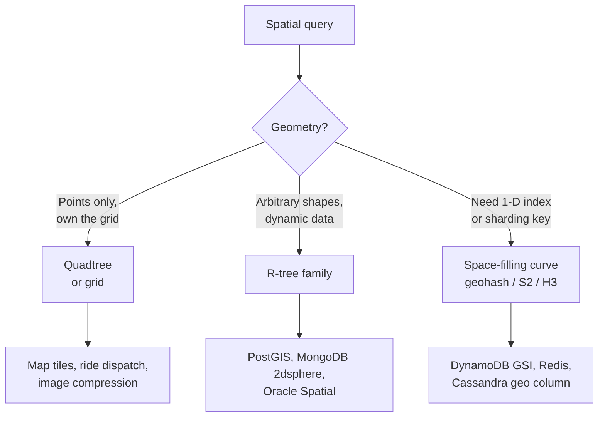
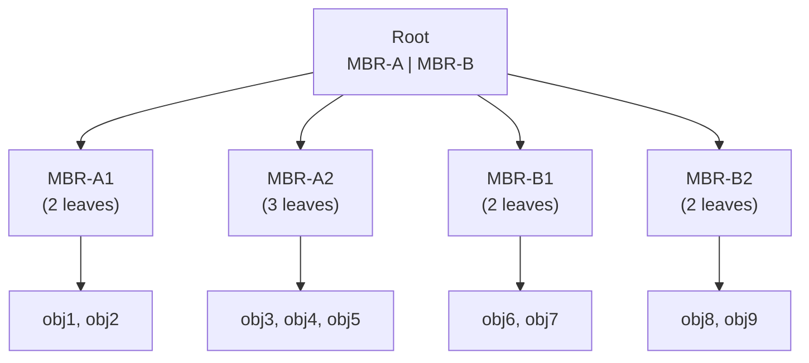

# Quadtrees & R-Trees — Multi-Dimensional Indexing

**Date:** 2026-04-25 | **Updated:** 2026-04-25
**Tags:** `system-design` `data-structures` `geo` `indexing` `spatial`

## Table of Contents

- [Summary](#summary)
- [Overview — Why Multi-Dimensional Indexing](#overview--why-multi-dimensional-indexing)
- [Key Concepts](#key-concepts)
  - [Quadtree Variants — Point, Region, PR](#quadtree-variants--point-region-pr)
  - [Recursion and Bucket Capacity](#recursion-and-bucket-capacity)
  - [R-Tree — Bounding Rectangles per Node](#r-tree--bounding-rectangles-per-node)
  - [Splits — Linear, Quadratic, R\*-Tree](#splits--linear-quadratic-r-tree)
  - [kd-Tree vs R-Tree — Low Dim vs High Dim](#kd-tree-vs-r-tree--low-dim-vs-high-dim)
  - [Insert, Search, Range Query](#insert-search-range-query)
  - [k-NN via Best-First Traversal](#k-nn-via-best-first-traversal)
  - [Bulk-Loading — STR Algorithm](#bulk-loading--str-algorithm)
- [Trade-offs — Quadtree vs R-Tree vs Grid vs Geohash vs S2](#trade-offs--quadtree-vs-r-tree-vs-grid-vs-geohash-vs-s2)
- [Code Examples — Python Region Quadtree](#code-examples--python-region-quadtree)
- [Real-World Uses](#real-world-uses)
  - [PostGIS GiST = R-Tree](#postgis-gist--r-tree)
  - [MongoDB 2dsphere](#mongodb-2dsphere)
  - [Mapbox / Map Rendering Pipelines](#mapbox--map-rendering-pipelines)
  - [Ride-Sharing Dispatch Grid](#ride-sharing-dispatch-grid)
- [Anti-Patterns](#anti-patterns)
- [Related](#related)
- [References](#references)

## Summary

Spatial indexing answers a different shape of question than B-tree indexing: not "give me the row with `id=42`" but "give me every restaurant within 2 km of this lat/lng" or "which polygons intersect this map tile?" One-dimensional indexes can't help — you cannot order 2-D points along a single line without losing locality. **Quadtrees** and **R-trees** are the two classic answers. Quadtrees recursively subdivide *space* into four equal quadrants and stop when a quadrant is sparse enough; R-trees recursively group *objects* by tight bounding rectangles. Quadtrees are simple and great for points or for systems that own their grid (map tiles, ride dispatch). R-trees handle arbitrary geometries (polygons, lines), are dynamic, and are what PostGIS GiST and most production spatial databases actually use. This doc covers both at a working depth — variants, splits, queries, k-NN, bulk loading — plus how they map to real systems and where they lose to grids, geohash, or S2.

## Overview — Why Multi-Dimensional Indexing

A B-tree key is a **total order**: every key has a single comparable value, the tree splits on it, and a range query becomes a logarithmic walk. 2-D space has no such total order — `(40.7, -74.0)` is neither greater nor less than `(34.0, -118.2)` in any meaningful sense.

Three families of approaches exist:

1. **Space-filling curves (linearization)** — flatten 2-D to 1-D via Z-order, Hilbert, geohash, S2. Re-uses B-tree machinery. Locality is approximate; queries become several 1-D ranges. See [./geohash.md](./geohash.md).
2. **Space partitioning** — recursively cut the *space* into equal regions. Quadtree (2-D), octree (3-D), kd-tree (alternating axis splits).
3. **Object partitioning** — recursively group the *objects* into bounding boxes that may overlap. R-tree, R\*-tree, R+-tree, X-tree.

Quadtrees and R-trees sit in (2) and (3). They handle the queries spatial workloads actually issue:

- **Range / window query** — every object inside a rectangle, circle, or polygon.
- **k nearest neighbours (k-NN)** — k closest objects to a point.
- **Spatial join** — every (A, B) where A intersects B (e.g. every (delivery, restaurant) pair within 5 km).
- **Containment** — every polygon containing a given point (point-in-polygon for many polygons at once).



## Key Concepts

### Quadtree Variants — Point, Region, PR

A quadtree recursively subdivides a 2-D region into four equal quadrants — NW, NE, SW, SE — stopping when the quadrant is "small enough" or "sparse enough". The variants differ in *what* the tree stores and *when* it splits:

- **Point quadtree (Finkel & Bentley, 1974)** — every internal node is a stored point that splits its region into four. The split is data-dependent; the tree is unbalanced like a 2-D BST. Insertion order matters.
- **Region quadtree** — splits are *geometric*, always at the midpoint. Internal nodes carry no data; leaves carry the data. Used for raster/image data and tile pyramids.
- **PR quadtree (Point-Region)** — region quadtree storing *points*. Each leaf holds at most one point (or up to a bucket capacity in the bucket variant). When a leaf overflows, it splits geometrically into four.
- **MX quadtree** — fixed grid resolution, leaves correspond to pixels; mostly for image processing.
- **Compressed / patricia quadtree** — collapses long single-child chains, similar to a radix tree compression. Common in production tile systems.

```text
              World extent
              ┌─────────────────┐
              │  NW   │   NE    │
              │       │ ┌───┐   │
              │       │ │NE │   │
              │       │ └───┘   │
              ├───────┼─────────┤
              │  SW   │   SE    │
              │       │         │
              └─────────────────┘

Tree:                  root
                ┌───┬───┴───┬───┐
               NW  NE      SW  SE
                  /│\
                 ... (NE further subdivided)
```

A region quadtree at depth `d` represents the world as `4^d` cells. Map tile schemes (Google, Bing, OSM, Mapbox) are exactly region quadtrees over a Mercator-projected world: tile `(z, x, y)` is a quadtree node at depth `z`.

### Recursion and Bucket Capacity

Naive PR quadtrees split on every collision — pathological for clustered data, where many points share the same coordinates and the tree recurses to floating-point precision. The fix is the **bucket** variant: a leaf may hold up to `B` points (typical `B = 4` to `64`). Only when insertion overflows the bucket does the leaf subdivide.

Bucket capacity is the most important quadtree tuning knob:

- **Small `B`** (e.g. 4) — deeper tree, more pointer chasing, more cache misses, but tighter pruning during search.
- **Large `B`** (e.g. 64) — shallower tree, better for SSD/HDD where each node is a page, but more in-leaf scans on lookup.

Production systems align `B` with the I/O page size: leaves should be one disk page or one SSD block.

### R-Tree — Bounding Rectangles per Node

Antonin Guttman, "R-Trees: A Dynamic Index Structure for Spatial Searching" (1984), introduced the R-tree as the spatial analogue of the B-tree. The structure:

- Every leaf entry is `(MBR, object_id)` — the **Minimum Bounding Rectangle** of an object plus a pointer.
- Every internal entry is `(MBR, child_pointer)` where the MBR encloses *every* MBR in the subtree rooted at that child.
- Like a B-tree, the tree is **height-balanced** — all leaves at the same depth.
- Each node holds between `m` and `M` entries (`m ≤ M/2`). Page-aligned in real systems: `M ≈ 50–200`.

Two structural facts matter for query cost:

1. **Sibling MBRs may overlap.** An R-tree, unlike a quadtree, does not partition space — it partitions objects. A query that lands in an overlapped region must descend *both* siblings.
2. **MBR coverage may be much larger than the contained objects.** A long thin diagonal road yields a near-square MBR that overlaps many irrelevant tiles. This is "dead space" — and it is the chief weakness R\*-tree tries to fix.



### Splits — Linear, Quadratic, R\*-Tree

When an R-tree node overflows during insertion, it must split into two. Different split heuristics trade build time for query time:

| Split | Cost | Quality | Notes |
|-------|------|---------|-------|
| **Linear (Guttman 1984)** | O(M) | Worst | Pick two seeds at extremes of the longest axis; greedy assign |
| **Quadratic (Guttman 1984)** | O(M²) | Better | Pick the pair of entries with the largest "wasted area" as seeds; greedy assign |
| **R\*-tree (Beckmann 1990)** | O(M log M) | Best | Optimize for overlap *and* perimeter *and* coverage; reinsertion on overflow |
| **R+-tree** | — | No overlap, splits objects | Avoids descending duplicate paths but duplicates large objects across leaves |

The **R\*-tree** is what production R-tree implementations actually use. Its three innovations:

1. **Forced reinsertion** — on first overflow at a level, instead of splitting, remove the `p` farthest entries from the node's centroid and reinsert them. This is global rebalancing; it prevents pathological local splits.
2. **Multi-criterion split** — minimize a weighted sum of overlap, perimeter, and coverage rather than any one metric.
3. **Choose-subtree by overlap, not enlargement** — at lower levels, descend into the subtree whose MBR enlargement causes the smallest *overlap with siblings*, not just the smallest area increase.

The R\*-tree typically beats Guttman's R-tree by 30–50% on query cost for real spatial data, which is why PostGIS, SQL Server spatial, and most modern engines implement R\*-tree semantics under the "R-tree" name.

### kd-Tree vs R-Tree — Low Dim vs High Dim

The **kd-tree** (Bentley, 1975) alternates split axes: depth 0 splits on x, depth 1 on y, depth 2 on x, and so on. Each internal node stores a single splitting hyperplane. It is great for **points in low dimensions** (2–10) and is the workhorse of `scipy.spatial.cKDTree`, FLANN, and Open3D.

| Aspect | kd-tree | R-tree |
|--------|---------|--------|
| Stores | Points only (typically) | Arbitrary geometries via MBR |
| Splits | Hyperplanes through points | Rectangle groupings |
| Balance | Hard to keep dynamic | Naturally balanced (B-tree style) |
| Insert/delete | Painful, often rebuild | First-class operations |
| Disk-friendly | No (depth-first, scattered) | Yes (page-aligned nodes) |
| Sweet spot | In-memory point cloud, 2–10 dim | Disk-backed spatial DB |
| Dimension wall | Curse of dimensionality past ~20 | Same wall, often earlier |

In **high dimensions** (>30) both structures degrade to near-linear scan ("curse of dimensionality") — the volume-to-surface ratio of MBRs becomes unfavourable, and any range query of useful selectivity touches most of the tree. For high-D vector search, you switch to **approximate** structures: HNSW, IVF-PQ, ScaNN, FAISS. R-trees are the wrong tool for embedding search.

### Insert, Search, Range Query

**R-tree insert (sketch):**

```pseudocode
function insert(rect, oid):
  leaf = chooseSubtree(root, rect)        // descend choosing best subtree
  leaf.add((rect, oid))
  if leaf.size > M:
    splitNode(leaf)                        // overflow: split (or reinsert in R*)
  adjustMBRsUpward(leaf)                   // tighten parent MBRs back to root

function chooseSubtree(node, rect):
  if node is leaf: return node
  child = argmin over children of cost(child, rect)
    // R-tree: minimise area enlargement
    // R*-tree at leaf level: minimise overlap enlargement
  return chooseSubtree(child, rect)
```

**Range query (window):**

```pseudocode
function rangeQuery(node, queryRect, results):
  for each entry (mbr, payload) in node:
    if mbr intersects queryRect:
      if node is leaf:
        results.add(payload)
      else:
        rangeQuery(payload, queryRect, results)   // payload = child node
```

The query is a depth-first prune-and-descend. In a quadtree the prune is exact (sibling regions are disjoint). In an R-tree the prune is approximate — overlapping MBRs mean you may descend more than one child for a single query rectangle.

### k-NN via Best-First Traversal

For "find the 5 nearest restaurants to my point," depth-first is wrong — you want to visit the *closest* candidate region first so you can prune aggressively. **Best-first traversal** with a priority queue is the standard algorithm (Hjaltason & Samet, 1995, "Ranking in Spatial Databases"):

```pseudocode
function kNearest(root, queryPoint, k):
  pq = priority_queue()                     // min-heap by mindist to queryPoint
  pq.push(root, mindist=0)
  results = []

  while pq not empty and len(results) < k:
    (entry, d) = pq.pop()                   // closest unvisited entry
    if entry is an object:
      results.append(entry)
    else if entry is a leaf entry (MBR, oid):
      // distance to actual object (not just MBR)
      pq.push(oid, mindist(queryPoint, geom(oid)))
    else:                                   // internal node
      for child in entry.children:
        pq.push(child, mindist(queryPoint, child.mbr))

  return results
```

`mindist(p, mbr)` is the minimum possible distance from `p` to any point inside the MBR — zero if `p` is inside, otherwise the distance to the nearest face/corner. The algorithm is **provably optimal** in number of nodes visited: it never expands a node whose mindist exceeds the k-th best so far. This is what every "nearest 50 drivers" or "10 closest restaurants" feature relies on.

### Bulk-Loading — STR Algorithm

Inserting `N` points one-by-one into an R-tree is `O(N log N)` but produces poor-quality trees because early splits decide the whole structure based on a tiny prefix of the data. **Bulk-loading** builds the tree bottom-up from all data at once and produces tighter MBRs and better query performance.

**STR — Sort-Tile-Recursive (Leutenegger, Lopez, Edgington, 1997)** is the standard:

1. Sort all `N` rectangles by **x-centroid**.
2. Partition into `S = ceil(sqrt(N / M))` vertical "slices" of `~ S * M` rectangles each.
3. Within each slice, sort by **y-centroid** and pack into leaf nodes of `M` rectangles.
4. Recurse on the resulting nodes (treated as MBR rectangles) until one root remains.

Cost: `O(N log_M N)` total, almost entirely sort cost. Resulting trees typically have 20–40% lower query cost than a tree built by `N` insertions and are 100% utilisation (no half-empty nodes), which means smaller and faster.

PostGIS uses an STR-like loader for `CREATE INDEX` on existing data; MongoDB rebuilds 2dsphere indexes via similar bulk ordering; SpatiaLite, GEOS, and `rtree` (Python) all expose bulk-load APIs.

## Trade-offs — Quadtree vs R-Tree vs Grid vs Geohash vs S2

| Structure | Geometry support | Dynamic? | Index fit | Best for | Weakness |
|-----------|------------------|----------|-----------|----------|----------|
| **Uniform grid** | Points / small shapes | Yes | Hash table | Known-density, fixed cell size, ride dispatch | Skewed data destroys it; pick wrong cell size = useless |
| **Region quadtree** | Points or rasters | Yes (rebalance manually) | Tree | Map tiles, image data, "own the grid" systems | Doesn't fit non-point geometries cleanly |
| **R-tree / R\*-tree** | Any geometry (point, line, polygon) | Yes | B-tree-like, page-aligned | General spatial DB, mixed geometries | Overlap = wasted descent; bad in high dim |
| **kd-tree** | Points | Awkward | Pointer-heavy | In-memory point cloud, ML feature search | Hard to keep balanced under updates; not disk-friendly |
| **Geohash** | Points (extendable to MBR) | Yes | 1-D B-tree on string | Sharding key, prefix-range scans, distributed stores | Discontinuities at cell edges; rectangles in lat/lng aren't equal-area |
| **S2 / H3** | Cells covering geometries | Yes | Set of 1-D cell IDs | Global geo, cross-region sharding, ride matching at scale | Conceptual overhead; tooling needed for covering |

Rules of thumb:

- **You own the grid and your data is points** (taxis, devices, deliveries) → quadtree or uniform grid in memory, Redis or sharded KV for storage.
- **You have arbitrary geometries in a SQL database** → R-tree (PostGIS GiST is exactly this).
- **You need a sharding key or a 1-D index** → geohash, S2 cell ID, or H3 ID.
- **You need global, equal-area, hierarchical cells** → S2 (Google) or H3 (Uber). Both can be combined *with* an R-tree on the resulting cell IDs.
- **You have high-D embeddings, not geo** → none of the above; use HNSW or IVF-PQ.

## Code Examples — Python Region Quadtree

A region quadtree with bucket capacity, supporting insert and rectangular range query. Around 70 lines, deliberately simple — no balancing, no compression, no removal — so the structure is visible. Real PostGIS is Rust/C and dramatically more sophisticated.

```python
from dataclasses import dataclass, field
from typing import List, Optional, Tuple

Point = Tuple[float, float]

@dataclass
class Rect:
    xmin: float
    ymin: float
    xmax: float
    ymax: float

    def contains(self, p: Point) -> bool:
        x, y = p
        return self.xmin <= x <= self.xmax and self.ymin <= y <= self.ymax

    def intersects(self, other: "Rect") -> bool:
        return not (
            other.xmin > self.xmax or other.xmax < self.xmin
            or other.ymin > self.ymax or other.ymax < self.ymin
        )

    def quadrants(self) -> List["Rect"]:
        mx = (self.xmin + self.xmax) / 2
        my = (self.ymin + self.ymax) / 2
        return [
            Rect(self.xmin, my, mx, self.ymax),  # NW
            Rect(mx, my, self.xmax, self.ymax),  # NE
            Rect(self.xmin, self.ymin, mx, my),  # SW
            Rect(mx, self.ymin, self.xmax, my),  # SE
        ]

@dataclass
class QuadNode:
    bounds: Rect
    capacity: int = 4
    points: List[Point] = field(default_factory=list)
    children: Optional[List["QuadNode"]] = None  # None = leaf

    def insert(self, p: Point) -> bool:
        if not self.bounds.contains(p):
            return False
        if self.children is None:
            if len(self.points) < self.capacity:
                self.points.append(p)
                return True
            self._subdivide()
        for child in self.children:
            if child.insert(p):
                return True
        return False  # numerical edge — should not happen in practice

    def _subdivide(self) -> None:
        self.children = [QuadNode(q, self.capacity) for q in self.bounds.quadrants()]
        for p in self.points:
            for child in self.children:
                if child.insert(p):
                    break
        self.points = []

    def range_query(self, region: Rect) -> List[Point]:
        if not self.bounds.intersects(region):
            return []
        if self.children is None:
            return [p for p in self.points if region.contains(p)]
        out: List[Point] = []
        for child in self.children:
            out.extend(child.range_query(region))
        return out

# usage
if __name__ == "__main__":
    qt = QuadNode(Rect(-180, -90, 180, 90), capacity=4)
    samples = [
        (-73.99, 40.75),  # NYC
        (-118.24, 34.05), # LA
        (-122.42, 37.77), # SF
        (-87.65, 41.85),  # Chicago
        (2.35, 48.85),    # Paris
        (139.69, 35.69),  # Tokyo
    ]
    for p in samples:
        qt.insert(p)

    # everything roughly in continental US
    box = Rect(-130, 25, -65, 50)
    print(qt.range_query(box))  # NYC, LA, SF, Chicago
```

Notes for production:

- Bucket capacity (`capacity=4`) should be tuned to your I/O page size — 32–128 is typical for disk-backed.
- For lat/lng data crossing the antimeridian (180/-180), wrap inputs or split into two queries.
- Rectangles in lat/lng are *not* equal area — use S2/H3 if you need that.
- Add a depth cap to avoid pathological recursion on duplicate or near-duplicate points.

## Real-World Uses

### PostGIS GiST = R-Tree

PostgreSQL's **GiST** (Generalized Search Tree) is a generic balanced tree framework. The PostGIS spatial operators (`&&`, `ST_Intersects`, `ST_Within`, `ST_DWithin`) plug into GiST with R\*-tree-style consistent and split functions. Concretely:

- `CREATE INDEX idx ON places USING GIST (geom);` builds an R-tree (R\*-tree split heuristics) over the geometries' MBRs.
- `WHERE geom && ST_MakeEnvelope(...)` is the index-only bounding-box test (the `&&` operator).
- `WHERE ST_Intersects(geom, q)` does the index lookup *then* the exact geometry test on the candidates.
- `CREATE INDEX ... USING GIST (geom) WITH (fillfactor=90)` controls bulk-load packing.
- PostGIS 2.4+ added **SP-GiST** support for k-d tree / quadtree variants — useful for point-only data.

PostGIS is the reference open-source spatial DB and is used as the backbone for OpenStreetMap services, governmental GIS systems, and many ride-sharing/delivery internal tools.

### MongoDB 2dsphere

MongoDB's **2dsphere** index handles GeoJSON geometries on a spherical earth model. Internally it uses **S2 cell coverings**: each indexed geometry is converted to a set of S2 cells covering it, and those cell IDs are stored in a B-tree.

- `db.places.createIndex({ loc: "2dsphere" })`
- Queries use `$geoWithin`, `$geoIntersects`, `$near`, `$nearSphere`.
- `$near` returns docs sorted by distance, equivalent to k-NN with best-first traversal over the cell index.
- The older `2d` index uses geohash; `2dsphere` is preferred for anything sphere-aware.

This is a hybrid: the *partitioning* is S2 (a hierarchical quadtree-of-spherical-quadrilaterals), and the *index* is a B-tree on cell IDs. It composes well with MongoDB sharding because cell IDs are 1-D.

### Mapbox / Map Rendering Pipelines

Map rendering is the textbook quadtree application:

- The world (in Web Mercator) is a region quadtree. Tile `(z, x, y)` is a node at depth `z`, with `x` and `y` selecting the path through quadrants.
- Vector tile pipelines (Mapbox MVT, OpenMapTiles, Tippecanoe) bulk-build per-zoom tile sets by **clipping** each feature to every tile its MBR overlaps, then packing.
- **Tippecanoe** is essentially STR-style bulk loading constrained to tile boundaries.
- Client-side, Mapbox GL and similar engines maintain an in-memory R-tree (often `rbush`, the JS R-tree library) for hit-testing and label collision avoidance.
- **Supercluster** (Mapbox) is a quadtree-based point clusterer that pre-aggregates millions of markers into per-zoom clusters in milliseconds.

The combination — quadtree for the *tile pyramid*, R-tree for the *features inside a tile* — is canonical.

### Ride-Sharing Dispatch Grid

Ride dispatch (Uber, Lyft, DoorDash, Bolt) has a different shape: high update rate (every driver pings every 4 s), simple "nearest k" or "available drivers in this region" queries, and extreme global scale. Pure R-trees do badly on the write side because every move triggers an MBR adjust.

The pattern that works:

1. Partition the world into a **hierarchical grid** — H3 (Uber) or S2 (Lyft, OpenStreetMap-based systems).
2. Maintain a **driver-by-cell** index in Redis (sorted set keyed by cell ID; `ZADD cell_8a2a... driver_id`).
3. Driver pings → compute current H3 cell → update the cell's set; eventual consistency is acceptable.
4. Rider request → compute rider cell → query that cell + ring of neighbours → exact distance test on the small candidate set → dispatch.

Quadtrees show up *inside* services that own a region (one per city, per region, per service area) where an in-memory PR quadtree does the local matching. R-trees show up in the *analytics* tier for retrospective queries (heatmaps, surge zones) where MBR overlap matters less than write throughput. See [../case-studies/location-based/design-uber.md](../case-studies/location-based/design-uber.md) for the full architecture and [../case-studies/location-based/design-doordash.md](../case-studies/location-based/design-doordash.md) for delivery-specific variants.

## Anti-Patterns

- **Using an R-tree for high-D embeddings.** Past ~20 dimensions every MBR overlaps every other, and the index degrades to scan. Use HNSW, IVF-PQ, or ScaNN.
- **Inserting one row at a time into a brand-new spatial index.** Bulk-load with STR or the DB's equivalent (`CREATE INDEX` after data load) to get tight MBRs and 100% page utilisation.
- **Treating lat/lng degrees as Cartesian.** A degree of longitude is ~111 km at the equator and ~0 km at the poles. Either project to a metric CRS (UTM, Web Mercator) before indexing, or use a spherical index (S2, H3, MongoDB 2dsphere) and spherical distance functions.
- **Skipping the geometry post-filter.** R-tree returns *MBR-overlap candidates*, not exact matches. Always apply the actual `ST_Intersects` / `ST_DWithin` after the index step. PostGIS does this automatically when you write `ST_Intersects`; raw `&&` does not.
- **Picking a uniform grid cell size for non-uniform data.** A 1 km grid is wonderful for Manhattan and useless for rural Wyoming. Quadtree or H3 (multi-resolution) handles density skew; uniform grids do not.
- **Ignoring antimeridian and pole wraparound.** A bounding box from `lng=170` to `lng=-170` is *not* an empty rectangle; it crosses the dateline. Most R-tree implementations will either silently return wrong results or throw — wrap or split queries explicitly.
- **Using a quadtree for polygons whose MBRs vary by orders of magnitude.** A coastline polygon's MBR may cover an entire continent. R-tree is the right structure; a region quadtree will either deeply subdivide or store the polygon at a useless ancestor.
- **Holding the whole index in memory when it should be paged.** A region quadtree with one point per leaf and 50 M points is GB of pointer overhead. Use a paged R-tree, or move to PostGIS / Mongo / a managed spatial DB.

## Related

- [./geohash.md](./geohash.md) — space-filling curve approach; complementary to R-tree, used as a sharding key and 1-D index
- [../case-studies/location-based/design-uber.md](../case-studies/location-based/design-uber.md) — H3 grid + per-cell driver sets; quadtree-region service layout
- [../case-studies/location-based/design-google-maps.md](../case-studies/location-based/design-google-maps.md) — tile pyramid as region quadtree; R-tree for label collision and hit-testing
- [../case-studies/location-based/design-doordash.md](../case-studies/location-based/design-doordash.md) — delivery dispatch grid, restaurant proximity search, ETA matching
- [../data-consistency/consensus-raft-and-paxos.md](../data-consistency/consensus-raft-and-paxos.md) — coordination layer for the metadata about spatial shards and live driver counts

## References

- Raphael A. Finkel and Jon Louis Bentley, ["Quad Trees: A Data Structure for Retrieval on Composite Keys" (Acta Informatica, 1974)](https://link.springer.com/article/10.1007/BF00288933) — the original quadtree paper
- Antonin Guttman, ["R-Trees: A Dynamic Index Structure for Spatial Searching" (SIGMOD 1984)](http://www-db.deis.unibo.it/courses/SI-LS/papers/Gut84.pdf) — the R-tree, with linear and quadratic splits
- Norbert Beckmann, Hans-Peter Kriegel, Ralf Schneider, Bernhard Seeger, ["The R\*-tree: An Efficient and Robust Access Method for Points and Rectangles" (SIGMOD 1990)](https://infolab.usc.edu/csci599/Fall2001/paper/rstar-tree.pdf) — R\*-tree split, forced reinsertion
- Scott T. Leutenegger, Mario A. Lopez, Jeffrey Edgington, ["STR: A Simple and Efficient Algorithm for R-Tree Packing" (ICDE 1997)](https://apps.dtic.mil/sti/pdfs/ADA324493.pdf) — STR bulk-loading
- Gísli R. Hjaltason and Hanan Samet, ["Ranking in Spatial Databases" (SSD 1995) / "Distance Browsing in Spatial Databases" (TODS 1999)](https://www.cs.umd.edu/~hjs/pubs/incnear.pdf) — best-first k-NN with priority queue
- [PostGIS Documentation — Spatial Indexes (GiST, SP-GiST, BRIN)](https://postgis.net/docs/using_postgis_dbmanagement.html#idm12252) — the production R-tree most spatial workloads end up on
- [MongoDB Manual — 2dsphere Indexes](https://www.mongodb.com/docs/manual/core/2dsphere/) — S2-cell-based spatial indexing in MongoDB
- [Hanan Samet, "Foundations of Multidimensional and Metric Data Structures" (Morgan Kaufmann, 2006)](https://www.elsevier.com/books/foundations-of-multidimensional-and-metric-data-structures/samet/978-0-12-369446-1) — encyclopaedic reference for quadtrees, R-trees, kd-trees, and beyond
- [Uber Engineering — H3: Uber's Hexagonal Hierarchical Spatial Index](https://www.uber.com/en-VN/blog/h3/) — production grid system used in dispatch
- [Mapbox — Supercluster (GitHub)](https://github.com/mapbox/supercluster) — quadtree-based point clustering for web maps
