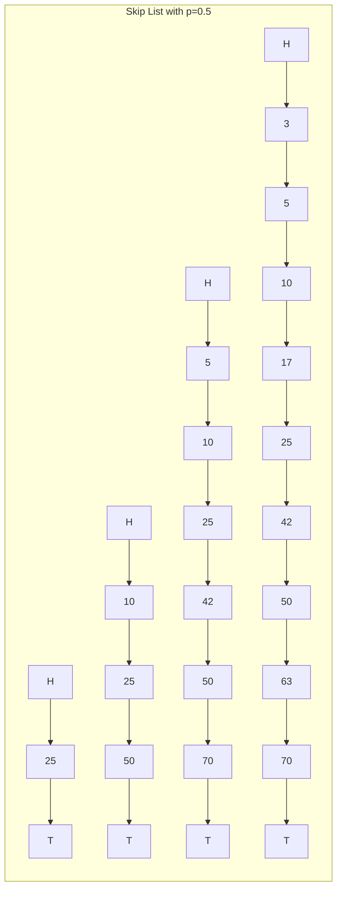

# Skip Lists — Probabilistic Balanced Order

**Date:** 2026-04-25 | **Updated:** 2026-04-25
**Tags:** `system-design` `data-structures` `ordered` `probabilistic`

## Table of Contents

- [Summary](#summary)
- [Overview](#overview)
- [Key Concepts](#key-concepts)
  - [Multi-Level Linked List Structure](#multi-level-linked-list-structure)
  - [Level Promotion — The Coin Flip](#level-promotion--the-coin-flip)
  - [Search Path](#search-path)
  - [Insertion](#insertion)
  - [Deletion](#deletion)
  - [Range Queries](#range-queries)
  - [Lock-Free Skip Lists](#lock-free-skip-lists)
- [Trade-offs vs Balanced BST and B-tree](#trade-offs-vs-balanced-bst-and-b-tree)
- [Code Examples — A Working Python Skip List](#code-examples--a-working-python-skip-list)
- [Real-World Uses](#real-world-uses)
  - [Redis Sorted Sets — ZADD, ZRANGE, ZRANGEBYSCORE](#redis-sorted-sets--zadd-zrange-zrangebyscore)
  - [LevelDB and RocksDB — Memtable](#leveldb-and-rocksdb--memtable)
  - [Java ConcurrentSkipListMap and ConcurrentSkipListSet](#java-concurrentskiplistmap-and-concurrentskiplistset)
  - [Lucene and Other Indexed Stores](#lucene-and-other-indexed-stores)
- [Anti-Patterns](#anti-patterns)
- [Related](#related)
- [References](#references)

## Summary

A **skip list** is a probabilistic ordered data structure introduced by **William Pugh in 1990** as a simpler alternative to balanced binary search trees. It is a multi-level linked list where each node decides its height by flipping a biased coin: with probability `p` (commonly `1/2` or `1/4`), a node also exists at the next higher level. Search, insert, and delete all run in **expected O(log n)** time, with constant factors usually better than red-black trees and AVL trees because the structure is just linked lists — cache-friendly traversal, no rotations, no rebalancing. Skip lists are the chosen data structure for **Redis sorted sets** (`ZADD` / `ZRANGE`), the **memtable** in LevelDB and RocksDB, and Java's **`ConcurrentSkipListMap`**, where lock-free implementations make them friendlier to concurrent writers than tree structures. This doc covers the core algorithm, the coin-flip mechanics, range queries, lock-free variants, and the production systems that depend on them.

## Overview

Most programmers reach for a **balanced BST** (red-black tree, AVL tree) when they need ordered storage with logarithmic search. Pugh's 1990 paper observed that all the complexity of those trees — rotations, recoloring, sentinel nodes, parent pointers — exists to enforce a hard balance invariant. If you accept a *probabilistic* balance instead, you can replace the entire mechanism with a stack of linked lists and a random number generator.

The result is a structure that:

- Is **simpler to implement correctly** than a red-black tree (typically 1/3 the lines of code).
- Has **expected** O(log n) search, insert, delete, with high probability bounds tight enough to use in production.
- Is **inherently sorted** — iteration in order is just walking the bottom-level linked list.
- Supports **range queries naturally** — every level is sorted, so `ZRANGEBYSCORE` is a single search plus a sequential walk.
- Is **easier to make lock-free** than tree structures, because there is no rotation operation to coordinate across many nodes.

The trade-off is that worst-case behavior is not guaranteed — a sufficiently unlucky sequence of coin flips can degrade a skip list to O(n). In practice, with `n = 2^32` and `p = 1/4`, the probability of any operation taking more than `3 log_4 n ≈ 48` levels is astronomically small. Production systems live comfortably with this.



The bottom level (level 0) contains every element in sorted order. Each upper level is a random sub-sequence — roughly half the elements at level 1, a quarter at level 2, and so on. Search drops down whenever the next pointer at the current level overshoots the target, so the path looks like a staircase descending the levels.

## Key Concepts

### Multi-Level Linked List Structure

A skip list is a tower. Each node has:

- A **key** (and usually a payload value).
- A **height** `h ≥ 1`, chosen randomly at insertion time.
- An array of `h` **forward pointers**, one per level. Level `i` points to the next node at level `i` or higher.

A header node sits at the leftmost position with the maximum allowed height. A sentinel tail (or `nil`) sits at the right.

The crucial invariant: **at every level, nodes appear in sorted order**. There is no other structural rule. No balance factor, no color, no parent pointer, no rotation. Levels are independent linked lists that share node memory.

### Level Promotion — The Coin Flip

When inserting a node, decide its height by independent coin flips:

```pseudocode
function randomLevel(p, maxLevel):
  level = 1
  while random() < p AND level < maxLevel:
    level = level + 1
  return level
```

With `p = 0.5`, the expected number of nodes at level `i` is `n * (1/2)^(i-1)`. Roughly half exist at level 1, a quarter at level 2, etc. Expected total height is `log_2 n`.

With `p = 0.25` (Redis's choice), towers are taller and skinnier — fewer nodes per level, more levels overall, but each search step skips farther on average. Pugh's analysis shows `p = 1/e ≈ 0.37` minimizes the average search-time-vs-space product, but the practical difference between `p ∈ [0.25, 0.5]` is small. Redis picks `0.25` because it reduces space (each upper-level pointer is 8–16 bytes; fewer of them helps).

The cap `maxLevel` (typically `32` or `64`) is set so that `(1/p)^maxLevel >> n` for any expected dataset. Redis uses `ZSKIPLIST_MAXLEVEL = 32` with `p = 0.25`, which supports `4^32 = 2^64` elements — far beyond any realistic sorted set.

### Search Path

Searching for key `k` starts at the **top-left**: the highest level of the header. At each step, walk forward as long as the next node's key is `< k`. When the next node's key is `≥ k` (or the level ends at the tail sentinel), drop down a level. Repeat until level 0. The node found at level 0 is the predecessor; check whether the next node is exactly `k`.

```pseudocode
function search(skiplist, k):
  x = skiplist.header
  for i from skiplist.maxLevel down to 0:
    while x.forward[i] != nil AND x.forward[i].key < k:
      x = x.forward[i]
  x = x.forward[0]
  if x != nil AND x.key == k:
    return x.value
  return NOT_FOUND
```

The expected number of steps is `O(log n)` — at each level, the expected number of forward jumps before dropping is `1/p`, and there are `log_{1/p}(n)` levels. With `p = 0.5` that is roughly `2 log_2 n` comparisons; with `p = 0.25`, `4 log_4 n = 2 log_2 n` — the same total work, achieved by fewer-but-bigger steps.

### Insertion

Insertion is search plus splicing:

1. Walk the search path, recording the **last node at each level** before the drop. This array is called the **update vector** — at each level `i`, `update[i]` is the node whose forward[i] pointer will need rewriting.
2. Roll a random level for the new node.
3. If the new level exceeds the current top level, extend the update vector with the header.
4. For each level from 0 up to the new node's height: set `newNode.forward[i] = update[i].forward[i]` and `update[i].forward[i] = newNode`.

There are no rotations, no rebalancing cascades, no parent pointers to fix up. Insertion touches at most `h` nodes, where `h` is the new node's height. Expected work is `O(log n)`.

### Deletion

Deletion is the mirror: find the node via the same search, recording the update vector. For each level from 0 up to the deleted node's height, set `update[i].forward[i] = deletedNode.forward[i]`. Free the node. If the deletion removes the only node at the top levels, optionally shrink the active level to save iteration time later.

No global rebalance. The structure remains probabilistically balanced by construction.

### Range Queries

This is where skip lists shine. To return all keys in `[a, b]`:

1. Search for `a` to find its predecessor in `O(log n)`.
2. Walk forward at level 0 until the key exceeds `b`. This is `O(k)` where `k` is the number of keys returned.

Total: `O(log n + k)`. Compare to a B-tree, which can do the same but with more pointer indirection per step. Compare to a hash table, which cannot do range queries at all without a separate sorted index.

Redis's `ZRANGE`, `ZRANGEBYSCORE`, `ZRANGEBYLEX`, `ZREVRANGEBYSCORE`, and rank-based `ZRANGE` (with `LIMIT offset count`) are all built on this property. The skip list nodes in Redis additionally store **span counts** at each level — the number of nodes skipped by each forward pointer — so that **rank-by-position** queries (`ZRANK`, `ZRANGE 0 -1`) also run in `O(log n)`.

### Lock-Free Skip Lists

Concurrent skip lists are dramatically simpler than concurrent balanced trees because there is **no rotation**. The only structural mutations are pointer-CAS operations on linked lists.

The standard lock-free design is **Harris-Michael (2001)**, which solves the linked-list deletion problem (the "marked node" technique) and lifts naturally to multi-level skip lists:

- **Insertion** uses CAS to splice level by level, bottom up. The node is "logically inserted" the moment level 0 succeeds; upper-level inserts can fail and retry without losing correctness.
- **Deletion** uses a two-step protocol: first **mark** the node as logically deleted by CAS-ing a tombstone bit on its forward pointers, then **physically unlink** it level by level. Other threads encountering a marked node help complete its deletion before continuing.
- **Search** is wait-free: it is just pointer reads. If it lands on a marked node, it advances past it.

Java's `ConcurrentSkipListMap` (Doug Lea, since Java 1.6) is the canonical production implementation. It uses CAS on `Node.next` references and a separate `Index` class for upper levels, with helping behavior so that any thread can complete any in-flight operation. It provides `O(log n)` expected `get`, `put`, `remove`, full `NavigableMap` semantics, and **strong progress guarantees** under contention — properties that are extremely hard to achieve with concurrent red-black trees.

## Trade-offs vs Balanced BST and B-tree

| Aspect | Skip List | Red-Black / AVL Tree | B-tree (B+ tree) |
|--------|-----------|----------------------|------------------|
| Search / insert / delete | Expected `O(log n)` | Worst-case `O(log n)` | Worst-case `O(log_B n)` |
| Worst-case bound | Probabilistic only | Deterministic | Deterministic |
| Implementation complexity | Low | High (rotations, colors) | Medium-high |
| In-order iteration | Trivial — walk level 0 | Stack-based traversal | Walk leaf-level chain |
| Range queries | Excellent (`O(log n + k)`) | Good (`O(log n + k)`) | Excellent (`O(log_B n + k)`) |
| Cache locality | Poor (linked list, scattered nodes) | Poor (scattered nodes) | Excellent (large blocks) |
| Disk / SSD friendliness | Bad (per-node IO) | Bad | Designed for it |
| Concurrent modification | Lock-free is straightforward (Harris-Michael) | Lock-free is very hard | Lock coupling, B-link trees |
| Memory per element | Higher — average `1 / (1-p)` pointers | 2 children + color + parent | Block overhead amortized |
| Pointer count avg (`p=0.5`) | `2` | `2` (+ parent) | Block-internal arrays |
| Rebalancing on write | None | Rotations | Splits / merges |
| Determinism for testing | Hard (RNG state) | Easy | Easy |

**When to pick a skip list:**

- **In-memory ordered map with concurrent writers.** Lock-free skip lists beat lock-coupled BSTs under contention. This is exactly Java's `ConcurrentSkipListMap` and Redis's single-threaded use of skip lists for sorted sets.
- **Memtable for an LSM tree.** Inserts are constant-time at level 0 plus a few upper-level updates, in-order flush to SSTable is trivial.
- **You want simple code.** A skip list fits in 200 lines; a production red-black tree easily takes 1000.

**When to pick a balanced BST:**

- **Worst-case latency matters.** Hard real-time, kernel data structures, anything with adversarial input. A skip list's RNG can be attacked or simply unlucky.
- **You need parent pointers / order statistics already, and you have a clean single-threaded use case.**

**When to pick a B-tree:**

- **The data lives on disk or SSD.** Skip lists are pointer-heavy and cache-unfriendly; B-trees pack many keys per IO unit.
- **You need range queries over very large datasets.** Postgres, MySQL, SQLite all use B+ trees for indexes — see [postgresql-architecture.md](../../database/internals/postgresql-architecture.md) and the [system design data-store overview](./consistent-and-rendezvous-hashing.md).

## Code Examples — A Working Python Skip List

A complete, idiomatic Python skip list — insert, search, delete, in-order iteration, and range queries:

```python
import random
from typing import Optional, Iterator

class _Node:
    __slots__ = ("key", "value", "forward")

    def __init__(self, key, value, level: int):
        self.key = key
        self.value = value
        # forward[i] is the next node at level i
        self.forward: list[Optional["_Node"]] = [None] * level


class SkipList:
    def __init__(self, max_level: int = 32, p: float = 0.25):
        if not 0 < p < 1:
            raise ValueError("p must be in (0, 1)")
        self.max_level = max_level
        self.p = p
        self.level = 1  # current highest occupied level
        # header is a sentinel with the maximum height
        self.header = _Node(None, None, max_level)
        self.size = 0

    def _random_level(self) -> int:
        lvl = 1
        while random.random() < self.p and lvl < self.max_level:
            lvl += 1
        return lvl

    def search(self, key) -> Optional[object]:
        x = self.header
        for i in range(self.level - 1, -1, -1):
            while x.forward[i] is not None and x.forward[i].key < key:
                x = x.forward[i]
        x = x.forward[0]
        if x is not None and x.key == key:
            return x.value
        return None

    def insert(self, key, value) -> None:
        update = [self.header] * self.max_level
        x = self.header
        for i in range(self.level - 1, -1, -1):
            while x.forward[i] is not None and x.forward[i].key < key:
                x = x.forward[i]
            update[i] = x

        # if the key exists, update value in place (no structural change)
        candidate = x.forward[0]
        if candidate is not None and candidate.key == key:
            candidate.value = value
            return

        new_level = self._random_level()
        if new_level > self.level:
            for i in range(self.level, new_level):
                update[i] = self.header
            self.level = new_level

        node = _Node(key, value, new_level)
        for i in range(new_level):
            node.forward[i] = update[i].forward[i]
            update[i].forward[i] = node
        self.size += 1

    def delete(self, key) -> bool:
        update = [self.header] * self.max_level
        x = self.header
        for i in range(self.level - 1, -1, -1):
            while x.forward[i] is not None and x.forward[i].key < key:
                x = x.forward[i]
            update[i] = x

        target = x.forward[0]
        if target is None or target.key != key:
            return False

        for i in range(self.level):
            if update[i].forward[i] is not target:
                break
            update[i].forward[i] = target.forward[i]

        # shrink active level if top levels are now empty
        while self.level > 1 and self.header.forward[self.level - 1] is None:
            self.level -= 1
        self.size -= 1
        return True

    def __iter__(self) -> Iterator[tuple]:
        x = self.header.forward[0]
        while x is not None:
            yield x.key, x.value
            x = x.forward[0]

    def range(self, low, high) -> Iterator[tuple]:
        """Yield (key, value) pairs with low <= key <= high in order."""
        x = self.header
        for i in range(self.level - 1, -1, -1):
            while x.forward[i] is not None and x.forward[i].key < low:
                x = x.forward[i]
        x = x.forward[0]
        while x is not None and x.key <= high:
            yield x.key, x.value
            x = x.forward[0]

    def __len__(self) -> int:
        return self.size


# Example
if __name__ == "__main__":
    sl = SkipList()
    for score, member in [(50, "a"), (10, "b"), (25, "c"), (80, "d"), (30, "e")]:
        sl.insert(score, member)

    print(list(sl))                  # sorted by score
    print(sl.search(25))             # 'c'
    print(list(sl.range(20, 60)))    # [(25, 'c'), (30, 'e'), (50, 'a')]
    sl.delete(25)
    print(sl.search(25))             # None
```

A few notes on production-grade implementations:

- **Determinism for tests:** seed the RNG. Real systems use a per-instance RNG so tests are reproducible.
- **Backward pointers:** for a doubly-linked level-0 chain you can iterate in reverse (Redis does this for `ZREVRANGE`).
- **Span counts:** Redis stores at each forward pointer the number of nodes that pointer skips; this enables O(log n) rank queries.
- **Comparator function:** for Redis sorted sets, the order is `(score ASC, member-string ASC)` — score is the primary key, member breaks ties.

## Real-World Uses

### Redis Sorted Sets — ZADD, ZRANGE, ZRANGEBYSCORE

Redis's `ZSET` is implemented as **two synchronized data structures**:

- A **dictionary** mapping `member -> score` for O(1) score lookups (`ZSCORE`).
- A **skip list** ordered by `(score, member)` for ordered queries (`ZRANGE`, `ZRANGEBYSCORE`, `ZRANK`).

Defined in `src/server.h`:

```c
#define ZSKIPLIST_MAXLEVEL 32   /* enough for 2^64 elements with p=1/4 */
#define ZSKIPLIST_P 0.25        /* skip list P = 1/4 */

typedef struct zskiplistNode {
    sds ele;
    double score;
    struct zskiplistNode *backward;
    struct zskiplistLevel {
        struct zskiplistNode *forward;
        unsigned long span;
    } level[];
} zskiplistNode;
```

The `span` field is the number of nodes the forward pointer skips (1 if it points to the immediate successor at level 0). This lets `ZRANK key member` and `ZRANGE key 0 9` run in `O(log n)` by accumulating spans during the search.

For very small sorted sets (`ZSET-MAX-LISTPACK-ENTRIES = 128`, default), Redis uses a **listpack** (a packed array) instead, switching to the skip-list-plus-dict only at the threshold. This is a pure constant-factor optimization for tiny sets.

Skip-list operations in Redis are a perfect match for its single-threaded execution model — no synchronization needed, the cache-unfriendliness of pointer-chasing is offset by the entire dataset living in RAM, and the same structure cleanly supports leaderboards, time-series-like data, rate limiting tokens, and priority queues. See [design-realtime-leaderboard.md](../case-studies/counting-ranking/design-realtime-leaderboard.md) for the canonical case study.

### LevelDB and RocksDB — Memtable

In an LSM-tree database (see [postgresql-architecture.md](../../database/internals/postgresql-architecture.md) for the contrast with B+ trees, and [design-key-value-store.md](../case-studies/distributed-infra/design-key-value-store.md) for the LSM design pattern), recent writes accumulate in an in-memory **memtable** before being flushed to disk as an immutable SSTable. The memtable must support:

- Fast in-order insertion (writes arrive in arbitrary key order).
- In-order iteration on flush (writes the SSTable in sorted key order without an extra sort).
- Concurrent reads and writes (writers append; readers and iterators traverse).

LevelDB's default memtable is a **skip list**, defined in `db/memtable.cc` and `db/skiplist.h`. RocksDB inherits this and offers `SkipListFactory` as the default plus alternatives (`HashSkipListRepFactory`, `VectorRepFactory`) for specialized workloads.

The skip list is ideal here because:

- **Single-writer, multi-reader concurrency** is achievable without locks. RocksDB's `InlineSkipList` uses atomic forward pointers; the writer publishes inserts via release-store on the level-0 pointer, and readers see consistent state via acquire-load. The structure is **lock-free for readers**.
- **Sorted iteration is just a level-0 walk**, so flushing a memtable to an SSTable is a linear scan.
- **No rotations** means inserts have predictable, bounded cost — important for write latency.

When the memtable hits its size threshold (default 64 MB), it becomes immutable and a new memtable is allocated. The immutable memtable is flushed to disk, freed, and the cycle continues.

### Java ConcurrentSkipListMap and ConcurrentSkipListSet

`java.util.concurrent.ConcurrentSkipListMap<K, V>` is the JDK's lock-free ordered map. From its Javadoc: "expected average log(n) time cost for the `containsKey`, `get`, `put`, and `remove` operations and their variants. Insertion, removal, update, and access operations safely execute concurrently by multiple threads."

It implements `ConcurrentNavigableMap`, providing:

- All `NavigableMap` operations: `firstKey`, `lastKey`, `floorEntry`, `ceilingEntry`, `headMap`, `tailMap`, `subMap`.
- **Weakly consistent iterators** — they reflect the state at some point during iteration, never throw `ConcurrentModificationException`.
- **Atomic compound operations** — `putIfAbsent`, `replace(k, oldV, newV)`, `compute`, `merge` — all CAS-based.

The internal design uses Doug Lea's variant of Harris-Michael:

- **`Node` class** holds the key, value, and a `next` pointer at level 0.
- **`Index` class** is the upper-level skeleton — each `Index` references a `Node` and has its own `right` and `down` pointers.
- The base level is a single linked list of `Node`s. Upper levels are linked lists of `Index` objects.
- All updates go through `VarHandle` CAS. Deletion uses the marked-pointer technique: the value field is CAS'd to `null` (logical deletion), then a separate cleanup step unlinks the node.

`ConcurrentSkipListSet<E>` is just a `ConcurrentSkipListMap<E, Boolean>` wrapper. Use these whenever you need a sorted concurrent collection — `Collections.synchronizedSortedMap(new TreeMap<>())` is markedly worse under contention.

### Lucene and Other Indexed Stores

Lucene's posting lists historically used **skip lists** (the `MultiLevelSkipListReader` / `MultiLevelSkipListWriter` API) to accelerate `advance(target)` operations during conjunctive query evaluation. When intersecting two posting lists, you don't want to walk every entry — you want to jump ahead to the next document ID that could possibly be in both. The skip list structure embedded into the posting list lets `advance` run in `O(log n)` over the segment.

Modern Lucene codecs (Lucene 9+) use slightly different on-disk skip structures, but the conceptual lineage is the same. Other systems that use skip-list-style indexes:

- **MemSQL / SingleStore** — skip lists in row-store indexes for low-latency point queries.
- **Apache Cassandra's memtable** — historically a skip list (now `TrieMemtable` is the default).
- **Tarantool** — provides skip-list indexes alongside trees and hashes.

## Anti-Patterns

- **Using a skip list when worst-case bounds matter.** Hard-real-time systems, kernels, and adversarial environments should not rely on a randomized data structure. Use a red-black tree or AVL tree.
- **Persisting a skip list to disk as the primary on-disk index.** Pointer-heavy linked lists are an extremely poor fit for block-based storage. Use a B+ tree or LSM tree. (LevelDB's skip list is the in-memory tier; the on-disk tier is sorted run files.)
- **Using a skip list when a simple sorted array suffices.** For small, mostly-static data (a few thousand entries with rare updates), a sorted array with binary search beats a skip list on every metric — memory, cache locality, and latency. Profile before reaching for a fancy structure.
- **Using `p = 0.5` everywhere.** It is a fine default but not the only choice. For wide, write-heavy structures (memtables), `p = 0.25` cuts pointer overhead by half with negligible search-time impact. Match `p` to your read/write/space trade-off.
- **Implementing your own concurrent skip list.** The lock-free protocol is subtle (mark-then-unlink, helping, ABA via generation counters). Use `ConcurrentSkipListMap`, RocksDB's `InlineSkipList`, or Folly's `ConcurrentSkipList` — battle-tested implementations exist; do not write your own.
- **Forgetting to seed the RNG in tests.** A skip list's behavior depends on RNG state. If you don't seed it, your tests will be nondeterministic and you will chase phantom bugs.
- **Picking a `MAXLEVEL` too low.** If you cap levels at 8 in a structure that ends up holding 10 million entries, the upper levels can no longer skip enough nodes and search degrades toward the bottom-list walk. Set `MAXLEVEL` so `(1/p)^MAXLEVEL >> n_max`. Redis's choice (`32, p=0.25`) accommodates `2^64`; you almost never need more.
- **Mixing reads and writes in a non-thread-safe skip list across threads.** A textbook skip list is *not* thread-safe. If you have concurrent writers, use the lock-free variant or wrap in a lock.

## Related

- [Consistent and Rendezvous Hashing](./consistent-and-rendezvous-hashing.md) — a different probabilistic structure used for partitioning rather than ordering; useful comparison of when randomization helps in distributed systems
- [Design a Real-Time Leaderboard](../case-studies/counting-ranking/design-realtime-leaderboard.md) — Redis sorted sets (skip list backed) are the canonical leaderboard implementation; rank, score, and range queries straight from the data structure
- [Design a Distributed Key-Value Store](../case-studies/distributed-infra/design-key-value-store.md) — LSM-tree storage engines use skip lists as the memtable; this case study shows where the skip list sits in the larger architecture
- [Consensus — Raft and Paxos](../data-consistency/consensus-raft-and-paxos.md) — replicated logs are typically backed by ordered structures; skip-list-style data structures appear in the in-memory layer of many consensus implementations
- [PostgreSQL Architecture](../../database/internals/postgresql-architecture.md) — contrasts B+ tree on-disk indexes with the in-memory ordered structures used elsewhere

## References

- William Pugh, ["Skip Lists: A Probabilistic Alternative to Balanced Trees" (CACM 1990)](https://www.epaperpress.com/sortsearch/download/skiplist.pdf) — the original paper; remarkably readable and the entire algorithm fits in a few pages
- William Pugh, ["A Skip List Cookbook" (1989, U. Maryland)](https://15721.courses.cs.cmu.edu/spring2018/papers/08-oltpindexes1/pugh-skiplists-cacm1990.pdf) — Pugh's longer technical report covering variants, deletion, concurrent versions, and analysis
- [Redis source — `t_zset.c` and `server.h`](https://github.com/redis/redis/blob/unstable/src/t_zset.c) — the production skip list backing `ZSET`; `ZSKIPLIST_MAXLEVEL = 32`, `ZSKIPLIST_P = 0.25`, plus span-count rank queries
- [Redis Sorted Sets documentation](https://redis.io/docs/latest/develop/data-types/sorted-sets/) — user-facing semantics of `ZADD`, `ZRANGE`, `ZRANGEBYSCORE`, `ZRANK`
- [RocksDB Wiki — MemTable](https://github.com/facebook/rocksdb/wiki/MemTable) — the default `SkipListFactory` and alternative memtable implementations
- [LevelDB source — `db/skiplist.h`](https://github.com/google/leveldb/blob/main/db/skiplist.h) — the original Google skip list used as a memtable; carefully commented and a great reference implementation
- [Java `ConcurrentSkipListMap` Javadoc](https://docs.oracle.com/en/java/javase/21/docs/api/java.base/java/util/concurrent/ConcurrentSkipListMap.html) — the contract Doug Lea's lock-free implementation provides
- Timothy Harris, ["A Pragmatic Implementation of Non-Blocking Linked-Lists" (DISC 2001)](https://timharris.uk/papers/2001-disc.pdf) — the marked-pointer deletion technique that underpins lock-free skip lists
- Maged Michael, ["High Performance Dynamic Lock-Free Hash Tables and List-Based Sets" (SPAA 2002)](https://www.cs.tau.ac.il/~shanir/concurrent-data-structures.pdf) — Harris-Michael lock-free linked list and its extensions
- Keir Fraser, ["Practical Lock-Freedom" (PhD thesis, Cambridge 2004)](https://www.cl.cam.ac.uk/techreports/UCAM-CL-TR-579.pdf) — comprehensive treatment of lock-free skip lists, hash tables, and trees with practical code
