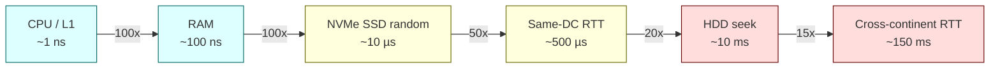
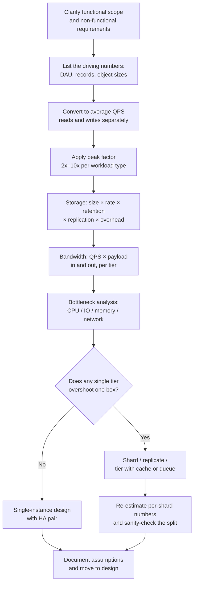

# Back-of-Envelope Estimation — Latency Numbers, QPS Math, and Capacity Planning

**Date:** 2026-04-24 | **Updated:** 2026-04-24
**Tags:** `system-design` `foundations` `capacity-planning` `latency` `estimation`

## Table of Contents

- [Summary](#summary)
- [Why Estimation Matters](#why-estimation-matters)
- [The Latency Numbers You Must Memorize](#the-latency-numbers-you-must-memorize)
  - [Canonical Table (modernized)](#canonical-table-modernized)
  - [Reading the table as orders of magnitude](#reading-the-table-as-orders-of-magnitude)
  - [Relative latency diagram](#relative-latency-diagram)
- [Unit Conversions You Should Not Look Up](#unit-conversions-you-should-not-look-up)
  - [Powers of 2 vs powers of 10](#powers-of-2-vs-powers-of-10)
  - [Time, bytes, and a few derived units](#time-bytes-and-a-few-derived-units)
- [QPS, Storage, and Bandwidth Math](#qps-storage-and-bandwidth-math)
  - [From DAU to QPS](#from-dau-to-qps)
  - [Peak-to-average and the 10x rule](#peak-to-average-and-the-10x-rule)
  - [Storage: payload × rate × retention × replication](#storage-payload--rate--retention--replication)
  - [Bandwidth: payload × QPS](#bandwidth-payload--qps)
  - [Sizing servers: CPU-bound vs IO-bound](#sizing-servers-cpu-bound-vs-io-bound)
- [Worked Examples](#worked-examples)
  - [1. Twitter-scale timeline storage and write throughput](#1-twitter-scale-timeline-storage-and-write-throughput)
  - [2. Sizing a Redis cache for 1M active users](#2-sizing-a-redis-cache-for-1m-active-users)
  - [3. Sizing a Kafka cluster for a click-stream](#3-sizing-a-kafka-cluster-for-a-click-stream)
  - [4. How many application servers do I need?](#4-how-many-application-servers-do-i-need)
- [Common Traps](#common-traps)
- [The Estimation Workflow](#the-estimation-workflow)
- [Cheatsheet](#cheatsheet)
- [Related](#related)
- [References](#references)

## Summary

Back-of-envelope estimation is the act of converting vague requirements ("we have ~100M users") into concrete numbers ("we need ~12k write QPS at peak, 18 TB/year of storage, and a 96 GB Redis cluster") in under five minutes using memorized latency figures, power-of-two arithmetic, and a small set of formulas. The point is not precision — it is catching an order-of-magnitude mismatch before you commit to a design. Good estimates tell you whether the answer is "one Postgres box" or "a sharded cluster with Kafka in front," and that alone is worth the whole exercise.

## Why Estimation Matters

Estimation is the bridge between "what is the product" and "what is the architecture." You do it three times:

- **At design time** — to pick storage engines, replication strategies, and cache sizes. If the working set fits in RAM, the design is different from one where it doesn't.
- **At interview time** — to demonstrate you can reason about scale instead of pattern-match on diagrams. Interviewers do not care about the exact number; they care that you noticed the system has a 3 orders-of-magnitude asymmetry between reads and writes.
- **At capacity-planning time** — Google SRE formalized this: forecast demand, translate it into resource requirements, and load-test against it. See the SRE book's "Software Engineering in SRE" and "Managing Critical State" chapters.

If you skip estimation you end up arguing about Kafka vs RabbitMQ when the actual throughput is 80 QPS and any of them is fine. Or the opposite: confidently drawing one Postgres box for a write pattern that will melt a single instance.

## The Latency Numbers You Must Memorize

These are the "Numbers Everyone Should Know" originally collected by Jeff Dean and popularized by Peter Norvig; Colin Scott later extrapolated them through 2020. The **absolute** numbers shift each generation, but the **ratios** have been stable for 15+ years and are what you reason with.

### Canonical Table (modernized)

| Operation                                           | Time         | In nanoseconds | Relative to L1     |
| --------------------------------------------------- | ------------ | -------------: | ------------------ |
| L1 cache reference                                  | 0.5 ns       |            0.5 | 1x                 |
| Branch mispredict                                   | 3 ns         |              3 | 6x                 |
| L2 cache reference                                  | 4 ns         |              4 | 8x                 |
| Mutex lock/unlock                                   | 17 ns        |             17 | ~30x               |
| Main memory reference (DRAM)                        | 100 ns       |            100 | 200x               |
| Compress 1 KB with Zippy/Snappy                     | 2,000 ns     |          2 µs  | 4,000x             |
| Send 1 KB over 1 Gbps network                       | 10,000 ns    |         10 µs  | 20,000x            |
| Read 1 MB sequentially from main memory             | 3,000 ns     |          3 µs  | 6,000x             |
| Read 4 KB randomly from NVMe SSD                    | ~16,000 ns   |         16 µs  | ~32,000x           |
| Round-trip within the same datacenter               | 500,000 ns   |        500 µs  | 1,000,000x         |
| Read 1 MB sequentially from NVMe SSD                | ~1,000,000 ns|          1 ms  | 2,000,000x         |
| Read 1 MB sequentially from main memory             | 250,000 ns   |        250 µs  | 500,000x           |
| Disk seek (spinning rust, legacy only)              | 10,000,000 ns|         10 ms  | 20,000,000x        |
| Read 1 MB sequentially from HDD                     | 20,000,000 ns|         20 ms  | 40,000,000x        |
| Packet round-trip CA ↔ Netherlands                  | 150,000,000 ns|       150 ms  | 300,000,000x       |

**Things that have changed since 2012:**

- Random SSD reads dropped from ~150 µs (SATA SSD) → ~16 µs (modern NVMe). If you're reasoning about Postgres/MySQL random I/O, use NVMe numbers unless you know you're on HDD.
- Intra-DC network went from 1 Gbps standard to 10–100 Gbps in large clouds, so the "send 1 KB" line is often ~1 µs now on fat pipes.
- Main memory and CPU cache numbers are essentially unchanged.

**Things that have not changed and never will:**

- **Cross-continent RTT is ~150 ms.** It's the speed of light in fiber, plus routing overhead. No amount of money fixes it.
- **Same-DC RTT is ~0.5 ms.** Again, a physics floor, not a technology limit.
- **Disk seek is 10 ms.** If someone says "just put it on disk" and they mean HDD, raise an eyebrow.

### Reading the table as orders of magnitude

The numbers are not meant to be precise. Round them to useful landmarks:

```text
L1               ~1 ns
RAM              ~100 ns   (100x L1)
SSD random read  ~10 µs    (100x RAM)
Same-DC RTT      ~500 µs   (50x SSD)
Disk seek (HDD)  ~10 ms    (20x same-DC RTT)
Cross-region RTT ~100 ms   (10x disk seek, 200x same-DC)
```

Now you can answer questions like "is it worth caching this DB query in Redis?" in your head: DB query inside a DC is 500 µs+, Redis in same DC is ~500 µs, local in-process cache is ~100 ns. Redis saves you the *database work* and the *lock contention*, not the network round-trip.

### Relative latency diagram



Read left-to-right: every hop is ~1–2 orders of magnitude slower than the last. Designs that cross the "same-DC RTT" boundary on the hot path pay 1,000x over staying in memory.

## Unit Conversions You Should Not Look Up

### Powers of 2 vs powers of 10

Storage vendors use base-10 (1 GB = 10^9 bytes). Programmers use base-2 (1 GiB = 2^30 bytes). For back-of-envelope work, treat them as equal — the 7% error is noise compared to the assumptions you made upstream.

| Power of 2 | Value         | Nickname    | Storage equivalent |
| ---------: | ------------: | ----------- | ------------------ |
| 2^10       | 1,024         | 1K          | 1 KB ≈ 10^3        |
| 2^20       | ~1.05 million | 1M          | 1 MB ≈ 10^6        |
| 2^30       | ~1.07 billion | 1B          | 1 GB ≈ 10^9        |
| 2^32       | ~4.3 billion  | 4B          | addresses in IPv4  |
| 2^40       | ~1.1 trillion | 1T          | 1 TB ≈ 10^12       |
| 2^50       | ~1.1 quadrillion | 1 quadr. | 1 PB ≈ 10^15       |

**Rule of thumb:** when in doubt, use 10^x. When you need network/addressing answers (port ranges, IP space, hash ranges, UUID collisions), use 2^x.

### Time, bytes, and a few derived units

```text
1 day  = 86,400 seconds  (round to 10^5 for quick QPS math)
1 year = ~31.5 million seconds ≈ 3.15 × 10^7
1 month ≈ 2.6 × 10^6 seconds
```

For network:

```text
1 Gbps = 10^9 bits/s ≈ 125 MB/s  (divide by 8, round down)
10 Gbps ≈ 1.25 GB/s
1 MB over 1 Gbps = 8 ms
```

Memorize **1 Gbps ≈ 125 MB/s**. This shows up in every bandwidth calculation.

## QPS, Storage, and Bandwidth Math

### From DAU to QPS

The canonical flow is: **DAU → actions/user/day → total actions/day → QPS → peak QPS**.

```python
# Pseudocode
dau = 100_000_000          # 100M daily active users
writes_per_user_per_day = 2
reads_per_user_per_day = 100  # read-heavy

total_writes_per_day = dau * writes_per_user_per_day   # 200M
total_reads_per_day = dau * reads_per_user_per_day     # 10B

seconds_per_day = 86_400  # ~10^5

avg_write_qps = total_writes_per_day / seconds_per_day  # ~2.3k
avg_read_qps = total_reads_per_day / seconds_per_day    # ~116k
```

Shortcut: **1M requests/day ≈ 12 average QPS.** Memorize this; it lets you skip the division.

### Peak-to-average and the 10x rule

Traffic is not uniform. Most consumer traffic hits a diurnal peak of 2–3x average, with spiky workloads (flash sales, live events, viral content) reaching 10x+. Capacity plan for **peak**, not average:

```text
peak_qps = avg_qps * peak_factor   # use 2x for steady B2B, 5–10x for consumer
```

If you forget this and size for average, you'll hit capacity at lunchtime on day one.

### Storage: payload × rate × retention × replication

```text
storage = new_records_per_second
        × bytes_per_record
        × seconds_in_retention_window
        × replication_factor
        × (1 + overhead)
```

Overhead is real: indexes (+30–100%), WAL (+10–30%), backups, compaction headroom. A quick **×2 fudge factor on raw size** is usually safer than pretending indexes are free.

Example — 500 writes/s of 1 KB records, 1 year retention, 3x replication:

```text
500 × 1 KB × 3.15e7 s × 3 = 4.7 × 10^13 bytes ≈ 47 TB raw
With 2x overhead: ~95 TB usable capacity needed
```

### Bandwidth: payload × QPS

```text
bytes_per_second = qps * avg_response_bytes
bits_per_second  = bytes_per_second * 8
```

Example — 50k read QPS of 50 KB JSON responses:

```text
50_000 * 50_000 B = 2.5 GB/s out = 20 Gbps
```

That is non-trivial egress — you'll care about CDN offload, response compression, and egress pricing (often the single biggest cloud bill item after EC2).

### Sizing servers: CPU-bound vs IO-bound

The number of servers you need depends on **per-instance throughput**, which depends on whether the bottleneck is CPU, memory, or I/O:

- **CPU-bound** (image resizing, JSON serialization at scale, template rendering): throughput ≈ `cores × requests_per_core_second`. Rule of thumb: a modern core handles 1k–5k simple JSON requests/s. Assume ~2k/core for planning unless you've measured.
- **IO-bound** (DB-backed CRUD, proxying, RPC aggregation): throughput is governed by **concurrency × 1/latency**. If each request waits 50 ms on the DB, one thread handles 20 QPS. With 200 async concurrent requests per instance, that's 4k QPS per box — but only if the DB can keep up.
- **Memory-bound** (in-memory cache, in-process vector search): throughput is effectively infinite until you run out of working-set RAM, then it collapses when you start evicting.

Always name the bottleneck before you count servers. "We need 50 boxes" is not an answer; "we need 50 boxes because each one can saturate a 10 Gbps NIC serving 10 KB responses at ~120k QPS" is.

## Worked Examples

### 1. Twitter-scale timeline storage and write throughput

**Assumptions:** 500M DAU, each user posts on average 1 tweet/day (many post zero, some post hundreds — average dominated by power users). Each tweet averages 280 chars ≈ 280 bytes plus 200 bytes of metadata (IDs, timestamps, indices) ≈ 500 bytes per tweet row.

**Writes:**

```text
500M tweets/day ÷ 86_400 s ≈ 5,800 avg write QPS
Peak (3x): ~17k write QPS
```

17k write QPS against a single Postgres master is aggressive (probably fine with good hardware and tuning) but routine with partitioning or a purpose-built store.

**Storage (single-copy, no indexes, 5 years):**

```text
500M × 500 B × 365 × 5 = 456 TB
With 3x replication: ~1.4 PB
With indexes + WAL + backups (~2x): ~3 PB
```

That is "you need a sharded cluster" territory, not "one big box."

**Read fan-out — the interesting part:** Twitter reads ≫ writes. If each user reads 100 tweets/day, that's 50B reads/day ≈ **580k avg read QPS, ~5.8M peak QPS.** This is why Twitter precomputes timelines (fan-out on write) for most users and computes on read for celebrities — the asymmetry makes "just query by user_id" impossible.

### 2. Sizing a Redis cache for 1M active users

**Assumptions:** Cache user session + profile + feature flags, ~10 KB per user. 1M active users, 10% buffer for index overhead and fragmentation.

```text
raw     = 1_000_000 × 10 KB = 10 GB
with ~30% Redis overhead (rehash tables, pointers): ~13 GB
round up for headroom: 16 GB
```

**One r6g.xlarge (26 GB) fits fine.** Add a replica for failover (16 GB × 2 nodes). If you need to grow 10x, Redis Cluster with 4–6 shards handles 160 GB of working set comfortably.

**What you should also estimate:** QPS against the cache. If each page view hits Redis 10x and you peak at 5k page views/s, that's **50k ops/s** — well within a single r6g.xlarge (~200k ops/s for GET/SET). So the cluster is sized by working set, not by ops.

### 3. Sizing a Kafka cluster for a click-stream

**Assumptions:** 10M DAU, ~200 events/user/day, 1 KB per event. Retention: 7 days.

**Throughput:**

```text
events/day = 10M × 200 = 2 × 10^9
events/s   = 2e9 / 86_400 ≈ 23k avg, ~70k peak
MB/s in    = 23k × 1 KB = 23 MB/s avg, ~70 MB/s peak
```

**Storage (ingress only, 7 days, replication factor 3):**

```text
2e9 events/day × 1 KB × 7 days × 3 RF = 42 TB
```

**Broker count:** modern Kafka brokers ingest 100+ MB/s each with good disk. You're nowhere near that. **Three brokers** handle throughput; storage drives the count — at 42 TB with standard 8 TB disks per broker and 70% utilization ceiling, you want ~7–8 brokers, or bigger disks. If consumers also read (they do — replication, analytics, ETL), factor in **fan-out read bandwidth** (each consumer group re-reads the whole stream).

Partition count: aim for ~10× the number of brokers as a starting point; revisit per-topic based on consumer parallelism needs.

### 4. How many application servers do I need?

**Scenario:** Java/Spring service serving REST. Expected 50k peak QPS, p99 latency target 200 ms, average response time 40 ms, mostly IO-bound on a downstream DB.

**Per-instance throughput:**

```text
Async with 400 concurrent in-flight requests per instance
(Reactor/Netty or virtual threads):
  throughput = 400 / 0.040 s = 10k QPS/instance
```

**Fleet:**

```text
50_000 / 10_000 = 5 instances minimum
Add headroom for deploys + failures: 8 instances
Across 2 AZs: 4 per AZ (tolerates one AZ loss with degraded latency)
```

Sanity-check the DB: if each request issues 3 queries, the DB must handle 150k QPS. That does *not* fit on one Postgres — now you're sharding or reaching for a read replica pool. **This is the whole point of the exercise — the app tier looks fine, the data tier doesn't, and you found that out in 90 seconds.**

## Common Traps

- **Off-by-order-of-magnitude.** The worst failure mode. Usually comes from a day/second mixup, a bits/bytes mixup, or forgetting a zero. Always write units, and always sanity-check against a landmark ("is this more than 1 GB/s? Then it probably doesn't fit on one NIC.").
- **Forgetting replication.** Raw size ≠ storage budget. 3x is standard for Kafka, Cassandra, and many HDFS-style systems. Postgres with one hot standby + one async = ~2x. S3 and GCS hide this but it's there (and it's on your bill).
- **Forgetting indexes and WAL.** B-tree indexes typically add 30–100% to a row-store's footprint; WAL adds another 10–30% steady-state; backups double it again. A "×2 on raw" rule of thumb is better than zero overhead.
- **Pretending traffic is uniform.** Day/night, weekday/weekend, product-launch spikes. Always multiply by a peak factor. If the product has any consumer element, 5–10x average is not unusual.
- **CPU-bound vs IO-bound confusion.** An async/reactive framework gives huge throughput on IO-bound work but exactly zero benefit on CPU-bound work. If you're resizing images, threads don't help — cores do.
- **Ignoring tail latency.** "Average latency is 20 ms" is useless. A system where p50 is 5 ms and p99 is 2 seconds behaves completely differently from one where p50 is 20 ms and p99 is 40 ms, even with the same average. See Google SRE's chapter on monitoring for how to think about this.
- **Cross-region RTT denial.** If your design has a synchronous hop from US-East to EU-West on the hot path, it already failed — that's 80–150 ms of floor, not something you can tune away.
- **Ignoring per-connection cost.** 1M concurrent WebSocket users is not the same as 1M QPS. You're bound by open sockets, kernel memory per connection, and NIC PPS, not request handling throughput.
- **Egress bandwidth pricing.** At scale, egress costs dominate cloud bills. 20 Gbps of steady egress is easy to design into existence and surprisingly expensive to pay for.

## The Estimation Workflow



Steps you must never skip:

1. **State assumptions out loud.** "I'm assuming 100M DAU, 5% concurrent, 3x peak" is a better answer than a number without context.
2. **Do reads and writes separately.** They almost never move together.
3. **Name the bottleneck per tier** (app, cache, DB, queue, network). A fleet-level QPS number that doesn't say which tier is the bottleneck is useless.
4. **Sanity-check against a landmark.** "Does this fit on one 100 Gbps NIC?" "Does this fit in RAM on one box?" If yes, the design is drastically simpler.

## Cheatsheet

```text
=========================================================
 LATENCY (round numbers)
=========================================================
L1 cache            ~1 ns
RAM                 ~100 ns     (100x L1)
NVMe random read    ~10 µs      (100x RAM)
Same-DC RTT         ~500 µs     (50x SSD)
HDD seek            ~10 ms      (20x DC RTT)
Cross-continent RTT ~100–150 ms (200–300x DC RTT)

=========================================================
 UNITS
=========================================================
1 day                = 86,400 s        (~10^5)
1 year               = 3.15 × 10^7 s
1 Gbps               = 125 MB/s
1 KB / 1 Gbps        = ~8 µs
1 MB / 1 Gbps        = ~8 ms
2^10 ≈ 10^3          1 K
2^20 ≈ 10^6          1 M
2^30 ≈ 10^9          1 B  (≈ 1 GB)
2^40 ≈ 10^12         1 T

=========================================================
 QPS SHORTCUTS
=========================================================
1M req/day           ≈ 12 avg QPS
1B req/day           ≈ 12k avg QPS
Peak factor          2x (B2B) to 10x (consumer/viral)
Read:write ratio     ~100:1 for social, ~10:1 for commerce

=========================================================
 PER-INSTANCE THROUGHPUT (rules of thumb)
=========================================================
Modern CPU core, simple REST     ~2k QPS (CPU-bound)
Async server, IO-bound, 50ms     ~5–10k QPS/instance
Redis GET/SET, single node       ~100–200k ops/s
Kafka broker ingest              ~100+ MB/s
Postgres OLTP (well-tuned)       ~5–20k QPS single primary

=========================================================
 STORAGE MULTIPLIERS
=========================================================
Replication factor               2x (async replica) to 3x (quorum)
Row-store indexes                +30–100%
WAL / redo / txlog               +10–30%
Quick conservative fudge         ×2 on raw data size
```

Print it. Memorize the latency landmarks and the QPS shortcuts. Everything else is derivation.

## Related

- [CAP, PACELC, and Consistency Models](cap-and-consistency-models.md) — once you've sized the system, consistency choices determine replication cost and read paths.
- [SLA, SLO, SLI, and the Math of Availability](sla-slo-sli-and-availability.md) — peak factors and capacity headroom are an availability investment, not just a cost.
- [Database: MongoDB — When and How](../../database/polyglot/mongodb-when-and-how.md) — sizing a document store draws on the same storage math.
- [Database: Redis Beyond Caching](../../database/polyglot/redis-beyond-caching.md) — working-set sizing and ops/s estimates for Redis-backed designs.
- [Networking: CDN and Edge](../../networking/infrastructure/cdn-and-edge.md) — egress bandwidth offload is a first-class capacity planning lever.
- [Networking: Load Balancing](../../networking/infrastructure/load-balancing.md) — per-instance throughput numbers feed directly into LB pool sizing.
- [Networking: TCP Deep Dive](../../networking/transport/tcp-deep-dive.md) — the physics behind the RTT numbers you're using.

## References

- [Jeff Dean — "Numbers Everyone Should Know" (original compilation)](https://brenocon.com/dean_perf.html)
- [Peter Norvig — Teach Yourself Programming in Ten Years (Appendix: Approximate Timing)](https://norvig.com/21-days.html)
- [Jonas Bonér — Latency Numbers Every Programmer Should Know (gist)](https://gist.github.com/jboner/2841832)
- [Colin Scott — Interactive Latency Numbers (1990 → 2020 slider)](https://colin-scott.github.io/personal_website/research/interactive_latency.html)
- [Google SRE Book — Table of Contents (Capacity Planning, Demand Forecasting)](https://sre.google/sre-book/table-of-contents/)
- [Google SRE Book — Software Engineering in SRE (Auxon / capacity planning case study)](https://sre.google/sre-book/software-engineering-in-sre/)
- [High Scalability — More Numbers Every Awesome Programmer Must Know](https://highscalability.com/more-numbers-every-awesome-programmer-must-know/)
- [ByteByteGo — Back-of-the-Envelope Estimation](https://bytebytego.com/courses/system-design-interview/back-of-the-envelope-estimation)
- [AWS Well-Architected Framework — Performance Efficiency Pillar](https://docs.aws.amazon.com/wellarchitected/latest/performance-efficiency-pillar/welcome.html)
